## Computational Physics

:::: {.columns .vcenter}
::: {.column width="66%"}
- Welcome to Computational Physics 1!
- This is the first half of a 2-semester sequence on numerical computing and computational physics.
- Topics:
  - Basics of technical computing (esp. C++)
  - Data analysis
    - Fitting, FFTs
  - Computational algorithms and techniques
    - Numerical algorithms, linear algebra, nonlinear equations, ODEs/PDEs, statistical and simulation methods
  - Basics of quantum computing (time permitting)
- Semester 2 will pick up from there! Includes some machine learning.
:::
::: {.column width="33%" layout-nrow=2}
{fig-alt="Atmospheric CO2 data from the Mauna Loa observatory and fit model with seasonal fluctuations removed"}

{fig-alt="N-body simulations exhibiting chaotic dynamics"}

{fig-alt="Visualization of sampling arbitrary distributions using Markov chain MC"}

{fig-alt="Fluid dynamics example of flow in a pipe with an obstruction"}
:::
::::

---

## Who am I?

:::: {.columns .vcenter}
::: {.column width="55%"}
- Me: David Yu, PhD ("David" is fine! but Dr. or Prof. Yu if you prefer).
- Research: high-energy particle physics at the Large Hadron Collider in Geneva, Switzerland
  - Higgs boson measurements (esp. very energetic H production)
  - Dark matter/dark sector searches
  - Calorimeter detectors (esp. CMS hadron calorimeter)
- What do I use computers for?
  - Data acquisition
  - Large scale (100 PB) data processing and statistical inference
  - Simulating LHC collisions (QFT) and detector signatures
  - Machine learning
:::
::: {.column width=45%}
{width="35%" fig-align="center" fig-alt="TODO"}

{width="50%" fig-align="center" fig-alt="TODO"}

:::: {layout="[[30, 30, 40]]"}
{fig-alt="TODO"}

{fig-alt="TODO"}
::::
:::
::::

---

## Who am I?

{fig-alt="Higgs boson decaying to two bottom quarks (probably)"}

---

## Who are you?

- I assume you are:
  - At least a mid-level undergraduate
  - Interested in computational techniques
- I assume you know:
  - CS preqrequisites:
    - CSE >=115 or equivalent (e.g., EAS240, PHY386)
    - 1 semester of programming something
    - I assume you know >=1 programming language
  - Math prerequisites:
    - Calculus (2 semesters), Vector calculus (1 semester)
    - Ordinary differential equations (1 semester)
  - Physics prerequisites:
    - Introductory mechanics, E&M, and modern physics/quantum mechanics.

---

## Quick round table

- Let's do some introductions!
  - Research interests
  - Computational interests/experience
  - Your computer's OS?
  - Anything else

---

## Course overview

- First 4–8 weeks: basics of technical computing
  - Some of you might already be familiar with this!
- We will cover:
  - Basics of UNIX
  - C++ intro
    - Writing code, compiling, debugging
  - Python
    - Performance vs. C++
    - Mixing C++ and python
    - Vectorization, numpy
  - Essential tools: git, Docker
- Goal is to have everyone on solid footing for the main attraction…

---

## Course overview

- The remainder of the semester will cover the actual computational physics:
  - Data analysis: fitting, (fast) Fourier transform
  - Linear algebra: systems of equations, eigenvectors/values
  - Calculus: derivatives, integrals, roots, minimization
  - Differential equations: boundary value problems, ODEs, PDEs
  - Monte Carlo methods: random numbers, Metropolis-Hastings (time permitting)
  - And/or quantum computing (time permitting)
- Semester 2 will pick up from there. Topics include more advanced QM/QFT problems, fluid mechanics, and machine learning, which is probably of interest to all of you!

---

## Expectations 1

- Class expectations:
  - No attendance — you’re adults, and are responsible :)
- Politeness and appropriate conduct (never had a problem with this, but nonetheless)
- Workload:
  - This course is hands-on and intensive
  - Expectation is ~10 hours / week including 3 hours class time
  - You will learn a LOT from homework and exams
  - You will gain fairly little by just coming to class and not participating in assignments

---

## Expectations 2

- You will need to have a computer!
  - Needs to run Unix. Mac, Windows (with WSL), and Linux can all work.
  - Ideally, utilize an isolated software environment. In order of preference:
    - pixi
    - Docker container
    - "Bare metal" (installing directly into your system folders) is not recommended; best to keep individual projects separate (and separate from your OS). 
    - More on this later!

---

## Assignments and communication

- UBLearns: all “official” communications, including grades
  - [https://ublearns.buffalo.edu/](https://ublearns.buffalo.edu/)
- Github classroom: used for coding assignments
  - [https://classroom.github.com/a/ggKpp7aK](https://classroom.github.com/a/ggKpp7aK)
- Assignments: most will require two uploads: (1) code to the Github classroom and (2) a written report to UBLearns.
- Slack: for most regular communications
  - Ask questions here! Better than UBLearns for just chatting.
    - (But please also utilize office hours, and feel free to use any form of communication: email, Teams (david.r.yu), messenger pigeon if you have one…)
  - I will also try to post all assignments here.
  - [Join link](https://join.slack.com/t/ubcompphys2026/shared_invite/zt-47i4bo1xe-mNSzIKKTstutp1_EqtXMCA)

---

# A word on LLMs...

---

## Hands-on sessions

- Classes will be ~75% lectures and ~25% coding.
  - I will try to code live, so you can learn from my flailing.
- Utilize them! Ask questions, work together, try crazy ideas, break stuff.
- You are expected to come to all lectures but again, I won't take attendance.

---

## Computing languages

:::: {.columns}
::: {.column width="55%"}
- We’ll be using C++ and Python
- Python :
  - Interpreted
  - Fast development (it’s practically pseudocode), slow execution
  - Very simple
  - Good for scripting and string handling
- C++ :
  - Compiled
  - Slow development (have to wait on compiling), fast execution
  - Very robust
  - Good for high-performance computing
- Often scientists start with python, and switch to compiled code where necessary.
  - In other words: only worry about your code speed where it really matters!
  - Human time is expensive, computer time is cheap.
- numpy/scipy/pandas/… erased a lot of the performance differences (con: harder to code)
- We will cover how to use C++ from within python, so you get the best of both worlds!
:::
::: {.column width="45%"}
{width="100%" fig-alt="TODO: describe image"}
{width="100%" fig-alt="TODO: describe image"}
:::
::::

---

## Computing languages

- Why not matlab?
  - Not everyone has access to it, it’s not free, and so I don’t want to make you use it.
  - No examples will be provided there.
- Why not Fortran90?
  - It’s a very, very, very old language.
  - F90 is probably older than you.
  - F77 is older than me.
  - It’s very useful for scientific computing, but it’s really losing its support base except for experts in scientific computing.
  - I won’t make you learn it since it has limited utility outside of academia and you probably will never see it anywhere else.
  - (You can invoke it from within python, in principle)

---

## Textbooks

:::: {.columns}
::: {.column width="55%"}
- The following textbooks are required (and free of charge). You are expected to have working knowledge of things covered in these books.
  - Fundamentals of C++ Programming by Richard Halterman
    - Example code at [https://github.com/halterman/CppBook-SourceCode](https://github.com/halterman/CppBook-SourceCode)
    - Available on Internet Archive: [https://archive.org/details/2018FundamentalsOfCppProgramming](https://archive.org/details/2018FundamentalsOfCppProgramming)
  - Introduction to python — [https://www.tutorialspoint.com/python3/](https://www.tutorialspoint.com/python3/)
  - Numerical Recipes in C++ — [https://numerical.recipes/](https://numerical.recipes/)
    - The latest version does cost money but is a worthwhile investment for your career, while older versions of NR are free. Earlier online version of NR for free
:::
::: {.column width="45%"}
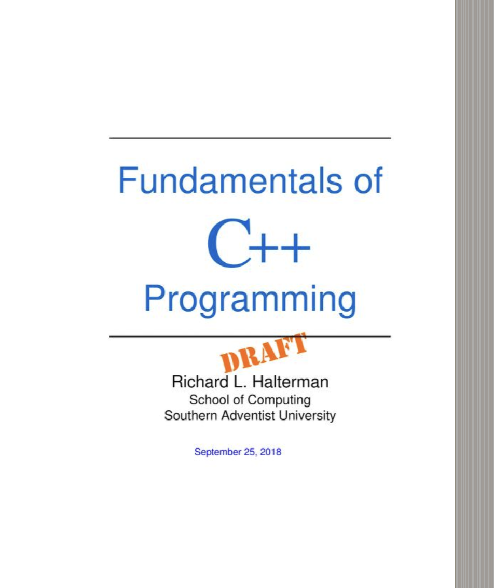{width="100%" fig-alt="TODO: describe image"}
:::
::::

---

# OK, let’s get started

---

## What is Computational Physics?

{width="70%" fig-alt="TODO: describe image"}

---

## What is Computational Physics?

{width="70%" fig-alt="TODO: describe image"}

- BORING

---

## What is Computational Physics?

:::: {.columns}
::: {.column width="55%"}
- As physicists, we create models to describe nature, and test the models against experimental data.
- In real life, most mathematical models are not analytically solvable. You might have an intractable differential equation (analytically speaking), or you might need to fit a billion data points. Computers to the rescue!
- Modern computers are super powerful tools to bridge the divide between physical models and our experiments.
- This lets us do amazing things, like simulate the whole universe!
  - [https://www.youtube.com/watch?v=yyfpFfWq7Bc](https://www.youtube.com/watch?v=yyfpFfWq7Bc)
- “Millenium simulation”
:::
::: {.column width="45%"}
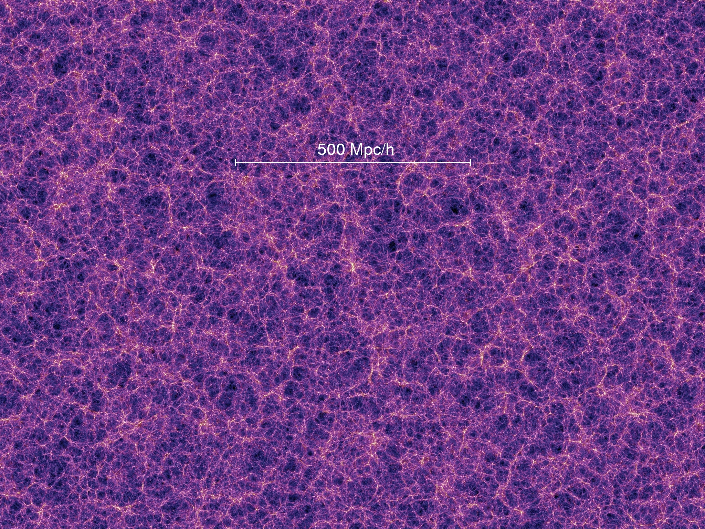{width="100%" fig-alt="TODO: describe image"}
:::
::::

---

## What is Computational Physics?

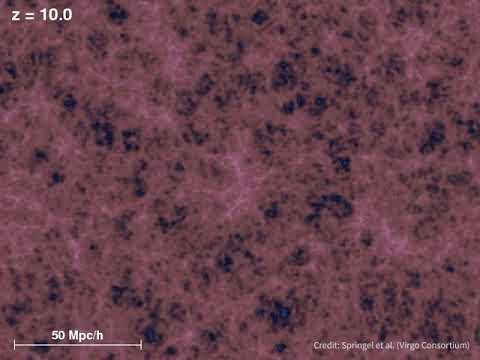{width="70%" fig-alt="TODO: describe image"}

---

## A day in the life of a computational physicist

- Understand physics
  - Document!
- Write down algorithm
  - Document!
- Implement algorithm
  - Document!
- Test algorithm
  - Document!
- Publish!
  - Maybe your code, too!

---

## Workflow

- Write the algorithm down on paper
- If you don’t understand everything : goto step 1
  - else : continue
- Write pseudocode
- If you don’t understand everything : goto step 3
  - else : continue
- Write code
- Check code with unit tests
  - Check “pass” criterion
  - Check “fail” criterion
  - If unit test fails : goto Step 5
- Publish!

---

## Development cycle

<!-- TODO: complex slide layout (flagged by detect_complex_slide.py - see run log). Content below is complete but UNARRANGED - needs manual layout to match the original slide. -->

- Write the algorithm down on paper
- If you don’t understand everything : goto step 1
  - else : continue
- Write pseudocode
- If you don’t understand everything : goto step 3
  - else : continue
- Write code
- Check code with unit tests
  - Check “pass” criterion
  - Check “fail” criterion
  - If unit test fails : goto Step 5
- Publish!

- Example: compute the angle $ \theta $between two vectors

- $$\mathop{A}\limits^{⃗}=({x}_{0},{y}_{0})$$
- $$\mathop{B}\limits^{⃗}=({x}_{1},{y}_{1})$$

---

## Development cycle

<!-- TODO: complex slide layout (flagged by detect_complex_slide.py - see run log). Content below is complete but UNARRANGED - needs manual layout to match the original slide. -->

- Write the algorithm down on paper
- If you don’t understand everything : goto step 1
  - else : continue
- Write pseudocode
- If you don’t understand everything : goto step 3
  - else : continue
- Write code
- Check code with unit tests
  - Check “pass” criterion
  - Check “fail” criterion
  - If unit test fails : goto Step 5
- Publish!

- A dot B = |A||B| cos(theta)
- theta = arccos(A dot B / (|A||B|)

- $$\mathop{A}\limits^{⃗}=({x}_{0},{y}_{0})$$
- $$\mathop{B}\limits^{⃗}=({x}_{1},{y}_{1})$$

---

## Development cycle

<!-- TODO: complex slide layout (flagged by detect_complex_slide.py - see run log). Content below is complete but UNARRANGED - needs manual layout to match the original slide. -->

- Write the algorithm down on paper
- If you don’t understand everything : goto step 1
  - else : continue
- Write pseudocode
- If you don’t understand everything : goto step 3
  - else : continue
- Write code
- Check code with unit tests
  - Check “pass” criterion
  - Check “fail” criterion
  - If unit test fails : goto Step 5
- Publish!

- A dot B = |A||B| cos(theta)
- theta = arccos(A dot B / (|A||B|)

- $$\mathop{A}\limits^{⃗}=({x}_{0},{y}_{0})$$
- $$\mathop{B}\limits^{⃗}=({x}_{1},{y}_{1})$$

---

## Development cycle

<!-- TODO: complex slide layout (flagged by detect_complex_slide.py - see run log). Content below is complete but UNARRANGED - needs manual layout to match the original slide. -->

- Write the algorithm down on paper
- If you don’t understand everything : goto step 1
  - else : continue
- Write pseudocode
- If you don’t understand everything : goto step 3
  - else : continue
- Write code
- Check code with unit tests
  - Check “pass” criterion
  - Check “fail” criterion
  - If unit test fails : goto Step 5
- Publish!

- A dot B = |A||B| cos(theta)
- theta = arccos(A dot B / (|A||B|)

- $$\mathop{A}\limits^{⃗}=({x}_{0},{y}_{0})$$
- $$\mathop{B}\limits^{⃗}=({x}_{1},{y}_{1})$$

---

## Development cycle

<!-- TODO: complex slide layout (flagged by detect_complex_slide.py - see run log). Content below is complete but UNARRANGED - needs manual layout to match the original slide. -->

- Write the algorithm down on paper
- If you don’t understand everything : goto step 1
  - else : continue
- Write pseudocode
- If you don’t understand everything : goto step 3
  - else : continue
- Write code
- Check code with unit tests
  - Check “pass” criterion
  - Check “fail” criterion
  - If unit test fails : goto Step 5
- Publish!

- function theta
- Inputs: [(x0, y0), (x1, y1)]
- AdotB = x0 * x1 + y0 * y1
- absA = sqrt(x0^2 + y0^2)
- absB = sqrt(x1^1 + y1^2)
- theta = arccos(AdotB / absA * absB)

- $$\mathop{A}\limits^{⃗}=({x}_{0},{y}_{0})$$
- $$\mathop{B}\limits^{⃗}=({x}_{1},{y}_{1})$$

---

## Development cycle

<!-- TODO: complex slide layout (flagged by detect_complex_slide.py - see run log). Content below is complete but UNARRANGED - needs manual layout to match the original slide. -->

- Write the algorithm down on paper
- If you don’t understand everything : goto step 1
  - else : continue
- Write pseudocode
- If you don’t understand everything : goto step 3
  - else : continue
- Write code
- Check code with unit tests
  - Check “pass” criterion
  - Check “fail” criterion
  - If unit test fails : goto Step 5
- Publish!

- function theta
- Inputs: [(x0, y0), (x1, y1)]
- AdotB = x0 * x1 + y0 * y1
- absA = sqrt(x0^2 + y0^2)
- absB = sqrt(x1^1 + y1^2)
- theta = arccos(AdotB / absA * absB)

- $$\mathop{A}\limits^{⃗}=({x}_{0},{y}_{0})$$
- $$\mathop{B}\limits^{⃗}=({x}_{1},{y}_{1})$$
- Wait… we want a *signed* angle (e.g. clockwise)

---

## Development cycle

<!-- TODO: complex slide layout (flagged by detect_complex_slide.py - see run log). Content below is complete but UNARRANGED - needs manual layout to match the original slide. -->

- Write the algorithm down on paper
- If you don’t understand everything : goto step 1
  - else : continue
- Write pseudocode
- If you don’t understand everything : goto step 3
  - else : continue
- Write code
- Check code with unit tests
  - Check “pass” criterion
  - Check “fail” criterion
  - If unit test fails : goto Step 5
- Publish!

- function theta
- Inputs: [(x0, y0), (x1, y1)]
- AdotB = x0 * x1 + y0 * y1
- absA = sqrt(x0^2 + y0^2)
- absB = sqrt(x1^1 + y1^2)
- theta = arccos(AdotB / absA * absB)
- AcrossB = x0 * y1 - x1 * y0
- if AcrossB < 0:
  - theta *= -1

- $$\mathop{A}\limits^{⃗}=({x}_{0},{y}_{0})$$
- $$\mathop{B}\limits^{⃗}=({x}_{1},{y}_{1})$$

---

## Development cycle

<!-- TODO: complex slide layout (flagged by detect_complex_slide.py - see run log). Content below is complete but UNARRANGED - needs manual layout to match the original slide. -->

- Write the algorithm down on paper
- If you don’t understand everything : goto step 1
  - else : continue
- Write pseudocode
- If you don’t understand everything : goto step 3
  - else : continue
- Write code
- Check code with unit tests
  - Check “pass” criterion
  - Check “fail” criterion
  - If unit test fails : goto Step 5
- Publish!

- function theta
- Inputs: [(x0, y0), (x1, y1)]
- AdotB = x0 * x1 + y0 * y1
- absA = sqrt(x0^2 + y0^2)
- absB = sqrt(x1^1 + y1^2)
- theta = arccos(AdotB / absA * absB)
- AcrossB = x0 * y1 - x1 * y0
- if AcrossB < 0:
  - theta *= -1

- $$\mathop{A}\limits^{⃗}=({x}_{0},{y}_{0})$$
- $$\mathop{B}\limits^{⃗}=({x}_{1},{y}_{1})$$

---

## Development cycle

<!-- TODO: complex slide layout (flagged by detect_complex_slide.py - see run log). Content below is complete but UNARRANGED - needs manual layout to match the original slide. -->

- Write the algorithm down on paper
- If you don’t understand everything : goto step 1
  - else : continue
- Write pseudocode
- If you don’t understand everything : goto step 3
  - else : continue
- Write code
- Check code with unit tests
  - Check “pass” criterion
  - Check “fail” criterion
  - If unit test fails : goto Step 5
- Publish!

- import math
- def theta(x0, y0, x1, y1):
  - absA = math.sqrt(x0**2 + y0**2)
  - absB = math.sqrt(x1**2 + y1**2)
  - AdotB = x0 * x1 + y0 * y1
  - AcrossB = x0 * y1 - x1 * y0
  - theta = math.acos(AdotB / (absA * absB))
  - if AcrossB < 0:
    - theta *= -1
  - return theta

- $$\mathop{A}\limits^{⃗}=({x}_{0},{y}_{0})$$
- $$\mathop{B}\limits^{⃗}=({x}_{1},{y}_{1})$$

---

## Development cycle

<!-- TODO: complex slide layout (flagged by detect_complex_slide.py - see run log). Content below is complete but UNARRANGED - needs manual layout to match the original slide. -->

- Write the algorithm down on paper
- If you don’t understand everything : goto step 1
  - else : continue
- Write pseudocode
- If you don’t understand everything : goto step 3
  - else : continue
- Write code
- Check code with unit tests
  - Check “pass” criterion
  - Check “fail” criterion
  - If unit test fails : goto Step 5
- Publish!

- >> theta((1, 0), (0, 1))
- 1.5707963267948966

- $$\mathop{A}\limits^{⃗}=(1,0)$$

- $$\mathop{B}\limits^{⃗}=(0,1)$$

- ✅

---

## Development cycle

<!-- TODO: complex slide layout (flagged by detect_complex_slide.py - see run log). Content below is complete but UNARRANGED - needs manual layout to match the original slide. -->

- Write the algorithm down on paper
- If you don’t understand everything : goto step 1
  - else : continue
- Write pseudocode
- If you don’t understand everything : goto step 3
  - else : continue
- Write code
- Check code with unit tests
  - Check “pass” criterion
  - Check “fail” criterion
  - If unit test fails : goto Step 5
- Publish!

- >> theta((1, 0), (0, 1))
- 1.5707963267948966
- >> theta((0, 1), (2, 0))
- -1.5707963267948966

- $$\mathop{B}\limits^{⃗}=(2,0)$$

- $$\mathop{A}\limits^{⃗}=(0,1)$$

- ✅

- ✅

---

## Development cycle

<!-- TODO: complex slide layout (flagged by detect_complex_slide.py - see run log). Content below is complete but UNARRANGED - needs manual layout to match the original slide. -->

- Write the algorithm down on paper
- If you don’t understand everything : goto step 1
  - else : continue
- Write pseudocode
- If you don’t understand everything : goto step 3
  - else : continue
- Write code
- Check code with unit tests
  - Check “pass” criterion
  - Check “fail” criterion
  - If unit test fails : goto Step 5
- Publish!

- >>> theta(0., 0., 1., 0.)
- Traceback (most recent call last):
- File "<stdin>", line 1, in <module>
- File "<stdin>", line 6, in theta
- ZeroDivisionError: float division by zero

- $$\mathop{A}\limits^{⃗}=(0,0)$$

- $$\mathop{B}\limits^{⃗}=(1,0)$$

---

## Development cycle

<!-- TODO: complex slide layout (flagged by detect_complex_slide.py - see run log). Content below is complete but UNARRANGED - needs manual layout to match the original slide. -->

- Write the algorithm down on paper
- If you don’t understand everything : goto step 1
  - else : continue
- Write pseudocode
- If you don’t understand everything : goto step 3
  - else : continue
- Write code
- Check code with unit tests
  - Check “pass” criterion
  - Check “fail” criterion
  - If unit test fails : goto Step 5
- Publish!

- $$\mathop{A}\limits^{⃗}=({x}_{0},{y}_{0})$$
- $$\mathop{B}\limits^{⃗}=({x}_{1},{y}_{1})$$
- import math
- def theta(x0, y0, x1, y1):
  - absA = math.sqrt(x0**2 + y0**2)
  - absB = math.sqrt(x1**2 + y1**2)
  - AdotB = x0 * x1 + y0 * y1
  - AcrossB = x0 * y1 - x1 * y0
  - if absA == 0 or absB == 0:
    - print(“Zero vector”)
    - return -999
  - theta = math.acos(AdotB / (absA * absB))
  - if AcrossB < 0:
    - theta *= -1
  - return theta

- Avoid error condition?

---

## Development cycle

<!-- TODO: complex slide layout (flagged by detect_complex_slide.py - see run log). Content below is complete but UNARRANGED - needs manual layout to match the original slide. -->

- Write the algorithm down on paper
- If you don’t understand everything : goto step 1
  - else : continue
- Write pseudocode
- If you don’t understand everything : goto step 3
  - else : continue
- Write code
- Check code with unit tests
  - Check “pass” criterion
  - Check “fail” criterion
  - If unit test fails : goto Step 5
- Publish!

- $$\mathop{A}\limits^{⃗}=({x}_{0},{y}_{0})$$
- $$\mathop{B}\limits^{⃗}=({x}_{1},{y}_{1})$$
- import math
- def theta(x0, y0, x1, y1):
  - absA = math.sqrt(x0**2 + y0**2)
  - absB = math.sqrt(x1**2 + y1**2)
  - AdotB = x0 * x1 + y0 * y1
  - AcrossB = x0 * y1 - x1 * y0
  - if absA == 0 or absB == 0:
    - print(“[theta] WARNING : Zero vector, returning None”)
    - return None
  - theta = math.acos(AdotB / (absA * absB))
  - if AcrossB < 0:
    - theta *= -1
  - return theta

- Return null?

---

## Development cycle

<!-- TODO: complex slide layout (flagged by detect_complex_slide.py - see run log). Content below is complete but UNARRANGED - needs manual layout to match the original slide. -->

- Write the algorithm down on paper
- If you don’t understand everything : goto step 1
  - else : continue
- Write pseudocode
- If you don’t understand everything : goto step 3
  - else : continue
- Write code
- Check code with unit tests
  - Check “pass” criterion
  - Check “fail” criterion
  - If unit test fails : goto Step 5
- Publish!

- $$\mathop{A}\limits^{⃗}=({x}_{0},{y}_{0})$$
- $$\mathop{B}\limits^{⃗}=({x}_{1},{y}_{1})$$
  - import unittest
  - class TestTheta(unittest.TestCase):
    - def test1(self):
      - self.assertEqual(theta(1., 0., 0., 1.), math.pi/2.)
    - def test_2(self):
      - with self.assertRaises(ZeroDivisionError):
        - theta(0., 0., 0., 1.)
    - def test_3(self):
      - with self.assertRaises(TypeError):
        - theta(0., 0., “apples”, “oranges”)
  - if __name__ == '__main__':
  - unittest.main()

- Fail cleanly and use exceptions!

---

## Development cycle

<!-- TODO: complex slide layout (flagged by detect_complex_slide.py - see run log). Content below is complete but UNARRANGED - needs manual layout to match the original slide. -->

- Write the algorithm down on paper
- If you don’t understand everything : goto step 1
  - else : continue
- Write pseudocode
- If you don’t understand everything : goto step 3
  - else : continue
- Write code
- Check code with unit tests
  - Check “pass” criterion
  - Check “fail” criterion
  - If unit test fails : goto Step 5
- Publish!

- $$\mathop{A}\limits^{⃗}=({x}_{0},{y}_{0})$$
- $$\mathop{B}\limits^{⃗}=({x}_{1},{y}_{1})$$
- >>> unittest.main()
- ...
- ----------------------------------------------------------------------
- Ran 3 tests in 0.000s
- OK

- Fail cleanly and use exceptions!

---

## Development cycle

:::: {.columns}
::: {.column width="55%"}
- Write the algorithm down on paper
- If you don’t understand everything : goto step 1
  - else : continue
- Write pseudocode
- If you don’t understand everything : goto step 3
  - else : continue
- Write code
- Check code with unit tests
  - Check “pass” criterion
  - Check “fail” criterion
  - If unit test fails : goto Step 5
- Publish!
:::
::: {.column width="45%"}
{width="100%" fig-alt="TODO: describe image"}
:::
::::

---

## Development cycle

- Write the algorithm down on paper
- If you don’t understand everything : goto step 1
  - else : continue
- Write pseudocode
- If you don’t understand everything : goto step 3
  - else : continue
- Write code
- Check code with unit tests
  - Check “pass” criterion
  - Check “fail” criterion
  - If unit test fails : goto Step 5
- Publish!

- # Push to GitHub main branch
- git add theta.py
- git commit -m “Add theta function”
- git push origin HEAD:main
- # Tag a stable release
- git tag -a v1.0 -m “First stable version”
- git push origin v1.0

---

## A few take-home messages

- A few “take-home” messages :
  - Machines do not understand infinite precision
    - We’ll get to that
  - Machines do exactly what we ask them to
    - We’ll get to that too
  - Thinking ahead can save you a lot of time!
- We’ve seen the power of python
  - Looks almost like pseudocode (which you should be writing anyway)
  - Good as a first stab at something
  - But, 10–100x slower than compiled code!

---

## Development

<!-- TODO: complex slide layout (flagged by detect_complex_slide.py - see run log). Content below is complete but UNARRANGED - needs manual layout to match the original slide. -->

- To make it faster, let’s translate to C++:

- import math
- def theta(x0, y0, x1, y1):
- absA = math.sqrt(x0**2 + y0**2)
- absB = math.sqrt(x1**2 + y1**2)
- AdotB = x0 * x1 + y0 * y1
- AcrossB = x0 * y1 - x1 * y0
- theta = math.acos(AdotB / (absA * absB))
- if AcrossB < 0:
- theta *= -1
- return theta
- if __name__ == “__main__”:
- print(f”theta((1, 0), (0, 1)) = {theta(1, 0, 0, 1)}”)
- print(f”theta((0, 1), (2, 0)) = {theta(0, 1, 2, 0)}”)
- print(f”theta((0, 0), (0, 1)) = {theta(0, 0, 0, 1)}”)

- #include <iostream>
- #include <math.h>
- float theta( float x0, float y0, float x1, float y1) {
- float absA = sqrt(pow(x0, 2) + pow(y0, 2));
- float absB = sqrt(pow(x1, 2) + pow(y1, 2));
- float AdotB = x0 * x1 + y0 * y1;
  float AcrossB = x0 * y1 - x1 * y0;
- theta = acos(AdotB / (absA * absB));
- if (AcrossB < 0) {
- theta = theta * -1;
- }
- return theta;
- }

- theta.h

- theta.py

- #include “theta.h”
- #include <iostream>
- int main() {
- std::cout << “theta((1, 0), (0, 1)) = “ << theta(1, 0, 0, 1) << std::endl;
- std::cout << “theta((0, 1), (2, 0)) = “ << theta(0, 1, 2, 0) << std::endl;
- std::cout << “theta((0, 0), (0, 1)) = “ << theta(0, 0, 0, 1) << std::endl;
- }

- main.cpp

- dryu@cast-dyu23ml theta_ex % g++ theta.h main.cpp
- clang++: warning: treating 'c-header' input as 'c++-header' when in C++ mode, this behavior is deprecated [-Wdeprecated]
- dryu@cast-dyu23ml theta_ex % ./a.out
- theta((1, 0), (0, 1)) = 1.5708
- theta((0, 1), (2, 0)) = -1.5708
- theta((0, 0), (0, 1)) = nan

- terminal

- dryu@cast-dyu23ml theta_ex % python3 theta.py
- theta((1, 0), (0, 1)) = 1.5707963267948966
- theta((0, 1), (2, 0)) = -1.5707963267948966
- Traceback (most recent call last):
- File "/Users/dryu/Documents/Buffalo/PHYS410/test/theta_ex/theta.py", line 15, in <module>
- print(f"theta((0, 0), (0, 1)) = {theta(0, 0, 0, 1)}")
- File "/Users/dryu/Documents/Buffalo/PHYS410/test/theta_ex/theta.py", line 7, in theta
- theta = math.acos(AdotB / (absA * absB))
- ZeroDivisionError: float division by zero

- terminal

---

## Summary

- By the end of the course, you will know (kind of) (aka, things to write on your CV):
  - Python (programming, unit test)
  - C++ (programming, at least understand other people’s code)
  - How to debug both!
  - Markdown (pandoc, Latex) (documentation)
  - Terminal (just to make life less miserable)
  - Docker (just to make life less miserable)
  - Git / GitHub (documentation, collaboration)
  - Numerical recipes for data science (Yeah science!)
  - How to work together on a (scientific) software project
  - Machine learning aka AI
  - “The first time I used a Quantum Computer”

---

## Let’s get started!

- Hopefully this whets your appetite.
- On Wednesday, we will dive right into computing and software requirements!
- Things you can do beforehand (or right now):
  - Join the Slack: [Join link](https://join.slack.com/t/ubcompphys2025/shared_invite/zt-3bww1vf37-PAnIHvGMft42fmmrtS6YqA)
  - Windows users: install WSL2 (or cygwin if already familiar, but less support) with Ubuntu
    - Recommend following [https://learn.microsoft.com/en-us/windows/wsl/install](https://learn.microsoft.com/en-us/windows/wsl/install), but you can also download from the Microsoft store
  - Install Docker: [https://docs.docker.com/desktop](https://docs.docker.com/desktop)
    - WSL: recommend installing inside WSL using command line
  - Make a GitHub account
    - Choose your username wisely, it might stay with you for your whole career!
  - Download the code:
- git clone git@github.com:ubsuny/CompPhys.git -b fall2025
- docker pull ubsuny/compphys:latest

---

# Linux overview

---

## Technical lectures

- We will have several technical lectures to get you up to speed with programming and technical skills
- Using UNIX/LINUX command line
- Compiling, version control
- Data representations, flow of control, object oriented programming, simple algorithms

- Announcement: some of you noticed the Slack join link was incorrect! Here’s the correct link:
- [https://join.slack.com/t/ubcompphys2025/shared_invite/zt-3bww1vf37-PAnIHvGMft42fmmrtS6YqA](https://join.slack.com/t/ubcompphys2025/shared_invite/zt-3bww1vf37-PAnIHvGMft42fmmrtS6YqA)

---

## Goals for today

- Setup a working terminal environment (Windows users: install WSL2 with Ubuntu)
- Install Docker and download the “ubsuny/compphys:latest” container.
- Use git to clone our software repository: [github.com/ubsuny/CompPhys](http://github.com/ubsuny/CompPhys) .
- Launch the container using the script runDocker.sh in the repository.
- With the container up and running go over Linux basics.

---

## Coding environment

<!-- TODO: complex slide layout (flagged by detect_complex_slide.py - see run log). Content below is complete but UNARRANGED - needs manual layout to match the original slide. -->

- Choose your character: Mac, Linux, Windows
- You’ll need to download two main things for this class:

{fig-alt="TODO"}

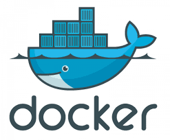{fig-alt="TODO"}

- Our “official” environment for this class is a Docker container:
  - Install docker: [https://www.docker.com/get-started/](https://www.docker.com/get-started/)
  - Our container: [https://hub.docker.com/r/ubsuny/compphys](https://hub.docker.com/r/ubsuny/compphys)

- Our software repository: [https://github.com/ubsuny/CompPhys/tree/fall2025](https://github.com/ubsuny/CompPhys/tree/fall2025)

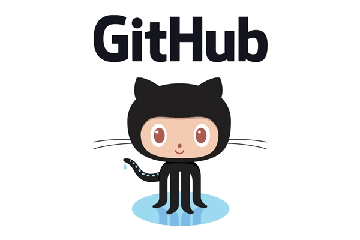{fig-alt="TODO"}

- Note: if you are already fluent in Unix/code management and want to roll your own setup/environment, Docker is not mandatory. I will help on a best-effort basis.
- You should learn the basics, though!

---

## What is Docker?

- Docker: easy distribution of software in self-contained packages called “containers”, using OS-level virtualization.
  - You might have heard of “virtual machines”. Docker is similar, but for applications rather than whole systems.
- Containers share host’s kernel: lightweight and fast.
- Docker is not the only player in the game. High performance computing (e.g. CERN) uses apptainer (formerly singularity). Luckily, the two are quite compatible!

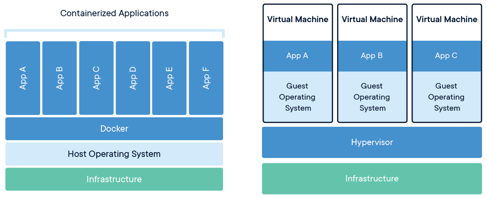{width="70%" fig-alt="TODO: describe image"}

---

## Why Docker?

- Whether using MacOS, WSL, and Linux, you already have a terminal. So why bother?
  - For this class, Docker provides everyone with an identical Ubuntu environment with pre-installed software.
  - You don’t have to spend time installing and configuring software. It “just works.”
  - Aside from this class, containers are used extensively in science and industry:
    - Super easy software distribution.
    - Reproducible environment.
    - Rapid deployment to e.g. clusters
    - Fun example: [Immich](https://immich.app/)

- Some downsides
  - Containers are “transient.” When you terminate a container, most of the contents are erased.
    - Except for dedicated storage locations specified when you create the container.
    - For example, if you install software in /usr/bin, it gets deleted with the container. Also, your bash history is not saved.
  - Additional complications for networking.
  - Minor performance decrease.
- How do we keep this all straight?
  - Edit files on the host system.
  - Only use the container to run stuff.

---

## Docker concepts

<!-- TODO: complex slide layout (flagged by detect_complex_slide.py - see run log). Content below is complete but UNARRANGED - needs manual layout to match the original slide. -->

- Image: read-only templates that contain a set of instructions for creating a container.
  - Docker images contain “layers”: files containing dependencies and application code to create+configure the container environment.
- Container: a runtime instance of an image.
  - In other words, an image with a state.
- Dockerfile: text file with all the instructions for an image.
- DockerHub: a website for storing Docker images, very similar to GitHub

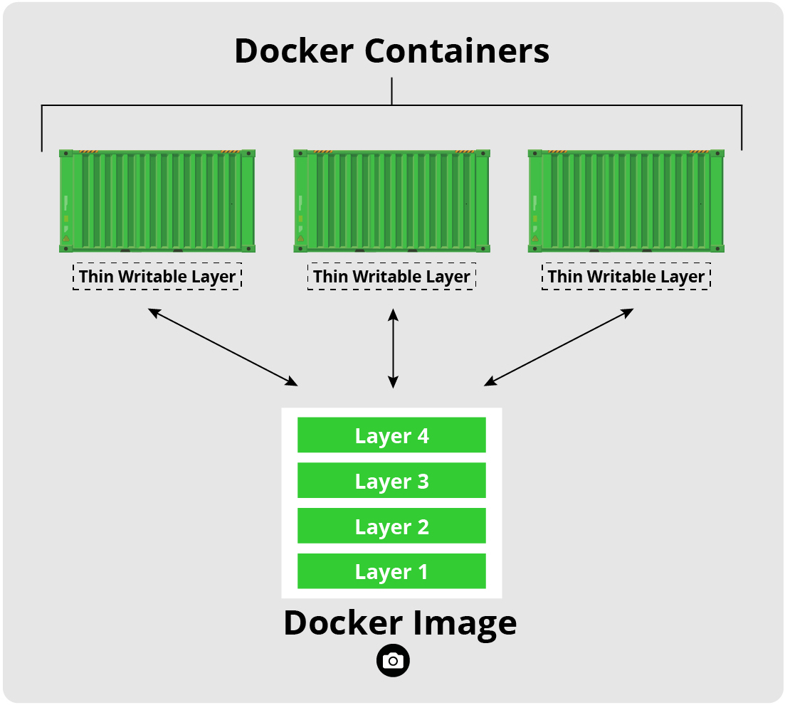{fig-alt="TODO"}

- Base Ubuntu

- apt-get install g++, python, etc.

- pip install python packages

- create user `compphys`

---

## Alternatives

- If you are already an expert: try out Docker now to learn the basics, use your preferred environment for the assignments.
  - Advanced users: try building the docker container. See the README.md in CompPhys/Docker
- If your computer can’t run Docker: try out Github Codespaces: [https://github.com/features/codespaces](https://github.com/features/codespaces)
  - It’s basically a container on GitHub’s servers, accessible through your browser.
  - Code editors, Jupyter, command line, …
  - Free plan: 60h per month (2h per day), 15 GB storage.
- We can also try to get a server at UB CCR.

---

## Hands-on

- Let’s spend a few minutes getting started
- Goals: install Docker; clone git repo; launch our Docker container

- Install Docker
- 0. Windows users: install WSL2 following [https://learn.microsoft.com/en-us/windows/wsl/install](https://learn.microsoft.com/en-us/windows/wsl/install). Everyone: open a terminal.
- Install Docker following [https://docs.docker.com/get-started/get-docker/](https://docs.docker.com/get-started/get-docker/)
- Test it out by running:
- docker run hello-world

- Clone git repo
- Create a [github.com](http://github.com) account
- Setup SSH keys so you can access [GitHub.com](http://GitHub.com) from the command line, following [https://docs.github.com/en/authentication/connecting-to-github-with-ssh/generating-a-new-ssh-key-and-adding-it-to-the-ssh-agent](https://docs.github.com/en/authentication/connecting-to-github-with-ssh/generating-a-new-ssh-key-and-adding-it-to-the-ssh-agent)
- Inside your 410/505 folder, run:
- git clone git@github.com:ubsuny/CompPhys.git -b fall2025
- 4. Sign up for Github Education: [https://education.github.com/students](https://education.github.com/students)

- Launch container
- Pull the CompPhys container from DockerHub using:
- docker pull ubsuny/compphys:latest
- 2. Launch the Docker container using the script provided in the repo:
- ./runDocker.sh ubsuny/compphys:latest

---

## Hands-on

- dryu@cast-dyu23ml CompPhys % ./runDocker.sh ubsuny/compphys:latest
- 192.168.0.195 being added to access control list
- docker run --rm -it -e DISPLAY=/private/tmp/com.apple.launchd.Y3PHRcRc6z/org.xquartz:0 -v /tmp/.X11-unix:/tmp/.X11-unix -v /Users/dryu/Documents/Buffalo/PHYS410/CompPhys:/home/compphys/CompPhys -w /home/compphys -p 8888:8888 ubsuny/compphys:latest /bin/bash
- compphys@639a41db8362:~$

- If you successfully ran everything, you should arrive at a command line prompt that looks like this.
- You now have an Ubuntu bash shell running on top of your computer’s base OS!

---

# Unix basics

---

## UNIX/LINUX

:::: {.columns}
::: {.column width="55%"}
- Family of operating systems (like Windows or Mac OS)
  - We will be using LINUX (an offshoot of UNIX)
  - Invented by Linus Torvalds in 1991
  - Our Docker container uses Ubuntu, a popular Linux distribution
  - Mac OS X is built upon LINUX
- EdX course from the creator here :
  - https://www.edx.org/course/introduction-linux-linuxfoundationx-lfs101x-0#!
- Linux is completely open source : you can modify it at your will and debuggers are also free
- Predominantly command line tools
- Cheat sheet on UBLearns
:::
::: {.column width="45%"}
{width="100%" fig-alt="TODO: describe image"}
:::
::::

---

## Linux shells, aka terminals

:::: {.columns}
::: {.column width="55%"}
- We will be using an interface to Linux called a “shell”
- It is a command-line interpreter: you type, it executes
- A few popular options:
  - “bash” (as in, smash), “zsh” (MacOS default, similar to bash) and “csh” (like “sea shell”, modern version is “tcsh”, “tea sea shell”)
- For the most part, few differences with respect to this class, you can use either one.
- Major difference : environment variables syntax
  - zsh/bash: export X=value, tcsh: setenv X value
  - zsh is more POSIX-friendly (set of standards)
  - That’s about it for the purposes of this class
:::
::: {.column width="45%"}
{width="100%" fig-alt="TODO: describe image"}
:::
::::

---

## Basic commands: file system

- ls
  - Prints contents of current directory (“ls” like “list”)
- compphys@639a41db8362:~$ ls
- CompPhys
- pwd
  - Print current directory
- compphys@639a41db8362:~$ pwd
- /home/compphys

- mkdir
  - Create a new directory (aka folder)
- compphys@639a41db8362:~$ mkdir testfolder
- compphys@639a41db8362:~$ ls
- CompPhys  testfolder
- cd
  - Move to a new directory
- compphys@639a41db8362:~$ cd testfolder/
- compphys@639a41db8362:~/testfolder$ pwd
- /home/compphys/testfolder

---

## Basic commands: interacting with files

- less
  - Text file viewer (pun on “less is more”)
- compphys:~$ less CompPhys/README.md
- Computational Physics
- ======
- Software for UB's Computational Physics class…
- cat
  - One file: print contents. Multiple files: print all files sequentially (“concatenate”)
- compphys:~$ cat  CompPhys/README.md
- Computational Physics…
- cp
  - Copy a file
- compphys:~$ cp CompPhys/README.md testfolder
- compphys:~$ ls testfolder
- README.md

- mv
  - Move a file
- compphys:~$ mv testfolder/README.md testfolder/README_moved.md
- touch
  - Create an empty file, or update the “last modified” date of an existing file
- compphys:~$ touch testfolder/newemptyfile.txt
- ln
  - Create (soft) links aka shortcuts
- compphys:~$ ln -s target shortcutname

---

## Basic commands: deleting files

- rm
  - Delete a file
  - BE VERY CAREFUL! No trash can or recycle bin, files are gone immediately and forever!!
- compphys@639a41db8362:~$ rm testfolder/README_moved.md
  - To delete a folder, do “rm -r somefolder”
  - In the container, I actually redefined “rm” to “rm -i”, which asks you to confirm deletions.
  - If you are **sure**, “rm -f” will restore the default behavior of immediately deleting.

---

## Pro tips

- What if I hate typing files one at a time?
  - Then Linux is the best operating system for you!
- Huge number of shortcuts in LINUX :
  - tab completion : If you start typing and press “TAB”, it will list the possible completions, or if there is only one, complete it for you! USE THIS for long file names
- “up” key: scroll through previously executed commands
- “cd” special arguments:
  - “cd” returns to home directory
  - “cd ..” goes up one directory
  - “cd -“ goes to previous directory you were in
- aliases : can define your own shortcuts
  - Example: I defined an alias for you in the container,
  - alias ll=‘ls -lrth’
- wildcards!
  - compphys@fed9071469a4:~$ ls /opt/venv/bin/python*
  - /opt/venv/bin/python  /opt/venv/bin/python3  /opt/venv/bin/python3.12

---

## More advanced commands

- grep
  - Search for text in files
  - grep -R “import” ./*py
- file
  - Search by filename
  - find /path/to/search -name "filename"
- sed
  - Search-and-replace in files (be very careful, test it before running the real thing)
- awk
  - Search and perform operations on text files (I use python for this…)
- Piping
  - “|” (pipe, above your return key) chains commands together, passing output to the next step:
  - grep -R “import” ./*py | less
- top
  - Activity monitor, shows running processes
  - Kill a stuck process: hit “k” then type process ID
  - top -u dryu

---

## Command line options (or flags)

- Most commands accept additional optional arguments (or flags)
  - ls -lrth
  - -l: print “long form” information
  - -t: sort by last modified timestamp
  - -r: reverse sort order
  - -h: human-readable file sizes (1.0M instead of 1038349)
- Most commands have documentation: “man ls” or “ls --help"

---

## Command line options (or flags)

- What about that long Docker command?
  - --rm: delete the container upon exit (you might not want this; more on lifecycle management in a bit)
  - -it: create an interactive container with a command line prompt (instead of running in the background or executing a single command)
  - -e: set environment variables (here, DISPLAY is needed to launch windows from the container)
  - -v HOSTDIR:CONTAINERDIR :  bind-mount a folder on your host system to the specified directory inside the container (very important!!)
  - -w: starting directory inside container
  - -p: Publish a container's port(s) to the host (needed to run a Jupyter server, more on this later). I.e., allow communication in/out of the container using this port
  - Finally, the container name, and the command to be “run” inside the container (/bin/bash just starts an interactive bash session).

  - docker run \
  - --rm \
  - -it\
  - -e DISPLAY=/private/tmp/com.apple.launchd.Y3PHRcRc6z/org.xquartz:0 \
  - -v /tmp/.X11-unix:/tmp/.X11-unix \
  - -v /Users/dryu/Documents/Buffalo/PHYS410/CompPhys:/home/compphys/CompPhys \
  - -w /home/compphys \
  - -p 8888:8888 \
  - ubsuny/compphys:latest /bin/bash

---

## Anatomy of an ls -l

- What the heck is this stuff?
- compphys@fed9071469a4:~/CompPhys/LinuxOverview$ ls -l
- -rw-r--r-- 1 compphys compphys 1322 Aug  5 17:58 awk_example.md

---

## Anatomy of an ls -l

:::: {.columns}
::: {.column width="55%"}
- What the heck is this stuff?
- compphys@fed9071469a4:~/CompPhys/LinuxOverview$ ls -l
- -rw-r--r-- 1 compphys compphys 1322 Aug  5 17:58 awk_example.md
- Filename
:::
::: {.column width="45%"}
{width="100%" fig-alt="TODO: describe image"}
:::
::::

---

## Anatomy of an ls -l

<!-- TODO: complex slide layout (flagged by detect_complex_slide.py - see run log). Content below is complete but UNARRANGED - needs manual layout to match the original slide. -->

- What the heck is this stuff?
- compphys@fed9071469a4:~/CompPhys/LinuxOverview$ ls -l
- -rw-r--r-- 1 compphys compphys 1322 Aug  5 17:58 awk_example.md

- Last modified date

{fig-alt="TODO"}

- Filename

---

## Anatomy of an ls -l

<!-- TODO: complex slide layout (flagged by detect_complex_slide.py - see run log). Content below is complete but UNARRANGED - needs manual layout to match the original slide. -->

- What the heck is this stuff?
- compphys@fed9071469a4:~/CompPhys/LinuxOverview$ ls -l
- -rw-r--r-- 1 compphys compphys 1322 Aug  5 17:58 awk_example.md

- Last modified date

{fig-alt="TODO"}

- Filename

- Size

---

## Anatomy of an ls -l

<!-- TODO: complex slide layout (flagged by detect_complex_slide.py - see run log). Content below is complete but UNARRANGED - needs manual layout to match the original slide. -->

- What the heck is this stuff?
- compphys@fed9071469a4:~/CompPhys/LinuxOverview$ ls -l
- -rw-r--r-- 1 compphys compphys 1322 Aug  5 17:58 awk_example.md

- Last modified date

{fig-alt="TODO"}

- Filename

- Size

- File owner and group

---

## Anatomy of an ls -l

<!-- TODO: complex slide layout (flagged by detect_complex_slide.py - see run log). Content below is complete but UNARRANGED - needs manual layout to match the original slide. -->

- What the heck is this stuff?
- compphys@fed9071469a4:~/CompPhys/LinuxOverview$ ls -l
- -rw-r--r-- 1 compphys compphys 1322 Aug  5 17:58 awk_example.md

- Last modified date

{fig-alt="TODO"}

- Filename

- Size

- File owner and group

- Permissions

---

## Permissions

- What are these random letters and dashes?
- -rwxr-xr-x   1 dryu  staff    11K May 15  2024 csub
- Three groups of three:
  - Owner permissions (u)
  - Group permissions (g)
  - Everyone’s permissions (a)
- Inside each group:
  - r=read permission
  - w=write permission
  - x=execute permission (e.g. run program)
  - Dash mean permission is blocked
- Shorthand: represent each group with a number (add up r=4, w=2, x=1). Example: rwxr-xr-x=755
- Most permissive: rwxrwxrwx=777. Dangerous! Anyone has complete access!
- MacOS made this a lot more complicated. Don’t worry about it here.

---

## Permissions

- -rwxr-xr-x   1 dryu  staff    11K May 15  2024 csub
- Security tools:
  - chmod: change permissions. Two main ways:
    - Use shorthand directly: chmod 744 csub
    - Add/remove specific permission:
      - chmod g+w csub, chmod a-rwx csub
  - chown: change owner and/or group.
    - chown joshallen csub

---

## Code editors

- Now we come to one of the greatest scientific controversies of all time:

- THE EDITOR WARS

---

## Code editors

{width="70%" fig-alt="TODO: describe image"}

- http://cube-drone.com/comics/c/holy-war

---

## Code editors

- https://xkcd.com/378/

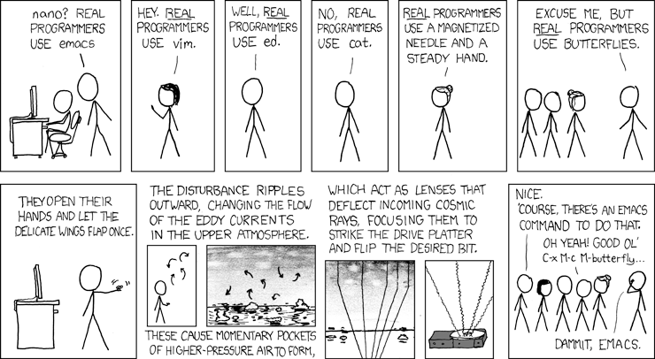{width="70%" fig-alt="TODO: describe image"}

---

## Code editors

- In-terminal editors
  - Nano: most basic.
  - emacs/vim: industry standards.
  - Definitely useful for quick edits; a lot of people use emacs/vim for everything.
  - Critical info: how to quit. Vim: “esc” then :q. Emacs: ctrl-x ctrl-c.
- Graphical editors
  - Visual Studio Code (vscode)
  - Sublime Text (note: paid, though very generous free features).
  - vscode in particular is extremely popular these days, probably most useful in industry. It’s even baked into github.com.
- Use what you’re most comfortable with! …but if you are not sure, use vscode.

---

## Hands-on (or homework)

- Join the Slack and post your github username in #general, so I can add you to the Github Classroom.
- Test out the Docker container:
  - Open *two terminals*, one to the left, one to the right. Let’s use left=container and right=host.
  - Start the container in the left terminal with ./runDocker.sh ubsuny/compphys:latest
  - The CompPhys repository is mounted under /home/compphys/CompPhys. Try making a test file inside:
    - touch /home/compphys/CompPhys/testfile.txt
  - In the right terminal, i.e., on your host system, do ls. Do you see the file?
  - Try making a test file in your home directory, but outside the mounted folder:
    - touch /home/compphys/testfile2.txt
  - Quit the container (ctrl-d or exit). Do you still see testfile.txt? How about testfile2.txt?
- Try making a persistent, named container:
  - Make a new script to launch the container: cp runDocker.sh runDocker_persistent.sh
    - Remove the “--rm" and add “--name compphys-week1”
  - Make a test file in the home directory again: touch /home/compphys/testfile2.txt
  - Type “exit” to quit the container — now, the container is “stopped” but not deleted.
  - Type “docker ps” to view existing containers. compphys-week1 should be there.
  - Restart the container with docker start compphys-week1, then login to it with docker attach compphys-week1”.
  - Is testfile2.txt still there?

---

## Next time

- Next class, we will cover git and then start on C++.
  - Make sure you send me your Github username, as we will start using Github Classroom.

---

## Bonus: building the Docker container

- For advanced users: building the Docker container is actually rather easy.
- First: you should have a Docker account, so you can push images to Dockerhub.
- Then, cd to CompPhys/Docker and run:
  - docker buildx build --push -t your_username/compphys:test --platform linux/amd64,linux/arm64 .
- From “docker image ls” (or from your Docker app GUI), you should now see the image your_username/compphys:test. How big is the image? (It should be around 9GB.)
- Try modifying the Dockerfile and rebuilding. For example, modify the apt-get command to install another package (e.g. emacs or vim). How does the size of the container change?

---

## Bonus: jupyter-lab server

- For the python part of the course, we will use Jupyter notebooks a lot.
- Let’s try it out. Inside your container, cd to the CompPhys folder, then run:
- jupyter-lab --ip 0.0.0.0 —no-browser
- Once the server starts, you should see something like:
- To access the server, open this file in a browser:
- file:///home/compphys/.local/share/jupyter/runtime/jpserver-18-open.html
- Or copy and paste one of these URLs:
- http://34bfa77c31db:8888/lab?token=5d8c6dd67a9aa2214cba0a20a386e33eb1ccedfb42d16300
- http://127.0.0.1:8888/lab?token=5d8c6dd67a9aa2214cba0a20a386e33eb1ccedfb42d16300
- Outside your container, open a web browser and copy and paste the URL. You are now running a jupyter-lab server on your own computer!
  - Note: you might have heard of jupyter notebooks. jupyter-lab is basically the same thing with a nicer website.

---

## GIT

- With thanks to Kevin Pedro (Fermilab)

---

## Git introduction

:::: {.columns}
::: {.column width="55%"}
- Git is a version control system: a tool to manage and track changes in a codebase.
  - [Invented by Linus Torvalds](https://blog.brachiosoft.com/en/posts/git/) for managing the Linux kernel!
- Visualize code development as a graph:
  - Vertical line = branch: a copy of the code created for a specific purpose (main copy; bug fix; specific feature development).
  - Point = commit: some unit of development.
    - With a commit message to document what was done!
  - Arrow = merge: pull changes between branches
    - Merge new features into the main branch.
    - Manage concurrent developments, e.g., feature developer pulls in a hotfix.
- [https://nvie.com/posts/a-successful-git-branching-model/](https://nvie.com/posts/a-successful-git-branching-model/)
:::
::: {.column width="45%"}
{width="100%" fig-alt="TODO: describe image"}
:::
::::

---

## Landscape of VCSes

<!-- TODO: complex slide layout (flagged by detect_complex_slide.py - see run log). Content below is complete but UNARRANGED - needs manual layout to match the original slide. -->

- Git is a distributed VCS.
  - Distributed: Mercurial (Hg), Fossil
  - Centralized: Concurrent version systems (CVS), Subversion (SVN), Perforce (popular in industry)
  - Any of these are infinitely better than copying-and-pasting folder and files on your own computer!
- Github: a server for hosting and managing git repositories.
  - Lots of bells and whistles.
  - It has a [website](https://github.com/), [desktop app](https://desktop.github.com/download/), and [command line tools](https://cli.github.com/).
  - Other options: gitlab (used extensively at CERN), BitBucket, Gitea, …

{fig-alt="TODO"}

{fig-alt="TODO"}

- Centralized

- Distributed

---

## Setup: basics

- I think everyone has installed git and made a Github account
  - If not, try to catch up now.
- Demo: some basic setup
  - ~/.gitconfig contains a few parameters.
  - Set with:
  - git config --global user.name [first last]
  - git config --global user.email email@email.com
  - git config --global user.github [Github username]
  - git config --global core.editor nano

---

## Setup: SSH keys

<!-- TODO: complex slide layout (flagged by detect_complex_slide.py - see run log). Content below is complete but UNARRANGED - needs manual layout to match the original slide. -->

- Fastest/best way to use git is over SSH (vs. HTTP)
- To communicate between your terminal and GitHub.com, you need SSH keys (basically a password for your terminal session)
  - [https://docs.github.com/en/authentication/connecting-to-github-with-ssh](https://docs.github.com/en/authentication/connecting-to-github-with-ssh)

{fig-alt="TODO"}

{fig-alt="TODO"}

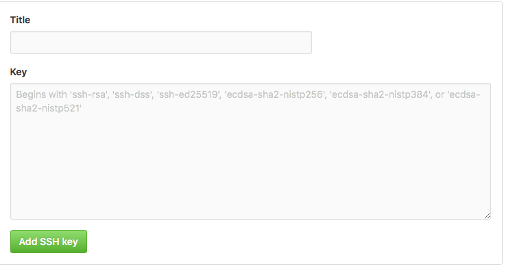{fig-alt="TODO"}

- Enter file in which to save the key (/Users/dryu/.ssh/id_ed25519): /Users/dryu/.ssh/id_ed25519_phy410
- Enter passphrase for "/Users/dryu/.ssh/id_ed25519_phy410" (empty for no passphrase):
- Enter same passphrase again:
- Your identification has been saved in /Users/dryu/.ssh/id_ed25519_phy410
- Your public key has been saved in /Users/dryu/.ssh/id_ed25519_phy410.pub
- The key fingerprint is:
- SHA256:iYFcw453lvE3S5REO4zaKc/fn9ULHDklWSwcv4GpL2o dyu23@buffalo.edu
- The key's randomart image is:
- +--[ED25519 256]--+
- |     .o    o+oo. |
- |   . o...  oo+*. |
- |    oo.  +..+=.+ |
- |    . oo++..=.+ o|
- |     ..oS o+ * . |
- |         +  + o .|
- |          o. +  o|
- |         E..... +|
- |        ..  . .+.|
- +----[SHA256]-----+

- Copy the contents of id_<alg>.pub here

---

## Setup: SSH agent

- An SSH agent allows git to use your (password-protected) SSH key without typing your password every time.
  - Instead, only needs your password once at login:
- eval “$(ssh-agent -s)”
- ssh-add ~/.ssh/id_rsa_github
- You might also have to tell SSH which key to use. Add the following lines to ~/.ssh/config:
- Host github.com
- IdentityFile ~/.ssh/my_key
  - Then run:
- chmod 644 ~/.ssh/config

{width="70%" fig-alt="TODO: describe image"}

- Pro tip: your terminal runs the ~/.bashrc file on launch. So, you can put commands here that get run at the start of every new session.
- # start ssh-agent
- if [ -z $SSH_AGENT_PID ]; then
- eval `ssh-agent -s` > /dev/null
- fi
- alias addkey='ssh-add ~/.ssh/my_key'
{width="70%" fig-alt="TODO: describe image"}

---

## Working with git

- Next, let's introduce some of the basic git commands.
- Warnings:
  - Names of the commands can be confusing and unintuitive!
  - Different VCSes can use the same words for different things.
  - Options can make commands do very different things.
- Don't be intimidated! You will learn by doing, and develop muscle memory for the git language.
- Most important: build a mental model of what git is doing.
  - Conceptual understanding can help you look up a command for accomplishing a specific task.

---

## Big picture

<!-- TODO: complex slide layout (flagged by detect_complex_slide.py - see run log). Content below is complete but UNARRANGED - needs manual layout to match the original slide. -->

{fig-alt="TODO"}

- [github.com](http://github.com)

- pull from github
- push to github

---

## Repositories

- Repositories ("repos"): a collection of files that make up a software project.
  - Top-level object in git
- Repositories contain:
  - Source code
  - README files and other documentation (often written in [Markdown](https://docs.github.com/en/get-started/writing-on-github/getting-started-with-writing-and-formatting-on-github))
  - Input files (e.g. configuration data, YAML)
- DO NOT INCLUDE:
  - Large binary files (executables)
  - Large data
  - These make the repo size explode, and bog down git operations that should be very fast.
  - Tip: .gitignore file specifies file types to ignore

---

## Demo: create and clone hello world

<!-- TODO: complex slide layout (flagged by detect_complex_slide.py - see run log). Content below is complete but UNARRANGED - needs manual layout to match the original slide. -->

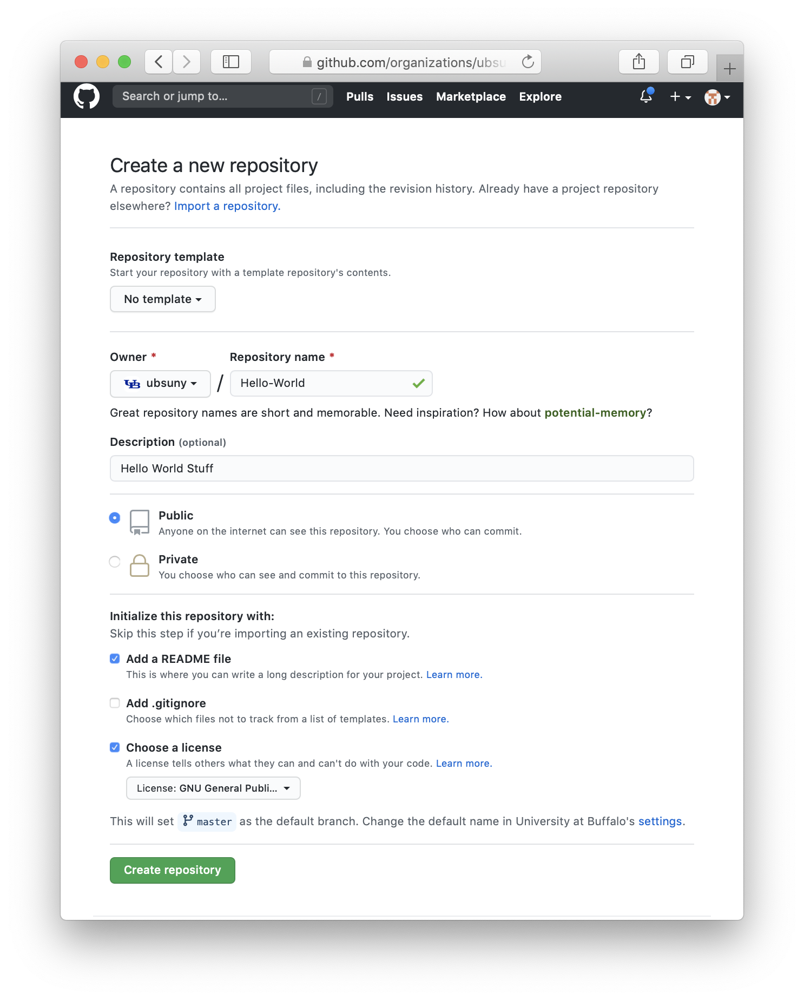{fig-alt="TODO"}

- Command line equivalent:
- git init

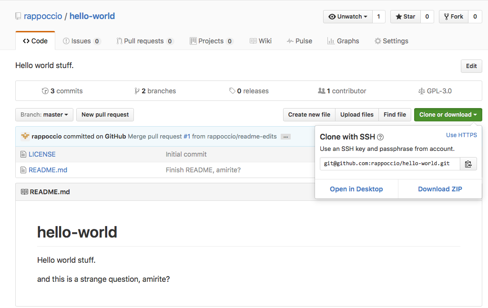{fig-alt="TODO"}

- Create a repo

- Clone the repo to laptop

- cd PHY410
- git clone git@github.com/ubsuny/helloworld2025.git

---

## Demo: create and clone hello world

- dryu@cast-dyu23ml PHY410 % cd $HOME/PHY410
- dryu@cast-dyu23ml PHY410 % git clone git@github.com:ubsuny/helloworld2025test.git
- Cloning into 'helloworld2025test'...
- Enter passphrase for key '/Users/dryu/.ssh/id_rsa_github_cmslpc':
- remote: Enumerating objects: 3, done.
- remote: Counting objects: 100% (3/3), done.
- remote: Total 3 (delta 0), reused 0 (delta 0), pack-reused 0 (from 0)
- Receiving objects: 100% (3/3), done.
- dryu@cast-dyu23ml PHY410 % ll
- drwxr-xr-x   4 dryu  staff   128B Aug 29 10:14 helloworld2025test
- dryu@cast-dyu23ml PHY410 % cd helloworld2025test
- dryu@cast-dyu23ml helloworld2025test % ls
- README.md
- dryu@cast-dyu23ml helloworld2025test % ll
- total 8
- -rw-r--r--  1 dryu  staff    20B Aug 29 10:14 README.md

---

## Basic concepts

- Branch: development area for project
  - Basically, just a copy of the files that git keeps track of.
  - main is the default name for the central branch, i.e., "true" code.
  - Create branches for specific feature development or bug fix, e.g.,feat-pdesolver or fix-hcal-energy-segfault. These likely have a finite lifecycle, lasting until feature is merged back to main.
- Commit: a set of changes to the project
  - Modify, add, or delete files.
  - Under the hood, a commit is just a diff: a list of lines changed, added, or removed.
  - Commits are indexed by a hash: an algo (e.g. SHA-1) creates a unique identifier based on commit metadata (parent commit, date, author, message, etc.)

- dryu@cast-dyu23ml helloworld2025test % git branch -a
- * main
- remotes/origin/HEAD -> origin/main
- remotes/origin/main
- dryu@cast-dyu23ml helloworld2025test % git checkout -b learning-branch
- Switched to a new branch 'learning-branch'
- dryu@cast-dyu23ml helloworld2025test % git branch -a
- * learning-branch
- main
- remotes/origin/HEAD -> origin/main
- remotes/origin/main

---

## Basic concepts

- Tag: a specific named version of the project (i.e. snapshot)
- Release: a Github extension of the tag concept with some extra metadata (release notes, downloadable tarball, ...)
  - Under the hood, tags and releases are just labels for a specific commit!
- (Un)tracked files: whether git is tracking a given file. The folder corresponding to your repo can contain both tracked and untracked files.

- Commits are the fundamental unit of git.
  - A given commit is frozen and unique.
  - Commits are ordered. Since each commit is a diff, they intrinsically depend on the parent commit.
- Branches are active, and can change
  - Under the hood, a branch points to the latest commit (called HEAD).
  - The branch updates every time you make a commit, i.e., it moves HEAD to point to the latest commit.
- Use git log to view the commit history

- Active vs. frozen

---

## Basic workflow

:::: {.columns}
::: {.column width="55%"}
- origin: copy of repo stored on [github.com](http://github.com)
- local: copy of repo stored on your laptop
  - Stored in the .git folder
  - Don't touch this folder! Only git should interact with it.
- Working area: actual files that you are coding on
:::
::: {.column width="45%"}
{width="100%" fig-alt="TODO: describe image"}
:::
::::

---

## Working with branches

:::: {.columns}
::: {.column width="55%"}
- git switch [branch or commit hash]
  - Switch to the specified branch (or commit)
  - This command affects your working area: the files will change to correspond to the branch!
  - Don't worry, nothing is lost. Git is smart enough to stop you if you are about to delete something permanently.
- git switch -c [new-branch-name]
  - Create a new branch and switch to it.
  - Needs git v2.23 or newer.
- git restore [ref] [file]
  - Switch specified file to the version in ref
- git checkout
  - Older command combining switch and restore.
  - git checkout [branch-name]: switch to branch
  - git checkout -b [new-branch-name]: create and switch to new branch
  - Many more options, see git checkout --help
:::
::: {.column width="45%"}
{width="100%" fig-alt="TODO: describe image"}
:::
::::

---

## Working with branches

:::: {.columns}
::: {.column width="55%"}
- git branch -a
  - List all branches (-a includes remote branches)
- git branch [branch]
  - Make a new branch
- git branch [branch] [ref]
  - Make a new branch to follow ref
- git branch -m [old] [new]
  - Rename a branch
- git branch -d [branch]
  - Delete a branch
- Additional commands
  - Don't try to memorize them all now. Google is your friend!
:::
::: {.column width="45%"}
{width="100%" fig-alt="TODO: describe image"}
:::
::::

---

## Working with commits

- git add [a new file]
  - Tell git to track a new file
- git commit -am "documentation message"
  - Make a commit (snapshot) of all current changes to tracked files
  - If you don't specify -m, git will open an editor an make you do it :)
- git rm [unwanted file]
  - Delete a file and stop tracking it
  - git rm --cached [unwanted file]: stop tracking a file, but do not delete it
- git mv [old path] [new path]
  - Rename a file, both in git and on your filesystem
- git *** --dry-run:
  - Git prints what the command will do, without actually executing it.

- dryu@cast-dyu23ml helloworld2025test % git rm --cached helloworld.txt
- rm 'helloworld.txt'
- dryu@cast-dyu23ml helloworld2025test % git status
- On branch learning-branch
- Changes to be committed:
- (use "git restore --staged <file>..." to unstage)
- deleted:    helloworld.txt

---

## Working with forks and remotes

- A remote is a copy of the repo somewhere else in the world, i.e. not the copy on your laptop.
  - A fork is a copy of the repo. For example, you can fork [github.com/ubsuny/CompPhys](http://github.com/ubsuny/CompPhys) to your own account, [github.com/DryRun/CompPhys](http://github.com/DryRun/CompPhys)
- git remote
  - -v: print list of remotes
  - add [name] [url]: add a new remote (e.g., your fork on GitHub)
  - rename [old name] [new name]: change name
  - set-url [remote name] [new url]: change url
  - remove [remote name to remote]: removes the remote from your list (does not delete)

- git push [remote] [ref]
  - Send local [ref] to remote
  - Ex.: git push origin HEAD:feature-branch
  - git push [remote] [ref]:[remote_ref]: push local [ref] to remote, and change name on the remote to [remote_ref].
    - Ex.: git push origin HEAD:feat-branch pushes your HEAD to a remote branch named feat-branch

---

## Demo: make some changes, commit, and push

- Make some changes:
- dryu@cast-dyu23ml helloworld2025test % echo "Hello world" > helloworld.txt
- Tell git to track this file:
- dryu@cast-dyu23ml helloworld2025test % git add helloworld.txt
- Inspect changes:
- dryu@cast-dyu23ml helloworld2025test % git status
- On branch learning-branch
- Changes to be committed:
- (use "git restore --staged <file>..." to unstage)
- modified:   helloworld.txt

- Make a commit with a message:
- dryu@cast-dyu23ml helloworld2025test % git commit -m "Add helloworld.txt"
- [learning-branch 6010c00] Add helloworld.txt
- 1 file changed, 1 insertion(+), 1 deletion(-)
- dryu@cast-dyu23ml helloworld2025test % git status
- On branch learning-branch
- nothing to commit, working tree clean
- Push to github:
- dryu@cast-dyu23ml helloworld2025test % git push origin HEAD:learning-branch
- ...
- To github.com:ubsuny/helloworld2025test.git
- * [new branch]      HEAD -> learning-branch
- Head to GitHub and make a pull request (PR)

---

## Utilities

- Git provides tools for human understanding of the repo
- git status
  - See current state of working area, e.g., modified files ready to be committed.
- git log
  - View commit history
  - --raw, --graph, --decorate
- git diff
  - Print changes using Unix diff format
  - git diff [some file] shows changes to one file
  - git diff [c1] [c2] compares two specific commits
- git grep
  - Search code

- dryu@cast-dyu23ml helloworld2025test % git status
- On branch learning-branch
- Changes not staged for commit:
- (use "git add <file>..." to update what will be committed)
- (use "git restore <file>..." to discard changes in working directory)
- modified:   helloworld.txt
- no changes added to commit (use "git add" and/or "git commit -a")
- dryu@cast-dyu23ml helloworld2025test % git log --pretty=oneline --abbrev-commit
- a7b0cff (HEAD -> learning-branch) Add helloworld.txt
- 8618aa5 (origin/main, origin/HEAD, main) Initial commit
- dryu@cast-dyu23ml helloworld2025test % git status

---

## Recap

<!-- TODO: complex slide layout (flagged by detect_complex_slide.py - see run log). Content below is complete but UNARRANGED - needs manual layout to match the original slide. -->

{fig-alt="TODO"}

{fig-alt="TODO"}

- [github.com](http://github.com)

- pull from github
- push to github
- 1. git clone ssh://git@github.com:ubsuny/CompPhys

- 2. git switch -c my-branch
- (or git checkout -b my-branch)

- 3. Do your coding

- 4. git add [modified file]

- 5. git commit -m "I did a thing"

- 6. git push origin HEAD:new-feature-branch

- 4+5. git commit -am "I did a thing"

---

## Recap

<!-- TODO: complex slide layout (flagged by detect_complex_slide.py - see run log). Content below is complete but UNARRANGED - needs manual layout to match the original slide. -->

{fig-alt="TODO"}

{fig-alt="TODO"}

- [github.com](http://github.com)

- pull from github
- push to github
- 1. git clone ssh://git@github.com:ubsuny/CompPhys

- 2. git switch -c my-branch
- (or git checkout -b my-branch)

- 3. Do your coding

- 4. git add [modified file]

- 5. git commit -m "I did a thing"

- 6. git push origin HEAD:new-feature-branch

- 4+5. git commit -am "I did a thing"

- For the first few assignments, we will go over the exact git commands you will need to run!

---

## Summary

- Reviewed basic Unix commands
  - When in doubt, use Google! There is a lot to remember, which can only be learned over time, by doing.
- Introduced basic git commands and workflow concepts.
  - Same story: you will learn by doing, and spend a lot of time Googling specific commands.
- You will be a 🧙 before you know it!

- By next lecture, you should:
  - Be comfortable interacting with files via the terminal.
  - Be able to open and edit files in a code editor (vscode, emacs, vim, Sublime Text, ...).
  - Have a GitHub account with SSH keys setup, and ability to git clone
  - Have a copy of our CompPhys repository ([github.com/ubsuny/CompPhys](http://github.com/ubsuny/CompPhys)) on your laptop.
  - Be able to launch the Docker container (ubsuny/compphys:latest).
- If anything isn't working: send me a message on Slack, or stop by my office, Fronczak 257!
- Next week, we'll start on C++ programming!
  - You will naturally get better and better at Unix and git.
  - First assignment (on C++ topics) will be posted to UBLearns+GitHub classroom

---

## Bonus: a more serious workflow

<!-- TODO: complex slide layout (flagged by detect_complex_slide.py - see run log). Content below is complete but UNARRANGED - needs manual layout to match the original slide. -->

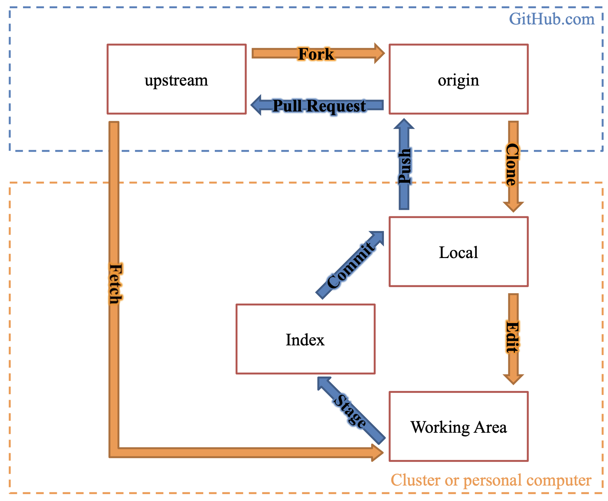{fig-alt="TODO"}

- ubsuny/CompPhys

- your_name/CompPhys

- CompPhys/.git folder on your laptop

- CompPhys/ folder on your laptop

- For larger projects, you will probably have your own fork on github.com.

---

## Bonus: the index

:::: {.columns}
::: {.column width="55%"}
- The Index is an intermediate area between your working area and the actual local repo.
  - Specifically: list of tracked files and staged changes.
- Changes to specific files are staged: tell git "I want to include this file in the next commit."
  - git add [modified file]
- This allows us to modify many files, but then create a commit containing changes specific to one feature!
  - git commit -am "message" will make a commit with all modified files.
  - git add [file]; git commit -m "message" will make a commit with only the specified files
- "Atomic commits" (commits corresponding to one feature) are good development practice.
  - Clear commit history and documentation.
  - Easier to revert a feature.
  - Easier to debug where a problem was introduced.
  - git revert [commit hash] makes a new commit that undoes the specified commit.
:::
::: {.column width="45%"}
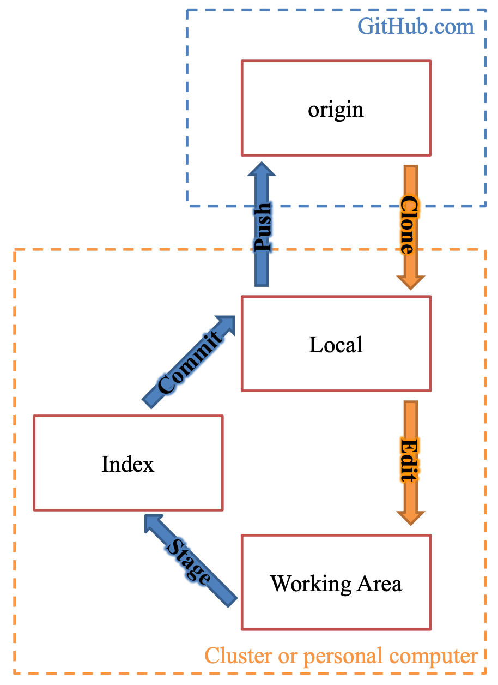{width="100%" fig-alt="TODO: describe image"}
:::
::::

---

## Bonus: working with the index

:::: {.columns}
::: {.column width="55%"}
- git reset [commit]
  - Reset HEAD, index, and/or working area to specified commit (default=HEAD), depending on the mode:
  - --soft: resets HEAD to [commit]; index and working area unchanged
  - --hard: resets HEAD, index, and working area. Wipes out any uncommitted changes! "Siri, throw away everything since a given commit".
  - --mixed: default; resets HEAD and index (so nothing is staged anymore), but keeps working area.
  - Ex.: git reset [file] upstages changes to a specified file
  - Ex.: git reset HEAD~1: undo the last commit operation and onstage, but keep changes to the working area (e.g. if you accidentally commit something).
    - What if I pushed an accidental commit to a remote?
      - Reset local branch using git reset HEAD~1
      - Use git push -f to force-push and overwrite the history (a bit dangerous! Beware mismatched history, which will screw up the repo!)
:::
::: {.column width="45%"}
{width="100%" fig-alt="TODO: describe image"}
:::
::::

---

## Bonus: other advanced git usage

- We will (try to) not use these things in class, but they are good to be aware of.
- git merge conflicts
  - What happens if you try to pull a commit with conflicting changes to your local repo? git handles simple cases (e.g. conflicts are on different lines). Non-trivial conflicts: git inserts "merge conflict" markers and requires you to fix it by hand.
- Squashing: you might have a long, verbose commit history locally, but only want one commit when you push to origin/main.
- git stash: shorthand to save uncommitted changes in a temporary branch and undo the working area changes.
- When you really get into merge conflict trouble:
  - git reset: undoes commits with many options (Google first)
  - git rebase, git cherry-pick: resolve conflicts at the commit level by "rewriting history".
- Removing huge files
  - git rm will not save you; the files are in the repo history!
  - Research this carefully, it involves very dangerous operations that can corrupt or delete a whole project.

---

## Workflow

<!-- TODO: complex slide layout (flagged by detect_complex_slide.py - see run log). Content below is complete but UNARRANGED - needs manual layout to match the original slide. -->

- Write the algorithm down on paper
- If you don’t understand everything : goto step 1
  - else : continue
- Write pseudocode
- If you don’t understand everything : goto step 3
  - else : continue
- Write code
- Check code with unit tests
  - Check “pass” criterion
  - Check “fail” criterion
  - If unit test fails : goto Step 5
- Publish!

- (x0, y0)
- (x1, y1)
- slope = (y1 - y0) / (x1 - x0)

---

## Workflow

<!-- TODO: complex slide layout (flagged by detect_complex_slide.py - see run log). Content below is complete but UNARRANGED - needs manual layout to match the original slide. -->

- Write the algorithm down on paper
- If you don’t understand everything : goto step 1
  - else : continue
- Write pseudocode
- If you don’t understand everything : goto step 3
  - else : continue
- Write code
- Check code with unit tests
  - Check “pass” criterion
  - Check “fail” criterion
  - If unit test fails : goto Step 5
- Publish!

- (x0, y0)
- (x1, y1)
- slope = (y1 - y0) / (x1 - x0)

---

## Workflow

<!-- TODO: complex slide layout (flagged by detect_complex_slide.py - see run log). Content below is complete but UNARRANGED - needs manual layout to match the original slide. -->

- Write the algorithm down on paper
- If you don’t understand everything : goto step 1
  - else : continue
- Write pseudocode
- If you don’t understand everything : goto step 3
  - else : continue
- Write code
- Check code with unit tests
  - Check “pass” criterion
  - Check “fail” criterion
  - If unit test fails : goto Step 5
- Publish!

- (x0, y0)
- (x1, y1)
- slope = (y1 - y0) / (x1 - x0)

---

## Workflow

<!-- TODO: complex slide layout (flagged by detect_complex_slide.py - see run log). Content below is complete but UNARRANGED - needs manual layout to match the original slide. -->

- Write the algorithm down on paper
- If you don’t understand everything : goto step 1
  - else : continue
- Write pseudocode
- If you don’t understand everything : goto step 3
  - else : continue
- Write code
- Check code with unit tests
  - Check “pass” criterion
  - Check “fail” criterion
  - If unit test fails : goto Step 5
- Publish!

- (x0, y0)
- (x1, y1)
- function slope
- Inputs: [(x0, y0), (x1, y1)]
- Return: slope = (y1 - y0) / (x1 - x0)

---

## Workflow

<!-- TODO: complex slide layout (flagged by detect_complex_slide.py - see run log). Content below is complete but UNARRANGED - needs manual layout to match the original slide. -->

- Write the algorithm down on paper
- If you don’t understand everything : goto step 1
  - else : continue
- Write pseudocode
- If you don’t understand everything : goto step 3
  - else : continue
- Write code
- Check code with unit tests
  - Check “pass” criterion
  - Check “fail” criterion
  - If unit test fails : goto Step 5
- Publish!

- (x0, y0)
- (x1, y1)
- function slope
- Inputs: [(x0, y0), (x1, y1)]
- Return: slope = (y1 - y0) / (x1 - x0)

---

## Workflow

<!-- TODO: complex slide layout (flagged by detect_complex_slide.py - see run log). Content below is complete but UNARRANGED - needs manual layout to match the original slide. -->

- Write the algorithm down on paper
- If you don’t understand everything : goto step 1
  - else : continue
- Write pseudocode
- If you don’t understand everything : goto step 3
  - else : continue
- Write code
- Check code with unit tests
  - Check “pass” criterion
  - Check “fail” criterion
  - If unit test fails : goto Step 5
- Publish!

- (x0, y0)
- (x1, y1)
- function slope
- Inputs: [(x0, y0), (x1, y1)]
- Return: slope = (y1 - y0) / (x1 - x0)

---

## Workflow

<!-- TODO: complex slide layout (flagged by detect_complex_slide.py - see run log). Content below is complete but UNARRANGED - needs manual layout to match the original slide. -->

- Write the algorithm down on paper
- If you don’t understand everything : goto step 1
  - else : continue
- Write pseudocode
- If you don’t understand everything : goto step 3
  - else : continue
- Write code
- Check code with unit tests
  - Check “pass” criterion
  - Check “fail” criterion
  - If unit test fails : goto Step 5
- Publish!

- (x0, y0)
- (x1, y1)
- def get_slope(x0, y0, x1, y1):
  - slope = (y1 - y0) / (x1 - x0)
  - return slope

---

## Workflow

<!-- TODO: complex slide layout (flagged by detect_complex_slide.py - see run log). Content below is complete but UNARRANGED - needs manual layout to match the original slide. -->

- Write the algorithm down on paper
- If you don’t understand everything : goto step 1
  - else : continue
- Write pseudocode
- If you don’t understand everything : goto step 3
  - else : continue
- Write code
- Check code with unit tests
  - Check “pass” criterion
  - Check “fail” criterion
  - If unit test fails : goto Step 5
- Publish!

- (x0, y0)
- (x1, y1)
- import math
- def get_slope(x0, y0, x1, y1):
  - slope = (y1 - y0) / (x1 - x0)
  - return slope
- x0 = 0.0
- y0 = 0.0
- x1 = 1.0
- y1 = 1.0
- print(f”Slope = {get_slope(x0, y0, x1, y1)}”)
- Slope = 1.0

---

## Workflow

<!-- TODO: complex slide layout (flagged by detect_complex_slide.py - see run log). Content below is complete but UNARRANGED - needs manual layout to match the original slide. -->

- Write the algorithm down on paper
- If you don’t understand everything : goto step 1
  - else : continue
- Write pseudocode
- If you don’t understand everything : goto step 3
  - else : continue
- Write code
- Check code with unit tests
  - Check “pass” criterion
  - Check “fail” criterion
  - If unit test fails : goto Step 5
- Publish!

- (x0, y0)
- (x1, y1)
- import math
- def get_slope(x0, y0, x1, y1):
  - slope = (y1 - y0) / (x1 - x0)
  - return slope
- x0 = 0.0
- y0 = 0.0
- x1 = 0.0
- y1 = 1.0
- print(f”Slope = {get_slope(x0, y0, x1, y1)}”)
- Hmm…

---

## Workflow

<!-- TODO: complex slide layout (flagged by detect_complex_slide.py - see run log). Content below is complete but UNARRANGED - needs manual layout to match the original slide. -->

- Write the algorithm down on paper
- If you don’t understand everything : goto step 1
  - else : continue
- Write pseudocode
- If you don’t understand everything : goto step 3
  - else : continue
- Write code
- Check code with unit tests
  - Check “pass” criterion
  - Check “fail” criterion
  - If unit test fails : goto Step 5
- Publish!

- (x0, y0)
- (x1, y1)
- import math
- def get_slope(x0, y0, x1, y1):
  - slope = (y1 - y0) / (x1 - x0)
  - return slope
- x0 = 0.0
- y0 = 0.0
- x1 = 0.0
- y1 = 1.0
- print(f”Slope = {get_slope(x0, y0, x1, y1)}”)
- > Traceback (most recent call last):
- >   File "<stdin>", line 1, in <module>
- >   File "<stdin>", line 2, in get_slope
- > ZeroDivisionError: float division by zero

---

## Workflow

<!-- TODO: complex slide layout (flagged by detect_complex_slide.py - see run log). Content below is complete but UNARRANGED - needs manual layout to match the original slide. -->

- Write the algorithm down on paper
- If you don’t understand everything : goto step 1
  - else : continue
- Write pseudocode
- If you don’t understand everything : goto step 3
  - else : continue
- Write code
- Check code with unit tests
  - Check “pass” criterion
  - Check “fail” criterion
  - If unit test fails : goto Step 5
- Publish!

- (x0, y0)
- (x1, y1)
- import unittest
- class TestSlope(unittest.TestCase):
  - def test1(self):
    - self.assertEqual(get_slope(0., 0., 1., 1.), 1.0)
  - def test_2(self):
    - with self.assertRaises(ZeroDivisionError):
      - get_slope(0., 0., 0., 1.)
  - def test_3(self):
    - with self.assertRaises(TypeError):
      - get_slope(0., 0., “apples”, “oranges”)
- if __name__ == '__main__':
- unittest.main()
