# Welcome

## Computational Physics

:::: {.columns .vcenter}
::: {.column width="66%"}
- Welcome to Computational Physics 1!
- This is the first half of a 2-semester sequence on numerical computing and computational physics.
- Topics:
  - Basics of technical computing (esp. C++)
  - Data analysis
    - Fitting, FFTs
  - Computational algorithms and techniques
    - Numerical algorithms, linear algebra, nonlinear equations, ODEs/PDEs, statistical and simulation methods
  - Basics of quantum computing (time permitting)
- Semester 2 will pick up from there! Includes some machine learning.
:::
::: {.column width="33%" layout-nrow=2}
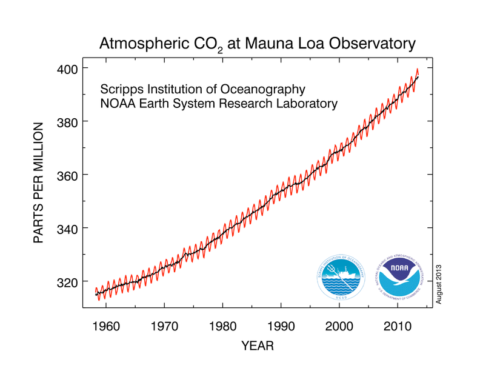{fig-alt="Atmospheric CO2 data from the Mauna Loa observatory and fit model with seasonal fluctuations removed"}

{fig-alt="N-body simulations exhibiting chaotic dynamics"}

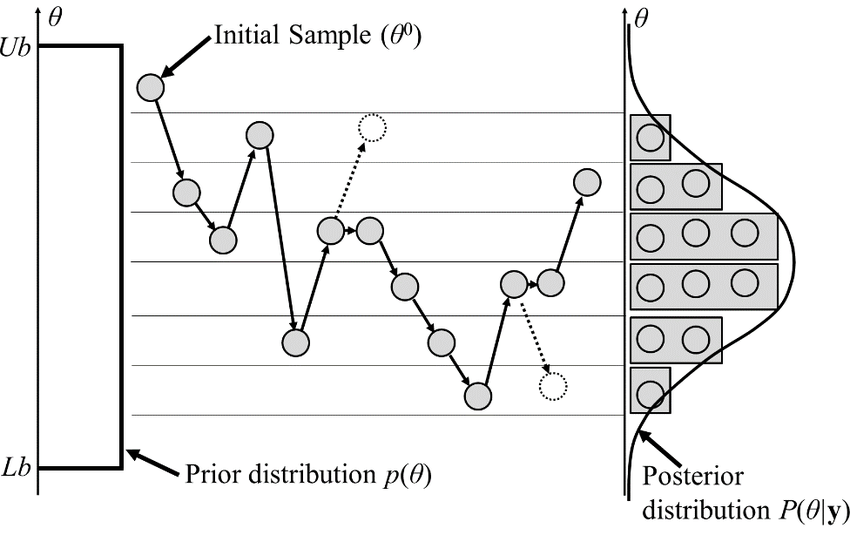{fig-alt="Visualization of sampling arbitrary distributions using Markov chain MC"}

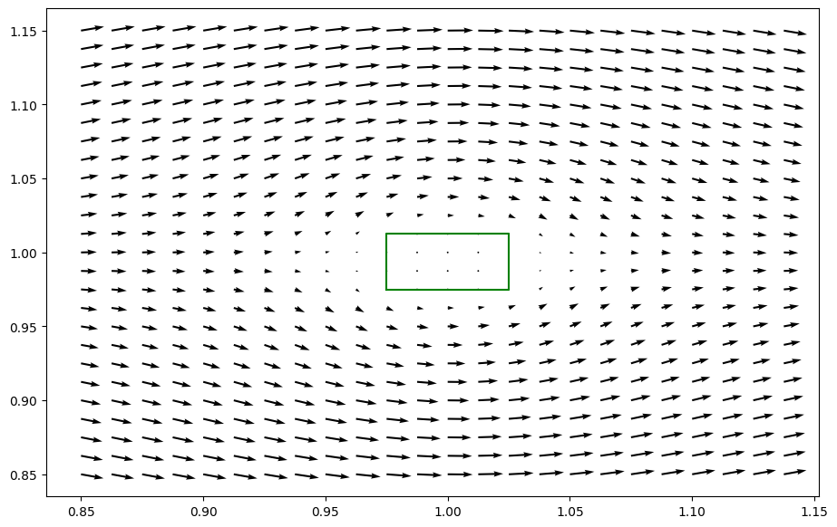{fig-alt="Fluid dynamics example of flow in a pipe with an obstruction"}
:::
::::

---

## Who am I?

:::: {.columns .vcenter}
::: {.column width="55%"}
- Me: David Yu, PhD ("David" is fine! but Dr. or Prof. Yu if you prefer).
- Research: high-energy particle physics at the Large Hadron Collider in Geneva, Switzerland
  - Higgs boson measurements (esp. very energetic H production)
  - Dark matter/dark sector searches
  - Calorimeter detectors (esp. CMS hadron calorimeter)
- What do I use computers for?
  - Data acquisition
  - Large scale (100 PB) data processing and statistical inference
  - Simulating LHC collisions (QFT) and detector signatures
  - Machine learning
:::
::: {.column width=45%}
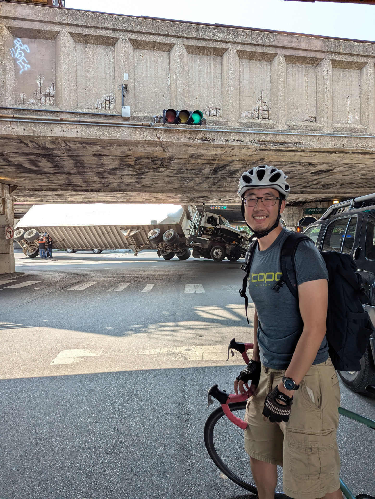{width="35%" fig-align="center" fig-alt="Picture of the instructor"}

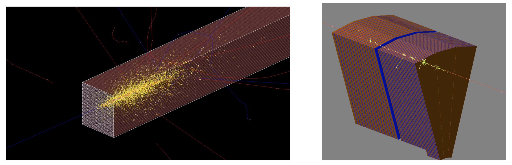{width="50%" fig-align="center" fig-alt="Simulation of an electromagnetic shower due to a high energy particle hitting a calorimeter detector"}

:::: {layout="[[30, 40, 30]]"}
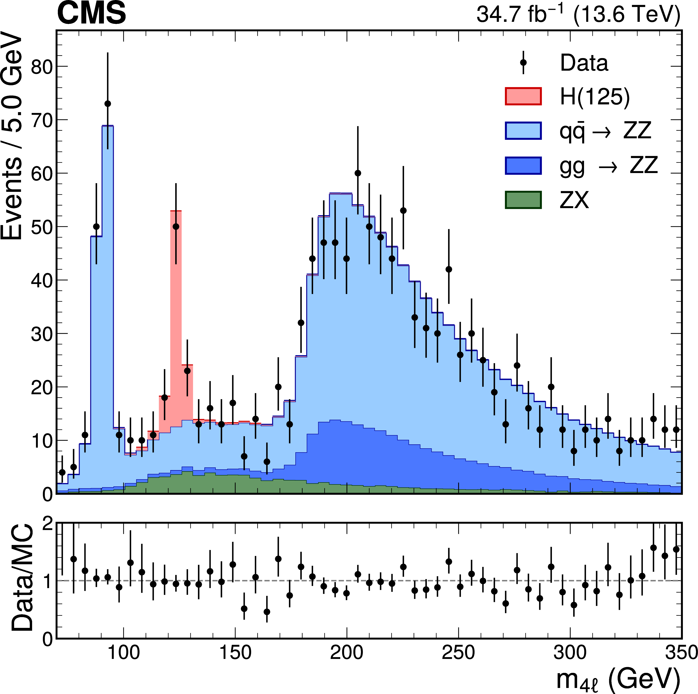{fig-alt="Histogram of the invariant mass of 4-lepton events, showing data and predictions from simulation. The Higgs boson is evident at an invariant mass near 125 GeV."}

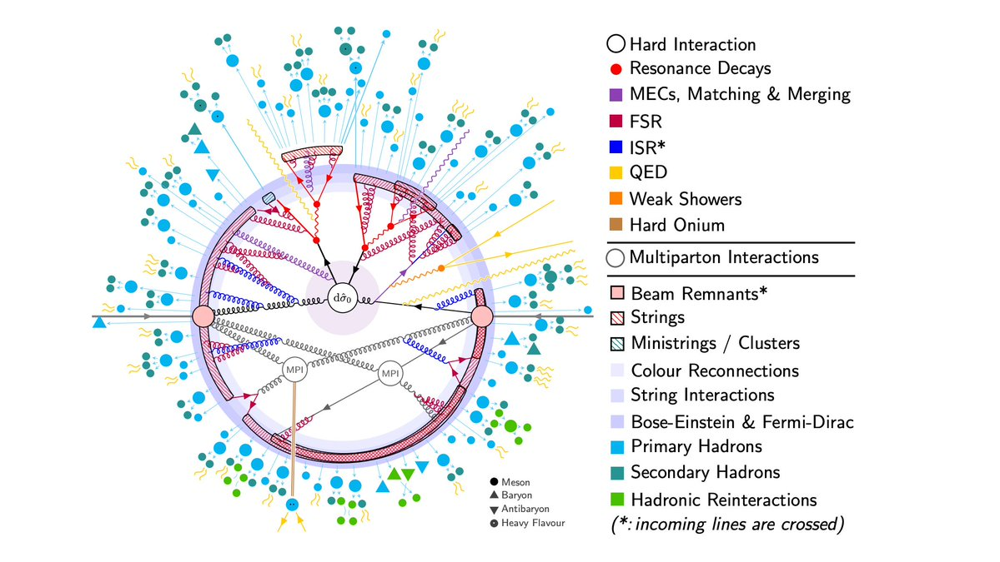{fig-alt="Cartoon demonstrating the simulation of high energy proton-proton collisions"}

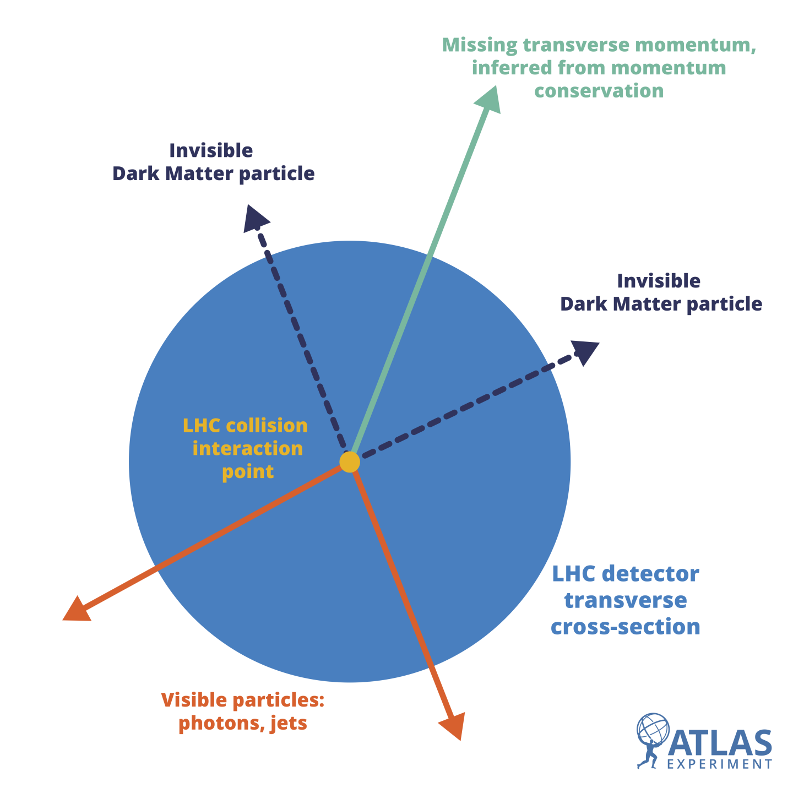{fig-alt="Cartoon of dark matter production at the Large Hadron Collider"}

::::
:::
::::

---

## Who am I?

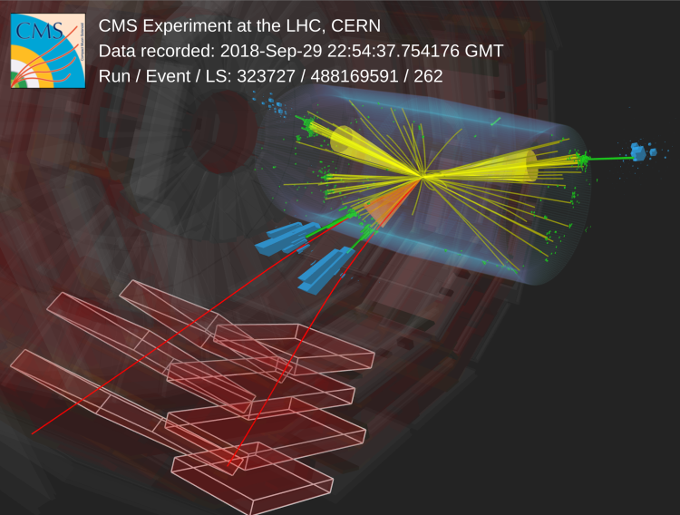{fig-alt="Higgs boson decaying to two bottom quarks (probably)"}


---

## Who are you?

- I assume you are:
  - At least a mid-level undergraduate
  - Interested in computational techniques
- I assume you know:
  - CS preqrequisites:
    - CSE >=115 or equivalent (e.g., EAS240, PHY386)
    - 1 semester of programming something
    - I assume you know >=1 programming language
  - Math prerequisites:
    - Calculus (2 semesters), Vector calculus (1 semester)
    - Ordinary differential equations (1 semester)
  - Physics prerequisites:
    - Introductory mechanics, E&M, and modern physics/quantum mechanics.

---

## Quick round table

- Let's do some introductions!
  - Research interests
  - Computational interests/experience
  - Anything else!

---

## Quick survey

- For my benefit, let's also do a quick survey:
  - What OS are you using (Windows, Mac, Linux (which?))?
  - What programming languages have you used? (Python and C++ especially, but any others as well)
  - Have you used Git before?

# Course overview

---

## What is Computational Physics?

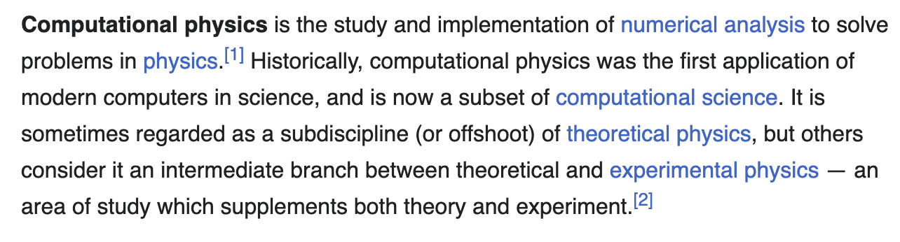{width="70%" fig-alt="TODO: describe image"}

::: {.fragment}
- This is probably not very interesting to you all
:::

---

## What is Computational Physics?

:::: {.columns}
::: {.column width="55%"}
- As physicists, we create models to describe nature, and test the models against experimental data.
- In real life, most mathematical models are not analytically solvable. You might have an intractable differential equation (analytically speaking), or you might need to fit a billion data points. Computers to the rescue!
- Modern computers are super powerful tools to bridge the divide between physical models and our experiments.
- This lets us do amazing things, like simulate the whole universe!
  - [https://www.youtube.com/watch?v=yyfpFfWq7Bc](https://www.youtube.com/watch?v=yyfpFfWq7Bc)
:::
::: {.column width="45%"}

:::
::::

---

## Fitting models to data

- You all probably did a least-squares fit by hand at some point
- For large N(data), and especially for more complicated models than a line, this is obviously a task for a computer.

::: {layout-ncol=2}
)](../assets/1.0_fitting/hubble-fig1.png){width=600 fig-alt="Original Hubble diagram showing the linear relationship between distance and redshift (i.e. relative velocity)"}

)](../assets/1.0_fitting/Screenshot-2025-10-01-at-12.38.24-PM.png){width=600 fig-alt="Hubble diagram from Supernova Cosmology project, showing departure from linear behavior supporting the existence of dark energy"}
:::

---

## Spectral analysis (aka Fourier transforms)

- The Fast Fourier transform is a beautiful algorithm that neatly demonstrates key aspects of computational algorithm development.

::: {layout-ncol=2}
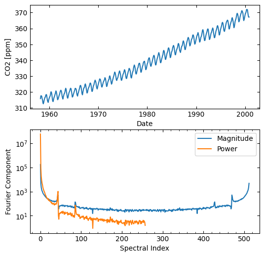{width=600 fig-alt="Time series of atmospheric CO2 measurements at Mauna Loa and Fourier decomposition"}

{width=600 fig-alt="Time series of sunspot data and smoothed time series using a low-pass filter"}
:::

---

## Scattering simulation

- Scattering trajectory calculations for complicated potentials, like the Lennard-Jones potential:
$$
V(r) = 4\epsilon \left[\left(\frac{\sigma}{r}\right)^{12} - \left(\frac{\sigma}{r}\right)^6\right]
$$

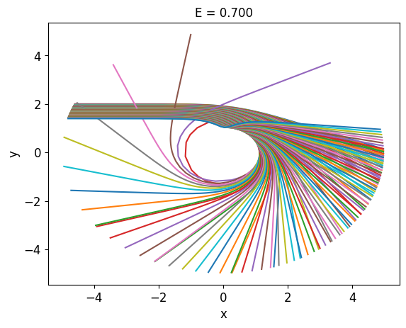{width=60% fig-alt="Scattering trajectories for various impact parameters off of a Lennard-Jones potential, demonstrating the long-range attractive potential and the short-range hard core scattering."}

--- 


## N-body simulations

::: {layout-ncol=3}
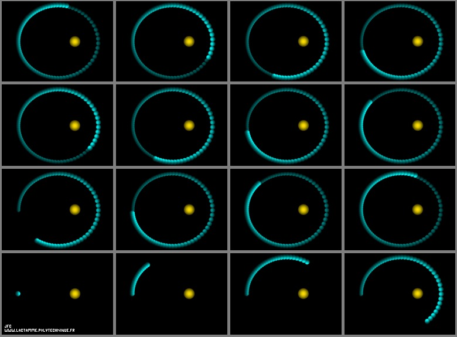{width=400 fig-alt="2-body simulation"}

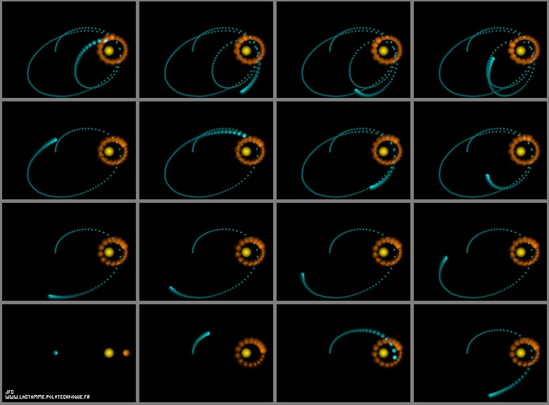{width=400 fig-alt="3-body simulation"}

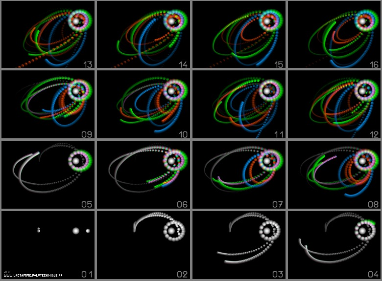{width=400 fig-alt="4-body simulation"}
:::

- N-body simulations (not analytically solvable for $N\geq3$) ([link](https://www.lactamme.polytechnique.fr/mosaic/descripteurs/Galerie_CelestialMechanics.FV.html)).
- State-of-the-art: [Rubin telescope simulation](https://youtube.com/watch?v=5i7z9lgqSq0).

---

## Nonlinear dynamics and chaos

- Simulation of nonlinear damped+driven pendulum

::: {layout-ncol=2}
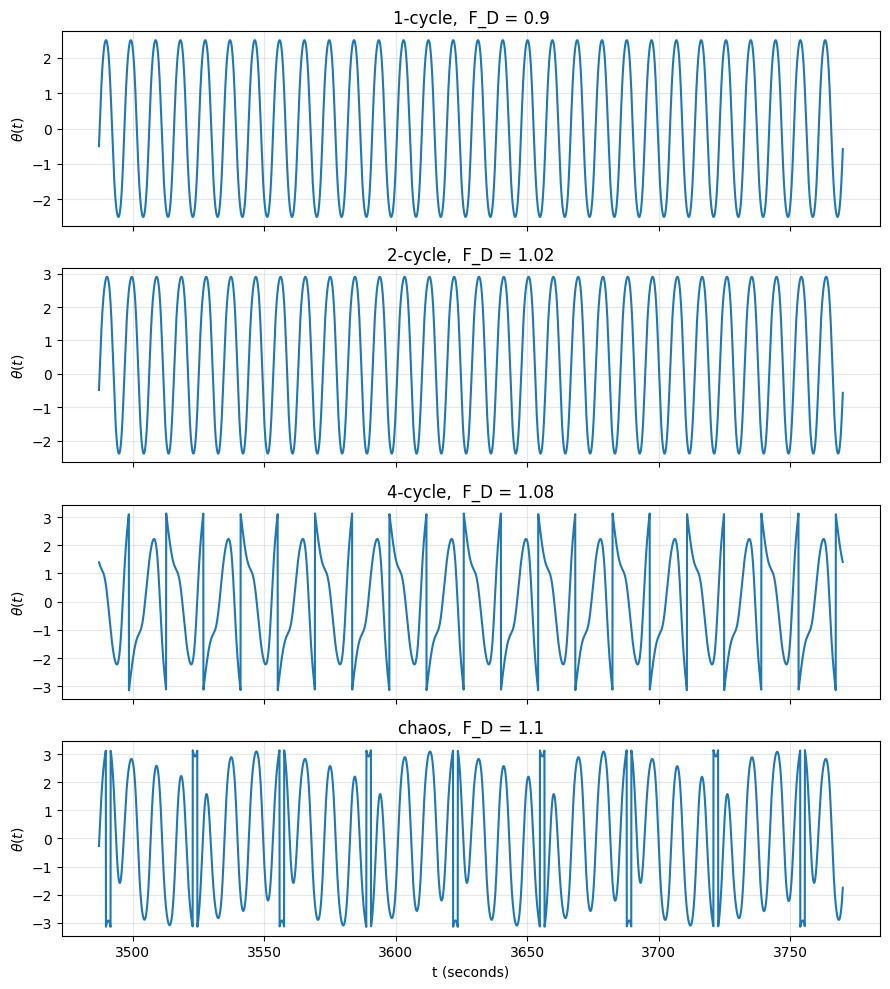{width=500 fig-alt="Angle theta versus time for nonlinear damped, driven pendulum at diffent driving forces, showing the transition from linear to chaotic behavior."}

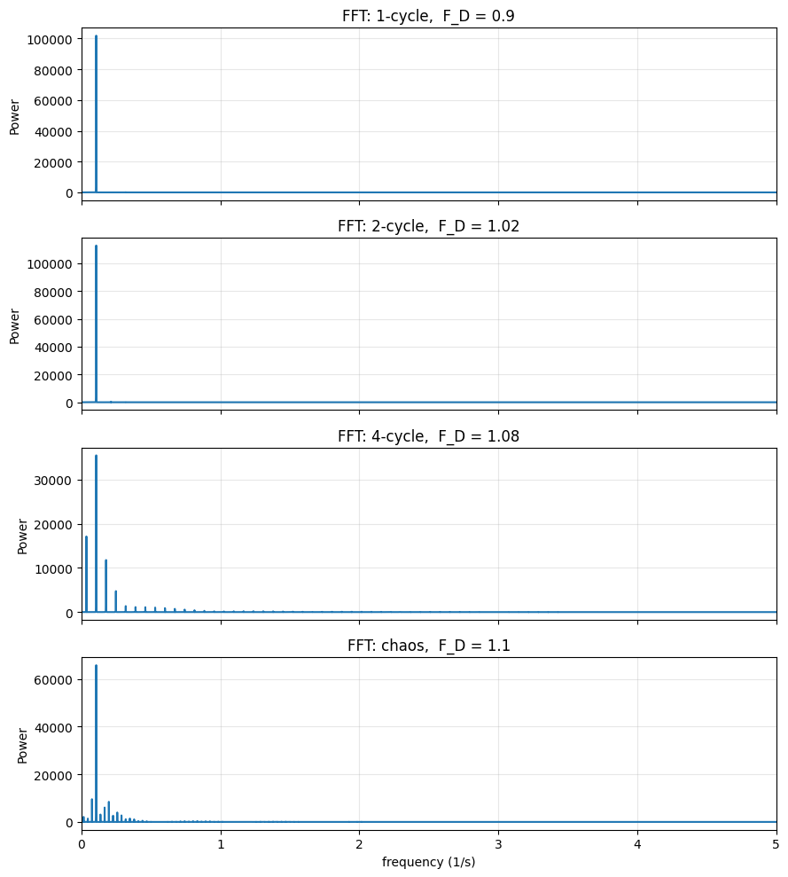{width=500 fig-alt="Fourier power spectrum for nonlinear damped, driven pendulum at diffent driving forces, showing the transition from linear to chaotic behavior."}
:::

---

## Languages: C++ and python

:::: {.columns}
::: {.column width="45%"}
- Python:
  - Interpreted
  - Fast development (it’s practically pseudocode), slow execution
  - Very simple
  - Good for scripting and string handling
:::
::: {.columns width=45%}
- C++ :
  - Compiled
  - Slow development (have to wait on compiling), fast execution
  - Very robust
  - Good for high-performance computing
:::
::::

---

## Languages

:::: {.columns .vcenter}
::: {.column width=60%}
- For scientific computing, we often start with python, and switch to compiled code where necessary.
  - In other words: only worry about your code speed where it really matters!
  - Human time is expensive, computer time is cheap.
  - For most people, Python is closer to how you "think", which is great for doing science.
- However:
  - numpy/scipy/pandas/... have erased a lot of the performance differences (con: somwhat harder to code)
  - We will learn how to use C++ from within python using **swig**, so you get the best of both worlds!
:::
::: {.column width="35%"}
{width="70%" fig-alt="Tortoise vs. hare"}

{width="70%" fig-alt="Tortare"}
:::
::::

---

## Computing languages

- Why not matlab?
  - Not everyone has access to it, it’s not free, and so I don’t want to make you use it.
  - No examples will be provided there.
- Why not Fortran90?
  - It’s a very, very, very old language.
  - F90 is probably older than you; F77 is older than me.
  - It’s very useful for scientific computing, but it’s really losing its support base except for experts in scientific computing.
  - I won’t make you learn it since it has limited utility outside of academia and you probably will never see it anywhere else.
  - (You can invoke it from within python, in principle)
- Why not xyz?
  - Scientific python has an extensive toolkit and a huge community
  - Newer languages like julia, rust, go, ... are great! But we will mainly use python.

---

## Computing tools

- Besides the programming languages themselves:
  - **Git** (and services like GitHub/GitLab)
  - A good code editor (e.g. Visual Studio Code, Sublime Text, vim/emacs for pros, ...)
  - Docker, pixi (for managing software environments)
  - Swig (use C++ code inside python)
  - Markdown (for documentation)
  - Unix terminals
  - (and probably more!)

## Textbooks

:::: {.columns}
::: {.column width="70%"}
- Primary textbooks for this semester (generally ~free):
  - **Numerical Recipes in C++** — [https://numerical.recipes/](https://numerical.recipes/)
    - Latest version is technically paid (nags; worthwhile investment for your career!); older versions of NR are free online.
  - For C++: [**Fundamentals of C++ Programming**](https://openlibrary.org/works/OL20455903W/Fundamentals_of_C_Programming) by Richard Halterman
    - Examples: [https://github.com/halterman/CppBook-SourceCode](https://github.com/halterman/CppBook-SourceCode)
    - [Archive link](https://archive.org/details/2018FundamentalsOfCppProgramming)
  - For python: [**Introduction to python**](https://www.tutorialspoint.com/python3/)
    - Or hundreds of tutorials on the internet
- Additional textbooks (not free):
  - [**Numerical Methods for Physics**](http://www.algarcia.org/nummeth/nummeth.html) by Garcia
  - [**Computational Physics**](https://www.amazon.com/dp/0521575885?lv=shuf&channelId=500&plpRedirect=mhFallback) by Thijssen (esp. 2nd semester)

:::
::: {.column width="30%"}
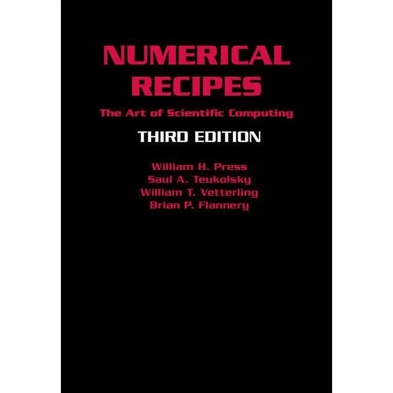{width="80%" fig-alt="Cover of Numerical Recipes"}
:::
::::


---

## Schedule: programming

- First 4–8 weeks: basics of technical computing
  - Some of you might already be familiar with this!
- We will cover:
  - Basics of UNIX
  - C++ intro
    - Writing code, compiling, debugging
  - Python
    - Performance vs. C++
    - Mixing C++ and python
    - Vectorization, numpy
  - Essential tools: git, Docker
- Goal is to have everyone on solid footing for the main attraction…

---

## Schedule: computational physics topics

- The remainder of the semester will cover the actual computational physics:
  - Data analysis: fitting, (fast) Fourier transform
  - Linear algebra: systems of equations, eigenvectors/values
  - Calculus: derivatives, integrals, roots, minimization
  - Differential equations: boundary value problems, ODEs, PDEs
  - Monte Carlo methods: random numbers, Metropolis-Hastings (time permitting)
  - And/or quantum computing (time permitting)
- Semester 2 will pick up from there. Topics include more advanced QM/QFT problems, fluid mechanics, and machine learning, which is probably of interest to all of you!

---

## Expectations 1

- Class expectations:
  - No attendance — you’re adults, and are responsible :)
- Politeness and appropriate conduct (never had a problem with this, but nonetheless)
- Workload:
  - This course is hands-on and intensive
  - Expectation is ~10 hours / week including 3 hours class time
  - You will learn a LOT from homework and exams
  - You will gain fairly little by just coming to class and not participating in assignments

---

## Expectations 2

- You will need to have a computer!
  - Needs to run Unix. Mac, Windows (with WSL), and Linux can all work.
  - Ideally, utilize an isolated software environment. In order of preference:
    - pixi
    - Docker container
    - "Bare metal" (installing directly into your system folders) is not recommended; best to keep individual projects separate (and separate from your OS). 
    - More on this later!

---

## Hands-on sessions

- Classes will be ~75% lectures and ~25% coding.
  - I will try to code live, so you can learn from my flailing.
- Utilize the hands-on sessions! 
  - They are more important than the lectures! You will learn by doing, not by listening to me.
  - Ask questions, work together, try crazy ideas, break stuff.
- Worth noting: all of the homework problems are directly related to an exercise from the hands-on sessions! In fact, most of them suggest that you copy the code directly from an example as a starting point.

---


## Assignments and communication

- Slides and lecture notes:
  - [Class website](dryu.web.cern.ch/dryu/compphys): slides and lecture notes (brand new and under construction)
  - [UBLearns](https://ublearns.buffalo.edu): all “official” communications, including grades (and lecture PDFs) (also under construction)
- Assignments:
  - [Classroom 50](classroom50.org): used for homeworks and exams
    - Register here (requires a github account): [https://classroom50.org/ubsuny/compphys-fall26/onboard](https://classroom50.org/ubsuny/compphys-fall26/onboard)
  - Assignments have two components: (1) code (classroom50) and (2) written report (UBLearns).
- Discussions:
  - [ubsuny github group](github.com/ubsuny): our github group, where the main [github.com/ubsuny/CompPhys] repo lives, as well as your individual assignment repositories
  - Discussion forum: [https://github.com/orgs/ubsuny/discussions](https://github.com/orgs/ubsuny/discussions). Ask technical questions here!
  - Office hours (TBD), email (dyu23@buffalo.edu), Teams (david.r.yu), messenger pigeon if you have one, ...

::: {.callout-tip}
I suggest bookmarking all of these!
:::

---

## A word on LLMs...


# The Development Cycle

---

## A day in the life of a computational physicist

- Understand physics
  - Document!
- Write down algorithm
  - Document!
- Implement algorithm
  - Document!
- Test algorithm
  - Document!
- Publish!
  - Maybe your code, too!

---

## Workflow

1. Write the algorithm down on paper
2. If you don’t understand everything : goto step 1
    - else : continue
3. Write pseudocode
4. If you don’t understand everything : goto step 3
    - else : continue
5. Write code
6. Check code with unit tests (aka "control region")
    - Check “pass” criterion
    - Check “fail” criterion
    - If unit test fails : goto Step 5
7. Publish!

---

## Development cycle

:::: {.columns .vcenter}
::: {.column width=35%}
1. Write the algorithm down on paper
2. If you don’t understand everything : goto step 1
    - else : continue
3. Write pseudocode
4. If you don’t understand everything : goto step 3
    - else : continue
5. Write code
6. Check code with unit tests
    - Check “pass” criterion
    - Check “fail” criterion
    - If unit test fails : goto Step 5
7. Publish!
:::
::: {.column width=60%}

:::: {style="max-width: 600px; display: block; margin: auto;"}
```{ojs}
vectorDiagram(
  {x:4, y:1.2, label:"A", coordsTex:"x_0, y_0"},
  {x:1.6, y:3.6, label:"B", coordsTex:"x_1, y_1"},)
```
::::

Example: compute the angle $\theta$ between two vectors


:::
::::

---

## Development cycle

:::: {.columns .vcenter}
::: {.column width=35%}
1. [**Write the algorithm down on paper**]{style="text-color: red;"}
2. If you don’t understand everything : goto step 1
    - else : continue
3. Write pseudocode
4. If you don’t understand everything : goto step 3
    - else : continue
5. Write code
6. Check code with unit tests
    - Check “pass” criterion
    - Check “fail” criterion
    - If unit test fails : goto Step 5
7. Publish!
:::
::: {.column width=60%}

:::: {style="max-width: 600px; display: block; margin: auto;"}
```{ojs}
vectorDiagram(
  {x:4, y:1.2, label:"A", coordsTex:"x_0, y_0"},
  {x:1.6, y:3.6, label:"B", coordsTex:"x_1, y_1"},)
```
::::

:::: {.fragment}
$$
\cos\theta = \frac{\vec{A} \cdot \vec{B}}{|\vec{A}| |\vec{B}|} \\
\theta = \cos^{-1}\left(\frac{\vec{A} \cdot \vec{B}}{|\vec{A}| |\vec{B}|} \right)
$$
::::

:::
::::

---

## Development cycle

:::: {.columns .vcenter}
::: {.column width=35%}
1. Write the algorithm down on paper
2. **If you don’t understand everything : goto step 1**
    - **else : continue**
3. Write pseudocode
4. If you don’t understand everything : goto step 3
    - else : continue
5. Write code
6. Check code with unit tests
    - Check “pass” criterion
    - Check “fail” criterion
    - If unit test fails : goto Step 5
7. Publish!
:::
::: {.column width=60%}

:::: {style="max-width: 600px; display: block; margin: auto;"}
```{ojs}
vectorDiagram(
  {x:4, y:1.2, label:"A", coordsTex:"x_0, y_0"},
  {x:1.6, y:3.6, label:"B", coordsTex:"x_1, y_1"},)
```
::::

$$
\cos\theta = \frac{\vec{A} \cdot \vec{B}}{|\vec{A}| |\vec{B}|} \\
\theta = \cos^{-1}\left(\frac{\vec{A} \cdot \vec{B}}{|\vec{A}| |\vec{B}|} \right)
$$

:::
::::

---

## Development cycle

:::: {.columns .vcenter}
::: {.column width=35%}
1. Write the algorithm down on paper
2. If you don’t understand everything : goto step 1
    - else : continue
3. **Write pseudocode**
4. If you don’t understand everything : goto step 3
    - else : continue
5. Write code
6. Check code with unit tests
    - Check “pass” criterion
    - Check “fail” criterion
    - If unit test fails : goto Step 5
7. Publish!
:::
::: {.column width=60%}

:::: {style="max-width: 600px; display: block; margin: auto;"}
```{ojs}
vectorDiagram(
  {x:4, y:1.2, label:"A", coordsTex:"x_0, y_0"},
  {x:1.6, y:3.6, label:"B", coordsTex:"x_1, y_1"},)
```
::::

```
function theta
Inputs: [(x0, y0), (x1, y1)]
AdotB = x0 * x1 + y0 * y1
absA = sqrt(x0^2 + y0^2)
absB = sqrt(x1^1 + y1^2)
theta = arccos(AdotB / (absA * absB))
```

:::
::::

---

## Development cycle

:::: {.columns .vcenter}
::: {.column width=35%}
1. Write the algorithm down on paper
2. If you don’t understand everything : goto step 1
    - else : continue
3. Write pseudocode
4. **If you don’t understand everything : goto step 3**
    - else : continue
5. Write code
6. Check code with unit tests
    - Check “pass” criterion
    - Check “fail” criterion
    - If unit test fails : goto Step 5
7. Publish!
:::
::: {.column width=60%}

:::: {style="max-width: 600px; display: block; margin: auto;"}
```{ojs}
vectorDiagram(
  {x:4, y:1.2, label:"A", coordsTex:"x_0, y_0"},
  {x:1.6, y:3.6, label:"B", coordsTex:"x_1, y_1"},)
```
::::

```
function theta
Inputs: [(x0, y0), (x1, y1)]
AdotB = x0 * x1 + y0 * y1
absA = sqrt(x0^2 + y0^2)
absB = sqrt(x1^1 + y1^2)
theta = arccos(AdotB / (absA * absB))
```

[Wait: we want a *signed* angle: `theta(A, B) == -1 * theta(B, A)`]{style="color: red;"}

:::
::::

---


## Development cycle

:::: {.columns .vcenter}
::: {.column width=35%}
1. Write the algorithm down on paper
2. If you don’t understand everything : goto step 1
    - else : continue
3. **Write pseudocode**
4. If you don’t understand everything : goto step 3
    - else : continue
5. Write code
6. Check code with unit tests
    - Check “pass” criterion
    - Check “fail” criterion
    - If unit test fails : goto Step 5
7. Publish!
:::
::: {.column width=60%}

:::: {style="max-width: 600px; display: block; margin: auto;"}
```{ojs}
vectorDiagram(
  {x:4, y:1.2, label:"A", coordsTex:"x_0, y_0"},
  {x:1.6, y:3.6, label:"B", coordsTex:"x_1, y_1"},)
```
::::

```
function theta
Inputs: [(x0, y0), (x1, y1)]
AdotB = x0 * x1 + y0 * y1
absA = sqrt(x0^2 + y0^2)
absB = sqrt(x1^1 + y1^2)
theta = arccos(AdotB / (absA * absB))
AcrossB = x0 * y1 - x1 * y0
if AcrossB < 0:
theta *= -1
```

:::
::::

---

## Development cycle

:::: {.columns .vcenter}
::: {.column width=35%}
1. Write the algorithm down on paper
2. If you don’t understand everything : goto step 1
    - else : continue
3. Write pseudocode
4. If you don’t understand everything : goto step 3
    - **else : continue**
5. Write code
6. Check code with unit tests
    - Check “pass” criterion
    - Check “fail” criterion
    - If unit test fails : goto Step 5
7. Publish!
:::
::: {.column width=60%}

:::: {style="max-width: 600px; display: block; margin: auto;"}
```{ojs}
vectorDiagram(
  {x:4, y:1.2, label:"A", coordsTex:"x_0, y_0"},
  {x:1.6, y:3.6, label:"B", coordsTex:"x_1, y_1"},)
```
::::

```
function theta
Inputs: [(x0, y0), (x1, y1)]
AdotB = x0 * x1 + y0 * y1
absA = sqrt(x0^2 + y0^2)
absB = sqrt(x1^1 + y1^2)
theta = arccos(AdotB / (absA * absB))
AcrossB = x0 * y1 - x1 * y0
if AcrossB < 0:
theta *= -1
```

:::
::::

---

## Development cycle

:::: {.columns .vcenter}
::: {.column width=35%}
1. Write the algorithm down on paper
2. If you don’t understand everything : goto step 1
    - else : continue
3. Write pseudocode
4. If you don’t understand everything : goto step 3
    - else : continue
5. **Write code**
6. Check code with unit tests
    - Check “pass” criterion
    - Check “fail” criterion
    - If unit test fails : goto Step 5
7. Publish!
:::
::: {.column width=60%}

:::: {style="max-width: 600px; display: block; margin: auto;"}
```{ojs}
vectorDiagram(
  {x:4, y:1.2, label:"A", coordsTex:"x_0, y_0"},
  {x:1.6, y:3.6, label:"B", coordsTex:"x_1, y_1"},)
```
::::

```python
import math
def theta(x0, y0, x1, y1):
  absA = math.sqrt(x0**2 + y0**2)
  absB = math.sqrt(x1**2 + y1**2)
  AdotB = x0 * x1 + y0 * y1
  AcrossB = x0 * y1 - x1 * y0
  theta = math.acos(AdotB / (absA * absB))
  if AcrossB < 0:
    theta *= -1
  return theta
```

:::
::::

---

## Development cycle

:::: {.columns .vcenter}
::: {.column width=35%}
1. Write the algorithm down on paper
2. If you don’t understand everything : goto step 1
    - else : continue
3. Write pseudocode
4. If you don’t understand everything : goto step 3
    - else : continue
5. Write code
6. **Check code with unit tests**
    - **Check “pass” criterion**
    - Check “fail” criterion
    - If unit test fails : goto Step 5
7. Publish!
:::
::: {.column width=60%}

:::: {style="max-width: 600px; display: block; margin: auto;"}
```{ojs}
vectorDiagram(
  {x:1.0, y:0.0, label:"A", coordsTex:"1.0, 0.0"},
  {x:0.0, y:1.0, label:"B", coordsTex:"0.0, 1.0"},)
```
::::

```{python}
#| echo: true
import math
def theta(x0, y0, x1, y1):
  absA = math.sqrt(x0**2 + y0**2)
  absB = math.sqrt(x1**2 + y1**2)
  AdotB = x0 * x1 + y0 * y1
  AcrossB = x0 * y1 - x1 * y0
  theta = math.acos(AdotB / (absA * absB))
  if AcrossB < 0:
    theta *= -1
  return theta

theta(1.0, 0.0, 0.0, 1.0)
```

✅

:::
::::

---

## Development cycle

:::: {.columns .vcenter}
::: {.column width=35%}
1. Write the algorithm down on paper
2. If you don’t understand everything : goto step 1
    - else : continue
3. Write pseudocode
4. If you don’t understand everything : goto step 3
    - else : continue
5. Write code
6. **Check code with unit tests**
    - **Check “pass” criterion**
    - Check “fail” criterion
    - If unit test fails : goto Step 5
7. Publish!
:::
::: {.column width=60%}

:::: {style="max-width: 600px; display: block; margin: auto;"}
```{ojs}
vectorDiagram(
  {x:0.0, y:2.0, label:"A", coordsTex:"0.0, 2.0"},
  {x:1.0, y:0.0, label:"B", coordsTex:"1.0, 0.0"},)
```
::::

```{python}
#| echo: true
import math
def theta(x0, y0, x1, y1):
  absA = math.sqrt(x0**2 + y0**2)
  absB = math.sqrt(x1**2 + y1**2)
  AdotB = x0 * x1 + y0 * y1
  AcrossB = x0 * y1 - x1 * y0
  theta = math.acos(AdotB / (absA * absB))
  if AcrossB < 0:
    theta *= -1
  return theta

theta(0.0, 2.0, 1.0, 0.0)
```

✅

:::
::::

---

## Development cycle

:::: {.columns}
::: {.column width=35%}
1. Write the algorithm down on paper
2. If you don’t understand everything : goto step 1
    - else : continue
3. Write pseudocode
4. If you don’t understand everything : goto step 3
    - else : continue
5. Write code
6. **Check code with unit tests**
    - Check “pass” criterion
    - **Check “fail” criterion**
    - **If unit test fails : goto Step 5**
7. Publish!
:::
::: {.column width=60%}

```{python}
#| echo: true
#| error: true
import math
def theta(x0, y0, x1, y1):
  absA = math.sqrt(x0**2 + y0**2)
  absB = math.sqrt(x1**2 + y1**2)
  AdotB = x0 * x1 + y0 * y1
  AcrossB = x0 * y1 - x1 * y0
  theta = math.acos(AdotB / (absA * absB))
  if AcrossB < 0:
    theta *= -1
  return theta

theta(0.0, 0.0, 2.0, 0.0)
```

⚠️

:::
::::

---

## Development cycle

:::: {.columns}
::: {.column width=35%}
1. Write the algorithm down on paper
2. If you don’t understand everything : goto step 1
    - else : continue
3. Write pseudocode
4. If you don’t understand everything : goto step 3
    - else : continue
5. **Write code**
6. Check code with unit tests
    - Check “pass” criterion
    - Check “fail” criterion
    - If unit test fails : goto Step 5
7. Publish!
:::
::: {.column width=60%}

```{python}
#| echo: true
#| error: true
import math
def theta(x0, y0, x1, y1):
  absA = math.sqrt(x0**2 + y0**2)
  absB = math.sqrt(x1**2 + y1**2)
  if absA == 0 or absB == 0:
    print("WARNING: Zero vector input! Returning -999")
    return -999
  AdotB = x0 * x1 + y0 * y1
  AcrossB = x0 * y1 - x1 * y0
  theta = math.acos(AdotB / (absA * absB))
  if AcrossB < 0:
    theta *= -1
  return theta

theta(0.0, 0.0, 2.0, 0.0)
```

[Avoid the error condition?]{style="color: magenta;"}

:::
::::

---

## Development cycle

:::: {.columns}
::: {.column width=35%}
1. Write the algorithm down on paper
2. If you don’t understand everything : goto step 1
    - else : continue
3. Write pseudocode
4. If you don’t understand everything : goto step 3
    - else : continue
5. **Write code**
6. Check code with unit tests
    - Check “pass” criterion
    - Check “fail” criterion
    - If unit test fails : goto Step 5
7. Publish!
:::
::: {.column width=60%}

```{python}
#| echo: true
#| error: true
import math
def theta(x0, y0, x1, y1):
  absA = math.sqrt(x0**2 + y0**2)
  absB = math.sqrt(x1**2 + y1**2)
  if absA == 0 or absB == 0:
    print("WARNING: Zero vector input! Returning None")
    return None
  AdotB = x0 * x1 + y0 * y1
  AcrossB = x0 * y1 - x1 * y0
  theta = math.acos(AdotB / (absA * absB))
  if AcrossB < 0:
    theta *= -1
  return theta

theta(0.0, 0.0, 2.0, 0.0)
```

[Return null value?]{style="color: magenta;"}

:::
::::

---

## Development cycle

:::: {.columns}
::: {.column width=35%}
1. Write the algorithm down on paper
2. If you don’t understand everything : goto step 1
    - else : continue
3. Write pseudocode
4. If you don’t understand everything : goto step 3
    - else : continue
5. **Write code**
6. Check code with unit tests
    - Check “pass” criterion
    - Check “fail” criterion
    - If unit test fails : goto Step 5
7. Publish!
:::
::: {.column width=60%}

```{python}
#| echo: true
#| error: true
import math
def theta(x0, y0, x1, y1):
  absA = math.sqrt(x0**2 + y0**2)
  absB = math.sqrt(x1**2 + y1**2)
  AdotB = x0 * x1 + y0 * y1
  AcrossB = x0 * y1 - x1 * y0
  theta = math.acos(AdotB / (absA * absB))
  if AcrossB < 0:
    theta *= -1
  return theta

theta(0.0, 0.0, 2.0, 0.0)
```

[Actually, the original case was the best option!]{style="color: green;"} Python returns an exception that clearly explains what went wrong, and even points you to the problematic line.

::: {.fragment .center-box}
**Key takeaways**

- Fail cleanly and use exceptions.
- Don't leave landmines (=unexpected behavior, weird conventions, silent failure modes) in your code for others to discover!

:::

:::
::::

---

## Development cycle

:::: {.columns}
::: {.column width=35%}
- Write the algorithm down on paper
- If you don’t understand everything : goto step 1
  - else : continue
- Write pseudocode
- If you don’t understand everything : goto step 3
  - else : continue
- Write code
- Check code with unit tests
  - Check “pass” criterion
  - Check “fail” criterion
  - If unit test fails : goto Step 5
- **Publish!**
:::
::: {.column width=60%}

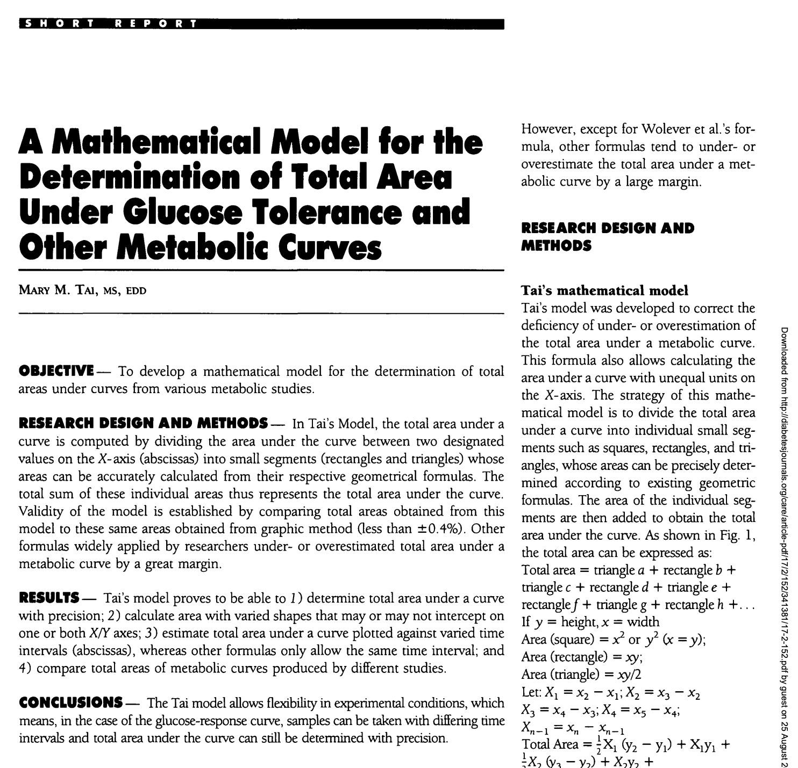{width="100%" fig-alt="Funny screenshot of a paper purporting to have discovered the trapezoid rule "}

:::
::::

---

## Development cycle

:::: {.columns}
::: {.column width=35%}
- Write the algorithm down on paper
- If you don’t understand everything : goto step 1
  - else : continue
- Write pseudocode
- If you don’t understand everything : goto step 3
  - else : continue
- Write code
- Check code with unit tests
  - Check “pass” criterion
  - Check “fail” criterion
  - If unit test fails : goto Step 5
- **Publish!**
:::
::: {.column width=60%}

- For programmers, "publish" also means "document and preserve your code"
  - Science must be *reproducible*
  - We do science with our code
  - Therefore, our **code must be reproducible!**
- 99% of the time, this means committing your code to a git repository, along with *documentation*.

```bash
git add theta.py
git commit -m "Feature: add theta function"
git push origin HEAD:main

# Tag a stable release
git tag -a v1.0 -m "First stable version of theta package"
git push origin v1.0
```
:::
::::

--- 

## A few take-home messages

- Machines do not understand infinite precision
  - We’ll get to that
- Machines do exactly what we ask them to
  - We’ll get to that too
- Thinking ahead can save you a lot of time!
- We’ve seen the power of python
  - Looks almost like pseudocode (which you should be writing anyway)
  - Good as a first stab at something
  - But, 10–100x slower than compiled code! 

---

## Summary

- By the end of the course, you will know (kind of) (aka, things to write on your CV):
  - Python (programming, unit test)
  - C++ (programming, at least understand other people’s code)
  - How to debug both!
  - Markdown (pandoc, Latex) (documentation)
  - Terminal (just to make life less miserable)
  - Docker (just to make life less miserable)
  - Git / GitHub (documentation, collaboration)
  - Numerical recipes for data science (Yeah science!)
  - How to work together on a (scientific) software project
  - Machine learning aka AI
  - “The first time I used a Quantum Computer”

---

## Checkpoint

- Hopefully this whets your appetite.
- On Wednesday, we will dive right into computing and software requirements!
- Things you can do beforehand (or right now):
  - Make a GitHub account
    - Choose your username wisely! It is difficult to change later on. You probably don't want to be `Y0uG0tPwnedByANoob420` for the rest of your career. Keep it simple: typing many capital letters, dashes/underscores gets annoying (`David_Ren-Hwa_Yu` vs `dryu55`)
  - **For Windows users**: install Windows Subsystem for Linux (WSL), ideally with Ubuntu.  
    - I recommend following [https://learn.microsoft.com/en-us/windows/wsl/install](https://learn.microsoft.com/en-us/windows/wsl/install), but you can also download from the Microsoft store
  - Download a modern code editor
    - If you don't have one yet, I highly recommend [Microsoft Visual Studio Code](https://code.visualstudio.com/) ("vscode"). 


```{ojs}
//| echo: false
katex = require("katex@0.16.9/dist/katex.min.js")
```

```{ojs}
//| echo: false
function vectorDiagram(A, B, {width=500, height=320, displayWidth=null, scale=null, padding=70} = {}) {
  const vectors = [A, B];
  const LABEL_W = 160, LABEL_H = 44;

  // Bounding box that always includes the origin and both vector tips
  const xs = [0, A.x, B.x];
  const ys = [0, A.y, B.y];
  const minX = Math.min(...xs), maxX = Math.max(...xs);
  const minY = Math.min(...ys), maxY = Math.max(...ys);
  const rangeX = Math.max(maxX - minX, 1e-6);
  const rangeY = Math.max(maxY - minY, 1e-6);

  // Reserve room for a label's footprint beyond the padded edges, so the
  // auto-fit scale doesn't push vector tips right up against the boundary
  // with nowhere left for their labels.
  const availableW = width - 2 * padding - LABEL_W;
  const availableH = height - 2 * padding - LABEL_H;

  const MAX_SCALE = 160;
  const autoScale = Math.min(availableW / rangeX, availableH / rangeY, MAX_SCALE);
  const s = scale ?? autoScale;

  const renderedW = rangeX * s, renderedH = rangeY * s;
  const originX = padding + (availableW - renderedW) / 2 - minX * s;
  const originY = height - padding - (availableH - renderedH) / 2 + minY * s;

  const toScreen = (x, y) => [originX + x * s, originY - y * s];
  const [ox, oy] = toScreen(0, 0);

  const svg = d3.create("svg").attr("viewBox", [0, 0, width, height]);

  if (displayWidth) {
    svg.attr("width", displayWidth).attr("height", displayWidth * height / width);
  } else {
    svg.style("width", "100%").style("height", "auto");
  }

  svg.append("defs").html(`<marker id="arrow" markerWidth="8" markerHeight="8"
    refX="6" refY="3" orient="auto"><path d="M0,0 L0,6 L7,3 z" fill="#378ADD"/></marker>`);

  // Hard safety net: whatever the scale/position math above produced,
  // never let a label's box actually leave the canvas.
  function clampLabelPos(x, y, anchor) {
    const margin = 4;
    let cx = anchor === "start"
      ? Math.min(x, width - LABEL_W - margin)
      : Math.max(x, LABEL_W + margin);
    let cy = Math.min(Math.max(y, LABEL_H - 16 + margin), height - 20 - margin);
    return [cx, cy];
  }

  function addLabel(x, y, anchor, texStr, color) {
    const [cx, cy] = clampLabelPos(x, y, anchor);
    const rendered = katex.renderToString(texStr, {throwOnError: false, output: "html"});
    svg.append("foreignObject")
      .attr("x", anchor === "end" ? cx - LABEL_W : cx)
      .attr("y", cy - 24)
      .attr("width", LABEL_W).attr("height", LABEL_H)
      .style("overflow", "visible")
      .append("xhtml:div")
      .style("font-size", "20px")
      .style("color", color)
      .style("text-align", anchor === "end" ? "right" : "left")
      .html(rendered);
  }

  for (const v of vectors) {
    const len = Math.hypot(v.x, v.y);
    const [sx, sy] = toScreen(v.x, v.y);
    if (len < 1e-6) {
      svg.append("circle").attr("cx", ox).attr("cy", oy).attr("r", 5).attr("fill", "#E24B4A");
      addLabel(ox + 10, oy - 10, "start",
        `\\vec{${v.label}} = (${v.coordsTex}) \\ \\text{— zero vector}`, "#A32D2D");
    } else {
      svg.append("line").attr("x1", ox).attr("y1", oy).attr("x2", sx).attr("y2", sy)
        .attr("stroke", "#378ADD").attr("stroke-width", 2.5).attr("marker-end", "url(#arrow)");
      addLabel(sx + (v.x >= 0 ? 8 : -8), sy - 8, v.x >= 0 ? "start" : "end",
        `\\vec{${v.label}} = (${v.coordsTex})`, "#0C447C");
    }
  }
  return svg.node();
}
```
