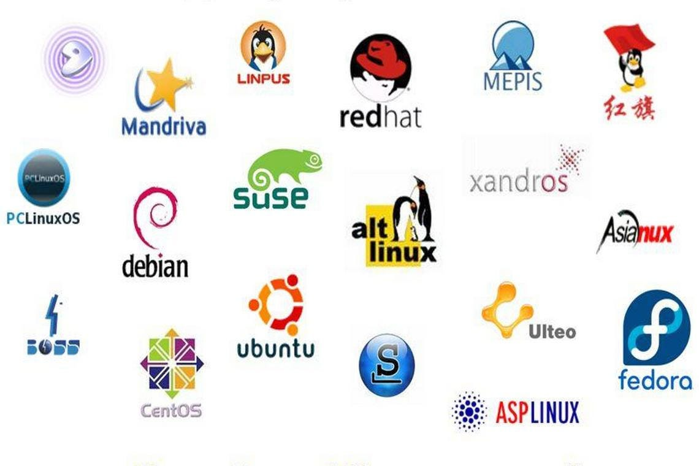
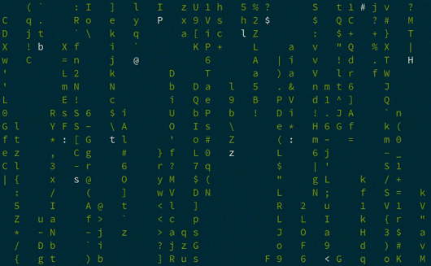
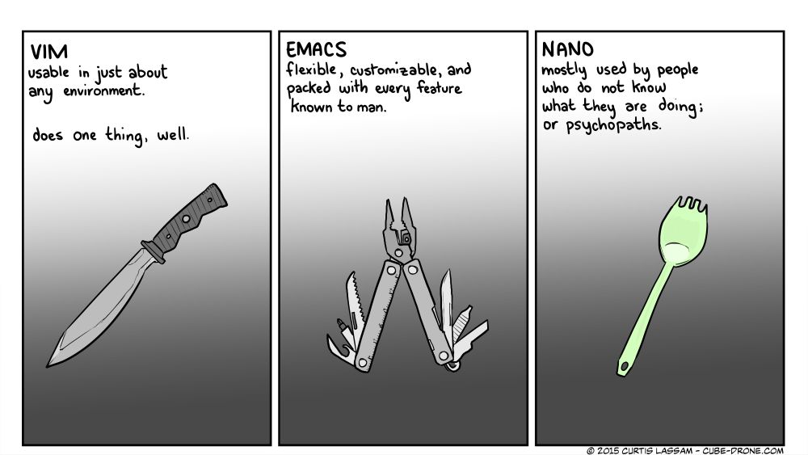

# Unix overview

---

## Technical lectures

- We will have several technical lectures to get you up to speed with programming and technical skills:
  - Using UNIX/LINUX command line
  - Version control with git
  - C++ language
    - Plus more general concepts: data representations, control flow, object oriented programming, simple algorithms

---

## Goals for today

- Set up a working terminal environment (Windows users: install WSL2 with Ubuntu).
- Use git to clone (=download) the class software repository, [github.com/ubsuny/CompPhys](http://github.com/ubsuny/CompPhys)
- Set up software environment using [pixi](https://pixi.prefix.dev/latest/).
  - You should be able to launch a Jupyter notebook server by the end of the day.
  - If this really doesn't work, you can also use our Docker container (ask the instructor). 
- Start learning Unix commands inside the software environment.

---

## Instructions

- Head over to the [setup instructions](../setup.qmd) and follow the instructions to create your software environment.
- Note: if you are already proficient in this, feel free to configure your environment however you like! 
  - I may not be able to provide much support if things don't work
  - Inspect `CompPhys/pixi.toml` to see the required software. Besides python packages, you will need a C++ compiler and swig.


# Unix basics

---

## UNIX/LINUX

:::: {.columns}
::: {.column width="55%"}
- Family of operating systems (like Windows or Mac OS)
  - We will be using LINUX (an offshoot of UNIX)
  - Invented by Linus Torvalds in 1991
  - Mac OS X is built upon UNIX
  - Microsoft works closely with Canonical to integrate Ubuntu
- EdX course from the creator here :
  - https://www.edx.org/course/introduction-linux-linuxfoundationx-lfs101x-0#!
- Linux is completely open source: you can modify it at will, and debuggers are also free
- Predominantly command line tools
- Command "cheat sheet": <http://barc.wi.mit.edu/education/bioinfo/pages/scripts/unix_cheat_sheet.html>
:::
::: {.column width="45%"}
{width="100%" fig-alt="Graphic containing the icons of many Linux distros"}
:::
::::

---

## Linux shells, aka terminals

:::: {.columns}
::: {.column width="70%"}

- Command-line interface is called a "shell"
  - Type a command, hit enter to execute
- A few popular options:
  - `bash` (as in, smash), `zsh` (MacOS default, similar to `bash`) and `csh` (like "sea shell", modern version is `tcsh`, "tea sea shell")
- All basically do the same thing
  - Major difference: environment variables syntax
  - zsh/bash: `export X=value`, tcsh: `setenv X value`
  - zsh is more POSIX-friendly (set of standards)
  - That’s about it for the purposes of this class

:::
::: {.column width="25%"}
{width="90%" fig-alt="Animated Matrix movie shell"}
:::
::::

---

## Basic commands: file system

:::: {.columns}
::: {.column width="50%"}

- A terminal is not so different from your Finder (MacOS)/Explorer (Windows), except with text commands instead of clicking on things.
- You always have a "current working directory": the folder you are current in.
- But how do you tell where you are?
- `pwd`: "**p**rint **w**orking **d**irectory".

:::
::: {.column width="50%"}
```bash
dryu@cast-dyu23ml ~ % pwd
/Users/dryu
```
- When you launch a new terminal, you typically start in your home directory.
:::
::::

---

## Basic commands: list directory

:::: {.columns}
::: {.column width="50%"}

- `ls`
  - **l**i**s**ts the content of the current directory
  - Command usually accept "flags" that customize their behavior. For example: `ls -lrth` adds 4 flags:
    - `-l`: long format (e.g. file size, last modified date)
    - `-r`: reverse sort order
    - `-t`: sort by modified time (default=descending)
    - `-h`: print file sizes in human-readable format

:::
::: {.column width="50%"}
```
dryu@cast-dyu23ml ~ % ls
Applications  Documents			Games
Desktop       Downloads			Library
```

```
dryu@cast-dyu23ml ~ % ls -lrth
total 20624
drwx------@    7 dryu  staff   224B Mar 25 13:04 Applications
drwxr-xr-x     4 dryu  staff   128B Mar 25 13:06 Games
drwx------@   30 dryu  staff   960B Apr 13 13:17 Documents
drwx------@   99 dryu  staff   3.1K Aug 19 00:47 Library
drwx------@   22 dryu  staff   704B Aug 19 23:24 Desktop
drwx------@ 1016 dryu  staff    32K Aug 25 11:16 Downloads
```

:::
::::

---

## Basic commands: make/change directory

:::: {.columns}
::: {.column width="50%"}

- `mkdir` 
  - **m**a**k**es a **dir**ectory, aka a new folder (inside your current working directory)
    - Common variant: `mkdir -pv`
      - `-p` creates folders recursively, i.e., you can make `many/sub/folders/at/once`
      - `-v` is "verbose": prints extra info while executing (works for many commands)
- `cd some_dir`
  - **c**hange **d**irectory

:::
::: {.column width="50%"}
```
dryu@cast-dyu23ml PHY410 % mkdir scratch_dir
dryu@cast-dyu23ml PHY410 % ls
CompPhys  scratch_dir
dryu@cast-dyu23ml ~ % cd scratch_dir
dryu@cast-dyu23ml ~ % pwd
 /Users/dryu/PHY410/scratch_dir
```

:::
::::

---

## Basic commands: text files
- `less some_file.txt`: text file viewer
  - Spacebar/b: jump down/up
  - `/ [text]` or `? [text]`: search down/up
  `less -N some_file.txt`: add line numbers
- `cat some_file.txt`: print the whole file to the terminal (sometimes useful, for example to copy the whole file to the clipboard)
  - `cat file1.txt file2.txt ...`: con**cat**enate files, print result to command line
- `nano some_file.txt`: barebones text editor
- `emacs some_file.txt`, `vi some_file.txt`: sophisticated text editors
- `code some_file.txt`: open file in Visual Studio Code (if installed)

---

## Basic commands: manipulating files

- `cp some_file new_path`: copy a file
  - `cp -r some_dir new_dir`: copy a directory (**r**ecursively)
- `mv some_file new_path`: move a file or directory
- `touch new_file`: create a new empty file
- `touch existing_file`: update "last modified date" of existing file
- `ln -s some_file_or_dir shortcut_name`: create a "soft link", aka alias or shortcut, to a file or directory

---

## Basic commands: deleting files

- `rm some_file`: **R**e**m**ove aka delete a file
  - BE VERY CAREFUL! No trash can or recycle bin, files are gone immediately and forever!!
  - `rm -r some_dir`: recursively remove a directory
  - `rm -i`: **i**nteractive deletion, aka ask for confirmation
  - `rm -f`: **f**orce deletion, aka don't ask for confirmation

---

## Pro tips

- What if I hate typing files one at a time?
  - Then Linux is the best operating system for you!
- Linux has a huge number of shortcuts:
  - tab completion : If you start typing and press "TAB", it will list the possible completions, or if there is only one, complete it for you! USE THIS for long file names
- "up" key: scroll through previously executed commands
- `cd` special arguments:
  - `cd` returns to home directory
  - `cd ..` goes up one directory
  - `cd -` goes to previous directory you were in
- aliases : can define your own shortcuts for commands
  - `alias ll=‘ls -lrth’`
- wildcards!
  - compphys@fed9071469a4:~$ ls /opt/venv/bin/python*
  - /opt/venv/bin/python  /opt/venv/bin/python3  /opt/venv/bin/python3.12

---

## More pro tips

- When you open a new terminal, the shell automatically executes a script: usually `.bashrc`/`.zshrc` (sometimes `.bash_profile`, `.profile...). 
- Use this to customize your shell experience. A few examples from my own `.zshrc`:

```
# Always ask before deleting, unless -f
alias rm='rm -i'

# More useful ls
alias ll='ls -ltrhG'

# Use nano when programs ask for text input
export EDITOR=nano

# Default to terminal-only emacs, no slow X window app
alias emacs='emacs -nw'

# Customize command prompt (can do wild stuff)
export PS1='%F{blue}%~ %(?.%F{green}.%F{red})%#%f '

```

---

## More advanced commands

- Getting into the weeds a bit. I usually have to Google/Claude these commands.
- `grep -R 'some_string' ./*py`: text search (recursive) in specified files
- `file /path/to/search -name "filename"`: search by filename
- `sed`: search-and-replace in files. *Be very careful!* Test it before running the real thing!
- `awk`
  - Search and perform operations on text files (rather complicated, almost a language by itself)
- `|`: "piping", used to chain commands together. 
  - Example: `grep -R "import" ./*py | less`
- `command > file.txt` (`>&`, `>>`, `>>&`, ...): various ways to save outputs to a file
- `top`: activity monitor, shows running processes
  - Kill a stuck process: hit "k" then type process ID
  - `top -u username` to filter by username

---

## Anatomy of an ls -l

:::: {.columns}
::: {.column width=40%}
- What the heck is this stuff?

```
~/PHY410/CompPhys % ls -lrth
total 72
-rw-rw-r--@  1 dryu  staff   2.2K Aug  5  2025 README.md
```
:::
::: {.column width=60%}
:::: {.r-stack}
::: {.fragment .fade-out fragment-index=0}
- `1`: Number of links
- `dryu staff`: file owner and group (don't worry about group ownership unless you're a sysadmin)
- `2.2K`: file size
- `Aug 5 2025`: last modified date
- `README.md`: filename
:::
::: {.fragment fragment-index=0}
- `-rw-rw-r--@`: permissions (r=read, w=write, x=execute)
  - 10 characters
  - First char: `-` for file, `d` for directory
  - Next 3 = rwx for user (`-` if blocked)
  - Next 3 = rwx for group
  - Next 3 = rwx for everyone else
  - Shorthand: r=4, w=2, x=1, add up numbers (i.e. rwx=7, r-x=5, etc.)
- Use `chmod` and `chown` to edit permissions (Google when needed)
- (Note: MacOS has additional complications, don't worry about it now)
:::
::::
:::
::::

---

## Code editors

- Now we come to one of the greatest scientific controversies of all time:

<div style="text-align: center; font-size: 5rem;">
THE EDITOR WARS
</div>


---

## Code editors

{width="70%" fig-alt="Cartoon comparing vim, emacs, and nano"}

---

## Code editors

- 

{width="70%" fig-alt="XKCD cartoon satirizing code editor wars"}

---

## Code editors

- In-terminal editors
  - nano: most basic
  - emacs/vim: industry standards
  - Definitely useful for quick edits; a lot of people use emacs/vim for everything
  - Critical info: how to quit 😹
    - vim: `esc` then `:q` 
    - emacs: `ctrl-x ctrl-c`
- Graphical editors
  - Visual Studio Code (vscode)
  - Sublime Text (note: paid, though very generous free features).
  - vscode in particular is extremely popular these days, probably most useful in industry. It’s even baked into github.com.
- Use what you’re most comfortable with! ...but if you are not sure, use vscode.

---

## Checkpoint

- We have reviewed basic Unix commands
  - When in doubt, use Google/AI! There is a lot to remember, which can only be learned over time, by doing.
- You will be a 🧙 before you know it!
- By next lecture, you should:
  - Be comfortable interacting with files via the terminal.
  - Be able to open and edit files in a code editor (vscode, emacs, vim, Sublime Text, ...).
  - Have a GitHub account with SSH key, and ability to `git clone`
  - Have followed the setup instructions ([link](../setup.qmd)) through setting up your pixi environment.
- If anything isn't working, send me a message or stop by my office!

---

## Next time

- Up next: git, then C++.
  - Make sure you send me your GitHub username! I will add you to the ubsuny GitHub group
- We will have an ungraded "test" assignment, just to exercise all the machinery before real homework.

