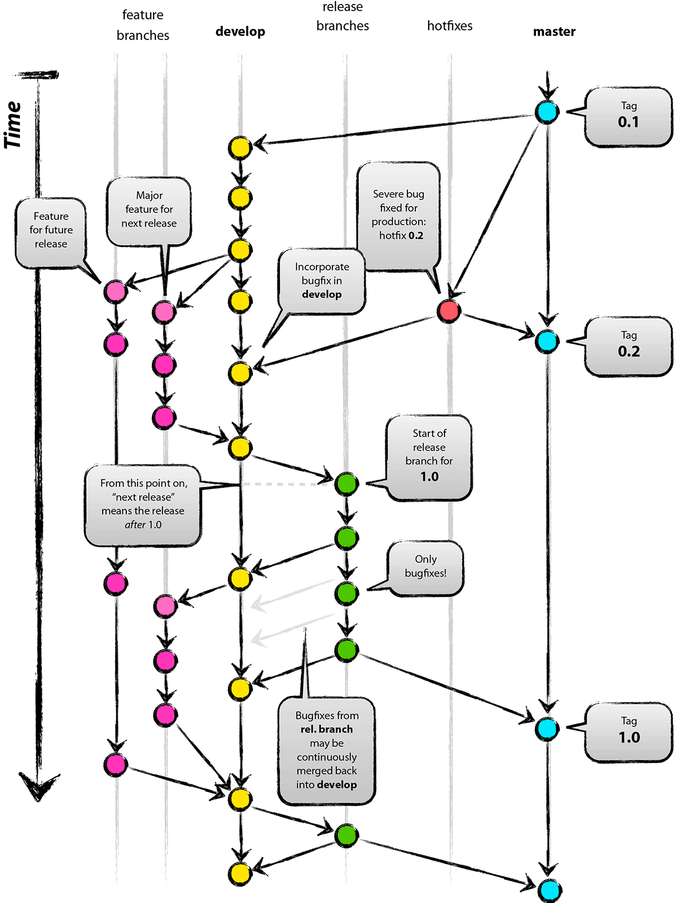
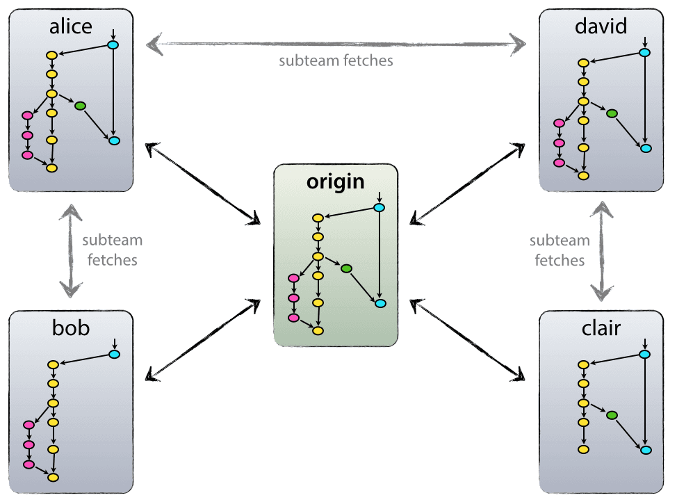
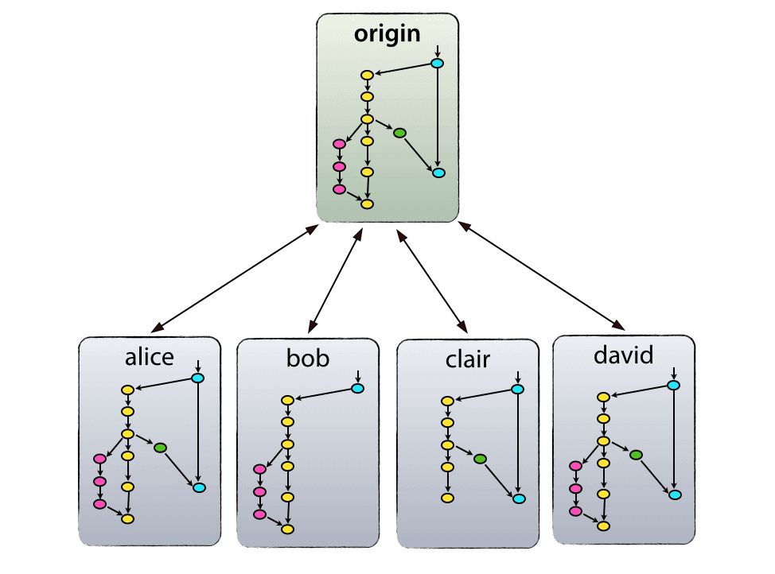
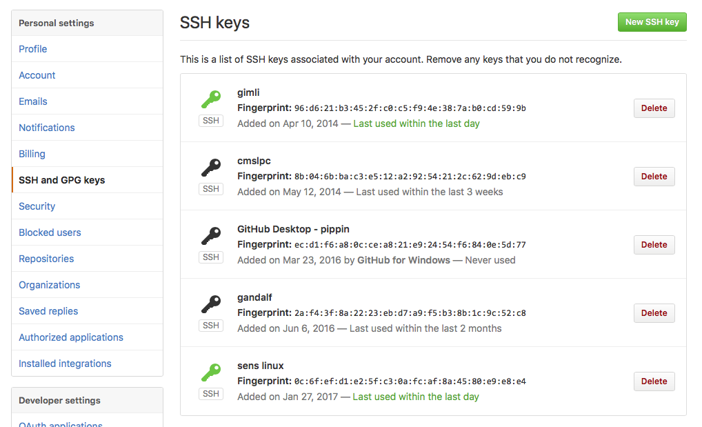
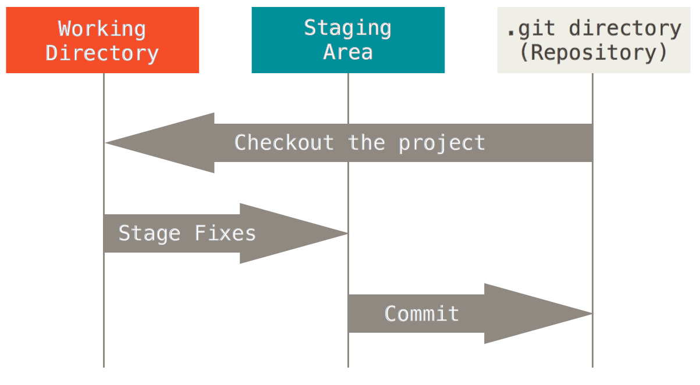

---
title: "Git"
date: "today"
date-format: "[Fall] YYYY"
author:
  - name: David Yu
    orcid: 0000-0001-5921-5231
    email: dyu23@buffalo.edu
    affiliations: University at Buffalo
execute:
  keep-ipynb: false
---

## GIT

- With thanks to Kevin Pedro (Fermilab)

---

## Git introduction

:::: {.columns}
::: {.column width="55%"}
- Git is a version control system: a tool to manage and track changes in a codebase.
  - [Invented by Linus Torvalds](https://blog.brachiosoft.com/en/posts/git/) for managing the Linux kernel!
- Visualize code development as a graph:
  - Vertical line = branch: a copy of the code created for a specific purpose (main copy; bug fix; specific feature development).
  - Point = commit: some unit of development.
    - With a commit message to document what was done!
  - Arrow = merge: pull changes between branches
    - Merge new features into the main branch.
    - Manage concurrent developments, e.g., feature developer pulls in a hotfix.
- [https://nvie.com/posts/a-successful-git-branching-model/](https://nvie.com/posts/a-successful-git-branching-model/)
:::
::: {.column width="45%"}
{width="100%" fig-alt="TODO: describe image"}
:::
::::

---

## Landscape of VCSes

<!-- TODO: complex slide layout (flagged by detect_complex_slide.py - see run log). Content below is complete but UNARRANGED - needs manual layout to match the original slide. -->

- Git is a distributed VCS.
  - Distributed: Mercurial (Hg), Fossil
  - Centralized: Concurrent version systems (CVS), Subversion (SVN), Perforce (popular in industry)
  - Any of these are infinitely better than copying-and-pasting folder and files on your own computer!
- Github: a server for hosting and managing git repositories.
  - Lots of bells and whistles.
  - It has a [website](https://github.com/), [desktop app](https://desktop.github.com/download/), and [command line tools](https://cli.github.com/).
  - Other options: gitlab (used extensively at CERN), BitBucket, Gitea, …

{fig-alt="TODO"}

{fig-alt="TODO"}

- Centralized

- Distributed

---

## Setup: basics

- I think everyone has installed git and made a Github account
  - If not, try to catch up now.
- Demo: some basic setup
  - ~/.gitconfig contains a few parameters.
  - Set with:
  - git config --global user.name [first last]
  - git config --global user.email email@email.com
  - git config --global user.github [Github username]
  - git config --global core.editor nano

---

## Setup: SSH keys

<!-- TODO: complex slide layout (flagged by detect_complex_slide.py - see run log). Content below is complete but UNARRANGED - needs manual layout to match the original slide. -->

- Fastest/best way to use git is over SSH (vs. HTTP)
- To communicate between your terminal and GitHub.com, you need SSH keys (basically a password for your terminal session)
  - [https://docs.github.com/en/authentication/connecting-to-github-with-ssh](https://docs.github.com/en/authentication/connecting-to-github-with-ssh)

{fig-alt="TODO"}

{fig-alt="TODO"}

{fig-alt="TODO"}

- Enter file in which to save the key (/Users/dryu/.ssh/id_ed25519): /Users/dryu/.ssh/id_ed25519_phy410
- Enter passphrase for "/Users/dryu/.ssh/id_ed25519_phy410" (empty for no passphrase):
- Enter same passphrase again:
- Your identification has been saved in /Users/dryu/.ssh/id_ed25519_phy410
- Your public key has been saved in /Users/dryu/.ssh/id_ed25519_phy410.pub
- The key fingerprint is:
- SHA256:iYFcw453lvE3S5REO4zaKc/fn9ULHDklWSwcv4GpL2o dyu23@buffalo.edu
- The key's randomart image is:
- +--[ED25519 256]--+
- |     .o    o+oo. |
- |   . o...  oo+*. |
- |    oo.  +..+=.+ |
- |    . oo++..=.+ o|
- |     ..oS o+ * . |
- |         +  + o .|
- |          o. +  o|
- |         E..... +|
- |        ..  . .+.|
- +----[SHA256]-----+

- Copy the contents of id_<alg>.pub here

---

## Setup: SSH agent

- An SSH agent allows git to use your (password-protected) SSH key without typing your password every time.
  - Instead, only needs your password once at login:
- eval "$(ssh-agent -s)"
- ssh-add ~/.ssh/id_rsa_github
- You might also have to tell SSH which key to use. Add the following lines to ~/.ssh/config:
- Host github.com
- IdentityFile ~/.ssh/my_key
  - Then run:
- chmod 644 ~/.ssh/config

{width="70%" fig-alt="TODO: describe image"}

- Pro tip: your terminal runs the ~/.bashrc file on launch. So, you can put commands here that get run at the start of every new session.
- # start ssh-agent
- if [ -z $SSH_AGENT_PID ]; then
- eval `ssh-agent -s` > /dev/null
- fi
- alias addkey='ssh-add ~/.ssh/my_key'
{width="70%" fig-alt="TODO: describe image"}

---

## Working with git

- Next, let's introduce some of the basic git commands.
- Warnings:
  - Names of the commands can be confusing and unintuitive!
  - Different VCSes can use the same words for different things.
  - Options can make commands do very different things.
- Don't be intimidated! You will learn by doing, and develop muscle memory for the git language.
- Most important: build a mental model of what git is doing.
  - Conceptual understanding can help you look up a command for accomplishing a specific task.

---

## Big picture

<!-- TODO: complex slide layout (flagged by detect_complex_slide.py - see run log). Content below is complete but UNARRANGED - needs manual layout to match the original slide. -->

{fig-alt="TODO"}

- [github.com](http://github.com)

- pull from github
- push to github

---

## Repositories

- Repositories ("repos"): a collection of files that make up a software project.
  - Top-level object in git
- Repositories contain:
  - Source code
  - README files and other documentation (often written in [Markdown](https://docs.github.com/en/get-started/writing-on-github/getting-started-with-writing-and-formatting-on-github))
  - Input files (e.g. configuration data, YAML)
- DO NOT INCLUDE:
  - Large binary files (executables)
  - Large data
  - These make the repo size explode, and bog down git operations that should be very fast.
  - Tip: .gitignore file specifies file types to ignore

---

## Demo: create and clone hello world

<!-- TODO: complex slide layout (flagged by detect_complex_slide.py - see run log). Content below is complete but UNARRANGED - needs manual layout to match the original slide. -->

{fig-alt="TODO"}

- Command line equivalent:
- git init

{fig-alt="TODO"}

- Create a repo

- Clone the repo to laptop

- cd PHY410
- git clone git@github.com/ubsuny/helloworld2025.git

---

## Demo: create and clone hello world

- dryu@cast-dyu23ml PHY410 % cd $HOME/PHY410
- dryu@cast-dyu23ml PHY410 % git clone git@github.com:ubsuny/helloworld2025test.git
- Cloning into 'helloworld2025test'...
- Enter passphrase for key '/Users/dryu/.ssh/id_rsa_github_cmslpc':
- remote: Enumerating objects: 3, done.
- remote: Counting objects: 100% (3/3), done.
- remote: Total 3 (delta 0), reused 0 (delta 0), pack-reused 0 (from 0)
- Receiving objects: 100% (3/3), done.
- dryu@cast-dyu23ml PHY410 % ll
- drwxr-xr-x   4 dryu  staff   128B Aug 29 10:14 helloworld2025test
- dryu@cast-dyu23ml PHY410 % cd helloworld2025test
- dryu@cast-dyu23ml helloworld2025test % ls
- README.md
- dryu@cast-dyu23ml helloworld2025test % ll
- total 8
- -rw-r--r--  1 dryu  staff    20B Aug 29 10:14 README.md

---

## Basic concepts

- Branch: development area for project
  - Basically, just a copy of the files that git keeps track of.
  - main is the default name for the central branch, i.e., "true" code.
  - Create branches for specific feature development or bug fix, e.g.,feat-pdesolver or fix-hcal-energy-segfault. These likely have a finite lifecycle, lasting until feature is merged back to main.
- Commit: a set of changes to the project
  - Modify, add, or delete files.
  - Under the hood, a commit is just a diff: a list of lines changed, added, or removed.
  - Commits are indexed by a hash: an algo (e.g. SHA-1) creates a unique identifier based on commit metadata (parent commit, date, author, message, etc.)

- dryu@cast-dyu23ml helloworld2025test % git branch -a
- * main
- remotes/origin/HEAD -> origin/main
- remotes/origin/main
- dryu@cast-dyu23ml helloworld2025test % git checkout -b learning-branch
- Switched to a new branch 'learning-branch'
- dryu@cast-dyu23ml helloworld2025test % git branch -a
- * learning-branch
- main
- remotes/origin/HEAD -> origin/main
- remotes/origin/main

---

## Basic concepts

- Tag: a specific named version of the project (i.e. snapshot)
- Release: a Github extension of the tag concept with some extra metadata (release notes, downloadable tarball, ...)
  - Under the hood, tags and releases are just labels for a specific commit!
- (Un)tracked files: whether git is tracking a given file. The folder corresponding to your repo can contain both tracked and untracked files.

- Commits are the fundamental unit of git.
  - A given commit is frozen and unique.
  - Commits are ordered. Since each commit is a diff, they intrinsically depend on the parent commit.
- Branches are active, and can change
  - Under the hood, a branch points to the latest commit (called HEAD).
  - The branch updates every time you make a commit, i.e., it moves HEAD to point to the latest commit.
- Use git log to view the commit history

- Active vs. frozen

---

## Basic workflow

:::: {.columns}
::: {.column width="55%"}
- origin: copy of repo stored on [github.com](http://github.com)
- local: copy of repo stored on your laptop
  - Stored in the .git folder
  - Don't touch this folder! Only git should interact with it.
- Working area: actual files that you are coding on
:::
::: {.column width="45%"}
{width="100%" fig-alt="TODO: describe image"}
:::
::::

---

## Working with branches

:::: {.columns}
::: {.column width="55%"}
- git switch [branch or commit hash]
  - Switch to the specified branch (or commit)
  - This command affects your working area: the files will change to correspond to the branch!
  - Don't worry, nothing is lost. Git is smart enough to stop you if you are about to delete something permanently.
- git switch -c [new-branch-name]
  - Create a new branch and switch to it.
  - Needs git v2.23 or newer.
- git restore [ref] [file]
  - Switch specified file to the version in ref
- git checkout
  - Older command combining switch and restore.
  - git checkout [branch-name]: switch to branch
  - git checkout -b [new-branch-name]: create and switch to new branch
  - Many more options, see git checkout --help
:::
::: {.column width="45%"}
{width="100%" fig-alt="TODO: describe image"}
:::
::::

---

## Working with branches

:::: {.columns}
::: {.column width="55%"}
- git branch -a
  - List all branches (-a includes remote branches)
- git branch [branch]
  - Make a new branch
- git branch [branch] [ref]
  - Make a new branch to follow ref
- git branch -m [old] [new]
  - Rename a branch
- git branch -d [branch]
  - Delete a branch
- Additional commands
  - Don't try to memorize them all now. Google is your friend!
:::
::: {.column width="45%"}
{width="100%" fig-alt="TODO: describe image"}
:::
::::

---

## Working with commits

- git add [a new file]
  - Tell git to track a new file
- git commit -am "documentation message"
  - Make a commit (snapshot) of all current changes to tracked files
  - If you don't specify -m, git will open an editor an make you do it :)
- git rm [unwanted file]
  - Delete a file and stop tracking it
  - git rm --cached [unwanted file]: stop tracking a file, but do not delete it
- git mv [old path] [new path]
  - Rename a file, both in git and on your filesystem
- git *** --dry-run:
  - Git prints what the command will do, without actually executing it.

- dryu@cast-dyu23ml helloworld2025test % git rm --cached helloworld.txt
- rm 'helloworld.txt'
- dryu@cast-dyu23ml helloworld2025test % git status
- On branch learning-branch
- Changes to be committed:
- (use "git restore --staged <file>..." to unstage)
- deleted:    helloworld.txt

---

## Working with forks and remotes

- A remote is a copy of the repo somewhere else in the world, i.e. not the copy on your laptop.
  - A fork is a copy of the repo. For example, you can fork [github.com/ubsuny/CompPhys](http://github.com/ubsuny/CompPhys) to your own account, [github.com/DryRun/CompPhys](http://github.com/DryRun/CompPhys)
- git remote
  - -v: print list of remotes
  - add [name] [url]: add a new remote (e.g., your fork on GitHub)
  - rename [old name] [new name]: change name
  - set-url [remote name] [new url]: change url
  - remove [remote name to remote]: removes the remote from your list (does not delete)

- git push [remote] [ref]
  - Send local [ref] to remote
  - Ex.: git push origin HEAD:feature-branch
  - git push [remote] [ref]:[remote_ref]: push local [ref] to remote, and change name on the remote to [remote_ref].
    - Ex.: git push origin HEAD:feat-branch pushes your HEAD to a remote branch named feat-branch

---

## Demo: make some changes, commit, and push

- Make some changes:
- dryu@cast-dyu23ml helloworld2025test % echo "Hello world" > helloworld.txt
- Tell git to track this file:
- dryu@cast-dyu23ml helloworld2025test % git add helloworld.txt
- Inspect changes:
- dryu@cast-dyu23ml helloworld2025test % git status
- On branch learning-branch
- Changes to be committed:
- (use "git restore --staged <file>..." to unstage)
- modified:   helloworld.txt

- Make a commit with a message:
- dryu@cast-dyu23ml helloworld2025test % git commit -m "Add helloworld.txt"
- [learning-branch 6010c00] Add helloworld.txt
- 1 file changed, 1 insertion(+), 1 deletion(-)
- dryu@cast-dyu23ml helloworld2025test % git status
- On branch learning-branch
- nothing to commit, working tree clean
- Push to github:
- dryu@cast-dyu23ml helloworld2025test % git push origin HEAD:learning-branch
- ...
- To github.com:ubsuny/helloworld2025test.git
- * [new branch]      HEAD -> learning-branch
- Head to GitHub and make a pull request (PR)

---

## Utilities

- Git provides tools for human understanding of the repo
- git status
  - See current state of working area, e.g., modified files ready to be committed.
- git log
  - View commit history
  - --raw, --graph, --decorate
- git diff
  - Print changes using Unix diff format
  - git diff [some file] shows changes to one file
  - git diff [c1] [c2] compares two specific commits
- git grep
  - Search code

- dryu@cast-dyu23ml helloworld2025test % git status
- On branch learning-branch
- Changes not staged for commit:
- (use "git add <file>..." to update what will be committed)
- (use "git restore <file>..." to discard changes in working directory)
- modified:   helloworld.txt
- no changes added to commit (use "git add" and/or "git commit -a")
- dryu@cast-dyu23ml helloworld2025test % git log --pretty=oneline --abbrev-commit
- a7b0cff (HEAD -> learning-branch) Add helloworld.txt
- 8618aa5 (origin/main, origin/HEAD, main) Initial commit
- dryu@cast-dyu23ml helloworld2025test % git status

---

## Recap

<!-- TODO: complex slide layout (flagged by detect_complex_slide.py - see run log). Content below is complete but UNARRANGED - needs manual layout to match the original slide. -->

{fig-alt="TODO"}

{fig-alt="TODO"}

- [github.com](http://github.com)

- pull from github
- push to github
- 1. git clone ssh://git@github.com:ubsuny/CompPhys

- 2. git switch -c my-branch
- (or git checkout -b my-branch)

- 3. Do your coding

- 4. git add [modified file]

- 5. git commit -m "I did a thing"

- 6. git push origin HEAD:new-feature-branch

- 4+5. git commit -am "I did a thing"

---

## Recap

<!-- TODO: complex slide layout (flagged by detect_complex_slide.py - see run log). Content below is complete but UNARRANGED - needs manual layout to match the original slide. -->

{fig-alt="TODO"}

{fig-alt="TODO"}

- [github.com](http://github.com)

- pull from github
- push to github
- 1. git clone ssh://git@github.com:ubsuny/CompPhys

- 2. git switch -c my-branch
- (or git checkout -b my-branch)

- 3. Do your coding

- 4. git add [modified file]

- 5. git commit -m "I did a thing"

- 6. git push origin HEAD:new-feature-branch

- 4+5. git commit -am "I did a thing"

- For the first few assignments, we will go over the exact git commands you will need to run!

---