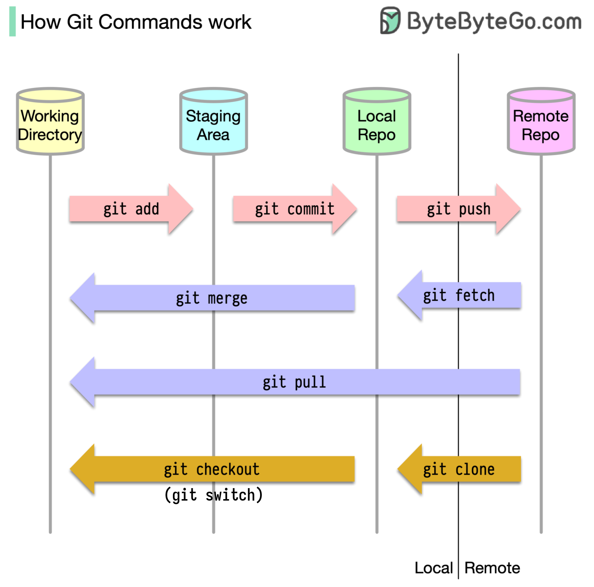
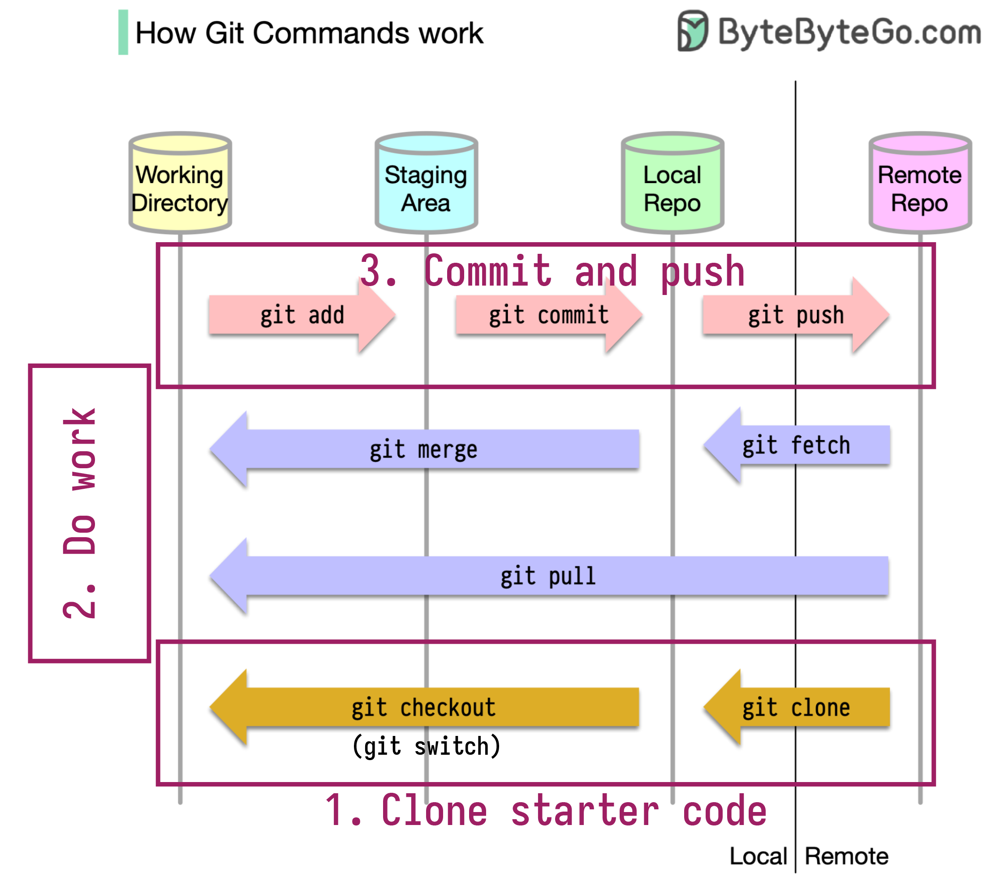
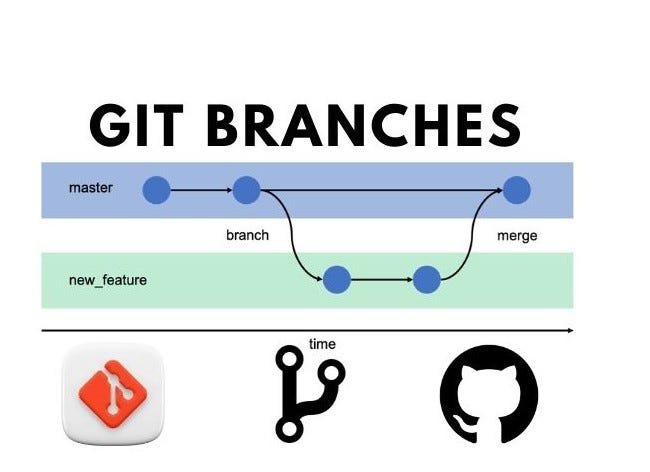
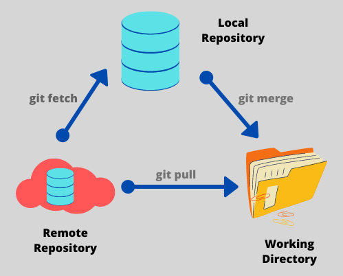
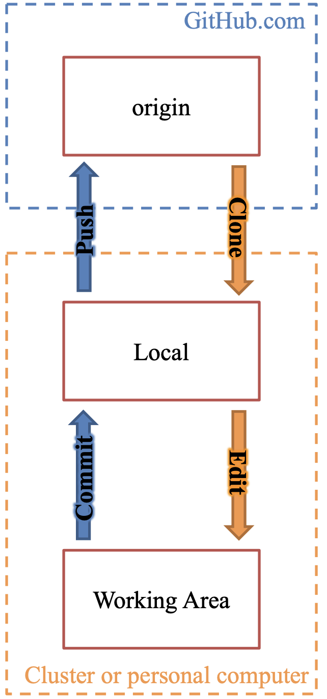

---
title: "Git"
date: "today"
date-format: "[Fall] YYYY"
author:
  - name: David Yu
    orcid: 0000-0001-5921-5231
    email: dyu23@buffalo.edu
    affiliations: University at Buffalo
  - name: Credit to Kevin Pedro
    affiliations: Fermilab
execute:
  keep-ipynb: false
---

# Git overview


## Git introduction

:::: {.columns}
::: {.column width=25%}
{width=90% fig-alt="Git logo"}
:::
::: {.column width="75%"}
- Git is a **version control system**: a tool to manage and track changes in a codebase.
  - [Invented by Linus Torvalds](https://blog.brachiosoft.com/en/posts/git/) for managing the Linux kernel!
- It's not the only VCS, but nearly 100% of scientists use it. 
- Not only code: useful for your thesis, writing papers in latex, easy websites, ...
::: 
::::

---

## Code development as a graph


:::: {.columns}
::: {.column width=60%}
- Key idea: model code development as a graph:

::::: {.fragment}
  - Vertical line = **branch**: a copy of the code created for a specific purpose (main copy; bug fix; feature dev).
:::::
::::: {.fragment}
  - Point = **commit**: snapshot of project (immutable, documented).
    - "New feature"
    - "Fixed bug"
:::::
::::: {.fragment}
  - Arrow = **merge**: pull changes between branches
    - Merge new features into the main branch.
    - Manage concurrent developments, e.g., feature developer pulls in a hotfix.
- [https://nvie.com/posts/a-successful-git-branching-model/](https://nvie.com/posts/a-successful-git-branching-model/)
:::::

:::
::: {.column width="40%"}
)](../assets/0.1_unix/slide81_image35.png){width="85%" fig-alt="Git branching model"}
:::
::::

---

## Remote repositories

:::: {.columns}
::: {.column width=60%}
- In addition to defining the fundamental branching model, git provides tools for connecting **remote repositories**
- You project might have copies on:
  - Your own laptop
  - N colleagues' laptops
  - GitHub (main repo, plus personal copies called *forks*)
  - Live web server, production server, robot dog, ...
- The branch/commit/merge concept is the same, but there is some overhead to communicate across remote repositories. 
:::
::: {.column width=40%}
{width=90% fig-alt="Connected aspen trees"} 
:::
::::

---

## Landscape of VCSes

:::: {.columns}
::: {.column width="55%"}
- Git is a **distributed VCS**.
  - *Distributed*: Mercurial (Hg), Fossil
  - *Centralized*: concurrent version systems (CVS), Subversion (SVN), Perforce (popular in industry)
  - Any of these are infinitely better than copying-and-pasting multiple copies of a project on your own computer!
- Github: a server for hosting and managing git repositories.
  - Lots of bells and whistles.
  - It has a [website](https://github.com/), [desktop app](https://desktop.github.com/download/), and [command line tools](https://cli.github.com/).
  - Other options: gitlab (used extensively at CERN), BitBucket, Gitea, ...
:::
::: {.column width="45%"}
:::: {.r-stack}
::: {.fragment .fade-out fragment-index=0}
)](../assets/0.1_unix/slide82_vcs_centralized.png){fig-alt="Diagram of distributed VCS model"}
:::

::: {.fragment .fade-in-then-out fragment-index=0}
)](../assets/0.1_unix/slide82_pasted-movie.png){fig-alt="Diagram of centralized VCS model"}
:::

::: {.fragment fragment-index=1}
- Note: as far as git is concerned, all branches across remotes are on equal footing (in principle). 
  We humans label and use them differently (for example, the `main` branch on GitHub is often considered the primary copy; GitHub also defines user permissions).
- The local and remote repo might share branch names (definitely share `main`, possibly others), but remember that git sees them as different branches, and humans are responsible for maintaining the correspondence, usually through "**tracking**". 
:::

::::

:::
::::

---

## Aside: Git vs. GitHub

- Git != GitHub
 - [git](https://git-scm.com/) is the actual version control software
 - [GitHub](https://github.com) is a cloud-based hosting platform for git repositories.
- GitHub is not unique! Other options: [GitLab](https://about.gitlab.com/) (used by CERN), [Bitbucket](https://bitbucket.org/product/), [Gitea](gitea) (self-hosted option)

# Working with git

## Working with git

- Next, let's introduce some of the basic git comcepts and commands.
- Warnings:
  - Names of the commands can be confusing and unintuitive!
  - Different VCSes can use the same words for different things.
  - Options can make commands do very different things.
- Don't be intimidated! You will learn by doing, and develop muscle memory for the git language.
- Most important: build a mental model of what git is doing.
  - Conceptual understanding can help you look up a command for accomplishing a specific task.

---

## Big picture

{fig-alt="Diagram of basic git commands"}

---

## Example: cloning our CompPhys repo

:::: {.columns}
::: {.column width=50%}
{fig-alt="Diagram of basic git commands"}
:::

::: {.column width=50%}
- You should already have cloned our class git repo, <https://github.com/ubsuny/CompPhys>. If not, do so now, following the [setup instructions](../setup.qmd). 

One-liner:
```
git clone -b main git@github.com:ubsuny/CompPhys
```

Separate:
```
git clone git@github.com:ubsuny/CompPhys
git switch main
```

:::: {.callout-tip}
Git may identify the correct branch during `git clone`, but you can be specific to be safe.
::::
:::
::::

---

## Repositories

- What exactly is a repository (or repo)?
  - Repo = collection of files that make up a software project.
- Repositories can contain:
  - Source code
  - README files and other documentation (often written in [Markdown](https://docs.github.com/en/get-started/writing-on-github/getting-started-with-writing-and-formatting-on-github))
  - Input files (e.g. configuration data, YAML)
- The repo "lives" in the `.git` folder (`ls -a` to see hidden files)

::: {.callout-important}
### DO NOT INCLUDE
- Don't upload binary files (executables/compiled programs) or large data!
  - These make the repo size explode, and bog down git operations that should be very fast.
  - .gitignore file specifies file types to ignore and/or use "Git LFS" tool
- Jupyter notebooks are also annoying to manage! 
  - Lots of metadata under the hood that git tries to manage.
:::

---

## Demo: compphys-git-exercise

- For the rest of class, we will do a basic git exercise:
    1. **Basic workflow**: Fork+clone an example repository, add a new file, commit and push back to GitHub, open a pull request
    2. **Branching**: Create a new branch in local repo, modify a file, merge back to local main branch
    3. **Pulling and merging**: learn how to keep your local repo in sync with the primary ubsuny repo with `git fetch/merge/pull`. 
- Step 0: **fork** the repository at <https://github.com/ubsuny/compphys-git-exercise> to your personal GitHub area, so you have a personal copy on GitHub
- Exercise doubles as a survey: I ask you to add some info on your laptop to GitHub
- *If you are new to git*: try to complete at least (1) and (2) in class! Ask each other or the instructor for help. 
- *If you are already experienced with git*: please do at least (1), so I have your hardware info. But feel free to take off afterwards, this is all for today's class.

---

## Setup: basics

- I think everyone has installed git and made a Github account
  - If not, try to catch up now.
- You should also have an SSH key linked to Github.
- Let's also do some basic configuration. Execute the following commands:

```bash
git config --global user.name [first last]
git config --global user.email email@email.com
git config --global user.github [Github username]
# Optional
git config --global core.editor nano
```

- You should be able to see these values in your local git configuration file: `less ~/.gitconfig`.

---

## Demo: compphys-git-exercise 1

:::: {.columns}
::: {.column width=50%}
- First exercise: probably the simplest and most common workflow.
    - Fork the repo at <https://github.com/ubsuny/compphys-git-exercise>
    - Clone the repo with `git clone` (the `main` branch might automatically be selected, if not you might need a `git switch origin/main`). 
    - Follow the directions in `README.md`: copy `template.md` to a new file and edit it.
    - Stage (=git add) and commit (=git commit) the file
    - Push commit to github (your forked repo, not the ubsuny repo)
    - Open a "pull request"
:::
::: {.column width=50%}
{fig-alt="Diagram of basic git commands"}

:::
::::

---

## Demo: compphys-git-exercise 2

:::: {.columns .vcenter}
::: {.column width=50%}
- Second exercise: working with branches
    - All in your local repo, no interaction with github
    - See `README.md` for the instructions
:::
::: {.column width=50%}
{fig-alt="Diagram of basic git commands"}

:::
::::

---

## Demo: compphys-git-exercise 3

:::: {.columns}
::: {.column width=50%}
- Third exercise: merging remote updates
    - After most of you have finished Exercise 1, the ubsuny repo will have new files from everyone.
    - But, your local repo only has your own file, not everyone else's. How do you keep your local repo in sync, i.e., download all the new commits in the ubsuny repo?
    - Answer: `git fetch` and `git merge` (or the combo command, `git pull`). 
  - Hopefully the merge goes smoothly; if not, resolving merge conflicts is beyond today's lecture.
:::
::: {.column width=50%}
{fig-alt="Diagram of basic git commands"}

:::
::::

# Detailed overview
- The remaining slides go into more detail on git concepts.
- I won't read them out loud, but if you are new to git, I highly recommend reading through them!

---

## Branches and commits

:::: {.columns}
::: {.column width=60%}
- Branch: development area for project
  - Basically, just a copy of the files that git keeps track of.
  - main is the default name for the central branch, i.e., "true" code.
  - Create branches for feature devel. or bug fix: `feat-pdesolver` or `fix-segfault`. Finite lifecycle, often deleted once feature is merged into main branch.
- Commit: a set of changes to the project
  - Modify, add, or delete files.
  - Under the hood, a commit is just a diff: a list of lines changed, added, or removed.
  - Commits are indexed by a hash: an algo (e.g. SHA-1) creates a unique identifier based on commit metadata (parent commit, date, author, message, etc.)
:::
::: {.column width=40%}
```bash
dryu@cast-dyu23ml helloworld2025test % git branch -a
* main
remotes/origin/HEAD -> origin/main
remotes/origin/main
dryu@cast-dyu23ml helloworld2025test % git checkout -b learning-branch
Switched to a new branch 'learning-branch'
dryu@cast-dyu23ml helloworld2025test % git branch -a
* learning-branch
main
remotes/origin/HEAD -> origin/main
remotes/origin/main
```
:::
::::

---

## Active vs. frozen

- Commits are the fundamental unit of git.
  - A given commit is **frozen** and unique.
  - Commits are ordered. Since each commit is a diff, they intrinsically depend on the parent commit.
- Branches are **active**, and can change
  - Under the hood, a branch stores a "pointer" to its latest commit (called HEAD).
  - The branch updates every time you make a commit, i.e., it moves HEAD to point to the latest commit.
- Use git log to view the commit history
- **Tag**: a specific named version of the project (i.e. snapshot, intended for publishing. "v2.1")
- **Release**: a Github extension of the tag concept with some extra metadata (release notes, downloadable tarball, ...)
  - Under the hood, tags and releases are just labels for a specific commit
- (Un)tracked files: whether git is tracking a given file. The folder corresponding to your repo can contain both tracked and untracked files.

---

## Basic workflow

:::: {.columns}
::: {.column width="75%"}
- origin: copy of repo stored on [github.com](http://github.com)
- local: copy of repo stored on your laptop
  - Stored in the .git folder
  - Don't touch this folder! Only git should interact with it.
- Working area: actual files that you are coding on
:::
::: {.column width="25%"}
{width="50%" fig-alt="Diagram of Github-local communication"}
:::
::::

---

## Working with branches 1

:::: {.columns}
::: {.column width="75%"}
- `git switch [branch or commit hash]`
  - Switch to the specified branch (or commit)
  - This command affects your working area: the files will change to correspond to the branch!
  - Don't worry, nothing is lost. Git is smart enough to stop you if you are about to delete something permanently.
- `git switch -c [new-branch-name]`
  - Create a new branch and switch to it.
  - Needs git v2.23 or newer.
- `git restore [ref] [file]`
  - Switch specified file to the version in ref
:::
::: {.column width="25%"}
{width="50%" fig-alt="Diagram of basic git workflow"}
:::
::::

---

## Working with branches 2

:::: {.columns}
::: {.column width="75%"}
- `git checkout`
  - Older command combining switch and restore (confusingly!)
  - `git checkout [branch-name]`: switch to branch
  - `git checkout -b [new-branch-name]`: create and switch to new branch
  - Many more options, see `git checkout --help`
:::
::: {.column width="25%"}
{width="50%" fig-alt="Diagram of basic git workflow"}
:::
::::

---

## Working with branches 3

:::: {.columns}
::: {.column width="75%"}
- `git branch -a`
  - List all branches (-a includes remote branches)
- `git branch [branch]`
  - Make a new branch
- `git branch [branch] [ref]`
  - Make a new branch to follow ref
- `git branch -m [old] [new]`
  - Rename a branch
- `git branch -d [branch]`
  - Delete a branch
- Additional commands
  - Don't try to memorize them all now. Google is your friend!
:::
::: {.column width="25%"}
{width="50%" fig-alt="Diagram of basic git workflow"}
:::
::::

---

## Working with commits

:::: {.columns}
::: {.column width=50%}
- `git add [a new file]`
  - Tell git to track a new file
- `git commit -am "documentation message"`
  - Make a commit (snapshot) of all current changes to tracked files
  - If you don't specify -m, git will open an editor an make you do it :)
- `git rm [unwanted file]`
  - Delete a file and stop tracking it
  - `git rm --cached [unwanted file]`: stop tracking a file, but do not delete it
:::
::: {.column width=50%}
- `git mv [old path] [new path]`
  - Rename a file, both in git and on your filesystem (not strictly necessary: you can do a normal `mv` and then `git add` the new file, too)
- `git *** --dry-run`:
  - Git prints what the command will do, without actually executing it.

```bash
dryu@cast-dyu23ml helloworld2025test % git rm --cached helloworld.txt
rm 'helloworld.txt'
dryu@cast-dyu23ml helloworld2025test % git status
On branch learning-branch
Changes to be committed:
(use "git restore --staged <file>..." to unstage)
deleted:    helloworld.txt
```
:::
::::

---

## Working with forks and remotes

:::: {.columns}
::: {.column width=50%}
- A remote is a copy of the repo somewhere else in the world, i.e. not the copy on your laptop.
  - A fork is a copy of the repo. For example, you can fork [github.com/ubsuny/CompPhys](http://github.com/ubsuny/CompPhys) to your own account, [github.com/DryRun/CompPhys](http://github.com/DryRun/CompPhys)
- `git remote`
  - `-v`: print list of remotes
  - `add [name] [url]`: add a new remote (e.g., your fork on GitHub)
  - `rename [old name] [new name]`: change name
  - `set-url [remote name] [new url]`: change url
  - `remove [remote name to remote]`: removes the remote from your list (does not delete)
:::
::: {.column width=50%}
- `git push [remote] [ref]`
  - Send local [ref] to remote
  - Ex.: `git push origin feature-branch`
- `git push [remote] [local_ref]:[remote_ref]`: push local [ref] to remote, and change name on the remote to [remote_ref].
    - Ex.: git push origin HEAD:feat-branch pushes your HEAD to a remote branch named feat-branch
:::
::::

---

## Demo: make some changes, commit, and push

:::: {.columns}
::: {.column width=50%}
- Make some changes:
```bash
dryu@cast-dyu23ml helloworld2025test % echo "Hello world" > helloworld.txt
```
- Tell git to track this file:
```bash
dryu@cast-dyu23ml helloworld2025test % git add helloworld.txt
```
- Inspect changes:
```bash
dryu@cast-dyu23ml helloworld2025test % git status
On branch learning-branch
Changes to be committed:
(use "git restore --staged <file>..." to unstage)
modified:   helloworld.txt
```
:::
::: {.column width=50%}
- Make a commit with a message:
```bash
dryu@cast-dyu23ml helloworld2025test % git commit -m "Add helloworld.txt"
[learning-branch 6010c00] Add helloworld.txt
1 file changed, 1 insertion(+), 1 deletion(-)
dryu@cast-dyu23ml helloworld2025test % git status
On branch learning-branch
nothing to commit, working tree clean
```
- Push to github:
```bash
dryu@cast-dyu23ml helloworld2025test % git push origin HEAD:learning-branch
...
To github.com:ubsuny/helloworld2025test.git
* [new branch]      HEAD -> learning-branch
```
- Head to GitHub and make a pull request (PR)
:::
::::

---

## Utilities

:::: {.columns}
::: {.column width=60%}
- Git provides tools for human understanding of the repo
- `git status`
  - See current state of working area, e.g., modified files ready to be committed.
- `git log`
  - View commit history
  - --raw, --graph, --decorate
- `git diff`
  - Print changes using Unix diff format
  - git diff [some file] shows changes to one file
  - git diff [c1] [c2] compares two specific commits
- `git grep`
  - Search code
:::
::: {.column width=40%}
```bash
dryu@cast-dyu23ml helloworld2025test % git status
On branch learning-branch
Changes not staged for commit:
(use "git add <file>..." to update what will be committed)
(use "git restore <file>..." to discard changes in working directory)
modified:   helloworld.txt
no changes added to commit (use "git add" and/or "git commit -a")
dryu@cast-dyu23ml helloworld2025test % git log --pretty=oneline --abbrev-commit
a7b0cff (HEAD -> learning-branch) Add helloworld.txt
8618aa5 (origin/main, origin/HEAD, main) Initial commit
dryu@cast-dyu23ml helloworld2025test % git status
```
:::
::::

