## Back to Python

- Code in [CompPhys/ReviewPython](https://github.com/ubsuny/CompPhys/tree/main/ReviewPython)
- Let's start by making sure we have a working python installation:
  - Start container as usual
  - Type "python" in command line to start an interactive session
  - Type "import antigravity"

---

## Back to Python

- For all of the pain in C++, python fixes it
- But! Python is slower than cold molasses in winter
  - (Note: hot molasses is in fact [quite fast](https://en.wikipedia.org/wiki/Great_Molasses_Flood))
- Quick and dirty: Python wins
- Optimal performance: C++ wins
- BUT! This is not either/or, it’s both/and!
  - Best case is to have your “human” handling with python and your hardcore computer code in C++
  - Then call the C++ code from python
  - This is what scipy, numpy do, etc

---

## C++ vs. Python

- C++:
  - Fast
  - Compiled
  - Statically typed
  - int i = 0;
  - Access to pointers
  - Whitespace irrelevant

- Python:
  - Slower
  - Interpreted
  - Dynamically typed:
  - i = 0
  - No pointers
  - Whitespace matters

- Let's quickly go over some differences

---

## C++ vs. Python: basics

- C++

- Python

- std::cout << "Print a line" << std::endl;

- print("Print a line")

- int i = 123;

- i = 123

- char my_char = 'a';
- std::string my_string = "Hello world"

- my_char = 'a' # same as my_char = "a"

- str::string s3 = "Hello" + "world";

- s3 = "Hello" + "world"

- // One-line comment
- /*
- Multi
- line
- comment
- */

- # One-line comment
- '''
- Multi
- line
- comment
- '''

---

## C++ vs. Python: basics

- C++

- Python

- i = 1000000000000000

- int i = 1000000000000000;

---

## C++ vs. Python: string manipulation

- C++

- Python

- std::string s1 = "Hello";
- std::string s2 = "world";
- std::string s3 = s1 + s2;

- s1 = "Hello"
- s2 = "world"
- s3 = s1 + s2

- std::string name = "Bob";
- int age = 32;
- std::stringstream ss;
- ss << name << " is " << age << " years old";

- name = "Bob"
- age = 32;
- ss = name + " is " + str(age) + " years old"

- std::string agestr = std::format("{} is {} years old", name, age);
- // Older way:
- // sprintf(buffer, "%s is %d years old", name, age);

- agestr = f"{name} is {age} years old"
- # Older way:
- # agestr = "{} is {} years old".format(name, age)

---

## C++ vs. Python: lists

- C++

- Python

- std::vector<int> a = {0,1,2,3};
- for( auto i : a ) {
- std::cout << i << std::endl;
- }
- a.push_back( 4 );
- a[2] = 5;
- std::vector<int> b = {5,6,7};
- for ( auto j : b ) {
- a.push_back( j );
- }

- a = [0, 1, 2, 3]
- for i in a:
  - print(i)
- a.append(4)
- a[2] = 5
- b = [5, 6, 7]
- a = a + b # or a.extend(b)

---

## C++ vs. Python: dicts

- C++

- Python

  - std::map<string, int> ages;
  - ages["Andrew"] = 32;
  - ages["Barbara"] = 23;
  - for (auto &it : ages) {
    - std::cout << it.first << " = " << it.second << std::endl;
  - }

- ages = {}
- ages["Andrew"] = 32
- ages["Barbara"] = 23
- for key, value in ages.items():
  - print(key + " = " + value)

---

## C++ vs. Python: control structures

- C++

- Python

- if (height < 60.) {
  - std::cerr << "Too short to ride" << std::endl;
  - exit(1);
- } else if (height > 80.) {
  - std::cerr << "Too tall to ride" << std::endl;
  - exit(1);
- } else {
  - boardRollerCoaster();
  - std::cout << "AAAAAAHHHHHH!!!!" << std::endl;
- }

- if height < 60.:
  - print("Too short to ride")
  - sys.exit(1)
- elif height > 80.:
  - print(Too tall to ride")
  - sys.exit(1)
- else:
  - boardRollerCoaster()
  - print("AAAAAAHHHHHH!!!!")
- }

---

## C++ vs. Python: control structures

- C++

- Python

- for ( int i = 0; i < 4; ++i ) {
- std::cout << i << std::endl;
- }
- int i = 0;
- while (i < 4) {
  - std::cout << i << std::endl;
  - ++i;
- }

- for i in range(4):
  - print(i)
- i = 0
- while i < 4:
  - print(i)
  - i = i + 1

---

## C++ vs. Python: control structures

- C++

- Python

- for ( int i = 0; i < 4; ++i ) {
- std::cout << i << std::endl;
- }

- for even_i in range(0, 10, 2):
  - print(even_i)
- # Iterate over arbitrary list by index
- my_list = ["a", "b", "c"]
- for i in range(len(my_list)):
  - print(my_list[i])
- # Better way:
- for i, x in enumerate(my_list):
  - print(f"Index {i} = {x}")
- my_dict = {"Andrew": 32, "Barb": 24}
- for k, v in my_dict.items():
  - print(f"Name {k}, age {v}")

---

## C++ vs. Python: functions

- C++

- Python

- int fib(int n = 0) {
  - int retval = 0;
  - if (n == 0) {
    - retval = 0;
  - else if (n == 1) {
    - retval = 1;
  - } else {
    - retval = fib(n-1) + fib(n-2);
  - }
  - return retval
- }

- def fib(n = 0):
  - retval = 0
  - if n == 0:
    - retval = 0
  - elif n == 1:
    - retval = 1
  - else:
    - retval = fib(n-1) + fib(n-2)
  - return retval

---

## C++ vs. Python: functions

- C++

- Python

- int fib(int n = 0) {
  - if (n == 0) {
    - return 0;
  - else if (n == 1) {
    - return 1;
  - } else {
    - return fib(n-1) + fib(n-2);
  - }
- }

- def fib(n = 0):
  - if n == 0:
    - return 0
  - elif n == 1:
    - return 1
  - else:
    - return fib(n-1) + fib(n-2)

---

## C++ vs. Python: functions and args

- C++

- Python

- double f(double x=0.0, double y=0.0){
- return x + y;
- }

- def f(x=0.0, y=0.0):
  - return x + y

- // ...crickets...

- z1 = f(1.0, 2.0)
- z2 = f(y=2.0, x=1.0)
- z3 = f(y=2.0)

- Nice feature of Python: keyword arguments (the ones where you explicitly write the name) can be written in any order, or even omitted!

---

## C++ vs. Python: importing other modules

- C++

- Python

- #include “Fibo.h”
- int main() {
  - std::cout << fib(10) << std::endl;
- }

- import Fibo
- print(Fibo.fib(10))

- from Fibo import fin
- print(fib(10))

---

## C++ vs. Python: command line arguments

- C++

- Python

- int main (int argc, char ** argv){
- int n = argc;
- char * val = argv[n-1];
- }

- import sys
- n = len(sys.argv)
- val = sys.argv[n-1]

- import argparse
- parser = argparse.ArgumentParser(description="My first program")
- parser.add_argument("-i", "--input", dest="input", help="some input")
- args = parser.parse_args()
- print(args.input)
- python myprogram.py -i "Hello"

---

## C++ vs. Python: file I/O

- C++

- Python

- #include <iostream>
- int i;
- std::cout << “enter val: “;
- std::cin >> i;
- std::cout << “i = “ << i << std::endl;

- i = input(“enter val: ”)
- print(f"i = {i}")

- f = open(“input.txt”)
- # Read entire file:
- value = f.read()
- # Read one line:
- value = f.readline()

- #include <fostream>
- std::ifstream f(“input.txt”);
- std::string s;
- f.getline(f, s);

---

## C++ vs. Python: classes

- C++

- Python

- class A{
- public:
  - A(int i){ x_ = i; }
  - int x() const { return x_;}
- protected:
  - int x_;
- };

- class A:
  - x_ = 0
  - def __init__(self, i):
    - self.x_ = i
  - def x(self):
    - return self.x_

- Note: self is like the this pointer in C++.
- Python class methods *always* need self as the first argument!

---

## C++ vs. Python: class inheritance

- C++

- Python

- class B : public A {
- (bla bla bla)
- };

- class B(A):
- (bla bla bla)

---

## C++ vs. Python: operators

- C++

- Python

- std::cout << 7 / 2 << std::endl;
- // Prints 3!

- print(7 / 2) # Prints 3.5!
- print(7 // 2) # Prints 3!

- Python 3:
  - / = "true division"
  - // = "integer division"
- Python 2:
  - / = "integer division" (use e.g. 7. to convert to float)
- C++:
  - / = (defined by type)

---

## C++ vs. Python: operator overloading

- C++

- Python

- class A{
- A operator+(A const & right);
- A operator-(A const & right);
- A operator*(A const & right);
- A operator/(A const & right);
- };

- class B(A):
- def __add__(self, r):
- return self.r + r
- def __sub__(self, r):
- return self.r - r
- def __mul__(self, r):
- return self.r * r
- def __floordiv__(self, r):
- return self.r / r

---

## Watch out...

- Python is obviously nice for "quality of life"! Simple, readable, no need to compile, ...
- Caveat: the "simplicity" can obscure what's actually going on!
- Example: recall how we pass data in/out of C++ functions:
  - By value, by reference, by pointer.

- void print_vec(std::vector<int> vec);
- vs.
- void print_vec(std::vector<int>& vec);
- vs.
- void print_vec(std::vector<int>* vec);

- Hand-on examples in CompPhys/ReviewPython

---

## Watch out...

- What about python?

- Hand-on examples in CompPhys/ReviewPython

- def print_vec(vec):
  - for i in vec:
    - print(i)

---

## Watch out...

- What about python?
- The behavior is a bit complicated!
- Immutable objects:
  - Object is unchangeable once created.
  - Numbers, strings, tuples.
  - (Note, we are talking about the actual object, not variables)

- def print_vec(vec):
  - for i in vec:
    - print(i)

- Hand-on examples in CompPhys/ReviewPython

- message = "Hello world"
- message[0] = 'Y'
- print(message)

---

## Watch out...

- What about python?
- The behavior is a bit complicated!
- Immutable objects:
  - Object is unchangeable once created.
  - Numbers, strings, tuples.
  - (Note, we are talking about the actual object, not variables)
- Mutable objects:
  - Object can be altered.
  - Lists, maps

- def print_vec(vec):
  - for i in vec:
    - print(i)

- Hand-on examples in CompPhys/ReviewPython

- message = "Hello world"
- message[0] = 'Y'
- print(message)

- my_list = [1, 2, 3]
- my_list.append(4)
- # The list itself is changed

---

## Watch out...

- What about python?
- The behavior is a bit complicated!
- Immutable objects:
  - Object is unchangeable once created.
  - Numbers, strings, tuples.
  - (Note, we are talking about the actual object, not variables)
- Mutable objects:
  - Object can be altered.
  - Lists, maps
- Mutable objects are passed by reference.
- Immutable objects are passed by value.

- def print_vec(vec):
  - for i in vec:
    - print(i)

- Hand-on examples in CompPhys/ReviewPython

- message = "Hello world"
- message[0] = 'Y'
- print(message)

- my_list = [1, 2, 3]
- my_list.append(4)
- # The list itself is changed

---

## Example

- Let's run through a demo, CompPhys/ReviewPython/mutabledemo.ipynb
  - As usual, please fetch some new files with git pull
- First: launch a Jupyter server!
  - Launch your container as usual, then execute:
- jupyter-lab --ip 0.0.0.0 --port 8888 --no-browser
  - Open a browser, copy and paste the URL
- What's going on under the hood?

- % cd PHY410/CompPhys
- % git pull
- % ./runDocker.sh ubsuny:latest
- # Inside the container now
- $ jupyter-lab --ip 0.0.0.0 \
- --port 8888 --no-browser
- ...
- ...
- Or copy and paste one of these URLs:
- http://56b923adbf51:8888/lab?token=2a9b24970a92fe4482766e3c7eb539859042c6dcbdbacdf8
- http://127.0.0.1:8888/lab?token=2a9b24970a92fe4482766e3c7eb539859042c6dcbdbacdf8

{width="70%" fig-alt="TODO: describe image"}

---

## Aside: everything is an object

- "Everything in Python is an object".
- Fun example: [https://www.mostlypython.com/a-small-set-of-special-integers/](https://www.mostlypython.com/a-small-set-of-special-integers/)
  - Every integer is an object! E.g., 1, 2, 3, ...
  - Small integers [-5, 256] are created when Python starts.
  - Other integers are instantiated on demand.
  - With some effort, you can define, e.g., 1!
    - This will really break Python.

---

## Becoming pythonistas

:::: {.columns}
::: {.column width="55%"}
- Python is a very clear language
- It is also very customizable, so you can hack very effectively
  - Many bad practices are possible to reduce clarity
- Writing CLEAR python code is “pythonic”
- People who can write pythonically are “pythonistas”
- This is Jane.
- Jane is a pythonista.
- Be like Jane.
:::
::: {.column width="45%"}
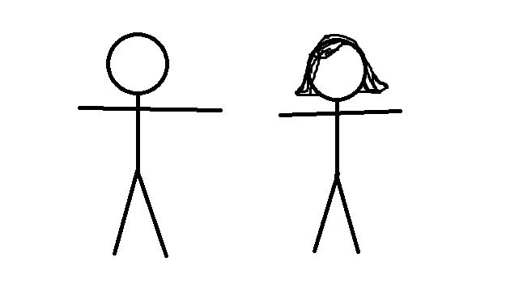{width="100%" fig-alt="TODO: describe image"}
:::
::::

---

## Becoming pythonistas

- >>> import this
- The Zen of Python, by Tim Peters
- Beautiful is better than ugly.
- Explicit is better than implicit.
- Simple is better than complex.
- Complex is better than complicated.
- Flat is better than nested.
- Sparse is better than dense.
- Readability counts.
- Special cases aren't special enough to break the rules.
- Although practicality beats purity.
- Errors should never pass silently.
- Unless explicitly silenced.
- In the face of ambiguity, refuse the temptation to guess.
- There should be one-- and preferably only one --obvious way to do it.
- Although that way may not be obvious at first unless you're Dutch.
- Now is better than never.
- Although never is often better than *right* now.
- If the implementation is hard to explain, it's a bad idea.
- If the implementation is easy to explain, it may be a good idea.
- Namespaces are one honking great idea -- let's do more of those!

---

## Style guides

:::: {.columns}
::: {.column width="55%"}
- Style guides:
  - [http://docs.python-guide.org/en/latest/writing/style/](http://docs.python-guide.org/en/latest/writing/style/)
  - [https://google.github.io/styleguide/pyguide.html](https://google.github.io/styleguide/pyguide.html)
- These are more than just grammar police!
  - These teach you "think" in Python
  - Besides introducing a ton of concepts and features.
:::
::: {.column width="45%"}
{width="100%" fig-alt="TODO: describe image"}
:::
::::

---

## Style guides

:::: {.columns}
::: {.column width="55%"}
- Style guides:
  - [http://docs.python-guide.org/en/latest/writing/style/](http://docs.python-guide.org/en/latest/writing/style/)
  - [https://google.github.io/styleguide/pyguide.html](https://google.github.io/styleguide/pyguide.html)
- These are more than just grammar police!
  - These teach you "think" in Python
  - Besides introducing a ton of concepts and features.
- "A Foolish Consistency is the Hobgoblin of Little Minds"?
  - One of Guido's key insights is that code is read much more often than it is written.
  - The guidelines improve the readability of code and make it consistent across the wide spectrum of Python code.
  - As PEP 20 says, "Readability counts"!
- Many things there, but we won’t go over all explicitly
:::
::: {.column width="45%"}
{width="100%" fig-alt="TODO: describe image"}
{width="100%" fig-alt="TODO: describe image"}
:::
::::

---

## Style guides

---

## Numpy

- “numpy” is a library written in C++ that can be used in python
  - Fast operations on lists (arrays)
  - Matrix operations
- To use in python just “import numpy”
- Nice tutorial: [https://www.datacamp.com/community/tutorials/python-numpy-tutorial](https://www.datacamp.com/community/tutorials/python-numpy-tutorial)
- Our examples: numpy_examples.ipynb

---

## Numpy

- Numpy has several methods to create arrays: np.zeros(), np.ones(), np.linspace(), np.arange(), ...
- Direct creation:
- arr = np.array([1, 2, 3, 4, 5])
- Create an array of all 0s, with a specific shape:
- > a = np.zeros(3)
> print(a)
- [0. 0. 0.]
- Given an existing array, you can "copy its shape"
- b = np.zeros_like(a)
print(b)

---

## Numpy

- Accessing numpy array values is very powerful, using slicing
  - These exist in python AND in C++, but C++ only implements this in “valarrays” (similar to vector, but no iterators and math operations are faster).
- We will focus on the python slices because they are very popular

---

## Numpy slicing

- Suppose you have some list:
- >>> s = [0,1,2,3,4,5]
- >>> s
- [0, 1, 2, 3, 4, 5]
- Suppose you want to extract [1, 2, 3, 4]
- Slice syntax:

- arr[begin:end:stride]

- Begin element
- (inclusive)

- End element
- (exclusive)

- How much to increment between elements

---

## Numpy slicing

- >>> s = [0, 1, 2, 3, 4, 5]
- >>> s[1:1]
- []
- >>> s[1:2]
- [1]
- >>> s[1:3]
- [1, 2]
- >>> s[:3]
- [0, 1, 2]
- >>> s[:3:2]
- [0, 2]

---

## Recap

- Back to python: introduction with focus on differences w/C++
  - Subtle differences: mutable vs. immutable variables, differences exact treatment of variables themselves.
- Python style and pythonic thinking.
- Starting on numpy.
- Next time:
  - More numpy, vectorization
  - matplotlib
  - Combining C++ and python with SWIG

---

# Numpy

---

## Numpy

- “numpy” is a library written in C++ that can be used in python
  - Fast operations on lists (arrays)
  - Matrix operations
- To use in python just “import numpy”
- Nice tutorial: [https://www.datacamp.com/community/tutorials/python-numpy-tutorial](https://www.datacamp.com/community/tutorials/python-numpy-tutorial)
- Our examples: numpy_examples.ipynb

---

## Numpy

- Numpy has several methods to create arrays:
  - np.zeros(), np.ones(), np.linspace(), np.arange(), ...
- Direct creation:
- arr = np.array([1, 2, 3, 4, 5])
- Create an array of all 0s, with a specific shape:
- > a = np.zeros(3)
> print(a)
- [0. 0. 0.]
- Given an existing array, you can "copy its shape"
- b = np.zeros_like(a)
print(b)

---

## Numpy

- Numpy has several methods to create arrays:
  - np.zeros(), np.ones(), np.linspace(), np.arange(), ...
- Direct creation:
- arr = np.array([1, 2, 3, 4, 5])
- Create an array of all 0s, with a specific shape:
- > a = np.zeros(3)
> print(a)
- [0. 0. 0.]
- Given an existing array, you can "copy its shape"
- b = np.zeros_like(a)
print(b)

- linspace syntax:
  - np.linspace(start, end, n(elements)

- arange syntax:
  - np.arange(start, end, delta)
    - (0., 2.5, 0.5)

- >> numpy.linspace(0., 2., 5)
- array([0. , 0.5, 1. , 1.5, 2. ])

- >> np.arange(0., 2.5, 0.5)
- array([0. , 0.5, 1. , 1.5, 2. ])

---

## Manipulating arrays

- Once you have an array, there's a lot you can do with them:
  - Reshape into matrix (or more dimensions).
  - "Slice" arrays (extract elements with a slick interface).
  - Perform (fast!) operations between arrays using broadcasting.
  - Visualize using matplotlib.
- numpy is one of the cornerstones of the scientific python ecosystem.

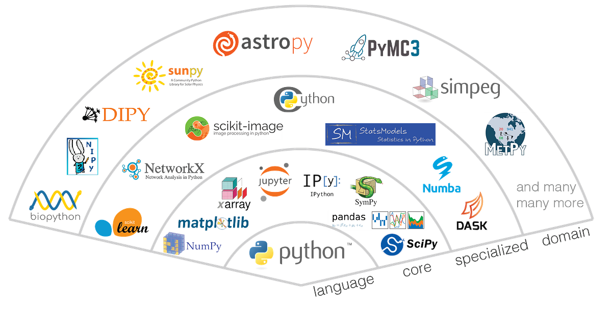{width="70%" fig-alt="TODO: describe image"}

---

## Slicing

- Accessing numpy array values is very powerful, using slicing
  - These exist in python AND in C++, but C++ only implements this in “valarrays” (similar to vector, but no iterators and math operations are faster).
- We will focus on the python slices because they are very popular

---

## Numpy slicing

- Suppose you have some list:
- >>> s = [0,1,2,3,4,5]
- >>> s
- [0, 1, 2, 3, 4, 5]
- Suppose you want to extract [1, 2, 3, 4]
- Slice syntax:

- arr[begin:end:stride]

- Begin element
- (inclusive)

- End element
- (exclusive)

- How much to increment between elements

---

## Numpy slicing

- >>> s = [0, 1, 2, 3, 4, 5]

---

## Numpy slicing

- >>> s = [0, 1, 2, 3, 4, 5]

- >>> s[0:1]
- [0]

- >>> s[1:4]
- [1, 2, 3]

- >>> s[1:1]
- []

---

## Numpy slicing

- >>> s = [0, 1, 2, 3, 4, 5]

- >>> s[0:1]
- [0]

- >>> s[1:4]
- [1, 2, 3]

- >>> s[1:1]
- []

- >>> s[0:4:2]
- [0, 2]

---

## Numpy slicing

- >>> s = [0, 1, 2, 3, 4, 5]

- >>> s[0:1]
- [0]

- >>> s[1:4]
- [1, 2, 3]

- >>> s[1:1]
- []

- >>> s[0:4:2]
- [0, 2]

- >>> s[:3]
- [0, 1, 2]

- >>> s[2:]
- [2, 3, 4, 5]

---

## Numpy slicing

- >>> s = [0, 1, 2, 3, 4, 5]

- >>> s[0:1]
- [0]

- >>> s[1:4]
- [1, 2, 3]

- >>> s[1:1]
- []

- >>> s[0:4:2]
- [0, 2]

- >>> s[:3]
- [0, 1, 2]

- >>> s[2:]
- [2, 3, 4, 5]

- >>> s[-1:]
- [5]

- >>> s[:-2]
- [1, 2, 3]

- len(s) = 6
- -1 translates to 6-1=5

- len(s) = 6
- -2 translates to 6-2=4

- >>> s[::-2]
- [5, 3, 1]

---

## One dimension, two dimensions

- 2D array with np.zeros(): supply a tuple of ints, instead of just one int.
  - First index = "outermost"

- >> arr_2d = np.zeros((3,2))
- array([[0., 0.],
- [0., 0.],
- [0., 0.]])

- >>> arr_2d.shape
- (3, 2)

- To inspect the shape of an existing array:

- Transpose operation:

- >>> arr_2d.T
- array([[0., 0., 0.],
- [0., 0., 0.]])

---

## Reshaping

  - Reshaping an array to be a different dimension:

- >>> arr1 = np.arange(12)
- >>> print(arr1)
- [ 0  1  2  3  4  5  6  7  8  9 10 11]

- >>> arr2 = arr1.reshape((6,2))
- >>> print(arr2)
- [[ 0  1]
- [ 2  3]
- [ 4  5]
- [ 6  7]
- [ 8  9]
- [10 11]]

- >>> arr3 = arr1.reshape((3,4))
- >>> print(arr3)
- [[ 0  1  2  3]
- [ 4  5  6  7]
- [ 8  9 10 11]]

- >>> arr4 = arr1.reshape((3,2,2))
- >>> print(arr4)
- [[[ 0  1]
- [ 2  3]]
- [[ 4  5]
- [ 6  7]]
- [[ 8  9]
- [10 11]]]

---

## Reshaping 2

<!-- TODO: complex slide layout (flagged by detect_complex_slide.py - see run log). Content below is complete but UNARRANGED - needs manual layout to match the original slide. -->

  - How does reshape work?
    - Like C++, numpy arrays are ALWAYS stored as a contiguous 1D array in memory.
    - This is no concept of "2D block" of memory.
    - "Shape" is a prescription for interpreting a 1D array in N dimensions.
  - So 12 blocks in memory can be:
    - 1d array of 12 elements
    - 2d array, 6x2
    - 2d array, 4x3
    - 3d array, 2x2x3
    - Etc!

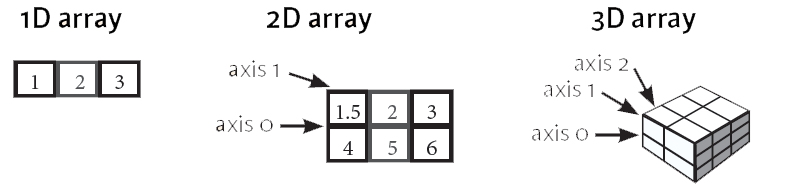{fig-alt="TODO"}

- <!-- source pptx's hlinkClick target for this run is "http://12%20pt" - clearly a garbage/leftover artifact (looks like a font-size value "12 pt" that got treated as a link target), not a real URL. Linked to the visible URL itself pending confirmation. -->
[https://www.datacamp.com/community/tutorials/python-numpy-tutorial](https://www.datacamp.com/community/tutorials/python-numpy-tutorial)

---

## Slicing in higher dimensions

<!-- TODO: complex slide layout (flagged by detect_complex_slide.py - see run log). Content below is complete but UNARRANGED - needs manual layout to match the original slide. -->

- u = np.zeros((3, 6))
- for ix in range(3):
  - for iy in range(6):
    - u[ix][iy] = (ix + 1) + 100 * (iy+1)
- array([[101., 201., 301., 401., 501., 601.],
- [102., 202., 302., 402., 502., 602.],
- [103., 203., 303., 403., 503., 603.]])

  - Consider the following 2D array:

- x

- y

---

## Slicing in higher dimensions

<!-- TODO: complex slide layout (flagged by detect_complex_slide.py - see run log). Content below is complete but UNARRANGED - needs manual layout to match the original slide. -->

- >>> u[1:, 2:]
- array([[302., 402., 502., 602.],
- [303., 403., 503., 603.]])

  - Slices in 2D work like this:

- array([[101., 201., 301., 401., 501., 601.],
- [102., 202., 302., 402., 502., 602.],
- [103., 203., 303., 403., 503., 603.]])

---

## Slicing in higher dimensions

<!-- TODO: complex slide layout (flagged by detect_complex_slide.py - see run log). Content below is complete but UNARRANGED - needs manual layout to match the original slide. -->

- >>> u[1:, 2:]
- array([[302., 402., 502., 602.],
- [303., 403., 503., 603.]])

  - Slices in 2D work like this:

- array([[101., 201., 301., 401., 501., 601.],
- [102., 202., 302., 402., 502., 602.],
- [103., 203., 303., 403., 503., 603.]])

{fig-alt="TODO"}

---

# Matplotlib

---

## matplotlib

<!-- TODO: complex slide layout (flagged by detect_complex_slide.py - see run log). Content below is complete but UNARRANGED - needs manual layout to match the original slide. -->

  - Lots of graphics tools used in python
  - Matplotlib is one industry standard
  - Tutorial here: [https://matplotlib.org/users/pyplot_tutorial.html ](https://matplotlib.org/users/pyplot_tutorial.html)
  - Basic example:

- import matplotlib.pyplot as plt
- plt.plot([1,2,3,4])
- plt.ylabel('some numbers')
- plt.show()

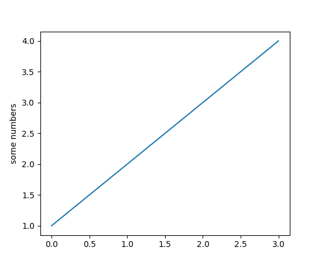{fig-alt="TODO"}

---

## matplotlib * jupyter

<!-- TODO: complex slide layout (flagged by detect_complex_slide.py - see run log). Content below is complete but UNARRANGED - needs manual layout to match the original slide. -->

  - matplotlib works quite well in jupyter out-of-the-box.
  - You can use "magic" for some nice interactive features:

- %matplotlib ipympl

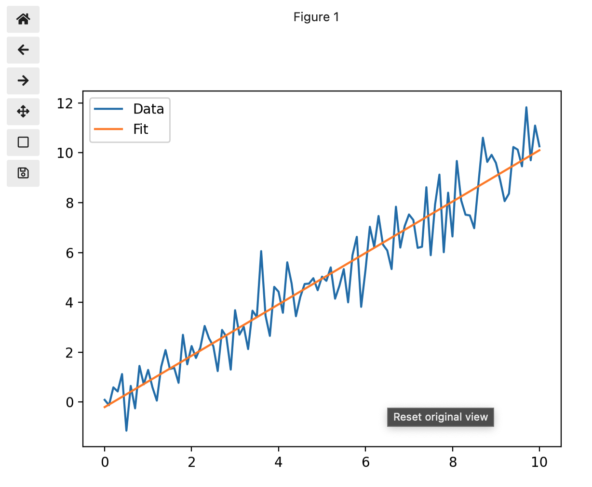{fig-alt="TODO"}

  - Try adding this to the top of:
  - [CompPhys/JupyterExamples/example_jupyter.ipynb](https://github.com/ubsuny/CompPhys/blob/main/JupyterExamples/example_jupyter.ipynb)

---

## Hands-on

- Two hand-on notebooks for today:
  - CompPhys/ReviewPython/numpy_example.ipynb
  - CompPhys/ReviewPython/matplotlib_examples.ipynb
- Run through both of them.
  - If new to numpy and/or matplotlib, make sure you understand each line!
  - Try modifying the commands (change dimensions, slicing indices, plotted values, etc.).

---

## np.meshgrid()

  - matplotlib example also introduces np.meshgrid()
  - Let's say you have two arrays:

- xvals = np.array([0, 1, 2, 3])
- yvals = np.array([-2, -1, 0, -1, 2])

  - np.meshgrid(xvals, yvals) generates all points (x, y), where x$ \in $xvals and y$ \in $yvals.
    - Note: this actually returns two matrices, one for the x coordinates and one for the y coordinates! Maybe not what you were expecting.

- >>> xgrid
- array([[0, 1, 2, 3],
- [0, 1, 2, 3],
- [0, 1, 2, 3],
- [0, 1, 2, 3],
- [0, 1, 2, 3]])

- >>> ygrid
- array([[-2, -2, -2, -2],
- [-1, -1, -1, -1],
- [ 0,  0,  0,  0],
- [-1, -1, -1, -1],
- [ 2,  2,  2,  2]])

- >>> xgrid, ygrid = np.meshgrid(xvals, yvals)

---

## np.meshgrid()

<!-- TODO: complex slide layout (flagged by detect_complex_slide.py - see run log). Content below is complete but UNARRANGED - needs manual layout to match the original slide. -->

  - matplotlib example also introduces np.meshgrid()
  - Let's say you have two arrays:

- xvals = np.array([0, 1, 2, 3])
- yvals = np.array([-2, -1, 0, -1, 2])

  - np.meshgrid(xvals, yvals) generates all points (x, y), where x$ \in $xvals and y$ \in $yvals.
    - Note: this actually returns two matrices, one for the x coordinates and one for the y coordinates! Maybe not what you were expecting.

- >>> xgrid
- array([[0, 1, 2, 3],
- [0, 1, 2, 3],
- [0, 1, 2, 3],
- [0, 1, 2, 3],
- [0, 1, 2, 3]])

- >>> ygrid
- array([[-2, -2, -2, -2],
- [-1, -1, -1, -1],
- [ 0,  0,  0,  0],
- [-1, -1, -1, -1],
- [ 2,  2,  2,  2]])

- >>> xgrid, ygrid = np.meshgrid(xvals, yvals)

{fig-alt="TODO"}

{fig-alt="TODO"}

---

## Computations with meshgrid

  - xgrid and ygrid are nice, because numpy lets us use them just like a single (x, y) coordinate.
    - x+y $ \rightarrow $ xgrid+ygrid
    - Array operations! We will cover these in more detail along with vectorization.
    - The magic: broadcasting operations over (compatible) array dimensions.
  - Example in the notebook:
    - Create a coordinate system for the solar system.
    - For each point, calculate distance from the sun

- solar_system_radius = 3.e16
- x = np.linspace(-1 * solar_system_radius, solar_system_radius, 100)
- y = np.linspace(-1 * solar_system_radius, solar_system_radius, 100)
- rgrid = np.sqrt(xgrid**2 + ygrid**2)

---

## Computations with meshgrid

:::: {.columns}
::: {.column width="55%"}
  - Example in the notebook:
    - Create a coordinate system for the solar system.
    - For each point, calculate distance from the sun.
    - For each point, calculate the gravitational potential energy, $U=-GMm/r$
    - Then plot with matplotlib colorbar() function:
- solar_system_radius = 3.e16
- x = np.linspace(-1 * solar_system_radius, solar_system_radius, 100)
- y = np.linspace(-1 * solar_system_radius, solar_system_radius, 100)
- rgrid = np.sqrt(xgrid**2 + ygrid**2)
- pot_energy = gpot(rgrid)
:::
::: {.column width="45%"}
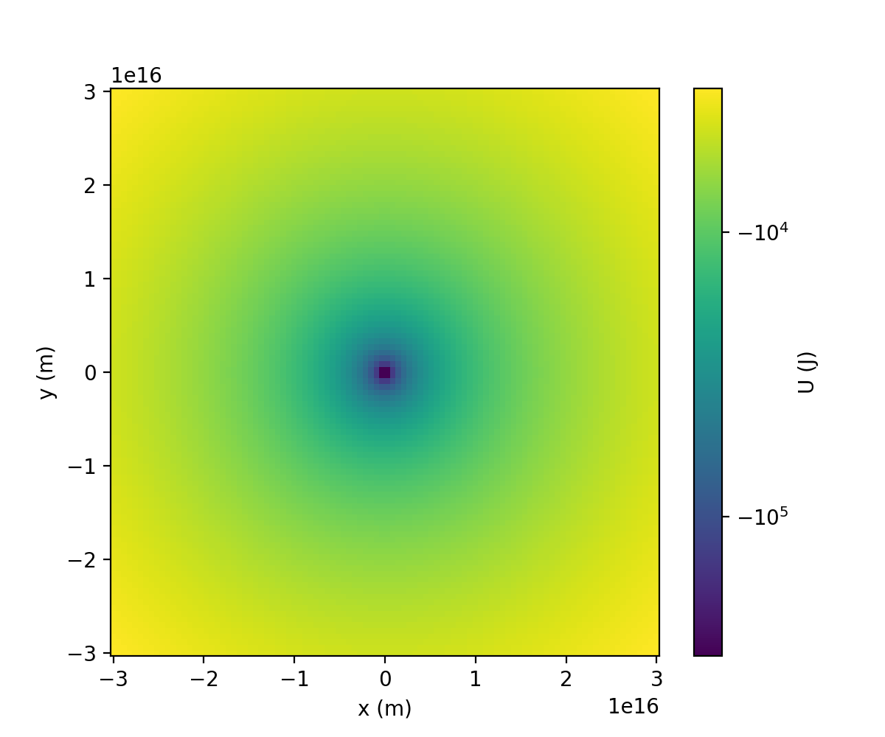{width="100%" fig-alt="TODO: describe image"}
:::
::::

---

## Computations with meshgrid

  - xgrid and ygrid are nice, because numpy lets us use them just like a single (x, y) coordinate.
    - Array operations! We will cover these in more detail along with vectorization.
    - The magic: broadcasting operations over (compatible) array dimensions.
  - Example 2: compute

- rgrid = np.sqrt(xgrid**2 + ygrid**2)

---

## Recap

- Introduced numpy arrays.
  - Array creation and reshaping.
  - Slicing syntax for accessing elements.
- Introduced matplotlib for plotting numpy arrays.
  - Hands-on notebook has a few basic examples.
- numpy and matplotlib are some of the more important tools you will learn in this class!
  - The whole scientific python ecosystem is built on top of them.
  - The remaining homework assignments will use them ;)
- Up next:
  - Vectorization/array programming
  - Combining C++ and python

---

# Array programming

---

## Array programming

<!-- TODO: complex slide layout (flagged by detect_complex_slide.py - see run log). Content below is complete but UNARRANGED - needs manual layout to match the original slide. -->

- Now, we’re able to get around one of the major limitations of python: for loops
- for loops are very, very slow! Avoid them at all costs!

{fig-alt="TODO"}

- Loops!

- numpy instead!

---

## List operations

- Python has some nice built-in convenience functions for lists.
- To be a pythonista, best to check if there are existing pythonic tools for your use case!

- # sum: returns sum of list elements
- a = [1, 10, 2, 6, 5]
- sum(a) # = 24
- # any: return true if any elements are true
- happy_array = [True, True, True]
- any(happy_array) # = True
- sad_array = [False False False]
- any(sad_array) #= False
- # min/max: returns min/max element of list
- min(a) # = 1
- # sorted(): returns sorted array
- sorted(a) # = [1, 2, 5, 6, 10]

- [https://docs.python.org/3/library/functions.html ](https://docs.python.org/3/library/functions.html)

---

## numpy operations

- Similarly, numpy (re)implements many functions as "ufuncs"
  - Functions work with numpy arrays, element-by-element
  - (u=universal)
- ...and if it doesn't already exist, you can promote a function yourself with np.frompyfunc()

- >> np.array([1, 2, 3]) + np.array([4, 5, 6])
- array([5, 7, 9])

- >> bin_np = np.frompyfunc(bin, 1, 1)
- >> bin_np(np.array([1, 2, 3])
- array(["0b1", "0b10", "0b11"])

---

# Broadcasting

---

## Broadcasting

- Broadcasting is numpy's set of rules for combining arrays of different dimensions.
- Simplest example: combining an array and a scalar:

- >> arr = np.array([1, 2, 3])
- >> arr * 2
- array([2, 4, 6])

- The multiplication is performed element-by-element.

- [https://numpy.org/doc/stable/user/basics.broadcasting.html](https://numpy.org/doc/stable/user/basics.broadcasting.html)

---

## Broadcasting

- Next-to-simplest example: two arrays of equal dimension and size.
- Operations are (again) done element-by-element:

- >> arr1 = np.array([ 1,  2,  3])
- >> arr2 = np.array([10, 20, 30])
- >> arr1 + arr2
- array([11, 22, 33])

- [https://numpy.org/doc/stable/user/basics.broadcasting.html](https://numpy.org/doc/stable/user/basics.broadcasting.html)

---

## Broadcasting

<!-- TODO: complex slide layout (flagged by detect_complex_slide.py - see run log). Content below is complete but UNARRANGED - needs manual layout to match the original slide. -->

- But what about arrays of unequal dimension?

- >> arr1 = np.array(
      - [[1, 1, 1],
      - [1, 1, 1],
      - [1, 1, 1]])
- >> arr2 = np.array([1, 2, 3])
- >> arr1 * arr2
- = ???

- Possibility 1:
      - [[1, 1, 1],
      - [2, 2, 2],
      - [3, 3, 3]])

- Possibility 2:
      - [[1, 2, 3],
      - [1, 2, 3],
      - [1, 2, 3]])

- [https://numpy.org/doc/stable/user/basics.broadcasting.html](https://numpy.org/doc/stable/user/basics.broadcasting.html)

---

## Broadcasting

- But what about arrays of unequal dimension?
- Answer:

- >> arr1 = np.array(
      - [[1, 1, 1],
      - [1, 1, 1],
      - [1, 1, 1]])
- >> arr2 = np.array([1, 2, 3])
- >> arr1 * arr2
- array([[1, 2, 3],
- [1, 2, 3],
  - [1, 2, 3]])

- [https://numpy.org/doc/stable/user/basics.broadcasting.html](https://numpy.org/doc/stable/user/basics.broadcasting.html)

---

## Broadcasting

<!-- TODO: complex slide layout (flagged by detect_complex_slide.py - see run log). Content below is complete but UNARRANGED - needs manual layout to match the original slide. -->

- But what about arrays of unequal dimension?
- Answer:

- >> arr1 = np.array(
      - [[1, 1, 1],
      - [1, 1, 1],
      - [1, 1, 1]])
- >> arr2 = np.array([1, 2, 3])
- >> arr1 * arr2
- array([[1, 2, 3],
- [1, 2, 3],
  - [1, 2, 3]])

- "Element-by-element" is performed along the innermost axis.

- [[1, 1, 1],
- [1, 1, 1],
- [1, 1, 1]])
- [1, 2, 3]
- Outermost axis:

- x

- [[1, 1, 1],
- [1, 1, 1],
- [1, 1, 1]])

- [1, 2, 3]

- Innermost axis:

- ⎷

- [https://numpy.org/doc/stable/user/basics.broadcasting.html](https://numpy.org/doc/stable/user/basics.broadcasting.html)

---

## Broadcasting rules

<!-- TODO: complex slide layout (flagged by detect_complex_slide.py - see run log). Content below is complete but UNARRANGED - needs manual layout to match the original slide. -->

- Rule 1: "compatible dimensions" are combined element-by-element
  - A given dimension is compatible if the arrays have equal numbers of elements, or if one dimension has length 1.
  - The "size 1" dimension is "stretched" to equal the other one:

- >> arr1 = np.array([1, 2, 3])
- >> arr1.shape
- (3)

- >> arr2 = np.array([2])
- >> arr2.shape
- (1)

- x

- [https://numpy.org/doc/stable/user/basics.broadcasting.html](https://numpy.org/doc/stable/user/basics.broadcasting.html)

---

## Broadcasting rules

- Rule 2: if the arrays have different dimensions, increase the dimensionality of the lesser array by adding "1"s to the left
  - "Left" means the left end of the shape.

- >> arr1 = np.array([[1, 1, 1, 1],
- [1, 1, 1, 1]])
- >> arr1.shape
- (2, 4)

- >> arr2 = np.array([1, 2, 3, 4])
- >> arr2.shape
- (4)

- x

- [https://numpy.org/doc/stable/user/basics.broadcasting.html](https://numpy.org/doc/stable/user/basics.broadcasting.html)

---

## Broadcasting rules

<!-- TODO: complex slide layout (flagged by detect_complex_slide.py - see run log). Content below is complete but UNARRANGED - needs manual layout to match the original slide. -->

- Rule 2: if the arrays have different dimensions, increase the dimensionality of the lesser array by adding "1"s to the left
  - "Left" means the left end of the shape.

- >> arr1 = np.array([[1, 1, 1, 1],
- [1, 1, 1, 1]])
- >> arr1.shape
- (2, 4)

- >> arr2 = np.array([1, 2, 3, 4])
- >> arr2.shape
- (4)

- Step 1: convert arr2's shape from (4) to (1, 4)

- [1, 2, 3, 4]

- [[1, 2, 3, 4]]

- x

- [https://numpy.org/doc/stable/user/basics.broadcasting.html](https://numpy.org/doc/stable/user/basics.broadcasting.html)

---

## Broadcasting rules

<!-- TODO: complex slide layout (flagged by detect_complex_slide.py - see run log). Content below is complete but UNARRANGED - needs manual layout to match the original slide. -->

- Rule 2: if the arrays have different dimensions, increase the dimensionality of the lesser array by adding "1"s to the left
  - "Left" means the left end of the shape.

- >> arr1 = np.array([[1, 1, 1, 1],
- [1, 1, 1, 1]])
- >> arr1.shape
- (2, 4)

- >> arr2 = np.array([1, 2, 3, 4])
- >> arr2.shape
- (4)

- Step 1: convert arr2's shape from (4) to (1, 4)

- [1, 2, 3, 4]

- [[1, 2, 3, 4]]

- Step 2: now we have (2,4)*(1,4).
  - Appy Rule 1: "stretch" along the "1" dimension to equal the other array

- [[1, 2, 3, 4]]

- [[1, 2, 3, 4],
- [1, 2, 3, 4]]

- x

- [https://numpy.org/doc/stable/user/basics.broadcasting.html](https://numpy.org/doc/stable/user/basics.broadcasting.html)

---

## Broadcasting rules

<!-- TODO: complex slide layout (flagged by detect_complex_slide.py - see run log). Content below is complete but UNARRANGED - needs manual layout to match the original slide. -->

- Rule 2: if the arrays have different dimensions, increase the dimensionality of the lesser array by adding "1"s to the left
  - "Left" means the left end of the shape.

- >> arr1 = np.array([[1, 1, 1, 1],
- [2, 2, 2, 2]])
- >> arr1.shape
- (2, 4)

- >> arr2 = np.array([1, 2, 3, 4])
- >> arr2.shape
- (4)

- Step 1: convert arr2's shape from (4) to (1, 4)

- [1, 2, 3, 4]

- [[1, 2, 3, 4]]

- Step 2: now we have (2,4)*(1,4).
  - Appy Rule 1: "stretch" along the "1" dimension to equal the other array

- [[1, 2, 3, 4]]

- [[1, 2, 3, 4],
- [1, 2, 3, 4]]

- x

- Step 3: now "element-by-element" makes sense

- [[1, 2, 3, 4],
- [1, 2, 3, 4]]

- [[1, 1, 1, 1],
- [2, 2, 2, 2]]

- [[1, 2, 3, 4],
- [2, 4, 6, 8]]

- x

- =

- [https://numpy.org/doc/stable/user/basics.broadcasting.html](https://numpy.org/doc/stable/user/basics.broadcasting.html)

---

## Broadcasting rules

- Higher dimensions rapidly lose intuitiveness.
- The  dimension of the result can be figured as follows...
  - Say we have shapes (5, 5, 1, 5) and (1, 7, 5).
- Right-align the two shapes...

- Check compatibility (either equal, or one is "1")...

- Pad the smaller array with "1"s...

- Output size: (N, N) $ \rightarrow $ N, and (N, 1) $ \rightarrow $ N

- [https://numpy.org/doc/stable/user/basics.broadcasting.html](https://numpy.org/doc/stable/user/basics.broadcasting.html)

---

## Broadcasting examples

- [https://numpy.org/doc/stable/user/basics.broadcasting.html](https://numpy.org/doc/stable/user/basics.broadcasting.html)

- A      (2d array):  5 x 4
- B      (1d array):      1
- Result (2d array):  5 x 4
- A      (2d array):  5 x 4
- B      (1d array):      4
- Result (2d array):  5 x 4
- A      (3d array):  15 x 3 x 5
- B      (3d array):  15 x 1 x 5
- Result (3d array):  15 x 3 x 5
- A      (3d array):  15 x 3 x 5
- B      (2d array):       3 x 5
- Result (3d array):  15 x 3 x 5
- A      (3d array):  15 x 3 x 5
- B      (2d array):       3 x 1
- Result (3d array):  15 x 3 x 5

- Valid broadcasting examples:

---

## Broadcasting examples

- [https://numpy.org/doc/stable/user/basics.broadcasting.html](https://numpy.org/doc/stable/user/basics.broadcasting.html)

- A      (1d array):  3
- B      (1d array):  4 # trailing dimensions do not match
- A      (2d array):      2 x 1
- B      (3d array):  8 x 4 x 3 # second from last dimensions mismatched

- Invalid broadcasting examples:

---

## What about matrix multiplication?

- Matrix multiplication has a rather specific syntax.
  - It is certainly not "element-by-element"!
- Option 1: you can use np.matrix() instead of np.array().
  - M1 * M2 will do matrix multiplication, not element-by-element.
- Option 2: Python 3.5 introduced the @ operator:
- Option 3: numpy implements "[Einstein notation](https://en.wikipedia.org/wiki/Einstein_notation)" in np.einsum()

- >> arr1 = np.array([[1, 1, 1],
- [2, 2, 2],
- [3, 3, 3]])
- >> arr2 = np.array([[1],
- [2],
- [3])
- >> arr1 @ arr2
- array([[ 6],
- [12],
- [18]])

- How does shape work here?
  - (n, k) @ (k, m) $ \rightarrow $ (n, m)

- $$(A \cdot B{)}_{ij}={A}_{ik}{B}_{kj}$$

---

## Hands on

- Open the notebook at CompPhys/ArrayProgramming/ArrayProgramming.ipynb
  - Launch the docker container with runDocker[_wfix].sh
  - Launch the jupyter server using CompPhys/launchJupyter.sh
- Run up through the "Slices" exercise.
- Bonus: try out np.einsum() in CompPhys/ReviewPython/EinsteinNotation.ipynb

---

# Advanced indexing

---

## Advanced indexing

- We've covered a few ways to access numpy array elements:

- >> arr1 = np.array([[1, 2, 3, 4, 5, 6]])
- >> arr1[0]
- np.int64(1)
- >> arr1[1:4]  # slicing
- array([2, 3, 4])

- Numpy calls this "basic indexing." Which means there is "advanced" indexing!
  - Also called "fancy" indexing.

- [https://numpy.org/doc/stable/user/basics.indexing.html](https://numpy.org/doc/stable/user/basics.indexing.html)

---

## Advanced indexing

- Syntax: put a whole array inside the square brackets!

- >> arr1 = np.array([1, 2, 3, 4, 5, 6])
- >> arr1[[0, 1, 5, 3]]
- array([1, 2, 6, 4])

- [https://numpy.org/doc/stable/user/basics.indexing.html](https://numpy.org/doc/stable/user/basics.indexing.html)

---

## Advanced indexing

<!-- TODO: complex slide layout (flagged by detect_complex_slide.py - see run log). Content below is complete but UNARRANGED - needs manual layout to match the original slide. -->

- Syntax: put a whole array inside the square brackets!

- >> arr1 = np.array([1, 2, 3, 4, 5, 6])
- >> arr1[[0, 1, 5, 3]]
- array([1, 2, 6, 4])

- What did this do?

- arr1 = np.array([1, 2, 3, 4, 5, 6])

- [0, 1, 5, 3]

- Aside: fancy indexing create a new array, whereas basic indexing returns a view of the original array (i.e., it uses the same memory as the original array).

- [https://numpy.org/doc/stable/user/basics.indexing.html](https://numpy.org/doc/stable/user/basics.indexing.html)

---

## Advanced indexing

- Besides picking out elements by index, you can also pass an array of booleans:

- >> arr1 = np.array([1, 2, 3, 4, 5, 6])
- >> arr1[[True, True, False, True, False, False]]
- array([1, 2, 4])

- This is like a "mask," aka a "selection."

- [https://numpy.org/doc/stable/user/basics.indexing.html](https://numpy.org/doc/stable/user/basics.indexing.html)

---

## Array programming and "if" statements

- Remember, the goal of array programming is to avoid slow "for" loops.
- Example from particle physics: let's say we have some electron data, measured by the electromagnetic calorimeter (ECAL):

- electron_energy = [10.2, 40.1, 23.6, 18.4, 20.1]
- electron_eta = [0.2, -2.8, -3.7, 1.2, 1.9]
- electron_phi = [...]

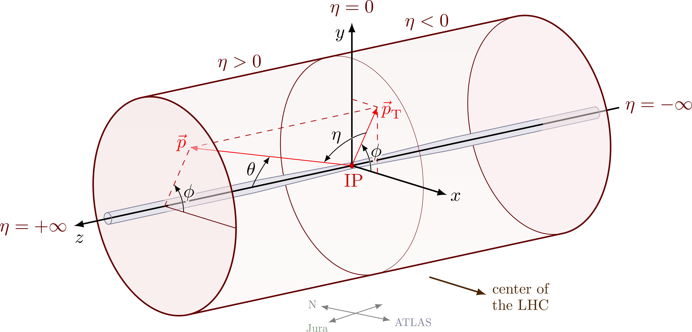{width="70%" fig-alt="TODO: describe image"}

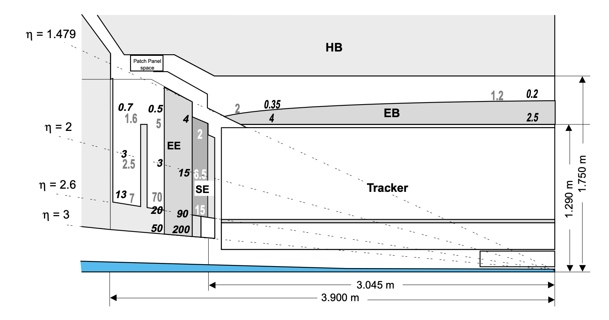{width="70%" fig-alt="TODO: describe image"}

- The electron energy is measured by:
  - |eta|<1.479: ECAL barrel (EB)
  - 1.479<|eta|<3.0: ECAL endcap (EE)

---

## Array programming and "if" statements

- Calamity! We discover that the ECAL barrel was miscalibrated (the crystals became opaque).
- The energy was underestimated by 10% for all electrons with |eta|<1.479.

- electron_energy = [10.2, 40.1, 23.6, 18.4, 20.1]
- electron_eta = [0.2, -2.8, -3.7, 1.2, 1.9]
- electron_phi = [...]

- How do we code up a correction? Your first instinct is probably a for loop:

- for i in range(n_electrons):
- if abs(electron_eta[i]) < 1.479:
    - electron_energy[i] *= 1.1

- Are we doomed to write a "for" loop and suffer slow code?...

---

## Array programming and "if" statements

<!-- TODO: complex slide layout (flagged by detect_complex_slide.py - see run log). Content below is complete but UNARRANGED - needs manual layout to match the original slide. -->

- ...of course not.
- Boolean indexing and [np.where()](https://numpy.org/doc/2.1/reference/generated/numpy.where.html) to the rescue!

- electron_energy = [10.2, 40.1, 23.6, 18.4, 20.1]
- electron_eta = [0.2, -2.8, -3.7, 1.2, 1.9]
- electron_phi = [...]

- electron_isbarrel = np.abs(electron_eta) < 1.479
- electron_energy = np.where(electron_isbarrel,
            - electron_energy * 1.1,
                - electron_energy)

  - numpy.where(condition, [x, y, ]/)
  - Return elements chosen from x or y depending on condition.
{fig-alt="TODO"}

  - absx = (x > 0) ? x : -1 * x;

- (This might remind you of the C++ "if...else" shorthand syntax!)

- [https://numpy.org/doc/2.1/reference/generated/numpy.where.html](https://numpy.org/doc/2.1/reference/generated/numpy.where.html)

---

## Hands on

- Back to CompPhys/ArrayProgramming/ArrayProgramming.ipynb
- The second half of the notebook covers selection using boolean arrays and np.where().
  - If you're already familiar with slicing, try out the "Combining advanced and basic indexing" examples at [https://numpy.org/doc/stable/user/basics.indexing.html](https://numpy.org/doc/stable/user/basics.indexing.html). These get pretty complicated!

- [https://numpy.org/doc/2.1/reference/generated/numpy.where.html](https://numpy.org/doc/2.1/reference/generated/numpy.where.html)

---

# Vectorization

---

## Flynn's Taxonomy

<!-- TODO: complex slide layout (flagged by detect_complex_slide.py - see run log). Content below is complete but UNARRANGED - needs manual layout to match the original slide. -->

- Up until now, we have basically assumed we have a single instruction, single data (SISD) model:
  - 1 CPU processes data from 1 location
  - Parallelization is achieved by just repeating this block:
  - (Single program, multiple data (SPMD))

{fig-alt="TODO"}

{fig-alt="TODO"}

{fig-alt="TODO"}

{fig-alt="TODO"}

{fig-alt="TODO"}

{fig-alt="TODO"}

---

## Flynn's Taxonomy

<!-- TODO: complex slide layout (flagged by detect_complex_slide.py - see run log). Content below is complete but UNARRANGED - needs manual layout to match the original slide. -->

{fig-alt="TODO"}

{fig-alt="TODO"}

{fig-alt="TODO"}

{fig-alt="TODO"}

- Single instruction

- Multiple instruction

- Single data

- Multiple data

---

## Flynn's Taxonomy

<!-- TODO: complex slide layout (flagged by detect_complex_slide.py - see run log). Content below is complete but UNARRANGED - needs manual layout to match the original slide. -->

- =
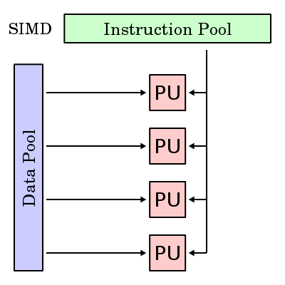{fig-alt="TODO"}

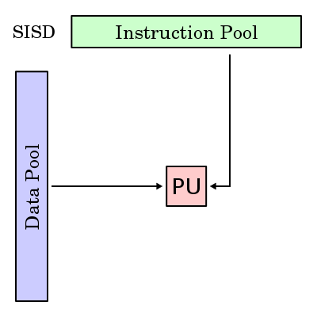{fig-alt="TODO"}

{fig-alt="TODO"}

- =
{fig-alt="TODO"}

---

## SIMD

:::: {.columns}
::: {.column width="55%"}
- SIMD has become more popular because of vectorized processing units
  - GPUs
  - New CPUs (e.g. AVX512)
- Vector units do N identical operations in the same amount of time that it takes to do one of them, on different addresses in memory
- Speed comes from data access
  - “Get me N ints” versus “Get me an int”, N times
:::
::: {.column width="45%"}
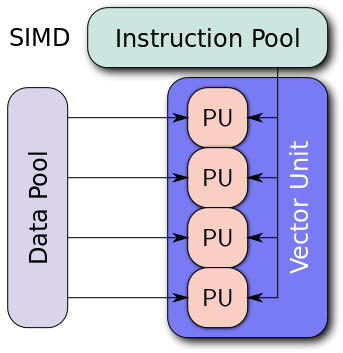{width="100%" fig-alt="TODO: describe image"}
:::
::::

---

## Architecture of processors

- Processing units now contain caches of memory with fast access.
- Can have different levels of cache (small * fast vs. large * slow)
  - Then memory
  - Then disk
- Accessing cache is much faster than accessing memory
- Accessing memory is much faster than accessing disk

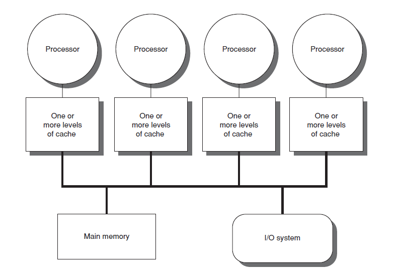{width="70%" fig-alt="TODO: describe image"}

---

## Architecture of processors

<!-- TODO: complex slide layout (flagged by detect_complex_slide.py - see run log). Content below is complete but UNARRANGED - needs manual layout to match the original slide. -->

{fig-alt="TODO"}

{fig-alt="TODO"}

- Memory

{fig-alt="TODO"}

- CPU

- Cache

- Disk

---

## Vector processing

<!-- TODO: complex slide layout (flagged by detect_complex_slide.py - see run log). Content below is complete but UNARRANGED - needs manual layout to match the original slide. -->

- Consider a program that performs the same operation many times over a vector of data (SIMD!)
  - Traditionally: done with loops
  - Now: done with vector unit, if possible

- for (i = 0; i < 1024; i++)
- C[i] = A[i]*B[i];

- C = A*B;

- Get next bread.
- Slice.
- Get next bread.
Slice.
- Get next bread.
- Slice.

- Slice all the bread.

- [https://en.wikipedia.org/wiki/Vector_processor](https://en.wikipedia.org/wiki/Vector_processor)

---

## Unrolling loops

<!-- TODO: complex slide layout (flagged by detect_complex_slide.py - see run log). Content below is complete but UNARRANGED - needs manual layout to match the original slide. -->

- Historically, you could speed up your code by "unrolling" for loops:

- for (i = 0; i < 1024; i++)
- C[i] = A[i]*B[i];

- for (i = 0; i < 1024; i+=4){
- C[i+0] = A[i+0]*B[i+0];
- C[i+1] = A[i+1]*B[i+1];
- C[i+2] = A[i+2]*B[i+2];
- C[i+3] = A[i+3]*B[i+3];
- }

- Chop.
- Chop.
- Chop.
- Chop.

- Chopchopchopchop.
- Chopchopchopchop.
- Chopchopchopchop.
- Chopchopchopchop.

- [https://en.wikipedia.org/wiki/Loop_unrolling](https://en.wikipedia.org/wiki/Loop_unrolling)

{fig-alt="TODO"}

{fig-alt="TODO"}

---

## Automatic vectorization

- Implicitly or explicitly unrolling loops can 
allow the compiler to appropriately vectorize the operation

- [https://en.wikipedia.org/wiki/Automatic_vectorization](https://en.wikipedia.org/wiki/Automatic_vectorization)

- Scalar:

- Vectorized:

- for (i = 0; i < 1024; i++)
- C[i] = A[i]*B[i];

- for (i = 0; i < 1024; i+=4)
- C[i:i+3] = A[i:i+3]*B[i:i+3];

---

## Testing vectorization

- Benchmarking: consider the simple addition of two large vectors (100,000 elements) in a few scenarios:
  - C++ without optimization (-O0)
  - C++ with non-vectorization optimizations (-O1)
  - C++ adding vectorization optimizations (-O2)
  - Bare python
  - Numpy

---

## Testing vectorization

  - Units: DRL22 (Dr. Rappoccio's Laptop, 2022)

---

## Recap

- Array programming techniques:
  - Built-in functions
  - Broadcasting: combining numpy arrays of different shapes/sizes
  - Fancy indexing
- Vectorization
  - Speed up code (a lot!) using single instruction, multiple data (SIMD).
- Next time:
  - More detailed study of python performance.
  - Combining C++ and python with Swig.

---

# Vectorization

---

## Flynn's Taxonomy

<!-- TODO: complex slide layout (flagged by detect_complex_slide.py - see run log). Content below is complete but UNARRANGED - needs manual layout to match the original slide. -->

- Up until now, we have basically assumed we have a single instruction, single data (SISD) model:
  - 1 CPU processes data from 1 location
  - Parallelization is achieved by just repeating this block:
  - (Single program, multiple data (SPMD))

{fig-alt="TODO"}

{fig-alt="TODO"}

{fig-alt="TODO"}

{fig-alt="TODO"}

{fig-alt="TODO"}

{fig-alt="TODO"}

---

## Flynn's Taxonomy

<!-- TODO: complex slide layout (flagged by detect_complex_slide.py - see run log). Content below is complete but UNARRANGED - needs manual layout to match the original slide. -->

{fig-alt="TODO"}

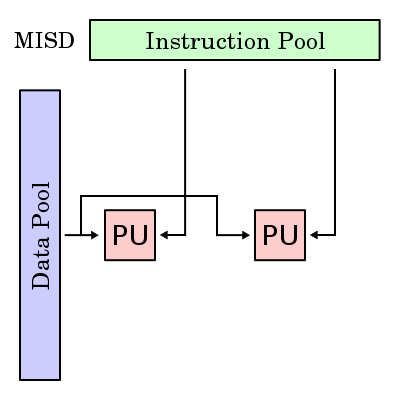{fig-alt="TODO"}

{fig-alt="TODO"}

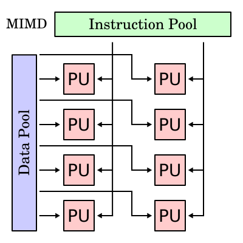{fig-alt="TODO"}

- Single instruction

- Multiple instruction

- Single data

- Multiple data

---

## Flynn's Taxonomy

<!-- TODO: complex slide layout (flagged by detect_complex_slide.py - see run log). Content below is complete but UNARRANGED - needs manual layout to match the original slide. -->

- =
{fig-alt="TODO"}

{fig-alt="TODO"}

{fig-alt="TODO"}

- =
{fig-alt="TODO"}

---

## SIMD

:::: {.columns}
::: {.column width="55%"}
- SIMD has become more popular because of vectorized processing units
  - GPUs
  - New CPUs (e.g. AVX512)
- Vector units do N identical operations in the same amount of time that it takes to do one of them, on different addresses in memory
- Speed comes from data access
  - “Get me N ints” versus “Get me an int”, N times
:::
::: {.column width="45%"}
{width="100%" fig-alt="TODO: describe image"}
:::
::::

---

## Architecture of processors

- Processing units now contain caches of memory with fast access.
- Can have different levels of cache (small * fast vs. large * slow)
  - Then memory
  - Then disk
- Accessing cache is much faster than accessing memory
- Accessing memory is much faster than accessing disk

{width="70%" fig-alt="TODO: describe image"}

---

## Architecture of processors

<!-- TODO: complex slide layout (flagged by detect_complex_slide.py - see run log). Content below is complete but UNARRANGED - needs manual layout to match the original slide. -->

{fig-alt="TODO"}

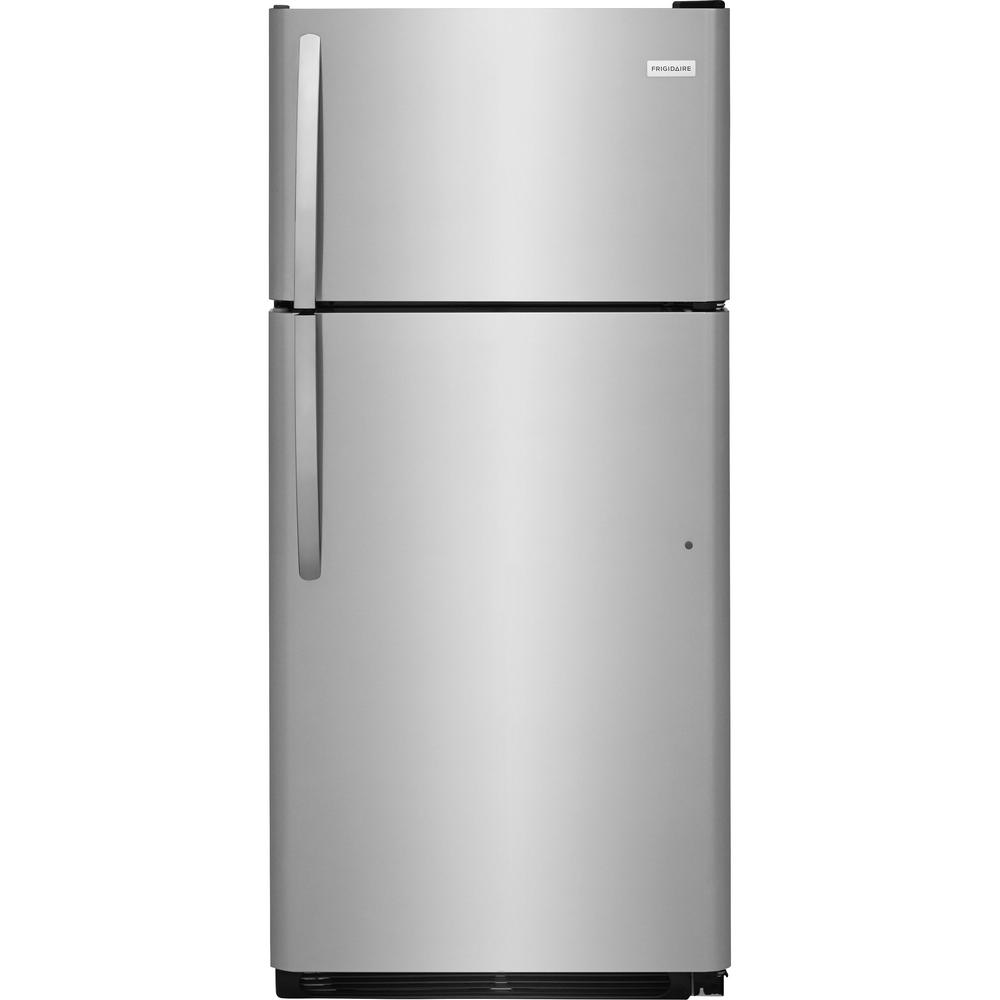{fig-alt="TODO"}

- Memory

{fig-alt="TODO"}

- CPU

- Cache

- Disk

---

## Architecture of processors

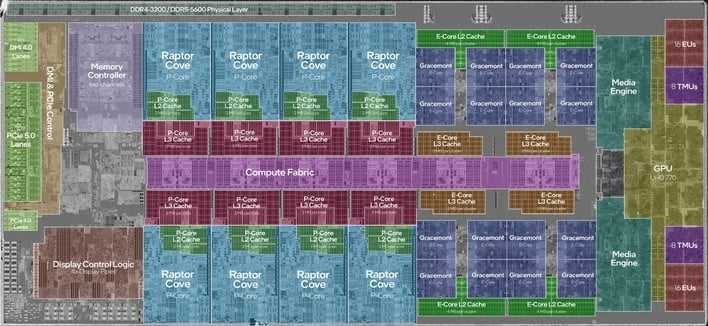{width="70%" fig-alt="TODO: describe image"}

---

## Vector processing

<!-- TODO: complex slide layout (flagged by detect_complex_slide.py - see run log). Content below is complete but UNARRANGED - needs manual layout to match the original slide. -->

- Consider a program that performs the same operation many times over a vector of data (SIMD!)
  - Traditionally: done with loops
  - Now: done with vector unit, if possible

- for (i = 0; i < 1024; i++)
- C[i] = A[i]*B[i];

- C = A*B;

- Get next bread.
- Slice.
- Get next bread.
Slice.
- Get next bread.
- Slice.

- Slice all the bread.

- [https://en.wikipedia.org/wiki/Vector_processor](https://en.wikipedia.org/wiki/Vector_processor)

---

## Unrolling loops

<!-- TODO: complex slide layout (flagged by detect_complex_slide.py - see run log). Content below is complete but UNARRANGED - needs manual layout to match the original slide. -->

- You can actualy speed up your code by "unrolling" for loops:

- for (i = 0; i < 1024; i++)
- C[i] = A[i]*B[i];

- for (i = 0; i < 1024; i+=4){
- C[i+0] = A[i+0]*B[i+0];
- C[i+1] = A[i+1]*B[i+1];
- C[i+2] = A[i+2]*B[i+2];
- C[i+3] = A[i+3]*B[i+3];
- }

- Chop.
- Chop.
- Chop.
- Chop.

- Chopchopchopchop.
- Chopchopchopchop.
- Chopchopchopchop.
- Chopchopchopchop.

- [https://en.wikipedia.org/wiki/Loop_unrolling](https://en.wikipedia.org/wiki/Loop_unrolling)

{fig-alt="TODO"}

{fig-alt="TODO"}

---

## Automatic vectorization

- Implicitly or explicitly unrolling loops can 
allow the compiler to appropriately vectorize the operation

- [https://en.wikipedia.org/wiki/Automatic_vectorization](https://en.wikipedia.org/wiki/Automatic_vectorization)

- Scalar:

- Vectorized:

- for (i = 0; i < 1024; i++)
- C[i] = A[i]*B[i];

- for (i = 0; i < 1024; i+=4)
- C[i:i+3] = A[i:i+3]*B[i:i+3];

---

## Testing vectorization

- Benchmarking: consider the simple addition of two large vectors (100,000 elements) in a few scenarios:
  - C++ without optimization (-O0)
  - C++ with non-vectorization optimizations (-O1)
  - C++ adding vectorization optimizations (-O2)
  - Bare python
  - Numpy

---

## Testing vectorization

  - Units: DRL22 (Dr. Rappoccio's Laptop, 2022)

---

# Speeding up python

---

## Why is python slow?

- We all "know" that python is slow. But why?
  - Credit: an excellent blog post by Jake VanderPlas, linked above.

- [https://jakevdp.github.io/blog/2014/05/09/why-python-is-slow/](https://jakevdp.github.io/blog/2014/05/09/why-python-is-slow/)

- Dynamic vs. static typing: python doesn't know variable types a priori, and has to look them up prior to any operation.
- Interpreted vs. compiled: interpreter only sees the next line, can't optimize like a compiler;
- Inefficient memory access: C arrays (or numpy) are sequential in memory; python lists are scattered around;
- (GIL (global interpreter lock) is bad for multithreading.)

---

## Dynamic vs. static typing

:::: {.columns}
::: {.column width="55%"}
- [https://jakevdp.github.io/blog/2014/05/09/why-python-is-slow/](https://jakevdp.github.io/blog/2014/05/09/why-python-is-slow/)
- At runtime, the python interpreter doesn't know the types of your variables. So... how does it compute anything?
- Answer: objects have to carry around their identity and behavior.
- A C integer is just 4 bytes.
- A python integer is actually an object of type PyObject with various member variables:
  - type=integer
  - value=1
:::
::: {.column width="45%"}
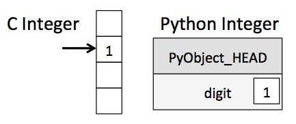{width="100%" fig-alt="TODO: describe image"}
:::
::::

---

## Why is python slow?

- [https://jakevdp.github.io/blog/2014/05/09/why-python-is-slow/](https://jakevdp.github.io/blog/2014/05/09/why-python-is-slow/)

- Assign <int> 1 to a
- Assign <int> 2 to b
- call binary_add<int, int>(a, b)
- Assign the result to c

- Example: how does addition work?

- int a = 1;
- int b = 2;
- int c = a + b;

- Assign 1 to a
  - 1a. Set a->PyObject_HEAD->typecode to integer
  - 1b. Set a->val = 1
- Assign 2 to b
  - 2a. Set b->PyObject_HEAD->typecode to integer
  - 2b. Set b->val = 2
- call binary_add(a, b)
  - 3a. find typecode in a->PyObject_HEAD
  - 3b. a is an integer; value is a->val
  - 3c. find typecode in b->PyObject_HEAD
  - 3d. b is an integer; value is b->val
  - 3e. call binary_add<int, int>(a->val, b->val)
  - 3f. result of this is result, and is an integer.
- Create a Python object c
  - 4a. set c->PyObject_HEAD->typecode to integer
  - 4b. set c->val to result

- C

- Python

---

## So why do we use python?

- Think about how much time you spend writing code vs. executing code.
  - Your homework problems take O(hours) to code, but O(milliseconds) to run.
  - It's a (big) net negative, aka waste of time, to spend hours optimizing for insignificant gains.
  - Human time is expensive, CPU time is cheap!
- When you really need performance, you can:
  - Benchmark your code, identify the bottlenecks.
  - Optimize where it really matters.

---

## Timing code

- In an earlier lecture, we learned how to time C++ code:

- #include <iostream>
- #include <chrono>
- #include <thread>
- void f()
- {
- std::this_thread::sleep_for(std::chrono::seconds(1));
- }
- int main()
- {
- auto t1 = std::chrono::high_resolution_clock::now();
- f();
- auto t2 = std::chrono::high_resolution_clock::now();
- std::cout << "f() took "
- << std::chrono::duration_cast<std::chrono::milliseconds>(t2-t1).count()
- << " milliseconds\n";
- }

---

## Timing python

- You can do the same thing in python:

- import time
- start = time.time()
- run_some_code()
- end = time.time()
- print(f"Elapsed time: {end - start} s")

- A fancier way of timing: timeit module ([https://docs.python.org/3/library/timeit.html](https://docs.python.org/3/library/timeit.html))

- def f(x):
- return x**2
- import timeit
- print(timeit.timeit('f(42)', setup="from __main__ import f")

---

## Timing python

- Jupyter notebooks have a nice "timeit magic" function.

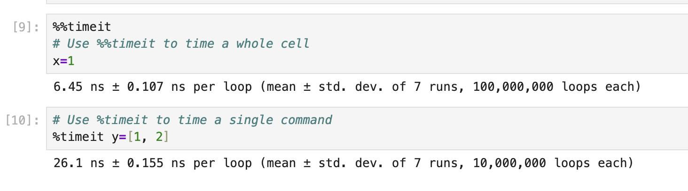{width="70%" fig-alt="TODO: describe image"}

- Try it out on your computer!
  - CompPhys/ArrayProgramming/Speed.ipynb
  - Cells 12 and 13: how fast does your computer make a 100,000-element array?

---

## Speeding up python

- Numba

---

## numba

- So far, I've told you to avoid "for" loops
  - Using numpy arrays, ufuncs, broadcasting, np.where(), etc.
- However, sometime you really can't avoid them!
- A solution: numba

- Numba allows the compilation of selected portions of Python code to native code, using llvm as its backend. This allows the selected functions to execute at a speed competitive with code generated by C compilers.
- It works at the function level. We can take a function, generate native code for that function as well as the wrapper code needed to call it directly from Python. This compilation is done on-the-fly and in-memory.

- [https://numba.readthedocs.io/en/stable/user/5minguide.html](https://numba.readthedocs.io/en/stable/user/5minguide.html)

---

## Decorators

- numba syntax uses decorators: a method to modify the behavior of existing functions
  - Technically: "functions of functions".
  - Remember, python functions are objects, just like integers etc..
- Simple example:

- def announce_me(func):
- def wrapper():
    - print("Announcement! Starting function!")
    - func()
    - print("Announcement! Function has ended!")
  - return wrapper
- def hello_world():
- print("Hello world!")
- hello_world = announce_me(hello_world)

- def announce_me(func):
- def wrapper():
    - print("Announcement! Starting function!")
    - func()
    - print("Announcement! Function has ended!")
  - return wrapper
- @announce_me
- def hello_world(x):
- print("Hello world!")

- [https://numba.readthedocs.io/en/stable/user/5minguide.html](https://numba.readthedocs.io/en/stable/user/5minguide.html)

- (This is an example of syntactic sugar: nice syntax to make your life easier, but doesn't really implement a "new feature".)

---

## Decorators

- Decorators also work with function arguments
  - Using (*args, **kwargs) syntax, a generic way of using function arguments
  - *args = positional args(unnamed; list), **kwargs = keyword args (named; dict)
- (Common use case: different kinds of class methods.)

- def announce_me(func):
- def wrapper(*args, **kwargs):
    - print("Announcement! Starting function!")
    - func(*args, **kwargs)
    - print("Announcement! Function has ended!")
  - return wrapper
- @announce_me
- def hello(who):
- print(f"Hello {who}!")

- [https://numba.readthedocs.io/en/stable/user/5minguide.html](https://numba.readthedocs.io/en/stable/user/5minguide.html)

---

## numba syntax

- To numba-compile a function, just add a numba decorator!

- import numba
- import numpy as np
- x = np.arange(10_000).reshape(100, 100)
- @numba.jit(nopython=True)
- def go_fast(a): # Function is compiled and runs in machine code
- trace = 0.0
- for i in range(a.shape[0]):
- trace += np.tanh(a[i, i])
- return a + trace

- "nopython=True" means we require numba to compile everything.
- Versus "nopython=False" (aka "object mode"): numba compiles what it can, and runs the rest in the python interpreter.

- [https://numba.readthedocs.io/en/stable/user/5minguide.html](https://numba.readthedocs.io/en/stable/user/5minguide.html)

---

## numba syntax

- You can compile a function by simply adding a numba decorator:

- import numba
- import numpy as np
- x = np.arange(10_000).reshape(100, 100)
- @numba.jit(nopython=True)
- def go_fast(a): # Function is compiled and runs in machine code
- trace = 0.0
- for i in range(a.shape[0]):
- trace += np.tanh(a[i, i])
- return a + trace

- "nopython=True" means we require numba to compile everything.
- Versus "nopython=False" (aka "object mode"): numba compiles what it can, and runs the rest in the python interpreter.

---

## Hands-on

- Try out the numba examples in CompPhys/ArrayProgramming/Speed.ipynb.
  - Generating the "Barnsley fern."

---

## Speeding up python

- Swig

---

## Swig

- We’ve now looked at how to do C++ and python separately
  - (OK, technically we are using them together, since numpy is written in C++)
- How can we put them together generically?
- Several option. We will try out SWIG
  - http://www.swig.org
  - Tutorial: http://www.swig.org/tutorial.html
- Everything is in the hands-on here! Go to:
  - [CompPhys/SwigExamples/example_swig_cpp.ipynb](https://github.com/ubsuny/CompPhys/blob/main/SwigExamples/example_swig_cpp.ipynb)

- [https://www.swig.org/Doc4.3/Python.html#Python](https://www.swig.org/Doc4.3/Python.html#Python)

---

## Swig

- %module example
- /* First: Include your own code.*/
- %{
- #define SWIG_FILE_WITH_INIT
- #include "example.hpp"
- %}
- /* Next: declare the functions you want to use.*/
- int sum_int(std::vector<int> const & vec);
- /* Finally: include any other libraries and types you need.
- Yes, you need one type per class, so that means one type per
- template instance.*/
- %include "std_vector.i"
- namespace std {
- %template(vector_int) vector<int>;
- };

- example.i
- (Tells Swig what to do)

- #ifndef EXAMPLE_HPP
- #define EXAMPLE_HPP
- #include <vector>
- int sum_int(std::vector<int> const & vec);

- example.hpp
- (The C++ header)

- example.cpp
- (The C++ code)

- int sum_int(std::vector<int> const & vec)
- {
- int sum = 0;
- for ( auto i : vec ) {
- sum += i;
- }
- return sum;
- }

- [https://www.swig.org/Doc4.3/Python.html#Python](https://www.swig.org/Doc4.3/Python.html#Python)

---

## Swig

- >> swig -c++ -python swig_example/example.i

- Step 1: create swig interface files

- [https://www.swig.org/Doc4.3/Python.html#Python](https://www.swig.org/Doc4.3/Python.html#Python)

- This creates a couple files:
- example_wrap.cxx: low-level wrappers around your C++ code, needed to create the extension module.
- example.py: high-level wrapper code for importing the module in python.

---

## Swig

- >> python swig_example/setup.py build_ext --inplace

- Step 2: create actual python module

- [https://www.swig.org/Doc4.3/Python.html#Python](https://www.swig.org/Doc4.3/Python.html#Python)

- This does the actual compiling.
  - (You can also do this by hand, see the documentation.)
- The folder should now contain a .so file with the compiled C++ code (something like _[example.cpython-312-aarch64-linux-gnu.so](http://example.cpython-312-aarch64-linux-gnu.so))

---

## Swig

- >> import example
- >> help(example)
- Help on module example:
- NAME
- example
- DESCRIPTION
- # This file was automatically generated by SWIG (https://www.swig.org).
- # Version 4.2.0
- #
- # Do not make changes to this file unless you know what you are doing - modify
- # the SWIG interface file instead.
- CLASSES
- builtins.object
- SwigPyIterator
- vector_int
- ...
- ...
- FUNCTIONS
- product_int(vec)
- sum_int(vec)

- Step 3: use the python module!
- Note on docstrings ([https://peps.python.org/pep-0257/](https://peps.python.org/pep-0257/)):
  - A docstring is a string literal that occurs as the first statement in a module, function, class, or method definition. Such a docstring becomes the __doc__ special attribute of that object.
  - All modules should normally have docstrings, and all functions and classes exported by a module should also have docstrings. Public methods (including the __init__ constructor) should also have docstrings. A package may be documented in the module docstring of the __init__.py file in the package directory.

- [https://www.swig.org/Doc4.3/Python.html#Python](https://www.swig.org/Doc4.3/Python.html#Python)

---

## Recap

- Improving python performance:
  - Understanding why python is slow.
  - Simple ways to profile your code and identify bottlenecks.
  - numba: just-in-time compilation of python code.
  - swig: interface between C++ and python.

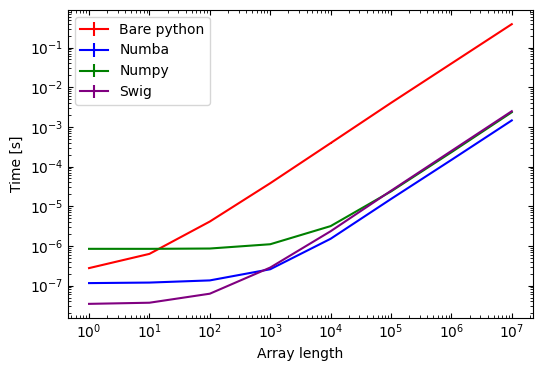{width="70%" fig-alt="TODO: describe image"}

---

## Recap 2

- We've reached the end of the "technical" part of the course!
  - Next week, we will (finally!) start on the "physics" part of "computational physics."
- A few take-home messages:
  - You all know C++ now!
  - Write clean, readable code; write documentation. Remember, code is read much more often than written.
    - Linters can automate this ([https://code.visualstudio.com/docs/python/linting](https://code.visualstudio.com/docs/python/linting))
  - Optimize your code only where it matters:
    - Human time is expensive, CPU time is cheap(ish)!
    - This is Computational Physics. For us, programming is a tool to answer questions (even if it's also fun).
    - Between C++ and python (and julia and rust and ...), think about what the best tool is for the job at hand.

---

## Slide 147

{width="70%" fig-alt="TODO: describe image"}
