## Announcements

- Office hours officially set: Wednesdays, 11:30am–12:30pm
- Assignment 1 is posted to UBLearns
  - Accept on Github Classroom: [https://classroom.github.com/a/uwfJMSPr](https://classroom.github.com/a/uwfJMSPr)
  - Topics: data representations in C++
  - Due date: Wednesday, September 10 @11:59pm
- Today's lecture:
  - Recap Git usage; demonstrate GitHub Classroom
  - Start on basics of programming, with focus on how to represent data in a computer.

---

## Announcements

- Some setup tips:
  - ssh-agent (reminder: saves your SSH key password, so you don't have to type the password)
    - GitHub has instructions for automatically starting your SSH agent once per reboot: see [documentation](https://docs.github.com/en/authentication/connecting-to-github-with-ssh/working-with-ssh-key-passphrases?platform=windows).
  - SSH config file:
    - Best practice: tell SSH exactly which key to use.
    - Edit ~/.ssh/config and add the following:
- Host github.com
- IdentityFile ~/.ssh/id_ed25519_mygithubkey
      - Then, change the permissions:
- sudo chmod 600 ~/.ssh/config
  - Docker container error: write permissions errors in CompPhys folder?
    - Use ./runDocker_wfix.sh
    - Updated this morning; do a git pull to download the latest version.

---

# GIT(hub) (classroom)

---

## Recall: git workflow

<!-- TODO: complex slide layout (flagged by detect_complex_slide.py - see run log). Content below is complete but UNARRANGED - needs manual layout to match the original slide. -->

- Pull remote repo

- GitHub.com

- Local repo
- (.git folder)

- Staging area

- Working directory

- Checkout branch (optional)

- Stage changes

- Commit staged changes

- Push remote repo

---

## Recall: git workflow

<!-- TODO: complex slide layout (flagged by detect_complex_slide.py - see run log). Content below is complete but UNARRANGED - needs manual layout to match the original slide. -->

- Pull remote repo

- 5. git commit -m "I did a thing"

- 6. git push origin HEAD:main

- 4+5. git commit -am "Updated some files"
- (Shortcut to commit all modifications to existing files)

- GitHub.com

- Local repo
- (.git folder)

- Staging area

- Working directory

- Checkout branch (optional)

- 2. git switch -c my-branch
- (or git checkout -b my-branch)
- Not necessary for homework, just use the `main` branch

- 3. Do your coding
- (Do your homework)

- Stage changes

- Commit staged changes

- Push remote repo

- 1. git clone ssh://git@github.com:ubsuny/compphys-assignment1-DryRun

- 4. git add [new/modified files]

---

## GitHub Classroom

- We will be using GitHub classroom for our assignments
  - GitHub education: [https://education.github.com](https://education.github.com) (FREE STUFF)
  - GitHub classroom: https://classroom.github.com/classrooms.

{width="70%" fig-alt="TODO: describe image"}

---

## Assignments in GitHub Classroom

- "Dummy" assignment: [https://classroom.github.com/a/ggKpp7aK](https://classroom.github.com/a/ggKpp7aK)
- Assignments in GHC use all the basic concepts:
  - Fork: when you start an assignment, GHC makes a forked repository for you, at github.com/ubsuny/<assignment>-<username>
  - Clone: copy the forked repository to your laptop
  - (No extra branches needed, just do your work in the main branch)
  - Do the actually assignment on your laptop
    - Code on your laptop, compile/run programs in the container
  - Stage and commit: when you're ready to submit, make a commit with all your assignment code
  - Push: Push the commit to your fork on github.com
  - Pull request: Make a PR to the main repository so the teacher can grade it :)
    - Note: GHC will eventually mark as "Submitted." Seems a bit slow.

---

## Assignments in GitHub Classroom

- "Dummy" assignment: [https://classroom.github.com/a/ggKpp7aK](https://classroom.github.com/a/ggKpp7aK)
- Assignments in GHC use all the basic concepts:
  - Fork: when you start an assignment, GHC makes a forked repository for you, at github.com/ubsuny/<assignment>-<username>
  - Clone: copy the forked repository to your laptop
  - (No extra branches needed, just do your work in the main branch)
  - Do the actually assignment on your laptop
    - Code on your laptop, compile/run programs in the container
  - Stage and commit: when you're ready to submit, make a commit with all your assignment code
  - Push: Push the commit to your fork on github.com
  - Pull request: Make a PR to the main repository so the teacher can grade it :)
    - Note: GHC will eventually mark as "Submitted." Seems a bit slow.

- git push origin HEAD:main

- cd <assignment>-<username>
- mkdir AssignmentN
- cd AssignmentN
- <Do homework>

- git clone ssh://git@github.com:ubsuny/<assignment>-<username>

- git add AssignmentN
- (Should add all files inside, otherwise do more git adds)
- git commit -am "Add AssignmentN files"

---

## Assignments in GitHub Classroom

- Format of most assignments:
  - Upload code to GitHub Classroom:
    - Entire [github.com/ubsuny/CompPhys](http://github.com/ubsuny/CompPhys) repository used as a "template." This is what GHC uses to make your fork, github.com/ubsuny/<assignment>-<username>.
    - Make a new folder, say CompPhys/AssignmentN. Copy any necessary files into this folder.
      - This keeps the template code separate from your own work.
      - The contents of CompPhys/AssignmentN will be graded.
  - Upload the corresponding writeup to UBLearns
  - I will try to be as specific about possible about what your code and writeup should include.
- Let's do a trial run with the dummy assignment.

---

# Programming basics

---

## Programming

- We will now be learning how to program.
- We are learning C++ first, because:
  - It's harder (better, faster, stronger).
  - It is a better way to learn what your computer is *actually* doing.
- Then, we will learn python, because:
  - It's quicker and easier with many practical applications.

---

## Computers

<!-- TODO: complex slide layout (flagged by detect_complex_slide.py - see run log). Content below is complete but UNARRANGED - needs manual layout to match the original slide. -->

- In the 1980s, you needed to know UNIX to check email.
- Now, you just bark the order into your phone.
- Somewhere, that order is transferred into currents and voltages on transistors.
- How does it happen in between?

{fig-alt="TODO"}

- Siri! Get my mail!

{fig-alt="TODO"}

---

## Computers

:::: {.columns}
::: {.column width="55%"}
- Your voice is being recognized by software that does a waveform analysis
  - We’ll look at the basics of waveform analysis later in the semester!
- That software is written in some high level language that translates commands (source code) to instructions for your computer chip.
- Two main modes :
  - Compiled
  - Interpreted
:::
::: {.column width="45%"}
{width="100%" fig-alt="TODO: describe image"}
:::
::::

---

## Compiling C++

<!-- TODO: complex slide layout (flagged by detect_complex_slide.py - see run log). Content below is complete but UNARRANGED - needs manual layout to match the original slide. -->

- Source code: "high-level," written in human-readable language.
  - Usually modular: divided into independent pieces.
- Assembly code: "low-level," instructions correspond directly to processor operations.
  - Sort of readable.
- Object files: Binary instructions for the CPU.
  - Not readable.
- Executable: actual program that you run.

{fig-alt="TODO"}

- Compilation passes through a few stages:

- Compiler steps: lexical analysis; syntax analysis; semantic analysis; assembly code generation+optimization

---

## Compiling C++

<!-- TODO: complex slide layout (flagged by detect_complex_slide.py - see run log). Content below is complete but UNARRANGED - needs manual layout to match the original slide. -->

- In practice, you rarely have to worry about most of these steps.
  - I have never read a single piece of assembly code.
- You do have to become proficient in invoking the tools. For example:
  - Debugging compiler errors.
  - Linking external libraries (=code other people wrote).
  - Advanced: understanding optimizations.

{fig-alt="TODO"}

- Haltermann, Fig. 1.1

---

## Assembly code

<!-- TODO: complex slide layout (flagged by detect_complex_slide.py - see run log). Content below is complete but UNARRANGED - needs manual layout to match the original slide. -->

- Assembly code is something you need to UNDERSTAND, but not necessarily to WRITE
- Mnemonic for specific chipset instructions
- Architecture specific (AMD, Intel, etc)
- Basic instructions:
  - “Move contents of Register 1 into Register 2”
  - “Add contents of Register 1 and Register 2 together, store in Register 3”
- THESE are the important issues when concerning yourself with writing code
- Speed, memory efficiency, etc, primarily impacted

{fig-alt="TODO"}

- Memory address

- Action

- Arguments

---

## Computers

- We need to understand the guts of what's going on, before we can learn to use them correctly.
- Everything in the computer is stored in a specific memory location: an address.
- It's ultimately a set of 2-state transistors:
  - "On" or "off".
  - Aka 1 or 0 in binary.
  - Almost always grouped into sets of 8: 8 bits =1 byte

{width="70%" fig-alt="TODO: describe image"}

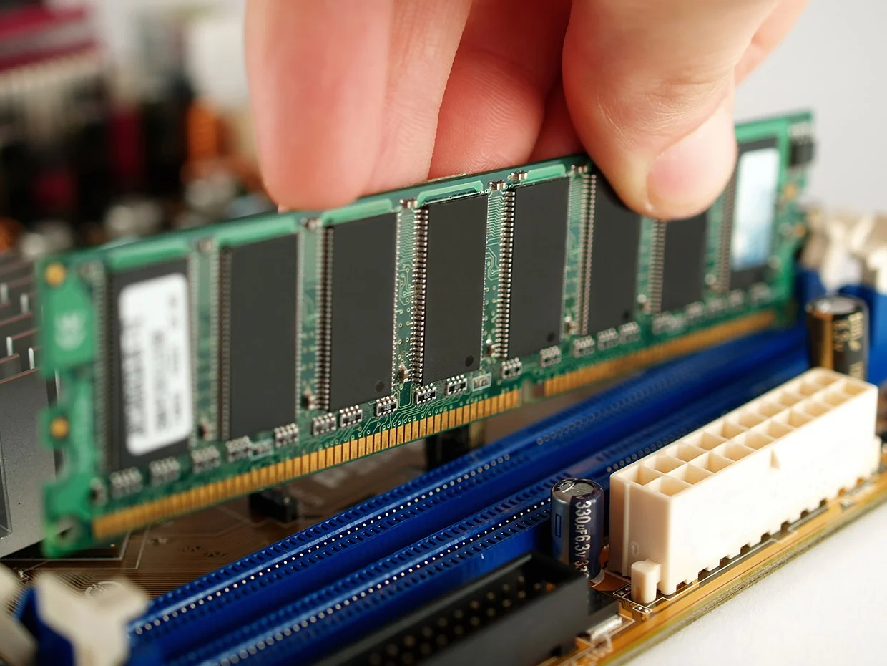{width="70%" fig-alt="TODO: describe image"}

---

## Counting in binary

- Everyday numbers = base 10

- $$1 \times {10}^{3}+3 \times {10}^{2}+5 \times {10}^{1}+7 \times {10}^{0}=1357$$

---

## Counting in binary

- Everyday numbers = base 10
- Numbers in memory = base 2
  - Binary digits = bits

- $$1 \times {2}^{3}+0 \times {2}^{2}+0 \times {2}^{1}+1 \times {2}^{0}=9$$

---

## Counting in binary

- Everyday numbers = base 10
- Numbers in memory = base 2
  - Binary digits = bits

- $$1 \times {2}^{7}+0 \times {2}^{6}+0 \times {2}^{5}+1 \times {2}^{4}+1 \times {2}^{3}+0 \times {2}^{2}+0 \times {2}^{1}+0 \times {2}^{0}=152$$

---

## Even more bases

- Reading binary is cumbersome
  - Lots of digits!
  - 15210 = 100110002
- For compactness, print functions often use octal (base-8) or hexadecimal (base-16).
- For a given number, how do you tell what base? Convention: use prefixes
  - Binary = "0b" (e.g. 0b1011000)
  - Octal = "0"
  - Hexadecimal = "0x"

- Octal:
  - $$152=2 \times {8}^{2}+3 \times {8}^{1}+0 \times {8}^{0}$$
  - Write as 0230

- (Subscript 10 means "base 10")

---

## Even more bases

- Reading binary is cumbersome
  - Lots of digits!
  - 15210 = 100110002
- For compactness, print functions often use octal (base-8) or hexadecimal (base-16).
- For a given number, how do you tell what base? Convention: use prefixes
  - Binary = "0b" (e.g. 0b1011000)
  - Octal = "0"
  - Hexadecimal = "0x"

- Hexadecimal:
  - Firstly, we need to be able to count to 15! Use a few numbers: 0, 1, 2, 3, 4, 5, 6, 7, 8, 9, a, b, c, d, e, f
  - $$152=9 \times {16}^{1}+8 \times {16}^{0}$$
  - Write as 0x98

---

## Even more bases

- Reading binary is cumbersome
  - Lots of digits!
  - 15210 = 100110002
- For compactness, print functions often use octal (base-8) or hexadecimal (base-16).
- For a given number, how do you tell what base? Convention: use prefixes
  - Binary = "0b" (e.g. 0b1011000)
  - Octal = "0"
  - Hexadecimal = "0x"

- Hexadecimal:
  - Firstly, we need to be able to count to 15! Use a few numbers: 0, 1, 2, 3, 4, 5, 6, 7, 8, 9, a, b, c, d, e, f
  - $$255=15 \times {16}^{1}+15$$
  - Using 15==f, write as:
  - 0xff

---

## Even more bases

---

## Even more bases

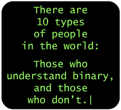{width="70%" fig-alt="TODO: describe image"}

---

## Even more bases

{width="70%" fig-alt="TODO: describe image"}

- And now you are all 1s!

---

## Endianness

<!-- TODO: complex slide layout (flagged by detect_complex_slide.py - see run log). Content below is complete but UNARRANGED - needs manual layout to match the original slide. -->

- Aside: what do binary numbers actually look like in transistors in memory?
  - Just like letters: you can write left-to-right or right-to-left.
  - Some architectures do one, some the other.
- This is which “end” to start from : the “Endian” debate
  - From Gulliver’s Travels, as in which end of the soft boiled egg to crack
- “Big end -ian” : most significant digit (i.e., biggest digit) is first.
  - English uses this: 1234, the 1 is the biggest.
- “Little end -ian” : least significant digit is first.

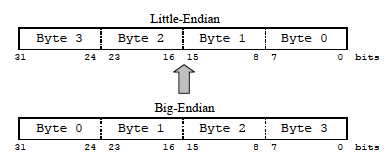{fig-alt="TODO"}

- Little endian:
  - ix86
  - AMD64
- Big endian:
  - SPARC
  - Atmel AVR32
- Bi endian:
  - ARM (>v3)
  - PowerPC
  - IA64

{fig-alt="TODO"}

- Trivia: big-endian and little-endian [come from Gulliver's Travels](https://www.ling.upenn.edu/courses/Spring_2003/ling538/Lecnotes/ADfn1.htm)

---

## What about negative numbers?

- How about NEGATIVE numbers?
  - Well, uhh… easy too, right?
  - -2 (base 10) = -10 (binary) ...?
  - But how to represent that in transistors? We need to use one bit to indicate the sign!

---

## What about negative numbers?

- How about NEGATIVE numbers?
  - Well, uhh… easy too, right?
  - -2 (base 10) = -10 (binary) ...?
  - But how to represent that in transistors? We need to use one bit to indicate the sign!
- Naive solution:
  - We have to sacrifice one bit to represent sign info.
  - Let's use the first bit.
  - -210 = binary 110
  - The first bit is used to represent sign:
    - 0=positive (010=2)
    - 1=negative (110=-1)

---

## What about negative numbers?

- Great, let's try some math!
- Decimal 4 + 3 = 7   =>  0b100 + 0b011 = 0b111
- Decimal 4 - 3 = 1  => 0b100 - 0b011 = 0b001
{width="70%" fig-alt="TODO: describe image"}

- How about NEGATIVE numbers?
  - Well, uhh… easy too, right?
  - -2 (base 10) = -10 (binary) ...?
  - But how to represent that in transistors? We need to use one bit to indicate the sign!
- Naive solution:
  - We have to sacrifice one bit to represent sign info.
  - Let's use the first bit.
  - -210 = binary 110
  - The first bit is used to represent sign:
    - 0=positive (010=2)
    - 1=negative (110=-1)

---

## What about negative numbers?

- Great, let's try some math!
- Decimal 4 + 3 = 7   =>  0b100 + 0b011 = 0b111
- Decimal 4 - 3 = 1  => 0b100 - 0b011 = 0b001
- Uhh, but shouldn’t “4 - 3” be the same as “4 + (-3”)?
- Uhhh…
- Decimal : 4 + (-3) => 0b100 + 0b111
  - ...=0b1011?
- Crap. Doesn’t work! This is 11 in base-10!
{width="70%" fig-alt="TODO: describe image"}

- How about NEGATIVE numbers?
  - Well, uhh… easy too, right?
  - -2 (base 10) = -10 (binary) ...?
  - But how to represent that in transistors? We need to use one bit to indicate the sign!
- Naive solution:
  - We have to sacrifice one bit to represent sign info.
  - Let's use the first bit.
  - -210 = binary 110
  - The first bit is used to represent sign:
    - 0=positive (010=2)
    - 1=negative (110=-1)

---

## "Two's complement"

- Solution : two’s complement representation
  - [https://en.wikipedia.org/wiki/Two's_complement](https://en.wikipedia.org/wiki/Two's_complement)
- Let's fix N=4 bits.
  - First bit is reserved for sign info,
  - Other 3 bits for the actual number.
- To compute the "two's complement" representation of a given number, $x$:
  - Invert the digits ($0 \leftrightarrow 1$)
  - Add 1
  - Ignore any overflow, i.e., if we exceed N=4 bits, just throw away biggest digits.

- Examples:
  - 610 = binary 0110
  - -610 = binary 1001+1=binary 1010
  - 6 + (-6) = 0110+1010 = 10000 ✅
  - -2 = -(binary 0010) = binary 1101+1 = binary 1110
  - 6 + (-2) = 0110 + 1110 = 10100 ✅
{width="70%" fig-alt="TODO: describe image"}

---

## "Two's complement"

:::: {.columns}
::: {.column width="55%"}
- Why does this work???
- Answer: modular arithmetic!
- N=4 bits can represent positive integers from 0–15.
  - What happens if we take 10+10=20? This is outside our "range," but we want math to work, i.e., we want closure under addition.
  - Solution: modular arithmetic
    - "Wrap around" like a clock.
  - $$20 \equiv 4mod16$$
:::
::: {.column width="45%"}
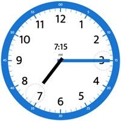{width="100%" fig-alt="TODO: describe image"}
:::
::::

---

## "Two's complement"

- Why does this work???
- Answer: modular arithmetic!
- N=4 bits can represent positive integers from 0–15.
  - What happens if we take 10+10=20? This is outside our "range," but we want math to work, i.e., we want closure under addition.
  - Solution: modular arithmetic
    - "Wrap around" like a clock.
  - $$20 \equiv 4mod16$$

- N=4 bits can also represent positive and negative integers, say from -8 to 7 (by convention).
- Key fact: $-x \equiv -x+16mod16$
  - $$-1 \equiv 15mod16$$
  - $$-7 \equiv 9mod16$$

---

## "Two's complement"

- Why does this work???
- Answer: modular arithmetic!
- N=4 bits can represent positive integers from 0–15.
  - What happens if we take 10+10=20? This is outside our "range," but we want math to work, i.e., we want closure under addition.
  - Solution: modular arithmetic
    - "Wrap around" like a clock.
  - $$20 \equiv 4mod16$$

- N=4 bits can also represent positive and negative integers, say from -8 to 7 (by convention).
- Key fact: $-x \equiv -x+16mod16$
  - $$-1 \equiv 15mod16$$
  - $$-7 \equiv 9mod16$$
- In mod 16, 15 is exactly the same number as -1!
  - Addition, subtraction, and multiplication all work exactly the same.
  - So, (-8, -1) is mapped to (8, 15) instead.

---

## "Two's complement"

- So, why did we flip all the bits and add 1?
- Reason by example: starting from 1=0b0001, let's try adding the flipped number:
  - 0b0001 + 0b1110 = 0b1111 = 15 = 24-1
  - 0b1110 + 1 = 24 - 0b0001
  - $ \Rightarrow $0b1110 + 1 $ \equiv $ -(0b0001) mod 16

- Ta-daaa! Like magic, but it’s math!

---

## "Two's complement"

- Why is this so important for computers?
  - Addition, subtraction, and multiplication all work using normal math.
  - No need for special instructions for the chip!
    - We could make things work with the "naive" representation.
    - Addition becomes an "if" statement: CPU does different things depending on +(pos) or +(neg) number.
    - This would be super expensive!

---

## Representing numbers on a computer

- Storage of numbers on computers is done in binary.
- 1 bit is not super useful!
  - Instead, computers use fixed-sized groups of bits: bytes!
  - Yes, like “gigabyte” (GB). Versus "gigabit" (Gb).
- How many bits are in a byte?
  - Architecture dependent, but usually 8 bits =1 byte
  - Everything from 1-48 bits per byte has been used
- 8-bit byte : 00111100
  - Can represent integers from 0 - 255
  - In hexadecimal : 0x0 - 0xff
- How do you store bigger numbers?
  - Use multiple bytes!

---

## Integers

- The range of integers you can represent depends on:
  - How many bytes used?
  - Signed or unsigned?

---

## Decimals

<!-- TODO: complex slide layout (flagged by detect_complex_slide.py - see run log). Content below is complete but UNARRANGED - needs manual layout to match the original slide. -->

- What about decimal numbers?
  - Naive attempt: just convert the numbers you see, 2.2 $ \rightarrow $ binary 10.10. But how do we represent where the decimal goes?
- Better idea: use scientific notation. Example: 3.154e+7 (seconds in a year :)
- Floating point numbers: given a fixed number of bytes for your decimal object, use some bits for the exponent (7), some bits for the mantissa (3.154), and one bit for the sign (+).
  - Typical sizes: 2 bytes ("single precision") or 4 bytes ("double precision")

{fig-alt="TODO"}

- Sign

- Exp.

- Mantissa

---

# C++ Intro

---

## C++ intro

- This brings us finally to C++!
- The first concept we need to understand: data type
  - Data types tell the computer how you are going to INTERPRET the bits on the register
- Example : Computer gives you 
11110110100111010111011010011101
  - What the heck is that?
  - Is it a signed integer? -157452643
  - Is it an unsigned integer? 4137514653
  - Is it a float? -1.5968679E33
  - Is it a double? -1.5968679100482687E33

---

## "Strong typing"

- Since computing (and nature) is hard, you have to understand what the computer is giving you and how you are interpreting it.
- This is why C++ is “strongly typed”: you need to tell the computer EXACTLY how you are representing the number.
- int x = 10;
- float proton_mass = 1.6726e-27;
- On the other hand, Python is "weakly typed": you don't have to declare variable types. Instead, Python figures it out at runtime.

- Commonly used data types

---

## An annoyance

- The C++ standard specifies that “int”, for instance, must be AT LEAST 16 bits (2 bytes). It can be more, and sometimes is!
- This is ARCHITECTURE DEPENDENT
- size of int on linux+intel != size of int on mac+amd
- When in doubt, check [http://en.cppreference.com/w/cpp/language/types](http://en.cppreference.com/w/cpp/language/types)

---

## Data types and n(bits)

<!-- TODO: complex slide layout (flagged by detect_complex_slide.py - see run log). Content below is complete but UNARRANGED - needs manual layout to match the original slide. -->

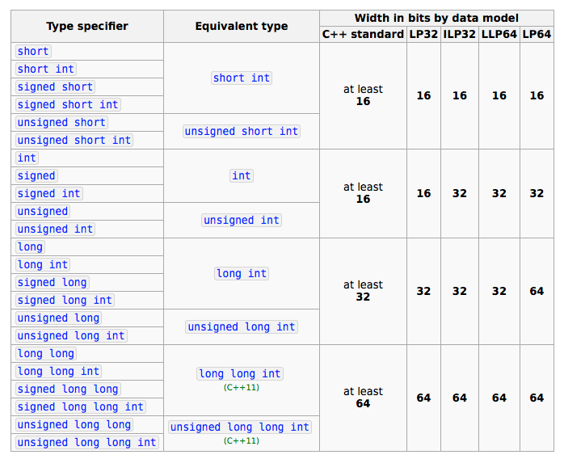{fig-alt="TODO"}

- Win16
- Arduino

- Win32
- Unix
- Linux
- macOS

- Win64

- Unix
- Linux
- macOS

---

## Data types and range of values

{width="70%" fig-alt="TODO: describe image"}

---

## Recap

- tl;dr :
  - Data types are hard and not very intuitive!
  - They are designed for efficiency/performance, not ease of use.
  - C++ types you will use the most :
    - char
    - int, unsigned int
    - float, double
  - You need to be aware of the intricacies and difficulties, though… you WILL run into this if you do any serious numerical computing in the future.
- Assignment 1 is posted, due next Wednesday, September 10 at 11:59pm.
  - Assignment 1/problem 1 is about the two's complement algorithm.
  - Assignment 1/problems 2&3 are about the capacity of various integer types.
- Up next: compiling and executing C++ programs.

---

# Compiling

---

## Basic mechanics of C++

{width="70%" fig-alt="TODO: describe image"}

- Now that we know how data are represented, we need to learn how to do things with it.
- The first thing we need to learn is how to translate C++ to machine code. Recall the schematic of a compiler:

---

## Basic mechanics of C++

- The “Hello World” program is simple:
- Go to CompPhys/ReviewCpp/BasicExamples/hello.cc:

- #include <iostream>
- int main(void){
- std::cout << "Hello, world" << std::endl;
- return 0;
- }

- ...but not as simple as Python!

- print("Hello, world")

---

## Basic mechanics of C++

- The “Hello World” program is simple:
- Go to CompPhys/ReviewCpp/hello.cc:

- #include <iostream>
- int main(void){
- std::cout << "Hello, world" << std::endl;
- return 0;
- }

- Includes input/output modules

- Main function : inputs nothing (void), returns an int

- Prints “Hello, world” to the screen, with an end line

- Returns 0 (success)

---

## Basic mechanics of C++

- The “Hello World” program is simple:
- Go to CompPhys/ReviewCpp/hello.cc:

- #include <iostream>
- int main(void){
  - // A comment
- std::cout << "Hello, world" << std::endl;
- return 0; // Comment
- }
- /*
- A two-line
- comment
- */

- You can (should!) also add comments: useful for humans, completely ignored by compiler.

---

## Basic mechanics of C++

<!-- TODO: complex slide layout (flagged by detect_complex_slide.py - see run log). Content below is complete but UNARRANGED - needs manual layout to match the original slide. -->

- In general, your executable program will always look something like this:

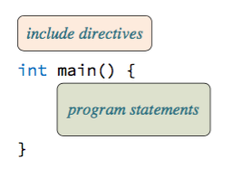{fig-alt="TODO"}

---

## Hands-on: compiling a program

<!-- TODO: complex slide layout (flagged by detect_complex_slide.py - see run log). Content below is complete but UNARRANGED - needs manual layout to match the original slide. -->

- Let's try compiling the "Hello, world" program!

- $ ls
- hello.cc
- $ g++ hello.cc -o hello.exe
- $ ls
- hello.cc    hello.exe
- $ ./hello.exe
- Hello, world

- We will be using the “g++” compiler
- This is the “GNU” compiler
- What’s “GNU”? “GNU’s not Unix”.
- Free, and up to date with ANSI standards

{fig-alt="TODO"}

---

## Hands-on: compiling a program

<!-- TODO: complex slide layout (flagged by detect_complex_slide.py - see run log). Content below is complete but UNARRANGED - needs manual layout to match the original slide. -->

- Let's try compiling the "Hello, world" program!

- $ ls
- hello.cc
- $ g++ hello.cc -o hello.exe
- $ ls
- hello.cc    hello.exe
- $ ./hello.out
- Hello, world

- First, we see “[hello.cc](http://hello.cc)” in the directory
- Then we execute the compilation command with “g++”
  - The “-o” is the label we want the output to be named
- Then we see the executable “hello.exe” already
- What about the Assembler and Linker?
  - More on that later.
- We execute it with “./“ (this means “execute from this directory”)

{fig-alt="TODO"}

---

## Compiler errors

- The syntax here has to be precise!
- What happens if we make a mistake? Compiler errors!
- Example: remove the semicolon (“;”) after “std::endl”:

- std::cout << "Hello, world" << std::endl

- Now try to compile:

- $ g++ hello.cc -o hello.exe
- hello.cc: In function ‘int main()’:
- hello.cc:5: error: expected ‘;’ before ‘return’

- The compiler tells you EXACTLY what is wrong:
  - Line number 5, expects “;” before the statement “return”
- Fix, and try again, and it works again.

---

## Compiler errors

- Moral of the story :
  - Computers are dumb.
  - They do EXACTLY what you tell them to do, so it’s almost always (>99%) your fault when something goes wrong.
  - This is called “pilot error” (you’re the pilot).
- They also tell you EXACTLY what went wrong.
  - It may not be anything you are thinking about at that time, but it will be extremely precise
  - Note : Clarity is NOT the same thing as being precise.
  - Example : You get overheated in your jacket. Someone asks you what is wrong, and you reply “The internal core temperature of my body has not been maintained accurately, the insulation of the air within my coat is trapping excess heat inside it, causing my temperature to rise. My brain has sent an electrical signal to my pituitary gland to activate glands in my body to release perspiration to attempt to utilize a phase transition of the water to steam to cool my skin”.
  - That’s precise, but not clear.
  - “I’m sweating” is clear, but not precise.

---

## "What does THAT mean???"

- How about a different mistake : take the “std::” off the “cout”:

- cout << "Hello, world" << std::endl;

- $ g++ hello.cc -o hello.exe
- hello.cc: In function ‘int main()’:
- hello.cc:4: error: ‘cout’ was not declared in this scope

- At this point, you have no idea what that means!
  - Compiler tells you precisely what is wrong.
  - Compiler does not tell you “You missed the std::” like the last time. It is not smart enough to tell you what is wrong!
  - But, it tells you what it knows to be the problem.
- We will get to “declarations” and “scope” later.

---

## "What does THAT mean???"

- How about a different mistake : take the “std::” off the “cout”:

- cout << "Hello, world" << std::endl;

- $ g++ hello.cc -o hello.exe
- hello.cc: In function ‘int main()’:
- hello.cc:4: error: ‘cout’ was not declared in this scope

- At this point, you have no idea what that means!
  - Compiler tells you precisely what is wrong.
  - Compiler does not tell you “You missed the std::” like the last time. It is not smart enough to tell you what is wrong!
  - But, it tells you what it knows to be the problem.
- We will get to “declarations” and “scope” later.

  - Fixing bugs is (obviously) a critical skill for programming.
    - Compiler errors, runtime errors, segmentation faults, ...
  - You will frequently encounter bizarre and unfamiliar error messages!
    - You will learn to identify the root problem (versus secondary errors), i.e., distinguish relevant vs. irrelevant messages.
    - Google/ChatGPT has a lot of answers.
    - Be persistent and patient!

---

## Compiler errors

- These are examples of “compiler errors”
  - That means you didn’t set the code up correctly within a file
- We will also get to “linker errors”
  - That means you didn’t set the code up correctly ACROSS different files
- And of course, there are “runtime errors”
  - That means the code is technically correct syntactically, but you didn’t think about the output of the code.

---

## Compiler errors

- These are examples of “compiler errors”
  - That means you didn’t set the code up correctly within a file
- We will also get to “linker errors”
  - That means you didn’t set the code up correctly ACROSS different files
- And of course, there are “runtime errors”
  - That means the code is technically correct syntactically, but you didn’t think about the output of the code.

- There are many tools to find problems:
  - Debugger : trace a program’s execution
    - GDB
  - Profiler : examines the resource usage (memory and CPU)
    - valgrind, gprof
- We will rely on very few of these tools in class, but if we have time later we can cover them.

---

# Writing C++

---

## Values and variables

- Now that we have the structure, how do we do stuff?
- First concept : “Values”
  - ints like 1, 2, 4, 3359
  - floats like 3.14
  - strings like “my string”
- For numbers, we just write the number directly. The compiler understands these.
  - Example: Instead of printing the string “Hello, World”, print the value “4”:
  - std::cout << 4 << std::endl;
- Now, if we compile and execute:

- $ ./helloworld.exe
- 4

---

## Values and variables

- Remember: numbers have to be stored as bits in your computer's memory.
  - Two's complement
  - Integer type has a specific range!
- What could go wrong?
- On my Mac:

- std::cout << -3000000000000000000000000000 << std::endl;
- $ g++ helloworld.cc -o helloworld.exe
- hello world.cc:4:17: error: integer literal is too large to be represented in any integer type
- 4 |   std::cout << -3000000000000000000000 << std::endl;
- |                 ^
- 1 error generated.

---

## Values and variables

- Remember: numbers have to be stored as bits in your computer's memory.
  - Two's complement
  - Integer type has a specific range!
- What could go wrong?
- In the Docker container:

- std::cout << -3000000000000000000000000000 << std::endl;
- $ g++ helloworld.cc -o helloworld.exe
- compphys@01db080f0a83:~/CompPhys/ReviewCpp/BasicExamples$ g++ overflow.cc -o overflow.exe
- overflow.cc:4:17: warning: integer constant is too large for its type
- 4 |   std::cout << -3000000000000000000000 << std::endl;
- |                 ^~~~~~~~~~~~~~~~~~~~~~
- overflow.cc: In function 'int main()':
- overflow.cc:4:13: error: ambiguous overload for 'operator<<' (operand types are 'std::ostream' {aka 'std::basic_ostream<char>'} and '__int128')
- 4 |   std::cout << -3000000000000000000000 << std::endl;
- |   ~~~~~~~~~ ^~ ~~~~~~~~~~~~~~~~~~~~~~~
- |        |       |
- |        |       __int128
- |        std::ostream {aka std::basic_ostream<char>}
- In file included from /usr/include/c++/13/iostream:41,
- from overflow.cc:1:
- /usr/include/c++/13/ostream:168:7: note: candidate: 'std::basic_ostream<_CharT, _Traits>::__ostream_type& std::basic_ostream<_CharT, _Traits>::operator<<(long int) [with _CharT = char; _Traits = std::char_traits<char>; __ostream_type = std::basic_ostream<char>]'
- 168 |       operator<<(long __n)
- |       ^~~~~~~~
- /usr/include/c++/13/ostream:172:7: note: candidate: 'std::basic_ostream<_CharT, _Traits>::__ostream_type& std::basic_ostream<_CharT, _Traits>::operator<<(long unsigned int) [with _CharT = char; _Traits = std::char_traits<char>; __ostream_type = std::basic_ostream<char>]'
- 172 |       operator<<(unsigned long __n)
- |       ^~~~~~~~
- /usr/include/c++/13/ostream:176:7: note: candidate: 'std::basic_ostream<_CharT, _Traits>::__ostream_type& std::basic_ostream<_CharT, _Traits>::operator<<(bool) [with _CharT = char; _Traits = std::char_traits<char>; __ostream_type = std::basic_ostream<char>]'
- 176 |       operator<<(bool __n)
- |       ^~~~~~~~
- In file included from /usr/include/c++/13/ostream:880:
- /usr/include/c++/13/bits/ostream.tcc:96:5: note: candidate: 'std::basic_ostream<_CharT, _Traits>& std::basic_ostream<_CharT, _Traits>::operator<<(short int) [with _CharT = char; _Traits = std::char_traits<char>]'
- 96 |     basic_ostream<_CharT, _Traits>::
- |     ^~~~~~~~~~~~~~~~~~~~~~~~~~~~~~

---

## "What the heck does THAT mean???"

- So this is actually the best case scenario : the compiler caught the error.
  - Technically this is NOT a syntax error : it is completely, 100% correct syntax
  - This is the first example of a “runtime error” : the error would occur at runtime
  - However, some clever compilers can catch SOME runtime errors, but it is NOT REQUIRED BY THE C++ STANDARD
  - The same code on a different compiler and machine behaves differently! Worst case: compiler doesn't catch error, but crams -300000000000 into your 16 bits, interpreted incorrectly using two's complement.
- That’s the worst case scenario: The code happily runs and gives you complete garbage, which is exactly what you told it to do.
- Let's look at some more garbage...

---

## Variables

<!-- TODO: complex slide layout (flagged by detect_complex_slide.py - see run log). Content below is complete but UNARRANGED - needs manual layout to match the original slide. -->

- Now we move to variables
- A variable is similar to a mathematical variable:
- But there's a lot more going on!
  - Content of variable (say 32 bit integer) occupies a specific set of registers in memory, allocated by your computer.
  - The memory has a specific address, besides its value.

- int x;

- x

---

## Variables

- OK, let's try it out:

- # initialize.cc
- int main() {
- int x;
- std::cout << x << std::endl;
- return 0;
- }
- ...
- $ g++ initialize.cc -o initialize.exe
- $ ./initialize.exe
- 0

- Hmm. Where did that 0 come from?
- Did the compiler just guess a sensible value for x?

- Using the container:

---

## Variables

- OK, let's try it out:

- # initialize.cc
- int main() {
- int x;
- std::cout << x << std::endl;
- return 0;
- }
- ...
- $ g++ initialize.cc -o initialize.exe
- $ ./initialize.exe
- 0

- Hmm. Where did that 0 come from?
- Did the compiler just guess a sensible value for x?

- Using the container:

- $ ./initialize.exe
- -125140816

- Using MacOS:

- DANGER! This is also compiler-dependent!
- The C++ standard does NOT specify what the initial value is for any given variable, so it is technically allowed to be filled with random garbage.

---

## Variables

<!-- TODO: complex slide layout (flagged by detect_complex_slide.py - see run log). Content below is complete but UNARRANGED - needs manual layout to match the original slide. -->

- OK, let's try it out:

- # initialize.cc
- int main() {
- int x;
- std::cout << x << std::endl;
- return 0;
- }
- ...
- $ g++ initialize.cc -o initialize.exe
- $ ./initialize.exe
- 0

- Hmm. Where did that 0 come from?
- Did the compiler just guess a sensible value for x?

- Using the container:

- $ ./initialize.exe
- -125140816

- Using MacOS:

- DANGER! This is also compiler-dependent!
- The C++ standard does NOT specify what the initial value is for any given variable, so it is technically allowed to be filled with random garbage.

{fig-alt="TODO"}

---

## Variables

- Moral of the story: always set the initial value of your variables!
  - Uninitialized variables have unknown behavior. Maybe throws a compiler error; maybe set to 0; maybe set to random values!
  - Your code will behave differently on different computers, or with different compilers.
  - Your code might even behave differently on different days!

- int x=0;
  - // Equivalent notation:
  - // int x(0);
- std::cout << x << std::endl;

---

## Variables

- Moral of the story: always set the initial value of your variables!
  - Uninitialized variables have unknown behavior. Maybe throws a compiler error; maybe set to 0; maybe set to random values!
  - Your code will behave differently on different computers, or with different compilers.
  - Your code might even behave differently on different days!
- The correct way:

- int x=0;
  - // Equivalent notation:
  - // int x(0);
- std::cout << x << std::endl;

- Now, the output of your code is guaranteed!
- Accept no substitutes! Your code must be deterministic, not random!

---

## Variable assignment

<!-- TODO: complex slide layout (flagged by detect_complex_slide.py - see run log). Content below is complete but UNARRANGED - needs manual layout to match the original slide. -->

- Let's take a closer look at variable assignment.
- int x = 0;
  - The value “x” in memory is a specific register with the value “0” stored on it.
- x = 10;
  - Change the value of x: the memory address remains the same, but the value within it changes to “10”

- “x”

- “x”

---

## Variable assignment

<!-- TODO: complex slide layout (flagged by detect_complex_slide.py - see run log). Content below is complete but UNARRANGED - needs manual layout to match the original slide. -->

- Let's take a closer look at variable assignment.
- int x = 0;
  - The value “x” in memory is a specific register with the value “0” stored on it.
- x = 10;
  - Change the value of x: the memory address remains the same, but the value within it changes to “10”

- “x”

- “x”

- Specifically, the sequence is a “COPY” :
  - Take the value “10” (0b1010)
  - Copy it into the register that “x” is allocated (address 0x1001)
  - Ensure that the value “10” is also preserved

---

## Variable assignment

- Why am I taking care to be pedantic about this?
- Because in C++, “assignment” can be very generic.
- A variable could be something much more complicated than just one integer:

- FacebookData x = facebook.copy();

- This is terrible, terrible, terrible, because it actually copies ALL of the data in facebook three times!
  - facebook.copy(): copies FacebookData to a local register.
  - Copies that register to a global scope register.
  - Copies that copied register to “x”
- Ugh, that could take awhile!

---

## Variable assignment

- We can assign values to variables over and over:

- int x=0;
- std::cout << x << std::endl;
- x = 10;
- std::cout << x << std::endl;
- x = 20;
- std::cout << x << std::endl;

---

## Variable assignment

- We can assign values to variables over and over:

- int x=0;
- std::cout << x << std::endl;
- x = 10;
- std::cout << x << std::endl;
- x = 20;
- std::cout << x << std::endl;

- IMPORTANT:
  - We only specify "int x" once. This creates the variable in memory.
  - If you write "int x" a second time:
    - Possibly: the compiler makes a brand new variable in memory, completely forgetting about the first one.
    - Probably: the compiler throws an error.

---

## Variable assignment

- A more complicated example: let's try two variables and see how they interact.

- int x=0, y=1;
- std::cout << x << std::endl;
- std::cout << y << std::endl;
- x = y;
- std::cout << x << std::endl;
- std::cout << y << std::endl;

- After running "x=y", the value x changes to 1, as expected.

- $ ./helloworld.exe
- 0
- 1
- 1
- 1

---

## Variable assignment

- What is actually going on "under the hood"?

- x

- y

- x

- y

- int x=0, y=1;

- x = y;

- Put the value “0” into “x”
- Put the value “1” into “y”

- Copy the value from “y”
- place it into the value for “x”

- Addresses of x and y remain the same.
- Value of x is updated; value of y is unchanged.
- Note: x is not tied to y in any way! Only the value was copied.

---

## C++ identifiers

- We have now seen that there is a special word in C++ : “int”.
- What about others?
  - They are called “identifiers”
  - It is a special term in the language that cannot be used for anything else
    - E.g. as a variable name
- We will encounter many of these as we go along.

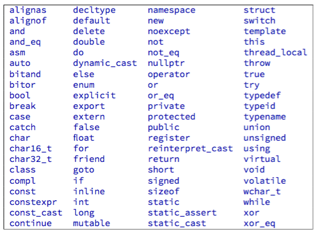{width="70%" fig-alt="TODO: describe image"}

---

## Some basic types

- Numbers:
  - int x = 12;
  - float x = 3.14f;
  - double x = 3.14159265359;
- Boolean: just one bit.
  - bool b = true;
  - b = false;
  - Commonly used for "flow of control": the basic logic of your code.
- enum:

---

## Some basic types

- Enums: basically "labels"
  - Short for "enumeration"
  - Under the hood, these are integers by default.
  - Can be changed... but you should probably avoid this unless you know what you're doing!

- enum Weight_t{
  - kLIGHT,
  - kMEDIUM,
  - kHEAVY
- };
- enum Color {
  - kBLUE=1,
  - kRED=2,
  - kGREEN=3
- }
- enum myColor = kBLUE;

---

## Some basic types

- char: a single character (letter, number, punctuation)
  - Only needs 1 byte to store most symbols you need!
  - Stored as a numerical code: ASCII (7 bits), UTF-8, UTF-16, ...
  - See [Wikipedia](https://en.wikipedia.org/wiki/Comparison_of_Unicode_encodings) for more 🙂
  - Yes, [emojis, too](https://en.wikipedia.org/wiki/Emoticons_(Unicode_block))!

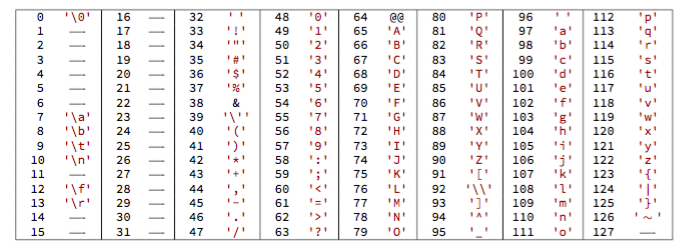{width="70%" fig-alt="TODO: describe image"}

---

## Using char

<!-- TODO: complex slide layout (flagged by detect_complex_slide.py - see run log). Content below is complete but UNARRANGED - needs manual layout to match the original slide. -->

- Syntax to declare a single character is within SINGLE quotes :

- char somechar = ‘c';
- std::cout << some char << std::endl;

- There are a few special characters:

{fig-alt="TODO"}

---

## Using char

<!-- TODO: complex slide layout (flagged by detect_complex_slide.py - see run log). Content below is complete but UNARRANGED - needs manual layout to match the original slide. -->

- Syntax to declare a single character is within SINGLE quotes :

- char somechar = ‘c';
- std::cout << some char << std::endl;

- There are a few special characters:

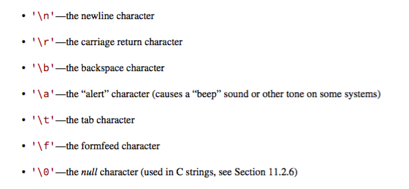{fig-alt="TODO"}

- What about more than one character?
  - Gets complicated! More on this later.
  - Option 1: array of char (i.e. several char variables wrapped into a list)
  - Option 2: std::string (i.e. a whole "class" defined in a library)

---

## Constants

- So if we have a variable, what if we want it to remain… umm… constant?
- Syntax in C++ is “const”:

- const double PI = 3.14159265359;

- Can be used like a variable, except it cannot be reassigned.
- Try to change the value in your code:

- $ g++ hello.cc -o hello.exe
- hello.cc: In function ‘int main()’:
- hello.cc:5: error: assignment of read-only variable ‘PI’

- PI = 3.2;

- <!-- source pptx's hlinkClick target for this run is http://www.apple.com - almost certainly a stray/leftover default link, not what David intended (same anomaly pattern seen in the 09_linalg conversion). Linked to the visible URL itself pending confirmation. -->
[https://en.wikipedia.org/wiki/Indiana_pi_bill](https://en.wikipedia.org/wiki/Indiana_pi_bill)

---

## Summary

- We started on the basics of C++:
  - Basic structure of a program;
  - Compiling a single file;
  - How to use variables;
  - Basic C++ types (numbers, letters, booleans, enums)
- Assignment 1, problems 2 and 3 use today's material:
  - 2: Maximum value you can store in various types of numbers
  - 3 (505 students only): Experiment with (2) within a C++ program.

---

# Arithmetic and expressions

---

## Arithmetic and expressions

- An expression: a sequence of operators (e.g. +, -, /) and operands that specifies a computation.
- Arithmetic is just like in regular math, but can happen on other types besides numbers!
  - Booleans (true/false)
  - Bits
- Basic arithmetic works as you expect:
  - Binary operators have two arguments: +, -, *, /, % (modulus)
  - Unary operators have just one argument: for numbers, just have +, - (flip sign)

- 42;                    // value: 42
- sum = value1 + value2; // value: “sum”
- 12 > 13;               // value: false

---

## Logic operators

- Logic operators convert the inputs to a boolean results: AND, OR, NOT.
  - AND: &&
  - OR: ||
  - NOT: !
- Note: "" is treated as true! Different from python.

- 1 && "a";         // value: true
- 0 && "a";         // value: false
- 1 && "";          // value: true!
- 0 || "a";         // value: true
- !true;            // value: false

---

## Bitwise operators

- 0b101 & 0b001;    // value: 0b001
- 0b001 | 0b010;    // value: 0b011
- 0b011 ^ 0b010;    // value: 0b001
- 0b001 << 2;       // value: 0b100

- Similar to logic operators, but done bit-by-bit
  - Think of a given variable as an array of bits.
  - Bitwise operators compare two arrays bit-by-bit.
- AND: &
- OR: |
- XOR: ^
- <<: shift bits left
  - Left edge: truncate the bits
  - Right edge: add 0s
- >>: shift bits right
  - (Note: same symbol as std::cout<<..., but completely different meaning)

---

## Bitwise operators

- 0b101 & 0b001;    // value: 0b001
- 0b001 | 0b010;    // value: 0b011
- 0b011 ^ 0b010;    // value: 0b001
- 0b001 << 2;       // value: 0b100

- Similar to logic operators, but done bit-by-bit
  - Think of a given variable as an array of bits.
  - Bitwise operators compare two arrays bit-by-bit.
- AND: &
- OR: |
- XOR: ^
- <<: shift bits left
  - Left edge: truncate the bits
  - Right edge: add 0s
- >>: shift bits right
  - (Note: same symbol as std::cout<<..., but completely different meaning)

- 5 & 4;           // value: 4
- 5 | 4;           // value: 5
- 'p' >> 1;        // value: 8 (!!)

- 0b0101 & 0b0100

- 0b0101 | 0b0100

- 'p'=112 = 0b1110000
- -->56  = 0b0111000 = '8'

---

## Comparison operators

<!-- TODO: complex slide layout (flagged by detect_complex_slide.py - see run log). Content below is complete but UNARRANGED - needs manual layout to match the original slide. -->

- Comparison operators: convert two values into a boolean
  - Most often seen in control statements (if, for, while, ...).

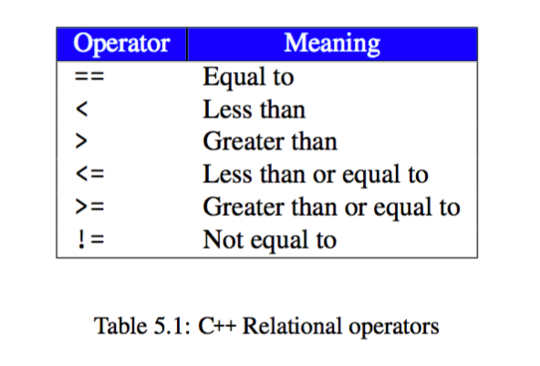{fig-alt="TODO"}

- bool expression = (14 < 16);
- std::cout << expression << std::endl;
  - // Prints "true"

---

## Gotchas

- Let's compile and execute CompPhys/ReviewCpp/BasicExamples/operators.cc:

- #include <iostream>
- int main(void) {
- std::cout << "-5 = " << -5 << std::endl;
- std::cout << "5 + 3 = " << 5 + 3 <<std::endl;
- std::cout << "5 * 3 = " << 5 * 3 <<std::endl;
- std::cout << "21.32 / 38.0 = " << 21.32 / 38.0 << std::endl;
- std::cout << "12 / 4 = " << 12 / 4 << std::endl;
- std::cout << "13 / 4 = " << 13 / 4 << std::endl;
- std::cout << "13. / 4. = " << 13. / 4. << std::endl;
- return 0;
- }

---

## Gotchas

- Most of these look as expected... except for one!

- std::cout << "13 / 4 = " << 13 / 4 << std::endl;
- ...
- 13 / 4 = 3

- What's the difference between this and:

- std::cout << "13. / 4. = " << 13. / 4. << std::endl;
- ...
- 13. / 4. = 3.25

---

## Integer division

- Why does 13 / 4 = 3???
- Operations are specified exactly based on types.
- C++ standard: <integer> / <integer> returns an integer, not a float
- Why? Consider the following example:

- std::cout << "13 / 4 = " << 13 / 4 << std::endl;
- ...
- 13 / 4 = 3

- int x(0);
- int y(0);
- std::cin << x << y;
- std::cout << x / y << std::endl;

  - Compiler has to assign a type to the expression x / y
  - Is this a round integer or not? Compiler does not know in advance! We have to choose: always integer or always float.
  - The C++ standards committee made a choice: integer division always returns an integer, rounding any decimals towards 0.
    - Avoids making the extra complexity mandatory (i.e., avoids always upscaling integers to floats).

- Truncate, truncate, truncate!

---

## Widening and narrowing

- How does 13. / 4 = float / int give you the correct decimal answer?
- Key fact: integers are a subset of reals
  - int can be converted to float
  - The way we say this is int is “narrower” than float, and float is “wider” than int
- So, given (float / int), we can "widen" the int.
  - Resulting in (float / float).

---

## Widening and narrowing

- How does 13. / 4 = float / int give you the correct decimal answer?
- Key fact: integers are a subset of reals
  - int can be converted to float
  - The way we say this is int is “narrower” than float, and float is “wider” than int
- So, given (float / int), we can "widen" the int.
  - Resulting in (float / float).

- However, the converse is NOT true: a float cannot be "narrowed" to an int without loss of information!
  - You can't write 1.9 as an int.
- The C++ standard says : TRUNCATION, TRUNCATION, TRUNCATION
- It does NOT round!!!
  - int i = 1.999999; gives you “1”, not “2”
- Some compilers will warn you (“potential loss of data”)
- Other compilers will happily give you the garbage you asked for.

---

## Widening and narrowing

- How does 13. / 4 = float / int give you the correct decimal answer?
- Key fact: integers are a subset of reals
  - int can be converted to float
  - The way we say this is int is “narrower” than float, and float is “wider” than int
- So, given (float / int), we can "widen" the int.
  - Resulting in (float / float).

- However, the converse is NOT true: a float cannot be "narrowed" to an int without loss of information!
  - You can't write 1.9 as an int.
- The C++ standard says : TRUNCATION, TRUNCATION, TRUNCATION
- It does NOT round!!!
  - int i = 1.999999; gives you “1”, not “2”
- Some compilers will warn you (“potential loss of data”)
- Other compilers will happily give you the garbage you asked for.

- Moral of the story: if you have an expression with mixed types, the standard will “widen” the narrower one, if it knows how.
  - “float / int” will give you a “float”
  - “int / float” will give you a “float”
  - But “int / int” will give you an “int”

---

## Casting

- Does having C++ make decisions about types make you uncomfortable?
- A better way: casting.

  - float x = 123.456;
- int n = static_cast<int>( x );
- std::cout << n << std::endl;
- // Result: 123

- This explicitly invokes the float-to-int conversion, instead of making you remember what the C++ standard decided.
- Note: static_cast<T>() is only one way of transforming objects from one type to another.
  - Commonly used for straightforward conversions like int to float.
  - Compiler checks that the conversion has been defined; fast and safe, but not as flexible as other runtime-focused options.

---

## Casting

- Does having C++ make decisions about types make you uncomfortable?
- A better way: casting.

  - float x = 123.456;
- int n = static_cast<int>( x );
- std::cout << n << std::endl;
- // Result: 123

- This explicitly invokes the float-to-int conversion, instead of making you remember what the C++ standard decided.
- Note: static_cast<T>() is only one way of transforming objects from one type to another.
  - Commonly used for straightforward conversions like int to float.
  - Compiler checks that the conversion has been defined; fast and safe, but not as flexible as other runtime-focused options.

---

## Operator precedences

- Operators follow the same rules you’ve always learned:
“Please Excuse My Dear Aunt Sally”
Parentheses, Exponentiation, Multiplication, Division, Addition, Subtraction
- Associativity also follows this
- However: as a best practice, use parentheses to be clear when necessary! Compare:
- x = 2 + 3 * 4;
x = 2 + (3 * 4);
- Both correct, but second is clearer

---

## Operator precedences

<!-- TODO: complex slide layout (flagged by detect_complex_slide.py - see run log). Content below is complete but UNARRANGED - needs manual layout to match the original slide. -->

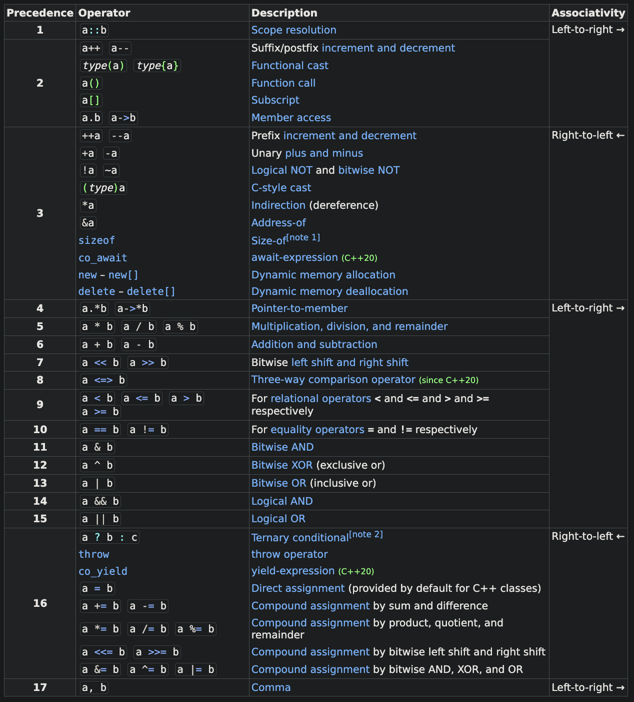{fig-alt="TODO"}

- 5. *, /, %

- 6. +, -

- 2. Exponent
- (Function call)

- For anything more complicated than simple arithmetic, you should really use parentheses to ensure correct and comprehensible behavior!

---

## Increment operators

- Some useful shorthand:
  - Let's say we want to increment a counter by 1:
  - int x = 0;
  - x = x + 1;
- Shorthand:
- x++;
  - OR!
- ++x;
- Similarly,
  - x--;

- What's the difference?
- x++; = "post-increment"
- ++x; = "pre-increment"
- When used just to increment x, there is no difference!
  - Historically, pre-incrementing was faster (avoids a copy operation), but modern compilers optimize away the difference.
- However...

---

## Increment operators

- int x = 1;
- int y = x++;
- std::cout << y << std::endl;
- // y = 1
- // x++ returns value of x, then increments!

- int x = 1;
- int y = ++x;
- std::cout << y << std::endl;
- // y = 2
- // ++x increments x, then returns x

- Unless you really need the shorthand, it's probably safer to write the full expression:
- y = x + 1;

---

# Control structures

---

## Conditional execution: if...else

- Conditional execution: execute different code depending on a condition
  - Condition = boolean (true/false), calculated from some inputs
- By chaining together if... else if... else..., you can control the flow of your code with arbitrarily complex logic.

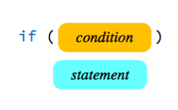{width="70%" fig-alt="TODO: describe image"}

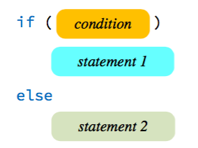{width="70%" fig-alt="TODO: describe image"}

---

## Conditional execution: if...else

- if (v > c) {
  - std::cout << "WARNING : Tachyon!" << std::endl;
- } else if (v == c) {
  - std::cout << "Photon" << std::endl;
- } else {
  - std::cout << "Particle with mass" << std::endl;
- }

- C++ syntax:

- if v > c:
  - print("WARNING : Tachyon!")
- elif v == c:
  - print("Photon")
- else:
  - print("Particle with mass")

- Python syntax:

- Note: white space/indentation do not matter in C++!
- You should still indent for readability, but unlike Python, the braces control the actual flow, not the indentation.

---

## Conditional execution: if...else

- If statements can also:
  - Be nested
  - Use arbitrary logic inside the condition statement

- if (car.make == "toyota") {
  - if ((2009 <= car.year) && (car.year <= 2011)) {
    - std::cout << "DANGER! Your brakes are vulnerable to single-event upsets from cosmic rays!" << std::endl;
  - } else {
    - std::cout << "Your car is a Toyota, but outside of the affected years."" << std::endl;
  - }
- } else {
  - std::cout << "Your car is not a Toyota." << std::endl;
- }

---

## Shorthand for "if" statements

<!-- TODO: complex slide layout (flagged by detect_complex_slide.py - see run log). Content below is complete but UNARRANGED - needs manual layout to match the original slide. -->

- If you have a very simple "if" statement, you can use the following shorthand:

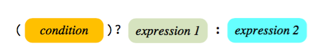{fig-alt="TODO"}

- std::string parity = (i % 2 == 0) ? "Even" :"Odd";

---

## Conditional execution: switch

- For many possible conditions, a SWITCH statement is easier than a giant IF...ELSE IF...ELSE IF...ELSE IF... block:

- switch(i) {
  - case 1:
    - std::cout << "Monday" << std::endl;
    - break;
  - case 2:
    - std::cout << "Tuesday" << std::endl;
    - break;
  - ...
  - default:
    - std::cout << "Day " << i << std::endl;
    - break;
- }

- Note: i must be an integer (or enum)
- break; exits the block (if omitted, the next statements are executed!)

---

## Another "gotcha": floating point type concerns

- Let's look at the example ReviewCpp/BasicExamples/narrowing.cc:

- int main(void) {
- double d = 22000000000000.0;
- int i = d;
- std::cout << "d = " << d << ", i = " << i << std::endl;
- return 0;
- }

- Compile with (-Wconversion tells the compiler to issue warnings related to numerical conversions):

- compphys@809361282cf0:~/CompPhys/ReviewCpp/BasicExamples$ g++ -Wconversion narrowing.cc -o narrowing.exe
- narrowing.cc: In function 'int main()':
- narrowing.cc:5:11: warning: conversion from 'double' to 'int' may change value [-Wfloat-conversion]
- 5 |   int i = d;
- |           ^

---

## Another "gotcha": floating point type concerns

- Sure enough, 2.2e13 is too big for an int:

- compphys@809361282cf0:~/CompPhys/ReviewCpp/BasicExamples$ ./narrowing.exe
- d = 2.2e+13, i = 2147483647

---

## Floating point comparisons

- We've seen the "==" operator for ints, which behaves just like you would expect.
  - 1234==1234 returns true
  - 1==2 returns false
- How about floating point numbers?
  - How does C++ handle, e.g., (5.0f = 5.0f)?

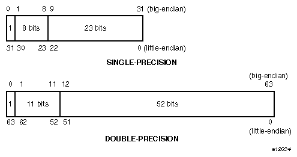{width="70%" fig-alt="TODO: describe image"}

---

## Floating point comparisons

- Another example: ReviewCpp/BasicExamples/float_compare.cc:

- int main(void) {
  - float f1 = 5.0f;
  - float f2 = 5.0000001f;
  - if ( f1 == f2 ) {
    - std::cout << "I’m sorry, Dave. I’m afraid I can’t do that." << std::endl;
  - } else {
    - std::cout << "No problem, come in Dave." << std::endl;
  - }
  - return 0;
- }

- compphys@809361282cf0:~/CompPhys/ReviewCpp/BasicExamples$ g++ floatcompare.cc -o floatcompare.exe
- compphys@809361282cf0:~/CompPhys/ReviewCpp/BasicExamples$ ./floatcompare.exe
- I’m sorry, Dave. I’m afraid I can’t do that.

---

## Floating point comparisons

<!-- TODO: complex slide layout (flagged by detect_complex_slide.py - see run log). Content below is complete but UNARRANGED - needs manual layout to match the original slide. -->

- What's going on here?
- Our program is telling us 5.0f = 5.0000001f!
- The mantissa of a float has limited precision
  - Easy to get into trouble... 1. + 1.e10 has an 11-digit mantissa!
- Comparisons only make sense within the precision of the mantissa!

{fig-alt="TODO"}

- Mantissa

- Exp.

- Sign

{fig-alt="TODO"}

---

## Floating point comparisons

- Comparing floats with "==" is dangerous!
- Better idea: explicitly compare with a specified tolerance.
  - BAD: f1 == f2
  - GOOD: std::abs(f1 - f2) < tolerance
- You need to pick a tolerance your program needs.
- See [floatcompare_better.cc](http://floatcompare_better.cc)

- constexpr inline bool floats_equal(float a, float b) {
- std::fabs(a - b) < std::numeric_limits<float>::epsilon();
- }

- C++ example:

- Python:

- # Use math.isclose(a, b, *, rel_tol=1e-09, abs_tol=0.0)¶
- >>> math.isclose(5.0, 5.00000001)
- False
- >>> math.isclose(5.0, 5.000000001)
- True

---

## Floating point comparisons

{width="70%" fig-alt="TODO: describe image"}

---

## Summary

- Today, we covered:
  - Basic types in C++ (int, float, enum, char) and const
  - Arithmetic and expressions
    - Normal math; logic operators; bitwise operators
    - Peculiarities of operators and types: integer division, implicit and explicit type transformations (aka "casting")
    - Operator precedence
  - Conditional execution, aka IF...THEN...ELSE
  - Dangers of floating point precision

---

# Iteration aka loops

---

## Flow control: iteration

- It’s a royal pain to count. Humans suck at it.
  - Computers are really, really fantastic at it, though!
  - Similarly, computers are great at doing the same thing over and over (and over and over andoverandoverandover)
- This is referred to as “iteration”. C++ options:
  - “for” loop
  - “while” loop
  - “do while” loop
  - “goto” statements (don't use these)

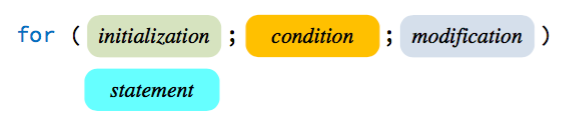{width="70%" fig-alt="TODO: describe image"}

---

## for loops

<!-- TODO: complex slide layout (flagged by detect_complex_slide.py - see run log). Content below is complete but UNARRANGED - needs manual layout to match the original slide. -->

- C++ syntax:

- for (<initialize counter>;
  - <continue or terminate condition>;
  - <modify counter>) {
  - <execute statement>
  - }

- Python syntax:

- for <iterator> in <some_set>:
  - <execute statement>

- for (unsigned int i = 0; i < 10; ++i) {
  - std::cout << i << std::endl;
- }
- // Prints 0, 1, 2, ..., 9

- for i in range(10):
  - print(i)

- C++ for loops require 3 things:
  - Initialize a counter (often just an unsigned int; can also iterate through a vector directly).
  - Specify the condition for continuing (vs. terminating) the loop.
  - Increment the counter at the end of each loop.

---

## for loops

- Examples:
  - CompPhys/ReviewCpp/BasicExamples/forloop.cc (just counts to 10)
  - CompPhys/ReviewCpp/BasicExamples/forloop_nested.cc:

- #include <iostream>
- int main(void){
- for ( unsigned int i = 0; i < 10; ++i) {
- for ( unsigned int j = i; j < 10; ++j ){
- std::cout << "(" << j << ", " << i << "), ";
- }
- std::cout << std::endl;
- }
- return 0;
- }

- Compile and run, what do you get? Can you guess how many pairs (j, i) this will print?

---

## Important concepts for all loops

- Important keywords for loops:
  - continue : go straight to the next iteration, skipping the rest of the statement.
  - break : exit the for loop entirely
  - Useful for termination abnormally and for error checking
- "Gotchas", i.e., things that can go wrong:
  - Infinite loops : you didn’t give a correct termination condition.
  - Incorrect initialization : your initialization was incomplete or buggy.

- #include <iostream>
- int main(void){
- for ( unsigned int i = 0; i < 10; ++i) {
- if (i % 2 == 1) {
- continue;
- }
- std::cout << i << std::endl;
- }
- return 0;
- }

  - What does this loop do?

---

## Important concepts for all loops

- Important keywords for loops:
  - continue : go straight to the next iteration, skipping the rest of the statement.
  - break : exit the for loop entirely
  - Useful for termination abnormally and for error checking
- "Gotchas", i.e., things that can go wrong:
  - Infinite loops : you didn’t give a correct termination condition.
  - Incorrect initialization : your initialization was incomplete or buggy.

- #include <iostream>
- int main(void){
- for ( unsigned int i = 0; i < 10; ++i) {
- if (i % 2 == 1) {
- continue;
- }
- std::cout << i << std::endl;
- }
- return 0;
- }

  - The loop calls continue if i is odd, skipping the std::cout.
  - Hence, the loop prints only even numbers from 0 to 9.

---

## while and do loops

<!-- TODO: complex slide layout (flagged by detect_complex_slide.py - see run log). Content below is complete but UNARRANGED - needs manual layout to match the original slide. -->

- Similar to “for” loops are: “while” loops and "do while" loops.
  - These are rather similar to each other.
  - "do while" will always execute statement at least once, and repeats if condition is TRUE
  - "while" only executes statement if condition is met, so it's possible to loop 0 times.

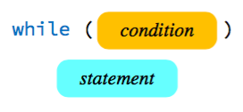{fig-alt="TODO"}

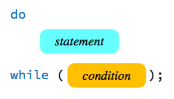{fig-alt="TODO"}

{fig-alt="TODO"}

---

# Functions

---

## Variable scope

  - Definition: scope is the part of your code in which a given variable (/function/structure/class/etc.) is valid.
    - Another way of thinking about scope: the lifetime of a variable.
  - All the variables we've seen so far have local scope: they are limited to the curly braces {} in which they are created.
  - Example: "for" loop variables are confined to the loop.

- #include <iostream>
- int main(void){
- for( unsigned int i = 0; i < 10; ++i ) {
- std::cout << i << std::endl;
- }
- std::cout << "i = " << i << std::endl;
- return 0;
- }

---

## Variable scope

  - Definition: scope is the part of your code in which a given variable (/function/structure/class/etc.) is valid.
    - Another way of thinking about scope: the lifetime of a variable.
  - All the variables we've seen so far have local scope: they are limited to the curly braces {} in which they are created.
  - Example: "for" loop variables are confined to the loop.

- #include <iostream>
- int main(void){
- for( unsigned int i = 0; i < 10; ++i ) {
- std::cout << i << std::endl;
- }
- std::cout << "i = " << i << std::endl;
- return 0;
- }

- % g++ scope.cc -o scope.exe
- scope.cc:7:44: error: use of undeclared identifier 'i'
- 7 |   std::cout << "Outside the loop, i = " << i << std::endl;
- |                                            ^
- 1 error generated.

---

## Variable scope

  - Definition: scope is the part of your code in which a given variable (/function/structure/class/etc.) is valid.
    - Another way of thinking about scope: the lifetime of a variable.
  - All the variables we've seen so far have local scope: they are limited to the curly braces {} in which they are created.
  - Another (pretty bad!) example:

- #include <iostream>
- int main(void){
- int i = 1000;
- for( unsigned int i = 0; i < 5; ++i ) {
- std::cout << i << std::endl;
- }
- std::cout << "i = " << i << std::endl;
- return 0;
- }

---

## Variable scope

  - Definition: scope is the part of your code in which a given variable (/function/structure/class/etc.) is valid.
    - Another way of thinking about scope: the lifetime of a variable.
  - All the variables we've seen so far have local scope: they are limited to the curly braces {} in which they are created.
  - Another (pretty bad!) example:

- % g++ scope.cc -o scope.exe
- % ./scope.exe
- 0
- 1
- 2
- 3
- 4
- Outside the loop, i = 1000

- #include <iostream>
- int main(void){
- int i = 1000;
- for( unsigned int i = 0; i < 5; ++i ) {
- std::cout << i << std::endl;
- }
- std::cout << "i = " << i << std::endl;
- return 0;
- }

---

## Global scope

  - Local scope is generally a good idea!
    - Principle of least privilege. It makes your code simpler, less prone to mistakes, easier to debug.
    - Consider: let's say you have a 100,000 line program (maybe your '}' key is broken...); create x at line 2,000; x causes a crash at line 80,000. What happened in between the declaration and the crash???
  - However, sometimes you may really need global scope: variable is valid in your entire program.
    - Example: std::cout is a global variable!

- #include<cmath>
- const float PI=3.1415926;
- float circle_area(float radius) {
  - return PI * pow(radius, 2);
- }
- int main() {
  - float radius = 1.5;
  - std::cout << "Area = " << PI << " * " << radius << "**2" << std::endl;
  - std::cout << " = " <<  circle_area(radius) << std::endl;
- }

{width="70%" fig-alt="TODO: describe image"}

---

## Functions

  - We've seen a few examples of using curly braces {} to divide our code into blocks.
  - Functions go a step further:
    - Assign a name to a block of code.
    - Reuse the block as many times as you want.
  - C++ functions are not so different from math functions:
- $$f(x)={x}^{2}$$
  - A C++ program reads this as:
    - Input x
    - Return x*x

---

## Functions

<!-- TODO: complex slide layout (flagged by detect_complex_slide.py - see run log). Content below is complete but UNARRANGED - needs manual layout to match the original slide. -->

  - We've seen a few examples of using curly braces {} to divide our code into blocks.
  - Functions go a step further:
    - Assign a name to a block of code.
    - Reuse the block as many times as you want.
  - C++ functions are not so different from math functions:
- $$f(x)={x}^{2}$$
  - A C++ program reads this as:
    - Input x
    - Return x*x

- More generally: a function maps inputs to outputs.

- Input

- Function

- Output

---

## A few examples

<!-- TODO: complex slide layout (flagged by detect_complex_slide.py - see run log). Content below is complete but UNARRANGED - needs manual layout to match the original slide. -->

{fig-alt="TODO"}

- C++ provides a ton of functions that you can #include <...>
  - Example: #include <cmath>

- See [http://www.cplusplus.com/reference/cmath/](http://www.cplusplus.com/reference/cmath/)

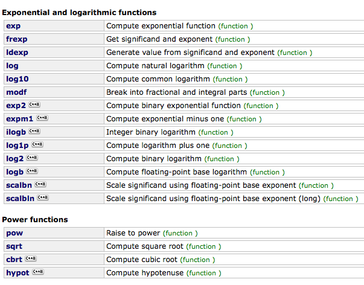{fig-alt="TODO"}

---

## A few examples

<!-- TODO: complex slide layout (flagged by detect_complex_slide.py - see run log). Content below is complete but UNARRANGED - needs manual layout to match the original slide. -->

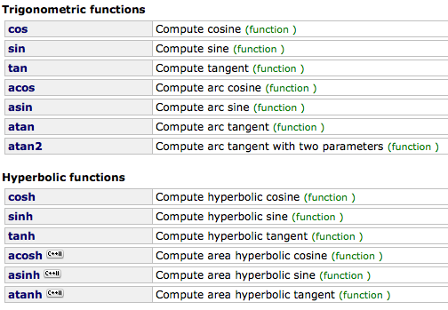{fig-alt="TODO"}

- C++ provides a ton of functions that you can #include <...>
  - Example: #include <cmath>

- See [http://www.cplusplus.com/reference/cmath/](http://www.cplusplus.com/reference/cmath/)

{fig-alt="TODO"}

  - Invoking a function is pretty straightforward
    - Works similarly to Python
  - std::cout << "sin(x)   = " << sin(x) << std::endl;

---

## A few examples

  - int main(void) is a function!
    - Input = nothing (void)
    - Output = an integer (the "return code")
    - Of course, this is a special function in C++. The compiler turns this into your executable.

---

## C++ syntax for functions

  - Functions are declared like this:

- output_type function_name(arguments) {
  - <Function body>
  - return some_value;
- }

---

## C++ syntax for functions

  - A real example:

- #include<cmath>
- const float PI=3.1415926;
- float circle_area(float radius) {
  - return PI * pow(radius, 2);
- }
- int main() {
  - float radius = 1.5;
  - std::cout << "Area = " << PI << " * " << radius << "**2" << std::endl;
  - std::cout << " = " <<  circle_area(radius) << std::endl;
- }

---

## C++ syntax for functions

  - A real example:

- #include<cmath>
- const float PI=3.1415926;
- float circle_area(float radius) {
  - return PI * pow(radius, 2);
- }
- int main() {
  - float radius = 1.5;
  - std::cout << "Area = " << PI << " * " << radius << "**2" << std::endl;
  - std::cout << " = " <<  circle_area(radius) << std::endl;
- }

- Function must be declared before you use it

---

## C++ syntax for functions

  - A real example:

- #include<cmath>
- const float PI=3.1415926;
- float circle_area(float radius) {
  - return PI * pow(radius, 2);
- }
- int main() {
  - float radius = 1.5;
  - std::cout << "Area = " << PI << " * " << radius << "**2" << std::endl;
  - std::cout << " = " <<  circle_area(radius) << std::endl;
- }

- Function must be declared before you use it

- Function is called using name+parentheses, e.g., 'bla(x)'

---

## C++ syntax for functions

:::: {.columns}
::: {.column width="55%"}
  - Input arguments can also have default values:
- #include<cmath>
- const float PI=3.1415926;
- float hypersphere_volume(float radius, int n_dim=2) {
  - return pow(PI, n/2.) * pow(radius, n) / Gamma((n/2.)+1);
- }
- int main() {
  - float radius = 1.5;
  - std::cout << "Circle: " <<  hypersphere_volume(radius) << std::endl;
  - std::cout << "Sphere: " <<  hypersphere_volume(radius, 3) << std::endl;
  - std::cout << "4-ball: " <<  hypersphere_volume(radius, 4) << std::endl;
- }
:::
::: {.column width="45%"}
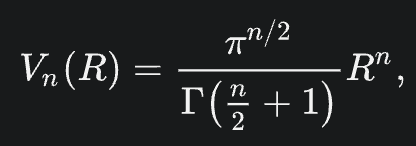{width="100%" fig-alt="TODO: describe image"}
:::
::::

---

## Function declaration

- In C++, functions must be declared before use.
- However, the function can be defined whenever you want!
- What does that mean???
  - Declaration: tell the compiler that there exists a function <name>, with inputs <x> and outputs <y>.
  - float xsquared( float );
  - Definition: the actual code inside the function.
  - float xsquared( float x ){ return x*x; }
- (You don't have to do these separately! The definition counts as a declaration.)

  - Why???
    - Most importantly: allows you to define functions in other files!
    - The function can be compiled into an external library ahead of time, and linked to your program on demand.
    - Your own source code just has to import a declaration of the function (=name, inputs, and outputs), so the compiler knows how to do the linking.

---

## Return values

- Difference from Python: C++ functions return only one value.

- def a_python_fn():
  - return 1, 2, 3

- To do this in C++, the multiple arguments need to be packaged into one object (e.g., a struct or a class object). More on this later!

- std::vector<int> a_cpp_fn() {
  - return std::vector<int>({1, 2, 3});
- }

---

## Return values

- Important fact: when you return a value at the end of a C++ function, it performs two copy operations!

- int make_a_number() {
  - return 5;
- }
- int main() {
  - int x = make_a_number();
  - return 0;
- }

---

## Return values

<!-- TODO: complex slide layout (flagged by detect_complex_slide.py - see run log). Content below is complete but UNARRANGED - needs manual layout to match the original slide. -->

- Important fact: when you return a value at the end of a C++ function, it performs two copy operations!

- int make_a_number() {
  - return 5;
- }
- int main() {
  - int x = make_a_number();
  - return 0;
- }

- int(5) is created inside the function... then copied to return value.

---

## Return values

<!-- TODO: complex slide layout (flagged by detect_complex_slide.py - see run log). Content below is complete but UNARRANGED - needs manual layout to match the original slide. -->

- Important fact: when you return a value at the end of a C++ function, it performs two copy operations!

- int make_a_number() {
  - return 5;
- }
- int main() {
  - int x = make_a_number();
  - return 0;
- }

- int(5) is created inside the function... then copied to return value.

- Return value is copied to x

---

## Return values

- Important fact: when you return a value at the end of a C++ function, it might perform up to two copy operations! (Demo copy.cc)
- OK, this is not a big deal for one int.
  - But what if the return value is a 1 GB list?
- Several solutions based on the same idea: only create one copy in memory, and reuse that memory.
  - E.g. move semantics lets a variable "steal" the memory from another variable.
- tl;dr: avoid returning large objects directly!

- int make_a_number() {
  - return 5;
- }
- int main() {
  - int x = make_a_number();
  - return 0;
- }

- int(5) is created inside the function... then copied to return value.

- Return value is copied to x

- N.B: your compiler might be clever about this:
- [https://en.wikipedia.org/wiki/Copy_elision#RVO](https://en.wikipedia.org/wiki/Copy_elision#RVO)

---

## Back to scope

- Let's revisit scope in the context of functions.
  - A horrible example: CompPhys/ReviewCpp/BasicExamples/[funcscope.cc](http://funcscope.cc)
  - The same name, i, is used for 3 different variables!
  - (Don't do this)

- #include <iostream>
- unsigned int i = 1000;
- int duh( void ) {
- static unsigned int count = 0;
- unsigned int i = 2;
- std::cout << "for the " << count << "th time, i = " << i << std::endl;
- ++count;
- return i;
- }
- int main(void){
- for ( unsigned int i = 10; i < 20; ++i ) {
- std::cout << "i = " << i << ", duh() = " << duh() << ", global i = " << ::i << std::endl;
- }
- return 0;
- }

---

## Back to scope

<!-- TODO: complex slide layout (flagged by detect_complex_slide.py - see run log). Content below is complete but UNARRANGED - needs manual layout to match the original slide. -->

- Let's revisit scope in the context of functions.
  - A horrible example: CompPhys/ReviewCpp/BasicExamples/[funcscope.cc](http://funcscope.cc)
  - The same name, i, is used for 3 different variables!
  - (Don't do this)

- #include <iostream>
- unsigned int i = 1000;
- int duh( void ) {
- static unsigned int count = 0;
- unsigned int i = 2;
- std::cout << "for the " << count << "th time, i = " << i << std::endl;
- ++count;
- return i;
- }
- int main(void){
- for ( unsigned int i = 10; i < 20; ++i ) {
- std::cout << "i = " << i << ", duh() = " << duh() << ", global i = " << ::i << std::endl;
- }
- return 0;
- }

{fig-alt="TODO"}

{fig-alt="TODO"}

{fig-alt="TODO"}

{fig-alt="TODO"}

{fig-alt="TODO"}

{fig-alt="TODO"}

{fig-alt="TODO"}

---

## Static variables

- This example showcases one more interesting feature: static variables.
  - Most variables inside the function{} are instantiated, then destroyed once the function is done.
  - Static variables persist until the end of the program.
  - In other words, they keep their value when you call the function many times.

- #include <iostream>
- unsigned int i = 1000;
- int duh( void ) {
- static unsigned int count = 0;
- unsigned int i = 2;
- std::cout << "for the " << count << "th time, i = " << i << std::endl;
- ++count;
- return i;
- }
- int main(void){
- for ( unsigned int i = 10; i < 20; ++i ) {
- std::cout << "i = " << i << ", duh() = " << duh() << ", global i = " << ::i << std::endl;
- }
- return 0;
- }

{width="70%" fig-alt="TODO: describe image"}

---

## Recursive functions

- You can even call a function within itself: recursive functions
  - (PHY505: I recommend you do this for Assignment 1, Problem 3)
  - Example: Fibonacci sequence CompPhys/ReviewCpp/BasicExamples/fibo.cc

- #include <iostream>
- int fibonacci(int n) {
- if (n <= 0)
- return 0;
- else if (n == 1)
- return 1;
- else
- return fibonacci(n - 2) + fibonacci(n - 1);
- }
- int main(void)
- {
- for ( unsigned int i = 0; i < 10; ++i ) {
- std::cout << fibonacci(i) << ", ";
- }
- std::cout << std::endl;
- return 0;
- }

---

## Overloading

- C++ has a nice feature in OVERLOADING functions
- Example: if you want an x2 function, what do you need? Remember, compiler demands the full type of inputs and outputs.
  - Input as int
  - Input as float
  - Input as double
  - Input as unsigned int
  - Input as short
  - Input as unsigned long
  - …
- But you probably want them all to be called the same thing (xsquared)
- You can define multiple functions with the same name, but different input argument types
  - Caveat: Cannot differ only by return type

---

## Overloading

- include <iostream>
- int squared(int x){ return x*x;}
- float squared(float x){ return x*x;}
- double squared(double x){ return x*x;}
- long squared( long x) { return x*x;}
- int main(void)
- {
- int i = 5;
- long j = 10;
- float x = 0.5;
- double y = 1.5;
- std::cout << squared(i) << std::endl;
- std::cout << squared(j) << std::endl;
- std::cout << squared(x) << std::endl;
- std::cout << squared(y) << std::endl;
- return 0;
- }

  - CompPhys/ReviewCpp/BasicExamples/xsquared_types.cc

- The different "squared" functions are distinguished by their signature: the function name and its input arguments.

---

## Overloading

- include <iostream>
- int squared(int x){ return x*x;}
- float squared(float x){ return x*x;}
- double squared(double x){ return x*x;}
- long squared( long x) { return x*x;}
- int main(void)
- {
- int i = 5;
- long j = 10;
- float x = 0.5;
- double y = 1.5;
- std::cout << squared(i) << std::endl;
- std::cout << squared(j) << std::endl;
- std::cout << squared(x) << std::endl;
- std::cout << squared(y) << std::endl;
- return 0;
- }

  - CompPhys/ReviewCpp/BasicExamples/xsquared_types.cc

- Hmm. This looks like a huge pain, huh?

---

# Templates

---

## Templating

- Templates help us quickly write functions for multiple types.
- The template function is not compiled directly.
- Instead, when we need the squared() function for a given type (T), the compiled basically copies the template and replaces T with the type.
- For example...

- template<class T>
- T squared(T x) {
  - return x * x;
- }

---

## Templating

- template<class T>
- T squared(T x) {
  - return x * x;
- }

- Templates help us quickly write functions for multiple types.
- The template function is not compiled directly.
- Instead, when we need the squared() function for a given type (T), the compiled basically copies the template and replaces T with the type.
- For example...
- If the compiler sees either of the following:

- float squared(float x) {
  - return x * x;
- }

- float x = 1.2;
- std::cout << squared(x) << std::endl;

- The compiler will generate and compile the following:

- template float squared<float>(float x);

---

## Templating

<!-- TODO: complex slide layout (flagged by detect_complex_slide.py - see run log). Content below is complete but UNARRANGED - needs manual layout to match the original slide. -->

{fig-alt="TODO"}

- Cookie
- Cookie
- template
- template< class T>
- T squared(T x){ return x*x;}
- Function
- template
- Function
- squared<int>( 2 )

---

## Templating

- Functions : Compiled, exist in memory
- Function templates: NOT compiled, must be given a type
- EACH type gets a SEPARATE function in memory, on demand
- More on templates later

---

## Recap

:::: {.columns}
::: {.column width="55%"}
- Use "for" loops (or "while" or "do while") to iterate code.
- Variables are defined with scope: a region of validity in your code.
  - Local scope: variables defined inside {} are valid only within those {}.
  - Global scope: variables are valid anywhere in the program.
  - Static variables: persist beyond their local scope, e.g., across multiple calls to a function.
- Functions map inputs to outputs.
  - Declaration vs. definition.
  - Mechanics of returning values (don't return large objects directly!).
  - Overloading: can reuse the same function name for different types.
- Template functions helps you define functions for many types.
- Next time:
  - Pointers!
:::
::: {.column width="45%"}
{width="100%" fig-alt="TODO: describe image"}
{width="100%" fig-alt="TODO: describe image"}
:::
::::

---

# Pointers

---

## Pointers

- The dread cry rang through the night…
NO! POINTERS! NOOOOO!!!!!!

{width="70%" fig-alt="TODO: describe image"}

---

## Pointers

- We've actually already been talking about pointers a lot!
  - Conceptually, at least, if not the actual syntax.
- A pointer is just a variable that holds a memory address.

---

## Pointer syntax

- Given a variable, & returns the address of the variable.

- int x = 123;
- std::cout << "The address of x is " << &x << std::endl;
- ...
- The address of x is 0x7fff59364aa8

---

## Pointer syntax

- Given a variable, & returns the address of the variable.

- int x = 123;
- std::cout << "The address of x is " << &x << std::endl;
- ...
- The address of x is 0x7fff59364aa8

- Pointers are declared using <type>* <ptr_name>

- int* p = &x; // Or int * p, or int *p
- std::cout << "The address of x is " << p << std::endl;
- ...
- The address of x is 0x7fff59364aa8

- Note: whitespace doesn't matter

---

## Pointer syntax

- Given a variable, & returns the address of the variable.

- int x = 123;
- std::cout << "The address of x is " << &x << std::endl;
- ...
- The address of x is 0x7fff59364aa8

- Pointers are declared using <type> * <ptr_name>

- int* p = &x; // Or int * p, or int *p
- std::cout << "The address of x is " << p << std::endl;
- ...
- The address of x is 0x7fff59364aa8

- Given a pointer variable, * returns the value of the variable pointed to ("dereferencing")

- std::cout << "The value of x is " << *p << std::endl;
- ...
- The value of x is 123

- Note: whitespace doesn't matter

---

## Step by step

<!-- TODO: complex slide layout (flagged by detect_complex_slide.py - see run log). Content below is complete but UNARRANGED - needs manual layout to match the original slide. -->

- &var returns the address of a variable
- <type>* declares a pointer
- *p dereferences a pointer = back to variable
{fig-alt="TODO"}

- int x;

- Code

- Memory

- x

- ?

---

## Step by step

<!-- TODO: complex slide layout (flagged by detect_complex_slide.py - see run log). Content below is complete but UNARRANGED - needs manual layout to match the original slide. -->

- &var returns the address of a variable
- <type>* declares a pointer
- *p dereferences a pointer = back to variable
{fig-alt="TODO"}

- int x;

- Code

- Memory

- x

- ?

- x = 4;

- x

- 4

---

## Step by step

<!-- TODO: complex slide layout (flagged by detect_complex_slide.py - see run log). Content below is complete but UNARRANGED - needs manual layout to match the original slide. -->

- &var returns the address of a variable
- <type>* declares a pointer
- *p dereferences a pointer = back to variable
{fig-alt="TODO"}

- int x;

- Code

- Memory

- x

- ?

- x = 4;

- x

- 4

- int* p;

- x

- 4

- p

- ?

- Read from right-to-left: "p points_to int"
- Uninitialized pointer: points to garbage!

---

## Step by step

<!-- TODO: complex slide layout (flagged by detect_complex_slide.py - see run log). Content below is complete but UNARRANGED - needs manual layout to match the original slide. -->

- &var returns the address of a variable
- <type>* declares a pointer
- *p dereferences a pointer = back to variable
{fig-alt="TODO"}

- int x;

- Code

- Memory

- x

- ?

- x = 4;

- x

- 4

- int* p;

- x

- 4

- p

- ?

- p = &x;

- x

- 4

- p

- Read from right-to-left: "p points_to int"
- Uninitialized pointer: points to garbage!

- Assigning p: &x is the address of x

---

## Step by step

<!-- TODO: complex slide layout (flagged by detect_complex_slide.py - see run log). Content below is complete but UNARRANGED - needs manual layout to match the original slide. -->

- &var returns the address of a variable
- <type>* declares a pointer
- *p dereferences a pointer = back to variable
{fig-alt="TODO"}

- int x;

- Code

- Memory

- x

- ?

- x = 4;

- x

- 4

- int* p;

- x

- 4

- p

- ?

- p = &x;

- x

- 4

- p

- *p = 7

- x

- 7

- p

- Read from right-to-left: "p points_to int"
- Uninitialized pointer: points to garbage!

- Assigning p: &x is the address of x

- Dereferencing p: *p is equivalent to x.

---

## What can go wrong?

- The compiler doesn't know if x_ptr points to a valid memory address.
- At runtime, the program can try to access invalid memory, leading to a segmentation fault.
- Specifically, a segmentation fault occurs when a program tries to access a memory location that the OS does not allow it to access.

- int* x_ptr = 0
- std::cout << *x << std::endl;
- ...
- Segmentation fault

---

## References

- Closely related to pointer: a reference is an alias to an existing variable.
- Syntax: <type>& <ref_name>.

- int x = 123;
- int& xref = x;
- // Or int & xref, or int &xref

- xref behaves like an int, but it uses the memory address of x .
- How is this like a pointer?
  - Allows us to use the contents of x without making a copy.
  - Can think of as a (const) pointer that automatically dereferences (*).
- Safer than a pointer: no danger of using a 0 pointer!

---

## Hands-on

- Let's try this out:

- % g++ CompPhys/ReviewCpp/BasicExamples/ptrs.cc -o ptrs.exe
- % ./ptrs.exe

- #include <iostream>
- int main(void){
- int x = 10;
- int * x_ptr = &x;
- int & x_ref = x;
- std::cout << "Value of x_ptr = " << x_ptr << ", dereferenced = " << *x_ptr << std::endl;
- std::cout << "Value of x_ref = " << x_ref << std::endl;
- *x_ptr = 7;
- std::cout << "x = " << x << std::endl;
- x_ref = 9;
- std::cout << "x = " << x << std::endl;
- return 0;
- }

- What do we expect to see here?

---

## Hands-on

- Let's try this out:

- % g++ CompPhys/BasicExamples/ptrs.cc -o ptrs.exe
- % ./ptrs.exe

- #include <iostream>
- int main(void){
- int x = 10;
- int * x_ptr = &x;
- int & x_ref = x;
- std::cout << "Value of x_ptr = " << x_ptr << ", dereferenced = " << *x_ptr << std::endl;
- std::cout << "Value of x_ref = " << x_ref << std::endl;
- *x_ptr = 7;
- std::cout << "x = " << x << std::endl;
- x_ref = 9;
- std::cout << "x = " << x << std::endl;
  - x_ptr = 0;
  - std::cout << *x_ptr << std::endl;
- return 0;
- }

- Let's try to break it!

---

## Pointers and const

- Recall: const makes a variable a "constant," i.e., you cannot change its value.
- Since a pointer is tied to another variable, we have 4 possible combos:

- Pointer

- Variable

---

## Pointers and functions

- A major reason for using pointers and references: functions
- Recall last time: directly passing variables in/out of functions is expensive! Often makes unintended copies.
- Solution: use pointers and references instead!

- #include <iostream>
- void print_ptr(int *x_ptr) {
  - std::cout << "x = " << *x_ptr << std::endl;
- }
- int * make_int(void) {
  - int x = 123;
  - return &x;
- }

---

## Demo

- Demo: CompPhys/ReviewCpp/BasicExamples/ptrs_and_funcs.cc

- #include <iostream>
- void increment1( int p){ ++p; std::cout << "p = " << p << std::endl;}
- void increment2( int &p){ ++p; std::cout << "p = " << p << std::endl;}
- void increment3( int *p){ ++(*p); std::cout << "*p = " << *p << std::endl;}
- int main(void){
- int x = 3;
- int & rx = x;
- int * px = &x;
- std::cout << "0: x = " << x << std::endl;
- increment1(x);
- std::cout << "1: x = " << x << std::endl;
- increment2(rx);
- std::cout << "2: x = " << x << std::endl;
- increment3(px);
- std::cout << "3: x = " << x << std::endl;
- return 0;
- }

---

## Pointers and functions

- void func( int x);

- void func( int &x);

- void func( int *x);

- Also usable with CONST

- Pass by value:
  - COPIES value into a temporary variable called “x”

  - Pass POINTER to variable, pointer is called “x”

- Pass by reference:
  - Pass REFERENCE to variable temporarily called “x”

- Use when you don’t want to modify value, and cheap to copy

- Use when you want to modify value, and expensive to copy, ptr=0 disallowed

- Use when you want to modify value, and expensive to copy, ptr=0 allowed

- Also usable with CONST

---

## Hands-on

- Try it out: CompPhys/ReviewCpp/BasicExamples/func_timing.cpp
- This example creates a very large object and tries 3 ways to pass it into a function:
  - By value
  - By pointer
  - By reference
- The example also shows how to time a function call.

---

# Memory management

---

## Memory management

- Your program has access to several pieces of memory:
  - Code: where your code lives
  - Data: static and global variables
  - Stack: static memory
    - Local variables and function parameters known at compile time
  - Heap: dynamic memory
    - Anything not known at compile time
- The heap HAS to be accessed via pointer.
  - Improperly handling this is a pain.
- The others can be accessed via value or reference.

---

## Memory management

- How do we use the heap? I.e., the dynamically allocated memory.
- Two keywords:
  - new : allocate a variable with memory from the heap.
  - delete : delete a variable from the heap.

---

## Memory management

<!-- TODO: complex slide layout (flagged by detect_complex_slide.py - see run log). Content below is complete but UNARRANGED - needs manual layout to match the original slide. -->

- How do we use the heap? I.e., the dynamically allocated memory.
- Two keywords:
  - new : allocate a variable with memory from the heap.
  - delete : delete a variable from the heap.

- int i = 123;
- int * p = new int( 456 );
- std::cout << "i = " << i << std::endl;
- std::cout << "*p= " << *p << std::endl;
- (*p) += 10;
- std::cout << "*p= " << *p << std::endl;
- delete p;

- Allocate an integer off the heap, assign its address to p

- Do stuff with heap variable

- Delete p from heap

---

## Memory leaks

- Every new has to come with a delete
  - Otherwise you get a memory leak!
  - Adds memory that does not get cleaned up; eventually, your computer runs out of memory, and your program crashes.
- Can be non-obvious
  - What if a function creates a “new” variable and returns it?
  - Still in scope.
  - Stays on the heap.
  - This is called a “factory”

---

## Memory leaks

<!-- TODO: complex slide layout (flagged by detect_complex_slide.py - see run log). Content below is complete but UNARRANGED - needs manual layout to match the original slide. -->

- void f() {
  - int * x = new int(10);
  - return;
- }
- int main() {
  - while (true) {
    - f();
  - }
  - return 0;
- }

- Memory allocated on the heap

- x goes out of scope, but heap memory remains :(

- Heap memory is allocated and then orphaned every time f() is called.

---

## Modern pointers

- In modern C++, you can (should!) use smart pointers: pointers that manage memory automatically.
  - Basic idea: when pointer goes out of scope, delete the variable too.
- Most common varieties:
  - std::unique_ptr<type>()
  - std::shared_ptr<type>()
- We won't discuss the details in class, but see e.g. [https://learn.microsoft.com/en-us/cpp/cpp/smart-pointers-modern-cpp?view=msvc-170](https://learn.microsoft.com/en-us/cpp/cpp/smart-pointers-modern-cpp?view=msvc-170) for more info.
- (Aside: how does python do this? [Garbage collection](https://www.geeksforgeeks.org/python/garbage-collection-python/)!)

---

# Arrays and vectors

---

## Arrays and vectors

- Equivalent of python lists for group multiple variables? A couple options:
- Arrays : intrinsic C++

- int array[5] = {0,1,2,3,4};
- array[2] = 10.;

- 5 elements

- Initialization

- Modification or access

- (Note: can omit "5" or the initialization if desired, but not both.)

---

## Arrays and vectors

- Equivalent of python lists for group multiple variables? A couple options:
- Arrays : intrinsic C++

- int array[5] = {0,1,2,3,4};
- array[2] = 10.;

- Vectors : class provided in the standard library.

- 5 elements

- Initialization

- std::vector<int> vec({0, 1, 2, 3, 4});
- vec[2] = 10.;
- vec.push_back(5);

- Modification or access

- Initialization

- Modification or access

- Add more elements

- (Note: can omit "5" or the initialization if desired, but not both.)

---

## Arrays and vectors: memory

- N objects allocated in a CONTIGUOUS row of memory:
  - For arrays, these are usually static and from the stack (*)
  - For vectors, these are dynamic and from the heap

- array[0] = 0, address = 0x7fff51618990
- array[1] = 1, address = 0x7fff51618994
- array[2] = 2, address = 0x7fff51618998
- array[3] = 3, address = 0x7fff5161899c
- array[4] = 4, address = 0x7fff516189a0

- [*] OK, you can actually put an array on the heap using, e.g., int * x = new int[5];. But you should probably just use a vector, in this case.

---

## Manipulating arrays

:::: {.columns}
::: {.column width="55%"}
- It's not a coincidence that we're learning arrays right after pointers.
- The syntax “arr[3]” means:
  - Go to the position 3 variables after the first one.
- Since array elements are contiguous in memory, we can actually do a similar thing with pointers!
  - Take pointer to first element.
  - Add 3.
  - Compiler doesn't just add 3. It adds 3*(size), so effectively it moves 3 elements down the array!
:::
::: {.column width="45%"}
{width="100%" fig-alt="TODO: describe image"}
:::
::::

---

## Manipulating vectors

<!-- TODO: complex slide layout (flagged by detect_complex_slide.py - see run log). Content below is complete but UNARRANGED - needs manual layout to match the original slide. -->

- std::vector also introduces ITERATORS
- Act like pointers, but are classes (hence smarter).
- Classic use case: looping over a vector

- for( std::vector<int>::const_iterator it = vec.begin();
- it != vec.end(); ++it ) {
- std::cout << "*it = " << *it << std::endl;
- }

- for(int& it : vec) {
- std::cout << "it = " << it << std::endl;
- }

- for(auto& it : vec) {
- std::cout << "it = " << it << std::endl;
- }

- Modern C++ makes this a lot easier!

---

## Sundry

- Copying lists:
  - arrays: no "easy" way, have to do it yourself in a loop.
  - vectors: easy!
- std::vector<int> vec_copy(vec);
- Multidimensional lists aka matrices:
  - int M[3][4]: literally an array of arrays of size 4.
    - Last index is "innermost".
  - std::vector<std::vector<int>> M(3, std::vector<int>(4));
- Special case: array of char
  - char[10] = array of 10 characters
  - Analogy: char[N] $ \leftrightarrow $ std::string as int[N]$ \leftrightarrow $std::vector<int>(N).
  - tl;dr: most often, just use std::string!

---

# File I/O (again)

---

## Reading command line arguments

- Last time, we quickly introduced reading arguments from the command line.
- C++ syntax: change the signature of the int main() function to...

- int main(int argc, char * argv[]) {...}

- We are now in a better position to understand the arguments!
  - int argc: the number of command line arguments (always at least 1, the program name itself is included).
  - char * argv[] : convoluted, but basically means "array of array of char"
    - Array of char ~ std::string
    - Array of array of char ~ array of std::strings

---

## Using argc, argv

- Example: CompPhys/ReviewCpp/BasicExamples/commandline.cc:

- int main(int argc, char * argv[] ){
- for ( unsigned int i = 0; i < argc; ++i ) {
- std::cout << "Arg " << i << " = " << argv[i] << std::endl;
- }
- }
- ...(compile)...
- % ./commandline.exe repeat after me
- Arg 0 = commandline.exe
- Arg 1 = repeat
- Arg 2 = after
- Arg 3 = me

---

## Reading from file (and writing)

- Command line arguments are great for a small number of parameters. We probably don't want to type 1000 arguments into a terminal, though.
- Solution: C++ can open files for reading and/or writing.
- Syntax:
  - std::ofstream ("output formatted stream") : similar to std::cout except writing to file instead of terminal window.
  - std::ifstream ("input formatted stream") : similar to std::cin.
  - std::fstream: 2-way stream, can read or write.
- See [https://cplusplus.com/doc/tutorial/files/](https://cplusplus.com/doc/tutorial/files/)

---

## Reading from file (and writing)

- Example : copy double from one file to another: “fileio.cc”

- #include <fstream>
- #include <iostream>
- int main(void){
- std::ifstream  in("inputfile.txt");
- std::ofstream  out("myfile.txt");
- double d;
- in >> d;
- out << d;
- out.close();
- return 0;
- }

---

## Example: reading line-by-line from file

- Example: reading a file line-by-line
  - CompPhys/ReviewCpp/BasicExamples/readlines.cc
  - Needed for Assignment 2, Problem 3 (PHY505 only)

- std::ifstream inputfile("../ClassExample/points.txt");
- // Loop over lines in file
- std::string line; // Storage for the current line
- while (std::getline(inputfile, line)) {
  - std::cout << "Read line: " << line << std::endl;
- }
- std::cout << std::endl;
- inputfile.close();

---

## Recap

- Pointers and references are essential C++ tools that allow us to directly control our data in memory.
  - Pointers: variables that hold the memory address of a variable.
  - References: "aliases" to an existing variable.
- Arrays and vectors: hold multiple variables of the same type (equivalents to Python lists).
  - Arrays: built-in C++ type, not many features
  - Vectors: C++ class, more features; used to showcase passing by value vs. ptr/ref
- Memory management:
  - Stack = fixed memory, determined at compile time.
  - Heap = dynamic memory, allocated at runtime.
  - Beware memory leaks! Careless w/heap $ \longrightarrow $ run out of memory, crash. Use "smart pointers."
- File I/O
  - Examples provided for command line args and text file I/O.
  - Needed for assignment 2, problems 1 and 3.
- Next time: classes!

---

# Arrays and vectors

---

## Arrays and vectors

- Equivalent of python lists for group multiple variables? A couple options:
- Arrays : intrinsic C++

- int array[5] = {0,1,2,3,4};
- array[2] = 10.;

- 5 elements

- Initialization

- Modification or access

- (Note: can omit "5" or the initialization if desired, but not both.)

---

## Arrays and vectors

- Equivalent of python lists for group multiple variables? A couple options:
- Arrays : intrinsic C++

- int array[5] = {0,1,2,3,4};
- array[2] = 10.;

- Vectors : class provided in the standard library.

- 5 elements

- Initialization

- std::vector<int> vec({0, 1, 2, 3, 4});
- vec[2] = 10.;
- vec.push_back(5);

- Modification or access

- Initialization

- Modification or access

- Add more elements

- (Note: can omit "5" or the initialization if desired, but not both.)

---

## Arrays and vectors: memory

- N objects allocated in a CONTIGUOUS row of memory:
  - For arrays, these are usually static and from the stack (*)
  - For vectors, these are dynamic and from the heap

- array[0] = 0, address = 0x7fff51618990
- array[1] = 1, address = 0x7fff51618994
- array[2] = 2, address = 0x7fff51618998
- array[3] = 3, address = 0x7fff5161899c
- array[4] = 4, address = 0x7fff516189a0

- [*] OK, you can actually put an array on the heap using, e.g., int * x = new int[5];. But you should probably just use a vector, in this case.

---

## Manipulating arrays

:::: {.columns}
::: {.column width="55%"}
- It's not a coincidence that we're learning arrays right after pointers.
- The syntax “arr[3]” means:
  - Go to the position 3 variables after the first one.
- Since array elements are contiguous in memory, we can actually do a similar thing with pointers!
  - Take pointer to first element.
  - Add 3.
  - Compiler doesn't just add 3. It adds 3*(size), so effectively it moves 3 elements down the array!
:::
::: {.column width="45%"}
{width="100%" fig-alt="TODO: describe image"}
:::
::::

---

## Manipulating vectors

<!-- TODO: complex slide layout (flagged by detect_complex_slide.py - see run log). Content below is complete but UNARRANGED - needs manual layout to match the original slide. -->

- std::vector also introduces ITERATORS
- Act like pointers, but are classes (hence smarter).
- Classic use case: looping over a vector

- for( std::vector<int>::const_iterator it = vec.begin();
- it != vec.end(); ++it ) {
- std::cout << "*it = " << *it << std::endl;
- }

- for(int& it : vec) {
- std::cout << "it = " << it << std::endl;
- }

- for(auto& it : vec) {
- std::cout << "it = " << it << std::endl;
- }

- Modern C++ makes this a lot easier!

---

## Sundry

- Copying lists:
  - arrays: no "easy" way, have to do it yourself in a loop.
  - vectors: easy!
- std::vector<int> vec_copy(vec);
- Multidimensional lists aka matrices:
  - int M[3][4]: literally an array of arrays of size 4.
    - Last index is "innermost".
  - std::vector<std::vector<int>> M(3, std::vector<int>(4));
- Special case: array of char
  - char[10] = array of 10 characters
  - Analogy: char[N] $ \leftrightarrow $ std::string as int[N]$ \leftrightarrow $std::vector<int>(N).
  - tl;dr: most often, just use std::string!

---

## File I/O (again)

- Last time, we quickly introduced reading arguments from the command line.
- C++ syntax: change the signature of the int main() function to...

- int main(int argc, char * argv[]) {...}

- We are now in a better position to understand the arguments!
  - int argc: the number of command line arguments (always at least 1, the program name itself is included).
  - char argv[][] : convoluted, but basically means "array of array of char"
    - Array of char ~ std::string
    - Array of array of char ~ array of std::strings

---

## Using argc, argv

- Example: CompPhys/ReviewCpp/BasicExamples/commandline.cc:

- int main(int argc, char * argv[] ){
- for ( unsigned int i = 0; i < argc; ++i ) {
- std::cout << "Arg " << i << " = " << argv[i] << std::endl;
- }
- }
- ...(compile)...
- % ./commandline.exe repeat after me
- Arg 0 = commandline.exe
- Arg 1 = repeat
- Arg 2 = after
- Arg 3 = me

---

## Reading from file (and writing)

- Command line arguments are great for a small number of parameters. We probably don't want to type 1000 arguments into a terminal, though.
- Solution: C++ can open files for reading and/or writing.
- Syntax:
  - std::ofstream ("output formatted stream") : similar to std::cout except writing to file instead of terminal window.
  - std::ifstream ("input formatted stream") : similar to std::cin.
  - std::fstream: 2-way stream, can read or write.
- See [https://cplusplus.com/doc/tutorial/files/](https://cplusplus.com/doc/tutorial/files/)

---

## Reading from file (and writing)

- Example : copy double from one file to another: “fileio.cc”

- #include <fstream>
- #include <iostream>
- int main(void){
- std::ifstream  in("inputfile.txt");
- std::ofstream  out("myfile.txt");
- double d;
- in >> d;
- out << d;
- out.close();
- return 0;
- }

---

## Example: reading line-by-line from file

- Example: reading a file line-by-line
  - CompPhys/ReviewCpp/BasicExamples/readlines.cc
  - Needed for Assignment 2, Problem 3 (PHY505 only)

- std::ifstream inputfile("../ClassExample/points.txt");
- // Loop over lines in file
- std::string line; // Storage for the current line
- while (std::getline(inputfile, line)) {
  - std::cout << "Read line: " << line << std::endl;
- }
- std::cout << std::endl;
- inputfile.close();

---

# Classes

---

## Classes

- Code is in: CompPhys/ReviewCpp/ClassExamples

---

## Classes

- You can define your own data types in C++: classes.
- They are an aggregate of information ("members"):
  - Data
  - Functions ("methods")
- Simple example with only data:

- class Point {
- public:
- double x;
- double y;
- };

- int main() {
- Point pt;
- }

- Creating an object of type Point

---

## Classes: accessing member data

- Accessing the data inside a class:

- Point my_point;
- my_point.x = 1.;
- my_point.y = 3.;

- For an object of type Point: use "."

- Point* ptr;
- ptr->x = 1.;
- ptr->y = 3.;

- For a pointer to a Point, use "->"

---

## Classes: accessing member data

- Accessing the data inside a class:

- Point my_point;
- my_point.x = 1.;
- my_point.y = 3.;
- std::cout << "my_point.x = " << my_point.x << std::endl;

- For an object (instance of a class),  use "."

---

## Classes: methods

- Methods: functions defined WITHIN a class.

- class Point {
- public:
- double x;
- double y;
- void print() const {
- std::cout << "(" << x << "," << y << ")" << std::endl;
- };
- };

- Methods are only accessible via an object (instance) of the class (or a pointer to the object).
  - Use the same "." or "->" as for member data.
  - The function is not generally accessible in your program.

- my_point.print();
- my_ptr->print();

---

## Creating and destroying

- C++ gives you control over creating and destroying instances of your class.
  - Constructor: a special method for creating an object.
    - Shares a name with the class: Point(), MyClass().
  - Destructor: a special method for destroying an object.
    - Similar name to constructor, but with a tilde: ~Point(), ~MyClass().

- class Point {
- public:
  - Point(double ix=0., double iy=0.) {
    - x = ix;
    - y = iy;
  - }
  - ~Point() {}
- double x;
- double y;
- void print() const {
- std::cout << "(" << x << "," << y << ")" << std::endl;
- };
- };

---

## Creating and destroying

- C++ gives you control over creating and destroying instances of your class.
  - Constructor: a special method for creating an object.
    - Shares a name with the class: Point(), MyClass().
  - Destructor: a special method for destroying an object.
    - Similar name to constructor, but with a tilde: ~Point(), ~MyClass().

- class Point {
- public:
  - Point(double ix=0., double iy=0.) {
    - x = ix;
    - y = iy;
  - }
  - ~Point() {}
- double x;
- double y;
- void print() const {
- std::cout << "(" << x << "," << y << ")" << std::endl;
- };
- };

- Point my_point(1., 3.);

---

## Classes: data protections

- C++ defines 3 levels of access to a class's members:
  - public: anything can access.
  - private: only the class itself can access
  - protected: like private, but derived classes can also access (more on this later).
- Principle of least privilege: make it PRIVATE unless it really needs to be public. One way to think about it:
  - Public members = interface.
  - Private members = implementation.
- You also have const for classes... which gets a bit complicated.

---

## Classes: data protections

- Let's apply "least privilege" to the Point class:

- class Point {
- public:
- Point( double ix=0., double iy=0.) { x_=ix;y_=iy;}
- ~Point(){}
- void print() const {
- std::cout << "(" << x_ << "," << y_ << ")" << std::endl;
- };
- double x() const { return x_;}
- double y() const { return y_;}
- private:
- double x_;
- double y_;
- };

---

## Classes: data protections

- Let's apply "least privilege" to the Point class:

- class Point {
- public:
- Point( double ix=0., double iy=0.) { x_=ix;y_=iy;}
- ~Point(){}
- void print() const {
- std::cout << "(" << x_ << "," << y_ << ")" << std::endl;
- };
- double x() const { return x_;}
- double y() const { return y_;}
- private:
- double x_;
- double y_;
- };

- Constructor, destructor, and print are public

---

## Classes: data protections

- Let's apply "least privilege" to the Point class:

- class Point {
- public:
- Point( double ix=0., double iy=0.) { x_=ix;y_=iy;}
- ~Point(){}
- void print() const {
- std::cout << "(" << x_ << "," << y_ << ")" << std::endl;
- };
- double x() const { return x_;}
- double y() const { return y_;}
  - void set_x(double ix) {x_ = ix);
  - void set_y(double iy) {y_ = iy);
- private:
- double x_;
- double y_;
- };

- Data members themselves are private

- "Getter/setter" fns to access values of data members

- Constructor, destructor, and print are public

---

## Classes: data protections

- Let's apply "least privilege" to the Point class:

- class Point {
- public:
- Point( double ix=0., double iy=0.) { x_=ix;y_=iy;}
- ~Point(){}
- void print() const {
- std::cout << "(" << x_ << "," << y_ << ")" << std::endl;
- };
- double x() const { return x_;}
- double y() const { return y_;}
  - void set_x(double ix) {x_ = ix);
  - void set_y(double iy) {y_ = iy);
- private:
- double x_;
- double y_;
- };

- What about const?
- We can create a const Point... but functions can modify Point!
- Solution: specify "const functions" that do not modify Point. This creates a well-defined notion of "const class objects."

---

## Classes: operator overloading

<!-- TODO: complex slide layout (flagged by detect_complex_slide.py - see run log). Content below is complete but UNARRANGED - needs manual layout to match the original slide. -->

- We might want to our class to work nicely with typical operators:
  - For example, arithmetic (+-*/) and increment (+=, -=).

- Point operator+( Point const & right ) const {
- Point retval( x_ + right.x_, y_ + right.y_ );
- return retval;
- }
- Point operator-( Point const & right ) const {
- Point retval( x_ - right.x_, y_ - right.y_ );
- return retval;
- }
- Point & operator+=( Point const & right )  {
- x_ += right.x_; y_ += right.y_ ;
- return *this;
- }
- Point & operator-=( Point const & right )  {
- x_ -= right.x_; y_ -= right.y_ ;
- return *this;
- }

- Point p1(1., 3.);
- Point p2(4., 5.);
- Point p3 = p1 + p2;

- Call "+" operator on object p1

---

## Classes: operator overloading

<!-- TODO: complex slide layout (flagged by detect_complex_slide.py - see run log). Content below is complete but UNARRANGED - needs manual layout to match the original slide. -->

- We might want to our class to work nicely with typical operators:
  - For example, arithmetic (+-*/) and increment (+=, -=).

- Point operator+( Point const & right ) const {
- Point retval( x_ + right.x_, y_ + right.y_ );
- return retval;
- }
- Point operator-( Point const & right ) const {
- Point retval( x_ - right.x_, y_ - right.y_ );
- return retval;
- }
- Point & operator+=( Point const & right )  {
- x_ += right.x_; y_ += right.y_ ;
- return *this;
- }
- Point & operator-=( Point const & right )  {
- x_ -= right.x_; y_ -= right.y_ ;
- return *this;
- }

- Point p1(1., 3.);
- Point p2(4., 5.);
- Point p3 = p1 + p2;

- Call "+" operator on object p1

- p2 is argument to "+()"
- aka "right"

---

## Classes: operator overloading

<!-- TODO: complex slide layout (flagged by detect_complex_slide.py - see run log). Content below is complete but UNARRANGED - needs manual layout to match the original slide. -->

- We might want to our class to work nicely with typical operators:
  - For example, arithmetic (+-*/) and increment (+=, -=).

- Point operator+( Point const & right ) const {
- Point retval( x_ + right.x_, y_ + right.y_ );
- return retval;
- }
- Point operator-( Point const & right ) const {
- Point retval( x_ - right.x_, y_ - right.y_ );
- return retval;
- }
- Point & operator+=( Point const & right )  {
- x_ += right.x_; y_ += right.y_ ;
- return *this;
- }
- Point & operator-=( Point const & right )  {
- x_ -= right.x_; y_ -= right.y_ ;
- return *this;
- }

- Point p1(1., 3.);
- Point p2(4., 5.);
- Point p3 = p1 + p2;

- Call "+" operator on object p1

- p2 is argument to "+()"
- aka "right"

- +() operator returns a new Point object

- p1 is not modified. Function is "const"!
{fig-alt="TODO"}

---

## Classes: operator overloading

<!-- TODO: complex slide layout (flagged by detect_complex_slide.py - see run log). Content below is complete but UNARRANGED - needs manual layout to match the original slide. -->

- We might want to our class to work nicely with typical operators:
  - For example, arithmetic (+-*/) and increment (+=, -=).

- Point operator+( Point const & right ) const {
- Point retval( x_ + right.x_, y_ + right.y_ );
- return retval;
- }
- Point operator-( Point const & right ) const {
- Point retval( x_ - right.x_, y_ - right.y_ );
- return retval;
- }
- Point & operator+=( Point const & right )  {
- x_ += right.x_; y_ += right.y_ ;
- return *this;
- }
- Point & operator-=( Point const & right )  {
- x_ -= right.x_; y_ -= right.y_ ;
- return *this;
- }

- Point p1(1., 3.);
- Point p2(4., 5.);
- p1 += p2;

- Call "+=" operator on object p1

---

## Classes: operator overloading

<!-- TODO: complex slide layout (flagged by detect_complex_slide.py - see run log). Content below is complete but UNARRANGED - needs manual layout to match the original slide. -->

- We might want to our class to work nicely with typical operators:
  - For example, arithmetic (+-*/) and increment (+=, -=).

- Point operator+( Point const & right ) const {
- Point retval( x_ + right.x_, y_ + right.y_ );
- return retval;
- }
- Point operator-( Point const & right ) const {
- Point retval( x_ - right.x_, y_ - right.y_ );
- return retval;
- }
- Point & operator+=( Point const & right )  {
- x_ += right.x_; y_ += right.y_ ;
- return *this;
- }
- Point & operator-=( Point const & right )  {
- x_ -= right.x_; y_ -= right.y_ ;
- return *this;
- }

- Point p1(1., 3.);
- Point p2(4., 5.);
- p1 += p2;

- Call "+=" operator on object p1

- p2 is argument to "+=()"
- aka "right"

---

## Classes: operator overloading

<!-- TODO: complex slide layout (flagged by detect_complex_slide.py - see run log). Content below is complete but UNARRANGED - needs manual layout to match the original slide. -->

- We might want to our class to work nicely with typical operators:
  - For example, arithmetic (+-*/) and increment (+=, -=).

- Point operator+( Point const & right ) const {
- Point retval( x_ + right.x_, y_ + right.y_ );
- return retval;
- }
- Point operator-( Point const & right ) const {
- Point retval( x_ - right.x_, y_ - right.y_ );
- return retval;
- }
- Point & operator+=( Point const & right )  {
- x_ += right.x_; y_ += right.y_ ;
- return *this;
- }
- Point & operator-=( Point const & right )  {
- x_ -= right.x_; y_ -= right.y_ ;
- return *this;
- }

- Point p1(1., 3.);
- Point p2(4., 5.);
- p1 += p2;

- Call "+=" operator on object p1

- p2 is argument to "+=()"
- aka "right"

- +=() operator modifies p1 in place

- this is a keyword: pointer to the object itself

- p1 is modified. Function is *not* "const"!
{fig-alt="TODO"}

- (Returns a ref. to p1, to support chaining)

---

## Classes: operator overloading

- Point sum = p1 + p2;
- Point dif = p1 - p2;
- sum += p1;
- dif -= p2;

- tl;dr operator overloading lets us define sensible +, -, +=, -= (etc.) for our class.

---

## Structuring a program

- Header files, makefiles

---

## Class declarations vs. definitions

- Just like with functions, classes can have separate declarations and definitions.
- Often put these in separate files:
  - Declarations in header file, e.g. Point.h
  - Definitions (source code) in a separate source file, e.g. Point.cc
- This lets you separate the compilation of Point from the rest.
- To use Point in your int main() function,  just add this at the top,
  - #include "Point.h"
  - This lets int main() know all the essential info of class Point{}, without needing to compile it directly.
  - The compiler takes care of linking the actual machine code for Point.

---

## Header files

- We’ve been using header files all along:
  - #include <iostream>
- In your homework (Assignment 2, Problem 2), you will make your own header file (LorentzVector.h)
  - Note: this will be a "templated class" (next lecture), with declarations and definitions all in one file.
- Then include into your "int main()" file with:
  - #include “LorentzVector.h”
- Note the “” versus <>:
  - “”: Looks in current directory.
  - <>: Looks in default directories.

---

## Caveat: duplicate declarations

- When including header files, it's easy to duplicate declarations.
- Example: what if you #include<iostream> in Point.h and read_points.cc?
  - The compiler should complain about redefining the same variables!
- Solution: use a "trick" using preprocessor directives:

- #ifndef Point_h
- #define Point_h
- class Point {
- (bla bla bla)
- };
- #endif

---

## Header files

- So, your multi-file program will look a bit fancier:
  - DECLARE the class in the header file
  - DEFINE the class in the source file
  - COMPILE the source into an object library
  - LINK the “main” source file to the object library
  - RUN!

---

## Hands on: compiling multiple files

- Do a git pull to update to the latest!
- Code is in CompPhys/ReviewCpp/ClassExample.
  - Point.h : declaration of class
  - Point.cc : source code for Point
  - make_a_point.cc : simple executable, just makes some Point  objects
  - read_points_example.cc : more complicated executable, reads numbers from a text file.
  - Makefile: simpler way to compile

---

## Point.h

- #ifndef Point_h
- #define Point_h
- #include <iostream>
- class Point {
- public:
- Point( double ix=0., double iy=0.);
- ~Point();
- void print() const;
- double x() const;
- double y() const;
- Point operator+( Point const & right ) const;
- Point operator-( Point const & right ) const;
- Point & operator+=( Point const & right );
- Point & operator-=( Point const & right );
- bool input( std::istream & in);
- private:
- double x_;
- double y_;
- };
- #endif

---

## Point.cc

- #include "Point.h"
- Point::Point( double ix, double iy) {
- x_=ix;y_=iy;
- }
- Point::~Point(){}
- void Point::print() const {
- std::cout << "(" << x_ << "," << y_ << ")" << std::endl;
- };
- double Point::x() const { return x_;}
- double Point::y() const { return y_;}
- Point Point::operator+( Point const & right ) const {
- Point retval( x_ + right.x_, y_ + right.y_ );
- return retval;
- }
- Point Point::operator-( Point const & right ) const {
- Point retval( x_ - right.x_, y_ - right.y_ );
- return retval;
- }
- Point & Point::operator+=( Point const & right )  {
- x_ += right.x_; y_ += right.y_ ;
- return *this;
- }
- Point & Point::operator-=( Point const & right )  {
- x_ -= right.x_; y_ -= right.y_ ;
- return *this;
- }
- bool Point::input( std::istream & in ) {
- std::string line;
- std::getline( in, line, ',');
- x_ = std::atof( line.c_str() );
- std::getline( in, line );
- y_ = std::atof( line.c_str() );
- if ( line == "") {
- return false;
- }
- else {
- return true;
- }
- }

- Note: we have to use "class scope" to tell C++ that these are the member functions of Point!
- Point::some_function() {...}

---

## Hands on: compiling multiple files

- First example: try compiling make_a_point.cc by itself:

- g++ make_a_point.cc -o make_a_point.exe

---

## Hands on: compiling multiple files

- First example: try compiling make_a_point.cc by itself:

- $ g++ make_a_point.cc -o make_a_point.exe
- /usr/bin/ld: /tmp/ccw3d0e0.o: in function `main':
- make_a_point.cc:(.text+0x38): undefined reference to `Point::Point(double, double)'
- /usr/bin/ld: make_a_point.cc:(.text+0x48): undefined reference to `Point::Point(double, double)'
- ...(many more lines)

- Why did this fail?

---

## Hands on: compiling multiple files

- Second example: compile make_a_point.cc correctly:

- $ g++ Point.cc make_a_point.cc -o make_a_point.exe
- $ ./make_a_point.exe
- p1: (0,1)
- p2: (2,3)
- p : (0,1)
- p1: (0,1)
- p2: (2,3)
- p : (0,1)
- Sum: (2,5)
- Dif: (-4,-5)

- Success!

---

## Hands on: compiling multiple files

- Third example: compile and execute read_points_example.cc
  - (Reuse the g++ command from last slide, replacing make_a_point with read_points_example.)

- $ ./read_points_example.exe
- current_line = 1,2
- Created point:
- (1,2)
- ...
- Testing the vector
- (1,2)
- (3,4)
- (5,6)
- (7,8)

---

## Makefiles

- A Makefile is a method to semi-automatically compile multiple files, following a rules-based input.
- Our example Makefile contains a few sections. First:

- make_a_point: Point.cc Point.h make_a_point.cc
- g++ -o make_a_point Point.cc make_a_point.cc -I.

---

## Makefiles

<!-- TODO: complex slide layout (flagged by detect_complex_slide.py - see run log). Content below is complete but UNARRANGED - needs manual layout to match the original slide. -->

- A Makefile is a method to semi-automatically compile multiple files, following a rules-based input.
- Our example Makefile contains a few sections. First:

- make_a_point: Point.cc Point.h make_a_point.cc
- g++ -o make_a_point Point.cc make_a_point.cc -I.

- Target (sort of just a name)

---

## Makefiles

<!-- TODO: complex slide layout (flagged by detect_complex_slide.py - see run log). Content below is complete but UNARRANGED - needs manual layout to match the original slide. -->

- A Makefile is a method to semi-automatically compile multiple files, following a rules-based input.
- Our example Makefile contains a few sections. First:

- make_a_point: Point.cc Point.h make_a_point.cc
- g++ -o make_a_point Point.cc make_a_point.cc -I.

- Target (sort of just a name)

- Dependencies (what's needed for this target)

---

## Makefiles

<!-- TODO: complex slide layout (flagged by detect_complex_slide.py - see run log). Content below is complete but UNARRANGED - needs manual layout to match the original slide. -->

- A Makefile is a method to semi-automatically compile multiple files, following a rules-based input.
- Our example Makefile contains a few sections. First:

- make_a_point: Point.cc Point.h make_a_point.cc
- g++ -o make_a_point Point.cc make_a_point.cc -I.

- Target (sort of just a name)

- Dependencies (what's needed for this target)

- Rule (command to compile the target)

---

## Makefiles

- Our Makefile has two more rules: "all" compiles both targets, and "clean" deletes the executables.
  - Running "make all" will compile both programs
  - Running "make clean" will delete both programs

- all: make_a_point read_points_example
- clean:
- rm -f *.o *~ make_a_point read_points_example

---

## Makefiles

- Makefiles can get really fancy! (Aka extremely complicated)
- You’re encouraged to read about them but are not really responsible for writing them (I'll provide them where needed).
- Example: in CompPhys/ReviewCpp/BasicExample, you can compile all the cc files in a directory

- # From https://stackoverflow.com/questions/9787160/makefile-that-compiles-all-cpp-files-in-a-directory-into-separate-executable
- CXX = g++
- CXXFLAGS = -std=c++11
- all: $(patsubst %.cc, %.out, $(wildcard *.cc))
- %.out: %.cc Makefile
- $(CXX) $(CXXFLAGS) $< -o $(@:.out=)
- clean: $(patsubst %.cc, %.clean, $(wildcard *.cc))
- %.clean:
- rm -f $(@:.clean=)

---

## Recap

- Use arrays and vectors to make lists of variables
  - Arrays are closely connected to pointers.
  - Vectors are full C++ classes with more features, like iterators.
- Classes let you define your own structures with data and functions.
  - Introduced basic syntax.
  - Concepts of public, private, const for classes and their members.
- Structuring a program:
  - Separate class declaration and definition into a header file and a source file.
  - #include the header files to use the class in your executable.
  - Makefile can help semi-automate the compilation.
- Next time:
  - Class inheritance and templating
  - Hands-on related to Assignment 2, Problem 2

---

## Inheritance

{width="70%" fig-alt="TODO: describe image"}

---

## C++: classes and inheritance

- Example code in:
  - [CompPhys/ReviewCpp/InheritanceExamples](https://github.com/ubsuny/CompPhys/tree/main/ReviewCpp/InheritanceExample)
  - [CompPhys/ReviewCpp/Maps](https://github.com/ubsuny/CompPhys/tree/main/ReviewCpp/Maps)
  - [CompPhys/ReviewCpp/TemplateExamples](https://github.com/ubsuny/CompPhys/tree/main/ReviewCpp/TemplateExamples)

---

## C++: classes and inheritance

<!-- TODO: complex slide layout (flagged by detect_complex_slide.py - see run log). Content below is complete but UNARRANGED - needs manual layout to match the original slide. -->

- BaseClass

- DerivedClass1

- DerivedClass2

---

## C++: classes and inheritance

<!-- TODO: complex slide layout (flagged by detect_complex_slide.py - see run log). Content below is complete but UNARRANGED - needs manual layout to match the original slide. -->

- BaseClass

- DerivedClass1

- DerivedClass2

- Inheritance: DerivedClass "is" a BaseClass. It "inherits" the members (data and functions) of the base class.
- You can then add extensions to the derived class, or even overwrite the base methods

---

## C++: classes and inheritance

<!-- TODO: complex slide layout (flagged by detect_complex_slide.py - see run log). Content below is complete but UNARRANGED - needs manual layout to match the original slide. -->

- BaseClass

- DerivedClass1

- DerivedClass2

- Why?
- You can write cleaner, more efficient, and better organized code.
- A good class hierarchy mirrors how humans think about "objects"

- Inheritance: DerivedClass "is" a BaseClass. It "inherits" the members (data and functions) of the base class.
- You can then add extensions to the derived class, or even overwrite the base methods

---

## A concrete example

- Think about the difference between the relationships "has a" and "is a":
  - A Honda has a motor.
  - A Honda is a car.
- How would we write this as a data model in a program?
  - has a: member variable of a class.
  - is a: specific relationship between different classes, implemented with inheritance.

---

## Syntax

- class BaseClass {...}
- class DerivedClass : public BaseClass {...}

- Syntax: just add ": public (ParentClass)" after the class name.
  - A detail: "public" here means the inherited parent variables will retain their access settings (public/protected).
  - Other options: "protected" or "private" if needed.

---

## A simpler example

- Simpler example: an HR record of a person working for NY state
  - A person has a first name
  - A person has a last name
  - A person has a NY state ID number

- class NYPerson {
- public:
  - NYPerson();
  - ~NYPerson();
  - std::string firstname();
  - NYPerson& set_firstname(std::string ifirstname);
- private:
  - std::string firstname_;
  - std::string lastname_;
  - std::string ny_id_;
  - };

---

## A simpler example

- What about a UB employee? They are a NY state employee, but additionally have UB info.
  - A UB employee is a NY state employee.
  - A UB employee has a UB ID number.

- Derived/Child Class

---

## A simpler example

<!-- TODO: complex slide layout (flagged by detect_complex_slide.py - see run log). Content below is complete but UNARRANGED - needs manual layout to match the original slide. -->

- What about a UB employee? They are a NY state employee, but additionally have UB info.
  - A UB employee is a NY state employee.
  - A UB employee has a UB ID number.

- class UBPerson : public NYPerson {
- public:
  - UBPerson();
  - ~UBPerson();
  - UBPerson& set_ub_id(std::string iub_id);
- private:
  - std::string ub_id_;
- };

- class NYPerson {
- public:
  - NYPerson();
  - ~NYPerson();
  - std::string ny_id();
  - NYPerson& set_ny_id(std::string iny_id);
- private:
  - std::string firstname_;
  - std::string lastname_;
  - std::string ny_id_;
  - };

- Base/Parent Class

- Derived/Child Class

- "Specialization"

---

## A simpler example

<!-- TODO: complex slide layout (flagged by detect_complex_slide.py - see run log). Content below is complete but UNARRANGED - needs manual layout to match the original slide. -->

- What about a UB employee? They are a NY state employee, but additionally have UB info.
  - A UB employee is a NY state employee.
  - A UB employee has a UB ID number.

- class UBPerson : public NYPerson {
- public:
  - UBPerson();
  - ~UBPerson();
  - UBPerson& set_ub_id(std::string iub_id);
- private:
  - std::string ub_id_;
- };

- class NYPerson {
- public:
  - NYPerson();
  - ~NYPerson();
  - std::string ny_id();
  - NYPerson& set_ny_id(std::string iny_id);
- private:
  - std::string firstname_;
  - std::string lastname_;
  - std::string ny_id_;
  - };

- UBPerson "inherits" all of the attributes (data, functions) from NYPerson, so we don't have to rewrite firstname, lastname, and ny_id.
  - UBPerson can "override" functions from the parent class, if needed.

- Base/Parent Class

- Derived/Child Class

- "Specialization"

---

## Why use inheritance?

- What's the use?
  - Generalization!
- Back to the car example. Let's write some general code for cars, and specialize to specific cars.
- All cars use energy to drive. Let's give them some spatial coordinates and a drive function, plus "energy":

- class Car {
- public:
  - void drive(double delta_t);
- private:
  - double energy_;
  - double x_;
  - double y_;
  - double vx_;
  - double vy_;

---

## Why use inheritance?

- Specialize to gas vs. electric cars.
  - Both are cars, both drive following basic mechanics.
  - add_energy() is conceptually similar, but the implementation is very different!
  - Solution: "virtual functions"
    - Confusing word, but basically lets a function in BaseClass get overridden in DerivedClass.
    - Use "override" in DerivedClass for clarity (not strictly necessary).

- class GasCar : public Car {
- public:
  - void add_energy(double amount) override {
    - insertNozzle();
    - fillGas(amount);
  - }
- }

- class ElectricCar : public Car {
- public:
  - void add_energy(double amount) override {
    - plugInCharger()
    - recharge(amount);
  - }
- }

- class Car {
  - ...
  - virtual void add_energy(double amount);

---

## Why use inheritance?

<!-- TODO: complex slide layout (flagged by detect_complex_slide.py - see run log). Content below is complete but UNARRANGED - needs manual layout to match the original slide. -->

- Specialize to gas vs. electric cars.
  - Both are cars, both drive following basic mechanics.
  - Adding energy is conceptually similar, but the implementation is very different!
  - Solution: "virtual functions"
    - Confusing word, but basically lets a function in BaseClass get overridden in DerivedClass.
    - Use "override" in DerivedClass for clarity (not strictly necessary).

- class GasCar : public Car {
- public:
  - void add_energy(double amount) override {
    - insertNozzle();
    - fillGas(amount);
  - }
- }

- class ElectricCar : public Car {
- public:
  - void add_energy(double amount) override {
    - plugInCharger()
    - recharge(amount);
  - }
- }

- class Car {
  - ...
  - virtual void add_energy(double amount);

---

## Why use inheritance?

<!-- TODO: complex slide layout (flagged by detect_complex_slide.py - see run log). Content below is complete but UNARRANGED - needs manual layout to match the original slide. -->

- Specialize to gas vs. electric cars.
  - Both are cars, both drive following basic mechanics.
  - Adding energy is conceptually similar, but the implementation is very different!
  - Solution: "virtual functions"
    - Confusing word, but basically lets a function in BaseClass get overridden in DerivedClass.
    - Use "override" in DerivedClass for clarity (not strictly necessary).

- class GasCar : public Car {
- public:
  - void add_energy(double amount) override {
    - insertNozzle();
    - fillGas(amount);
  - }
- }

- class ElectricCar : public Car {
- public:
  - void add_energy(double amount) override {
    - plugInCharger()
    - recharge(amount);
  - }
- }

- class Car {
  - ...
  - virtual void add_energy(double amount);

---

## Public, protected, private

- Aside: now we know enough to understand the 3 access settings for variables.
  - public: available to all code
  - private: available only within this class.
  - protected: available within this class, plus any derived classes.
- Using the same keywords when declaring a derived class (class GasCar : public Car{}) lets you further control the access in the derived class
  - And sub-sub-classes, etc.! E.g. class Lambourghini : public GasCar{...}

{width="70%" fig-alt="TODO: describe image"}

---

## Why use inheritance, part 2

- Polymorphism: a given object can be transformed between types!
  - Our car can be used as a Lambourghini,  GasCar, or Car.
- This lets us do something like:

  - std::vector<Car*> cars;
  - Lambourghini car1;
  - Rivian car2;
  - cars.push_back(&car1);
  - cars.push_back(&car2);
  - for (Car * it_car : cars) {
    - it_car->add_energy(100.);
  - }

- In other words, we can call code from the DERIVED class by accessing it through the BASE class.
- This treats car1 and car2 in the same way, without having to worry about the implementation!
- Here, we make a base class pointer (Car*) to the derived class object (Lambourghini, Rivian).

{width="70%" fig-alt="TODO: describe image"}

{width="70%" fig-alt="TODO: describe image"}

---

## Polymorphism

- This works through the VIRTUAL TABLE (vtable) : each class stores a table of its functions (specifically, pointers to the functions in memory)
  - At run time, your program figures out which virtual function to call.
    - Dynamic/late binding
    - Contrast with static/early binding: transformations performed at compile time.
  - To call derived class function, the program DEREFERENCES the pointer in the vtable
    - Sometimes degrades performance.
  - Depending on run-time value of objects, looks at a different class.

---

## Abstract classes

- If your base class doesn’t actually refer to a real type, it is an abstract class (or pure interface).
- A generic "Car" doesn't really exist in the world, so perhaps we want to prevent the user from instantiating the platonic ideal of a car.
- Solution: set a virtual function to "0".
  - The virtual function is not defined for the base class, so the compiler will refuse to make one.

- class Car {
  - ...
  - virtual bool fill(Gas const & gas) = 0;
- };

---

## Friendship

{width="70%" fig-alt="TODO: describe image"}

---

## C++ friend classes

- Back to class data access privileges (public, protected, private).
- Sometimes, you really need to access the private member data of another class.
- Solution: make friends!
- One common use : operator<< and operator>>

---

## C++ friend classes

<!-- TODO: complex slide layout (flagged by detect_complex_slide.py - see run log). Content below is complete but UNARRANGED - needs manual layout to match the original slide. -->

- Friendship syntax: pretty simple. Remember the Mines of Moria?
  - "Speak friend and enter"

{fig-alt="TODO"}

- class A{
- public:
- friend class B;
- };

- B now has access to all of A's private/protected data members.

---

## Example

- Common use case for friendship (a bit mercenary, no?): overloading the "<<" and ">>" operators:

- class UBPerson {
- public:
- . . .
- friend std::ostream & operator<<( std::ostream & out, UBPerson const & );
- friend std::istream & operator>>( std::istream & in , UBPerson const &);
- }

- std::ostream & operator<<( std::ostream & out, StudentRecord const &right ){ right.print(out); return out; }
- std::istream & operator>>( std::istream & in, StudentRecord  &right )
- { right.input(in); return in; }

- Header

- Source

---

# Class templates

---

## Templating and classes

- Templating works for classes just like functions.
- We've actually been using class templates a lot:
  - std::vector<int>, std::vector<Car*>.
- Now let’s look a bit deeper

---

## Templating and classes

<!-- TODO: complex slide layout (flagged by detect_complex_slide.py - see run log). Content below is complete but UNARRANGED - needs manual layout to match the original slide. -->

{fig-alt="TODO"}

- Cookie

- Cookie
- template

- template< class T>
- class Storage

- Class
- template

- Class

- Storage<int> s( 2 );

---

## Class template syntax

- Similar to function templates, declare with “template <class T>”.
- Remember, T is a PLACEHOLDER for the template. T itself is not a class, and does not "exist."
  - The template code is not actually compiled, but rather is used to generate real compiled code.

- template<class T>
- T squared(T x) {
  - return x * x;
- }

- template<class T>
- class Vector3 {
  - ...
- }

- Templated functions

- Templated classes

---

## std::vector<>

- So: std::vector<T> is a template
  - It doesn’t matter if “T” is a float or an int (or a UBPerson, or a Car*), the operations of “std::vector” are unchanged!
- The standard library provides template std::vector<T>,
  - Then, you create actual classes like std::vector<int>, std::vector<UBPerson>, etc.

---

## A warning

- If you do not correctly set up your templates, you will get sixty-seven pages of compiler warnings!
  - It issues the warnings for EVERY instance of the class template. Consider if you defined 100 kinds of std::vector<>...
- Usually the first one is the one you care about, and it is actually usually descriptive, so READ THEM!

---

## Multiple template arguments

- You can even have multiple template parameters!
- Example: “std::map”, an "associative container"
  - Equivalent to python dicts
  - Similar a vector, but lets you look up data by "key", which can by anything.
  - (You can also define a sorting algorithm)

- template<
- class Key,
- class T,
- class Compare = [std::less](http://en.cppreference.com/w/cpp/utility/functional/less)<Key>,
- class Allocator = [std::allocator](http://en.cppreference.com/w/cpp/memory/allocator)<[std::pair](http://en.cppreference.com/w/cpp/utility/pair)<const Key, T> >
- > class map;
- std::map<std::string, int> ppl_ages;
- ppl_ages["John"] = 32;
- ppl_ages["Bonnie"] = 56;
- std::cout << "John age = " << ppl_ages["John"] << std::endl;

---

## Hands-on

- git pull first!
- A few hands-on examples to try today:
  - [CompPhys/ReviewCpp/TemplateExamples](https://github.com/ubsuny/CompPhys/tree/main/ReviewCpp/TemplateExamples)
    - "make test_storage": compile a full example (see Makefile)
    - Vector3.h: a partially filled out example of a 3-vector class template.
      - Your homework is an extension of this to a Lorentz vector.
  - [CompPhys/ReviewCpp/InheritanceExamples](https://github.com/ubsuny/CompPhys/tree/main/ReviewCpp/InheritanceExample)
    - "make all": compile a full example
    - (Ab)use inheritance to extend a Point (x, y) to a Point3D (x, y, z).
  - [CompPhys/ReviewCpp/Maps](https://github.com/ubsuny/CompPhys/tree/main/ReviewCpp/Maps)
    - Creating and iterating over std::map<std::string, int>.

---

## 3-vector class template

- Two files:
  - Vector3.h : partially filled out class template for a 3-vector class. You should complete this file.
  - make_a_vector.cc : executable for testing your Vector3 class.
- Instructions (or just follow Vector3.h comments):
  - Create the member variables (doubles x_, y_, z_)
  - Create the "getter" and "setter" functions. Examples for the x_ variable are provided, simply copy and modify for y_ and z_.
  - Create the "length()" function, which should compute sqrt(x^2+y^2+z^2). (Use pow(x, y)!)
  - "make vector3" to compile, "./make_a_vector.exe" to run.

---

## Bonus: sorting

- make_a_vector.cc also has an example of sorting a vector.

- // Sort the vector
- std::sort(vlist.begin(),
- vlist.end(),
-  { return left.length() < right.length(); }
- );

- std::sort takes 3 arguments: (1) iterator (think: pointer) to start of vector, (2) iterator to end of vector, and (3) a sorting function.
- For (3), we use a "lambda function": a small anonymous function created on the fly. See [https://www.w3schools.com/cpp/cpp_functions_lambda.asp](https://www.w3schools.com/cpp/cpp_functions_lambda.asp) for more details.

---

## Recap

- Inheritance lets us create general (/base/parent) classes, and then create specialized (/derived/child) classes that inherit and extend their functionality.
  - Example: class Car $ \rightarrow $ class GasCar $ \rightarrow $ class Lambourghini
- Polymorphism is a powerful C++ feature that allows us to transform objects between classes in our programs using inheritance.
- Friendship can be used to grant access to a class's private data.
- Class template work just like function templates, to define generic classes that work with arbitrary data types.
  - E.g. std::vector<T>, std::map<T>
- Next time: back to Python!
