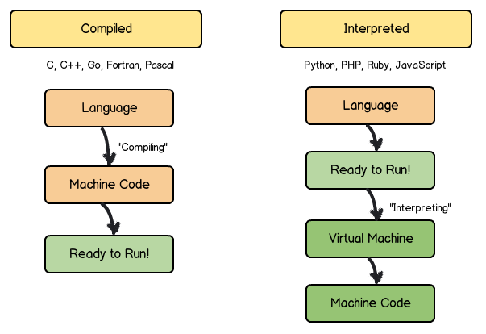
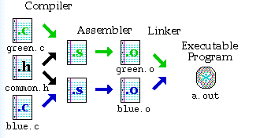
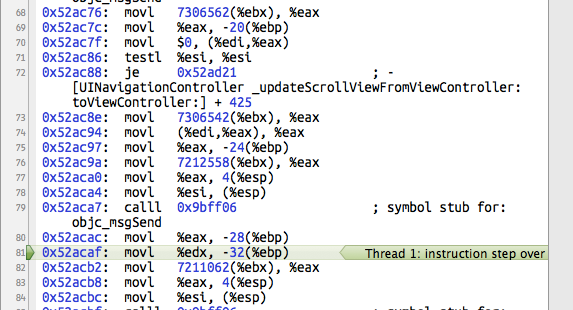
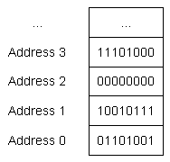
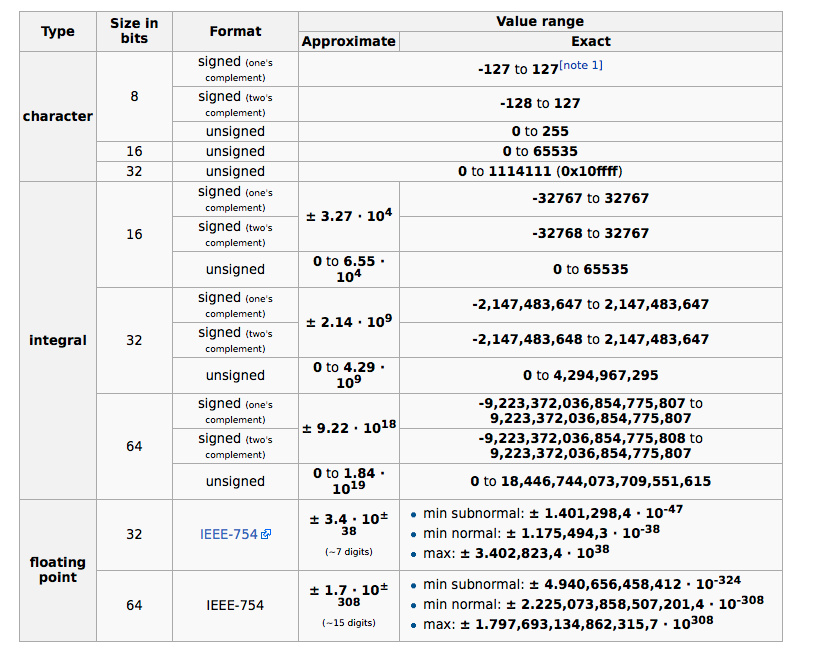

# Introduction

---

## Programming

- We will spend around 2-3 weeks reviewing the basics of programming.
- We are learning C++ first, because:
  - It's harder (better, faster, stronger).
  - It is a better way to learn what your computer is *actually* doing.
- Then, we will learn python, because:
  - It's quicker and easier with many practical applications.
- This will build a foundation for understanding computational physics algorithms. 
- These slides focus on how data is represented in computer programs.

---

## Computers

- In the 1980s, you needed to know UNIX to check email.
- Now, you just bark the order into your phone.
- Somewhere, that order is transferred into currents and voltages on transistors.
- How does it happen in between?

::: {layout="[[30, 10, 30]]" .vcenter}
{fig-alt="Homer Simpson yelling at a computer"}

$\longrightarrow$

{fig-alt="Picture of Siri on an iPhone"}
:::

---

## Computers

:::: {.columns}
::: {.column width="55%"}
- Your voice is being recognized by software that does a waveform analysis (topic of FFT module later this semester!)
- That software is written in some high level language that translates commands (source code) to instructions for your computer chip.
- Two main modes :
  - Compiled
  - Interpreted
:::
::: {.column width="45%"}
{width="100%" fig-alt="Schematic differences between compiled and interpreted programming languages. Compiled languages (C, C++, Go, Fortran, Pascal, etc.) include steps for language [compiling step], machine code, and ready to run. Interpreted language (python, PHP, Ruby, Javascript, etc.) include steps for language, ready to run! [interpreting step], virtual machine, machine code."}
:::
::::

---

## Compiling C++

:::: {.columns .vcenter}
::: {.column width=60%}
- Source code: "high-level," written in human-readable language.
  - Usually modular: divided into independent pieces.
- Assembly code: "low-level," instructions correspond directly to processor operations.
  - Sort of readable.
- Object files: Binary instructions for the CPU.
  - Not readable.
- Executable: actual program that you run.
:::
::: {.column width=40%}
{fig-alt="Steps of compiling a C++ program: soruce code, compiler, assembler, linker, executable program." width=80%}

- Compilation includes several stages:
    - Lexical analysis
    - Syntax analysis
    - Semantic analysis
    - Assembly code generation
    - Optimization
:::
::::

---

## Compiling C++

:::: {.columns .vcenter}
::: {.column width=70%}
- In practice, you rarely have to worry about most of these steps.
  - I have never read a single piece of assembly code.
- You do have to become proficient in invoking the tools. Examples:
  - Debugging compiler errors.
  - Linking external libraries (=code other people wrote).
  - Advanced: understanding optimizations.
:::
::: {.column width=30%}
{fig-alt="Steps of a compiler" width=100%}
:::
::::

---

## Assembly code

:::: {.columns}
::: {.column width=30%}
{fig-alt="Example assembly code"}

- Memory addresses
- Actions
- Arguments

:::
::: {.column width=70%}
- As a computational physicist, you need to *understand* assembly code, but not necessarily know how to *write* it. 
- Mnemonic for specific chipset instructions
- Architecture specific (AMD, Intel, etc)
- Basic instructions:
  - "Move contents of Register 1 into Register 2"
  - "Add contents of Register 1 and Register 2 together, store in Register 3"
- Therse are the important issues when concerning yourself with writing code:
  - Affects speed, memory efficiency, etc.
  - These things are the core limitations of our algorithms!
:::
::::

# Data representations

## Data representations

:::: {.columns .vcenter}
::: {.column width=60%}
- We need to understand the guts of what's going on, before we can learn to use them correctly.
- Everything in the computer is stored in a specific memory location: an address.
- It's ultimately a set of 2-state transistors:
  - "On" or "off".
  - Aka 1 or 0 in binary.
  - Almost always grouped into sets of 8: 8 bits =1 byte

{width="40%" fig-alt="A RAM chip"}

:::
::: {.column width=40%}
{width="80%" fig-alt="An array of bytes, each with an address"}
:::
::::

---

## Counting in binary

- Everyday numbers = base 10

$$
1 \times {10}^{3}+3 \times {10}^{2}+5 \times {10}^{1}+7 \times {10}^{0}=1357
$$

::: {.fragment }
- Numbers in memory = base 2
  - "Bits": **bi**nary dig**its**

$$
1 \times {2}^{3}+0 \times {2}^{2}+0 \times {2}^{1}+1 \times {2}^{0}=9
$$
:::

::: {.fragment}
$$
1 \times 2^7+0 \times 2^6+0 \times 2^5+1 \times 2^4+1 \times 2^3+0 \times 2^2+0 \times 2^1+0 \times 2^0=152
$$
:::


---

## Even more bases

- Reading binary is cumbersome
  - Lots of digits 😵 15210 = 100110002
- For human-readability, `print` functions often use octal (base-8) or hexadecimal (base-16).
  - Example: $152_{10}= 2\times8^2 + 3\times8^1 + 0\times 8^0 := 230_8$
- Convention for printing: prefix denote which base the following digits use

Base | Prefix | $1234_{10}$ 
--- | --- | ---
Binary | `0b` | `0b10011010010`
Octal | `0o` | `0o2322` 
Hexadecimal | `0x` | `0x4d2`

---

## Hexadecimal

- For hexadecimal, we need 15 digits. How does that work?
- Answer: use a few letters to go past 9:
  -  0, 1, 2, 3, 4, 5, 6, 7, 8, 9, a, b, c, d, e, f

$$
\begin{aligned}
161 &= 10\times 16^1 + 1 \times 16^0 \\
&= a \times 16^1 + 1\times16^0 \\
&:= 0xa1
\end{aligned}
$$

::: {.fragment}
$$
\begin{aligned}
255 &= 15 \times 16^1 + 15 \times 16^0 \\
&= f \times 16^1 + f \times 16^0 \\
&:= 0xff
\end{aligned}
$$
:::

---

## Examples

| Decimal | Binary | Octal | Hexadecimal |
| --- | --- | --- | --- | 
| `1`   |	`0b1`      | 	`0o1` 	|`0x1`  |
| `4`   |	`0b100`    | 	`0o4`	  |`0x4`  |
| `10`  |	`0b1010`   | 	`0o12`	|`0xa`  |
| `15`  |	`0b1111"`  |  `0o17`	|`0xf`  |
| `16`  |	`0b10000`  | 	`0o20`	|`0x10` |
| `32`  |	`0b100000` | 	`0o40`	|`0x20` |
| `40`  |	`0b101000` | 	`0o50`	|`0x28` |

---

## 10 types of people

{width=70% fig-align="center" fig-alt="Meme: 10 types of people in the world, those who understand binary and those who don't"}

::: {.fragment .center-box}
<span style="font-size: 5rem; font-family: 'Comic Sans MS', 'Comic Sans', 'cursive', 'sans serif';">And now you are all 1s!</span>
:::

## Endianness

:::: {.columns}
::: {.column width=60%}
- Aside: what do binary numbers actually look like in transistors in memory?
- Just like letters: you can write left-to-right or right-to-left.
  - Some architectures do one, some the other.
- This is which "end" to start from : the **Endian** debate
- "Big end-ian" : most significant digit (i.e., biggest digit) is first.
  - English uses this: 1234, the 1 is the biggest.
- "Little end-ian" : least significant digit is first.

](../assets/1.0_cpp/slide28_pasted-movie.png){fig-alt="Cartoon of a big-endian egghead fighting a little-endian egghead, from Gulliver's Travels"}
:::
::: {.column width=40%}

{fig-alt="Little-endian versus big-endian data representation"}

- Little-endian:
  - ix86
  - AMD64
- Big-endian:
  - SPARC
  - Atmel AVR32
- Bi-endian (support both):
  - ARM (>v3)
  - PowerPC
  - IA64
:::
::::

## What about negative numbers?

- To get a feel for the problems our CPUs have to solve, let's consider an interesting problem: how do we represent **negative numbers**?
  - Naively, this might seem trivial: just convert the number to binary exactly like a positive number?
  -  -5 (base 10) = -101 (binary)
- But: how do we represent the sign in a transistor? 
  - Again, the solution might seem trivial: we need to devote one bit to the sign. 
  - How about just allocating the first bit? 

```
 5 = 0b0101
-5 = 0b1101
```


---

## Naive negative numbers

:::: {.columns}
::: {.column width=40%}
- Naive negative numbers: use first bit to denote +/- (+=0, -=1)
- OK, let's try some math. 
  - ` 4 = 0b0100`
  - ` 3 = 0b0011`
  - `-3 = 0b1101`
:::
::: {.column width=60%}
:::: {.r-stack}

::: {.fragment .fade-out fragment-index=0}
### Addition
- In base 10:
```
 4
+3
--
 7
```

- In binary:
```
 0b0100
+0b0011
 ------
 0b0111
 ```
:::

::: {.fragment .fade-in-then-out fragment-index=0}
### Subtraction
- In base 10:
```
 4
-3
--
 1
```

- In binary (kind of annoying!):
```
 0b0100
-0b0011
 ------
 0b0001
 ```
:::

::: {.fragment .fade-in fragment-index=1}
### Adding a negative number
- Here's where our naive solution goes wrong: *subtracting 3 should be the same as adding -3*
- In base 10:
```
 4
+(-3)
--
 1
```

- In binary:
```
 0b0100
+0b1011
 ------
 0b1111
 ```
- This is -7, not 1! 

:::


::::
:::
::::

---

## Two's Complement

:::: {.columns}
::: {.column width=50%}
- Solution: "two's complement" ([wikipedia](https://en.wikipedia.org/wiki/Two's_complement))
- Let's fix `N=4` bits
  - $2^4=16$ possible values, so we can represent, e.g., -8 to 7
  - First bit is still reserved for sign (+=0, -=1)
  - Other 3 bits for the number
- Positive numbers: `0b0xyz`, just like our naive strategy
- Negative numbers:
  - Flip all the bits: $0 \leftrightarrow 1$
  - Add 1
  - Throw away any overflow (if adding 1 rolls over to a 5th bit, just discard it)
:::
::: {.column width=50%}
Examples:

:::: {.r-stack}
::: {.fragment .fade-out fragment-index=0}
6-6=0
```
 6 = 0b0110
-6 = 0b1001 + 1 = 0b1010
  ```

Then:
```
6 + (-6) =  0b0110
           +0b1010
            ------
         =  0b0000   
```
where we discard the overflow bit
:::

::: {.fragment .fade-in fragment-index=0}
6-2=4
```
 6 = 0b0110
-2 = -(0b0010) = 0b1101+1 = 0b1110
6-2 =  0b0110
      +0b1110
       ------
    =  0b0100
```
:::
::::

:::
::::

---

## "Two's complement"

:::: {.columns}
::: {.column width="60%"}
- ***Why does this work???***
- Answer: [**modular arithmetic**](https://en.wikipedia.org/wiki/Modular_arithmetic)! Remember how that works?
  - "Integers modulo $m$": for any integer, take the remainder divided by $m$
- N=4 bits can represent $2^4=16$ integers (e.g. 0-15)
  - Can define perfectly sensible +, -, and * on 0-15: just **wrap around like clock** if you go over 16 (or under 0)
  - *Closed* under +-*, in mathematics
  - This system is "integers modulo 16", or $\mathbb{Z}/16\mathbb{Z}$
- Example: 10+10=20, wrap around to 4
  - We write: $20 \equiv 4 \mod 16$
:::
::: {.column width="40%"}
{width="100%" fig-alt="Image of a clock representing integers modulo 12 "}
:::
::::

---

## "Two's complement"
:::: {.columns}
::: {.column width=75%}
- How does this relate to two's complement?
- $[0, 15]$ is just one choice for representing $\mathbb{Z}/16\mathbb{Z}$
- We could just as well have chosen $[-8, 7]$! 
  - In the clock analogy, we could label hours using [-6, 5] instead of [1, 12]
- Examples:$-1 \equiv 15 \mod 16$; $-7 \equiv 9 \mod 16$
:::
::: {.column width=25%}
| 0 | 0 |
| --- | --- |
| 1 | 1 |
| 2 | 2 | 
| 3 | 3 |
| 4 | 4 |
| 5 | 5 |
| 6 | 6 |
| 7 | 7 | 
| 8 | -8| 
| 9 | -7 |
| 10 | -6 |
| 11 | -5 | 
| 12 | -4 | 
| 13 | -3 |
| 14 | -2 |
| 15 | -1 |
:::
::::

---

## "Two's complement"

- Thus, our N=4 bits define a perfectly good system for arithmetic (+-*) on integers -8 through 7. 
     - It's equivalent to a system with only positive integers, $[0, 15]$, using the correspondence ($-1\equiv 15\mod 16$, $-2 \equiv 14\mod 16$, ...)!
- Finally, why does the weird bit-flipping procedure work?
- Reason by example: starting from `1=0b0001`, the algorithm tells us -1 is obtained by flipping the bits and adding 1:

```
 1 = 0b0001
-1 = 0b1110 + 1 = 0b1111
1 + (-1) = 0b0001 + 0b1111 = 0b0000
```

- In detail: flipping bits of $x$ is equivalent to $15-x$; we want the additive inverse ($x + (-x) = 16$), so we just have to add 1 more to get $16-x$.
- Like magic, but it's math!

---

## "Two's complement"

- Why is this so important for computers?
  - Addition and subtraction can both be handled by an addition unit in your CPU
  - No need for special instructions for the chip!
    - We could make things work with the "naive" representation.
    - Addition becomes an "if" statement: CPU does different things depending on +(pos) or +(neg) number.
    - This would be super expensive!

---

## Bits and bytes

:::: {.columns}
::: {.column width=50%}
- OK, back to more practical matters: how numbers are actually stored in a C++ program.
- Of course, numbers are stored in binary, but 1 bit is not very useful by itself.
- Instead, computers use fixed-sized groups of bits: **bytes**
  - E.g. "gigabyte" (GB), versus "gigabit" (Gb)
:::
::: {.column width=50%}
- [How many bits are in a byte?](https://en.wikipedia.org/wiki/Byte)
  - This is actually architecture dependent! 
  - Usually (almost always) 8 bits per byte
- An 8-bit byte looks something like `00111100`. 
- Can represent integers from 0-255 (or signed integers from -128-127). 
  - Or, in hexadecimal, 0x0-0xff
- Obvious question: how do you store bigger numbers?
  - Answer: use multiple bytes
:::
::::


---

## Integers

- The range of integers you can represent depends on:
  - How many bytes used?
  - Signed or unsigned?
- Example: 4 bytes = 32 bits
  -$2^32 = 4294967296$
  - So, unsigned integers from 0-4294967295
  - Or signed integers from -2147483648 - 2147483647

---

## Decimals

- What about decimal numbers?
  - Naive attempt: just convert the numbers you see? For example $2.2  \rightarrow $  `0b10.10`. But how do we represent the location of the decimal?
- Better idea: use **scientific notation**. Example: 3.154e+7 (seconds in a year 🙂)
- **Floating point numbers**: given a fixed number of bytes for your decimal object, use some bits for the exponent (7), some bits for the mantissa (3.154), and one bit for the sign (+).
  - Typical sizes: 2 bytes ("single precision") or 4 bytes ("double precision")

::: {style="display: block; margin: auto;"}
{fig-align="center" width=30% fig-alt="Bit representation of floating point numbers"}
:::


# C++ Intro

---

## C++ intro

- This brings us finally to C++!
- If you are only familiar with python, a first essential topic is **data types**
  - Data types tell the computer how you are going to *interpret** the bits on the register
- Example : Computer gives you 
11110110100111010111011010011101
  - What the heck is that?
  - Is it a signed integer? -157452643
  - Is it an unsigned integer? 4137514653
  - Is it a float? -1.5968679E33
  - Is it a double? -1.5968679100482687E33

---

## "Strong typing"

- Computing is intrinsically very complex. At all times, the program has to understand every bit of data, and you have to be able to interpret the results.
- C++ is **strongly typed**: you must declare the type of every variable, i.e., how you are representing each number in bits.
```
int x = 10;
float proton_mass = 1.6726e-27;
```
- On the other hand, Python is **weakly typed**: you don't have to declare variable types. Instead, Python figures it out at runtime (slow!)

---

## Commonly used C++ types

| Type | Size | Min | Max |
| --- | --- | --- | --- |
| bool              | 1 bit   | 0     | 1 |
| unsigned char     | 1 byte  | 0     | 255 |
| char              | 1 byte  | -128  | 127 |
| unsigned int      | 2 bytes | 0     | 65,535 |
| int               | 2 bytes | -32,768 |  32,767 |
| unsigned long int | 4 bytes | 0     | 4,294,967,295 |
| long int          | 4 bytes | -2,147,483,648  | 2,147,483,647 |
| float             | 4 bytes |  1.2E-38 |  3.4E+38 |
| double            | 8 bytes | 2.3E-308 | 1.7E+308 |
 

---

## An annoyance

- The C++ standard specifies that "int", for instance, must be AT LEAST 2 bytes. It can be more, and sometimes is!
- This is **architecture dependent**
- size of int on linux+intel != size of int on mac+amd
- When in doubt, check [http://en.cppreference.com/w/cpp/language/types](http://en.cppreference.com/w/cpp/language/types)

---

## Data types and n(bits)

{fig-alt="Table of data types"}

---

## Data types and range of values

{width="70%" fig-alt="Table of data types and their ranges"}

---

## Checkpoint

- tl;dr:
  - Data types are hard and not very intuitive!
  - They are designed for efficiency/performance, not ease of use.
  - C++ types you will use the most:
    - `char`
    - `int`, `unsigned int`
    - `float`, `double`
  - You need to be aware of the intricacies and difficulties, though... you **will** run into this if you do any serious numerical computing in the future.
- Assignment 1 is posted, due Monday, September 14 at 11:59pm (2 weeks).
  - Problem 1.1 is about the two's complement algorithm.
  - Problems 1.2-1.4 investigate the capacity of various data types.
- Up next: compiling and executing C++ programs.