## Announcements

- Assignment 3 due Wednesday, October 8 at 11:59pm.
  - Github Classroom link: [https://classroom.github.com/a/J2TJpGOL](https://classroom.github.com/a/J2TJpGOL)
  - Topics:
    - Numpy array basics (computing averages)
    - Numpy arrays for basic kinematics (projectile motion)
    - (PHY505 only) Using Swig
- Assignment 2 solutions posted: [https://github.com/ubsuny/compphys-fall2025-compphys-assignment2-CompPhys/pull/1/files](https://github.com/ubsuny/compphys-fall2025-compphys-assignment2-CompPhys/pull/1/files)
- Today:
  - Transforming data to a linear fit
  - Generalized least squares

---

## Data analysis: fitting

- [https://github.com/ubsuny/CompPhys/tree/main/DataAnalysis/Fitting](https://github.com/ubsuny/CompPhys/tree/main/DataAnalysis/Fitting)

---

## References

- Our examples: [https://github.com/ubsuny/CompPhys/tree/main/DataAnalysis/Fitting](https://github.com/ubsuny/CompPhys/tree/main/DataAnalysis/Fitting)
- Statistics derivation is nicely derived in the Particle Data Group reviews: [https://pdg.lbl.gov/2024/reviews/rpp2024-rev-statistics.pdf](https://pdg.lbl.gov/2024/reviews/rpp2024-rev-statistics.pdf)
- You can also check the Numerical Recipes if you want (although not necessary, strictly speaking):
  - [https://numerical.recipes/book.html](https://numerical.recipes/book.html)

---

## First example: Hubble's Law

- As a first physics application, we will study [Hubble's Law](http://en.wikipedia.org/wiki/Hubble's_law)
  - Least squares fit to Edwin Hubble's measurements on "extra-galactic nebulae" given in his [1929 article](http://www.pnas.org/content/15/3/168.full.pdf).
- This is a linear fit, which (albeit simple) will give us some intuition about fitting in general.

---

## First example: Hubble's Law

- Galaxies are collections of hundreds of billions of stars
- Very enormous!
- Here’s a picture from the Hubble telescope released in 2012 showing lots of different galaxies from the Hubble extreme Deep Field ([http://en.wikipedia.org/wiki/Hubble_Extreme_Deep_Field](http://en.wikipedia.org/wiki/Hubble_Extreme_Deep_Field))
- This is a photo of an event 13.2 billion years ago, just after the universe underwent inflation!

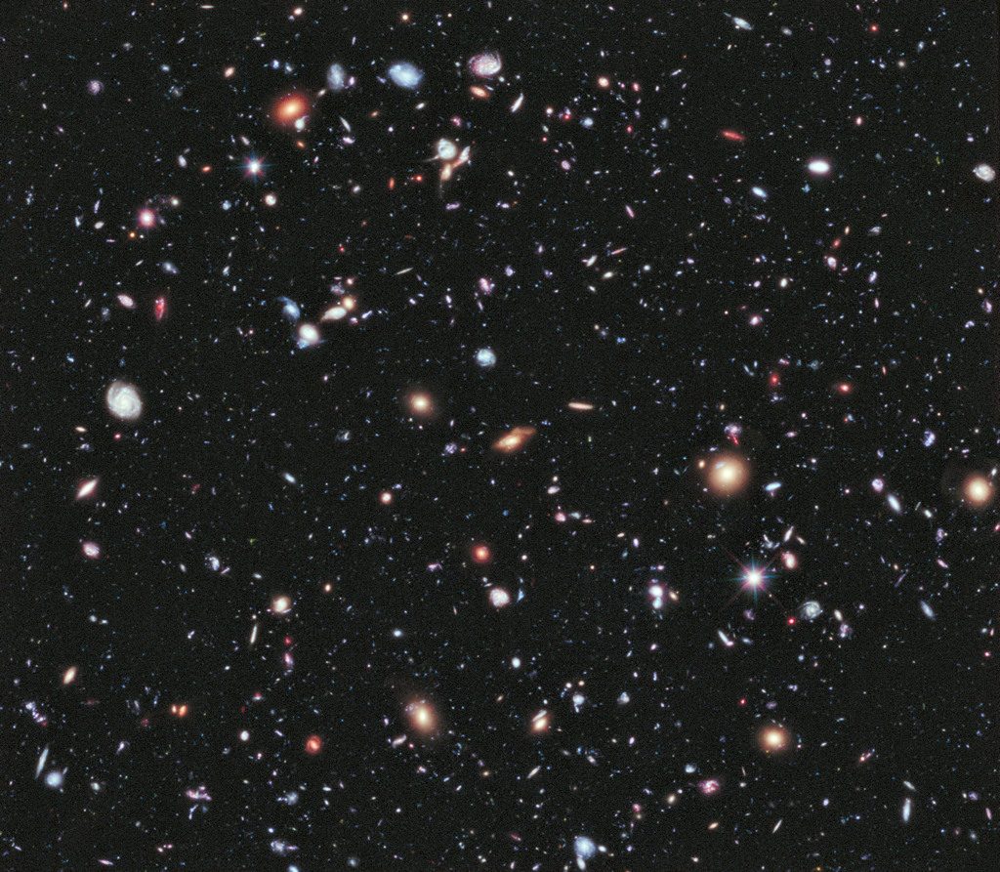{width="70%" fig-alt="TODO: describe image"}

---

## Slide 7

<!-- TODO: complex slide layout (flagged by detect_complex_slide.py - see run log). Content below is complete but UNARRANGED - needs manual layout to match the original slide. -->

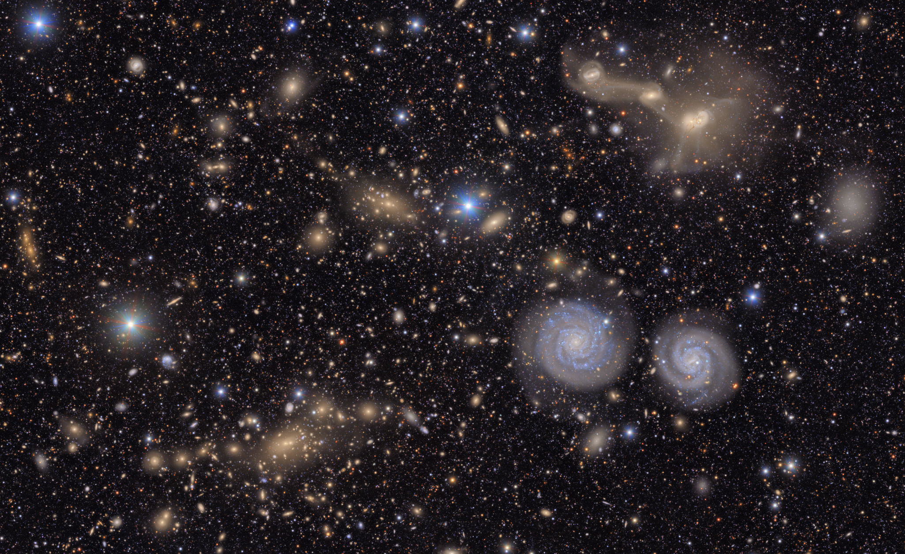{fig-alt="TODO"}

- Vera Rubin Observatory ([https://rubinobservatory.org/](https://rubinobservatory.org/))

---

## James Webb telescope

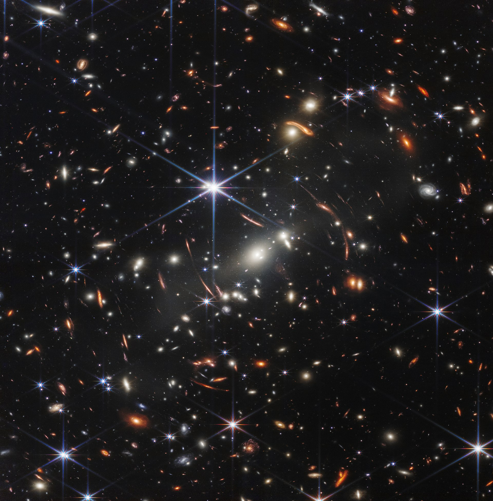{width="70%" fig-alt="TODO: describe image"}

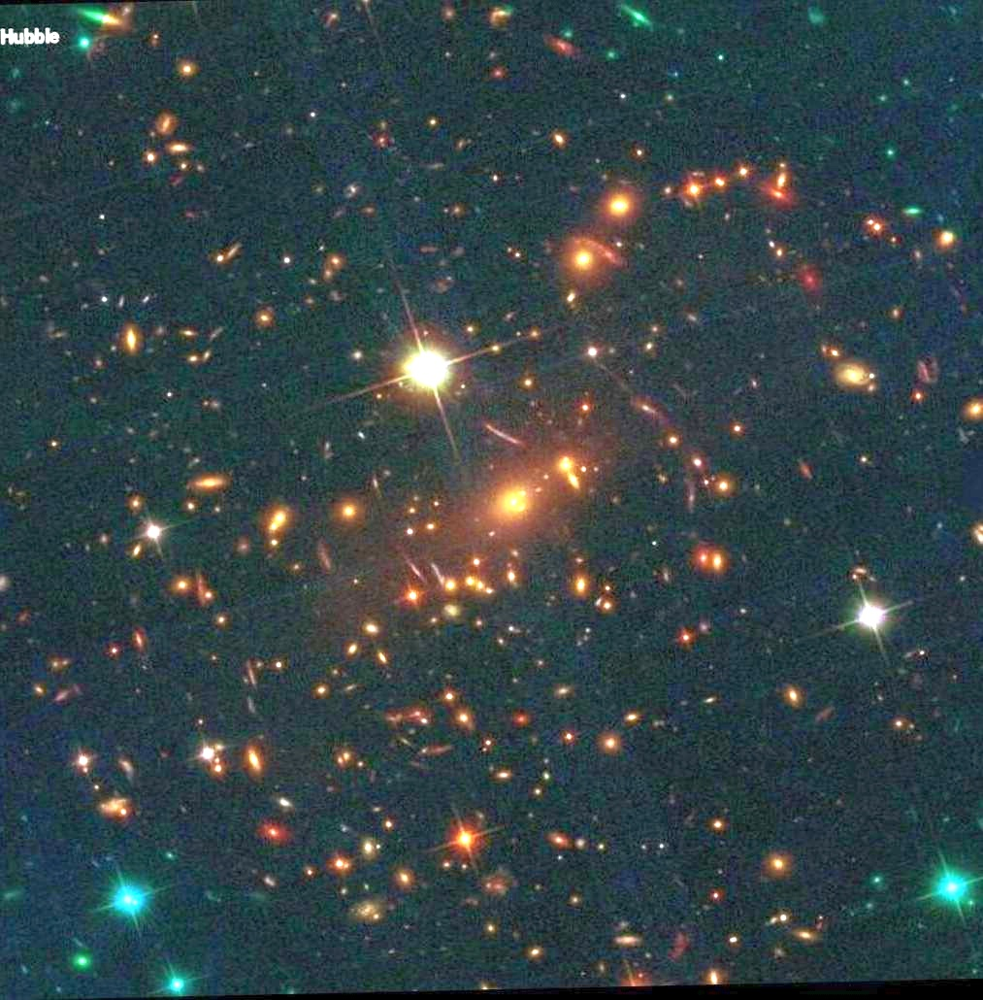{width="70%" fig-alt="TODO: describe image"}

- [https://en.wikipedia.org/wiki/Webb%27s_First_Deep_Field](https://en.wikipedia.org/wiki/Webb's_First_Deep_Field)

---

## Hubble data

- We’re going to analyze the data from Hubble's 1929 paper
  - [https://www.pnas.org/doi/10.1073/pnas.15.3.168](https://www.pnas.org/doi/10.1073/pnas.15.3.168)
- Example: Local Group Galaxy NGC 6822  (Barnard’s Galaxy)
  - r = 0.214 Mpc (1 Mega-parsec = $3.086 \times {10}^{19}$ km)
  - Relative velocity: -130 km/s (i.e., it's moving towards Earth).

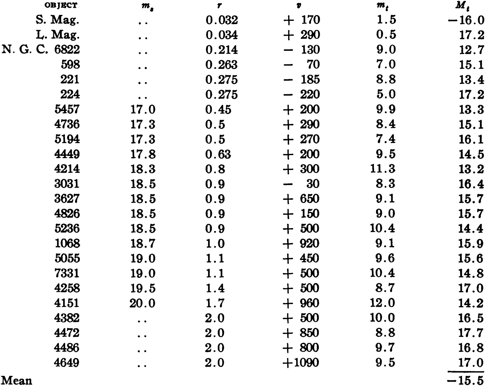{width="70%" fig-alt="TODO: describe image"}

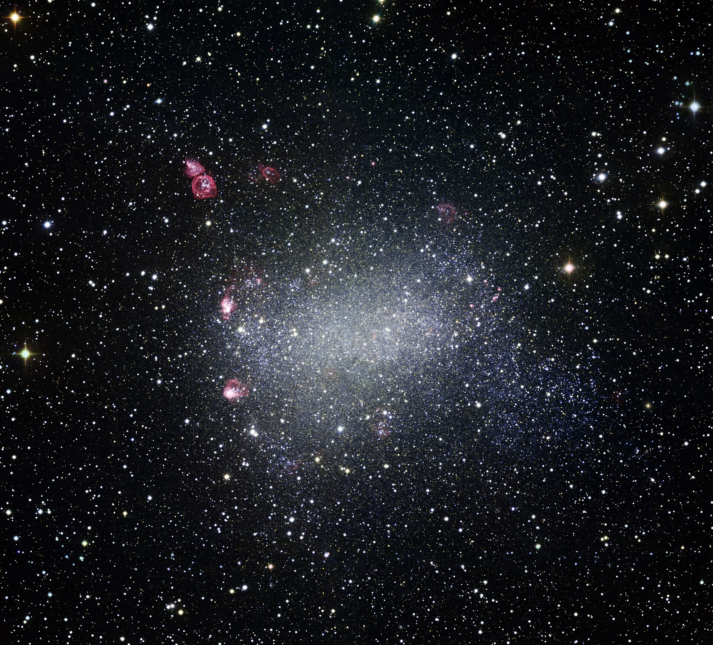{width="70%" fig-alt="TODO: describe image"}

---

## Hubble data

<!-- TODO: complex slide layout (flagged by detect_complex_slide.py - see run log). Content below is complete but UNARRANGED - needs manual layout to match the original slide. -->

- Hubble (and others) noticed a critical pattern: almost everything is moving away from Earth, and the velocity increases with distance.
- The data were fit with the following linear relationship:

{fig-alt="TODO"}

- $$rK+Xcos \alpha cos \delta +Ysin \alpha cos \delta +Zsin \delta =v$$

- Distance

- Constants

- Longitude

- Latitude

- Velocity

---

## Input variables: distance

- Before fitting, we should understand our input data!
  - "Distance" is not measured with a ruler!
- Astronomical distances are determined using a succession of methods, depending on the scale being measured.
- Closest objects (solar system, nearby stars): radar ranging, parallax.
- Further objects rely on standard candles: well-understood stellar objects with known luminosities.
  - Distance calculated from inverse-square law, based on apparent vs. absolute luminosities.
- It's not easy!
  - Everything has to be calibrated.
  - Uncertainties have to be understood.

{width="70%" fig-alt="TODO: describe image"}

- [https://www.daviddarling.info/encyclopedia/C/cosmic_distance_ladder.html](https://www.daviddarling.info/encyclopedia/C/cosmic_distance_ladder.html)

---

## Cepheid variable stars

- Hubble's data used Cepheid variable stars to measure distance.
  - Variable star type that pulsates radially.
  - Incredibly useful: strong relationship between luminosity and period! See [Leavitt 1912](https://web.archive.org/web/20201111225447/https://cosmology.carnegiescience.edu/timeline/1912).
  - The period is easy to measure, then the (absolute) luminosity can be calculated.
  - Finally, use inverse square law to calculate distance from absolute vs. apparent luminosity.

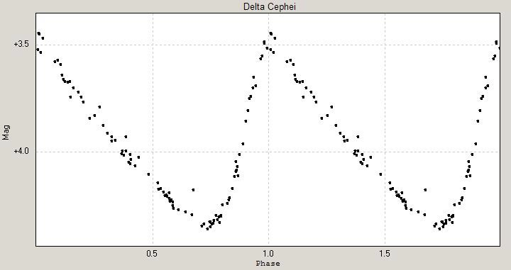{width="70%" fig-alt="TODO: describe image"}

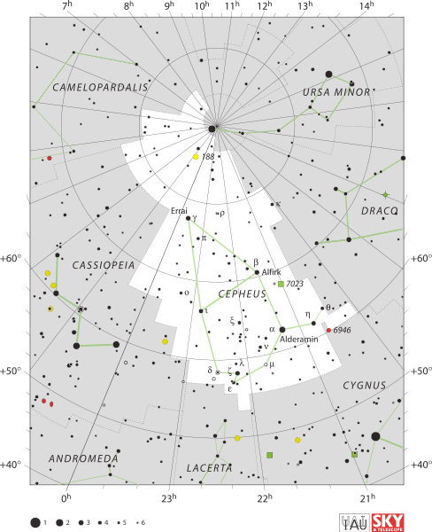{width="70%" fig-alt="TODO: describe image"}

- Example: [Delta Cephei](https://en.wikipedia.org/wiki/Delta_Cephei)

---

## Redshift

<!-- TODO: complex slide layout (flagged by detect_complex_slide.py - see run log). Content below is complete but UNARRANGED - needs manual layout to match the original slide. -->

- Radial velocity is determined using redshift:
  - See [Slipher 1913](http://www2.lowell.edu/workshops/slipher/Slipher1913LowOB2_56S.pdf), [bio](https://www.lindahall.org/about/news/scientist-of-the-day/vesto-slipher/).

- $$z+1=\frac{{ \lambda }_{\text{obs.}}}{{ \lambda }_{\text{emit}}}= \gamma (1+\frac{v}{c})$$

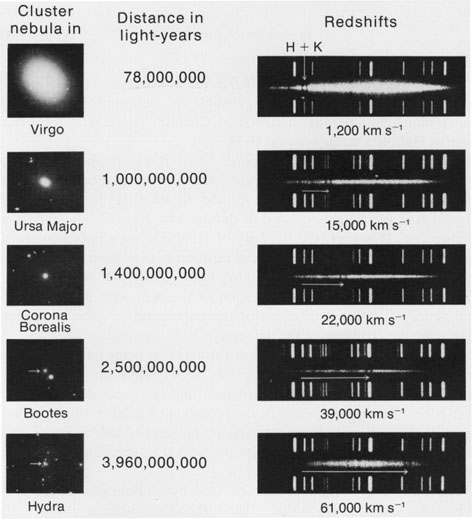{fig-alt="TODO"}

- [https://ned.ipac.caltech.edu/level5/Narlikar2/Figures/figure1_22.jpeg](https://ned.ipac.caltech.edu/level5/Narlikar2/Figures/figure1_22.jpeg)

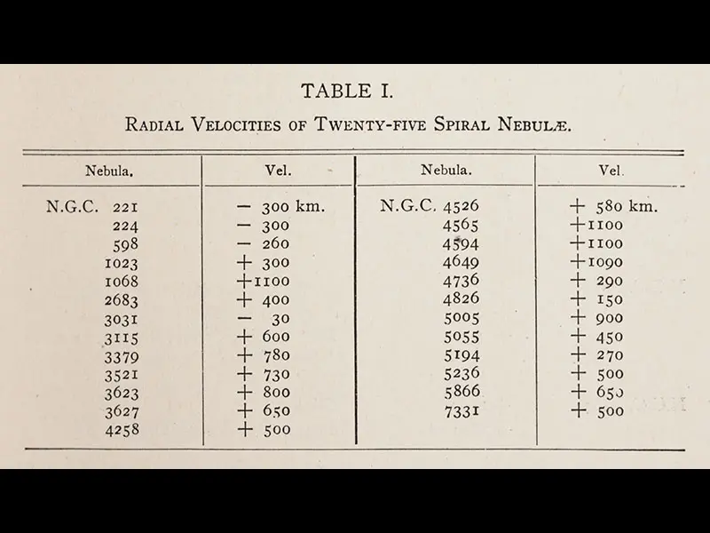{fig-alt="TODO"}

- This is the key discovery: almost everything is redshifted!

---

## The Hubble parameter

<!-- TODO: complex slide layout (flagged by detect_complex_slide.py - see run log). Content below is complete but UNARRANGED - needs manual layout to match the original slide. -->

- OK, that was the hard part.
- Fitting is "easy" :)
- Result:

{fig-alt="TODO"}

- $$v \approx r \times 500\frac{\text{km}}{\text{s}}\frac{1}{\text{Mpc}}$$

- (Note: while conceptually correct, the value turned out to be way off! Hubble's distance scale was miscalibrated by about a [factor of 7](https://www.pnas.org/doi/10.1073/pnas.1424299112).)

---

## An expanding universe

- Why do we expect that the further the distance of the galaxy, the faster they should be moving away from us?
- A priori, no reason!
  - It just happens to be so in our universe!
- A "static universe" was the prevailing view at the time. Famously, Einstein introduced the "cosmological constant" into the GR field equations to obtain a static solution.
- So, now for a (tiny) bit of general relativity and cosmology.

{width="70%" fig-alt="TODO: describe image"}

---

## General relativity

<!-- TODO: complex slide layout (flagged by detect_complex_slide.py - see run log). Content below is complete but UNARRANGED - needs manual layout to match the original slide. -->

- Space-time is a tensor.
- So gravity is a tensor.
- Einstein’s equations :

- $${G}_{ \mu  \nu }={R}_{ \mu  \nu }-\frac{1}{2}{g}_{ \mu  \nu }R=\frac{8 \pi {G}_{N}}{{c}^{4}}{T}_{ \mu  \nu }-{g}_{ \mu  \nu } \Lambda $$

- Ricci tensor
- (gravitational force)

- Metric tensor

- Curvature scalar

- Newton's constant

- Speed of light

- Stress-energy tensor
- (energy and momentum density of matter + radiation)

- Cosmological constant

- Huge set of nonlinear partial differential equations.
- Arbitrarily complicated (${T}_{ \mu  \nu }$ can be anything!)

- Einstein tensor

---

## Cosmological solutions to Einstein's equations

- A few simple cases can be derived.
- If spacetime is homogeneous and isotropic, this is the Robertson–Walker metric:

- $$d{s}^{2}=\mathop{\mathop{ \sum }\limits_{ \mu =0}}\limits^{3}\mathop{\mathop{ \sum }\limits_{ \nu =0}}\limits^{3}{g}_{ \mu  \nu }d{x}^{ \mu }d{x}^{ \nu }={c}^{2}d{t}^{2}-{R}^{2}(t)\left[ \frac{d{r}^{2}}{1-k{r}^{2}}+{r}^{2}(d{ \theta }^{2}+si{n}^{2} \theta d{ \phi }^{2})right] \right]$$

- R(t) = "cosmological scale factor"

- Friedmann–Lamaitre equations: assume that matter and radiation behave like a uniform, perfect fluid with density $ \rho $ and pressure $p$.

- $${H}^{2}={\left( \frac{\mathop{R}\limits^{ \cdot }}{R} \right)}^{2}=\frac{8 \pi {G}_{N} \rho }{3}-\frac{k{c}^{2}}{{R}^{2}}+\frac{ \Lambda {c}^{2}}{3}$$

- $$\frac{\mathop{R}\limits^{ \cdot  \cdot }}{R}=-\frac{4 \pi {G}_{N}}{3}( \rho +3p)+\frac{ \Lambda {c}^{2}}{3}$$

---

## Fitting

- Let's do some actual fitting now
  - (With apologies for the whiplash!)
- We want to fit a line to a bunch of points.
- Let's start by considering what this means, and exactly how to write down our problem.

{width="70%" fig-alt="TODO: describe image"}

---

## Back to fitting

- Step 1 : Write the algorithm down on paper
- Step 2 :
  - If you don’t understand everything : goto step 1
  - else : continue
- Step 3 : write pseudocode
- Step 4 : continue
  - If you don’t understand everything : goto step 3
  - else : continue
- Step 5 : write code
- Step 6 : check code with unit tests
  - Check “pass” criterion
  - Check “fail” criterion
  - If unit test fails : goto Step 5
  - else : continue
- Step 7 : Publish!

---

## Linear fits

<!-- TODO: complex slide layout (flagged by detect_complex_slide.py - see run log). Content below is complete but UNARRANGED - needs manual layout to match the original slide. -->

- Think about the simplest case : 1 point.
- What happens here?

---

## Linear fits

<!-- TODO: complex slide layout (flagged by detect_complex_slide.py - see run log). Content below is complete but UNARRANGED - needs manual layout to match the original slide. -->

- Think about the simplest case : 1 point.
- What happens here?

- Well, not much. You can't fit a line to a point!
- Our code will have to handle this situation.

---

## Linear fits

<!-- TODO: complex slide layout (flagged by detect_complex_slide.py - see run log). Content below is complete but UNARRANGED - needs manual layout to match the original slide. -->

- Next simplest case: 2 points
- What happens here?

---

## Linear fits

<!-- TODO: complex slide layout (flagged by detect_complex_slide.py - see run log). Content below is complete but UNARRANGED - needs manual layout to match the original slide. -->

- Next simplest case: 2 points
- What happens here?

- Easy: there's no fit. You just draw a line.

---

## Linear fits

<!-- TODO: complex slide layout (flagged by detect_complex_slide.py - see run log). Content below is complete but UNARRANGED - needs manual layout to match the original slide. -->

- Next simplest case: 2 points
- What happens here?

- Easy: there's no fit. You just draw a line.

- $$\begin{matrix}
y & =mx+b \\
m & =({y}_{1}-{y}_{0})/({x}_{1}-{x}_{0}) \\
b & ={y}_{0}-m{x}_{0}
\end{matrix}$$

---

## Linear fits

<!-- TODO: complex slide layout (flagged by detect_complex_slide.py - see run log). Content below is complete but UNARRANGED - needs manual layout to match the original slide. -->

- What about 3 points?
- Finally things get interesting.

---

## Linear fits

<!-- TODO: complex slide layout (flagged by detect_complex_slide.py - see run log). Content below is complete but UNARRANGED - needs manual layout to match the original slide. -->

- What about 3 points?
- Finally things get "interesting."

- If the 3 points are colinear, we can still just draw a line.

---

## Linear fits

<!-- TODO: complex slide layout (flagged by detect_complex_slide.py - see run log). Content below is complete but UNARRANGED - needs manual layout to match the original slide. -->

- What about 3 points?
- Finally things get "interesting."

- But what if they are not colinear? The simple method doesn't work anymore.

---

## Linear fits

<!-- TODO: complex slide layout (flagged by detect_complex_slide.py - see run log). Content below is complete but UNARRANGED - needs manual layout to match the original slide. -->

- What about 3 points?
- Finally things get "interesting."

- But what if they are not colinear? The simple method doesn't work anymore.
- Important fact: points are almost never points, but rather ellipses. They have values... and uncertainties!

---

## Uncertainties

<!-- TODO: complex slide layout (flagged by detect_complex_slide.py - see run log). Content below is complete but UNARRANGED - needs manual layout to match the original slide. -->

- Two types of uncertainties:
  - Statistical sampling
    - From variations in repeated trials.
    - Mathematically well behaved.
    - Easy to estimate.
  - Systematic effects
    - Intrinsic uncertainty from non-deterministic sources.
    - Not mathematically well behaved.
    - Difficult to estimate.

---

## Uncertainties

- Example : measuring distance with a ruler
  - Systematic limitation: ruler has finite width of the lines, and finite number of lines to measure!

  - Statistical variation: you can try to repeat the same measurement over and over to get a better estimate of the “true” value

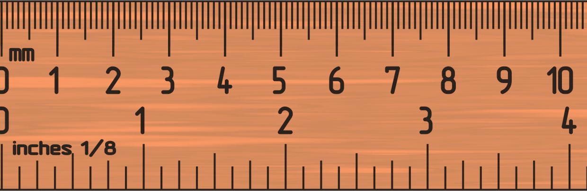{width="70%" fig-alt="TODO: describe image"}

---

## Statistical uncertainties

- Easy one first : statistical uncertainties
- Problem statement:
  - There exists a true value, $\mathop{x}\limits^{˜}$.
  - We have several measured values, ${x}_{0},{x}_{1},...,{x}_{N-1}$
  - How well can we estimate $\mathop{x}\limits^{˜}$ based on the ${x}_{i}$?

---

## Central limit theorem

<!-- TODO: complex slide layout (flagged by detect_complex_slide.py - see run log). Content below is complete but UNARRANGED - needs manual layout to match the original slide. -->

- Central limit theorem!
  - http://en.wikipedia.org/wiki/Central_limit_theorem
- If your measurements are uncorrelated :
  - As you make more measurements, they follow a Gaussian (or “normal”, or bell-shaped curve) distribution
  - http://en.wikipedia.org/wiki/Normal_distribution

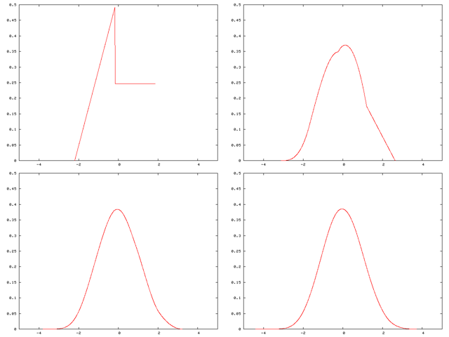{fig-alt="TODO"}

- 1

- 2

- 3

- 4

- "Probability distribution function" (PDF)

---

## Gaussian distribution

<!-- TODO: complex slide layout (flagged by detect_complex_slide.py - see run log). Content below is complete but UNARRANGED - needs manual layout to match the original slide. -->

- The distribution of measured values will follow a Gaussian distribution for statistical uncertainties.
- We usually quote the "sigma" ($ \sigma $) of the Gaussian as the uncertainty band.
- But what about systematic effects?
  - If you repeat the experiment multiple times, what happens?
  - Well, if something is "systematic," by definition you'll basically get the same thing again!

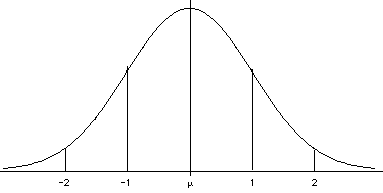{fig-alt="TODO"}

- $$ \sigma $$

---

## Gaussian distribution

<!-- TODO: complex slide layout (flagged by detect_complex_slide.py - see run log). Content below is complete but UNARRANGED - needs manual layout to match the original slide. -->

- The distribution of measured values will follow a Gaussian distribution for statistical uncertainties.
- We usually quote the "sigma" ($ \sigma $) of the Gaussian as the uncertainty band.
- But what about systematic effects?
  - If you repeat the experiment multiple times, what happens?
  - Well, if something is "systematic," by definition you'll basically get the same thing again!

{fig-alt="TODO"}

- $$ \sigma $$

---

## Systematic uncertainties

<!-- TODO: complex slide layout (flagged by detect_complex_slide.py - see run log). Content below is complete but UNARRANGED - needs manual layout to match the original slide. -->

- Systematic uncertainties are typically annoying/very hard to estimate
- Typically we (as scientists) “reckon” them in some way
  - Control samples
  - Minimum resolution of your device
  - And so on
- Typical probability distribution function: FLAT
  - You don’t know where it is, but it’s somewhere within that range.

{fig-alt="TODO"}

- Systematic PDF : “Box”

- Statistical PDF : Gaussian

---

## Uncertainties

- You now say : “I thought you were supposed to teach me about programming? I haven’t seen a line of code yet!”
- “Ah, my good students,” I reply. “But remember we must understand what we’re doing!”

---

## Uncertainties

- So why am I telling you all of this?
  - Systematic effects don’t follow a nice mathematical formalism
  - Statistical effects do follow a mathematical formalism
- So, we usually just pretend that systematic effects are like statistical effects, and assume Gaussian uncertainties too!
  - This is not just giving up! It's the core of the central limit theorem: in many circumstances, the PDF converges to a Gaussian.

---

## Uncertainties

<!-- TODO: complex slide layout (flagged by detect_complex_slide.py - see run log). Content below is complete but UNARRANGED - needs manual layout to match the original slide. -->

- Back to linear fits. What are these random circles I drew?
- Answer: they're uncertainties, which we pretend are statistical, Gaussian-distributed uncertainties.
- Our problem is now: draw a line that goes through all of the ellipses.
  - "As close to the points as possible"
- Method: minimize the least squares distance between the fit and the points.

---

## Linear fits

- Let's write down our problem quantitatively.
- Our model to describe the data is:

- $$y(x)=a+bx$$

- For the simple least squares fit, assume all of the uncertainties are the same.
- The quantity to minimize is:

- $$\begin{matrix}
f(a,b) & =\mathop{\mathop{ \sum }\limits_{i=0}}\limits^{N-1}({y}_{i}-f({x}_{i}){)}^{2} \\
 & =\mathop{\mathop{ \sum }\limits_{i=0}}\limits^{N-1}({y}_{i}-a-b{x}_{i}{)}^{2}
\end{matrix}$$

---

## Linear fits

- Remember minimization from calculus: at the minimum, the derivatives are 0.

- $$\begin{matrix}
0=\frac{ \partial f}{ \partial a} & =-2\mathop{\mathop{ \sum }\limits_{i=0}}\limits^{N-1}({y}_{i}-a-b{x}_{i}) \\
0=\frac{ \partial f}{ \partial b} & =-2\mathop{\mathop{ \sum }\limits_{i=0}}\limits^{N-1}{x}_{i}({y}_{i}-a-b{x}_{i})
\end{matrix}$$

- We have two equations and two unknowns (a and b), so we can solve exactly.
- To simplify the equations, define a few quantities...
  - Remember, we have to type all of this into a program!

- $$\begin{matrix}
{s}_{x} & =\mathop{\mathop{ \sum }\limits_{i=0}}\limits^{N-1}{x}_{i},{s}_{y}=\mathop{\mathop{ \sum }\limits_{i=0}}\limits^{N-1}{y}_{i} \\
{s}_{xx} & =\mathop{\mathop{ \sum }\limits_{i=0}}\limits^{N-1}{x}_{i}^{2},{s}_{xy}=\mathop{\mathop{ \sum }\limits_{i=0}}\limits^{N-1}{x}_{i}{y}_{i}
\end{matrix}$$

---

## Linear fits

- Remember minimization from calculus: at the minimum, the derivatives are 0.

- $$\begin{matrix}
0=\frac{ \partial f}{ \partial a} & =-2\mathop{\mathop{ \sum }\limits_{i=0}}\limits^{N-1}({y}_{i}-a-b{x}_{9}) \\
0=\frac{ \partial f}{ \partial b} & =-2\mathop{\mathop{ \sum }\limits_{i=0}}\limits^{N-1}{x}_{i}({y}_{i}-a-b{x}_{i})
\end{matrix}$$

- We have two equations and two unknowns (a and b), so we can solve exactly.
- To simplify the equations, define a few quantities...
  - Remember, we have to type all of this into a program!

- $$\begin{matrix}
{s}_{x} & =\mathop{\mathop{ \sum }\limits_{i=0}}\limits^{N-1}{x}_{i},{s}_{y}=\mathop{\mathop{ \sum }\limits_{i=0}}\limits^{N-1}{y}_{i} \\
{s}_{xx} & =\mathop{\mathop{ \sum }\limits_{i=0}}\limits^{N-1}{x}_{i}^{2},{s}_{xy}=\mathop{\mathop{ \sum }\limits_{i=0}}\limits^{N-1}{x}_{i}{y}_{i}
\end{matrix}$$

- ~mean of ${x}_{i}$

- ~mean of ${y}_{i}$

- ~std dev of ${x}_{i}$

- Cross term

---

## Linear fits

- Now solve for a and b:

- $$\begin{matrix}
0=\frac{ \partial f}{ \partial a} & =-2({s}_{y}-an-b{s}_{x}) \\
0=\frac{ \partial f}{ \partial b} & =-2({s}_{xy}-a{s}_{x}-b{s}_{xx}) \\
a & =\frac{{s}_{xx}{s}_{y}-{s}_{x}{s}_{xy}}{N{s}_{xx}-{s}_{x}^{2}} \\
b & =\frac{n{s}_{xy}-{s}_{x}{s}_{y}}{N{s}_{xx}-{s}_{x}^{2}}
\end{matrix}$$

- This algorithm is discussed in Section 15.2: Fitting data to a straight line of Numerical Recipes ([link](https://numerical.recipes/book.html)).

---

## Linear fit uncertainties

- Great! But we're not done.
- We are scientists, so we need to determine uncertainties on our model, i.e., $ \delta a$ and $ \delta b$.
- We can also compute this exactly. Remember propagation of uncertainty!

- $$\begin{matrix}
{ \sigma }_{f}^{2} & =\mathop{\mathop{ \sum }\limits_{i=0}}\limits^{N-1}{ \sigma }_{i}^{2}{\left( \frac{ \partial f}{ \partial {y}_{i}} \right)}^{2}
\end{matrix}$$

---

## Linear fit uncertainties

- Great! But we're not done.
- We are scientists, so we need to determine uncertainties on our model, i.e., $ \delta a$ and $ \delta b$.
- We can also compute this exactly. Remember propagation of uncertainty!

- $$\begin{matrix}
{ \sigma }_{f}^{2} & =\mathop{\mathop{ \sum }\limits_{i=0}}\limits^{N-1}{ \sigma }_{i}^{2}{\left( \frac{ \partial f}{ \partial {y}_{i}} \right)}^{2}
\end{matrix}$$

- $$\begin{matrix}
a & =\frac{{s}_{xx}{s}_{y}-{s}_{x}{s}_{xy}}{N{s}_{xx}-{s}_{x}^{2}} \\
b & =\frac{N{s}_{xy}-{s}_{x}{s}_{y}}{N{s}_{xx}-{s}_{x}^{2}} \\
{ \sigma }_{a}^{2} & =\frac{{s}_{x}x}{N{s}_{xx}-{s}_{x}^{2}} \\
{ \sigma }_{b}^{2} & =\frac{N}{N{s}_{xx}-{s}_{x}^{2}}
\end{matrix}$$

- In this case, $a$ (y-intercept) and $b$ (slope) are simple functions of the measurements, ${y}_{i}$.
  - Assuming ${ \sigma }_{i}=1$ for the simple least-squares fit.
- Skipping the math...

---

## Linear fit uncertainties

- Great! But we're still not done.
  - We probably want covariance/correlation of $a$ and $b$ (see Numerical Recipes).
- Also; we want a measure of how well our model agrees with the data!
- First, define the degrees of freedom, $ \nu $:
  - $ \nu $ = #(data points) - #(constraints)
  - For a linear fit, #(constraints)=2, i.e., a and b.
- The variance is defined as:

- $${ \sigma }^{2}=\frac{f(a,b)}{ \nu }=\frac{1}{N-2}\mathop{\mathop{ \sum }\limits_{i=0}}\limits^{N-1}({y}_{i}-y({x}_{i}){)}^{2}$$

---

## Realistic uncertainties

- Let's generalize to realistic uncertainties: each point has its own estimated uncertainty, ${ \sigma }_{i}$, on the measured value ${y}_{i}$.
- The formulation is mostly the same, except dividing the "squared distance" by the uncertainty:

- $$\begin{matrix}
f(a,b) & =\mathop{\mathop{ \sum }\limits_{i=0}}\limits^{N-1}({y}_{i}-f({x}_{i}){)}^{2} \\
 \Rightarrow { \chi }^{2}(a,b) & =\mathop{\mathop{ \sum }\limits_{i=0}}\limits^{N-1}{\left( \frac{{y}_{i}-f({x}_{i})}{{ \sigma }_{i}} \right)}^{2}
\end{matrix}$$

- Intuition: we are converting each measurement to a standard normally distributed variable: a Gaussian with mean 0 and width 1.

---

## Realistic uncertainties

<!-- TODO: complex slide layout (flagged by detect_complex_slide.py - see run log). Content below is complete but UNARRANGED - needs manual layout to match the original slide. -->

- Intuition: why does this work?
  - Points with smaller uncertainties are more important: the fit must pass close to them.
  - Points with larger uncertainties are less important: the fit can pass far away.
  - We are counting how many "sigmas" (std deviations) each point lies away from the model.

---

## Linear fit algorithm with realistic uncertainties

- Back to our algorithm, now minimizing ${ \chi }^{2}(a,b)=\mathop{\mathop{ \sum }\limits_{i=0}}\limits^{N-1}{\left( \frac{{y}_{i}-f({x}_{i})}{{ \sigma }_{i}} \right)}^{2}$.
- The arithmetic is straightforward but more involved. Skipping to the answers...

- $$\begin{matrix}
b & =\frac{1}{{S}_{tt}}\mathop{\mathop{ \sum }\limits_{i=0}}\limits^{N-1}\frac{{t}_{i}{y}_{i}}{{ \sigma }_{i}} \\
a & =\frac{{S}_{y}-{S}_{x}b}{S} \\
{ \sigma }_{a}^{2} & =\frac{1}{S}\left( 1+\frac{{S}_{x}^{2}}{S{S}_{tt}} \right) \\
{ \sigma }_{b}^{2} & =\frac{1}{{S}_{tt}} \\
\text{Cov}(a,b) & =-\frac{{S}_{x}}{S{S}_{tt}}
\end{matrix}$$

- $$S=\mathop{\mathop{ \sum }\limits_{i=0}}\limits^{N-1}\frac{1}{{ \sigma }_{i}^{2}},{S}_{x}=\mathop{\mathop{ \sum }\limits_{i=0}}\limits^{N-1}\frac{{x}_{i}}{{ \sigma }_{i}^{2}},{S}_{y}=\mathop{\mathop{ \sum }\limits_{i=0}}\limits^{N-1}\frac{{y}_{i}}{{ \sigma }_{i}^{2}}$$

- $${t}_{i}=\frac{1}{{ \sigma }_{i}}\left( {x}_{i}-\frac{{S}_{x}}{S} \right),{S}_{tt}=\mathop{\mathop{ \sum }\limits_{i=0}}\limits^{N-1}{t}_{i}^{2},$$

---

## Linear fit algorithm with realistic uncertainties

- So: our fit gives us central values for a and b, plus uncertainties ${ \sigma }_{a}$ and ${ \sigma }_{b}$, plus covariance.
- What about the overall quality of the fit?
- Why do we care? Because all of these have the same fit:

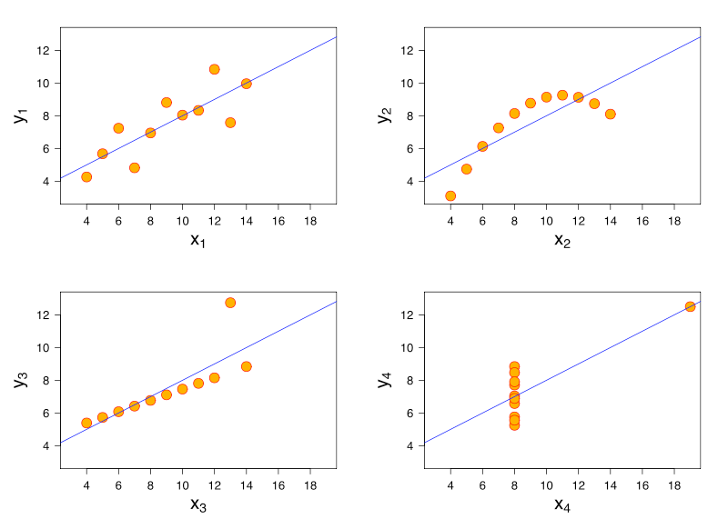{width="70%" fig-alt="TODO: describe image"}

- But three of these are clearly garbage!

---

## Quick method: "eye squared" test

:::: {.columns}
::: {.column width="55%"}
- We can plot the "pulls" for each data point: "how many sigmas" between measurements and model.
  - Most points should be within $ \pm 1 \sigma $ (68% of the time)
  - Some points within $ \pm 2 \sigma $ (95% of the time)
  - Few points within $ \pm 3 \sigma $ (99.7% of the time)
  - See [68-95-99.7 rule](https://en.wikipedia.org/wiki/68%E2%80%9395%E2%80%9399.7_rule)
:::
::: {.column width="45%"}
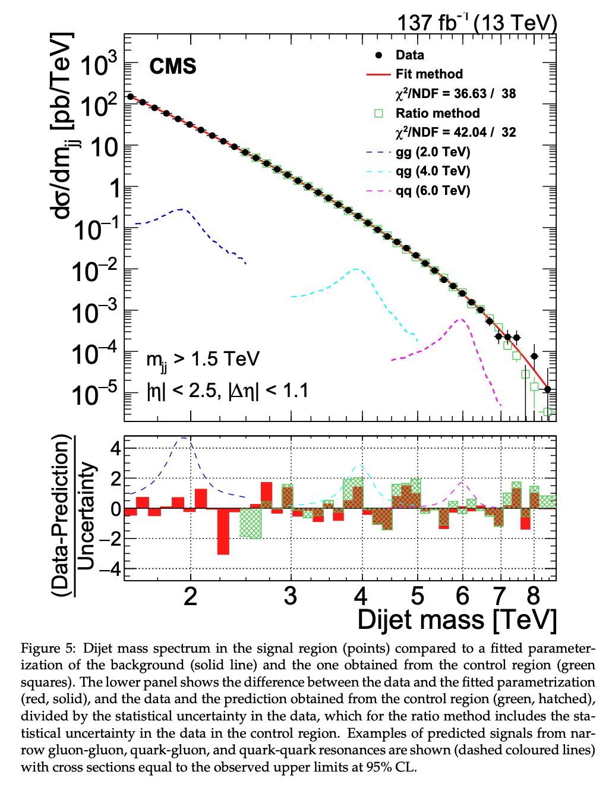{width="100%" fig-alt="TODO: describe image"}
:::
::::

---

## Quality of fit

<!-- TODO: complex slide layout (flagged by detect_complex_slide.py - see run log). Content below is complete but UNARRANGED - needs manual layout to match the original slide. -->

- We quantify the "goodness of fit" using the chi-squared per degree of freedom.
  - Each measurement represents a single sampling from a Gaussian distribution.
  - (Provided we've done a good job estimating uncertainties: reasonably Gaussian, correct $ \sigma $).
  - Each measurement should contribute about $1 \sigma $ to the ${ \chi }^{2}$ on average.
- More precisely: if we estimate the uncertainties correctly, the $\frac{{ \chi }^{2}}{ \nu }$ for a given experiment should follow a [chi-squared distribution](https://en.wikipedia.org/wiki/Chi-squared_distribution).

- $${ \chi }^{2}/ \nu =\frac{1}{N-2}\mathop{\mathop{ \sum }\limits_{i=0}}\limits^{N-1}{\left( \frac{{y}_{i}-f({x}_{i})}{{ \sigma }_{i}} \right)}^{2}$$

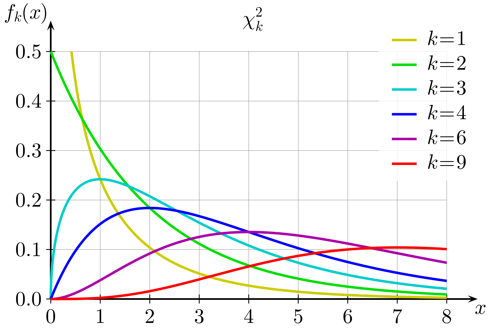{fig-alt="TODO"}

---

## chi squared distribution

:::: {.columns}
::: {.column width="55%"}
- Let's say we have $k$ independent, standard normal variables, ${Z}_{i}$.
  - Standard normal: Gaussian distribution with $ \mu =0$ and $ \sigma =1$.
  - Corresponds to $\frac{{y}_{i}-f({x}_{i})}{{ \sigma }_{i}}$
- Define the sum of squares: $X=\mathop{\mathop{ \sum }\limits_{i=0}}\limits^{k-1}{Z}_{i}^{2}$.
- $X$ follows a chi squared distribution for $k$ degrees of freedom.
- ${ \chi }^{2}/\text{ndof} \approx 1$ is a good rule of thumb, but in general, you should consider the actual distribution.
- $${ \chi }^{2}/ \nu =\frac{1}{N-2}\mathop{\mathop{ \sum }\limits_{i=0}}\limits^{N-1}\left( {\frac{{y}_{i}-f({x}_{i})}{{ \sigma }_{i}}}^{2} \right)$$
:::
::: {.column width="45%"}
{width="100%" fig-alt="TODO: describe image"}
:::
::::

---

## chi squared distribution

<!-- TODO: complex slide layout (flagged by detect_complex_slide.py - see run log). Content below is complete but UNARRANGED - needs manual layout to match the original slide. -->

- You will often see the cumulative distribution function (CDF), besides the PDF.
  - Or converted to p values.
- See also: Kolmogorov-Smirnov test.

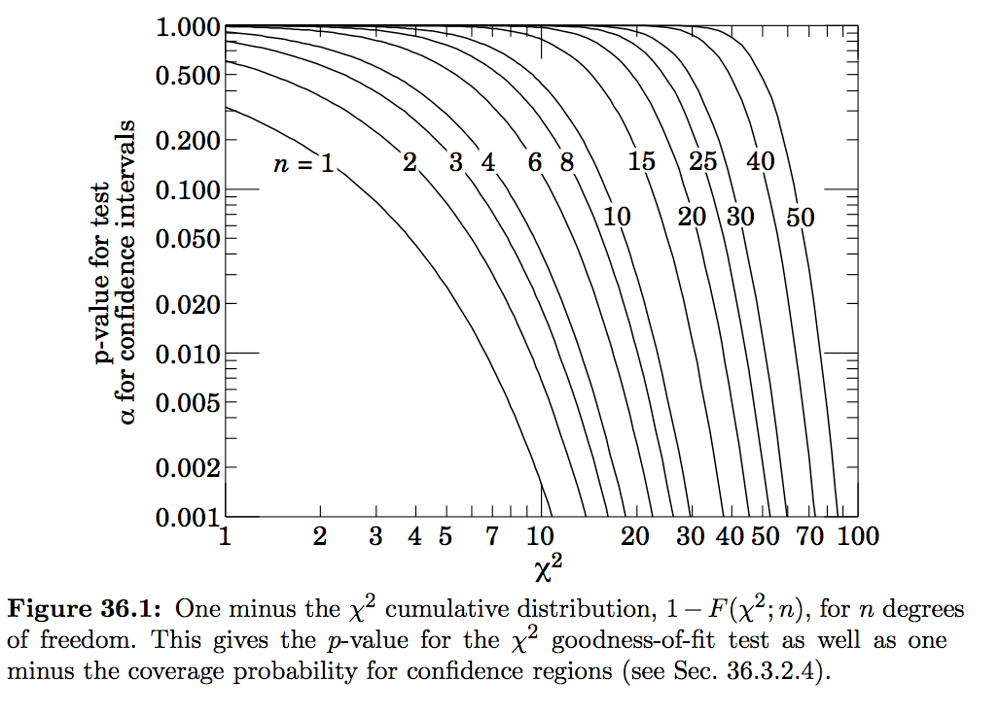{fig-alt="TODO"}

{fig-alt="TODO"}

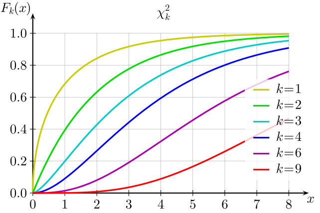{fig-alt="TODO"}

- $$\begin{matrix}
{F}_{X}(x) & =P(X \leq x) \\
 & ={ \int }_{- \infty }^{x}{f}_{X}(t)dt
\end{matrix}$$

---

## Concepts to code

- OK : moment of truth. Let's discover the expansion of the universe!
- We have two cases : with, and without uncertainties
- Let’s do without first, it’s easier.

---

## Concepts to code

- Step 1 : Write the algorithm down on paper
- Step 2 :
  - If you don’t understand everything : goto step 1
  - else : continue
- Step 3 : write pseudocode
- Step 4 : continue
  - If you don’t understand everything : goto step 3
  - else : continue
- Step 5 : write code
- Step 6 : check code with unit tests
  - Check “pass” criterion
  - Check “fail” criterion
  - If unit test fails : goto Step 5
  - else : continue
- Step 7 : Publish!

{width="70%" fig-alt="TODO: describe image"}

---

## Concepts to pseudo-code

- $$\begin{matrix}
{s}_{x} & =\mathop{\mathop{ \sum }\limits_{i=0}}\limits^{N-1}{x}_{i},{s}_{y}=\mathop{\mathop{ \sum }\limits_{i=0}}\limits^{N-1}{y}_{i} \\
{s}_{xx} & =\mathop{\mathop{ \sum }\limits_{i=0}}\limits^{N-1}{x}_{i}^{2},{s}_{xy}=\mathop{\mathop{ \sum }\limits_{i=0}}\limits^{N-1}{x}_{i}{y}_{i}
\end{matrix}$$

- $$\begin{matrix}
a & =\frac{{s}_{xx}{s}_{y}-{s}_{x}{s}_{xy}}{n{s}_{xx}-{s}_{x}^{2}} \\
b & =\frac{n{s}_{xy}-{s}_{x}{s}_{y}}{n{s}_{xx}-{s}_{x}^{2}}
\end{matrix}$$

- input data
- n = size of data
- if n < 2 :
- raise ValueError("Not enough points")
- for i = 0... N-1 :
- s_x += x_i
- s_y += y_i
- s_xx += x_i**2
- s_xy += x_i*y_i
- den = n * s_xx - s_x*s_x
- a = (s_xx * s_y - s_x * s_xy) / den
- b = (n*s_xy - s_x * s_y) / den
- for i = 0... N-1 :
- sigma2 += (y_i - (a*x_i+b))**2
- sigma2 = sigma2 / (n-2)

---

## Concepts to pseudo-code

<!-- TODO: complex slide layout (flagged by detect_complex_slide.py - see run log). Content below is complete but UNARRANGED - needs manual layout to match the original slide. -->

- input data
- n = size of data
- if n < 2 :
- raise ValueError("Not enough points")
- for i = 0... N-1 :
- s_x += x_i
- s_y += y_i
- s_xx += x_i**2
- s_xy += x_i*y_i
- den = n * s_xx - s_x*s_x
- a = (s_xx * s_y - s_x * s_xy) / den
- b = (n*s_xy - s_x * s_y) / den
- for i = 0... N-1 :
- sigma2 += (y_i - (a*x_i+b))**2
- sigma2 = sigma2 / (n-2)

- $$\begin{matrix}
{s}_{x} & =\mathop{\mathop{ \sum }\limits_{i=0}}\limits^{N-1}{x}_{i},{s}_{y}=\mathop{\mathop{ \sum }\limits_{i=0}}\limits^{N-1}{y}_{i} \\
{s}_{xx} & =\mathop{\mathop{ \sum }\limits_{i=0}}\limits^{N-1}{x}_{i}^{2},{s}_{xy}=\mathop{\mathop{ \sum }\limits_{i=0}}\limits^{N-1}{x}_{i}{y}_{i}
\end{matrix}$$

- $$\begin{matrix}
a & =\frac{{s}_{xx}{s}_{y}-{s}_{x}{s}_{xy}}{n{s}_{xx}-{s}_{x}^{2}} \\
b & =\frac{n{s}_{xy}-{s}_{x}{s}_{y}}{n{s}_{xx}-{s}_{x}^{2}}
\end{matrix}$$

{fig-alt="TODO"}

- Potential failure condition: den = 0
- What does this physically correspond to?

---

## Concepts to pseudo-code

- input data
- n = size of data
- if n < 2 :
- raise ValueError("Not enough points")
- for i = 0... N-1 :
- s_x += x_i
- s_y += y_i
- s_xx += x_i**2
- s_xy += x_i*y_i
- den = n * s_xx - s_x*s_x
- if den == 0:
- raise ValueError("Variance of x is zero")
- a = (s_xx * s_y - s_x * s_xy) / den
- b = (n*s_xy - s_x * s_y) / den
- for i = 0... N-1 :
- sigma2 += (y_i - (a*x_i+b))**2
- sigma2 = sigma2 / (n-2)

- $$\begin{matrix}
{s}_{x} & =\mathop{\mathop{ \sum }\limits_{i=0}}\limits^{N-1}{x}_{i},{s}_{y}=\mathop{\mathop{ \sum }\limits_{i=0}}\limits^{N-1}{y}_{i} \\
{s}_{xx} & =\mathop{\mathop{ \sum }\limits_{i=0}}\limits^{N-1}{x}_{i}^{2},{s}_{xy}=\mathop{\mathop{ \sum }\limits_{i=0}}\limits^{N-1}{x}_{i}{y}_{i}
\end{matrix}$$

- $$\begin{matrix}
a & =\frac{{s}_{xx}{s}_{y}-{s}_{x}{s}_{xy}}{n{s}_{xx}-{s}_{x}^{2}} \\
b & =\frac{n{s}_{xy}-{s}_{x}{s}_{y}}{n{s}_{xx}-{s}_{x}^{2}}
\end{matrix}$$

---

## Concepts to code

- Step 1 : Write the algorithm down on paper
- Step 2 :
  - If you don’t understand everything : goto step 1
  - else : continue
- Step 3 : write pseudocode
- Step 4 : continue
  - If you don’t understand everything : goto step 3
  - else : continue
- Step 5 : write code
- Step 6 : check code with unit tests
  - Check “pass” criterion
  - Check “fail” criterion
  - If unit test fails : goto Step 5
  - else : continue
- Step 7 : Publish!

{width="70%" fig-alt="TODO: describe image"}

---

## Pseudo-code to code

- input data
- n = size of data
- if n < 2 :
- raise ValueError("Not enough points")
- for i = 0... N-1 :
- s_x += x_i
- s_y += y_i
- s_xx += x_i**2
- s_xy += x_i*y_i
- den = n * s_xx - s_x*s_x
- if den == 0:
- raise ValueError("Variance of x is zero")
- a = (s_xx * s_y - s_x * s_xy) / den
- b = (n*s_xy - s_x * s_y) / den
- for i = 0... N-1 :
- sigma2 += (y_i - (a*x_i+b))**2
- sigma2 = sigma2 / (n-2)

- if len(x) <= 1:
  - raise ValueError("Not enough points")
- s_x = np.sum(x)
- s_y = np.sum(y)
- s_xx = np.sum(x*x)
- s_xy = np.sum(x*y)
- den = n * s_xx - (s_x * s_x)
- if den == 0:
  - raise ValueError("Variance of x is zero")
- a = (s_xx * s_y - s_x * s_xy) / den
- b = (n*s_xy - s_x * s_y) / den

---

## Hands on

- Try it out!
  - Do a git pull, as usual.
- CompPhys/DataAnalysis/Fitting/hubble.ipynb
  - We already wrote the least squares fit into least_squares.py
- Besides running the notebook...
  - Try timing our least_squares() vs. numpy.
  - Try adding the covariance or correlation (see Numerical Recipes).

---

## Once again, with uncertainties

- $$S=\mathop{\mathop{ \sum }\limits_{i=0}}\limits^{N-1}\frac{1}{{ \sigma }_{i}^{2}},{S}_{x}=\mathop{\mathop{ \sum }\limits_{i=0}}\limits^{N-1}\frac{{x}_{i}}{{ \sigma }_{i}^{2}},{S}_{y}=\mathop{\mathop{ \sum }\limits_{i=0}}\limits^{N-1}\frac{{y}_{i}}{{ \sigma }_{i}^{2}}$$

- $${t}_{i}=\frac{1}{{ \sigma }_{i}}\left( {x}_{i}-\frac{{S}_{x}}{S} \right),{S}_{tt}=\mathop{\mathop{ \sum }\limits_{i=0}}\limits^{N-1}{t}_{i}^{2},$$

- $$\begin{matrix}
b & =\frac{1}{{S}_{tt}}\mathop{\mathop{ \sum }\limits_{i=0}}\limits^{N-1}\frac{{t}_{i}{y}_{i}}{{ \sigma }_{i}} \\
a & =\frac{{S}_{y}-{S}_{x}b}{S} \\
{ \sigma }_{a}^{2} & =\frac{1}{S}\left( 1+\frac{{S}_{x}^{2}}{S{S}_{tt}} \right) \\
{ \sigma }_{b}^{2} & =\frac{1}{{S}_{tt}} \\
\text{Cov}(a,b) & =-\frac{{S}_{x}}{S{S}_{tt}}
\end{matrix}$$

- input data
- n = size of data
- if n < 2 :
- print ‘Error! Not enough data!’
- return
- for i = 0... N-1 :
- if abs( sigma_i ) < 0.00001 :
- return
- S += 1.0 / sigma_i**2
- s_x += x_i / sigma_i**2
- s_y += y_i / sigma_i**2
- for i = 0... N-1 :
- t_i = 1.0 / sigma_i * (x_i-s_x/S)
- s_tt = t_i**2
- b += t_i * y_i / sigma_i
- if abs( S ) < 0.000001 :
- return
- a = (s_y - s_x * b) / S
- b = b / s_tt
- sigma_a2 = (1 + s_x**2/S*s_tt) / S
- sigma_b2 = 1.0 / s_tt
- for i = 0... N-1 :
- chi2 += ((y_i - a - b*x_i)/sigma_i)**2

---

## Once again, with uncertainties

<!-- TODO: complex slide layout (flagged by detect_complex_slide.py - see run log). Content below is complete but UNARRANGED - needs manual layout to match the original slide. -->

- $$S=\mathop{\mathop{ \sum }\limits_{i=0}}\limits^{N-1}\frac{1}{{ \sigma }_{i}^{2}},{S}_{x}=\mathop{\mathop{ \sum }\limits_{i=0}}\limits^{N-1}\frac{{x}_{i}}{{ \sigma }_{i}^{2}},{S}_{y}=\mathop{\mathop{ \sum }\limits_{i=0}}\limits^{N-1}\frac{{y}_{i}}{{ \sigma }_{i}^{2}}$$

- $${t}_{i}=\frac{1}{{ \sigma }_{i}}\left( {x}_{i}-\frac{{S}_{x}}{S} \right),{S}_{tt}=\mathop{\mathop{ \sum }\limits_{i=0}}\limits^{N-1}{t}_{i}^{2},$$

- $$\begin{matrix}
b & =\frac{1}{{S}_{tt}}\mathop{\mathop{ \sum }\limits_{i=0}}\limits^{N-1}\frac{{t}_{i}{y}_{i}}{{ \sigma }_{i}} \\
a & =\frac{{S}_{y}-{S}_{x}b}{S} \\
{ \sigma }_{a}^{2} & =\frac{1}{S}\left( 1+\frac{{S}_{x}^{2}}{S{S}_{tt}} \right) \\
{ \sigma }_{b}^{2} & =\frac{1}{{S}_{tt}} \\
\text{Cov}(a,b) & =-\frac{{S}_{x}}{S{S}_{tt}}
\end{matrix}$$

- input data
- n = size of data
- if n < 2 :
- print ‘Error! Not enough data!’
- return
- for i = 0... N-1 :
- if abs( sigma_i ) < 0.00001 :
- return
- S += 1.0 / sigma_i**2
- s_x += x_i / sigma_i**2
- s_y += y_i / sigma_i**2
- for i = 0... N-1 :
- t_i = 1.0 / sigma_i * (x_i-s_x/S)
- s_tt = t_i**2
- b += t_i * y_i / sigma_i
- if abs( S ) < 0.000001 :
- return
- a = (s_y - s_x * b) / S
- b = b / s_tt
- sigma_a2 = (1 + s_x**2/S*s_tt) / S
- sigma_b2 = 1.0 / s_tt
- for i = 0... N-1 :
- chi2 += ((y_i - a - b*x_i)/sigma_i)**2

{fig-alt="TODO"}

{fig-alt="TODO"}

---

## Once again, with uncertainties

- $$S=\mathop{\mathop{ \sum }\limits_{i=0}}\limits^{N-1}\frac{1}{{ \sigma }_{i}^{2}},{S}_{x}=\mathop{\mathop{ \sum }\limits_{i=0}}\limits^{N-1}\frac{{x}_{i}}{{ \sigma }_{i}^{2}},{S}_{y}=\mathop{\mathop{ \sum }\limits_{i=0}}\limits^{N-1}\frac{{y}_{i}}{{ \sigma }_{i}^{2}}$$

- $${t}_{i}=\frac{1}{{ \sigma }_{i}}\left( {x}_{i}-\frac{{S}_{x}}{S} \right),{S}_{tt}=\mathop{\mathop{ \sum }\limits_{i=0}}\limits^{N-1}{t}_{i}^{2},$$

- $$\begin{matrix}
b & =\frac{1}{{S}_{tt}}\mathop{\mathop{ \sum }\limits_{i=0}}\limits^{N-1}\frac{{t}_{i}{y}_{i}}{{ \sigma }_{i}} \\
a & =\frac{{S}_{y}-{S}_{x}b}{S} \\
{ \sigma }_{a}^{2} & =\frac{1}{S}\left( 1+\frac{{S}_{x}^{2}}{S{S}_{tt}} \right) \\
{ \sigma }_{b}^{2} & =\frac{1}{{S}_{tt}} \\
\text{Cov}(a,b) & =-\frac{{S}_{x}}{S{S}_{tt}}
\end{matrix}$$

- if S == 0:
  - raise ValueError("Uncertainties are too big") ?
  - # Will never happen! Instead, check S/S_x?
- if S_tt == 0:
  - raise ValueError("x_i variance is zero")
- if sigma_a2 < 0:
  - ...
- if sigma_b2 < 0:
  - ...

---

## Once again, with uncertainties

<!-- TODO: complex slide layout (flagged by detect_complex_slide.py - see run log). Content below is complete but UNARRANGED - needs manual layout to match the original slide. -->

- $$S=\mathop{\mathop{ \sum }\limits_{i=0}}\limits^{N-1}\frac{1}{{ \sigma }_{i}^{2}},{S}_{x}=\mathop{\mathop{ \sum }\limits_{i=0}}\limits^{N-1}\frac{{x}_{i}}{{ \sigma }_{i}^{2}},{S}_{y}=\mathop{\mathop{ \sum }\limits_{i=0}}\limits^{N-1}\frac{{y}_{i}}{{ \sigma }_{i}^{2}}$$

- $${t}_{i}=\frac{1}{{ \sigma }_{i}}\left( {x}_{i}-\frac{{S}_{x}}{S} \right),{S}_{tt}=\mathop{\mathop{ \sum }\limits_{i=0}}\limits^{N-1}{t}_{i}^{2},$$

- $$\begin{matrix}
b & =\frac{1}{{S}_{tt}}\mathop{\mathop{ \sum }\limits_{i=0}}\limits^{N-1}\frac{{t}_{i}{y}_{i}}{{ \sigma }_{i}} \\
a & =\frac{{S}_{y}-{S}_{x}b}{S} \\
{ \sigma }_{a}^{2} & =\frac{1}{S}\left( 1+\frac{{S}_{x}^{2}}{S{S}_{tt}} \right) \\
{ \sigma }_{b}^{2} & =\frac{1}{{S}_{tt}} \\
\text{Cov}(a,b) & =-\frac{{S}_{x}}{S{S}_{tt}}
\end{matrix}$$

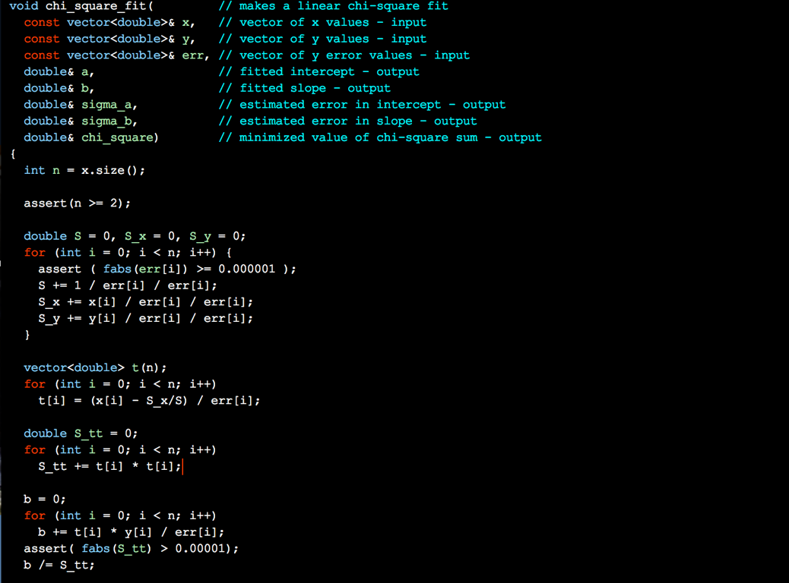{fig-alt="TODO"}

---

## Aside: error handling

- If you have a condition that your algorithm must fulfill, you can use a few C++ mechanisms to handle this.
- Python handles exceptions on its own.
- C++ behavior there is undefined, and compiler dependent!
- Simple way: “assert(condition)” to make sure it’s true
- Better: use exceptions.
  - Exceptions are for runtime errors.
  - Assertions are for coding errors. For *your* mistakes, not the users'.
  - Your production code should function just as well with your assertions removed.

---

## Data with uncertainties: Type 1a supernovae

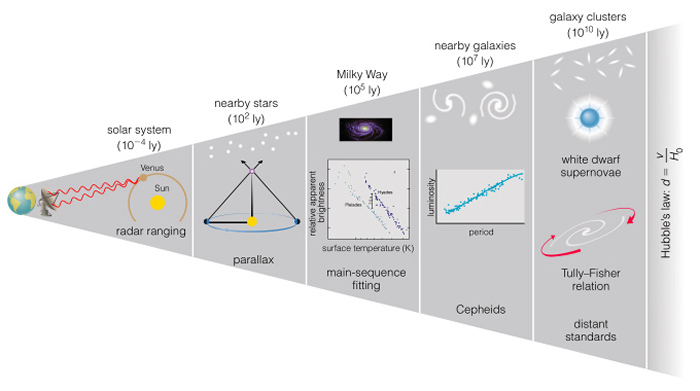{width="70%" fig-alt="TODO: describe image"}

{width="70%" fig-alt="TODO: describe image"}

---

## Data with uncertainties: Type 1a supernovae

:::: {.columns}
::: {.column width="55%"}
- Main sequences stars with $M \in  \sim [0.07{M}_{ \odot },10{M}_{ \odot }]$ end up as white dwarfs: a stellar core remnant supported by electron degeneracy.
- White dwarfs in binary star systems can accrete matter from their friend.
- Type 1a supernova: when the white dwarf reaches a "critical mass" (~Chandrasekhar limit), they explode!
- Super useful fact: the physics of the process is very similar across stars, so they all have a similar peak luminosity.
- Using $m-M$, we can calculate distance!
- SN 1604 (discovered by Johannes Kepler)
:::
::: {.column width="45%"}
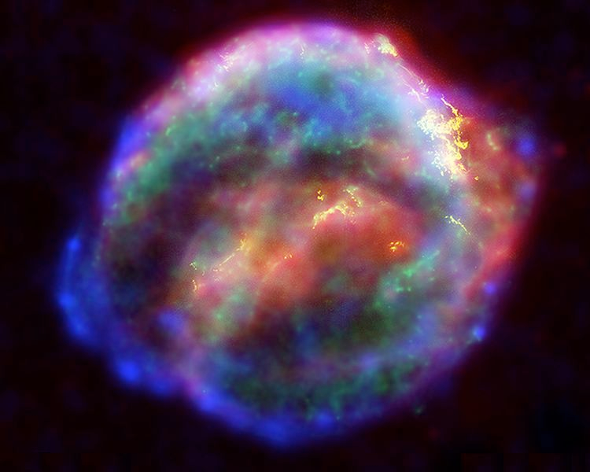{width="100%" fig-alt="TODO: describe image"}
:::
::::

---

## Calculating distance from magnitude

:::: {.columns}
::: {.column width="55%"}
- Apparent magnitude ($m$): the visible brightness of an object to us humans.
  - Logarithmic scale: a difference of 5 in magnitude corresponds to a factor of 100 in luminosity.
  - m=1 is 100x as bright as m=6.
  - $m=-5{log}_{100}(F/{F}_{0})=-2.5{log}_{10}(F/{F}_{0})$, where $F$ is flux normalized to some arbitrary ${F}_{0}$
- Absolute magnitude $(M)$: the intrinsic brightness of an object, defined as $m$ when viewed from 10 parsecs.
:::
::: {.column width="45%"}
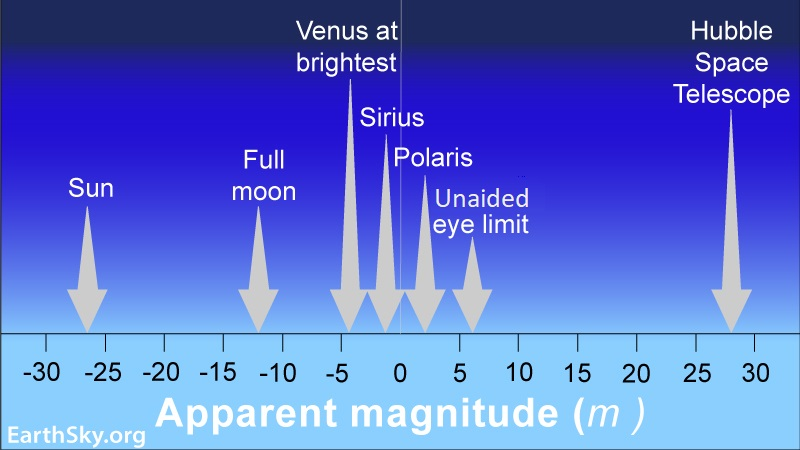{width="100%" fig-alt="TODO: describe image"}
:::
::::

---

## Calculating distance from magnitude

- Inverse square law: $\frac{F(r)}{F({r}_{0})}=\frac{{r}_{0}^{2}}{{r}^{2}}$
- $$F(r)={F}_{0} \times {10}^{-m/2.5}$$
- $$F({r}_{0}=10\text{pc})={F}_{0} \times {10}^{-M/2.5}$$
- $$\frac{F(r)}{F({r}_{0}=10\text{pc})}={10}^{(M-m)/2.5}=\frac{{r}_{0}^{2}}{{r}^{2}}$$
- $$r={10}^{(m-M)/5+1}$$
- Note: define distance modulus, $ \mu =m-M=5{log}_{10}(r/10\text{pc})$

---

## Supernova data

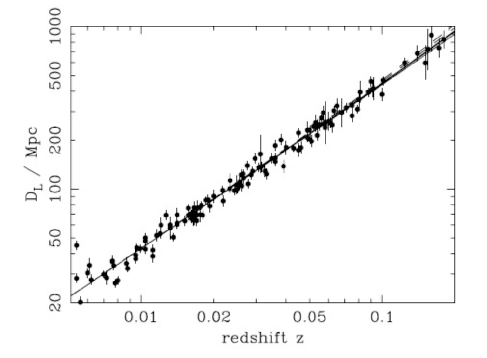{width="70%" fig-alt="TODO: describe image"}

---

## Supernova data

<!-- TODO: complex slide layout (flagged by detect_complex_slide.py - see run log). Content below is complete but UNARRANGED - needs manual layout to match the original slide. -->

{fig-alt="TODO"}

- $$ \mu =25+5{log}_{10}\left( \frac{cz}{{H}_{0}} \right)+1.086(1-{q}_{0})z+...$$

- Remember, redshift is a function of velocity:

- $$z+1=\frac{{ \nu }_{1}}{{ \nu }_{2}} \approx 1+\frac{v}{c}$$

---

## Hands on

- Try it out!
- CompPhys/DataAnalysis/Fitting/supernova.ipynb
  - We already wrote the chi squared fit into chi_squared.py
  - Besides just running the notebook...
    - Try calculating a p-value for the fit (you can use scipy.stats.chi2.cdf(), [https://docs.scipy.org/doc/scipy/reference/generated/scipy.stats.chi2.html](https://docs.scipy.org/doc/scipy/reference/generated/scipy.stats.chi2.html))

---

## Accelerating expansion

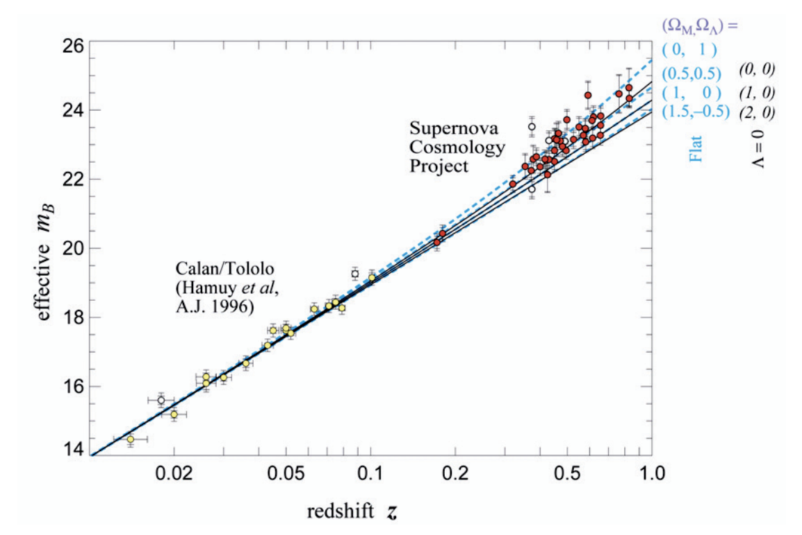{width="70%" fig-alt="TODO: describe image"}

- As you may know, it turns out a linear fit breaks down for our universe :)
- The expansion of the universe appears to be accelerating!
  - This is dark energy.
- [https://www.nobelprize.org/uploads/2018/06/perlmutter-lecture.pdf](https://www.nobelprize.org/uploads/2018/06/perlmutter-lecture.pdf)

---

## Fitting more than lines

- Naive physicist: fitting a line is trivial! I doubt I'll make much real use of this.
- Computational physicist: the linear fitting algorithm is simple, robust, and fast. Can I use it for my problem?
- In other words: can you transform your data into a linear problem.
  - Example: model predicts $y=a{e}^{bx}$? Then fit log(y)!

---

## Fitting more than lines

- Naive physicist: fitting a line is trivial! I doubt I'll make much real use of this.
- Computational physicist: the linear fitting algorithm is simple, robust, and fast. Can I use it for my problem?
- In other words: can you transform your data into a linear problem.
  - Example: model predicts $y=a{e}^{bx}$? Then fit log(y)
- Two cases:
  - Can we transform x and y to get a linear problem?
  - Everything else. This is conceptually similar, but computationally much more expensive.

---

## Transforming to linear example

- Say we have a model like $y=a{e}^{bx}$
- What do we do?
- Take the logarithm of both sides!
  - $$lny=lna+bx$$

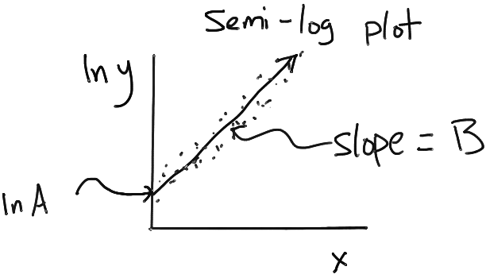{width="70%" fig-alt="TODO: describe image"}

---

## Transforming to linear example

- $$y=a{x}^{N}$$
- What do we do?
- Take the logarithm of both sides!
  - $$lny=lna+Nlnx$$

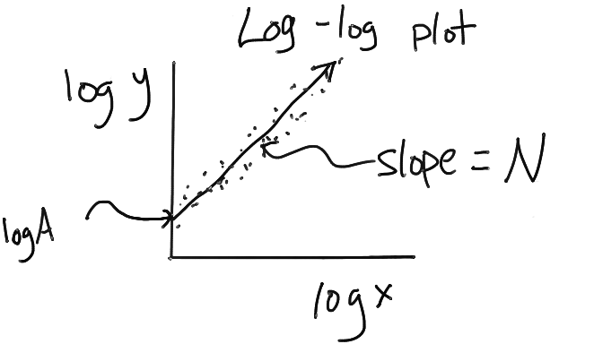{width="70%" fig-alt="TODO: describe image"}

---

## Transforming to linear example

- What about the uncertainties?
- We did a change of variables (${y}^{′}=f(y)$), so you know how to propagate the uncertainties!
  - $${ \sigma }_{{y}^{′}}^{2}={\left( \frac{ \partial f}{ \partial y} \right)}^{2}{ \sigma }_{y}^{2}$$
- So you just have to remember this in the chi-squared minimization.
- Example: if ${y}^{′}=lny$, then ${ \sigma }_{{y}^{′}}={ \sigma }_{y}/|y|$

---

## Earthquake data

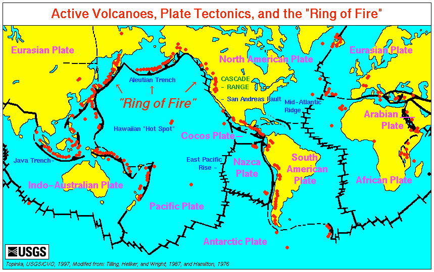{width="70%" fig-alt="TODO: describe image"}

- Earthquakes occur when tectonic plates of the earth move relative to one another

---

## Earthquake data

<!-- TODO: complex slide layout (flagged by detect_complex_slide.py - see run log). Content below is complete but UNARRANGED - needs manual layout to match the original slide. -->

- When they rub against each other, they get stuck!
- Builds pressure, then slips, releasing a lot of energy.
- Seismographs can measure the vibrations on the surface.

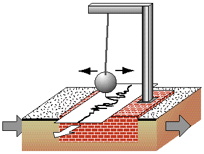{fig-alt="TODO"}

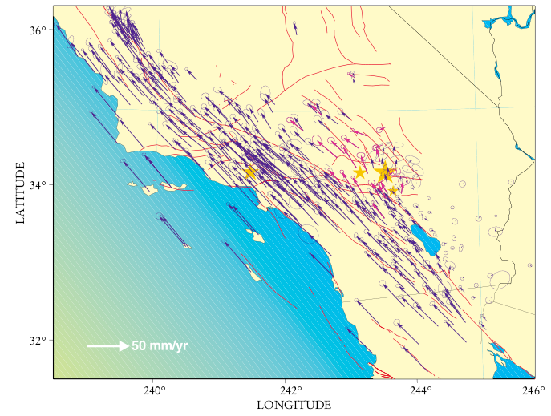{fig-alt="TODO"}

- Magnitude is related to the squared
- amplitude over the event!

- H. Kanamori and E.E. Brodsky, [The Physics of Earthquakes](http://dx.doi.org/10.1063/1.1387590), Physics Today 54, 34-40 (2001)
[http://www.colorado.edu/physics/phys2900/homepages/Marianne.Hogan/graphs.html](http://www.colorado.edu/physics/phys2900/homepages/Marianne.Hogan/graphs.html)

---

## Richter scale

<!-- TODO: complex slide layout (flagged by detect_complex_slide.py - see run log). Content below is complete but UNARRANGED - needs manual layout to match the original slide. -->

- The “Richter scale” was developed by Richter in the 1930’s
  - This is the LOCAL magnitude scale, ${M}_{L}$
  - Defined by the amount of amplitude variation on a seismograph
- Replaced in the 1970’s by the MOMENT magnitude scale
  - ${M}_{0}= \mu SD$: rigidity * area of fault * displacement
- Gutenberg-Richter Law Model:
  - Frequency (N) of earthquakes of magnitude (M), defined as number of events with magnitude >= M
  - Empirical model:

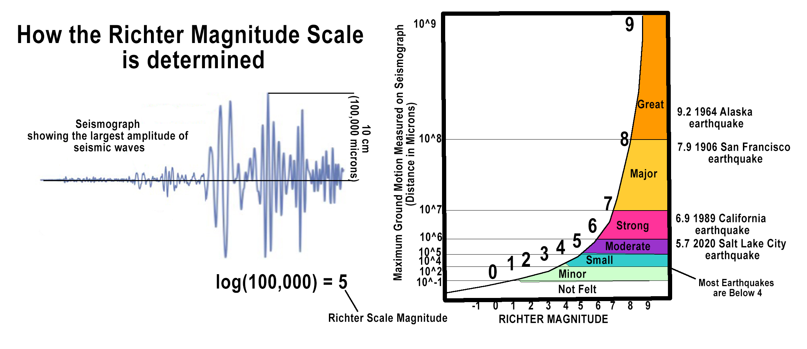{fig-alt="TODO"}

- $$log(N)=a-b(M)$$
{fig-alt="TODO"}

- Note: $M \sim log{M}_{0}$

---

## Some data

<!-- TODO: complex slide layout (flagged by detect_complex_slide.py - see run log). Content below is complete but UNARRANGED - needs manual layout to match the original slide. -->

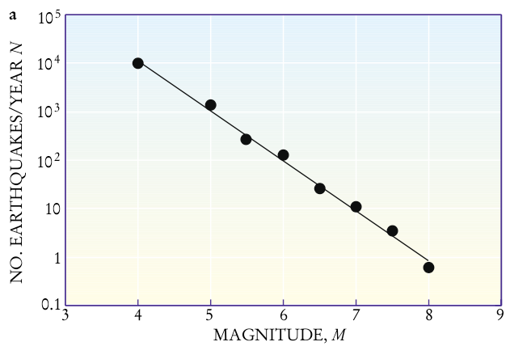{fig-alt="TODO"}

- Frequency vs magnitude plot of earthquakes between 1904 and 2000 :

- H. Kanamori and E.E. Brodsky, [The Physics of Earthquakes](http://dx.doi.org/10.1063/1.1387590), Physics Today 54, 34-40 (2001)

---

## More data

- Get data from here: [https://www.usgs.gov/programs/earthquake-hazards/earthquakes](https://www.usgs.gov/programs/earthquake-hazards/earthquakes)
- Many formats for the data file :
  - Map & List
  - CSV (comma-separated values)
  - KML (google-based geographical data representation)
  - QuakeML (XML for earthquakes)
  - GeoJSON (JSON for earthquakes)
- We’ll go for CSV:

- :time,latitude,longitude,depth,mag,magType,nst,gap,dmin,rms,net,id,updated,place,type
- 2010-01-01T02:33:42.590Z,32.476,-115.19,1.5,3.2,ml,22,175.8,,,pde,pde20100101023342590_1,2013-03-16T01:48:06.208Z,"Baja California, Mexico",earthquake
- 2010-01-01T02:55:04.280Z,35.979,-117.321,0.8,2.8,ml,17,51.2,,,pde,pde20100101025504280_0,2013-03-16T01:48:06.336Z,"Central California",earthquake
- 2010-01-01T03:25:29.970Z,36.031,-117.784,3.2,2.9,ml,13,50.8,,,pde,pde20100101032529970_3,2013-03-16T01:48:06.354Z,"Central California",earthquake
- 2010-01-01T14:06:45.100Z,32.474,-115.215,8,3.1,ml,7,176.3,,,pde,pde20100101140645100_8,2013-03-16T01:48:06.753Z,"Baja California, Mexico",earthquake
- 2010-01-02T03:15:45.200Z,33.576,-118.889,11.4,2.8,ml,7,252.5,,,pde,pde20100102031545200_11,2013-03-16T01:48:07.298Z,"Channel Islands region,

---

## More data

<!-- TODO: complex slide layout (flagged by detect_complex_slide.py - see run log). Content below is complete but UNARRANGED - needs manual layout to match the original slide. -->

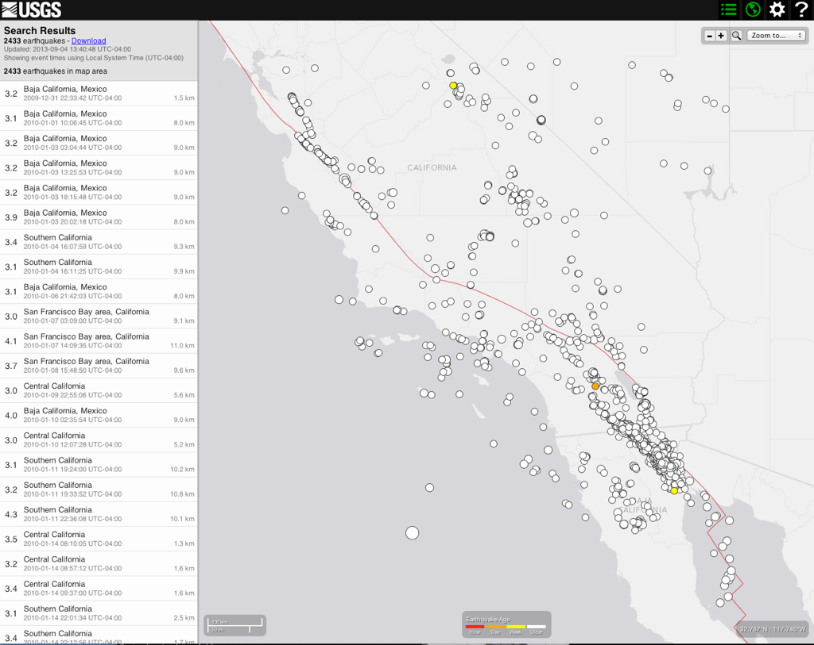{fig-alt="TODO"}

{fig-alt="TODO"}

---

## More data

- The data we’ll fit : all earthquakes in southern California from 1973 until today

{width="70%" fig-alt="TODO: describe image"}

---

## Pseudocode, aka the big picture

- Read in earthquake data
- Compute N( >= M)
- Transform to linear form
- Fit via least-squares

---

## Pseudocode, aka the big picture

- Read in earthquake data
- Compute N( >= M)
- Transform to linear form
- Fit via least-squares

- input data
- n = size of data
- if n < 2 :
- print ‘Error! Not enough data!’
- return
- for i = 0... N-1 :
- s_x += x_i
- s_y += y_i
- s_xx += x_i**2
- s_xy += x_i*y_i
- den = n * s_xx - s_x*s_x
- if abs( den ) < 0.000001 :
- print ‘Error! Denominator is zero!’
- return
- a = (s_xx * s_y - s_x * s_xy) / den
- b = (n*s_xy - s_x * s_y) / den
- for i = 0... N-1 :
- sigma2 += (y_i - (a*x_i+b))**2
- sigma2 = sigma2 / (n-2)

- open file
- get lines
- if error : exit
- else :
- for line in lines :
- parse value
- record number, magnitude

- for each number,magnitude pair :
- y = log(number)
- x = magnitude

- N(M) = number with magnitude >= M

---

## Issues with logs

:::: {.columns}
::: {.column width="55%"}
- Logarithms cannot be <= 0
- Always need to be aware of this!
- Other than that, very nice 
because it transforms 
multiplication into addition!
:::
::: {.column width="45%"}
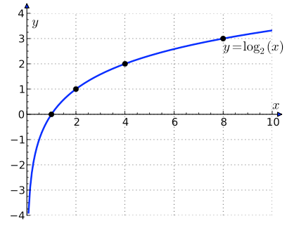{width="100%" fig-alt="TODO: describe image"}
:::
::::

---

## Warning: binned data

- Be sure to be careful about fitting histograms vs. points!
  - Bins are not points! Think about your data. What should the x coordinate be?

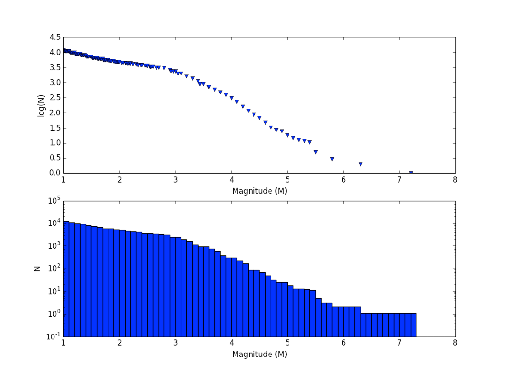{width="70%" fig-alt="TODO: describe image"}

- least_squares fit to data:
- slope b = -0.657 +-  0.014
- intercept a =  4.914 +-  0.036
- log_10(N) error bar =  0.214

- least_squares fit to data:
- slope b = -0.795 +-  0.019
- intercept a =  5.349 +-  0.084
- log_10(N) error bar =  0.271

---

## (More) general curve fitting

- [https://github.com/ubsuny/CompPhys/tree/main/DataAnalysis/Fitting](https://github.com/ubsuny/CompPhys/tree/main/DataAnalysis/Fitting)

---

## Generalized least squares

- Let's consider a more general case:
  - Arbitrary number of fit parameters: $(a,b) \rightarrow \mathop{a}\limits^{⃗}$
  - Fit function = $y(x;\mathop{a}\limits^{⃗})$ ("y is a function of x, with parameters $\mathop{a}\limits^{⃗}$")
- Our tool for generalizing is the chi-squared function, now a function of $\mathop{a}\limits^{⃗}$
  - $${ \chi }^{2}(\mathop{a}\limits^{⃗})=\mathop{\mathop{ \sum }\limits_{i=0}}\limits^{N-1}{\left( \frac{{y}_{i}-y(x;\mathop{a}\limits^{⃗})}{{ \sigma }_{i}} \right)}^{2}$$
- So now $y(...)$ can be anything!
  - It doesn't even have to be just an equation! It can be anything you can program, for example a histogram (aka template).

---

## Generalized least squares

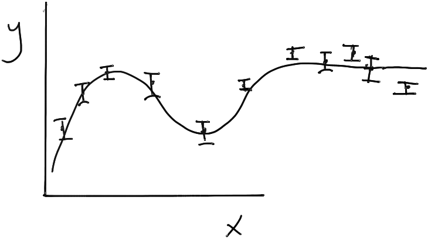{width="70%" fig-alt="TODO: describe image"}

- We are still just minimizing the distance between the points and the fit, relative to the uncertainties.

---

## Generalized least squares

- Let's consider functions that can be written as follows:

- $$y(x;\mathop{a}\limits^{⃗})=\mathop{\mathop{ \sum }\limits_{k=0}}\limits^{m-1}{a}_{k}{Y}_{k}(x)$$

- Think Taylor expansion of a function: we can model (most) functions as a sum of basis functions.
  - For example, monomials ($1,x,{x}^{2},{x}^{3},...{Y}_{k}(x)={x}^{k}$)
  - Better: Chebyshev/Bernstein/Legendre polynomials, ...

- [Stone–Weierstrass theorem](https://en.wikipedia.org/wiki/Stone%E2%80%93Weierstrass_theorem)

---

## Generalized least squares

- $$\begin{matrix}
0 & =\frac{ \partial { \chi }^{2}}{ \partial {a}_{j}}=\frac{ \partial }{ \partial {a}_{j}}\mathop{\mathop{ \sum }\limits_{i=0}}\limits^{N-1}\frac{1}{{ \sigma }_{i}^{2}}{\left[ {y}_{i}-\mathop{\mathop{ \sum }\limits_{k=0}}\limits^{M-1}{a}_{k}{Y}_{k}(x) \right]}^{2} \\
 & =-2\mathop{\mathop{ \sum }\limits_{i=0}}\limits^{N-1}\frac{1}{{ \sigma }_{i}^{2}}{Y}_{j}(x)\left[ {y}_{i}-\mathop{\mathop{ \sum }\limits_{k=0}}\limits^{M-1}{a}_{k}{Y}_{k}(x) \right]
\end{matrix}$$

- $$ \Rightarrow \mathop{\mathop{ \sum }\limits_{i=0}}\limits^{N-1}\mathop{\mathop{ \sum }\limits_{k=0}}\limits^{M-1}\frac{{Y}_{j}({x}_{i}){Y}_{k}({x}_{i})}{{ \sigma }_{i}^{2}}{a}_{k}=\mathop{\mathop{ \sum }\limits_{i=0}}\limits^{N-1}\frac{{Y}_{j}({x}_{i}){y}_{i}}{{ \sigma }_{i}^{2}}$$
{width="70%" fig-alt="TODO: describe image"}

---

## Generalized least squares

<!-- TODO: complex slide layout (flagged by detect_complex_slide.py - see run log). Content below is complete but UNARRANGED - needs manual layout to match the original slide. -->

- $$ \Rightarrow \mathop{\mathop{ \sum }\limits_{i=0}}\limits^{N-1}\mathop{\mathop{ \sum }\limits_{k=0}}\limits^{M-1}\frac{{Y}_{j}({x}_{i}){Y}_{k}({x}_{i})}{{ \sigma }_{i}^{2}}{a}_{k}=\mathop{\mathop{ \sum }\limits_{i=0}}\limits^{N-1}\frac{{Y}_{j}({x}_{i}){y}_{i}}{{ \sigma }_{i}^{2}}$$
{fig-alt="TODO"}

- We can simplify this with matrix notation. Let:

- $$\begin{matrix}
{A}_{ij}{A}_{ik}{a}_{k} & ={A}_{ij}{b}_{i}
\end{matrix}$$
{fig-alt="TODO"}

- $${A}_{ij}=\frac{{Y}_{j}({x}_{i})}{{ \sigma }_{i}},{b}_{i}=\frac{{y}_{i}}{{ \sigma }_{i}}$$

- ${A}_{ij}$ is called the design matrix.
- Let's also use Einstein summation notation
  - Any index that appears more than once is implicitly summed.

---

## Design matrix

<!-- TODO: complex slide layout (flagged by detect_complex_slide.py - see run log). Content below is complete but UNARRANGED - needs manual layout to match the original slide. -->

- $$\mathbf{A}=\left( \begin{matrix}
{Y}_{1}({x}_{1})/{ \sigma }_{1} & {Y}_{2}({x}_{1})/{ \sigma }_{1} & ... \\
{Y}_{1}({x}_{2})/{ \sigma }_{2} & {Y}_{2}({x}_{2})/{ \sigma }_{2} & ... \\
{Y}_{1}({x}_{3})/{ \sigma }_{2} & {Y}_{2}({x}_{3})/{ \sigma }_{2} & ... \\
{Y}_{1}({x}_{4})/{ \sigma }_{2} & {Y}_{2}({x}_{4})/{ \sigma }_{2} & ... \\
... & ... & ...
\end{matrix} \right)$$

- N data points

- M basis functions

- Note: $N \geq M$! Typically >>

---

## Generalized least squares

<!-- TODO: complex slide layout (flagged by detect_complex_slide.py - see run log). Content below is complete but UNARRANGED - needs manual layout to match the original slide. -->

- Finally, we can cajole the indices into a normal matrix multiplication, and solve for $\mathop{a}\limits^{⃗}$

- $$\begin{matrix}
{A}_{ij}{A}_{ik}{a}_{k} & ={A}_{ij}{b}_{i} \\
({A}^{T}{)}_{ji}{A}_{ik}{a}_{k} & =({A}^{T}{)}_{ji}{b}_{i} \\
({\mathbf{A}}^{T}\mathbf{A})\mathop{a}\limits^{⃗} & ={\mathbf{A}}^{T}\mathop{b}\limits^{⃗}
\end{matrix}$$

- $$\begin{matrix}
\mathbf{A} & =\left( \begin{matrix}
{Y}_{1}({x}_{1})/{ \sigma }_{1} & {Y}_{2}({x}_{1})/{ \sigma }_{1} & ... \\
{Y}_{1}({x}_{2})/{ \sigma }_{2} & {Y}_{2}({x}_{2})/{ \sigma }_{2} & ... \\
... & ... & ...
\end{matrix} \right) \\
{b}_{i} & ={y}_{i}/{ \sigma }_{i}
\end{matrix}$$

- $$\mathop{a}\limits^{⃗}=({\mathbf{A}}^{T}\mathbf{A}{)}^{-1}{\mathbf{A}}^{T}\mathop{b}\limits^{⃗}$$
{fig-alt="TODO"}

---

## Generalized least squares

<!-- TODO: complex slide layout (flagged by detect_complex_slide.py - see run log). Content below is complete but UNARRANGED - needs manual layout to match the original slide. -->

- What about $ \sigma ({a}_{i})$? As usual, use propagation of uncertainty... but it's a lot of algebra! See backup (or Numerical Recipes) for derivation.
- The full covariance matrix is given by:

- $$\mathop{a}\limits^{⃗}=({\mathbf{A}}^{T}\mathbf{A}{)}^{-1}{\mathbf{A}}^{T}\mathop{b}\limits^{⃗}$$
{fig-alt="TODO"}

- $$\mathbf{C} \equiv ({\mathbf{A}}^{T}\mathbf{A}{)}^{-1}$$

- I.e., the parameter uncertainties are:

- $$ \sigma ({a}_{i})={C}_{ii}$$

- And the covariances are:

- $$\text{cov}({a}_{i},{a}_{j})={C}_{ij}$$

---

## Example: polynomial fit

- Just to put all of that into context, let's write down the problem for a polynomial fit:

- $$y(x)=\mathop{\mathop{ \sum }\limits_{j=0}}\limits^{M-1}{a}_{j}{x}^{j},{Y}_{j}(x)={x}^{j}$$

- The design matrix is:

- $${A}_{ij}=\frac{{Y}_{j}({x}_{i})}{{ \sigma }_{i}}=\frac{{x}_{i}^{j}}{{ \sigma }_{i}}$$

- Note: this oftentimes is ill-formed, so don’t go too crazy here. Typically we do quadratic, cubic, quartic, but above that it strains credibility (i.e., your computer's floating point precision).
- ...OK, and we can't go much further right now, because we haven't learned how to compute ${\left( {\mathbf{A}}^{T}\mathbf{A} \right)}^{-1}$!
- We will return to this later, once we've learned some linear algebra.

---

## Demo

- Even without knowing how to compute ${\left( {\mathbf{A}}^{T}\mathbf{A} \right)}^{-1}$, we can try out the polynomial fit with numpy: [https://numpy.org/devdocs/reference/routines.polynomials.html](https://numpy.org/devdocs/reference/routines.polynomials.html)
- See CompPhys/DataAnalysis/Fitting/polyfit.ipynb.
  - Fitting some toy data with a cubic function.
  - Runge's phenomenon and Chebyshev polynomials.

---

## Recap

- We started with simple least-squares fitting, which has a simple, exact solution.
- We added uncertainties to the algorithm.
- We generalized the linear least squares algorithm to linear combinations of basis functions.
  - E.g., polynomials.
  - Except for matrix inversion, we have all the tools to implement the algorithm.
  - numpy implements the algorithms (np.linalg.lstsq; also see np.polynomial.polynomial).
- Are we done with fitting?
  - What about nonlinear fits? Correlated uncertainties (e.g. dust)?
  - For more complicated scenarios, we have to numerically minimize ${ \chi }^{2}$! We will study this later.

---

## Derivation of uncertainty

- ...and the uncertainties, $ \sigma ({a}_{i}{)}^{2}$:
- Let $({\mathbf{A}}^{T}\mathbf{A}{)}^{-1}=\mathbf{C}$. Using propagation of uncertainties:

- $$\begin{matrix}
 \sigma ({a}_{j}{)}^{2} & =\mathop{\mathop{ \sum }\limits_{i=0}}\limits^{N-1}{ \sigma }_{i}^{2}{\left( \frac{ \partial {a}_{j}}{ \partial {y}_{i}} \right)}^{2} \\
{a}_{j} & =\mathop{\mathop{ \sum }\limits_{k=0}}\limits^{M-1}{C}_{jk}\mathop{\mathop{ \sum }\limits_{l=0}}\limits^{N-1}({A}^{T}{)}_{kl}\frac{{y}_{l}}{{ \sigma }_{l}}=\mathop{\mathop{ \sum }\limits_{k=0}}\limits^{M-1}{C}_{jk}\mathop{\mathop{ \sum }\limits_{l=0}}\limits^{N-1}{A}_{lk}\frac{{y}_{l}}{{ \sigma }_{l}} \\
\frac{ \partial {a}_{j}}{ \partial {y}_{i}} & =\mathop{\mathop{ \sum }\limits_{k=0}}\limits^{M-1}{C}_{jk}{A}_{ik}\frac{1}{{ \sigma }_{i}} \\
 \sigma ({a}_{j}{)}^{2} & =\mathop{\mathop{ \sum }\limits_{i=0}}\limits^{N-1}{ \sigma }_{i}^{2}\left( \mathop{\mathop{ \sum }\limits_{k=0}}\limits^{M-1}{C}_{jk}{A}_{ik}\frac{1}{{ \sigma }_{i}} \right)\left( \mathop{\mathop{ \sum }\limits_{l=0}}\limits^{M-1}{C}_{jl}{A}_{il}\frac{1}{{ \sigma }_{i}} \right)=\mathop{\mathop{ \sum }\limits_{k=0}}\limits^{M-1}\mathop{\mathop{ \sum }\limits_{l=0}}\limits^{M-1}{C}_{jk}{C}_{jl}\left( \mathop{\mathop{ \sum }\limits_{i=0}}\limits^{N-1}{A}_{ik}{A}_{il} \right) \\
 & =\mathop{\mathop{ \sum }\limits_{k=0}}\limits^{M-1}\mathop{\mathop{ \sum }\limits_{l=0}}\limits^{M-1}{C}_{jk}{C}_{jl}\left( \mathop{\mathop{ \sum }\limits_{i=0}}\limits^{N-1}({A}^{T}{)}_{ki}{A}_{il} \right)=\mathop{\mathop{ \sum }\limits_{k=0}}\limits^{M-1}\mathop{\mathop{ \sum }\limits_{l=0}}\limits^{M-1}{C}_{jk}{C}_{jl}{C}_{kl}^{-1}=\mathop{\mathop{ \sum }\limits_{l=0}}\limits^{M-1}{ \delta }_{jl}{C}_{jl}={C}_{jj}
\end{matrix}$$

- $$\mathop{a}\limits^{⃗}=({\mathbf{A}}^{T}\mathbf{A}{)}^{-1}{\mathbf{A}}^{T}\mathop{b}\limits^{⃗}$$
{width="70%" fig-alt="TODO: describe image"}
