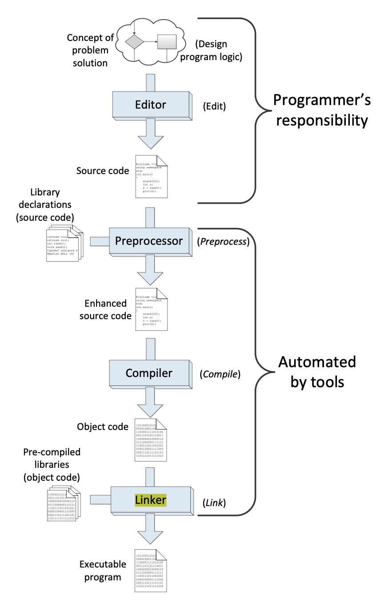
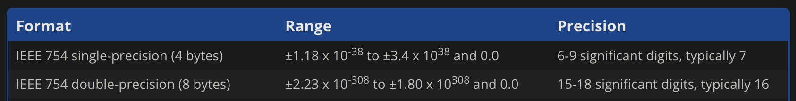
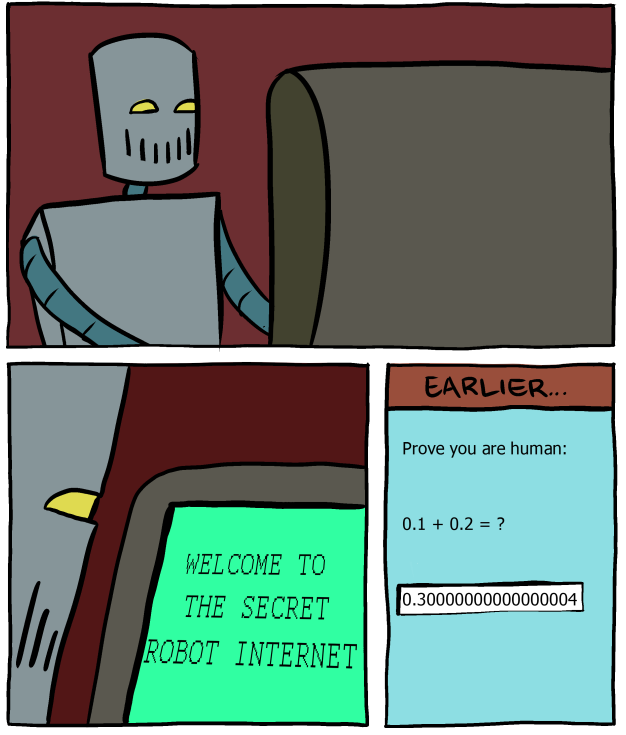

# C++ "Hello World!"

---

## Examples

- Today will cover the examples in `CompPhys/ReviewCpp/BasicExamples`
  - If you haven't created your pixi environment, check out the [setup instructions](../setup.qmd)
  - Remember to activate the environment (`source activate.sh`)
- To compile and execute any one program:

```bash
# cd CompPhys/ReviewCpp/BasicExamples if not already there
clang++ hello.cc -o hello # or g++ for linux
./hello
```

- To compile **all** of the programs at once:
```bash
# cd CompPhys/ReviewCpp/BasicExamples if not already there
make
```

- Many more programs than we will cover in class, but check them out if you have time!

---

## Writing and compiling C++

- Next, we will cover some of the basics for writing, compiling, and executing C++ programs.
- Since most of you know python already, we'll start by summarizing the major differences in syntax. 
- We will also compile our first example program from the CompPhys repository: `CompPhys/ReviewCpp/BasicExamples/hello.cc`. 
  - You will need the software environment described in the [setup](../setup.qmd). 

---

## Hello World!

As usual, we start with a "Hello World!" program. In C++, this is fairly simple:

```c++
#include <iostream>

int main(void){
  std::cout << "Hello, world" << std::endl;
  return 0;
}
```

...but not as simple as Python!

```python
print("Hello, world")
```

---

## Hello World explained

:::: {.columns .vcenter}
::: {.column width=40%}
```c++
#include <iostream>

int main(void){
  std::cout << "Hello, world" << std::endl;
  return 0;
}
```
:::
::: {.column width=60%}
:::: {.fragment}
- `#include` is similar to python `import`: allows you to use external code.
  - `<iostream>` is a library providing input/output to the terminal, most notably the basic print function.
::::
:::: {.fragment}
- `int main` function: input=nothing (`void`), output=`int`.
  - `int main()` function is the conventional entrypoint for a C++ program.
::::
:::: {.fragment}
- `std::cout` is similar to python `print()`, except with a "stream" syntax rather than function syntax.
  - `std::endl;` is a newline character (`\n` in python)
::::
:::: {.fragment}
- `0` is a return value indicate successful completion; other values (often 1) indicate failure. 
::::
:::
::::

---

## Compilation

{fig-align="center" fig-alt="Detailed breakdown of a C++ compiler"}

---

## Hands-on: compiling hello.cc

:::: {.columns}
::: {.column width=50%}
- Next, try compling `hello.cc`.
- The compiler depends on your OS: 
  - `g++` for Linux
  - `clang++` for MacOS (might also have `g++`)
- `g++` is the "GNU" compiler
  - GNU = "GNU's Not Unix"; GCC = "GNU Compiler Collection"
  - Free, up-to-date withANSI standards
- `clang++` is an Apple compiler, replacement for GCC
- These are "front-ends" (human interface), while actually compilation is done by the "back-end"
:::
::: {.column width=50%}

Make sure your pixi environment is active, if not already:

```bash
cd PHY410
source activate.sh
```

Compile:
```bash
cd CompPhys/ReviewCpp/BasicExamples
g++ hello.cc -o hello
```

Then execute:
```bash
./hello
```

:::
::::

---

## Breaking hello.cc

:::: {.columns}
::: {.column width=50%}
- Now, let's break hello.cc and see what happens! 
- The C++ syntax in your source code must be precise and correct. However, unless you are a 🧙, you will make mistakes, early and often. 
- When the compiler encounters a problem, you get a **compiler error**. 
- Simple example: every line has to end with a semicolon, `;`. What happens if it's missing?
:::
::: {.column width=50%}

```c++
#include <iostream>
int main(void){
  std::cout << "Hello, world" << std::endl
  return 0; 
}

- Result: the compiler fails, but tells you *exactly* what went wrong.

```bash
(compphys-env) ~/PHY410/student/CompPhys/ReviewCpp/BasicExamples % clang++ hello.cc -o hello
hello.cc:4:43: error: expected ';' after expression
    4 |   std::cout << "Hello, world" << std::endl
      |                                           ^
      |                                           ;
1 error generated.
```

- Fix, and try again, and it works again.

:::
::::

---

## Breaking hello.cc

:::: {.columns}
::: {.column width=50%}
- A slightly trickier error: what happens if you forget the `std::` in `std::cout`?

```c++
#include <iostream>
int main(void){
  cout << "Hello, world" << std::endl
  return 0; 
}
```

:::
::: {.column width=50%}
- If you're unlucky and have an older compiler:
```bash
$ g++ hello.cc -o hello.exe
hello.cc: In function ‘int main()':
hello.cc:4: error: ‘cout' was not declared in this scope
```

- Compiler tells you *precisely* what went wrong, but if you haven't seen this error before, it is probably clear as muck. 

:::
::::

--- 

## "What does THAT mean???"

- Recommended solution in 2026: ask a LLM

> What it means literally: The compiler is telling you it ran into the word cout on line 4, inside main(), and it has no idea what cout is. "Not declared in this scope" is C++'s way of saying "I've never heard of this name before — did you forget to tell me about it?"
> 
> Why it happens: cout (the thing you use to print output, like cout << "Hello!";) isn't a built-in keyword of the C++ language itself. It's provided by the standard library, specifically the <iostream> part of it. The compiler doesn't automatically know about every tool in the standard library — you have to explicitly ask for the parts you want. So this error almost always means one of two things:
> 
> You forgot the #include <iostream> line at the top of the file. This line tells the compiler "go read the definitions for input/output tools before you compile the rest of my code."
> You forgot std:: in front of cout, or forgot using namespace std;. cout actually lives inside something called a "namespace" named std (short for "standard"). Its full name is std::cout. If you write just cout without either writing std::cout or telling the compiler up front using namespace std;, the compiler won't know where to look for it.

---

## "What does THAT mean???"

Claude, explain these keywords: "‘cout' was not **declared** in this **scope**"

- **Declared** means "the compiler has been told this name exists, and what kind of thing it is" (a variable, a function, an object, etc.), before you try to use it.
- **Scope** means "the region of the program where a name is visible and usable." Not everything declared is visible everywhere. A name can be declared but only be visible inside a certain namespace, a certain function, or a certain block of code — outside that region, it's as if the name doesn't exist.
  - If you just write cout with no std:: and no using namespace std;, you're asking the compiler to find cout in the current scope (basically, "right here in main(), with no extra help") — and it isn't there, so the compiler reports it as unknown "in this scope."

---

## "What does THAT mean???"

:::: {.columns}
::: {.column width=50%}
- Confession: this example is a bit contrived in 2026.
  - First, if you code with an LLM, it is unlikely to make this mistake!
  - Second, a modern compiler should actually return a much more helpful error message.
- Nonetheless, we can take away some lessons:
  - You will frequently encounter bizarre and unfamiliar error messages. Solving them is a key skill for a programmer (even in the age of LLMs... for now).
  - You will learn to identify the root problem (vs. secondary errors), and to distinguish relevant vs. irrelevant messages.
  - Google/Stack Overflow/LLMs have a lot of answers. Be persistent.
  - By solving the error, you may well learn something about C++!
:::
::: {.column width=50%}

```bash
(compphys-env) ~/PHY410/student/CompPhys/ReviewCpp/BasicExamples % clang++ hello.cc -o hello
hello.cc:4:3: error: use of undeclared identifier 'cout'; did you mean 'std::cout'?
    4 |   cout << "Hello, world" << std::endl;
      |   ^~~~
      |   std::cout
/Users/dryu/Documents/Buffalo/PHY410/student/CompPhys/.pixi/envs/default/bin/../include/c++/v1/iostream:57:42: note: 'std::cout' declared
      here
   57 | extern _LIBCPP_EXPORTED_FROM_ABI ostream cout;
      |                                          ^
1 error generated.
```

:::
::::

---

## Types of errors

- So far, we have just seen **compiler errors**
  - That means you didn't set the code up correctly within a file.
  - It might not feel like it, but these are the best kind of error: the compiler sees something wrong and helps you fix it.
- **Linker errors** mean you didn't set up the code correctly across multiple files
  - Still caught by `g++/clang++`, so you have help.
- **Runtime errors** occur when the code is technically correct in terms of C++ syntax, but something went wrong while executing. 
  - Division by zero, going beyond the end of an array, running out of memory
  - Can be harder to debug: program might not produce a helpful error message. Might require an external tool (GDB, valgrind, gprof, ...)
- And finally, the worst case: your programs runs successfully, but gives you the wrong answer!

---

## Values and variables

- Now that we have the structure of a C++ program, let's consider the code itself.
- First concept: **values**
  - ints like 1, 2, 4, 3359
  - floats like 3.14
  - strings like "my string"
- These behaved intuitively: just write the number or string in your program, and the compiler will understand. 

```bash
# std::cout << 4 << std::endl;
$ ./printfour
4
```

---

## How to break a value

:::: {.columns}
::: {.column width=50%}
- What could go wrong? Let's try to break the program.
- Consider an integer: we have learned that the `int` type has a specific, finite range.
- Add the following to `hello.cc`:

```c++
std::cout << -3000000000000000000000000000 << std::endl;
```

:::: {.fragment}
```
$ g++ hello.cc -o hello
hello world.cc:4:17: error: integer literal is too large to be represented in any integer type
4 |   std::cout << -3000000000000000000000 << std::endl;
|                 ^
1 error generated.
```
::::
:::
::: {.column width=50%}

:::: {.fragment}
- This is actually sort of a runtime error, not a syntax error! Our C++ syntax is correct, we just have a bad value. 
    - Luckily, most compilers are smart enough to catch problems like this.
    - However, *this is not specified by the C++ standard*! 
- In the worst case, a less intelligent compiler might try to cram -3000000000000000000000 into your 16 bits, interpreted incorrectly using two's complement. 
    - This is the worst case scenario: the code happily runs and returns complete garbage. 
    - We will see some more garbage very shortly...
::::

:::
::::

---

## Variables

:::: {.columns}
::: {.column width="60%"}
- Variable are declared with a type and a name: `int x;`
- Content of variable (say 32 bit integer) occupies a specific set of registers in memory, allocated by your computer.
- So, the variable corresponds to a specific memory address, besides having a value.
:::
::: {.column width="25%"}

:::: {style="font-size: 1.5em;"}
| Address | Value |  |
| --- | --- | --- |
| `0x1000` | 0x04a45 | |
| `0x1001` | 0x9ab38 | |
| `0x1010` | 0x0000 | ←x |
| `0x1011` | 0x1003 | |
::::

:::

::::
---

## Variable initialization

:::: {.columns}
::: {.column width=50%}
- Let's break the program again! Let's change `hello.cc` to the following:

```c++
int main() {
  int x;
  std::cout << x << std::endl;
  return 0;
}
```
:::
::: {.column width=50%}

:::: {.r-stack}
::: {.fragment .fade-out fragment-index=0}
In Ubuntu:

```bash
$ g++ hello.cc -o hello
$ ./hello
0
```

- Hmm. Where did that 0 come from? Did the compiler just guess a sensible value?
:::

::: {.fragment .fade-in-then-out fragment-index=0}
In MacOs:

```bash
$ clang++ hello.cc -o hello
$ ./hello
-289095592
```

- Wow! `clang++` gives complete garbage!
:::

::: {.fragment fragment-index=1}
- ⚠️ The C++ standard actually does not specify a default initial value for any type, so it is technically allowed to be filled with random garbage. ⚠️
- The program allocates some memory to `x`, but without initialization, the *value* is whatever happened to be in that memory beforehand.
- Different compilers will do different things! 🙀

:::
::::

:::
::::

---

## Variable initialization

:::: {.columns}
::: {.column width=50%}
- Moral of the story: always set the initial value of your variables!
  - Uninitialized variables have unknown behavior: maybe throws a compiler error; maybe set to 0; maybe set to random values!
  - Your code will behave differently on different computers, or with different compilers.
  - Your code might even behave differently on different days.
- Also, `g++` and `clang++` can optionally fail if they detect uninitialized variables.
:::
::: {.column width=50%}

```c++
int x=0;
// Equivalent notation:
int y(0);
std::cout << "x=" << x << " / y=" << y <<std::endl;
```

- Now the outcome of your program is guaranteed.
- Accept no substitutes! Your program *must* be determinstic!
:::
::::

---

## Variables in detail

- Let's take a closer look at variables.

:::: {.rstack}
::: {.fragment .fade-out fragment-index=0}

:::: {style="width: 20%; margin-left: 60px; font-size: 1.5em;"}
```c++
int x = 0;
```
::::

- **Allocation**: 4 bytes of memory are reserved for the variable `x` (determined at compile time)
- **Initialization**: at runtime, value 0 (`0x00000000`) is written to that 4-byte slot
- Result:

Memory address |	Value | 
| --- | --- | --- |
| `0x7ffd3a4b2c1c`	| `0x3a4b2cd0` | 
| `0x7ffd3a4b2c18`	| `0x00000000` | ←x

:::

::: {.fragment .fade-in fragment-index=0}
:::: {style="width: 20%; margin-left: 60px; font-size: 1.5em;"}
```c++
int x = 0;
x = 10;
```
::::

- **Assignment**: the value 10 (i.e., `0x0000000a`) is written (copied) to the memory slot corresponding to `x`
- The memory address of `x` does not change; only the value changes.
- Result:

Memory address |	Value | 
| --- | --- | --- |
| `0x7ffd3a4b2c1c`	| `0x3a4b2cd0` | 
| `0x7ffd3a4b2c18`	| `0x0000000a` | ←x
:::
::::

---

## Variable assignment

- Why be so pedantic about variable assignment?
- For a single `int`, this is all straightforward, but now consider a more complicated variable type:

```c++
std::vector<double> a(100'000'000, 3.14);   // 800 MB
std::vector<double> b = a;    // copies 800 MB. a is still valid.
```

- The vector `a` has size 10M * (8 bytes) = 80 MB. 
- The assignment `b=a` now has to copy 80 MB! This is a super expensive operation. 
- We now have two copies of the vector in memory; `b` is a completely separate object from `a`. 
  - Contrast with python: `a = [3.14]*100_000_000; b = a;` actually doesn't copy! `b` points to the same memory as `a`, unless you explicitly tell python to make a copy. 
- Takeaway: you should be very conscious of how memory is being used in a C++ program. 

# Python to C++

---

## Python to C++

- Much of your python expertise carries over to C++, with adjustments to the syntax. 
- Things to keep in mind:
  - **Strong typing**: having to declare variable types is not just a chore; it fundamentally changes how you build a program. C++ templating restores some flexibility.
  - **Memory management**: python has garbage collection; in C++, you are responsible for managing memory. More on this when we learn about pointers.
- The next few slides are "translation guide" for some of the basic/essential concepts. We won't read through them in detail in class, but read through them if you are new to C++. 

---


## Basic types

:::: {.columns}
::: {.column width="50%"}
::: {style="text-align: center;"}
**[Python]{.underline}**
:::

```python
x = 12
pi = 3.14159
name = "Buffalo"
flag = True
```

- Python: no type declaration needed — inferred automatically at runtime ("weakly typed")
- Common built-in types: `int`, `float`, `str`, `bool`
- `int` has arbitrary precision; `float` is a 64-bit double
:::
::: {.column width="50%"}
::: {style="text-align: center;"}
**[C++]{.underline}**
:::

```c++
int x = 12;
float pi = 3.14159f;
std::string name = "Buffalo";
bool flag = true;
```

- C++: Must declare the type of every variable ("strongly typed")
- `float` vs `double`: different size/precision (see last lecture)
- `std::string` needs `#include <string>`
- `true` / `false` are lowercase keywords
:::
::::

---

## Enums (categories)

:::: {.columns}
::: {.column width="50%"}
::: {style="text-align: center;"}
**[Python]{.underline}**
:::

```python
from enum import Enum

class Particle(Enum):
    BOSON = 1
    FERMION = 2

p = Particle.BOSON
```

- Python: requires `from enum import Enum`
- Members are objects (`Weight.LIGHT`), not plain integers, by default
:::
::: {.column width="50%"}
::: {style="text-align: center;"}
**[C++]{.underline}**
:::

```c++
enum Particle_t {
  kBOSON,
  kFERMION
};

Particle_t p = kBOSON;
```

- C++: no import needed, part of core syntax
- Members are integers under the hood (`0, 1, 2, ...` by default; can be set explicitly)

:::
::::

---

## char

:::: {.columns}
::: {.column width="50%"}
::: {style="text-align: center;"}
**[Python]{.underline}**
:::

```python
c = "c"       # just a length-1 string
print(c)
```

- Python: no distinct `char` type, just a string of length 1
:::
::: {.column width="50%"}
::: {style="text-align: center;"}
**[C++]{.underline}**
:::

```c++
char c = 'c';
std::cout << c << std::endl;
```

- C++: `char` is a 1-byte numeric type storing a character code (probably [UTF-8](https://en.wikipedia.org/wiki/UTF-8))
- **Single** quotes `'c'` for a char literal; **double** quotes `"c"` are for strings
- You can actually do arithmetic, if you want: `'a' + 1`
:::
::::

---

## Constants (`const`): no real Python equivalent

:::: {.columns}
::: {.column width="50%"}
::: {style="text-align: center;"}
**[Python]{.underline}**
:::

```python
PI = 3.14159265359  # ALL_CAPS = convention

PI = 3.2   # ...still perfectly legal!
```

- No real concept of `const`
- Naming variable in `ALL_CAPS` is a common convention for const variables, but the interpreter does not enforce it.
:::
::: {.column width="50%"}
::: {style="text-align: center;"}
**[C++]{.underline}**
:::

```c++
const double PI = 3.14159265359;

PI = 3.2;  // compiler error!
```

- `const` is enforced by the compiler
- Attempting to reassign gives a compiler error
- Good practice: mark anything that shouldn't change as `const`
:::
::::

---

## Comments

:::: {.columns}
::: {.column width="50%"}
::: {style="text-align: center;"}
**[Python]{.underline}**
:::

```python
# a single-line comment
x = 5  # trailing comment

"""
Triple-quoted strings are often
(ab)used as multi-line comments
"""
```

- `#` starts a comment
- `"""` is technically a multi-line string, but without any additional code (like an `=`), the interpreter ignores it
:::
::: {.column width="50%"}
::: {style="text-align: center;"}
**[C++]{.underline}**
:::

```c++
// a single-line comment
int x = 5; // trailing comment

/*
A genuine
multi-line comment
*/
```

- `//` for single-line, `/* ... */` for multi-line
:::
::::

---

## `None` vs. `nullptr`

:::: {.columns}
::: {.column width="50%"}
::: {style="text-align: center;"}
**[Python]{.underline}**
:::

```python
x = None
if x is None:
    print("nothing here")
```

- `None` is actually an object (everything in python is an object)
- Warning: always use `x is None`, not `x == None`

:::
::: {.column width="50%"}
::: {style="text-align: center;"}
**[C++]{.underline}**
:::

```c++
int* p = nullptr;
if (p == nullptr) {
  std::cout << "nothing here"
            << std::endl;
}
```

- `nullptr` means "points at nothing" — it's specifically for **pointers** (whole lecture later on)
- An ordinary `int`/`float`/... can't be "`None`" in C++; it always holds *some* value (even if uninitialized)
:::
::::

---

## Arithmetic operators

:::: {.columns}
::: {.column width="50%"}
::: {style="text-align: center;"}
**[Python]{.underline}**
:::

```python
a = 5 + 3
b = 5 - 3
c = 5 * 3
d = 5 / 3     # 1.666... (always float)
e = 5 // 3    # 2  (explicit floor div)
f = 5 % 3     # 2
g = 5 ** 2    # 25 (exponent)
```

- `+ - * /` work as you'd expect
- `/` **always** returns a `float` in Python 3, even for `int / int`
- `//` is explicit integer floor division; `**` is exponentiation
:::
::: {.column width="50%"}
::: {style="text-align: center;"}
**[C++]{.underline}**
:::

```c++
int a = 5 + 3;
int b = 5 - 3;
int c = 5 * 3;
double d = 5.0 / 3.0;  // 1.666...
int e = 5 / 3;         // 2 !!
int f = 5 % 3;         // 2
// no exponent operator — use std::pow()
```

- `+ - * /` work similarly... but `int / int` **truncates** toward zero
- `%` is modulus, integers only
- No `**` — use `std::pow(5, 2)` from `<cmath>`
:::
::::

---

## Increment / decrement operators

:::: {.columns}
::: {.column width="50%"}
::: {style="text-align: center;"}
**[Python]{.underline}**
:::

```python
x = 0
x = x + 1
x += 1     # shorthand, same effect

# Python has no ++ or -- operator
```

- No `++`/`--` — use `+= 1` / `-= 1` instead
:::
::: {.column width="50%"}
::: {style="text-align: center;"}
**[C++]{.underline}**
:::

```c++
int x = 0;
x++;    // post-increment
++x;    // pre-increment
x--;
x += 1; // also valid, like python's +=
```

- `++` / `--` increment or decrement by exactly 1
- ⚠️ Pre (`++x`) vs. post (`x++`) behave slightly differently: pre-increment returns the new value, post-increment returns the old value! (Only matters if you are immediately using the result, e.g. `y = x++;` vs `y = ++x;`)
:::
::::

---

## Logical operators

:::: {.columns}
::: {.column width="50%"}
::: {style="text-align: center;"}
**[Python]{.underline}**
:::

```python
a = True and False
b = True or False
c = not True
```

- Keywords: `and`, `or`, `not` (words, not symbols)
- ⚠️ '0', '0.0', '""', 'None', '[]' behave like `False`
:::
::: {.column width="50%"}
::: {style="text-align: center;"}
**[C++]{.underline}**
:::

```c++
bool a = true && false;
bool b = true || false;
bool c = !true;
```

- Symbols: `&&` (AND), `||` (OR), `!` (NOT) (symbols, not words))
- ⚠️ Any nonzero value behaves like `true`, including `""`

:::
::::

---

## Bitwise operators

:::: {.columns}
::: {.column width="50%"}
::: {style="text-align: center;"}
**[Python]{.underline}**
:::

```python
a = 0b101 & 0b001   # 0b001
b = 0b001 | 0b010   # 0b011
c = 0b011 ^ 0b010   # 0b001
d = 0b001 << 2      # 0b100
```

- Bitwise operators compare two sequences of bits, one at a time
- Also work on `int`s (convert to binary)
- Not super common (I sometimes use python to prototype C++ bit logic, though!)

:::
::: {.column width="50%"}
::: {style="text-align: center;"}
**[C++]{.underline}**
:::

```c++
int a = 0b101 & 0b001;  // 0b001
int b = 0b001 | 0b010;  // 0b011
int c = 0b011 ^ 0b010;  // 0b001
int d = 0b001 << 2;     // 0b100
```

- `&` (AND), `|` (OR), `^` (XOR), `<<` / `>>` (shift) — operate bit-by-bit
-  ⚠️ `<<` is reused for `std::cout` stream syntax, but entirely different meaning for bits!
:::
::::

---

## Comparison operators

:::: {.columns}
::: {.column width="50%"}
::: {style="text-align: center;"}
**[Python]{.underline}**
:::

```python
a = (14 < 16)   # True
b = (5 == 5)    # True
c = (5 != 3)    # True
d = 1 < 2 < 3   # True — really chains!
```

- `== != < > <= >=` — same symbols as C++
- Python allows **chained comparisons**: `1 < x < 10` means what it looks like
:::
::: {.column width="50%"}
::: {style="text-align: center;"}
**[C++]{.underline}**
:::

```c++
bool a = (14 < 16);  // true
bool b = (5 == 5);   // true
bool c = (5 != 3);   // true
bool d = 1 < 2 < 3;  // compiles!!! NOT chained
```

- Same symbols: `== != < > <= >=`
- ⚠️ **No chained comparisons** `1 < 2 < 3` evaluates left-to-right as `(1<2) < 3`, i.e. `true < 3`, i.e. `1 < 3` &rarr; `true` (by accident!)
- Always write `(1 < x) && (x < 3)` explicitly
:::
::::

---

## Operator precedence (C++)
```{=html}
<div style="text-align: center;">
<iframe src="https://en.cppreference.com/w/cpp/language/operator_precedence"
        style="width: 100%; height: 800px; border: 1px solid #ccc;">
</iframe>
</div>
```
C++ operator precedence table: <https://en.cppreference.com/w/cpp/language/operator_precedence>

---

## Operator precedence gotchas

:::: {.columns}
::: {.column width="50%"}
::: {style="text-align: center;"}
**[Python]{.underline}**
:::

```python
# ** has higher precedence than unary minus!
print(-2 ** 2)     # -4, not 4!
print((-2) ** 2)   # 4

# comparisons chain "for real":
print(1 < 2 < 3)   # True

# and / or / not are below comparisons
1 < 2 and 3 < 4    # True
```

- `**` binds more tightly than unary minus — the opposite of what most people expect!
- Comparisons chains work
- `and` / `or` / `not` sit *below* comparisons and arithmetic in precedence
:::
::: {.column width="50%"}
::: {style="text-align: center;"}
**[C++]{.underline}**
:::

```c++
// no ** to worry about

// comparisons do NOT chain:
bool b = 1 < 2 < 3;  // means (1<2)<3

// && / || sit below comparisons too,
// same relative order as python
```

- Chained comparisons might compile successfully, but return garbage. 
:::
::::

- Recommendation: always use parentheses! They cost nothing and protect you again the most dangerous kind of bugs (no error, but wrong answer)

--- 

## Sequences

:::: {.columns}
::: {.column width="50%"}
::: {style="text-align: center;"}
**[Python]{.underline}**
:::

```python
nums = [1, 2, 3, 4]
nums.append(5)
nums[0] = 99
print(nums[1])     # 2
print(len(nums))   # 5
mixed_list = ["a", 1, True] # elements can be anything
```

- `list` holds any mix of types
- Grows/shrinks dynamically
- For computations, use `numpy.array` instead
  - Fixed type (like C++), vectorized math (=much faster)
:::
::: {.column width="50%"}
::: {style="text-align: center;"}
**[C++]{.underline}**
:::

```c++
#include <vector>

std::vector<int> nums = {1, 2, 3, 4};
nums.push_back(5);
nums[0] = 99;
std::cout << nums[1] << std::endl;      // 2
std::cout << nums.size() << std::endl;  // 5
```

- `std::vector<T>` holds **one** type `T`
- Grows dynamically like a list, but strongly typed
- `push_back()` instead of `.append()`; `.size()` instead of `len()`
- Similar to numpy arrays
- Requires `#include <vector>`
:::
::::

---

## Maps vs. dictionaries

:::: {.columns}
::: {.column width="50%"}
::: {style="text-align: center;"}
**[Python]{.underline}**
:::

```python
ages = {"alice": 30, "bob": 25}
ages["carol"] = 40
print(ages["alice"])    # 30

for name, age in ages.items():
    print(name, age)
```

- `dict` maps keys to values. keys/values can be (almost) any type
- Preserves insertion order (Python 3.7+)
:::
::: {.column width="50%"}
::: {style="text-align: center;"}
**[C++]{.underline}**
:::

```c++
#include <map>

std::map<std::string, int> ages =
    {{"alice", 30}, {"bob", 25}};
ages["carol"] = 40;
std::cout << ages["alice"] << std::endl;  // 30

for (auto& [name, age] : ages) {
  std::cout << name << " " << age << std::endl;
}
```

- `std::map<KeyType, ValueType>`: both types fixed and declared
- Keeps keys in **sorted** order 
  - Can use `std::unordered_map` instead (typically faster if key order doesn't matter; "hash table")
- Requires `#include <map>`
:::
::::

---

## Multiple assignment & swapping

:::: {.columns}
::: {.column width="50%"}
::: {style="text-align: center;"}
**[Python]{.underline}**
:::

```python
a, b = 1, 2
a, b = b, a   # swap!
print(a, b)   # 2 1
```

- Tuple assignment lets you assign (and swap!) multiple variables in one line
:::
::: {.column width="50%"}
::: {style="text-align: center;"}
**[C++]{.underline}**
:::

```c++
int a = 1, b = 2;
std::swap(a, b);  // #include <utility>
std::cout << a << " " << b << std::endl;  // 2 1
```

- No built-in tuple assignment or swapping
- Can use `std::swap(a, b)` (or do it manually: `int tmp = a; a = b; b = tmp;`)
:::
::::

---

## Conditional execution: if / else

:::: {.columns}
::: {.column width="50%"}
::: {style="text-align: center;"}
**[Python]{.underline}**
:::

```python
if v > c:
    print("Tachyon!")
elif v == c:
    print("Photon")
else:
    print("Particle with mass")
```

- Colons and indentation define the blocks
  - In general, *indentation matters* in python
- `elif`, not "else if"
:::
::: {.column width="50%"}
::: {style="text-align: center;"}
**[C++]{.underline}**
:::

```c++
if (v > c) {
  std::cout << "Tachyon!" << std::endl;
} else if (v == c) {
  std::cout << "Photon" << std::endl;
} else {
  std::cout << "Particle with mass" << std::endl;
}
```

- Condition in parentheses; braces `{}` define the blocks
  - In general, *indentation does not matter* in C++
  - But you should still use it for readability!
- `else if`, two words
:::
::::

---

## Ternary / shorthand if

:::: {.columns}
::: {.column width="50%"}
::: {style="text-align: center;"}
**[Python]{.underline}**
:::

```python
parity = "Even" if (i % 2 == 0) else "Odd"
```

- `value_if_true if condition else value_if_false`
- Reads left-to-right, roughly like English
:::
::: {.column width="50%"}
::: {style="text-align: center;"}
**[C++]{.underline}**
:::

```c++
std::string parity = (i % 2 == 0) ? "Even" : "Odd";
```

- `condition ? value_if_true : value_if_false`
- Same idea, different order — the condition comes first
:::
::::

---

## switch

:::: {.columns}
::: {.column width="50%"}
::: {style="text-align: center;"}
**[Python]{.underline}**
:::

```python
# <3.10
if i == 1:
    print("Monday")
elif i == 2:
    print("Tuesday")
else:
    print(f"Day {i}")

# Python 3.10+
match i:
    case 1:
        print("Monday")
    case 2:
        print("Tuesday")
    case _:
        print(f"Day {i}")
```

- Older python versions: no switch, have to chain `if`/`elif`s
- Newer python versions (3.10+): `match/case` statement, actually quite powerful (see <https://docs.python.org/3/tutorial/controlflow.html>)
:::
::: {.column width="50%"}
::: {style="text-align: center;"}
**[C++]{.underline}**
:::

```c++
switch (i) {
  case 1:
    std::cout << "Monday" << std::endl;
    break;
  case 2:
    std::cout << "Tuesday" << std::endl;
    break;
  default:
    std::cout << "Day " << i << std::endl;
    break;
}
```

- `i` must be an integer (or enum), not a string or float
- ⚠️ `break;` is required at the end of each case! If you forget it, the next block will execute, too! (Quite a nasty design flaw, in fact)
- `default:` is optional but recommended
:::
::::

---

## `for` loops

:::: {.columns}
::: {.column width="50%"}
::: {style="text-align: center;"}
**[Python]{.underline}**
:::

```python
for i in range(10):
    print(i)

for item in my_list:
    print(item)
```

- `for <var> in <iterable>:` loops directly over any iterable (list, numpy array, dict, ...)
- `range(10)` generates integers from 0 through 9
:::
::: {.column width="50%"}
::: {style="text-align: center;"}
**[C++]{.underline}**
:::

```c++
for (unsigned int i = 0; i < 10; ++i) {
  std::cout << i << std::endl;
}

// Loop over vector: old style (before C++11)
for (std::vector<int>::iterator it = vec.begin(); it != vec.end(); ++it) {
  std::cout << *it << std::endl;
}

// Loop over vector: new style (C++11 and newer)
for (auto& item : my_vector) {
  std::cout << item << std::endl;
}
```

- Classic form needs 3 parts: initialize counter; continue condition; increment (or decrement, etc.)
- Iterators (e.g. `std::vector<T>::iterator`) let you loop over vectors/maps/etc.
- `auto` keyword drastically improves your life here, use it!

:::
::::

---

## while loops

:::: {.columns}
::: {.column width="50%"}
::: {style="text-align: center;"}
**[Python]{.underline}**
:::

```python
i = 0
while i < 10:
    print(i)
    i += 1
```

- Same idea in both languages
- Condition checked *before* the block
  - Entirely possible that the block is executed 0 times

:::
::: {.column width="50%"}
::: {style="text-align: center;"}
**[C++]{.underline}**
:::

```c++
int i = 0;
while (i < 10) {
  std::cout << i << std::endl;
  i++;
}
```

:::
::::

---

## do-while loops

:::: {.columns}
::: {.column width="50%"}
::: {style="text-align: center;"}
**[Python]{.underline}**
:::

```python
# no native do-while;
# emulate with while True + break:
i = 0
while True:
    print(i)
    i += 1
    if not (i < 10):
        break
```

- No `do while` loop built-in; can approximate with `while True: ... break`
:::
::: {.column width="50%"}
::: {style="text-align: center;"}
**[C++]{.underline}**
:::

```c++
int i = 0;
do {
  std::cout << i << std::endl;
  i++;
} while (i < 10);
```

- Condition checked *before* the block, unlike `while` loop
  - Thus, the block always runs at least once
- Useful when you need "do the thing, then decide whether to repeat" (menus, retry loops, ...)
:::
::::

# Functions

---

## Functions

:::: {.columns}
::: {.column width="50%"}
::: {style="text-align: center;"}
**[Python]{.underline}**
:::

```python
def add(a, b):
    return a + b

def greet(name="world"):
    print(f"Hello, {name}!")

result = add(2, 3)
```

- `def` keyword makes a function
- As always, no types are declared
- Lots of flexibility with input arguments:
  - Default argument values are easy: `name="world"`
  - Same function can handle multiple input types
  - Order can be swapped using arg names
  - Powerful `*args, **kwargs` syntax
- Return type is inferred: a function can even return different types on different calls
:::
::: {.column width="50%"}
::: {style="text-align: center;"}
**[C++]{.underline}**
:::

```c++
int add(int a, int b) {
  return a + b;
}

void greet(std::string name = "world") {
  std::cout << "Hello, " << name << "!" << std::endl;
}

int result = add(2, 3);
```

- As always, you have to declare the return type, as well as all input variables
  - `void` means "returns nothing" (Python functions implicitly return `None` if no `return is called)
- Input arguments are quite restrictive
  - Types must all be declared
  - Default arguments are supported, with restrictions.
  - Arguments must always be passed in order
  - **Templating** can restore some of the flexibility from python.
:::
::::

---

## String formatting / printing

:::: {.columns}
::: {.column width="50%"}
::: {style="text-align: center;"}
**[Python]{.underline}**
:::

```python
name = "David"
age = 40
print(f"{name} is {age} years old")
print("%s is %d years old" % (name, age))
```

- In general, string formatting is way easier in python.
- f-strings (`f"...{expr}..."`) are the modern, preferred way to build formatted strings
- `print()` adds a newline automatically
:::
::: {.column width="50%"}
::: {style="text-align: center;"}
**[C++]{.underline}**
:::

```c++
std::string name = "David";
int age = 40;
std::cout << name << " is " << age
          << " years old" << std::endl;

// printf-style formatting also exists (from C):
printf("%s is %d years old\n", name.c_str(), age);
```

- Two common methods of building strings programatically:
  - Streams (`<<`): you've already seen this with `std::cout`. You can also build a string variable using "string streams"
  - f-string style: `printf` function
- `std::endl` (or `"\n"`) adds the newline explicitly — it's not automatic
:::
::::


# Gotchas

- Let's look at a few oddities

---

## Division

:::: {.columns}
::: {.column width=50%}

- Built-in operators try to handle types in a convenient manner: you can pass an `int` and a `float` to `+-*/` and C++ will do its best. 
- For `+-*`, these work just fine, as expected.
- However, in the case of division, the result might not be what you expect!

:::: {style="width: 75%;"}
```c++
std::cout << 7. / 4. << std::endl; // 1.75
std::cout << 7. / 4 << std::endl; // 1.75
std::cout << 7 / 4. << std::endl; // 1.75
std::cout << 7 / 4 << std::endl; // 1 !!!
```
::::

- First 3 lines: float/int, int/float, and float/float return a float, because this makes sense
  - Converting an int to a float is straightforward

:::
::: {.column width=50%}

:::: {.fragment}
- 4th lines: from the compiler's point of view: `x / y` has to have a *type*. 
  - At compile time, the compiler only know the *type* of `x` and `y`.
  - It has no idea what the values of `x` and `y` will be at runtime!
- No unambiguous answer! The C++ standards committee made a choice: `int/int` always returns an `int`
  - Implementation via **truncation**: round result towards 0
- Reasoning: this avoids mandatory float conversion; programmer can easily invoke that conversion if desired.
::::
:::
::::

---

## Casting

- C++ will correctly handle `13. / 4`: it converts 4 to a float. 
- Does C++ making decisions about types behind the scenes makes you nervous? It probably should: floats are not ints, and `4` does not behave identically to `4.`
- A better way: **casting**

```c++
float x = 123.456;
int n = static_cast<int>( x );
std::cout << n << std::endl; // 123
```

- In this case, *you* make the decision to alter the type
  - (After reading the documentation) You, the programmer, know that you're truncating the decimals to convert `float x` to `int n`. 
- `static_cast<type>()` is one of several methods to *deliberately* alter variable type
  - Compiler checks that the conversion is well defined
  - Fast and safe, but less flexible than other runtime-focused options.

---

## Floating point problems

:::: {.columns}
::: {.column width=50%}
- Floating point numbers will be a source of numerous headaches throughout this course. 
- Up first: what happens when we compare floating point numbers? 
  - Integers are exact, so e.g. `if (4 == 4) {...}` makes sense. 
  - Floating point numbers are *approximations* of real numbers: beyond the mantisaa, the number is truncated. 
  - So how should we compare approximations?
:::

::: {.column width=50%}
```c++
for (int expt = -4; expt > -12; expt--) {
  float x = 1.;
  float y = 1. + std::pow(10., expt);
  std::cout << "x=" << x << ", y = 1. + " << std::pow(10., expt) << ", (x == y) = " << (x == y) ? "true" : "false" << std::endl;
}
```

```bash
x=1, y = 1. + 1e-04, (x == y) = false
x=1, y = 1. + 1e-05, (x == y) = false
x=1, y = 1. + 1e-06, (x == y) = false
x=1, y = 1. + 1e-07, (x == y) = false
x=1, y = 1. + 1e-08, (x == y) = true
x=1, y = 1. + 1e-09, (x == y) = true
x=1, y = 1. + 1e-10, (x == y) = true
x=1, y = 1. + 1e-11, (x == y) = true
```

:::
::::

---

## Floating point problems

:::: {.columns}
::: {.column width=50%}
- What's going on here? C++ is telling us `1.0f == 1.00000001f`! 
- The problem, of course, is that *mantissa* of a float has limited precision. 
  - `1.00000001f` can't actually be represented by a single-precision float! 
  - It's surprisingly easy to fall into this pit: `1. + 1.e10` needs 11 significant figures. 
- Thus: comparisons only make sense within the precision of the mantissa.
- ⚠️ Python also has this problem!
:::
::: {.column width=50%}
{width="70%" fig-alt="Number of bits per floating point component for a 32 bit float"}
:::
::::

{fig-alt="C++ spec for single and double floats"}

---

## Tolerance
- You are probably not going to remember the number of significant figures in a floating point number! 
- Recommendation: lower your expectations ;) Relax the condition: compare within a nonzero **tolerance**. 

Bad: 
```c++
f1 == f2
```

Good: 
```c++
std::fabs(f1 - f2) < tol
```

- You still need to pick a tolerance. Maybe you can set "what's good enough," but C++ and Python help you out:

:::: {.columns}
::: {.column width=50%}

::: {style="text-align: center;"}
**[Python]{.underline}**
:::

```python
# math.isclose(a, b, *, rel_tol=1e-09, abs_tol=0.0)
>>> math.isclose(5.0, 5.00000001)
False
>>> math.isclose(5.0, 5.000000001)
True
```
:::

::: {.column width=50%}

::: {style="text-align: center;"}
**[C++]{.underline}**
:::

```c++
float x = 5.0;
float y = 5.0000001;
std::cout << std::boolalpha << std::fabs(x - y) < std::numeric_limits<float>::epsilon() << std::endl;
// false
```
:::
::::

---

{width="70%" fig-alt="Funny cartoon of a robot failing a captcha test, 0.1 + 0.2, by answering 0.30000004"}

---

## Checkpoint

- These slides covered some of the basics of C++:
  - Values, variables, and what can go wrong with them
  - Syntax differences between C++ and python
- Learned some lessons from "gotcha" cases: 
  - Integer division behavior => casting between types
  - Our first floating point problems => comparison only valid down to some nonzero tolerance
  

