# Fourier Transforms

---

## Spectral analysis

<!-- TODO: complex slide layout (flagged by detect_complex_slide.py - see run log). Content below is complete but UNARRANGED - needs manual layout to match the original slide. -->

{fig-alt="Recurring decorative background image: the time-dependent Schrodinger equation, i-hbar d(psi)/dt = -hbar^2/2m d^2(psi)/dx^2 + V(x)psi(x,t), reproduced identically across this stretch of slides; not related to each slide's specific foreground content."}

- Can solve for Fourier coefficients

- You should all be familiar with [Fourier transformations](https://en.wikipedia.org/wiki/Fourier_transform):

- Continuous

- $$\begin{matrix}
f(x) & ={ \int }_{- \infty }^{ \infty }F(k){e}^{2 \pi ikx}dk \\
F(k) & ={ \int }_{- \infty }^{ \infty }f(x){e}^{-2 \pi ikx}dx
\end{matrix}$$

- Discrete

- $$\begin{matrix}
{y}_{j+1} & =\mathop{\mathop{ \sum }\limits_{k=0}}\limits^{N-1}{Y}_{k+1}{e}^{2 \pi ik(j/N)} \\
{Y}_{k+1} & =\mathop{\mathop{ \sum }\limits_{j=0}}\limits^{N-1}{y}_{j+1}{e}^{-2 \pi ijk/N}
\end{matrix}$$

- $$x \leftrightarrow \frac{j}{N}$$

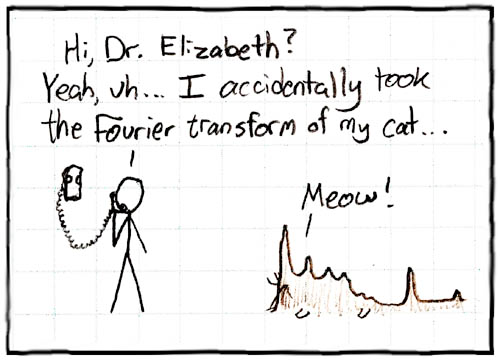{fig-alt="xkcd-style comic: a stick figure on the phone says 'Hi, Dr. Elizabeth? Yeah, uh... I accidentally took the Fourier transform of my cat...' next to a hand-drawn spiky frequency-spectrum sketch labeled 'Meow!'."}

---

## Spectral analysis

<!-- TODO: complex slide layout (flagged by detect_complex_slide.py - see run log). Content below is complete but UNARRANGED - needs manual layout to match the original slide. -->

{fig-alt="Recurring decorative background image: the time-dependent Schrodinger equation, i-hbar d(psi)/dt = -hbar^2/2m d^2(psi)/dx^2 + V(x)psi(x,t), reproduced identically across this stretch of slides; not related to each slide's specific foreground content."}

- Can solve for Fourier coefficients

{fig-alt="A red square-wave-like signal in the time domain, with fast small-amplitude wiggles riding on top of each flat plateau - illustrating a signal built from a fundamental plus higher harmonics."}

---

## Spectral analysis

<!-- TODO: complex slide layout (flagged by detect_complex_slide.py - see run log). Content below is complete but UNARRANGED - needs manual layout to match the original slide. -->

{fig-alt="Recurring decorative background image: the time-dependent Schrodinger equation, i-hbar d(psi)/dt = -hbar^2/2m d^2(psi)/dx^2 + V(x)psi(x,t), reproduced identically across this stretch of slides; not related to each slide's specific foreground content."}

- Can solve for Fourier coefficients

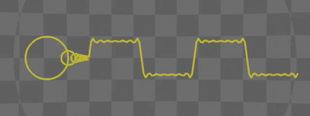{fig-alt="Whimsical yellow/olive hand-drawn doodle of an eye/circle facing a square wave, evoking 'listening to' or 'seeing' a square-wave signal, over a checkered (transparent) background."}

---

## Spectral analysis

<!-- TODO: complex slide layout (flagged by detect_complex_slide.py - see run log). Content below is complete but UNARRANGED - needs manual layout to match the original slide. -->

{fig-alt="Recurring decorative background image: the time-dependent Schrodinger equation, i-hbar d(psi)/dt = -hbar^2/2m d^2(psi)/dx^2 + V(x)psi(x,t), reproduced identically across this stretch of slides; not related to each slide's specific foreground content."}

- Can solve for Fourier coefficients

- Fourier was looking to solve the heat conduction equation:

- $$\frac{ \partial }{ \partial t}T(x,t)= \kappa \frac{{ \partial }^{2}}{ \partial {x}^{2}}T(x,t)$$

- (Easy to derive from Fourier's law of heat conduction,
- $${q}_{x}[{\text{W/m}}^{2}]=-k\frac{dT}{dx}$$
- combined w/energy conservation)

- The solution can be expanded as a sum of trigonometric functions:

- $$\begin{matrix}
T(x,t) & ={c}_{0}+{c}_{1}x+\mathop{\mathop{ \sum }\limits_{k=0}}\limits^{ \infty }{a}_{k}{e}^{- \kappa { \lambda }_{k}^{2}t}sin({ \lambda }_{k}x) \\
{a}_{k} & =\frac{2}{L}{ \int }_{0}^{L}dx\left[ T(x,0)-{c}_{0}-{c}_{1}x \right]sin({ \lambda }_{k}x)
\end{matrix}$$

- We will study this equation in detail later on!

---

## Spectral analysis

<!-- TODO: complex slide layout (flagged by detect_complex_slide.py - see run log). Content below is complete but UNARRANGED - needs manual layout to match the original slide. -->

{fig-alt="Recurring decorative background image: the time-dependent Schrodinger equation, i-hbar d(psi)/dt = -hbar^2/2m d^2(psi)/dx^2 + V(x)psi(x,t), reproduced identically across this stretch of slides; not related to each slide's specific foreground content."}

- Can solve for Fourier coefficients

- Fun fact: Fourier is also credited with the discovery of the [greenhouse effect](https://en.wikipedia.org/wiki/Greenhouse_effect)!
  - [Fourier 1824](https://www.google.com/books/edition/Annales_de_chimie_et_de_physique/1Jg5AAAAcAAJ?hl=en&gbpv=1&pg=PA136&printsec=frontcover)
- So, we’ll combine these two things!

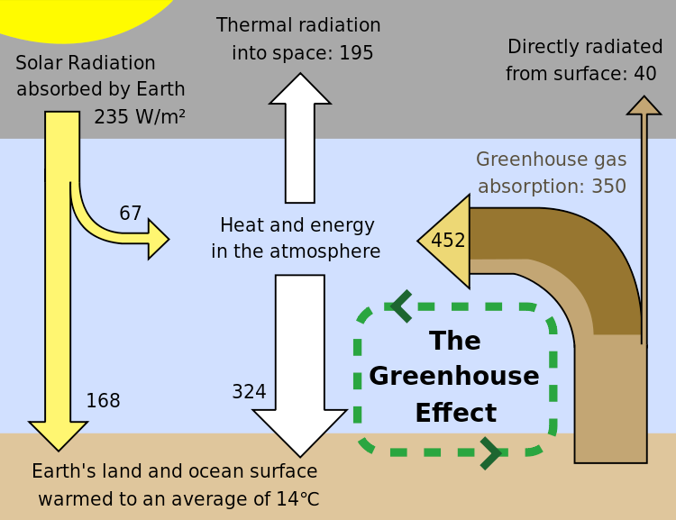{fig-alt="Diagram of Earth's greenhouse effect: incoming solar radiation (235 W/m^2), reflected and absorbed components, thermal radiation to space (195), and greenhouse-gas absorption/re-emission (452, 350, 324, 168 W/m^2) labeled with arrows between the sun, atmosphere, and surface."}

---

## Discrete Fourier Transform

<!-- TODO: complex slide layout (flagged by detect_complex_slide.py - see run log). Content below is complete but UNARRANGED - needs manual layout to match the original slide. -->

{fig-alt="Recurring decorative background image: the time-dependent Schrodinger equation, i-hbar d(psi)/dt = -hbar^2/2m d^2(psi)/dx^2 + V(x)psi(x,t), reproduced identically across this stretch of slides; not related to each slide's specific foreground content."}

- Can solve for Fourier coefficients

- The discrete Fourier transform is computed on $N$ equally spaced points.
- For example: suppose you take a rod of length $L$, and measure the temperature at $N$ equally spaced points :

- $$\begin{matrix}
{x}_{j} & =L\frac{j}{N} \\
{T}_{j} & :=T({x}_{j})-T(0)
\end{matrix}$$

- The Fourier transform is:

- $$\begin{matrix}
{T}_{j} & =\mathop{\mathop{ \sum }\limits_{k=0}}\limits^{N-1}{F}_{k}sin\left( \frac{ \pi kj}{N} \right) \\
{F}_{k} & =\frac{2}{N}\mathop{\mathop{ \sum }\limits_{j=0}}\limits^{N-1}{T}_{j}sin\left( \frac{ \pi kj}{N} \right)
\end{matrix}$$

---

## Discrete Fourier Transform

<!-- TODO: complex slide layout (flagged by detect_complex_slide.py - see run log). Content below is complete but UNARRANGED - needs manual layout to match the original slide. -->

{fig-alt="Recurring decorative background image: the time-dependent Schrodinger equation, i-hbar d(psi)/dt = -hbar^2/2m d^2(psi)/dx^2 + V(x)psi(x,t), reproduced identically across this stretch of slides; not related to each slide's specific foreground content."}

- Can solve for Fourier coefficients

- The discrete Fourier transform is computed on $N$ equally spaced points.
- For example: suppose you take a rod of length $L$, and measure the temperature at $N$ equally spaced points :

- $$\begin{matrix}
{x}_{j} & =L\frac{j}{N} \\
{T}_{j} & :=T({x}_{j})-T(0)
\end{matrix}$$

- The Fourier transform is:

- $$\begin{matrix}
{T}_{j} & =\mathop{\mathop{ \sum }\limits_{k=0}}\limits^{N-1}{F}_{k}sin\left( \frac{ \pi kj}{N} \right) \\
{F}_{k} & =\frac{2}{N}\mathop{\mathop{ \sum }\limits_{j=0}}\limits^{N-1}{T}_{j}sin\left( \frac{ \pi kj}{N} \right)
\end{matrix}$$

---

## Computational complexity

<!-- TODO: complex slide layout (flagged by detect_complex_slide.py - see run log). Content below is complete but UNARRANGED - needs manual layout to match the original slide. -->

{fig-alt="Recurring decorative background image: the time-dependent Schrodinger equation, i-hbar d(psi)/dt = -hbar^2/2m d^2(psi)/dx^2 + V(x)psi(x,t), reproduced identically across this stretch of slides; not related to each slide's specific foreground content."}

- Can solve for Fourier coefficients

- This is basically just a matrix multiplication. Let ${S}_{jk}=sin\left( \frac{ \pi kj}{N} \right)$:

- $$\begin{matrix}
{T}_{j} & ={S}_{jk}{F}_{k} \\
{F}_{k} & =\frac{2}{N}{S}_{jk}{T}_{j}
\end{matrix}$$

- Count the number of operations:
  - N-1 coefficients ${F}_{k}$ (note: ignoring ${F}_{0}=0$).
  - For each coefficient, perform N-1 (multiply-add) operations.
- Total: $(N-1{)}^{2}$

---

## Computational complexity

<!-- TODO: complex slide layout (flagged by detect_complex_slide.py - see run log). Content below is complete but UNARRANGED - needs manual layout to match the original slide. -->

{fig-alt="Recurring decorative background image: the time-dependent Schrodinger equation, i-hbar d(psi)/dt = -hbar^2/2m d^2(psi)/dx^2 + V(x)psi(x,t), reproduced identically across this stretch of slides; not related to each slide's specific foreground content."}

- Can solve for Fourier coefficients

- We say that the discrete Fourier transform has $O({N}^{2})$ time complexity.
  - ["Big O" notation](https://en.wikipedia.org/wiki/Big_O_notation)
  - The leading coefficient in the number of operations scales like ${N}^{2}$.
  - Note: not all operations are equal, multiplication is a lot more expensive than addition.
- We always want to minimize the order!
  - $N$ can be arbitrarily large.
  - The difference between $N$, $NlnN$, ${N}^{2}$, ... can be huge.

---

## Discrete Fourier transform

<!-- TODO: complex slide layout (flagged by detect_complex_slide.py - see run log). Content below is complete but UNARRANGED - needs manual layout to match the original slide. -->

{fig-alt="Recurring decorative background image: the time-dependent Schrodinger equation, i-hbar d(psi)/dt = -hbar^2/2m d^2(psi)/dx^2 + V(x)psi(x,t), reproduced identically across this stretch of slides; not related to each slide's specific foreground content."}

- Can solve for Fourier coefficients

- To see this in code, let's look at a python implementation:

- def sine_transform(data):
- """Return Fourier sine transform of a real data vector"""
- N = len(data)
- transform = [ 0 ] * N
- for k in range(N):
- for j in range(N):
- angle = math.pi * k * j / N
- transform[k] += data[j] * math.sin(angle)
- return transform

---

# Fast fourier Transforms

---

## Fast Fourier transforms

<!-- TODO: complex slide layout (flagged by detect_complex_slide.py - see run log). Content below is complete but UNARRANGED - needs manual layout to match the original slide. -->

{fig-alt="Recurring decorative background image: the time-dependent Schrodinger equation, i-hbar d(psi)/dt = -hbar^2/2m d^2(psi)/dx^2 + V(x)psi(x,t), reproduced identically across this stretch of slides; not related to each slide's specific foreground content."}

- Can solve for Fourier coefficients

- Can we do better than $O({N}^{2})$? Sure!
  - Strategy: divide et impera! (divide and conquer)
  - AKA the “Cooley–Tukey” method
- General idea:
  - (Prerequisite: sample with some nicely divisible number, ideally $N={2}^{n}$.)
  - Do half at a time and add them together at the end.
- Result: $O(NlogN)$!
  - Numerical Recipes points out: for $N={10}^{8}$, this is like 1 second vs. 1 month!!!
- Let's go through the algorithm in detail.

---

## Fast Fourier transforms

<!-- TODO: complex slide layout (flagged by detect_complex_slide.py - see run log). Content below is complete but UNARRANGED - needs manual layout to match the original slide. -->

{fig-alt="Recurring decorative background image: the time-dependent Schrodinger equation, i-hbar d(psi)/dt = -hbar^2/2m d^2(psi)/dx^2 + V(x)psi(x,t), reproduced identically across this stretch of slides; not related to each slide's specific foreground content."}

- Can solve for Fourier coefficients

- Following Garcia's Numerical Recipes for Physics:

- $${Y}_{k+1}=\mathop{\mathop{ \sum }\limits_{j=0}}\limits^{N-1}{y}_{j+1}{W}_{N}^{kj},{W}_{N}={e}^{-2 \pi i/N}$$

- ${y}_{j+1}$=sampled data
- ${Y}_{k+1}$=Fourier coefficients

- Remember, we chose $N$ to be a power of 2. For concreteness, let $N=8$.
- With that in mind, let's write the indices in binary:

- $$\begin{matrix}
j & =4{j}_{2}+2{j}_{1}+{j}_{0} \\
k & =4{k}_{2}+2{k}_{1}+{k}_{0} \\
{y}_{j+1} &  \rightarrow y({j}_{2},{j}_{1},{j}_{0}) \\
{Y}_{k+1} &  \rightarrow Y({k}_{2},{k}_{1},{k}_{0}
\end{matrix}$$

- ${j}_{i},{k}_{i}$ range from 0 to 1

- $j,k$ range from 0 to 7

---

## Fast Fourier transforms

<!-- TODO: complex slide layout (flagged by detect_complex_slide.py - see run log). Content below is complete but UNARRANGED - needs manual layout to match the original slide. -->

{fig-alt="Recurring decorative background image: the time-dependent Schrodinger equation, i-hbar d(psi)/dt = -hbar^2/2m d^2(psi)/dx^2 + V(x)psi(x,t), reproduced identically across this stretch of slides; not related to each slide's specific foreground content."}

- Can solve for Fourier coefficients

- With binary-format indices, the Fourier transform becomes:

- $${Y}_{k+1}=\mathop{\mathop{ \sum }\limits_{j=0}}\limits^{N-1}{y}_{j+1}{W}_{N}^{kj},{W}_{N}={e}^{-2 \pi i/N}$$

- ${y}_{j+1}$=sampled data
- ${Y}_{k+1}$=Fourier coefficients

- $$Y({k}_{2},{k}_{1},{k}_{0})=\mathop{\mathop{ \sum }\limits_{{j}_{0}=0}}\limits^{1}\mathop{\mathop{ \sum }\limits_{{j}_{1}=0}}\limits^{1}\mathop{\mathop{ \sum }\limits_{{j}_{2}=0}}\limits^{1}y({j}_{2},{j}_{1},{j}_{0}){W}^{(4{k}_{2}+2{k}_{1}+{k}_{0})(4{j}_{2}+2{j}_{1}+{j}_{0})}$$

---

## Fast Fourier transforms

- Can solve for Fourier coefficients

- Simplification: ${W}_{N}={e}^{-2 \pi i/N}$, so if $M$ is a multiple of $N$, then ${W}_{N}^{M}=1$.
  - In our case, ${W}_{8}^{8}=1,{W}_{8}^{16}=1,$ etc.
  - Half the cross terms in the exponent vanish.

- $${W}^{(4{k}_{2}+2{k}_{1}+{k}_{0})(4{j}_{2}+2{j}_{1}+{j}_{0})} \rightarrow {W}^{4{k}_{0}{j}_{2}}{W}^{(2{k}_{1}+{k}_{0})2{j}_{1}}{W}^{(4{k}_{2}+2{k}_{1}+{k}_{0}){j}_{0}}$$

- Reorder the summations:

- $$Y({k}_{2},{k}_{1},{k}_{0})=\mathop{\mathop{ \sum }\limits_{{j}_{0}=0}}\limits^{1}{W}^{(4{k}_{2}+2{k}_{1}+{k}_{0}){j}_{0}}\left[ \mathop{\mathop{ \sum }\limits_{{j}_{1}=0}}\limits^{1}{W}^{(2{k}_{1}+{k}_{0})2{j}_{1}}\left[ \mathop{\mathop{ \sum }\limits_{{j}_{2}=0}}\limits^{1}y({j}_{2},{j}_{1},{j}_{0}){W}^{4{k}_{0}{j}_{2}} \right] \right]$$

---

## Fast Fourier transforms

<!-- TODO: complex slide layout (flagged by detect_complex_slide.py - see run log). Content below is complete but UNARRANGED - needs manual layout to match the original slide. -->

- Can solve for Fourier coefficients

- We now have a path to "divide and conquer", aka recursion.

- $$Y({k}_{2},{k}_{1},{k}_{0})=\mathop{\mathop{ \sum }\limits_{{j}_{0}=0}}\limits^{1}{W}^{(4{k}_{2}+2{k}_{1}+{k}_{0}){j}_{0}}\left[ \mathop{\mathop{ \sum }\limits_{{j}_{1}=0}}\limits^{1}{W}^{(2{k}_{1}+{k}_{0})2{j}_{1}}\left[ \mathop{\mathop{ \sum }\limits_{{j}_{2}=0}}\limits^{1}y({j}_{2},{j}_{1},{j}_{0}){W}^{4{k}_{0}{j}_{2}} \right] \right]$$

- $${y}_{1}({k}_{0},{j}_{1},{j}_{0}):=y(0,{j}_{1},{j}_{0})+y(1,{j}_{1},{j}_{0}){W}^{4{k}_{0}}$$

- $$Y({k}_{2},{k}_{1},{k}_{0})=\mathop{\mathop{ \sum }\limits_{{j}_{0}=0}}\limits^{1}{W}^{(4{k}_{2}+2{k}_{1}+{k}_{0}){j}_{0}}\left[ \mathop{\mathop{ \sum }\limits_{{j}_{1}=0}}\limits^{1}{W}^{(2{k}_{1}+{k}_{0})2{j}_{1}}{y}_{1}({k}_{0},{j}_{1},{j}_{0}) \right]$$

- 8 combos $({k}_{0},{j}_{1},{j}_{0})$

---

## Fast Fourier transforms

<!-- TODO: complex slide layout (flagged by detect_complex_slide.py - see run log). Content below is complete but UNARRANGED - needs manual layout to match the original slide. -->

- Can solve for Fourier coefficients

- We now have a path to "divide and conquer", aka recursion.

- $${y}_{2}({k}_{0},{k}_{1},{j}_{0}):={y}_{1}({k}_{0},0,{j}_{0})+{y}_{1}({k}_{0},1,{j}_{0}){W}^{4{k}_{1}+2{k}_{0}}$$

- $$Y({k}_{2},{k}_{1},{k}_{0})=\mathop{\mathop{ \sum }\limits_{{j}_{0}=0}}\limits^{1}{W}^{(4{k}_{2}+2{k}_{1}+{k}_{0}){j}_{0}}\left[ \mathop{\mathop{ \sum }\limits_{{j}_{1}=0}}\limits^{1}{W}^{(2{k}_{1}+{k}_{0})2{j}_{1}}{y}_{1}({k}_{0},{j}_{1},{j}_{0}) \right]$$

- 8 combos $({k}_{0},{k}_{1},{j}_{0})$

- $$Y({k}_{2},{k}_{1},{k}_{0})=\mathop{\mathop{ \sum }\limits_{{j}_{0}=0}}\limits^{1}{W}^{(4{k}_{2}+2{k}_{1}+{k}_{0}){j}_{0}}{y}_{2}({k}_{0},{k}_{1},{j}_{0})$$

---

## Fast Fourier transforms

<!-- TODO: complex slide layout (flagged by detect_complex_slide.py - see run log). Content below is complete but UNARRANGED - needs manual layout to match the original slide. -->

- Can solve for Fourier coefficients

- We now have a path to "divide and conquer", aka recursion.

- $${y}_{3}({k}_{0},{k}_{1},{k}_{2}):={y}_{2}({k}_{0},{k}_{1},0)+{y}_{2}({k}_{0},{k}_{1},1){W}^{4{k}_{2}+2{k}_{1}+{k}_{0}}$$

- 8 combos $({k}_{0},{k}_{1},{k}_{2})$

- $$Y({k}_{2},{k}_{1},{k}_{0})=\mathop{\mathop{ \sum }\limits_{{j}_{0}=0}}\limits^{1}{W}^{(4{k}_{2}+2{k}_{1}+{k}_{0}){j}_{0}}{y}_{2}({k}_{0},{k}_{1},{j}_{0})$$

- $$Y({k}_{2},{k}_{1},{k}_{0})={y}_{3}({k}_{0},{k}_{1},{k}_{2})$$

- We finally have Y!
  - With one interesting wrinkle: we have to "reverse the bits":

- Bit order seems arbitrary for ${y}_{2,3,...}()$, but remember, ${y}_{0}()=y()$!

---

## Fast Fourier transforms

<!-- TODO: complex slide layout (flagged by detect_complex_slide.py - see run log). Content below is complete but UNARRANGED - needs manual layout to match the original slide. -->

- Can solve for Fourier coefficients

- By using recursion, we have saved a lot of operations!
  - Recall, naive DFT is $O({N}^{2})$, so ~64 for $N=8$
- Our recursive algorithm used:

- $${y}_{3}({k}_{0},{k}_{1},{k}_{2}):={y}_{2}({k}_{0},{k}_{1},0)+{y}_{2}({k}_{0},{k}_{1},1){W}^{4{k}_{2}+2{k}_{1}+{k}_{0}}$$

- 8 multiply-adds $({k}_{0},{k}_{1},{k}_{2})$

- $${y}_{1}({k}_{0},{j}_{1},{j}_{0}):=y(0,{j}_{1},{j}_{0})+y(1,{j}_{1},{j}_{0}){W}^{4{k}_{0}}$$

- $${y}_{2}({k}_{0},{k}_{1},{j}_{0}):={y}_{1}({k}_{0},0,{j}_{0})+{y}_{1}({k}_{0},1,{j}_{0}){W}^{4{k}_{1}+2{k}_{0}}$$

- 8 multiply-adds $({k}_{0},{j}_{1},{j}_{0})$

- 8 multiply-adds $({k}_{0},{k}_{1},{j}_{0})$

- 24 = 8 ln(8) total operations!

- (Note: neglecting O(N) stuff,
- also cache the ${W}^{x}$es)

---

## Fast Fourier transforms

<!-- TODO: complex slide layout (flagged by detect_complex_slide.py - see run log). Content below is complete but UNARRANGED - needs manual layout to match the original slide. -->

- Can solve for Fourier coefficients

- Just to drive the point home: $O(NlnN)$ is a huge improvement over $O({N}^{2})$:

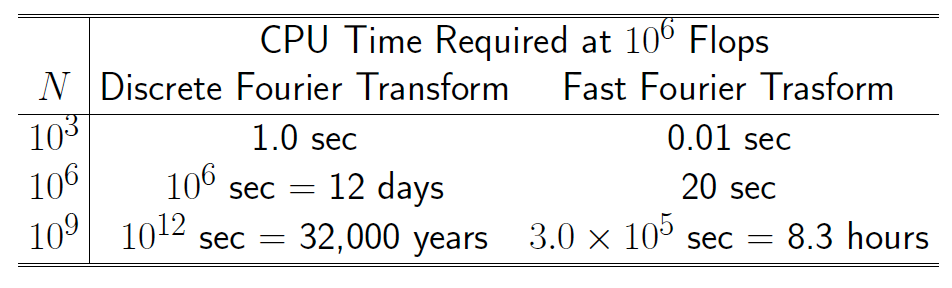{fig-alt="Table titled 'CPU Time Required at 10^6 Flops' comparing the Discrete Fourier Transform to the Fast Fourier Transform for N=10^3, 10^6, 10^9: e.g. at N=10^9, DFT takes ~32,000 years versus ~8.3 hours for FFT."}

---

## Fast Fourier transforms

- Can solve for Fourier coefficients

- That may have been black magic and/or super confusion, so let's take a look at a second derivation, the Danielson–Lanczos lemma.
  - Fun fact: actually predates Cooley–Tukey by about 20 years.
- Basic idea: starting from ${2}^{N}$ samples, divide into "even" and "odd" points.

- $$\begin{matrix}
{F}_{k} & =\mathop{\mathop{ \sum }\limits_{j=0}}\limits^{N-1}{e}^{2 \pi ijk/N}{f}_{j} \\
 & =\mathop{\mathop{ \sum }\limits_{j=0}}\limits^{N/2-1}{e}^{2 \pi ik(2j)/N}{f}_{2j}+\mathop{\mathop{ \sum }\limits_{j=0}}\limits^{N/2-1}{e}^{2 \pi ik(2j+1)/N}{f}_{2j+1} \\
 & =\mathop{\mathop{ \sum }\limits_{j=0}}\limits^{N/2-1}{e}^{2 \pi ikj/(N/2)}{f}_{2j}+{W}^{k}\mathop{\mathop{ \sum }\limits_{j=0}}\limits^{N/2-1}{e}^{2 \pi ikj/(N/2)}{f}_{2j+1} \\
 & ={F}_{k}^{e}+{W}^{k}{F}_{k}^{o}
\end{matrix}$$

- Numerical Recipes, chapter 12.2

- Split by even/odd indices

- Rewrite with N/2s

- ${F}_{k}^{e}$ is the FT of the $\frac{N}{2}$ even points

- ${F}_{k}^{o}$ is the FT of the $\frac{N}{2}$ odd points

---

## Fast Fourier transforms

- Can solve for Fourier coefficients

- Then, we can keep splitting:

- $$\begin{matrix}
{F}_{k} & ={F}_{k}^{e}+{W}^{k}{F}_{k}^{o} \\
 & =({F}_{k}^{ee}+{W}^{k}{F}_{k}^{eo})+{W}^{k}({F}_{k}^{oe}+{W}^{k}{F}_{k}^{oo}) \\
 & =...
\end{matrix}$$

- Numerical Recipes, chapter 12.2

- Eventually, go from a single DFT of $N={2}^{n}$ element, to $N$ DFTs of a single element.
- But the DFT of a single element is just the identity! In other words, assuming we've hit the bottom, we have:

- $$\begin{aligned}
{F}_{k}^{eoeeeo...eoo}={f}_{j}\text{for some}j
\end{aligned}$$

---

## Fast Fourier transforms

<!-- TODO: complex slide layout (flagged by detect_complex_slide.py - see run log). Content below is complete but UNARRANGED - needs manual layout to match the original slide. -->

- Can solve for Fourier coefficients

- Our final coefficients are in one-to-one correspondence with our initial samples:

- Numerical Recipes, chapter 12.2

- $$\begin{aligned}
{F}_{k}^{eoeeeo...eoo}={f}_{j}\text{for some}j
\end{aligned}$$

- Luckily, we have a simple(ish) algorithm for figuring out the correspondence.
- Intuition: at each step, we divided into even/odd indices. This is the same as:
  - Take binary representation of indices.
  - Split on last digit (least significant bit).
  - Bit shift the remaining bits to the right (>>).
- Thus, the eoeeo... string basically just encodes the binary representation of the index!

- The actual algorithm:
  - Change $e \rightarrow 0$ and $o \rightarrow 1$.
  - Reverse the bit order.
- Example: ${F}_{k}^{eoe}$
  - $$eoo \rightarrow 011 \rightarrow 110 \rightarrow {f}_{6}$$

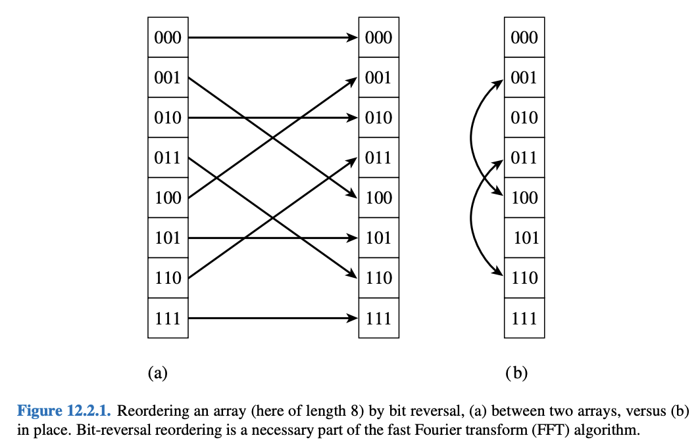{fig-alt="Figure 12.2.1 (Numerical Recipes): reordering an array of length 8 by bit reversal, shown two ways - (a) crossed arrows mapping binary indices 000-111 between two separate arrays, and (b) the same reordering done in place with arrows curving within one array."}

---

## Fast Fourier transforms

<!-- TODO: complex slide layout (flagged by detect_complex_slide.py - see run log). Content below is complete but UNARRANGED - needs manual layout to match the original slide. -->

- Can solve for Fourier coefficients

- Numerical Recipes, chapter 12.2

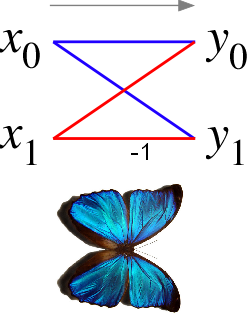{fig-alt="A 2-point FFT 'butterfly' diagram: inputs x0, x1 combine via crossed blue/red lines (with a '-1' weight) into outputs y0, y1; below it, an image of a blue morpho butterfly, playing on the 'butterfly diagram' name."}

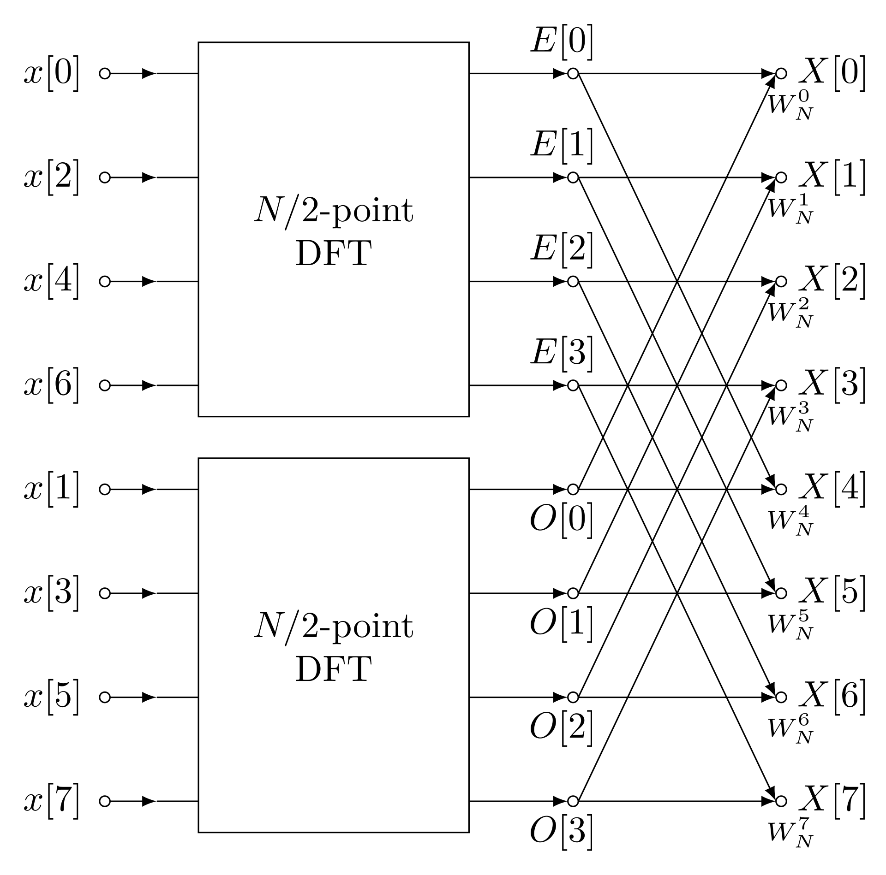{fig-alt="Full flow diagram of an 8-point decimation-in-time FFT: inputs x[0],x[2],x[4],x[6] feed one N/2-point DFT block and x[1],x[3],x[5],x[7] feed another; their outputs E[0..3] and O[0..3] combine through crossed lines weighted by twiddle factors W_N^0 through W_N^7 to produce X[0] through X[7]."}

- By Yangwenbo99 - Own work, CC BY-SA 4.0, https://commons.wikimedia.org/w/index.php?curid=111271197

- https://en.wikipedia.org/wiki/Butterfly_diagram#/media/File:Butterfly-FFT.png

---

## Pseudocode to code

- Can solve for Fourier coefficients

- We've done all the hard work already! The algorithm is rather simple to write in python.
- Let's start with pseudocode:
  - Input data: $N={2}^{n}$ measurements in the space domain (evenly spaced).
  - Separate even and odd indices.
  - Use recursion on each half.

- fft ( x ) :
- n = size of data
- recursively call fft(even x’s)
- recursively call fft(odd x’s)
- combine results

---

## Pseudocode to code

- Can solve for Fourier coefficients

- fft ( x ) :
- n = size of data
- recursively call fft(even x’s)
- recursively call fft(odd x’s)
- combine results

- from cmath import exp, pi
- def fft(x):
- N = len(x)
- if N <= 1: return x
- even = fft(x[0::2])
- odd =  fft(x[1::2])
- return [even[k] + exp(-2j*pi*k/N)*odd[k] for k in xrange(N/2)] + \
- [even[k] - exp(-2j*pi*k/N)*odd[k] for k in xrange(N/2)]
- print fft([1.0, 1.0, 1.0, 1.0, 0.0, 0.0, 0.0, 0.0])

---

## Sanity check

- Can solve for Fourier coefficients

- from cmath import exp, pi
- def fft(x):
- N = len(x)
- if N <= 1: return x
- even = fft(x[0::2])
- odd =  fft(x[1::2])
- return [even[k] + exp(-2j*pi*k/N)*odd[k] for k in xrange(N/2)] + \
- [even[k] - exp(-2j*pi*k/N)*odd[k] for k in xrange(N/2)]
- print fft([1.0, 1.0, 1.0, 1.0, 0.0, 0.0, 0.0, 0.0])

- Hold up, what if N is not a power of 2?
- Eventually, the recursion will encounter a case where len(even) != len(odd)...

---

## Sanity check

- Can solve for Fourier coefficients

- from cmath import exp, pi
- def fft(x):
- N = len(x)
- if N <= 1: return x
- even = fft(x[0::2])
- odd =  fft(x[1::2])
- return [even[k] + exp(-2j*pi*k/N)*odd[k] for k in xrange(N/2)] + \
- [even[k] - exp(-2j*pi*k/N)*odd[k] for k in xrange(N/2)]
- print fft([1.0, 1.0, 1.0, 1.0, 0.0, 0.0, 0.0, 0.0])

- Hold up, what if N is not a power of 2?
- Eventually, the recursion will encounter a case where len(even) != len(odd)...
- Solution: well, we can always fall back on the regular DFT...
  - ...even if DFT is super slow 🐌 compared to FFT 🐇

---

## Handling odd numbers

- Can solve for Fourier coefficients

- from cmath import exp, pi
- def discrete_transform(data):
- """Return Discrete Fourier Transform (DFT) of a complex data vector"""
- N = len(data)
- transform = np.zeros(N)
- for k in range(N):
- for j in range(N):
- angle = 2 * pi * k * j / N
- transform[k] += data[j] * exp(1j * angle)
- return transform
- def fft(x):
- N = len(x)
- if N <= 1: return x
- elif N % 2 == 1:         # N is odd, lemma does not apply
- print(f"N={N} is odd, fall back to discrete transform')
- return discrete_transform(x)
- even = fft(x[0::2])
- odd =  fft(x[1::2])
- return np.array( [even[k] + exp(-2j*pi*k/N)*odd[k] for k in range(N//2)] + \
- [even[k] - exp(-2j*pi*k/N)*odd[k] for k in range(N//2)] )

- (There are better solutions, more on this later)

---

## Demo: single sine wave

- Can solve for Fourier coefficients

- These functions are implemented in CompPhys/DataAnalysis/FFT/fft.py.
- Let's give them a spin, for a simple test case:

- $${y}_{j}=sin\left( \frac{2 \pi j}{N}f \right)$$

- Expectation: Fourier transform should spike at $f$, zero everywhere else.

---

## Demo: single sine wave

<!-- TODO: complex slide layout (flagged by detect_complex_slide.py - see run log). Content below is complete but UNARRANGED - needs manual layout to match the original slide. -->

{fig-alt="Top: a single sine wave sampled over ~1000 points. Bottom: its Fourier spectral index/component plot, showing two sharp symmetric peaks, with results from a hand-written FFT ('our fft', filled blue dots) exactly overlapping NumPy's FFT ('numpy fft', open orange circles)."}

- Can solve for Fourier coefficients

- $$y(x)=sin\left( \frac{2 \pi k}{N}x \right)$$

- $$k=10,N=1024,f=\frac{10}{1024},T=102.4$$

- Yay! Sine wave, period ~ 100

---

## Demo: single sine wave

<!-- TODO: complex slide layout (flagged by detect_complex_slide.py - see run log). Content below is complete but UNARRANGED - needs manual layout to match the original slide. -->

{fig-alt="Top: a single sine wave sampled over ~1000 points. Bottom: its Fourier spectral index/component plot, showing two sharp symmetric peaks, with results from a hand-written FFT ('our fft', filled blue dots) exactly overlapping NumPy's FFT ('numpy fft', open orange circles)."}

- Can solve for Fourier coefficients

- $$y(x)=sin\left( \frac{2 \pi k}{N}x \right)$$

- $$k=10,N=1024,f=\frac{10}{1024},T=102.4$$

- Yay!

- Yay! Sine wave, period ~ 100

---

## Demo: single sine wave

<!-- TODO: complex slide layout (flagged by detect_complex_slide.py - see run log). Content below is complete but UNARRANGED - needs manual layout to match the original slide. -->

{fig-alt="Top: a single sine wave sampled over ~1000 points. Bottom: its Fourier spectral index/component plot, showing two sharp symmetric peaks, with results from a hand-written FFT ('our fft', filled blue dots) exactly overlapping NumPy's FFT ('numpy fft', open orange circles)."}

- Can solve for Fourier coefficients

- $$y(x)=sin\left( \frac{2 \pi k}{N}x \right)$$

- $$k=10,N=1024,f=\frac{10}{1024},T=102.4$$

- Yay!

- Huh?

- Yay! Sine wave, period ~ 100

---

## Nyquist frequency

<!-- TODO: complex slide layout (flagged by detect_complex_slide.py - see run log). Content below is complete but UNARRANGED - needs manual layout to match the original slide. -->

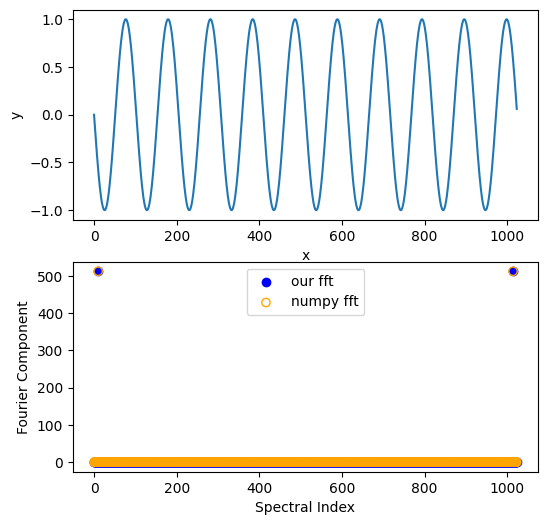{fig-alt="Top: a single sine wave sampled over ~1000 points. Bottom: its Fourier spectral index/component plot, showing two sharp symmetric peaks, with results from a hand-written FFT ('our fft', filled blue dots) exactly overlapping NumPy's FFT ('numpy fft', open orange circles)."}

- Can solve for Fourier coefficients

- The power spectrum of a real-valued function is symmetric about the Nyquist frequency, which is half the sampling rate: ${f}_{c}=\frac{1}{2}{f}_{s}=\frac{1}{2 \Delta }$,
  - Where ${f}_{s}$ is the sampling frequency (or $ \Delta $ is the sampling interval).
- Specifically, ${F}_{k}={F}_{-k}^{*}$ (fairly simple to prove this!).
- Intuition: consider a sine wave with frequency $f$. We have to sample with  ${f}_{s}>2f$. This means we sample at least every peak-trough-peak-trough-...

---

## Aliasing

<!-- TODO: complex slide layout (flagged by detect_complex_slide.py - see run log). Content below is complete but UNARRANGED - needs manual layout to match the original slide. -->

- Can solve for Fourier coefficients

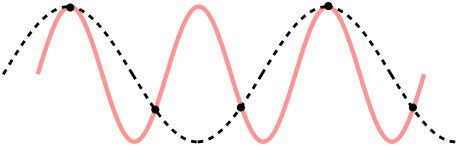{fig-alt="A solid pink continuous sine wave with a black dashed line sampling it at roughly 1.5 samples per cycle, illustrating underspecified/aliased sampling near the Nyquist limit."}

{fig-alt="A solid pink continuous sine wave with a black dashed line sampling it at roughly 1.5 samples per cycle, illustrating underspecified/aliased sampling near the Nyquist limit."}

- Aliasing occurs when the sampling rate is too low: the actual signal has some frequency component, $f$, greater than the Nyquist frequency:
  - $$f>{f}_{c}=\frac{{f}_{s}}{2}$$
  - Fourier transform will have spurious Fourier components at lower frequencies.
- Example: CD audio samples at 44.1 kHz, so ${f}_{c}=22.05\text{kHz}$.
  - If higher frequencies are present, the CD will exhibit a lower frequency alias (distortion).
  - Solutions: filter higher frequencies; sample more.

---

## Aliasing

<!-- TODO: complex slide layout (flagged by detect_complex_slide.py - see run log). Content below is complete but UNARRANGED - needs manual layout to match the original slide. -->

- Can solve for Fourier coefficients

- Aliasing occurs when the sampling rate is too low: the actual signal has some frequency component, $f$, greater than the Nyquist frequency:
  - $$f>{f}_{c}=\frac{{f}_{s}}{2}$$
  - Fourier transform will have spurious Fourier components at lower frequencies.
- Example: CD audio samples at 44.1 kHz, so ${f}_{c}=22.05\text{kHz}$.
  - If higher frequencies are present, the CD will exhibit a lower frequency alias (distortion).
  - Solutions: filter higher frequencies; sample more.

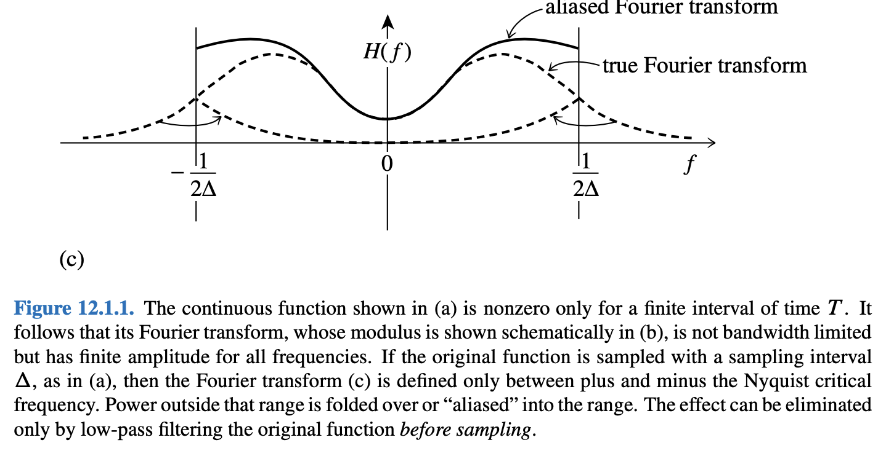{fig-alt="Figure 12.1.1(c) (Numerical Recipes): plot of H(f) showing the 'true Fourier transform' (dashed) versus the 'aliased Fourier transform' (solid) that results from sampling at interval Delta, with the Nyquist critical frequencies at +/-1/(2*Delta) marked; caption explains that power outside the Nyquist range folds back ('aliases') into it."}

---

## Global warming

- Can solve for Fourier coefficients

- [Humans] have now all but destroyed this once salubrious
- planet as a life-support system in fewer than 200 years,
- mainly by making thermodynamic whoopee with fossil fuels.
- -- Kurt Vonnegut

---

## Global warming

<!-- TODO: complex slide layout (flagged by detect_complex_slide.py - see run log). Content below is complete but UNARRANGED - needs manual layout to match the original slide. -->

- Can solve for Fourier coefficients

- Solar energy incident on Earth's is partially [reflected](https://www.youtube.com/watch?v=DxL2HoqLbyA) back into space as lower wavelength infrared radiation.
- CO2 in the atmosphere tends to trap this radiation and is an important factor in the phenomenon of global warming. Global warming has important consequences for the biosphere and human society.
- Interested in learning more? Check out the Intergovernmental Panel on Climate Change: [http://www.ipcc.ch/](http://www.ipcc.ch/).

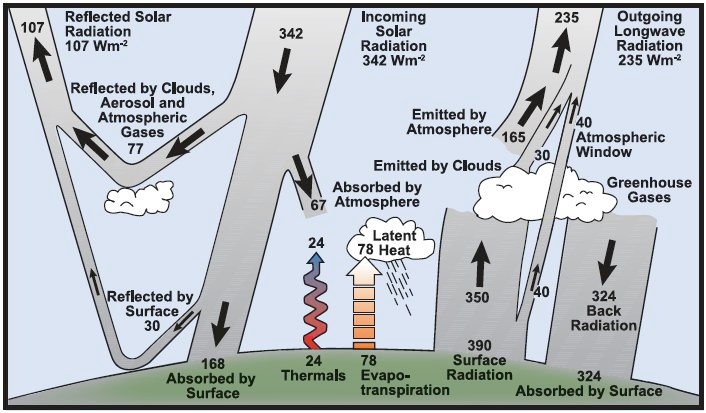{fig-alt="Diagram of Earth's global energy balance: incoming solar radiation (342 W/m^2), reflected radiation (107), and outgoing longwave radiation (235), broken into components absorbed/reflected/emitted by the atmosphere, clouds, and surface (thermals, evapotranspiration, back radiation, etc.), each labeled with W/m^2 values."}

---

## Global warming

<!-- TODO: complex slide layout (flagged by detect_complex_slide.py - see run log). Content below is complete but UNARRANGED - needs manual layout to match the original slide. -->

- Can solve for Fourier coefficients

- Situated at 11,135 ft on the north flank of the Mauna Loa volcano on the Big Island of Hawaii, the National Oceanic and Atmospheric Administration's [Mauna Loa Observatory](http://www.mlo.noaa.gov/) has been monitoring the level of carbon dioxide in Earth's atmosphere for over 50 years. The levels of this greenhouse gas have been rising steadily during this observation period.
- Globally we’re at the highest point in hundreds of thousands of years
- Also see [ice core data](http://cdiac.ornl.gov/trends/co2/vostok.html) from Vostok, Antarctica.

{fig-alt="Line plot titled 'Vostok, Antarctica, Ice-core CO2 Record': CO2 concentration (ppmv, 170-300) versus age of entrapped air (kyr BP, 0-420), showing several broad glacial-interglacial oscillations (source: Jean-Marc Barnola et al.)."}

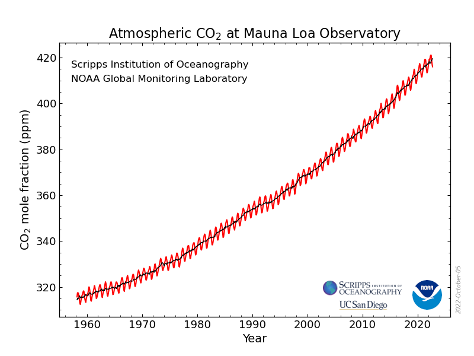{fig-alt="Line plot 'Atmospheric CO2 at Mauna Loa Observatory' (Scripps Institution of Oceanography / NOAA): CO2 mole fraction (ppm) rising steadily from ~315 in 1958 to ~420 by the 2020s, with a fine sawtooth annual cycle superimposed on the upward trend."}

---

## Global warming

<!-- TODO: complex slide layout (flagged by detect_complex_slide.py - see run log). Content below is complete but UNARRANGED - needs manual layout to match the original slide. -->

- Can solve for Fourier coefficients

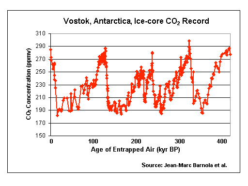{fig-alt="Line plot titled 'Vostok, Antarctica, Ice-core CO2 Record': CO2 concentration (ppmv, 170-300) versus age of entrapped air (kyr BP, 0-420), showing several broad glacial-interglacial oscillations (source: Jean-Marc Barnola et al.)."}

- 420

- Today

---

## Global warming

<!-- TODO: complex slide layout (flagged by detect_complex_slide.py - see run log). Content below is complete but UNARRANGED - needs manual layout to match the original slide. -->

- Can solve for Fourier coefficients

- Anyways, we can Fourier transform the data! 😁
  - We already have fft.py (and np.fft), so we "just" have to read in the data.
- Let's take a minute to think about the problem first:
  - General features: clearly some annual trend, plus the overall rise.
  - Think about units: data is monthly. ${F}_{k} \leftrightarrow sin\left( 2 \pi kj/N \right)$; j is in months, sofrequency is $k/N{\text{month}}^{-1}$.

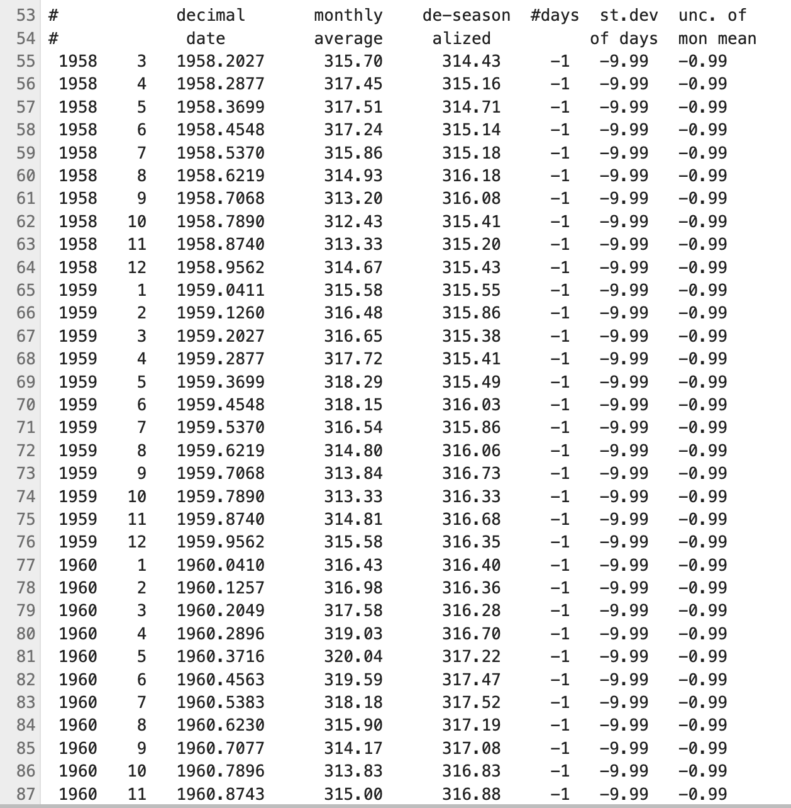{fig-alt="Screenshot of a raw monthly CO2 data table/spreadsheet (Mauna Loa, 1958-1960) with columns for year, month, decimal date, monthly average, de-seasonalized value, and uncertainty statistics."}

---

## Power spectrum

<!-- TODO: complex slide layout (flagged by detect_complex_slide.py - see run log). Content below is complete but UNARRANGED - needs manual layout to match the original slide. -->

- Can solve for Fourier coefficients

- One more detail: rather than plotting just abs(magnitude) of Fourier components, we define the power spectrum:
- $$P({ \omega }_{k})=\frac{1}{N}\left\{ \begin{matrix}
|{g}_{0}{|}^{2} & :k=0 \\
|{g}_{k}{|}^{2}+|{g}_{N-k}{|}^{2} & :1 \leq k \leq \frac{N}{2}-1 \\
|{g}_{\frac{N}{2}}{|}^{2} & :k=\frac{N}{2}
\end{matrix} \right\}$$

{fig-alt="Screenshot of a raw monthly CO2 data table/spreadsheet (Mauna Loa, 1958-1960) with columns for year, month, decimal date, monthly average, de-seasonalized value, and uncertainty statistics."}

- Related to Parseval's theorem:
- $$\mathop{\mathop{ \sum }\limits_{j=0}}\limits^{N-1}|{y}_{j}{|}^{2}=\frac{1}{N}\mathop{\mathop{ \sum }\limits_{k=0}}\limits^{N-1}|{Y}_{k}{|}^{2}$$

---

## Hands-on

- Can solve for Fourier coefficients

- Run through the second half of fft_test.ipynb.
  - Take a minute to read the input data file. Make sure you understand the structure, and how it is read into numpy.

---

## Results

<!-- TODO: complex slide layout (flagged by detect_complex_slide.py - see run log). Content below is complete but UNARRANGED - needs manual layout to match the original slide. -->

- Can solve for Fourier coefficients

{fig-alt="Top: the rising CO2 concentration time series (sawtooth trend). Bottom: its FFT power/magnitude spectrum on a log scale, falling off steeply from low spectral index with a small bump corresponding to the annual cycle."}

---

## Recap

- Can solve for Fourier coefficients

- Introduced the Fast Fourier Transform algorithm
  - Improves from $O({N}^{2})$ to $O(NlogN)$, which is a big difference.
- Implemented FFT in a simple python function.
  - Compare vs. numpy for a simple test case.
  - Introduced Nyquist frequency.
- Real life example: used FFT on CO2 data from Mauna Loa Observatory.
- Next time:
  - How to handle $N!={2}^{n}$

---

# Clipping and windowing

---

## What about N!=2^n?

- Can solve for Fourier coefficients

- Recall that the FFT algorithm works best if $N={2}^{n}$.
- So far, if $N!={2}^{n}$, we fell back on the discrete Fourier transform, which is orders of magnitudes slower.

---

## What about N!=2^n?

- Can solve for Fourier coefficients

- Numerical Recipes will tell you: just "pad" the input data to increase the input size to a power of 2. Let's give this a try!
  - See fft_padding.ipynb.

- >> data = np.random.rand(5)
- >> data_padded = np.zeros(8)
- >> data_padded[:5] = data
- >> print(data)
- array([0.19937108, 0.90607808, 0.66034474, 0.31110238, 0.17245472,
- 0.        , 0.        , 0.        ])

---

## Clipping

- Can solve for Fourier coefficients

- Clipping restored the fast performance of our FFT, at the expense of artificially creating a bunch of extra Fourier components: spectral leakage.
- Why did this happen? We can understand using the convolution theorem.
  - Basically, we are taking the Fourier transform of our function times a "box function": 1 for the first M values, 0 elsewhere.
- First, the convolution of two functions is defined as:

- $$r*s(x)={ \int }_{- \infty }^{ \infty }s(x- \tau )r( \tau )d \tau $$

- Continuous

- Discrete

- $$(r*s{)}_{j}=\mathop{\mathop{ \sum }\limits_{k=-N/2+1}}\limits^{\frac{N}{2}}{s}_{j-k}{r}_{k}$$

---

## Convolutions

- Can solve for Fourier coefficients

- Usually, we think of $s$ as our signal (function of interest), and $r$ as a "response function."
- Intuition: let's take a simple case.
  - $${r}_{-1}=0.25,{r}_{0}=0.5,{r}_{1}=0.25$$
  - $$(r*s{)}_{1}=\mathop{\mathop{ \sum }\limits_{k=-N/2+1}}\limits^{\frac{N}{2}}{s}_{1-k}{r}_{k}=0.25{s}_{0}+0.5{s}_{1}+0.25{s}_{2}$$
- The convolution has "smeared out" ${s}_{j}$ using $r$.

- $$(r*s{)}_{j}=\mathop{\mathop{ \sum }\limits_{k=-N/2+1}}\limits^{\frac{N}{2}}{s}_{j-k}{r}_{k}$$

---

## Convolutions

<!-- TODO: complex slide layout (flagged by detect_complex_slide.py - see run log). Content below is complete but UNARRANGED - needs manual layout to match the original slide. -->

- Can solve for Fourier coefficients

- Usually, we think of $s$ as our signal (function of interest), and $r$ as a "response function."
- Intuition: let's take a simple case.
  - $${r}_{-1}=0.25,{r}_{0}=0.5,{r}_{1}=0.25$$
  - $$(r*s{)}_{1}=\mathop{\mathop{ \sum }\limits_{k=-N/2+1}}\limits^{\frac{N}{2}}{s}_{1-k}{r}_{k}=0.25{s}_{0}+0.5{s}_{1}+0.25{s}_{2}$$
- The convolution has "smeared out" ${s}_{j}$ using $r$.

- $$(r*s{)}_{j}=\mathop{\mathop{ \sum }\limits_{k=-N/2+1}}\limits^{\frac{N}{2}}{s}_{j-k}{r}_{k}$$

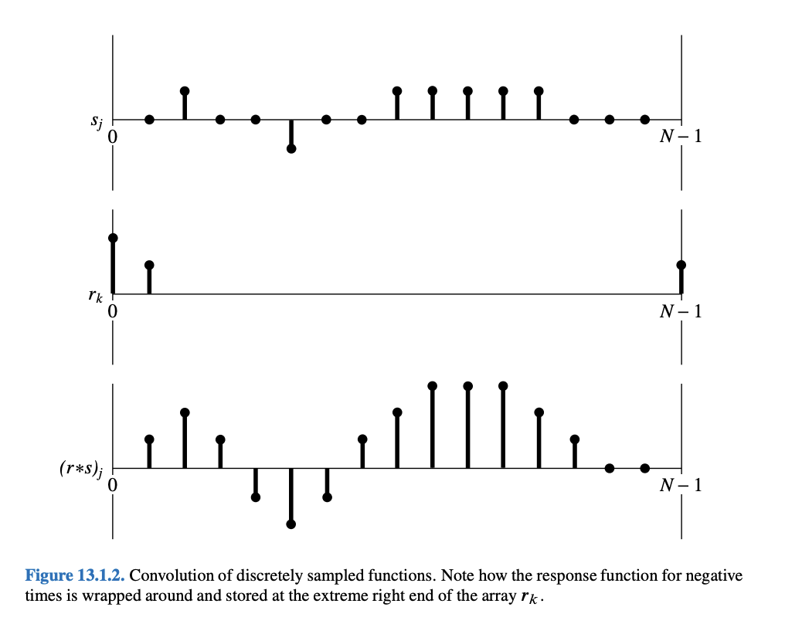{fig-alt="Figure 13.1.2 (Numerical Recipes): illustration of discrete convolution - a sampled signal s_j, a response function r_k (with its negative-time part wrapped around to the end of the array), and their convolution (r*s)_j, each shown as stem plots over indices 0 to N-1."}

---

## The Convolution Theorem

- Can solve for Fourier coefficients

- Convolutions have a very nice property for Fourier transforms.
- Let's say we have two functions ${r}_{j}$ and ${s}_{j}$ with Fourier transforms ${R}_{k}$ and ${S}_{k}$. If ${t}_{j}=(r*s{)}_{j}$ is the convolution,

- $$\begin{matrix}
{t}_{j} \equiv (r*s{)}_{j} & =\mathop{\mathop{ \sum }\limits_{k=-N/2+1}}\limits^{\frac{N}{2}}{s}_{j-k}{r}_{k}
\end{matrix}$$

- $${T}_{k}={R}_{k}{S}_{k}$$

- Then the Fourier transform of the convolution is just:

- The FT of a convolution is just the product of the FTs!
  - And vice versa: the FT of a product is the convolution of the FTs.

---

## Back to clipping

- Can solve for Fourier coefficients

- Now, back to clipping: our clipped function is just the product of the sine wave times a "box" function.
- So the FT of the clipped function is the convolution of the desired FT (delta function) and the FT of the box function.
  - In other words, our FT is "smeared out" by the FT of the box function.
- So, let's look at the FT of the box function:

---

## Back to clipping

<!-- TODO: complex slide layout (flagged by detect_complex_slide.py - see run log). Content below is complete but UNARRANGED - needs manual layout to match the original slide. -->

- Can solve for Fourier coefficients

- Now, back to clipping: our clipped function is just the product of the sine wave times a "box" function.
- So the FT of the clipped function is the convolution of the desired FT (delta function) and the FT of the box function.
  - In other words, our FT is "smeared out" by the FT of the box function.
- So, let's look at the FT of the box function:

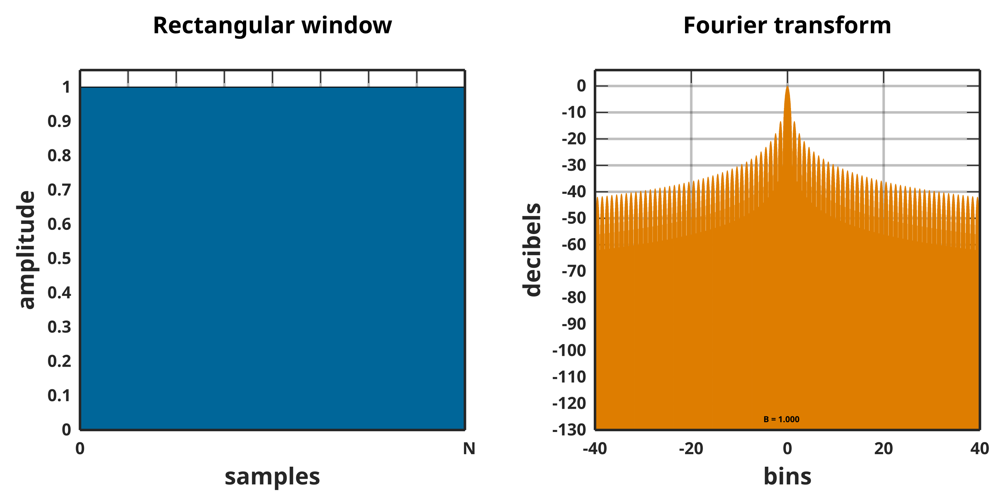{fig-alt="Top: a rising CO2-concentration-like sawtooth signal, truncated/zero-padded partway through the sample array. Bottom: the resulting log-scale power and magnitude spectrum, showing a steep falloff from very low frequencies plus spiky artifacts from the abrupt truncation."}

---

## Back to clipping

<!-- TODO: complex slide layout (flagged by detect_complex_slide.py - see run log). Content below is complete but UNARRANGED - needs manual layout to match the original slide. -->

- Can solve for Fourier coefficients

- Now, back to clipping: our clipped function is just the product of the sine wave times a "box" function.
- So the FT of the clipped function is the convolution of the desired FT (delta function) and the FT of the box function.
  - In other words, our FT is "smeared out" by the FT of the box function.
- So, let's look at the FT of the box function:

{fig-alt="Top: a rising CO2-concentration-like sawtooth signal, truncated/zero-padded partway through the sample array. Bottom: the resulting log-scale power and magnitude spectrum, showing a steep falloff from very low frequencies plus spiky artifacts from the abrupt truncation."}

- This is not very nice! The FT of the box has rather nontrivial structure, and spreads out far from 0.

---

## Padding the CO2 data

<!-- TODO: complex slide layout (flagged by detect_complex_slide.py - see run log). Content below is complete but UNARRANGED - needs manual layout to match the original slide. -->

- Can solve for Fourier coefficients

- This is even uglier for the CO2 data. This is the FT of our CO2 with zero-padding:

{fig-alt="Top: a short, rising CO2-like oscillating signal cut off at ~250 samples. Bottom: its log-scale power/magnitude spectrum, showing a steep low-frequency falloff with spiky truncation artifacts."}

---

## Padding the CO2 data

<!-- TODO: complex slide layout (flagged by detect_complex_slide.py - see run log). Content below is complete but UNARRANGED - needs manual layout to match the original slide. -->

- Can solve for Fourier coefficients

- The situation is better if we pad with 300s instead of 0s.
  - This is sort of a "DC offset".

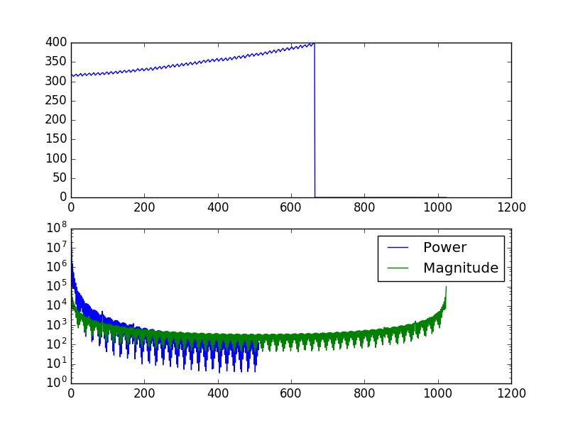{fig-alt="Top: a rising CO2-concentration-like sawtooth signal, truncated/zero-padded partway through the sample array. Bottom: the resulting log-scale power and magnitude spectrum, showing a steep falloff from very low frequencies plus spiky artifacts from the abrupt truncation."}

{fig-alt="Top: a rising CO2-concentration-like sawtooth signal, truncated/zero-padded partway through the sample array. Bottom: the resulting log-scale power and magnitude spectrum, showing a steep falloff from very low frequencies plus spiky artifacts from the abrupt truncation."}

---

## Padding the CO2 data

<!-- TODO: complex slide layout (flagged by detect_complex_slide.py - see run log). Content below is complete but UNARRANGED - needs manual layout to match the original slide. -->

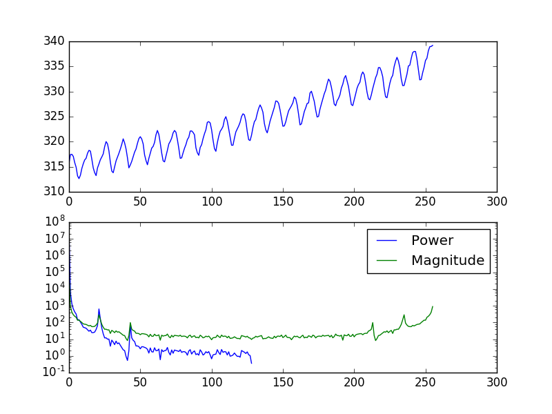{fig-alt="Top: a rising CO2-concentration-like sawtooth signal, truncated/zero-padded partway through the sample array. Bottom: the resulting log-scale power and magnitude spectrum, showing a steep falloff from very low frequencies plus spiky artifacts from the abrupt truncation."}

- Can solve for Fourier coefficients

- The situation is better if we pad with 300s instead of 0s.
  - This is sort of a "DC offset".
- We could also have just cut off at a power of 2 (with worse resolution)

{fig-alt="Top: a rising CO2-concentration-like sawtooth signal, truncated/zero-padded partway through the sample array. Bottom: the resulting log-scale power and magnitude spectrum, showing a steep falloff from very low frequencies plus spiky artifacts from the abrupt truncation."}

- Cutoff series at 256

---

## Windowing

<!-- TODO: complex slide layout (flagged by detect_complex_slide.py - see run log). Content below is complete but UNARRANGED - needs manual layout to match the original slide. -->

- Can solve for Fourier coefficients

- Can we get rid of this "ringing" effect?
- Of course! This is the topic of [windowing](http://en.wikipedia.org/wiki/Window_function).

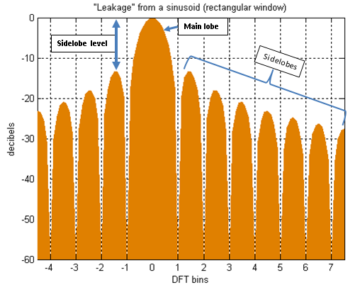{fig-alt="Plot titled ''Leakage' from a sinusoid (rectangular window)': a series of lobes in decibels versus DFT bin, with the tall central 'main lobe' at bin 0 flanked by smaller 'sidelobes' at each integer bin, annotated with arrows labeling the main lobe, sidelobe level, and sidelobes."}

---

## Windowing

<!-- TODO: complex slide layout (flagged by detect_complex_slide.py - see run log). Content below is complete but UNARRANGED - needs manual layout to match the original slide. -->

- Can solve for Fourier coefficients

- Recall, zero-padding was equivalent to a rectangular window cut:

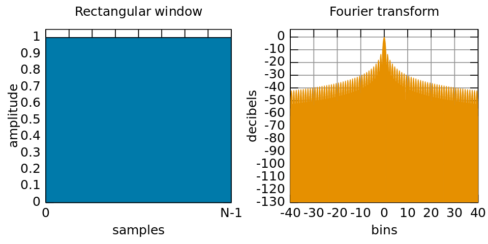{fig-alt="Two panels: a rectangular window function (flat top, amplitude 1 across all N samples) on the left, and its Fourier transform on the right, showing a narrow main lobe at bin 0 surrounded by many slowly-decaying sidelobes (roughly -40 dB) extending across +/-40 bins."}

- Your FT will be convolved with the orange distribution, smearing out the FT.

---

## Windowing

<!-- TODO: complex slide layout (flagged by detect_complex_slide.py - see run log). Content below is complete but UNARRANGED - needs manual layout to match the original slide. -->

- Can solve for Fourier coefficients

- Instead of a rectangle, we can multiple by a window function with a better Fourier transform.
- There are a zillion possibilities (see Wikipedia article)! Here are a couple:

{fig-alt="Two panels: a triangular window function (linear ramp up then down, peaking at 1 in the middle) on the left, and its Fourier transform on the right, showing a wider main lobe than a rectangular window but faster sidelobe decay (down to about -70 dB)."}

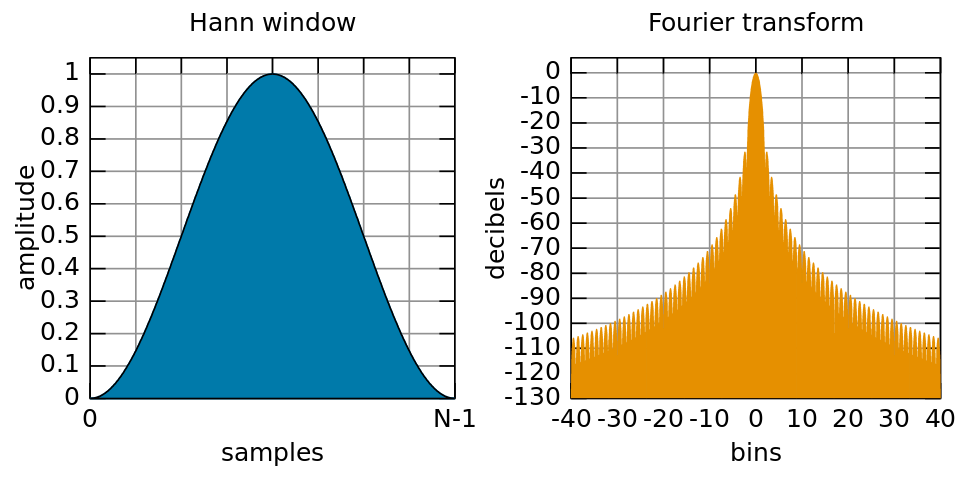{fig-alt="Two panels: a Hann window function (smooth raised-cosine bump from 0 to 1 and back to 0) on the left, and its Fourier transform on the right, showing an even wider main lobe with sidelobes decaying rapidly to below -100 dB."}

---

## Windowing and Fourier transforms

<!-- TODO: complex slide layout (flagged by detect_complex_slide.py - see run log). Content below is complete but UNARRANGED - needs manual layout to match the original slide. -->

- Can solve for Fourier coefficients

- So here's the general idea:
  - Pad the data and apply a nice window function. We are really modifying the input data! But we can undo it later.
  - Take the Fourier transform.

{fig-alt="Two panels: a Hann window function (smooth raised-cosine bump from 0 to 1 and back to 0) on the left, and its Fourier transform on the right, showing an even wider main lobe with sidelobes decaying rapidly to below -100 dB."}

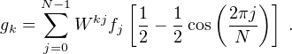{fig-alt="Equation: g_k = sum over j from 0 to N-1 of W^(kj) f_j [1/2 - 1/2 cos(2*pi*j/N)], the DFT of a Hann-windowed sequence."}

---

## Example: padding, no window

<!-- TODO: complex slide layout (flagged by detect_complex_slide.py - see run log). Content below is complete but UNARRANGED - needs manual layout to match the original slide. -->

- Can solve for Fourier coefficients

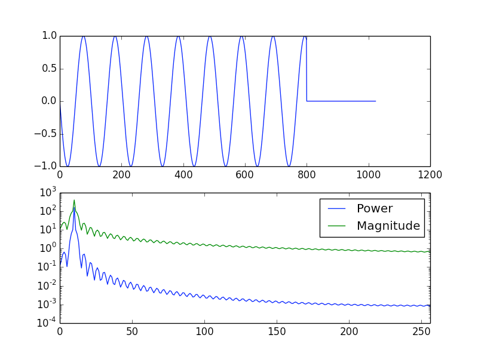{fig-alt="Top: a sine wave of about 8 cycles that is abruptly truncated to zero partway through the sample array (simulating zero-padding). Bottom: the resulting log-scale power/magnitude spectrum, showing pronounced 'ringing' - a spiky, slowly-decaying sidelobe pattern caused by the abrupt cutoff."}

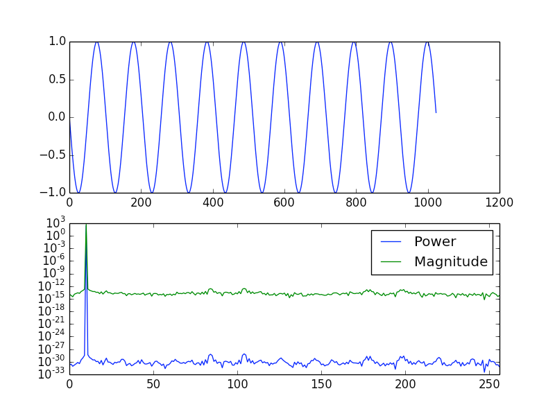{fig-alt="Top: a continuous, un-truncated sine wave spanning the full sample array. Bottom: its power/magnitude spectrum on an extreme log scale (down to ~1e-33), showing a single extremely clean, narrow peak with no visible ringing - the ideal reference case."}

- Sine wave

- Padded sine wave

- Lots of ringing!

---

## Example: padding, Hann window

<!-- TODO: complex slide layout (flagged by detect_complex_slide.py - see run log). Content below is complete but UNARRANGED - needs manual layout to match the original slide. -->

- Can solve for Fourier coefficients

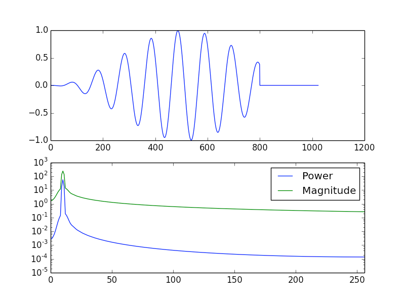{fig-alt="Top: the same sine-wave segment as the padding example, but shaped by a smooth Hann-like window (envelope rises and falls smoothly to zero at both ends instead of cutting off abruptly). Bottom: its power/magnitude spectrum, showing a broader main lobe but much less sidelobe ringing than the unwindowed, truncated case."}

{fig-alt="Top: a continuous, un-truncated sine wave spanning the full sample array. Bottom: its power/magnitude spectrum on an extreme log scale, showing a single extremely clean, narrow peak with no visible ringing - the ideal reference case."}

- Sine wave

- Padded sine wave w/Hann window

- Much less ringing!

---

## Example: padded CO2 data

<!-- TODO: complex slide layout (flagged by detect_complex_slide.py - see run log). Content below is complete but UNARRANGED - needs manual layout to match the original slide. -->

- Can solve for Fourier coefficients

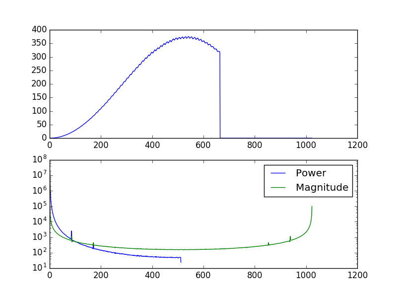{fig-alt="Top: a CO2-like rising oscillating signal padded/clipped around 660 samples. Bottom: its log-scale power/magnitude spectrum, showing the characteristic low-frequency falloff plus truncation-related spikes."}

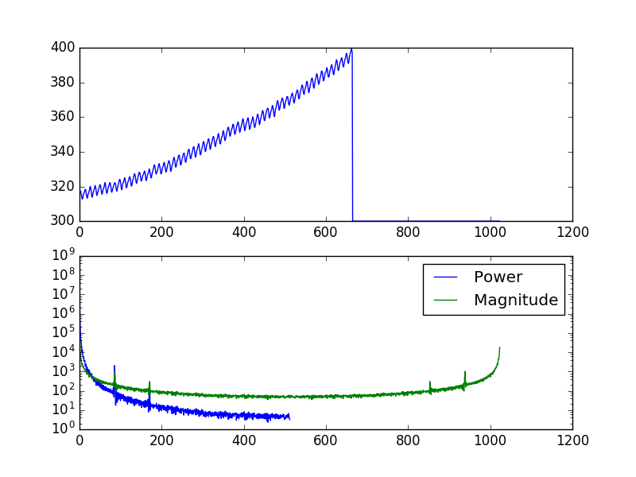{fig-alt="Top: a CO2-like rising oscillating signal padded/clipped around 660 samples. Bottom: its log-scale power/magnitude spectrum, showing the characteristic low-frequency falloff plus truncation-related spikes."}

- Padded CO2 data

- Padded CO2 data w/Hann window

---

## Recap

- Can solve for Fourier coefficients

- Hands-on with FFT notebooks at CompPhys/DataAnalysis/FFT
  - Note: most of the next homework involves FFTs, so you should get familiar with this code.
- Fourier transform of CO2 data and interpretation
- Generalizing FFT to $N!={2}^{n}$:
  - Padding the data
  - Convolutions
  - Dealing with the induced spectral leakage using windows

---

## Spectral leakage and convolution theorem

<!-- TODO: complex slide layout (flagged by detect_complex_slide.py - see run log). Content below is complete but UNARRANGED - needs manual layout to match the original slide. -->

- Can solve for Fourier coefficients

- We can understand the distortion of the FT using the convolution theorem:

{fig-alt="Two panels: a rectangular window function (flat top, amplitude 1 across all N samples) on the left, and its Fourier transform on the right, showing a narrow main lobe at bin 0 surrounded by many slowly-decaying sidelobes (roughly -40 dB) extending across +/-40 bins."}

- Our padded/clipped function is just the product of the sine wave times a "box" function.
- $ \Rightarrow $ FT of the clipped function is the convolution of the desired FT and the box function FT.
  - In other words, our FT is "smeared out" by the FT of the box function.
- So, let's look at the FT of the box function:

- $$\begin{matrix}
\text{If}{t}_{j} \equiv (r*s{)}_{j} & =\mathop{\mathop{ \sum }\limits_{k=-N/2+1}}\limits^{\frac{N}{2}}{s}_{j-k}{r}_{k} \\
\text{then}{\hat{T}}_{k} & ={\hat{R}}_{k}{\hat{S}}_{k}
\end{matrix}$$

- This is not very nice! The FT of the box has rather nontrivial structure, and spreads out far from 0.

---

## Windowing

<!-- TODO: complex slide layout (flagged by detect_complex_slide.py - see run log). Content below is complete but UNARRANGED - needs manual layout to match the original slide. -->

- Can solve for Fourier coefficients

- Can we get rid of this "ringing" effect?
- Of course! This is the topic of [windowing](http://en.wikipedia.org/wiki/Window_function).

{fig-alt="Plot titled ''Leakage' from a sinusoid (rectangular window)': a series of lobes in decibels versus DFT bin, with the tall central 'main lobe' at bin 0 flanked by smaller 'sidelobes' at each integer bin, annotated with arrows labeling the main lobe, sidelobe level, and sidelobes."}

---

## Windowing

<!-- TODO: complex slide layout (flagged by detect_complex_slide.py - see run log). Content below is complete but UNARRANGED - needs manual layout to match the original slide. -->

- Can solve for Fourier coefficients

- Instead of a rectangle, we can multiple by a window function with a better Fourier transform.
- There are a zillion possibilities (see [Wikipedia article](http://en.wikipedia.org/wiki/Window_function)). Here are a couple.

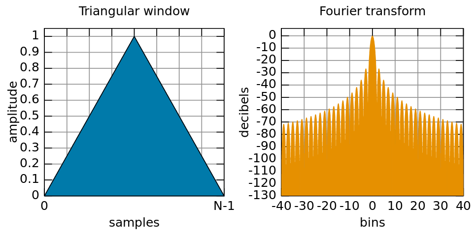{fig-alt="Two panels: a triangular window function (linear ramp up then down, peaking at 1 in the middle) on the left, and its Fourier transform on the right, showing a wider main lobe than a rectangular window but faster sidelobe decay."}

{fig-alt="Two panels: a Hann window function (smooth raised-cosine bump from 0 to 1 and back to 0) on the left, and its Fourier transform on the right, showing an even wider main lobe with sidelobes decaying rapidly."}

---

## Windowing

<!-- TODO: complex slide layout (flagged by detect_complex_slide.py - see run log). Content below is complete but UNARRANGED - needs manual layout to match the original slide. -->

- Can solve for Fourier coefficients

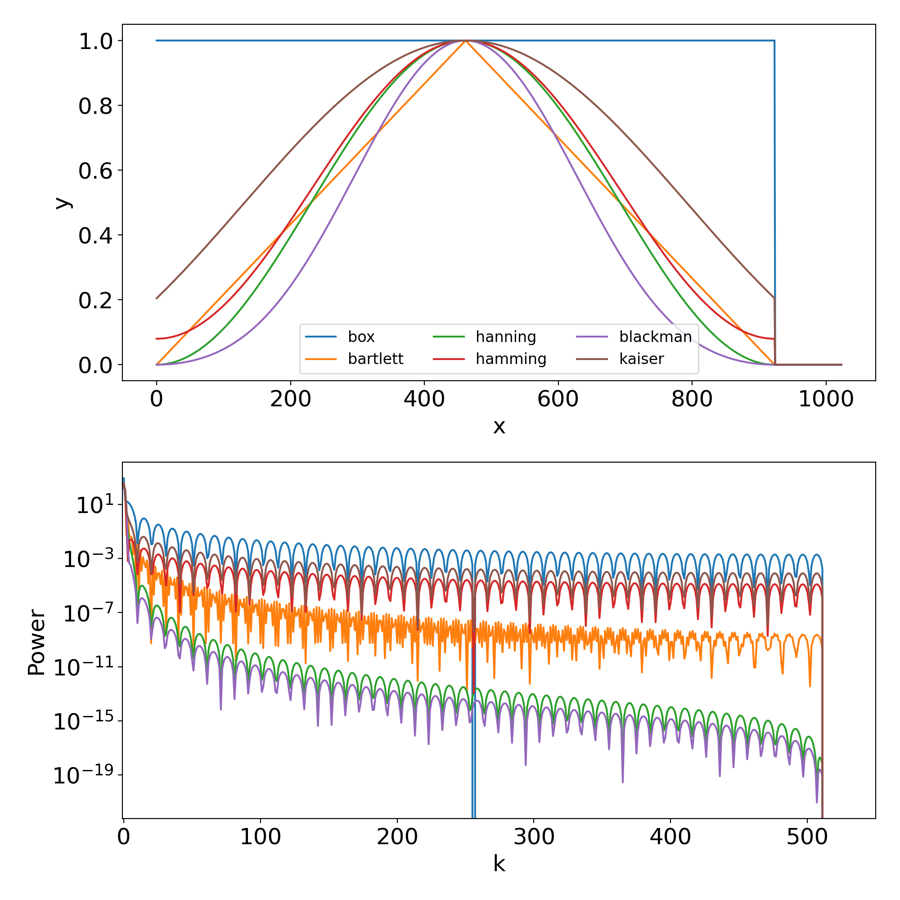{fig-alt="Top: six common window functions overlaid (box, bartlett, hanning, hamming, blackman, kaiser), each a curve from 0 to ~1000 samples peaking near the middle. Bottom: their corresponding power spectra on a log scale versus bin k, showing the box window has the highest, slowest-decaying sidelobes while blackman/hanning have the lowest, fastest-decaying ones."}

  - Demo: see notebook CompPhys/DataAnalysis/FFT/fft_windowing.ipynb for interactive view.
  - The windows look similar in the time domain, but have very different behavior in the frequency domain.
    - Peak width, side lobe level
    - "Asymptotic" falloff

---

## Hands-on: windows and CO2 data

- Can solve for Fourier coefficients

  - The last cell of CompPhys/DataAnalysis/FFT/fft_padding.ipynb compares different padding*windowing methods.
  - Try adding more window functions to windows_to_plot.

---

## Hands-on: windows and CO2 data

<!-- TODO: complex slide layout (flagged by detect_complex_slide.py - see run log). Content below is complete but UNARRANGED - needs manual layout to match the original slide. -->

- Can solve for Fourier coefficients

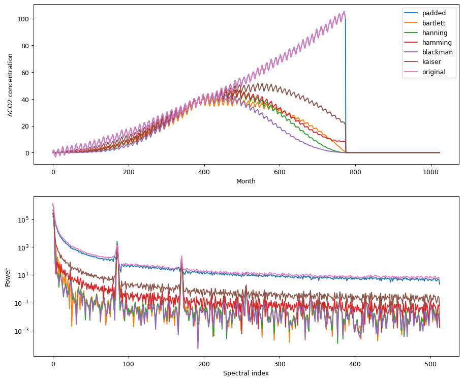{fig-alt="Top: the CO2 data set with seven different windows applied (padded, bartlett, hanning, hamming, blackman, kaiser) plus the original, plotted as delta-CO2-concentration versus month, showing how each window tapers the trailing edge differently. Bottom: the corresponding power spectra on a log scale versus spectral index, showing how each window suppresses (or fails to suppress) leakage-driven spikes differently."}

---

# Inverse Fourier Transform

---

## Inverse Fourier transform

- Can solve for Fourier coefficients

  - Application of Fourier transforms: cleaning up signals with a band pass filter
    - E.g. zero out high frequencies (or low) in Fourier domain, then transform back to time domain.
  - Before diving in, a quick word on the "inverse Fourier transform."
    - (Which is just reconstituting our original data from the Fourier coefficients)

- $$\begin{matrix}
{Y}_{k} & =\mathop{\mathop{ \sum }\limits_{j=0}}\limits^{N-1}{y}_{j}{e}^{-2 \pi ijk/N} \\
{y}_{j} & =\frac{1}{N}\mathop{\mathop{ \sum }\limits_{k=0}}\limits^{N-1}{Y}_{k}{e}^{2 \pi ijk/N}
\end{matrix}$$

---

## Inverse Fourier transform

<!-- TODO: complex slide layout (flagged by detect_complex_slide.py - see run log). Content below is complete but UNARRANGED - needs manual layout to match the original slide. -->

- Can solve for Fourier coefficients

  - Computationally, we don't even really need a new function.
  - Trick:

- $$\begin{aligned}
{y}_{j}=\frac{1}{N}\mathop{\mathop{ \sum }\limits_{k=0}}\limits^{N-1}{\left[ {Y}_{k}^{*}{e}^{-2 \pi ijk/N} \right]}^{*}
\end{aligned}$$

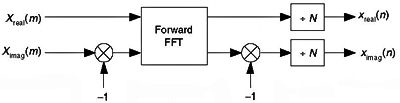{fig-alt="Block diagram for computing an inverse FFT via a forward FFT: real and imaginary inputs X_real(m), X_imag(m) each pass through a '-1' multiplier, into a 'Forward FFT' box, then through another '-1' multiplier and a '/ N' scaling box, producing the time-domain outputs x_real(n) and x_imag(n)."}

  - In other words:
    - Take complex conjugate of ${Y}_{k}$;
    - Apply regular FFR function;
    - Take complex conjugate of result.

- $$\begin{matrix}
{Y}_{k} & =\mathop{\mathop{ \sum }\limits_{j=0}}\limits^{N-1}{y}_{j}{e}^{-2 \pi ijk/N} \\
{y}_{j} & =\frac{1}{N}\mathop{\mathop{ \sum }\limits_{k=0}}\limits^{N-1}{Y}_{k}{e}^{2 \pi ijk/N}
\end{matrix}$$

---

## Concepts to pseudocode to code

<!-- TODO: complex slide layout (flagged by detect_complex_slide.py - see run log). Content below is complete but UNARRANGED - needs manual layout to match the original slide. -->

- Can solve for Fourier coefficients

{fig-alt="Block diagram for computing an inverse FFT via a forward FFT: real and imaginary inputs X_real(m), X_imag(m) each pass through a '-1' multiplier, into a 'Forward FFT' box, then through another '-1' multiplier and a '/ N' scaling box, producing the time-domain outputs x_real(n) and x_imag(n)."}

---

## Concepts to pseudocode to code

<!-- TODO: complex slide layout (flagged by detect_complex_slide.py - see run log). Content below is complete but UNARRANGED - needs manual layout to match the original slide. -->

- Can solve for Fourier coefficients

{fig-alt="Block diagram for computing an inverse FFT via a forward FFT: real and imaginary inputs X_real(m), X_imag(m) each pass through a '-1' multiplier, into a 'Forward FFT' box, then through another '-1' multiplier and a '/ N' scaling box, producing the time-domain outputs x_real(n) and x_imag(n)."}

  - Pseudocode:
    - Compute conjugate
    - Compute FFT (existing function)
    - Compute conjugate again
    - Divide by N

---

## Concepts to pseudocode to code

<!-- TODO: complex slide layout (flagged by detect_complex_slide.py - see run log). Content below is complete but UNARRANGED - needs manual layout to match the original slide. -->

- Can solve for Fourier coefficients

  - Pseudocode:
    - Compute conjugate
    - Compute FFT (existing function)
    - Compute conjugate again
    - Divide by N

{fig-alt="Block diagram for computing an inverse FFT via a forward FFT: real and imaginary inputs X_real(m), X_imag(m) each pass through a '-1' multiplier, into a 'Forward FFT' box, then through another '-1' multiplier and a '/ N' scaling box, producing the time-domain outputs x_real(n) and x_imag(n)."}

- def ifft(x) :
- from numpy import conj, divide
- # conjugate the complex numbers
- x = np.conj(x)
- # forward fft
- X = fft(x);
- # conjugate the complex numbers again
- X = np.conj(X)
- # scale the numbers
- X = X / len(X)
- return X

---

## Exercise: sunspots

<!-- TODO: complex slide layout (flagged by detect_complex_slide.py - see run log). Content below is complete but UNARRANGED - needs manual layout to match the original slide. -->

- Can solve for Fourier coefficients

- Let's use FFTs to process (not just analyze!) some sunspot data.
- Humans have known about sunspots for a very long time
  - At least as far back as 364 BC (writing of Chinese astronomer Gan De).
- Magnetic activity causes a temperature decrease locally, manifests in a slightly darker spot

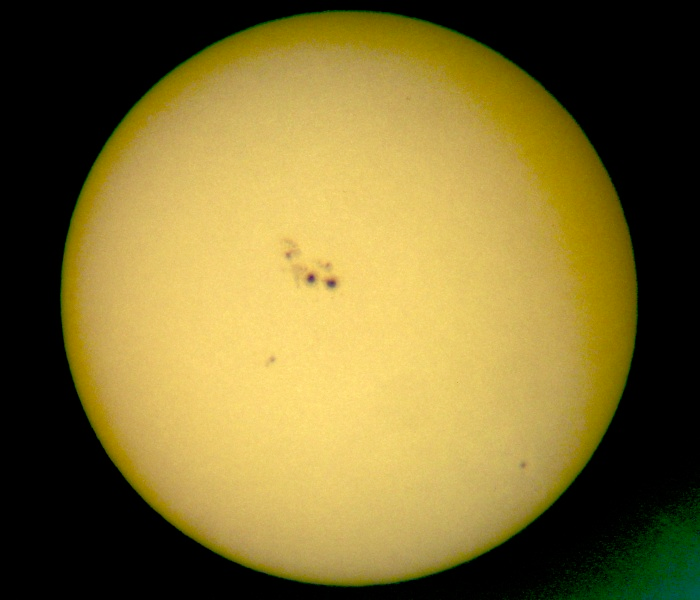{fig-alt="Photograph of the Sun (pale yellow disk on black background) as projected through a spotting scope, showing a small dark sunspot group near the center."}

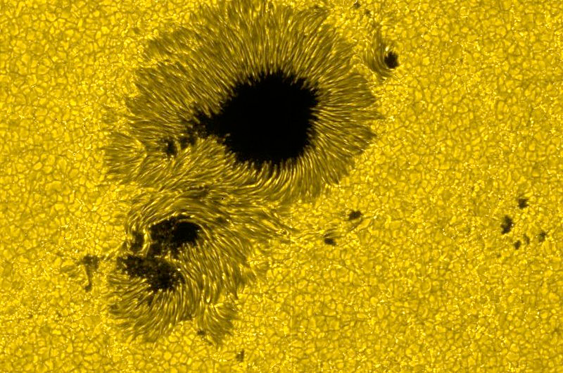{fig-alt="Close-up NASA G-band image of a sunspot group: dark umbral cores surrounded by filamentary penumbrae, set against the mottled granulation pattern of the surrounding solar surface."}

---

## Exercise: sunspots

<!-- TODO: complex slide layout (flagged by detect_complex_slide.py - see run log). Content below is complete but UNARRANGED - needs manual layout to match the original slide. -->

- Can solve for Fourier coefficients

- Sunspot data: [SIDC](http://sidc.be) (Solar Influences Data Analysis Center):
  - Docs at https://www.sidc.be/silso/newdataset
- For instance:

- [https://www.sidc.be/SILSO/ssngraphics](https://www.sidc.be/SILSO/ssngraphics)

{fig-alt="Line plot titled 'International sunspot number Sn: monthly mean and 13-month smoothed number', showing the ~11-year solar cycle from the 1950s to the 2020s (monthly values in blue, smoothed curve in red; SILSO graphics, Royal Observatory of Belgium)."}

---

## Exercise: sunspots

- Data page: [https://www.sidc.be/SILSO/datafiles](https://www.sidc.be/SILSO/datafiles)

- 1749;01;1749.042;  96.7; -1.0;   -1;1
- 1749;02;1749.123; 104.3; -1.0;   -1;1
- 1749;03;1749.204; 116.7; -1.0;   -1;1
- 1749;04;1749.288;  92.8; -1.0;   -1;1
- 1749;05;1749.371; 141.7; -1.0;   -1;1
- 1749;06;1749.455; 139.2; -1.0;   -1;1
- 1749;07;1749.538; 158.0; -1.0;   -1;1
- 1749;08;1749.623; 110.5; -1.0;   -1;1
- 1749;09;1749.707; 126.5; -1.0;   -1;1
- 1749;10;1749.790; 125.8; -1.0;   -1;1
- 1749;11;1749.874; 264.3; -1.0;   -1;1
- 1749;12;1749.958; 142.0; -1.0;   -1;1
- 1750;01;1750.042; 122.2; -1.0;   -1;1
- 1750;02;1750.123; 126.5; -1.0;   -1;1

---

## Exercise: sunspots

- Data page: [https://www.sidc.be/SILSO/datafiles](https://www.sidc.be/SILSO/datafiles)

- 1749;01;1749.042;  96.7; -1.0;   -1;1
- 1749;02;1749.123; 104.3; -1.0;   -1;1
- 1749;03;1749.204; 116.7; -1.0;   -1;1
- 1749;04;1749.288;  92.8; -1.0;   -1;1
- 1749;05;1749.371; 141.7; -1.0;   -1;1
- 1749;06;1749.455; 139.2; -1.0;   -1;1
- 1749;07;1749.538; 158.0; -1.0;   -1;1
- 1749;08;1749.623; 110.5; -1.0;   -1;1
- 1749;09;1749.707; 126.5; -1.0;   -1;1
- 1749;10;1749.790; 125.8; -1.0;   -1;1
- 1749;11;1749.874; 264.3; -1.0;   -1;1
- 1749;12;1749.958; 142.0; -1.0;   -1;1
- 1750;01;1750.042; 122.2; -1.0;   -1;1
- 1750;02;1750.123; 126.5; -1.0;   -1;1

- Data format is [documented](https://www.sidc.be/SILSO/infosnmtot)

- Year; Month; Date[year fraction]; Monthly mean sunspot count; std dev; n(observations); definitive/provisional

---

## Hands on

- Sunspot notebook: CompPhys/DataAnalysis/FFT/fft_filtering.ipynb
  - We want to filter the high frequency "noise" from the data.
  - We do this by throwing away Fourier components
    - maxfreq=50 by default
    - What does this correspond to? Remember $T=N/k$ (months).
- Try out different values of the frequency cutoff, see what it does to the data.
- Note: this is not the smoothing that they apply (they apply a Kalman filter).

---

## Comments on filtering

- Remember the convolution theorem:
  - Filtering in the frequency domain is like multiplying by a box function.
  - $ \Rightarrow $ in time domain, we are doing a convolution of data with FT(box).
- We can equally well apply a nicer windowing function.
- In image processing, preferred algorithm is "Gaussian smoothing" or filtering:
  - You might be familiar with this from Photoshop.
  - Convolute data with a Gaussian, i.e., "smear out" the data by a few pixels.

---

## Also...

<!-- TODO: complex slide layout (flagged by detect_complex_slide.py - see run log). Content below is complete but UNARRANGED - needs manual layout to match the original slide. -->

- Can solve for Fourier coefficients

- Sunspots are correlated with northern lights!
- We are currently just past a sunspot maximum.
- If you have the opportunity, go aurora hunting this year :)

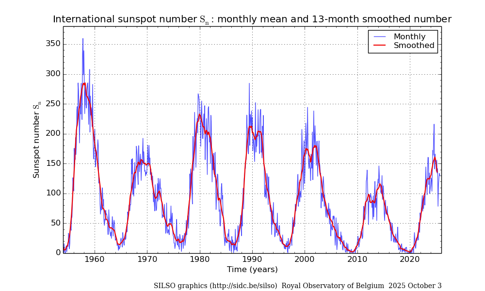{fig-alt="Line plot titled 'International sunspot number Sn: monthly mean and 13-month smoothed number', showing the ~11-year solar cycle from the 1950s to the 2020s (monthly values in blue, smoothed curve in red; SILSO graphics, Royal Observatory of Belgium)."}

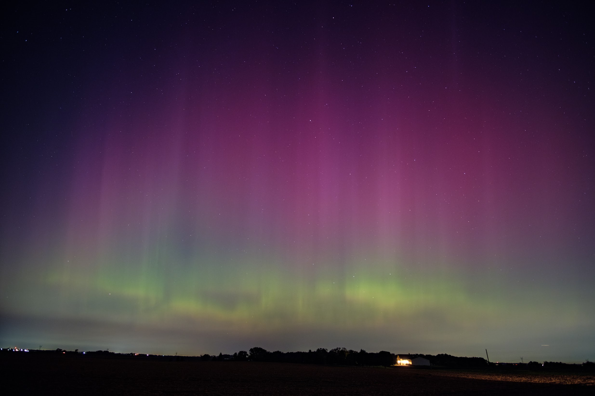{fig-alt="Photograph of a vivid pink and green aurora borealis filling the night sky with vertical streamers, above a dark rural landscape with a lit farmhouse and treeline silhouette."}

---

## Recap

- Can solve for Fourier coefficients

- To preserve performance, you can pad your FFT inputs to satisfy $N={2}^{n}$.
  - But at the cost of distorting the Fourier spectrum.
- To preserve the Fourier spectrum, apply a window to the input data.
  - Convolution theorem: product $ \Leftrightarrow $ convolution between time and frequency domains.
- Inverse Fourier transform: turn Fourier components back into the input function.
  - You can "filter" the Fourier components to make a low/high band pass filter.
  - Convolution theorem still applies here.
- 2D Fourier transforms are a straightforward generalization of 1D.
  - More on this next time.

---

# Fourier transforms in 2D

---

## Hands-on today

- CompPhys/DataAnalysis/FFT/2Dfft.ipynb

- original version: Haade;vectorization: Wjh31, Quibik, CC BY-SA 3.0 <https://creativecommons.org/licenses/by-sa/3.0>, via Wikimedia Commons

---

## Moiré

<!-- TODO: complex slide layout (flagged by detect_complex_slide.py - see run log). Content below is complete but UNARRANGED - needs manual layout to match the original slide. -->

- 2020 UB Physics Colloquium by Andrea Alù:
https://arxiv.org/abs/2001.03304
- Moiré Pattern in bilayers (e.g. graphene, TMDs)
- Can lead to superconductivity!

{fig-alt="A Moire interference pattern formed by two overlapping dot grids (blue dots over a black dot grid) at a slight rotation angle, producing visible large-scale fringe patterns."}

- [http://prb.aps.org/abstract/PRB/v81/i12/e125427](http://14%20pt)

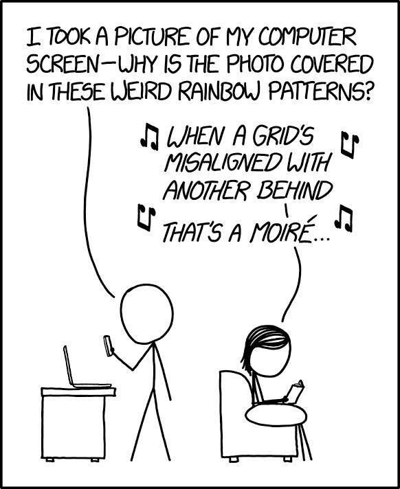{fig-alt="xkcd-style comic: a stick figure asks 'I took a picture of my computer screen - why is the photo covered in these weird rainbow patterns?' and another replies, sung, 'When a grid's misaligned with another behind, that's a Moire...'."}

---

## Moiré

<!-- TODO: complex slide layout (flagged by detect_complex_slide.py - see run log). Content below is complete but UNARRANGED - needs manual layout to match the original slide. -->

- 2020 UB Physics Colloquium by Andrea Alù:
https://arxiv.org/abs/2001.03304
- Moiré Pattern in bilayers (e.g. graphene, TMDs)
- Can lead to superconductivity!

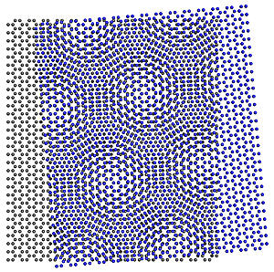{fig-alt="A Moire interference pattern formed by two overlapping dot grids (blue dots over a black dot grid) at a slight rotation angle, producing visible large-scale fringe patterns."}

- [http://prb.aps.org/abstract/PRB/v81/i12/e125427](http://14%20pt)

{fig-alt="xkcd-style comic: a stick figure asks 'I took a picture of my computer screen - why is the photo covered in these weird rainbow patterns?' and another replies, sung, 'When a grid's misaligned with another behind, that's a Moire...'."}

{fig-alt="Photograph of a laptop screen displaying this same slide deck's 'Moire' slide (in an editing application), with visible screen glare/reflection."}

---

## 1D, 2D

- Starting from the 1D discrete Fourier transform...

- $${Y}_{k}=\mathop{\mathop{ \sum }\limits_{j=0}}\limits^{N-1}{y}_{j}{e}^{-2 \pi ijk/N}$$

---

## 1D, 2D

- Starting from the 1D discrete Fourier transform...

- $${Y}_{k}=\mathop{\mathop{ \sum }\limits_{j=0}}\limits^{N-1}{y}_{j}{e}^{-2 \pi ijk/N}$$

- Easy to write down a 2D generalization:

- $${Y}_{{k}_{1},{k}_{2}}=\mathop{\mathop{ \sum }\limits_{{k}_{1}=0}}\limits^{{N}_{1}-1}\mathop{\mathop{ \sum }\limits_{{k}_{2}=0}}\limits^{{N}_{2}-1}{e}^{-2 \pi i{j}_{1}{k}_{1}/{N}_{1}}{e}^{-2 \pi i{j}_{2}{k}_{2}/{N}_{2}}{y}_{{j}_{1},{j}_{2}}$$

---

## 1D, 2D

- Starting from the 1D discrete Fourier transform...

- $${Y}_{k}=\mathop{\mathop{ \sum }\limits_{j=0}}\limits^{N-1}{y}_{j}{e}^{-2 \pi ijk/N}$$

- Easy to write down a 2D generalization:

- $${Y}_{\vec{k}}=\mathop{ \sum }\limits_{\vec{j}}{y}_{\vec{j}}{e}^{-2 \pi i\vec{j} \cdot \vec{k}/N}$$

- Not too complicated: just a set of 1D FTs stapled together.
- Note: N does not need to be the same in all dimensions.

- $${Y}_{{k}_{1},{k}_{2}}=\mathop{\mathop{ \sum }\limits_{{k}_{1}=0}}\limits^{{N}_{1}-1}\mathop{\mathop{ \sum }\limits_{{k}_{2}=0}}\limits^{{N}_{2}-1}{e}^{-2 \pi i{j}_{1}{k}_{1}/{N}_{1}}{e}^{-2 \pi i{j}_{2}{k}_{2}/{N}_{2}}{y}_{{j}_{1},{j}_{2}}$$

- If the ${N}_{i}$ are equal, we have a nice compact notation using vectors:

---

## 2D Fourier transform

:::: {.columns}
::: {.column width="55%"}
- We now have a 2D spatial indices, $({j}_{1},{j}_{2})$, and a 2D Fourier component index, $({k}_{1},{k}_{2})$.
- Intuition:
  - $({k}_{1},0)$ = Fourier transform along x
  - $(0,{k}_{2})$ = Fourier transform along y
  - $({k}_{1},{k}_{2})$ = Fourier transform along diagonal directions
:::
::: {.column width="45%"}
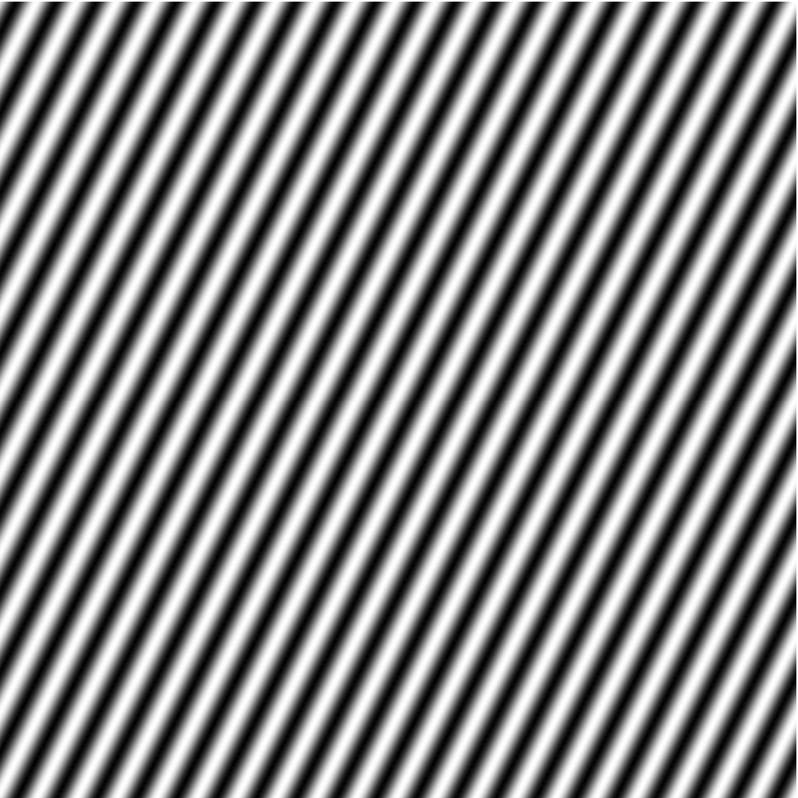{width="100%" fig-alt="A 2D sinusoidal grating pattern: evenly spaced diagonal black-and-white stripes, illustrating a single 2D Fourier component along one diagonal direction."}
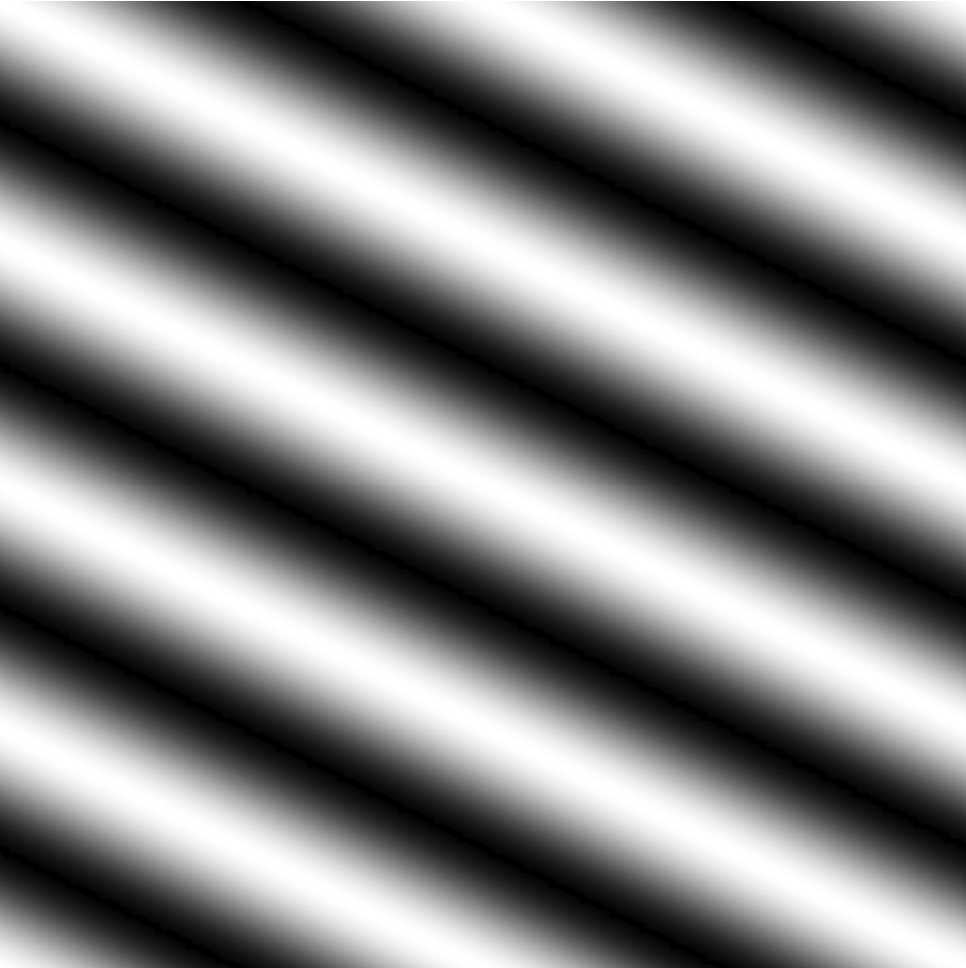{width="100%" fig-alt="A 2D sinusoidal grating pattern: evenly spaced diagonal black-and-white stripes at a different angle/spacing than the adjacent example, illustrating another 2D Fourier component direction."}
:::
::::

---

## Optics

:::: {.columns}
::: {.column width="55%"}
- Application: in optics, every lens basically does a 2D Fourier transform
- What is the Fourier transform of a pinhole?
- Let's walk through the first few cells of 2Dfft.ipynb, covering:
  - Fourier transform of a pinhole
  - Fourier transform of a Moiré pattern
  - Low-pass filtering of images
:::
::: {.column width="45%"}
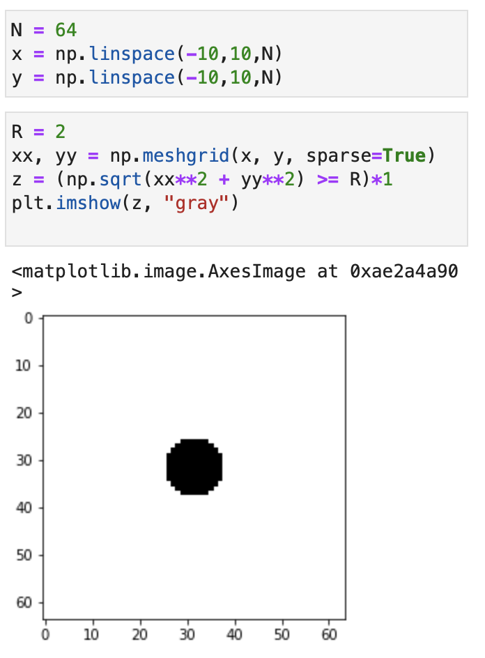{width="100%" fig-alt="Jupyter notebook cell: Python code defining a circular low-pass filter mask via `lowpass = (np.sqrt(xx**2+yy**2) <= R)*1` with R=1, with the output plot showing a white filled disk on a black background."}
:::
::::

---

## Bilayer Moiré

- Hexagonal lattice
- Bilayer with one layer rotated by angle theta
- FFT shows peaks of periodic structures
- Let’s mess around with it!
  - CompPhys/DataAnalysis/FFT/2Dfft.ipynb

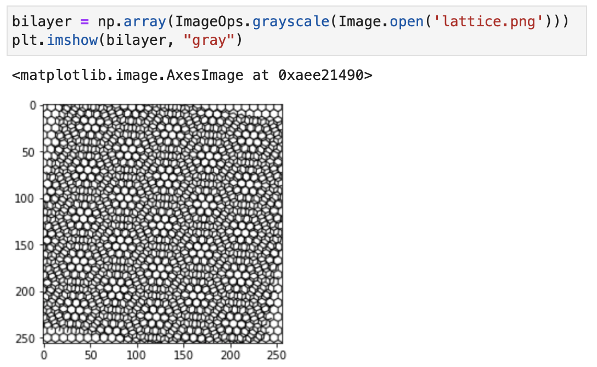{width="70%" fig-alt="A fine hexagonal dot/ring lattice pattern (black rings on white), representing a 2D crystal lattice image used for a bilayer Moire demonstration."}

---

## FFT filtering

<!-- TODO: complex slide layout (flagged by detect_complex_slide.py - see run log). Content below is complete but UNARRANGED - needs manual layout to match the original slide. -->

- Low pass filter in 2D: a pinhole

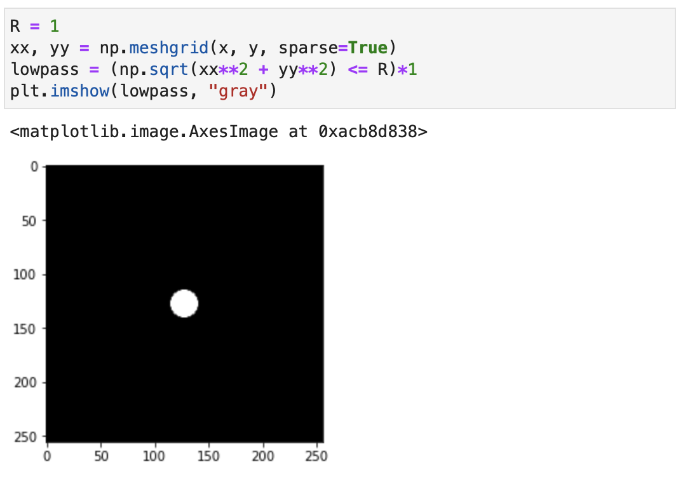{fig-alt="Jupyter notebook cell: Python code defining a circular low-pass filter mask via `lowpass = (np.sqrt(xx**2+yy**2) <= R)*1` with R=1, with the output plot showing a white filled disk on a black background."}

- Take the inverse FFT after filtering:

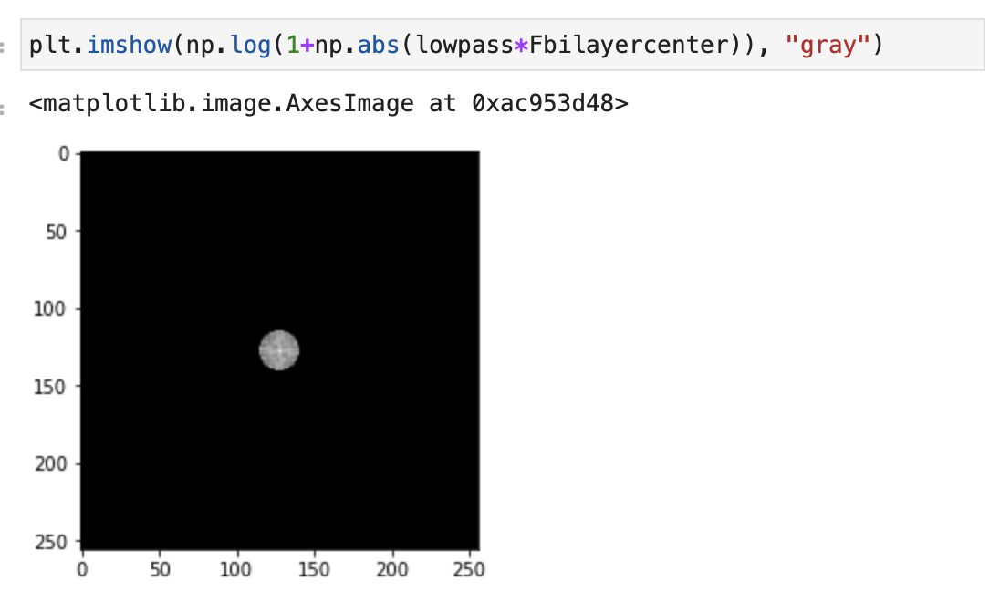{fig-alt="Jupyter notebook cell: Python code `plt.imshow(np.log(1+np.abs(lowpass*Fbilayercenter)), 'gray')`, with the output showing a small blurry/speckled gray disk on an otherwise black background - the low-pass-filtered Fourier spectrum of the bilayer lattice image."}

---

## FFT filtering

<!-- TODO: complex slide layout (flagged by detect_complex_slide.py - see run log). Content below is complete but UNARRANGED - needs manual layout to match the original slide. -->

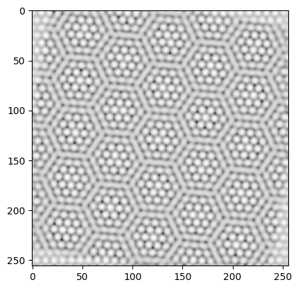{fig-alt="A fine hexagonal dot/ring lattice pattern (black rings on white), representing a 2D crystal lattice image used for a bilayer Moire demonstration."}

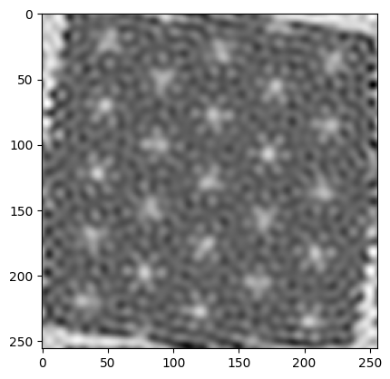{fig-alt="A blurred grayscale image showing a lattice of bright star-like/speckled spots arranged in a repeating pattern - the low-pass-filtered Fourier-domain reconstruction of the bilayer lattice image, revealing the underlying periodicity."}

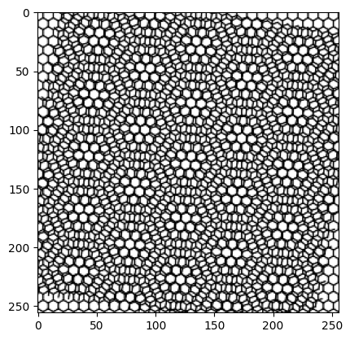{fig-alt="A fine hexagonal dot/ring lattice pattern (black rings on white), representing a 2D crystal lattice image used for a bilayer Moire demonstration."}

---

## Recap: FFTs

- FFT algorithm implementation
  - Discrete Fourier transform is super slow.
  - FFT takes advantage of recursion (ideally use $N={2}^{n}$ inputs)
- You can pad your FFT input data with 0s (or any number) to satisfy $N={2}^{n}$
  - But at the cost of distorting the Fourier spectrum.
- To preserve the Fourier spectrum, apply a window to the input data.
  - Convolution theorem: product $ \Leftrightarrow $ convolution between time and frequency domains.
- Inverse Fourier transform: turn Fourier components back into the input function.
  - You can "filter" the Fourier components to make a low/high band pass filter.
  - Convolution theorem still applies here.
- 2D Fourier transforms are a straightforward generalization of 1D.
  - Relevant for image processing.
- Many, many more applications than we can cover in class!

---

## Looking ahead

- October 24–31: calculus (derivates, but mostly integrals), root finding, min/max finding and optimization
  - Assignment 4 (FFTs) due Wed 11/5
- November 3–November 7: linear algebra
- November 10–17: ordinary differential equations (ODEs)
- November 19–21: boundary value problems (BVPs)
  - Assignment 5 (calculus, optimization) due around Wed 11/19.
- November 24–end: partial differential equations (PDEs)
  - Assignment 6 (differential equations) due around 12/5.

---

## Free time

- Since the midterm is due tomorrow and we are a bit ahead of the homework assignments, the rest of today is free time.
- Options:
  - Work on midterm
  - Hands-on with FFTs:
    - Go through the rest of 2Dfft.ipynb
    - Compare low pass filter with Gaussian filter.
    - Try uploading your own images! Note: they have to be square aspect ratio.
  - Homework #4
