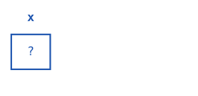
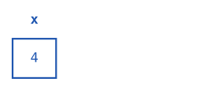
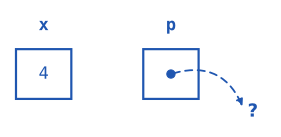
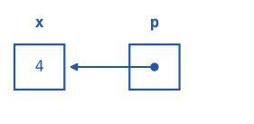
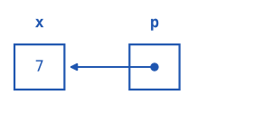
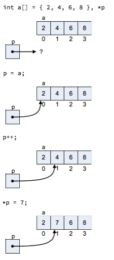

# Pointers

- Examples:
```
CompPhysReviewCpp/BasicExamples
├── ptrs.cc
├── ptrs_and_funcs.cc
├── func_timing.cpp
├── commandline.cc
├── readlines.cc
```

---

## Pointers

[The dread cry rang through the night... NO! POINTERS! NOOOOO!!!!!!]{style="font-size: 1.5em;"}

{fig-align="center" width="50%" fig-alt="A woman screaming" .center}


---

## Pointers

- We've actually talked about the concept a lot already!

::: {.callout-tip}
### Definition
A **pointer** is a variable that holds a memory address.
:::

- This lets us directly access (read/write) data in memory.
- A pointer has a specific type (so it knows what kind of data lives at the corresponding address)


---

## Pointer syntax

:::: {.columns}
::: {.column width=50%}

- Given a variable `x`:
```cpp
int x = 123;
```

- The symbol `&` returns the *memory address* of `x`:
```cpp
std::cout << "The address of x is " << &x << std::endl;
```
::: {.cell-output .cell-output-stdout}
```
0x7fff59364aa8
```
:::

- This is an **(integer) pointer**: a variable containing the memory address, specifically of an `int`

:::
::: {.column width=50%}
::: {.fragment}

- Pointers are **declared** using the syntax `<type>* ptr_name`:

```cpp
int* x_ptr = &x; 
// or int * x_ptr
// or int *x_ptr
std::cout << "The address of x is " << x_ptr << std::endl;
```

::: {.cell-output .cell-output-stdout}
```
The address of x is 0x7fff59364aa8
```
:::

:::
::: {.fragment}
- Pointers are **dereferenced** with `*` to obtain the actual variable:

```cpp
std::cout << "x is " << *x_ptr << std::endl;
```
::: {.cell-output .cell-output-stdout}
```
x is 123
```
:::

:::
:::

::::

---


## Pointer syntax

Syntax | Meaning 
--- | ---
`&x` | **Address** of `x`
`int * x_ptr;` | **Declare** integer pointer 
`int * x_ptr = &x;` | **Declare & initialize** pointer to address of `x` 
`*x_ptr` | **Dereference** pointer to obtain `x`

::: aside
The whitespace around the `*` is flexible.
:::

---

## Step by step

::: {.ptr-info-box}
- `&var` returns the address of a variable
- `<type>*` declares a pointer
- `*p` dereferences a pointer = back to variable
:::

```{=html}
<style>
.ptr-info-box {
  position: absolute;
  top: 140px;
  right: 330px;
  width: 420px;
  border: 3px solid #8e2436;
  border-radius: 6px;
  padding: 18px 24px;
  font-size: 0.62em;
  line-height: 1.25;
  text-align: left;
  color: #333;
  background: rgba(255,255,255,0.9);
  z-index: 10;
}
.ptr-info-box ul {
  margin: 0;
  padding-left: 1.1em;
}
.ptr-info-box li {
  margin: 0.15em 0;
}
.ptr-table {
  width: auto;
  max-width: 980px;
  border-collapse: collapse;
  margin: 10px auto 0 0;
  table-layout: fixed;
}
.ptr-table th {
  text-align: left;
  font-size: 0.75em;
  color: #444;
  padding: 4px 16px 10px 16px;
  border-bottom: 2px solid #1f56b0;
}
.ptr-table td {
  vertical-align: middle;
  padding: 6px 16px;
}
.ptr-table td.code-col {
  white-space: nowrap;
}
.ptr-table td.code-col code {
  font-size: 1.2em;
}
.ptr-table td.mem-col {
  width: 1%;
  white-space: nowrap;
  text-align: left;
}
.ptr-table td.note-col {
  font-size: 1.0em;
  line-height: 1.0;
  color: #444;
  text-align: left;
  max-width: 500px;
}
.code-chip {
  display: inline-block;
  background: #0d2438;
  color: #f5f5f5;
  font-family: monospace;
  font-size: 0.85em;
  padding: 6px 14px;
  border-radius: 4px;
}
</style>

<table class="ptr-table">
<colgroup>
  <col style="width:20%">
  <col style="width:30%">
  <col style="width:50%">
</colgroup>
<thead>
<tr><th>Code</th><th>Memory</th><th></th></tr>
</thead>
<tbody>
<tr>
  <td class="code-col"><code>int x;</code></td>
  <td class="mem-col"></td>
  <td class="note-col"></td>
</tr>
<tr class="fragment">
  <td class="code-col"><code>x = 4;</code></td>
  <td class="mem-col"></td>
  <td class="note-col"></td>
</tr>
<tr class="fragment">
  <td class="code-col"><code>int* p;</code></td>
  <td class="mem-col"></td>
  <td class="note-col">Read from right-to-left: "<code>p</code> points to <code>int</code>"<br>Uninitialized: points to garbage!</td>
</tr>
<tr class="fragment">
  <td class="code-col"><code>p = &amp;x;</code></td>
  <td class="mem-col"></td>
  <td class="note-col">Assigning <code>p</code>: <code>&x</code> is the address of <code>x</code></td>
</tr>
<tr class="fragment">
  <td class="code-col"><code>*p = 7</code></td>
  <td class="mem-col"></td>
  <td class="note-col">Dereferencing <code>p</code>: <code>*p</code> is equivalent to <code>x</code></td>
</tr>
</tbody>
</table>
```

---

## Why?

Why use pointers?

- **Passing large objects**: one way to pass a large object to a function without making a copy
```cpp
void print(Matrix *p_matrix) {
  std::cout << *p_matrix << std::endl;
}
```
- **Dynamic memory allocation**: pointers are *required* to create dynamically sized objects, e.g., a vector whose length is not known at complile time. 
- **Efficient data structures**: linked lists, trees, graphs, hash tables all rely on pointers. 
- **Arrays** are intrinsically connected to pointers and pointer arithmetic (e.g. `x_ptr++`). 
- **Polymorphism**: more on this during lectures on [classes and inheritance](./1.4_classes.qmd). 

---

## Pointers and functions

Example: pointers allow us to pass an address into a function, rather than the entire object

```cpp
#include <iostream>

void print_matrix(Matrix *mat_ptr) {
  std::cout << *mat_ptr << std::endl; // Dereference ptr to obtain contents
}

int main() {
  Matrix a_big_matrix{some_values}; 
  print_matrix(&a_big_matrix); // Pass the *address*, not the whole matrix
}
```

---


## Pointers and const

- Recall: const makes a variable a "constant," i.e., you cannot change its value.
- The `const`-ness can apply to either the pointer (=the address) or the variable itself (=the value), so we have 4 possible combinations:

```{=html}
<style>
.const-table td {
  border: 3px solid white;
  padding: 14px 20px;
  text-align: left;
  vertical-align: middle;
}
.const-table {
  border-collapse: collapse;
  table-layout: fixed;
}
.const-table .corner { background: white; border: none; }
.const-table .colhead, .const-table .rowhead {
  background: #1B4F9C; color: white; font-weight: bold;
}
.const-table .data { background: #DADFF2; color: #17325E; }
.const-table .data code { font-family: "Courier New", monospace; font-size: 1.2em;}
.const-table .label {
  background: #CC6A4A; color: white; font-weight: bold;
  text-align: center; vertical-align: middle; border: none;
}
.const-table .label.side {
  writing-mode: vertical-rl;
  transform: rotate(180deg);
  width: 60px;
}
</style>

<table class="const-table">
<colgroup>
  <col style="width:6%">
  <col style="width:14%">
  <col style="width:40%">
  <col style="width:40%">
</colgroup>
<tr>
  <td class="corner"></td>
  <td class="corner"></td>
  <td class="label" colspan="2">Pointer</td>
</tr>
<tr>
  <td class="corner"></td>
  <td class="corner"></td>
  <td class="colhead">Not const</td>
  <td class="colhead">Const</td>
</tr>
<tr>
  <td class="label side" rowspan="2">Variable</td>
  <td class="rowhead">Not const</td>
  <td class="data"><code>int * p</code><br>
  <span style="color: magenta;">Pointer</span> can change<br>
  <span style="color: #8B4000;">Variable</span> can change</td>
  <td class="data"><code>int * const p</code><br>
  <span style="color: magenta;">Pointer</span> cannot change
  <br><span style="color: #8B4000;">Variable</span> can change</td>
</tr>
<tr>
  <td class="rowhead">Const</td>
  <td class="data"><code>int const * p</code> <br>
  <code>const int * p // equivalent</code><br>
  <span style="color: magenta;">Pointer</span> can change<br>
  <span style="color: #8B4000;">Variable</span> cannot change</td>
  <td class="data"><code>const int * const p</code><br><span style="color: magenta;">Pointer</span> cannot change
  <br><span style="color: #8B4000;">Variable</span> cannot change</td>
</tr>
</table>
```

---

## What can go wrong?

```cpp
int * x_ptr;              // Uninitialized!
int * x_ptr = nullptr;    // Initialized, but null!
int * x_ptr = 0x12345678; // Initialized, but nonsense!
x_ptr += 1000;            // Moved the pointer forward, might be nonsense!
```

- Key danger: *compiler doesn't know if the memory address is valid*. 
- If you're unlucky, dereferencing might even return technically correct garbage. 
- More often, attempting to access invalid memory causes a **segmentation fault**:

::: {.callout-tip}
### Definition
A **segmentation fault** is a runtime error that occurs when a program attempts to access memory that is not allowed by the OS. 
:::

---


## References

- Closely related to pointers: **references**

::: {.callout-tip}
### Definition
A **reference** is an alias to an existing variable, similar to a shortcut on your computer. E.g.: `int & x_ref = x;`
:::

- `x_ref` behaves just like an `int`, but is uses the *memory address* of `x`; there is only one `int`, under the hood. 
- How is this like a pointer?
  - Another method to pass variables to functions without copying.
  - Behaves rather like a (constant) pointer that automatically dereferences without the `*`. 
- Often *safer* than pointers: no danger of using a null pointer, for example. 

---

## Reference examples

:::: {.columns}
::: {.column width=50%}
- Passing large variables to a function:

```cpp
#include <iostream>

void print_matrix(Matrix & mat_ref) {
  std::cout << mat_ref << std::endl;
}

int main() {
  Matrix a_big_matrix{some_values};
  print_matrix(a_big_matrix); // Looks like pass-by-value, but reference syntax avoids copying!
}
```

:::
::: {.column width=50%}
::: {.fragment}
Looping over a vector:

```cpp
#include <iostream>
#include <vector>

int main() {
  std::vector<int> primes{2, 3, 5, 7, 11, 13, ...};
  for (auto & it : primes) {
    std::cout << it << std::endl;
  }
}
```

- The iterator, `it`, is a *reference* to the elements of `primes`: an alias to a given element of `primes`. 
- This avoids creating a temporary copy of each element of `primes` at each iteration of the `for` loop.

:::
:::
::::

# Demo

## Hands-on

- Let's try this out:
  - `CompPhys/ReviewCpp/BasicExamples/ptrs.cc`
  - `CompPhys/ReviewCpp/BasicExamples/ptrs_and_funcs.cc`
  - `CompPhys/ReviewCpp/BasicExamples/func_timing.cpp`

:::: {.columns}
::: {.column width=50%}
```cpp
#include <iostream>
int main(void){
  int x = 10;
  int * x_ptr = &x;
  int & x_ref = x;
  std::cout << "Value of x_ptr = " << x_ptr << std::endl;
  std::cout << "Dereferenced *x_ptr = " << *x_ptr << std::endl;
  std::cout << "Value of x_ref = " << x_ref << std::endl;
  *x_ptr = 7;
  std::cout << "After *x_ptr=7, x = " << x << std::endl;
  x_ref = 9;
  std::cout << "After x_ref=9, x = " << x << std::endl;
  return 0;
}
```

:::
::: {.column width=50%}
- Before running anything, what do you expect to see? Especially from the last two lines. 

```bash
% g++ CompPhys/ReviewCpp/BasicExamples/ptrs.cc -o ptrs.exe
% ./ptrs.exe
```
:::
::::


---

## Hands-on

- After you run the example: try to break the program!
- Try a deliberate seg fault:

:::: {.columns}
::: {.column width=60%}

```cpp
#include <iostream>
int main(void){
  int x = 10;
  int * x_ptr = &x;
  int & x_ref = x;
  std::cout << "Value of x_ptr = " << x_ptr << std::endl;
  std::cout << "Dereferenced *x_ptr = " << *x_ptr << std::endl;
  std::cout << "Value of x_ref = " << x_ref << std::endl;

  x_ptr += 100;
  std::cout << "x = " << x << std::endl;
  std::cout << "x_ref) = " << x_ref << std::endl;
  std::cout << "(*x_ptr) = " << *x_ptr << std::endl;
  return 0;
}
```

:::
::: {.column width=40%}
- Again, what do you expect to see here?
- (The order of the `cout` statements is a hint here, they are arranged so the program makes it to the last line before crashing)

```bash
% g++ CompPhys/ReviewCpp/BasicExamples/ptrs.cc -o ptrs.exe
% ./ptrs.exe
```

:::
::::

# Memory management

---

## Memory management

- The memory assigned to a C++ program has a few varieties:
  - **Code**: where your code lives
  - **Data**: static and global variables
  - **Stack**: static memory
    - Local variables and function parameters known at compile time
  - **Heap**: dynamic memory
    - Anything not known at compile time
    - E.g. request a dynamically sized block of memory (e.g. size determined at runtime by the program)
- *The heap is only accessible via pointers!*
  - The others can be accessed via value or reference.

---

## Memory management

- How do we use the heap: the dynamically allocated memory?
- Two keywords:
  - `new`: **allocate** a variable with memory from the heap.
  - `delete`: **delete** a variable from the heap.

::: {.fragment layout-ncol=2}
```cpp
int i = 123;
int * p = new int(456); // <1>
std::cout << "i = " << i << std::endl;
std::cout << "*p= " << *p << std::endl;
(*p) += 10; // <2>
std::cout << "*p= " << *p << std::endl;
delete p; // <3>
```
1. Allocate an integer off the heap; `p`=its address
2. Do stuff with heap variable (`+= 10`)
3. Delete `p` from heap
:::

---

## Memory leaks

- Every `new` has to come with a `delete`
- Otherwise you get a memory leak!

::: {.callout-tip width=60%}
### Definition
A memory leak occurs when dynamically allocated memory is not released after it is no longer needed. Since the memory remains allocated, it cannot be reused until the program terminates. [geeksforgeeks.org](https://www.geeksforgeeks.org/cpp/memory-leak-in-c-and-how-to-avoid-it/)
:::

- If the memory leak is bad enough, your computer may eventually run out of memory, and the program will crash. 

---

## Memory leaks

```cpp
void f() {
  int * x_ptr = new int(10); // <1>
  return x_ptr; // <2>
int main() {
  while (true) {
    int * x_ptr = f(); 
  } // <3>
  return 0;
}
```

1. Memory allocated on the heap inside `f()`
2. `f()` transfers the pointer back to `main()`
3. `x_ptr` goes out of scope and gets deleted

But the heap memory (containing `int(10)`) remains allocated *with no way to access it*! Heap memory is allocated and then orphaned every iteration of the loop :(

This is quite a dangerous pattern: the user of `f()` has to *remember* to `delete x_ptr`. 

---

## Modern pointers

- Manually tracking pointers is clearly not ideal (especially in complicated programs, where many functions may point to the same memory!). 
- $\Rightarrow$ C++ developed smart pointers: pointers that manage memory automatically!
  - Basic idea: when pointer goes out of scope, delete the variable too.
- Most common varieties:
  - `std::unique_ptr<type>()` << default for simple cases
  - `std::shared_ptr<type>()` << for cases where "ownership" is shared
- We won't discuss the details in class, but see e.g. [https://learn.microsoft.com/en-us/cpp/cpp/smart-pointers-modern-cpp?view=msvc-170](https://learn.microsoft.com/en-us/cpp/cpp/smart-pointers-modern-cpp?view=msvc-170) for more info.
- (Aside: how does python do this? [Garbage collection](https://www.geeksforgeeks.org/python/garbage-collection-python/)!)

# Arrays and vectors

---

## Arrays and vectors

:::: {.columns}
::: {.column width=50%}
::: {style="text-align: center;"}
**[Python]{.underline}**
:::

```python
my_list = [0, 1, 2, 3, 4]
mixed_list = [0, "a", True]

import numpy as np
arr = np.array([0, 1, 2, 3, 4])
```
:::

::: {.column width=50%}
::: {style="text-align: center;"}
**[C++]{.underline}**
:::

```cpp
int array[5] = {2, 3, 5, 6, 11};
array[3] = 7; // change the 6 to a 7
std::cout << array[1] << std::endl; // prints 3

std::vector<int> vec({2, 3, 5, 7, 11});
vec.push_back(13); // add element
```

:::
::::

::: {.fragment}
- [Arrays]{.terracotta}: intrinsic C++; super fast
  - Best for fixed-length arrays (known at compile time)
- [Vectors]{.sage}: C++ STL class; more flexible
- `std::array`: safer version of built-in arrays
- `std::deque`, `std::list`, `std::forward_list`: more specialized containers
:::

---

## Arrays and vectors: memory

- [Arrays]{.terracotta} are very efficient: `int x[5]` allocates 5 `int`s` in a **contiguous** row of memory
  - Allocated from the *stack*
- [Vectors]{.sage} are flexible: you can add/delete elements dynamically.
  - Also contiguous in memory
  - Dynamic => allocated from the *heap*

```
array[0] = 0, address = 0x7fff51618990
array[1] = 1, address = 0x7fff51618994
array[2] = 2, address = 0x7fff51618998
...
```

::: aside
OK, you can actually put an array on the heap using, e.g., `int* x = new int[5];`. But, in this case, you should just use a vector.
:::

---

## Manipulating arrays

:::: {.columns}
::: {.column width="75%"}
- [Arrays]{.terracotta} are closely related to pointers - hence why they are in the pointer lecture!
- The syntax `arr[3]` means: "go to the position 3 elements after the first one"
- Does this remind you of *pointer arithmetic*? 
```cpp
int x = 3;
int * x_ptr = &x;
x_ptr += 3; // Move x_ptr forward by 3 integers
```
- `arr[3]` is actually exactly equivalent to `*(arr+3)`
  - I.e., `arr` behaves like a pointer to the first element of the array
  - Weirdly, this means `3[arr]` also works!

:::
::: {.column width="25%"}
{width="70%" fig-alt="Diagram of manipulating a pointer to an array of integers"}
:::
::::

---

## Manipulating vectors

- [Vectors]{.sage} support indexing (`[]`) like arrays, but also have **iterators**: similar to pointers, but smarter.
- Most often, iterators are used for `for` loops over vectors (but not only)

```cpp
for( std::vector<int>::const_iterator it = vec.begin(); it != vec.end(); ++it ) {
  std::cout << "*it = " << *it << std::endl;
}
```

- More recent versions of C++ have improved the syntax so you don't need 80 characters to setup a `for` loop:

```cpp
for (const auto& it : vec) {
  std::cout << "it = " << it << std::endl;
}
```

---

## Details

- Copying lists:
  - [arrays]{.terracotta}: no "easy" way, have to do it yourself in a loop.
  - [vectors]{.sage}: easy! `std::vector<int> a_copy(vec);`
- Multidimensional lists, aka matrices:
  - [arrays]{.terracotta}: `int M[3][4]` (read this literally a 4-length array of (a 3-length array of `int`s)).
    - Last index is "innermost".
  - [vectors]{.sage}: `std::vector<std::vector<int>> M(3, std::vector<int>(4));`
- Special case: array of char
  - `char[10]` = array of 10 characters
  - Analogy: `char[N]` $ \leftrightarrow $ `std::string` as `int[N]`$ \leftrightarrow `std::vector<int>(N)`.
  - tl;dr: most often, just use `std::string`!

# File I/O

---

## Reading command line arguments

- C++ lets you accept **command line arguments**: extra information passed to the program when you execute is.

```cpp
./my_program 1 2 3
```

- To do this, change the *signature* of your `int main()` function as follows:

```cpp
int main(int argc, char * argv[]) {...}
```


- This is pretty confusing! Let's unpack it.
  - `int argc`: the number of command line arguments (always at least 1: the program name itself argument 0).
  - `char * argv[]`: convoluted! But basically means "array of array of char"
    - Array of char ~ std::string
    - Array of array of char ~ array of std::strings

---

## Using argc, argv

- Let's review the example in CompPhys/ReviewCpp/BasicExamples/commandline.cc:

```cpp
int main(int argc, char * argv[] ){
  for ( unsigned int i = 0; i < argc; ++i ) {
    std::cout << "Arg " << i << " = " << argv[i] << std::endl;
  }
}
```

```bash
% g++ commandline.cc -o commandline
% ./commandline repeat after me
Arg 0 = commandline
Arg 1 = repeat
Arg 2 = after
Arg 3 = me
```

---

## Reading from file (and writing)

- Command line arguments are great for a small number of parameters. You probably don't want to type O(1000) arguments into a terminal, though.
- Solution: C++ can **open files** for reading and/or writing.
- Writing to files:
  `std::ofstream` ("output formatted stream") 
  - Very similar to `std::cout`, except writing to file instead of terminal window.
- Reading from files:
  - `std::ifstream` ("input formatted stream")
  - Very similar to `std::cin`.
- `std::fstream`: 2-way stream, can read or write.
- See [https://cplusplus.com/doc/tutorial/files/](https://cplusplus.com/doc/tutorial/files/)

---

## Reading from file (and writing)

- Let's review the example in fileio.cc: copy double from one file to another.

```cpp
#include <fstream>
#include <iostream>
int main(void){
  std::ifstream in("inputfile.txt");
  std::ofstream out("myfile.txt");
  double d;
  in >> d;
  out << d;
  out.close();
  return 0;
}
```

---

## Example: reading line-by-line from file

- Example: reading a file line-by-line in CompPhys/ReviewCpp/BasicExamples/readlines.cc

```cpp
std::ifstream inputfile("../ClassExample/points.txt");
// Loop over lines in file
std::string line; // Storage for the current line
while (std::getline(inputfile, line)) {
  std::cout << "Read line: " << line << std::endl;
}
std::cout << std::endl;
inputfile.close();
```

---

## Recap

- Pointers and references are essential C++ tools that allow us to directly control our data in memory.
  - Pointers: variables that hold the memory address of a variable.
  - References: "aliases" to an existing variable.
- Arrays and vectors: hold multiple variables of the same type (equivalents to Python lists).
  - Arrays: built-in C++ type, not many features
  - Vectors: C++ class, more features; used to showcase passing by value vs. ptr/ref

--- 

## Recap
- Memory management:
  - Stack = fixed memory, determined at compile time.
  - Heap = dynamic memory, allocated at runtime.
  - Beware memory leaks! Careless w/heap $ \longrightarrow $ run out of memory, crash. Use "smart pointers."
- File I/O
  - Examples provided for command line args and text file I/O.
  - Needed for assignment 2, problems 1 and 3.
- Next time: classes!
