# Calculus

---

## Derivatives and integrals

<!-- TODO: complex slide layout (flagged by detect_complex_slide.py - see run log). Content below is complete but UNARRANGED - needs manual layout to match the original slide. -->

- Can solve for Fourier coefficients

- One of the most obvious things in computational physics is to look at computation of derivatives and integrals.
- You probably can guess how much of this is already known to you, since this is how you learned to do these things anyway!
- The “hard” part for you in calculus was probably getting your brain around taking the limits of the “simpler” things when the step size went to zero.
- Well, that part is also hard for computers!
  - So, you have to think a little differently here, and go back to discrete derivatives and integrals.
- Conceptually, this is probably the easiest chapter.
  - However, the devil is in the details!

{fig-alt="Cartoon of Stewie Griffin from Family Guy dressed as a devil with a pitchfork, standing next to a teddy bear (humorous aside, not course content)."}

- References:
  - Chs. 1 and 2 of Garcia
  - Chs. 4 and 5 of Numerical Recipes

---

# Derivatives

---

## Derivatives: the easier case

- Can solve for Fourier coefficients

- Derivatives are the "easier" half of calculus, so let's start there.
- Definition of derivative is simply:

- $${f}^{′}(x)=\mathop{lim}\limits_{ \Delta x \rightarrow 0}\frac{f(x+ \Delta x)-f(x)}{ \Delta x}$$

- However, since we are dealing with computers and floating point numbers, we have additional worries:
  - Truncation errors: we cannot actually take $ \Delta x \rightarrow 0$:
  - Round-off errors, aka floating point errors: remembering back to our C++ lectures, the above formula should make you worried!

---

## Floating point errors

- Can solve for Fourier coefficients

- Example: trivial derivative of $f(x)=x$.
- Let's use the "forward derivative":

- $${f}^{′}(x)=\frac{f(x+h)-f(x)}{h}$$

---

## Floating point errors

<!-- TODO: complex slide layout (flagged by detect_complex_slide.py - see run log). Content below is complete but UNARRANGED - needs manual layout to match the original slide. -->

- Can solve for Fourier coefficients

- Example: trivial derivative of $f(x)=x$.
- Let's use the "forward derivative":

- >> h = 1.e-10
- >> x = 1.
- >> slope = ((x + h) - x) / h
- >> print(slope)
- 1.000000082740371

- $${f}^{′}(x)=\frac{f(x+h)-f(x)}{h}=\frac{(x+h)-x}{h}$$

{fig-alt="Cartoon of Stewie Griffin from Family Guy dressed as a devil with a pitchfork, standing next to a teddy bear (humorous aside, not course content)."}

---

## Floating point errors

<!-- TODO: complex slide layout (flagged by detect_complex_slide.py - see run log). Content below is complete but UNARRANGED - needs manual layout to match the original slide. -->

- Can solve for Fourier coefficients

- Example: trivial derivative of $f(x)=x$.
- Let's use the "forward derivative":

- >> h = 1.e-10
- >> x = 1.
- >> slope = ((x + h) - x) / h
- >> print(slope)
- 1.000000082740371

- Remember: floating point numbers are approximations of real numbers!
  - The mantissa (x.yz part of a float) has a fixed number of significant figures.
  - Anything beyond gets rounded off.

- $${f}^{′}(x)=\frac{f(x+h)-f(x)}{h}$$

{fig-alt="Cartoon of Stewie Griffin from Family Guy dressed as a devil with a pitchfork, standing next to a teddy bear (humorous aside, not course content)."}

---

## Floating point errors

- Can solve for Fourier coefficients

- >> h = 1.e-15
- >> x = 1.
- >> slope = ((x + h) - x) / h
- >> print(slope)
- 1.1102230246251565

- Even worse, the round-off error actually gets larger $h \rightarrow 0$!

- >> h = 1.e-10
- >> x = 1.
- >> slope = ((x + h) - x) / h
- >> print(slope)
- 1.000000082740371

---

## Floating point errors

<!-- TODO: complex slide layout (flagged by detect_complex_slide.py - see run log). Content below is complete but UNARRANGED - needs manual layout to match the original slide. -->

- Can solve for Fourier coefficients

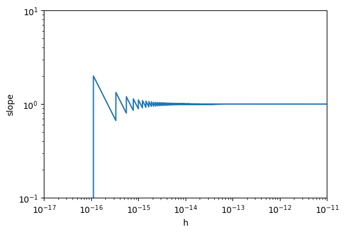{fig-alt="Log-log plot of the measured slope of a finite-difference derivative estimate versus step size h: the slope is wildly wrong for very small h (dominated by floating-point roundoff error), oscillates, then settles to the correct value of 1 as h grows past roughly 1e-14."}

- Looking closer, the floating point errors actually have a specific pattern.
- $(x+h)-x$ has a finite number of possible values.
  - For specific $h$, we hit one of the possible values exactly.
  - Otherwise, the CPU rounds to the nearest available value.

---

## Floating point errors

<!-- TODO: complex slide layout (flagged by detect_complex_slide.py - see run log). Content below is complete but UNARRANGED - needs manual layout to match the original slide. -->

- Can solve for Fourier coefficients

- Numerical Recipes' recommendation:
  - For this simple example, you can set $h$ to be exactly $(x+h)-x$. Guarantees hitting one of these "magical" values.
  - This is not really feasible in general, but you can determine an optimal size for $h$:
    - As $h \rightarrow 0$, round-off error increases
    - As $h \rightarrow 0$, truncation error decreases
    - Find the optimum between the two effects.
    - Depends on the algorithm!

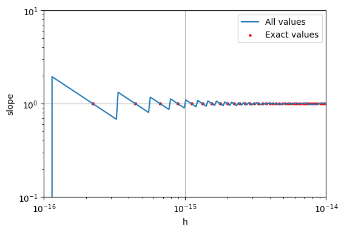{fig-alt="Same log-log plot of measured derivative slope versus step size h, now with 'All values' (blue, dense sampling) and 'Exact values' (red dots) overlaid and a reference line near h ~ 1e-15, showing the same roundoff-driven oscillation at small h settling to slope 1 at larger h."}

---

## Truncation error

<!-- TODO: complex slide layout (flagged by detect_complex_slide.py - see run log). Content below is complete but UNARRANGED - needs manual layout to match the original slide. -->

- Can solve for Fourier coefficients

- OK, now we've seen the possible values of $h$ for which Python can compute the slope of $f(x)=x$.
  - The minimum good value turned out to be h=2.220446049250313e-16
- So... we cannot actually take the limit $h \rightarrow 0$! Eventually, floating point errors will ruin our algorithm.
- Therefore, our simple formula has an intrinsic truncation error, from the neglected higher-order terms in the Taylor series.

- $${f}^{′}(x)=\mathop{lim}\limits_{ \Delta x \rightarrow 0}\frac{f(x+ \Delta x)-f(x)}{ \Delta x}$$

- $${f}^{′}(x)=\frac{f(x+h)-f(x)}{h}+\mathcal{O}(h)$$

- This is our next "devil":

{fig-alt="Cartoon of Stewie Griffin from Family Guy dressed as a devil with a pitchfork, standing next to a teddy bear (humorous aside, not course content)."}

- Minimize the truncation error!

---

## Derivative algorithms

- Can solve for Fourier coefficients

- $${f}^{′}(x)=\mathop{lim}\limits_{ \Delta x \rightarrow 0}\frac{f(x+ \Delta x)-f(x)}{ \Delta x}$$

- Direct translation of this formula: the "forward difference":

- $${f}^{′}(x)=\frac{f(x+h)-f(x)}{h}-\frac{h}{2}{f}^{′′}(x)+\mathcal{O}({h}^{2})$$

- Equally valid: the "backward difference":

- $${f}^{′}(x)=\frac{f(x)-f(x-h)}{h}+\frac{h}{2}{f}^{′′}(x)+\mathcal{O}({h}^{2})$$

---

## Derivatives: the easier case

- Can solve for Fourier coefficients

- We can immediately see a better algorithm:
  - Cancel out the $\frac{1}{2}h{f}^{′′}(x)$ term.
- I.e., combine the forward and backward differences to get a symmetric difference.
- This improves the accuracy of the calculation.
  - Downside: an extra call to $f(x)$.
  - This might not seem like a big deal, but $f(x)$ could be arbitrarily complex: perhaps a likelihood function with 10,000 nuisance parameters!

- $${f}^{′}(x)=\frac{f(x+h)-f(x-h)}{2h}+\mathcal{O}({h}^{2})$$

---

## Recall: algorithm complexity

- Can solve for Fourier coefficients

- The "O" in "big O notation" stands for “order”
- An $O({N}^{2})$ algorithm means “the leading coefficient in the number of operations scales like ${N}^{2}$”
  - Remember, “operations” here really means “multiplications”... addition is cheap!
- In computing, we want to minimize this as much as possible since the computational time scales the same way

---

## Derivatives

- Can solve for Fourier coefficients

- Since $h$ is small, the error that we make is smaller (${h}^{2}$).
- We want to make the error as small as possible (obviously).
- Simplest way: just reduce $h$ until tolerance is reached.
  - But... this increases the computing time
  - And eventually we hit floating point errors.
  - Can we do better?

- $${f}^{′}(x)=\frac{f(x+h)-f(x-h)}{2h}+\mathcal{O}({h}^{2})$$

---

## Five point stencil

- Can solve for Fourier coefficients

- Absolutely!
- The "five point stencil" achieves even better accuracy using 5 points: $[x-2h,x-h,x,x+h,x+2h]$

- $${f}^{′}(x)=\frac{f(x-2h)-8f(x-h)+8f(x+h)-f(x+2h)}{12h}+\mathcal{O}({h}^{4})$$

- Now, our leftover term is ${h}^{4}$, rather than ${h}^{2}$!

---

## Five point stencil

- Can solve for Fourier coefficients

- Where did this formula come from?
- Pretty simple: just like the symmetric difference, we compute a few Taylor expansions, and cancel terms, this time out to ${f}^{(3)}(x)$.
- For $x \pm h$:

- $$f(x \pm h)=f(x) \pm h{f}^{′}(x)+\frac{1}{2}{h}^{2}{f}^{′′}(x) \pm \frac{1}{6}{h}^{3}{f}^{(3)}(x)+{\mathcal{O}}_{1 \pm }({h}^{4})$$

- $$f(x+h)-f(x-h)=2h{f}^{′}(x)+\frac{1}{3}{h}^{3}{f}^{(3)}(x)+{\mathcal{O}}_{1}({h}^{4})$$

- For $x \pm 2h$:

- $$f(x \pm 2h)=f(x) \pm 2h{f}^{′}(x)+\frac{1}{2}(2h{)}^{2}{f}^{′′}(x) \pm \frac{1}{6}(2h{)}^{3}{f}^{(3)}(x)+{\mathcal{O}}_{2 \pm }({h}^{4})$$

- $$f(x+2h)-f(x-2h)=4h{f}^{′}(x)+\frac{8}{3}{h}^{3}{f}^{(3)}(x)+{\mathcal{O}}_{2}({h}^{4})$$

---

## Five point stencil

<!-- TODO: complex slide layout (flagged by detect_complex_slide.py - see run log). Content below is complete but UNARRANGED - needs manual layout to match the original slide. -->

- Can solve for Fourier coefficients

- Eliminate ${f}^{(3)}(x)$...

- $$f(x+h)-f(x-h)=2h{f}^{′}(x)+\frac{1}{3}{h}^{3}{f}^{(3)}(x)+{\mathcal{O}}_{1}({h}^{4})$$

- $$f(x+2h)-f(x-2h)=4h{f}^{′}(x)+\frac{8}{3}{h}^{3}{f}^{(3)}(x)+{\mathcal{O}}_{2}({h}^{4})$$

- $$f(x+2h)-8f(x+h)+8f(x-h)-f(x-2h)=12h{f}^{′}(x)+\mathcal{O}({h}^{4})$$

- $${f}^{′}(x)=\frac{f(x+2h)-8f(x+h)+8f(x-h)-f(x-2h)}{12h}+\mathcal{O}({h}^{4})$$

{fig-alt="Decorative hand-painted pink rectangular border/frame; the image itself contains no other content."}

---

## Ridder's algorithm

- Can solve for Fourier coefficients

- Ridders 1978 defines a nice algorithm for accurate derivative calculation (though slower):
  - $F(h) \equiv {f}^{′}(x;h)=\frac{f(x+h)-f(x-h)}{2h}$ will be optimal for some $h$; at smaller/larger $h$, floating point or truncation errors increase.
  - Define sequence of step sizes ${h}_{i}={h}_{0}/{ \alpha }^{i}$ for some initial guess ${h}_{0}$.
    - With the corresponding ${y}_{i}=F({h}_{i})$
  - For $10 \geq k \geq j \geq 1$, let ${F}_{jk}(h)$ be a polynomial of order $k-j$, fit to the points $({h}_{j},{y}_{j})$, $({h}_{j+1},{y}_{j+1})$, ..., $({h}_{k},{y}_{k})$.
    - Each ${F}_{jk}(h)$, evaluated at $h=0$, gives us an estimate of ${f}^{′}(x)$.
    - Neville's algorithm (next slide) provides a nice recursive way to computer ${F}_{jk}(h=0)$.
  - Estimate error: ${F}_{jk}(h=0)-{F}_{(j-1)k}(h=0)$ and ${F}_{jk}(h=0)-{F}_{j(k-1)}(h=0)$
    - Return ${F}_{jk}(h=0)$ with the smallest error.
    - As $j$ and $k-j$ increase, the error will decrease to some minimum, then blow up. So, terminate algorithm when a minimum is reached.

- Numerical Recipes 5.7

---

## Neville's algorithm

<!-- TODO: complex slide layout (flagged by detect_complex_slide.py - see run log). Content below is complete but UNARRANGED - needs manual layout to match the original slide. -->

- Can solve for Fourier coefficients

- Neville's algorithm is a recursive way to do polynomial interpolation ([wikipedia](http://en.wikipedia.org/wiki/Neville's_algorithm)).
- Given $N+1$ data points, $ \exists $ a unique $N$th order polynomial that fits the points.
- Define ${P}_{jk}$ as the polynomial of order $k-j$, which goes through the points $({x}_{i},{y}_{i})$ for $j \leq i \leq k$.
- First two orders are easy to understand:

- Order 0

- $${P}_{ii}(x)={y}_{i}$$

- Order 1

- $${P}_{i,i+1}(x)=\frac{{y}_{i}({x}_{i+1}-x)+{y}_{i+1}(x-{x}_{i})}{{x}_{i+1}-{x}_{i}}$$

- $$({x}_{i},{y}_{i})$$

- $$({x}_{i},{y}_{i})$$

- $$({x}_{i+1},{y}_{i+1})$$

- Numerical Recipes 5.7

---

## Neville's algorithm

<!-- TODO: complex slide layout (flagged by detect_complex_slide.py - see run log). Content below is complete but UNARRANGED - needs manual layout to match the original slide. -->

- Can solve for Fourier coefficients

- Neville's algorithm is a recursive way to do polynomial interpolation ([wikipedia](http://en.wikipedia.org/wiki/Neville's_algorithm)).
- Given $N+1$ data points, $ \exists $ a unique $N$th order polynomial that fits the points.
- Define ${P}_{jk}$ as the polynomial of order $k-j$, which goes through the points $({x}_{i},{y}_{i})$ for $j \leq i \leq k$.
- First two orders are easy to understand:

- Order 0

- $${P}_{ii}(x)={y}_{i}$$

- Order 1

- $${P}_{i,i+1}(x)=\frac{{y}_{i}({x}_{i+1}-x)+{y}_{i+1}(x-{x}_{i})}{{x}_{i+1}-{x}_{i}}$$

- $$({x}_{i},{y}_{i})$$

- $$({x}_{i},{y}_{i})$$

- $$({x}_{i+1},{y}_{i+1})$$

- The polynomial is linear, and goes through the two points.
- Because of uniqueness, this is all we need!

- Numerical Recipes 5.7

---

## Neville's algorithm

<!-- TODO: complex slide layout (flagged by detect_complex_slide.py - see run log). Content below is complete but UNARRANGED - needs manual layout to match the original slide. -->

- Can solve for Fourier coefficients

- Generalization to higher order:

- Order 1

- $${P}_{i,i+1}(x)=\frac{{y}_{i}({x}_{i+1}-x)+{y}_{i+1}(x-{x}_{i})}{{x}_{i+1}-{x}_{i}}$$

- $$({x}_{i},{y}_{i})$$

- $$({x}_{i+1},{y}_{i+1})$$

- $$({x}_{i},{y}_{i})$$

- $$({x}_{i+1},{y}_{i+1})$$

- Order N

- $${P}_{i,j}(x)=\frac{{P}_{i+1,j}(x)({x}_{j}-x)+{P}_{i,j-1}(x)(x-{x}_{i})}{{x}_{j}-{x}_{i}}$$

- $$({x}_{i+2},{y}_{i+2})$$

- $${P}_{i,j-1}(x)$$

- $${P}_{i+1,j}(x)$$

- Numerical Recipes 5.7

---

## Neville's algorithm

<!-- TODO: complex slide layout (flagged by detect_complex_slide.py - see run log). Content below is complete but UNARRANGED - needs manual layout to match the original slide. -->

- Can solve for Fourier coefficients

- So, Neville's algorithm gives us a recursive algorithm to compute an $N$th order polynomial going through $N+1$ points.
- You can visualize the process in a "tableau", moving from left to right.

{fig-alt="Triangular tableau of Neville's algorithm interpolants p_{i,j}(x), built up from the base values p_{k,k}(x) = y_k at the left, with the final interpolated value p_{0,4}(x) boxed at the apex."}

- Numerical Recipes 5.7

---

## Ridders+Neville

<!-- TODO: complex slide layout (flagged by detect_complex_slide.py - see run log). Content below is complete but UNARRANGED - needs manual layout to match the original slide. -->

- Can solve for Fourier coefficients

{fig-alt="Triangular tableau of Neville's algorithm interpolants p_{i,j}(x), built up from the base values p_{k,k}(x) = y_k at the left, with the final interpolated value p_{0,4}(x) boxed at the apex."}

- $$F(h) \equiv {f}^{′}(x;h)=\frac{f(x+h)-f(x-h)}{2h}$$

- $${y}_{i}=F({h}_{i})=\frac{f(x+{h}_{i})-f(x)}{{h}_{i}}$$

- $${h}_{i}=\frac{{h}_{0}}{{ \alpha }^{i}}, \alpha  \approx 1.4$$

- Each ${p}_{ij}(h)$ is a polynomial that goes through $j-i+1$ points
- ${p}_{ij}(h=0)$ gives us an estimate of ${f}^{′}(x)$

- $$h$$

- $$h$$

- $$h$$

- $$h$$

- $$h$$

- $$h$$

- $$h$$

- $$h$$

- $$h$$

- $$h$$

- $$h$$

- $$h$$

- $$h$$

- $$h$$

- $$h$$

- Numerical Recipes 5.7

- $${h}_{0} \approx 0.1$$

---

## Ridders+Neville

<!-- TODO: complex slide layout (flagged by detect_complex_slide.py - see run log). Content below is complete but UNARRANGED - needs manual layout to match the original slide. -->

- Can solve for Fourier coefficients

{fig-alt="Triangular tableau of Neville's algorithm interpolants p_{i,j}(x), built up from the base values p_{k,k}(x) = y_k at the left, with the final interpolated value p_{0,4}(x) boxed at the apex."}

- $$F(h) \equiv {f}^{′}(x;h)=\frac{f(x+h)-f(x-h)}{2h}$$

- Increase extrapolation order by 1

- Go to next smaller ${h}_{i}$

- Numerical Recipes 5.7

- $${y}_{i}=F({h}_{i})=\frac{f(x+{h}_{i})-f(x)}{{h}_{i}}$$

- $${h}_{i}=\frac{{h}_{0}}{{ \alpha }^{i}}, \alpha  \approx 1.4$$

- $${h}_{0} \approx 0.1$$

- $$h$$

- $$h$$

- $$h$$

- $$h$$

- $$h$$

- $$h$$

- $$h$$

- $$h$$

- $$h$$

- $$h$$

- $$h$$

- $$h$$

- $$h$$

- $$h$$

- $$h$$

---

## Ridders+Neville

<!-- TODO: complex slide layout (flagged by detect_complex_slide.py - see run log). Content below is complete but UNARRANGED - needs manual layout to match the original slide. -->

- Can solve for Fourier coefficients

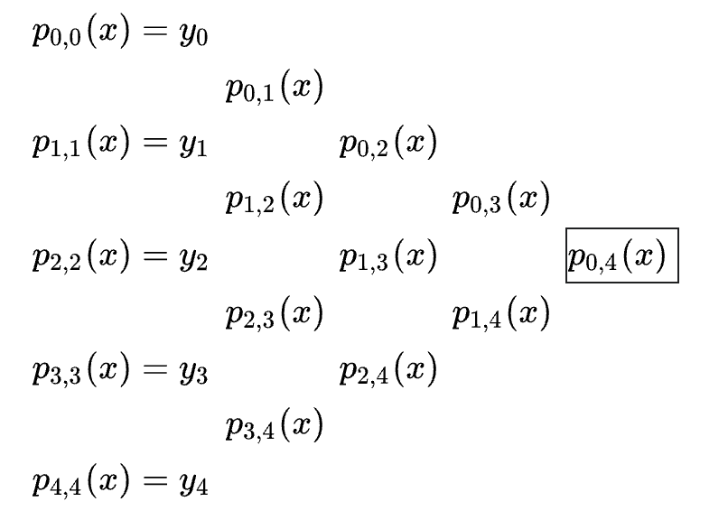{fig-alt="Triangular tableau of Neville's algorithm interpolants p_{i,j}(x), built up from the base values p_{k,k}(x) = y_k at the left, with the final interpolated value p_{0,4}(x) boxed at the apex."}

- $$F(h) \equiv {f}^{′}(x;h)=\frac{f(x+h)-f(x-h)}{2h}$$

- Keep going until the error starts to increase.
- Return ${p}_{ij}(h=0)$ with smallest error.

- Numerical Recipes 5.7

- Error =$max\left( |{p}_{i,j}(0)-{p}_{i+1,j}(0)|,|{p}_{i,j}(0)-{p}_{i,j-1}(0)| \right)$

- $${y}_{i}=F({h}_{i})=\frac{f(x+{h}_{i})-f(x)}{{h}_{i}}$$

- $${h}_{i}=\frac{{h}_{0}}{{ \alpha }^{i}}, \alpha  \approx 1.4$$

- $${h}_{0} \approx 0.1$$

- $$h$$

- $$h$$

- $$h$$

- $$h$$

- $$h$$

- $$h$$

- $$h$$

- $$h$$

- $$h$$

- $$h$$

- $$h$$

- $$h$$

- $$h$$

- $$h$$

- $$h$$

---

# Integrals

---

## Integrals

<!-- TODO: complex slide layout (flagged by detect_complex_slide.py - see run log). Content below is complete but UNARRANGED - needs manual layout to match the original slide. -->

- Can solve for Fourier coefficients

- We’ve done derivatives. Now on to integration.
- References:
  - [Numerical Recipes](https://numerical.recipes/book.html), Chapter 4
  - Garcia Chapter 10.2
- Recall your high-school (ish) calculus class ([http://en.wikipedia.org/wiki/Integral](http://en.wikipedia.org/wiki/Integral)):

- By IkamusumeFan - Own workThis plot was created with Matplotlib., CC BY-SA 3.0, https://commons.wikimedia.org/w/index.php?curid=28296067

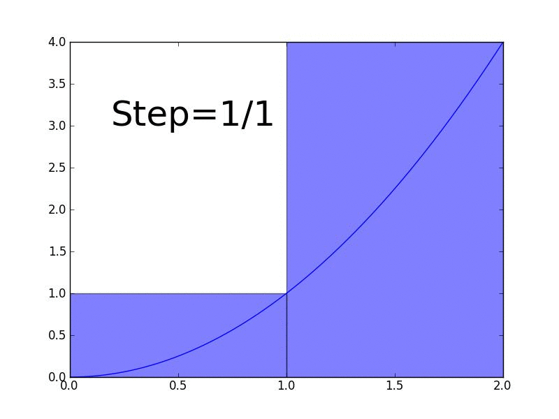{fig-alt="Animated GIF illustrating Riemann/Darboux upper-sum rectangles under a curve becoming narrower and converging to the true area as the number of subdivisions increases."}

---

## Integrals

- Can solve for Fourier coefficients

- To first order, that’s all we’re going to do for computations of integrals.
- There are fancier, faster, better methods, but they are successive approximations of this kind of thing except one (Monte Carlo integration).
- We’ll first consider the class of problems called “quadrature” in numerical analysis.

---

## Integrals

- Can solve for Fourier coefficients

- Consider the integral:

- $$I={ \int }_{a}^{b}dxf(x)$$

- Remember the fundamental theorem of calculus...

- $$\begin{matrix}
y(x) &  \equiv { \int }_{a}^{x}d{x}^{′}f({x}^{′}) \\
\frac{dy}{dx} & =f(x) \\
y(a) & =0,y(b)=I
\end{matrix}$$

- So given $f(x)$, we have a differential equation that we could solve to get $I$.
- But instead we’ll start with the “bare bones” approximations that you learned in high school/freshman calculus.

---

## Trapezoid rule

<!-- TODO: complex slide layout (flagged by detect_complex_slide.py - see run log). Content below is complete but UNARRANGED - needs manual layout to match the original slide. -->

- Can solve for Fourier coefficients

- The rectangular sums are a not-so-great approximation of an integral.
- Much better: your old friend, the trapezoid rule.

- $${ \int }_{a}^{b}dxf(x) \approx (b-a)\left[ \frac{f(b)+f(a)}{2} \right]$$

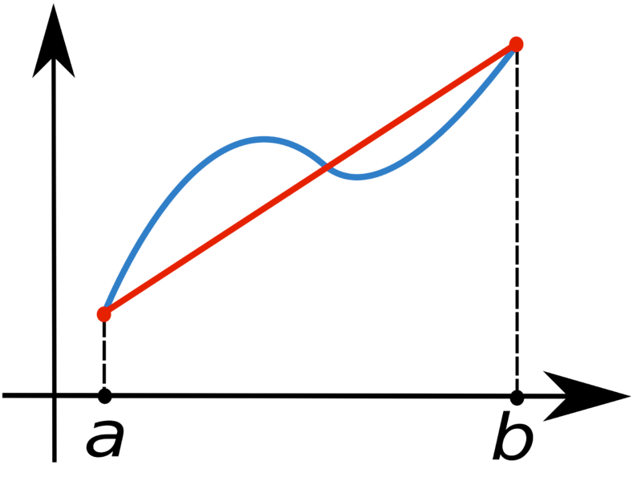{fig-alt="Illustration of the trapezoid rule: the area under a curve from x=0 to x=2 is approximated by a single trapezoid step (labeled 'Step=1/1'), shown as the shaded region bounded by the curve, the x-axis, and vertical lines at x=1 and x=2."}

- $$\frac{f(a)+f(b)}{2}$$

- $$b-a$$

---

## Accuracy

- Can solve for Fourier coefficients

- Now onto computation aspects: how accurate is a given integration algorithm?
- Let $h=b-a$ be our small parameter, and let's consider the simple rectangular rule:

- $$I={ \int }_{a}^{b}dxf(x) \approx hf({x}_{0})$$

- Taylor expand $f(x)$:

- $$f(x)-f({x}_{0})=(x-{x}_{0}){f}^{′}({x}_{0})+\frac{1}{2}(x-{x}_{0}{)}^{2}{f}^{′′}({x}_{0})+...$$

- Then the error is:

- $$\begin{matrix}
I & ={ \int }_{a}^{b}dx\left[ f({x}_{0})+(x-{x}_{0}){f}^{′}({x}_{0})+\frac{1}{2}(x-{x}_{0}{)}^{2}{f}^{′′}(x)+... \right] \\
I-(b-a)f({x}_{0}) & ={f}^{′}({x}_{0})\left[ \frac{b+a}{2}-{x}_{0} \right]\frac{b-a}{2}+\frac{1}{6}{f}^{′′}({x}_{0})\left[ (b-{x}_{0}{)}^{3}-(a-{x}_{0}{)}^{3} \right] \\
 &  \sim \mathcal{O}({h}^{2})
\end{matrix}$$

---

## Accuracy

- Can solve for Fourier coefficients

- You might notice an easy improvement: choose ${x}_{0}=\frac{b+a}{2}$ and cancel out the first term!
  - Immediately improve to $\mathcal{O}({h}^{3})$ accuracy.
- "Midpoint rule":

- $$I-(b-a)f({x}_{0})={f}^{′}({x}_{0})\left[ \frac{b+a}{2}-{x}_{0} \right]\frac{b-a}{2}+\frac{1}{6}{f}^{′′}({x}_{0})\left[ (b-{x}_{0}{)}^{3}-(a-{x}_{0}{)}^{3} \right] \sim \mathcal{O}({h}^{2})$$

- $$\begin{matrix}
I &  \approx T=\frac{h}{2}\left[ f(a)+f(b) \right] \\
I-T &  \sim -\frac{{h}^{3}}{12}{f}^{′′}(a)
\end{matrix}$$

---

## Trapezoid rule

<!-- TODO: complex slide layout (flagged by detect_complex_slide.py - see run log). Content below is complete but UNARRANGED - needs manual layout to match the original slide. -->

- Can solve for Fourier coefficients

- Then can break the integral into a bunch of trapezoids
- This is also related to “polygon tessellation” in computer graphics, to compute (or display) the area in a 2D image  ([wikipedia](http://en.wikipedia.org/wiki/Polygon_triangulation)).
- Easier and faster than computing the area in a more complicated way!
- Almost all of your modern computer games will allow
you to set the amount of  tessellation to optimize  performance or beauty depending on your taste

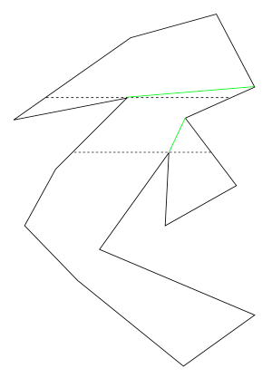{fig-alt="Geometry diagram decomposing a non-monotone polygon into monotone pieces via added diagonal cuts (shown in green), with horizontal dotted reference lines marking the split points."}

---

## Trapezoid rule

<!-- TODO: complex slide layout (flagged by detect_complex_slide.py - see run log). Content below is complete but UNARRANGED - needs manual layout to match the original slide. -->

- Can solve for Fourier coefficients

{fig-alt="Screenshot of a video game's graphics options menu (display, texture, and environment settings), unrelated to the course content — apparently a decorative/joke image."}

- This is tessellation

---

## Trapezoid rule

- Can solve for Fourier coefficients

- Now let's move from one slice to the full integral.
  - Sum the slices.

- $${ \int }_{a}^{b}dxf(x)=\mathop{\mathop{ \sum }\limits_{i=1}}\limits^{N-1}{ \int }_{{x}_{i}}^{{x}_{i+1}}dxf(x)$$

- The error is now the sum of errors.
  - $N \sim 1/h$, so our accuracy worsens by a factor of $h$.

- $$\begin{matrix}
I \approx {I}_{T} & =\mathop{\mathop{ \sum }\limits_{i=1}}\limits^{N-1}\frac{{x}_{i+1}-{x}_{i}}{2}\left[ f({x}_{i+1}+f({x}_{i}) \right] \\
I-{I}_{T} &  \sim \mathcal{O}((N-1){h}^{3}) \sim \mathcal{O}((b-a){h}^{2})
\end{matrix}$$

- This gives us an algorithmic handle on the error, via $N$ (or equivalently $h$).

---

## Simpson's rule

<!-- TODO: complex slide layout (flagged by detect_complex_slide.py - see run log). Content below is complete but UNARRANGED - needs manual layout to match the original slide. -->

- Can solve for Fourier coefficients

- [Simpson's rule](http://en.wikipedia.org/wiki/Simpson's_rule) is more accurate than the trapezoidal rule, and not really slower.
- Idea: instead of approximating with a trapezoid, use a parabola:

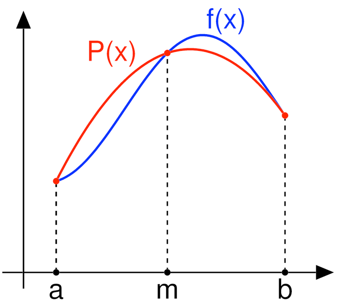{fig-alt="Diagram illustrating Simpson's rule: the true function f(x) (blue) and its parabolic interpolant P(x) (red) over the interval [a,b], agreeing at the endpoints a, b and the midpoint m."}

- Conceptually similar to the "symmetric derivative": use 3 points gets you better accuracy.

---

## Simpson's rule

- Can solve for Fourier coefficients

- $$I={ \int }_{a}^{b=a+2h}dxf(x)=\frac{h}{3}\left[ f(a)+4f(a+h)+f(b) \right]+\mathcal{O}({h}^{5})$$

- For one slice:

- For multiple slices:

- $$\begin{matrix}
I & ={ \int }_{a}^{b}dxf(x)=\frac{h}{3}[f(a)+4(a+h)+2f(a+2h)+4f(a+3h)+2f(a+4h)+... \\
 & ...+2f(b-2h)+4f(b-h)+f(b)+\mathcal{O}((b-a){h}^{4})
\end{matrix}$$
- Note: there are an even number of intervals, and $f(x)$ is evaluated at an odd number of points.

---

## Simpson's rule

<!-- TODO: complex slide layout (flagged by detect_complex_slide.py - see run log). Content below is complete but UNARRANGED - needs manual layout to match the original slide. -->

- Can solve for Fourier coefficients

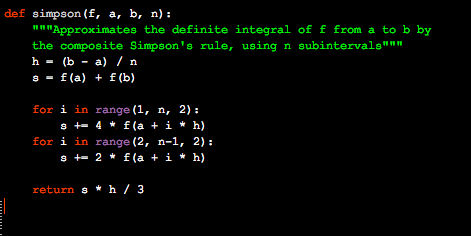{fig-alt="Python code listing for a composite Simpson's rule integrator: def simpson(f, a, b, n), computing h=(b-a)/n and summing f(a), f(b), and weighted interior points (4x for odd indices, 2x for even indices) before returning s*h/3."}

---

## Adaptive methods

- Can solve for Fourier coefficients

- We can often adapt the algorithm to a desired precision by iterating.
- This improves the accuracy dynamically, saving time when the function is fairly linear.

---

## Adaptive methods

<!-- TODO: complex slide layout (flagged by detect_complex_slide.py - see run log). Content below is complete but UNARRANGED - needs manual layout to match the original slide. -->

- Can solve for Fourier coefficients

- Pseudocode:

- Input: precision $ \epsilon $
- Choose N and compute h
- Compute $ \Delta I \equiv |{I}_{T}(h)-{I}_{T}(2h)|$
- If $ \Delta I> \epsilon $:
- Set h --> h/2
- Repeat

- Note: if we intelligently scale $h$ between steps, we can reuse the computations from the previous iteration!

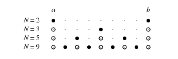{fig-alt="Diagram of nested quadrature point sets between endpoints a and b for N=2, 3, 5, and 9 points, showing how added points (open circles) interleave with previous sample points (filled circles) in a nested/adaptive sampling scheme."}

---

## Checkpoint

- Can solve for Fourier coefficients

- We learned a few algorithms for derivatives
  - Intrinsic trade-off between round-off (aka floating point) errors at small $h$ and truncation errors at large $h$.
  - A little work (symmetric/5-point algorithm) greatly improves the accuracy.
- ...and a few algorithms for integrals
  - Trapezoid/Simpson's rules do pretty well.
- Try them out in CompPhys/Calculus/*ipynb!

---

## Hands-on activity

- Can solve for Fourier coefficients

- We've written all four root-finding algorithms in CompPhys/Calculus/rootfinding.py, with an example in rootfinding.ipynb. Give the examples a run-through.
- The example notebook only uses the simple and bisection methods. Try extending it to the secant and tangent methods.
- You can also try out [https://docs.scipy.org/doc/scipy/reference/optimize.html#root-finding](https://docs.scipy.org/doc/scipy/reference/optimize.html#root-finding) .

---

# Application: Scattering cross sections

---

## Scattering cross sections

<!-- TODO: complex slide layout (flagged by detect_complex_slide.py - see run log). Content below is complete but UNARRANGED - needs manual layout to match the original slide. -->

- Can solve for Fourier coefficients

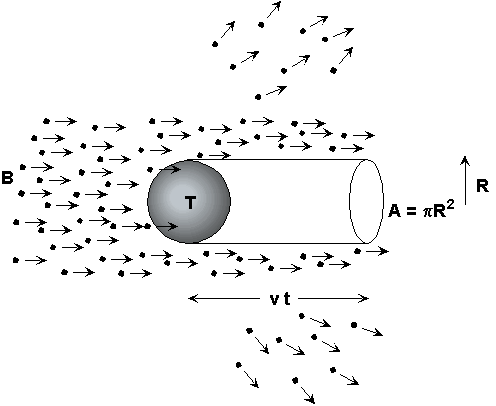{fig-alt="Diagram of a scattering cross-section setup: a beam of incoming particles (dots with velocity arrows) in a field B travels a distance vt toward a target T, sweeping out a cylindrical volume of cross-sectional area A = piR^2."}

- Application of integration and root finding: classical cross section calculations.
  - Billiard (Rutherford scattering); particle physics; astrophysics; optics; ...
- Basic definitions:
  - $I$ = Incident flux [#particles / time / area]
    - Assume uniform distribution
  - $ \sigma $ = cross section, defined as:

- https://www.jupiterscientific.org/sciinfo/crosssection.html

- $$\frac{\text{Interactions}}{\text{time}}=I\left[ \frac{\text{number}}{\text{area} \cdot \text{time}} \right] \times  \sigma [\text{area}]$$
{fig-alt="Decorative hand-painted blue rectangular border/frame; the image itself contains no other content."}

---

## Scattering cross sections

<!-- TODO: complex slide layout (flagged by detect_complex_slide.py - see run log). Content below is complete but UNARRANGED - needs manual layout to match the original slide. -->

- Can solve for Fourier coefficients

{fig-alt="Classic scattering geometry diagram (after Thornton & Rex): a particle deflected by angle theta at impact parameter b (with spread db) traces an arc of radius r, sweeping out a ring of circumference r sin(theta) as it precesses by rd(theta)."}

- We will focus on this specific geometry:
  - Incoming particles moving in +x direction.
  - Radial force field, $\mathbf{F}=F\hat{\mathbf{r}}$, originating from origin $r=0$.
- Incoming particles described by two variables:
  - $E$ = energy
  - $b$ = impact parameter

---

## Scattering cross sections

- Can solve for Fourier coefficients

- You might be thinking: "isn't solving for trajectories in a force field a differential equation problem?"
- In general, yes, one can numerically compute the trajectory (we will get to this!)
- However, for this simple geometry, we can solve for basically everything with the help of (a) numerical integration and (b) root finding.
  - Given $\mathbf{F}=f(r)\hat{\mathbf{r}}$, the parameter space has only ~2 independent variables.
  - Use conservation of energy and symmetries to simplify equations.

---

## Differential cross sections

<!-- TODO: complex slide layout (flagged by detect_complex_slide.py - see run log). Content below is complete but UNARRANGED - needs manual layout to match the original slide. -->

- Can solve for Fourier coefficients

{fig-alt="Classic scattering geometry diagram (after Thornton & Rex): a particle deflected by angle theta at impact parameter b (with spread db) traces an arc of radius r, sweeping out a ring of circumference r sin(theta) as it precesses by rd(theta)."}

- $ \theta $ = scattering angle (total change in angle from $t=- \infty $ to $t= \infty $).
- $b( \theta )$ = impact parameter resulting in scattering angle $ \theta $.
- Quantity of interest: particles scattered into some volume, "$d \Omega $."
  - Here, $d \Omega $ is a ring: $d \Omega =2 \pi sin \theta d \theta $.
  - (Think of an array of photomultiplier tubes, all at fixed $ \theta $.)
- Rate of observing outgoing particles in $d \Omega $ is equal to the rate of incoming particles through the ring $[b,b+db]$:

- $$Nd \Omega =N(2 \pi sin \theta d \theta )=I2 \pi bdb$$

---

## Differential cross sections

<!-- TODO: complex slide layout (flagged by detect_complex_slide.py - see run log). Content below is complete but UNARRANGED - needs manual layout to match the original slide. -->

- Can solve for Fourier coefficients

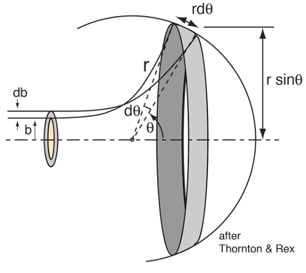{fig-alt="Classic scattering geometry diagram (after Thornton & Rex): a particle deflected by angle theta at impact parameter b (with spread db) traces an arc of radius r, sweeping out a ring of circumference r sin(theta) as it precesses by rd(theta)."}

- Define the differential cross section as the rate of scattered particles into $d \Omega $ divided by the incoming flux:

- $$Nd \Omega =N(2 \pi sin \theta d \theta )=I2 \pi bdb$$

- $$\begin{matrix}
\frac{d \sigma }{d \Omega } & =\frac{N}{I}=\frac{b}{sin \theta }\left| \frac{db}{d \theta } \right|
\end{matrix}$$

- Side note: this is pretty bad notation. The quantity is not "differential," and it's not a "cross section"!
  - It is sort of a derivative, but just think "cross section into a specified final state."

---

## Warm up problem: billiard ball scattering

<!-- TODO: complex slide layout (flagged by detect_complex_slide.py - see run log). Content below is complete but UNARRANGED - needs manual layout to match the original slide. -->

- Can solve for Fourier coefficients

{fig-alt="Hard-sphere (billiard-ball) scattering diagram: an incoming particle with impact parameter b strikes a circle of radius R, deflecting through angle theta, with the scattering angle alpha marked at both the impact point and the circle's center."}

- Consider scattering off a hard billiard ball of radius R
  - E.g. V(r) jumps to infinity at R.
- $b$ and $ \theta $ are related simply by:

- $$\begin{matrix}
b( \theta ) & =rsin \alpha  \\
 \theta +2 \alpha  & = \pi  \\
b( \theta ) & =Rsin \alpha =Rsin(( \pi - \theta )/2)=Rcos( \theta /2) \\
\frac{db}{d \theta } & =\frac{R}{2}sin( \theta /2)
\end{matrix}$$

- $$\begin{matrix}
\frac{d \sigma }{d \Omega } & =\frac{N}{I}=\frac{b}{sin \theta }\left| \frac{db}{d \theta } \right|
\end{matrix}$$

---

## Warm up problem: billiard ball scattering

<!-- TODO: complex slide layout (flagged by detect_complex_slide.py - see run log). Content below is complete but UNARRANGED - needs manual layout to match the original slide. -->

- Can solve for Fourier coefficients

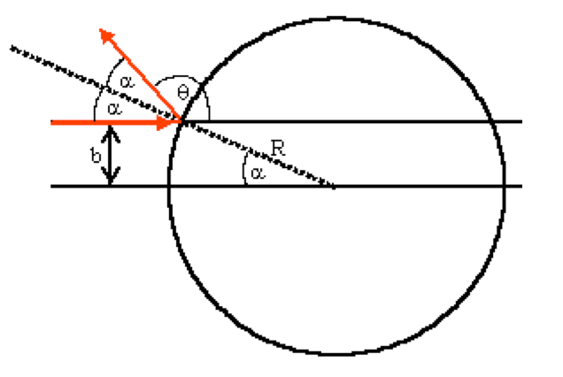{fig-alt="Hard-sphere (billiard-ball) scattering diagram: an incoming particle with impact parameter b strikes a circle of radius R, deflecting through angle theta, with the scattering angle alpha marked at both the impact point and the circle's center."}

- Consider scattering off a hard billiard ball of radius R
  - E.g. V(r) jumps to infinity at R.
- $b$ and $ \theta $ are related simply by:

- $$\begin{matrix}
b( \theta ) & =rsin \alpha  \\
 \theta +2 \alpha  & = \pi  \\
b( \theta ) & =Rsin \alpha =Rsin(( \pi - \theta )/2)=Rcos( \theta /2) \\
\frac{db}{d \theta } & =\frac{R}{2}sin( \theta /2)
\end{matrix}$$

- $$\begin{matrix}
\frac{d \sigma }{d \Omega } & =\frac{N}{I}=\frac{b}{sin \theta }\left| \frac{db}{d \theta } \right|
\end{matrix}$$

- Plug into the differential cross section formula:

- $$\begin{matrix}
\frac{d \sigma }{d \Omega } & =\frac{b}{sin \theta }\frac{R}{2}sin \theta /2=\frac{{R}^{2}cos( \theta /2)sin( \theta /2)}{2sin \theta }=\frac{{R}^{2}}{4} \\
 \sigma  & = \int \frac{d \sigma }{d \Omega }d \Omega = \int \frac{{R}^{2}}{4}{sin}^{2} \theta d \theta d \phi = \pi {R}^{2}
\end{matrix}$$

- ✅

- We went through a page of calculations, but in the end, we were basically adding up the [b, b+db] rings in the incoming phase space corresponding to each $d \Omega $ ring in the outgoing phase space.
  - Along with some change of variables in the integration, $db \rightarrow d \theta $.
- So obtaining $ \pi {R}^{2}$ is not a surprise!
{fig-alt="Decorative hand-painted blue rectangular border/frame; the image itself contains no other content."}

---

## Conservation of energy

- Can solve for Fourier coefficients

- For general $V(r)$, let's use conservation of energy and momentum to derive a nice equation.
- The conserved quantities are:

- $$\begin{matrix}
E & =T+V=\frac{1}{2}m({\mathop{r}\limits^{ \cdot }}^{2}+(r\mathop{ \theta }\limits^{ \cdot }{)}^{2})+V(r) \\
{L}_{z} & =m{r}^{2}\mathop{ \theta }\limits^{ \cdot } \equiv m \ell 
\end{matrix}$$

- Using $\mathop{r}\limits^{ \cdot }=\frac{dr}{d \theta }\frac{d \theta }{dt}$ and conservation of ${L}_{z}$, we can actually eliminate time derivatives:

- $$\begin{matrix}
E & =\frac{1}{2}m\left( (\frac{1}{{r}^{2}}\frac{dr}{d \theta }{)}^{2}({r}^{2}\mathop{ \theta }\limits^{ \cdot }{)}^{2}+{r}^{2}{\mathop{ \theta }\limits^{ \cdot }}^{2} \right) \\
 & =\frac{1}{2}m{ \ell }^{2}\left( (\frac{1}{{r}^{2}}\frac{dr}{d \theta }{)}^{2}+\frac{1}{{r}^{2}} \right)+V(r)
\end{matrix}$$

---

## Conservation of energy

<!-- TODO: complex slide layout (flagged by detect_complex_slide.py - see run log). Content below is complete but UNARRANGED - needs manual layout to match the original slide. -->

- Can solve for Fourier coefficients

- Finally, replace $ \ell $ with $b$, and solve for $\frac{dr}{d \theta }$:

- $$\begin{matrix}
E & =\frac{1}{2}m{ \ell }^{2}\left( (\frac{1}{{r}^{2}}\frac{dr}{d \theta }{)}^{2}+\frac{1}{{r}^{2}} \right)+V(r)
\end{matrix}$$

- $$\begin{matrix}
{L}_{z} & =m \ell =m{v}_{0}b \\
E & =\frac{1}{2}m{v}_{0}^{2} \\
 \ell  & =\sqrt{2E/m}b \\
\frac{1}{2}m{ \ell }^{2} & =E{b}^{2}
\end{matrix}$$

- $$\begin{matrix}
E & =E{b}^{2}\left( (\frac{1}{{r}^{2}}\frac{dr}{d \theta }{)}^{2}+\frac{1}{{r}^{2}} \right)+V(r) \\
\frac{dr}{d \theta } & = \pm \frac{{r}^{2}}{b}\sqrt{1-\frac{{b}^{2}}{{r}^{2}}-\frac{V(r)}{E}}
\end{matrix}$$

{fig-alt="Decorative hand-painted blue rectangular border/frame; the image itself contains no other content."}

- So, we have $\frac{dr}{d \theta }$ (or $\frac{d \theta }{dr}$), and can integrate it to find $ \Delta  \theta $ for given $ \Delta r$, or vice versa.

---

## Result 1: distance of closest approach

<!-- TODO: complex slide layout (flagged by detect_complex_slide.py - see run log). Content below is complete but UNARRANGED - needs manual layout to match the original slide. -->

- Can solve for Fourier coefficients

- Intermediate result: we can solve for the root ($\frac{dr}{d \theta }=0$) to find the distance of closest approach.
- Let $({r}_{min},{ \theta }^{*})$ be the point of closest approach.

- $$\begin{matrix}
\frac{dr}{d \theta } & = \pm \frac{{r}^{2}}{b}\sqrt{1-\frac{{b}^{2}}{{r}^{2}}-\frac{V(r)}{E}}
\end{matrix}$$

{fig-alt="Figure 6.14.1 (from Fowles): hyperbolic path of a charge q scattering off a repulsive charge Q at the origin, showing impact parameter b, distance of closest approach r_min, incoming asymptote angle theta_0, and scattering angle theta_s."}

---

## Result 2: total scattering angle

<!-- TODO: complex slide layout (flagged by detect_complex_slide.py - see run log). Content below is complete but UNARRANGED - needs manual layout to match the original slide. -->

- Can solve for Fourier coefficients

- Rearrange and integrate to compute the scattering angle.
- Specifically, let ${ \theta }_{0}$ be the angle between ${ \theta }^{*}$ and the asymptotic trajectories. We have:

- $$\begin{matrix}
\frac{dr}{d \theta } & = \pm \frac{{r}^{2}}{b}\sqrt{1-\frac{{b}^{2}}{{r}^{2}}-\frac{V(r)}{E}}
\end{matrix}$$

- $$\begin{matrix}
d \theta  & =\frac{b}{{r}^{2}}\frac{dr}{\sqrt{1-\frac{{b}^{2}}{{r}^{2}}-\frac{V(r)}{E}}} \\
{ \theta }_{0} & ={ \int }_{{r}_{min}}^{ \infty }\frac{b}{{r}^{2}}\frac{dr}{\sqrt{1-\frac{{b}^{2}}{{r}^{2}}-\frac{V(r)}{E}}} \\
{ \theta }_{s} & = \pi -2{ \theta }_{0}= \pi -2{ \int }_{{r}_{min}}^{ \infty }\frac{b}{{r}^{2}}\frac{dr}{\sqrt{1-\frac{{b}^{2}}{{r}^{2}}-\frac{V(r)}{E}}}
\end{matrix}$$

{fig-alt="Figure 6.14.1 (from Fowles): hyperbolic path of a charge q scattering off a repulsive charge Q at the origin, showing impact parameter b, distance of closest approach r_min, incoming asymptote angle theta_0, and scattering angle theta_s."}

- We can numerically integrate this for any $V(r)$!

---

## Checkpoint

<!-- TODO: complex slide layout (flagged by detect_complex_slide.py - see run log). Content below is complete but UNARRANGED - needs manual layout to match the original slide. -->

- Can solve for Fourier coefficients

- Differential cross section cross section:

- $${ \theta }_{s}= \pi -2{ \theta }_{0}= \pi -2{ \int }_{{r}_{min}}^{ \infty }\frac{b}{{r}^{2}}\frac{dr}{\sqrt{1-\frac{{b}^{2}}{{r}^{2}}-\frac{V(r)}{E}}}$$

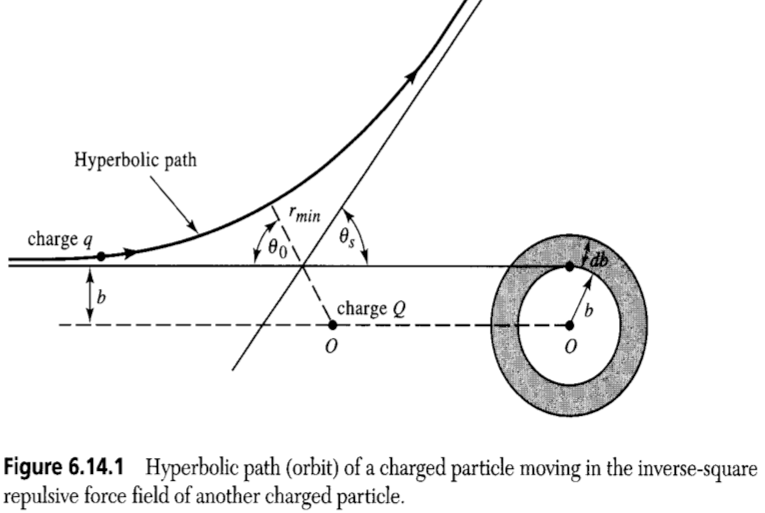{fig-alt="Figure 6.14.1 (from Fowles): hyperbolic path of a charge q scattering off a repulsive charge Q at the origin, showing impact parameter b, distance of closest approach r_min, incoming asymptote angle theta_0, and scattering angle theta_s."}

- $$\begin{matrix}
\frac{d \sigma }{d \Omega } & =\frac{N}{I}=\frac{b}{sin \theta }\left| \frac{db}{d \theta } \right|
\end{matrix}$$

- Trajectory equation:

- $$\frac{dr}{d \theta }= \pm \frac{{r}^{2}}{b}\sqrt{1-\frac{{b}^{2}}{{r}^{2}}-\frac{V(r)}{E}}$$

- Point of closest approach: solve for $\frac{dr}{d \theta }=0$ (use numerical root finding algorithm, e.g., Newton–Raphson).
- Total scattering angle: integrate to find change in angle, starting from $ \theta (t=- \infty )=- \pi $.

- Integrate this to find trajectory, e.g.,  $ \theta (r)={ \theta }^{*}+{ \int }_{{r}_{min}}^{r}\frac{d \theta }{dr}dr$

---

# Scattering: coulomb potential

---

## Coulomb potential

<!-- TODO: complex slide layout (flagged by detect_complex_slide.py - see run log). Content below is complete but UNARRANGED - needs manual layout to match the original slide. -->

- Can solve for Fourier coefficients

- Coulomb potential is given by:

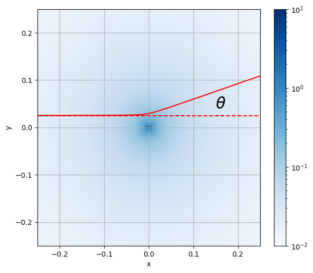{fig-alt="2D color-map plot (log-scaled colorbar from 1e-2 to 1e1) of a potential or field peaked at the origin, with a red trajectory line bending from a horizontal incoming path through a scattering angle theta."}

- $$V(r)=\frac{k{q}_{1}{q}_{2}}{r}$$

{fig-alt="Diagram of a particle's trajectory bending past a target nucleus: incoming momentum p and outgoing momentum p' are shown as arrows, with impact parameter b, deflection angle psi along the path, scattering angle theta, and the local direction vector u marked at a point on the curve."}

- This turns out to be analytically solvable.
- First, define a symmetric coordinate system:
  - $\hat{\mathbf{u}}$=unit vector pointing towards PoCA, $({r}_{min},{ \theta }^{*})$.
  - $ \psi $ = angle from $\hat{\mathbf{u}}$ to given point along trajectory.
- We are going to look at the total change in momentum, $ \Delta \mathbf{p}={\mathbf{p}}^{′}-\mathbf{p}$

---

## Coulomb scattering: momentum change

<!-- TODO: complex slide layout (flagged by detect_complex_slide.py - see run log). Content below is complete but UNARRANGED - needs manual layout to match the original slide. -->

- Can solve for Fourier coefficients

- We know that $|{\mathbf{p}}^{′}|=|\mathbf{p}|$.
- Arranging the vectors into an isosceles triangle, we have $| \Delta \mathbf{p}|=2psin( \theta /2)$.
  - Further, $ \Delta \mathbf{p}$ points in the direction of $\hat{\mathbf{u}}$.

{fig-alt="Vector triangle showing the initial momentum p, final momentum p', and the momentum transfer |Δp| = 2p sin(theta/2) as the dashed line between their tips, with the scattering angle theta marked between p and p'."}

- We can also compute $ \Delta \mathbf{p}$ directly from Newton's law:

- $$ \Delta \mathbf{p}= \int \mathbf{F}dt$$

- In the symmetric coordinate system, we only care about stuff along $\hat{\mathbf{u}}$:

- $$| \Delta \mathbf{p}|={ \int }_{- \infty }^{ \infty }|{\mathbf{F}}_{u}|dt$$

---

## Coulomb scattering: momentum change

<!-- TODO: complex slide layout (flagged by detect_complex_slide.py - see run log). Content below is complete but UNARRANGED - needs manual layout to match the original slide. -->

- Can solve for Fourier coefficients

- For a given point $(r, \psi )$ along the trajectory, the force is:

- $$|{\mathbf{F}}_{u}|=\mathbf{F} \cdot \hat{\mathbf{u}}=\frac{k{q}_{1}{q}_{2}}{{r}^{2}}cos \psi $$

- $$| \Delta \mathbf{p}|={ \int }_{- \infty }^{ \infty }\frac{k{q}_{1}{q}_{2}}{{r}^{2}}cos \psi dt$$

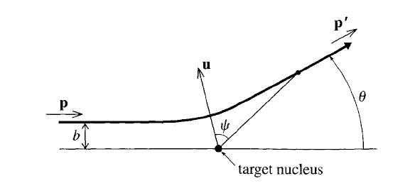{fig-alt="Diagram of a particle's trajectory bending past a target nucleus: incoming momentum p and outgoing momentum p' are shown as arrows, with impact parameter b, deflection angle psi along the path, scattering angle theta, and the local direction vector u marked at a point on the curve."}

- Hence the impulse is:

---

## Coulomb scattering: momentum change

<!-- TODO: complex slide layout (flagged by detect_complex_slide.py - see run log). Content below is complete but UNARRANGED - needs manual layout to match the original slide. -->

- Can solve for Fourier coefficients

- Now for the tricks:
- $\mathop{ \psi }\limits^{ \cdot }=\frac{d \psi }{dt}$, so $dt=\frac{d \psi }{\mathop{ \psi }\limits^{ \cdot }}$
- $\mathop{ \psi }\limits^{ \cdot }$ can also be determined from conservation of angular momentum.
  - For a given point $(r, \psi )$, the angular momentum is:

{fig-alt="Diagram of a particle's trajectory bending past a target nucleus: incoming momentum p and outgoing momentum p' are shown as arrows, with impact parameter b, deflection angle psi along the path, scattering angle theta, and the local direction vector u marked at a point on the curve."}

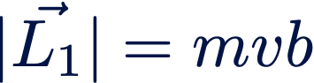{fig-alt="LaTeX label: the magnitude of the initial angular momentum, |L1 (vector)| = mvb."}

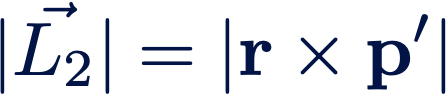{fig-alt="LaTeX label: the magnitude of the angular momentum computed from the final state, |L2 (vector)| = |r x p'|."}

- $$\begin{matrix}
{L}_{z} & =m{r}^{2}\mathop{ \psi }\limits^{ \cdot } \\
 \Rightarrow \mathop{ \psi }\limits^{ \cdot } & =\frac{{L}_{z}}{m{r}^{2}}=\frac{|p|b}{m{r}^{2}}
\end{matrix}$$

---

## Coulomb scattering

<!-- TODO: complex slide layout (flagged by detect_complex_slide.py - see run log). Content below is complete but UNARRANGED - needs manual layout to match the original slide. -->

- Can solve for Fourier coefficients

- Substituting in the tricks and performing the integral,

{fig-alt="Diagram of a particle's trajectory bending past a target nucleus: incoming momentum p and outgoing momentum p' are shown as arrows, with impact parameter b, deflection angle psi along the path, scattering angle theta, and the local direction vector u marked at a point on the curve."}

- $$\begin{matrix}
| \Delta \mathbf{p}| & ={ \int }_{- \infty }^{ \infty }\frac{k{q}_{1}{q}_{2}}{{r}^{2}}cos \psi dt \\
 & = \int \frac{k{q}_{1}{q}_{2}}{{r}^{2}}cos \psi \frac{m{r}^{2}}{bp}d \psi  \\
 & ={ \int }_{-{ \psi }_{0}}^{{ \psi }_{0}}\frac{k{q}_{2}{q}_{2}m}{bp}cos \psi d \psi  \\
 & =\frac{2k{q}_{1}{q}_{2}m}{bp}cos( \theta /2)
\end{matrix}$$

- But recall $| \Delta \mathbf{p}|=2psin( \theta /2)$ as well. So we can solve for $b$:

- $$\begin{aligned}
b( \theta )=\frac{k{q}_{1}{q}_{2}}{m{v}^{2}}cot( \theta /2)
\end{aligned}$$

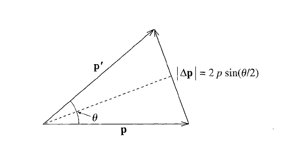{fig-alt="Vector triangle showing the initial momentum p, final momentum p', and the momentum transfer |Δp| = 2p sin(theta/2) as the dashed line between their tips, with the scattering angle theta marked between p and p'."}

---

## Coulomb scattering

<!-- TODO: complex slide layout (flagged by detect_complex_slide.py - see run log). Content below is complete but UNARRANGED - needs manual layout to match the original slide. -->

- Can solve for Fourier coefficients

- Finally, going back to our "master formula" for radial scattering cross sections,

{fig-alt="Diagram of a particle's trajectory bending past a target nucleus: incoming momentum p and outgoing momentum p' are shown as arrows, with impact parameter b, deflection angle psi along the path, scattering angle theta, and the local direction vector u marked at a point on the curve."}

- Our final result for the differential cross section is the famous Rutherford scattering formula:

- $$\frac{d \sigma }{d \Omega }={\left( \frac{k{q}_{1}{q}_{2}}{4E{sin}^{2}( \theta /2)} \right)}^{2}$$

- $$\begin{matrix}
\frac{d \sigma }{d \Omega } & =\frac{N}{I}=\frac{b}{sin \theta }\left| \frac{db}{d \theta } \right|
\end{matrix}$$

- Note: if you try to integrate this, you will get $ \infty $!
  - This is sort of what we expect: the Coulomb force extends to infinity.
- Note 2: you will do this in your homework for a non-analytical case, i.e., where you have to do a numerical derivative for $\frac{db}{d \theta }$

{fig-alt="Decorative hand-painted blue rectangular border/frame; the image itself contains no other content."}

---

# Scattering: Lennard–Jones potential

---

## Lennard–Jones potential

<!-- TODO: complex slide layout (flagged by detect_complex_slide.py - see run log). Content below is complete but UNARRANGED - needs manual layout to match the original slide. -->

- Can solve for Fourier coefficients

- Lennard-Jones potential:

- $$V(r)=4{V}_{0}\left[ \frac{ \sigma }{{r}^{12}}-\frac{ \sigma }{{r}^{6}} \right]$$

- Models interactions between two molecules:
  - Repulsive at very short distances (${r}^{-12}$ term; empirical)
  - Attractive at medium distances (${r}^{-6}$ term; [London dispersion force](https://en.wikipedia.org/wiki/London_dispersion_force))
  - Goes to zero at large distances
- Potential has minimum at $r={2}^{\frac{1}{6}}$, $V(r={2}^{\frac{1}{6}})=-{V}_{0}$.
- Potential crosses zero at $r= \sigma $ ($ \sigma =1$ here).

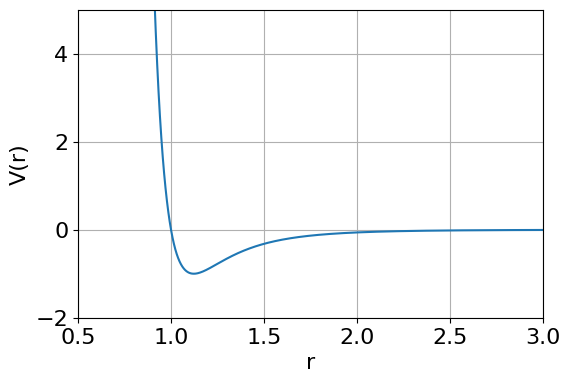{fig-alt="Plot of the Lennard-Jones potential V(r) versus r, showing a steep repulsive wall near r ~ 0.9 and a shallow attractive minimum near r ~ 1.1, approaching zero at large r."}

- (Note: just set $ \sigma =1$ for this class)

---

## Orbiting

<!-- TODO: complex slide layout (flagged by detect_complex_slide.py - see run log). Content below is complete but UNARRANGED - needs manual layout to match the original slide. -->

- Can solve for Fourier coefficients

- The LJ potential has a "well": some trajectories don't go to $ \infty $.
- Even for "free" trajectories, some will orbit a few times!
  - Gives rise to non-unique scattering angles: two different $(E,b)$ values can have the same ${ \theta }_{s}$.
  - Nonetheless, our numerical integration method still works! (Though beware $ \Delta  \theta $ going crazy.)

- $$V(r)=4{V}_{0}\left[ \frac{ \sigma }{{r}^{12}}-\frac{ \sigma }{{r}^{6}} \right]$$

{fig-alt="Plot of the Lennard-Jones potential V(r) versus r, showing a steep repulsive wall near r ~ 0.9 and a shallow attractive minimum near r ~ 1.1, approaching zero at large r."}

---

## Orbiting

<!-- TODO: complex slide layout (flagged by detect_complex_slide.py - see run log). Content below is complete but UNARRANGED - needs manual layout to match the original slide. -->

- Can solve for Fourier coefficients

- To understand orbiting, let's use another trick: define the effective potential to be the sum of the actual potential $V(r)$ and the "centrifugal potential"=kinetic energy from angular velocity:

- $$V(r)=4{V}_{0}\left[ \frac{ \sigma }{{r}^{12}}-\frac{ \sigma }{{r}^{6}} \right]$$

- $$\begin{matrix}
{V}_{eff}(r) & =V(r)+\frac{1}{2}m(r\mathop{ \theta }\limits^{ \cdot }{)}^{2} \\
 & =V(r)+\frac{{L}_{z}^{2}}{2m{r}^{2}} \\
 & =V(r)+E{\left( \frac{b}{r} \right)}^{2}
\end{matrix}$$

- Orbiting occurs when ${\mathbf{F}}_{eff}({r}_{0})=-\frac{d{V}_{eff}}{dr}\hat{r}=0$
- Since ${v}_{r} \sim 0$ for a ~circular orbit, $E={V}_{eff}({r}_{0})$.

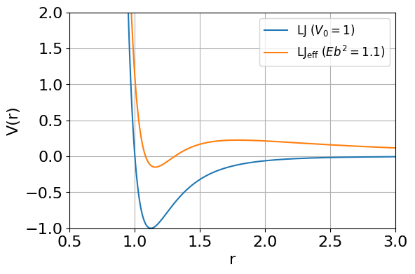{fig-alt="Plot comparing the bare Lennard-Jones potential V(r) (blue, V0=1) to the effective potential including the centrifugal barrier (orange, LJ_eff, Eb^2=1.1); the effective potential develops an outer barrier around r ~ 1.5-2 that the bare potential lacks."}

- [https://en.wikipedia.org/wiki/Effective_potential](https://en.wikipedia.org/wiki/Effective_potential)

---

## Orbiting

<!-- TODO: complex slide layout (flagged by detect_complex_slide.py - see run log). Content below is complete but UNARRANGED - needs manual layout to match the original slide. -->

- Can solve for Fourier coefficients

- To understand orbiting, let's use another trick: define the effective potential to be the sum of the actual potential $V(r)$ and the "centrifugal potential"=kinetic energy from angular velocity:

- $$V(r)=4{V}_{0}\left[ \frac{ \sigma }{{r}^{12}}-\frac{ \sigma }{{r}^{6}} \right]$$

- $$\begin{matrix}
{V}_{eff}(r) & =V(r)+\frac{1}{2}m(r\mathop{ \theta }\limits^{ \cdot }{)}^{2} \\
 & =V(r)+\frac{{L}_{z}^{2}}{2m{r}^{2}} \\
 & =V(r)+E{\left( \frac{b}{r} \right)}^{2}
\end{matrix}$$

- Orbiting occurs when ${\mathbf{F}}_{eff}({r}_{0})=-\frac{d{V}_{eff}}{dr}\hat{r}=0$
- Since ${v}_{r} \sim 0$ for a ~circular orbit, $E={V}_{eff}({r}_{0})$.

{fig-alt="Plot comparing the bare Lennard-Jones potential V(r) (blue, V0=1) to the effective potential including the centrifugal barrier (orange, LJ_eff, Eb^2=1.1); the effective potential develops an outer barrier around r ~ 1.5-2 that the bare potential lacks."}

- Incoming trajectory

- $${\mathbf{F}}_{eff}>0$$

- [https://en.wikipedia.org/wiki/Effective_potential](https://en.wikipedia.org/wiki/Effective_potential)

---

## Orbiting

<!-- TODO: complex slide layout (flagged by detect_complex_slide.py - see run log). Content below is complete but UNARRANGED - needs manual layout to match the original slide. -->

- Can solve for Fourier coefficients

- To understand orbiting, let's use another trick: define the effective potential to be the sum of the actual potential $V(r)$ and the "centrifugal potential"=kinetic energy from angular velocity:

- $$V(r)=4{V}_{0}\left[ \frac{ \sigma }{{r}^{12}}-\frac{ \sigma }{{r}^{6}} \right]$$

- $$\begin{matrix}
{V}_{eff}(r) & =V(r)+\frac{1}{2}m(r\mathop{ \theta }\limits^{ \cdot }{)}^{2} \\
 & =V(r)+\frac{{L}_{z}^{2}}{2m{r}^{2}} \\
 & =V(r)+E{\left( \frac{b}{r} \right)}^{2}
\end{matrix}$$

- Orbiting occurs when ${\mathbf{F}}_{eff}({r}_{0})=-\frac{d{V}_{eff}}{dr}\hat{r}=0$
- Since ${v}_{r} \sim 0$ for a ~circular orbit, $E={V}_{eff}({r}_{0})$.

{fig-alt="Plot comparing the bare Lennard-Jones potential V(r) (blue, V0=1) to the effective potential including the centrifugal barrier (orange, LJ_eff, Eb^2=1.1); the effective potential develops an outer barrier around r ~ 1.5-2 that the bare potential lacks."}

- Critical trajectory

- $${\mathbf{F}}_{eff}=0$$

- Notice, the orbit is unstable! ${V}_{eff}^{′′}(r)$ is negative.
- Homework asks you to maximize the number of orbits, i.e., how stable can you get?

- [https://en.wikipedia.org/wiki/Effective_potential](https://en.wikipedia.org/wiki/Effective_potential)

---

## Hands-on: scattering notebook

- Can solve for Fourier coefficients

- CompPhys/Calculus/scattering.ipynb has a few examples of scattering computations.
- The formulas are written in C++ (e.g., the potential $V(r)$ and $\frac{d \theta }{dr}$) and compiled into a python module with swig.
  - These are called many, many times, so performance is important here!
- Let's go over the code together, then use the rest of class to try out the notebook.

---

## Recap

- Can solve for Fourier coefficients

- Application: scattering off a radial force field.
  - Defined scattering (differential) cross sections.
  - Used conservation laws to simplify the problem into a numerically integrable form.
  - Solved the equations exactly for the "billiard ball" and Coulomb potentials.
  - Numerically solving the trajectories for arbitrary $V(r)$.
- Assignment 5 problems have been posted on UBLearns
  - Note: GitHub classroom link will be posted in a few days, but you have the PDF with all the problems for now.
  - Today's lecture covered everything needed for Assignment 5, Problem 1.
