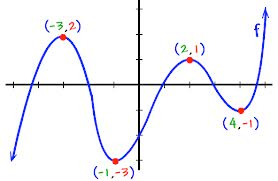
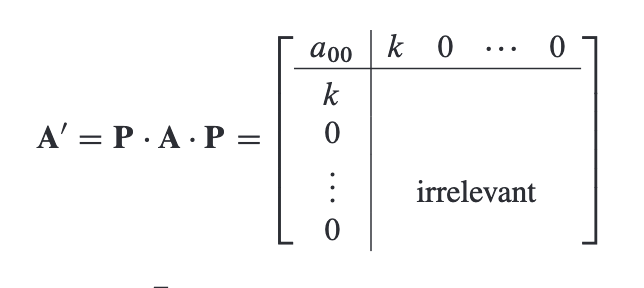
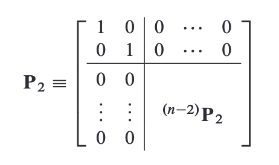
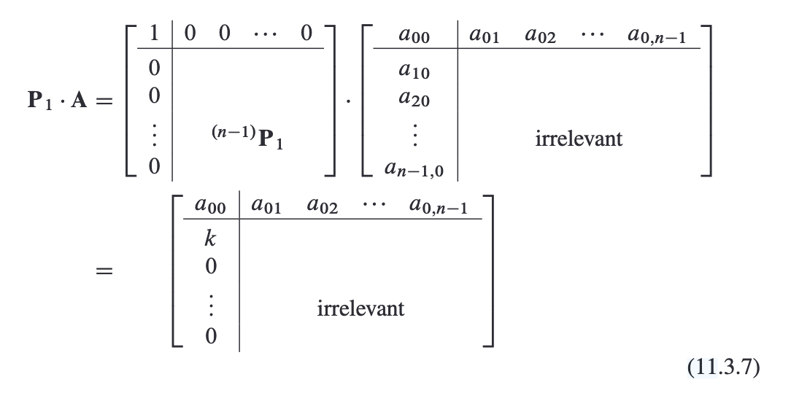
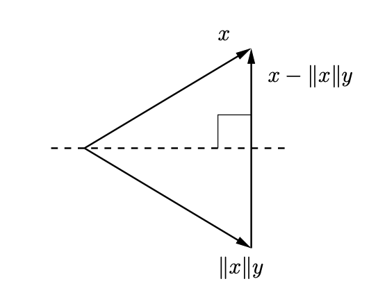
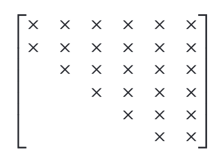
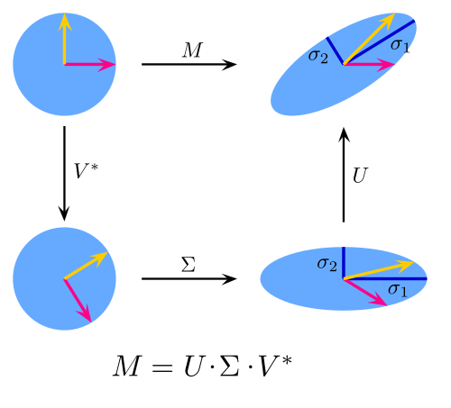
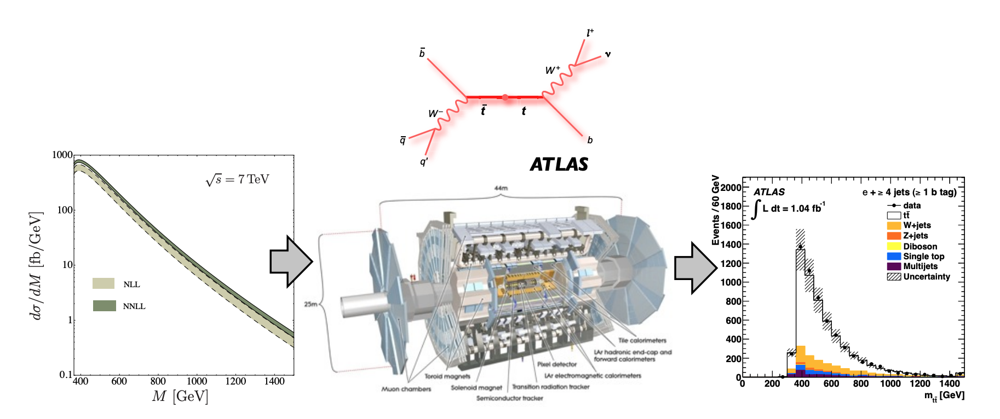
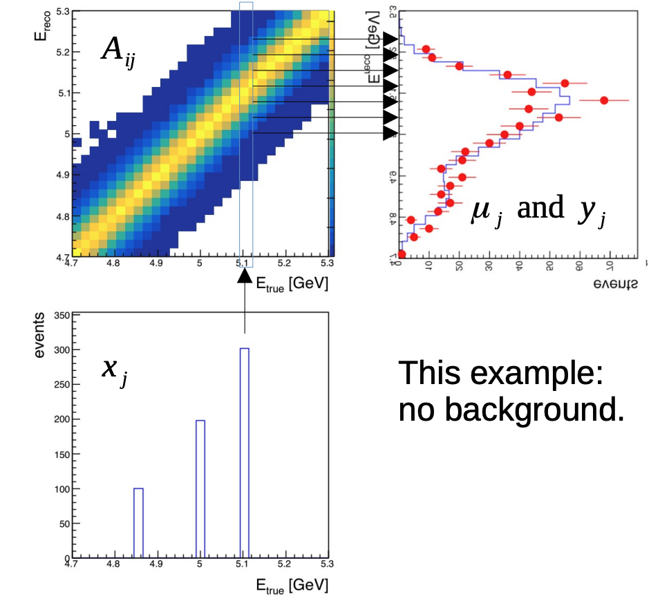
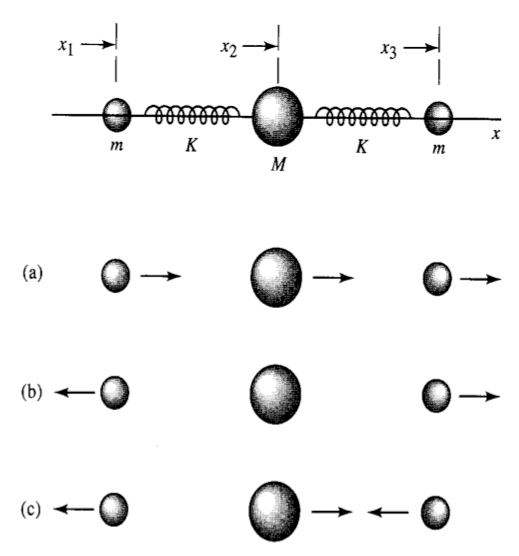

# Eigenvectors and eigenvalues

---

## Eigenvectors and eigenvalues

- Today : Eigenvalues and eigenvectors, more hands on
- References: Numerical Recipes, Chapter 11
  - In this case, even they recommend using packaged software for eigenvalues and eigenvectors, but let’s get the general gist here

---

## Example: coupled harmonic oscillators

- To set the stage, consider the problem of coupled harmonic oscillators, represented by (complex) displacement vectors ${q}_{j}(t)$.
  - E.g. a 1D line of weights connected by springs; ${q}_{j}$ is displacement from resting position.
- System has Lagrangian $L=T-U$ given by:

- $$\mathcal{L}=\frac{1}{2}\mathop{\mathop{ \sum }\limits_{j,k=0}}\limits^{N-1}{M}_{jk}{\mathop{q}\limits^{ \cdot }}_{j}{\mathop{q}\limits^{ \cdot }}_{k}-\frac{1}{2}\mathop{\mathop{ \sum }\limits_{j,k=0}}\limits^{N-1}{A}_{jk}{q}_{j}{q}_{k}$$

- (Probably mostly 0s in these matrices, but let's keep the notation general for now)

- Let's consider the "normal mode" solution. Let all ${q}_{i}$ oscillate with the same frequency, $ \omega $, so ${q}_{j}(t)={x}_{j}{e}^{i \omega t}$:

- $$\begin{matrix}
\mathop{\mathop{ \sum }\limits_{j=0}}\limits^{N-1}\left[ {A}_{jk}-{M}_{jk}{ \omega }^{2} \right]{x}_{j} & =0 \\
(\mathbf{A}-\mathbf{M}{ \omega }^{2}).\mathbf{x} & =0
\end{matrix}$$

- This is a general eigenvalue problem: solve for $ \omega $ by finding solutions to $det(\mathbf{A}-\mathbf{M}{ \omega }^{2})=0$.

---

## Eigenvalue basics

- Let $\mathbf{A}$ be a $N \times N$ matrix. An eigenvector $\mathbf{x}$ and and the corresponding eigenvalue $ \lambda $ are solutions satisfying $\mathbf{A}\mathbf{x}= \lambda \mathbf{x}$.
- The classic way of solving this is to promote $ \lambda $ to a matrix, $ \lambda \mathbf{1}$:

- $$\begin{aligned}
[\mathbf{A}- \lambda \mathbf{1}]\mathbf{x}=0
\end{aligned}$$

- This can only hold if $det(\mathbf{A}- \lambda \mathbf{1})=0$.
- As a function of $ \lambda $, the determinant is a polynomial of degree $N$ in $ \lambda $, where the coefficients are products of various ${A}_{ij}$: the characteristic polynomial.
- Eigenvalues are the solutions of$\mathop{\mathop{ \sum }\limits_{j=0}}\limits^{N}{a}_{j}{ \lambda }^{j}=0$, i.e. roots of the polynomial.
  - There are $N$ roots; however, some values might be repeated.

---

## Example

- Let's consider a simple example: $\mathbf{A}=\left( \begin{matrix}
1 & 1 \\
1 & 2
\end{matrix} \right)$.
- The characteristic equation is:

- $$\begin{matrix}
0 & =det\left( \begin{matrix}
1- \lambda  & 1 \\
1 & 2- \lambda 
\end{matrix} \right) \\
 & =(1- \lambda )(2- \lambda )-1 \\
 & ={ \lambda }^{2}-3 \lambda +1 \\
{ \lambda }_{ \pm } & =\frac{3 \pm \sqrt{5}}{2}
\end{matrix}$$

- Then, we can solve for the eigenvectors by solving the system of equations. (Note: if $\mathbf{x}$ is an eigenvector, $ \alpha \mathbf{x}$ is also an eigenvector, so we actually only have one number to solve for, not two.

- $${\mathbf{x}}_{ \pm }=\left( \begin{aligned}
1 \\
{ \lambda }_{ \pm }-1
\end{aligned} \right)$$

---

## Example 2

- Another example: $\mathbf{A}=\left( \begin{matrix}
1 & 1 \\
-1 & 1
\end{matrix} \right)$.
- Computer the eigenvalues:

- $$\begin{matrix}
0 & =det\left( \begin{matrix}
1- \lambda  & 1 \\
-1 & 1- \lambda 
\end{matrix} \right) \\
 & =(1- \lambda {)}^{2}+1 \\
 & ={ \lambda }^{2}-2 \lambda +2 \\
{ \lambda }_{ \pm } & =\frac{2 \pm \sqrt{-4}}{2} \\
 & =1 \pm i
\end{matrix}$$

- $ \Rightarrow $ eigenvalues can be complex.

---

## Naive solution

:::: {.columns}
::: {.column width="55%"}
- Now let's think about computational algorithms.
- First guess: we just covered root finding. We could use these tools (e.g. Newton's method) to solve for the eigenvalues.
- In practice, this does not work very well!
  - You need to know roughly where the roots are to find all of them with Newton's method.
  - This only works for eigenvalues; eigenvectors require another computation.
- Let's try harder!
  - Starting with a few more definitions.
:::
::: {.column width="45%"}
{width="100%" fig-alt="Graph of a polynomial function f(x) with two local maxima (labeled (-3,2) and (2,1)) and two local minima (labeled (-1,-3) and (4,-1)) marked with red dots."}
:::
::::

---

## Special matrices

- Let's start with some special types of matrices:
  - A hermitian matrix, $\mathbf{H}$, satisfies ${\mathbf{H}}^{ \dagger }=\mathbf{H}$, where ${}^{ \dagger }$ denotes the conjugate transpose.
    - For non-complex numbers: a symmetric matrix, $\mathbf{S}$, satisfies ${\mathbf{S}}^{T}=\mathbf{S}$.
  - A normal matrix, $\mathbf{N}$, satisfies ${\mathbf{N}}^{ \dagger }\mathbf{N}=\mathbf{N}{\mathbf{N}}^{ \dagger }$, i.e., it commutes with its conjugate transpose.
  - A unitary matrix satisfies $\mathbf{H}{\mathbf{H}}^{ \dagger }={\mathbf{H}}^{ \dagger }\mathbf{H}=\mathbf{1}$, i.e., the inverse is equal to the conjugate transpose.
    - An orthogonal matrix satisfies $\mathbf{S}{\mathbf{S}}^{T}={\mathbf{S}}^{T}\mathbf{S}=\mathbf{1}$.

- In physics applications, symmetric matrices are more common than you might think. Example: Newton's Laws $ \Rightarrow $ symmetric forces, potentials

---

## Special matrices and eigenvalues

- These types of matrices have important properties regarding their eigenvalues and eigenvectors:
  - Hermitian matrices have real eigenvalues.
  - The eigenvectors of normal matrices form an orthonormal basis for ${\mathbb{C}}^{N}$ (with the proper normalization).
    - (If the eigenvalues are degenerate, there is some freedom to choose linear combinations of the corresponding eigenvectors, but one can still find orthonormal combinations.)
  - The matrix formed from an orthonormal set of (eigen)vectors is unitary.
- Conversely, for general matrices:
  - Eigenvalues are generally complex, even for real matrices.
  - Eigenvectors are generally not orthogonal.
    - The do usually still span ${\mathbb{C}}^{N}$, but it is not guaranteed.

---

## Left and right eigenvalues

- So far, we have been talking about "right eigenvectors": $\mathbf{A}.{\mathbf{x}}_{R}= \lambda {\mathbf{x}}_{R}$.
  - In Einstein summation notation, ${A}_{ij}{x}_{j}= \lambda {x}_{j}$
- Left eigenvectors satisfy $\mathbf{x}.\mathbf{A}= \lambda \mathbf{x}$
  - In Einstein summation notation, ${x}_{i}{A}_{ij}= \lambda {x}_{j}$
- We can also write this ${A}_{ji}{x}_{i}= \lambda {x}_{j}$
  - In other words, ${\mathbf{A}}^{T}\mathbf{x}= \lambda \mathbf{x}$: right eigenvectors are just eigenvectors of ${\mathbf{A}}^{T}$.
- Properties:
  - Since $det\mathbf{A}=det{\mathbf{A}}^{T}$, the L and R eigenvalues are identical.
  - If $\mathbf{A}$ is symmetric, the L and R eigenvectors are identical
    - (Similarly, if $\mathbf{A}$ is Hermitian, the L and R eigenvectors are complex conjugate.)

---

## Left and right eigenvalues

- L and R eigenvectors are rather useful, particularly to form two matrices:
  - ${\mathbf{X}}_{R}$ = matrix formed from columns of right eigenvectors.
  - ${\mathbf{X}}_{L}$ = matrix formed from rows of left eigenvectors.
- First use case: we can show that each left eigenvector is orthogonal to all right eigenvectors except for the one that shares an eigenvalue.
  - Reasoning:

- $$\mathbf{A}.{\mathbf{X}}_{R}=\mathbf{A}.\left( \begin{matrix}
| & | & ... & | \\
{\mathbf{x}}_{R}^{0} & {\mathbf{x}}_{R}^{1} & .. & {\mathbf{x}}_{R}^{N-1} \\
| & | & ... & |
\end{matrix} \right)=\left( \begin{matrix}
| & | & ... & | \\
{\mathbf{x}}_{R}^{0} & {\mathbf{x}}_{R}^{2} & .. & {\mathbf{x}}_{R}^{N-1} \\
| & | & ... & |
\end{matrix} \right).\text{diag}({ \lambda }_{0},{ \lambda }_{1},...,{ \lambda }_{N-1})$$

- $${\mathbf{X}}_{L}.\mathbf{A}=\left( \begin{matrix}
- & {\mathbf{x}}_{L}^{0} & - \\
- & {\mathbf{x}}_{L}^{1} & - \\
 \vdots  &  \vdots  &  \vdots  \\
- & {\mathbf{x}}_{L}^{N-1} & -
\end{matrix} \right).\mathbf{A}=\text{diag}({ \lambda }_{0},{ \lambda }_{1},...,{ \lambda }_{N-1}).\left( \begin{matrix}
- & {\mathbf{x}}_{L}^{0} & - \\
- & {\mathbf{x}}_{L}^{1} & - \\
 \vdots  &  \vdots  &  \vdots  \\
- & {\mathbf{x}}_{L}^{N-1} & -
\end{matrix} \right)$$

- The order is important!

---

## Left and right eigenvalues

- Now compute ${\mathbf{X}}_{L}.\mathbf{A}.{\mathbf{X}}_{R}$ using both equations:

- $${\mathbf{X}}_{L}.{\mathbf{X}}_{R}.\text{diag}({ \lambda }_{0},{ \lambda }_{1},...,{ \lambda }_{N-1})=\text{diag}({ \lambda }_{0},{ \lambda }_{1},...,{ \lambda }_{N-1}).{\mathbf{X}}_{L}.{\mathbf{X}}_{R}$$

- This commutation relation is actually quite strict!
  - Consider what ${ \lambda }_{0}$ multiplies: on the left, it multiplies the first column of ${\mathbf{X}}_{L}.{\mathbf{X}}_{R}$, while on the right, it multiplies the first row of ${\mathbf{X}}_{L}.{\mathbf{X}}_{R}$.
  - For general ${ \lambda }_{i}$, this is only satisfied if ${\mathbf{X}}_{L}.{\mathbf{X}}_{R}$ is diagonal.
- Thus, $({\mathbf{X}}_{L}.{\mathbf{X}}_{R}{)}_{ij}={\mathbf{x}}_{L}^{i} \cdot {\mathbf{x}}_{R}^{j}$ is nonzero iff $i=j$.
  - And with appropriate normalization, ${\mathbf{x}}_{L}^{i} \cdot {\mathbf{x}}_{R}^{i}=1 \blacksquare $,
- $ \Rightarrow {\mathbf{X}}_{L}={\mathbf{X}}_{R}^{-1}$.

---

## Matrix diagonalization

- The left- and right-eigenvector matrices are particularly useful because they define a transformation that diagonalizes $\mathbf{A}$:

- $$\begin{matrix}
{\mathbf{X}}_{L}.\mathbf{A}.{\mathbf{X}}_{R} & ={\mathbf{X}}_{R}^{-1}.\mathbf{A}.{\mathbf{X}}_{R} \\
 & ={\mathbf{X}}_{R}^{-1}.\text{diag}({ \lambda }_{0},{ \lambda }_{1},...,{ \lambda }_{N-1}).{\mathbf{X}}_{R} \\
 & =\text{diag}({ \lambda }_{0},{ \lambda }_{1},...,{ \lambda }_{N-1})
\end{matrix}$$

- In fact, we can use this to compute eigenvalues!

---

## Symmetry transformations

- This is an example of a symmetry transformation, $\mathbf{A} \rightarrow {\mathbf{Z}}^{-1}.\mathbf{A}.\mathbf{Z}$.
  - Symmetry transformations leave the eigenvalues unchanged:

- $$\begin{matrix}
det({\mathbf{Z}}^{-1}.\mathbf{A}.\mathbf{Z}- \lambda \mathbf{1}) & =det({\mathbf{Z}}^{-1}(\mathbf{A}- \lambda \mathbf{1})\mathbf{Z}) \\
 & =det({\mathbf{Z}}^{-1})det(\mathbf{A}- \lambda \mathbf{1})det(\mathbf{Z}) \\
 & =det(\mathbf{A}- \lambda \mathbf{1})
\end{matrix}$$

---

## Symmetry transformations

- This is a key technique for handling eigensystems in computations algorithms: repeated apply symmetry transformations until the matrix is diagonal, or nearly diagonal.

- $$\mathbf{A} \rightarrow {\mathbf{P}}_{1}^{-1}\mathbf{A}{\mathbf{P}}_{1} \rightarrow {\mathbf{P}}_{2}^{-1}{\mathbf{P}}_{1}^{-1}\mathbf{A}{\mathbf{P}}_{1}{\mathbf{P}}_{2} \rightarrow {\mathbf{P}}_{3}^{-1}{\mathbf{P}}_{2}^{-1}{\mathbf{P}}_{1}^{-1}\mathbf{A}{\mathbf{P}}_{1}{\mathbf{P}}_{2}{\mathbf{P}}_{3} \rightarrow ...$$

- If we transform all the way to a diagonal matrix, then we have all the eigenvectors and eigenvalues.
- If we just need eigenvalues and not eigenvectors, it suffices to transform to a triangular matrix (think about the characteristic polynomial!).
- Other methods aim for tridiagonal or block diagonal form.
  - Once in these forms, the eigensystem is easy to solve.

---

## Algorithms

- We won't actually prove any algorithms here, as the details are tedious and not very illuminating. See Numerical Recipes if you are interested in details!
- Jacobi transformation for symmetric matrices: each transformation is a rotation in 2D that 0s one element (prior 0s get un-0ed, but matrix converges towards diagonal).
- Givens/Householder algorithms reduce symmetric matrices to tridiagonal form.
  - QL algorithm (w/implicit shifts) solves the tridiagonal matrix system (Q=orthogonal matrix, L=lower diagonal matrix)
  - Or newer algorithms: "divide and conquer," "MRRR".
- Non-symmetric matrices: reduce to Hessenberg form (nearly triangular) + QR algorithm.
- Generalizations to $\mathbf{A}.\mathbf{x}= \lambda \mathbf{B}\mathbf{x}$, $(\mathbf{A}{ \lambda }^{2}+\mathbf{B} \lambda +\mathbf{C}).\mathbf{x}=0$.

---

## Householder method

{width="70%" fig-alt="Equation (11.3.7): a block-matrix identity showing the matrix P1 (containing a smaller (n-1)-dimensional sub-block (n-1)P1) multiplied by matrix A, equal to a reduced matrix with pivot entries a00 and k in the first column and an 'irrelevant' block filling the remainder."}

{width="70%" fig-alt="Equation A' = P.A.P: a matrix with pivot entries a00 and k arranged along the top-left border and an 'irrelevant' block filling the remainder, resulting from conjugating A by the permutation/reflection matrix P."}

- Let's say ${}^{(n-1)}{\mathbf{P}}_{1}$ is the orthogonal matrix that rotates $({a}_{10},{a}_{20},...,{a}_{n-1,0})$ to $(k,0,...,0)$. Then:

---

## Householder method

<!-- TODO: complex slide layout (flagged by detect_complex_slide.py - see run log). Content below is complete but UNARRANGED - needs manual layout to match the original slide. -->

{fig-alt="Equation A' = P.A.P: a matrix with pivot entries a00 and k arranged along the top-left border and an 'irrelevant' block filling the remainder, resulting from conjugating A by the permutation/reflection matrix P."}

{fig-alt="Definition of P2: a block matrix with a 2x2 identity block in the upper-left corner and a smaller (n-2)-dimensional sub-block (n-2)P2 filling the rest."}

- Next iteration:

{fig-alt="Equation (11.3.7): a block-matrix identity showing the matrix P1 (containing a smaller (n-1)-dimensional sub-block (n-1)P1) multiplied by matrix A, equal to a reduced matrix with pivot entries a00 and k in the first column and an 'irrelevant' block filling the remainder."}

---

## Householder method

<!-- TODO: complex slide layout (flagged by detect_complex_slide.py - see run log). Content below is complete but UNARRANGED - needs manual layout to match the original slide. -->

- The Householder method reduces a $N \times N$ symmetric matrix to tridiagonal form.
- $N-2$ orthogonal transformations ($\mathbf{A} \rightarrow {\mathbf{P}}^{-1}\mathbf{A}\mathbf{P}$), each eliminating the necessary elements from one row and one column.

- $$\mathbf{P}=\mathbf{1}-\frac{\mathbf{u} \cdot {\mathbf{u}}^{T}}{0.5|\mathbf{u}{|}^{2}}$$

- $$\mathbf{u}=\mathbf{x} \mp |\mathbf{x}|{\mathbf{e}}_{i}$$

- Householder matrices look like:

- Where $\mathbf{u}$ look like:

{fig-alt="Vector diagram illustrating a Householder reflection: vector x and its reflection ||x||y drawn from a common origin symmetric about a dashed horizontal axis, with the difference vector x - ||x||y drawn perpendicular to that axis."}

- [https://www.cs.cornell.edu/~bindel/class/cs6210-f12/notes/lec16.pdf](https://www.cs.cornell.edu/~bindel/class/cs6210-f12/notes/lec16.pdf)

- Intuition: $\mathbf{P}$ encodes a reflection of $\mathbf{x}$, transforming it to point along ${\mathbf{e}}_{i}$.
  - In other words, zero out all $({x}_{1}{x}_{2}...)$ except for ${x}_{i}$.
- Basic idea: let $\mathbf{x}$ be the elements to be 0-ed at each step
  - ($N-1$ elements for step 0; $N-2$ elements for step 1; ...)

---

## Householder method

- Let's verify that $\mathbf{P}=\mathbf{1}-\frac{\mathbf{u} \cdot {\mathbf{u}}^{T}}{0.5|\mathbf{u}{|}^{2}}$ (where $\mathbf{u}=\mathbf{x} \mp |\mathbf{x}|{\mathbf{e}}_{i}$) does what we want:

- $$\begin{matrix}
|\mathbf{u}{|}^{2} & =|\mathbf{x}{|}^{2} \mp 2{x}_{i}|\mathbf{x}|+|\mathbf{x}{|}^{2}|{\mathbf{e}}_{i}{|}^{2} \\
 & =2|\mathbf{x}{|}^{2} \mp 2{x}_{i}|\mathbf{x}{|}^{2} \\
{\mathbf{u}}^{T}.\mathbf{x} & =|\mathbf{x}{|}^{2} \mp |\mathbf{x}{\mathbf{e}}_{i} \\
\mathbf{P}\mathbf{x} & =\mathbf{x}-\frac{2\mathbf{u}({\mathbf{u}}^{T}.\mathbf{x})}{|\mathbf{u}{|}^{2}} \\
 & =\mathbf{x}-\frac{\mathbf{u}.(|\mathbf{x}{|}^{2} \mp |\mathbf{x}|{x}_{i})}{|\mathbf{x}{|}^{2} \mp |\mathbf{x}|{x}_{i}} \\
 & =\mathbf{x}-\mathbf{u} \\
 & = \pm |\mathbf{x}|{\mathbf{e}}_{i}
\end{matrix}$$

- ✅

---

## Householder method

- Hence, for symmetric matrices, successive Householder operations transform  a matrix to tridiagonal form.
  - You can also see that for asymmetric matrices, the Householder method still works to zero out half the matrix, say the bottom half triangle.
  - This is Hessenberg form:

{width="70%" fig-alt="Diagram of a matrix sparsity pattern showing an upper-Hessenberg-like structure: X marks fill the upper triangle and the first subdiagonal, with blanks (implied zeros) below."}

- From here, the QL (or QR) methods efficiently finish off the problem.
  - $O(N)$ for tridiagonal matrices, $O({N}^{2})$ for Hessenberg matrices.
  - Idea: use Householder again to find $\mathbf{A}=\mathbf{Q}\mathbf{L}$ decomposition.
    - If we eliminate one off-diagonal, the result is (L/U) triangular.
  - $\mathbf{A} \rightarrow \mathbf{L}\mathbf{Q}$ turns out to be another orthogonal transformation, and converges towards triangular form, whereupon the eigenvalues appear on the diagonal.

---

## Algorithms

- Find a good algorithm for your exact problem:
  - Just eigenvalues; eigenvalues and some eigenvectors; eigenvalues and all eigenvectors.
  - Matrix type:
    - Real
      - Symmetric
        - General, tridiagonal, banded
      - Non-symmetric
    - Complex
      - Hermitian
      - Non-Hermitian
- scipy.linalg implements quite a few options.
- Read documentation before using!
  - Pivoting-like arguments once again apply for floating point errors: place largest and smallest elements in specific locations.
  - However, algorithms go in "different directions" (e.g. top-bottom, left-right), so the optimal "form" differs.
  - Beware failure modes: algorithms don't have a magic wand for poor-quality matrices.

---

## Singular value decomposition

- So far, we've been mostly focused on "nice" matrices: $N \times N$, invertible.
  - Life is not always so nice!
- What about $M \times N$ matrices? Non-invertible (aka "singular") matrices?
- Key tool: singular value decomposition.
- Any matrix can be written as:

- $$\mathbf{A}=\mathbf{U}\mathbf{ \Sigma }{\mathbf{V}}^{ \dagger }$$

- Where:
  - $\mathbf{U}$ = $M \times M$ unitary matrix.
  - $\mathbf{ \Sigma }$ = $M \times N$ rectangular diagonal matrix, ${ \Sigma }_{ii}$=real, $ \geq 0$.
  - $\mathbf{V}$ = $N \times N$ unitary matrix.
- References:
  - Numerical Recipes, Chapter 2.6 (slightly different formulation)
  - [Wikipedia](https://en.wikipedia.org/wiki/Singular_value_decomposition), [scipy.svd](https://docs.scipy.org/doc/scipy/reference/generated/scipy.linalg.svd.html)

---

## Singular value decomposition

:::: {.columns}
::: {.column width="55%"}
- $$\mathbf{A}=\mathbf{U}\mathbf{ \Sigma }{\mathbf{V}}^{ \dagger }$$
  - $\mathbf{U}$ = $M \times M$ unitary matrix.
  - $\mathbf{ \Sigma }$ = $M \times N$ diagonal matrix, ${ \Sigma }_{ii}$=real, $ \geq 0$.
  - $\mathbf{V}$ = $N \times N$ unitary matrix.
- Intuition:
  - ${\mathbf{V}}^{ \dagger }$ is a rotation
  - $\mathbf{ \Sigma }$ is a scaling
  - $\mathbf{U}$ is another rotation
- [https://en.wikipedia.org/wiki/File:Singular-Value-Decomposition.svg](https://en.wikipedia.org/wiki/File:Singular-Value-Decomposition.svg)
:::
::: {.column width="45%"}
{width="100%" fig-alt="Diagram of the singular value decomposition M = U.Sigma.V*: a unit circle (top left) maps under M directly to an ellipse (top right) with axes sigma1, sigma2, or equivalently via V* to another unit circle (bottom left), then Sigma to an ellipse (bottom right), then U to the same final ellipse - illustrating the commuting decomposition M = U.Sigma.V*."}
:::
::::

---

## Singular value decomposition

- Why is this useful?
  - The singular values, aka the ${ \Sigma }_{ii}$, encode a lot of information about the transformation $\mathbf{A}:{\mathbb{C}}^{N} \rightarrow {\mathbb{C}}^{M}$.
- #(zero) ${ \Sigma }_{ii}$ = dimension of nullspace of $\mathbf{A}$: subspace of ${\mathbb{C}}^{N}$ that gets mapped to 0.
  - Columns of $\mathbf{V}$ = orthonormal basis for ${\mathbb{C}}^{N}$
  - Columns corresponding to ${ \Sigma }_{ii}=0$ = orthonormal basis for nullspace.
- #(non-zero) ${ \Sigma }_{ii}$ = dimension of range of $\mathbf{A}$ inside ${\mathbb{C}}^{M}$
  - Columns of $\mathbf{U}$ = orthonormal basis for ${\mathbb{C}}^{M}$;
  - Columns corresponding to non-zero ${ \sigma }_{ii}$ = orthonormal basis for range of $\mathbf{A}$.

---

## SVD and eigenvalues

- For square matrices, SVD and eigenvalues are somewhat related, but still distinct:
  - Eigensystem decomposition: $\mathbf{A}={\mathbf{X}}_{R}\text{diag}({ \lambda }_{i}){\mathbf{X}}_{L}$
  - SVD: $\mathbf{A}=\mathbf{U}\mathbf{ \Sigma }{\mathbf{V}}^{ \dagger }$
  - These are not, in general, the same thing!
  - Special case: if $\mathbf{A}$ is Hermitian ($\mathbf{A}={\mathbf{A}}^{ \dagger }$) (or symmetric, if real), then $\mathbf{V}=\mathbf{U}={\mathbf{X}}_{R}={\mathbf{X}}_{L}^{T}$.

- The condition number is a super useful metric for characterizing the health of your matrix.
  - Consider the inverse of $\mathbf{A}$: ${\mathbf{A}}^{-1}=\mathbf{V}.\text{diag}(1/{ \Sigma }_{ii}).{\mathbf{U}}^{T}$
  - Things go wrong when ${ \Sigma }_{ii}=0$, or if the range is too big.
- Definition: condition number = ratio of largest to smallest singular values.
  - Keep it well above your floating point precision!

---

## Example: unfolding

- Common problem in particle physics: connecting theory predictions (e.g. differential cross section from QFT calculation) with detector observations:

{width="70%" fig-alt="Three-panel physics figure connected by arrows: a cross-section plot (d(sigma)/dM vs M at sqrt(s)=7 TeV, with NLL/NNLL uncertainty bands), an ATLAS detector cutaway diagram with a top-antitop-quark-pair Feynman diagram above it, and a stacked histogram of ttbar event yields versus m_ttbar with data points and background components - illustrating an analysis pipeline from theory prediction to detector to measured spectrum."}

- [https://www-library.desy.de/preparch/desy/proc/proc14-02/P52.pdf](https://www-library.desy.de/preparch/desy/proc/proc14-02/P52.pdf)

---

## Example: unfolding

:::: {.columns}
::: {.column width="55%"}
- General idea:
  - Let $\mathbf{d}$ be some detector observations.
  - Let $\mathbf{t}$ be the theory prediction
    - Typically, $\text{len}(\mathbf{d})>\text{len}(\mathbf{t})$
  - Create response matrix, $\mathbf{R}$, using detector simulation: $\mathbf{d}=\mathbf{R}.\mathbf{t}$
  - Then $\mathbf{t}={\mathbf{R}}^{-1}\mathbf{d}$
- ...except this is a lot harder in real life! By now, we know that matrix inversion has a lot of problems.
  - Solutions: likelihood (i.e. fit)-based unfolding, regularization, iterative unfolding, ...
- See e.g. [Blobel 2011](https://indico.cern.ch/event/107747/contributions/32645/attachments/24317/35000/blobel.pdf), [Spano 2013](https://www-library.desy.de/preparch/desy/proc/proc14-02/P52.pdf), [Schmitt 2022](https://www.desy.de/~sschmitt/talks/220829_unfolding_V2.pdf) for more.
:::
::: {.column width="45%"}
{width="100%" fig-alt="Three-panel 'unfolding' figure: a 2D response-matrix heatmap A_ij (E_reco vs E_true), a 1D reconstructed spectrum with data points and a fit curve (mu_j and y_j), and a true-spectrum histogram x_j with three bins - labeled 'This example: no background.'"}
:::
::::

---

# Application: 3-atom system

---

## Triatomic system

:::: {.columns}
::: {.column width="55%"}
- Consider a linear triatomic molecule
  - Fowles and Cassiday, Chapter 11.4
  - Taylor, Chapter 11.6
- Approximate by masses on springs
:::
::: {.column width="45%"}
{width="100%" fig-alt="Diagram of a linear triatomic molecule model: three masses (m, M, m) connected by two springs (K, K) along the x-axis, with displacements x1, x2, x3 labeled; three rows (a), (b), (c) below show different relative motion patterns (all moving together, one mass fixed, and a symmetric stretch) with arrows indicating each mass's direction of motion."}
:::
::::

---

## Triatomic system

<!-- TODO: complex slide layout (flagged by detect_complex_slide.py - see run log). Content below is complete but UNARRANGED - needs manual layout to match the original slide. -->

- Start from the Lagrangian:

{fig-alt="Diagram of a linear triatomic molecule model: three masses (m, M, m) connected by two springs (K, K) along the x-axis, with displacements x1, x2, x3 labeled; three rows (a), (b), (c) below show different relative motion patterns (all moving together, one mass fixed, and a symmetric stretch) with arrows indicating each mass's direction of motion."}

- $$\mathcal{L}=\frac{1}{2}{m}_{0}{\mathop{x}\limits^{ \cdot }}_{0}^{2}+\frac{1}{2}{m}_{1}{\mathop{x}\limits^{ \cdot }}_{1}^{2}+\frac{1}{2}{m}_{2}{\mathop{x}\limits^{ \cdot }}_{2}^{2}-\frac{1}{2}\left[ {k}_{01}({x}_{0}-{x}_{1}{)}^{2}+{k}_{12}({x}_{1}-{x}_{2}{)}^{2} \right]$$

- Equations of motion ($\frac{d}{dt}\frac{ \partial \mathcal{L}}{ \partial {\mathop{x}\limits^{ \cdot }}_{i}}=\frac{ \partial \mathcal{L}}{ \partial {x}_{i}}$):

- $$\begin{matrix}
{m}_{0}{\mathop{x}\limits^{ \cdot  \cdot }}_{0} & =-{k}_{01}{x}_{0}+{k}_{01}{x}_{1} \\
{m}_{1}{\mathop{x}\limits^{ \cdot  \cdot }}_{1} & ={k}_{01}{x}_{0}-({k}_{01}+{k}_{12}){x}_{1}+{k}_{12}{x}_{2} \\
{m}_{2}{\mathop{x}\limits^{ \cdot  \cdot }}_{2} & =-{k}_{12}{x}_{3}+{k}_{12}{x}_{2}
\end{matrix}$$

- Consider the case ${m}_{0}={m}_{2} \equiv m$, ${m}_{1}=2m=M$, and ${k}_{01}={k}_{12} \equiv K$
  - Symmetric matrices (basically because of Newton's laws)!

---

## Triatomic system

<!-- TODO: complex slide layout (flagged by detect_complex_slide.py - see run log). Content below is complete but UNARRANGED - needs manual layout to match the original slide. -->

- We can write this as a matrix equation,

{fig-alt="Diagram of a linear triatomic molecule model: three masses (m, M, m) connected by two springs (K, K) along the x-axis, with displacements x1, x2, x3 labeled; three rows (a), (b), (c) below show different relative motion patterns (all moving together, one mass fixed, and a symmetric stretch) with arrows indicating each mass's direction of motion."}

- $$\mathbf{M}.\mathop{\mathbf{x}}\limits^{ \cdot  \cdot }=-\mathbf{K}.\mathbf{x}$$

- With our ansatz ${x}_{i}(t)={a}_{i}cos( \omega t- \delta )$ for "normal modes," this becomes:

- $${ \omega }^{2}\mathbf{M}.\mathbf{a}=\mathbf{K}.\mathbf{a}$$

- This is a generalized eigenvalue problem.
  - See NR 11.0.5
- Let's try it out in CompPhys/LinearAlgebra/triatomic.ipynb
  - Uses [scipy.linalg.eig](https://docs.scipy.org/doc/scipy/reference/generated/scipy.linalg.eig.html) - let's take a quick look at [scipy.linalg](https://docs.scipy.org/doc/scipy/reference/linalg.html) first.

---

## Recap

- We learned the basics of how algorithms compute eigenvalues and eigenvectors.
  - Apply symmetry transformations to convert the problem to an easier problem, e.g. tridiagonal matrices for symmetric matrices, or Hessenberg form for asymmetric matrices.
  - Use e.g. QL algorithm to solve the easier problem.
- See Numerical Recipes, Chapter 11 for more algorithms and more details.
  - NR recommends using the extensive eigensystem libraries already developed.
  - There are tons of algorithms depending on exactly what you need; find one that matches your problem, and read the documentation closely.
- We used [scipy.linalg](https://docs.scipy.org/doc/scipy/reference/linalg.html) to solve a toy 3-atom system.

---

## Hands-on

- Assignment 5 problems:
  - 1. Scattering cross sections using numerical calculus methods.
  - 2. Solving for equilibrium configurations of Na4Cl4 by numerically minimizing potential function.
  - 3. Solve for currents in a cube of resistors using linear algebra methods.
  - 4. (PHY505 only) Use BFGS algorithm to fit Mauna Loa CO2 data, numerically minimizing the ${ \chi }^{2}$ function.
