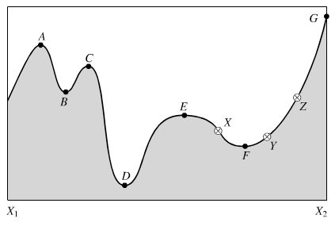
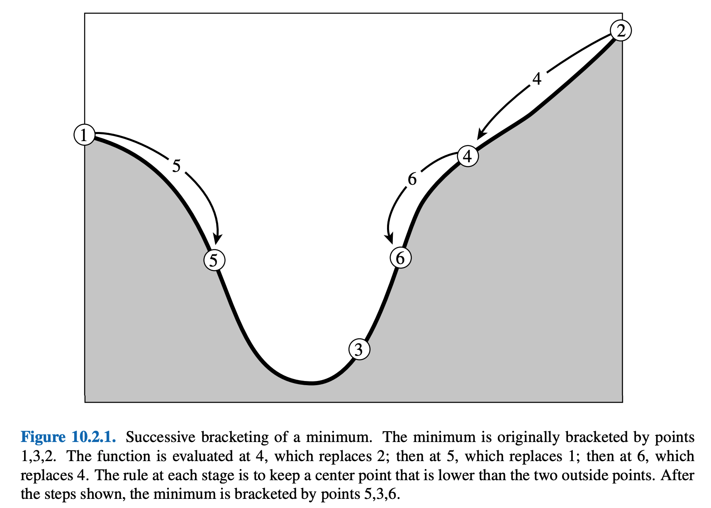
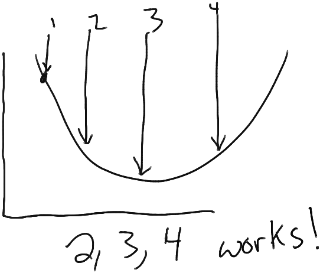
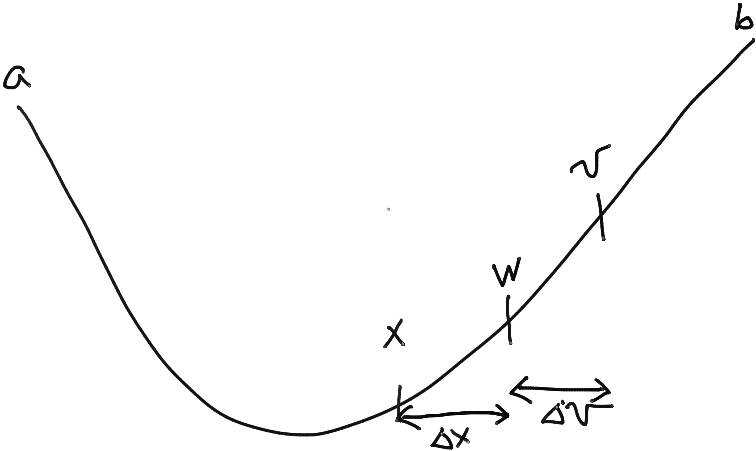
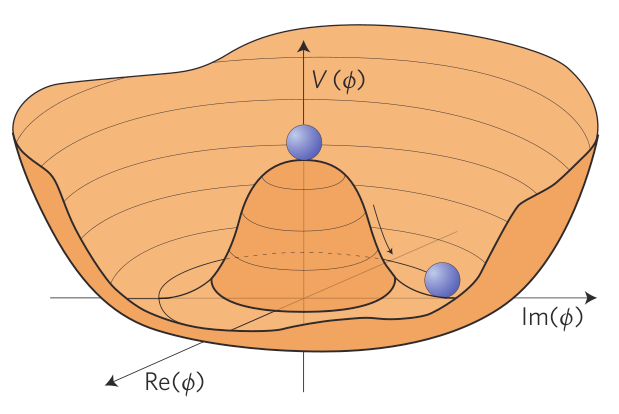
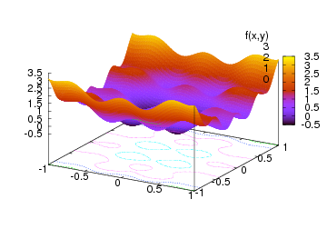
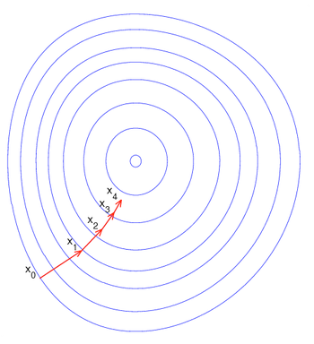
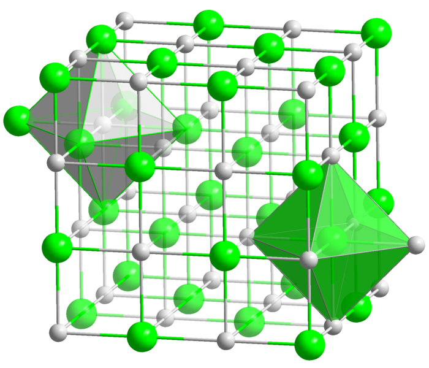
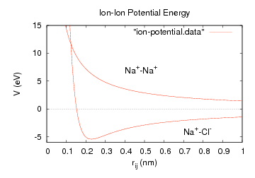
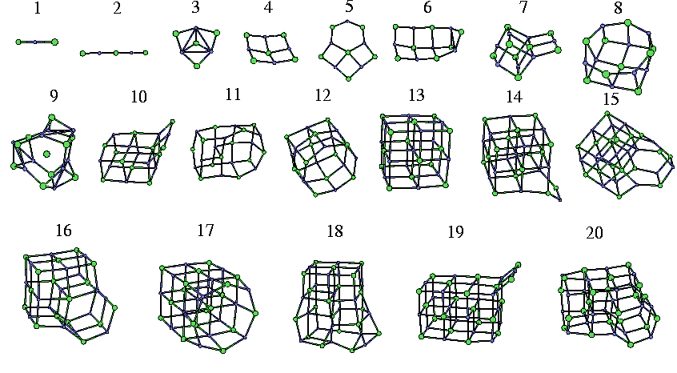

# Minimization

---

## Min(Max)imization

- Can solve for Fourier coefficients

- Many times we’re just interested in the equilibria of nonlinear systems :
  - N-body problem in orbits
  - Nonlinear potentials
  - Dynamic behavior far from equilibria
- A good thing to have in your toolbox is to compute zeroes and extrema of functions
- Starting from root finding in 1D, the next steps are:
  - Find roots in $N$-D
  - Find extrema of functions: minima and maxima.
- Reference: Numerical Recipes, Chapter 10.

---

## Min(Max)imization

<!-- TODO: complex slide layout (flagged by detect_complex_slide.py - see run log). Content below is complete but UNARRANGED - needs manual layout to match the original slide. -->

- Can solve for Fourier coefficients

- Minimization versus maximization : what’s the difference?

{fig-alt="A bumpy curve between endpoints X1 and X2 with several labeled critical points (A through G): local maxima (A, C, G), local minima (B, D, F), and inflection-like points (E, X, Y, Z), illustrating the difference between local and global extrema."}

---

## Min(Max)imization

<!-- TODO: complex slide layout (flagged by detect_complex_slide.py - see run log). Content below is complete but UNARRANGED - needs manual layout to match the original slide. -->

- Can solve for Fourier coefficients

- Minimization versus maximization : what’s the difference?

{fig-alt="A bumpy curve between endpoints X1 and X2 with several labeled critical points (A through G): local maxima (A, C, G), local minima (B, D, F), and inflection-like points (E, X, Y, Z), illustrating the difference between local and global extrema."}

{fig-alt="A bumpy curve between endpoints X1 and X2 with several labeled critical points (A through G): local maxima (A, C, G), local minima (B, D, F), and inflection-like points (E, X, Y, Z), illustrating the difference between local and global extrema."}

- Just a factor of -1. The algorithms are otherwise identical.
- So we usually just speak of "minimization", and maximization is implicit.

---

## Local vs. global

<!-- TODO: complex slide layout (flagged by detect_complex_slide.py - see run log). Content below is complete but UNARRANGED - needs manual layout to match the original slide. -->

- Can solve for Fourier coefficients

- A wrinkles: global versus local extrema require care!
  - Local extrema:  easy
  - Global extrema: hard

{fig-alt="A bumpy curve between endpoints X1 and X2 with several labeled critical points (A through G): local maxima (A, C, G), local minima (B, D, F), and inflection-like points (E, X, Y, Z), illustrating the difference between local and global extrema."}

- Global minimum

- Local minima

{fig-alt="Photograph of a chalkboard sign in a shop window reading 'THANK YOU for shopping LOCAL' - a pun accompanying the discussion of local versus global extrema."}

---

## How to minimize

- Can solve for Fourier coefficients

- This is closely related to the problem of finding roots.
  - Minimization is just finding the roots of the derivative!
- Similar philosophies apply.
- Also, there are two cases:
  - If you have/need the derivative.
  - If you don’t have/need the derivative.
- (If you have the derivative, you might think to use root finding an solve for ${f}^{′}(x)=0$. Numerical Recipes 10.4 points out several deficiencies of this approach: can't distinguish min from max, going "downhill" could roll you out of the bracketed interval and away from the desired solution.)

---

# Golden section search

---

## Golden section search

<!-- TODO: complex slide layout (flagged by detect_complex_slide.py - see run log). Content below is complete but UNARRANGED - needs manual layout to match the original slide. -->

- Can solve for Fourier coefficients

- A simple algorithm:
  - Bracket the extremum in some interval $[a,b]$.
  - Iteratively shrink window until the bracket is $< \epsilon $.
- Rather similar to the bisection algorithm for finding roots.

{fig-alt="A bumpy curve between endpoints X1 and X2 with several labeled critical points (A through G): local maxima (A, C, G), local minima (B, D, F), and inflection-like points (E, X, Y, Z), illustrating the difference between local and global extrema."}

- a

- b

---

## Bracketing

<!-- TODO: complex slide layout (flagged by detect_complex_slide.py - see run log). Content below is complete but UNARRANGED - needs manual layout to match the original slide. -->

- Can solve for Fourier coefficients

- Specifically, "bracketing" means:
  - Start from three points, $[a,b,c]$...
    - Where $f(a)>f(b)<f(c)$.
    - (vs. 2 points for root finding)
  - Why? For root finding, if $f(a) \times f(b)<0$, then there must be a root in $[a,b]$
  - For extrema, the 3-point condition means ${f}^{′}({x}_{ab})<0$ and ${f}^{′}({x}_{bc})>0$ for some ${x}_{ab} \in [a,b]$ and ${x}_{bc} \in [b,c]$.
  - So, ${f}^{′}(x)$ must cross zero from - to + inside the window.
- $f(b)$ is our initial guess.

{fig-alt="Figure 10.2.1 (Numerical Recipes), 'Successive bracketing of a minimum': a curve initially bracketed by points 1, 3, 2; the function is evaluated at 4 (replacing 2), then 5 (replacing 1), then 6 (replacing 4), narrowing the bracket around the minimum to points 5, 3, 6."}

- a

- b

- c

---

## Golden section search

<!-- TODO: complex slide layout (flagged by detect_complex_slide.py - see run log). Content below is complete but UNARRANGED - needs manual layout to match the original slide. -->

- Can solve for Fourier coefficients

- Now choose another point $x$ inside the window, say (4) in this graphic.
- For concreteness, start with $a<b<x<c$.
- Two possible results:
  - $f(b)<f(x)$: $f(b)$ is still our best minimum, but we can shrink the window.
    - I.e., update points to $[a,b,x]$
  - $f(b)>f(x)$: found a better minimum between $b$ and $c$.
    - Update points to $[b,x,c]$ .
- Repeat from both sides.

{fig-alt="Figure 10.2.1 (Numerical Recipes), 'Successive bracketing of a minimum': a curve initially bracketed by points 1, 3, 2; the function is evaluated at 4 (replacing 2), then 5 (replacing 1), then 6 (replacing 4), narrowing the bracket around the minimum to points 5, 3, 6."}

- a

- b

- c

- x

---

## Golden section search

<!-- TODO: complex slide layout (flagged by detect_complex_slide.py - see run log). Content below is complete but UNARRANGED - needs manual layout to match the original slide. -->

- Can solve for Fourier coefficients

- Now choose another point $x$ inside the window, say (4) in this graphic.
- For concreteness, start with $a<b<x<c$.
- Two possible results:
  - $f(b)<f(x)$: $f(b)$ is still our best minimum, but we can shrink the window.
    - I.e., update points to $[a,b,x]$
  - $f(b)>f(x)$: found a better minimum between $b$ and $c$.
    - Update points to $[b,x,c]$ .
- Repeat from both sides.

{fig-alt="Figure 10.2.1 (Numerical Recipes), 'Successive bracketing of a minimum': a curve initially bracketed by points 1, 3, 2; the function is evaluated at 4 (replacing 2), then 5 (replacing 1), then 6 (replacing 4), narrowing the bracket around the minimum to points 5, 3, 6."}

- a

- b

- c

- x

---

## Golden section search

<!-- TODO: complex slide layout (flagged by detect_complex_slide.py - see run log). Content below is complete but UNARRANGED - needs manual layout to match the original slide. -->

- Can solve for Fourier coefficients

- Now choose another point $x$ inside the window, say (4) in this graphic.
- For concreteness, start with $a<b<x<c$.
- Two possible results:
  - $f(b)<f(x)$: $f(b)$ is still our best minimum, but we can shrink the window.
    - I.e., update points to $[a,b,x]$
  - $f(b)>f(x)$: found a better minimum between $b$ and $c$.
    - Update points to $[b,x,c]$ .
- Repeat from both sides.

{fig-alt="Figure 10.2.1 (Numerical Recipes), 'Successive bracketing of a minimum': a curve initially bracketed by points 1, 3, 2; the function is evaluated at 4 (replacing 2), then 5 (replacing 1), then 6 (replacing 4), narrowing the bracket around the minimum to points 5, 3, 6."}

- a

- b

- c

- x

---

## Golden section search

<!-- TODO: complex slide layout (flagged by detect_complex_slide.py - see run log). Content below is complete but UNARRANGED - needs manual layout to match the original slide. -->

- Can solve for Fourier coefficients

- Now choose another point $x$ inside the window, say (4) in this graphic.
- For concreteness, start with $a<b<x<c$.
- Two possible results:
  - $f(b)<f(x)$: $f(b)$ is still our best minimum, but we can shrink the window.
    - I.e., update points to $[a,b,x]$
  - $f(b)>f(x)$: found a better minimum between $b$ and $c$.
    - Update points to $[b,x,c]$ .
- Repeat from both sides.

{fig-alt="Figure 10.2.1 (Numerical Recipes), 'Successive bracketing of a minimum': a curve initially bracketed by points 1, 3, 2; the function is evaluated at 4 (replacing 2), then 5 (replacing 1), then 6 (replacing 4), narrowing the bracket around the minimum to points 5, 3, 6."}

- a

- b

- c

- x

---

## Golden section search

<!-- TODO: complex slide layout (flagged by detect_complex_slide.py - see run log). Content below is complete but UNARRANGED - needs manual layout to match the original slide. -->

- Can solve for Fourier coefficients

- Now choose another point $x$ inside the window, say (4) in this graphic.
- For concreteness, start with $a<b<x<c$.
- Two possible results:
  - $f(b)<f(x)$: $f(b)$ is still our best minimum, but we can shrink the window.
    - I.e., update points to $[a,b,x]$
  - $f(b)>f(x)$: found a better minimum between $b$ and $c$.
    - Update points to $[b,x,c]$ .
- Repeat from both sides.

{fig-alt="Figure 10.2.1 (Numerical Recipes), 'Successive bracketing of a minimum': a curve initially bracketed by points 1, 3, 2; the function is evaluated at 4 (replacing 2), then 5 (replacing 1), then 6 (replacing 4), narrowing the bracket around the minimum to points 5, 3, 6."}

- a

- b

- c

- x

---

## GSS: precision

<!-- TODO: complex slide layout (flagged by detect_complex_slide.py - see run log). Content below is complete but UNARRANGED - needs manual layout to match the original slide. -->

- Can solve for Fourier coefficients

- How precise is the algorithm?
  - Let $({x}_{0},f({x}_{0}))$ be the true minimum.
  - At each step, we compare $f(x)$ vs. $f(b)$. This is eventually limited by the floating point precision, $ \epsilon $.
  - I.e., we hit the limit when:
  - At the minimum, $f(x)$ looks approximately quadratic, $f(x) \approx f({x}_{0})+\frac{1}{2}{f}^{′′}({x}_{0})(x-{x}_{0}{)}^{2}$...

{fig-alt="Figure 10.2.1 (Numerical Recipes), 'Successive bracketing of a minimum': a curve initially bracketed by points 1, 3, 2; the function is evaluated at 4 (replacing 2), then 5 (replacing 1), then 6 (replacing 4), narrowing the bracket around the minimum to points 5, 3, 6."}

- a

- b

- c

- x

- $$|f(x)-f(b)| \sim  \epsilon f({x}_{0})$$

- $$\begin{matrix}
 \epsilon f({x}_{0}) &  \approx |\frac{1}{2}{f}^{′′}({x}_{0})(x-{x}_{0}{)}^{2}| \\
|x-{x}_{0}| &  \approx \sqrt{ \epsilon f({x}_{0})/{f}^{′′}({x}_{0})} \approx \sqrt{ \epsilon }
\end{matrix}$$

- So unfortunately, we are limited by the square root of the floating point precision: $ \approx {10}^{-4}({10}^{-8})$ for single (double) precision floats.

---

## GSS: precision

<!-- TODO: complex slide layout (flagged by detect_complex_slide.py - see run log). Content below is complete but UNARRANGED - needs manual layout to match the original slide. -->

- Can solve for Fourier coefficients

- How precise is the algorithm?
  - Let $({x}_{0},f({x}_{0}))$ be the true minimum.
  - At each step, we compare $f(x)$ vs. $f(b)$. This is eventually limited by the floating point precision, $ \epsilon $.
  - I.e., we hit the limit when:
  - At the minimum, $f(x)$ looks approximately quadratic, $f(x) \approx f({x}_{0})+\frac{1}{2}{f}^{′′}({x}_{0})(x-{x}_{0}{)}^{2}$...

{fig-alt="Figure 10.2.1 (Numerical Recipes), 'Successive bracketing of a minimum': a curve initially bracketed by points 1, 3, 2; the function is evaluated at 4 (replacing 2), then 5 (replacing 1), then 6 (replacing 4), narrowing the bracket around the minimum to points 5, 3, 6."}

- a

- b

- c

- x

- $$|f(x)-f(b)| \sim  \epsilon f({x}_{0})$$

- $$\begin{matrix}
 \epsilon f({x}_{0}) &  \approx |\frac{1}{2}{f}^{′′}({x}_{0})(x-{x}_{0}{)}^{2}| \\
|x-{x}_{0}| &  \approx \sqrt{ \epsilon f({x}_{0})/{f}^{′′}({x}_{0})} \approx \sqrt{ \epsilon }
\end{matrix}$$

- So unfortunately, we are limited by the square root of the floating point precision: $ \approx {10}^{-4}({10}^{-8})$ for single (double) precision floats.

---

## GSS: speed

<!-- TODO: complex slide layout (flagged by detect_complex_slide.py - see run log). Content below is complete but UNARRANGED - needs manual layout to match the original slide. -->

- Can solve for Fourier coefficients

- How fast is the algorithm?
- Once again, let's say $b<x<c$, and examine window size:

{fig-alt="Figure 10.2.1 (Numerical Recipes), 'Successive bracketing of a minimum': a curve initially bracketed by points 1, 3, 2; the function is evaluated at 4 (replacing 2), then 5 (replacing 1), then 6 (replacing 4), narrowing the bracket around the minimum to points 5, 3, 6."}

- a

- b

- c

- x

- $$\begin{matrix}
L & :=c-a \\
w & :=(b-a)/L \\
z & :=(x-b)/L
\end{matrix}$$

- L

- wL

- zL

- From the 4 points, $[a,b,x,c]$, the next window will have size $|x-a|=(w+z)L$ or $|c-b|=(1-w)L$.
- Similar to bisection, it's best to split the difference, i.e., set them equal:

- $$\begin{matrix}
w+z & =1-w \\
z & =1-2w
\end{matrix}$$

---

## GSS: speed

<!-- TODO: complex slide layout (flagged by detect_complex_slide.py - see run log). Content below is complete but UNARRANGED - needs manual layout to match the original slide. -->

- Can solve for Fourier coefficients

- Last slide: optimal choice is

{fig-alt="Figure 10.2.1 (Numerical Recipes), 'Successive bracketing of a minimum': a curve initially bracketed by points 1, 3, 2; the function is evaluated at 4 (replacing 2), then 5 (replacing 1), then 6 (replacing 4), narrowing the bracket around the minimum to points 5, 3, 6."}

- a

- b

- c

- x

- L

- wL

- zL

- Now assume $b$ was chosen in the same way, 1 step earlier: $\frac{z}{1-w}=w$. Then,

- $$\begin{matrix}
\frac{1-2w}{1-w} & =w \\
{w}^{2}-3w+1 & =0 \\
w=\frac{3-\sqrt{5}}{2} &  \approx 0.38197
\end{matrix}$$

- $$\begin{matrix}
z & =1-2w
\end{matrix}$$

- So: the next window size is $(1-w)L \approx 0.618L$.
  - (Golden ratio again!)
- Optimal $x$ is $0.38197L$ into the larger of the left/right windows.

---

## GSS: summary

<!-- TODO: complex slide layout (flagged by detect_complex_slide.py - see run log). Content below is complete but UNARRANGED - needs manual layout to match the original slide. -->

- Can solve for Fourier coefficients

- One more topic for golden section search: initializing $[a,b,c]$.
  - Nothing profound here: try stepping downhill through the function until it turns up again.
- So, in summary:
  - Find initial $[a,b,c]$ by coarsely scanning function (or with prior knowledge...).
  - Iteratively choose next point ($x$) in the larger of the two intervals, $\frac{3-\sqrt{5}}{2}(c-a)$ in from the edge.

{fig-alt="Hand-drawn sketch of a bowl-shaped curve with four vertical arrows labeled 1, 2, 3, 4 marking sample points from left to right, and the handwritten caption '2, 3, 4 works!' - indicating that points 2, 3, and 4 form a valid bracketing triple around the minimum."}

---

# Golden section search

---

## A better algorithm

- Can solve for Fourier coefficients

- Golden section search is constructed to "always work".
  - No need for derivatives (analytical or numerical).
- We can do better with a basic fact already mentioned: near the minimum (${x}_{0}$),

- $$f(x) \approx f({x}_{0})+\frac{1}{2}{f}^{′′}({x}_{0})(x-{x}_{0}{)}^{2}$$

- Provided the approximation is valid, we can do a parabolic interpolation and converge (much) faster.

---

## Parabolic interpolation

- Can solve for Fourier coefficients

- Basic formula: given 3 points $[a,b,c]$, the parabola passing through the three points has a minimum at:

- $${x}_{0}=b-\frac{1}{2}\frac{(b-a{)}^{2}[f(b)-f(c)]-(b-c{)}^{2}[f(b)-f(a)]}{(b-a)[f(b)-f(c)]-(b-c)[f(b)-f(a)]}$$

- Algorithm then works like golden section, using this formula to calculate $x$.
- Failure modes:
  - If $(a,f(a))$, $(b,f(b))$, and $(c,f(c))$ are colinear, the minimum doesn't exist (goes to $ \infty $).
  - Doesn't work great if the minimum is not bracketed well.

- Picture

---

## Brent's method

<!-- TODO: complex slide layout (flagged by detect_complex_slide.py - see run log). Content below is complete but UNARRANGED - needs manual layout to match the original slide. -->

- Can solve for Fourier coefficients

{fig-alt="Hand-drawn sketch of a curve dipping from point a down to a minimum and back up to point b, with three points x, w, v marked near the minimum and small arrows labeling the spacings delta-x and delta-v between them."}

- Solution: combine golden section and parabolic methods to get the best of both worlds.
- Variables:
  - We still need a decent initial guess, $[a,b]$.
  - $x$ = best minimum found so far.
  - $w$ = second-best minimum found so far.
  - $v$ = previous value of $w$

---

## Brent's method

<!-- TODO: complex slide layout (flagged by detect_complex_slide.py - see run log). Content below is complete but UNARRANGED - needs manual layout to match the original slide. -->

- Can solve for Fourier coefficients

{fig-alt="Hand-drawn sketch of a curve dipping from point a down to a minimum and back up to point b, with three points x, w, v marked near the minimum and small arrows labeling the spacings delta-x and delta-v between them."}

- Solution: combine golden section and parabolic methods to get the best of both worlds.
- Variables:
  - We still need a decent initial guess, $[a,b]$.
  - $x$ = best minimum found so far.
  - $w$ = second-best minimum found so far.
  - $v$ = previous value of $w$
- Algorithm:
  - Try parabola with $(x,w,v)$. Accept point ($u$) if:
    - $$a<u<b$$
    - $|u-x|$ is less than half previous change to $x$
  - Otherwise, use GSS for next point.

---

## Brent's method

<!-- TODO: complex slide layout (flagged by detect_complex_slide.py - see run log). Content below is complete but UNARRANGED - needs manual layout to match the original slide. -->

- Can solve for Fourier coefficients

{fig-alt="Hand-drawn sketch of a curve dipping from point a down to a minimum and back up to point b, with three points x, w, v marked near the minimum and small arrows labeling the spacings delta-x and delta-v between them."}

- Solution: combine golden section and parabolic methods to get the best of both worlds.
- Variables:
  - We still need a decent initial guess, $[a,b]$.
  - $x$ = best minimum found so far.
  - $w$ = second-best minimum found so far.
  - $v$ = previous value of $w$
- Algorithm:
  - Try parabola with $(x,w,v)$. Accept point ($u$) if:
    - $$a<u<b$$
    - $|u-x|$ is less than half previous change to $x$
  - Otherwise, use GSS for next point.

- Typical behavior:
  - Use GSS for a few steps, then parabolic interpolation to quickly converge.
- Worst case: alternate GSS and parabolas.

---

## Notebooks

<!-- TODO: complex slide layout (flagged by detect_complex_slide.py - see run log). Content below is complete but UNARRANGED - needs manual layout to match the original slide. -->

- Can solve for Fourier coefficients

{fig-alt="3D 'Mexican hat' (sombrero) potential V(phi) plotted over the complex plane (Re(phi), Im(phi)): an unstable ball sits at the central peak while a second ball rolls down into the circular trough of minima - the classic symmetry-breaking potential shape."}

- Minimization algorithms (in 1D) are demonstrated in CompPhys/MinMax/minmax1d.ipynb. Try them out!
- Example: minimizing a quartic polynomial.
  - Classic example from spontaneous symmetry breaking:
    - Bose–Einstein condensates, Higgs potential, ferromagnets, ...
  - Suppose the field starts off at $ \phi =0$. Local maximum, solution has $U(1)$ symmetry ($ \phi  \rightarrow {e}^{i \theta } \phi $).
    - But it's unstable!
  - Field "rolls down hill" and settles at some $ \phi  \neq 0$.
    - Excitations about the ground state no longer have $U(1)$ symmetry!

- Algos implemented in [https://docs.scipy.org/doc/scipy/reference/generated/scipy.optimize.minimize_scalar.html](https://docs.scipy.org/doc/scipy/reference/generated/scipy.optimize.minimize_scalar.html)

---

## Recap

- Can solve for Fourier coefficients

- We've introduced function minimization (and it's mirror image, maximization) for 1D functions.
  - Specifically, finding local extrema of functions.
  - Finding global extrema is a much harder problem.
- Golden section search: simple, robust algorithm similar to bisection root finding.
- Parabolic interpolation: slightly smarter but less robust algorithm, using fact that "smooth" functions look ~quadratic close enough to the minimum.
- Brent's method heuristically combines the two to get the best of both worlds.
  - Note: scipy also implements [Chandrupatla’s method](https://www.sciencedirect.com/science/article/abs/pii/S0045782597001904), which is rather similar to Brent's method but seems to work better in some cases.

---

# Optimization in N dimensions

---

## Extending optimization to N-D

<!-- TODO: complex slide layout (flagged by detect_complex_slide.py - see run log). Content below is complete but UNARRANGED - needs manual layout to match the original slide. -->

{fig-alt="3D surface plot of a bumpy, multi-modal function f(x,y) over x,y in [-1,1], colored orange-to-purple by height, with a contour plot of the same function projected onto the floor of the plot box - illustrating a rugged N-dimensional objective-function landscape with many local optima."}

- Can solve for Fourier coefficients

- Last time we talked about optimization in one dimension. Now let’s extend this to arbitrary dimensions!
- Things are simple in 1D:
  - There’s only one derivative.
  - There’s only two kinds of extrema (minima and maxima).
- In $N$ dimensions, things get more complicated:
  - We replace a derivative with a gradient
  - There are three kinds of extrema: minima and maxima, but also saddle points.

---

## Algorithms

- Can solve for Fourier coefficients

- Numerical Recipes recommends using the Broyden–Fletcher–Goldfarb–Shanno (BFGS) method ([wikipedia](http://en.wikipedia.org/wiki/BFGS_method)).
- Approximates Newton’s method (“gradient descent”).
- There are others, but this one is pretty robust and also quite fast!
  - Numerical Recipes 10.1: "Thus quasi-Newton is effectively our first choice of method both when you are willing to calculate gradients, and when you are not willing!"
  - See other section in Numerical Recipes, Chapter 10 for other algorithms.

---

## Newton's method

- Can solve for Fourier coefficients

- Recall Newton's method in 1D:

- $${x}_{new}={x}_{0}-\frac{f({x}_{0})}{{f}^{′}({x}_{0})}={x}_{0}-({f}^{′}({x}_{0}){)}^{-1}f({x}_{0})$$

- The generalization to multiple dimensions is just:

- $${\vec{x}}_{new}={\vec{x}}_{0}-( \nabla f({\vec{x}}_{0}){)}^{-1}f({x}_{0})$$

- The gradient $ \nabla f({\vec{x}}_{0})$ is a vector pointing in the steepest direction.
- Basic idea: iteratively take a step in the steepest direction until desired condition is found.
  - The formulas above give you root finding in multiple dimensions.
  - For minimization, we'll basically do the same thing with ${f}^{′}(x)$.
- So, we have a 1-D-ish algorithm for the $N$-D problem.

---

## Newton's method

- Can solve for Fourier coefficients

- Recall Newton's method in 1D:

- $${x}_{new}={x}_{0}-\frac{f({x}_{0})}{{f}^{′}({x}_{0})}={x}_{0}-({f}^{′}({x}_{0}){)}^{-1}f({x}_{0})$$

- The generalization to multiple dimensions is just:

- $${\vec{x}}_{new}={\vec{x}}_{0}-( \nabla f({\vec{x}}_{0}){)}^{-1}f({x}_{0})$$

- The gradient $ \nabla f({\vec{x}}_{0})$ is a vector pointing in the steepest direction.
- Basic idea: iteratively take a step in the steepest direction until desired condition is found.
  - The formulas above give you root finding in multiple dimensions.
  - For minimization, we'll basically do the same thing with ${f}^{′}(x)$.
- So, we have a 1-D-ish algorithm (follow a 1-D path) in $N$-D space.

---

## Newton's method

- Can solve for Fourier coefficients

- Recall Newton's method in 1D:

- $${x}_{new}={x}_{0}-\frac{f({x}_{0})}{{f}^{′}({x}_{0})}={x}_{0}-({f}^{′}({x}_{0}){)}^{-1}f({x}_{0})$$

- The generalization to multiple dimensions is just:

- $${\vec{x}}_{new}={\vec{x}}_{0}-( \nabla f({\vec{x}}_{0}){)}^{-1}f({x}_{0})$$

- The gradient $ \nabla f({\vec{x}}_{0})$ is a vector pointing in the steepest direction.
- Basic idea: iteratively take a step in the steepest direction until desired condition is found.
  - The formulas above give you root finding in multiple dimensions.
  - For minimization, we'll basically do the same thing with ${f}^{′}(x)$.
- So, we have a 1-D-ish algorithm (follow a 1-D path) in $N$-D space.

---

## Newton's method

<!-- TODO: complex slide layout (flagged by detect_complex_slide.py - see run log). Content below is complete but UNARRANGED - needs manual layout to match the original slide. -->

- Can solve for Fourier coefficients

- Algorithm:
  - Compute gradient.
  - Take a step in the direction of the gradient.
- However, this naive algorithm is computationally intensive.
- We can do a lot better with the quasi-Newton method.
  - Main feature: iteratively construct an approximation to the inverse Hessian matrix.
- Recall that the Hessian matrix is the N-D generalization of the second derivative:

{fig-alt="Blue elliptical contour lines of a 2D function around a central minimum, with a red arrow path from x0 through x1, x2, x3 to x4, zig-zagging inward toward the center - illustrating gradient descent's characteristic slow, zig-zagging convergence on an elongated (ill-conditioned) bowl."}

- $$\mathbf{A}=\left( \begin{matrix}
\frac{{ \partial }^{2}f}{ \partial {x}_{1}^{2}} & \frac{{ \partial }^{2}f}{ \partial {x}_{1} \partial {x}_{2}} & ... & \frac{{ \partial }^{2}f}{ \partial {x}_{1} \partial {x}_{n}} \\
\frac{{ \partial }^{2}f}{ \partial {x}_{2} \partial {x}_{1}} & \frac{{ \partial }^{2}f}{ \partial {x}_{2}^{2}} & ... & \frac{{ \partial }^{2}f}{ \partial {x}_{2} \partial {x}_{n}} \\
 \vdots  &  \vdots  &  \ddots  &  \vdots  \\
\frac{{ \partial }^{2}f}{ \partial {x}_{n} \partial {x}_{1}} & \frac{{ \partial }^{2}f}{ \partial {x}_{n} \partial {x}_{2}} & ... & \frac{{ \partial }^{2}f}{ \partial {x}_{n}^{2}}
\end{matrix} \right)$$

---

## Newton's method

<!-- TODO: complex slide layout (flagged by detect_complex_slide.py - see run log). Content below is complete but UNARRANGED - needs manual layout to match the original slide. -->

- Can solve for Fourier coefficients

- Algorithm:
  - Compute gradient.
  - Take a step in the direction of the gradient.
- However, this naive algorithm is computationally intensive.
- We can do a lot better with the quasi-Newton method.
  - Main feature: iteratively construct an approximation to the inverse Hessian matrix.
- Recall that the Hessian matrix is the N-D generalization of the second derivative:

{fig-alt="Blue elliptical contour lines of a 2D function around a central minimum, with a red arrow path from x0 through x1, x2, x3 to x4, zig-zagging inward toward the center - illustrating gradient descent's characteristic slow, zig-zagging convergence on an elongated (ill-conditioned) bowl."}

- $$\mathbf{A}=\left( \begin{matrix}
\frac{{ \partial }^{2}f}{ \partial {x}_{1}^{2}} & \frac{{ \partial }^{2}f}{ \partial {x}_{1} \partial {x}_{2}} & ... & \frac{{ \partial }^{2}f}{ \partial {x}_{1} \partial {x}_{n}} \\
\frac{{ \partial }^{2}f}{ \partial {x}_{2} \partial {x}_{1}} & \frac{{ \partial }^{2}f}{ \partial {x}_{2}^{2}} & ... & \frac{{ \partial }^{2}f}{ \partial {x}_{2} \partial {x}_{n}} \\
 \vdots  &  \vdots  &  \ddots  &  \vdots  \\
\frac{{ \partial }^{2}f}{ \partial {x}_{n} \partial {x}_{1}} & \frac{{ \partial }^{2}f}{ \partial {x}_{n} \partial {x}_{2}} & ... & \frac{{ \partial }^{2}f}{ \partial {x}_{n}^{2}}
\end{matrix} \right)$$

---

## Quasi-Newton method

<!-- TODO: complex slide layout (flagged by detect_complex_slide.py - see run log). Content below is complete but UNARRANGED - needs manual layout to match the original slide. -->

- Can solve for Fourier coefficients

- In the vicinity of ${\vec{x}}_{i}$, the Taylor expansions for $f(\vec{x})$ and $ \nabla f(\vec{x})$ are:

{fig-alt="Blue elliptical contour lines of a 2D function around a central minimum, with a red arrow path from x0 through x1, x2, x3 to x4, zig-zagging inward toward the center - illustrating gradient descent's characteristic slow, zig-zagging convergence on an elongated (ill-conditioned) bowl."}

- $$\begin{matrix}
f(\vec{x}) & =f({\vec{x}}_{i})+(\vec{x}-{\vec{x}}_{i}) \nabla f({\vec{x}}_{i})+\frac{1}{2}(\vec{x}-{\vec{x}}_{i}{)}^{T}\mathbf{A}(\vec{x}-{\vec{x}}_{i}) \\
 \nabla f(\vec{x}) & = \nabla f({\vec{x}}_{i})+\mathbf{A}(\vec{x}-{\vec{x}}_{i})
\end{matrix}$$

- Again, we are looking for the extrema, which corresponds to $ \nabla f(\vec{x})=0$. This gives us:

- $$\begin{matrix}
0 & = \nabla f({\vec{x}}_{i})+\mathbf{A}(\vec{x}-{\vec{x}}_{i}) \\
\vec{x}-{\vec{x}}_{i} & =-{\mathbf{A}}^{-1} \cdot  \nabla f({\vec{x}}_{i})
\end{matrix}$$

- This gives us the next step in the algorithm... except where do we get ${\mathbf{A}}^{-1}$???
- Key step of quasi-Newton method: build an iterative approximation: a sequence of matrices, ${{\mathbf{H}}_{i}}$, with$\mathop{lim}\limits_{i \rightarrow  \infty }{\mathbf{H}}_{i}={\mathbf{A}}^{-1}$.

---

## Approximating the inverse Hessian

- Can solve for Fourier coefficients

- Following Numerical Recipes 10.9, we are going to skip the detailed derivation, and just give an overview.
  - Consider two points in the algorithm, ${\vec{x}}_{i}$ and ${\vec{x}}_{i+1}$:
  - Define ${\mathbf{H}}_{i+1}$ to satisfy this equation:
  - Using "kitchen sink" reasoning, the available variable to build ${\mathbf{H}}_{i+1}$ are: ${\mathbf{H}}_{i}$, ${\vec{x}}_{i+1}-{\vec{x}}_{i}$, and $ \nabla {f}_{i+1}- \nabla {f}_{i}$.
- Skipping straight to the answer, we have a couple solutions:

- $$\begin{matrix}
{\vec{x}}_{i+1}-{\vec{x}}_{i} & ={\mathbf{A}}^{-1} \cdot ( \nabla {f}_{i+1}- \nabla {f}_{i})
\end{matrix}$$

- $$\begin{matrix}
{\vec{x}}_{i+1}-{\vec{x}}_{i} & ={\mathbf{H}}_{i+1}^{-1} \cdot ( \nabla {f}_{i+1}- \nabla {f}_{i})
\end{matrix}$$

- $${\mathbf{H}}_{i+1}={\mathbf{H}}_{i}+\frac{({\vec{x}}_{i+1}-{\vec{x}}_{i}) \otimes ({\vec{x}}_{i+1}-{\vec{x}}_{i})}{({\vec{x}}_{i+1}-{\vec{x}}_{i}) \cdot ( \nabla {f}_{i+1}- \nabla {f}_{i})}-\frac{[{\mathbf{H}}_{i}( \nabla {f}_{i+1}- \nabla {f}_{i})] \otimes [{\mathbf{H}}_{i}( \nabla {f}_{i+1}- \nabla {f}_{i})]}{( \nabla {f}_{i+1}- \nabla {f}_{i}) \cdot {\mathbf{H}}_{i} \cdot ( \nabla {f}_{i+1}- \nabla {f}_{i})}$$

- DFP updating formula:

- $ \otimes $ is the outer product, i.e., the matrix defined by: $(\vec{u} \otimes \vec{v}{)}_{ij}={u}_{i}{v}_{j}$

---

## Approximating the inverse Hessian

- Can solve for Fourier coefficients

- Following Numerical Recipes 10.9, we are going to skip the detailed derivation, and just give an overview.
  - Consider two points in the algorithm, ${\vec{x}}_{i}$ and ${\vec{x}}_{i+1}$:
  - Define ${\mathbf{H}}_{i+1}$ to satisfy this equation:
  - Using "kitchen sink" reasoning, the available variable to build ${\mathbf{H}}_{i+1}$ are: ${\mathbf{H}}_{i}$, ${\vec{x}}_{i+1}-{\vec{x}}_{i}$, and $ \nabla {f}_{i+1}- \nabla {f}_{i}$.
- Skipping straight to the answer, we have a couple solutions:

- $$\begin{matrix}
{\vec{x}}_{i+1}-{\vec{x}}_{i} & ={\mathbf{A}}^{-1} \cdot ( \nabla {f}_{i+1}- \nabla {f}_{i})
\end{matrix}$$

- $$\begin{matrix}
{\vec{x}}_{i+1}-{\vec{x}}_{i} & ={\mathbf{H}}_{i+1}^{-1} \cdot ( \nabla {f}_{i+1}- \nabla {f}_{i})
\end{matrix}$$

- $${\mathbf{H}}_{i+1}={\mathbf{H}}_{i}+\frac{({\vec{x}}_{i+1}-{\vec{x}}_{i}) \otimes ({\vec{x}}_{i+1}-{\vec{x}}_{i})}{({\vec{x}}_{i+1}-{\vec{x}}_{i}) \cdot ( \nabla {f}_{i+1}- \nabla {f}_{i})}-\frac{[{\mathbf{H}}_{i}( \nabla {f}_{i+1}- \nabla {f}_{i})] \otimes [{\mathbf{H}}_{i}( \nabla {f}_{i+1}- \nabla {f}_{i})]}{( \nabla {f}_{i+1}- \nabla {f}_{i}) \cdot {\mathbf{H}}_{i} \cdot ( \nabla {f}_{i+1}- \nabla {f}_{i})}+[( \nabla {f}_{i+1}- \nabla {f}_{i}) \cdot {\mathbf{H}}_{i} \cdot ( \nabla {f}_{i+1}- \nabla {f}_{i})]\vec{u} \otimes \vec{u}$$

- BFGS updating formula:

- $$\vec{u}=\frac{({\vec{x}}_{i+1}-{\vec{x}}_{i})}{({\vec{x}}_{i+1}-{\vec{x}}_{i}) \cdot ( \nabla {f}_{i+1}- \nabla {f}_{i})}-\frac{{\mathbf{H}}_{i} \cdot ( \nabla {f}_{i+1}- \nabla {f}_{i})}{( \nabla {f}_{i+1}- \nabla {f}_{i}) \cdot {\mathbf{H}}_{i} \cdot ( \nabla {f}_{i+1}- \nabla {f}_{i})}$$

---

## Comments

- Can solve for Fourier coefficients

- Both of these formulas converge to the inverse Hessian matrix.
  - BFGS converges with smaller errors.
  - See [Polak, E. 1971, Computational Methods in Optimization (New York: Academic Press), pp. 56ff](https://shop.elsevier.com/books/computational-methods-in-optimization/polak/978-0-12-559350-2) for details.
- Implemented in C++ and [scipy.optimize.minimize](https://docs.scipy.org/doc/scipy/reference/generated/scipy.optimize.minimize.html#scipy.optimize.minimize).

- Summary:
  - Inputs: function $f(\vec{x})$ and some implementation of gradient $ \nabla f(\vec{x})$ (either analytical or numerical i.e. finite differences).
  - Initialize ${\mathbf{H}}_{0}$ to unit matrix, and first step in random direction.
  - Iteration: while error is too big, do:
    - Update the line direction using ${\mathbf{H}}_{i}$
    - Update gradient
    - Compute difference in gradient, update Hessian (i.e. compute ${\mathbf{H}}_{i+1}$ using the big, messy formula)

---

## Avoiding local minima

- Can solve for Fourier coefficients

- A brief word on local vs. global minima:
- Algorithms can easily get stuck in local minima, which might (probably) not be what you want.
- Strategies for searching more "globally" are not too sophisticated. Some ideas:
  - First find “coarse” minima with stable algorithm, initialize from there, use BFGS to find minima with high precision.
  - Compute an ensemble of “pseudo experiments” (or “toys”) where the initial value is randomly varied, take the ensemble mean (or median).
  - Pick “correct” initial conditions from first principles.

---

# Equilibria and modes of molecules

---

## Application: equilibria and modes of molecules

<!-- TODO: complex slide layout (flagged by detect_complex_slide.py - see run log). Content below is complete but UNARRANGED - needs manual layout to match the original slide. -->

- Can solve for Fourier coefficients

- Example taken from [K. Michaelian, "Evolving few-ion clusters of Na and Cl", Am. J. Phys. 66, 231 (1998)](https://pubs.aip.org/aapt/ajp/article-abstract/66/3/231/1044856/Evolving-few-ion-clusters-of-Na-and-Cl?redirectedFrom=fulltext).
  - Uses "genetic algorithm" to study clusters of ions.
- Let’s consider an example of molecules in a regular format (lattice-like).
- For instance, salt (sodium chloride) ([wikipedia](http://en.wikipedia.org/%20wiki/Sodium_chloride)).
- Let’s consider examples like NaCl, Na2Cl+,
Na2Cl2, Na3Cl2+

{fig-alt="3D rendering of the rock-salt (NaCl) crystal structure: green chloride and white/gray sodium ions arranged on a cubic lattice, with two octahedral ion-coordination polyhedra highlighted (one gray, one green) to show the local bonding geometry."}

---

## Potential function

<!-- TODO: complex slide layout (flagged by detect_complex_slide.py - see run log). Content below is complete but UNARRANGED - needs manual layout to match the original slide. -->

- Can solve for Fourier coefficients

- Starting point: write down the potential energy between two atoms.

{fig-alt="Plot titled 'Ion-Ion Potential Energy': V (eV) versus separation r_ij (nm) for two ion pairs - the Na+-Na+ curve is repulsive (positive, decaying toward zero), while the Na+-Cl- curve is attractive, dipping to a minimum around r ~ 0.2-0.3 nm before rising back toward zero."}

- $$V({r}_{ij})=\left\{\begin{aligned}
-\frac{{e}^{2}}{4 \pi { \epsilon }_{0}{r}_{ij}}+ \alpha {e}^{-{r}_{ij}/ \rho }+b{\left( \frac{c}{{r}_{ij}} \right)}^{12}:{\text{Na}}^{+}{\text{-Cl}}^{-} \\
+\frac{{e}^{2}}{4 \pi { \epsilon }_{0}{r}_{ij}}+b{\left( \frac{c}{{r}_{ij}} \right)}^{12}:{\text{Na}}^{+}{\text{-Na}}^{+}{\text{or Cl}}^{-}{\text{-Cl}}^{-}
\end{aligned}\right.$$

- $$\frac{{e}^{2}}{4 \pi { \epsilon }_{0}}=1.44\text{eV nm}$$
- $$ \alpha =1.09 \times {10}^{3}\text{eV}$$
- $$ \rho =0.0321\text{nm}$$
- $b=1\text{eV}$, $c=0.01\text{nm}$

---

## Solving for equilibrium configurations

<!-- TODO: complex slide layout (flagged by detect_complex_slide.py - see run log). Content below is complete but UNARRANGED - needs manual layout to match the original slide. -->

- Can solve for Fourier coefficients

- Equilibrium structures are global minima of the potential energy:

- $$U({\vec{r}}_{0},{\vec{r}}_{1},...,{\vec{r}}_{{n}_{1}})=\mathop{\mathop{ \sum }\limits_{i=0}}\limits^{n-1}\mathop{\mathop{ \sum }\limits_{j=i+1}}\limits^{n-1}V({r}_{ij})$$

- So, this is some gigantic, complicated formula, but it's relatively straightforward (if tedious) to write it into a C++ or python function!
- And then we use BFGS to minimize it.

{fig-alt="A grid of 20 numbered small NaCl cluster structures (green/gray ion positions connected by blue bonds), showing equilibrium geometries of increasing cluster size - from simple 2-3 ion chains up to complex 3D cage-like clusters of dozens of ions."}

- [http://www-wales.ch.cam.ac.uk/CCD.html](http://www-wales.ch.cam.ac.uk/CCD.html)

---

## Solving for equilibrium configurations

<!-- TODO: complex slide layout (flagged by detect_complex_slide.py - see run log). Content below is complete but UNARRANGED - needs manual layout to match the original slide. -->

- Can solve for Fourier coefficients

- Equilibrium structures are global minima of the potential energy:

- $$U({\vec{r}}_{0},{\vec{r}}_{1},...,{\vec{r}}_{{n}_{1}})=\mathop{\mathop{ \sum }\limits_{i=0}}\limits^{n-1}\mathop{\mathop{ \sum }\limits_{j=i+1}}\limits^{n-1}V({r}_{ij})$$

- So, this is some gigantic, complicated formula, but it's relatively straightforward (if tedious) to write it into a C++ or python function!
- And then we use BFGS to minimize it.

{fig-alt="A grid of 20 numbered small NaCl cluster structures (green/gray ion positions connected by blue bonds), showing equilibrium geometries of increasing cluster size - from simple 2-3 ion chains up to complex 3D cage-like clusters of dozens of ions."}

- [http://www-wales.ch.cam.ac.uk/CCD.html](http://www-wales.ch.cam.ac.uk/CCD.html)
