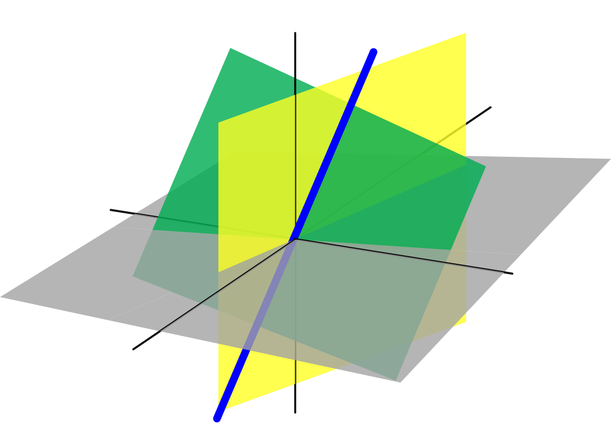
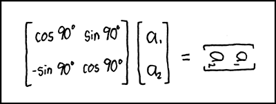
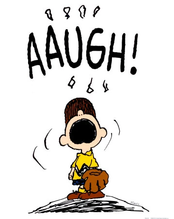
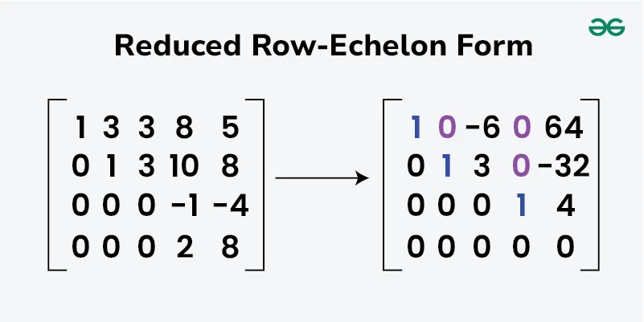
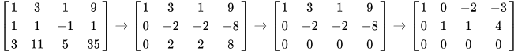
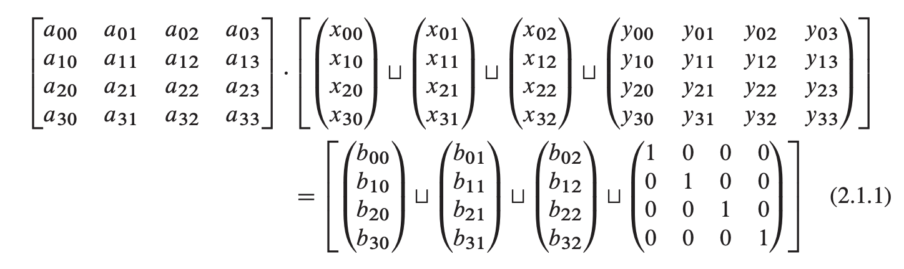
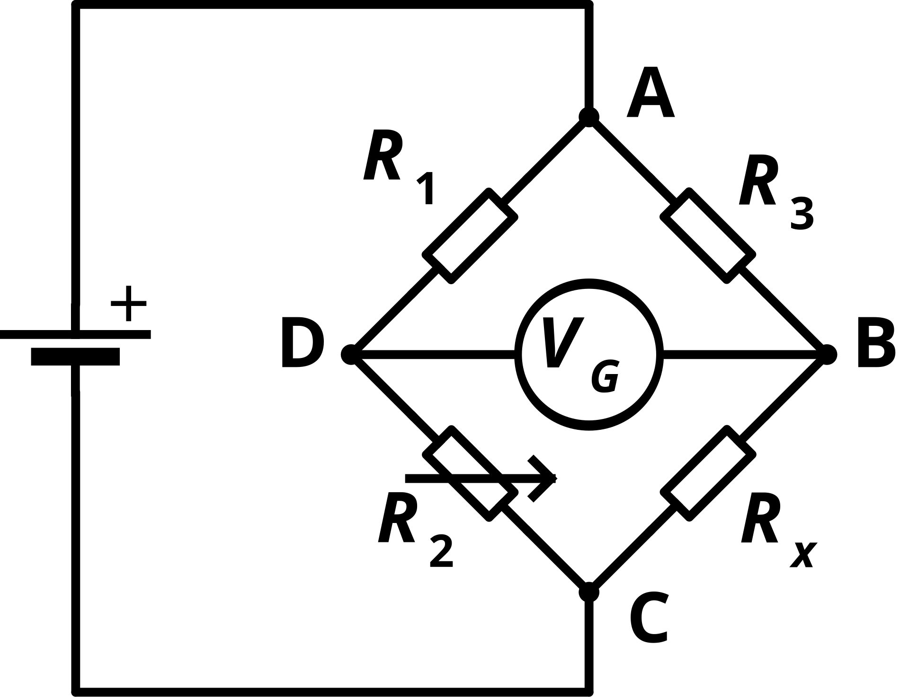
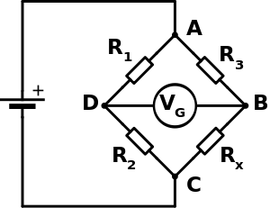

## Announcements

- Assignment 5 officially posted: [https://classroom.github.com/a/Fs43SiCG](https://classroom.github.com/a/Fs43SiCG)
  - Due Wednesday, November 19 at 11:59pm.
  - ‼️ Warning: this one is a bit longer than previous homeworks! ‼️
- New office hour schedule: Wednesdays, 11am-12pm.
  - I will try to be available on demand for the small number of you that can't make this time!
- Assignment 4 due today at 11:59pm.
  - Note: I didn't make the notebooks for you this time, please go ahead and make them yourself (you can copy notebooks from CompPhys/DataAnalysis/[Fitting, FFT] if you want.)

- original version: Haade;vectorization: Wjh31, Quibik, CC BY-SA 3.0 <https://creativecommons.org/licenses/by-sa/3.0>, via Wikimedia Commons

---

## Introduction

- Linear algebra (obviously) has a huge number of applications:
  - Complex circuit diagrams
  - Coupled oscillators
  - General solution of fitting arbitrary curves
  - ...
- We will learn how to:
  - Solve (systems of) linear equations
  - Compute eigenvalues
  - Apply methods to several physics problems.
- References:
  - Garcia Chapter 4, Numerical Recipes Chapter 2

- original version: Haade;vectorization: Wjh31, Quibik, CC BY-SA 3.0 <https://creativecommons.org/licenses/by-sa/3.0>, via Wikimedia Commons

{width="70%" fig-alt="A 3D plot of three intersecting planes (green, yellow, and gray) meeting along a common line (thick blue line through the origin) - illustrating the geometric solution of a 3-equation, 3-unknown linear system."}

- [Alksentrs](https://en.wikipedia.org/wiki/User:Alksentrs) at [en.wikipedia](https://en.wikipedia.org/) - Own work (Original text: Own work, based on [en:Image:Linearsubspace.svg](https://en.wikipedia.org/wiki/Image:Linearsubspace.svg) (by [en:User:Jakob.scholbach](https://en.wikipedia.org/wiki/User:Jakob.scholbach)).) Transferred from [en.wikipedia](https://en.wikipedia.org/) to Commons by [User:Ylebru](https://commons.wikimedia.org/wiki/User:Ylebru) using [CommonsHelper](http://tools.wikimedia.de/~magnus/commonshelper.php).

---

## Introduction

:::: {.columns}
::: {.column width="55%"}
- You are all hopefully familiar with basics of linear algebra:
  - Vectors
  - Matrices
  - Solving matrix equations
  - Gauss-Jordan elimination ([wikipedia](https://en.wikipedia.org/wiki/Gaussian_elimination))
- However, the computational aspects of linear algebra are a huge subject in their own right!
  - We will just touch the surface of the most important topics in this class.
- original version: Haade;vectorization: Wjh31, Quibik, CC BY-SA 3.0 <https://creativecommons.org/licenses/by-sa/3.0>, via Wikimedia Commons
:::
::: {.column width="45%"}
{width="100%" fig-alt="Hand-drawn joke: a 2x2 rotation matrix [cos90 sin90; -sin90 cos90] multiplying a vector (a1, a2), with the result written as a blurred/redacted expression - a sight gag about the answer being illegible."}
:::
::::

---

## Introduction

- You are all hopefully familiar with basics of linear algebra:
  - Vectors
  - Matrices
  - Solving matrix equations, $\mathbf{A}\mathbf{x}=\mathbf{b}$
  - Gauss-Jordan elimination ([wikipedia](https://en.wikipedia.org/wiki/Gaussian_elimination))
- However, the computational aspects of linear algebra are a huge subject in their own right!
  - We will just touch the surface of some important topics in this class.

- original version: Haade;vectorization: Wjh31, Quibik, CC BY-SA 3.0 <https://creativecommons.org/licenses/by-sa/3.0>, via Wikimedia Commons

{width="70%" fig-alt="Hand-drawn joke: a 2x2 rotation matrix [cos90 sin90; -sin90 cos90] multiplying a vector (a1, a2), with the result written as a blurred/redacted expression - a sight gag about the answer being illegible."}

---

## Intro: matrix inversion

- First example of computational issues: matrix inversion.
- Recall Cramer's rule ([wikipedia](http://en.wikipedia.org/wiki/Cramer's_rule))
  - Given matrix $\mathbf{A}$ and its determinant,

- original version:: Wjh31, Quibik, CC BY-SA 3.0 <https://creativecommons.org/licenses/by-sa/3.0>, via Wikimedia Commons

- $$\text{det}(\mathbf{A})=|\mathbf{A}|=\mathop{\mathop{ \sum }\limits_{i=1}}\limits^{N}(-1{)}^{i+j}{A}_{ij}|{\mathbf{R}}_{ij}|$$

- ${\mathbf{R}}_{ij}=$"residual" or "minor" of $\mathbf{A}$ obtained by removing row $i$ and column $j$

- ...then the inverse of $\mathbf{A}$ is:

- $${A}_{ij}^{-1}=(-1{)}^{i+j}\frac{|{\mathbf{R}}_{ji}|}{|\mathbf{A}|}$$

- This is a recursive rule.

---

## Intro: matrix inversion

:::: {.columns}
::: {.column width="55%"}
- Cramer's rule is basically the "brute force" method.
  - It's OK for small $N$, but scales horribly with matrix size: $O(N!)$
  - To see this, just write down the determinant equation:
- original version:: Wjh31, Quibik, CC BY-SA 3.0 <https://creativecommons.org/licenses/by-sa/3.0>, via Wikimedia Commons
- $$|\mathbf{A}|=\mathop{ \sum }\limits_{P}(-{)}^{P}{A}_{1{p}_{1}}{A}_{2{p}_{2}}...{A}_{N{p}_{N}}$$
  - $P$ runs over the $N!$ permutations of the indices.
  - $20! \approx 2.43 \times {10}^{18}$... aaugh! (aaugh, factorial)
- OK, back to the drawing board.
:::
::: {.column width="45%"}
{width="100%" fig-alt="Peanuts-style cartoon of a boy in a baseball cap and glove shouting 'AAUGH!' in frustration - a humorous reaction image."}
:::
::::

---

## Better inversion algorithms

- For medium-sized matrices ($N \sim 10-{10}^{3}$):
  - Gaussian elimination
  - LU decomposition
  - Householder method
- Large matrices ($N \gtrsim {10}^{3}$):
  - Storage becomes a problem.
  - No practical algorithm for arbitrary/general matrices.
  - However, large matrices are often "sparse," i.e., they are mostly 0s.
    - These are storable and solvable with some cleverness.

- original version:: Wjh31, Quibik, CC BY-SA 3.0 <https://creativecommons.org/licenses/by-sa/3.0>, via Wikimedia Commons

---

## Software

- Linear algebra is the raison d'être for numpy.
  - So: let's just use it!
- Most scipy algorithms for linear algebra are from LAPACK (linear algebra pack), [http://www.netlib.org/lapack](http://www.netlib.org/lapack)
- Other packages:
  - BLAS (basic linear algebra subprograms) ([wikipedia](https://en.wikipedia.org/wiki/Basic_Linear_Algebra_Subprograms))
  - BOOST basic linear algebra library (uBLAS) ([https://www.boost.org/doc/libs/latest/libs/numeric/ublas/doc/](https://www.boost.org/doc/libs/latest/libs/numeric/ublas/doc/))
  - matlab (the "mat" in "matlab" is short for "matrix") ([https://www.mathworks.com/products/matlab.html](https://www.mathworks.com/products/matlab.html))

- original version:: Wjh31, Quibik, CC BY-SA 3.0 <https://creativecommons.org/licenses/by-sa/3.0>, via Wikimedia Commons

---

## Game plan

- For the next ~week, we will:
  - Start with numpy software.
  - Understand the algorithms used internally.
  - Check into use cases.

- original version:: Wjh31, Quibik, CC BY-SA 3.0 <https://creativecommons.org/licenses/by-sa/3.0>, via Wikimedia Commons

---

# Gaussian (gauss–jordan) elimination

---

## Gaussian elimination

- Gaussian elimination concerns matrix equations like $\mathbf{A}\mathbf{x}=\mathbf{b}$.
- For $N=3$:

- original version:: Wjh31, Quibik, CC BY-SA 3.0 <https://creativecommons.org/licenses/by-sa/3.0>, via Wikimedia Commons

- $$\left( \begin{matrix}
{a}_{00} & {a}_{01} & {a}_{02} \\
{a}_{10} & {a}_{11} & {a}_{12} \\
{a}_{20} & {a}_{21} & {a}_{22}
\end{matrix} \right)\left( \begin{aligned}
{x}_{0} \\
{x}_{1} \\
{x}_{2}
\end{aligned} \right)=\left( \begin{aligned}
{b}_{0} \\
{b}_{1} \\
{b}_{2}
\end{aligned} \right)$$

- Expanding the multiplication operation, this is a system of 3 equations:

- $$\left( \begin{aligned}
{a}_{00}{x}_{0}+{a}_{01}{x}_{1}+{a}_{02}{x}_{2} \\
{a}_{10}{x}_{0}+{a}_{11}{x}_{1}+{a}_{12}{x}_{2} \\
{a}_{20}{x}_{0}+{a}_{21}{x}_{1}+{a}_{22}{x}_{2}
\end{aligned} \right)=\left( \begin{aligned}
{b}_{0} \\
{b}_{1} \\
{b}_{2}
\end{aligned} \right)$$

- $$\left( \begin{matrix}
{a}_{00} & {a}_{01} & {a}_{02} & {b}_{0} \\
{a}_{10} & {a}_{11} & {a}_{12} & {b}_{1} \\
{a}_{20} & {a}_{21} & {a}_{22} & {b}_{2}
\end{matrix} \right)$$

- (Or alternatively, write as a single "augmented matrix")

---

## Gaussian elimination

:::: {.columns}
::: {.column width="55%"}
- original version:: Wjh31, Quibik, CC BY-SA 3.0 <https://creativecommons.org/licenses/by-sa/3.0>, via Wikimedia Commons
- [https://www.geeksforgeeks.org/maths/reduced-row-echelon-form/](http://www.apple.com)
- Goal is to transform matrix to "reduced row echelon form".
- Row echelon form:
  - All rows having only zero entries are at the bottom.
  - Leading entry of each row (i.e. leftmost non-zero entry) is to the right of the leading entry of every row above.
- Reduced row echelon form:
  - Leading entries are 1 (for non-zero rows)
  - Leading 1s have all 0s above them
- This is basically solving the system of equations
  - (Or getting as close as possible given the inputs; assume we do have a solution for now.)
:::
::: {.column width="45%"}
{width="100%" fig-alt="Diagram titled 'Reduced Row-Echelon Form': a 4x4 augmented matrix on the left reduced via an arrow to its RREF on the right, with pivot 1s and eliminated 0s highlighted in blue and purple."}
:::
::::

---

## Gaussian elimination

<!-- TODO: complex slide layout (flagged by detect_complex_slide.py - see run log). Content below is complete but UNARRANGED - needs manual layout to match the original slide. -->

- 3 elementary row operations:
  - Swap two rows;
  - Multiply a row by some number (!= 0);
  - Add a multiple of one row to another row.
- Example from [wikipedia](https://en.wikipedia.org/wiki/Gaussian_elimination):

- original version:: Wjh31, Quibik, CC BY-SA 3.0 <https://creativecommons.org/licenses/by-sa/3.0>, via Wikimedia Commons

{fig-alt="A sequence of four 3x4 augmented matrices connected by right-arrows, showing step-by-step Gaussian elimination of a 3-equation system from its original form down to reduced triangular form."}

- Subtract multiples of row 1 from rows 2 and 3 to eliminate their first column

- Add row 2 to row 3

- Add 1.5*(row 2) to row 1 to eliminate (row 1, column 2), then scale row 2 to get a leading 1.

---

## Gaussian elimination

- original version:: Wjh31, Quibik, CC BY-SA 3.0 <https://creativecommons.org/licenses/by-sa/3.0>, via Wikimedia Commons

- Now let's work towards some pseudocode.
- Iteratively eliminating entries and redefining coefficients looks something like this:

$$\begin{pmatrix} a_{00} & a_{01} & a_{02} & b_0 \\ \frac{a_{10}-a_{00}a_{10}}{a_{00}} & a_{11}-\frac{a_{01}a_{10}}{a_{00}} & a_{12}-\frac{a_{02}a_{10}}{a_{00}} & b_1-b_0a_{10}/a_{00} \\ a_{20}-\frac{a_{00}a_{20}}{a_{00}} & a_{21}-\frac{a_{01}a_{20}}{a_{00}} & a_{22}-\frac{a_{02}a_{20}}{a_{00}} & b_2-b_0a_{20}/a_{00} \end{pmatrix} \equiv \begin{pmatrix} a'_{00} & a'_{01} & a'_{02} & b'_0 \\ 0 & a'_{11} & a'_{12} & b'_1 \\ 0 & a'_{21} & a'_{22} & b'_2 \end{pmatrix}$$

$$\begin{pmatrix} a'_{00} & a'_{01} & a'_{02} & b'_0 \\ 0 & a'_{11} & a'_{12} & b'_1 \\ 0 & a'_{21}-\frac{a'_{11}a'_{21}}{a'_{11}} & a'_{22}-\frac{a'_{12}a'_{21}}{a'_{11}} & b'_2-b'_1a'_{21}/a'_{11} \end{pmatrix} \equiv \begin{pmatrix} a''_{00} & a''_{01} & a''_{02} & b''_0 \\ 0 & a''_{11} & a''_{12} & b''_1 \\ 0 & 0 & a''_{22} & b''_2 \end{pmatrix}$$

---

## Gaussian elimination

- original version:: Wjh31, Quibik, CC BY-SA 3.0 <https://creativecommons.org/licenses/by-sa/3.0>, via Wikimedia Commons

- From row echelon form, obtain reduced row echelon form (i.e. solve for $\mathbf{x}$) using back-substitution.
- Third row:
- Second row:
- First row:

- $$\left( \begin{matrix}
{a}_{00}^{′′} & {a}_{01}^{′′} & {a}_{02}^{′′} & {b}_{0}^{′′} \\
0 & {a}_{11}^{′′} & {a}_{12}^{′′} & {b}_{1}^{′′} \\
0 & 0 & {a}_{22}^{′′} & {b}_{2}^{′′}
\end{matrix} \right)$$

- $$\begin{matrix}
{a}_{22}^{′′}{x}_{2} & ={b}_{2}^{′′} \\
 \Rightarrow {x}_{2} & ={b}_{2}^{′′}/{a}_{22}^{′′}
\end{matrix}$$

- $$\begin{matrix}
{a}_{11}^{′′}{x}_{1}+{a}_{12}^{′′}{x}_{2} & ={b}_{1} \\
 \Rightarrow {x}_{1} & =({b}_{1}-{a}_{12}^{′′}{x}_{2})/{a}_{11}^{′′}
\end{matrix}$$

- $$\begin{matrix}
{a}_{00}^{′′}{x}_{0}+{a}_{01}^{′′}{x}_{1}+{a}_{02}^{′′}{x}_{2} & ={b}_{0} \\
 \Rightarrow {x}_{0} & =({b}_{0}-{a}_{01}^{′′}{x}_{1}-{a}_{02}^{′′}{x}_{2})/{a}_{00}^{′′}
\end{matrix}$$

---

## Gaussian elimination: performance

- original version:: Wjh31, Quibik, CC BY-SA 3.0 <https://creativecommons.org/licenses/by-sa/3.0>, via Wikimedia Commons

- OK, that was all probably old stuff. But now let's think about it from a computational point of view.
- Gaussian elimination (i.e. steps to achieve row echelon form):
  - In the best case, it takes $O({N}^{2})$ row operations to eliminate $N(N-1)$ elements (i.e. the 0s in the lower diagonal).
  - Each row operation is $O(N)$ itself.
  - $ \Rightarrow O({N}^{3})$ overall.
- Back-substitution is $O({N}^{2})$ ($N$ equations, each with $ \sim N$ multiplications).
- So, the overall algorithm is $O({N}^{3})$, which is (obviously) much better than $O(N!)$.
  - We can use the algorithm for much larger $N$ than with Cramer's Rule.
  - However, storage becomes a limiting factor.

---

## Gaussian elimination: failure modes

:::: {.columns}
::: {.column width="55%"}
- original version:: Wjh31, Quibik, CC BY-SA 3.0 <https://creativecommons.org/licenses/by-sa/3.0>, via Wikimedia Commons
- You might have already noticed a failure mode: divide by zero errors.
  - Our algorithm needs to be able to handle this case.
- We also want to avoid floating point roundoff errors.
- Solution: "partial pivoting."
- Before operating on row $i$:
  - Search for largest element, ${a}_{ki}$, in column $i$ from the diagonal to the bottom, i.e. ${a}_{ii}$, ${a}_{i+1,i}$, .., ${a}_{Ni}$.
  - If ${a}_{ii}$ is not the largest, swap row $i$ with row $k$.
    - Note: this also swap ${x}_{i} \leftrightarrow {x}_{k}$.
- This avoids divide-by-zero problems, and also avoids blowing up floating point errors by multiplying by large numbers.
:::
::: {.column width="45%"}
$$\begin{pmatrix} a_{00} & a_{01} & a_{02} & b_0 \\ \frac{a_{10}-a_{00}a_{10}}{a_{00}} & a_{11}-\frac{a_{01}a_{10}}{a_{00}} & a_{12}-\frac{a_{02}a_{10}}{a_{00}} & b_1-b_0a_{10}/a_{00} \\ a_{20}-\frac{a_{00}a_{20}}{a_{00}} & a_{21}-\frac{a_{01}a_{20}}{a_{00}} & a_{22}-\frac{a_{02}a_{20}}{a_{00}} & b_2-b_0a_{20}/a_{00} \end{pmatrix}$$
:::
::::

---

## Gauss–Jordan elimination

<!-- TODO: complex slide layout (flagged by detect_complex_slide.py - see run log). Content below is complete but UNARRANGED - needs manual layout to match the original slide. -->

- original version:: Wjh31, Quibik, CC BY-SA 3.0 <https://creativecommons.org/licenses/by-sa/3.0>, via Wikimedia Commons

- Gauss–Jordan elimination is a variation on the previous algorithm:

{fig-alt="Equation (2.1.1): a block-matrix identity showing a 4x4 matrix A multiplied by four block columns (coordinate vectors x0, x1, x2 and the identity block Y) equal to four block columns (b0, b1, b2 and the 4x4 identity matrix), using a square-cup symbol to denote horizontal block concatenation."}

- This basically just packs several equations into one big matrix multiplication:

- $$\mathbf{A}.{\mathbf{x}}_{0}={\mathbf{b}}_{0}$$

- $$\mathbf{A}.{\mathbf{x}}_{1}={\mathbf{b}}_{1}$$

- $$\mathbf{A}.{\mathbf{x}}_{2}={\mathbf{b}}_{2}$$

- $$\mathbf{A}.\mathbf{Y}=\mathbf{1}$$

- In other words, $\mathbf{Y}={\mathbf{A}}^{-1}$.

---

## Gauss–Jordan elimination

- original version:: Wjh31, Quibik, CC BY-SA 3.0 <https://creativecommons.org/licenses/by-sa/3.0>, via Wikimedia Commons

- Just like Gaussian elimination, we transform the matrix with a set of row/column operations that leave the underlying equations unchanged:
  - Swapping rows of $\mathbf{A}$ (and the corresponding rows of the RHS), leaving ${\mathbf{x}}_{i}$ and $\mathbf{Y}$ untouched.
  - Replace rows of $\mathbf{A}$ with any linear combination of itself and other rows of $\mathbf{A}$ (performing the same operation to the RHS).
  - Swapping columns of $\mathbf{A}$, and the corresponding rows of $\left( {\mathbf{x}}_{i}\mathbf{Y} \right)$.
    - (Note, this scrambles the solution matrix, so you have to keep track of the scrambling.)
- Goal: transform $\mathbf{A}$ to reduced row echelon form, aka $\mathbf{1}$.
  - Then the LHS is just $\left( {\mathbf{x}}_{i}\mathbf{Y} \right)$, i.e., we have our solution for both ${\mathbf{x}}_{i}$ and $\mathbf{Y}={\mathbf{A}}^{-1}$.
  - Same pivoting arguments apply.

{width="70%" fig-alt="Equation (2.1.1): a block-matrix identity showing a 4x4 matrix A multiplied by four block columns (coordinate vectors x0, x1, x2 and the identity block Y) equal to four block columns (b0, b1, b2 and the 4x4 identity matrix), using a square-cup symbol to denote horizontal block concatenation."}

---

## Gauss–Jordan elimination

- original version:: Wjh31, Quibik, CC BY-SA 3.0 <https://creativecommons.org/licenses/by-sa/3.0>, via Wikimedia Commons

- A few comments on Gauss–Jordan elimination:
  - The same pivoting arguments apply to avoid floating point roundoff errors and divide-by-zero situations.
  - Method computes ${\mathbf{A}}^{-1}$ as well as solutions ${\mathbf{x}}_{i}$.
    - If you don't need ${\mathbf{A}}^{-1}$, there are significantly faster methods!
    - If you do need ${\mathbf{A}}^{-1}$, G–J is quite reliable and performant.
    - Interesting fact: ${\mathbf{x}}_{i}$ calculated with G–J are more numerically stable than directly using ${\mathbf{A}}^{-1}$.
  - Another interesting fact: we can actually use the memory initially allocated to $\mathbf{A}$ to store ${\mathbf{A}}^{-1}$! And similarly for ${\mathbf{x}}_{i}$ and ${\mathbf{b}}_{i}$.
    - At each step, only one of the two matrices has a nontrivial value.
  - G–J is not actually implemented directly in numpy/scipy.

---

# LU decomposition (lower-upper)

---

## LU Decomposition

- original version:: Wjh31, Quibik, CC BY-SA 3.0 <https://creativecommons.org/licenses/by-sa/3.0>, via Wikimedia Commons

- L(ower) U(pper) decomposition refers to breaking a matrix down into the product of a lower-diagonal and an upper-diagonal matrix.
- E.g., for $N=3$:

- $$\left( \begin{matrix}
{a}_{00} & {a}_{01} & {a}_{02} \\
{a}_{10} & {a}_{11} & {a}_{12} \\
{a}_{20} & {a}_{21} & {a}_{22}
\end{matrix} \right)=\left( \begin{matrix}
{l}_{00} & 0 & 0 \\
{l}_{10} & {l}_{11} & 0 \\
{l}_{20} & {l}_{21} & {l}_{22}
\end{matrix} \right)\left( \begin{matrix}
{u}_{00} & {u}_{01} & {u}_{02} \\
0 & {u}_{11} & {u}_{12} \\
0 & 0 & {u}_{22}
\end{matrix} \right)$$

- Existence:
  - Any square matrix combined with a row (or column) permutation has a LU decomposition ("PLU" or "LUP").
  - If $\mathbf{A}$ is invertible, then a LU decomposition exists iff the leading principal minors are nonzero.
  - If $\mathbf{A}$ is a singular matrix of rank $k$, a LU decomposition exists if the first $k$ leading principal minors are nonzero.

---

## LU Decomposition

- original version:: Wjh31, Quibik, CC BY-SA 3.0 <https://creativecommons.org/licenses/by-sa/3.0>, via Wikimedia Commons

- Given a LU decomposition, we then break the problem into two easier steps: basically just $\mathbf{L}(\mathbf{U}\mathbf{x})=\mathbf{b}$:
  - Solve $\mathbf{L}\mathbf{y}=\mathbf{b}$ using forwards substitution.

- $$\left( \begin{matrix}
{a}_{00} & {a}_{01} & {a}_{02} \\
{a}_{10} & {a}_{11} & {a}_{12} \\
{a}_{20} & {a}_{21} & {a}_{22}
\end{matrix} \right)\left( \begin{aligned}
{x}_{0} \\
{x}_{1} \\
{x}_{2}
\end{aligned} \right)=\left( \begin{matrix}
{l}_{00} & 0 & 0 \\
{l}_{10} & {l}_{11} & 0 \\
{l}_{20} & {l}_{21} & {l}_{22}
\end{matrix} \right)\left( \begin{matrix}
{u}_{00} & {u}_{01} & {u}_{02} \\
0 & {u}_{11} & {u}_{12} \\
0 & 0 & {u}_{22}
\end{matrix} \right)\left( \begin{aligned}
{x}_{0} \\
{x}_{1} \\
{x}_{2}
\end{aligned} \right)=\left( \begin{aligned}
{b}_{0} \\
{b}_{1} \\
{b}_{2}
\end{aligned} \right)$$

- $$\left( \begin{matrix}
{l}_{00} & 0 & 0 \\
{l}_{10} & {l}_{11} & 0 \\
{l}_{20} & {l}_{21} & {l}_{22}
\end{matrix} \right)\left( \begin{aligned}
{y}_{0} \\
{y}_{1} \\
{y}_{2}
\end{aligned} \right)=\left( \begin{aligned}
{b}_{0} \\
{b}_{1} \\
{b}_{2}
\end{aligned} \right)$$

- $$\begin{matrix}
{y}_{0} & ={b}_{0}/{l}_{00} \\
{y}_{i} & =\frac{1}{{l}_{ii}}\left[ {b}_{i}-\mathop{\mathop{ \sum }\limits_{j=0}}\limits^{i-1}{l}_{ij}{y}_{j} \right]
\end{matrix}$$

---

## LU Decomposition

- original version:: Wjh31, Quibik, CC BY-SA 3.0 <https://creativecommons.org/licenses/by-sa/3.0>, via Wikimedia Commons

- Given a LU decomposition, we then break the problem into two easier steps: basically just $\mathbf{L}(\mathbf{U}\mathbf{x})=\mathbf{b}$:
  - Solve $\mathbf{L}\mathbf{y}=\mathbf{b}$ for $\mathbf{y}$ using forwards substitution.
  - Solve $\mathbf{U}\mathbf{x}=\mathbf{y}$ for $\mathbf{x}$ using backwards substitution.

- $$\left( \begin{matrix}
{a}_{00} & {a}_{01} & {a}_{02} \\
{a}_{10} & {a}_{11} & {a}_{12} \\
{a}_{20} & {a}_{21} & {a}_{22}
\end{matrix} \right)\left( \begin{aligned}
{x}_{0} \\
{x}_{1} \\
{x}_{2}
\end{aligned} \right)=\left( \begin{matrix}
{l}_{00} & 0 & 0 \\
{l}_{10} & {l}_{11} & 0 \\
{l}_{20} & {l}_{21} & {l}_{22}
\end{matrix} \right)\left( \begin{matrix}
{u}_{00} & {u}_{01} & {u}_{02} \\
0 & {u}_{11} & {u}_{12} \\
0 & 0 & {u}_{22}
\end{matrix} \right)\left( \begin{aligned}
{x}_{0} \\
{x}_{1} \\
{x}_{2}
\end{aligned} \right)=\left( \begin{aligned}
{b}_{0} \\
{b}_{1} \\
{b}_{2}
\end{aligned} \right)$$

- $$\left( \begin{matrix}
{u}_{00} & {u}_{01} & {u}_{02} \\
0 & {u}_{11} & {u}_{12} \\
0 & 0 & {u}_{22}
\end{matrix} \right)\left( \begin{aligned}
{x}_{0} \\
{x}_{1} \\
{x}_{2}
\end{aligned} \right)=\left( \begin{aligned}
{y}_{0} \\
{y}_{1} \\
{y}_{2}
\end{aligned} \right)$$

- $$\begin{matrix}
{x}_{N-1} & ={y}_{N-1}/{u}_{N-1,N-1} \\
{x}_{i} & =\frac{1}{{u}_{ii}}\left[ {y}_{i}-\mathop{\mathop{ \sum }\limits_{j=i+1}}\limits^{N-1}{u}_{ij}{x}_{j} \right]
\end{matrix}$$

---

## LU Decomposition: Crout's method

- original version:: Wjh31, Quibik, CC BY-SA 3.0 <https://creativecommons.org/licenses/by-sa/3.0>, via Wikimedia Commons

- OK, solving $\mathbf{L}\mathbf{U}\mathbf{x}=\mathbf{b}$ is fairly easy. Now we need an algorithm to find the factorization $\mathbf{A}=\mathbf{L}\mathbf{U}$.

- $$\left( \begin{matrix}
{a}_{00} & {a}_{01} & {a}_{02} \\
{a}_{10} & {a}_{11} & {a}_{12} \\
{a}_{20} & {a}_{21} & {a}_{22}
\end{matrix} \right)=\left( \begin{matrix}
{l}_{00} & 0 & 0 \\
{l}_{10} & {l}_{11} & 0 \\
{l}_{20} & {l}_{21} & {l}_{22}
\end{matrix} \right)\left( \begin{matrix}
{u}_{00} & {u}_{01} & {u}_{02} \\
0 & {u}_{11} & {u}_{12} \\
0 & 0 & {u}_{22}
\end{matrix} \right)$$

- First observation: counting coefficients, you might notice that $\mathbf{A}$ has ${N}^{2}$ coefficients, while $\mathbf{L}$ and $\mathbf{U}$ each have $N(N+1)/2$.
  - Turns out we can set ${l}_{ii}=1$.

---

## LU Decomposition: Crout's method

- original version:: Wjh31, Quibik, CC BY-SA 3.0 <https://creativecommons.org/licenses/by-sa/3.0>, via Wikimedia Commons

- OK, solving $\mathbf{L}\mathbf{U}\mathbf{x}=\mathbf{b}$ is fairly easy. Now we need an algorithm to find the factorization $\mathbf{A}=\mathbf{L}\mathbf{U}$.

- $$\left( \begin{matrix}
{a}_{00} & {a}_{01} & {a}_{02} \\
{a}_{10} & {a}_{11} & {a}_{12} \\
{a}_{20} & {a}_{21} & {a}_{22}
\end{matrix} \right)=\left( \begin{matrix}
1 & 0 & 0 \\
{l}_{10} & 1 & 0 \\
{l}_{20} & {l}_{21} & 1
\end{matrix} \right)\left( \begin{matrix}
{u}_{00} & {u}_{01} & {u}_{02} \\
0 & {u}_{11} & {u}_{12} \\
0 & 0 & {u}_{22}
\end{matrix} \right)$$

- First observation: counting coefficients, you might notice that $\mathbf{A}$ has ${N}^{2}$ coefficients, while $\mathbf{L}$ and $\mathbf{U}$ each have $N(N+1)/2$.
  - Turns out we can set ${l}_{ii}=1$.
- Crout's method: there is a clever order in which to compute the ${u}_{ij}$ and ${l}_{ij}$ which makes the computation ~trivial.
  - You might already see that ${u}_{0j}$ is trivial.

---

## LU Decomposition: Crout's method

- original version:: Wjh31, Quibik, CC BY-SA 3.0 <https://creativecommons.org/licenses/by-sa/3.0>, via Wikimedia Commons

- $$\left( \begin{matrix}
{a}_{00} & {a}_{01} & {a}_{02} \\
{a}_{10} & {a}_{11} & {a}_{12} \\
{a}_{20} & {a}_{21} & {a}_{22}
\end{matrix} \right)=\left( \begin{matrix}
1 & 0 & 0 \\
{l}_{10} & 1 & 0 \\
{l}_{20} & {l}_{21} & 1
\end{matrix} \right)\left( \begin{matrix}
{u}_{00} & {u}_{01} & {u}_{02} \\
0 & {u}_{11} & {u}_{12} \\
0 & 0 & {u}_{22}
\end{matrix} \right)$$

- for j in range(N):
- for i in range(j+1):
- u_ij = a_ij - sum(l_ik * u_kj, k=0 to i-1)
- for i in range(j+1, N):
- l_ij = 1/u_jj * (a_ji - sum(l_ik * u_kj, k = 0  to j-1)

- It's a bit hard to see from the pseudocode, but pretty easy to see by hand. Try writing out the first few:

- ${u}_{00}={a}_{00}$, ${l}_{10}={a}_{10}/{u}_{00}$, ${l}_{20}={a}_{20}/{u}_{00}$
- ${u}_{01}={a}_{01}$, ${u}_{11}={a}_{11}-{l}_{10}{u}_{01}$, ${l}_{21}=({a}_{21}-{l}_{20}{u}_{01}))/{u}_{11}$, ...

---

## LU Decomposition: Crout's method

- original version:: Wjh31, Quibik, CC BY-SA 3.0 <https://creativecommons.org/licenses/by-sa/3.0>, via Wikimedia Commons

- Note: we can actually calculate the ${u}_{ij}$ and ${l}_{ij}$ "in place", using the memory originally used by $\mathbf{A}$!
  - Once a given ${u}_{ij}$ or ${l}_{ij}$ is calculated, then ${a}_{ij}$ is no longer needed.

- $$\left( \begin{matrix}
{a}_{00} & {a}_{01} & {a}_{02} \\
{a}_{10} & {a}_{11} & {a}_{12} \\
{a}_{20} & {a}_{21} & {a}_{22}
\end{matrix} \right) \longrightarrow \left( \begin{matrix}
{u}_{00} & {u}_{01} & {u}_{02} \\
{l}_{10} & {u}_{11} & {u}_{12} \\
{l}_{20} & {l}_{21} & {u}_{22}
\end{matrix} \right)\left( \begin{matrix}
{u}_{00} & {u}_{01} & {u}_{02} \\
0 & {u}_{11} & {u}_{12} \\
0 & 0 & {u}_{22}
\end{matrix} \right)$$

---

# Special case: "tridiagonal matrices"

---

## Tridiagonal matrices

:::: {.columns}
::: {.column width="55%"}
- original version:: Wjh31, Quibik, CC BY-SA 3.0 <https://creativecommons.org/licenses/by-sa/3.0>, via Wikimedia Commons
- For matrices with special properties, specific algorithms can perform faster.
- A tridiagonal matrix has the form shown at right.
- You can probably guess that solving $\mathbf{M}\mathbf{x}=\mathbf{b}$ is much easier for this matrix.
  - Matrix is "sparse": mostly zeroes.
  - We can actually solve in $O(N)$ time!
:::
::: {.column width="45%"}
$$\mathbf{M} = \begin{pmatrix} 2-c & -1 & 0 & \cdots & 0 & 0 \\ -1 & 2-c & -1 & \cdots & 0 & 0 \\ 0 & -1 & 2-c & \cdots & 0 & 0 \\ \vdots & \vdots & \vdots & \ddots & \vdots & \vdots \\ 0 & 0 & 0 & \cdots & 2-c & -1 \\ 0 & 0 & 0 & \cdots & -1 & 2-c \end{pmatrix}$$
:::
::::

---

## Tridiagonal matrices: Thomas algorithm

- original version:: Wjh31, Quibik, CC BY-SA 3.0 <https://creativecommons.org/licenses/by-sa/3.0>, via Wikimedia Commons

- The system of equations can be written as:

- $${M}_{i}^{-}{x}_{i-1}+{M}_{i}^{0}{x}_{i}+{M}_{i}^{+}{x}_{i+1}={b}_{i}$$

- Define a recursive set of variables ("forwards sweep"):

- $${ \alpha }_{i}=\left\{\begin{aligned}
{M}_{i}^{+}/{M}_{i}^{0}:i=1 \\
{M}_{i}^{+}/({M}_{i}^{0}-{M}_{i}^{-}{ \alpha }_{i-1}:i=2,3,...,N-1
\end{aligned}\right.$$

- $${ \beta }_{i}=\left\{\begin{aligned}
{b}_{i}/{M}_{i}^{0}:i=1 \\
({b}_{i}-{M}_{i}^{-}{ \beta }_{i-1})/({M}_{i}^{0}-{M}_{i}^{-}{ \alpha }_{i-1}:i=2,3,...,N-1
\end{aligned}\right.$$

- Solutions obtained from back-substitution ("backwards sweep"):

- $$\begin{matrix}
{x}_{N} & ={ \beta }_{N} \\
{x}_{i} & ={ \beta }_{i}-{ \alpha }_{i}{x}_{i+1}
\end{matrix}$$

- $ \Rightarrow O(N)$ algorithm instead of $O({N}^{3})$ for Gaussian elimination!

---

## Checkpoint

- original version:: Wjh31, Quibik, CC BY-SA 3.0 <https://creativecommons.org/licenses/by-sa/3.0>, via Wikimedia Commons

- We've gone over a few algorithms for solving systems of equations, $\mathbf{A}.\mathbf{x}=\mathbf{b}$.
- Generic Cramer's Rule is $O(N!)$... not very usable in practice!
- Medium-sized matrices ($N \approx 10-{10}^{3}$):
  - Gaussian elimination is $O({N}^{3})$: apply row operations to achieve reduced row echelon form.
  - Gauss–Jordan elimination packs a few solutions plus ${\mathbf{A}}^{-1}$into one big matrix equation, then proceeds like Gaussian elimination.
  - LU decomposition is more efficient (no ${\mathbf{A}}^{-1}$ calculation, $\mathbf{L}\mathbf{U}$ can be reused).
  - Note: using ${\mathbf{A}}^{-1}$ directly tends to perform poorly. See this nice blog by Gregory Gundersen: [https://gregorygundersen.com/blog/2020/12/09/matrix-inversion/](https://gregorygundersen.com/blog/2020/12/09/matrix-inversion/)
- For sparse matrices, there are faster algorithms, e.g. $O(N)$ Thomas algorithm for tridiagonal matrices.

---

# Applications

---

## Applications

- original version:: Wjh31, Quibik, CC BY-SA 3.0 <https://creativecommons.org/licenses/by-sa/3.0>, via Wikimedia Commons

- Examples:
  - Polynomial fits (again)
  - Circuit diagrams
  - Boundary value problems

---

## Back to generalized ${ \chi }^{2}$ fitting

<!-- TODO: complex slide layout (flagged by detect_complex_slide.py - see run log). Content below is complete but UNARRANGED - needs manual layout to match the original slide. -->

- original version:: Wjh31, Quibik, CC BY-SA 3.0 <https://creativecommons.org/licenses/by-sa/3.0>, via Wikimedia Commons

- Recall back to the beginning of October: generalized ${ \chi }^{2}$ fitting.

{fig-alt="Hand-drawn sketch of a wiggly curve fit through several data points with vertical error bars, axes labeled y versus x - illustrating a generalized chi-squared fit."}

- $${ \chi }^{2}(\vec{a})=\mathop{\mathop{ \sum }\limits_{i=0}}\limits^{N-1}{\left( \frac{{y}_{i}-y(x;\vec{a})}{{ \sigma }_{i}} \right)}^{2}$$

- Data points: ${x}_{i},{y}_{i} \pm { \sigma }_{i}$
- Fit function: $y(x;,\vec{a})$
- Determine $\vec{a}$ by minimizing:

---

## Back to generalized ${ \chi }^{2}$ fitting

- original version:: Wjh31, Quibik, CC BY-SA 3.0 <https://creativecommons.org/licenses/by-sa/3.0>, via Wikimedia Commons

- Consider functions of the form: $y(x;\vec{a})=\mathop{\mathop{ \sum }\limits_{k=0}}\limits^{m-1}{a}_{k}{Y}_{k}(x)$
  - E.g., sum of monomials (Taylor series) or other polynomial basis functions (Bernstein/Chebyshev/Legendre/etc.).
- We were able to analytically solve for the ${ \chi }^{2}$ minimization, aided by two intermediate objects:

- $${A}_{ij}=\frac{{Y}_{j}({x}_{i})}{{ \sigma }_{i}},{b}_{i}=\frac{{y}_{i}}{{ \sigma }_{i}}$$

---

## Design matrix

<!-- TODO: complex slide layout (flagged by detect_complex_slide.py - see run log). Content below is complete but UNARRANGED - needs manual layout to match the original slide. -->

- $$\mathbf{A}=\left( \begin{matrix}
{Y}_{1}({x}_{1})/{ \sigma }_{1} & {Y}_{2}({x}_{1})/{ \sigma }_{1} & ... \\
{Y}_{1}({x}_{2})/{ \sigma }_{2} & {Y}_{2}({x}_{2})/{ \sigma }_{2} & ... \\
{Y}_{1}({x}_{3})/{ \sigma }_{2} & {Y}_{2}({x}_{3})/{ \sigma }_{2} & ... \\
{Y}_{1}({x}_{4})/{ \sigma }_{2} & {Y}_{2}({x}_{4})/{ \sigma }_{2} & ... \\
... & ... & ...
\end{matrix} \right)$$

- N data points

- M basis functions

- Note: $N \geq M$! Typically >>

---

## ${ \chi }^{2}$ minimization results

<!-- TODO: complex slide layout (flagged by detect_complex_slide.py - see run log). Content below is complete but UNARRANGED - needs manual layout to match the original slide. -->

- In terms of $\mathbf{A}$ and $\vec{b}$, the ${ \chi }^{2}$ minimization yields:

- $$\begin{matrix}
\mathbf{A} & =\left( \begin{matrix}
{Y}_{1}({x}_{1})/{ \sigma }_{1} & {Y}_{2}({x}_{1})/{ \sigma }_{1} & ... \\
{Y}_{1}({x}_{2})/{ \sigma }_{2} & {Y}_{2}({x}_{2})/{ \sigma }_{2} & ... \\
... & ... & ...
\end{matrix} \right) \\
{b}_{i} & ={y}_{i}/{ \sigma }_{i}
\end{matrix}$$

- $$\vec{a}=({\mathbf{A}}^{T}\mathbf{A}{)}^{-1}{\mathbf{A}}^{T}\vec{b}$$
{fig-alt="Decorative hand-painted blue rectangular border/frame; the image itself contains no other content."}

- What about $ \sigma ({a}_{i})$? As usual, use propagation of uncertainty... but it's a lot of algebra! See Numerical Recipes for derivation.
- The full covariance matrix is given by:

- $$\mathbf{C} \equiv ({\mathbf{A}}^{T}\mathbf{A}{)}^{-1}$$

- I.e., the parameter uncertainties are:

- $$ \sigma ({a}_{i}{)}^{2}={C}_{ii}$$

- And the covariances are:

- $$\text{cov}({a}_{i},{a}_{j})={C}_{ij}$$

---

## Example: polynomial fit

- Simple example: consider a  polynomial fit, $y(x,\vec{a})=\mathop{\mathop{ \sum }\limits_{j=0}}\limits^{M-1}{a}_{j}{x}^{j}$.
- The ${ \chi }^{2}$ equation is:

- $${ \chi }^{2}(\vec{a})=\mathop{\mathop{ \sum }\limits_{i=0}}\limits^{N-1}{\left( \frac{{y}_{i}-{ \sum }_{j=0}^{M-1}{a}_{j}{x}^{j}}{{ \sigma }_{i}} \right)}^{2}$$

- And the design matrix is just ${A}_{ij}={x}_{i}^{j}/{ \sigma }_{i}$.
- Let's see this in action at LinearAlgebra/co2_polyfit.ipynb.
  - Note: numpy's newer polynomial module doesn't return a covariance matrix ☹️
  - The older np.polyfit can be used instead.

---

## Circuits

<!-- TODO: complex slide layout (flagged by detect_complex_slide.py - see run log). Content below is complete but UNARRANGED - needs manual layout to match the original slide. -->

- Second application: solving circuits using Kirchoff's Laws.
- Consider the Wheatstone bridge ([wikipedia](https://en.wikipedia.org/wiki/Wheatstone_bridge)):

- RV

- Ra

- Main use case: measuring ${R}_{x}$ by balancing ${R}_{2}$ so that no current flows through ${V}_{G}$.

{fig-alt="Wheatstone bridge circuit diagram: a battery (+) connects to a diamond-shaped bridge of four resistors R1, R2 (variable, with an arrow indicating adjustability), R3, and Rx at corners A, B, C, D, with a galvanometer V_G bridging D and B."}

---

## Circuits

<!-- TODO: complex slide layout (flagged by detect_complex_slide.py - see run log). Content below is complete but UNARRANGED - needs manual layout to match the original slide. -->

- Let's consider the general solution for this circuit.

- RV

- Ra

{fig-alt="Simplified schematic of a Wheatstone bridge: a diamond arrangement of four resistors R1, R2, R3, Rx around corners A, B, C, D, with a galvanometer V_G connecting D and B, powered by a battery on the left."}

- i1

- i2

- i3

---

## Circuits

<!-- TODO: complex slide layout (flagged by detect_complex_slide.py - see run log). Content below is complete but UNARRANGED - needs manual layout to match the original slide. -->

- Let's consider the general solution for this circuit.

- RV

- Ra

{fig-alt="Simplified schematic of a Wheatstone bridge: a diamond arrangement of four resistors R1, R2, R3, Rx around corners A, B, C, D, with a galvanometer V_G connecting D and B, powered by a battery on the left."}

- i1

- i2

- i3

- i1+i3

- i1-i2

- i1-i2+i3

- From current conservation

---

## Circuits

<!-- TODO: complex slide layout (flagged by detect_complex_slide.py - see run log). Content below is complete but UNARRANGED - needs manual layout to match the original slide. -->

- Let's consider the general solution for this circuit.

- RV

- Ra

{fig-alt="Simplified schematic of a Wheatstone bridge: a diamond arrangement of four resistors R1, R2, R3, Rx around corners A, B, C, D, with a galvanometer V_G connecting D and B, powered by a battery on the left."}

- i1

- i2

- i3

- i1+i3

- i1-i2

- i1-i2+i3

- From current conservation

- $$\begin{matrix}
{R}_{1}{i}_{1}+{R}_{2}{i}_{2}+{R}_{V}({i}_{1}+{i}_{3}) & =V \\
{R}_{1}{i}_{1}+{R}_{a}({i}_{1}-{i}_{2})-{R}_{3}{i}_{3} & =0 \\
{R}_{x}({i}_{1}-{i}_{2}+{i}_{3})-{R}_{2}{i}_{2}+{R}_{a}({i}_{1}-{i}_{2}) & =0
\end{matrix}$$

- From $ \Delta V=0$ around the 3 loops

- 1

- 2

- 3

---

## Circuits

<!-- TODO: complex slide layout (flagged by detect_complex_slide.py - see run log). Content below is complete but UNARRANGED - needs manual layout to match the original slide. -->

- Let's consider the general solution for this circuit.

- RV

- Ra

{fig-alt="Simplified schematic of a Wheatstone bridge: a diamond arrangement of four resistors R1, R2, R3, Rx around corners A, B, C, D, with a galvanometer V_G connecting D and B, powered by a battery on the left."}

- i1

- i2

- i3

- i1+i3

- i1-i2

- i1-i2+i3

- From current conservation

- $$\begin{matrix}
{R}_{1}{i}_{1}+{R}_{2}{i}_{2}+{R}_{V}({i}_{1}+{i}_{3}) & =V \\
{R}_{1}{i}_{1}+{R}_{a}({i}_{1}-{i}_{2})-{R}_{3}{i}_{3} & =0 \\
{R}_{x}({i}_{1}-{i}_{2}+{i}_{3})-{R}_{2}{i}_{2}+{R}_{a}({i}_{1}-{i}_{2}) & =0
\end{matrix}$$

- From $ \Delta V=0$ around the 3 loops

- $$\left( \begin{matrix}
{R}_{1}+{R}_{V} & {R}_{2} & {R}_{V} \\
{R}_{1}+{R}_{a} & -{R}_{a} & -{R}_{3} \\
{R}_{x}+{R}_{a} & -{R}_{2}-{R}_{x}-{R}_{a} & {R}_{x}
\end{matrix} \right)\left( \begin{aligned}
{i}_{1} \\
{i}_{2} \\
{i}_{3}
\end{aligned} \right)=\left( \begin{aligned}
V \\
0 \\
0
\end{aligned} \right)$$

---

## Boundary value problems

- Third application: boundary value problems.
- Consider the following differential equation:

- $$\frac{{d}^{2}u}{d{x}^{2}}=-\frac{{ \pi }^{2}}{4}(u+1)$$

- Dirichlet boundary conditions: $u(0)=0$, $u(1)=1$
- We can discretize the problem:
- This is exactly our tridiagonal matrix from earlier, with $c={h}^{2}{ \pi }^{2}/4$

- $$-\frac{{u}_{i+1}-2{u}_{i}+{u}_{i-1}}{{h}^{2}}=\frac{{ \pi }^{2}}{4}({u}_{i}+1)$$

$$\mathbf{M} = \begin{pmatrix} 2-c & -1 & 0 & \cdots & 0 & 0 \\ -1 & 2-c & -1 & \cdots & 0 & 0 \\ 0 & -1 & 2-c & \cdots & 0 & 0 \\ \vdots & \vdots & \vdots & \ddots & \vdots & \vdots \\ 0 & 0 & 0 & \cdots & 2-c & -1 \\ 0 & 0 & 0 & \cdots & -1 & 2-c \end{pmatrix}$$

$$\mathbf{x} = \begin{pmatrix} u_1 \\ u_2 \\ u_3 \\ \vdots \\ u_{N-2} \\ u_{N-1} \end{pmatrix}, \quad \mathbf{b} = \begin{pmatrix} u_0+c \\ c \\ c \\ \vdots \\ c \\ u_N+c \end{pmatrix}$$

---

## Hand-on/recap

- Try out these methods:
- CompPhys/LinearAlgebra/wheatstone.ipynb
  - Closely related to Assignment 5, Problem 3!
  - Matrix equation uses np.linalg.solve(), which wraps LAPACK _gesv.
- CompPhys/LinearAlgebra/bvp.ipynb
  - Solves a 1D harmonic oscillator equation by approximating as a tridiagonal matrix.
  - Uses scipy.sparse.diags to represent a sparse, diagonal matrix, and scipy.sparse.linalg to solve using Thomas algorithm.
- Next time: eigenvalues and eigenvectors.

---

