## Probabilistic methods

- original version: Haade;vectorization: Wjh31, Quibik, CC BY-SA 3.0 <https://creativecommons.org/licenses/by-sa/3.0>, via Wikimedia Commons

- A large number of processes in nature are random
- To some extent, we’re all basically familiar with it
  - Radioactive decay
  - Flipping a coin
- In fact, quantum mechanics inherently is random

{width="70%" fig-alt="Close-up photograph of a casino roulette wheel, showing the numbered red and black pockets and the spinning ball."}

- A random number generator
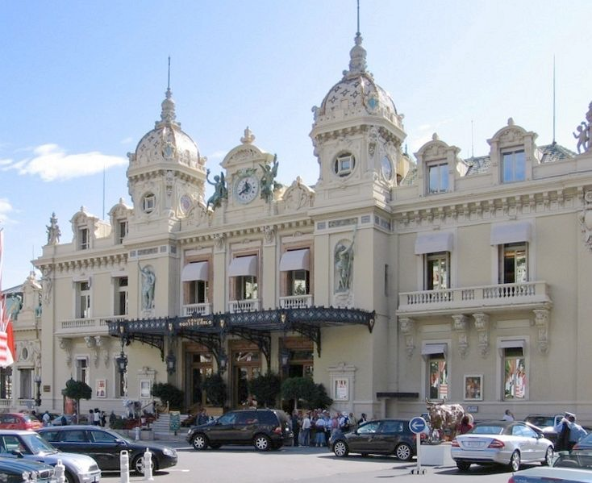{width="70%" fig-alt="Photograph of the Casino de Monte-Carlo building exterior in Monaco, an ornate Belle Epoque facade with towers, with cars and pedestrians in front."}

- Casino Monte Carlo

---

## Probabilistic methods

- original version: Haade;vectorization: Wjh31, Quibik, CC BY-SA 3.0 <https://creativecommons.org/licenses/by-sa/3.0>, via Wikimedia Commons

- What computational issues can come up with random numbers?
  - Well, computers are, by very nature, NOT random!
  - So we need to make them LOOK random
  - The question is, how random is “random enough”?
- If you want something truly random, you’ll need to hook your computer up to a Geiger counter or something, and count decays (say, from atmospheric muons)
- Sounds silly, but people actually do this!

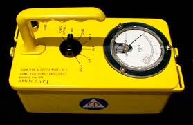{width="70%" fig-alt="Photograph of a yellow handheld Geiger counter / radiation survey meter with an analog dial gauge."}

- Geiger counter

---

## Probabilistic methods

- original version: Haade;vectorization: Wjh31, Quibik, CC BY-SA 3.0 <https://creativecommons.org/licenses/by-sa/3.0>, via Wikimedia Commons

- Chapter 7 in Numerical Recipes deals with generating random numbers
  - Called “deviates”
- How to formalize random number generation (RNG)?
- Given a set $S={{x}_{1},{x}_{2},...,{x}_{N}}$ of $N$ uniformly distributed random numbers, then they must satisfy:
  - Given $k$ generated numbers, the next number ${x}_{k+1}$must be independent and uncorrelated.
  - ${x}_{k+1}$ should be equally likely to be a member of $S$
- For the example of an unbiased coin toss, S has 1 or 0 (heads or tails)
- Each toss is independent of the previous and so a priori equally likely to be 1 or 0

---

## Generating random numbers

- original version: Haade;vectorization: Wjh31, Quibik, CC BY-SA 3.0 <https://creativecommons.org/licenses/by-sa/3.0>, via Wikimedia Commons

- Why do computers have trouble here?
- Well, computers are inherently deterministic at the present time (that’s why they’re so great to use!)
- So instead, we generate pseudorandom numbers:
  - The statistical properties (i.e. equally likely in some region of interest) are "good enough,"
  - But! "Good enough" depends on the situation
- Simple example: linear congruential algorithms of the type:
- This generates a sequence of random integers in the set {0,1,...,m-1}

- $${x}_{k+1}=(a{x}_{n}+c)modm$$

- multiplier

- increment

- modulus

---

## Generating random numbers

- original version: Haade;vectorization: Wjh31, Quibik, CC BY-SA 3.0 <https://creativecommons.org/licenses/by-sa/3.0>, via Wikimedia Commons

- We initialize this with some "seed", ${x}_{0}$, and away goes the sequence
- We typically choose $a$, $c$, and $m$ to be large(ish) relatively prime numbers
  - On the other hand, poorly chosen $a/c/m$ will result in repetition: not random!
  - If ${x}_{k}={x}_{0}$ for some $k$, then the sequence starts to repeat.

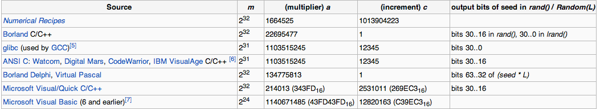{width="70%" fig-alt="Wikipedia table listing common linear congruential generator parameters by source/compiler (Numerical Recipes, Borland, glibc, ANSI C, Microsoft, etc.), with columns for modulus m, multiplier a, increment c, and which output bits are used as the seed."}

---

## Better RNGs

- original version: Haade;vectorization: Wjh31, Quibik, CC BY-SA 3.0 <https://creativecommons.org/licenses/by-sa/3.0>, via Wikimedia Commons

- There are several industrial-strength generators on the market
- But, if you need “really really” random numbers, use with care!
  - C++11, R, Python, Ruby, IDL, Maple, Matlab, GNU MPAL, BOOST, Glib, and NAG
- Example: Mersenne twister ([http://en.wikipedia.org/wiki/Mersenne_twister](http://en.wikipedia.org/wiki/Mersenne_twister))
  - Long period of ${2}^{19937}-1$
  - Passes lots of randomness tests
  - NOT suitable for cryptography! Observing a certain number of iterations will allow you to predict the rest of the sequence.
- Example: Xorshift ([http://en.wikipedia.org/wiki/Xorshift](http://en.wikipedia.org/wiki/Xorshift)), recommended by Numerical Recipes
  - Period of ${2}^{128}-1$
- Example: [PCG64](https://www.pcg-random.org/)
  - Great marketing ;)

---

## True RNGs

- original version: Haade;vectorization: Wjh31, Quibik, CC BY-SA 3.0 <https://creativecommons.org/licenses/by-sa/3.0>, via Wikimedia Commons

- Example: the “sparky” trigger
- In particle physics, we throw away almost all of our data
  - Only 1 in ${10}^{5}$ events is even “remotely” interesting
  - The really interesting stuff (Higgs bosons etc.) happen only 1 in ${10}^{16}$ events!
- Given this, we have to often need “REALLY” random numbers
- So: "we" set up a spark chamber to actually generate random numbers so our triggers could perform adequate tests!

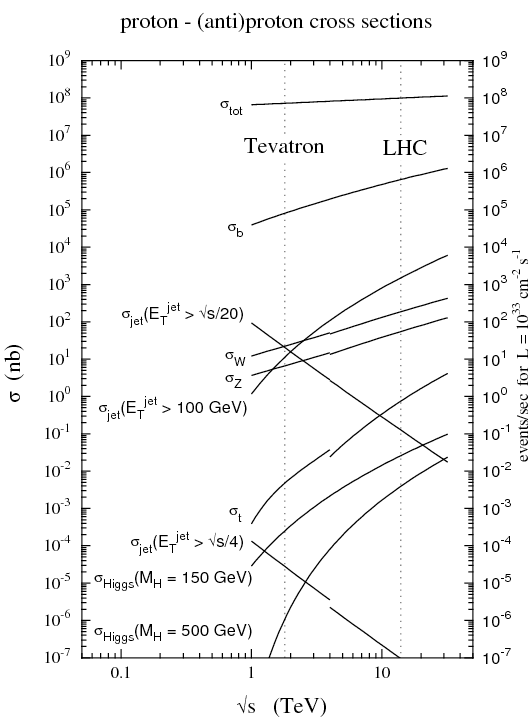{width="70%" fig-alt="Log-log plot titled 'proton - (anti)proton cross sections': cross section sigma (nb) versus collision energy sqrt(s) (TeV), with multiple curves (sigma_tot, sigma_b, sigma_jet at various thresholds, sigma_W, sigma_Z, sigma_t, sigma_Higgs) and vertical reference lines marking the Tevatron and LHC energies; right axis shows events/sec for a reference luminosity."}

- Proton-(anti)proton cross sections vs. collision energy

---

## True RNGs

<!-- TODO: complex slide layout (flagged by detect_complex_slide.py - see run log). Content below is complete but UNARRANGED - needs manual layout to match the original slide. -->

- original version: Haade;vectorization: Wjh31, Quibik, CC BY-SA 3.0 <https://creativecommons.org/licenses/by-sa/3.0>, via Wikimedia Commons

- [https://blog.cloudflare.com/randomness-101-lavarand-in-production/](https://blog.cloudflare.com/randomness-101-lavarand-in-production/)

- [https://blog.cloudflare.com/harnessing-office-chaos/](https://blog.cloudflare.com/harnessing-office-chaos/)

{fig-alt="Photograph of a wall of dozens of colorful lit lava lamps in a lobby, with a 'CLOUDFLARE' sign below - Cloudflare's LavaRand true-random-number-generator installation."}

- True random number generation using lava lamps

---

## True RNGs

<!-- TODO: complex slide layout (flagged by detect_complex_slide.py - see run log). Content below is complete but UNARRANGED - needs manual layout to match the original slide. -->

- original version: Haade;vectorization: Wjh31, Quibik, CC BY-SA 3.0 <https://creativecommons.org/licenses/by-sa/3.0>, via Wikimedia Commons

{fig-alt="Photograph of a wall of dozens of colorful lit lava lamps in a lobby, with a 'CLOUDFLARE' sign below - Cloudflare's LavaRand true-random-number-generator installation."}

- True random number generation using lava lamps
- [https://blog.cloudflare.com/randomness-101-lavarand-in-production/](https://blog.cloudflare.com/randomness-101-lavarand-in-production/)

- [https://blog.cloudflare.com/harnessing-office-chaos/](https://blog.cloudflare.com/harnessing-office-chaos/)

{fig-alt="Photograph of an art installation of many chaotic double-pendulum devices (black rods with orange crossbars) mounted on a wall, used as a physical source of randomness."}

- True random number generation using multiple pendulums
{fig-alt="Photograph of a colorful hanging mobile/chandelier made of many small acrylic discs in different colors dangling from the ceiling, above a wall with a 'CLOUDFLARE' logo - another physical randomness source alongside the lava lamps and pendulums."}

- True random number generation using mobiles

---

## RNG quality metrics

- original version: Haade;vectorization: Wjh31, Quibik, CC BY-SA 3.0 <https://creativecommons.org/licenses/by-sa/3.0>, via Wikimedia Commons

- Some desired properties of RNGs:
  - The period of the generator should be much larger than the length of the generated sequence
    - Not just $>$, we want $ \gg $!
  - A simple “eyeball test” (e.g. plotting $({x}_{k},{x}_{k+1})$ as $(x,y)$ pairs) should reveal no structure
  - The ${ \chi }^{2}$ statistic should satisfy ${ \chi }^{2}/$d.o.f$ \approx 1$.

---

## Simulations

- original version: Haade;vectorization: Wjh31, Quibik, CC BY-SA 3.0 <https://creativecommons.org/licenses/by-sa/3.0>, via Wikimedia Commons

- Randomness is often required for simulations
  - Lots of things are random in nature
  - We often know the distribution, but cannot predict single events.
- Silly example: stand a pencil on its end. What is the angle when it falls?

- Less trivial example: what is the final angle of a particle after multiple scatterings off of a lattice?

{width="70%" fig-alt="Simple clip-art icon of a yellow pencil with a pink eraser, pointing diagonally with a shadow beneath it."}

- A falling pencil
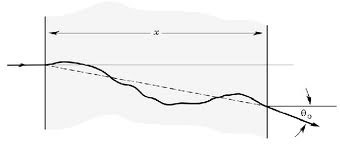{width="70%" fig-alt="Diagram of a 1D random walk: a wiggly solid line meandering within a shaded horizontal band of width x, with a dashed straight-line reference and an angle theta_0 marked at the right end."}

- Trajectory of a particle passing through material with multiple scatterings

---

## Simulations

- original version: Haade;vectorization: Wjh31, Quibik, CC BY-SA 3.0 <https://creativecommons.org/licenses/by-sa/3.0>, via Wikimedia Commons

- Example: quantum mechanically, the LHC produces Higgs bosons in several ways.

- We can't even ask (quantum mechanically) which will occur before it happens.
- They all have a likelihood (cross section), and the outcome is truly random
- So, to simulate Higgs boson production, we have to randomly sample between these four (with appropriate weights)

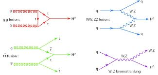{width="70%" fig-alt="Four Feynman-diagram panels illustrating Higgs production channels: gg fusion (top left, gluon loop producing H0), WW/ZZ fusion (top right), ttbar fusion (bottom left), and W/Z bremsstrahlung (bottom right), each showing incoming quarks/gluons producing an H0."}

- 4 ways to make a Higgs boson

---

## Probabilistic methods

- original version: Haade;vectorization: Wjh31, Quibik, CC BY-SA 3.0 <https://creativecommons.org/licenses/by-sa/3.0>, via Wikimedia Commons

- Probabilistic computing methods are often called "Monte Carlo," after the Casino Monte Carlo in Monaco
  - (This is a much better name than "pseudo-random-number probabilistic event simulator")

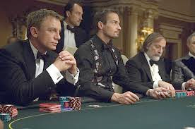{width="70%" fig-alt="Film still from a poker scene (Casino Royale): several men in tuxedos seated at a card table with poker chips, one holding cards."}

- James Bond gambling

---

## Probabilistic methods

- original version: Haade;vectorization: Wjh31, Quibik, CC BY-SA 3.0 <https://creativecommons.org/licenses/by-sa/3.0>, via Wikimedia Commons

- Why do we need a good way to simulate randomness?
- Suppose you have a system of 100 electrons, each in either spin $ \uparrow $ or spin $ \downarrow $.
- The total number of states is ${2}^{100} \approx 1.27 \times {10}^{30}$.
- Listing them all (or looping through them all) is totally intractable.
  - At ${10}^{9}$/second, this would take $4 \times {10}^{13}$ years!
- Better idea: choose one randomly (or a few, or even many, but not all).
  - So all we need is a good RNG!
  - And an algorithm to convert the random number(s) into a state.

---

## Markov Chain Monte Carlo (MCMC)

- original version: Haade;vectorization: Wjh31, Quibik, CC BY-SA 3.0 <https://creativecommons.org/licenses/by-sa/3.0>, via Wikimedia Commons

- Markov chain Monte Carlo: technique used to draw samples from a given distribution.
  - Draw a sequence of elements chosen from a fixed set using a probabilistic rule.
  - Chain is constructed by adding the elements sequentially
  - Given the most recently added element, next element only depends on most recent addition
- Formally, suppose $x$ and $y$ are members of a set, $S$.
- The transition probability function is:
- Example : Random walks

- $T(x \rightarrow y)$, where $\mathop{ \sum }\limits_{y}T(x \rightarrow y)=1$

---

## Random walks

- original version: Haade;vectorization: Wjh31, Quibik, CC BY-SA 3.0 <https://creativecommons.org/licenses/by-sa/3.0>, via Wikimedia Commons

- Random walks are a simple example of MCMC.
- Problem statement:
  - Suppose a walker can occupy any site on an infinite-sized lattice (let's say 1D for simplicity).
  - At each step $i$, the walker flips a coin: head=1 step left, tails=1 step right.
  - The corresponding transition probability is:

- $$T(x \rightarrow y)=\left\{\begin{matrix}
\frac{1}{2} & \text{if}y=x-1 \\
\frac{1}{2} & \text{if}y=x+1 \\
0 & \text{otherwise}
\end{matrix}\right.$$

- To study the statistical properties of random walks, we could take the lattice to be periodic (a circle) with $L$ points, and take $L \rightarrow  \infty $.
  - For example, $P(x)=\frac{1}{L}$: the walker visits each site the same number of times, on average.

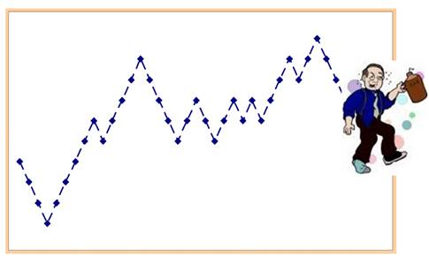{width="70%" fig-alt="Plot of a 1D random walk (dashed zigzag line with diamond markers) rising and falling over ~20 steps, with a cartoon of a stumbling, drink-holding man walking beside the endpoint - illustrating the 'drunkard's walk'."}

- Random walk

---

## Random walks

- original version: Haade;vectorization: Wjh31, Quibik, CC BY-SA 3.0 <https://creativecommons.org/licenses/by-sa/3.0>, via Wikimedia Commons

- The walker's position after $n$ steps depends on the sequence of tosses in the past, and cannot be predicted.
- We can write down a given random walk sequence as ${{s}_{i}{}}_{i=1,2,...}$, where each ${s}_{i}= \pm 1$.
- Then, the position at time $n$ is ${x}_{n}=\mathop{\mathop{ \sum }\limits_{i=1}}\limits^{n}{s}_{i}$.
- Random walks have a lot of interesting properties (that change a lot depending on the number of dimension):
  - The average position over all possible random walks, i.e., the expectation value, is zero: $⟨{x}_{n}⟩=0$: left and right steps are equally likely.
  - However, the average ${x}_{n}^{2}$ is nonzero, and does increase with time!

- $$⟨{x}_{n}^{2}⟩=⟨\mathop{\mathop{ \sum }\limits_{i,j=1}}\limits^{n}{s}_{i}{s}_{j}⟩=⟨\mathop{\mathop{ \sum }\limits_{i=1}}\limits^{n}{s}_{i}^{2}⟩+⟨\mathop{\mathop{ \sum }\limits_{i=1}}\limits^{n}\mathop{\mathop{ \sum }\limits_{j=1,j \neq i}}\limits^{n}{s}_{i}{s}_{j}⟩=n$$

- (Diffusion!)

---

## Random walks

- original version: Haade;vectorization: Wjh31, Quibik, CC BY-SA 3.0 <https://creativecommons.org/licenses/by-sa/3.0>, via Wikimedia Commons

- So, the RMS displacement is $\sqrt{⟨{x}_{n}^{2}⟩}=\sqrt{n}$.
- This is basically diffusion, where the diffusion constant is $⟨{x}_{n}^{2}⟩=2Dn$, so $D=\frac{1}{2}$.
- In higher dimensions, random walks have all sorts of interesting properties ([https://en.wikipedia.org/wiki/Random_walk](https://en.wikipedia.org/wiki/Random_walk))
  - E.g. probability of returning to the origin:
  - "A drunk man will find his way home, but a drunk bird may get lost forever" (S. Kakutani)

- $$⟨{x}_{n}^{2}⟩=⟨\mathop{\mathop{ \sum }\limits_{i,j=1}}\limits^{n}{s}_{i}{s}_{j}⟩=⟨\mathop{\mathop{ \sum }\limits_{i=1}}\limits^{n}{s}_{i}^{2}⟩+⟨\mathop{\mathop{ \sum }\limits_{i=1}}\limits^{n}\mathop{\mathop{ \sum }\limits_{j=1,j \neq i}}\limits^{n}{s}_{i}{s}_{j}⟩=n$$

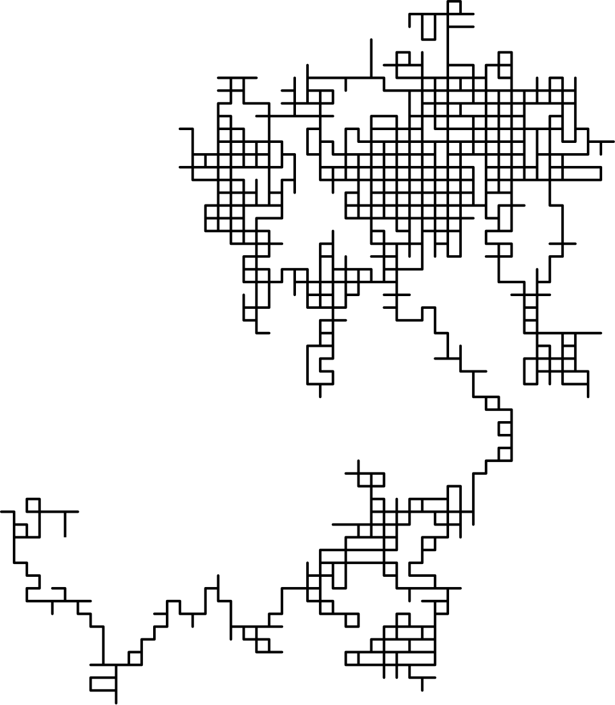{width="70%" fig-alt="A 2D random walk traced as a path of horizontal and vertical line segments forming a dense, maze-like branching pattern across the frame."}

- Random walk in 2D
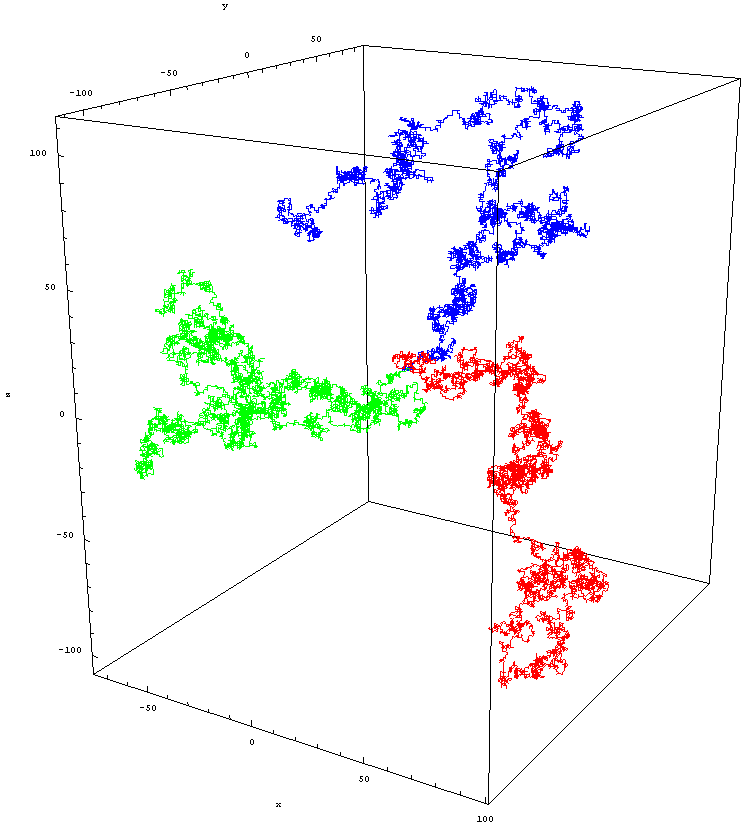{width="70%" fig-alt="3D plot of three random walks (blue, green, and red paths) shown inside a labeled x/y/z axis box, each wandering irregularly through space."}

- Random walk in 3D

---

## MC integration

- original version: Haade;vectorization: Wjh31, Quibik, CC BY-SA 3.0 <https://creativecommons.org/licenses/by-sa/3.0>, via Wikimedia Commons

- Monte Carlo is also very useful for integrating arbitrary functions, especially in higher dimensions.
- 2D example: integration by "throwing darts"
  - Say you want to find the area of a dartboard of diameter $L$.
  - Let's say we can throw darts totally randomly at the "wall," a $L \times L$ square.
  - The fraction of darts that hit the dart board gives the ratio $A(\text{dartboard})/{L}^{2}$.
- Or, from a different point of view, we can use this method to determine $ \pi $.

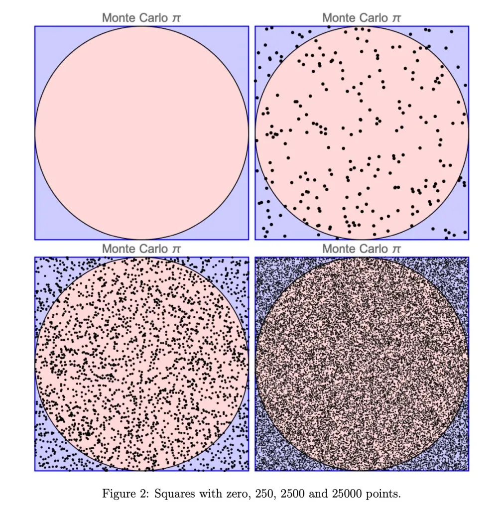{width="70%" fig-alt="Figure 2, 'Squares with zero, 250, 2500 and 25000 points': four panels, each a square containing an inscribed circle, with an increasing number of random dots scattered across the square (used to estimate pi via Monte Carlo)."}

- Integration by darts, aka Monte Carlo integration
- [https://thatsmaths.com/2020/05/28/the-monte-carlo-method/](https://thatsmaths.com/2020/05/28/the-monte-carlo-method/)

---

## MC integration

- original version: Haade;vectorization: Wjh31, Quibik, CC BY-SA 3.0 <https://creativecommons.org/licenses/by-sa/3.0>, via Wikimedia Commons

- In $N$ dimensions, the basic idea is to sprinkle the volume of interest with a "dust" of points with a uniform distribution
  - (Or, more advanced case, a known biased distribution)
- The integral is the fraction of points "below the curve" (or "within the surface" in higher dimensions).

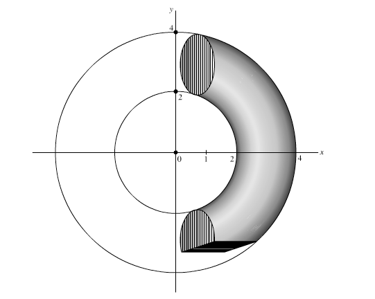{width="70%" fig-alt="3D diagram showing a torus (donut shape) being swept out between two concentric circles (radii 1 and 2, up to 4) in the xy-plane, with a shaded cross-sectional disk - illustrating volume-of-revolution integration."}

- Monte Carlo integration of a torus in 3D
- $f(x)=1$ if inside, $0$ if outside

---

## MC integration

- original version: Haade;vectorization: Wjh31, Quibik, CC BY-SA 3.0 <https://creativecommons.org/licenses/by-sa/3.0>, via Wikimedia Commons

- Formally, the integral is: $I={ \int }_{V}{d}^{d}\mathbf{x}f(\mathbf{x})$.
- Choose $N$ points inside $V$ (uniformly distributed).
- The integral is approximated by:

- $$I \approx \frac{V}{N}\mathop{\mathop{ \sum }\limits_{i=0}}\limits^{N-1}f({\mathbf{x}}_{i})$$

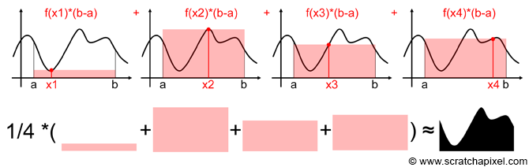{width="70%" fig-alt="Diagram illustrating Monte Carlo integration: four panels each showing a sample point x_i under a curve with the rectangle f(x_i)*(b-a), and below, these rectangles combined and averaged (1/4 times their sum) to approximate the area under the full curve."}

- Cartoon of MC integration, from [https://www.scratchapixel.com/lessons/mathematics-physics-for-computer-graphics/monte-carlo-methods-in-practice/monte-carlo-integration.html](https://www.scratchapixel.com/lessons/mathematics-physics-for-computer-graphics/monte-carlo-methods-in-practice/monte-carlo-integration.html)

---

## MC integration

- original version: Haade;vectorization: Wjh31, Quibik, CC BY-SA 3.0 <https://creativecommons.org/licenses/by-sa/3.0>, via Wikimedia Commons

- $$I \approx \frac{V}{N}\mathop{\mathop{ \sum }\limits_{i=0}}\limits^{N-1}f({\mathbf{x}}_{i})$$

- How good is the approximation?
  - Consider repeating $M$ times:
  - Compute standard deviation:

- $${I}_{m}=\frac{V}{N}\mathop{\mathop{ \sum }\limits_{n=0}}\limits^{N-1}f({\mathbf{x}}_{n,m})$$

- $${ \sigma }_{I}=\sqrt{\frac{1}{M}\mathop{\mathop{ \sum }\limits_{m=0}}\limits^{M-1}{I}_{m}^{2}-{\left( \frac{1}{M}\mathop{\mathop{ \sum }\limits_{m=0}}\limits^{M-1}{I}_{m} \right)}^{2}}=\sqrt{\frac{1}{M}\mathop{\mathop{ \sum }\limits_{m=0}}\limits^{M-1}{\left( {I}_{m}-\frac{1}{M}\mathop{\mathop{ \sum }\limits_{{m}^{′}=0}}\limits^{M-1}{I}_{{m}^{′}} \right)}^{2}}$$

---

## MC integration

- original version: Haade;vectorization: Wjh31, Quibik, CC BY-SA 3.0 <https://creativecommons.org/licenses/by-sa/3.0>, via Wikimedia Commons

- If the points ${\mathbf{x}}_{n,m}$ are independent and randomly distributed, then we have:

- ${ \sigma }_{I}^{2}=\frac{{V}^{2}}{N}{ \sigma }_{f}$,

- Where ${ \sigma }_{f}$ is the standard deviation of $f(\mathbf{x})$, given by:

- $${ \sigma }_{f}^{2}=⟨{f}^{2}⟩-(⟨f⟩{)}^{2}=\frac{1}{MN}\mathop{\mathop{ \sum }\limits_{m=0}}\limits^{M-1}\mathop{\mathop{ \sum }\limits_{n=0}}\limits^{N-1}f({\mathbf{x}}_{n,m}{)}^{2}-{\left( \frac{1}{MN}\mathop{\mathop{ \sum }\limits_{m=0}}\limits^{M-1}\mathop{\mathop{ \sum }\limits_{n=0}}\limits^{N-1}f({\mathbf{x}}_{n,m}) \right)}^{2}$$

- Thus, the result of MC integration, including uncertainties, is:

- $$I={ \int }_{V}{d}^{d}\mathbf{x}f(\mathbf{x}) \approx V\left[ \frac{1}{N}\mathop{\mathop{ \sum }\limits_{n=0}}\limits^{N-1}f({\mathbf{x}}_{n}) \pm \frac{{ \sigma }_{f}}{\sqrt{N}} \right]$$

---

## Performance

- original version: Haade;vectorization: Wjh31, Quibik, CC BY-SA 3.0 <https://creativecommons.org/licenses/by-sa/3.0>, via Wikimedia Commons

- We covered several integration methods last semester (midpoint, trapezoid, ...)
  - Recall that the "figure of merit" is the accuracy for a given step size, $h=L/N$
  - Taking the formula from Numerical Recipes, MC integration is better when:

- $$\frac{{ \sigma }_{f}}{\sqrt{N}}<\frac{\overline{{f}^{′′}}}{{N}^{\frac{2}{D}}}$$

- The result depends a bit on $f$ itself, but roughly, MC integration wins when $D>4$

---

## Non-uniform sampling

<!-- TODO: complex slide layout (flagged by detect_complex_slide.py - see run log). Content below is complete but UNARRANGED - needs manual layout to match the original slide. -->

- original version: Haade;vectorization: Wjh31, Quibik, CC BY-SA 3.0 <https://creativecommons.org/licenses/by-sa/3.0>, via Wikimedia Commons

- What if your function looks like this?

- Or this?

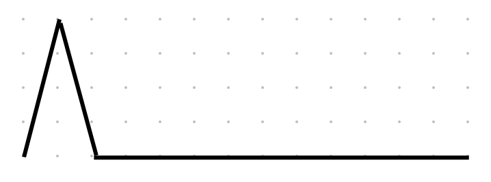{fig-alt="Simple sketch of a sharp asymmetric triangular spike followed by a flat baseline, plotted over a faint dot grid."}

- A nonuniform function
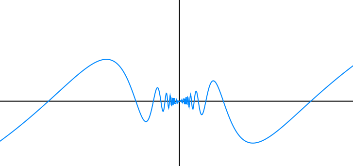{fig-alt="Plot of a smooth blue curve that oscillates slowly at the edges but oscillates very rapidly (many closely-spaced wiggles) near the center - a function that is hard to sample accurately with uniform random points."}

- Another nonuniform function
- Uniform sampling is not optimal here! We want to sample the "interesting" parts more than the "boring" parts.

---

## Non-uniform sampling

<!-- TODO: complex slide layout (flagged by detect_complex_slide.py - see run log). Content below is complete but UNARRANGED - needs manual layout to match the original slide. -->

- original version: Haade;vectorization: Wjh31, Quibik, CC BY-SA 3.0 <https://creativecommons.org/licenses/by-sa/3.0>, via Wikimedia Commons

- Relatively straightforward to change the sampling of ${\mathbf{x}}_{n}$ to another distribution.
  - Gaussian distribution, exponential distribution, line segment, ...
- Starting from a uniformly distributed "deviate", change variables to another distribution. Recall how changes of variables work with probability distributions:

- $$P(y)=P(x)\left| \frac{dx}{dy} \right|$$

- $$ \int dyP(y)= \int dxP(x)=1$$

- Then, use $1/P(y)$ as a "weight" for each point in the MC integration process.

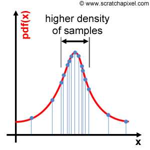{fig-alt="Plot of a probability density function pdf(x) (red bell-like curve) with sample points marked as blue dots connected by vertical blue lines, annotated 'higher density of samples' where the curve peaks - illustrating importance sampling."}

- Example of biased sampling

---

## Non-uniform sampling

- original version: Haade;vectorization: Wjh31, Quibik, CC BY-SA 3.0 <https://creativecommons.org/licenses/by-sa/3.0>, via Wikimedia Commons

- Simple example: suppose we want to sample some interval $(a,b)$.
  - Start from a uniformly distributed $x$, in $(0,1)$ (which is probably what the RNG produces)
  - Change variables via: $y(x)=a+(b-a)x$, $\left| \frac{dx}{dy} \right|=\frac{1}{|b-a|}$.

- $$P(x)=\left\{\begin{matrix}
1 & \text{for}0<x<1 \\
0 & \text{otherwise}
\end{matrix}\right.$$

- $$P(y)=\left\{\begin{matrix}
\frac{1}{|b-a|} & \text{for}a<y<b \\
0 & \text{otherwise}
\end{matrix}\right.$$

- And we're pretty much done!

---

## Non-uniform sampling

- original version: Haade;vectorization: Wjh31, Quibik, CC BY-SA 3.0 <https://creativecommons.org/licenses/by-sa/3.0>, via Wikimedia Commons

- Exponential distribution:

- $$P(x)=\left\{\begin{matrix}
1 & \text{for}0<x<1 \\
0 & \text{otherwise}
\end{matrix}\right.$$

- $$P(y)=\left\{\begin{matrix}
{e}^{-y/ \lambda }/ \lambda  & \text{for}0<y< \infty  \\
0 & \text{otherwise}
\end{matrix}\right.$$

- Working backwards, define  $y(x)=- \lambda log(x)$:

- $$P(y)=\frac{1}{ \lambda }{e}^{-y/ \lambda },0<y< \infty $$

- $$\left| \frac{dx}{dy} \right|=\frac{x}{ \lambda }=\frac{{e}^{-y/ \lambda }}{ \lambda }=P(y)$$

---

## Non-uniform sampling

- original version: Haade;vectorization: Wjh31, Quibik, CC BY-SA 3.0 <https://creativecommons.org/licenses/by-sa/3.0>, via Wikimedia Commons

- Gaussian distribution:

- $$\begin{matrix}
 \int dx \int dyP(x)P(y) & =\frac{1}{2 \pi { \sigma }^{2}} \int dx \int dy{e}^{-[(x- \mu {)}^{2}+(y- \mu {)}^{2}]/(2{ \sigma }^{2})} \\
 & ={ \int }_{0}^{2 \pi }\frac{d \theta }{2 \pi }{ \int }_{0}^{ \infty }\frac{d{r}^{2}}{2{ \sigma }^{2}}{e}^{-{r}^{2}/(2{ \sigma }^{2})}
\end{matrix}$$

- This is a bit trickier, as elementary functions don't work. Instead remember the trick from calculus for integrating a Gaussian: consider the square (product of 2 Gaussians), and convert to polar coordinates:

- $$P(x)=\frac{1}{\sqrt{2 \pi { \sigma }^{2}}}{e}^{-(x- \mu {)}^{2}/(2{ \sigma }^{2})}$$

- where $x- \mu =rcos \theta ,y- \mu =rsin \theta $

---

## Non-uniform sampling

- original version: Haade;vectorization: Wjh31, Quibik, CC BY-SA 3.0 <https://creativecommons.org/licenses/by-sa/3.0>, via Wikimedia Commons

- This is the product of a uniformly distributed $ \theta  \in [0,2 \pi ]$ and an exponentially distributed ${r}^{2} \in [0, \infty ]$.
- So, we can generate $ \theta $ and $r$, and then convert to $(x,y)$:

- $$ \theta =2 \pi {r}_{1}$$

- $$r=\sqrt{-2{ \sigma }^{2}log{r}_{2}}$$

- This is the Box–Muller algorithm ([wikipedia](https://en.wikipedia.org/wiki/Box%E2%80%93Muller_transform)).

---

## Non-uniform sampling

- original version: Haade;vectorization: Wjh31, Quibik, CC BY-SA 3.0 <https://creativecommons.org/licenses/by-sa/3.0>, via Wikimedia Commons

- General version of transformation algorithm:

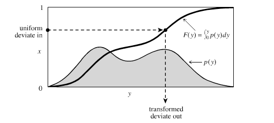{width="70%" fig-alt="Diagram illustrating inverse transform sampling: the cumulative distribution function F(y) = integral of p(y)dy (bold curve, rising from 0 to 1) with the underlying probability density p(y) (shaded gray curve) below it; a uniform random deviate on the vertical axis maps via F(y) to a transformed deviate on the horizontal y axis."}

- Schematic of transforming a uniform deviate to an arbitrary distribution, from Numerical Recipes
- The thick line is the cumulative distribution function (CDF) of $p(y)$, $F(y)$.
- Starting from a uniformly distributed $x \in [0,1]$, $y$ is given by where the CDF equals $x$.
- This works even if you only know $F(y)$ numerically.

---

## Recap

- original version: Haade;vectorization: Wjh31, Quibik, CC BY-SA 3.0 <https://creativecommons.org/licenses/by-sa/3.0>, via Wikimedia Commons

- Introduced probabilistic methods, aka Monte Carlo methods, which are used extensively in computation physics, e.g. for simulation, integration, and several other applications.
  - Particularly useful for dealing with problems of prohibitively large dimensionality.
- Random number generators
- Markov Chain MC: technique for generating sequences of elements from distributions, e.g., random walks
- MC-based integration methods.
- Next time:
  - Metropolis–Hastings algorithm
  - Application to "hard disk gas"
  - Ising model

---

## Hands-on

- original version: Haade;vectorization: Wjh31, Quibik, CC BY-SA 3.0 <https://creativecommons.org/licenses/by-sa/3.0>, via Wikimedia Commons

- Back to the CompPhys repository (hopefully everyone remembers how to launch the Jupyter server!)
  - CompPhys/RandomNumbers/...
    - random_test.ipynb
    - random_walkers.ipynb
    - quadrature.ipynb

---

# Metropolis–hastings algorithm

---

## Metropolis–Hastings algorithm

- original version: Haade;vectorization: Wjh31, Quibik, CC BY-SA 3.0 <https://creativecommons.org/licenses/by-sa/3.0>, via Wikimedia Commons

- To generate a sequence from an arbitrary distribution, the Metropolis–Hastings algorithm works well
  - [http://en.wikipedia.org/wiki/Metropolis–Hastings_algorithm](http://en.wikipedia.org/wiki/Metropolis%E2%80%93Hastings_algorithm)
  - A type of Markov Chain MC algorithm
- Major advantage: it does not require the overall normalization of a distribution!
  - Normalization might be difficult or impossible to obtain (e.g. enumerating all microstates of some complex system!)
  - Advantageous when using Bayesian statistics
- Original papers are from Metropolis et al and Hastings :
  - J. Chem. Phys. 21, 1087 (1953)
  - Biometrika 57, 97 (1970)

---

## Metropolis–Hastings algorithm

- original version: Haade;vectorization: Wjh31, Quibik, CC BY-SA 3.0 <https://creativecommons.org/licenses/by-sa/3.0>, via Wikimedia Commons

- The Metropolis–Hastings algorithm is a method to draw samples from a distribution using MCMC.
  - Recall MCMC: next step (${x}_{n+1}$) depends only on the current step (${x}_{n}$).
- This is a type of random walk, similar to other MCMC methods

{width="70%" fig-alt="Photograph of a green mountain landscape with snow-capped peaks, a lush valley, and blue sky with scattered clouds."}

- A mountain
- Schematically, suppose we want to generate a sequence from a probability distribution, $P(x)$.
- If we visualize this in 2D ($P(x)$=z direction), then $P(x)$ is a mountainous terrain, and the sequence is the steps of a hiker.

---

## Metropolis–Hastings algorithm

- original version: Haade;vectorization: Wjh31, Quibik, CC BY-SA 3.0 <https://creativecommons.org/licenses/by-sa/3.0>, via Wikimedia Commons

- Heuristically :
  - Explore the “terrain” a bit, find peaks, valleys
  - Generate the steps for the MC application
  - Record steps every so often
- As more and more sample values are produced, the distribution more closely approximates the desired distribution, $P(x)$.

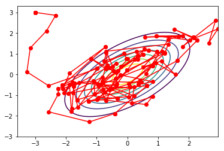{width="70%" fig-alt="Scatter plot of red data points connected by red lines, overlaid with several concentric blue elliptical contours - illustrating a Markov-chain Monte Carlo sample path exploring a 2D target distribution."}

- Example of a Metropolis–Hastings random walk, from [https://relguzman.blogspot.com/2018/04/sampling-metropolis-hastings.html](https://relguzman.blogspot.com/2018/04/sampling-metropolis-hastings.html)

---

## Metropolis–Hastings algorithm

- original version: Haade;vectorization: Wjh31, Quibik, CC BY-SA 3.0 <https://creativecommons.org/licenses/by-sa/3.0>, via Wikimedia Commons

- The algorithm:
  - Start with random walker at point $\mathbf{x}$. Goal: calculate the next point, $\mathbf{y}$.
  - Choose a random trial point in the neighborhood: ${\mathbf{y}}^{*}$
    - Simplest choice: uniformly sample from an interval of half-width $ \delta $ around $\mathbf{x}$ (i.e. a sphere in N dimensions).
    - Can also use a Gaussian, or anything you want.
  - Accept or reject the trial point based on the following:
    - Calculate ratio $R=P({\mathbf{y}}^{*})/P(\mathbf{x})$
    - If $R>1$, accept the point: $\mathbf{y}={\mathbf{y}}^{*}$.
    - If $R<1$, generate a uniform random $ \alpha  \in [0,1]$, and accept only if $R> \alpha $:

- $$\mathbf{y}=\left\{\begin{matrix}
{\mathbf{y}}^{*} & R> \alpha  \\
\mathbf{x} & R< \alpha 
\end{matrix}\right.$$

    - (Intuition: we want the walker to spend more time where $P(\mathbf{x})$ is large. In a moment, we will justify this quantitatively.)

---

## Metropolis–Hastings algorithm

<!-- TODO: complex slide layout (flagged by detect_complex_slide.py - see run log). Content below is complete but UNARRANGED - needs manual layout to match the original slide. -->

- original version: Haade;vectorization: Wjh31, Quibik, CC BY-SA 3.0 <https://creativecommons.org/licenses/by-sa/3.0>, via Wikimedia Commons

- A few useful modifications of the basic algorithm:
  - We can run the algorithm for a few steps before recording points ("thermalization" to find peaks).
  - Once we start recording, we can save only once every $ \nu $ iterations.
    - If walker’s step size is much smaller than typical distances between “peaks” in the terrain
    - To emulate a “truly” random sequence, we don’t want to get “stuck” between peaks; reduce autocorrelation (consecutive points in M–H are nearby each other, which is not really what we want in a random sample).

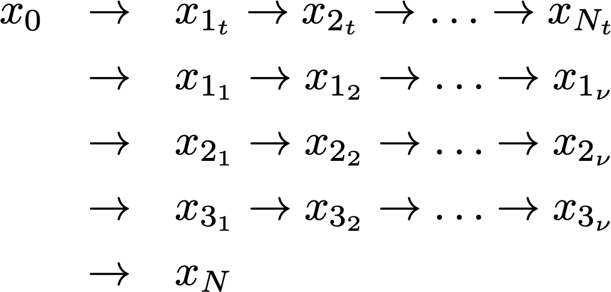{fig-alt="Diagram of a Markov chain / Metropolis subchain structure: a starting point x0 leads to a top chain x1_t through x_Nt, with additional branches x1_1...x1_nu, x2_1...x2_nu, x3_1...x3_nu, all eventually leading to a final state x_N."}

- Example of sparse recording to reduce autocorrelation
- Only save these points

---

## Metropolis–Hastings algorithm

- original version: Haade;vectorization: Wjh31, Quibik, CC BY-SA 3.0 <https://creativecommons.org/licenses/by-sa/3.0>, via Wikimedia Commons

- Why does this work? We need a few formal definitions:
  - $P(\mathbf{x})$ = probability distribution to sample (normalization not needed)
  - $T(\mathbf{x},\mathbf{y})$ = transition probability from $\mathbf{x}$ to $\mathbf{y}$ (defines the Markov chain)
  - $ \pi (\mathbf{x})$ = probability distribution of the walker (e.g. consider an ensemble of walkers, or the probability distribution after $N$ steps)
    - A step is then ${ \pi }^{′}(\mathbf{y})= \int T(\mathbf{x},\mathbf{y})d\mathbf{x}$
- $ \pi $ is invariant/stationary if $ \pi (\mathbf{y})= \int T(\mathbf{x},\mathbf{y}) \pi (\mathbf{x})d\mathbf{x}$: evolving the system through a step leaves it unchanged.
- Basic idea: we want $ \pi (\mathbf{x})$ to converge to a stationary distribution in the limit of many steps (i.e., $\mathop{lim}\limits_{N \rightarrow  \infty }{T}^{N}(\mathbf{x},\mathbf{y})$), and specifically to converge to $P(\mathbf{x})$
  - So our problem is to figure out the appropriate $T(\mathbf{x},\mathbf{y})$ that makes this happen.

---

## Metropolis–Hastings algorithm

- original version: Haade;vectorization: Wjh31, Quibik, CC BY-SA 3.0 <https://creativecommons.org/licenses/by-sa/3.0>, via Wikimedia Commons

- Markov chain theory gives us conditions for stationary distributions:
  - Existence: implied by "detailed balance"
  - Uniqueness: implied by ergodicity (chain is aperiodic and positive recurrent)
    - This is a theorem! We will not go into details on this.
- $ \pi $ obeys detailed balance if $ \pi (\mathbf{x})T(\mathbf{x},\mathbf{y})= \pi (\mathbf{y})T(\mathbf{y},\mathbf{x})$
  - Between any two points $\mathbf{x}$ and $\mathbf{y}$, the flow between the two is exactly balance.
  - Detailed balance implies stationary (but not conversely; for example, the walkers could be walking around a circle).

---

## Metropolis–Hastings algorithm

- original version: Haade;vectorization: Wjh31, Quibik, CC BY-SA 3.0 <https://creativecommons.org/licenses/by-sa/3.0>, via Wikimedia Commons

- Let $q(\mathbf{x},\mathbf{y})$ be the "trial step" generating distribution (e.g. a uniform interval around $\mathbf{x}$).
- Using $T=q$ probably does not satisfy detailed balance
  - Suppose $ \pi (\mathbf{x})q(\mathbf{x},\mathbf{y})> \pi (\mathbf{y})q(\mathbf{y},\mathbf{x})$; next step has more flow from $\mathbf{x}$ to $\mathbf{y}$ than vice versa.
- Let's try adjusting $q$ with accept/reject to try to satisfy d.b.:
- We can construct $ \alpha $ as follows:
  - Since $\mathbf{x} \rightarrow \mathbf{y}$ is happening too often, we should choose $ \alpha (\mathbf{y},\mathbf{x})=1$ (always accept $\mathbf{y} \rightarrow \mathbf{x}$ moves).
  - In the other direction:

- Detailed balance: $ \pi (\mathbf{x})T(\mathbf{x},\mathbf{y})= \pi (\mathbf{y})T(\mathbf{y},\mathbf{x})$

- $$T(\mathbf{x},\mathbf{y})=q(\mathbf{x},\mathbf{y}) \alpha (\mathbf{x},\mathbf{y})$$

- $$\begin{matrix}
 \pi (\mathbf{x})q(\mathbf{x},\mathbf{y}) \alpha (\mathbf{x},\mathbf{y}) & = \pi (\mathbf{y})q(\mathbf{y},\mathbf{x}) \alpha (\mathbf{y},\mathbf{x})= \pi (\mathbf{y})q(\mathbf{y},\mathbf{x}) \\
 \alpha (\mathbf{x},\mathbf{y}) & =\frac{ \pi (\mathbf{y})q(\mathbf{y},\mathbf{x})}{ \pi (\mathbf{x})q(\mathbf{x},\mathbf{y})}=\frac{P(\mathbf{y})}{P(\mathbf{x})}
\end{matrix}$$

- (Assuming $q(\mathbf{x},\mathbf{y})$ is symmetric, and substituting $ \pi  \rightarrow P$ for the desired stationary distribution)

  - So, the following $ \alpha $ function gives us detailed balance, with $ \pi (\mathbf{x})=P(\mathbf{x})$:

- $$ \alpha (\mathbf{x},\mathbf{y})=min\left( 1,\frac{P(\mathbf{y})q(\mathbf{y},\mathbf{x})}{P(\mathbf{x})q(\mathbf{x},\mathbf{y})} \right)=min\left( 1,\frac{P(\mathbf{y})}{P(\mathbf{x})} \right)$$

---

## Summary

- original version: Haade;vectorization: Wjh31, Quibik, CC BY-SA 3.0 <https://creativecommons.org/licenses/by-sa/3.0>, via Wikimedia Commons

- A few comments:
  - We chose a symmetric $q(\mathbf{x},\mathbf{y})$, but the expression above shows how to handle the asymmetric case (Hastings' contribution).
  - The transition function only depends on the ratio of probabilities! Hence, we never need the absolute normalization of $P(\mathbf{x})$.
- When using M–H, you have a few choices to make:
  - Number of walkers
  - Step size
  - "Thermalization" step
  - Sampling frequency (=how many steps to skip between recording points)
- Let's try it out: CompPhys/RandomNumbers/metropolis.ipynb

- $$ \alpha (\mathbf{x},\mathbf{y})=min\left( 1,\frac{P(\mathbf{y})q(\mathbf{y},\mathbf{x})}{P(\mathbf{x})q(\mathbf{x},\mathbf{y})} \right)=min\left( 1,\frac{P(\mathbf{y})}{P(\mathbf{x})} \right)$$

---

## Recap

- original version: Haade;vectorization: Wjh31, Quibik, CC BY-SA 3.0 <https://creativecommons.org/licenses/by-sa/3.0>, via Wikimedia Commons

- Besides the obvious application to simulating randomness, Monte Carlo methods are very useful for sampling distributions, especially in higher dimensionalities
  - MC integration
  - Sampling arbitrary distributions
- References:
  - [https://en.wikipedia.org/wiki/Metropolis%E2%80%93Hastings_algorithm](https://en.wikipedia.org/wiki/Metropolis%E2%80%93Hastings_algorithm)
  - [https://jblevins.org/notes/metropolis-hastings](https://jblevins.org/notes/metropolis-hastings)
  - [https://astro.pas.rochester.edu/~aquillen/phy256/lectures/metropolis.pdf](https://astro.pas.rochester.edu/~aquillen/phy256/lectures/metropolis.pdf)
- Up next: statistical mechanics.

---

# MC and statistical mechanics

---

## MC and statistical mechanics

- original version: Haade;vectorization: Wjh31, Quibik, CC BY-SA 3.0 <https://creativecommons.org/licenses/by-sa/3.0>, via Wikimedia Commons

- An excellent example of using probabilistic methods: statistical mechanics
  - Makes sense: it’s all about probability and statistics!
  - This is the origin of much of the subject.
- A few definitions:
  - Microstate: a specific configuration of a system
    - Probability of ${i}^{th}$ microstate: consider $\mathcal{N} \rightarrow  \infty $ systems, ${n}_{i}$ in the ${i}^{th}$ microstate. Then ${p}_{i}=\mathop{lim}\limits_{\mathcal{N} \rightarrow  \infty }\frac{{n}_{i}}{\mathcal{N}}$.
  - Average values, e.g. energy, calculated as $⟨f⟩=\mathop{ \sum }\limits_{i}{p}_{i}{f}_{i}$.
    - Similarly, variance is $⟨(E-⟨E⟩{)}^{2}⟩=\mathop{ \sum }\limits_{i}{p}_{i}{E}_{i}^{2}-{\left( \mathop{ \sum }\limits_{i}{p}_{i}{E}_{i} \right)}^{2}$, etc.

---

## MC and statistical mechanics

- original version: Haade;vectorization: Wjh31, Quibik, CC BY-SA 3.0 <https://creativecommons.org/licenses/by-sa/3.0>, via Wikimedia Commons

- Statistical ensembles are useful for studying the statistical properties of a system.
- Consider many copies of the system under different conditions:

- Microcanonical ensemble

- Fixed NVE: each copy has the same fixed number of particles, energy, and volume.
- Each copy is isolated: cannot exchange particles or energy.
- Microstate probability: ${p}_{i}=\left\{\begin{matrix}
\frac{1}{\mathcal{N}} & \text{if}E={E}_{i} \\
0 & \text{otherwise}
\end{matrix}\right.$

- Canonical ensemble

- Fixed NVT: each copy has the same fixed number of particles, temperature, and volume.
- Copies are closed (particles confined); in thermal contact w/heat bath (or each other).
- Microstate probability described by Boltzmann distribution.

- Grand canonical ensemble

- Fixed $ \mu $VT: each copy has the same fixed temperature, and volume, and chemical potential.
- Open system: $N$ particles can vary.
- Copies in thermal contact w/heat bath (or each other).

---

## Boltzmann distribution

- original version: Haade;vectorization: Wjh31, Quibik, CC BY-SA 3.0 <https://creativecommons.org/licenses/by-sa/3.0>, via Wikimedia Commons

- The canonical ensemble (fixed NVT) is described by the Boltzmann distribution:

- $${p}_{i}=\frac{{e}^{-{E}_{i}/({k}_{B}T)}}{Z}$$

  - where $Z$ is the partition function,

- $$Z=\mathop{ \sum }\limits_{i}{e}^{-{E}_{i}/({k}_{B}T)}$$

- If you've taken stat mech, you are probably familiar with the partition function and its many uses.
- One takeaway: for a realistic, macroscopic system, $Z$ is likely difficult or impossible to compute directly!
  - This is one reason Metropolis–Hastings is so useful: it doesn't need the normalization, $\sum_{i} {{p}_{i}}$.

---

## Hard-disk gas

- original version: Haade;vectorization: Wjh31, Quibik, CC BY-SA 3.0 <https://creativecommons.org/licenses/by-sa/3.0>, via Wikimedia Commons

- Let's take a minute to review the original paper (Metropolis, Rosenbluth, Rosenbluth, Teller, Teller): [J. Chem. Phys. 21, 1087 (1953)](https://doi.org/10.1063/1.1699114).
- Hard-disk gas in two dimensions: a 2D gas consisting of $N$ "hard disks".
  - Simple interactions: disks bounce elastically off each other, no long range interactions. Ignore walls (consider periodic boundary conditions, aka a torus).

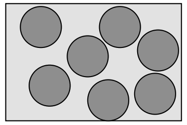{width="70%" fig-alt="Simple diagram of seven gray circles (disks) scattered at random, non-overlapping positions inside a light gray rectangle - illustrating a 2D hard-disk gas."}

- Hard-disk gas, from [https://computational-physics.tripos.org/notes/monte-carlo.html](https://computational-physics.tripos.org/notes/monte-carlo.html)
- Paper title: "Equation of State Calculations by Fast Computing Machines"
  - "Fast computing machine" = MANIAC; multiply two 40-bit ints in 1 millisecond (1 kHz).
  - One core on your phone is 2.4 million times faster!

---

## Hard-disk gas

<!-- TODO: complex slide layout (flagged by detect_complex_slide.py - see run log). Content below is complete but UNARRANGED - needs manual layout to match the original slide. -->

- original version: Haade;vectorization: Wjh31, Quibik, CC BY-SA 3.0 <https://creativecommons.org/licenses/by-sa/3.0>, via Wikimedia Commons

- Consider the system as a Maxwell–Boltzmann gas at fixed volume and temperature.
- Energy: $E=\frac{1}{2}m\mathop{ \sum }\limits_{i}{\mathbf{v}}_{i}^{2}+\mathop{ \sum }\limits_{1 \leq i<j \leq N}U({r}_{ij})$ (kinetic and potential energy)
- For simplicity, consider a very simple potential energy term:

- $$U(r)=\left\{\begin{matrix}
0 & \text{if}r> \sigma  \\
 \infty  & \text{if}r \leq  \sigma 
\end{matrix}\right.$$

- (You can add long-range interactions, e.g. Coulomb, Lennard–Jones)

- In a (canonical) ensemble of such systems at temperature $T$, the probability that the system has energy $E$ is:

- $$p(E) \sim W(E)exp\left[ \frac{-E}{{k}_{B}T} \right]=exp\left[ -\frac{E-TS}{{k}_{B}T} \right]=exp\left[ -\frac{F}{{k}_{B}T} \right]$$

- N(microstates) w/energy $E$

- Entropy

- Free energy

---

## Hard-disk gas

- original version: Haade;vectorization: Wjh31, Quibik, CC BY-SA 3.0 <https://creativecommons.org/licenses/by-sa/3.0>, via Wikimedia Commons

- The partition function is:

- $$Z=\mathop{ \sum }\limits_{E}W(E)exp\left[ -\frac{E}{{k}_{B}T} \right]$$

- And the equation of state relates pressure (p), volume (V), and temperature (T):

- $$pV=N{k}_{B}T\frac{ \partial log(Z)}{ \partial log(V)}{|}_{T,N}$$

---

## Hard-disk gas

- original version: Haade;vectorization: Wjh31, Quibik, CC BY-SA 3.0 <https://creativecommons.org/licenses/by-sa/3.0>, via Wikimedia Commons

- Now for the computational physics part!
- The hard-disk gas is difficult to solve analytically, but (thanks to Metropolis et al) reasonably accessible via numerical methods.
- Specifically, Metropolis et al simulated the following:
  - $N=224$ disks of diameter ${d}_{0}$
  - Normalize box area to the "close packing" area of $N$ disks: ${A}_{0}=\sqrt{3}{d}_{0}^{2}N/2 \equiv 1$.
    - I.e., vary ${d}_{0}$ to obtain desired $N$
  - "Periodic boundary conditions"
    - To avoid modeling wall bounces, just have particles "wrap around" if they hit a boundary. (Equivalently, a torus rather than a box.)
  - Initial conditions: particles close-packed in upper left corner.

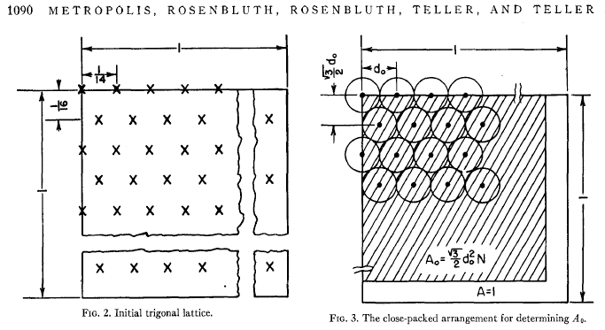{width="70%" fig-alt="Two figures from the original Metropolis et al. (1953) paper: Fig. 2, the initial trigonal lattice of disks (marked with X's) in a square cell; and Fig. 3, the close-packed arrangement of disks used to determine the reference area A0 = (sqrt(3)/2) d0^2 N."}

- Hard-disk gas: initial configuration with close packing

---

## Hard-disk gas

- original version: Haade;vectorization: Wjh31, Quibik, CC BY-SA 3.0 <https://creativecommons.org/licenses/by-sa/3.0>, via Wikimedia Commons

- What can we learn from the simulation?
  - The radial distribution function measures correlations between particles as a function of distance, $r$.
  - Can be used to distinguish solids, liquids, and gases (see [Gould–Tobochnik chapter 8.5](http://www.compadre.org/STP/document/ServeFile.cfm?ID=7946&DocID=685))
  - The equation of state is deduced from the r.d.f:

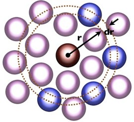{width="70%" fig-alt="Diagram of two concentric rings of spheres (pink and blue) surrounding a central dark red sphere, with radius vector r and shell thickness dr labeled - illustrating a radial distribution function shell."}

- Cartoon of radial distribution function
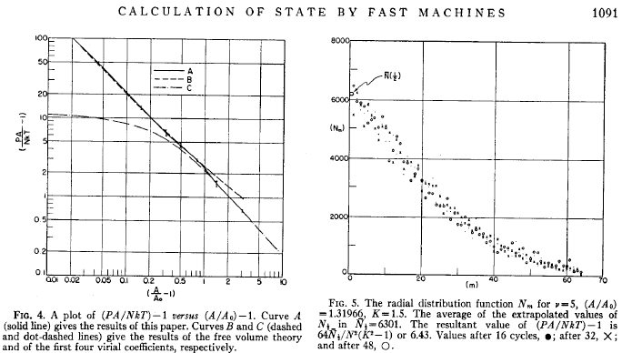{width="70%" fig-alt="Two figures from the original Metropolis et al. (1953) paper: Fig. 4, a plot of (PA/NkT)-1 versus (A/A0)-1 comparing this paper's results (curve A) to free-volume theory (curves B, C); and Fig. 5, the radial distribution function N_m versus m, plotted as a scatter of extrapolated values after 16, 32, and 48 cycles."}

- Equation of state and radial distribution function of hard-disk gas, from original Metropolis paper

---

## Hard-disk gas

<!-- TODO: complex slide layout (flagged by detect_complex_slide.py - see run log). Content below is complete but UNARRANGED - needs manual layout to match the original slide. -->

- original version: Haade;vectorization: Wjh31, Quibik, CC BY-SA 3.0 <https://creativecommons.org/licenses/by-sa/3.0>, via Wikimedia Commons

- Specifically, using the virial theorem, the equation of state is calculated as a function of $\overline{n}=n({d}_{0})$, the average density of other particles at the surface of a given particle:
- The virial theorem states:

- $$pA=N{k}_{B}T(1+\frac{ \pi {d}_{0}^{2}\overline{n}}{2})$$

- $$\text{K.E.}=N \times \frac{1}{2}m{\overline{v}}^{2}=pA+\frac{1}{2}⟨\mathop{ \sum }\limits_{i}{\mathbf{r}}_{i} \cdot {\mathbf{X}}_{i}^{\text{int}}⟩$$

  - where ${\mathbf{r}}_{i}$ is the position of and ${\mathbf{X}}_{i}^{\text{int}}$ is the force due to particle $i$.
- Derivation is based on the following figure, which simply describes the elastic collisions between two disks:

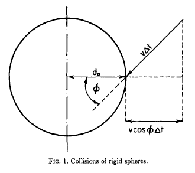{fig-alt="Fig. 1 from Metropolis et al. (1953), 'Collisions of rigid spheres': a circle of diameter d0 with a velocity vector v*delta-t approaching at angle phi, decomposed into components including v*cos(phi)*delta-t."}

- Geometry of rigid sphere collisions

---

## Hard-disk gas

- original version: Haade;vectorization: Wjh31, Quibik, CC BY-SA 3.0 <https://creativecommons.org/licenses/by-sa/3.0>, via Wikimedia Commons

- Considering the time-averaged effect of nearby particles, we have:

- $$⟨\mathop{ \sum }\limits_{i}{\mathbf{r}}_{i} \cdot {\mathbf{X}}_{i}^{\text{int}}⟩=-\frac{1}{2}\mathop{ \sum }\limits_{i}\mathop{ \sum }\limits_{j \neq i}{r}_{ij}{F}_{ij}=N \times \frac{1}{2}m{\overline{v}}^{2} \times  \pi {d}_{0}^{2}\overline{n}$$

- The average density at the surface of a disk, $\overline{n}$ , is obtained from the MC simulation.
- For each simulated configuration (remember, Metropolis–Hastings algorithm samples configurations according to Boltzmann probability distribution):
  - Make a histogram of the number density distribution as a function of radius
  - Specifically, divide nearby circle into 64 annuli of equal area and count disks inside
- Average over histograms and fit a model function to extrapolate the number density to $r={d}_{0}$.

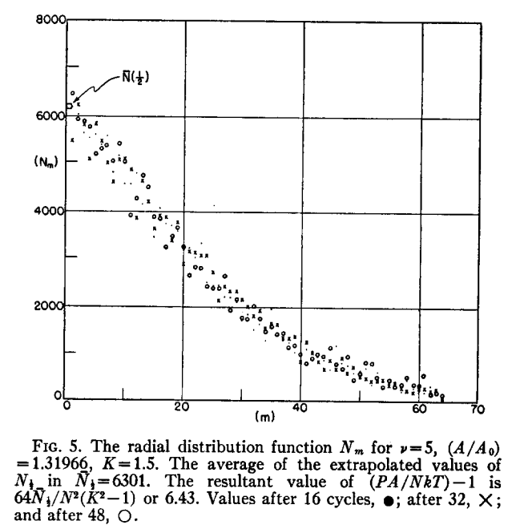{width="70%" fig-alt="Full-page reproduction of Fig. 5 from Metropolis et al. (1953): the radial distribution function N_m versus m, plotted as a scatter of extrapolated values after 16, 32, and 48 cycles, with its original figure caption."}

- Radial distribution function
- $$pA=N{k}_{B}T(1+\frac{ \pi {d}_{0}^{2}\overline{n}}{2})$$

---

## Hands-on

- original version: Haade;vectorization: Wjh31, Quibik, CC BY-SA 3.0 <https://creativecommons.org/licenses/by-sa/3.0>, via Wikimedia Commons

- Run through two notebooks related to the Metropolis algorithm:
  - RandomNumber/metropolis.ipynb:
    - Implements the Metropolis–Hastings algorithm for a simple 1D distribution.
    - See metropolis.h (and the corresponding SWIG file) for the meat of the algorithm.
  - RandomNumber/disks.ipynb:
    - Implements a simple 2D hard-disk gas, as in Metropolis et al (1953).
    - Plots radial distribution function and animates Metropolis–Hastings evolution of system.

---

## Recap

- original version: Haade;vectorization: Wjh31, Quibik, CC BY-SA 3.0 <https://creativecommons.org/licenses/by-sa/3.0>, via Wikimedia Commons

- We introduced the hard-disk gas model from the original Metropolis et al paper (1953).
  - Simple system of disks in a box, colliding elastically
  - Derive equation of state as a function of $\overline{n}$, the average density at the surface of the particles.
  - $\overline{n}$ itself is obtains from MC simulation, evolving the hard-disk gas system with the Metropolis–Hastings algorithm.
- References
  - [J. Chem. Phys. 21, 1087 (1953)](https://doi.org/10.1063/1.1699114)
  - Review paper: [J. Chem. Phys. 157, 234111 (2022)](https://doi.org/10.1063/5.0126437)
  - [https://computational-physics.tripos.org/notes/monte-carlo.html](https://computational-physics.tripos.org/notes/monte-carlo.html)
- Up next: Ising model
  - (This is the subject of one of the homework problems)

---

# Ising model

---

## Ising model

- original version: Haade;vectorization: Wjh31, Quibik, CC BY-SA 3.0 <https://creativecommons.org/licenses/by-sa/3.0>, via Wikimedia Commons

- The Ising model is an idealized magnetic material, consisting of an array of interacting spins ([wikipedia](https://en.wikipedia.org/wiki/Ising_model))
  - Demonstrates ferromagnetism in a simple system
  - Ernst Ising's PhD thesis (!) under William Lenz ([https://www.hs-augsburg.de/~harsch/anglica/Chronology/20thC/Ising/isi_intr.html](https://www.hs-augsburg.de/~harsch/anglica/Chronology/20thC/Ising/isi_intr.html)))

- Ising solved 1D case:
  - Didn't actually exhibit ferromagnetism
  - See G–T ch. 5 ([link](http://www.compadre.org/STP/document/ServeFile.cfm?ID=7274&DocID=448))
- 2D case: Kramers, Wannier, Onsanger, et al
  - Richer phenomenology: ferromagnetic phase at low T, paramagnetic phase at high T
  - ${2}^{nd}$ order phase transition at the Curie temperature, ${T}_{C}$

{width="70%" fig-alt="A grid pattern of up and down arrows arranged in rows and columns, representing a 2D Ising model spin lattice configuration."}

- 2D Ising model

---

## Ising model

- original version: Haade;vectorization: Wjh31, Quibik, CC BY-SA 3.0 <https://creativecommons.org/licenses/by-sa/3.0>, via Wikimedia Commons

- Recall : magnetism originates from charged particles "spinning" in closed orbits or about their axes
  - For elementary particles, "spinning" is in the quantum mechanical sense, not the rotational Newtonian sense.
  - Atoms have both a rotational spin $(L)$ and an intrinsic spin $(S)$ contributing to the magnetic properties.
- Nearby spins can interact with each other, leading to more interesting behavior than the colliding hard-disk gas.

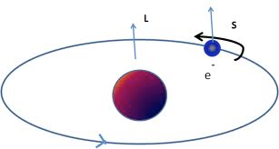{width="70%" fig-alt="Diagram of a classical electron analogy for spin: a blue sphere (nucleus) with an orbiting smaller blue sphere (electron, labeled e-) on an elliptical orbit, with orbital angular momentum vector L and spin vector S labeled."}

- L and S components of spin

---

## Ising model: spins

- original version: Haade;vectorization: Wjh31, Quibik, CC BY-SA 3.0 <https://creativecommons.org/licenses/by-sa/3.0>, via Wikimedia Commons

- The Ising model uses a simple classical approximation of spin: each lattice site has an "Ising spin" that points $ \uparrow $ or $ \downarrow $.
  - $${s}_{i}=\left\{\begin{matrix}
+1 & \text{(spin} \uparrow \text{)} \\
-1 & \text{(spin} \downarrow \text{)}
\end{matrix}\right.$$
- We will consider a 2D, $L \times L$ grid of spins.

{width="70%" fig-alt="A grid pattern of up and down arrows arranged in rows and columns, representing a 2D Ising model spin lattice configuration."}

- 2D grid of spins

---

## Ising model: interactions

<!-- TODO: complex slide layout (flagged by detect_complex_slide.py - see run log). Content below is complete but UNARRANGED - needs manual layout to match the original slide. -->

- original version: Haade;vectorization: Wjh31, Quibik, CC BY-SA 3.0 <https://creativecommons.org/licenses/by-sa/3.0>, via Wikimedia Commons

- Recall that interactions between spins is short-distance: $F \propto {r}^{-3}$.
- Important approximation: assume that spins only interact with the 4 nearest neighbors.
  - Greatly reduces the number of computations requires (calculating ${E}_{ij}$ from all pairs would be very slow)

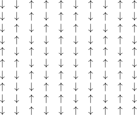{fig-alt="A grid pattern of up and down arrows arranged in rows and columns, representing a 2D Ising model spin lattice configuration."}

- Spins only interact with nearest neighbors

---

## Ising model: energy

- original version: Haade;vectorization: Wjh31, Quibik, CC BY-SA 3.0 <https://creativecommons.org/licenses/by-sa/3.0>, via Wikimedia Commons

- The energy has two components:

- $$E=-J\mathop{ \sum }\limits_{i \neq j}{s}_{i}{s}_{j}-H\mathop{ \sum }\limits_{i}{s}_{i}$$

- First term represents spin-spin interactions
  - $J>0$: ferromagnetic, energy minimized if spins aligned
  - $J<0$: antiferromagnetic, energy minimized if spins anti-aligned
- Second term represents external magnetic field, $H$
  - External field couples to "total magnetization", $M=\mathop{ \sum }\limits_{i}{s}_{i}$
  - Energy minimized if spins align to the external field

---

## Ising model

- original version: Haade;vectorization: Wjh31, Quibik, CC BY-SA 3.0 <https://creativecommons.org/licenses/by-sa/3.0>, via Wikimedia Commons

- For $H=0$, the system can be in two configurations:
  - Low temperature ($T<{T}_{C}$): magnetized, $⟨M⟩ \neq 0$
  - High temperature ($T>{T}_{C}$): $⟨M⟩=0$
- Critical value is a second-order phase transition between the ferromagnetic and paramagnetic phases.

- $$E=-J\mathop{ \sum }\limits_{i \neq j}{s}_{i}{s}_{j}-H\mathop{ \sum }\limits_{i}{s}_{i}$$

---

## Ising model

- original version: Haade;vectorization: Wjh31, Quibik, CC BY-SA 3.0 <https://creativecommons.org/licenses/by-sa/3.0>, via Wikimedia Commons

- We are interested in computing observables at a given temperature, e.g., magnetization.
- The (micro)state is defined by specifying all spins:
  - $${\mathbf{X}}_{i}=({s}_{11},{s}_{12},...,{s}_{LL})=(+1,-1,..., \pm 1,...,+1)$$
- As usual, the expectation value of e.g. $M$ is calculated as an average over states, weighted by the Boltzmann factors:

- $$E=-J\mathop{ \sum }\limits_{i \neq j}{s}_{i}{s}_{j}-H\mathop{ \sum }\limits_{i}{s}_{i}$$

- $$⟨M⟩=\frac{{ \sum }_{i}{M}_{i}exp\left( {E}_{i}/{k}_{B}T \right)}{{ \sum }_{i}exp\left( {E}_{i}/{k}_{B}T \right)}$$

- (sum over microstates $i$)

---

## Ising model

- original version: Haade;vectorization: Wjh31, Quibik, CC BY-SA 3.0 <https://creativecommons.org/licenses/by-sa/3.0>, via Wikimedia Commons

- The number of configurations is intractable:
  - Consider just $L=20$ spins per side, so $20 \times 20=400$ spins.
  - Number of configurations is ${2}^{400} \approx 2.6 \times {10}^{120}$!!!
  - Computers can't even list these, much less perform any computations.
- Thus, this is a good application of Monte Carlo methods!
  - Randomly generate a large but reasonable number of configurations
  - Probability corresponds to underlying Boltzmann distribution

- $$E=-J\mathop{ \sum }\limits_{i \neq j}{s}_{i}{s}_{j}-H\mathop{ \sum }\limits_{i}{s}_{i}$$

---

## Ising model

- original version: Haade;vectorization: Wjh31, Quibik, CC BY-SA 3.0 <https://creativecommons.org/licenses/by-sa/3.0>, via Wikimedia Commons

- The number of configurations is intractable:
  - Consider just $L=20$ spins per side, so $20 \times 20=400$ spins.
  - Number of configurations is ${2}^{400} \approx 2.6 \times {10}^{120}$!!!
  - Computers can't even list these, much less perform any computations.
- Thus, this is a good application of Monte Carlo methods!
  - Randomly generate a large but reasonable number of configurations
  - Probability corresponds to underlying Boltzmann distribution
  - We can use Metropolis–Hastings (though this is not the only MC technique, nor the best!)

- $$E=-J\mathop{ \sum }\limits_{i \neq j}{s}_{i}{s}_{j}-H\mathop{ \sum }\limits_{i}{s}_{i}$$

---

## Ising model

- original version: Haade;vectorization: Wjh31, Quibik, CC BY-SA 3.0 <https://creativecommons.org/licenses/by-sa/3.0>, via Wikimedia Commons

- The probability for each state is:

- $$E=-J\mathop{ \sum }\limits_{i \neq j}{s}_{i}{s}_{j}-H\mathop{ \sum }\limits_{i}{s}_{i}$$

- $$p({s}_{1},{s}_{2},...,{s}_{{N}_{s}})=\frac{{e}^{-E({s}_{1},{s}_{2},...,{s}_{{N}_{s}})/kT}}{\sum_{i} {{e}^{-{E}_{i}/kT}}}$$

- With Metropolis–Hastings, we can sample this distribution without computing the (difficult/impossible) denominator.
- Since the $N$ samples are distributed according to the Boltzmann distribution, the expectation values of observables are simple averages:

- $$⟨M⟩=\frac{1}{N}\mathop{\mathop{ \sum }\limits_{i=1}}\limits^{N}M({s}_{1}^{(i)},{s}_{2}^{(i)},...,{s}_{{N}_{s}}^{(i)})$$

- (Remember, Metropolis et al reasoned that uniformly sampling and applying weights, ${p}_{i}$, is inefficient: lots of time is wasted on low-${p}_{i}$ configurations. Instead,  sample according to ${p}_{i}$ with no weights.)

---

## Ising model

- original version: Haade;vectorization: Wjh31, Quibik, CC BY-SA 3.0 <https://creativecommons.org/licenses/by-sa/3.0>, via Wikimedia Commons

- Now, let's write down the Metropolis algorithm to explore the configuration space:
  - Choose initial configuration
  - Select a spin, do a trial flip ($+1 \leftrightarrow -1$)
  - Compute change in energy, $ \Delta E$
  - Accept/reject based on Boltzmann probability ratios.
    - Specifically, throw uniform random $0<r<1$.
    - If $R={e}^{- \Delta E/kT}>r$, accept the flip
    - Otherwise reject the flip and move on.

- $$E=-J\mathop{ \sum }\limits_{i \neq j}{s}_{i}{s}_{j}-H\mathop{ \sum }\limits_{i}{s}_{i}$$

---

## Ising model

- original version: Haade;vectorization: Wjh31, Quibik, CC BY-SA 3.0 <https://creativecommons.org/licenses/by-sa/3.0>, via Wikimedia Commons

- Details: the "thermalization" and sampling/skip rate are important!
- Thermalization:
  - The initial conditions (all aligned, totally random) are probably low-probability configurations, so run M–H a while before recording samples
- Sampling/skip rate:
  - Adjacent M–H steps are extremely correlated! We only flip one spin at a time.
  - So, you probably want to do at least ${N}_{s}=L \times L$ M–H steps in between recording samples

- $$E=-J\mathop{ \sum }\limits_{i \neq j}{s}_{i}{s}_{j}-H\mathop{ \sum }\limits_{i}{s}_{i}$$

---

## Ising model

- original version: Haade;vectorization: Wjh31, Quibik, CC BY-SA 3.0 <https://creativecommons.org/licenses/by-sa/3.0>, via Wikimedia Commons

- Another detail: computing ${e}^{- \Delta E/kT}$ at each step becomes rather expensive... and unnecessary!
- For given $T$ and $H$, there are only 10 distinct values we need to compute
  - So, we should pre-compute and cache these, and just look them up
- First, consider the interaction terms, $-J\mathop{ \sum }\limits_{j}{s}_{i}{s}_{j}=-J{s}_{i}\left( \sum_{j} {{s}_{j}} \right)$
  - $j$ runs over the 4 nearest neighbors
  - Only 5 possible values!  ${s}_{i}\mathop{ \sum }\limits_{j}{s}_{j}=-4,-2,0,2,4$.

- $$E=-J\mathop{ \sum }\limits_{i \neq j}{s}_{i}{s}_{j}-H\mathop{ \sum }\limits_{i}{s}_{i}$$

---

## Ising model

- original version: Haade;vectorization: Wjh31, Quibik, CC BY-SA 3.0 <https://creativecommons.org/licenses/by-sa/3.0>, via Wikimedia Commons

- Second, consider the $H$ terms: 2 choices, it's either $+H$ or $-H$.
- To in total, we have $5 \times 2=10$ possibilities.
- Specifically, we can pack them into a $5 \times 2$ array, where the indices are computes as:
  - First index: $2+\frac{1}{2}{s}_{i}\mathop{ \sum }\limits_{j}{s}_{j}$ (possibly outcomes are 0, 1, 2, 3, 4)
  - Second index: $\frac{1+{s}_{i}}{2}$ (possibly outcomes are 0, 1)

- $$E=-J\mathop{ \sum }\limits_{i \neq j}{s}_{i}{s}_{j}-H\mathop{ \sum }\limits_{i}{s}_{i}$$

---

## Ising model

- original version: Haade;vectorization: Wjh31, Quibik, CC BY-SA 3.0 <https://creativecommons.org/licenses/by-sa/3.0>, via Wikimedia Commons

- Pseudocode:
  - Choose random spin
  - Take Metropolis step
    - Trial = flip spin
    - Lookup Boltzmann ratio $R$, throw uniform $r \in (0,1)$
      - (Use periodic boundary conditions for simplicity)
    - Accept/reject trial flip based on $R>r$
  - Apply thermalization stage, and record every $K$ steps (choose $K>{N}_{s}=L \times L$) so that "each spin has a chance to flip"

- $$E=-J\mathop{ \sum }\limits_{i \neq j}{s}_{i}{s}_{j}-H\mathop{ \sum }\limits_{i}{s}_{i}$$

---

## Ising model: results

- original version: Haade;vectorization: Wjh31, Quibik, CC BY-SA 3.0 <https://creativecommons.org/licenses/by-sa/3.0>, via Wikimedia Commons

- Before running the simulation ourselves, let's look at some of the analytical predictions.
- Kramers and Wannier ([Phys. Rev. 60, 252 (1941)](http://dx.doi.org/10.1103/PhysRev.60.252)) used a duality argument to compute ${T}_{C}$:

- $$E=-J\mathop{ \sum }\limits_{i \neq j}{s}_{i}{s}_{j}-H\mathop{ \sum }\limits_{i}{s}_{i}$$

- $$\frac{{k}_{B}{T}_{C}}{log(1+\sqrt{2})}=2.269...$$

- Onsager ([Phys. Rev. 65, 117 (1944)](http://dx.doi.org/10.1103/PhysRev.65.117)) showed, for the thermodynamic limit $N \rightarrow  \infty $ and $H=0$:

- $$m=\mathop{lim}\limits_{N \rightarrow  \infty }\frac{⟨{ \sum }_{i}{s}_{i}⟩}{N}=\left\{\begin{matrix}
{\left[ 1-{sinh(\frac{2J}{{k}_{B}T}){}}^{-4} \right]}^{\frac{1}{8}} & : & T \leq {T}_{C} \\
0 & : & T>{T}_{C}
\end{matrix}\right.$$

- So, near ${T}_{C}$, the system behaves like $m \sim ({T}_{C}-T{)}^{\frac{1}{8}}$
  - $ \beta =1/8$ for the 2D Ising system

---

## Ising model: results

- original version: Haade;vectorization: Wjh31, Quibik, CC BY-SA 3.0 <https://creativecommons.org/licenses/by-sa/3.0>, via Wikimedia Commons

- Numerical results for $T=2.2<{T}_{C}$.
  - For finite systems, the spins flip occasionally. (Remember, though, M–H is not necessarily simulating a realistic time evolution of the system.)

- $$E=-J\mathop{ \sum }\limits_{i \neq j}{s}_{i}{s}_{j}-H\mathop{ \sum }\limits_{i}{s}_{i}$$

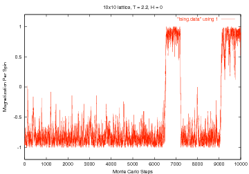{width="70%" fig-alt="Plot titled '10x10 lattice, T=2.2, H=0': magnetization per spin versus Monte Carlo steps (0 to 10000), showing the system fluctuating noisily around -1 before jumping up to fluctuate around +1 partway through, then back down - illustrating spin-flip dynamics near the critical temperature; annotated ''Ising data' using !'."}

- Magnetization per spin versus step number below ${T}_{C}$

---

## Ising model: results

- original version: Haade;vectorization: Wjh31, Quibik, CC BY-SA 3.0 <https://creativecommons.org/licenses/by-sa/3.0>, via Wikimedia Commons

- Numerical results for $T=3.0>{T}_{C}$.

- $$E=-J\mathop{ \sum }\limits_{i \neq j}{s}_{i}{s}_{j}-H\mathop{ \sum }\limits_{i}{s}_{i}$$

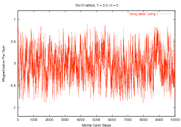{width="70%" fig-alt="Plot titled '10x10 lattice, T=3.0, H=0': magnetization per spin versus Monte Carlo steps (0 to 10000), fluctuating rapidly and randomly between roughly -1 and +1 throughout, with no sustained ordering - illustrating disordered behavior above the critical temperature; annotated ''Ising data' using !'."}

- Magnetization per spin versus step number above ${T}_{C}$

---

## Hands-on

- original version: Haade;vectorization: Wjh31, Quibik, CC BY-SA 3.0 <https://creativecommons.org/licenses/by-sa/3.0>, via Wikimedia Commons

- For the rest of class, let's run through RandomNumbers/ising.ipynb
  - Read through ising.[h/cpp] to understand the algorithm
  - Try adjust various parameters:
    - $H$ = external magnetic field
    - $L$ = number of spins per axis
    - Effect of thermalization steps
    - Etc.

---

## Comments

- original version: Haade;vectorization: Wjh31, Quibik, CC BY-SA 3.0 <https://creativecommons.org/licenses/by-sa/3.0>, via Wikimedia Commons

- The Metropolis–Hastings method allows us to simulate and probe the statistical properties of the 2D Ising model.
- It is not necessarily the best algorithm for the job, though (the problem has been studied for nearly a century!):
  - M–H can get "stuck", i.e., hard to find an accepted move.
    - Consider a closely packed hard-disk gas.
  - Heat bath algorithm, aka [Glauber dynamics](https://en.wikipedia.org/wiki/Glauber_dynamics) or [Gibbs sampling](https://en.wikipedia.org/wiki/Gibbs_sampling): calculate the spin's local environment and choose new spin orientation based on Boltzmann probabilities
  - [Wolff algorithm](https://en.wikipedia.org/wiki/Wolff_algorithm): flip clusters of connected, aligned spins

- [https://computational-physics.tripos.org/slides/monte-carlo.html#/2/8](https://computational-physics.tripos.org/slides/monte-carlo.html#/2/8)

---

## Recap

- original version: Haade;vectorization: Wjh31, Quibik, CC BY-SA 3.0 <https://creativecommons.org/licenses/by-sa/3.0>, via Wikimedia Commons

- The Ising model considers an array of "spins" to represent an idealized magnetic material.
- The system has a large number of microstates, making MC the method of choice for studying statistical properties.
- A ~simple 2D simulation, using the Metropolis–Hastings algorithm, can demonstrate the transition from ferromagnetic to paramagnetic.
  - More on this in the 1st homework assignment!

- $$E=-J\mathop{ \sum }\limits_{i \neq j}{s}_{i}{s}_{j}-H\mathop{ \sum }\limits_{i}{s}_{i}$$

{width="70%" fig-alt="A grid pattern of up and down arrows arranged in rows and columns, representing a 2D Ising model spin lattice configuration."}

- 2D grid of spins
{width="70%" fig-alt="Plot titled '10x10 lattice, T=2.2, H=0': magnetization per spin versus Monte Carlo steps (0 to 10000), showing the system fluctuating noisily around -1 before jumping up to fluctuate around +1 partway through, then back down - illustrating spin-flip dynamics near the critical temperature; annotated ''Ising data' using !'."}

- Magnetization per spin versus step number below ${T}_{C}$
