## Partial differential equations

- Last topic for this semester: partial differential equations ([wikipedia](http://en.wikipedia.org/wiki/Partial_differential_equation))
- These are just like ODEs, only harder! (kidding)
- You have seen a few examples of PDEs in physics so far:
  - Poisson equation
  - Diffusion equation
  - Wave equation
- Our general strategy is to look at finite differences again.
  - Just like we did in ODEs...
  - ...but now we have to look in multiple dimensions at once!
- Obviously, PDEs are a vast subject, and we will not cover many, many other algorithms.
- Reference: Numerical Recipes, Chapter 20.

- original version: Haade;vectorization: Wjh31, Quibik, CC BY-SA 3.0 <https://creativecommons.org/licenses/by-sa/3.0>, via Wikimedia Commons

---

## Partial differential equations

- Numerical Recipes gives 3 major categories:
  - Hyperbolic: e.g. $\frac{{ \partial }^{2}u}{ \partial {t}^{2}}={v}^{2}\frac{{ \partial }^{2}u}{ \partial {x}^{2}}$
  - Parabolic: e.g. $\frac{ \partial u}{ \partial t}=\frac{ \partial }{ \partial x}\left( D\frac{ \partial u}{ \partial x} \right)$
  - Elliptic: e.g. $\frac{{ \partial }^{2}u}{ \partial {x}^{2}}+\frac{{ \partial }^{2}u}{ \partial {y}^{2}}= \rho (x,y)$
- Let's start with an elliptic PDE problem: Poisson's equation in E&M:

- original version: Haade;vectorization: Wjh31, Quibik, CC BY-SA 3.0 <https://creativecommons.org/licenses/by-sa/3.0>, via Wikimedia Commons

- $${ \nabla }^{2}V(\mathbf{r})=\frac{{ \partial }^{2}V}{ \partial {x}^{2}}+\frac{{ \partial }^{2}V}{ \partial {y}^{2}}+\frac{{ \partial }^{2}V}{ \partial {z}^{2}}=-\frac{ \rho (\mathbf{r})}{{ \epsilon }_{0}}$$

- $V(\mathbf{r})$ is the potential, $ \rho (\mathbf{r})$ is the charge density.

---

## Elliptic PDEs

- Example of an elliptic PDE problem: Poisson's equation in E&M:

- original version: Haade;vectorization: Wjh31, Quibik, CC BY-SA 3.0 <https://creativecommons.org/licenses/by-sa/3.0>, via Wikimedia Commons

- $${ \nabla }^{2}V(\mathbf{r})=\frac{{ \partial }^{2}V}{ \partial {x}^{2}}+\frac{{ \partial }^{2}V}{ \partial {y}^{2}}+\frac{{ \partial }^{2}V}{ \partial {z}^{2}}=-\frac{ \rho (\mathbf{r})}{{ \epsilon }_{0}}$$

- $V(\mathbf{r})$ is the potential, $ \rho (\mathbf{r})$ is the charge density.

- Given boundary conditions, this specifies $V(\mathbf{r})$ at each point $\mathbf{r}$.
- Types of boundary conditions:
  - Dirichlet: $V(\mathbf{r})$ specified along a boundary.
  - Neumann: $\hat{n} \cdot  \nabla V$ specified along a boundary
    - AKA the normal component of the electric field along boundary; think of the $\mathbf{E}$ field on the surface of a conductor
  - Periodic: $V(\mathbf{r})=V(\mathbf{r}+ \Delta \mathbf{r})$

---

## Elliptic PDEs

- Why elliptic?
- Consider the 2D case, with a solution of form:
- The differential equation is then:
- This is an eigenfunction; for a given eigenvalue, the $({k}_{x},{k}_{y})$ values satisfy ${k}_{x}^{2}+{k}_{y}^{2}=$constant. This is just a circle!
  - Or, an ellipse in the more general case.

- original version: Haade;vectorization: Wjh31, Quibik, CC BY-SA 3.0 <https://creativecommons.org/licenses/by-sa/3.0>, via Wikimedia Commons

- $$V(x,y) \sim {e}^{i{k}_{x}x+i{k}_{y}y}$$

- $$-{ \nabla }^{2}V(x,y)=({k}_{x}^{2}+{k}_{y}^{2})V(x,y)$$

---

## Parabolic PDEs

- Example of parabolic PDE: diffusion equation

- original version: Haade;vectorization: Wjh31, Quibik, CC BY-SA 3.0 <https://creativecommons.org/licenses/by-sa/3.0>, via Wikimedia Commons

- $$\frac{ \partial n(\mathbf{r},t)}{ \partial t}- \nabla  \cdot \left( D(\mathbf{r}) \nabla n(\mathbf{r},t) \right)=S(\mathbf{r},t)$$

  - $S(\mathbf{r},t)$ = source
  - $D(\mathbf{r})$ = diffusion coefficient
  - $n(\mathbf{r},t)$ = concentration
- The PDE determines the concentration $n(\mathbf{r},t)$ in a closed space.
- For this problem, we need both:
  - Initial values ($t={t}_{0}$)
  - Boundary conditions (Dirichlet, Neumann, periodic)

---

## Parabolic PDEs

- Why parabolic? Consider simple 1D case, with constant $D$:

- original version: Haade;vectorization: Wjh31, Quibik, CC BY-SA 3.0 <https://creativecommons.org/licenses/by-sa/3.0>, via Wikimedia Commons

- $$\begin{matrix}
n(x,t) &  \sim {e}^{- \omega t+ikx} \\
\text{LHS} & =- \omega n(x,t)+D{k}^{2}n(x,t)
\end{matrix}$$

- I.e., the differential operator on the LHS has eigenvalues $- \omega +D{k}^{2}=$constant.
  - This is a parabola in $ \omega $-$k$ space.

- $$\frac{ \partial n(\mathbf{r},t)}{ \partial t}- \nabla  \cdot \left( D(\mathbf{r}) \nabla n(\mathbf{r},t) \right)=S(\mathbf{r},t)$$

---

## Parabolic PDEs

- The time-dependent Schoedinger equation is also a parabolic PDE:

- original version: Haade;vectorization: Wjh31, Quibik, CC BY-SA 3.0 <https://creativecommons.org/licenses/by-sa/3.0>, via Wikimedia Commons

- $$i \hbar \frac{ \partial  \Psi (\mathbf{r},t)}{ \partial t}=-\frac{{ \hbar }^{2}}{2m}{ \nabla }^{2} \Psi (\mathbf{r},t)+V(\mathbf{r}) \Psi (\mathbf{r},t)=\mathcal{H} \Psi (\mathbf{r},t)$$

- This can be viewed as:
  - A diffusion equation with an imaginary diffusion coefficient, $D=i \hbar /(2m)$
  - Or a diffusion equation in imaginary time, $it$, with a real diffusion coefficient, $D= \hbar /(2m)$

- $$\frac{ \partial n(\mathbf{r},t)}{ \partial t}- \nabla  \cdot \left( D(\mathbf{r}) \nabla n(\mathbf{r},t) \right)=S(\mathbf{r},t)$$

---

## Hyperbolic PDEs

- Third and final case: hyperbolic PDEs. Example: wave equation.

- original version: Haade;vectorization: Wjh31, Quibik, CC BY-SA 3.0 <https://creativecommons.org/licenses/by-sa/3.0>, via Wikimedia Commons

- $$\frac{1}{{c}^{2}}\frac{{ \partial }^{2}u(\mathbf{r},t)}{ \partial {t}^{2}}-{ \nabla }^{2}u(\mathbf{r},t)=R(\mathbf{r},t)$$

- As before, consider a complex exponential solution; the eigenvalues of the differential operator are:

- $$\frac{ \partial n(\mathbf{r},t)}{ \partial t}- \nabla  \cdot \left( D(\mathbf{r}) \nabla n(\mathbf{r},t) \right)=S(\mathbf{r},t)$$

- $-\frac{1}{{c}^{2}}{ \omega }^{2}+{\mathbf{k}}^{2}=$constant

- These are hyperboloid surfaces in $ \omega $-$k$ space.
- We need initial values ($t={t}_{0}$) and boundary conditions.

---

# Elliptic PDEs

---

## Poisson's equation

- Let's take a detailed look at solutions to the elliptic equation.
- Our example: Poisson's equation, i.e. Gauss's law for electrostatics:

- original version: Haade;vectorization: Wjh31, Quibik, CC BY-SA 3.0 <https://creativecommons.org/licenses/by-sa/3.0>, via Wikimedia Commons

- $$ \nabla  \cdot \mathbf{E}=\frac{ \rho (\mathbf{r})}{{ \epsilon }_{0}}$$

- The static electric field is related to the potential by $\mathbf{E}=- \nabla V(\mathbf{r})$.
- So, $V(\mathbf{r})$ satisfies the Poisson equation,

- $${ \nabla }^{2}V=\left( \frac{{ \partial }^{2}}{ \partial {x}^{2}}+\frac{{ \partial }^{2}}{ \partial {y}^{2}}+\frac{{ \partial }^{2}}{ \partial {z}^{2}} \right)V(\mathbf{r})=-\frac{ \rho (\mathbf{r})}{{ \epsilon }_{0}}$$

---

## Poisson's equation

- Our numerical approach: discretize the space of interest.
- Let's consider a 2D square, discretized into a 10x10 grid:

- original version: Haade;vectorization: Wjh31, Quibik, CC BY-SA 3.0 <https://creativecommons.org/licenses/by-sa/3.0>, via Wikimedia Commons

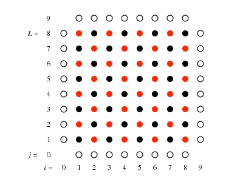{width="70%" fig-alt="Diagram of a red/black checkerboard lattice (indices i=0..9, j=0..9, labeled L=8): interior points alternate red and black in a checkerboard pattern, with hollow boundary points at j=0, j=9, i=0, i=9."}

---

## Poisson's equation

- The 2D Poisson equation is: $\left( \frac{{ \partial }^{2}}{ \partial {x}^{2}}+\frac{{ \partial }^{2}}{ \partial {y}^{2}} \right)V(x,y)=- \rho (x,y)$
  - Use units where ${ \epsilon }_{0}=1$; set square length $A=1$.
  - Grid points are ${x}_{i}=ih$, ${y}_{j}=jh$, where $i,j \in [0,1,...,L,L+1]$
  - The lattice spacing is $h=1/L$.
- For convenience, write $V({x}_{i},{y}_{j})={V}_{ij}$, and similarly ${ \rho }_{ij}$.
- Next step: finite differences, again.

- original version: Haade;vectorization: Wjh31, Quibik, CC BY-SA 3.0 <https://creativecommons.org/licenses/by-sa/3.0>, via Wikimedia Commons

---

## Poisson's equation

:::: {.columns}
::: {.column width="55%"}
- The finite difference formula looks like Euler from ODEs, in 2D:
- original version: Haade;vectorization: Wjh31, Quibik, CC BY-SA 3.0 <https://creativecommons.org/licenses/by-sa/3.0>, via Wikimedia Commons
- $$\left( \frac{{ \partial }^{2}}{ \partial {x}^{2}}+\frac{{ \partial }^{2}}{ \partial {y}^{2}} \right)V({x}_{i},{y}_{j}) \approx \frac{1}{{h}^{2}}\left[ {V}_{i+1,j}-2{V}_{i,j}+{V}_{i-1,j}+{V}_{i,j+1}-2{V}_{i,j}+{V}_{i,j-1} \right]$$
- Notes:
  - Each point on the lattice is connected only to the 4 nearest neighbors (no diagonal lines).
  - We can divide the grid into two halves:
    - Odd (red) and even (black) points based on whether $i+j$ is odd or even.
  - Boundary points are open circles.
:::
::: {.column width="45%"}
{width="100%" fig-alt="Diagram of a red/black checkerboard lattice (indices i=0..9, j=0..9, labeled L=8): interior points alternate red and black in a checkerboard pattern, with hollow boundary points at j=0, j=9, i=0, i=9."}
:::
::::

---

## Jacobi method

- First attempt: Jacobi's iterative method
  - Remember this from lecture 36 on BVPs and relaxation methods. We will guess a solution, and use the finite difference formula to iteratively approach a solution.
- Specifically, a real solution will satisfy:

- original version: Haade;vectorization: Wjh31, Quibik, CC BY-SA 3.0 <https://creativecommons.org/licenses/by-sa/3.0>, via Wikimedia Commons

- $${V}_{i,j}=\frac{1}{4}\left[ {V}_{i+1,j}+{V}_{i-1,j}+{V}_{i,j+1}+{V}_{i,j-1}+{h}^{2}{ \rho }_{i,j} \right]$$

- If we knew the RHS, we could compute the LHS... but of course we don't know the RHS! The whole grid needs to be solved simultaneously.
- Instead, use this equation for the iterative procedure:

- $${V}_{i,j}^{n+1}=\frac{1}{4}\left[ {V}_{i+1,j}^{n}+{V}_{i-1,j}^{n}+{V}_{i,j+1}^{n}+{V}_{i,j-1}^{n}+{h}^{2}{ \rho }_{i,j} \right]$$

---

## Poisson's equation

- Here, we fix the boundary points, make some initial guess for the interior, and iterate until the solution "stops changing by very much".
- This usually relaxes to the correct solution, but pathologies of course exist.
- As you might have guessed, this first algorithm is not the best! Let's try to do better.

- original version: Haade;vectorization: Wjh31, Quibik, CC BY-SA 3.0 <https://creativecommons.org/licenses/by-sa/3.0>, via Wikimedia Commons

---

## Gauss–Seidel method

<!-- TODO: complex slide layout (flagged by detect_complex_slide.py - see run log). Content below is complete but UNARRANGED - needs manual layout to match the original slide. -->

- Gauss–Seidel method: almost the same as Jacobi, except use updated neighbor sites where possible.
  - Keep in mind the red/black points: updating red points only needs black points, and vice versa.
- Slightly better updating formula:

- original version: Haade;vectorization: Wjh31, Quibik, CC BY-SA 3.0 <https://creativecommons.org/licenses/by-sa/3.0>, via Wikimedia Commons

- $${V}_{i,j}^{n+1}=\frac{1}{4}\left[ {V}_{i+1,j}^{n}+{V}_{i-1,j}^{n+1}+{V}_{i,j+1}^{n}+{V}_{i,j-1}^{n+1}+{h}^{2}{ \rho }_{i,j} \right]$$

- This converges (slightly) faster than the Jacobi method.

{fig-alt="Decorative hand-painted pink/magenta rectangular border/frame; the image itself contains no other content."}

{fig-alt="Decorative hand-painted pink/magenta rectangular border/frame; the image itself contains no other content."}

---

## Successive over-relaxation

- Successive over-relaxation (SOR) method: first practical algorithm.
- Note that Jacobi and Gauss–Seidel do not use ${V}_{i,j}^{n}$ at all for determining ${V}_{i,j}^{n+1}$.
- It turns out that a linear combination of the old and new solutions gives faster convergence:

- original version: Haade;vectorization: Wjh31, Quibik, CC BY-SA 3.0 <https://creativecommons.org/licenses/by-sa/3.0>, via Wikimedia Commons

- $${V}_{i,j}^{n+1}=(1- \omega ){V}_{i,j}^{n}+ \omega \frac{1}{4}\left[ {V}_{i+1,j}^{n}+{V}_{i-1,j}^{n+1}+{V}_{i,j+1}^{n}+{V}_{i,j-1}^{n+1}+{h}^{2}{ \rho }_{i,j} \right]$$

- $ \omega $ is the over-relaxation parameter, and can be tuned for performance.
  - Note: it's actually more than just a weighted average. Usually $ \omega >1$ .

---

## Successive over-relaxation

- SOR details:
  - Converges only for $0< \omega <2$.
  - Faster than Gauss–Seidel only for $1< \omega <2$.
  - Ideal convergence for square lattice:

- original version: Haade;vectorization: Wjh31, Quibik, CC BY-SA 3.0 <https://creativecommons.org/licenses/by-sa/3.0>, via Wikimedia Commons

- $$ \omega  \approx \frac{2}{1+ \pi /L}$$

- $L=$number of lattice points on a side

---

## Convergence rate

- For our strategy, we will use the red/black splitting to solve the equations faster:
  - Update the even sites, then the odd sites.
- How do we quantify convergence?
- Start with the answer: for the Laplace problem, the number of iterations required to reduce the overall error by a factor of ${10}^{-p}$ is:

- original version: Haade;vectorization: Wjh31, Quibik, CC BY-SA 3.0 <https://creativecommons.org/licenses/by-sa/3.0>, via Wikimedia Commons

$$r \simeq \left\{\begin{matrix} \frac{1}{2}pL^2 & \text{for Jacobi's method} \\ \frac{1}{4}pL^2 & \text{for the Gauss-Seidel method} \\ \frac{1}{3}pL & \text{for SOR with } \omega \simeq 2/(1+\pi/L) \end{matrix}\right. \quad \left(\begin{matrix} \frac{1}{2} \times 3 \times 50^2 = 3{,}750 \\ \frac{1}{4} \times 3 \times 50^2 = 1{,}875 \\ \frac{1}{3} \times 3 \times 50 = 50 \end{matrix}\right)$$

---

## Convergence rate

<!-- TODO: complex slide layout (flagged by detect_complex_slide.py - see run log). Content below is complete but UNARRANGED - needs manual layout to match the original slide. -->

- To study convergence rates, let's rewrite the problem in matrix form:

- original version: Haade;vectorization: Wjh31, Quibik, CC BY-SA 3.0 <https://creativecommons.org/licenses/by-sa/3.0>, via Wikimedia Commons

- $$\left( \frac{{ \partial }^{2}}{ \partial {x}^{2}}+\frac{{ \partial }^{2}}{ \partial {y}^{2}} \right)V(x,y)=- \rho (x,y)$$

- $$\mathbf{A}\mathbf{x}=\mathbf{b}$$

- Discrete Poisson operator

- $${V}_{ij}$$

- Charge density

- In the discrete formulation, $\mathbf{A}$ is something like a tridiagonal matrix.
- Let's break this into diagonal, lower, and upper pieces: $\mathbf{A}=\mathbf{L}+\mathbf{D}+\mathbf{U}$
  - Note: this is nothing fancy like LU decomposition, but rather just the lower/upper/diagonal pieces.

- $${V}_{i,j}^{n+1}=(1- \omega ){V}_{i,j}^{n}+ \omega \frac{1}{4}\left[ {V}_{i+1,j}^{n}+{V}_{i-1,j}^{n+1}+{V}_{i,j+1}^{n}+{V}_{i,j-1}^{n+1}+{h}^{2}{ \rho }_{i,j} \right]$$

---

## Convergence rate

- At each step, the Jacobi iteration is:

- original version: Haade;vectorization: Wjh31, Quibik, CC BY-SA 3.0 <https://creativecommons.org/licenses/by-sa/3.0>, via Wikimedia Commons

- This matrix, $-{\mathbf{D}}^{-1}(\mathbf{L}+\mathbf{U})$, is the iteration matrix.
  - Intuition: it suppresses unwanted eigenmodes from your initial guess.
  - The key parameter is the spectral radius: the largest eigenvalue.
  - For an unwanted eigenmode, each iteration adds another power of the eigenvalue, i.e., ${ \lambda }^{n}$.

- $${V}_{i,j}^{n+1}=(1- \omega ){V}_{i,j}^{n}+ \omega \frac{1}{4}\left[ {V}_{i+1,j}^{n}+{V}_{i-1,j}^{n+1}+{V}_{i,j+1}^{n}+{V}_{i,j-1}^{n+1}+{h}^{2}{ \rho }_{i,j} \right]$$

- $$\begin{matrix}
\mathbf{D}{\mathbf{x}}^{(n+1)} & =-(\mathbf{L}+\mathbf{U}){\mathbf{x}}^{(n)}+\mathbf{b} \\
{\mathbf{x}}^{(n+1)} & =-{\mathbf{D}}^{-1}(\mathbf{L}+\mathbf{U}){\mathbf{x}}^{(n)}+{\mathbf{D}}^{-1}\mathbf{b}
\end{matrix}$$

---

## Spectral radius

- Features of the spectral radius, ${ \rho }_{s}$:
  - $0<{ \rho }_{s}<1$ for the method to be stable;
  - Depends on the boundary conditions and lattice spacing.
  - Approaches 1 as N(lattice points) increases.
- For the $L \times L$ square lattice with Dirichlet boundary conditions:

- original version: Haade;vectorization: Wjh31, Quibik, CC BY-SA 3.0 <https://creativecommons.org/licenses/by-sa/3.0>, via Wikimedia Commons

- $${ \rho }_{s} \approx 1-\frac{{ \pi }^{2}}{2{L}^{2}}$$

- Let's derive this...

---

## Spectral radius

<!-- TODO: complex slide layout (flagged by detect_complex_slide.py - see run log). Content below is complete but UNARRANGED - needs manual layout to match the original slide. -->

- Spectral radius for the simple 1D case: the Laplace equation is just

- original version: Haade;vectorization: Wjh31, Quibik, CC BY-SA 3.0 <https://creativecommons.org/licenses/by-sa/3.0>, via Wikimedia Commons

- $$\frac{{d}^{2}V}{d{x}^{2}}=0$$

- Set boundary conditions: Dirichlet, $V(0)=V(L+1)=0$.
- Eigenvectors of differential operator are sines and cosines; we choose sines to satisfy $V(0)=V(L+1)=0$

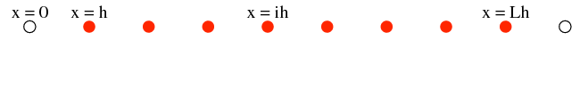{fig-alt="Diagram of a 1D lattice: evenly spaced red dots between two hollow boundary points, labeled x=0 at the left end, x=h at the first interior point, x=ih at a general interior point, and x=Lh at the right end."}

- Discretize, compute finite differences, resulting Jacobi iteration is:

- $${V}_{i}^{n+1}=\frac{1}{2}({V}_{i+1}^{n}+{V}_{i-1}^{n})$$

- $${u}_{i}^{(k)}=sin\left( \frac{ \pi ki}{L+1} \right)$$

- $$k=1,2,...,L$$

---

## Spectral radius

- Obtain the eigenvalues by plugging in the eigenvectors:

- original version: Haade;vectorization: Wjh31, Quibik, CC BY-SA 3.0 <https://creativecommons.org/licenses/by-sa/3.0>, via Wikimedia Commons

- $$\begin{matrix}
\frac{1}{2}({u}_{i+1}^{(k)}+{u}_{i-1}^{(k)}) & =\frac{1}{2}\left[ sin\left( \frac{ \pi k(i+1)}{L+1} \right)+sin\left( \frac{ \pi k(i-1)}{L+1} \right) \right] \\
 & =cos\left( \frac{ \pi k}{L+1} \right){u}_{i}^{(k)}
\end{matrix}$$

- $${u}_{i}^{(k)}=sin\left( \frac{ \pi ki}{L+1} \right)$$

- $${V}_{i}^{n+1}=\frac{1}{2}({V}_{i+1}^{n}+{V}_{i-1}^{n})$$

- The spectral radius is given by the largest eigenvalue, which corresponds to the smallest value of $k$:

- $${ \rho }_{s}=cos\left( \frac{ \pi }{L+1} \right) \approx 1-\frac{{ \pi }^{2}}{2{L}^{2}}$$

- Numerical Recipes does a similar derivation for the 2D case, yielding:

- $${ \rho }_{s}=\frac{{h}_{y}^{2}cos(\frac{ \pi }{{L}_{x}+1})+{h}_{x}^{2}cos(\frac{ \pi }{{L}_{y}+1})}{{h}_{x}^{2}+{h}_{y}^{2}}$$

---

## Convergence rates: Jacobi

- OK, now we have the ingredients necessary to study convergence rates.
- Specifically, suppose we want to "damp" a given solution by a factor of ${10}^{-p}$.
- The worst eigenmode is damped by a factor of ${ \rho }_{s}$ each iteration:

- original version: Haade;vectorization: Wjh31, Quibik, CC BY-SA 3.0 <https://creativecommons.org/licenses/by-sa/3.0>, via Wikimedia Commons

- $${ \rho }_{s}=cos\left( \frac{ \pi }{L+1} \right) \approx 1-\frac{{ \pi }^{2}}{2{L}^{2}}$$

- $${10}^{-}p={ \rho }_{s}^{n} \Longrightarrow n=\frac{pln10}{-ln{ \rho }_{s}} \approx \frac{2p{L}^{2}ln10}{{ \pi }^{2}} \approx \frac{1}{2}p{L}^{2}$$

- This shows that the Jacobi method is not very efficient!
  - Consider $L=1000$.
  - $n={10}^{6}$ to improve to 1% of current guess!

---

## Convergence rates: Gauss–Seidel

- Gauss–Seidel is a little better.
  - The iteration matrix is $-(\mathbf{L}+\mathbf{D}{)}^{-1}\mathbf{U}$  (exercise for the reader :)
  - The spectral radius is ${ \rho }_{s} \approx 1-\frac{{ \pi }^{2}}{{L}^{2}}$.
  - $$n \approx \frac{1}{4}p{L}^{2}$$
- I.e., it is only twice as fast as Jacobi, but still has the poor ${L}^{2}$ scaling.

- original version: Haade;vectorization: Wjh31, Quibik, CC BY-SA 3.0 <https://creativecommons.org/licenses/by-sa/3.0>, via Wikimedia Commons

---

## Convergence rates: SOR

- As you might have guessed, the convergence rate for SOR is much better:
  - $${ \rho }_{s}^{(SOR)}=\left( \frac{{ \rho }_{s}^{(Jac.)}}{1+\sqrt{1-{ \rho }_{s}^{(Jac.)2}}} \right) \approx 1-\frac{2 \pi }{L}$$
  - $$n \approx \frac{1}{3}pL$$
- So, for $L=1000$, you only need $n=667$ iterations to improve to 1% of your initial guess, instead of ${10}^{6}$!

- original version: Haade;vectorization: Wjh31, Quibik, CC BY-SA 3.0 <https://creativecommons.org/licenses/by-sa/3.0>, via Wikimedia Commons

---

## Computational complexity

- Finally, let's look at computational complexity: the number of operations needed.
- Jacobi and Gauss–Seidel:
  - All interior lattice points updated at every iteration.
  - For an $L \times L$ lattice and $n \propto {L}^{2}$, result is $O({L}^{4})$.
- SOR: $n \propto L$, so $O({L}^{3})$.
- None of these are great for large $L$.

- original version: Haade;vectorization: Wjh31, Quibik, CC BY-SA 3.0 <https://creativecommons.org/licenses/by-sa/3.0>, via Wikimedia Commons

---

## Hands-on

- Let's go through the notebook at CompPhys/PDEs/poisson.ipynb
  - Class Poisson implements functor for iterative updating (selectable between Jacobi, Gauss–Seidel, and SOR).
    - Calculates "error" as average change in ${V}_{i,j}$.
  - Boundary conditions are "baked in" (${V}_{i,j}=0$ along boundary, and class just never changes them).
  - Make sure you read through the performance cells, there is an interesting lesson here!
- If you finish early:
  - Explore the FFT-based methods in the same notebook.
  - Start on Homework 6, Problem 3.

- original version: Haade;vectorization: Wjh31, Quibik, CC BY-SA 3.0 <https://creativecommons.org/licenses/by-sa/3.0>, via Wikimedia Commons

---

## Recap

- original version: Haade;vectorization: Wjh31, Quibik, CC BY-SA 3.0 <https://creativecommons.org/licenses/by-sa/3.0>, via Wikimedia Commons

- Introduced 3 types of PDEs:
  - Elliptic, e.g. Poisson equation.
  - Parabolic, e.g. diffusion, time-dependent Schroedinger equation.
  - Hyperbolic, e.g. wave equation.
- Numerically solved Poisson equation with relaxation methods:
  - Jacobi, Gauss–Seidel are mostly for educational purposes.
  - Successive over-relaxation performs better.
- Next time: more PDE techniques, including spectral analysis and multigrid method.

---

# Spectral methods

---

## Partial differential equations

- Last time: we solved an elliptic PDE, the Poisson equation for electrostatics, using relaxation methods.
- Relaxation methods are fairly general; just take the PDE and directly go to numerical solutions via finite differences.
- Depending on the problem, more sophisticated algorithms can do a lot better!
- Our first example: spectral methods, i.e., using the Fourier transform.
  - These work well for smooth solutions.
  - NR Ch. 20.7:
  - "The key difference between finite difference methods and spectral methods is that in finite difference methods you approximate the equation you are trying to solve, whereas in spectral methods you approximate the solution you are trying to find."

- original version: Haade;vectorization: Wjh31, Quibik, CC BY-SA 3.0 <https://creativecommons.org/licenses/by-sa/3.0>, via Wikimedia Commons

---

## Spectral methods

- Let's use the 1D Poisson equation (with a source) as our example:
  - $$\frac{{d}^{2}V}{d{x}^{2}}= \rho (x)$$
- Switch to more Fourier-like notation ($V \rightarrow f(x)$), and write both sides in terms of their FTs:

- original version: Haade;vectorization: Wjh31, Quibik, CC BY-SA 3.0 <https://creativecommons.org/licenses/by-sa/3.0>, via Wikimedia Commons

- $$f(x)=\frac{1}{\sqrt{2 \pi }} \int g(k){e}^{ikx}dx$$

- $$ \rho (x)=\frac{1}{\sqrt{2 \pi }} \int  \sigma (k){e}^{ikx}dx$$

- Plug into PDE; using linear independence of the ${e}^{ikx}$, we have:

- $$-{k}^{2}g(k)= \sigma (k)$$

- $$f(x)=-\frac{1}{\sqrt{2 \pi }} \int \frac{ \sigma (k)}{{k}^{2}}{e}^{ikx}dx$$

- A couple issues: (1) boundary conditions and (2) singularity for $k=0$.

---

## Spectral methods and boundary conditions

- Boundary conditions dictate the type of Fourier transform you want to use:
  - Real-sine, real-cosine, complex exponential, depending on the BCs.
  - Chebyshev polynomials are good for non-periodic problems with simple geometries (squares, spheres).
- For example, consider again a 1D lattice ($0<x<L$) with $N$ points.
- The complex FT coefficients of f(x) are:
- Obviously, the inverse FT is periodic in $L$
- So, the complex FT is the best choice for periodic conditions.

- original version: Haade;vectorization: Wjh31, Quibik, CC BY-SA 3.0 <https://creativecommons.org/licenses/by-sa/3.0>, via Wikimedia Commons

- $${x}_{n}=nL/N$$

- $${g}_{k}=\frac{1}{\sqrt{N}}\mathop{\mathop{ \sum }\limits_{j=0}}\limits^{N-1}{W}^{kj}{f}_{j}$$

---

## Spectral methods and boundary conditions

- Dirichlet boundary conditions: $f(0)=f(L)=0$.
  - In this case, sines are the best option (simply $sin(0)=0$ and $sin(N \pi )=0$.
  - $${f}_{n}=\sqrt{2{N}^{-1}}\mathop{\mathop{ \sum }\limits_{k=1}}\limits^{N-1}sin(\frac{ \pi nk}{N}{g}_{k}$$
- Neumann conditions: ${f}^{′}(0)={f}^{′}(L)=0$
  - In this case, cosines are the best option.
  - $${f}_{n}=\sqrt{{2}^{-1}{N}^{-1}}\left[ {g}_{0}+(-1{)}^{n}{g}_{N} \right]+\sqrt{2{N}^{-1}}\mathop{\mathop{ \sum }\limits_{k=1}}\limits^{N-1}cos\left( \frac{ \pi nk}{N} \right){g}_{k}$$
- For sines and cosines, these are not just the real and imaginary parts of a complex FT!
  - Sines, cosines, and ${e}^{ikx}$ are each complete sets for FTs with different BCs.
  - Sines and cosines are real, and need twice as many points.

- original version: Haade;vectorization: Wjh31, Quibik, CC BY-SA 3.0 <https://creativecommons.org/licenses/by-sa/3.0>, via Wikimedia Commons

---

## Example of spectral methods

- Back to Poisson's equation in 2D:

- original version: Haade;vectorization: Wjh31, Quibik, CC BY-SA 3.0 <https://creativecommons.org/licenses/by-sa/3.0>, via Wikimedia Commons

- $$\left( \frac{{ \partial }^{2}}{ \partial {x}^{2}}+\frac{{ \partial }^{2}}{ \partial {y}^{2}} \right)V(x,y) \approx \frac{1}{{h}^{2}}\left[ {V}_{j+1,k}+{V}_{j-1,k}+{V}_{j,k+1}+{V}_{j,k-1}-4{V}_{j,k} \right]=-{ \rho }_{j,k}$$

- Problem setup:
  - Take an $N \times N$ grid over $0 \leq x,y \leq 1$.
  - Let ${ \rho }_{j,k}$ be a point charge at the center of the square.
  - Periodic BCs ($ \Rightarrow $ complex FT)
- Since the FFT algorithm is linear, we can do it separately in the $x$ and $y$ directions; order doesn't matter.

---

## Example of spectral methods

- The 2D Fourier coefficients are:

- original version: Haade;vectorization: Wjh31, Quibik, CC BY-SA 3.0 <https://creativecommons.org/licenses/by-sa/3.0>, via Wikimedia Commons

- $${\mathop{V}\limits^{˜}}_{m,n}=\frac{1}{N}\mathop{\mathop{ \sum }\limits_{j=0}}\limits^{N-1}\mathop{\mathop{ \sum }\limits_{k=0}}\limits^{N-1}{W}^{mj+nk}{V}_{j,k}$$

- $${\mathop{ \rho }\limits^{˜}}_{m,n}=\frac{1}{N}\mathop{\mathop{ \sum }\limits_{j=0}}\limits^{N-1}\mathop{\mathop{ \sum }\limits_{k=0}}\limits^{N-1}{W}^{mj+nk}{ \rho }_{j,k}$$

- The inverse FT is:

- $${V}_{j,k}=\frac{1}{N}\mathop{\mathop{ \sum }\limits_{m=0}}\limits^{N-1}\mathop{\mathop{ \sum }\limits_{n=0}}\limits^{N-1}{W}^{-mj-nk}{\mathop{V}\limits^{˜}}_{m,n}$$

- $${ \rho }_{j,k}=\frac{1}{N}\mathop{\mathop{ \sum }\limits_{m=0}}\limits^{N-1}\mathop{\mathop{ \sum }\limits_{n=0}}\limits^{N-1}{W}^{-mj-nk}{\mathop{ \rho }\limits^{˜}}_{m,n}$$

- Plug these into the finite differences formula:

- $$\frac{1}{{h}^{2}}\left[ {V}_{j+1,k}+{V}_{j-1,k}+{V}_{j,k+1}+{V}_{j,k-1}-4{V}_{j,k} \right]=-{ \rho }_{j,k}$$

- $$\begin{matrix}
\frac{1}{{h}^{2}}\left[ {W}^{m}+{W}^{-m}+{W}^{n}+{W}^{-n}-4 \right]{\mathop{V}\limits^{˜}}_{m,n} & =-{\mathop{ \rho }\limits^{˜}}_{m,n} \\
{\mathop{V}\limits^{˜}}_{m,n} & =\frac{{h}^{2}{\mathop{ \rho }\limits^{˜}}_{m,n}}{4-{W}^{m}-{W}^{-m}-{W}^{n}-{W}^{-n}}
\end{matrix}$$

- And finally, the IFFT gives the potential.

---

## Example of spectral methods

:::: {.columns}
::: {.column width="55%"}
- In some sense, this is even easier than relaxation methods:
  - Take FFT of rows of rho
  - Take FFT of columns of rho
  - Solve equation in Fourier domain
  - Take IFFT of rows of rho
  - Take IFFT of columns of rho
- original version: Haade;vectorization: Wjh31, Quibik, CC BY-SA 3.0 <https://creativecommons.org/licenses/by-sa/3.0>, via Wikimedia Commons
- Final comment: NR 20.7 covers spectral methods in substantially more detail, if you are interested!
:::
::: {.column width="45%"}
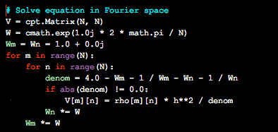{width="100%" fig-alt="Screenshot of Python code (syntax-highlighted, dark background) titled 'Solve equation in Fourier space': sets up matrices V and W, computes Wm/Wn phase factors, and loops over m, n to solve V[m][n] = rho[m][n] * h**2 / denom wherever the denominator is nonzero."}
:::
::::

---

# Multigrid methods

---

## Multigrid methods

- Since PDEs are often done in a higher number of dimensions, it is often beneficial to use "multigrid methods":
  - Start with a coarse lattice, get a rough solution.
  - Change to a finer lattice, get a better solution.
- This is similar to adaptive RK45 in philosophy.
- So, our first necessary ingredient is an estimate of the error at each stage.
- See Numerical Recipes Chapter 20.6

- original version: Haade;vectorization: Wjh31, Quibik, CC BY-SA 3.0 <https://creativecommons.org/licenses/by-sa/3.0>, via Wikimedia Commons

---

## Multigrid methods

- Our example for multigrid methods is the 2D Poisson equation:

- original version: Haade;vectorization: Wjh31, Quibik, CC BY-SA 3.0 <https://creativecommons.org/licenses/by-sa/3.0>, via Wikimedia Commons

- $${ \nabla }^{2}u=\frac{{ \partial }^{2}u}{ \partial {x}^{2}}+\frac{{ \partial }^{2}u}{ \partial {y}^{2}}=-f(x,y)$$

- Same grid on a square of length 1, $0 \leq x,y \leq 1$, Dirichlet BCs.
- On the grid, the solution obeys:

- $${u}_{i,j}=\frac{1}{4}\left[ {u}_{i+1,j}+{u}_{i-1,j}+{u}_{i,j+1}+{u}_{i,j-1}+{h}^{2}{f}_{i,j} \right]$$

- Note: in the notation of NR 20.6, this is a specific case of a general elliptic operator, denoted $\mathcal{L}u=f$

---

## Multigrid methods

- Here is where the method is different: we define a series of grids/lattices with different spacing, $ \ell $. This is the multigrid.
- Specifically, here's the trick: define the interior lattice points as a power of 2, so that the number of points, $L$, is:

- original version: Haade;vectorization: Wjh31, Quibik, CC BY-SA 3.0 <https://creativecommons.org/licenses/by-sa/3.0>, via Wikimedia Commons

- $$L={2}^{ \ell }+2$$

- So, the lattice spacing $h=1/(L-1)$ (accounting for the boundary points).
- And $ \ell $ parametrizes the series of grids (finer grid as $ \ell $ increases):

- $${2}^{ \ell -1} \rightarrow {2}^{ \ell -2} \rightarrow ... \rightarrow {2}^{0}=1$$

---

## Multigrid methods

- Next, let's consider the error at each stage.
- Let $u(x,y)$ be the present solution, and let ${u}_{exact}$ be the exact solution (unknown).
- The (exact) correction is:
- The residual/defect is defined as the "deviation" in the PDE from being solved:

- original version: Haade;vectorization: Wjh31, Quibik, CC BY-SA 3.0 <https://creativecommons.org/licenses/by-sa/3.0>, via Wikimedia Commons

- $$v={u}_{exact}-u$$

- $${ \nabla }^{2}u=\frac{{ \partial }^{2}u}{ \partial {x}^{2}}+\frac{{ \partial }^{2}u}{ \partial {y}^{2}}=-f(x,y)$$

- $$r \equiv { \nabla }^{2}u+f$$

- The correction and residual are related by:

- $${ \nabla }^{2}v=({ \nabla }^{2}{u}_{exact}+f)-({ \nabla }^{2}u+f)=-r$$

- So, interestingly, this is another Poisson equation, swapping $u \rightarrow v$ and $f \rightarrow r$!
  - $r$ is a known source function that we can compute at each stage.

---

## V-cycle algorithm

- With the multigrid series and the correction/residual formulas, let's write down an algorithm (heuristically).
- Define two grids, fine and coarse:

- original version: Haade;vectorization: Wjh31, Quibik, CC BY-SA 3.0 <https://creativecommons.org/licenses/by-sa/3.0>, via Wikimedia Commons

- $$L={2}^{ \ell }+2$$

- $$L={2}^{ \ell -1}+2$$

- General idea:
  - From current solution $u$, move to the coarser grid (restriction, $\mathcal{R}$)
  - Solve for the correction, $v$, using $r$.
  - Move back to the finer grid (prolongation, $\mathcal{P}$)

---

## V-cycle algorithm

- In more detail: assuming we have a prescription for moving between grids, we have a recursive algorithm,
  - $ \ell =0$: only one interior point, so solve exactly:

- original version: Haade;vectorization: Wjh31, Quibik, CC BY-SA 3.0 <https://creativecommons.org/licenses/by-sa/3.0>, via Wikimedia Commons

- $$L={2}^{ \ell }+2$$

- Otherwise, at current $L={2}^{ \ell }+2$:
  - Perform "pre-smoothing" step with a local algorithm like Gauss–Seidel, to "damp" short wavelength errors in $u$.
  - Estimate the correction $v={u}_{exact}-u$:
    - Specifically, calculate $r$ on the finer grid,

- $${u}_{1,1}=({u}_{0,1}+{u}_{2,1}+{u}_{1,0}+{u}_{1,2}+{h}^{2}{f}_{1,1})/4$$

- $${r}_{i,j}=\frac{1}{{h}^{2}}\left[ {u}_{i+1,j}+{u}_{i-1,j}+{u}_{i,j+1}+{u}_{i,j-1}-4{u}_{i,j} \right]+{f}_{i,j}$$

    - Restrict to the coarser grid, ${r}_{i,j} \rightarrow {R}_{i,j}$; set coarser $V=0$; improve recursively (or solve exactly).
    - Prolongate correction to the finer grid: $V \rightarrow v$
  - Correct $u \rightarrow u+v$
  - Apply "post-smoothing" to $u$, again with e.g. Gauss–Seidel.

---

## V-cycle algorithm

- Is it worth it? Let's look at the scaling with $L$.
- The Jacobi/Gauss–Seidel iterations are the most time consuming parts of the algorithms: a single step is $O({L}^{2})$.
- However, we are using G–S on successively coarser grids, ${2}^{ \ell } \rightarrow {2}^{ \ell -1} \rightarrow ...$.
- So, the total number is more like:

- original version: Haade;vectorization: Wjh31, Quibik, CC BY-SA 3.0 <https://creativecommons.org/licenses/by-sa/3.0>, via Wikimedia Commons

- $${L}^{2}\mathop{\mathop{ \sum }\limits_{n=0}}\limits^{ \ell }\frac{1}{{2}^{2n}} \leq {L}^{2}\frac{1}{1-\frac{1}{4}}$$

- So, multigrid is $O({L}^{2})$ instead of $O({L}^{3})$!

---

## V-cycle algorithm: restriction

<!-- TODO: complex slide layout (flagged by detect_complex_slide.py - see run log). Content below is complete but UNARRANGED - needs manual layout to match the original slide. -->

- We still need to define the restriction and prolongation operations.
- Let's look at restriction (fine$ \rightarrow $coarse, $r \rightarrow R$) first: finer lattice has spacing $h$, coarser has spacing $H=2h$.
- With the coarser points as illustrated, simply set to the average of the 4 corners:

- original version: Haade;vectorization: Wjh31, Quibik, CC BY-SA 3.0 <https://creativecommons.org/licenses/by-sa/3.0>, via Wikimedia Commons

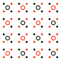{fig-alt="Diagram of a restriction operation between grids: a 4x4 array of alternating black and red dots (fine grid) mapping conceptually to a coarser grid of hollow circles with red dots at their centers."}

- $${R}_{I,J}=\frac{1}{4}\left[ {r}_{i,j}+{r}_{i+1,j}+{r}_{i,j+1}+{r}_{i+1,j+1} \right]$$

- $$i=2I-1,j=2J-1$$

---

## V-cycle algorithm: prolongation

- Prolongation (coarse$ \rightarrow $fine, $V \rightarrow v$):
  - Recall that we solve for the correction term, $ \nabla {V}^{2}=-R(x,y)$ on the coarser grid. (In our code, this is called "twoGrid".)
  - We can just copy ${V}_{I,J}$ into the four nearest points on the finer lattice:

- original version: Haade;vectorization: Wjh31, Quibik, CC BY-SA 3.0 <https://creativecommons.org/licenses/by-sa/3.0>, via Wikimedia Commons

- $${v}_{i,j}={v}_{i+1,j}={v}_{i,j+1}={v}_{i+1,j+1}={V}_{I,J}$$

- $$i=2I-1,j=2J-1$$

---

## V-cycle algorithm

<!-- TODO: complex slide layout (flagged by detect_complex_slide.py - see run log). Content below is complete but UNARRANGED - needs manual layout to match the original slide. -->

- Actually, you can imagine two possibilities:

- original version: Haade;vectorization: Wjh31, Quibik, CC BY-SA 3.0 <https://creativecommons.org/licenses/by-sa/3.0>, via Wikimedia Commons

- $${2}^{3}=8 \rightarrow {2}^{2}=4 \rightarrow {2}^{1}=2 \rightarrow {2}^{0}=1$$

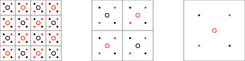{fig-alt="Three side-by-side grid diagrams illustrating cell-centered multigrid restriction: a 4x4 grid of small dots (mix of black, red, and hollow-red-circle centers) at left, refining detail in the middle panel, and a simplified version at right."}

  - Cell-centered:

  - Grid-centered:

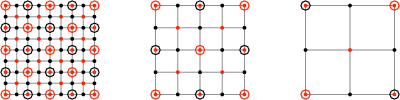{fig-alt="Two grid diagrams illustrating vertex-centered multigrid restriction: 4x4 grids of nodes connected by lines, with black dots, red dots, and circled (highlighted) nodes marking which points participate in the coarse-grid transfer."}

- $${2}^{3}+1=9 \rightarrow {2}^{2}+1=5 \rightarrow {2}^{1}+1=3$$

---

## V-cycle algorithm

- You might have been wondering, "what about the boundary conditions"?
  - Cell-centered: boundary points have to move in space towards the center of the region at each fine$ \rightarrow $coarse step. So you have to be a bit careful here.
  - Vertex/grid-centered: boundary points don't move.
- So vertex-centered can be more convenient.

- original version: Haade;vectorization: Wjh31, Quibik, CC BY-SA 3.0 <https://creativecommons.org/licenses/by-sa/3.0>, via Wikimedia Commons

---

## V-cycle algorithm

<!-- TODO: complex slide layout (flagged by detect_complex_slide.py - see run log). Content below is complete but UNARRANGED - needs manual layout to match the original slide. -->

- How about the restriction and prolongation operations between the two options?
- Cell-centered:
  - Prolongation: set values on fine grid to values from coarse grid.
  - Restriction: average fine points
- Vertex-centered:
  - Prolongation: use bilinear interpolation. Value on coarse grid, $F$, is copied to 9 nearest points with weights.
  - Restriction: adjoint of the prolongation operation, i.e., take average of nearest 9 points with weights

- original version: Haade;vectorization: Wjh31, Quibik, CC BY-SA 3.0 <https://creativecommons.org/licenses/by-sa/3.0>, via Wikimedia Commons

- $$\left[ \begin{matrix}
\frac{1}{4} & \frac{1}{2} & \frac{1}{4} \\
\frac{1}{2} & 1 & \frac{1}{2} \\
\frac{1}{4} & \frac{1}{2} & \frac{1}{4}
\end{matrix} \right]$$

- $$\left[ \begin{matrix}
\frac{1}{16} & \frac{1}{8} & \frac{1}{16} \\
\frac{1}{8} & \frac{1}{4} & \frac{1}{8} \\
\frac{1}{16} & \frac{1}{8} & \frac{1}{16}
\end{matrix} \right]$$

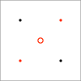{fig-alt="Small 2x2 grid diagram: four black dots at the corners and one red hollow circle at the center, illustrating a cell-centered grid stencil."}

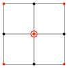{fig-alt="Small 2x2 grid diagram: black dots at the four corners connected by lines, red dots at the edge midpoints, and a red hollow circle at the center, illustrating a vertex-centered grid stencil."}

---

## V-cycle algorithm

:::: {.columns}
::: {.column width="55%"}
- Improvements including using more than one cycle:
  - Repeat the two-grid iteration more than once.
  - Full multigrid starts with a coarse grid, the successively finer grids until desired accuracy is achieved.
- As with spectral methods, see Numerical Recipes Chapter 20.6 for a lot more details!
- original version: Haade;vectorization: Wjh31, Quibik, CC BY-SA 3.0 <https://creativecommons.org/licenses/by-sa/3.0>, via Wikimedia Commons
:::
::: {.column width="45%"}
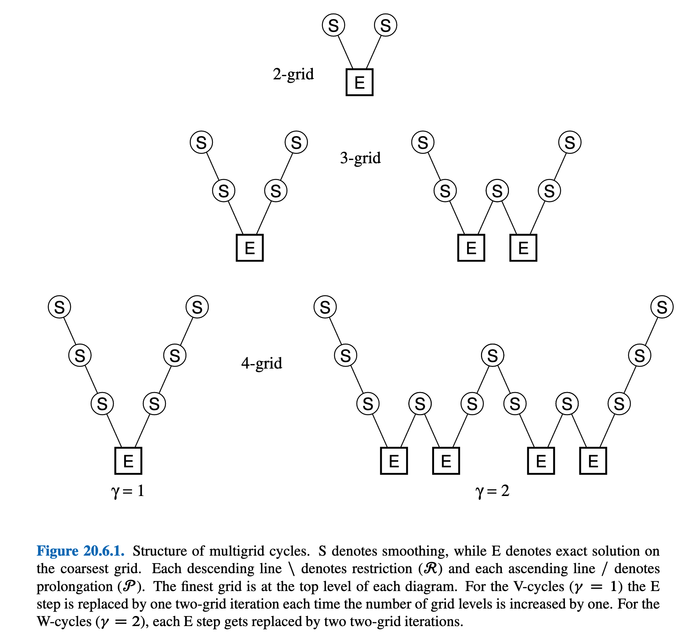{width="100%" fig-alt="Figure 20.6.1 (Numerical Recipes), 'Structure of multigrid cycles': tree diagrams for 2-grid, 3-grid, and 4-grid V-cycles (gamma=1) and W-cycles (gamma=2), where circled S nodes denote smoothing steps and boxed E nodes denote exact solves on the coarsest grid, connected by descending (restriction) and ascending (prolongation) lines."}
:::
::::

---

## Hands-on

- For the rest of today, let's look at a concrete implementation of the multigrid algorithm
  - Notebook: poisson_mg.ipynb
  - Actual code is in poisson_mg.[h, cpp]
- The notebook itself is not that interesting (same results as last time), so you should read through the C++ code in some detail.

- original version: Haade;vectorization: Wjh31, Quibik, CC BY-SA 3.0 <https://creativecommons.org/licenses/by-sa/3.0>, via Wikimedia Commons

---

## Recap

- original version: Haade;vectorization: Wjh31, Quibik, CC BY-SA 3.0 <https://creativecommons.org/licenses/by-sa/3.0>, via Wikimedia Commons

- Two more performant algorithms for elliptic PDE solving:
  - Spectral methods: if problem is "smooth," it might be more efficiently solved in the Fourier domain. You basically know everything needed already!
  - Multigrid method: performance speedup by moving to coarser lattice spacing, iteratively improving solutions.
- Next time: parabolic PDEs
  - Example: time-dependent Schroedinger equation!

---

# Parabolic PDEs

---

## Parabolic PDEs

- original version: Haade;vectorization: Wjh31, Quibik, CC BY-SA 3.0 <https://creativecommons.org/licenses/by-sa/3.0>, via Wikimedia Commons

- Next up: parabolic PDEs.
  - Diffusion
  - Time-dependent Schroedinger equation
- We can take some inspiration from quantum mechanics. Recall that formal solutions take the form:

- $$i \hbar \frac{ \partial }{ \partial t} \psi (x,y)=-\frac{{ \hbar }^{2}}{2m}\frac{{ \partial }^{2}}{ \partial {x}^{2}} \psi +V(x) \psi $$

- $$ \psi (x,t)={e}^{-i\mathcal{H}t/ \hbar } \psi (x,0)$$

- $$\mathcal{H} \equiv -\frac{{ \hbar }^{2}}{2m}\frac{{ \partial }^{2}}{ \partial {x}^{2}}+V(x)={\mathcal{H}}^{ \dagger }$$

---

## Parabolic PDEs

- original version: Haade;vectorization: Wjh31, Quibik, CC BY-SA 3.0 <https://creativecommons.org/licenses/by-sa/3.0>, via Wikimedia Commons

- We will cover 2 strategies for numerically solving parabolic PDEs:
  - Marching in time
    - This is similar to ODE technology, but we now have to account for derivatives in spatial dimensions as well as time.
  - Spectral analysis
    - Just like in your classes, we can also solve the PDE in the Fourier domain. It's often easier there.

---

## Parabolic pdes

- Marching algorithms

---

## Marching algorithms

- original version: Haade;vectorization: Wjh31, Quibik, CC BY-SA 3.0 <https://creativecommons.org/licenses/by-sa/3.0>, via Wikimedia Commons

- In QM, time evolution is unitary, i.e., total probability is conserved:

- $${\left( {e}^{-i\mathcal{H}t/ \hbar } \right)}^{ \dagger }={\left( {e}^{-i\mathcal{H}t/ \hbar } \right)}^{-1}$$

- $$ \int | \psi (x,y){|}^{2}dx= \int | \psi (x,0){|}^{2}dx$$

- In diffusion, on the other hand, evolution is not unitary:

- $$\frac{ \partial }{ \partial t}n(x,t)=D\frac{{ \partial }^{2}}{ \partial {x}^{2}}n(x,t)+Cn(x,t)$$

- This leads to the characteristic phenomenon of damping.
- (Schroedinger's equation is mathematically equivalent to diffusion with an imaginary diffusion constant, or diffusion in imaginary time)

---

## Marching algorithms

- original version: Haade;vectorization: Wjh31, Quibik, CC BY-SA 3.0 <https://creativecommons.org/licenses/by-sa/3.0>, via Wikimedia Commons

- Let's look at a free particle as an instructive case:

- $$ \psi (x,t) \sim {e}^{i(px-Et)/ \hbar }$$

- Of course, a plane wave is not localized in space.
  - No way to normalize it, not a "real" particle solution.
- Let's instead construct a Gaussian state:

- $$ \phi (x)={\left(  \pi { \sigma }^{2} \right)}^{-1/4}{e}^{-(x-{x}_{0}{)}^{2}/(2{ \sigma }^{2})}$$

- This is a stationary solution, as can be seen by computing the momentum:

- $$p= \pm \sqrt{2mE}$$

- $$⟨p⟩={ \int }_{- \infty }^{ \infty }dx{ \phi }^{*}(x)\left( -i \hbar \frac{d}{dx} \right) \phi (x)=0$$

---

## Marching algorithms

- original version: Haade;vectorization: Wjh31, Quibik, CC BY-SA 3.0 <https://creativecommons.org/licenses/by-sa/3.0>, via Wikimedia Commons

- We can get a moving solution by multiplying by a phase factor:

- $$ \psi (x)= \phi (x){e}^{ikx}$$

- The energy of the state is:

- $$⟨ \psi |\frac{{p}^{2}}{2m}| \psi ⟩=\frac{{ \hbar }^{2}}{2m}\left( {k}^{2}+\frac{1}{2{ \sigma }^{2}} \right)$$

- $$\begin{matrix}
⟨ \psi |p| \psi ⟩ & ={ \int }_{- \infty }^{ \infty }{ \psi }^{*}(x){e}^{-ikx}\left( -i \hbar \frac{d}{dx} \right){e}^{ikx} \psi (x) \\
 & ={ \int }_{- \infty }^{ \infty }dx\left[  \hbar k| \phi (x){|}^{2}-i \hbar  \phi (x){ \phi }^{′}(x) \right] \\
 & = \hbar k
\end{matrix}$$

- This is close to a classical particle, if the packet isn't too narrow.

---

## Marching algorithms

- original version: Haade;vectorization: Wjh31, Quibik, CC BY-SA 3.0 <https://creativecommons.org/licenses/by-sa/3.0>, via Wikimedia Commons

- So, our wave packet at $t=0$ is:

- $$ \psi (x,0)={\left( \sqrt{2 \pi { \sigma }^{2}} \right)}^{-1/4}{e}^{i{k}_{0}x-(x-{x}_{0}{)}^{2}/(4{ \sigma }^{2})}$$

- This moves to the right with speed $ \hbar {k}_{0}/m$.
- We can approximate this on a lattice with an $N$-component complex vector.
- If the potential $V(x)$ is a function of space alone (i.e. it's constant in time), we can precompute the following quantity for efficiency:

- $${e}^{-iV{ \delta }_{t}/(2 \hbar )}$$

---

## Forward time-centered scheme

- original version: Haade;vectorization: Wjh31, Quibik, CC BY-SA 3.0 <https://creativecommons.org/licenses/by-sa/3.0>, via Wikimedia Commons

- Now onto finite differences. Let's start with a forward time-centered scheme (FTCS):

- $$i \hbar \frac{{ \psi }_{j}^{n+1}-{ \psi }_{j}^{n}}{{ \delta }_{t}}=-\frac{{ \hbar }^{2}}{2m}\frac{{ \psi }_{j+1}^{n}-2{ \psi }_{j}^{n}+{ \psi }_{j-1}^{n}}{{ \delta }_{x}^{2}}+{V}_{j}{ \psi }_{j}^{n}$$

- Upper index = time
- Lower index = space

- This can be solved explicitly for the solution at the next time step:

- $${ \psi }_{j}^{n+1}={ \psi }_{j}^{n}-\frac{i{ \delta }_{t}}{ \hbar }\left[ -\frac{{ \hbar }^{2}}{2m}\frac{{ \psi }_{j+1}^{n}-2{ \psi }_{j}^{n}+{ \psi }_{j-1}^{n}}{{ \delta }_{x}^{2}}+{V}_{j}{ \psi }_{j}^{n} \right]$$

- Let's convert this to matrix form (in space). Let ${ \Psi }^{n}=({ \psi }_{1}^{n}{ \psi }_{2}^{n}...{ \psi }_{N}^{n}{)}^{T}$:

- $${ \Psi }^{n+1}=\left( \mathbf{I}-\frac{i{ \delta }_{t}}{ \hbar }\mathbf{H} \right){ \Psi }^{n}$$

---

## Forward time-centered scheme

- original version: Haade;vectorization: Wjh31, Quibik, CC BY-SA 3.0 <https://creativecommons.org/licenses/by-sa/3.0>, via Wikimedia Commons

- The FTCS scheme, unfortunately, is unstable.
- For instance, consider an eigenfunction of the Hamiltonian,

- $$\mathbf{H}{ \Psi }^{1}=E{ \Psi }^{1}$$

- Running forward in time,

- $${ \Psi }^{n+1}=\left( 1-\frac{i{ \delta }_{t}E}{ \hbar } \right){ \Psi }^{n}={\left( 1-\frac{i{ \delta }_{t}E}{ \hbar } \right)}^{2}{ \Psi }^{n-1}=...={\left( 1-\frac{i{ \delta }_{t}E}{ \hbar } \right)}^{n}{ \Psi }^{1}$$

- $$|{ \Psi }^{n+1}|={\left( \sqrt{1+\frac{{ \delta }_{t}^{2}{E}^{2}}{{ \hbar }^{2}}} \right)}^{n}{ \Psi }^{1}\mathop{\mathop{ \rightarrow }\limits_{n \rightarrow  \infty }}\limits^{} \infty $$

- Booooo!

---

## Backwards time-centered scheme

<!-- TODO: complex slide layout (flagged by detect_complex_slide.py - see run log). Content below is complete but UNARRANGED - needs manual layout to match the original slide. -->

- original version: Haade;vectorization: Wjh31, Quibik, CC BY-SA 3.0 <https://creativecommons.org/licenses/by-sa/3.0>, via Wikimedia Commons

- What about a backwards time-centered scheme (BTCS)?

- $$i \hbar \frac{{ \psi }_{j}^{n+1}-{ \psi }_{j}^{n}}{{ \delta }_{t}}=-\frac{{ \hbar }^{2}}{2m}\frac{{ \psi }_{j+1}^{n+1}-2{ \psi }_{j}^{n+1}+{ \psi }_{j-1}^{n+1}}{{ \delta }_{x}^{2}}+{V}_{j}{ \psi }_{j}^{n+1}$$

{fig-alt="Decorative hand-painted pink/magenta rectangular border/frame; the image itself contains no other content."}

{fig-alt="Decorative hand-painted pink/magenta rectangular border/frame; the image itself contains no other content."}

{fig-alt="Decorative hand-painted pink/magenta rectangular border/frame; the image itself contains no other content."}

- We can't solve this directly/straightforwardly at each iteration. Instead, rearrange and solve:

- $$\begin{matrix}
{ \psi }_{j}^{n} & ={ \psi }_{j}^{n+1}+\frac{i{ \delta }_{t}}{ \hbar }\left[ -\frac{{ \hbar }^{2}}{2m}\frac{{ \psi }_{j+1}^{n+1}+{ \psi }_{j-1}^{n+1}-2{ \psi }_{j}^{n+1}}{{ \delta }_{x}^{2}}+{V}_{j}{ \psi }_{j}^{n+1} \right] \\
{ \Psi }^{n} & =\left( \mathbf{I}+\frac{i{ \delta }_{t}}{ \hbar }\mathbf{H} \right){ \Psi }^{n+1}
\end{matrix}$$

- So, ${ \Psi }^{n+1}={\left( \mathbf{I}+\frac{i{ \delta }_{t}}{ \hbar }\mathbf{H} \right)}^{-1}{ \Psi }^{n}$

---

## Backwards time-centered scheme

- original version: Haade;vectorization: Wjh31, Quibik, CC BY-SA 3.0 <https://creativecommons.org/licenses/by-sa/3.0>, via Wikimedia Commons

- This is a bit better — more "stable", but still wrong:

- $${ \Psi }^{n+1}={\left( 1+\frac{i{ \delta }_{t}E}{ \hbar } \right)}^{-1}{ \Psi }^{n}=...={\left( 1+\frac{i{ \delta }_{t}E}{ \hbar } \right)}^{-n}{ \Psi }^{1}$$

- The magnitude is:

- $$|{ \Psi }^{n+1}|={\left( \sqrt{1+\frac{{ \delta }_{t}^{2}{E}^{2}}{{ \hbar }^{2}}} \right)}^{-n}|{ \Psi }^{1}|\mathop{\mathop{ \rightarrow }\limits_{n \rightarrow  \infty }}\limits^{}0$$

- Booooo!

---

## Symmetric time-centered scheme

- original version: Haade;vectorization: Wjh31, Quibik, CC BY-SA 3.0 <https://creativecommons.org/licenses/by-sa/3.0>, via Wikimedia Commons

- Symmetric time space centered (STCS) differencing does the trick (Crank–Nicolson):

- $$i \hbar \frac{{ \psi }_{j}^{n+1}-{ \psi }_{j}^{n}}{{ \delta }_{t}}=\frac{1}{2}\mathbf{H}\left( { \Psi }^{n}+{ \Psi }^{n+1} \right)$$

- Solving this as a matrix equation again,

- $${ \Psi }^{n+1}={\left( \mathbf{I}+\frac{i{ \delta }_{t}}{2 \hbar }\mathbf{H} \right)}^{-1}\left( \mathbf{I}-\frac{i{ \delta }_{t}}{2 \hbar }\mathbf{H} \right){ \Psi }^{n}$$

- This is now unitary, and conserves probability.

- $$\begin{matrix}
{ \Psi }^{n+1} & ={\left[ \frac{1-i{ \delta }_{t}E/(2 \hbar )}{1+i{ \delta }_{t}E/(2 \hbar )} \right]}^{n}{ \Psi }^{1} \\
|{ \Psi }^{n+1}| & =|{ \Psi }^{1}|
\end{matrix}$$

---

## Symmetric time-centered scheme

- original version: Haade;vectorization: Wjh31, Quibik, CC BY-SA 3.0 <https://creativecommons.org/licenses/by-sa/3.0>, via Wikimedia Commons

- As you might guess, STCS is also more accurate than FTCS and BTCS.
- To see this, we can count factors of $i\mathbf{H}{ \delta }_{t}/ \hbar $.
- Exact form for one time step:
- BTCS: $1/(1+z)=1-z+{z}^{2}-{z}^{3}+... \approx {e}^{-z}+O({ \delta }_{t}^{2})$
- STCS: $\frac{1-z/2}{1+z/2}=(1-\frac{z}{2}+\frac{{z}^{2}}{4}-\frac{{z}^{3}}{8}+...)(1-\frac{z}{2})=1-z+\frac{{z}^{2}}{2}-\frac{{z}^{3}}{4}+... \approx {e}^{-z}+O({ \delta }_{t}^{3})$

- $${e}^{i\mathbf{H}{ \delta }_{t}/ \hbar } \equiv {e}^{-z}=1-z+\frac{{z}^{2}}{2}-\frac{{z}^{3}}{6}+...$$

---

## Symmetric time-centered scheme

- original version: Haade;vectorization: Wjh31, Quibik, CC BY-SA 3.0 <https://creativecommons.org/licenses/by-sa/3.0>, via Wikimedia Commons

- To recap: now we have the Schroedinger equation...

- $$i \hbar \frac{ \partial }{ \partial t} \psi (x,t)=-\frac{{ \hbar }^{2}}{2m}\frac{{ \partial }^{2}}{ \partial {x}^{2}} \psi +V \psi $$

- ...solved using the SCTS (Crank–Nicolson) algorithm,

- $${ \Psi }^{n+1}={\left( \mathbf{I}+\frac{i{ \delta }_{t}}{2 \hbar }\mathbf{H} \right)}^{-1}\left( \mathbf{I}-\frac{i{ \delta }_{t}}{2 \hbar }\mathbf{H} \right){ \Psi }^{n}$$

- This is now a matrix inversion problem.
- Is this computationally tractable?
  - Yes! It's a sparse matrix.
  - Let's take a look at a few examples.

- ${ \Psi }^{n}=$column vector of ${ \psi }_{j}^{n}$
- at time $n$

---

## Symmetric time-centered scheme

- original version: Haade;vectorization: Wjh31, Quibik, CC BY-SA 3.0 <https://creativecommons.org/licenses/by-sa/3.0>, via Wikimedia Commons

- Dirichlet BCs: ${ \psi }_{0}=0$, ${ \psi }_{N+1}=0$.

- $${\left( \frac{{ \partial }^{2} \psi }{ \partial {x}^{2}} \right)}_{j}^{n}=\frac{1}{{ \delta }_{x}^{2}}\left\{\begin{matrix}
{ \psi }_{2}^{n}-2{ \psi }_{1}^{n} & : & j=1 \\
{ \psi }_{j+1}^{n}-2{ \psi }_{j}^{n}+{ \psi }_{j-1}^{n} & : & 1<j<N \\
{ \psi }_{N-1}^{n}-2{ \psi }_{N}^{n} & : & j=N
\end{matrix}\right.$$

- Writing it down explicitly for $N=5$,

- $${\mathbf{H}}_{Dir.}=-\frac{{ \hbar }^{2}}{2m{ \delta }_{x}^{2}}\left( \begin{matrix}
-2 & 1 & 0 & 0 & 0 \\
1 & -2 & 1 & 0 & 0 \\
0 & 1 & -2 & 1 & 0 \\
0 & 0 & 1 & -2 & 1 \\
0 & 0 & 0 & -2 & 1
\end{matrix} \right)+\left( \begin{matrix}
{V}_{1} & 0 & 0 & 0 & 0 \\
0 & {V}_{2} & 0 & 0 & 0 \\
0 & 0 & {V}_{3} & 0 & 0 \\
0 & 0 & 0 & {V}_{4} & 0 \\
0 & 0 & 0 & 0 & {V}_{5}
\end{matrix} \right)$$

---

## Symmetric time-centered scheme

- original version: Haade;vectorization: Wjh31, Quibik, CC BY-SA 3.0 <https://creativecommons.org/licenses/by-sa/3.0>, via Wikimedia Commons

- Periodic BCs:

- $${\left( \frac{{ \partial }^{2} \psi }{ \partial {x}^{2}} \right)}_{j}^{n}=\frac{1}{{ \delta }_{x}^{2}}\left\{\begin{matrix}
{ \psi }_{2}^{n}-2{ \psi }_{1}^{n}+{ \psi }_{N}^{n} & : & j=1 \\
{ \psi }_{j+1}^{n}-2{ \psi }_{j}^{n}+{ \psi }_{j-1}^{n} & : & 1<j<N \\
{ \psi }_{1}^{n}-2{ \psi }_{N}^{n}+{ \psi }_{N-1}^{n} & : & j=N
\end{matrix}\right.$$

- Writing it down explicitly for $N=5$,

- $${\mathbf{H}}_{Per.}=-\frac{{ \hbar }^{2}}{2m{ \delta }_{x}^{2}}\left( \begin{matrix}
-2 & 1 & 0 & 0 & 1 \\
1 & -2 & 1 & 0 & 0 \\
0 & 1 & -2 & 1 & 0 \\
0 & 0 & 1 & -2 & 1 \\
1 & 0 & 0 & -2 & 1
\end{matrix} \right)+\left( \begin{matrix}
{V}_{1} & 0 & 0 & 0 & 0 \\
0 & {V}_{2} & 0 & 0 & 0 \\
0 & 0 & {V}_{3} & 0 & 0 \\
0 & 0 & 0 & {V}_{4} & 0 \\
0 & 0 & 0 & 0 & {V}_{5}
\end{matrix} \right)$$

---

## Symmetric time-centered scheme

- original version: Haade;vectorization: Wjh31, Quibik, CC BY-SA 3.0 <https://creativecommons.org/licenses/by-sa/3.0>, via Wikimedia Commons

- Both of these are tridiagonal, and can be solved with our matrix methods from the linear algebra section.
- For example: note that

- $${\left( \mathbf{I}+\frac{i{ \delta }_{t}}{2 \hbar }\mathbf{H} \right)}^{-1}\left( \mathbf{I}-\frac{i{ \delta }_{t}}{2 \hbar }\mathbf{H} \right)={\mathbf{Q}}^{-1}-\mathbf{I}$$

- $$\mathbf{Q}=\frac{1}{2}\left( \mathbf{I}+\frac{i{ \delta }_{t}}{2 \hbar }\mathbf{H} \right)$$

- So, we can first solve for:
- And then

- $\mathbf{Q} \chi ={ \Psi }^{n}, \chi ={\mathbf{Q}}^{-1}{ \Psi }^{n}$,

- $${ \Psi }^{n+1}= \chi -{ \Psi }^{n}$$

- $${ \Psi }^{n+1}={\left( \mathbf{I}+\frac{i{ \delta }_{t}}{2 \hbar }\mathbf{H} \right)}^{-1}\left( \mathbf{I}-\frac{i{ \delta }_{t}}{2 \hbar }\mathbf{H} \right){ \Psi }^{n}$$

---

## Parabolic PDEs

- Spectral analysis

---

## Fourier domain

- original version: Haade;vectorization: Wjh31, Quibik, CC BY-SA 3.0 <https://creativecommons.org/licenses/by-sa/3.0>, via Wikimedia Commons

- To solve the Schroedinger equation exactly, we can use exact solutions from the Fourier domain (and keep in mind we'll do an IFFT later).
- Notation: write the S.E. as:

- $$i \hbar \frac{ \partial  \psi }{ \partial t}=-\frac{{ \hbar }^{2}}{2m}\frac{{ \partial }^{2} \psi }{ \partial {x}^{2}}+V(x) \psi =(\mathcal{T}+\mathcal{V}) \psi $$

- Real domain: $\mathcal{T}$ is a differential operator, $\mathcal{V}$ is a multiplicative operator.

---

## Fourier domain

- original version: Haade;vectorization: Wjh31, Quibik, CC BY-SA 3.0 <https://creativecommons.org/licenses/by-sa/3.0>, via Wikimedia Commons

- How about in the reciprocal domain? Let's take the FT the spatial axis:
- So now, in the Fourier domain, $\mathcal{T}$ is a multiplicative operator, and $\mathcal{V}$ is a convolutional operator.
  - This is an integral equation in the Fourier domain.

- $$\mathop{ \psi }\limits^{˜}(p,t)=\frac{1}{\sqrt{2 \pi  \hbar }}{ \int }_{- \infty }^{ \infty }dx{e}^{-ipx/ \hbar } \psi (x,t)$$

- $$i \hbar \frac{ \partial \mathop{ \psi }\limits^{˜}(p,t)}{dt}=\frac{{p}^{2}}{2m}\mathop{ \psi }\limits^{˜}(p,t)+\frac{1}{\sqrt{2 \pi  \hbar }}{ \int }_{- \infty }^{ \infty }dq\mathop{V}\limits^{˜}(p-q)\mathop{ \psi }\limits^{˜}(q,t)$$

---

## Fourier domain

- original version: Haade;vectorization: Wjh31, Quibik, CC BY-SA 3.0 <https://creativecommons.org/licenses/by-sa/3.0>, via Wikimedia Commons

- Formal solution of the S.E:

- $$ \psi (x,t)={e}^{-i(\mathcal{T}+\mathcal{V})(t-{t}_{0})/ \hbar } \psi (x,{t}_{0})$$

- However, since $\mathcal{T}$ and $\mathcal{V}$ don't commute, this is not very nice for numerical evaluation.

- $${e}^{\mathcal{A}} \equiv 1+\mathcal{A}+\frac{1}{2!}\mathcal{A}\mathcal{A}+\frac{1}{3!}\mathcal{A}\mathcal{A}\mathcal{A}+...$$

- where the exponentiation of operators is defined via the Taylor series,

---

## Fourier domain

- original version: Haade;vectorization: Wjh31, Quibik, CC BY-SA 3.0 <https://creativecommons.org/licenses/by-sa/3.0>, via Wikimedia Commons

- To make a discrete-time approximation, consider a small time step ${ \delta }_{t}$:

- $$ \psi (x,t+{ \delta }_{t})={e}^{-i(\mathcal{T}+\mathcal{V}){ \delta }_{t}/ \hbar } \psi (x,t)$$

- In the limit of small ${ \delta }_{t}$, we can disentangle $\mathcal{T}$ and $\mathcal{V}$, and quantify the truncation error.
- Specifically, we use Baker–Campbell–Hausdorff (wikipedia), which provides the solution $\mathcal{C}$ given $\mathcal{A}$ and $\mathcal{B}$ satisfying  ${e}^{\mathcal{A}}{e}^{\mathcal{B}}={e}^{\mathcal{C}}$:

- $$\mathcal{C}=\mathcal{A}+\mathcal{B}+\frac{1}{2}[\mathcal{A},\mathcal{B}]+\frac{1}{12}[\mathcal{A},[\mathcal{A},\mathcal{B}]]+\frac{1}{12}[\mathcal{B},[\mathcal{B},\mathcal{A}]]+...$$

---

## Fourier domain

- original version: Haade;vectorization: Wjh31, Quibik, CC BY-SA 3.0 <https://creativecommons.org/licenses/by-sa/3.0>, via Wikimedia Commons

- The commutator is:

- $$[\mathcal{T},\mathcal{V}]=-\frac{{ \hbar }^{2}}{2m}\left[ \frac{{d}^{2}}{d{x}^{2}},V(x) \right]=-\frac{{ \hbar }^{2}}{2m}{V}^{′′}(x)-\frac{{ \hbar }^{2}}{m}{V}^{′}(x)\frac{d}{dx} \neq 0$$

- So, the naive factorization has error $O({ \delta }_{t}^{2})$:
  - ${e}^{-i(\mathcal{T}+\mathcal{V}){ \delta }_{t}/ \hbar } \approx {e}^{-i\mathcal{T}{ \delta }_{t}/ \hbar }{e}^{-i\mathcal{V}{ \delta }_{t}/ \hbar }$, misses the first commutator.
- However, the symmetric factorization actually improves to $O({ \delta }_{t}^{3})$:

- $${e}^{-i(\mathcal{T}+\mathcal{V}){ \delta }_{t}/ \hbar } \approx {e}^{-i\mathcal{V}{ \delta }_{t}/(2 \hbar )}{e}^{-i\mathcal{T}{ \delta }_{t}/ \hbar }{e}^{-i\mathcal{V}{ \delta }_{t}/(2 \hbar )}$$

- $$\mathcal{C}=\mathcal{A}+\mathcal{B}+\frac{1}{2}[\mathcal{A},\mathcal{B}]+\frac{1}{12}[\mathcal{A},[\mathcal{A},\mathcal{B}]]+\frac{1}{12}[\mathcal{B},[\mathcal{B},\mathcal{A}]]+...$$

- Bonus: it's also unitary, preserving $| \psi |$.

---

## Fourier domain

- original version: Haade;vectorization: Wjh31, Quibik, CC BY-SA 3.0 <https://creativecommons.org/licenses/by-sa/3.0>, via Wikimedia Commons

- Our time evolution algorithm (symmetric factorization * spectral methods) is:
  - Multiply by first half-$\mathcal{V}$ time step (diagonal in position space)
  - Fourier transform to momentum space
  - Multiply by full-$\mathcal{T}$ time step (diagonal in momentum space)
  - Fourier transform${}^{-1}$ to position space
  - Multiply by second half-$\mathcal{V}$ time step (diagonal in position space)

- $$ \psi (x,t) \rightarrow { \psi }_{1}(x)={e}^{-iV(x){ \delta }_{t}/(2 \hbar )} \psi (x,t)$$

- $${\mathop{ \psi }\limits^{˜}}_{1}(p)=\frac{1}{\sqrt{2 \pi  \hbar }}{ \int }_{- \infty }^{ \infty }dx{e}^{-ipx/ \hbar }{ \psi }_{1}(x)$$

- $${\mathop{ \psi }\limits^{˜}}_{1}(p) \rightarrow {\mathop{ \psi }\limits^{˜}}_{2}(p)={e}^{-i{p}^{2}{ \delta }_{t}/(2m \hbar )}{\mathop{ \psi }\limits^{˜}}_{1}(p)$$

- $${ \psi }_{2}(x)=\frac{1}{\sqrt{2 \pi  \hbar }}{ \int }_{- \infty }^{ \infty }dp{e}^{ipx/ \hbar }{\mathop{ \psi }\limits^{˜}}_{2}(p)$$

- $$ \psi (x,t+{ \delta }_{t})={e}^{-iV(x){ \delta }_{t}/ \hbar }{ \psi }_{2}(x)$$

---

## Demo

- original version: Haade;vectorization: Wjh31, Quibik, CC BY-SA 3.0 <https://creativecommons.org/licenses/by-sa/3.0>, via Wikimedia Commons

- Both methods (Crank–Nicolson and spectral methods) are implemented in CompPhys/PDEs/wavepacket.ipynb.
  - Give it a try!
- However, in the interest of time, I will move straight to the last PDE problem, hyperbolic PDEs.

---

# Hyperbolic PDEs

---

## Hyperbolic PDEs

- original version: Haade;vectorization: Wjh31, Quibik, CC BY-SA 3.0 <https://creativecommons.org/licenses/by-sa/3.0>, via Wikimedia Commons

- Hyperbolic PDEs cover a wide range of physics problems:
  - Light waves
  - Sound waves
  - Water waves
  - ...

- $$\frac{1}{{c}^{2}}\frac{{ \partial }^{2}u(\mathbf{r},t)}{ \partial {t}^{2}}-{ \nabla }^{2}u(\mathbf{r},t)=R(\mathbf{r},t)$$

- Wave speed

- Hyperbolic eqn
- ($+d{t}^{2}-d{x}^{2}$)

- Source term

---

## Hyperbolic PDEs

- original version: Haade;vectorization: Wjh31, Quibik, CC BY-SA 3.0 <https://creativecommons.org/licenses/by-sa/3.0>, via Wikimedia Commons

- A hyperbolic PDE has a unique solution if:
  - Initial values $u(\mathbf{r},{t}_{0})$ and $\mathop{u}\limits^{ \cdot }(\mathbf{r},{t}_{0})$ are specified.
  - Boundary values specified on a closed region.
- Consider the simplest case, 1D and no source term:

- $$\frac{{ \partial }^{2}u}{ \partial {t}^{2}}={c}^{2}\frac{{ \partial }^{2}u}{ \partial {x}^{2}}$$

- This factorizes into simpler first-order equations:

- $$\frac{{ \partial }^{2}}{ \partial {t}^{2}}-{c}^{2}\frac{{ \partial }^{2}}{ \partial {x}^{2}}=\left( \frac{ \partial }{ \partial t}+c\frac{ \partial }{ \partial x} \right)\left( \frac{ \partial }{ \partial t}-c\frac{ \partial }{ \partial x} \right)$$

---

## Hyperbolic PDEs

- original version: Haade;vectorization: Wjh31, Quibik, CC BY-SA 3.0 <https://creativecommons.org/licenses/by-sa/3.0>, via Wikimedia Commons

- This factorization corresponds to left-moving or right-moving solutions:

- $$\frac{{ \partial }^{2}}{ \partial {t}^{2}}-{c}^{2}\frac{{ \partial }^{2}}{ \partial {x}^{2}}=\left( \frac{ \partial }{ \partial t}+c\frac{ \partial }{ \partial x} \right)\left( \frac{ \partial }{ \partial t}-c\frac{ \partial }{ \partial x} \right)$$

- $$u(x,t)=f(x-ct)+g(x+ct)$$

- $f$ and $g$ are determined from the initial conditions.

- $$\left( \frac{ \partial }{ \partial t}+c\frac{ \partial }{ \partial x} \right)f(x-ct)=0$$

- $$\left( \frac{ \partial }{ \partial t}-c\frac{ \partial }{ \partial x} \right)g(x+ct)=0$$

---

## Hyperbolic PDEs

<!-- TODO: complex slide layout (flagged by detect_complex_slide.py - see run log). Content below is complete but UNARRANGED - needs manual layout to match the original slide. -->

- original version: Haade;vectorization: Wjh31, Quibik, CC BY-SA 3.0 <https://creativecommons.org/licenses/by-sa/3.0>, via Wikimedia Commons

- Specifically, let's consider the right-moving solutions, $f(x-ct)$.

- $$\frac{ \partial u}{ \partial t}=-c\frac{ \partial u}{ \partial x}$$

- $$u(x,t)={f}_{0}(x-ct)$$

- Here, ${f}_{0}$ is just the initial condition specified at $t=0$.
- Interpretation: the initial shape just moves right with velocity $c$.
  - Advection
- Contrast with problems where the wave shape changes with position.
  - Convection: hot fluid rising, cold fluid sinking.

---

## Advection

- original version: Haade;vectorization: Wjh31, Quibik, CC BY-SA 3.0 <https://creativecommons.org/licenses/by-sa/3.0>, via Wikimedia Commons

- In advection, the flux is conserved:

- $$\frac{ \partial \vec{u}}{ \partial t}=-\frac{ \partial \vec{F}(\vec{u})}{ \partial x}$$

- Let $u(x,t)$ be the density at $(x,t)$.
- Consider the mass in a closed region, $[{x}_{L},{x}_{R}]$:

- $F$ = flux

- $$M(t)={ \int }_{{x}_{L}}^{{x}_{R}}u(x,t)dx$$

- $$\frac{dM}{dt}={ \int }_{{x}_{L}}^{{x}_{R}}\frac{ \partial u}{ \partial t}=-{ \int }_{{x}_{L}}^{{x}_{R}}\frac{ \partial F}{ \partial x}dx=F(u({x}_{L},t))-F(u({x}_{R},t))$$

---

## Advection

- original version: Haade;vectorization: Wjh31, Quibik, CC BY-SA 3.0 <https://creativecommons.org/licenses/by-sa/3.0>, via Wikimedia Commons

- This should remind you of vector calculus and Stokes' theorem.
  - [https://en.wikipedia.org/wiki/Flux](https://en.wikipedia.org/wiki/Flux)
  - [https://en.wikipedia.org/wiki/Stokes%27_theorem](https://en.wikipedia.org/wiki/Stokes%27_theorem)

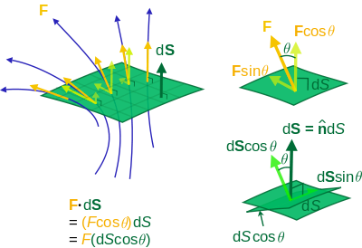{width="70%" fig-alt="Diagram illustrating flux through a surface: a 3D view of vector field lines (blue) passing through a surface patch with normal vector dS and flux vector F (left), and two supporting 2D diagrams decomposing F and dS into components via Fcos(theta), Fsin(theta), dScos(theta), and dSsin(theta) (right)."}

---

## Finite differences

<!-- TODO: complex slide layout (flagged by detect_complex_slide.py - see run log). Content below is complete but UNARRANGED - needs manual layout to match the original slide. -->

- original version: Haade;vectorization: Wjh31, Quibik, CC BY-SA 3.0 <https://creativecommons.org/licenses/by-sa/3.0>, via Wikimedia Commons

- Let's move onto numerics. In 1D, you might already guess how we discretize the problem.
- As with parabolic PDEs, let's first try a forward time-centered scheme, (and see where it goes wrong):

- $${u}_{j}^{n+1}={u}_{j}^{n}-\frac{c{ \delta }_{t}}{2{ \delta }_{x}}\left( {u}_{j+1}^{n}-{u}_{j-1}^{n} \right)$$

- This is just the first-order finite difference equations, choosing a symmetric difference for $\frac{ \partial }{ \partial x}$.

- $$\frac{ \partial u}{ \partial t}=-c\frac{ \partial u}{ \partial x}$$

---

## Forward centered time scheme

- original version: Haade;vectorization: Wjh31, Quibik, CC BY-SA 3.0 <https://creativecommons.org/licenses/by-sa/3.0>, via Wikimedia Commons

- Just like for the Schroedinger equation, the FCTS is no good for conserved quantities ("unconditionally unstable").
- Consider a Fourier mode, ${u}_{j}^{n}={e}^{ikj{ \delta }_{x}}$:

- $${u}_{j}^{n+1}={u}_{j}^{n}-\frac{c{ \delta }_{t}}{2{ \delta }_{x}}\left( {u}_{j+1}^{n}-{u}_{j-1}^{n} \right)$$

- $${u}_{j}^{n+1}={e}^{ikj{ \delta }_{x}}-\frac{c{ \delta }_{t}}{2 \delta x}\left( {e}^{ik(j+1){ \delta }_{x}}-{e}^{ik(j-1){ \delta }_{x}} \right)=\left( 1-i\frac{c{ \delta }_{t}}{{ \delta }_{x}} \right){u}_{j}^{n} \equiv  \xi {u}_{j}^{n}$$

- At each iteration, the modes are amplified by a factor of $ \xi =(1-i\frac{c{ \delta }_{t}}{{ \delta }_{x}})$ .

---

## Lax method

<!-- TODO: complex slide layout (flagged by detect_complex_slide.py - see run log). Content below is complete but UNARRANGED - needs manual layout to match the original slide. -->

- original version: Haade;vectorization: Wjh31, Quibik, CC BY-SA 3.0 <https://creativecommons.org/licenses/by-sa/3.0>, via Wikimedia Commons

- Solution: Lax method,

- $$\begin{matrix}
 \xi  & =\frac{1}{2}\left( {e}^{ik{ \delta }_{x}}+{e}^{-ik \delta x} \right)-\frac{c \delta -t}{2{ \delta }_{x}}\left( {e}^{ik{ \delta }_{x}}-{e}^{ik{ \delta }_{x}} \right) \\
| \xi | & ={cos}^{2}(k \delta x)+{\left( \frac{c{ \delta }_{t}}{{ \delta }_{x}} \right)}^{2}{sin}^{2}(k{ \delta }_{x})
\end{matrix}$$

- $${u}_{j}^{n+1}=\frac{1}{2}({u}_{j+1}^{n}+{u}_{j-1}^{n})-\frac{c{ \delta }_{t}}{2{ \delta }_{x}}\left( {u}_{j+1}^{n}-{u}_{j-1}^{n} \right)$$

- The mode amplification factor is:

- $${u}_{j}^{n+1}={u}_{j}^{n}-\frac{c{ \delta }_{t}}{2{ \delta }_{x}}\left( {u}_{j+1}^{n}-{u}_{j-1}^{n} \right)$$

- So, we just have to choose ${ \delta }_{t}={ \delta }_{x}/c$, and $| \xi |=1$.
  - Other choices will cause solutions to grow or decay.
  - Note: decay is much better than blowing up! See NR 20.1.

- Note: Lax is a name, not an adjective

---

## Courant–Freidrichs–Lewy condition

<!-- TODO: complex slide layout (flagged by detect_complex_slide.py - see run log). Content below is complete but UNARRANGED - needs manual layout to match the original slide. -->

- original version: Haade;vectorization: Wjh31, Quibik, CC BY-SA 3.0 <https://creativecommons.org/licenses/by-sa/3.0>, via Wikimedia Commons

- This is the Courant–Freidrichs–Lewy condition:

- $\frac{c{ \delta }_{t}}{{ \delta }_{x}} \leq 1$ (CFL number)

{fig-alt="Logo of the Canadian Football League (CFL): a black football-helmet outline containing a red maple leaf with 'CFL' lettered across it - a pun on the Courant-Friedrichs-Lewy (CFL) condition."}

- Intuition: at some given point $(x,t)$, the domain of dependency = set of points in the "past cone" defined by $c$.
- If the domain used for the finite difference update is wider in $x$ than the domain of dependency, the method is stable.
- If the differencing domain is narrower, the method is unstable.

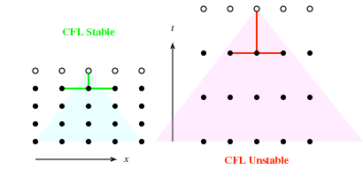{fig-alt="Two-panel diagram comparing CFL-stable and CFL-unstable finite-difference stencils on a space-time (x, t) grid of dots: the 'CFL Stable' case (left, green highlighted stencil) has its domain of dependence (shaded triangle) contained within the numerical stencil's influence, while the 'CFL Unstable' case (right, red stencil, pink shaded triangle) does not."}

---

## Lax–Wendroff method

- original version: Haade;vectorization: Wjh31, Quibik, CC BY-SA 3.0 <https://creativecommons.org/licenses/by-sa/3.0>, via Wikimedia Commons

- We can also improve on the Lax method by including ${ \delta }_{t}^{2}$ terms in the discretization: Lax–Wendroff.

- $${u}_{j}^{n+1}=\frac{1}{2}({u}_{j+1}^{n}+{u}_{j-1}^{n})-\frac{c{ \delta }_{t}}{2{ \delta }_{x}}\left( {u}_{j+1}^{n}-{u}_{j-1}^{n} \right)+\frac{{c}^{2}{ \delta }_{t}^{2}}{2{ \delta }_{x}^{2}}\left( {u}_{j+1}^{n}-2{u}_{j}^{n}+{u}_{j-1}^{n} \right)$$

- $$\begin{matrix}
u(x,t+{ \delta }_{t}) &  \approx u(x,t)+{ \delta }_{t}\frac{ \partial u}{ \partial t}+\frac{{ \delta }_{t}^{2}}{2}\frac{{ \partial }^{2}u}{ \partial {t}^{2}} \\
 &  \approx u(x,t)-c{ \delta }_{t}\frac{ \partial u}{ \partial x}+\frac{{c}^{2}{ \delta }_{t}^{2}}{2}\frac{{ \partial }^{2}u}{ \partial {x}^{2}}
\end{matrix}$$

- Stability condition is the same CFL number as before.
- Note that the 2nd order term looks like a diffusion term,

- $$\frac{ \partial n(x,t)}{ \partial t}=D\frac{{ \partial }^{2}n(x,t)}{ \partial {x}^{2}}$$

- $${n}_{j}^{n+1}={n}_{j}^{n}+\frac{D{ \delta }_{t}}{{ \delta }_{x}^{2}}({n}_{j+1}^{n}-2{n}_{j}^{n}+{n}_{j-1}^{n})$$

- General feature: diffusive terms in recurrence formulae have damping effects on the amplitude.

---

## Nonlinear wave equations

- original version: Haade;vectorization: Wjh31, Quibik, CC BY-SA 3.0 <https://creativecommons.org/licenses/by-sa/3.0>, via Wikimedia Commons

- Nonlinear wave equations:
  - Do not preserve wave shape, in general
  - Have nonlinear dispersion
- Recall, dispersion is the relationship between wave number ($k$) and frequency ($ \omega $).
  - For a plane wave, $u(x,t) \sim {e}^{i(kx- \omega t)}$, the PDE gives:

- $$(-i \omega -ick)(-i \omega +ick)=0 \Rightarrow  \omega = \pm ck$$

  - So, all modes have velocity $c= \omega /k$.
- In the nonlinear case, the velocity can depend on wave number:

- $$\begin{matrix}
\frac{ \partial u}{ \partial t} & =-c\frac{ \partial u}{ \partial x}-d\frac{{ \partial }^{3}u}{ \partial {x}^{2}} \\
 \omega  & =ck-d{k}^{3}
\end{matrix}$$

---

## Nonlinear wave equations

- original version: Haade;vectorization: Wjh31, Quibik, CC BY-SA 3.0 <https://creativecommons.org/licenses/by-sa/3.0>, via Wikimedia Commons

- Let's go back to the advection equation and add a diffusive term:

- $$\frac{ \partial u}{ \partial t}=-c\frac{ \partial u}{ \partial x}+D\frac{{ \partial }^{2}u}{ \partial {x}^{2}}$$

- For a plane wave solution $u(x,t) \sim {e}^{i(kx- \omega t)}$, the dispersion relation is:

- $$ \omega =ck-iD{k}^{2}$$

- $$u(x,t) \sim {e}^{ik(x-ct)-D{k}^{2}t}$$

---

## Burger's equation

- original version: Haade;vectorization: Wjh31, Quibik, CC BY-SA 3.0 <https://creativecommons.org/licenses/by-sa/3.0>, via Wikimedia Commons

- Some nonlinear equations can have traveling waves.
- Example: Burger's equation,

- $$\frac{ \partial u}{ \partial t}=- \alpha \frac{ \partial u}{ \partial x}- \beta u\frac{ \partial u}{ \partial x}$$

- The last term is nonlinear in the wave amplitude.
- Solve via partial derivatives...

- $$\begin{matrix}
\frac{ \partial u}{ \partial t} & =-( \alpha + \beta u){f}^{′}- \beta {f}^{′}t\frac{ \partial u}{ \partial t} \Longrightarrow \frac{ \partial u}{ \partial t}=-( \alpha + \beta u){f}^{′}/(1+ \beta {f}^{′}t) \\
\frac{ \partial u}{ \partial x} & ={f}^{′}- \beta {f}^{′}t\frac{ \partial u}{ \partial x} \Longrightarrow \frac{ \partial u}{ \partial t}={f}^{′}/(1+ \beta {f}^{′}t)
\end{matrix}$$

- Solutions: right-moving waves, $u(x,t)=f(x-( \alpha + \beta u)t)$
  - So, the wave velocity is $c= \alpha + \beta u(x,t)$.

- Describes motion of viscous, compressible gas

---

## Shock fronts

<!-- TODO: complex slide layout (flagged by detect_complex_slide.py - see run log). Content below is complete but UNARRANGED - needs manual layout to match the original slide. -->

- original version: Haade;vectorization: Wjh31, Quibik, CC BY-SA 3.0 <https://creativecommons.org/licenses/by-sa/3.0>, via Wikimedia Commons

- The velocity depends on the density of the wave!
- This leads to breaking and shock fronts:

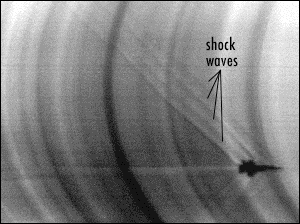{fig-alt="NASA schlieren photograph of a supersonic aircraft in flight, with visible curved shock-wave patterns in the air labeled 'shock waves' by an arrow pointing to the aircraft."}

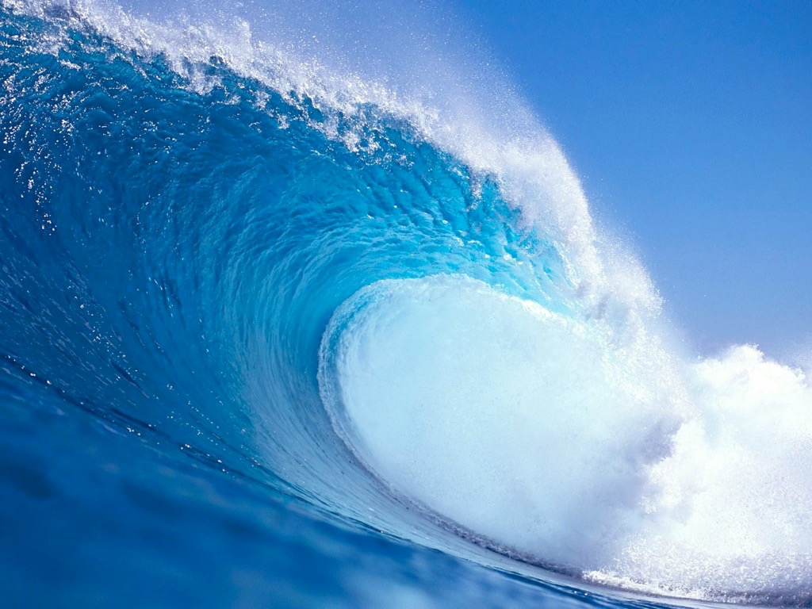{fig-alt="Photograph of a large breaking blue ocean wave curling into a barrel shape, spray flying off the crest."}

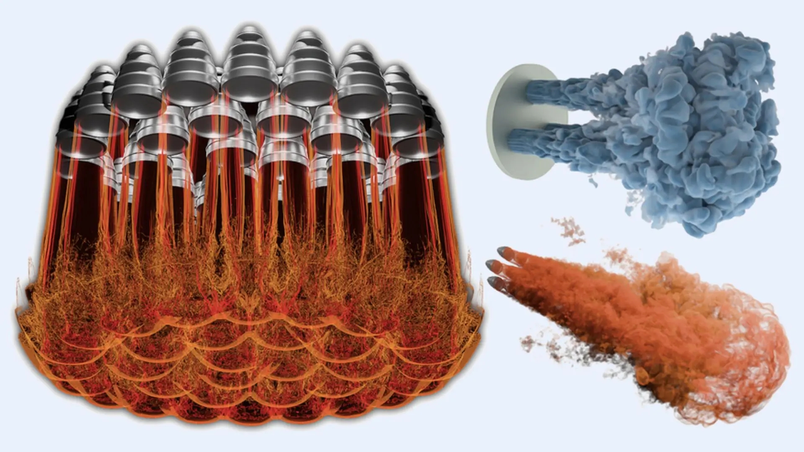{fig-alt="Three-panel CFD/combustion visualization: at left, an array of rocket-engine-like nozzles with turbulent red/orange flow plumes merging beneath them; at right, two separate renderings of a nozzle emitting a turbulent plume, one blue-gray (top) and one orange (bottom)."}

- [https://www.llnl.gov/article/53626/gordon-bell-finalist-team-pushes-scale-rocket-simulation-el-capitan](https://www.llnl.gov/article/53626/gordon-bell-finalist-team-pushes-scale-rocket-simulation-el-capitan)

---

## Shock fronts

- original version: Haade;vectorization: Wjh31, Quibik, CC BY-SA 3.0 <https://creativecommons.org/licenses/by-sa/3.0>, via Wikimedia Commons

- Burgers’ equation was introduced in 1948 as a simple model of shock propagation (J.M. Burgers, Adv. Appl. Mech. 1, 171 (1948))

- $$\frac{ \partial u}{ \partial t}+u\frac{ \partial u}{ \partial x}= \nu \frac{{ \partial }^{2}u}{ \partial {x}^{2}}$$

- First, consider $ \nu =0$: $\frac{ \partial u}{ \partial t}=-u\frac{ \partial u}{ \partial x}$.
- This is similar to the linear wave equation, except $c=u$.
  - Schematically, the speed of the wave is equal to $u$!
  - The peaks travel faster than the troughs.
  - Eventually, we get breaking: the peaks catch up to the troughs, function becomes multivalued.
  - Passes through a "shock front," where solution is discontinuous.

---

## Shock fronts

- original version: Haade;vectorization: Wjh31, Quibik, CC BY-SA 3.0 <https://creativecommons.org/licenses/by-sa/3.0>, via Wikimedia Commons

- This kind of PDE was studied by Godunov in 1959 (S.K. Godunov, Mat. Sb. 47, 271 (1959)) ([wikipedia](https://en.wikipedia.org/wiki/Godunov's_scheme))
- This is a class of "Riemann problem": an IVP for a PDE that has a piecewise constant initial value function, with a discontinuity (like a step function)
  - Need to find an exact or approximate algorithm for this: "Riemann solver"

- For more, see e.g. [https://www.reading.ac.uk/maths-and-stats/-/media/project/uor-main/schools-departments/maths/documents/na-report-799.pdf](https://www.reading.ac.uk/maths-and-stats/-/media/project/uor-main/schools-departments/maths/documents/na-report-799.pdf)

- $${u}_{j}^{n+1}={u}_{j}^{n}-\frac{ \tau }{h}\left[ {F}_{j+\frac{1}{2}}-{F}_{j-\frac{1}{2}} \right]+\frac{ \nu  \tau }{{h}^{2}}\left[ {u}_{j+1}-2{u}_{j}+{u}_{j-1} \right]$$

- ${F}_{j \pm \frac{1}{2}}$ = average flux on cells to the left or right of point $j$
- Solve these from Riemann problems in the cells to right/left of $j$ using "upwind" initial data,

- $${u}_{j}^{(+)}=\left\{\begin{matrix}
{u}_{j} & \text{if}{u}_{j}>0 \\
0 & \text{otherwise}
\end{matrix}\right.$$

- $${u}_{j}^{(-)}=\left\{\begin{matrix}
{u}_{j} & \text{i}f{u}_{j}<0 \\
0 & \text{otherwise}
\end{matrix}\right.$$

- $${F}_{j-\frac{1}{2}}=max\left\{ \frac{1}{2}({u}_{j-1}^{(+)}{)}^{2},\frac{1}{2}({u}_{j}^{(-)}{)}^{2} \right\}$$

- $${F}_{j+\frac{1}{2}}=max\left\{ \frac{1}{2}({u}_{j}^{(+)}{)}^{2},\frac{1}{2}({u}_{j+1}^{(-)}{)}^{2} \right\}$$

---

## Notebooks

- original version: Haade;vectorization: Wjh31, Quibik, CC BY-SA 3.0 <https://creativecommons.org/licenses/by-sa/3.0>, via Wikimedia Commons

- Hands-on notebooks:
  - CompPhys/PDEs/advection.ipynb
  - CompPhys/PDEs/burgers.ipynb
  - (Also some interesting notebooks in CompPhys/PDEs on convolutional neural networks, which we will not cover this semester)

---

## Recap

- original version: Haade;vectorization: Wjh31, Quibik, CC BY-SA 3.0 <https://creativecommons.org/licenses/by-sa/3.0>, via Wikimedia Commons

- Parabolic PDEs:
  - E.g. diffusion, Schroedinger equation
  - Covered 2 methods for solving: marching methods (Crank–Nicolson) and spectral methods.
- Hyperbolic PDEs:
  - E.g. wave equations
  - Advective case: linear dispersion, waves move left/right, time evolution preserves wave shape.
  - Can solve with Lax or Lax–Wendroff methods; keep in mind stability of solutions, quantified with Courant number.
  - Nonlinear case, e.g. Burger's equation: nonlinear dispersion can lead to "shock fronts," which require different methods to handle (e.g. Godunov).
- Next time:
  - Wrap up! A bit on MC methods, homeworks, final, any other business.
