## Announcements

- original version: Haade;vectorization: Wjh31, Quibik, CC BY-SA 3.0 <https://creativecommons.org/licenses/by-sa/3.0>, via Wikimedia Commons

- References:
  - [JAX](https://docs.jax.dev/en/latest/beginner_guide.html#beginner-guide) and [FLAX](https://flax.readthedocs.io/en/latest/) tutorials
  - Florian Marquardt, "Machine Learning for Physicists" ([https://machine-learning-for-physicists.org/](https://machine-learning-for-physicists.org/))
  - [https://computational-physics.tripos.org/slides/autodiff.html](https://computational-physics.tripos.org/slides/autodiff.html)
  - [https://arxiv.org/pdf/1903.10563](https://arxiv.org/pdf/1903.10563)

---

# Part 1: machine learning basics

---

## Last time: neuron modeling

<!-- TODO: complex slide layout (flagged by detect_complex_slide.py - see run log). Content below is complete but UNARRANGED - needs manual layout to match the original slide. -->

- original version: Haade;vectorization: Wjh31, Quibik, CC BY-SA 3.0 <https://creativecommons.org/licenses/by-sa/3.0>, via Wikimedia Commons

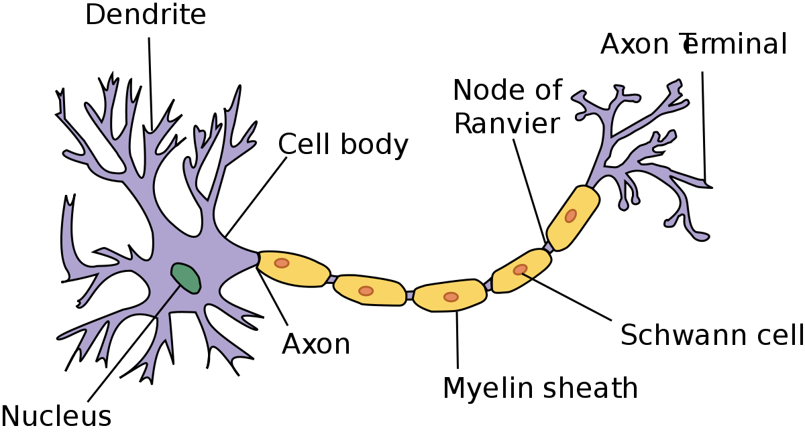{fig-alt="Labeled diagram of a biological neuron: dendrites, cell body with nucleus, axon covered in a myelin sheath (formed by Schwann cells) with nodes of Ranvier between segments, ending in axon terminals."}

- Schematic diagram of neurons
{fig-alt="Plot of an action potential: membrane voltage (mV) versus time (ms), showing the resting state at -70 mV, a stimulus triggering depolarization up past the -55 mV threshold to a +40 mV peak, then repolarization and a dip below resting potential (refractory period) before returning to rest; failed initiations below threshold are also shown."}

- Action potential
- Chemical concentration (input)

- Activation

- Chemical concentration (output)

---

## Real neural networks

<!-- TODO: complex slide layout (flagged by detect_complex_slide.py - see run log). Content below is complete but UNARRANGED - needs manual layout to match the original slide. -->

- original version: Haade;vectorization: Wjh31, Quibik, CC BY-SA 3.0 <https://creativecommons.org/licenses/by-sa/3.0>, via Wikimedia Commons

{fig-alt="Labeled diagram of a biological neuron: dendrites, cell body with nucleus, axon covered in a myelin sheath (formed by Schwann cells) with nodes of Ranvier between segments, ending in axon terminals."}

{fig-alt="Labeled diagram of a biological neuron: dendrites, cell body with nucleus, axon covered in a myelin sheath (formed by Schwann cells) with nodes of Ranvier between segments, ending in axon terminals."}

{fig-alt="Labeled diagram of a biological neuron: dendrites, cell body with nucleus, axon covered in a myelin sheath (formed by Schwann cells) with nodes of Ranvier between segments, ending in axon terminals."}

{fig-alt="Labeled diagram of a biological neuron: dendrites, cell body with nucleus, axon covered in a myelin sheath (formed by Schwann cells) with nodes of Ranvier between segments, ending in axon terminals."}

{fig-alt="Labeled diagram of a biological neuron: dendrites, cell body with nucleus, axon covered in a myelin sheath (formed by Schwann cells) with nodes of Ranvier between segments, ending in axon terminals."}

- Network of neurons
- Neurons affect
other neurons, and
the “state” is saved

- System learns the final state over time

---

## Artificial neural networks

<!-- TODO: complex slide layout (flagged by detect_complex_slide.py - see run log). Content below is complete but UNARRANGED - needs manual layout to match the original slide. -->

- original version: Haade;vectorization: Wjh31, Quibik, CC BY-SA 3.0 <https://creativecommons.org/licenses/by-sa/3.0>, via Wikimedia Commons

{fig-alt="Labeled diagram of a biological neuron: dendrites, cell body with nucleus, axon covered in a myelin sheath (formed by Schwann cells) with nodes of Ranvier between segments, ending in axon terminals."}

- Schematic diagram of neurons
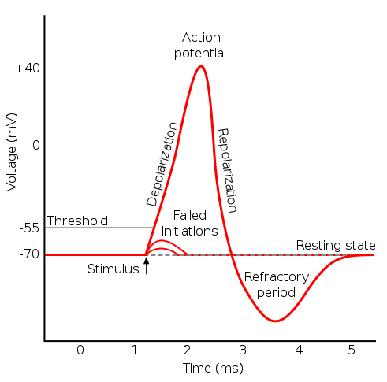{fig-alt="Plot of an action potential: membrane voltage (mV) versus time (ms), showing the resting state at -70 mV, a stimulus triggering depolarization up past the -55 mV threshold to a +40 mV peak, then repolarization and a dip below resting potential (refractory period) before returning to rest; failed initiations below threshold are also shown."}

- Action potential
- Chemical concentration
- A number (input)

- Activation

- Chemical concentration
- A number (output)

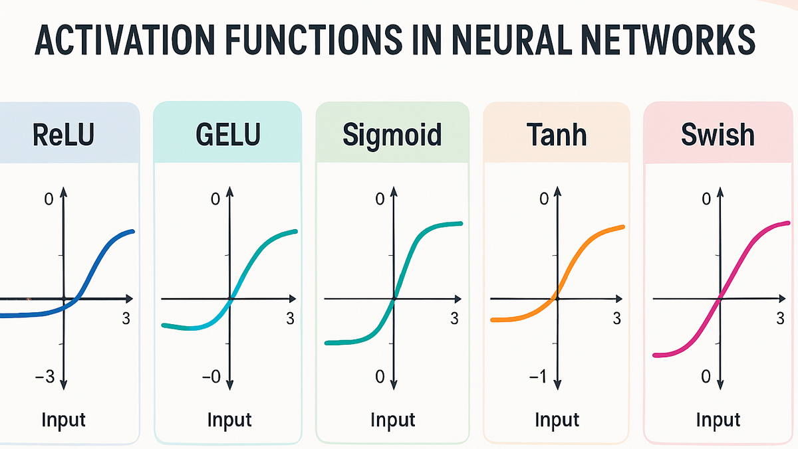{fig-alt="Infographic titled 'ACTIVATION FUNCTIONS IN NEURAL NETWORKS' showing five side-by-side plots of common activation functions (ReLU, GELU, Sigmoid, Tanh, Swish), each plotted as input versus output."}

{fig-alt="Tiny decorative blue square/frame icon."}

---

## Artificial neural networks

<!-- TODO: complex slide layout (flagged by detect_complex_slide.py - see run log). Content below is complete but UNARRANGED - needs manual layout to match the original slide. -->

- original version: Haade;vectorization: Wjh31, Quibik, CC BY-SA 3.0 <https://creativecommons.org/licenses/by-sa/3.0>, via Wikimedia Commons

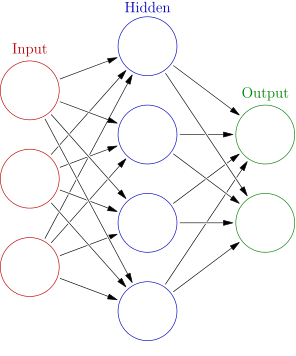{fig-alt="Simple diagram of a feedforward neural network: three red 'Input' nodes fully connected to four blue 'Hidden' nodes, which are fully connected to two green 'Output' nodes."}

- Diagram of a simple neural network ([wikipedia](https://en.wikipedia.org/wiki/Artificial_neural_network))
- The neural network is a group of neurons working together in such a persistent state.

- $${x}_{1}$$

- $${x}_{2}$$

- $${x}_{3}$$

- $${y}_{1}$$

- $${y}_{2}$$

- $${f}_{1}^{(1)}(\mathbf{x};{ \theta }_{1})$$

- $${f}_{2}^{(1)}(\mathbf{x};{ \theta }_{2})$$

- $${f}_{4}^{(1)}(\mathbf{x};{ \theta }_{4})$$

- $${f}_{3}^{(1)}(\mathbf{x};{ \theta }_{3})$$

---

## Artificial neural networks

<!-- TODO: complex slide layout (flagged by detect_complex_slide.py - see run log). Content below is complete but UNARRANGED - needs manual layout to match the original slide. -->

- original version: Haade;vectorization: Wjh31, Quibik, CC BY-SA 3.0 <https://creativecommons.org/licenses/by-sa/3.0>, via Wikimedia Commons

{fig-alt="Simple diagram of a feedforward neural network: three red 'Input' nodes fully connected to four blue 'Hidden' nodes, which are fully connected to two green 'Output' nodes."}

- Diagram of a simple neural network ([wikipedia](https://en.wikipedia.org/wiki/Artificial_neural_network))
- The neural network is a group of neurons working together in such a persistent state.
- It's really just a big, complicated function ($NN:{\mathbb{R}}^{{N}_{in}} \rightarrow {\mathbb{R}}^{{N}_{out}}$) with lots of parameters ($ \theta $).
  - Built from many smaller units (neurons)

- $${x}_{1}$$

- $${x}_{2}$$

- $${x}_{3}$$

- $${f}_{1}^{(1)}(\mathbf{x};{ \theta }_{1})$$

- $${f}_{2}^{(1)}(\mathbf{x};{ \theta }_{2})$$

- $${f}_{4}^{(1)}(\mathbf{x};{ \theta }_{4})$$

- $${f}_{3}^{(1)}(\mathbf{x};{ \theta }_{3})$$

- $${y}_{1}$$

- $${y}_{2}$$

---

## Artificial neural networks

<!-- TODO: complex slide layout (flagged by detect_complex_slide.py - see run log). Content below is complete but UNARRANGED - needs manual layout to match the original slide. -->

- original version: Haade;vectorization: Wjh31, Quibik, CC BY-SA 3.0 <https://creativecommons.org/licenses/by-sa/3.0>, via Wikimedia Commons

{fig-alt="Simple diagram of a feedforward neural network: three red 'Input' nodes fully connected to four blue 'Hidden' nodes, which are fully connected to two green 'Output' nodes."}

- Diagram of a simple neural network ([wikipedia](https://en.wikipedia.org/wiki/Artificial_neural_network))
- The neural network is a group of neurons working together in such a persistent state.
- It's really just a big, complicated function ($NN:{\mathbb{R}}^{{N}_{in}} \rightarrow {\mathbb{R}}^{{N}_{out}}$) with lots of parameters ($ \theta $).
  - Built from many smaller units (neurons)
  - Input data: some vector $\mathbf{x} \in {\mathbb{R}}^{{N}_{D}}$
    - Images (matrix of pixels)
    - Text (strings)
    - Audio signals (time series)...
  - Outputs:
    - Boolean, aka classification (cat vs. dog)
    - Number, aka regression

- $${x}_{1}$$

- $${x}_{2}$$

- $${x}_{3}$$

- $${f}_{1}^{(1)}(\mathbf{x};{ \theta }_{1})$$

- $${f}_{2}^{(1)}(\mathbf{x};{ \theta }_{2})$$

- $${f}_{4}^{(1)}(\mathbf{x};{ \theta }_{4})$$

- $${f}_{3}^{(1)}(\mathbf{x};{ \theta }_{3})$$

- $${y}_{1}$$

- $${y}_{2}$$

---

## Examples

- original version: Haade;vectorization: Wjh31, Quibik, CC BY-SA 3.0 <https://creativecommons.org/licenses/by-sa/3.0>, via Wikimedia Commons

- Image processing
  - Recognition (cat/dog)
  - Restoration, colorization
  - Generation
- Language
  - Translation
  - Generation
- Behavior prediction
  - Play Go
  - Play Starcraft

---

## Examples

- original version: Haade;vectorization: Wjh31, Quibik, CC BY-SA 3.0 <https://creativecommons.org/licenses/by-sa/3.0>, via Wikimedia Commons

- Image processing
  - Recognition (cat/dog)
  - Restoration, colorization
  - Generation
- Language
  - Translation
  - Generation
- Behavior prediction
  - Play Go
  - Play Starcraft

- Easy to draw analogies with science applications:
  - Image recognition $ \Leftrightarrow $ signal/background discrimination
  - Language processing $ \Leftrightarrow $ signal processing
  - Playing video games $ \Leftrightarrow $ operating complex experiments, landing spaceship on the moon
- Some physics applications:
  - Predict properties of matter
  - Classify phases of matter
  - Represent quantum wave functions
  - Distinguish Higgs bosons from QCD backgrounds
  - (Design experiments? Control fusion reactors?)

---

## Examples

- original version: Haade;vectorization: Wjh31, Quibik, CC BY-SA 3.0 <https://creativecommons.org/licenses/by-sa/3.0>, via Wikimedia Commons

- Image processing
  - Recognition (cat/dog)
  - Restoration, colorization
  - Generation
- Language
  - Translation
  - Generation
- Behavior prediction
  - Play Go
  - Play Starcraft

- Easy to draw analogies with science applications:
  - Image recognition $ \Leftrightarrow $ signal/background discrimination
  - Language processing $ \Leftrightarrow $ signal processing
  - Playing video games $ \Leftrightarrow $ operating complex experiments, landing spaceship on the moon
- Some physics applications:
  - Predict properties of matter
  - Classify phases of matter
  - Represent quantum wave functions
  - Distinguish Higgs bosons from QCD backgrounds
  - (Design experiments? Control fusion reactors?)

- Wikipedia: [Machine learning in physics](https://en.wikipedia.org/wiki/Machine_learning_in_physics#:~:text=Applying machine learning (ML) (,state is learned from measurement.) (not great)
- [DOE priorities](https://www.energy.gov/documents/genesis-mission-science-and-technology-challenges) (posted yesterday!)

---

## MNIST handwriting recognition

- original version: Haade;vectorization: Wjh31, Quibik, CC BY-SA 3.0 <https://creativecommons.org/licenses/by-sa/3.0>, via Wikimedia Commons

- Famous example: USPS handwriting recognition system
  - Work of UB's Venu Govindaraju! [https://www.buffalo.edu/research/research-expertise/case-study-ai-at-usps.html](https://www.buffalo.edu/research/research-expertise/case-study-ai-at-usps.html)
- The MNIST database (Modified National Institute of Standards and Technology) is a large collection of handwritten digits.
  - [https://www.kaggle.com/datasets/hojjatk/mnist-dataset](https://www.kaggle.com/datasets/hojjatk/mnist-dataset)
- Good lesson in data cleaning:
  - Starting point: 9,298 digits manually extracted from mail passing through Buffalo USPS in 1989. Human error rate: 2.5%! Messy data!
  - NIST database: separate training/test datasets sample from different populations, 16x16 black-and-white.
  - MNIST: better training/test sampling, 26x26, anti-aliased (greyscale).

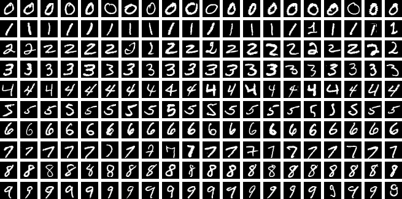{width="70%" fig-alt="Grid of MNIST handwritten digit samples: rows for digits 0 through 9, each row showing roughly 20 different handwritten variations of that digit as white strokes on black backgrounds."}

- MNIST digit images
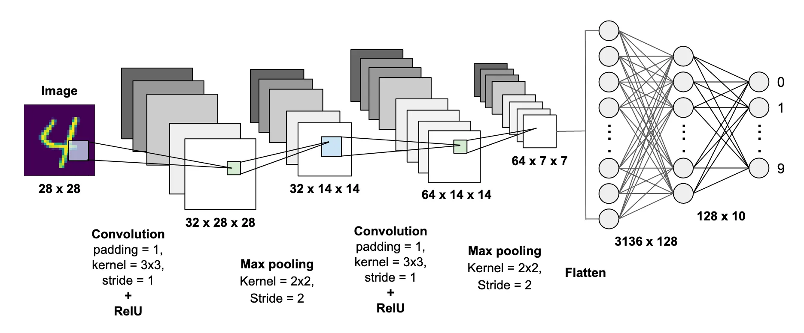{width="70%" fig-alt="Diagram of a convolutional neural network architecture processing a 28x28 MNIST digit image ('4'): two convolution+ReLU and max-pooling stages (32x28x28 to 32x14x14, then 64x14x14 to 64x7x7), flattened into a 3136-unit layer, a 128-unit dense layer, and a 10-unit output layer labeled 0-9."}

- MNIST convolutional neural network

---

# Basics

---

## Basics

- original version: Haade;vectorization: Wjh31, Quibik, CC BY-SA 3.0 <https://creativecommons.org/licenses/by-sa/3.0>, via Wikimedia Commons

- Concepts behind neural networks are not particular deep
  - "Build a function out of many small functions"
- Nor are neural networks a particular new idea!
  - A very simple example: least squares regression (1795)
  - Perceptron [('58)](https://doi.org/10.1037/h0042519); multilayer perceptrons+stochastic gradient descent (['67](https://people.idsia.ch/~juergen/amari1967.pdf)); backpropagation ('70/80s); recurrent/convolutional NNs ('80/90s)
- Why are we only experience the ML revolution now, in 2026?
  - Free availability of large datasets of labeled data
  - Free availability of open source languages, libraries, and models
  - Free Wide availability of necessary computing power to train models

- [https://computational-physics.tripos.org/slides/autodiff.html#/0/4](https://computational-physics.tripos.org/slides/autodiff.html#/0/4)

---

## Basics

- original version: Haade;vectorization: Wjh31, Quibik, CC BY-SA 3.0 <https://creativecommons.org/licenses/by-sa/3.0>, via Wikimedia Commons

- Concepts behind neural networks are not particular deep
  - "Build a function out of many small functions"
- Nor are neural networks a particular new idea!
  - A very simple example: least squares regression (1795)
  - Perceptron [('58)](https://doi.org/10.1037/h0042519); multilayer perceptrons+stochastic gradient descent (['67](https://people.idsia.ch/~juergen/amari1967.pdf)); backpropagation ('70/80s); recurrent/convolutional NNs ('80/90s)
- Why are we only experience the ML revolution now, in 2026?
  - Free availability of large datasets of labeled data
  - Free availability of open source languages, libraries, and models
  - Free Wide availability of necessary computing power to train models

- [https://computational-physics.tripos.org/slides/autodiff.html#/0/4](https://computational-physics.tripos.org/slides/autodiff.html#/0/4)

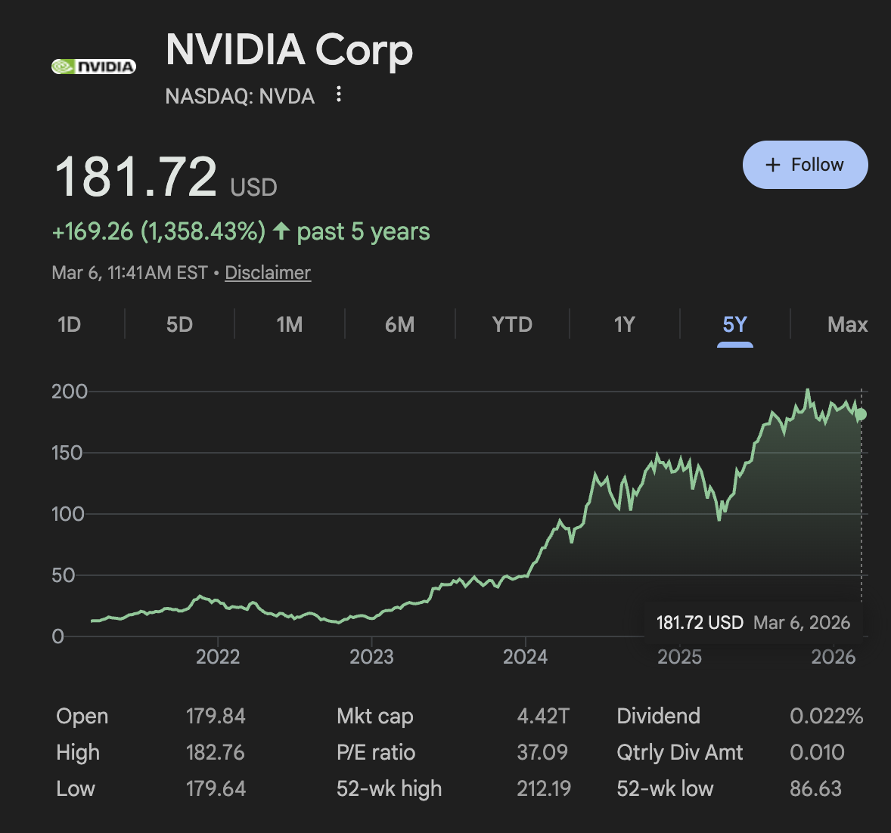{width="70%" fig-alt="Screenshot of a stock price chart for NVIDIA Corp (NASDAQ: NVDA), showing the price at $181.72 with a 5-year chart climbing from about $15 in 2022 to over $180 by 2026, plus summary stats (open, high, low, market cap, P/E ratio, 52-week range, dividend)."}

- NVIDIA stock

---

## The network

<!-- TODO: complex slide layout (flagged by detect_complex_slide.py - see run log). Content below is complete but UNARRANGED - needs manual layout to match the original slide. -->

- original version: Haade;vectorization: Wjh31, Quibik, CC BY-SA 3.0 <https://creativecommons.org/licenses/by-sa/3.0>, via Wikimedia Commons

- The neural network is "just" a function ${\text{NN}}_{ \theta }$:
  - Maps ${\mathbb{R}}^{{N}_{D}} \rightarrow {\mathbb{R}}^{{N}_{L}}$
  - Depends on a lot of parameters, $ \theta $.
- Construct a "complicated" function by chaining together many simpler functions:
  - $${\text{NN}}_{ \theta }={f}_{ \theta }^{(L)} \circ {f}_{ \theta }^{(L-1)} \circ ... \circ {f}_{ \theta }^{(2)} \circ {f}_{ \theta }^{(1)}$$
  - ${f}^{(1)}:{\mathbb{R}}^{{N}_{D}} \rightarrow {\mathbb{R}}^{{h}_{1}}$, where ${h}_{1}$ is the width of the first "hidden layer"
  - Similarly, ${f}^{(j)}:{\mathbb{R}}^{{h}_{j-1}} \rightarrow {\mathbb{R}}^{{h}_{j}}$ for $j=2,...,L-1$
  - Finally, ${f}^{(L)}:{\mathbb{R}}^{{h}_{L-1}} \rightarrow {\mathbb{R}}^{{N}_{L}}$
- Dimensions ${h}_{j}$ are "hyperparameters" of model (describe shape of network).

- [https://computational-physics.tripos.org/slides/autodiff.html#/0/4](https://computational-physics.tripos.org/slides/autodiff.html#/0/4)

{fig-alt="Diagram of a neural network with an input layer (six nodes, bracketed 'input layer'), two hidden layers (four and three nodes, bracketed 'hidden layers'), and a single-node output layer (bracketed 'output layer'), all connected by arrows, feeding into a final output arrow."}

- Example neural network
- $${\mathbb{R}}^{{N}_{D}}$$
- $${f}^{(1)}$$
- $${f}^{(2)}$$
- $${\mathbb{R}}^{{N}_{L}}$$
- $${f}^{(L)}$$

---

## The ${f}_{ \theta }^{(j)}$

<!-- TODO: complex slide layout (flagged by detect_complex_slide.py - see run log). Content below is complete but UNARRANGED - needs manual layout to match the original slide. -->

- original version: Haade;vectorization: Wjh31, Quibik, CC BY-SA 3.0 <https://creativecommons.org/licenses/by-sa/3.0>, via Wikimedia Commons

- $${\text{NN}}_{ \theta }={f}_{ \theta }^{(L)} \circ {f}_{ \theta }^{(L-1)} \circ ... \circ {f}_{ \theta }^{(2)} \circ {f}_{ \theta }^{(1)}$$
- The ${f}^{(j)}$ are the basic units of the NN
  - They should be simple, but not too simple.
  - Specifically, they must be nonlinear!
  - Otherwise, the whole network reduces to a simple matrix operation, and nothing interesting happens.

- [https://computational-physics.tripos.org/slides/autodiff.html](https://computational-physics.tripos.org/slides/autodiff.html)

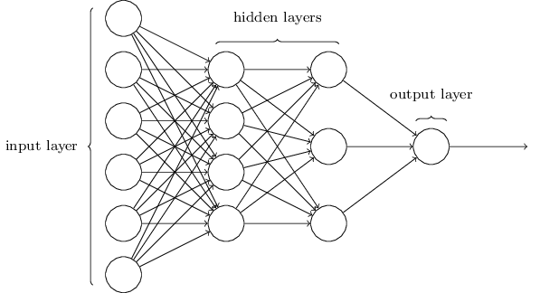{fig-alt="Diagram of a neural network with an input layer (six nodes, bracketed 'input layer'), two hidden layers (four and three nodes, bracketed 'hidden layers'), and a single-node output layer (bracketed 'output layer'), all connected by arrows, feeding into a final output arrow."}

- Example neural network
- $${\mathbb{R}}^{{N}_{D}}$$
- $${f}^{(1)}$$
- $${f}^{(2)}$$
- $${\mathbb{R}}^{{N}_{L}}$$
- $${f}^{(L)}$$
- [Directed, acyclic graph (DAG)](https://en.wikipedia.org/wiki/Directed_acyclic_graph)

---

## Slide 19

- Building the network

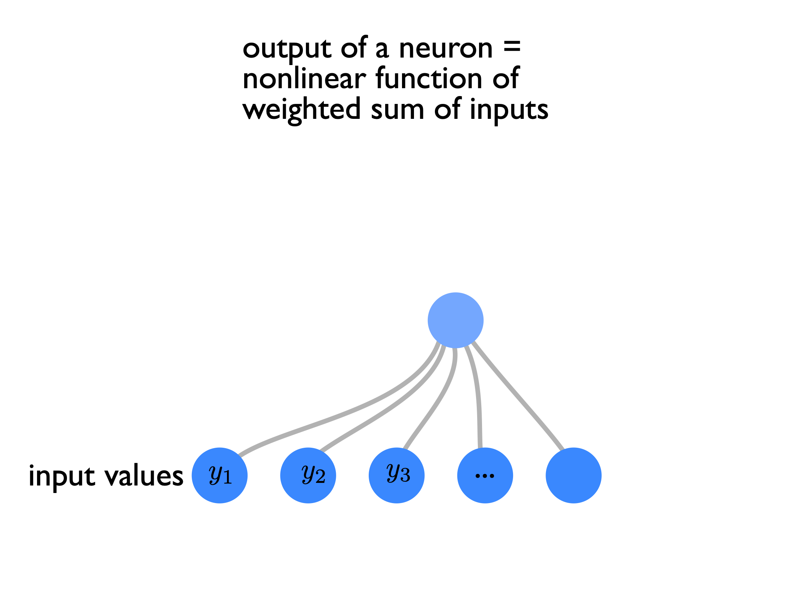{width="70%" fig-alt="Diagram captioned 'output of a neuron = nonlinear function of weighted sum of inputs': several blue 'input values' nodes (y1, y2, y3, ...) each connected by a line to a single output neuron node above."}

- [F. Marquardt, Machine Learning for Physicists 2024](https://pad.gwdg.de/s/ZwIoM-Arn)
- [F. Marquardt, Machine Learning for Physicists 2024](https://pad.gwdg.de/s/ZwIoM-Arn)

---

## Slide 20

- Building the network

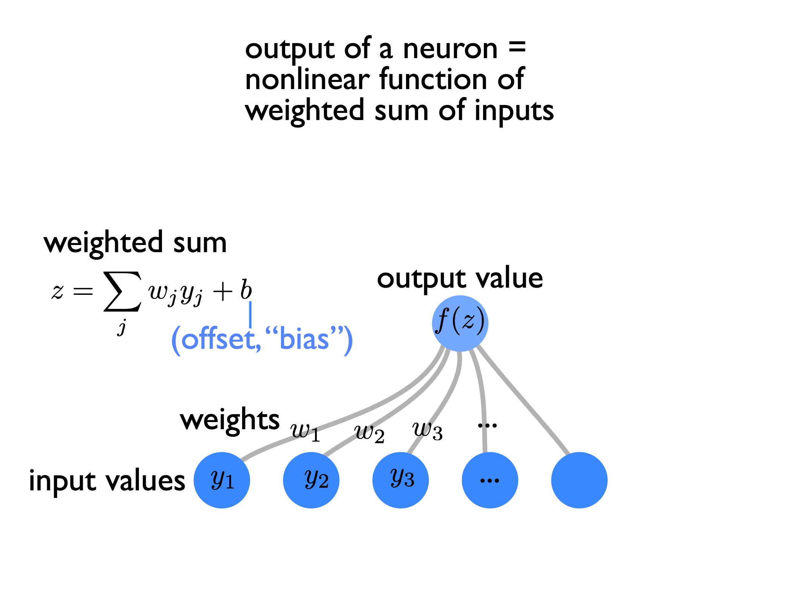{width="70%" fig-alt="Same neuron diagram as before (input values y1, y2, y3, ... feeding one output neuron), now annotated with the weighted-sum formula z = sum_j(w_j y_j) + b (b labeled 'offset, bias') and the neuron's output labeled f(z)."}

- [F. Marquardt, Machine Learning for Physicists 2024](https://pad.gwdg.de/s/ZwIoM-Arn)
- [F. Marquardt, Machine Learning for Physicists 2024](https://pad.gwdg.de/s/ZwIoM-Arn)

---

## Slide 21

- Building the network

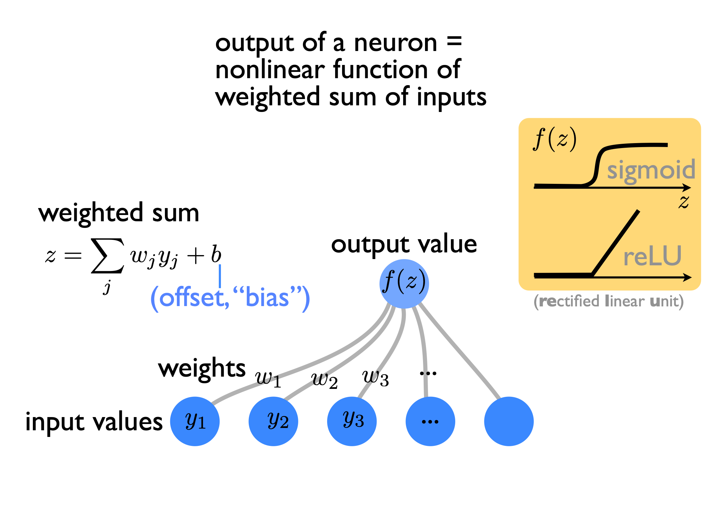{width="70%" fig-alt="Same weighted-sum neuron diagram, now with an inset box showing the shape of two candidate nonlinear activation functions f(z): a sigmoid curve and a ReLU (rectified linear unit) curve."}

- [F. Marquardt, Machine Learning for Physicists 2024](https://pad.gwdg.de/s/ZwIoM-Arn)
- [F. Marquardt, Machine Learning for Physicists 2024](https://pad.gwdg.de/s/ZwIoM-Arn)

---

## Slide 22

<!-- TODO: complex slide layout (flagged by detect_complex_slide.py - see run log). Content below is complete but UNARRANGED - needs manual layout to match the original slide. -->

- Building the network

- Sigmoid activation function:
  - $$ \sigma (x)=\frac{1}{1+{e}^{-x}}$$

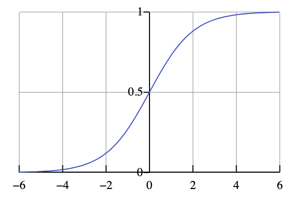{fig-alt="Plot of the sigmoid function, an S-shaped curve rising smoothly from 0 to 1 as its input goes from -6 to 6, crossing 0.5 at input 0."}

- Sigmoid function ([wikipedia](https://en.wikipedia.org/wiki/Sigmoid_function))
- ReLU activation function:
  - $$max(x,0)$$

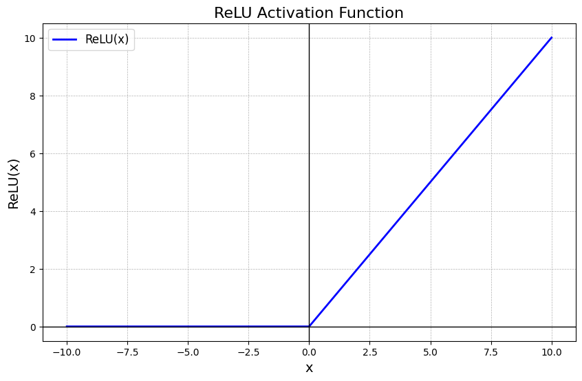{fig-alt="Plot titled 'ReLU Activation Function': ReLU(x) is flat at 0 for x less than 0, then rises linearly with slope 1 for x greater than 0, shown over the range -10 to 10."}

- ReLU function ([https://www.geeksforgeeks.org/deep-learning/relu-activation-function-in-deep-learning/](https://www.geeksforgeeks.org/deep-learning/relu-activation-function-in-deep-learning/))
- $$f(\text{y})= \phi \left( \mathop{\mathop{ \sum }\limits_{ \beta =1}}\limits^{{N}_{in}}{w}_{ \alpha  \beta }{y}_{ \beta }+{b}_{ \alpha } \right)$$

- Your activation function here

---

## Slide 23

- Building the network

- [F. Marquardt, Machine Learning for Physicists 2024](https://pad.gwdg.de/s/ZwIoM-Arn)

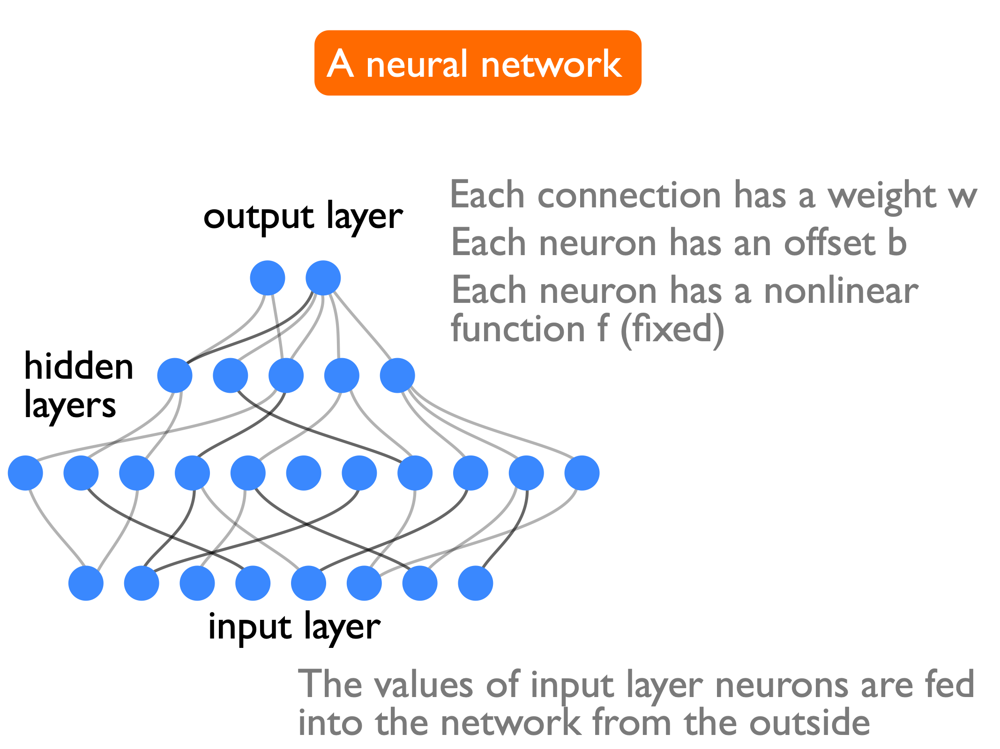{width="70%" fig-alt="Diagram titled 'A neural network': a multi-layer network of blue nodes (input layer, several hidden layers, and a two-node output layer) fully connected by curved lines, alongside explanatory text: each connection has a weight w, each neuron has an offset b, and each neuron applies a fixed nonlinear function f; input layer values are fed in from outside."}

- [F. Marquardt, Machine Learning for Physicists 2024](https://pad.gwdg.de/s/ZwIoM-Arn)

---

## Slide 24

- Building the network

- [F. Marquardt, Machine Learning for Physicists 2024](https://pad.gwdg.de/s/ZwIoM-Arn)

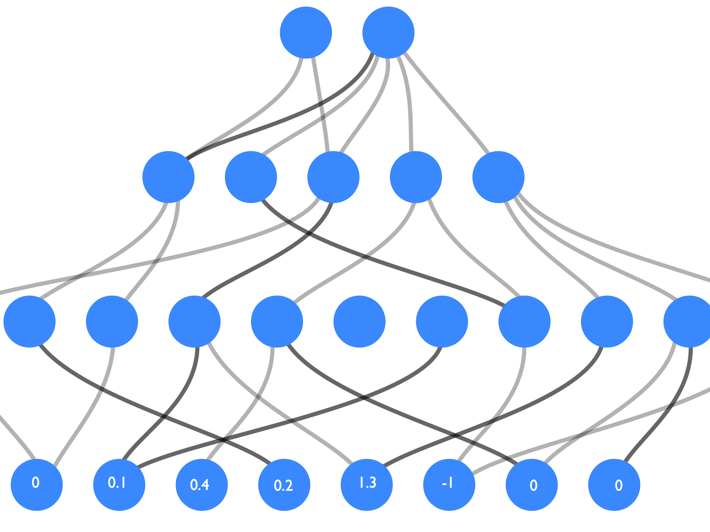{width="70%" fig-alt="Diagram titled ''feedforward' pass through the network: calculate output from input' - the same multi-layer network with numeric input values (0, 0.1, 0.4, 0.2, 1.3, -1, 0, 0) filled into the input layer, and one computed value (0.7) shown appearing at a node in the first hidden layer, illustrating the start of a forward-pass walkthrough."}

- [F. Marquardt, Machine Learning for Physicists 2024](https://pad.gwdg.de/s/ZwIoM-Arn)

---

## Slide 25

- Building the network

- [F. Marquardt, Machine Learning for Physicists 2024](https://pad.gwdg.de/s/ZwIoM-Arn)

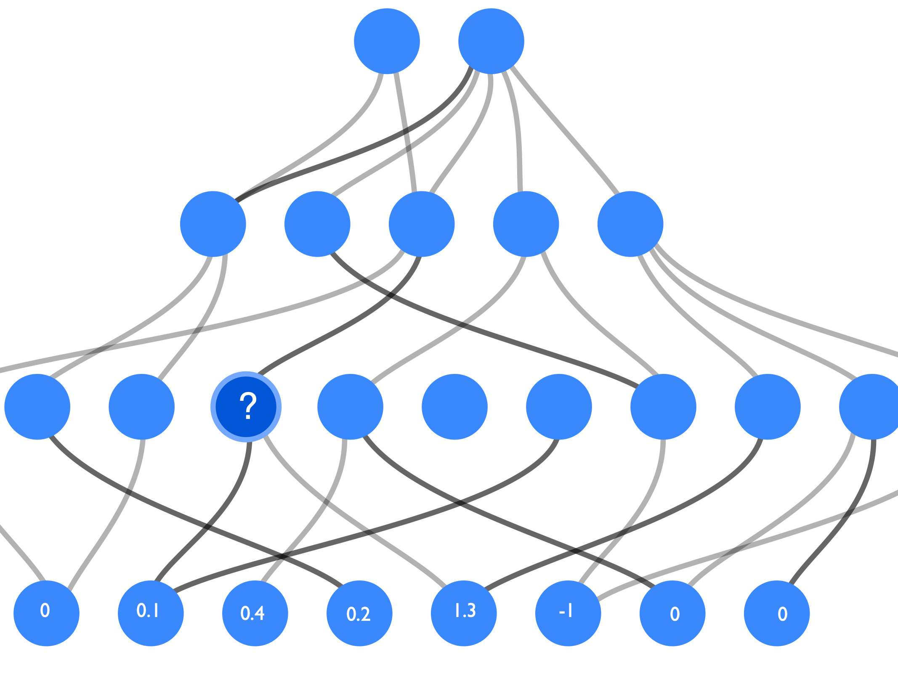{width="70%" fig-alt="The same feedforward-pass diagram, now with more computed values (0.2, -0.2, 0.7, 0.5, ...) filled in across the first hidden layer, continuing the step-by-step forward-pass walkthrough."}

- [F. Marquardt, Machine Learning for Physicists 2024](https://pad.gwdg.de/s/ZwIoM-Arn)

---

## Slide 26

- Building the network

- [F. Marquardt, Machine Learning for Physicists 2024](https://pad.gwdg.de/s/ZwIoM-Arn)

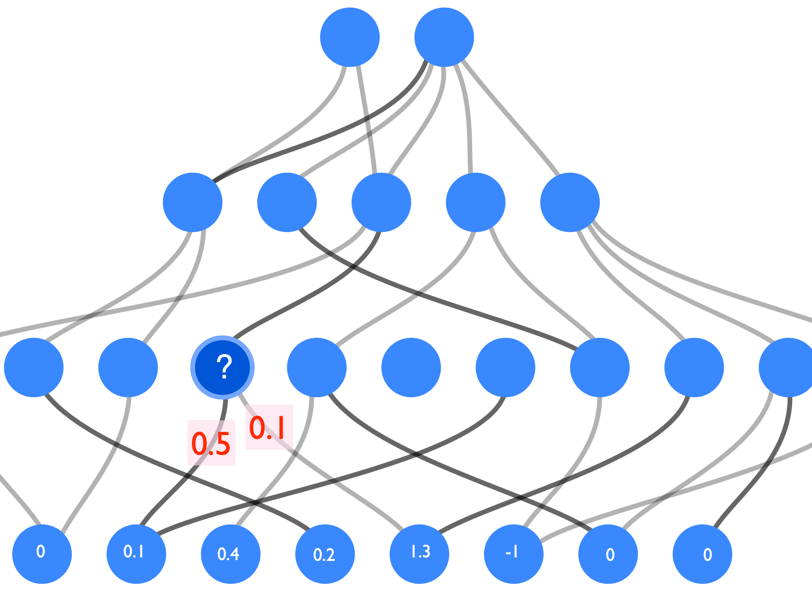{width="70%" fig-alt="The same feedforward-pass diagram, further along in the walkthrough: the first hidden layer is now fully computed and values are appearing in the second hidden layer (0.5, 0.2, -2.3, ...) as the computation propagates forward."}

- [F. Marquardt, Machine Learning for Physicists 2024](https://pad.gwdg.de/s/ZwIoM-Arn)

---

## Slide 27

- Building the network

- [F. Marquardt, Machine Learning for Physicists 2024](https://pad.gwdg.de/s/ZwIoM-Arn)

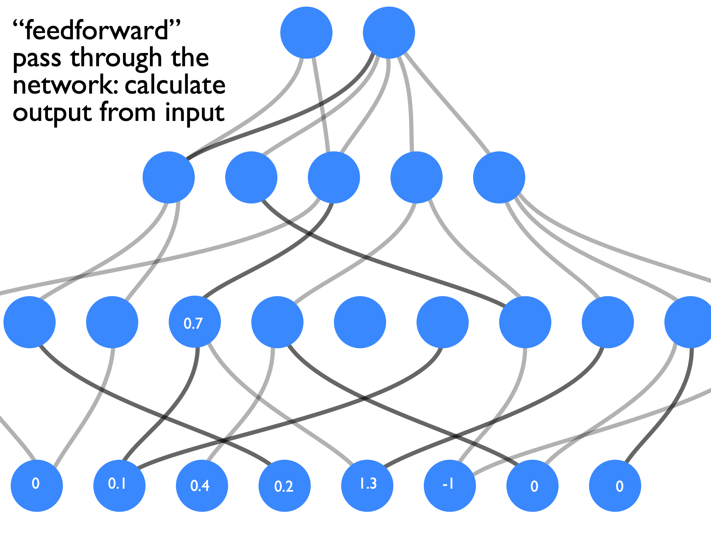{width="70%" fig-alt="Diagram titled ''feedforward' pass through the network: calculate output from input' - the same multi-layer network with numeric input values (0, 0.1, 0.4, 0.2, 1.3, -1, 0, 0) filled into the input layer, and one computed value (0.7) shown appearing at a node in the first hidden layer, illustrating the start of a forward-pass walkthrough."}

- [F. Marquardt, Machine Learning for Physicists 2024](https://pad.gwdg.de/s/ZwIoM-Arn)

---

## Slide 28

- Building the network

- [F. Marquardt, Machine Learning for Physicists 2024](https://pad.gwdg.de/s/ZwIoM-Arn)

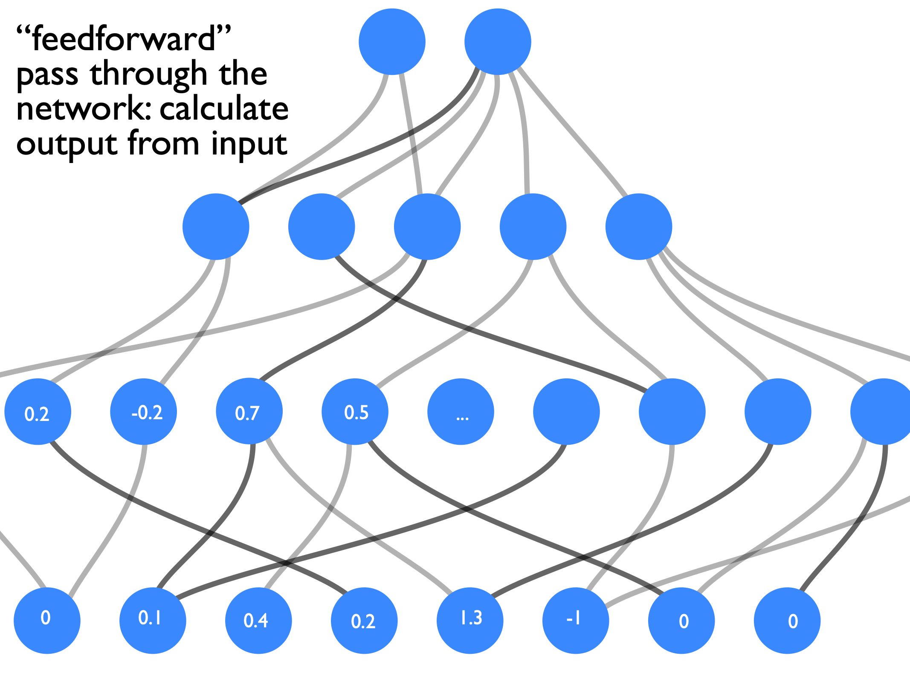{width="70%" fig-alt="The same feedforward-pass diagram, now with more computed values (0.2, -0.2, 0.7, 0.5, ...) filled in across the first hidden layer, continuing the step-by-step forward-pass walkthrough."}

- [F. Marquardt, Machine Learning for Physicists 2024](https://pad.gwdg.de/s/ZwIoM-Arn)

---

## Slide 29

- Building the network

- [F. Marquardt, Machine Learning for Physicists 2024](https://pad.gwdg.de/s/ZwIoM-Arn)

{width="70%" fig-alt="The same feedforward-pass diagram, further along in the walkthrough: the first hidden layer is now fully computed and values are appearing in the second hidden layer (0.5, 0.2, -2.3, ...) as the computation propagates forward."}

- [F. Marquardt, Machine Learning for Physicists 2024](https://pad.gwdg.de/s/ZwIoM-Arn)

---

## Slide 30

- Building the network

- [F. Marquardt, Machine Learning for Physicists 2024](https://pad.gwdg.de/s/ZwIoM-Arn)

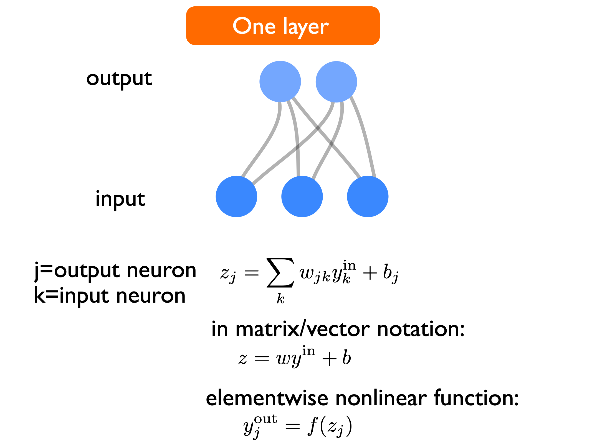{width="70%" fig-alt="Diagram titled 'One layer': two output neurons fully connected to three input neurons, with the per-neuron formula z_j = sum_k(w_jk * y_k^in) + b_j (j = output neuron, k = input neuron), its matrix/vector form z = wy^in + b, and the elementwise nonlinear function y_j^out = f(z_j)."}

- [F. Marquardt, Machine Learning for Physicists 2024](https://pad.gwdg.de/s/ZwIoM-Arn)

---

## Slide 31

- A very simple network

- [F. Marquardt, Machine Learning for Physicists 2024](https://pad.gwdg.de/s/ZwIoM-Arn)

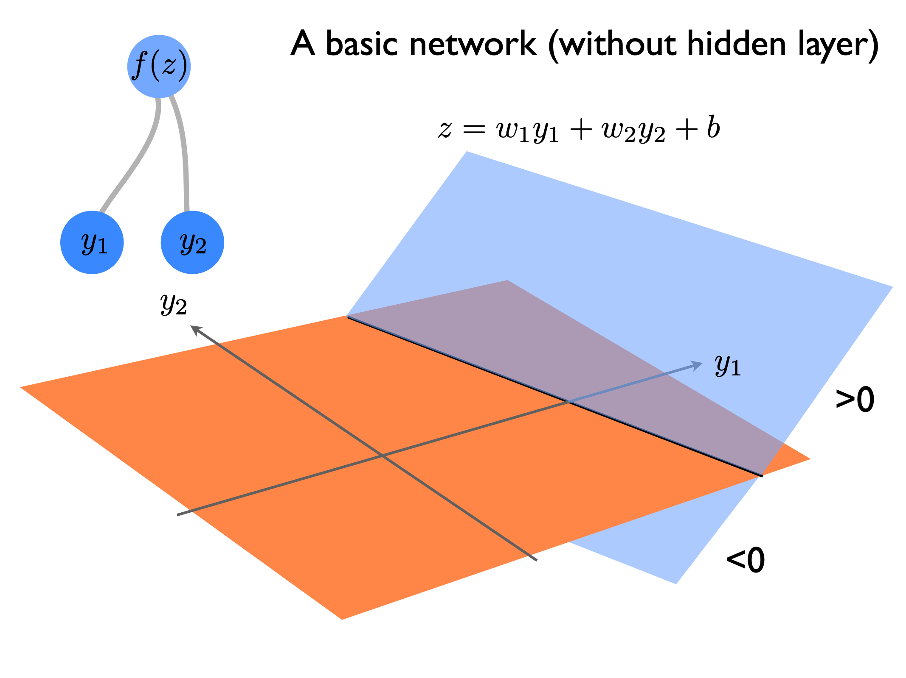{width="70%" fig-alt="Diagram titled 'A basic network (without hidden layer)': a single output neuron f(z) connected to two inputs y1, y2, with the formula z = w1*y1 + w2*y2 + b; below, a 3D plot shows the z=0 decision plane splitting space into an orange '<0' half and a blue '>0' half along the y1-y2 plane."}

- [F. Marquardt, Machine Learning for Physicists 2024](https://pad.gwdg.de/s/ZwIoM-Arn)

---

## Slide 32

<!-- TODO: complex slide layout (flagged by detect_complex_slide.py - see run log). Content below is complete but UNARRANGED - needs manual layout to match the original slide. -->

- A very simple network

- [F. Marquardt, Machine Learning for Physicists 2024](https://pad.gwdg.de/s/ZwIoM-Arn)

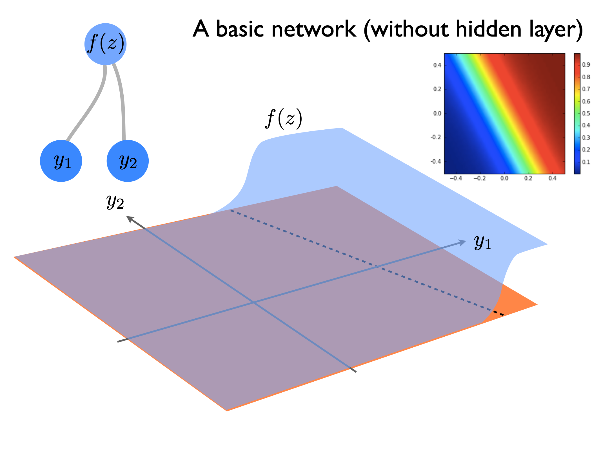{fig-alt="The same 'basic network (without hidden layer)' diagram as before, now with the output surface f(z) drawn as a folded 3D sheet above the y1-y2 plane, and a color-coded heatmap inset showing f(z)'s value (0 to 1) across the y1-y2 plane - a smoothed sigmoid-like version of the sharp z=0 decision boundary."}

- [F. Marquardt, Machine Learning for Physicists 2024](https://pad.gwdg.de/s/ZwIoM-Arn)
- 🇨🇦

- 🇺🇸

---

## Slide 33

- Function approximation

- [F. Marquardt, Machine Learning for Physicists 2024](https://pad.gwdg.de/s/ZwIoM-Arn)

- So far, the network architecture may have seemed somewhat arbitrary.
- A vital reason NNs are so useful are formally described in universal approximation theorems: NNs can (in principle) approximate any continuous function!
- For example: for a feedforward NN with a single hidden layer, if the activation function is non-polynomial (e.g. sigmoid, ReLU), then the network can act as a "universal approximator."
  - [G. Cybenko, Approximation by superpositions of a sigmoidal function (1989)](https://link.springer.com/article/10.1007/BF02551274)
- Note: this is only a statement of existence! Existence does not help you make a good neural network, only that one exists :)

---

## Slide 34

- Function approximation

- [F. Marquardt, Machine Learning for Physicists 2024](https://pad.gwdg.de/s/ZwIoM-Arn)

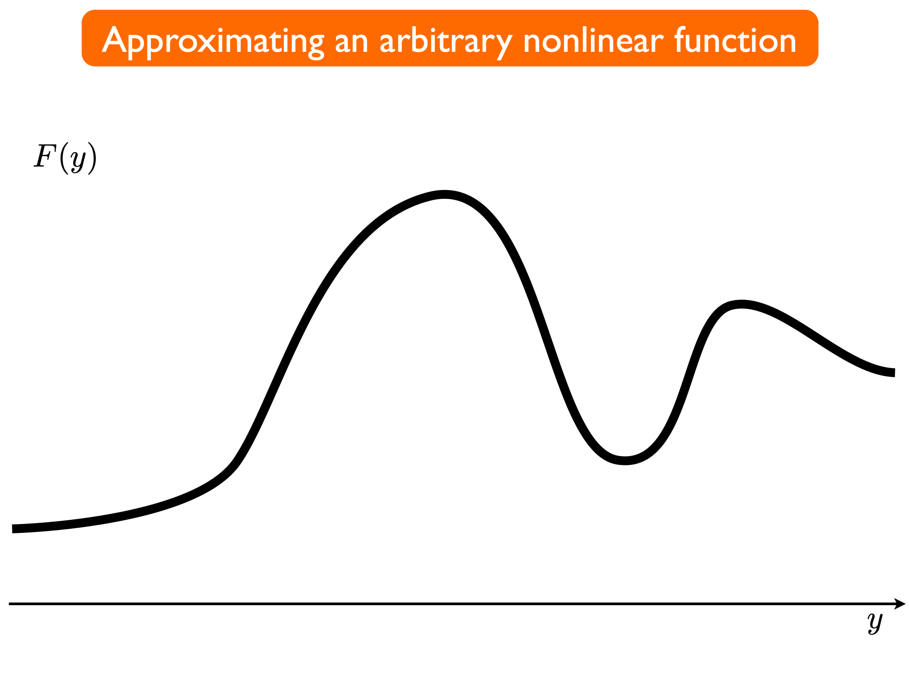{width="70%" fig-alt="Diagram titled 'Approximating an arbitrary nonlinear function': a single wiggly black curve F(y) with two peaks and a dip, plotted against a horizontal y axis, with no approximation yet shown."}

- [F. Marquardt, Machine Learning for Physicists 2024](https://pad.gwdg.de/s/ZwIoM-Arn)

---

## Slide 35

- Function approximation

- [F. Marquardt, Machine Learning for Physicists 2024](https://pad.gwdg.de/s/ZwIoM-Arn)

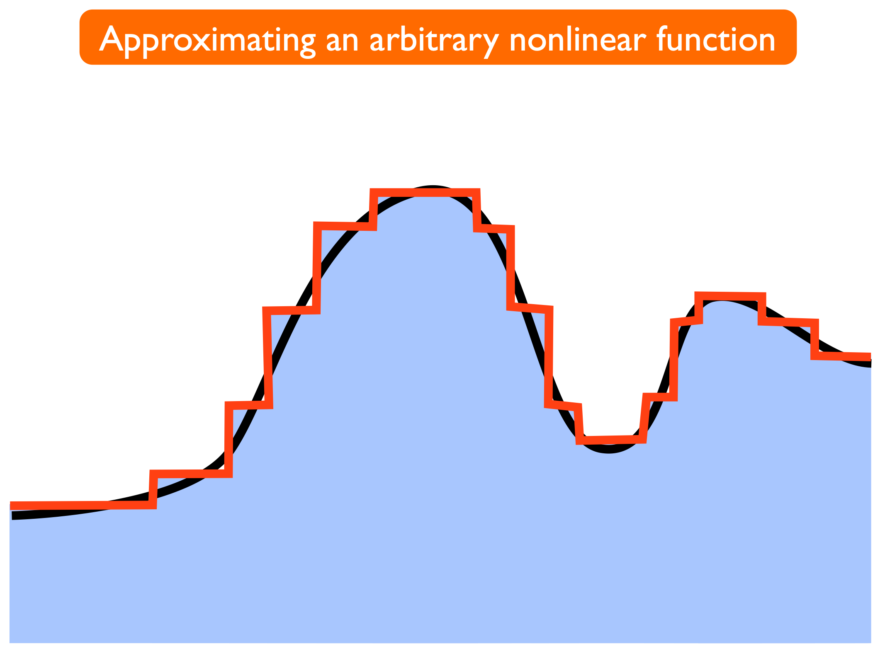{width="70%" fig-alt="The same 'approximating an arbitrary nonlinear function' plot, now with an orange step-function approximation (built from stacked rectangular steps) overlaid on the smooth black/blue-shaded curve, closely tracking its shape."}

- [F. Marquardt, Machine Learning for Physicists 2024](https://pad.gwdg.de/s/ZwIoM-Arn)

---

## Slide 36

- Function approximation

- [F. Marquardt, Machine Learning for Physicists 2024](https://pad.gwdg.de/s/ZwIoM-Arn)

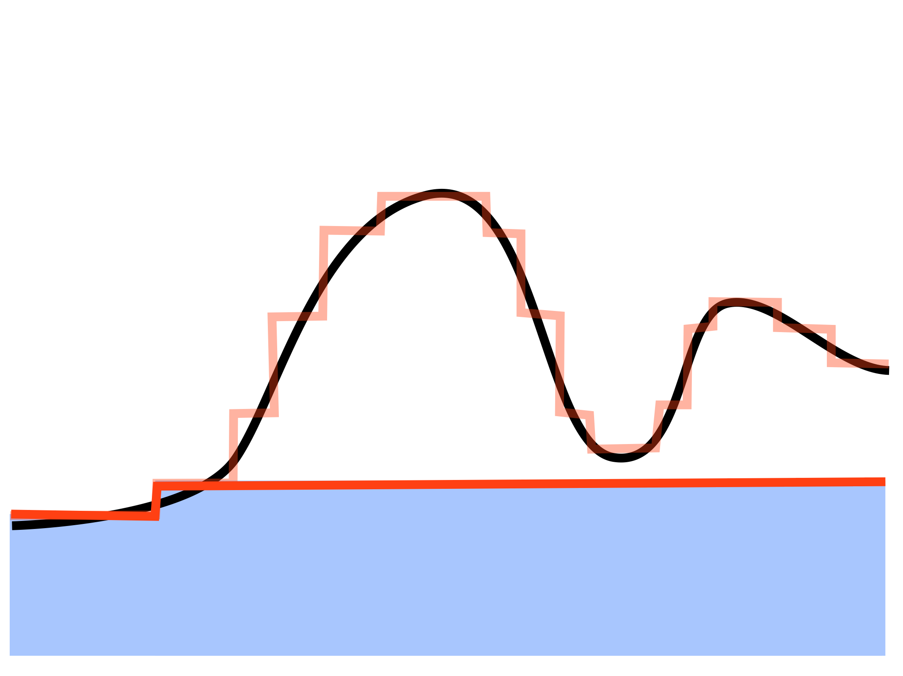{width="70%" fig-alt="The 'approximating an arbitrary nonlinear function' plot, with the orange step-function approximation refined to track the black curve more closely, still shown against the blue-shaded true function."}

- [F. Marquardt, Machine Learning for Physicists 2024](https://pad.gwdg.de/s/ZwIoM-Arn)

---

## Slide 37

- Function approximation

- [F. Marquardt, Machine Learning for Physicists 2024](https://pad.gwdg.de/s/ZwIoM-Arn)

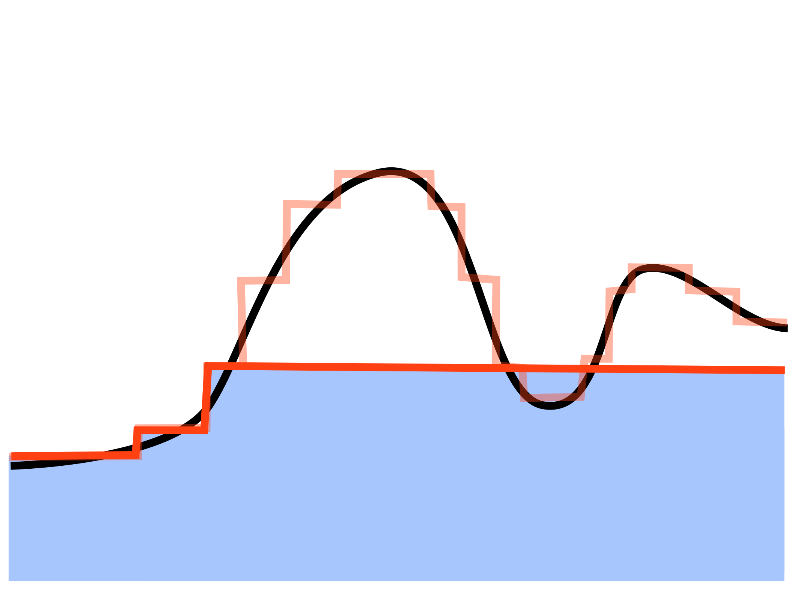{width="70%" fig-alt="The 'approximating an arbitrary nonlinear function' plot, with the orange step-function approximation refined to track the black curve more closely, still shown against the blue-shaded true function."}

- [F. Marquardt, Machine Learning for Physicists 2024](https://pad.gwdg.de/s/ZwIoM-Arn)

---

## Slide 38

- Function approximation

- [F. Marquardt, Machine Learning for Physicists 2024](https://pad.gwdg.de/s/ZwIoM-Arn)

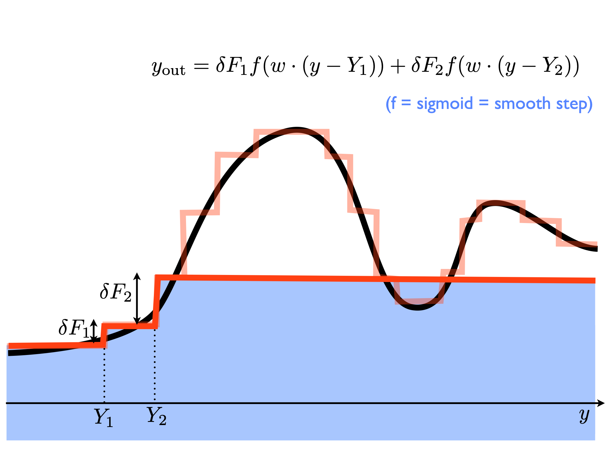{width="70%" fig-alt="Diagram building the step-function approximation from two sigmoid terms: the formula y_out = deltaF1*f(w*(y-Y1)) + deltaF2*f(w*(y-Y2)) (with f = sigmoid = smooth step), shown above a plot where two sigmoid steps of heights deltaF1 and deltaF2 at positions Y1, Y2 combine into a staircase closely tracking the target curve."}

- [F. Marquardt, Machine Learning for Physicists 2024](https://pad.gwdg.de/s/ZwIoM-Arn)

---

## Slide 39

- Function approximation

- [F. Marquardt, Machine Learning for Physicists 2024](https://pad.gwdg.de/s/ZwIoM-Arn)

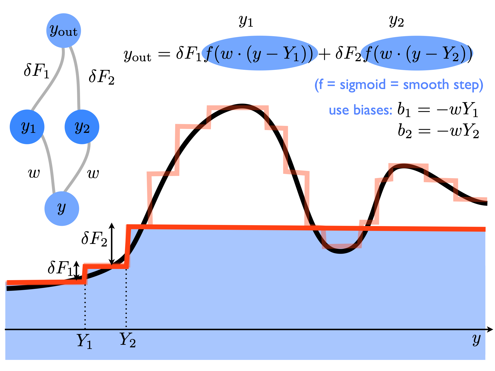{width="70%" fig-alt="The same two-sigmoid step-function diagram, now with a small network diagram added (input y feeding two hidden neurons y1, y2 via weight w, combining into y_out via deltaF1, deltaF2) and bias formulas b1 = -w*Y1, b2 = -w*Y2 to place each step at the right location."}

- [F. Marquardt, Machine Learning for Physicists 2024](https://pad.gwdg.de/s/ZwIoM-Arn)

---

## Slide 40

- Function approximation

- [F. Marquardt, Machine Learning for Physicists 2024](https://pad.gwdg.de/s/ZwIoM-Arn)

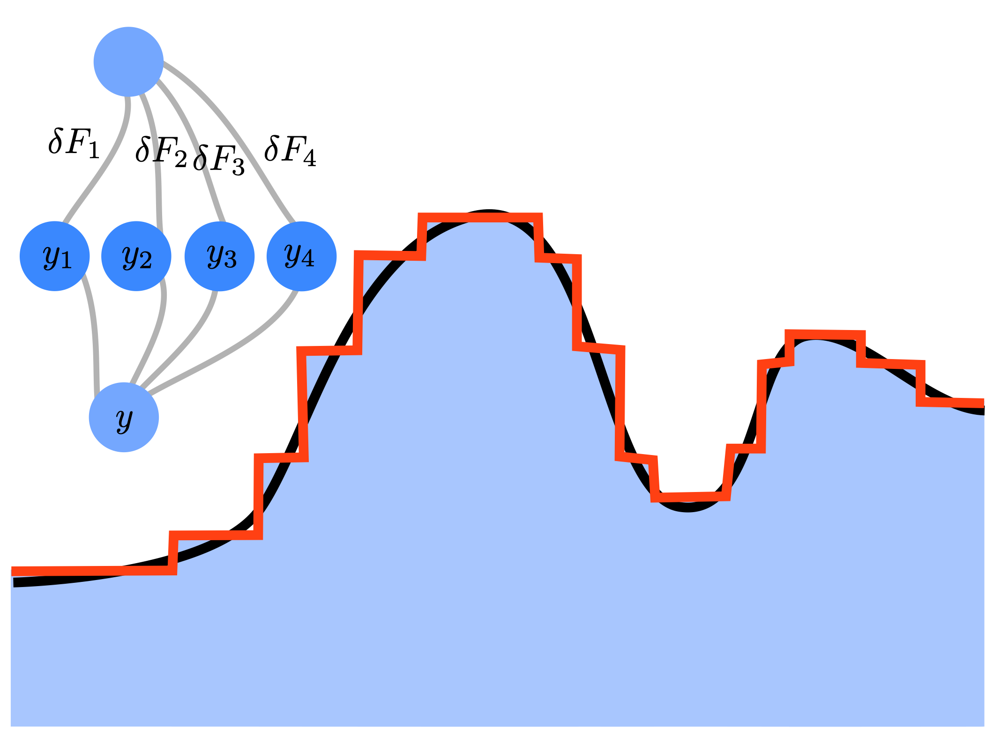{width="70%" fig-alt="Diagram of a network with four hidden neurons y1, y2, y3, y4 (each fed from y, weighted by deltaF1 through deltaF4) combining into y_out, with the resulting four-step staircase approximation shown tracking the target curve even more closely than the two-step version."}

- [F. Marquardt, Machine Learning for Physicists 2024](https://pad.gwdg.de/s/ZwIoM-Arn)

---

## Slide 41

- Function approximation

- [F. Marquardt, Machine Learning for Physicists 2024](https://pad.gwdg.de/s/ZwIoM-Arn)

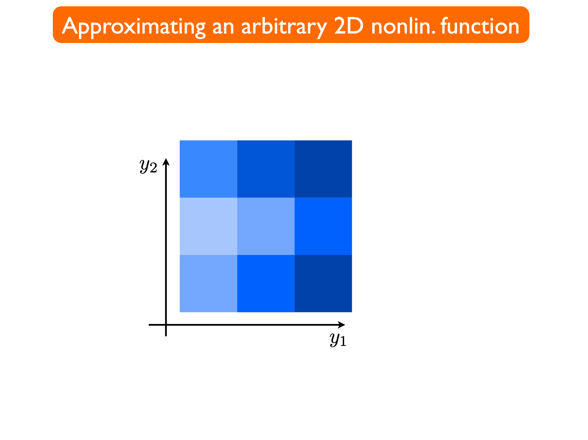{width="70%" fig-alt="Diagram titled 'Approximating an arbitrary 2D nonlinear function': a 3x3 grid of squares shaded in different shades of blue over y1 (horizontal) and y2 (vertical) axes, representing a coarse 2D step-function approximation."}

- [F. Marquardt, Machine Learning for Physicists 2024](https://pad.gwdg.de/s/ZwIoM-Arn)

---

## Slide 42

- Function approximation

- [F. Marquardt, Machine Learning for Physicists 2024](https://pad.gwdg.de/s/ZwIoM-Arn)

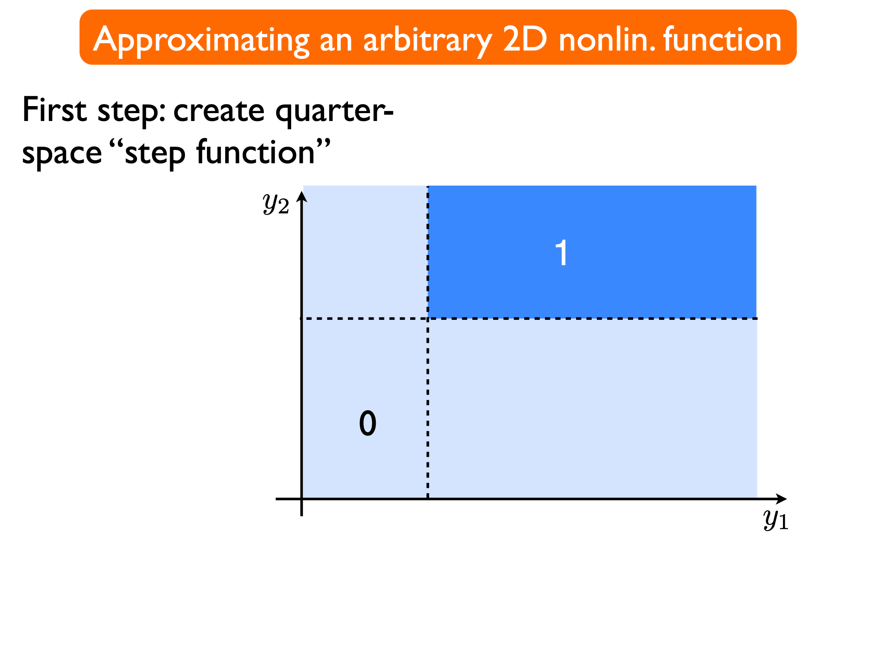{width="70%" fig-alt="Diagram titled 'Approximating an arbitrary 2D nonlinear function - First step: create quarter-space 'step function'': the y1-y2 plane divided by dashed lines into four quadrants, with the upper-right quadrant labeled 1 and the rest labeled 0."}

- [F. Marquardt, Machine Learning for Physicists 2024](https://pad.gwdg.de/s/ZwIoM-Arn)

---

## Slide 43

- Function approximation

- [F. Marquardt, Machine Learning for Physicists 2024](https://pad.gwdg.de/s/ZwIoM-Arn)

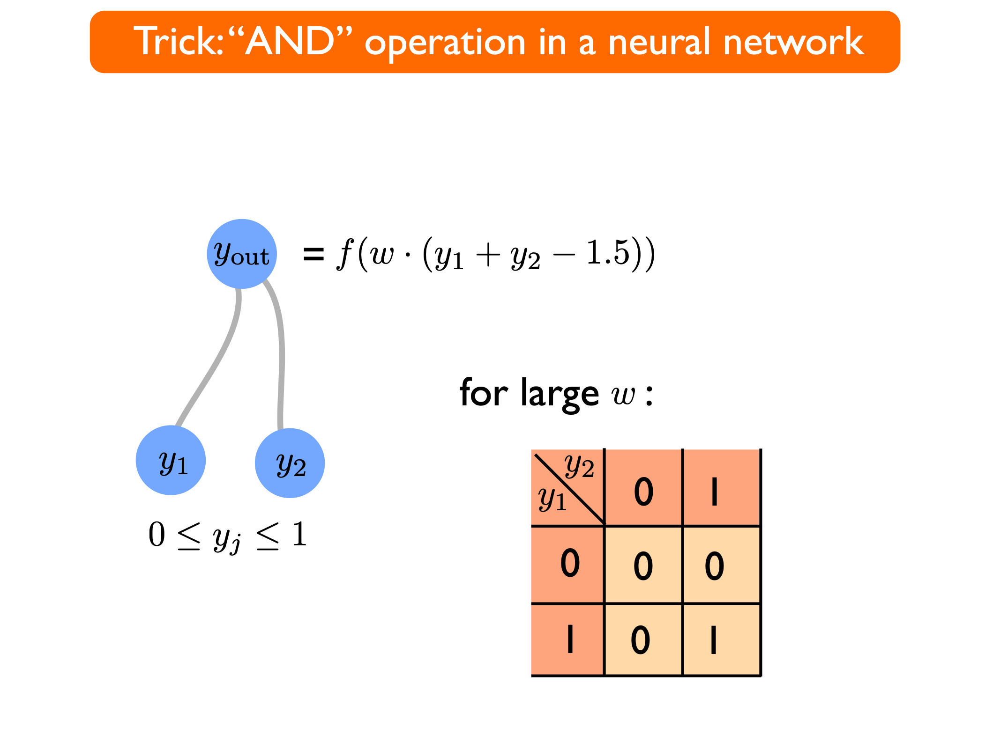{width="70%" fig-alt="Diagram titled 'Trick: 'AND' operation in a neural network': a small network (y1, y2 feeding y_out) with formula y_out = f(w*(y1+y2-1.5)), noting 0 <= y_j <= 1 and 'for large w'; a 2x2 truth table shows this reproduces logical AND (output 1 only when both y1=1 and y2=1)."}

- [F. Marquardt, Machine Learning for Physicists 2024](https://pad.gwdg.de/s/ZwIoM-Arn)

---

## Slide 44

- Function approximation

- [F. Marquardt, Machine Learning for Physicists 2024](https://pad.gwdg.de/s/ZwIoM-Arn)

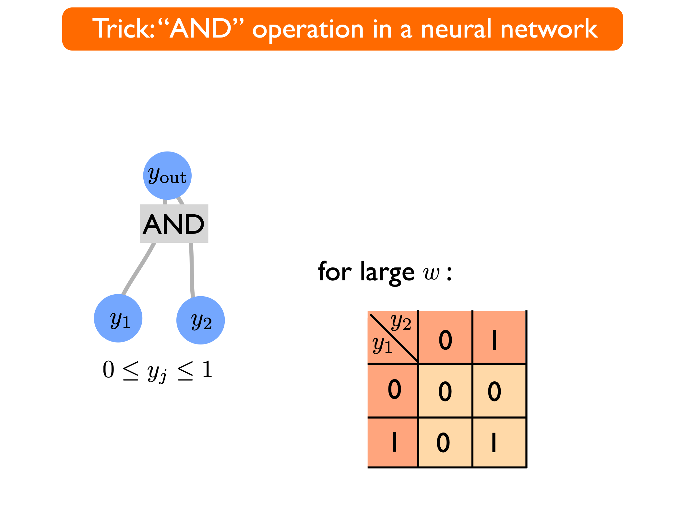{width="70%" fig-alt="Diagram titled 'Trick: 'AND' operation in a neural network': a single AND node combining y1 and y2 into y_out, with 0 <= y_j <= 1 and, for large w, a 2x2 truth table reproducing logical AND."}

- [F. Marquardt, Machine Learning for Physicists 2024](https://pad.gwdg.de/s/ZwIoM-Arn)

---

## Slide 45

- Function approximation

- [F. Marquardt, Machine Learning for Physicists 2024](https://pad.gwdg.de/s/ZwIoM-Arn)

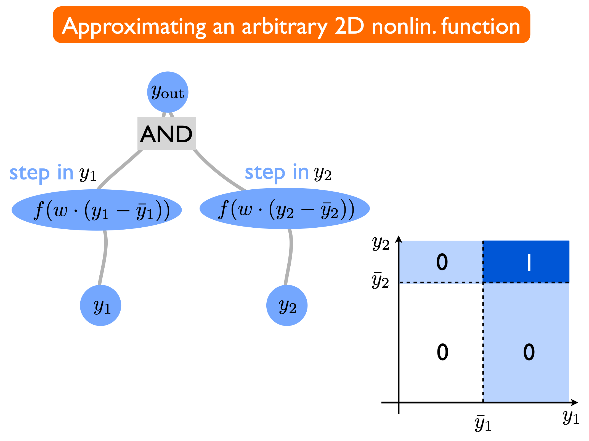{width="70%" fig-alt="Diagram titled 'Approximating an arbitrary 2D nonlinear function': an AND node combining a 'step in y1' term f(w*(y1-ybar1)) and a 'step in y2' term f(w*(y2-ybar2)), which together carve out a single rectangular quadrant (labeled 1) of the y1-y2 plane where both steps are active."}

- [F. Marquardt, Machine Learning for Physicists 2024](https://pad.gwdg.de/s/ZwIoM-Arn)

---

## Slide 46

<!-- TODO: complex slide layout (flagged by detect_complex_slide.py - see run log). Content below is complete but UNARRANGED - needs manual layout to match the original slide. -->

- Function approximation

- [F. Marquardt, Machine Learning for Physicists 2024](https://pad.gwdg.de/s/ZwIoM-Arn)

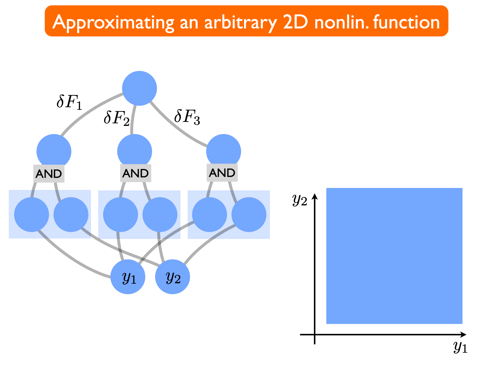{fig-alt="Diagram titled 'Approximating an arbitrary 2D nonlinear function': three AND-gate sub-networks (each combining y1, y2 through an AND node) feed into a top output node via weights deltaF1, deltaF2, deltaF3; alongside, a y1-y2 grid of shaded blue rectangles shows the progressively finer step-function approximation this network builds up region by region."}

- [F. Marquardt, Machine Learning for Physicists 2024](https://pad.gwdg.de/s/ZwIoM-Arn)

---

## Slide 47

<!-- TODO: complex slide layout (flagged by detect_complex_slide.py - see run log). Content below is complete but UNARRANGED - needs manual layout to match the original slide. -->

- Function approximation

- [F. Marquardt, Machine Learning for Physicists 2024](https://pad.gwdg.de/s/ZwIoM-Arn)

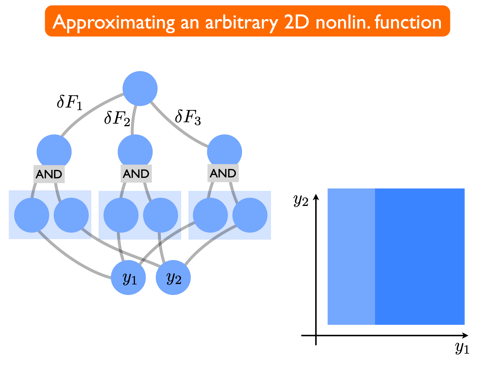{fig-alt="Diagram titled 'Approximating an arbitrary 2D nonlinear function': three AND-gate sub-networks (each combining y1, y2 through an AND node) feed into a top output node via weights deltaF1, deltaF2, deltaF3; alongside, a y1-y2 grid of shaded blue rectangles shows the progressively finer step-function approximation this network builds up region by region."}

- [F. Marquardt, Machine Learning for Physicists 2024](https://pad.gwdg.de/s/ZwIoM-Arn)

---

## Slide 48

<!-- TODO: complex slide layout (flagged by detect_complex_slide.py - see run log). Content below is complete but UNARRANGED - needs manual layout to match the original slide. -->

- Function approximation

- [F. Marquardt, Machine Learning for Physicists 2024](https://pad.gwdg.de/s/ZwIoM-Arn)

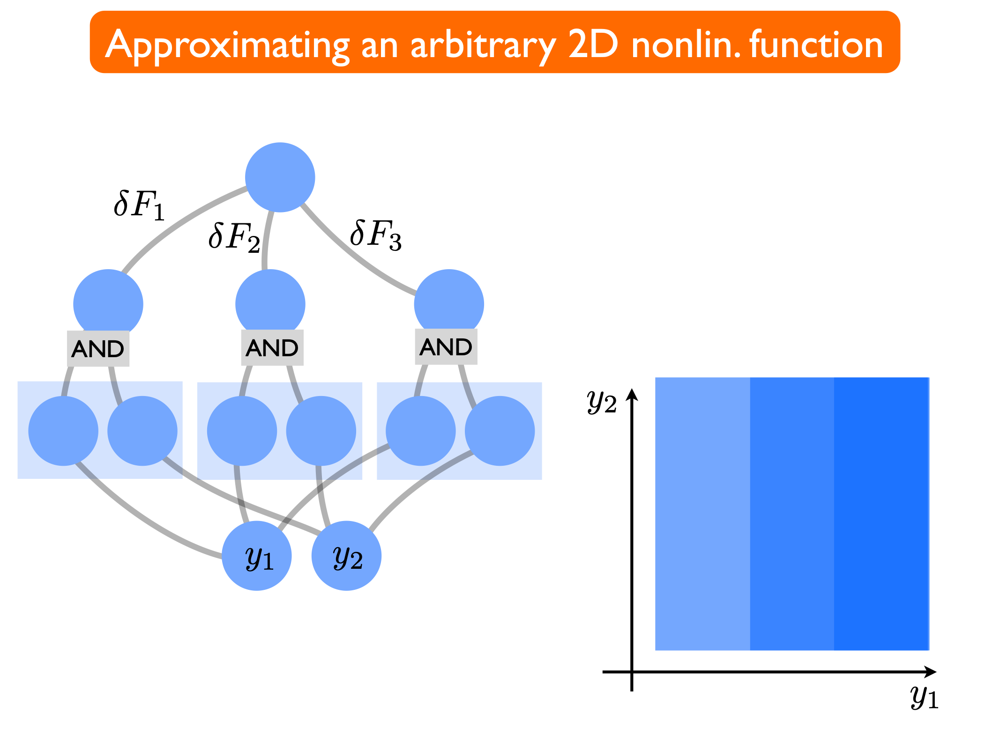{fig-alt="Diagram titled 'Approximating an arbitrary 2D nonlinear function': three AND-gate sub-networks (each combining y1, y2 through an AND node) feed into a top output node via weights deltaF1, deltaF2, deltaF3; alongside, a y1-y2 grid of shaded blue rectangles shows the progressively finer step-function approximation this network builds up region by region."}

- [F. Marquardt, Machine Learning for Physicists 2024](https://pad.gwdg.de/s/ZwIoM-Arn)

---

## Slide 49

<!-- TODO: complex slide layout (flagged by detect_complex_slide.py - see run log). Content below is complete but UNARRANGED - needs manual layout to match the original slide. -->

- Function approximation

- [F. Marquardt, Machine Learning for Physicists 2024](https://pad.gwdg.de/s/ZwIoM-Arn)

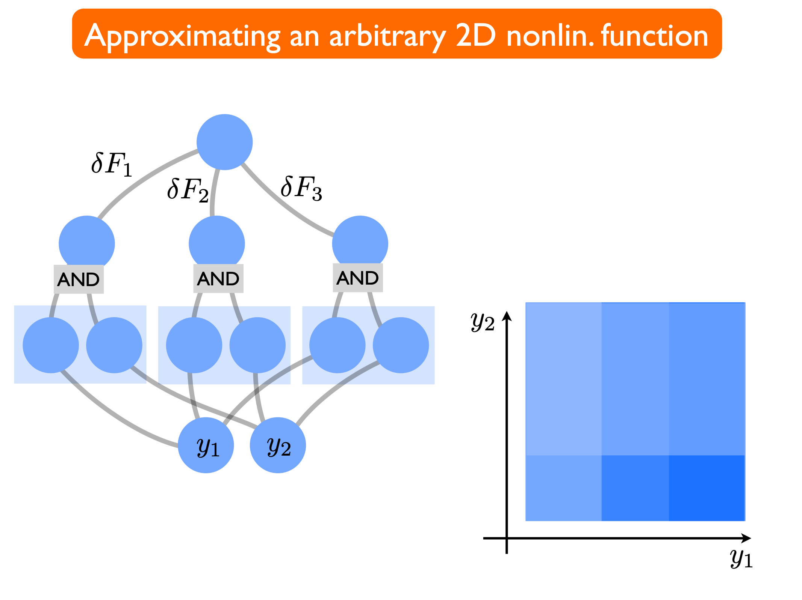{fig-alt="Diagram titled 'Approximating an arbitrary 2D nonlinear function': three AND-gate sub-networks (each combining y1, y2 through an AND node) feed into a top output node via weights deltaF1, deltaF2, deltaF3; alongside, a y1-y2 grid of shaded blue rectangles shows the progressively finer step-function approximation this network builds up region by region."}

- [F. Marquardt, Machine Learning for Physicists 2024](https://pad.gwdg.de/s/ZwIoM-Arn)

---

## Slide 50

<!-- TODO: complex slide layout (flagged by detect_complex_slide.py - see run log). Content below is complete but UNARRANGED - needs manual layout to match the original slide. -->

- Function approximation

- [F. Marquardt, Machine Learning for Physicists 2024](https://pad.gwdg.de/s/ZwIoM-Arn)

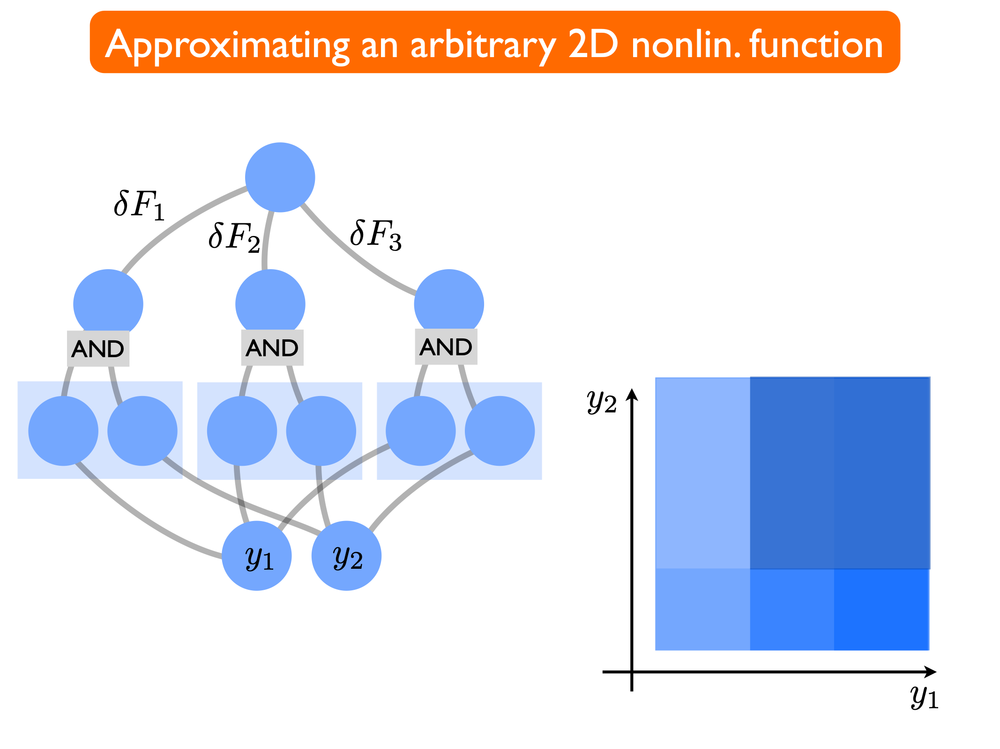{fig-alt="Diagram titled 'Approximating an arbitrary 2D nonlinear function': three AND-gate sub-networks (each combining y1, y2 through an AND node) feed into a top output node via weights deltaF1, deltaF2, deltaF3; alongside, a y1-y2 grid of shaded blue rectangles shows the progressively finer step-function approximation this network builds up region by region."}

- [F. Marquardt, Machine Learning for Physicists 2024](https://pad.gwdg.de/s/ZwIoM-Arn)

---

## Slide 51

<!-- TODO: complex slide layout (flagged by detect_complex_slide.py - see run log). Content below is complete but UNARRANGED - needs manual layout to match the original slide. -->

- Function approximation

- [F. Marquardt, Machine Learning for Physicists 2024](https://pad.gwdg.de/s/ZwIoM-Arn)

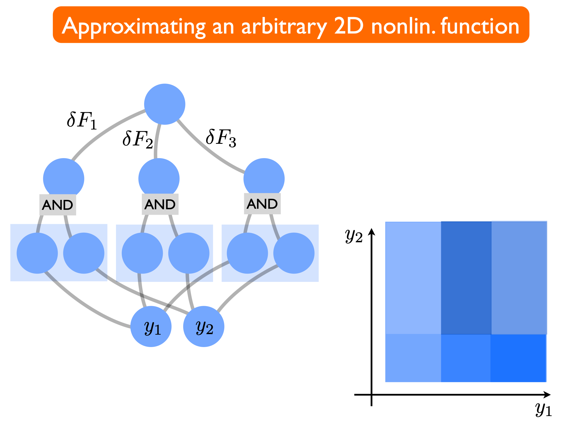{fig-alt="Diagram titled 'Approximating an arbitrary 2D nonlinear function': three AND-gate sub-networks (each combining y1, y2 through an AND node) feed into a top output node via weights deltaF1, deltaF2, deltaF3; alongside, a y1-y2 grid of shaded blue rectangles shows the progressively finer step-function approximation this network builds up region by region."}

- [F. Marquardt, Machine Learning for Physicists 2024](https://pad.gwdg.de/s/ZwIoM-Arn)

---

## Slide 52

- Hands-on

- [F. Marquardt, Machine Learning for Physicists 2024](https://pad.gwdg.de/s/ZwIoM-Arn)

- Thanks to Marquardt, we have learned what a neural network is.
- Time for some hands-on! Let's move outside of Docker now (more flexibility, more permanent).

- cd PHY410
- mkdir ml; cd ml
- python3.12 -m venv venv
- source venv/bin/activate
- python -m pip install jupyterlab matplotlib numpy scipy tensorflow keras jax flax optax scikit-learn
- pip freeze > requirements.txt # recreate exact env with `pip install -r requirements.txt`
- git clone git@github.com:FlorianMarquardt/machine-learning-for-physicists.git
- jupyter-lab--port 8888 --no-browser

- At minimum, take a look at:
  - 01_Basics_NeuralNetworksPython.ipynb (construct a neural network from scratch, no NN library imports)
  - 01_tutorial_NetworkVisualization.ipynb

---

## Last time: basics of neural networks

- original version: Haade;vectorization: Wjh31, Quibik, CC BY-SA 3.0 <https://creativecommons.org/licenses/by-sa/3.0>, via Wikimedia Commons

{width="70%" fig-alt="Diagram titled 'One layer': two output neurons fully connected to three input neurons, with the per-neuron formula z_j = sum_k(w_jk * y_k^in) + b_j (j = output neuron, k = input neuron), its matrix/vector form z = wy^in + b, and the elementwise nonlinear function y_j^out = f(z_j)."}

- [F. Marquardt, Machine Learning for Physicists 2024](https://pad.gwdg.de/s/ZwIoM-Arn)

---

## Last time: basics of neural networks

- original version: Haade;vectorization: Wjh31, Quibik, CC BY-SA 3.0 <https://creativecommons.org/licenses/by-sa/3.0>, via Wikimedia Commons

{width="70%" fig-alt="Diagram titled 'One layer': two output neurons fully connected to three input neurons, with the per-neuron formula z_j = sum_k(w_jk * y_k^in) + b_j (j = output neuron, k = input neuron), its matrix/vector form z = wy^in + b, and the elementwise nonlinear function y_j^out = f(z_j)."}

- [F. Marquardt, Machine Learning for Physicists 2024](https://pad.gwdg.de/s/ZwIoM-Arn)
{width="70%" fig-alt="The same feedforward-pass diagram, further along in the walkthrough: the first hidden layer is now fully computed and values are appearing in the second hidden layer (0.5, 0.2, -2.3, ...) as the computation propagates forward."}

- Activation functions

---

## Last time: feed forward

- original version: Haade;vectorization: Wjh31, Quibik, CC BY-SA 3.0 <https://creativecommons.org/licenses/by-sa/3.0>, via Wikimedia Commons

{width="70%" fig-alt="The same feedforward-pass diagram, further along in the walkthrough: the first hidden layer is now fully computed and values are appearing in the second hidden layer (0.5, 0.2, -2.3, ...) as the computation propagates forward."}

- [F. Marquardt, Machine Learning for Physicists 2024](https://pad.gwdg.de/s/ZwIoM-Arn)

---

## Last time: feed forward

- original version: Haade;vectorization: Wjh31, Quibik, CC BY-SA 3.0 <https://creativecommons.org/licenses/by-sa/3.0>, via Wikimedia Commons

{width="70%" fig-alt="The same feedforward-pass diagram, further along in the walkthrough: the first hidden layer is now fully computed and values are appearing in the second hidden layer (0.5, 0.2, -2.3, ...) as the computation propagates forward."}

- [F. Marquardt, Machine Learning for Physicists 2024](https://pad.gwdg.de/s/ZwIoM-Arn)
- ${y}_{j}^{(n)}$ = value of neurons in $n$th layer

---

## Last time: feed forward

<!-- TODO: complex slide layout (flagged by detect_complex_slide.py - see run log). Content below is complete but UNARRANGED - needs manual layout to match the original slide. -->

- original version: Haade;vectorization: Wjh31, Quibik, CC BY-SA 3.0 <https://creativecommons.org/licenses/by-sa/3.0>, via Wikimedia Commons

{fig-alt="Infographic titled 'ACTIVATION FUNCTIONS IN NEURAL NETWORKS' showing five side-by-side plots of common activation functions (ReLU, GELU, Sigmoid, Tanh, Swish), each plotted as input versus output."}

- [F. Marquardt, Machine Learning for Physicists 2024](https://pad.gwdg.de/s/ZwIoM-Arn)
- ${y}_{j}^{(n)}$ = value of neurons in $n$th layer

- ${w}_{jk}^{n,n-1}$ = weights (layer $n-1$ to $n$)

---

## Last time: feed forward

<!-- TODO: complex slide layout (flagged by detect_complex_slide.py - see run log). Content below is complete but UNARRANGED - needs manual layout to match the original slide. -->

- original version: Haade;vectorization: Wjh31, Quibik, CC BY-SA 3.0 <https://creativecommons.org/licenses/by-sa/3.0>, via Wikimedia Commons

{fig-alt="The same feedforward-pass diagram, further along in the walkthrough: the first hidden layer is now fully computed and values are appearing in the second hidden layer (0.5, 0.2, -2.3, ...) as the computation propagates forward."}

- [F. Marquardt, Machine Learning for Physicists 2024](https://pad.gwdg.de/s/ZwIoM-Arn)
- ${y}_{j}^{(n)}$ = value of neurons in $n$th layer

- ${w}_{jk}^{n,n-1}$ = weights (layer $n-1$ to $n$)

- ${z}_{j}^{(n)}$=input for "$y=f(z)$"
- =${w}_{jk}^{n,n-1}{y}_{k}^{(n-1)}+{b}_{j}^{n,n-1}$

---

## Slide 59

- Hands-on

- [F. Marquardt, Machine Learning for Physicists 2024](https://pad.gwdg.de/s/ZwIoM-Arn)

- Thanks to Marquardt, we have learned what a neural network is.
- Time for some hands-on! Let's move outside of Docker now (more flexibility, more permanent).

- cd PHY410
- mkdir ml; cd ml
- python3.12 -m venv venv
- source venv/bin/activate
- python -m pip install jupyterlab matplotlib numpy scipy tensorflow keras jax flax optax scikit-learn
- pip freeze > requirements.txt # recreate exact env with `pip install -r requirements.txt`
- git clone git@github.com:FlorianMarquardt/machine-learning-for-physicists.git
- jupyter-lab--port 8888 --no-browser

- At minimum, take a look at:
  - 01_Basics_NeuralNetworksPython.ipynb (construct a neural network from scratch, no NN library imports)
  - 01_tutorial_NetworkVisualization.ipynb

---

# Training

---

## Neural network training

- So, what about the "learning" part of "machine learning"?
- Training is the process of setting the weights in a NN for a given goal.
  - We've already done this a lot in CompPhys: least squares fitting, BFGS, etc.!
  - But now, we are dealing with >(>) thousands of parameters and input samples.
- A few broad categories:
  - Supervised
  - Unsupervised
  - Partially supervised
  - Reinforcement learning
- We will focus on supervised learning for today.

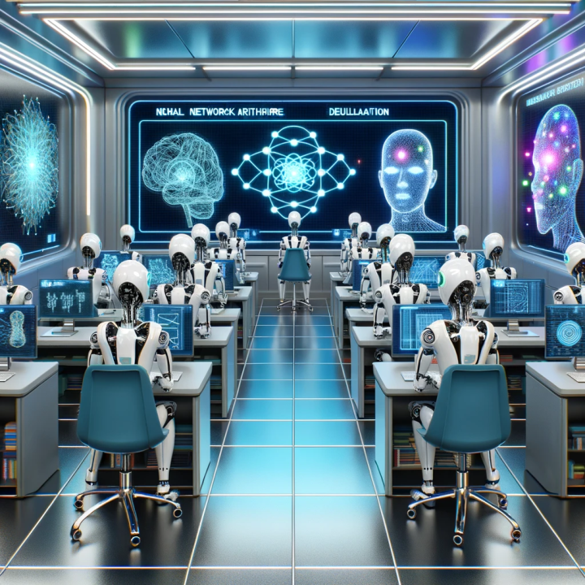{width="70%" fig-alt="AI-generated illustration of a futuristic classroom full of humanoid robots seated at computer terminals, facing a large screen labeled 'NEURAL NETWORK ARCHITECTURE / DEEP LEARNING' showing a glowing brain, network diagram, and human head outline - a decorative/joke image, not course content."}

- AI picture of AI

---

## Neural network training

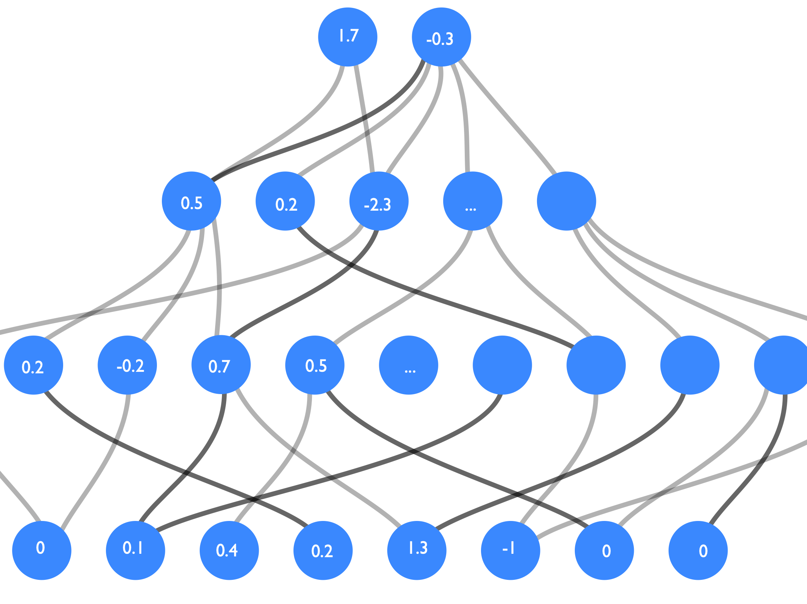{width="70%" fig-alt="The same feedforward-pass diagram, further along in the walkthrough: the first hidden layer is now fully computed and values are appearing in the second hidden layer (0.5, 0.2, -2.3, ...) as the computation propagates forward."}

- [F. Marquardt, Machine Learning for Physicists 2024](https://pad.gwdg.de/s/ZwIoM-Arn)

---

## Neural network training

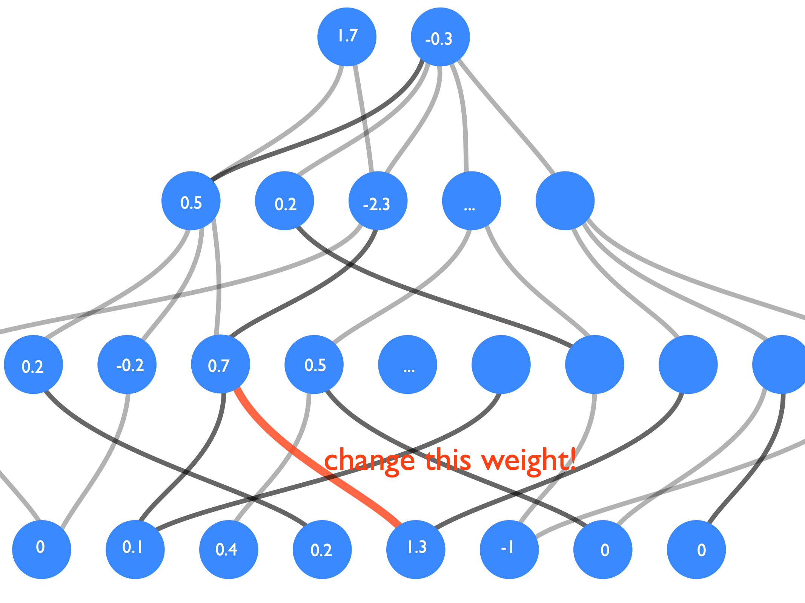{width="70%" fig-alt="The same feedforward-pass network diagram, now fully computed with output values 1.7 and -0.3 at the top, with one connection (from the hidden-layer node valued 0.7 to the input valued 1.3) highlighted in red and labeled 'change this weight!' - illustrating which weight to adjust during training."}

- [F. Marquardt, Machine Learning for Physicists 2024](https://pad.gwdg.de/s/ZwIoM-Arn)

---

## Neural network training

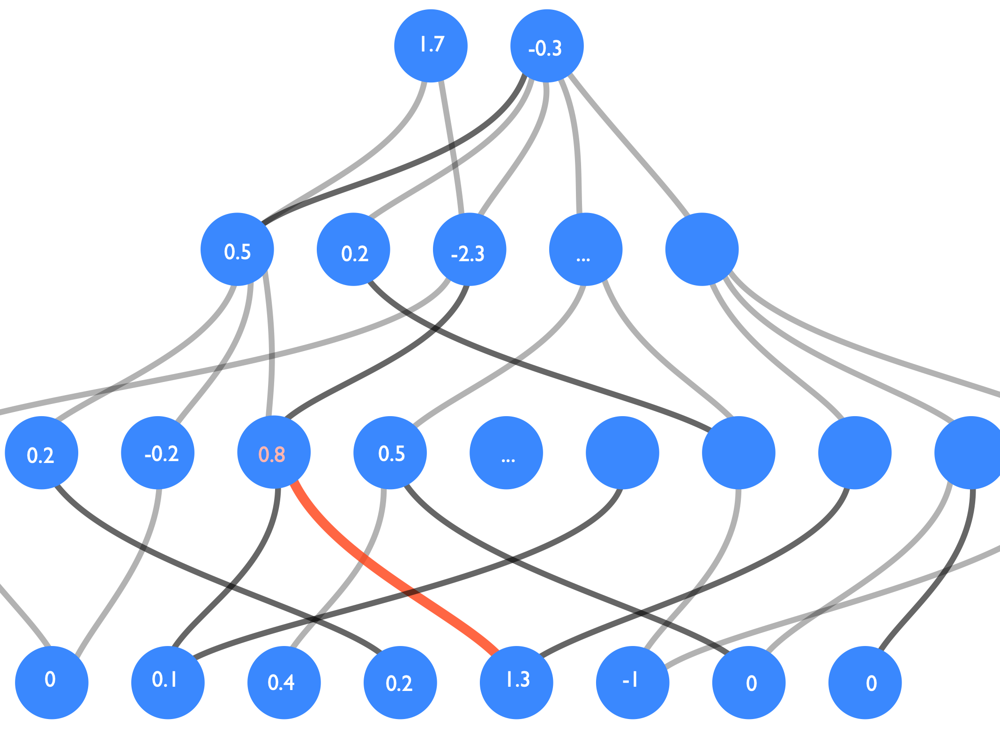{width="70%" fig-alt="The same network diagram after the highlighted weight has been updated: the hidden-layer node's value has changed from 0.7 to 0.8, and the top output values have shifted to 1.9 and -0.2 (from 1.7 and -0.3), with the updated connection still highlighted in red."}

- [F. Marquardt, Machine Learning for Physicists 2024](https://pad.gwdg.de/s/ZwIoM-Arn)

---

## Neural network training

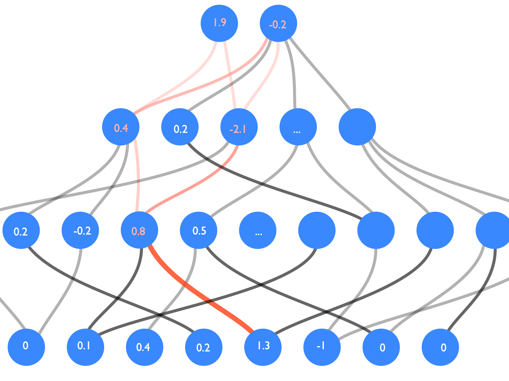{width="70%" fig-alt="The same post-update network diagram, now captioned 'Goal: Adapt weights to get closer to the 'correct' answer (provided by the trainer)' in a red banner across the top."}

- [F. Marquardt, Machine Learning for Physicists 2024](https://pad.gwdg.de/s/ZwIoM-Arn)

---

## Neural network training

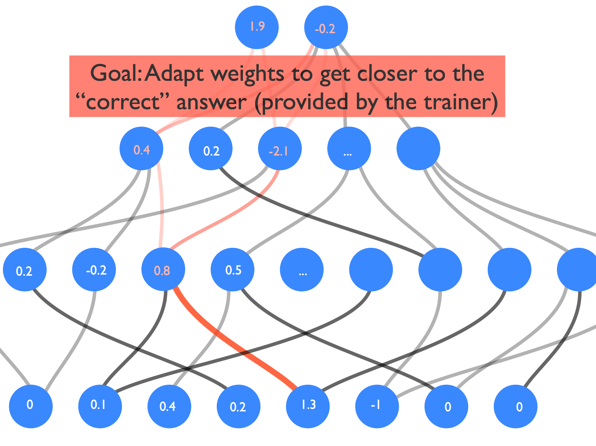{width="70%" fig-alt="A Hubble diagram from the Supernova Cosmology Project: effective magnitude m_B versus redshift z (log scale), with Calan/Tololo low-redshift supernovae (yellow points) and higher-redshift supernovae (red points) compared against several cosmological model curves for different (Omega_M, Omega_Lambda) parameter pairs."}

- [F. Marquardt, Machine Learning for Physicists 2024](https://pad.gwdg.de/s/ZwIoM-Arn)

---

## Cost function

- The basis of training is the minimization of a cost function.
  - Remember back to fitting: we minimized the ${ \chi }^{2}$ of the data w.r.t. the fit function (with Newton, BFGS, etc.)
- As with fitting, for supervised learning, we have a well-defined target for each input sample, say $F({y}^{\text{in}})$, and we want to find the optimal weights, $w$, such that ${F}_{w}({y}^{\text{in}}) \approx F({y}^{\text{in}})$.
- A common cost function: "L2" norm (looks a lot like a ${ \chi }^{2}$):
- $$C(w)=\frac{1}{2}⟨ \parallel {F}_{w}({y}^{\text{in}}-F({y}^{\text{in}}){ \parallel }^{2}⟩$$
- Like neuron activation functions, there's some choice here:
  - "L1" norm, aka absolute value
  - Modify to penalize specific behavior (e.g. unwanted correlations)

{width="70%" fig-alt="Table comparing four ways to encode the decimal numbers 0-7: Binary (3-bit), Unary (8-bit, filled left-to-right with 1s), and One-hot (8-bit, single 1 at the position matching the value)."}

- Fitting cosmological expansion

---

## Cost function

<!-- TODO: complex slide layout (flagged by detect_complex_slide.py - see run log). Content below is complete but UNARRANGED - needs manual layout to match the original slide. -->

- What about classification?
  - For regression, the output is a real number, so ${ \chi }^{2}$ makes sense
  - For classification, the output in discrete... how do we adapt for discrete math?
- First, define the output of the neural network: [one-hot encoding](https://en.wikipedia.org/wiki/One-hot)
  - For $N$ categories, output is a vector of length $N$
  - Each slot is 0 or 1, corresponding to the $N$ categories.
  - In practice, this works better than encoding categories as, e.g., a single integer (0–7); avoids assigning unwanted "meaning" to the output.

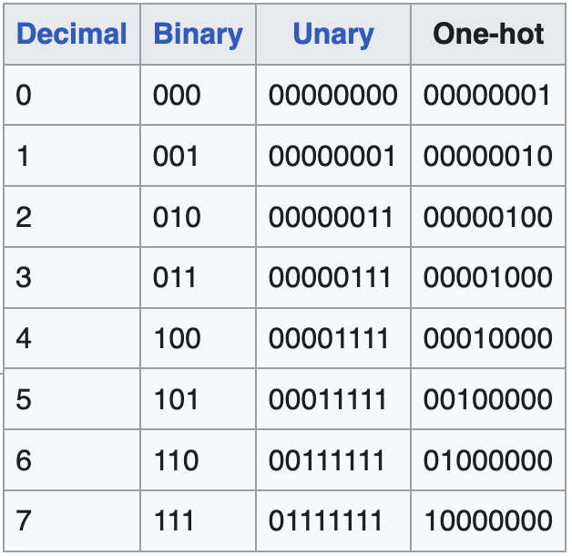{fig-alt="Table comparing four ways to encode the decimal numbers 0-7: Binary (3-bit), Unary (8-bit, filled left-to-right with 1s), and One-hot (8-bit, single 1 at the position matching the value)."}

- One-hot encoding
- True

- NN output

- Interpretation: "probability" that sample is in each category

---

## Cost function

- Popular loss function for categorical data: binary cross entropy, or log loss:
- $$\text{BCE}=-\frac{1}{N}\mathop{\mathop{ \sum }\limits_{i=1}}\limits^{N}\left[ {y}_{i}log({p}_{i})+(1-{y}_{i})log(1-{p}_{i}) \right]$$
- Go through a few cases to convince yourself (e.g. large number for incorrect ${p}_{i}$, zero for correct ${p}_{i}$):
  - ${y}_{0}=1$ and ${p}_{0}=1$?     $-1ln1=0$
  - ${y}_{0}=1$ and ${p}_{0}=0$?     $-1ln0= \infty $
  - ${y}_{0}=0$ and ${p}_{0}= \epsilon $?    $-0ln \epsilon =0$

- True

- NN output

---

## Minimizing the cost function

- Next, we minimize the cost function, $C(w)$, versus the weights $w$.
- We already know a lot about minimization... but now we have a huge number of parameters!
  - In other words, minimization over a huge dimensional space.
- Strategy:
  - Use some randomness (aka stochastic methods) to avoid local minima.
  - Use a relatively simple minimizer (we will have a lot of function calls, so they have to be cheap. No 2nd derivatives!)

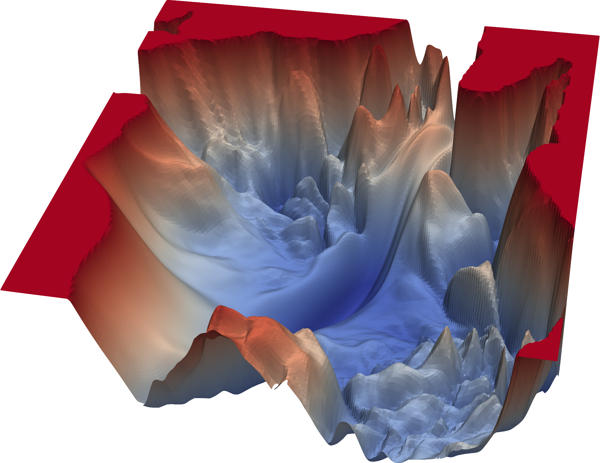{width="70%" fig-alt="3D rendered rugged landscape/terrain with red plateaus at the rim, orange-brown ridges, and a deep blue-white basin riddled with sharp jagged peaks and crevices at the bottom - illustrating a highly non-convex cost-function surface with many local minima."}

- A two dimensional section through the cost function (“loss landscape”) of a neural network from Li et al. (2018).
- [https://computational-physics.tripos.org/slides/autodiff.html](https://computational-physics.tripos.org/slides/autodiff.html)

---

## Gradient descent

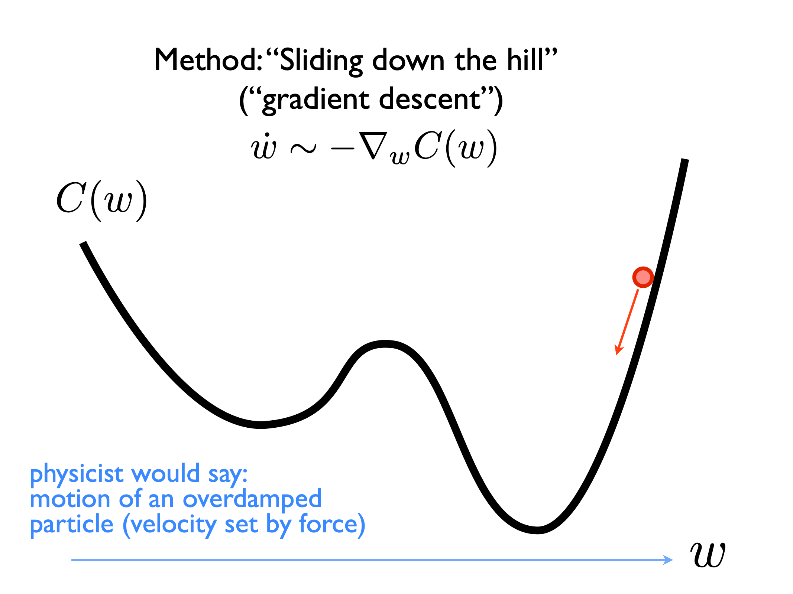{width="70%" fig-alt="Diagram titled 'Method: 'Sliding down the hill' ('gradient descent')': the formula w-dot ~ -grad_w C(w) above a plot of a cost function C(w) with two local minima, a red ball on the steep right slope with an arrow pointing downhill, and a note that a physicist would call this the motion of an overdamped particle."}

- [F. Marquardt, Machine Learning for Physicists 2024](https://pad.gwdg.de/s/ZwIoM-Arn)

---

## Gradient descent

{width="70%" fig-alt="Diagram titled 'Method: 'Sliding down the hill' ('gradient descent')': the formula w-dot ~ -grad_w C(w) above a plot of a cost function C(w) with two local minima, a red ball on the steep right slope with an arrow pointing downhill, and a note that a physicist would call this the motion of an overdamped particle."}

- [F. Marquardt, Machine Learning for Physicists 2024](https://pad.gwdg.de/s/ZwIoM-Arn)
- $${w}_{j} \rightarrow {w}_{j}- \eta \frac{ \partial C(w)}{ \partial {w}_{j}}$$

---

## Gradient descent

- The learning rate, $ \eta $, is another configurable handle on the algorithm:
  - Too large? Taylor expansion is not valid for large steps, so the step will be bad (increase $C(w)$).
  - Too small? Training will take a long time.
- Popular choice: start with large $ \eta $, but shrink over time (learning rate schedule).
  - Similar to the simulated annealing algorithm we studied last week.

- $${w}_{j} \rightarrow {w}_{j}- \eta \frac{ \partial C(w)}{ \partial {w}_{j}}$$

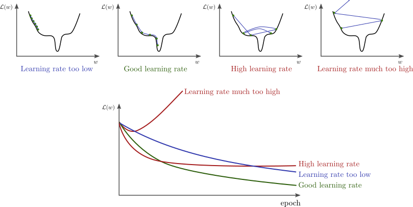{width="70%" fig-alt="Figure comparing learning rates: four small plots show a ball's trajectory down a bowl-shaped loss curve for 'Learning rate too low' (slow, smooth), 'Good learning rate' (smooth convergence), 'High learning rate' (oscillating but converging), and 'Learning rate much too high' (diverging); below, a plot of loss L(w) versus training epoch for each case shows the 'much too high' rate diverging upward while the others decrease at different speeds."}

- https://www.bdhammel.com/learning-rates/

---

## Stochastic gradient descent

- Next, we minimize the cost function, $C(w)$, versus the weights $w$.
- We already know a lot about minimization... but now we have a huge number of parameters!
  - In other words, minimization over a huge dimensional space.
- Strategy:
  - Use some randomness (aka stochastic methods) to avoid local minima.
  - Use a relatively simple minimizer (we will have a lot of function calls, so they have to be cheap. No 2nd derivatives!)

---

## Stochastic gradient descent

- Training datasets are (ideally) very large: millions/billions of images
- Solution: train in batches, only using a fraction of the data for each gradient step.
  - The splitting and sampling is another configurable choice in your training.
  - So: ${w}_{j} \rightarrow {w}_{j}- \eta \frac{ \partial \mathop{C}\limits^{˜}(w)}{ \partial {w}_{j}}$, where $\mathop{C}\limits^{˜}(w)$ is the approximate cost function from a batch.
- Besides speedup, this actually improves the training (avoids local minima, reduces overfitting).

- $$C(w)=\frac{1}{2}⟨ \parallel {F}_{w}({y}^{\text{in}}-F({y}^{\text{in}}){ \parallel }^{2}⟩=\frac{1}{2N}\mathop{\mathop{ \sum }\limits_{i=1}}\limits^{N} \parallel {F}_{w}({y}^{\text{in}}-F({y}^{\text{in}}){ \parallel }^{2}$$

---

## Stochastic gradient descent

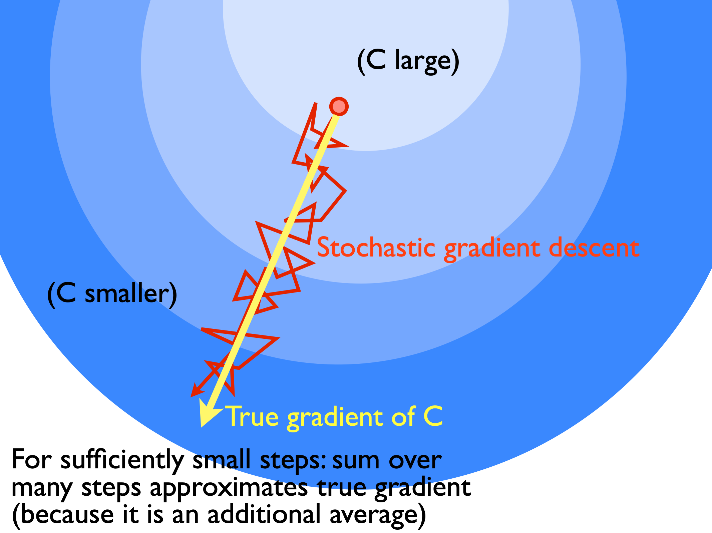{width="70%" fig-alt="Diagram illustrating stochastic gradient descent: concentric blue contour rings (labeled 'C large' at center, 'C smaller' outward) with a jagged red zigzag path (labeled 'Stochastic gradient descent') descending toward the center, closely tracking a smooth straight yellow arrow (labeled 'True gradient of C'), with a note that for sufficiently small steps, the sum over many noisy steps approximates the true gradient."}

- [F. Marquardt, Machine Learning for Physicists 2024](https://pad.gwdg.de/s/ZwIoM-Arn)

---

## Chain rule

- The final piece we need is the derivatives: computing all the $\frac{ \partial C(w)}{ \partial {w}_{*}}$ (${w}_{*}$=some ${w}_{ij}$ or ${b}_{j}$).
- Numerical differentiation is not going to work for billions of weights!
- Remember, the neural network is built by composing many simple functions, $NN={f}^{(N)} \circ {f}^{(N-1)} \circ ... \circ {f}^{(2)} \circ {f}^{(1)}(\mathbf{x})$
- So: we "just" need the chain rule
  - And a lot of bookkeeping!

{width="70%" fig-alt="Diagram of a multi-layer network of blue circular nodes connected by gray lines, with one connection near the bottom highlighted in red/orange and labeled w_* - illustrating a specific weight to be analyzed via the chain rule."}

- One weight in the neural network

---

## Simple example

- Let's look again at the smallest NN: two inputs, one output, no hidden layers:
  - Remember, $z={w}_{1}{y}_{1}+{w}_{2}{y}_{2}+b$
  - Output is $f(z)$, where $f$=RELU, sigmoid, tanh, ..
- Use the chain rule:
- $$\begin{matrix}
C(w) & =\frac{1}{2}⟨(f(x)-F({y}_{1},{y}_{2}){)}^{2}⟩ \\
\frac{ \partial C}{ \partial {w}_{1}} & =⟨(f(z)-F){f}^{′}(z)\frac{ \partial z}{ \partial {w}_{1}}⟩ \\
\frac{ \partial z}{ \partial {w}_{1}} & ={y}_{1} \\
\frac{ \partial C}{ \partial {w}_{1}} & =\frac{1}{N}\mathop{\mathop{ \sum }\limits_{i=1}}\limits^{N}(f({z}_{i})-{F}_{i}){f}^{′}({z}_{i}){y}_{1i}
\end{matrix}$$

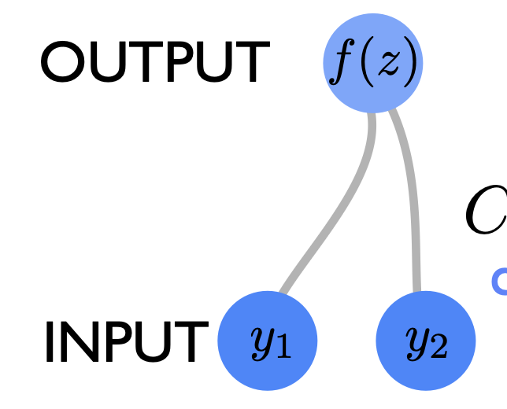{width="70%" fig-alt="Small diagram labeled OUTPUT f(z) and INPUT y1, y2, showing a single output neuron connected to two input neurons, with additional text cut off at the right edge (likely a cost function C)."}

- Smallest unit of neural network
- (Expand average into sum over training samples)

---

## Full network

- For the full network, we need to roll up our sleeves and do the bookkeeping of indices.
  - ${y}_{j}^{(n)}$=value of neuron $j$ in layer $n$
  - ${z}_{j}^{(n)}$=input value for "$y=f(z)$"
    - So, ${y}_{j}^{(n)}=f({z}_{j}^{(n)})$
  - ${w}_{jk}^{n,n-1}$=weight for (neuron $k$ in layer $n-1$, feeding into neuron $j$ in layer $n$)
    - Similarly, ${b}_{j}^{n,n-1}$ for biases (might be omitted/left implicit in "$w$", just remember they are there).

{width="70%" fig-alt="Diagram of a multi-layer network of blue circular nodes connected by gray lines, with one connection near the bottom highlighted in red/orange and labeled w_* - illustrating a specific weight to be analyzed via the chain rule."}

- One weight in the neural network

---

## Full network

- Now, use the chain rule to step backwards through the network until we reach ${w}_{*}$.
  - Leave the average implicit, just calculate for one sample here.
- From output layer (${L}_{N}$) to ${L}_{N-1}$:
- $$\begin{matrix}
\frac{ \partial C(w,{y}^{\text{in}})}{ \partial {w}_{*}} & =\mathop{ \sum }\limits_{j \in {L}_{N}}({y}_{j}^{(n)}-{F}_{j}({y}^{\text{in}}))\frac{ \partial {y}_{j}^{(n)}}{ \partial {w}_{*}} \\
 & =\mathop{ \sum }\limits_{j \in {L}_{N}}({y}_{j}^{(n)}-{F}_{j}({y}^{\text{in}})){f}^{′}({z}_{j}^{(n)})\frac{ \partial {z}_{j}^{(n)}}{ \partial {w}_{*}}
\end{matrix}$$

{width="70%" fig-alt="Diagram of a multi-layer network of blue circular nodes connected by gray lines, with one connection near the bottom highlighted in red/orange and labeled w_* - illustrating a specific weight to be analyzed via the chain rule."}

- One weight in the neural network

---

## Full network

- Now, use the chain rule to step backwards through the network until we reach ${w}_{*}$.
  - Leave the average implicit, just calculate for one sample here.
- From output layer (${L}_{N}$) to ${L}_{N-1}$:
- $$\begin{matrix}
\frac{ \partial C(w,{y}^{\text{in}})}{ \partial {w}_{*}} & =\mathop{ \sum }\limits_{j \in {L}_{N}}({y}_{j}^{(n)}-{F}_{j}({y}^{\text{in}}))\frac{ \partial {y}_{j}^{(n)}}{ \partial {w}_{*}} \\
 & =\mathop{ \sum }\limits_{j \in {L}_{N}}({y}_{j}^{(n)}-{F}_{j}({y}^{\text{in}})){f}^{′}({z}_{j}^{(n)})\frac{ \partial {z}_{j}^{(n)}}{ \partial {w}_{*}} \\
\frac{ \partial {z}_{j}^{(n)}}{ \partial {w}_{*}} & =\mathop{ \sum }\limits_{k \in {L}_{N-1}}\frac{ \partial {z}_{j}^{(n)}}{ \partial {y}_{k}^{(n-1)}}\frac{ \partial {y}_{k}^{(n-1)}}{ \partial {w}_{*}} \\
 & =\mathop{ \sum }\limits_{k \in {L}_{N-1}}{w}_{jk}^{n,n-1}{f}^{′}({z}_{k}^{(n-1)})\frac{ \partial {z}_{k}^{(n-1)}}{ \partial {w}_{*}}
\end{matrix}$$

{width="70%" fig-alt="Diagram of a multi-layer network of blue circular nodes connected by gray lines, with one connection near the bottom highlighted in red/orange and labeled w_* - illustrating a specific weight to be analyzed via the chain rule."}

- One weight in the neural network
- ..and so on until ${z}_{k}^{m}$ depends directly on ${w}_{*}$

---

## Backpropagation

- Key feature of backpropagation: a lot of the derivatives are reused many times.
- So, with some clever bookkeeping, we can reduce the computations significantly (i.e., we can reduce the order of the algorithm):
- $$\frac{ \partial {z}_{j}^{(n)}}{ \partial {w}_{*}}=\mathop{ \sum }\limits_{k \in {L}_{N-1}}{w}_{jk}^{n,n-1}{f}^{′}({z}_{k}^{(n-1)})\frac{ \partial {z}_{k}^{(n-1)}}{ \partial {w}_{*}}$$
- We can save these values into a matrix, connecting layer ${L}_{N}$ to layer ${L}_{N-1}$:
- $${M}_{jk}^{(n,n-1)}={w}_{jk}^{(n,n-1)}{f}^{′}({z}_{k}^{(n-1)})$$

{width="70%" fig-alt="A thin, mostly empty orange-outlined rectangular border/frame."}

---

## Backpropagation

- Key feature of backpropagation: a lot of the derivatives are reused many times.
- So, with some clever bookkeeping, we can reduce the computations significantly (i.e., we can reduce the order of the algorithm):
- $$\frac{ \partial {z}_{j}^{(n)}}{ \partial {w}_{*}}=\mathop{ \sum }\limits_{k \in {L}_{N-1}}{w}_{jk}^{n,n-1}{f}^{′}({z}_{k}^{(n-1)})\frac{ \partial {z}_{k}^{(n-1)}}{ \partial {w}_{*}}$$
- We can save these values into a matrix, connecting layer ${L}_{N}$ to layer ${L}_{N-1}$:
- $${M}_{jk}^{(n,n-1)}={w}_{jk}^{(n,n-1)}{f}^{′}({z}_{k}^{(n-1)})$$
- Going back several layers looks like:
- $$\frac{ \partial {z}_{j}^{(n)}}{ \partial {w}_{*}}=\mathop{ \sum }\limits_{k,l,...,u,v}{M}_{jk}^{(n,n-1)}{M}_{kl}^{(n-1,n-2)}...{M}_{uv}^{m+1,m}\frac{ \partial {z}_{v}^{(m)}}{ \partial {w}_{*}}$$

{width="70%" fig-alt="A thin, mostly empty orange-outlined rectangular border/frame."}

---

## Backpropagation

<!-- TODO: complex slide layout (flagged by detect_complex_slide.py - see run log). Content below is complete but UNARRANGED - needs manual layout to match the original slide. -->

- $$\frac{ \partial {z}_{j}^{(n)}}{ \partial {w}_{*}}=\mathop{ \sum }\limits_{k,l,...,u,v}{M}_{jk}^{(n,n-1)}{M}_{kl}^{(n-1,n-2)}...{M}_{uv}^{m+1,m}\frac{ \partial {z}_{v}^{(m)}}{ \partial {w}_{*}}$$
- When we reach the layer that ${w}_{*}$ is in:
  - If ${w}_{*}$ is a weight, $\frac{ \partial {z}_{j}^{(m)}}{ \partial {w}_{jk}^{m,m-1}}={y}_{k}^{(m-1)}$
  - If ${w}_{*}$ is a bias, $\frac{ \partial {z}_{j}^{(m)}}{ \partial {b}_{j}^{m}}=1$

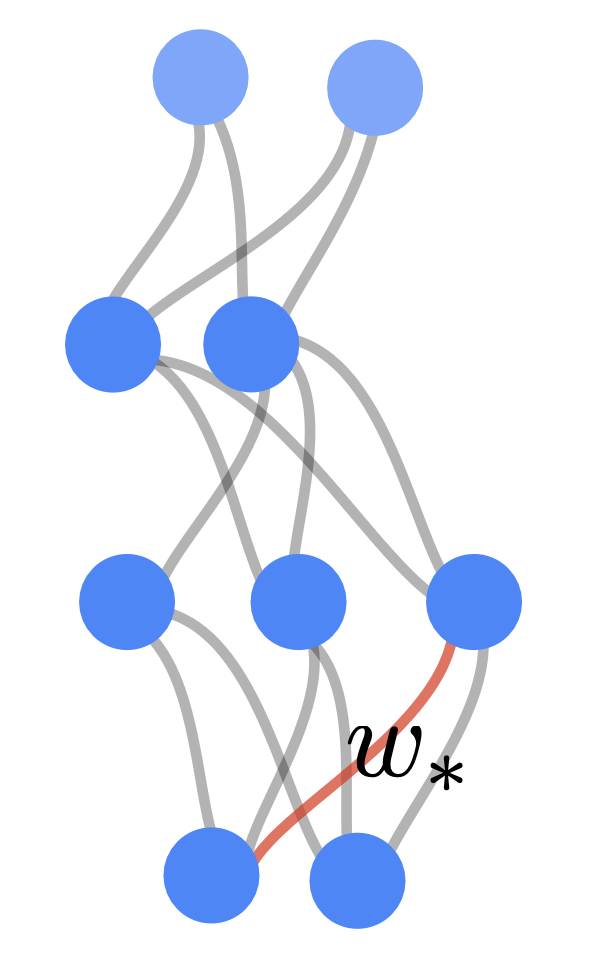{fig-alt="Diagram of a multi-layer network of blue circular nodes connected by gray lines, with one connection near the bottom highlighted in red/orange and labeled w_* - illustrating a specific weight to be analyzed via the chain rule."}

- One weight in the neural network
- $${L}_{m}$$

- $${L}_{N}$$

- $${L}_{N-1}$$

- $$ \vdots $$

---

## Backpropagation

<!-- TODO: complex slide layout (flagged by detect_complex_slide.py - see run log). Content below is complete but UNARRANGED - needs manual layout to match the original slide. -->

- A key point: each step back corresponds to a vector-matrix multiplication. Not matrix-matrix!
- $$\begin{matrix}
\frac{ \partial C(w,{y}^{\text{in}})}{ \partial {w}_{*}} & =\mathop{ \sum }\limits_{j}({y}_{j}^{(n)}-{F}_{j}({y}^{\text{in}}))\frac{ \partial {y}_{j}^{(n)}}{ \partial {w}_{*}} \\
 & =\mathop{ \sum }\limits_{j}({y}_{j}^{(n)}-{F}_{j}({y}^{\text{in}})){f}^{′}({z}_{j}^{(n)})\frac{ \partial {z}_{j}^{(n)}}{ \partial {w}_{*}}
\end{matrix}$$
- Pro: a naive computation (for example, "forward accumulation") might involve matrix-matrix computations at each stage.
- Con: have to store all the $M$ matrices.

{fig-alt="Diagram of a multi-layer network of blue circular nodes connected by gray lines, with one connection near the bottom highlighted in red/orange and labeled w_* - illustrating a specific weight to be analyzed via the chain rule."}

- One weight in the neural network
- $${L}_{m}$$

- $${L}_{N}$$

- $${L}_{N-1}$$

- $$ \vdots $$

---

## Backpropagation

<!-- TODO: complex slide layout (flagged by detect_complex_slide.py - see run log). Content below is complete but UNARRANGED - needs manual layout to match the original slide. -->

- A key point: each step back corresponds to a vector-matrix multiplication. Not matrix-matrix!
- $$\begin{matrix}
\frac{ \partial C(w,{y}^{\text{in}})}{ \partial {w}_{*}} & =\mathop{ \sum }\limits_{j}({y}_{j}^{(n)}-{F}_{j}({y}^{\text{in}}))\frac{ \partial {y}_{j}^{(n)}}{ \partial {w}_{*}} \\
 & =\mathop{ \sum }\limits_{j}({y}_{j}^{(n)}-{F}_{j}({y}^{\text{in}})){f}^{′}({z}_{j}^{(n)})\frac{ \partial {z}_{j}^{(n)}}{ \partial {w}_{*}}
\end{matrix}$$
- Pro: a naive computation (for example, "forward accumulation") might involve matrix-matrix computations at each stage.
- Con: have to store all the $M$ matrices.
- Pro: in a single backpropagation pass, we can store all the ${z}_{j}^{(m)}$ and the ${f}^{′}({z}_{j}^{(m)})$!

{fig-alt="Diagram of a multi-layer network of blue circular nodes connected by gray lines, with one connection near the bottom highlighted in red/orange and labeled w_* - illustrating a specific weight to be analyzed via the chain rule."}

- One weight in the neural network
- $${L}_{m}$$

- $${L}_{N}$$

- $${L}_{N-1}$$

- $$ \vdots $$

---

## Backpropagation

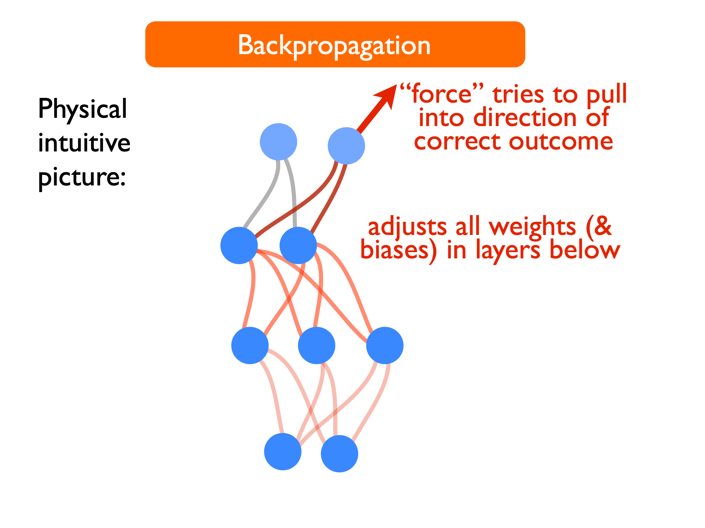{width="70%" fig-alt="Diagram titled 'Backpropagation', showing the 'Physical intuitive picture': a multi-layer network of blue nodes with a red arrow at the output labeled ''force' tries to pull into direction of correct outcome', and red connections cascading down through the layers labeled 'adjusts all weights (& biases) in layers below'."}

- [F. Marquardt, Machine Learning for Physicists 2024](https://pad.gwdg.de/s/ZwIoM-Arn)

---

## Backpropagation

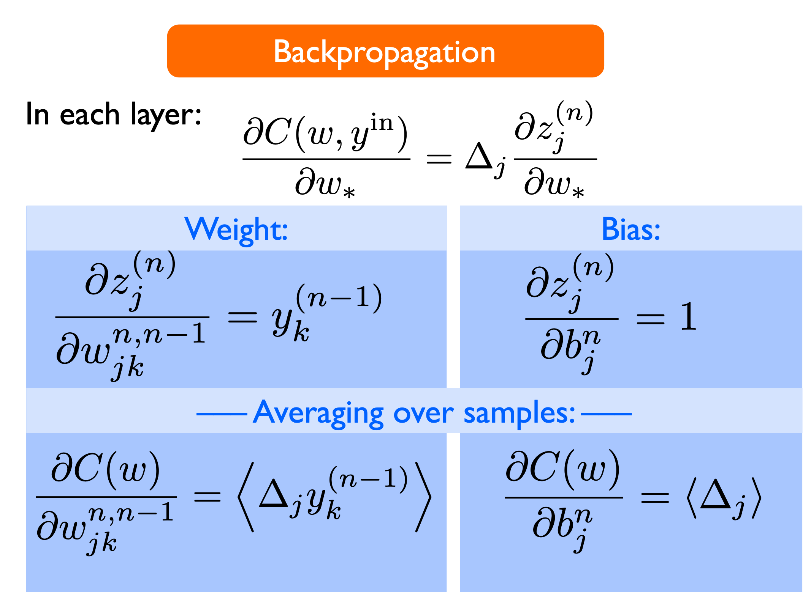{width="70%" fig-alt="Diagram titled 'Backpropagation' showing the per-layer chain-rule formulas: dC(w,y_in)/dw_* = Delta_j * dz_j^(n)/dw_*, with weight derivative dz_j^(n)/dw_jk^(n,n-1) = y_k^(n-1) and bias derivative dz_j^(n)/db_j^n = 1, plus their sample-averaged forms dC(w)/dw_jk^(n,n-1) = <Delta_j y_k^(n-1)> and dC(w)/db_j^n = <Delta_j>."}

- [F. Marquardt, Machine Learning for Physicists 2024](https://pad.gwdg.de/s/ZwIoM-Arn)

---

# Implementation

---

## Last time

{width="70%" fig-alt="Diagram titled 'Backpropagation', showing the 'Physical intuitive picture': a multi-layer network of blue nodes with a red arrow at the output labeled ''force' tries to pull into direction of correct outcome', and red connections cascading down through the layers labeled 'adjusts all weights (& biases) in layers below'."}

- [F. Marquardt, Machine Learning for Physicists 2024](https://pad.gwdg.de/s/ZwIoM-Arn)
- [F. Marquardt, Machine Learning for Physicists 2024](https://pad.gwdg.de/s/ZwIoM-Arn)

---

## Last time

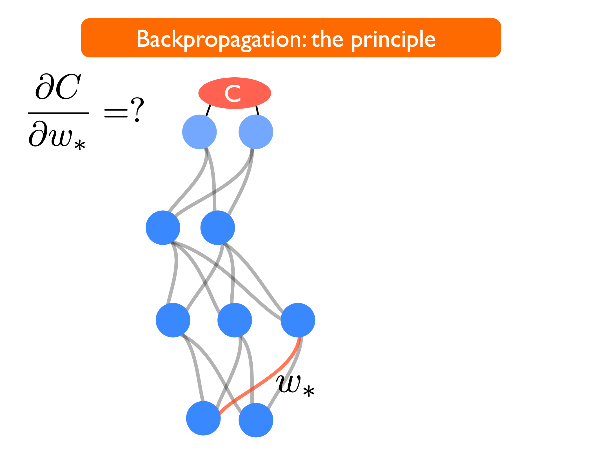{width="70%" fig-alt="Diagram titled 'Backpropagation: the principle': the formula dC/dw_* = ? above a multi-layer network with a red oval labeled C at the output feeding down through the layers to a red-highlighted connection labeled w_* near the bottom."}

- [F. Marquardt, Machine Learning for Physicists 2024](https://pad.gwdg.de/s/ZwIoM-Arn)
- [F. Marquardt, Machine Learning for Physicists 2024](https://pad.gwdg.de/s/ZwIoM-Arn)

---

## Last time

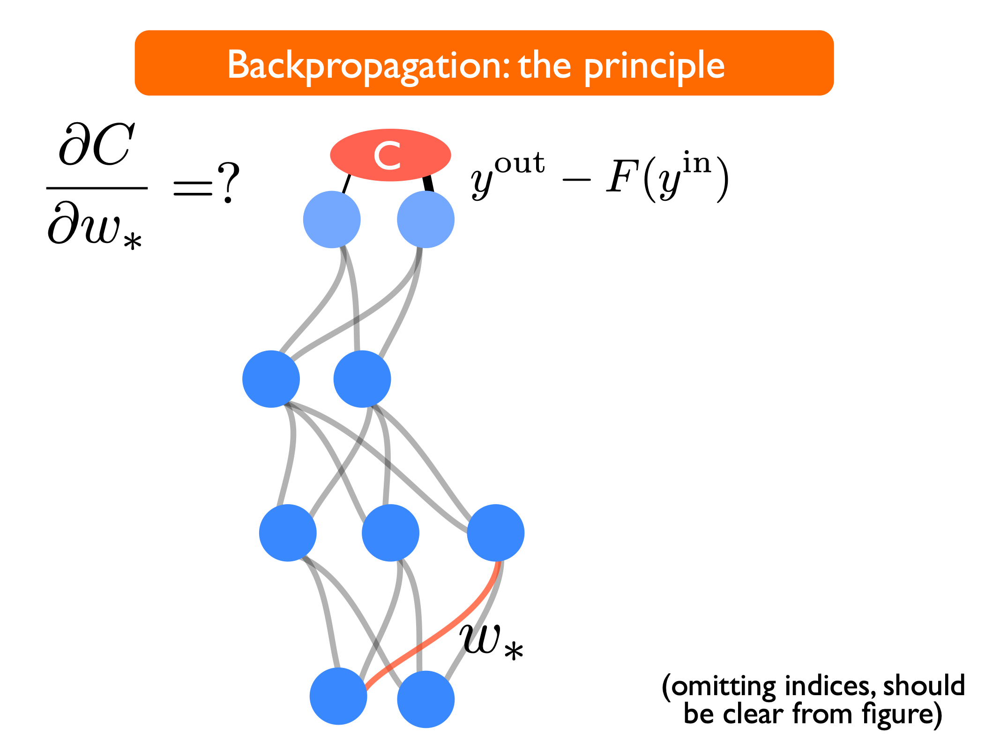{width="70%" fig-alt="Diagram titled 'Backpropagation: the principle': the formula dC/dw_* = ? above a multi-layer network with a red oval labeled C at the output feeding down through the layers to a red-highlighted connection labeled w_* near the bottom. The output neurons are additionally labeled with the expression y^out - F(y^in)."}

- [F. Marquardt, Machine Learning for Physicists 2024](https://pad.gwdg.de/s/ZwIoM-Arn)
- [F. Marquardt, Machine Learning for Physicists 2024](https://pad.gwdg.de/s/ZwIoM-Arn)

---

## Last time

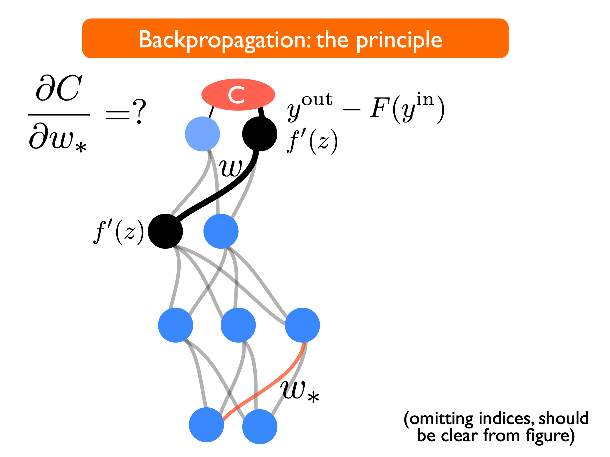{width="70%" fig-alt="Diagram titled 'Backpropagation: the principle': the formula dC/dw_* = ? above a multi-layer network with a red oval labeled C at the output feeding down through the layers to a red-highlighted connection labeled w_* near the bottom. The output neurons are labeled y^out - F(y^in), and two nodes along the highlighted path (one at the output layer, one one layer down) are colored black and labeled f'(z), with the connecting edge between them labeled w - illustrating the chain-rule factors linking w_* to the cost C."}

- [F. Marquardt, Machine Learning for Physicists 2024](https://pad.gwdg.de/s/ZwIoM-Arn)
- [F. Marquardt, Machine Learning for Physicists 2024](https://pad.gwdg.de/s/ZwIoM-Arn)

---

## Last time

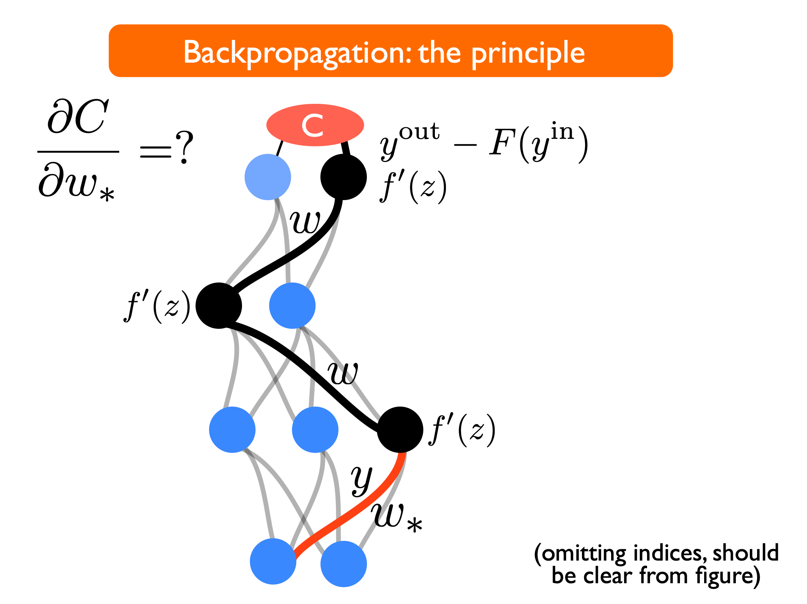{width="70%" fig-alt="Diagram titled 'Backpropagation: the principle': the full chain-rule path from a red C (cost) node down through three black f'(z) nodes (each connected by an edge labeled w) to the red-highlighted w_* connection at the bottom, labeled y and w_* - showing every factor in the chain rule from w_* to C."}

- [F. Marquardt, Machine Learning for Physicists 2024](https://pad.gwdg.de/s/ZwIoM-Arn)
- [F. Marquardt, Machine Learning for Physicists 2024](https://pad.gwdg.de/s/ZwIoM-Arn)

---

## Last time

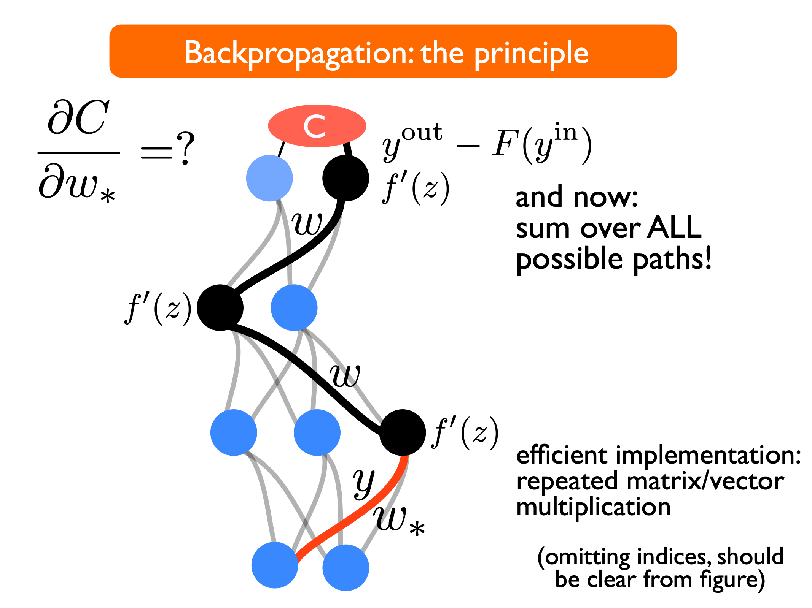{width="70%" fig-alt="Diagram titled 'Backpropagation: the principle': the full chain-rule path from a red C (cost) node down through three black f'(z) nodes (each connected by an edge labeled w) to the red-highlighted w_* connection at the bottom, labeled y and w_* - showing every factor in the chain rule from w_* to C. Annotated 'and now: sum over ALL possible paths!' and 'efficient implementation: repeated matrix/vector multiplication'."}

- [F. Marquardt, Machine Learning for Physicists 2024](https://pad.gwdg.de/s/ZwIoM-Arn)
- [F. Marquardt, Machine Learning for Physicists 2024](https://pad.gwdg.de/s/ZwIoM-Arn)

---

## Last time

{width="70%" fig-alt="Diagram titled 'Backpropagation: the principle': the full chain-rule path from a red C (cost) node down through three black f'(z) nodes (each connected by an edge labeled w) to the red-highlighted w_* connection at the bottom, labeled y and w_* - showing every factor in the chain rule from w_* to C. Annotated 'and now: sum over ALL possible paths!' and 'efficient implementation: repeated matrix/vector multiplication'."}

- [F. Marquardt, Machine Learning for Physicists 2024](https://pad.gwdg.de/s/ZwIoM-Arn)
- [F. Marquardt, Machine Learning for Physicists 2024](https://pad.gwdg.de/s/ZwIoM-Arn)

---

## Last time

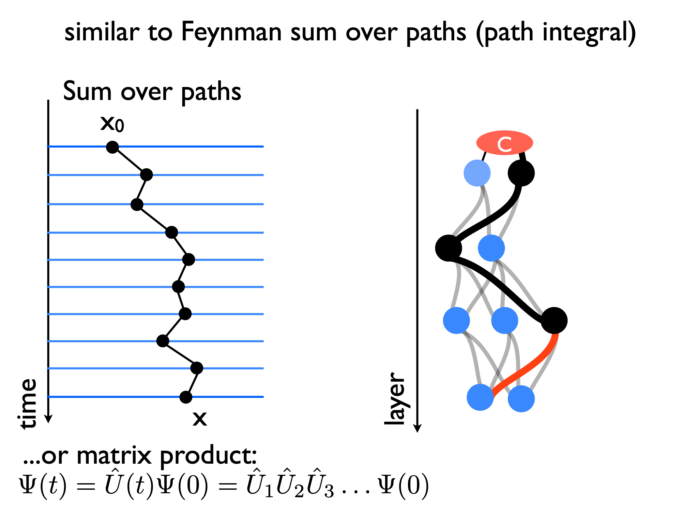{width="70%" fig-alt="Diagram titled 'similar to Feynman sum over paths (path integral)': on the left, a 1D random walk x(t) zigzagging down through time from x0, labeled 'Sum over paths'; on the right, the same backpropagation chain diagram (C node down through the network to w_*) labeled by 'layer' instead of time; below, the equivalent matrix-product formulation Psi(t) = U(t)Psi(0) = U1 U2 U3 ... Psi(0)."}

- [F. Marquardt, Machine Learning for Physicists 2024](https://pad.gwdg.de/s/ZwIoM-Arn)
- [F. Marquardt, Machine Learning for Physicists 2024](https://pad.gwdg.de/s/ZwIoM-Arn)

---

## Backpropagation

- $$\begin{matrix}
\frac{ \partial C(w,{y}^{\text{in}})}{ \partial {w}_{*}} & =\mathop{ \sum }\limits_{j \in {L}_{N}}({y}_{j}^{(n)}-{F}_{j}({y}^{\text{in}}))\frac{ \partial {y}_{j}^{(n)}}{ \partial {w}_{*}} \\
 & =\mathop{ \sum }\limits_{j \in {L}_{N}}({y}_{j}^{(n)}-{F}_{j}({y}^{\text{in}})){f}^{′}({z}_{j}^{(n)})\frac{ \partial {z}_{j}^{(n)}}{ \partial {w}_{*}} \\
\frac{ \partial {z}_{j}^{(n)}}{ \partial {w}_{*}} & =\mathop{ \sum }\limits_{k \in {L}_{N-1}}{w}_{jk}^{n,n-1}{f}^{′}({z}_{k}^{(n-1)})\frac{ \partial {z}_{k}^{(n-1)}}{ \partial {w}_{*}}
\end{matrix}$$

---

## Backpropagation

:::: {.columns}
::: {.column width="55%"}
- $$\begin{matrix}
\frac{ \partial C(w,{y}^{\text{in}})}{ \partial {w}_{*}} & =\mathop{ \sum }\limits_{j \in {L}_{N}}({y}_{j}^{(n)}-{F}_{j}({y}^{\text{in}}))\frac{ \partial {y}_{j}^{(n)}}{ \partial {w}_{*}} \\
 & =\mathop{ \sum }\limits_{j \in {L}_{N}}({y}_{j}^{(n)}-{F}_{j}({y}^{\text{in}})){f}^{′}({z}_{j}^{(n)})\frac{ \partial {z}_{j}^{(n)}}{ \partial {w}_{*}} \\
\frac{ \partial {z}_{j}^{(n)}}{ \partial {w}_{*}} & =\mathop{ \sum }\limits_{k \in {L}_{N-1}}{w}_{jk}^{n,n-1}{f}^{′}({z}_{k}^{(n-1)})\frac{ \partial {z}_{k}^{(n-1)}}{ \partial {w}_{*}}
\end{matrix}$$
- Start with a vector corresponding to the first step of the chain rule:
- $${ \Delta }_{j}=({y}_{j}^{n}-{F}_{j}({y}^{\text{in}})){f}^{′}({z}_{j}^{n})$$
:::
::: {.column width="45%"}
{width="100%" fig-alt="Thin, mostly empty pink/magenta rectangular border/frame."}
:::
::::

---

## Backpropagation

:::: {.columns}
::: {.column width="55%"}
- $$\begin{matrix}
\frac{ \partial C(w,{y}^{\text{in}})}{ \partial {w}_{*}} & =\mathop{ \sum }\limits_{j \in {L}_{N}}({y}_{j}^{(n)}-{F}_{j}({y}^{\text{in}}))\frac{ \partial {y}_{j}^{(n)}}{ \partial {w}_{*}} \\
 & =\mathop{ \sum }\limits_{j \in {L}_{N}}({y}_{j}^{(n)}-{F}_{j}({y}^{\text{in}})){f}^{′}({z}_{j}^{(n)})\frac{ \partial {z}_{j}^{(n)}}{ \partial {w}_{*}} \\
\frac{ \partial {z}_{j}^{(n)}}{ \partial {w}_{*}} & =\mathop{ \sum }\limits_{k \in {L}_{N-1}}{w}_{jk}^{n,n-1}{f}^{′}({z}_{k}^{(n-1)})\frac{ \partial {z}_{k}^{(n-1)}}{ \partial {w}_{*}}
\end{matrix}$$
- Save (weight*derivative) as a matrix, connecting layer ${L}_{N}$ to layer ${L}_{N-1}$:
- $${M}_{jk}^{(n,n-1)}={w}_{jk}^{(n,n-1)}{f}^{′}({z}_{k}^{(n-1)})$$
- Start with a vector corresponding to the first step of the chain rule:
- $${ \Delta }_{j}=({y}_{j}^{n}-{F}_{j}({y}^{\text{in}})){f}^{′}({z}_{j}^{n})$$
:::
::: {.column width="45%"}
{width="100%" fig-alt="Thin, mostly empty orange rectangular border/frame."}
{width="100%" fig-alt="Thin, mostly empty pink/magenta rectangular border/frame."}
:::
::::

---

## Backpropagation

:::: {.columns}
::: {.column width="55%"}
- $$\begin{matrix}
\frac{ \partial C(w,{y}^{\text{in}})}{ \partial {w}_{*}} & =\mathop{ \sum }\limits_{j \in {L}_{N}}({y}_{j}^{(n)}-{F}_{j}({y}^{\text{in}}))\frac{ \partial {y}_{j}^{(n)}}{ \partial {w}_{*}} \\
 & =\mathop{ \sum }\limits_{j \in {L}_{N}}({y}_{j}^{(n)}-{F}_{j}({y}^{\text{in}})){f}^{′}({z}_{j}^{(n)})\frac{ \partial {z}_{j}^{(n)}}{ \partial {w}_{*}} \\
\frac{ \partial {z}_{j}^{(n)}}{ \partial {w}_{*}} & =\mathop{ \sum }\limits_{k \in {L}_{N-1}}{w}_{jk}^{n,n-1}{f}^{′}({z}_{k}^{(n-1)})\frac{ \partial {z}_{k}^{(n-1)}}{ \partial {w}_{*}}
\end{matrix}$$
- Save (weight*derivative) as a matrix, connecting layer ${L}_{N}$ to layer ${L}_{N-1}$:
- $${M}_{jk}^{(n,n-1)}={w}_{jk}^{(n,n-1)}{f}^{′}({z}_{k}^{(n-1)})$$
- The full chain rule equation is:
- $$\frac{ \partial {z}_{j}^{(n)}}{ \partial {w}_{*}}=\mathop{ \sum }\limits_{k,l,...,u,v}{M}_{jk}^{(n,n-1)}{M}_{kl}^{(n-1,n-2)}...{M}_{uv}^{m+1,m}\frac{ \partial {z}_{v}^{(m)}}{ \partial {w}_{*}}$$
- Each $\frac{ \partial C}{ \partial {w}_{*}}$ is obtained from a series of vector-matrix multiplications
  - Terminate upon reaching desired weight: $\frac{ \partial {z}_{j}^{(n)}}{ \partial {w}_{jk}^{(n,n-1)}}={y}_{k}^{(n-1)},\frac{ \partial {z}_{j}^{(n)}}{ \partial {b}_{j}^{n}}=1$
- Start with a vector corresponding to the first step of the chain rule:
- $${ \Delta }_{j}=({y}_{j}^{n}-{F}_{j}({y}^{\text{in}})){f}^{′}({z}_{j}^{n})$$
:::
::: {.column width="45%"}
{width="100%" fig-alt="Thin, mostly empty orange rectangular border/frame."}
{width="100%" fig-alt="Thin, mostly empty pink/magenta rectangular border/frame."}
:::
::::

---

## Implementation

- While writing down backpropagation formulas is tedious, it only takes ~30 lines to program in numpy!
  - Recursively apply chain rule to simple functions.
  - Hard part is bookkeeping indices (of course)
- 02_MachineLearning_Backpropagation.ipynb and 02_tutorial_NetworkTrainingVisualization.ipynb

---

## Implementation

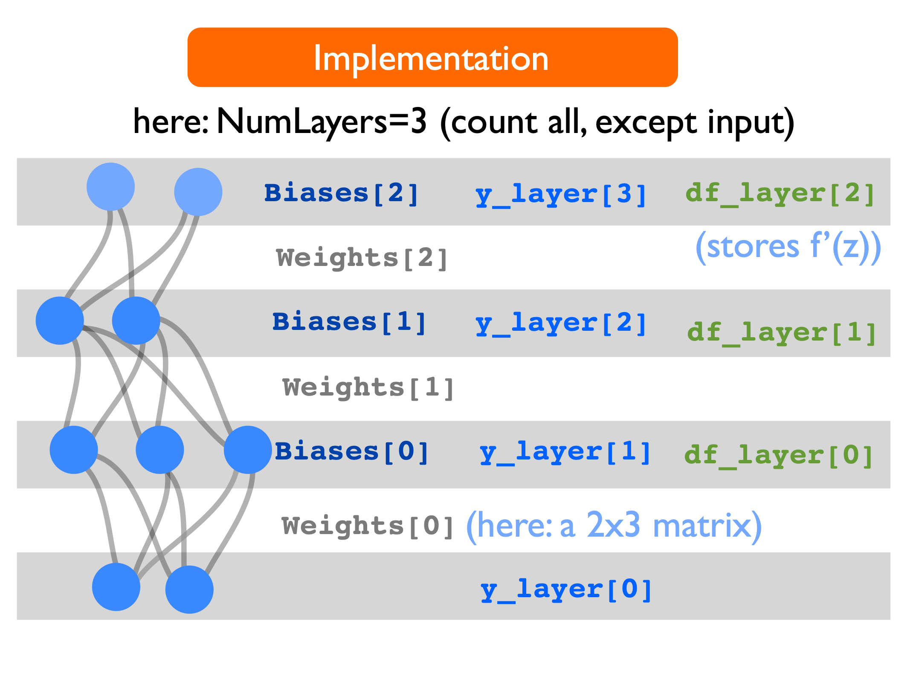{width="70%" fig-alt="Diagram titled 'Implementation' (NumLayers=3, counting all layers except input): the network's layers annotated with corresponding code variable names - y_layer[0] through y_layer[3] at each layer of nodes, Weights[0] through Weights[2] on the connections between layers, Biases[0] through Biases[2], and df_layer[0] through df_layer[2] (storing f'(z)); a note that Weights[0] here is a 2x3 matrix."}

- [F. Marquardt, Machine Learning for Physicists 2024](https://pad.gwdg.de/s/ZwIoM-Arn)
- [F. Marquardt, Machine Learning for Physicists 2024](https://pad.gwdg.de/s/ZwIoM-Arn)

---

## Implementation

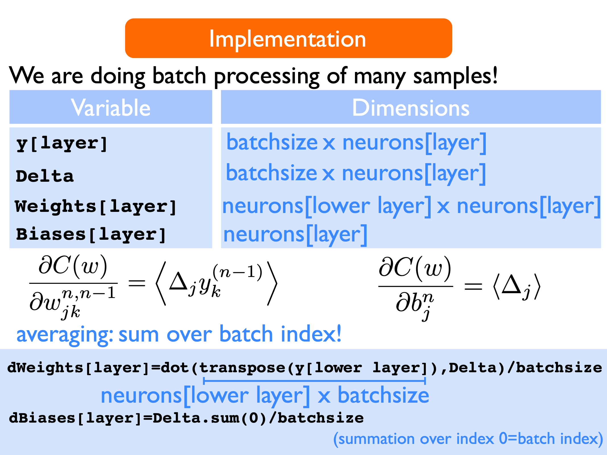{width="70%" fig-alt="Diagram titled 'Implementation - We are doing batch processing of many samples!': a table giving array dimensions for y[layer] and Delta (batchsize x neurons[layer]) and Weights[layer]/Biases[layer] (neurons[lower layer] x neurons[layer] and neurons[layer]); below, the averaged gradient formulas dC(w)/dw_jk^(n,n-1) = <Delta_j y_k^(n-1)> and dC(w)/db_j^n = <Delta_j>, and code lines dWeights[layer]=dot(transpose(y[lower layer]),Delta)/batchsize and dBiases[layer]=Delta.sum(0)/batchsize."}

- [F. Marquardt, Machine Learning for Physicists 2024](https://pad.gwdg.de/s/ZwIoM-Arn)
- [F. Marquardt, Machine Learning for Physicists 2024](https://pad.gwdg.de/s/ZwIoM-Arn)

---

## Implementation

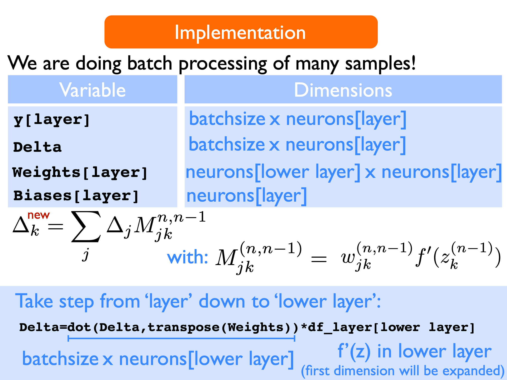{width="70%" fig-alt="The same batch-processing implementation table (y[layer], Delta, Weights[layer], Biases[layer] dimensions), now showing the backpropagation recursion Delta_k^new = sum_j(Delta_j * M_jk^(n,n-1)) with M_jk^(n,n-1) = w_jk^(n,n-1) * f'(z_k^(n-1)), and the corresponding code line Delta=dot(Delta,transpose(Weights))*df_layer[lower layer]."}

- [F. Marquardt, Machine Learning for Physicists 2024](https://pad.gwdg.de/s/ZwIoM-Arn)
- [F. Marquardt, Machine Learning for Physicists 2024](https://pad.gwdg.de/s/ZwIoM-Arn)

---

## Results

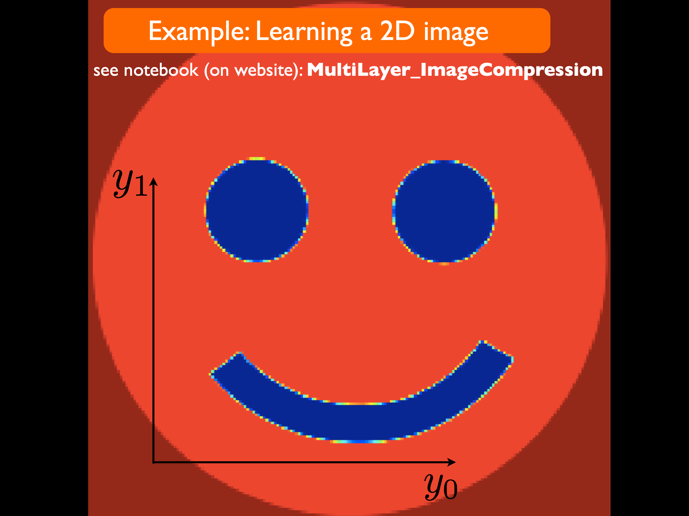{width="70%" fig-alt="Slide titled 'Example: Learning a 2D image' (referencing notebook MultiLayer_ImageCompression): The target smiley-face 2D image: an orange/red circle with two dark blue circular eyes and a dark blue curved smile, rendered as a coarse pixel grid. Axes labeled y0 (horizontal) and y1 (vertical)."}

- [F. Marquardt, Machine Learning for Physicists 2024](https://pad.gwdg.de/s/ZwIoM-Arn)
- [F. Marquardt, Machine Learning for Physicists 2024](https://pad.gwdg.de/s/ZwIoM-Arn)

---

## Results

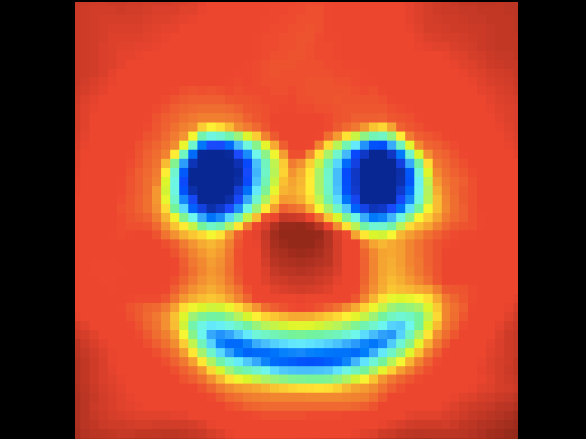{width="70%" fig-alt="A reconstructed version of the target smiley-face image from the neural network, shown as a blurrier/noisier pixel grid with visible artifacts around the eye and mouth edges."}

- [F. Marquardt, Machine Learning for Physicists 2024](https://pad.gwdg.de/s/ZwIoM-Arn)
- [F. Marquardt, Machine Learning for Physicists 2024](https://pad.gwdg.de/s/ZwIoM-Arn)

---

## Results

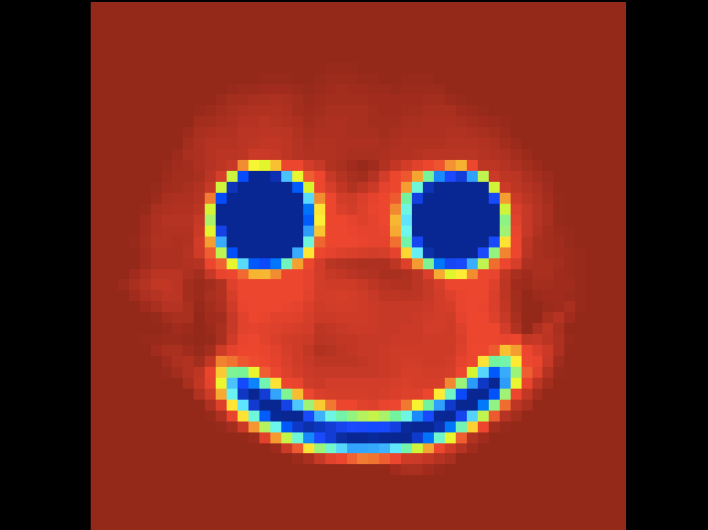{width="70%" fig-alt="A reconstructed version of the target smiley-face image from the neural network, shown as a blurrier/noisier pixel grid with visible artifacts around the eye and mouth edges. This version is slightly less noisy than the previous one, closer to the target shape."}

- [F. Marquardt, Machine Learning for Physicists 2024](https://pad.gwdg.de/s/ZwIoM-Arn)
- [F. Marquardt, Machine Learning for Physicists 2024](https://pad.gwdg.de/s/ZwIoM-Arn)

---

## Results

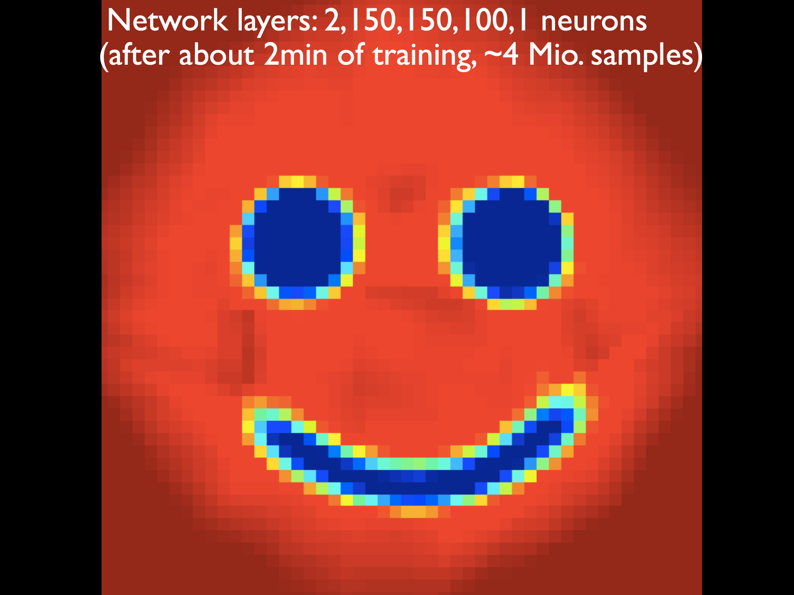{width="70%" fig-alt="Slide captioned 'Network layers: 2,150,150,100,1 neurons (after about 2min of training, ~4 Mio. samples)': A reconstructed version of the target smiley-face image from the neural network, shown as a blurrier/noisier pixel grid with visible artifacts around the eye and mouth edges. This version closely resembles the clean target smiley face."}

- [F. Marquardt, Machine Learning for Physicists 2024](https://pad.gwdg.de/s/ZwIoM-Arn)
- [F. Marquardt, Machine Learning for Physicists 2024](https://pad.gwdg.de/s/ZwIoM-Arn)

---

## Results

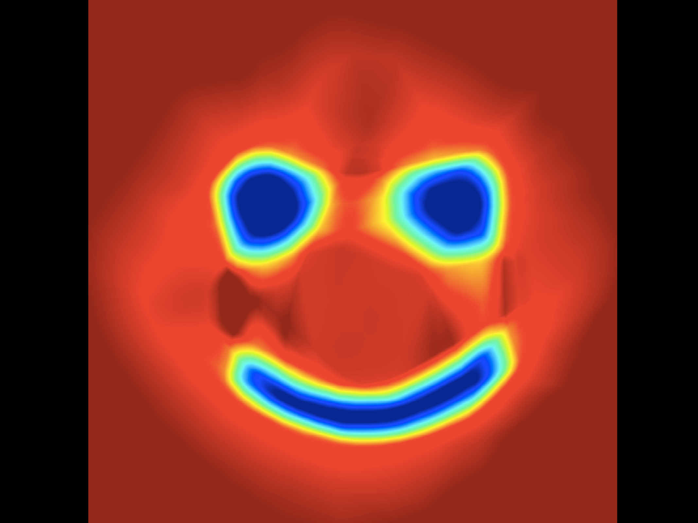{width="70%" fig-alt="A reconstructed version of the target smiley-face image from the neural network, shown as a blurrier/noisier pixel grid with visible artifacts around the eye and mouth edges. This version is heavily blurred/smoothed, with soft gradient edges rather than sharp boundaries."}

- [F. Marquardt, Machine Learning for Physicists 2024](https://pad.gwdg.de/s/ZwIoM-Arn)
- [F. Marquardt, Machine Learning for Physicists 2024](https://pad.gwdg.de/s/ZwIoM-Arn)

---

## Results

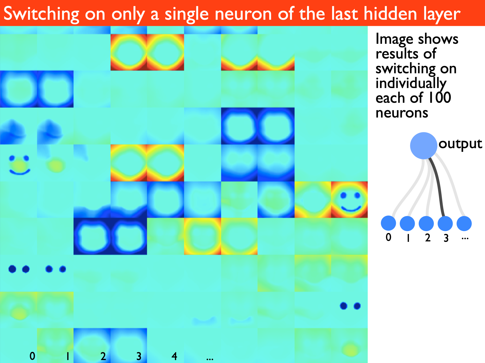{width="70%" fig-alt="Slide titled 'Switching on only a single neuron of the last hidden layer': a grid of about 100 small tile images, each showing the output image produced when only one of the 100 last-hidden-layer neurons is active (patterns include rings, waves, dots, and one recognizable partial smiley face); alongside, a diagram of the output neuron connected to the 100 hidden neurons (labeled 0, 1, 2, 3, ...), with one connection highlighted to indicate the neuron being switched on; captioned 'Image shows results of switching on individually each of 100 neurons'."}

- [F. Marquardt, Machine Learning for Physicists 2024](https://pad.gwdg.de/s/ZwIoM-Arn)
- [F. Marquardt, Machine Learning for Physicists 2024](https://pad.gwdg.de/s/ZwIoM-Arn)

---

## Results

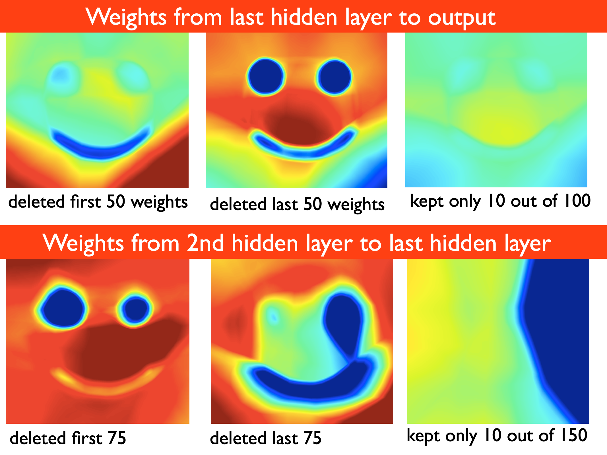{width="70%" fig-alt="Figure with two rows of three heatmap panels each, titled 'Weights from last hidden layer to output' and 'Weights from 2nd hidden layer to last hidden layer': each panel shows a reconstructed smiley-face-like heatmap after ablating some weights - 'deleted first 50/75 weights', 'deleted last 50/75 weights', and 'kept only 10 out of 100/150' - showing degraded or partial reconstructions as more weights are removed."}

- [F. Marquardt, Machine Learning for Physicists 2024](https://pad.gwdg.de/s/ZwIoM-Arn)
- [F. Marquardt, Machine Learning for Physicists 2024](https://pad.gwdg.de/s/ZwIoM-Arn)

---

## Results

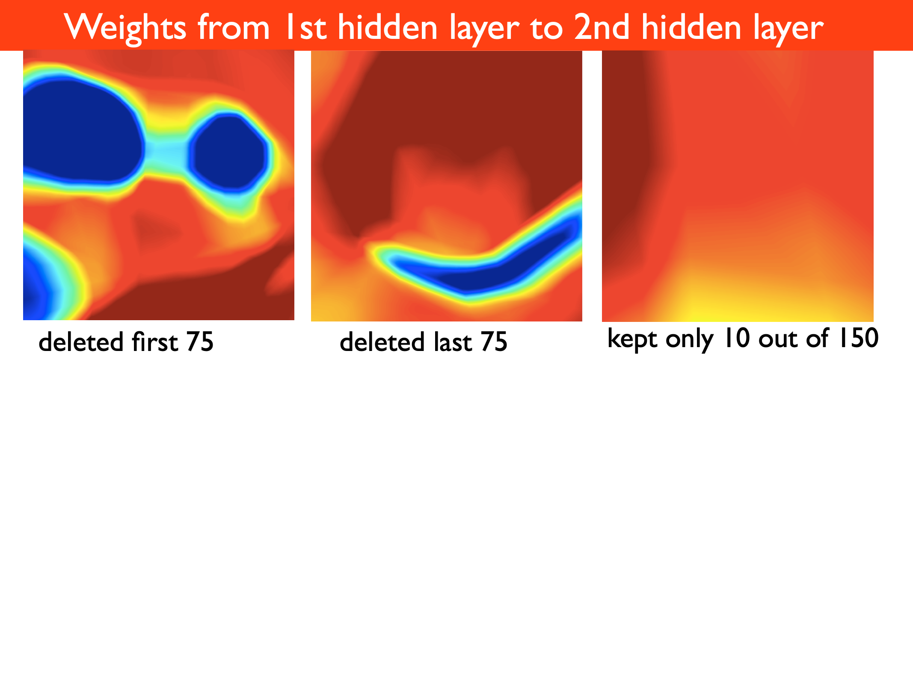{width="70%" fig-alt="Figure titled 'Weights from 1st hidden layer to 2nd hidden layer': three heatmap panels showing 'deleted first 75', 'deleted last 75', and 'kept only 10 out of 150' ablations, each a blurry orange/red heatmap with only faint remnants of the eye/mouth shapes."}

- [F. Marquardt, Machine Learning for Physicists 2024](https://pad.gwdg.de/s/ZwIoM-Arn)
- [F. Marquardt, Machine Learning for Physicists 2024](https://pad.gwdg.de/s/ZwIoM-Arn)

---

## Results

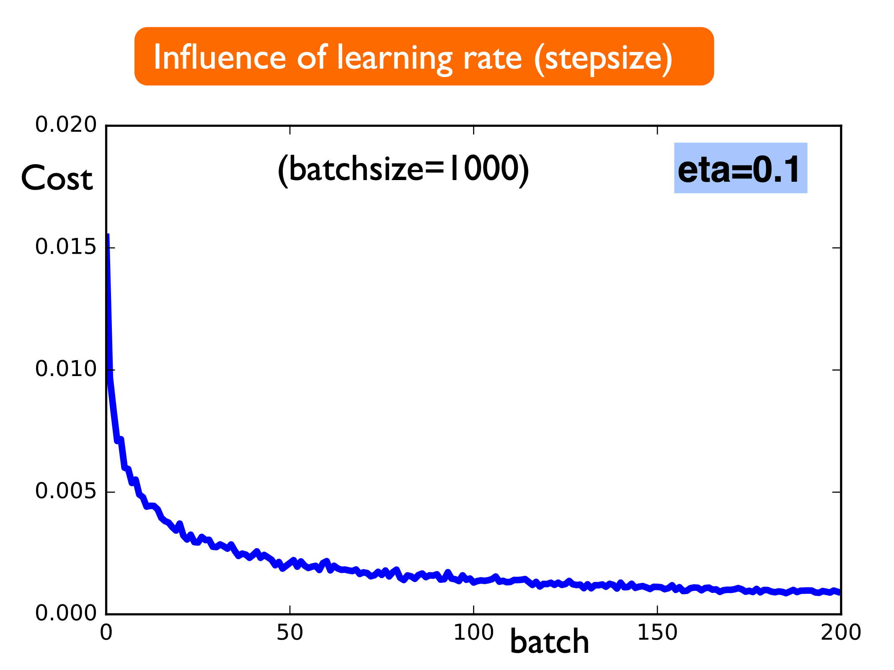{width="70%" fig-alt="Plot titled 'Influence of learning rate (stepsize)': Cost versus training batch (0 to 200, batchsize=1000), for eta=0.1 (blue curve): a steep initial drop from about 0.015 to near 0 within the first ~50 batches, then a slow, noisy decline."}

- [F. Marquardt, Machine Learning for Physicists 2024](https://pad.gwdg.de/s/ZwIoM-Arn)
- [F. Marquardt, Machine Learning for Physicists 2024](https://pad.gwdg.de/s/ZwIoM-Arn)

---

## Results

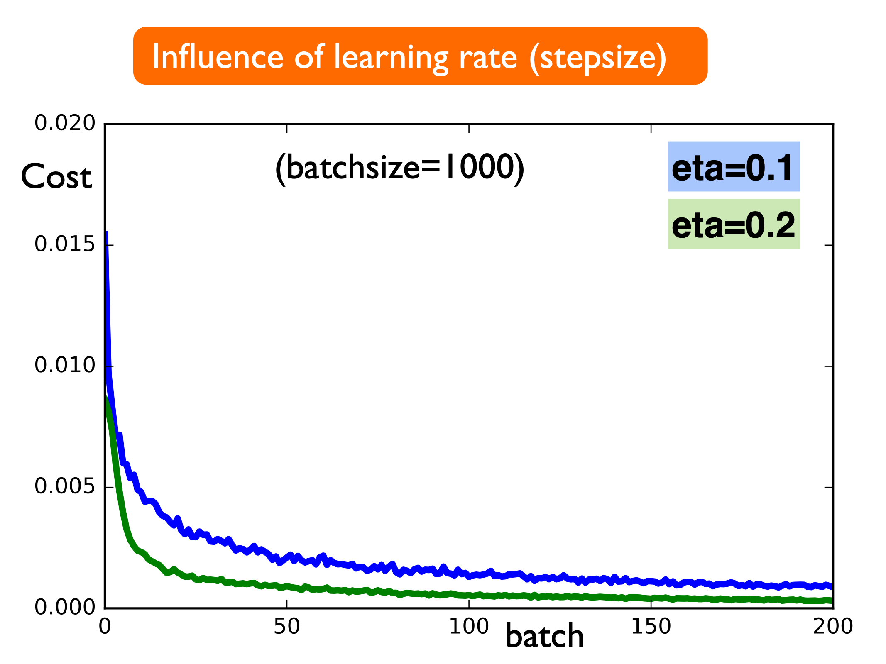{width="70%" fig-alt="Plot titled 'Influence of learning rate (stepsize)': Cost versus training batch (0 to 200, batchsize=1000), comparing eta=0.1 (blue) and eta=0.2 (green): both drop steeply then decline slowly, with the larger learning rate (eta=0.2) converging to a lower cost."}

- [F. Marquardt, Machine Learning for Physicists 2024](https://pad.gwdg.de/s/ZwIoM-Arn)
- [F. Marquardt, Machine Learning for Physicists 2024](https://pad.gwdg.de/s/ZwIoM-Arn)

---

## Results

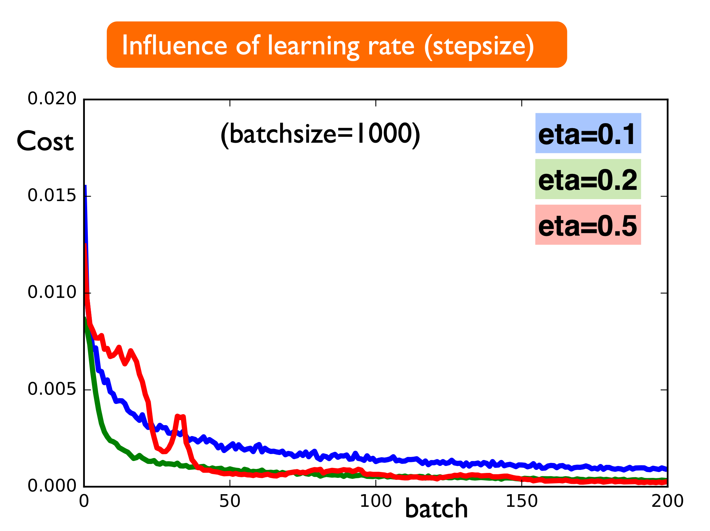{width="70%" fig-alt="Plot titled 'Influence of learning rate (stepsize)': Cost versus training batch (0 to 200, batchsize=1000), comparing eta=0.1 (blue), eta=0.2 (green), and eta=0.5 (red): the eta=0.5 curve is noisier early on (with visible bumps/oscillations) but converges alongside eta=0.2 to a low cost, both lower than eta=0.1."}

- [F. Marquardt, Machine Learning for Physicists 2024](https://pad.gwdg.de/s/ZwIoM-Arn)
- [F. Marquardt, Machine Learning for Physicists 2024](https://pad.gwdg.de/s/ZwIoM-Arn)

---

## Results

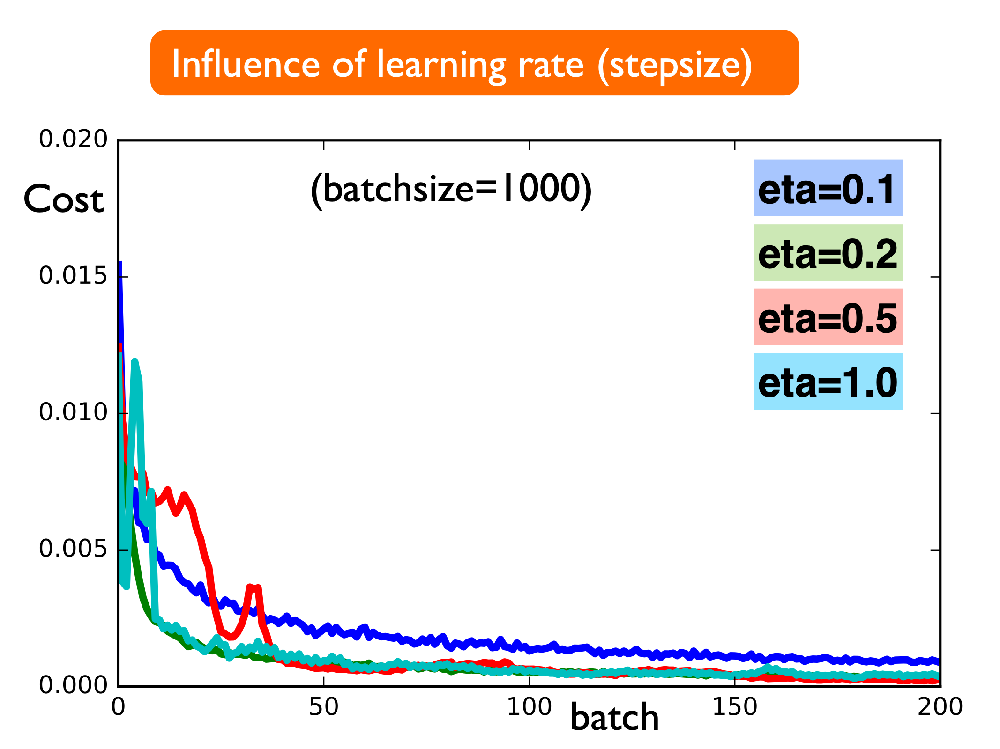{width="70%" fig-alt="Plot titled 'Influence of learning rate (stepsize)': Cost versus training batch (0 to 200, batchsize=1000), comparing eta=0.1 (blue), eta=0.2 (green), eta=0.5 (red), and eta=1.0 (cyan): the largest learning rate (eta=1.0) oscillates sharply at first but settles alongside eta=0.2 and eta=0.5 to the lowest cost, while eta=0.1 remains highest."}

- [F. Marquardt, Machine Learning for Physicists 2024](https://pad.gwdg.de/s/ZwIoM-Arn)
- [F. Marquardt, Machine Learning for Physicists 2024](https://pad.gwdg.de/s/ZwIoM-Arn)

---

## Results

{width="70%" fig-alt="Plot titled 'Influence of learning rate (stepsize)': Cost versus training batch (0 to 200, batchsize=1000), comparing eta=0.1 (blue), eta=0.2 (green), eta=0.5 (red), and eta=1.0 (cyan): the largest learning rate (eta=1.0) oscillates sharply at first but settles alongside eta=0.2 and eta=0.5 to the lowest cost, while eta=0.1 remains highest."}

- [F. Marquardt, Machine Learning for Physicists 2024](https://pad.gwdg.de/s/ZwIoM-Arn)
- [F. Marquardt, Machine Learning for Physicists 2024](https://pad.gwdg.de/s/ZwIoM-Arn)

---

## Results

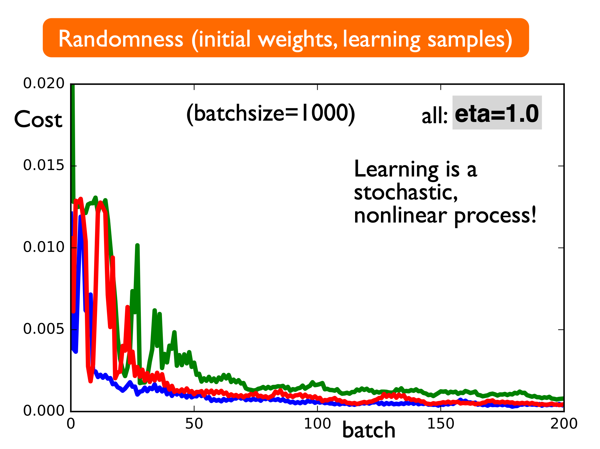{width="70%" fig-alt="Plot titled 'Randomness (initial weights, learning samples)': Cost versus training batch (0 to 200, batchsize=1000, all eta=1.0) for three separate training runs (blue, red, green) differing only in random initialization/sampling - each drops steeply but with different noisy oscillation patterns before converging to a similarly low cost; captioned 'Learning is a stochastic, nonlinear process!'."}

- [F. Marquardt, Machine Learning for Physicists 2024](https://pad.gwdg.de/s/ZwIoM-Arn)
- [F. Marquardt, Machine Learning for Physicists 2024](https://pad.gwdg.de/s/ZwIoM-Arn)

---

## Results

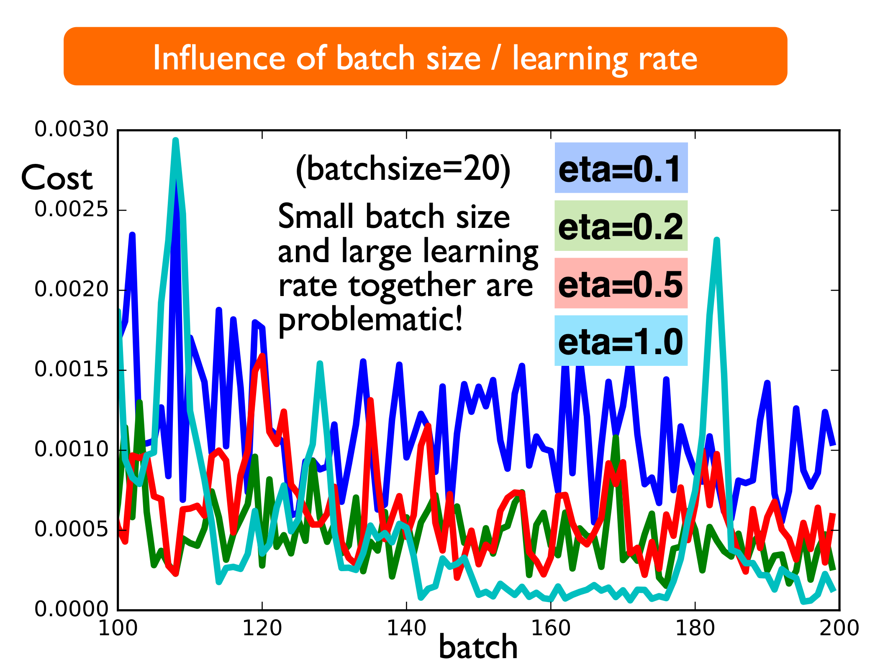{width="70%" fig-alt="Plot titled 'Influence of batch size / learning rate': Cost versus training batch (100 to 200, batchsize=20) for eta=0.1 (blue), eta=0.2 (green), eta=0.5 (red), and eta=1.0 (cyan) - all four curves are noisy and spiky at this small batch size, with eta=0.1 (blue) spiking highest; captioned 'Small batch size and large learning rate together are problematic!'."}

- [F. Marquardt, Machine Learning for Physicists 2024](https://pad.gwdg.de/s/ZwIoM-Arn)
- [F. Marquardt, Machine Learning for Physicists 2024](https://pad.gwdg.de/s/ZwIoM-Arn)

---

## Overfitting

- A critical practical consideration: overfitting
- A model with too many parameters can just "memorize" the input data
  - Fails to learn the actual underlying model.
  - Poor generalization when applied beyond training dataset.

{width="70%" fig-alt="Scatter plot of red and blue data points with a smooth black curve (the true decision boundary) and a jagged green curve weaving tightly between individual points - illustrating an overfit classifier boundary that follows noise rather than the true underlying trend."}

- Overfitting (wikipedia)
- [https://computational-physics.tripos.org/slides/autodiff.html#/0/4](https://computational-physics.tripos.org/slides/autodiff.html#/0/4)

---

## Overfitting

- A critical practical consideration: overfitting
- A model with too many parameters can just "memorize" the input data
  - Fails to learn the actual underlying model.
  - Poor generalization when applied beyond training dataset.
- Example: [Zhang 2021](https://dl.acm.org/doi/pdf/10.1145/3446776)
  - Trained computer vision models on randomly labelled images
  - Perfect performance on training data, random guessing on testing data!

- [https://computational-physics.tripos.org/slides/autodiff.html#/0/4](https://computational-physics.tripos.org/slides/autodiff.html#/0/4)

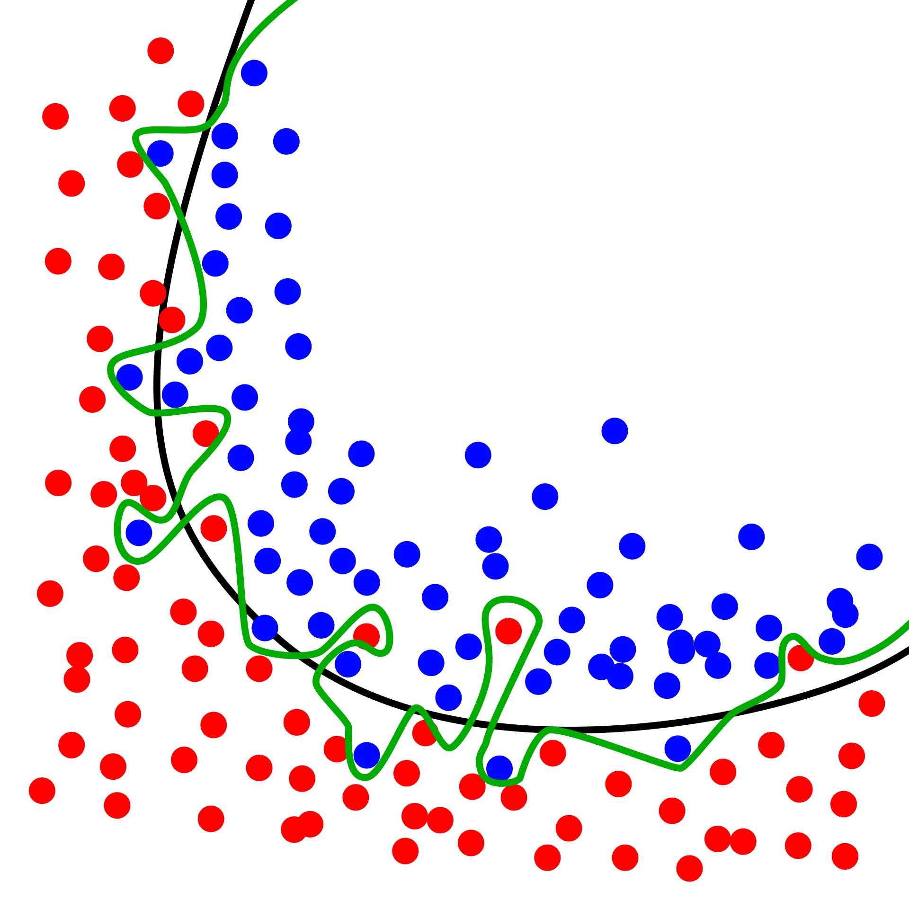{width="70%" fig-alt="Plot titled 'Accuracy during training' (net: 784(input), 30, 10(output)): accuracy on training data (blue) climbs steadily from ~0.90 to ~0.975 over 300 epochs, while accuracy on validation data (green) rises quickly then plateaus/slightly declines around 0.92-0.93, with arrows highlighting the two curves diverging - illustrating overfitting."}

- Overfitting (wikipedia)

---

## Overfitting

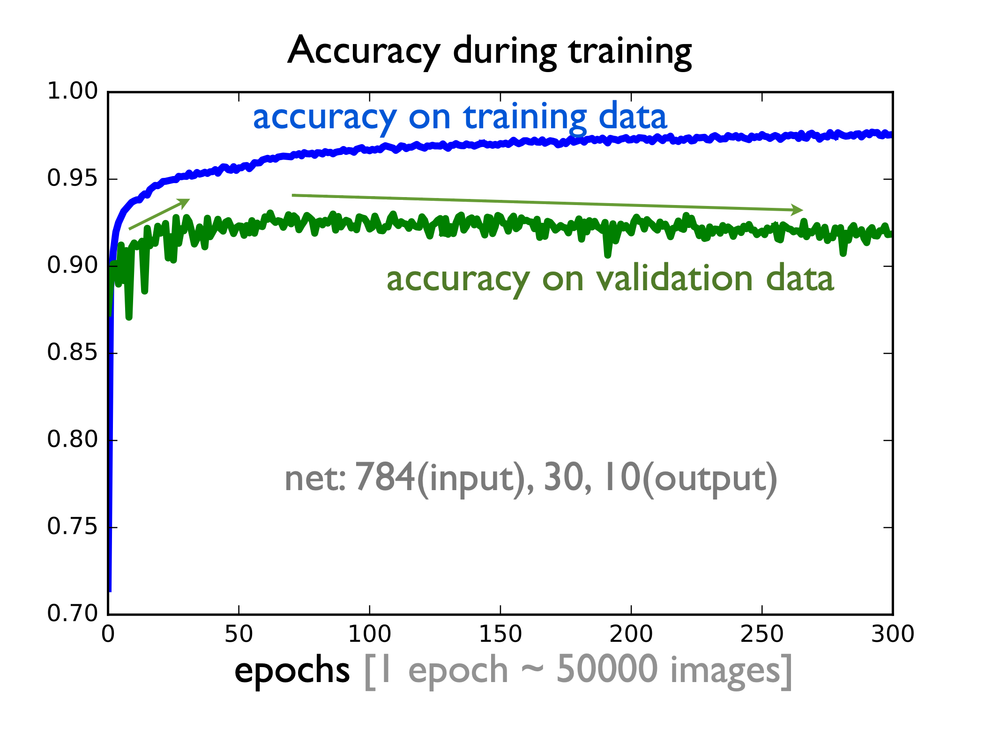{width="70%" fig-alt="Plot titled 'Accuracy during training' (net: 784(input), 30, 10(output)): accuracy on training data (blue) climbs steadily from ~0.90 to ~0.975 over 300 epochs, while accuracy on validation data (green) rises quickly then plateaus/slightly declines around 0.92-0.93, with arrows highlighting the two curves diverging - illustrating overfitting."}

- Accuracy on test vs. validation data
- [F. Marquardt, Machine Learning for Physicists 2024](https://pad.gwdg.de/s/ZwIoM-Arn)

---

## Overfitting

<!-- TODO: complex slide layout (flagged by detect_complex_slide.py - see run log). Content below is complete but UNARRANGED - needs manual layout to match the original slide. -->

{fig-alt="Plot titled 'Accuracy during training' (net: 784(input), 30, 10(output)): accuracy on training data (blue) climbs steadily from ~0.90 to ~0.975 over 300 epochs, while accuracy on validation data (green) rises quickly then plateaus/slightly declines around 0.92-0.93, with arrows highlighting the two curves diverging - illustrating overfitting."}

- Accuracy on test vs. validation data
{fig-alt="A thin, squiggly pink hand-drawn line, purely decorative."}

{fig-alt="A small pink hand-drawn arrow shape, purely decorative."}

- Beyond here, the validation accuracy actually gets worse!
- Hallmark of overfitting

- [F. Marquardt, Machine Learning for Physicists 2024](https://pad.gwdg.de/s/ZwIoM-Arn)

---

## Overfitting

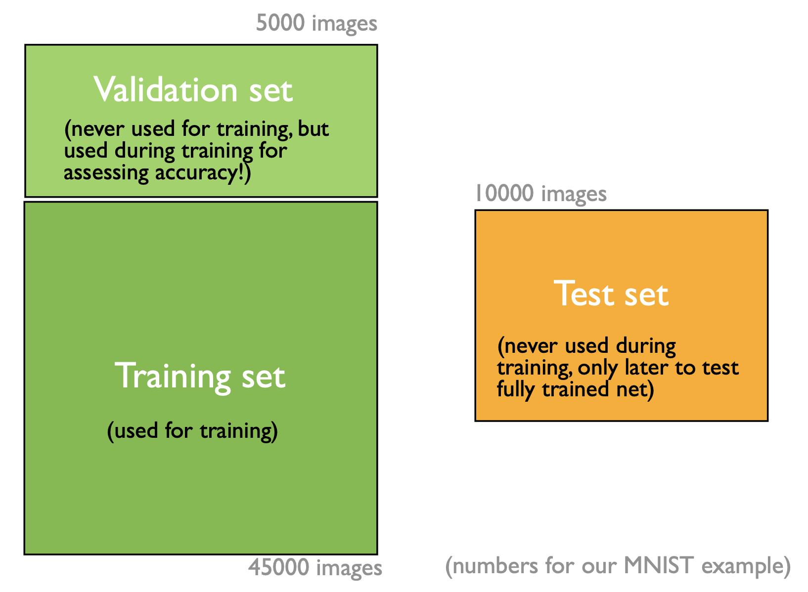{width="70%" fig-alt="Diagram of a dataset split into a Validation set (5000 images, light green, 'never used for training, but used during training for assessing accuracy'), a Training set (45000 images, dark green, 'used for training'), and a separate Test set (10000 images, orange, 'never used during training, only later to test fully trained net'), with a note that these numbers are for the MNIST example."}

- Division into training, validation, and set data sets
- [F. Marquardt, Machine Learning for Physicists 2024](https://pad.gwdg.de/s/ZwIoM-Arn)

---

## Overfitting

{width="70%" fig-alt="Diagram of a dataset split into a Validation set (5000 images, light green, 'never used for training, but used during training for assessing accuracy'), a Training set (45000 images, dark green, 'used for training'), and a separate Test set (10000 images, orange, 'never used during training, only later to test fully trained net'), with a note that these numbers are for the MNIST example."}

- Division into training, validation, and set data sets
- Use validation set to judge performance during training
  - Termination criteria: stop when validation accuracy stops improving
- Switch out training data (batching strategy); add some noise
- "Dropout": randomly 0 out neurons during training (also noise)

- [F. Marquardt, Machine Learning for Physicists 2024](https://pad.gwdg.de/s/ZwIoM-Arn)

---

## Notebooks

- Run through the "02" notebooks
  - Try varying the learning rate
  - Define interesting functions to train on
- Note: you might run into some errors related to matplotlib versions. Some fixes:

- #from mpl_toolkits.axes_grid1.inset_locator import InsetPosition
- from mpl_toolkits.axes_grid1.inset_locator import inset_axes
- #axins1 = plt.axes([0, 0, 1, 1])
- #ip = InsetPosition(ax[1], [0.25, 0.1, 0.5, 0.05])
- #axins1.set_axes_locator(ip)
- axins1 = ax[1].inset_axes([0.25, 0.1, 0.5, 0.05])
- #axins2 = plt.axes([0.01, 0.01, 0.99, 0.99])
- #ip = inset_axes(ax[1], [0.75, 0.75, 0.2, 0.2])
- #axins2.set_axes_locator(ip)
- axins2 = ax[1].inset_axes([0.75, 0.75, 0.2, 0.2])

- #col=[0,0.4,0.8]
- col=[[0.,0.4,0.8]]

---

## Next time

- Of course, in real life, you should import a ML library and not write everything from scratch!
  - Tensorflow, PyTorch, Keras (frontend), Jax, scikit-learn, xgboost, many more
- Features:
  - Nice interface for creating NNs and other algorithms
  - Pre-programmed options for activation functions, minimizers/learning rate, etc.
  - Advanced layer structures (CNNs, RNNs, ...)
  - Optimized, GPU support
- Next time, we'll look into the [Jax environment](https://docs.jax.dev/en/latest/jax-101.html)

- import jax
- import jax.numpy as jnp
- from jax import grad
- grad_tanh = grad(jnp.tanh)
- print(grad_tanh(2.0))

---

# TOols

---

## Machine learning libraries

<!-- TODO: complex slide layout (flagged by detect_complex_slide.py - see run log). Content below is complete but UNARRANGED - needs manual layout to match the original slide. -->

- In real life, you should import a ML library and not write everything from scratch
  - Tensorflow, PyTorch, Keras (frontend), Jax, scikit-learn, xgboost, many more
- Features:
  - Nice interface for creating NNs and other algorithms
  - Pre-programmed options for activation functions, minimizers/learning rate, etc.
  - Advanced layer structures (CNNs, RNNs, ...)
  - Optimized, GPU support
- Today, we'll learn some jax.

- import jax
- import jax.numpy as jnp
- from jax import grad
- grad_tanh = grad(jnp.tanh)
- print(grad_tanh(2.0))

{fig-alt="Iceberg illustration: above the waterline, the visible tip is labeled with the Keras and PyTorch Lightning logos; below the waterline, the much larger submerged body of the iceberg is labeled with the TensorFlow, PyTorch, and JAX logos (plus one unlabeled icon) - illustrating that high-level libraries sit atop much larger underlying frameworks."}

- Popular ML frameworks labeled on an iceberg
- [https://softwaremill.com/ml-engineer-comparison-of-pytorch-tensorflow-jax-and-flax/](https://softwaremill.com/ml-engineer-comparison-of-pytorch-tensorflow-jax-and-flax/)

---

## Landscape

<!-- TODO: complex slide layout (flagged by detect_complex_slide.py - see run log). Content below is complete but UNARRANGED - needs manual layout to match the original slide. -->

- You can find a [million](https://softwaremill.com/ml-engineer-comparison-of-pytorch-tensorflow-jax-and-flax/#section-ml-engineer-comparison-of-pytorch-tensorflow-jax-and-flax) [internet](https://kambale.dev/tensorflow-v-flax) [resources](https://chatgpt.com/share/69b4219a-ea24-8011-a304-d6e84d1ed5a3) comparing ML frameworks

{fig-alt="Iceberg illustration: above the waterline, the visible tip is labeled with the Keras and PyTorch Lightning logos; below the waterline, the much larger submerged body of the iceberg is labeled with the TensorFlow, PyTorch, and JAX logos (plus one unlabeled icon) - illustrating that high-level libraries sit atop much larger underlying frameworks."}

- Popular ML frameworks labeled on an iceberg
- [https://softwaremill.com/ml-engineer-comparison-of-pytorch-tensorflow-jax-and-flax/](https://softwaremill.com/ml-engineer-comparison-of-pytorch-tensorflow-jax-and-flax/)

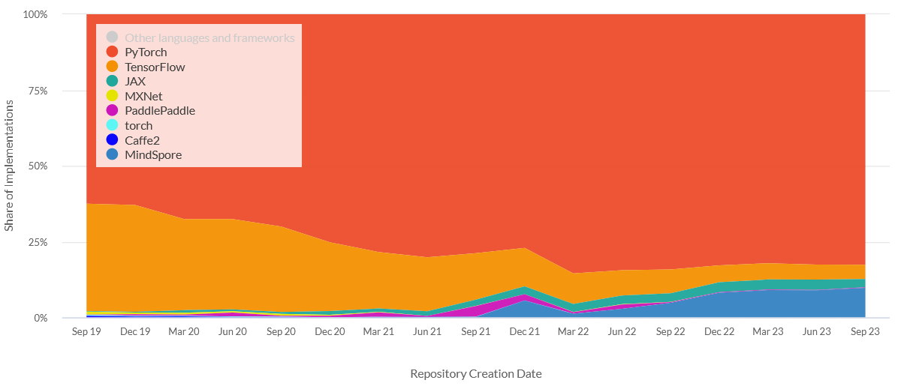{fig-alt="Stacked area chart titled 'Share of Implementations' (of ML repositories) versus Repository Creation Date (Sep 2019 to Sep 2023): PyTorch's share (red) grows from under half to roughly 80%, while TensorFlow's share (orange) shrinks from about 35% to under 10%, with small slivers for JAX, MXNet, PaddlePaddle, torch, Caffe2, MindSpore, and other frameworks."}

- The popularity of frameworks in new Machine Learning papers, source: visio.ai
{fig-alt="Podium graphic ranking deep-learning frameworks by GitHub stars: PyTorch (81k, 1st place), TensorFlow (74k, 2nd place), and Keras (61k, 3rd place), with JAX (29k), PyTorch Lightning (28k), and another framework (6k) shown alongside without podium placement."}

- Popularity on GitHub

---

## Example: tensorflow

- import tensorflow as tf
- # Use TensorFlow for production-grade projects
- model = tf.keras.Sequential([
- tf.keras.layers.Dense(64, activation='relu'),
- tf.keras.layers.Dense(10, activation='softmax')
- ])
- # Train and evaluate the model
- model.compile(optimizer='adam', loss='sparse_categorical_crossentropy', metrics=['accuracy'])
- model.fit(train_dataset, epochs=10, validation_data=val_dataset)

---

## Example: pytorch

- device = torch.accelerator.current_accelerator().type if torch.accelerator.is_available() else "cpu"
- class NeuralNetwork(nn.Module):
- def __init__(self):
- super().__init__()
- self.flatten = nn.Flatten()
- self.linear_relu_stack = nn.Sequential(
- nn.Linear(28*28, 512),
- nn.ReLU(),
- nn.Linear(512, 512),
- nn.ReLU(),
- nn.Linear(512, 10)
- )
- def forward(self, x):
- x = self.flatten(x)
- logits = self.linear_relu_stack(x)
- return logits
- model = NeuralNetwork().to(device)
- print(model)

- loss_fn = nn.CrossEntropyLoss()
- optimizer = torch.optim.SGD(model.parameters(), lr=learning_rate)
- def train_loop(dataloader, model, loss_fn, optimizer):
- size = len(dataloader.dataset)
- model.train() # set mode
- for batch, (X, y) in enumerate(dataloader):
- # Compute prediction and loss
- pred = model(X)
- loss = loss_fn(pred, y)
- # Backpropagation
- loss.backward()
- optimizer.step()
- optimizer.zero_grad()
- epochs = 10
- for t in range(epochs):
- train_loop(train_dataloader, model, loss_fn, optimizer)
- test_loop(test_dataloader, model, loss_fn)
- print("Done!")

---

## Example: flax

- import flax
- from flax import linen as nn
- # Use FLAX for research and experimental projects
- class MyModel(nn.Module):
- hidden_dim: int
- def setup(self):
- self.dense = nn.Dense(self.hidden_dim)
- self.output = nn.Dense(10)
- def __call__(self, inputs):
- x = nn.relu(self.dense(inputs))
- return self.output(x)
- model = MyModel(hidden_dim=64)
- # Train and evaluate the model
- optimizer = flax.optim.Adam(learning_rate=0.001).create(model)
- for batch in dataset:
- optimizer = optimizer.train_step(batch)

---

## Hands-on

- For today:
  - Read through Jax tutorial: "How to think in JAX" and "JAX 101" through ~pytrees
    - Go through jnp, grad together
  - Notebooks in order:
    - 03_NN_CostFunctionGradientFromJax.ipynb
    - 03_MoreJaxTricks.ipynb
    - 03_OptaxForOptimizationInJax.ipynb
    - 03_Flax.ipynb
      - Comment: linen is already out of style :( Use new nnx framework instead?
- Feel free to continue tinkering over spring break!
  - We will get into specific ML topics after the break, e.g., CNNs, RNNs, autoencoders, ...

---

# Part 2: Convolutional neural networks

---

## Where we're at

- Last week:
  - Basics of neural networks
    - Structure, neuron activation functions
    - Train by minimizing cost function as fx of NN weights
  - Implementation using jax/flax
    - If you didn't run through the "03" notebooks, please make sure to get to it this week! If there's any chance you'll use ML in the future, this might be the most important topic of the semester :)
- Today:
  - Start on specific NN architectures
  - Image classification with simple NN and convolutional NN
- This week:
  - Unsupervised learning (autoencoders; clustering), overview of various other architectures
  - Midterm distributed on Wednesday, ~2 weeks to complete!
- Next week: ML leftovers, then full-time project work!

---

## Last time: feed forward

{width="70%" fig-alt="Diagram titled 'One layer': two output neurons fully connected to three input neurons, with the per-neuron formula z_j = sum_k(w_jk * y_k^in) + b_j (j = output neuron, k = input neuron), its matrix/vector form z = wy^in + b, and the elementwise nonlinear function y_j^out = f(z_j)."}

- [F. Marquardt, Machine Learning for Physicists 2024](https://pad.gwdg.de/s/ZwIoM-Arn)

---

## Last time: feed forward

<!-- TODO: complex slide layout (flagged by detect_complex_slide.py - see run log). Content below is complete but UNARRANGED - needs manual layout to match the original slide. -->

- original version: Haade;vectorization: Wjh31, Quibik, CC BY-SA 3.0 <https://creativecommons.org/licenses/by-sa/3.0>, via Wikimedia Commons

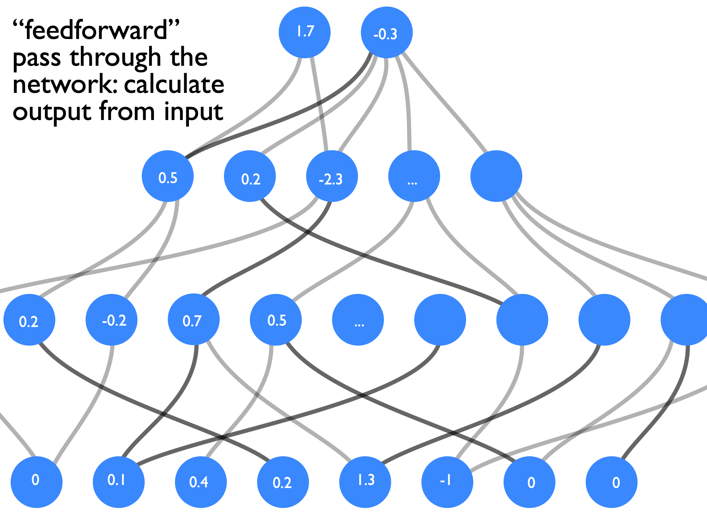{fig-alt="The same feedforward-pass diagram, further along in the walkthrough: the first hidden layer is now fully computed and values are appearing in the second hidden layer (0.5, 0.2, -2.3, ...) as the computation propagates forward."}

- [F. Marquardt, Machine Learning for Physicists 2024](https://pad.gwdg.de/s/ZwIoM-Arn)
- ${y}_{j}^{(n)}$ = value of neurons in $n$th layer

- ${w}_{jk}^{n,n-1}$ = weights (layer $n-1$ to $n$)

- ${z}_{j}^{(n)}$=input for "$y=f(z)$"
- =${w}_{jk}^{n,n-1}{y}_{k}^{(n-1)}+{b}_{j}^{n,n-1}$

---

## Last time: backpropagation

{width="70%" fig-alt="Diagram titled 'Backpropagation: the principle': the full chain-rule path from a red C (cost) node down through three black f'(z) nodes (each connected by an edge labeled w) to the red-highlighted w_* connection at the bottom, labeled y and w_* - showing every factor in the chain rule from w_* to C. Annotated 'and now: sum over ALL possible paths!' and 'efficient implementation: repeated matrix/vector multiplication'."}

- [F. Marquardt, Machine Learning for Physicists 2024](https://pad.gwdg.de/s/ZwIoM-Arn)
- [F. Marquardt, Machine Learning for Physicists 2024](https://pad.gwdg.de/s/ZwIoM-Arn)

---

## Last time: backpropagation

:::: {.columns}
::: {.column width="55%"}
- $$\begin{matrix}
\frac{ \partial C(w,{y}^{\text{in}})}{ \partial {w}_{*}} & =\mathop{ \sum }\limits_{j \in {L}_{N}}({y}_{j}^{(n)}-{F}_{j}({y}^{\text{in}}))\frac{ \partial {y}_{j}^{(n)}}{ \partial {w}_{*}} \\
 & =\mathop{ \sum }\limits_{j \in {L}_{N}}({y}_{j}^{(n)}-{F}_{j}({y}^{\text{in}})){f}^{′}({z}_{j}^{(n)})\frac{ \partial {z}_{j}^{(n)}}{ \partial {w}_{*}} \\
\frac{ \partial {z}_{j}^{(n)}}{ \partial {w}_{*}} & =\mathop{ \sum }\limits_{k \in {L}_{N-1}}{w}_{jk}^{n,n-1}{f}^{′}({z}_{k}^{(n-1)})\frac{ \partial {z}_{k}^{(n-1)}}{ \partial {w}_{*}}
\end{matrix}$$
- Save (weight*derivative) as a matrix, connecting layer ${L}_{N}$ to layer ${L}_{N-1}$:
- $${M}_{jk}^{(n,n-1)}={w}_{jk}^{(n,n-1)}{f}^{′}({z}_{k}^{(n-1)})$$
- The full chain rule equation is:
- $$\frac{ \partial {z}_{j}^{(n)}}{ \partial {w}_{*}}=\mathop{ \sum }\limits_{k,l,...,u,v}{M}_{jk}^{(n,n-1)}{M}_{kl}^{(n-1,n-2)}...{M}_{uv}^{m+1,m}\frac{ \partial {z}_{v}^{(m)}}{ \partial {w}_{*}}$$
- Each $\frac{ \partial C}{ \partial {w}_{*}}$ is obtained from a series of vector-matrix multiplications
  - Terminate upon reaching desired weight: $\frac{ \partial {z}_{j}^{(n)}}{ \partial {w}_{jk}^{(n,n-1)}}={y}_{k}^{(n-1)},\frac{ \partial {z}_{j}^{(n)}}{ \partial {b}_{j}^{n}}=1$
- Start with a vector corresponding to the first step of the chain rule:
- $${ \Delta }_{j}=({y}_{j}^{n}-{F}_{j}({y}^{\text{in}})){f}^{′}({z}_{j}^{n})$$
:::
::: {.column width="45%"}
{width="100%" fig-alt="Thin, mostly empty orange rectangular border/frame."}
{width="100%" fig-alt="Thin, mostly empty pink/magenta rectangular border/frame."}
:::
::::

---

## Last time: overfitting

<!-- TODO: complex slide layout (flagged by detect_complex_slide.py - see run log). Content below is complete but UNARRANGED - needs manual layout to match the original slide. -->

{fig-alt="Plot titled 'Accuracy during training' (net: 784(input), 30, 10(output)): accuracy on training data (blue) climbs steadily from ~0.90 to ~0.975 over 300 epochs, while accuracy on validation data (green) rises quickly then plateaus/slightly declines around 0.92-0.93, with arrows highlighting the two curves diverging - illustrating overfitting."}

- Accuracy on test vs. validation data
{fig-alt="A thin, squiggly pink hand-drawn line, purely decorative."}

{fig-alt="A small pink hand-drawn arrow shape, purely decorative."}

- Beyond here, the validation accuracy actually gets worse!
- Hallmark of overfitting

- [F. Marquardt, Machine Learning for Physicists 2024](https://pad.gwdg.de/s/ZwIoM-Arn)

- Also:
- Dropout
- Batch sampling

---

## Types of neural networks

- The networks so far are multilayer perceptrons, built from fully connected layers.
  - These can already do a lot of interesting things, e.g. the universal approximation theorem.
- But! The universal approximation theorem is a statement of existence, not efficiency!
  - Fully connected layers are somewhat expensive (${N}_{j-1} \times {N}_{j}$ weights)

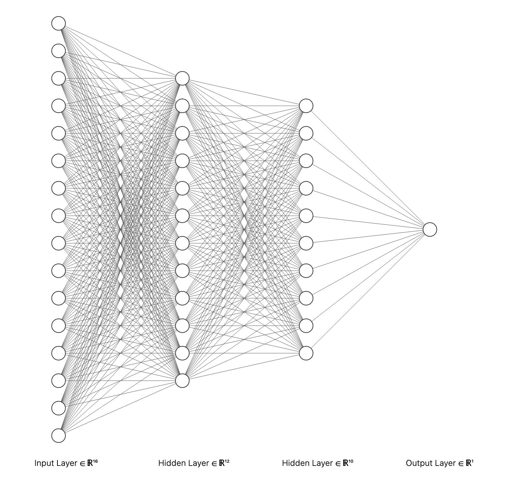{width="70%" fig-alt="Diagram of a dense feedforward network with unlabeled nodes: an Input Layer in R^16 (16 nodes), two Hidden Layers in R^12 and R^10, and an Output Layer in R^1 (1 node), with every node in each layer connected to every node in the next."}

- [https://towardsdatascience.com/classifying-handwritten-digits-using-a-multilayer-perceptron-classifier-mlp-bc8453655880/](https://towardsdatascience.com/classifying-handwritten-digits-using-a-multilayer-perceptron-classifier-mlp-bc8453655880/)

---

## Types of neural networks

<!-- TODO: complex slide layout (flagged by detect_complex_slide.py - see run log). Content below is complete but UNARRANGED - needs manual layout to match the original slide. -->

- In practice, you can do a lot better if the neural network's structure mirrors the problem/data structure.
  - Convolutional NNs: scan a small "filter" over an image to extract local features (e.g. edges).
  - Recurrent NNs: parse sequential data (e.g. time series, sentences) with built-in "memory" that remembers recent inputs
  - Autoencoders: NN has a "bottleneck", forcing NN to focus on most important features
  - Graph NNs: inputs have a graph structure (e.g. molecules, point-cloud camera data, LHC jet constituents) with permutation-invariant nodes and edges
  - Transformers: [Attention Is All You Need](https://en.wikipedia.org/wiki/Attention_Is_All_You_Need)
  - ...

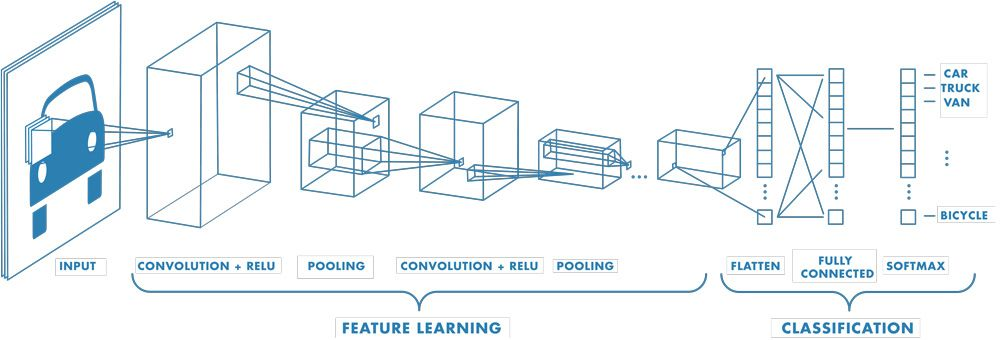{fig-alt="Diagram of a convolutional neural network processing a car image through Convolution+ReLU and Pooling stages (twice, labeled 'FEATURE LEARNING'), then Flatten, Fully Connected, and Softmax stages (labeled 'CLASSIFICATION') producing class scores for CAR, TRUCK, VAN, ..., BICYCLE."}

- [https://nl.mathworks.com/discovery/convolutional-neural-network.html](https://nl.mathworks.com/discovery/convolutional-neural-network.html)
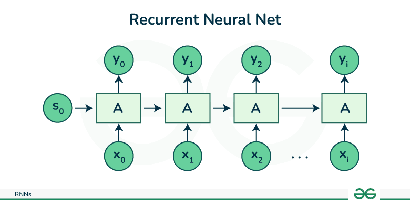{fig-alt="Diagram titled 'Recurrent Neural Net': a chain of identical processing blocks A, each taking an input x_i and initial/previous state (s0 feeding the first block) to produce an output y_i, with the state passed forward from each block to the next (x0/y0, x1/y1, x2/y2, ..., xi/yi)."}

- [https://www.geeksforgeeks.org/deep-learning/difference-between-recursive-and-recurrent-neural-network/](https://www.geeksforgeeks.org/deep-learning/difference-between-recursive-and-recurrent-neural-network/)
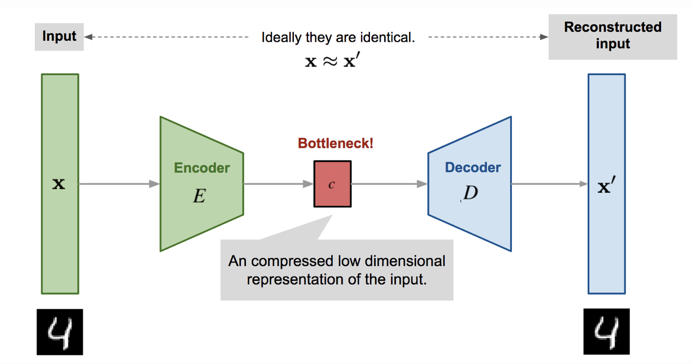{fig-alt="Diagram of an autoencoder: an input x (green bar, with an MNIST digit '4' below) passes through an Encoder E into a compressed bottleneck representation c, then through a Decoder D to produce a reconstructed input x' (blue bar, with a reconstructed '4' below), captioned 'Ideally they are identical: x ~ x''."}

- [https://towardsdatascience.com/autoencoders-and-the-denoising-feature-from-theory-to-practice-db7f7ad8fc78/](https://towardsdatascience.com/autoencoders-and-the-denoising-feature-from-theory-to-practice-db7f7ad8fc78/)
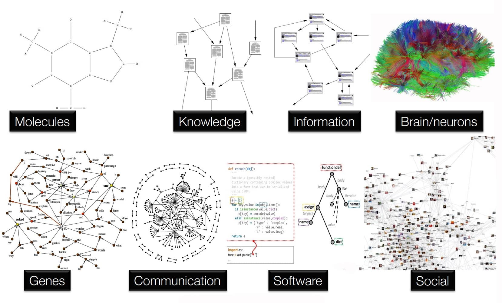{fig-alt="Grid of eight example network/graph types, each labeled in a black banner: Molecules (a chemical structure diagram), Knowledge (documents connected by arrows), Information (similar document-arrow diagram), Brain/neurons (a colorful tractography rendering of neural fiber tracts), Genes, Communication (word-association and tree diagrams), Software (a code snippet with its parse tree), and Social (a dense network of profile photos and connections)."}

- [https://blogs.nvidia.com/blog/what-are-graph-neural-networks/](https://blogs.nvidia.com/blog/what-are-graph-neural-networks/)
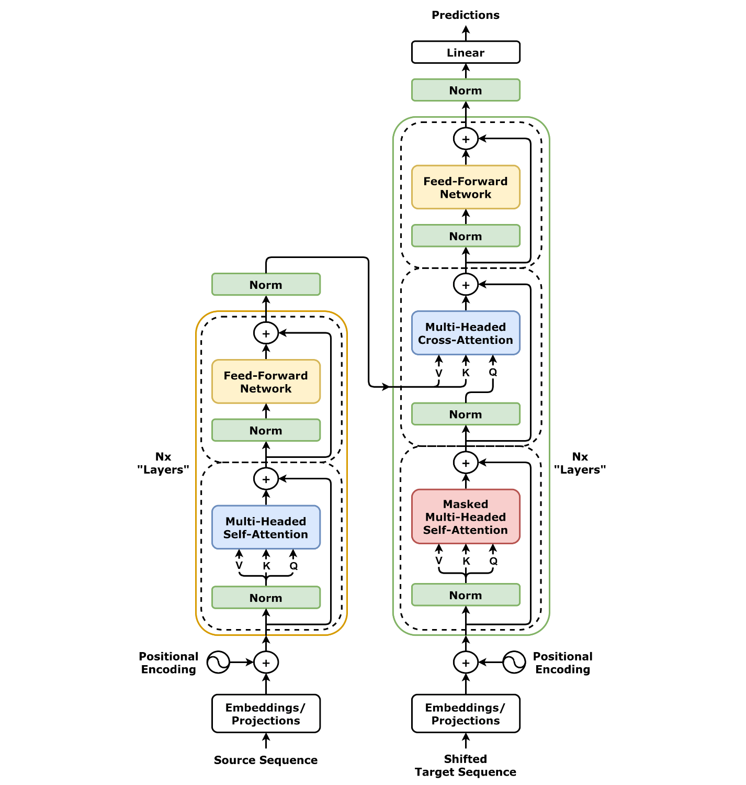{fig-alt="Detailed Transformer encoder-decoder architecture diagram: the encoder (left, orange outline) stacked Nx with Multi-Headed Self-Attention, Norm, and Feed-Forward Network blocks with residual (+) connections, fed by Source Sequence embeddings plus positional encoding; the decoder (right, green outline) stacked Nx with Masked Multi-Headed Self-Attention, Multi-Headed Cross-Attention (taking K,V from the encoder output), Norm, and Feed-Forward Network blocks, fed by Shifted Target Sequence embeddings plus positional encoding, ending in a Linear layer producing Predictions."}

- [https://en.wikipedia.org/wiki/Transformer_%28deep_learning%29](https://en.wikipedia.org/wiki/Transformer_%28deep_learning%29)

---

## Types of neural networks

- Recall: the universal approximation theorem is a statement of existence, not efficiency!
  - Fully connected layers are somewhat expensive (${N}_{j-1} \times {N}_{j}$ weights)
- In practice, a neural network's structure can be constructed to mirror the geometry of the problem.
  - Convolutional NNs: scan a small "filter" over an image to extract local features (e.g. edges).
  - Recurrent NNs: parse sequential data (e.g. time series, sentences) with built-in "memory" that remembers recent inputs
  - Autoencoders: NN has a "bottleneck", forcing NN to focus on most important features
  - Graph NNs: inputs have a graph structure (e.g. molecules, point-cloud camera data, LHC jet constituents) with permutation-invariant nodes and edges
  - ...

---

# Handwriting recognition

---

## Handwriting recognition

- Almost everyone's first (useful) neural network: handwriting recognition using the MNIST dataset.
  - [UB prof. Govindaraju's work](https://www.buffalo.edu/research/research-expertise/case-study-ai-at-usps.html)
- Curated and labeled collection of 60,000 + 10,000 handwritten digits
  - 28x28 pixel, greyscale images
- Classification problem: assign each image to discrete categories (0-9).

{width="70%" fig-alt="Grid of MNIST handwritten digit samples: rows for digits 0 through 9, each row showing roughly 20 different handwritten variations of that digit as white strokes on black backgrounds."}

- MNIST dataset

---

## Classification

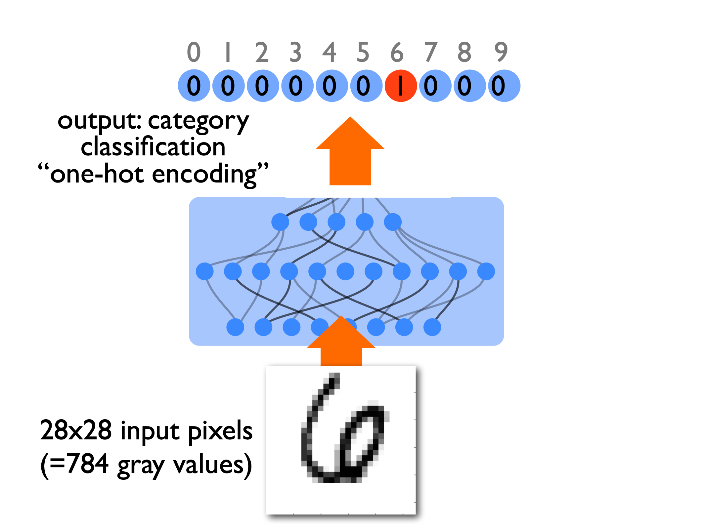{width="70%" fig-alt="Diagram of MNIST digit classification: a 28x28 input image (784 gray values) of a handwritten '6' feeds through a small network to ten output nodes labeled 0-9 in one-hot encoding, with node 6 highlighted red (value 1) and the rest 0, captioned 'output: category classification 'one-hot encoding''."}

- [F. Marquardt, Machine Learning for Physicists 2024](https://pad.gwdg.de/s/ZwIoM-Arn)

---

## Classification

<!-- TODO: complex slide layout (flagged by detect_complex_slide.py - see run log). Content below is complete but UNARRANGED - needs manual layout to match the original slide. -->

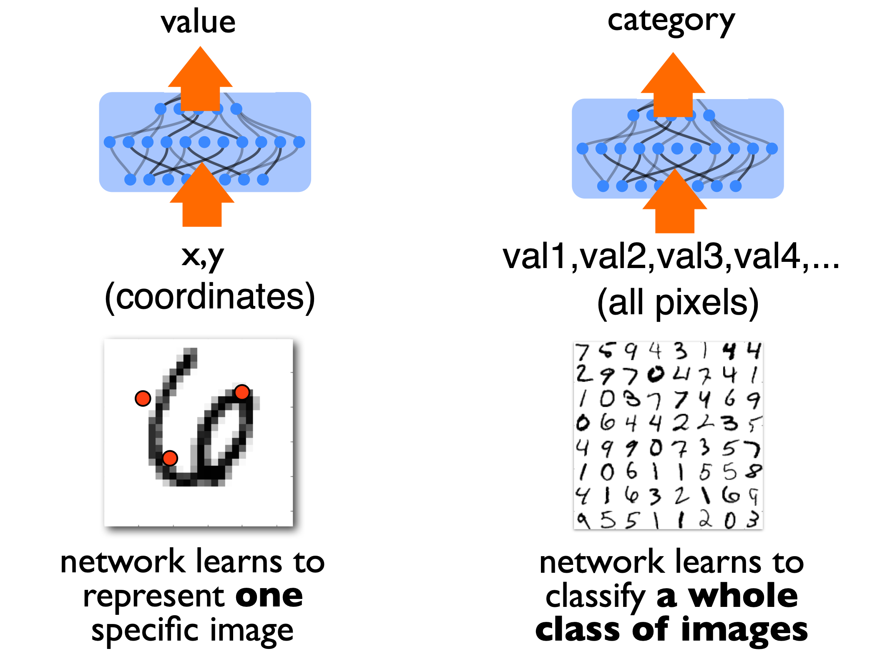{fig-alt="Two-panel comparison: left, a network taking (x,y) coordinates as input and producing a value output, captioned 'network learns to represent one specific image' (shown with an MNIST digit annotated with sample coordinate points); right, a network taking all pixel values (val1, val2, val3, val4, ...) as input and producing a category output, captioned 'network learns to classify a whole class of images' (shown with a grid of many handwritten digit samples)."}

{fig-alt="Two-panel comparison: left, a network taking (x,y) coordinates as input and producing a value output, captioned 'network learns to represent one specific image' (shown with an MNIST digit annotated with sample coordinate points); right, a network taking all pixel values (val1, val2, val3, val4, ...) as input and producing a category output, captioned 'network learns to classify a whole class of images' (shown with a grid of many handwritten digit samples)."}

- [F. Marquardt, Machine Learning for Physicists 2024](https://pad.gwdg.de/s/ZwIoM-Arn)
- Last time: treat a single image as a 2D function, train NN to approximate it
- Data point = one point, (x, y, z), from the image

- Now: many images, each assigned to a category
- Data point = one image

---

## Classification

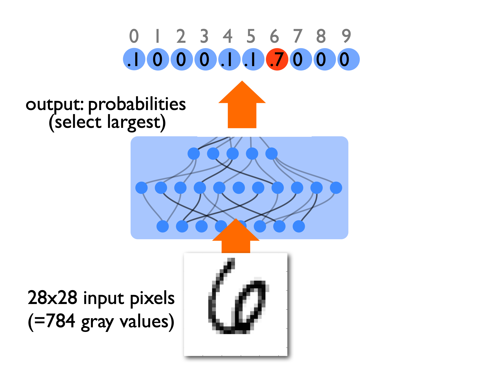{width="70%" fig-alt="Diagram of MNIST digit classification with soft outputs: the same 28x28 input image of a handwritten '6' feeds through the network to ten output nodes labeled 0-9, now showing probability values (.1, 0, 0, 0, .1, .1, .7, 0, 0, 0) with node 6 highlighted red as the largest (.7), captioned 'output: probabilities (select largest)'."}

- [F. Marquardt, Machine Learning for Physicists 2024](https://pad.gwdg.de/s/ZwIoM-Arn)

---

## Soft-max activation function

- Output probabilities are generated by the softmax activation function
- $${f}_{j}({z}_{1},{z}_{2},...)=\frac{{e}^{{z}_{j}}}{\sum_{k=1}^{N} {{e}^{{z}_{k}}}}$$
  - The final set of ${z}_{j}$ are called logits ("raw scores")
  - Multi-variable generalization of the sigmoid, $f(x)=\frac{1}{1+{e}^{-x}}$

{width="70%" fig-alt="Diagram of MNIST digit classification with soft outputs: the same 28x28 input image of a handwritten '6' feeds through the network to ten output nodes labeled 0-9, now showing probability values (.1, 0, 0, 0, .1, .1, .7, 0, 0, 0) with node 6 highlighted red as the largest (.7), captioned 'output: probabilities (select largest)'."}

- Softmax activation

---

## Binary cross-entropy

- Loss categorical data: binary cross entropy, or log loss:
- $$\text{BCE}=-\frac{1}{N}\mathop{\mathop{ \sum }\limits_{i=1}}\limits^{N}\left[ {y}_{i}log({p}_{i})+(1-{y}_{i})log(1-{p}_{i}) \right]$$
- Go through a few cases to convince yourself:
  - ${y}_{0}=1$ and ${p}_{0}=1- \epsilon $?     $-(1ln(1- \epsilon )+0ln( \epsilon ))=0$
  - ${y}_{0}=0$ and ${p}_{0}=0+ \epsilon $?    $-(0ln( \epsilon )+1ln(1- \epsilon ))=0$
  - ${y}_{0}=1$ and ${p}_{0}=0+ \epsilon $?     $-(1ln \epsilon +0ln(1- \epsilon )) \rightarrow  \infty $
- Inspired by entropy: $S=-\mathop{ \sum }\limits_{j}{p}_{j}ln{p}_{j}$
  - Non-negative, additive for factorizable distributions
  - Connected to maximum likelihood

- True (${y}_{i}$)

- NN output (${p}_{i}$)

---

## Binary cross-entropy

- Loss categorical data: binary cross entropy, or log loss:
- $$\text{BCE}=-\frac{1}{N}\mathop{\mathop{ \sum }\limits_{i=1}}\limits^{N}\left[ {y}_{i}log({p}_{i})+(1-{y}_{i})log(1-{p}_{i}) \right]$$
- Go through a few cases to convince yourself:
  - ${y}_{0}=1$ and ${p}_{0}=1- \epsilon $?     $-(1ln(1- \epsilon )+0ln( \epsilon ))=0$
  - ${y}_{0}=0$ and ${p}_{0}=0+ \epsilon $?    $-(0ln( \epsilon )+1ln(1- \epsilon ))=0$
  - ${y}_{0}=1$ and ${p}_{0}=0+ \epsilon $?     $-(1ln \epsilon +0ln(1- \epsilon )) \rightarrow  \infty $
- Inspired by entropy: $S=-\mathop{ \sum }\limits_{j}{p}_{j}ln{p}_{j}$
  - Non-negative, additive for factorizable distributions
  - Connected to [maximum likelihood estimation](https://leimao.github.io/blog/Cross-Entropy-KL-Divergence-MLE/)

- True (${y}_{i}$)

- NN output (${p}_{i}$)

---

## Training example

- JAX has a good MNIST tutorial, which I have copied to our github area.
- Commands to download new notebooks:

- cd machine-learning-for-physicists
- git remote add ubsuny git@github.com:ubsuny/machine-learning-for-physicists.git
- git fetch ubsuny
- git merge ubsuny/master

- Let's go through mnist_tutorial_mlp.ipynb together.
- Then, check out high score list at [https://en.wikipedia.org/wiki/MNIST_database](https://en.wikipedia.org/wiki/MNIST_database)

---

# Convolutional neural networks

---

## Convolutions

- Remember the definition of a convolution from last semester:
  - Continuous: $(f*g)(x)= \int f({x}^{′})g(x-{x}^{′})d{x}^{′}$
  - Discrete: $(f*g{)}_{i}=\mathop{ \sum }\limits_{j}{f}_{j}{g}_{i-j}$
  - Similarly for higher dimensions
- Convolution theorem: convolution in real space $ \Leftrightarrow $ multiplication in Fourier domain, and vice versa:
  - $F[f*g]=F[f]F[g]$, and ${F}^{-1}[\mathop{f}\limits^{˜}*\mathop{g}\limits^{˜}]={F}^{-1}[\mathop{f}\limits^{˜}]{F}^{-1}[\mathop{g}\limits^{˜}]$
  - Example: convolving with a Gaussian "smoothens out" a function;
    - In Fourier domain (remember, FT of a Gaussian is another Gaussian), this corresponds to multiplying the FT by a Gaussian; this suppresses higher-frequency modes.
- In physics, we see convolutions in the context of things like Green's functions and signal filtering.

---

## Convolutions: smoothing

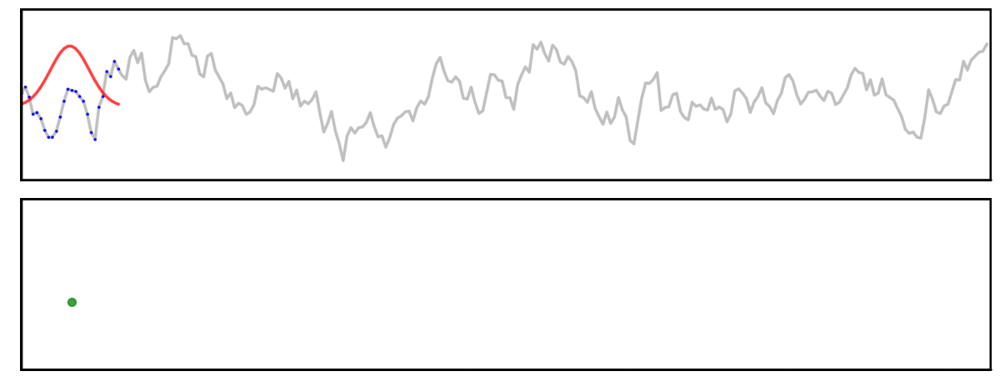{width="70%" fig-alt="Animated two-panel figure: top panel shows a noisy gray time-series signal with a red Gaussian-shaped smoothing kernel (and blue dashed sub-window) sliding across it; bottom panel shows a green dot tracing out the smoothed output value at each position as the kernel slides - illustrating convolution-based smoothing."}

- Animation of convolution with Gaussian (aka Gaussian smoothing)
- [https://github.com/TimeSeriesZoo/Signals](https://github.com/TimeSeriesZoo/Signals)

---

## Convolutions: derivative

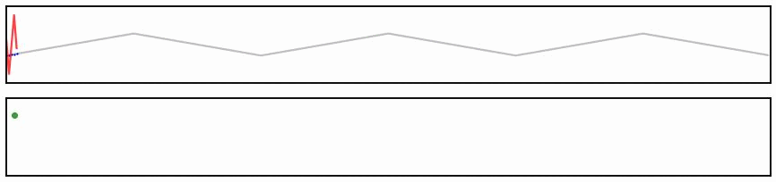{width="70%" fig-alt="Animated two-panel figure: top panel shows a triangular/zigzag piecewise-linear signal with a red derivative kernel (and blue marker) sliding across it; bottom panel shows a green dot tracing out the computed derivative value at each position as the kernel slides - illustrating convolution-based numerical differentiation."}

- Animation of convolution with 5-point stencil derivative filter
- [https://github.com/TimeSeriesZoo/Signals](https://github.com/TimeSeriesZoo/Signals), modified by David Yu

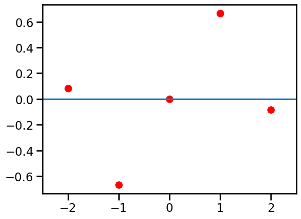{width="70%" fig-alt="Scatter plot of five red points at x = -2, -1, 0, 1, 2 with y-values approximately 0.09, -0.65, 0, 0.65, -0.09, and a horizontal blue reference line at y=0 - the output of a discrete derivative-kernel convolution applied to a simple test signal."}

- 5-point stencil filter:
- $${f}_{i}^{′} \approx \frac{1}{12}[-{f}_{i+2}+8{f}_{i+1}-8{f}_{i-1}+{f}_{i-1}]$$

---

## Convolutions: edge detection

- Edge detection filter: [-1, 0, 1]

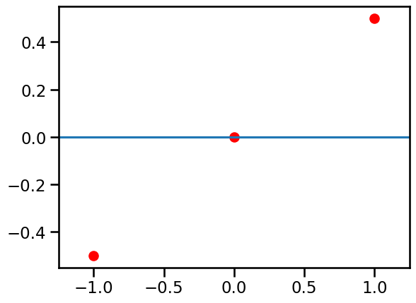{width="70%" fig-alt="Scatter plot of three red points at x = -1, 0, 1 with y-values approximately -0.5, 0, 0.5, and a horizontal blue reference line at y=0 - the output of a discrete edge-detection kernel convolution applied to a simple test signal."}

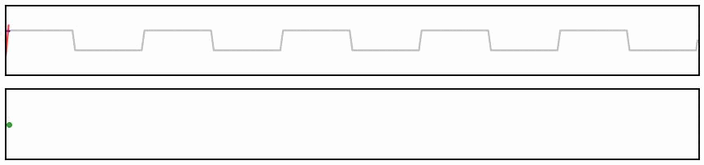{width="70%" fig-alt="Animated two-panel figure: top panel shows a square-wave signal with a red edge-detection kernel (and blue marker) sliding across it; bottom panel shows a green dot tracing out the computed edge-response value at each position as the kernel slides - illustrating convolution-based edge detection."}

- Animation of convolution with edge detection filter
- [https://github.com/TimeSeriesZoo/Signals](https://github.com/TimeSeriesZoo/Signals), modified by David Yu

---

## Convolutions and images

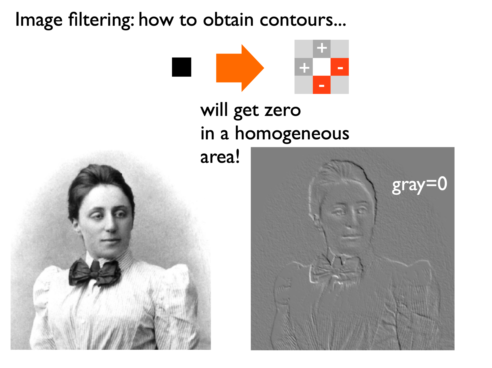{width="70%" fig-alt="Slide titled 'Image filtering: how to obtain contours...': a small black square representing a pixel, an arrow pointing to a 3x3 kernel with '+' weights above and left of center and '-' weights right and below center (a Laplacian-like edge kernel), captioned 'will get zero in a homogeneous area!'; below, a black-and-white portrait photo next to its filtered result showing only edge/contour outlines on a flat gray ('gray=0') background."}

- [F. Marquardt, Machine Learning for Physicists 2024](https://pad.gwdg.de/s/ZwIoM-Arn)
- Convolutions are great at picking out local features!

---

## Convolutions and images

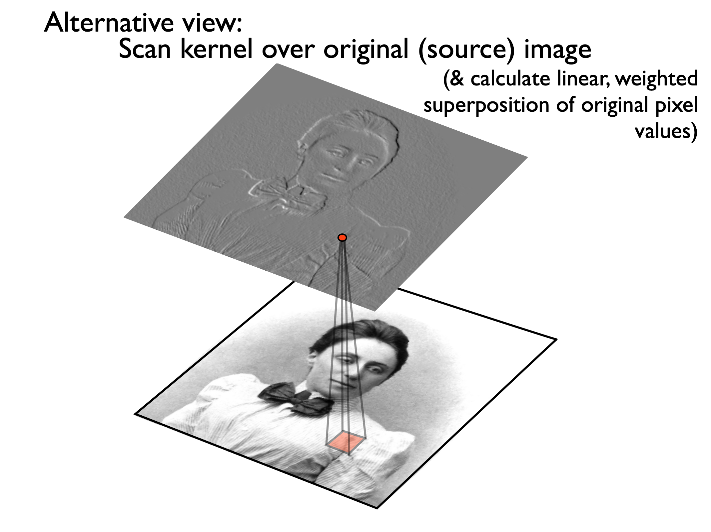{width="70%" fig-alt="Diagram titled 'Scan kernel over original (source) image': a 3D view of a filtered/contour version of a portrait photo (top plane) positioned above the original portrait photo (bottom plane), with lines converging from one output pixel (red dot) down to a small highlighted patch of source pixels (orange square) - illustrating how each filtered pixel is computed from a local neighborhood of the source image."}

- [F. Marquardt, Machine Learning for Physicists 2024](https://pad.gwdg.de/s/ZwIoM-Arn)

---

## Convolutional layers

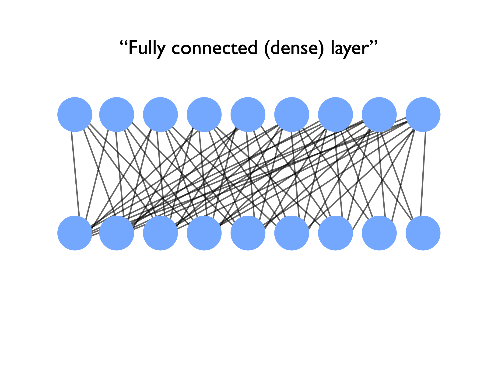{width="70%" fig-alt="Diagram titled ''Fully connected (dense) layer'': two rows of nine nodes each, with every node in the top row connected to every node in the bottom row by crossing lines."}

- [F. Marquardt, Machine Learning for Physicists 2024](https://pad.gwdg.de/s/ZwIoM-Arn)

---

## Convolutional layers

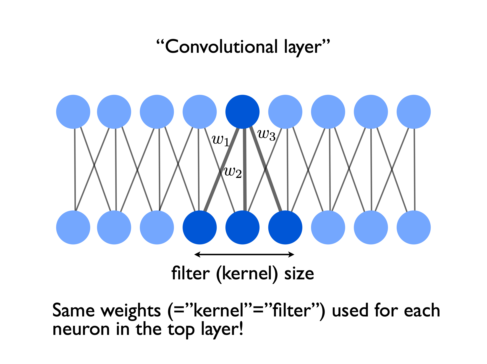{width="70%" fig-alt="Diagram titled ''Convolutional layer'': two rows of nine nodes; unlike a dense layer, each output node (highlighted dark blue) connects only to a small local window of 3 input nodes (also highlighted), with the connection weights labeled w1, w2, w3 and this window width labeled 'filter (kernel) size'; captioned 'Same weights (='kernel'='filter') used for each neuron in the top layer!'."}

- [F. Marquardt, Machine Learning for Physicists 2024](https://pad.gwdg.de/s/ZwIoM-Arn)

---

## Convolutional layers

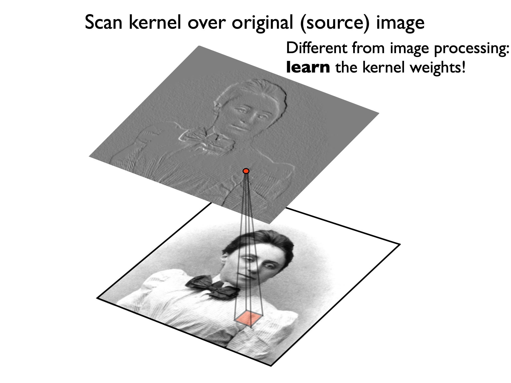{width="70%" fig-alt="Diagram titled 'Scan kernel over original (source) image': a 3D view of a filtered/contour version of a portrait photo (top plane) positioned above the original portrait photo (bottom plane), with lines converging from one output pixel (red dot) down to a small highlighted patch of source pixels (orange square) - illustrating how each filtered pixel is computed from a local neighborhood of the source image. Captioned 'Different from image processing: learn the kernel weights!'."}

- [F. Marquardt, Machine Learning for Physicists 2024](https://pad.gwdg.de/s/ZwIoM-Arn)

---

## CNNs

- Convolutional neural networks (CNNs) are intrinsically translation invariant:
  - The kernels learn some local feature
  - Since the CNN scans the kernel over the whole image, that feature is detected anywhere in the image!
- MUCH more memory-efficient than dense layers:
  - E.g. first dense layer has ${N}_{\text{pixels}} \times {N}_{\text{neurons}}$ weights
    - E.g. (28*28) * 256 =200,704 weights
  - Convolutional layer just has $M$ weights per feature (e.g. $M=9$ for a $3 \times 3$ kernel), which are reused many times during the scanning.
    - E.g. (3*3) * 32 =288

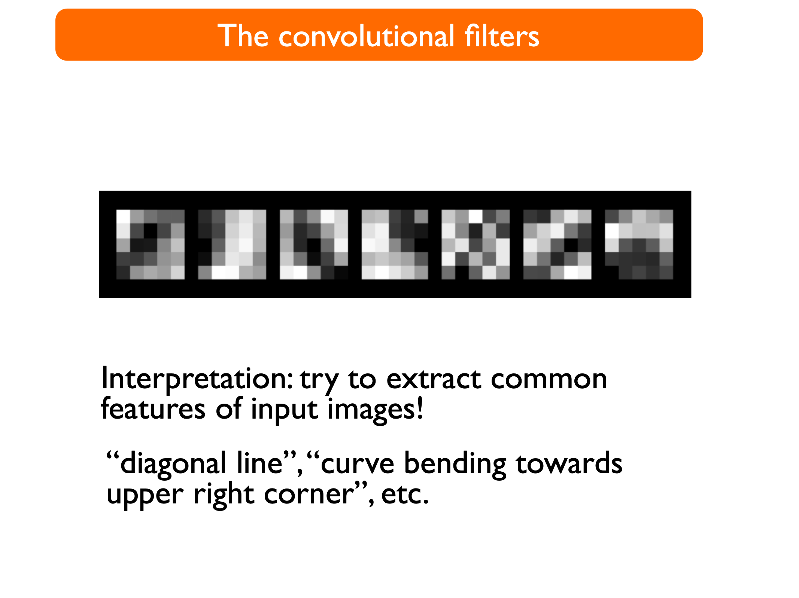{width="70%" fig-alt="Slide titled 'The convolutional filters': a row of seven small pixelated grayscale filter patches (each showing a distinct light/dark pattern); captioned 'Interpretation: try to extract common features of input images! 'diagonal line', 'curve bending towards upper right corner', etc.'."}

- Example of 7 CNN filters. These extract features like "diagonal line", "curve bending towards upper right", etc.

---

## CNNs: additional tools

- A simple convolutional layer applied to a $N \times N$ image will produce $ \approx N \times N$ values (minus a few, depending on how you handle the edges).
  - For most images, this is overkill!
    - Features are probably bigger than 3 pixels
    - Pixel-exact location of features is probably not important
  - [Pooling layers](https://en.wikipedia.org/wiki/Pooling_layer) downsample the output of a convolutional layer, combining nearby pixels
    - Max, average are common choices
- [Batch normalization](https://en.wikipedia.org/wiki/Batch_normalization) rescales inputs to a layer to e.g. [-1, 1], preventing values from blowing up or shrinking.

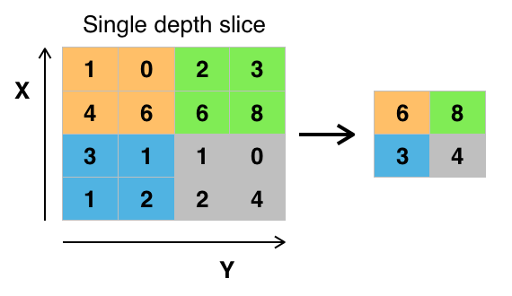{width="70%" fig-alt="Diagram titled 'Single depth slice': a 4x4 grid of numbers divided into four 2x2 colored quadrants (orange: 1,0,4,6; green: 2,3,6,8; blue: 3,1,1,2; gray: 1,0,2,4), with an arrow showing max-pooling reducing it to a 2x2 grid (6, 8, 3, 4 - the max of each quadrant)."}

- Pooling layer with max function

---

## CNNs: all together now

- In total, a simple CNN might contain:
  - Convolutional layer: discern features
  - Pooling layer: extract global features
  - Activation function (e.g. relu)
  - (Repeat)
  - Fully connected layer(s)
  - Loss layer: softmax maps raw outputs to "probabilities"

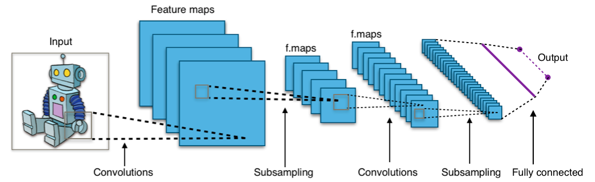{width="70%" fig-alt="Diagram of a full convolutional neural network (LeNet-style) processing a cartoon robot toy image: Input image, through Convolutions to multiple Feature maps, Subsampling to smaller feature maps, another round of Convolutions and Subsampling, then Fully connected layers producing an Output."}

- Full CNN

---

## Hands-on

- Work through mnist_tutorial.ipynb yourself
  - Again, I copied this to [https://github.com/ubsuny/machine-learning-for-physicists](https://github.com/ubsuny/machine-learning-for-physicists); you can git pull, or just direct download with your browser.
  - Or, download directly from [https://flax.readthedocs.io/en/stable/mnist_tutorial.html](https://flax.readthedocs.io/en/stable/mnist_tutorial.html)
- Once you have it running, try to get a better accuracy!
  - Increase kernel size or number of features; increase size of dense layers
  - Change batch size, number of iterations
  - Harder: manually distort the images (e.g. add some noise; see 04_tutorial_MNIST.ipynb)

---

# Part 3: Unsupervised learning

---

## Unsupervised learning

- So far, we have studied supervised learning:
  - Training data comes with specific labels
  - Use labels to create a cost function, then minimize the cost function.
- Unsupervised learning deals with problems where you don't have labels:

---

## Unsupervised learning

{width="70%" fig-alt="Screenshot of a Google Photos 'People & Pets' page (search 'Mexico'): a grid of face-recognition thumbnails showing many different individuals and one cat, with the left sidebar showing Photos, Albums, Documents, Favorites, People & pets, Places, Videos, etc."}

- Google Photos identifies unique faces in the datasets

---

## Unsupervised learning

- "Unsupervised learning aims for the algorithm to uncover patterns and structures in a data set without your guidance beforehand. Essentially, you give the algorithm a data set, and it must identify any inherent relationships, similarities, or differences between the data points." ([coursera](https://www.coursera.org/articles/unsupervised-learning))

---

## Unsupervised learning

- Clustering algorithms

---

## Clustering

- Goal: given $N$ data points, divide them into $k$ partitions:

- References:
  - [https://www-users.cs.umn.edu/~kumar001/dmbook/ch8.pdf](https://www-users.cs.umn.edu/~kumar001/dmbook/ch8.pdf)
  - [https://en.wikipedia.org/wiki/Cluster_analysis](https://en.wikipedia.org/wiki/Cluster_analysis)

{width="70%" fig-alt="Four-panel figure showing clustering of the same set of points: (a) Original points (plain dots), (b) Two clusters (split into squares and triangles), (c) Four clusters (split into plus-signs, upside-down triangles, stars, and diamonds), (d) Six clusters (further subdivided, adding circles and squares) - illustrating that 'clustering' depends on the chosen number of clusters."}

- Clustering into different numbers of clusters

---

## Clustering

<!-- TODO: complex slide layout (flagged by detect_complex_slide.py - see run log). Content below is complete but UNARRANGED - needs manual layout to match the original slide. -->

- Uses:
  - Summarize / compress “spatial” information
  - Find nearest neighbors
- Types of clustering algorithms:
  - Exclusive:
    - Partitional: divide into k exclusive categories
    - Hierarchical: can have sub-clusters
  - Non-exclusive:
    - Add same element to more than one cluster
  - Fuzzy:
    - Weight elements according to cluster
  - Each can be either complete or partial

{fig-alt="Four-panel figure showing clustering of the same set of points: (a) Original points (plain dots), (b) Two clusters (split into squares and triangles), (c) Four clusters (split into plus-signs, upside-down triangles, stars, and diamonds), (d) Six clusters (further subdivided, adding circles and squares) - illustrating that 'clustering' depends on the chosen number of clusters."}

{fig-alt="Four-panel figure showing clustering of the same set of points: (a) Original points (plain dots), (b) Two clusters (split into squares and triangles), (c) Four clusters (split into plus-signs, upside-down triangles, stars, and diamonds), (d) Six clusters (further subdivided, adding circles and squares) - illustrating that 'clustering' depends on the chosen number of clusters."}

{fig-alt="Four-panel figure showing clustering of the same set of points: (a) Original points (plain dots), (b) Two clusters (split into squares and triangles), (c) Four clusters (split into plus-signs, upside-down triangles, stars, and diamonds), (d) Six clusters (further subdivided, adding circles and squares) - illustrating that 'clustering' depends on the chosen number of clusters."}

{fig-alt="Four-panel figure showing clustering of the same set of points: (a) Original points (plain dots), (b) Two clusters (split into squares and triangles), (c) Four clusters (split into plus-signs, upside-down triangles, stars, and diamonds), (d) Six clusters (further subdivided, adding circles and squares) - illustrating that 'clustering' depends on the chosen number of clusters."}

- w11=0.99,w12=0.01
- Partitional
- Hierarchical
- Non-exclusive
- Fuzzy
- Types of clustering algorithms

---

## Clustering

<!-- TODO: complex slide layout (flagged by detect_complex_slide.py - see run log). Content below is complete but UNARRANGED - needs manual layout to match the original slide. -->

- Uses:
  - Summarize / compress “spatial” information
  - Find nearest neighbors
- Types of clustering algorithms:
  - Exclusive:
    - Partitional: divide into k exclusive categories
    - Hierarchical: can have sub-clusters
  - Non-exclusive:
    - Add same element to more than one cluster
  - Fuzzy:
    - Weight elements according to cluster
  - Each can be either complete or partial

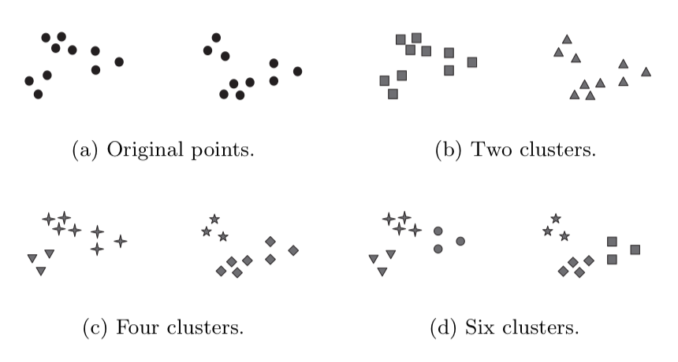{fig-alt="Four-panel figure showing clustering of the same set of points: (a) Original points (plain dots), (b) Two clusters (split into squares and triangles), (c) Four clusters (split into plus-signs, upside-down triangles, stars, and diamonds), (d) Six clusters (further subdivided, adding circles and squares) - illustrating that 'clustering' depends on the chosen number of clusters."}

{fig-alt="Four-panel figure showing clustering of the same set of points: (a) Original points (plain dots), (b) Two clusters (split into squares and triangles), (c) Four clusters (split into plus-signs, upside-down triangles, stars, and diamonds), (d) Six clusters (further subdivided, adding circles and squares) - illustrating that 'clustering' depends on the chosen number of clusters."}

{fig-alt="Four-panel figure showing clustering of the same set of points: (a) Original points (plain dots), (b) Two clusters (split into squares and triangles), (c) Four clusters (split into plus-signs, upside-down triangles, stars, and diamonds), (d) Six clusters (further subdivided, adding circles and squares) - illustrating that 'clustering' depends on the chosen number of clusters."}

{fig-alt="Four-panel figure showing clustering of the same set of points: (a) Original points (plain dots), (b) Two clusters (split into squares and triangles), (c) Four clusters (split into plus-signs, upside-down triangles, stars, and diamonds), (d) Six clusters (further subdivided, adding circles and squares) - illustrating that 'clustering' depends on the chosen number of clusters."}

- w11=0.99,w12=0.01
- Partitional
- Hierarchical
- Non-exclusive
- Fuzzy
- Types of clustering algorithms
{fig-alt="Film still of a man in a dress shirt and tie sitting in an airplane seat, looking concerned - a decorative/joke image, not course content."}

- Clustering of clustering algorithms 😮

---

## Defining a "cluster"

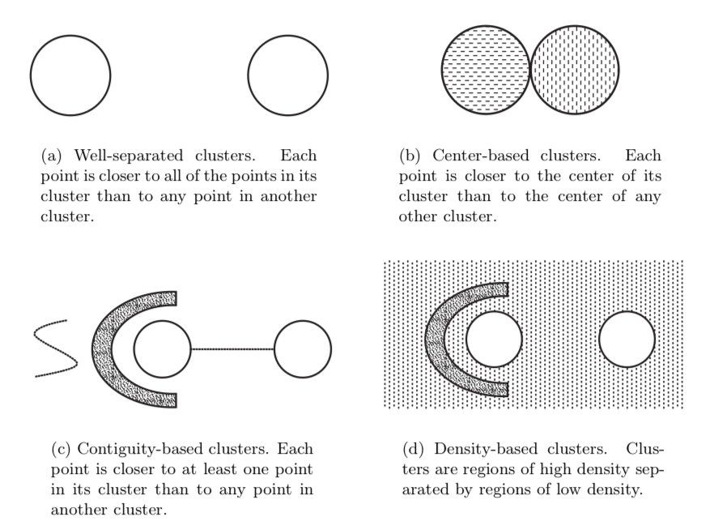{width="70%" fig-alt="Four-panel figure illustrating different notions of a cluster: (a) Well-separated clusters (two separate circles), (b) Center-based clusters (two overlapping shaded circles), (c) Contiguity-based clusters (a crescent, circles, and a wavy line connected as one cluster), (d) Density-based clusters (shapes distinguished by dot-density shading against a dense background)."}

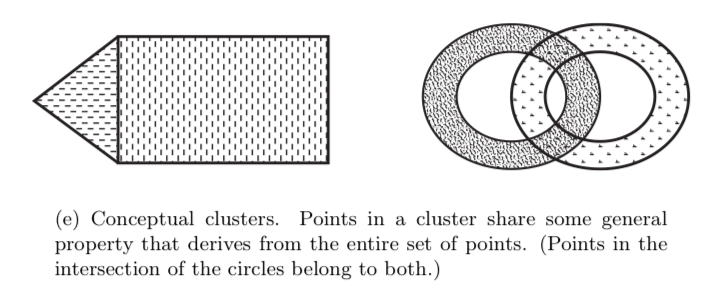{width="70%" fig-alt="Two-panel figure: (e) Conceptual clusters - an arrow shape and a rectangle sharing a hatching pattern (left), and two overlapping ring-shaped clusters sharing points in their intersection (right); captioned that points in a cluster share some general property, and points in the intersection belong to both."}

- Different definitions of clusters

---

## Clustering algorithms

- Popular clustering algorithms:
  - $k$-means
    - Partition into k clusters using mean central values (usually exclusively)
  - Agglomerative hierarchical clustering
    - Pair individual elements into clusters given some distance metric
  - Density based scan (DBSCAN)
    - Considers low-density regions to be noise
    - Not exclusive clustering
    - See: Dr. Martin Kwok's [colloquium](https://indico.fnal.gov/event/68002/contributions/308390/attachments/186176/256468/MDS_WineAndCheese_v4.pdf) from last semester (long-lived particle search using muon detector showers)

---

## $k$-means algorithm

- Algorithm 8.1 Basic $k$-means algorithm
  - Select $k$ points as initial centroids
  - REPEAT:
    - Form $k$ clusters by assigning each point to the nearest centroid
    - Recompute centroid of each cluster
  - UNTIL:
    - Centroids do not change

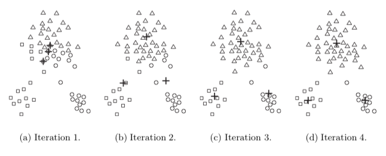{width="70%" fig-alt="Four-panel figure titled illustrating k-means algorithm iterations: scattered triangle, square, and circle markers with three '+' centroid markers repositioning across Iteration 1 through Iteration 4, converging toward the center of each natural group of points."}

- Cartoon of k-means clustering algorithm

---

## $k$-means algorithm

- What is $k$-means computing?
  - Formally, consider the following RMS:
  - $${\text{RMS}}^{2}=\mathop{\mathop{ \sum }\limits_{i=1}}\limits^{k}\mathop{\mathop{ \sum }\limits_{j=1}}\limits^{n}|{\vec{c}}_{i}-{\vec{x}}_{j}{|}^{2}$$
  - Minimize the RMS by adjusting the centroids
  - Note: can use other distance metrics besides Euclidean
- The computational complexity of $k$-means is $ \approx $linear in the sum of:
  - Number of points
  - Number of dimensions (=attributes)
  - Number of clusters
  - Number of iterations to converge

---

## Bisecting $k$-means

- Shortcomings of basic $k$-means:
  - As with all iterative minimization routines, watch out for local minima (need heuristic methods to avoid getting trapped)
  - Can produce empty clusters if initialized poorly!
  - Very sensitive to outliers
- Bisecting $k$-means mitigates the "cons" by splitting and merging clusters:
- Initialize list of clusters to [cluster containing all points]
- do:
  - Choose random cluster from the list of clusters
  - for i in range(n_trials):
    - Bisect selected cluster using $k$-means
    - Compute RMS of bisected cluster
  - Choose pair of smaller clusters with lowest RMS
  - Replace original cluster with pair of smaller clusters
- until we have $k$ clusters

---

## Voronoi diagrams

- The result of $k$-means is a [Voronoi diagram](https://en.wikipedia.org/wiki/Voronoi_diagram)
  - Given a set of centroids (points), partition space into regions corresponding to (closest to a given point)
- "Cachement areas": from river basins, water tables, etc... where does water pool when it rains?
- See CompPhys/DataScience/kmeans.ipynb for an example
  - Relevant for Midterm Problem 2!

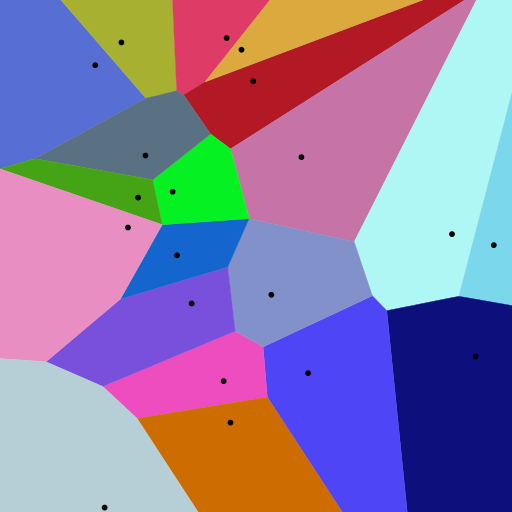{width="70%" fig-alt="Colorful Voronoi diagram: the plane divided into irregular polygonal cells, each a different color, with a black dot (the generating point) inside each cell."}

- Voronoi diagram

---

## Hierarchical clustering

- Agglomerative clustering ("bottom up"):
  - Start with individual constituents, merge iteratively until termination condition
- Divise clustering ("top down"):
  - Start with everything, split iteratively until termination condition (e.g. reach individual constituents)
- Results can be represented by a tree-like structure (aka dendrogram) or a Venn diagram.

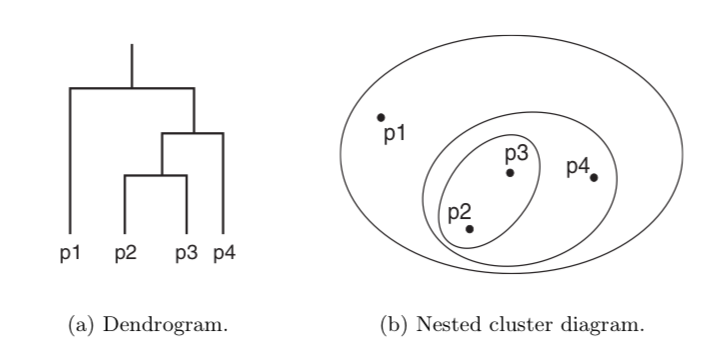{width="70%" fig-alt="Two-panel figure titled 'Hierarchical clustering': (a) a dendrogram merging points p1, p2, p3, p4 in stages up to a single root; (b) the equivalent nested-cluster (Venn-style) diagram, with p2 and p3 nested inside a cluster with p4, all nested inside a larger cluster also containing p1."}

- Dendrogram and Venn diagram

---

## Hierarchical clustering

<!-- TODO: complex slide layout (flagged by detect_complex_slide.py - see run log). Content below is complete but UNARRANGED - needs manual layout to match the original slide. -->

- Naively, hierarchical clustering is $O({N}^{3})$!

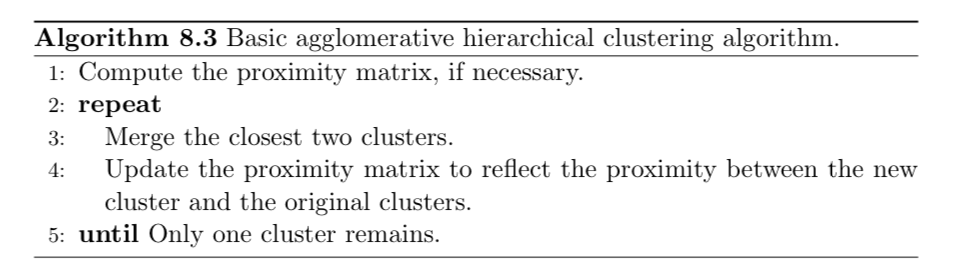{fig-alt="Text box titled 'Algorithm 8.3 Basic agglomerative hierarchical clustering algorithm': 1) Compute the proximity matrix, if necessary; 2) repeat; 3) Merge the closest two clusters; 4) Update the proximity matrix to reflect the proximity between the new cluster and the original clusters; 5) until Only one cluster remains."}

- Pseudocode of hierarchical clustering
- ... or is it? [https://arxiv.org/pdf/hep-ph/0512210](https://arxiv.org/pdf/hep-ph/0512210)

- $O({N}^{2})$, done once

- $$O(1)$$

- $$O({N}^{2})$$

- $N$ times

---

## Fastjet algorithm

- The famous FastJet algorithm reduces $O({N}^{3})$ to $O(NlnN)$.
  - Particle physicists think this is pretty cool, but computation geometers have studied this for much longer!
- Basic idea: instead of full $N \times N$ distance matrix, pre-compute a list of nearest neighbors for each point (length $N$).
  - Each step merges 2 points
  - We only have to check if the new point changes any nearest neighbors: $N$ operations
  - $$ \Rightarrow O({N}^{2})$$
- Further speedup: use Voronoi diagrams to find nearest neighbors (see [paper](https://arxiv.org/pdf/hep-ph/0512210)) to get $O(NlnN)$.

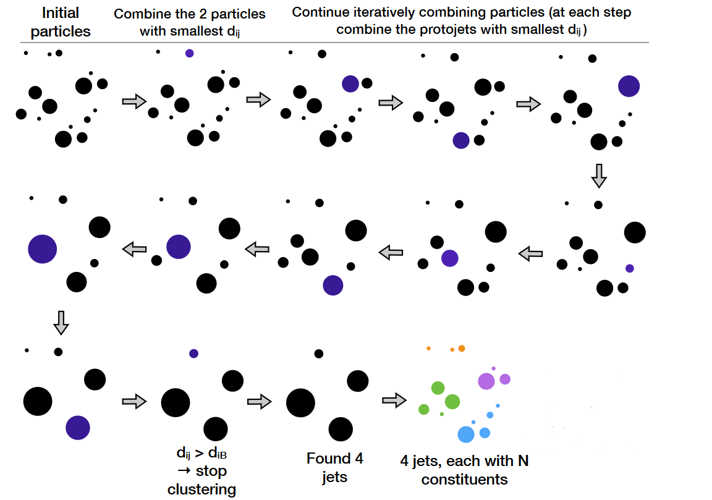{width="70%" fig-alt="Step-by-step diagram of the Fastjet clustering algorithm: starting from initial particles (dots of varying size representing momentum), the two closest particles (smallest d_ij) are repeatedly combined into larger 'protojets' (highlighted purple/black), continuing until d_ij > d_iB stops the clustering, ending with 4 found jets, each containing several original particles (shown color-coded by jet membership)."}

- Anti-${k}_{T}$ jet clustering algorithm

---

## Example: genetic clustering

<!-- TODO: complex slide layout (flagged by detect_complex_slide.py - see run log). Content below is complete but UNARRANGED - needs manual layout to match the original slide. -->

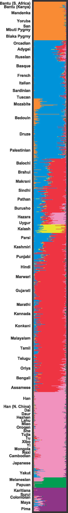{fig-alt="Population-genetics ADMIXTURE-style stacked bar plot: many individuals (thin vertical bars) grouped by population/ethnicity label (Bantu, Yoruba, San, Orcadian, Russian, Basque, Bedouin, Druze, Palestinian, Balochi, Sindhi, Pathan, Hazara, Uygur, Kalash, Punjabi, Hindi, Gujarati, Han, Japanese, Melanesian, Papuan, Karitiana, Maya, Pima, etc.), each bar colored by estimated ancestry-cluster proportions (orange, blue, red, pink, yellow, green, purple)."}

{fig-alt="Population-genetics ADMIXTURE-style stacked bar plot: many individuals (thin vertical bars) grouped by population/ethnicity label (Bantu, Yoruba, San, Orcadian, Russian, Basque, Bedouin, Druze, Palestinian, Balochi, Sindhi, Pathan, Hazara, Uygur, Kalash, Punjabi, Hindi, Gujarati, Han, Japanese, Melanesian, Papuan, Karitiana, Maya, Pima, etc.), each bar colored by estimated ancestry-cluster proportions (orange, blue, red, pink, yellow, green, purple)."}

- Genetic clustering

---

## Example: galaxy clusters

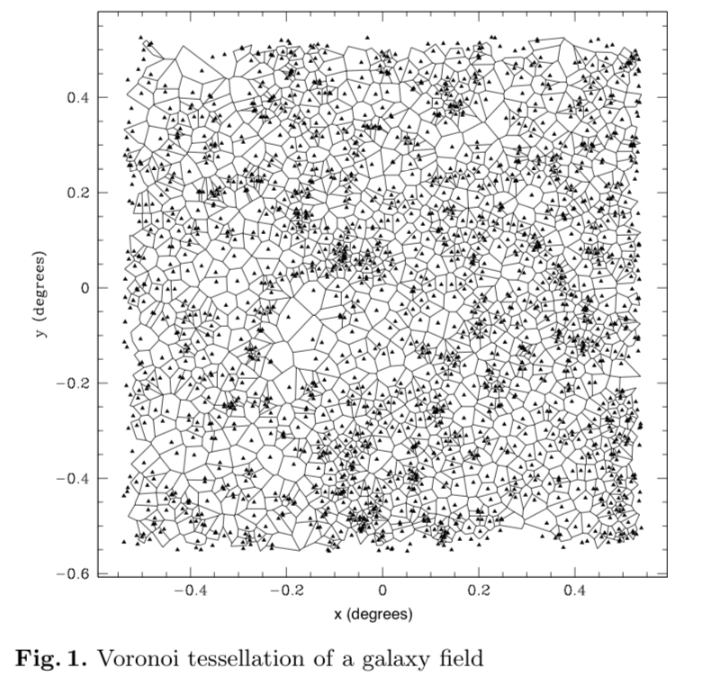{width="70%" fig-alt="Figure 1, 'Voronoi tessellation of a galaxy field': a dense Voronoi diagram over a square region (x, y in degrees, -0.5 to 0.5), with small triangular markers (galaxies) at cell centers and thin white cell-boundary lines throughout."}

- Fig. 1. Voronoi tessellation of a galaxy field
- Finding galaxy clusters using Voronoi tessellations
  - [https://www.aanda.org/articles/aa/pdf/2001/12/aa10522.pdf](https://www.aanda.org/articles/aa/pdf/2001/12/aa10522.pdf)

---

## Example: hadronic jet clustering

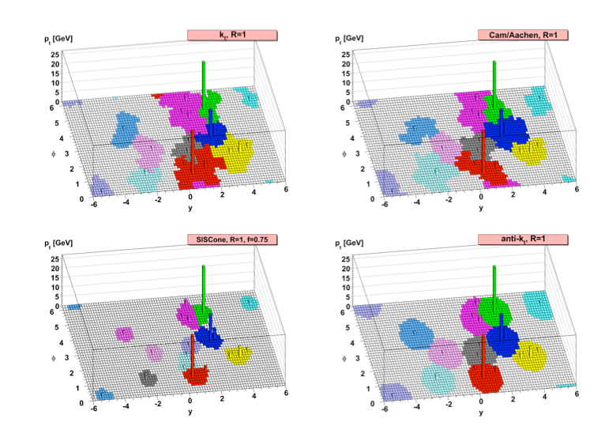{width="70%" fig-alt="Four 3D bar-chart panels comparing hadronic jet-clustering algorithms (k_t R=1, Cam/Aachen R=1, SISCone R=1 f=0.75, anti-k_t R=1): each shows particle transverse momentum p_t versus rapidity y and azimuthal angle phi, with clustered jets shown as differently-colored humps/plateaus - the anti-k_t and k_t panels show smoother, more circular jet regions than the jagged SISCone result."}

- Jet clustering algorithms
- Numerous jet clustering algorithms on the market
  - ${k}_{T}$, anti-${k}_{T}$, Cambridge–Aarchen, SISCone, ...
- [http://inspirehep.net/record/779080](http://inspirehep.net/record/779080)
- Note different behaviors!

---

## Unsupervised learning

- Autoencoders and PCA

---

## Principal component analysis

- Last time: introduced autoencoders, NNs with a restricted layer (bottleneck or latent space).
  - Restricted layer force NN to learn only "important" features

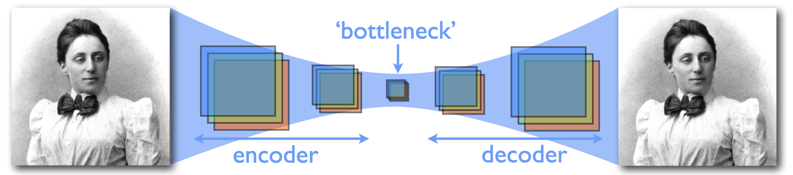{width="70%" fig-alt="Diagram of an autoencoder applied to image compression: a portrait photo (left) passes through a shrinking 'encoder' stack of nested colored squares down to a small 'bottleneck' representation, then through an expanding 'decoder' stack back up to a reconstructed portrait photo (right, nearly identical to the original)."}

- Autoencoder schematic
- [F. Marquardt, Machine Learning for Physicists 2024](https://pad.gwdg.de/s/ZwIoM-Arn)

---

## Principal component analysis

- Last time: introduced autoencoders, NNs with a restricted layer (bottleneck or latent space).
  - Restricted layer force NN to learn only "important" features
- This is closely related to principal component analysis: a technique for determining the most important "axes" in a given dataset
  - In other words, identify the linear combinations of features with the most variance.
  - Often, you can reduce to the dimensionality of a dataset using only the top X% most interesting features.

{width="70%" fig-alt="Scatter plot of a cloud of correlated 2D data points (gray, roughly diagonal ellipse from bottom-left to top-right), with two black arrows from the cluster's center pointing along the two principal component directions (one along the main diagonal spread, one perpendicular to it)."}

- PCA of a multivariate Gaussian distribution centered at (1, 3) with a standard deviation of 3 in roughly the (0.866, 0.5) direction and of 1 in the orthogonal direction. The vectors shown are the eigenvectors of the covariance matrix scaled by the square root of the corresponding eigenvalue, and shifted so their tails are at the mean.

---

## Principal component analysis

<!-- TODO: complex slide layout (flagged by detect_complex_slide.py - see run log). Content below is complete but UNARRANGED - needs manual layout to match the original slide. -->

- Last time: introduced autoencoders, NNs with a restricted layer (bottleneck or latent space).
  - Restricted layer force NN to learn only "important" features
- This is closely related to principal component analysis: a technique for determining the most important "axes" in a given dataset
  - In other words, identify the linear combinations of features with the most variance.
  - Often, you can reduce to the dimensionality of a dataset using only the top X% most interesting features.

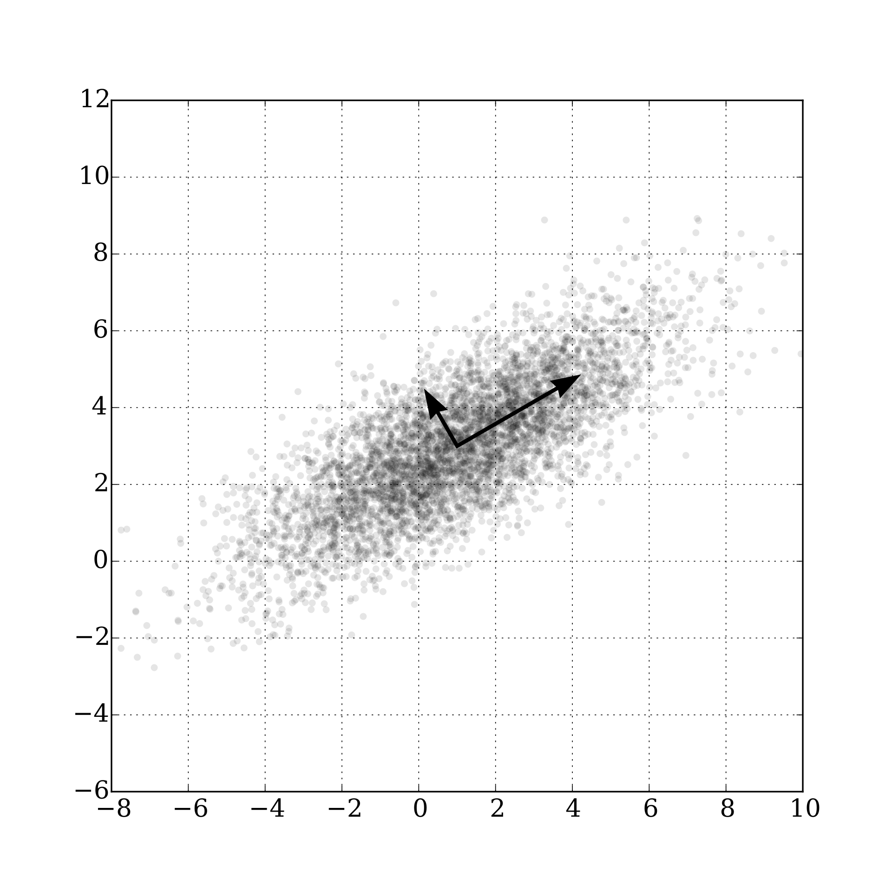{fig-alt="Scatter plot of a cloud of correlated 2D data points (gray, roughly diagonal ellipse from bottom-left to top-right), with two black arrows from the cluster's center pointing along the two principal component directions (one along the main diagonal spread, one perpendicular to it)."}

- PCA of a multivariate Gaussian distribution centered at (1, 3) with a standard deviation of 3 in roughly the (0.866, 0.5) direction and of 1 in the orthogonal direction. The vectors shown are the eigenvectors of the covariance matrix scaled by the square root of the corresponding eigenvalue, and shifted so their tails are at the mean.
- Age

- Height

---

## Principal component analysis

- Given a dataset with $N$ features,${{X}^{i}}$, and $m$ points:
  - Standardize each feature: scale to have mean ${\overline{x}}^{i}$=0 and $ \sigma =1$.
  - Compute covariance matrix:
- PCA is easy from here: PCs are just the eigenvectors of ${\text{cov}}_{ij}$, ranked by the eigenvalues!
  - Specifically: ${\text{cov}}_{ij}$ is real and symmetric, so we can write it as $ED{E}^{T}$, where $E$ is the eigenvector column matrix and $D$ is diagonal matrix of eigenvalues.
  - $E$ encodes a rotation to a basis where (a) the covariance matrix is diagonal, and (b) the variance of the new basis vectors is given by the eigenvalues in $D$.

- $${\text{cov}}_{ij}=\frac{1}{m-1}\mathop{\mathop{ \sum }\limits_{k=1}}\limits^{m}({x}_{k}^{i}-{\overline{x}}^{i})({X}_{k}^{j}-{\overline{x}}^{j})$$

- [https://cybernetist.com/2016/04/12/principal-component-analysis-part-2/](https://cybernetist.com/2016/04/12/principal-component-analysis-part-2/)

---

## Principal component analysis

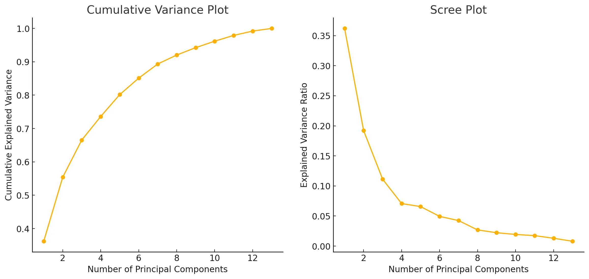{width="70%" fig-alt="Two-panel figure: 'Cumulative Variance Plot' (left) showing cumulative explained variance rising from about 0.36 to 1.0 as the number of principal components increases from 1 to 13; 'Scree Plot' (right) showing the explained variance ratio per component dropping sharply from about 0.36 at component 1 to near 0 by component 13."}

- Cumulative variance and individual variance vs. PCA component
- [https://medium.com/@sahin.samia/principal-component-analysis-pca-made-easy-a-complete-hands-on-guide-e26a3680c0bc](https://medium.com/@sahin.samia/principal-component-analysis-pca-made-easy-a-complete-hands-on-guide-e26a3680c0bc)
- [F. Marquardt, Machine Learning for Physicists 2024](https://pad.gwdg.de/s/ZwIoM-Arn)

---

## AEs and PCA

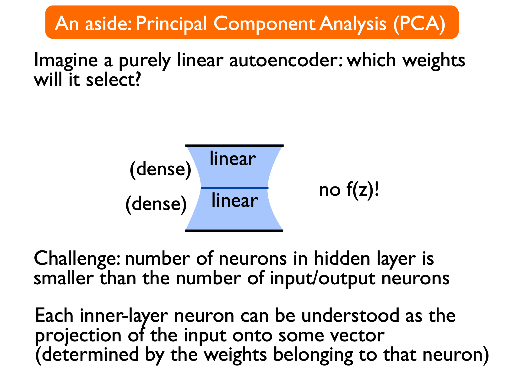{width="70%" fig-alt="Slide titled 'An aside: Principal Component Analysis (PCA)': asks what weights a purely linear autoencoder would select, illustrated with a bottleneck diagram of two 'linear (dense)' encoder/decoder stages and 'no f(z)!' noted; text below notes the hidden layer has fewer neurons than the input/output, and each inner-layer neuron can be understood as a projection of the input onto some weight vector."}

- [F. Marquardt, Machine Learning for Physicists 2024](https://pad.gwdg.de/s/ZwIoM-Arn)
- [F. Marquardt, Machine Learning for Physicists 2024](https://pad.gwdg.de/s/ZwIoM-Arn)

---

## AEs and PCA

<!-- TODO: complex slide layout (flagged by detect_complex_slide.py - see run log). Content below is complete but UNARRANGED - needs manual layout to match the original slide. -->

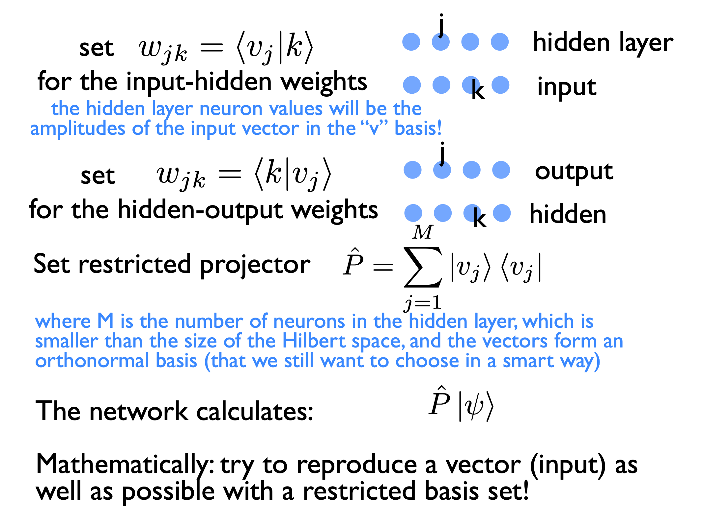{fig-alt="Diagram relating PCA to a linear autoencoder in bra-ket notation: input-hidden weights set as w_jk = <v_j|k>, hidden-output weights set as w_jk = <k|v_j>, node diagrams for hidden layer/input and output/hidden layer with indices j, k labeled, the restricted projector P-hat = sum_{j=1}^{M} |v_j><v_j| (M = number of hidden neurons), and the network's computed output P-hat|psi>."}

- [F. Marquardt, Machine Learning for Physicists 2024](https://pad.gwdg.de/s/ZwIoM-Arn)
- Note: for simplicity, $| \psi ⟩$ is normalized here, but this generalizes to any vector

- [F. Marquardt, Machine Learning for Physicists 2024](https://pad.gwdg.de/s/ZwIoM-Arn)

---

## AEs and PCA

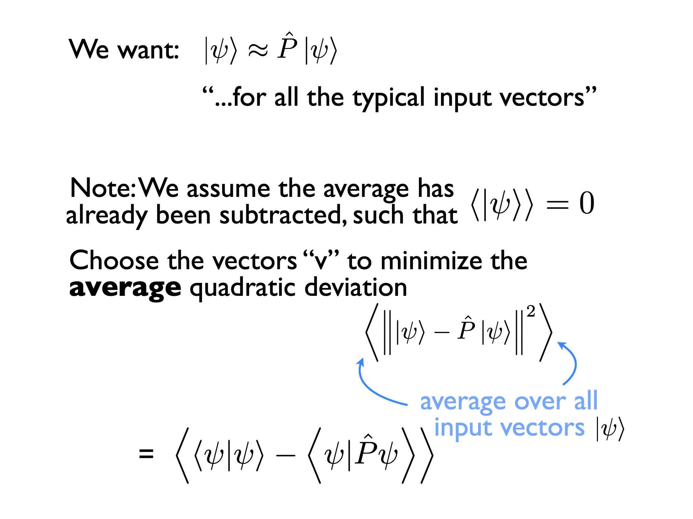{width="70%" fig-alt="Slide stating the PCA objective: we want |psi> ~ P-hat|psi> for all typical input vectors (assuming the average <|psi>> = 0), by choosing the vectors 'v' to minimize the average quadratic deviation <||psi> - P-hat|psi>||^2> = <<psi|psi> - <psi|P-hat psi>>."}

- [F. Marquardt, Machine Learning for Physicists 2024](https://pad.gwdg.de/s/ZwIoM-Arn)
- [F. Marquardt, Machine Learning for Physicists 2024](https://pad.gwdg.de/s/ZwIoM-Arn)

---

## AEs and PCA

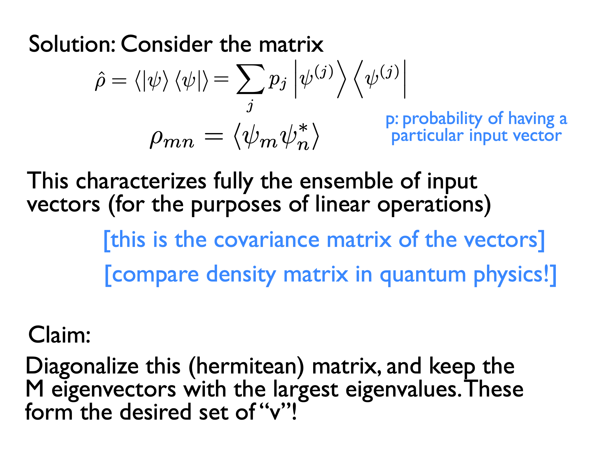{width="70%" fig-alt="Slide titled 'Solution: Consider the matrix': defines rho-hat = <|psi><psi|> = sum_j p_j |psi^(j)><psi^(j)|, with rho_mn = <psi_m psi_n*>, noted as the covariance matrix of the vectors (compare density matrix in quantum physics); claims diagonalizing this Hermitian matrix and keeping the M eigenvectors with the largest eigenvalues gives the desired set of 'v'."}

- [F. Marquardt, Machine Learning for Physicists 2024](https://pad.gwdg.de/s/ZwIoM-Arn)
- [F. Marquardt, Machine Learning for Physicists 2024](https://pad.gwdg.de/s/ZwIoM-Arn)

---

## AEs and PCA

<!-- TODO: complex slide layout (flagged by detect_complex_slide.py - see run log). Content below is complete but UNARRANGED - needs manual layout to match the original slide. -->

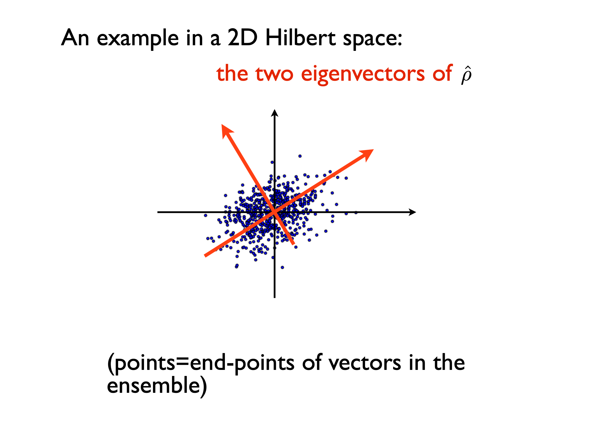{fig-alt="Slide titled 'An example in a 2D Hilbert space: the two eigenvectors of rho-hat': a scatter plot of a diagonal cloud of blue data points with two red arrows through the origin marking the two eigenvector directions of the covariance matrix; captioned 'points = end-points of vectors in the ensemble'."}

- [F. Marquardt, Machine Learning for Physicists 2024](https://pad.gwdg.de/s/ZwIoM-Arn)
- As promised, this is exactly PCA!
- Real AEs add in nonlinearity

- [F. Marquardt, Machine Learning for Physicists 2024](https://pad.gwdg.de/s/ZwIoM-Arn)

---

## PCA and MNIST

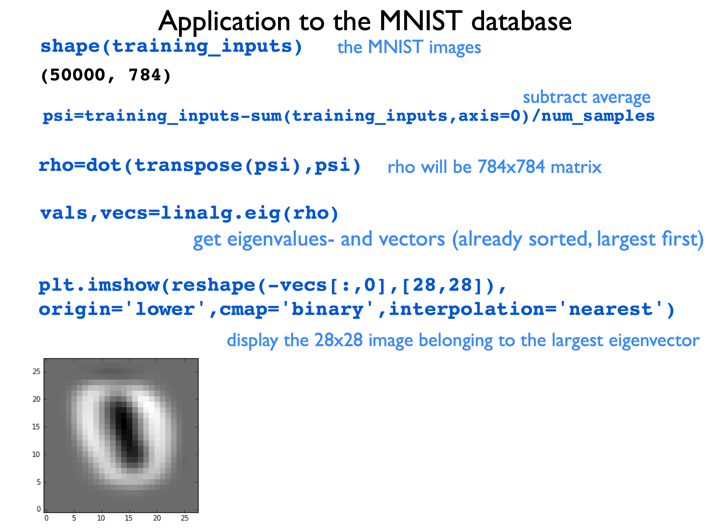{width="70%" fig-alt="Slide titled 'Application to the MNIST database': Python code computing shape(training_inputs)=(50000,784), subtracting the average (psi=...), forming the covariance matrix rho=dot(transpose(psi),psi) (784x784), calling vals,vecs=linalg.eig(rho), and displaying the 28x28 image of the largest eigenvector - shown below as a blurry image resembling a '1' with a halo."}

- [F. Marquardt, Machine Learning for Physicists 2024](https://pad.gwdg.de/s/ZwIoM-Arn)
- [F. Marquardt, Machine Learning for Physicists 2024](https://pad.gwdg.de/s/ZwIoM-Arn)

---

## PCA and MNIST

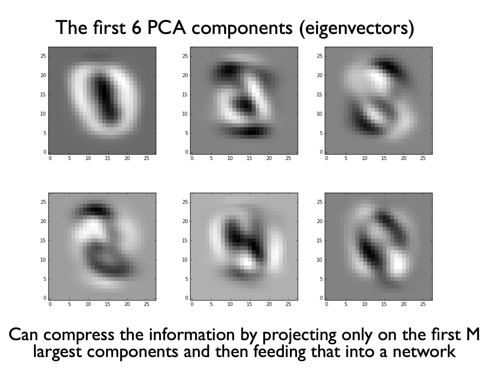{width="70%" fig-alt="Slide titled 'The first 6 PCA components (eigenvectors)': a 2x3 grid of blurry 28x28 grayscale images, each resembling ghostly superpositions of digit shapes (loops and strokes), captioned that projecting onto the first M components lets you compress the information before feeding it into a network."}

- [F. Marquardt, Machine Learning for Physicists 2024](https://pad.gwdg.de/s/ZwIoM-Arn)
- [F. Marquardt, Machine Learning for Physicists 2024](https://pad.gwdg.de/s/ZwIoM-Arn)

---

## PCA and MNIST

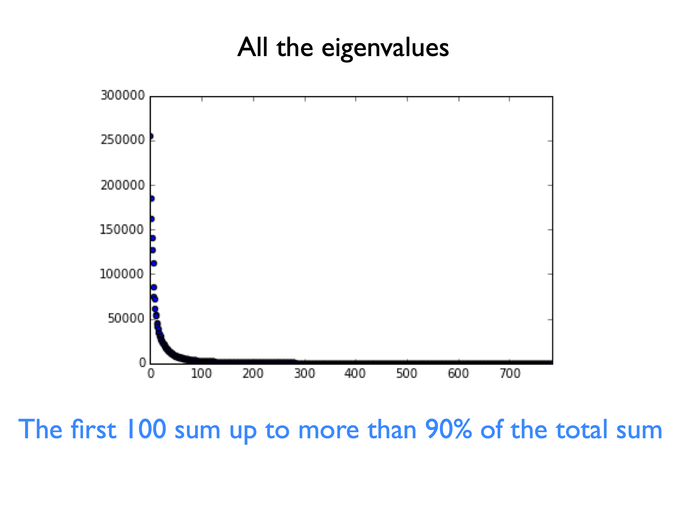{width="70%" fig-alt="Plot titled 'All the eigenvalues': eigenvalue magnitude (0 to 300000) versus index (0 to ~780), showing a steep drop from about 250000 at index 0 to near 0 by index 100, then a long near-flat tail; captioned 'The first 100 sum up to more than 90% of the total sum'."}

- [F. Marquardt, Machine Learning for Physicists 2024](https://pad.gwdg.de/s/ZwIoM-Arn)
- [F. Marquardt, Machine Learning for Physicists 2024](https://pad.gwdg.de/s/ZwIoM-Arn)

---

## Unsupervised learning

- Visualizing the latent space

---

## Visualizing latent space

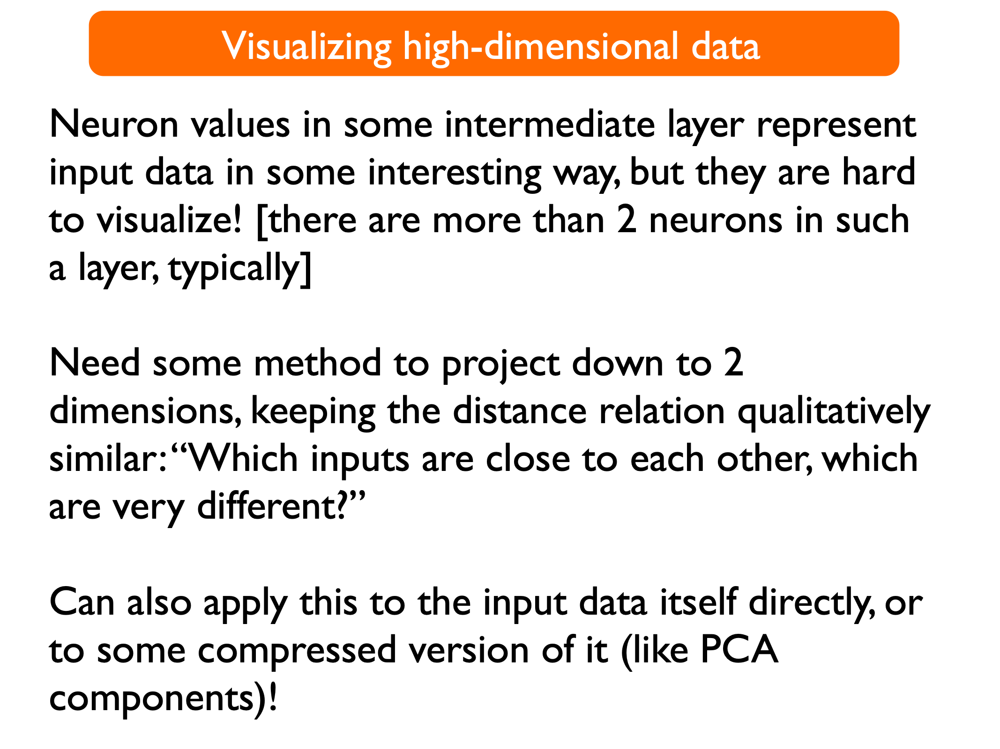{width="70%" fig-alt="Slide titled 'Visualizing high-dimensional data': text explaining that intermediate-layer neuron values are hard to visualize directly (more than 2 neurons typically), so a method is needed to project down to 2 dimensions while qualitatively preserving distance relations, applicable either to the raw input data or to a compressed version like PCA components."}

- [F. Marquardt, Machine Learning for Physicists 2024](https://pad.gwdg.de/s/ZwIoM-Arn)
- [F. Marquardt, Machine Learning for Physicists 2024](https://pad.gwdg.de/s/ZwIoM-Arn)

---

## MNIST visualization

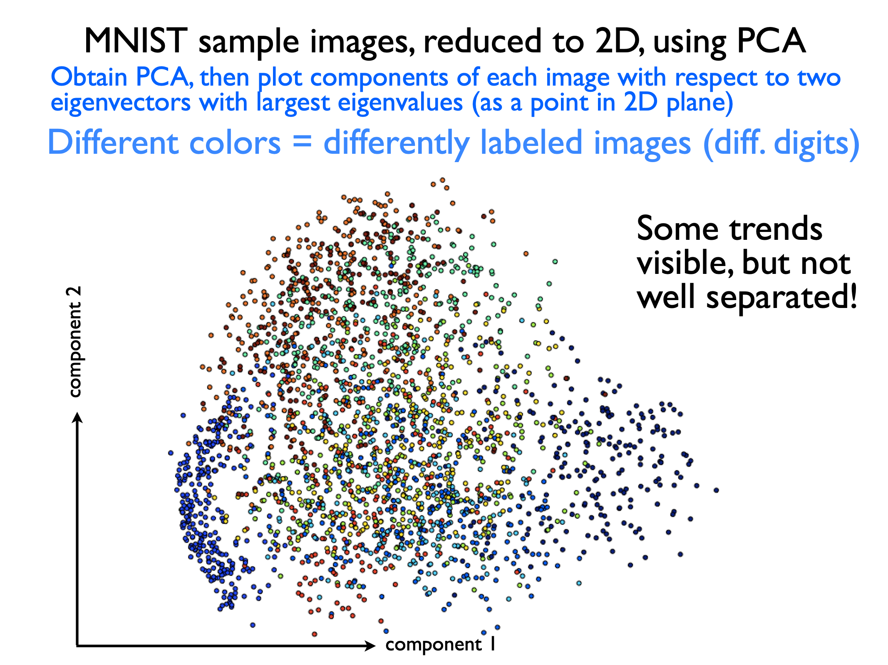{width="70%" fig-alt="Slide titled 'MNIST sample images, reduced to 2D, using PCA': a scatter plot of many colored points (colored by digit label) projected onto the top two PCA components, forming one large overlapping blob with only weak color separation; captioned 'Some trends visible, but not well separated!'."}

- [F. Marquardt, Machine Learning for Physicists 2024](https://pad.gwdg.de/s/ZwIoM-Arn)
- [F. Marquardt, Machine Learning for Physicists 2024](https://pad.gwdg.de/s/ZwIoM-Arn)

---

## MNIST visualization

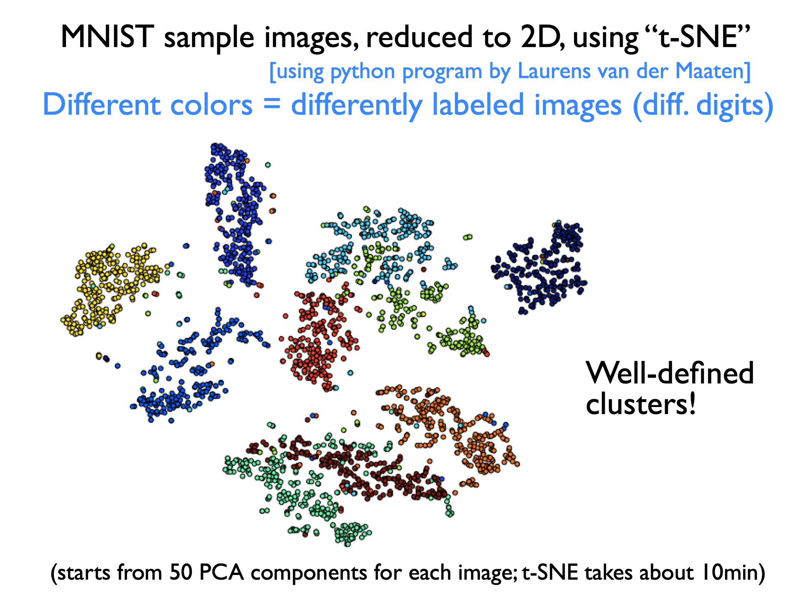{width="70%" fig-alt="Slide titled 'MNIST sample images, reduced to 2D, using 't-SNE'': a scatter plot of colored points (colored by digit label) forming several distinct, well-separated colored clusters; captioned 'Well-defined clusters!' and noting it starts from 50 PCA components and takes about 10 minutes to compute."}

- [F. Marquardt, Machine Learning for Physicists 2024](https://pad.gwdg.de/s/ZwIoM-Arn)
- [F. Marquardt, Machine Learning for Physicists 2024](https://pad.gwdg.de/s/ZwIoM-Arn)

---

## Dimensionality reduction, again

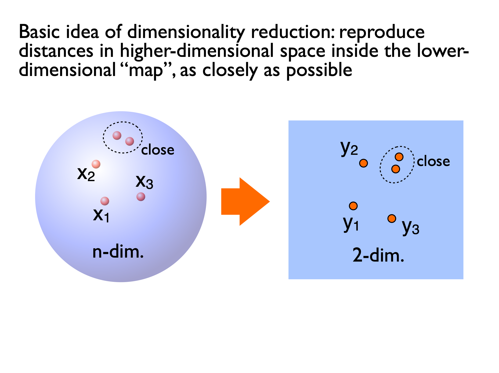{width="70%" fig-alt="Slide titled 'Basic idea of dimensionality reduction: reproduce distances in higher-dimensional space inside the lower-dimensional 'map', as closely as possible': a 3D sphere (n-dim.) containing points x1, x2, x3 with x2/x3 marked 'close', mapped by an arrow to a 2D square (2-dim.) containing corresponding points y1, y2, y3 with y2/y3 still marked 'close'."}

- [F. Marquardt, Machine Learning for Physicists 2024](https://pad.gwdg.de/s/ZwIoM-Arn)
- [F. Marquardt, Machine Learning for Physicists 2024](https://pad.gwdg.de/s/ZwIoM-Arn)

---

## Dimensionality reduction, again

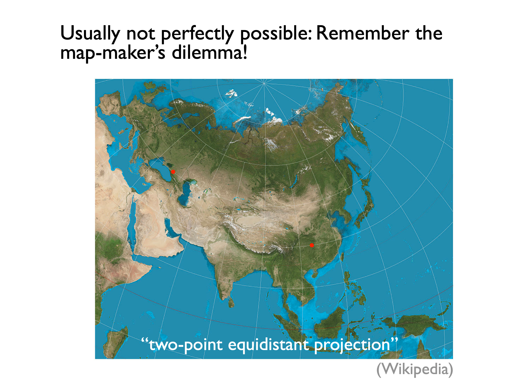{width="70%" fig-alt="Slide titled 'Usually not perfectly possible: Remember the map-maker's dilemma!': a satellite map of Asia with two red dots (near the Caucasus and near eastern China) connected by great-circle-like grid lines, labeled 'two-point equidistant projection' (source: Wikipedia)."}

- [F. Marquardt, Machine Learning for Physicists 2024](https://pad.gwdg.de/s/ZwIoM-Arn)
- [F. Marquardt, Machine Learning for Physicists 2024](https://pad.gwdg.de/s/ZwIoM-Arn)

---

## t-SNE

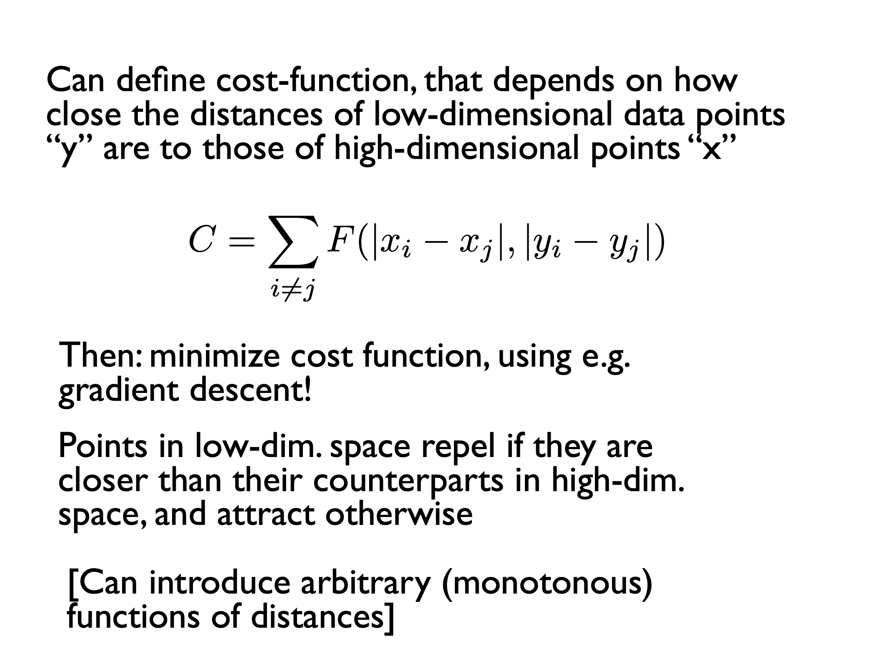{width="70%" fig-alt="Slide explaining a general cost function C = sum_{i!=j} F(|x_i-x_j|, |y_i-y_j|) that depends on how close low-dimensional 'y' distances are to high-dimensional 'x' distances, minimized via gradient descent; notes that low-dim points repel if too close relative to their high-dim counterparts and attract otherwise, and that arbitrary monotonic distance functions can be introduced."}

- [F. Marquardt, Machine Learning for Physicists 2024](https://pad.gwdg.de/s/ZwIoM-Arn)
- [F. Marquardt, Machine Learning for Physicists 2024](https://pad.gwdg.de/s/ZwIoM-Arn)

---

## t-SNE

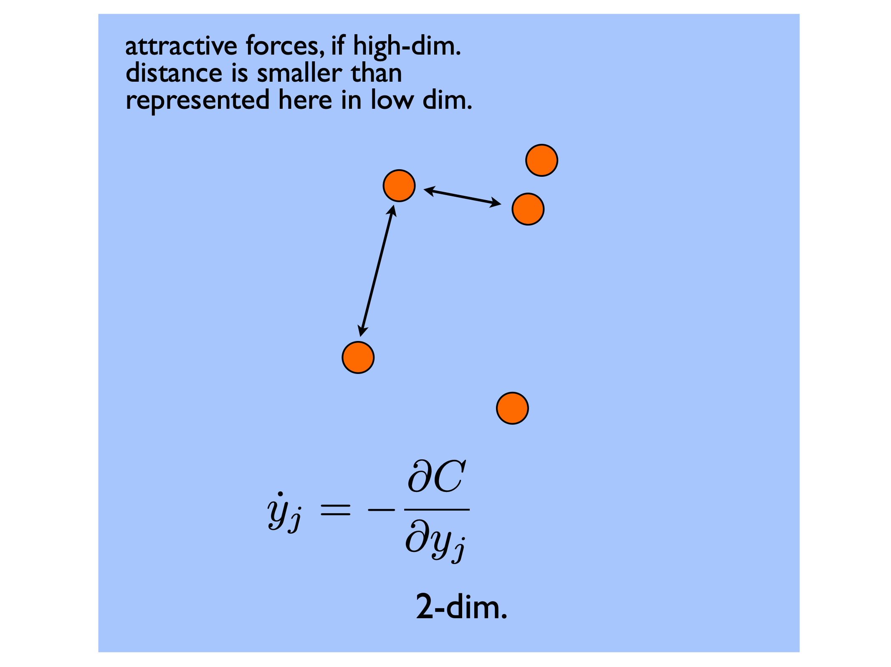{width="70%" fig-alt="Diagram on a blue background titled 'attractive forces, if high-dim. distance is smaller than represented here in low dim.': four orange dots with two double-headed arrows connecting nearby pairs, below the gradient-descent update formula y-dot_j = -dC/dy_j (2-dim.)."}

- [F. Marquardt, Machine Learning for Physicists 2024](https://pad.gwdg.de/s/ZwIoM-Arn)
- [F. Marquardt, Machine Learning for Physicists 2024](https://pad.gwdg.de/s/ZwIoM-Arn)

---

## t-SNE

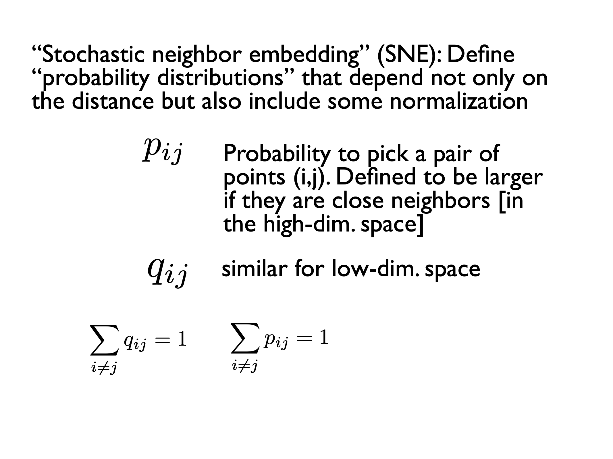{width="70%" fig-alt="Slide titled ''Stochastic neighbor embedding' (SNE)': defines p_ij as the probability of picking a pair of points (i,j), larger for close neighbors in high-dimensional space, and q_ij as the analogous probability in low-dimensional space, with both normalized so sum_{i!=j} p_ij = sum_{i!=j} q_ij = 1."}

- [F. Marquardt, Machine Learning for Physicists 2024](https://pad.gwdg.de/s/ZwIoM-Arn)
- [F. Marquardt, Machine Learning for Physicists 2024](https://pad.gwdg.de/s/ZwIoM-Arn)

---

## t-SNE

{width="70%" fig-alt="Slide titled ''Stochastic neighbor embedding' (SNE)': defines p_ij as the probability of picking a pair of points (i,j), larger for close neighbors in high-dimensional space, and q_ij as the analogous probability in low-dimensional space, with both normalized so sum_{i!=j} p_ij = sum_{i!=j} q_ij = 1."}

- [F. Marquardt, Machine Learning for Physicists 2024](https://pad.gwdg.de/s/ZwIoM-Arn)
- "The similarity of datapoint ${x}_{j}$ to datapoint ${x}_{j}$ is the conditional probability, ${p}_{j|i}$, that ${x}_{i}$ would pick ${x}_{j}$ as its neighbor if neighbors were picked in proportion to their probability density under a Gaussian centered at ${x}_{i}$."

- [F. Marquardt, Machine Learning for Physicists 2024](https://pad.gwdg.de/s/ZwIoM-Arn)

---

## t-SNE

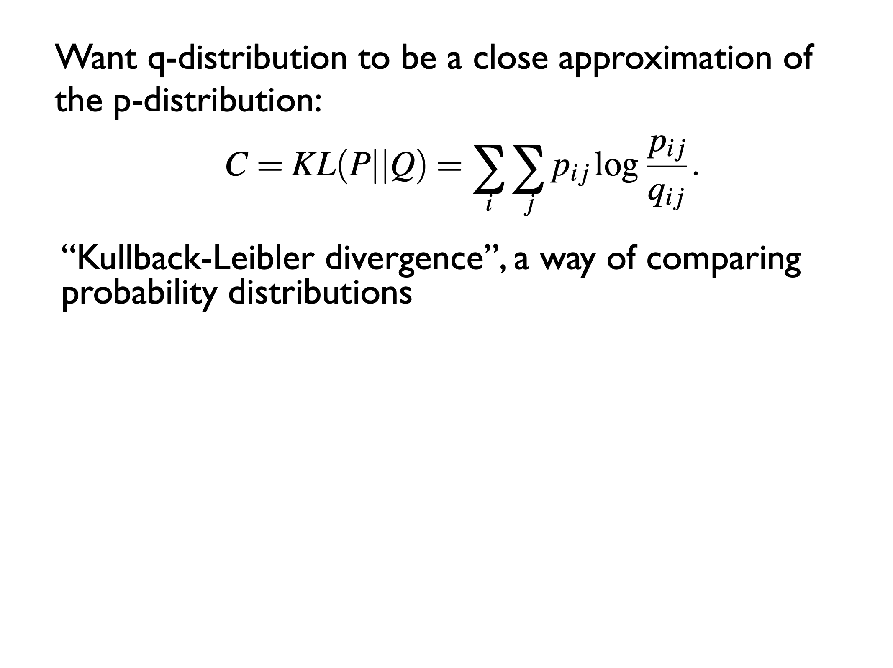{width="70%" fig-alt="Slide stating the SNE objective: want the q-distribution to closely approximate the p-distribution, formalized as the Kullback-Leibler divergence C = KL(P||Q) = sum_i sum_j p_ij log(p_ij/q_ij), a way of comparing probability distributions."}

- [F. Marquardt, Machine Learning for Physicists 2024](https://pad.gwdg.de/s/ZwIoM-Arn)
- [F. Marquardt, Machine Learning for Physicists 2024](https://pad.gwdg.de/s/ZwIoM-Arn)

---

## t-SNE

{width="70%" fig-alt="Slide stating the SNE objective: want the q-distribution to closely approximate the p-distribution, formalized as the Kullback-Leibler divergence C = KL(P||Q) = sum_i sum_j p_ij log(p_ij/q_ij), a way of comparing probability distributions."}

- [F. Marquardt, Machine Learning for Physicists 2024](https://pad.gwdg.de/s/ZwIoM-Arn)
- Adversarial training: penalize NN to "force" outputs to satisfy some desired condition, e.g., avoid sculpting jet mass distribution in jet tagging.

- [F. Marquardt, Machine Learning for Physicists 2024](https://pad.gwdg.de/s/ZwIoM-Arn)

---

## t-SNE

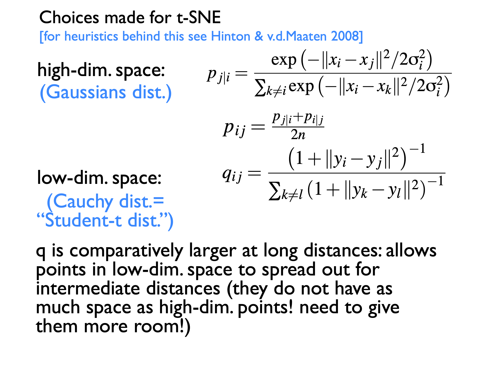{width="70%" fig-alt="Slide titled 'Choices made for t-SNE' (citing Hinton & van der Maaten 2008): in high-dimensional space, p_j|i is a Gaussian-based ratio exp(-||x_i-x_j||^2/2*sigma_i^2) normalized over k, combined into p_ij = (p_j|i + p_i|j)/2n; in low-dimensional space, q_ij uses a Cauchy/Student-t distribution (1+||y_i-y_j||^2)^-1 normalized over k,l - noted that q's heavier tails give low-dimensional points more room to spread out at intermediate distances."}

- [F. Marquardt, Machine Learning for Physicists 2024](https://pad.gwdg.de/s/ZwIoM-Arn)
- [F. Marquardt, Machine Learning for Physicists 2024](https://pad.gwdg.de/s/ZwIoM-Arn)

---

## t-SNE

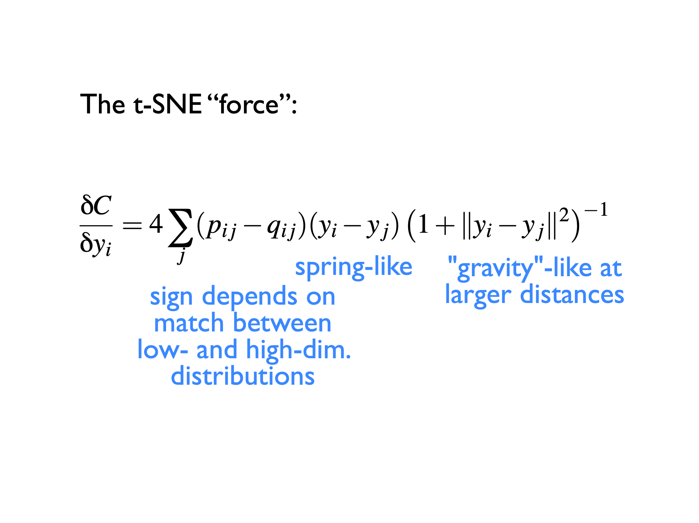{width="70%" fig-alt="Slide titled 'The t-SNE 'force'': the gradient dC/dy_i = 4*sum_j (p_ij - q_ij)(y_i-y_j)(1+||y_i-y_j||^2)^-1, annotated as spring-like with sign depending on the match between low- and high-dimensional distributions, and gravity-like at larger distances."}

- [F. Marquardt, Machine Learning for Physicists 2024](https://pad.gwdg.de/s/ZwIoM-Arn)
- [F. Marquardt, Machine Learning for Physicists 2024](https://pad.gwdg.de/s/ZwIoM-Arn)

---

## t-SNE

<!-- TODO: complex slide layout (flagged by detect_complex_slide.py - see run log). Content below is complete but UNARRANGED - needs manual layout to match the original slide. -->

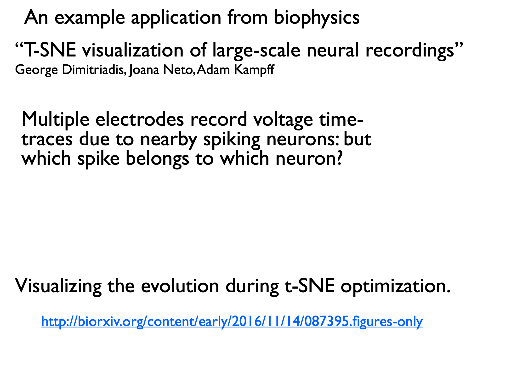{fig-alt="Slide titled 'An example application from biophysics: 'T-SNE visualization of large-scale neural recordings' (George Dimitriadis, Joana Neto, Adam Kampff)': text explaining that multiple electrodes record voltage time-traces from nearby spiking neurons, raising the question of which spike belongs to which neuron, visualized via the evolution of a t-SNE optimization; links to a biorxiv preprint."}

- [F. Marquardt, Machine Learning for Physicists 2024](https://pad.gwdg.de/s/ZwIoM-Arn)
- [http://biorxiv.org/content/early/2016/11/14/087395.figures-only](http://biorxiv.org/content/early/2016/11/14/087395.figures-only)

- [F. Marquardt, Machine Learning for Physicists 2024](https://pad.gwdg.de/s/ZwIoM-Arn)

---

## Paperscape

<!-- TODO: complex slide layout (flagged by detect_complex_slide.py - see run log). Content below is complete but UNARRANGED - needs manual layout to match the original slide. -->

- [paperscape.org](http://paperscape.org)

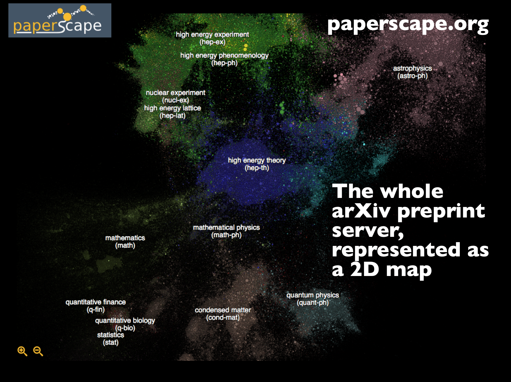{fig-alt="Screenshot of the Paperscape.org visualization: a 2D map of the entire arXiv preprint server as a dense starfield of colored dots, with labeled regions for high energy experiment/phenomenology/theory/lattice, nuclear experiment, astrophysics, mathematical physics, mathematics, quantitative finance/biology, statistics, condensed matter, and quantum physics, titled 'The whole arXiv preprint server, represented as a 2D map'."}

- [F. Marquardt, Machine Learning for Physicists 2024](https://pad.gwdg.de/s/ZwIoM-Arn)
- Simple physical model:
- Repulsion (antigravity)
- Attraction (reference=linear spring)
- Avoid overlap (size=#citations)

- [F. Marquardt, Machine Learning for Physicists 2024](https://pad.gwdg.de/s/ZwIoM-Arn)

---

## Paperscape

<!-- TODO: complex slide layout (flagged by detect_complex_slide.py - see run log). Content below is complete but UNARRANGED - needs manual layout to match the original slide. -->

- [paperscape.org](http://paperscape.org)

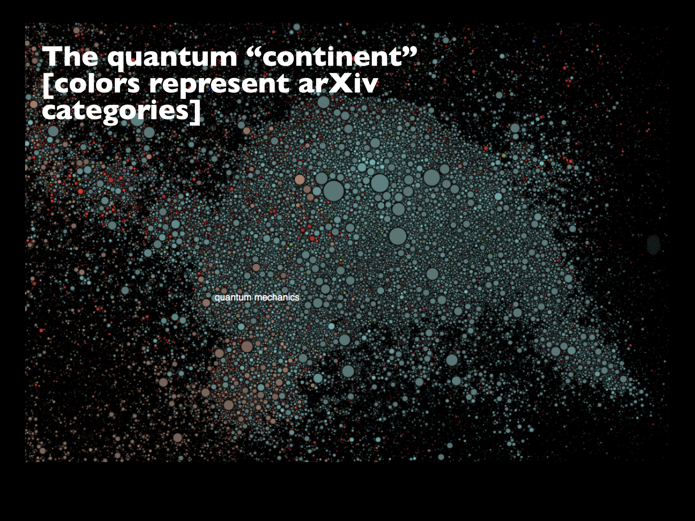{fig-alt="Screenshot of the Paperscape.org map zoomed into 'The quantum 'continent'' region: a dense black-background starfield of teal/cyan and red dots (colored by arXiv category), with a 'quantum mechanics' label near the center."}

- [F. Marquardt, Machine Learning for Physicists 2024](https://pad.gwdg.de/s/ZwIoM-Arn)
- [F. Marquardt, Machine Learning for Physicists 2024](https://pad.gwdg.de/s/ZwIoM-Arn)

---

## Paperscape

<!-- TODO: complex slide layout (flagged by detect_complex_slide.py - see run log). Content below is complete but UNARRANGED - needs manual layout to match the original slide. -->

- [paperscape.org](http://paperscape.org)

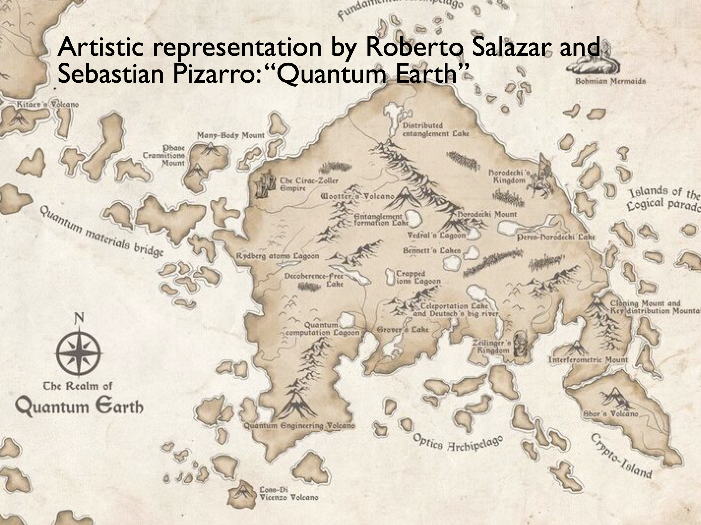{fig-alt="Fantasy-style illustrated map titled 'The Realm of Quantum Earth' (artistic representation by Roberto Salazar and Sebastian Pizarro): an aged-parchment landmass with whimsical place names punning on quantum physics concepts and researchers - Many-Body Mount, Phase Transitions Mount, The Cirac-Zoller Empire, Wootter's Volcano, Entanglement formation Lake, Horodecki Mount/Kingdom, Decoherence-Free Lake, Trapped ions Lagoon, Teleportation Lake and Deutsch's big river, Grover's Lake, Zeilinger's Kingdom, Quantum computation Lagoon, Quantum Engineering Volcano, Optics Archipelago, Crypto-Island, Shor's Volcano, Cloning Mount and Key distribution Mountains, Interferometric Mount, Islands of the Logical paradox, Distributed entanglement Lake, and Bohmian Mermaids - with a compass rose in the corner."}

- [F. Marquardt, Machine Learning for Physicists 2024](https://pad.gwdg.de/s/ZwIoM-Arn)
- [F. Marquardt, Machine Learning for Physicists 2024](https://pad.gwdg.de/s/ZwIoM-Arn)

---

## Recap

- Principal component analysis (PCA) is a dimensionality reduction algorithm that identifies orthogonal, linear combinations of features ranked by variance
  - Relatively simple: construct covariance matrix, compute eigenvectors/values
- Autoencoders with linear activations are basically just PCA!
- Visualizing the with latent space (e.g t-SNE) illustrates what the NN is doing
- Notebooks: machine-learning-for-physicsists/2024/05*tSNE*ipynb
- Further reading:
  - What if you chop the AE in half, and just take the decoder side?
  - Map from latent space to outputs: generative AI!
  - Uses a modified, probabilistic latent space layer: [variational AEs](https://www.ibm.com/think/topics/variational-autoencoder)

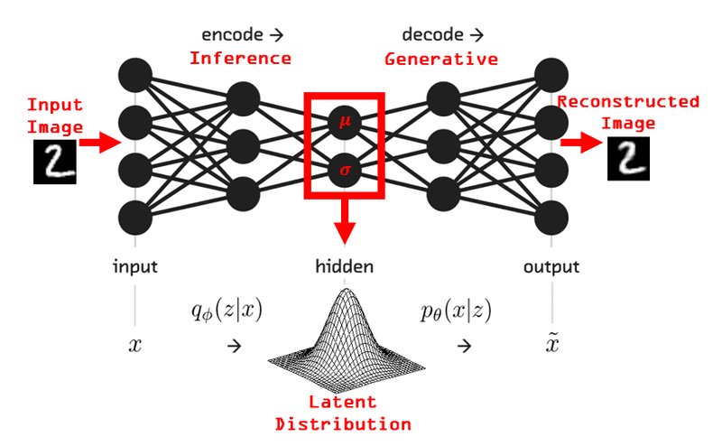{width="70%" fig-alt="Diagram of a variational autoencoder (VAE): an Input Image (MNIST '2') feeds through an 'encode -> Inference' network to a latent bottleneck with mean (mu) and variance (sigma) parameters (q_phi(z|x)), sampling a Gaussian Latent Distribution, then through a 'decode -> Generative' network (p_theta(x|z)) to a Reconstructed Image (x-tilde, also a '2')."}

- Variational autoencoder
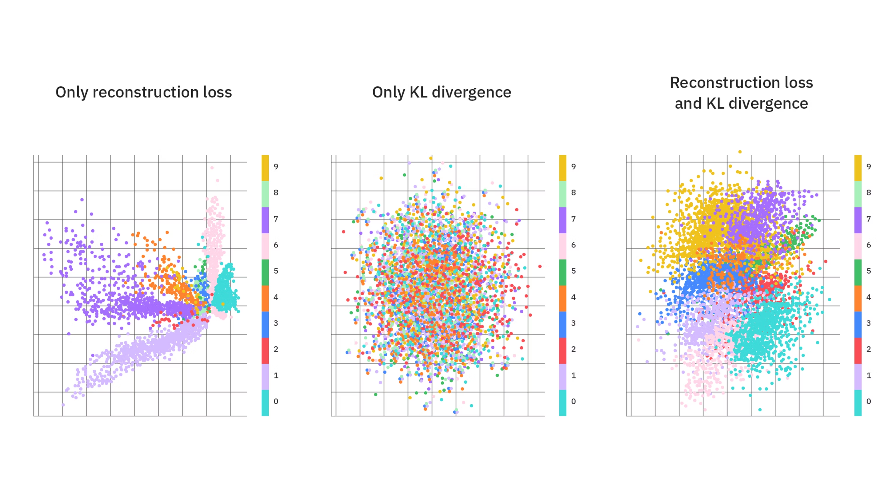{width="70%" fig-alt="Diagram of a basic autoencoder: an Input layer of six gray nodes (x1-x6) connects through an 'encoder' arrow to Hidden layers (narrowing from 4 to 3 blue nodes and back to 4), then through a 'decoder' arrow to an Output layer of six gray nodes (x-hat_1 to x-hat_6) - the classic bowtie/hourglass autoencoder shape."}

- Latent space visualization

---

# Part 4: additional ML architectures

---

## Additional topics

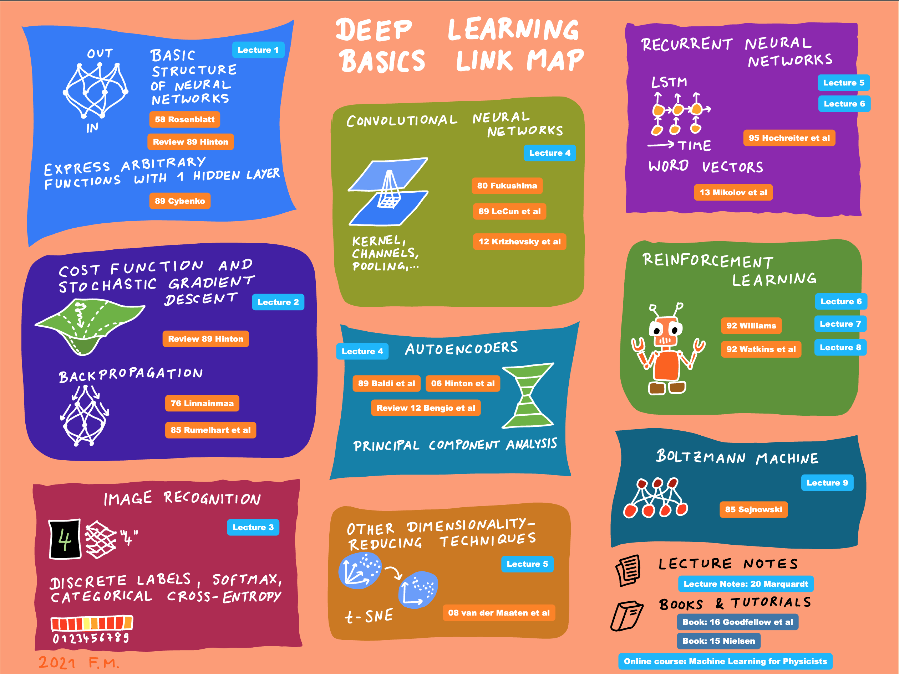{width="70%" fig-alt="Three scatter plots comparing VAE latent-space organization (points colored by MNIST digit 0-9) under different loss terms: 'Only reconstruction loss' produces smeared, overlapping streak-like clusters; 'Only KL divergence' produces one large unseparated blob; 'Reconstruction loss and KL divergence' (both combined) produces well-separated, compact digit clusters."}

- "Machine Learning for Physicists" full map of topics

---

## Last time

- Autoencoders aim to represent most important features of the data in a compressed "bottleneck" layer, called the latent space.
  - Encoder: maps inputs to latent space (compression, recognition)
  - Decoder: maps latent space to outputs (decompression, generation)
- Self-supervised problem: neural network learns to reproduce the data without any other specific goal.

{width="70%" fig-alt="Hand-drawn colorful infographic titled 'DEEP LEARNING BASICS LINK MAP' (F.M. 2021): colored boxes for Basic structure of neural networks (Lecture 1, Rosenblatt 58, Hinton review 89), Cost function and stochastic gradient descent / Backpropagation (Lecture 2, Hinton review 89, Linnainmaa 76, Rumelhart et al 85), Image recognition (Lecture 3), Convolutional neural networks (Lecture 4, Fukushima 80, LeCun et al 89, Krizhevsky et al 12), Autoencoders / Principal component analysis (Lecture 4, Baldi et al 89, Hinton et al 06, Bengio et al review 12), Other dimensionality-reducing techniques / t-SNE (Lecture 5, van der Maaten et al 08), Recurrent neural networks / LSTM / word vectors (Lectures 5-6, Hochreiter et al 95, Mikolov et al 13), Reinforcement learning (Lectures 6-8, Williams 92, Watkins et al 92), Boltzmann machine (Lecture 9, Sejnowski 85), plus references to lecture notes, books, and an online course."}

- Autoencoder

---

## Autoencoders

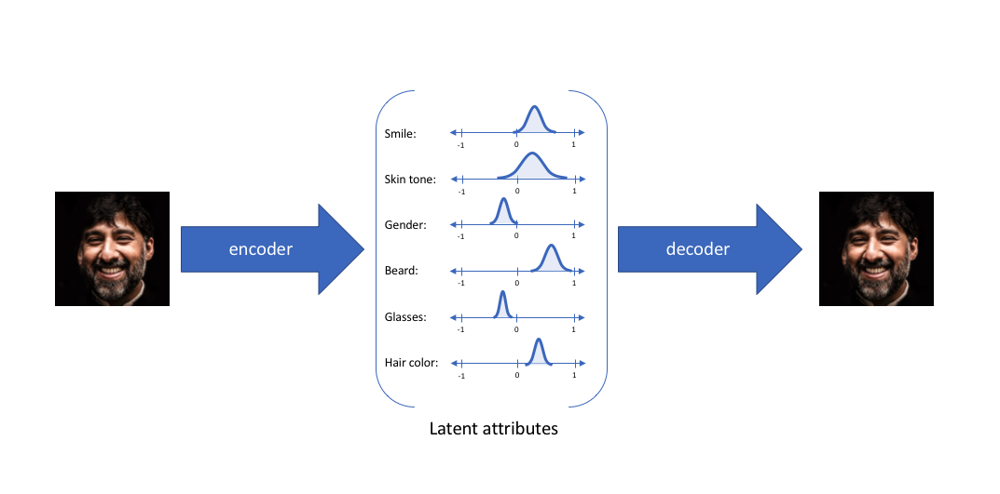{width="70%" fig-alt="Diagram of a basic autoencoder: an Input layer of six gray nodes (x1-x6) connects through an 'encoder' arrow to Hidden layers (narrowing from 4 to 3 blue nodes and back to 4), then through a 'decoder' arrow to an Output layer of six gray nodes (x-hat_1 to x-hat_6) - the classic bowtie/hourglass autoencoder shape."}

- Qualitative view of an image autoencoder
- [https://www.jeremyjordan.me/variational-autoencoders/](https://www.jeremyjordan.me/variational-autoencoders/)

---

## Encoding side

<!-- TODO: complex slide layout (flagged by detect_complex_slide.py - see run log). Content below is complete but UNARRANGED - needs manual layout to match the original slide. -->

{fig-alt="Diagram of a VAE applied to face images: a smiling man's photo feeds through an 'encoder' arrow into six labeled latent-attribute distributions (Smile, Skin tone, Gender, Beard, Glasses, Hair color, each a bell curve on a -1 to 1 axis), then through a 'decoder' arrow back out to a reconstructed version of the same photo."}

- Encoder + classifier
- Dense

- Classify

- After training the autoencoder to learn an efficient, generic representation of the data, we can replace the decoder with another NN
  - Input = latent space
  - Output = target for specific problem, e.g. cat vs. dog

- [https://www.jeremyjordan.me/variational-autoencoders/](https://www.jeremyjordan.me/variational-autoencoders/)

---

## Decoding side

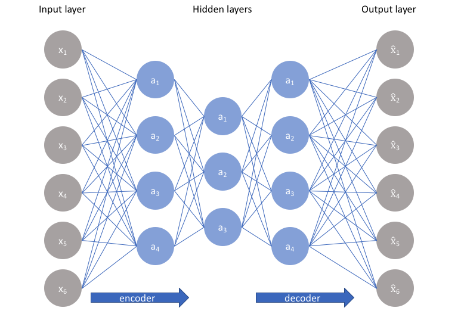{width="70%" fig-alt="Diagram of a basic autoencoder: an Input layer of six gray nodes (x1-x6) connects through an 'encoder' arrow to Hidden layers (narrowing from 4 to 3 blue nodes and back to 4), then through a 'decoder' arrow to an Output layer of six gray nodes (x-hat_1 to x-hat_6) - the classic bowtie/hourglass autoencoder shape."}

- Decoder
- Alternatively, we can use the decoding side for generation: given any point in the latent space (which is just a vector), the decoding side will produce an output.
  - For MNIST, it will generate some 28x28 image!

- [https://www.jeremyjordan.me/variational-autoencoders/](https://www.jeremyjordan.me/variational-autoencoders/)

---

## MNIST generation

{width="70%" fig-alt="A large grid of generated MNIST-like digit images on a black background, arranged so that digit identity morphs smoothly across rows and columns (e.g. 8s blending into 5s into 9s into 7s along one edge, 3s into 1s into 6s into 0s along another) - illustrating smooth interpolation through the VAE's latent space."}

- MNIST image generation from a variational autoencoder, from [https://www.tensorflow.org/tutorials/generative/cvae](https://www.tensorflow.org/tutorials/generative/cvae)
- Example: generating images from a MNIST autoencoder.
- However, a simple autoencoder is not quite enough...

- [https://www.jeremyjordan.me/variational-autoencoders/](https://www.jeremyjordan.me/variational-autoencoders/)

---

## Closer look at the latent space

{width="70%" fig-alt="Three scatter plots of a 2D latent space (points colored by MNIST digit 0-9): 'Only reconstruction loss' shows streaky, partially separated clusters with points labeled 1, 2, 7 near a boundary; 'Only KL divergence' shows one large unseparated blob; 'Combination' shows better-separated clusters, again with points labeled 1, 2 near a boundary region."}

- MNIST latent space, reconstruction loss only
- Here's an example of the latent space for an autoencoder trained on MNIST.
  - 2D visualization using, e.g., t-SNE.
- Distinct populations are clear!
- However, the structure is quite messy:
  - Uneven separation, different sizes, large gaps
- For generation, we would ideally have a better-structured latent space: smooth and more evenly spaced out.

- [https://www.jeremyjordan.me/variational-autoencoders/](https://www.jeremyjordan.me/variational-autoencoders/)

---

## Variational autoencoders

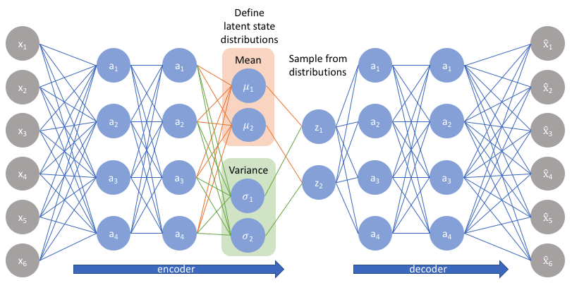{width="70%" fig-alt="Full VAE diagram: an input layer x1-x6 feeds through two encoder hidden layers to a 'Define latent state distributions' stage producing Mean (mu1, mu2) and Variance (sigma1, sigma2) nodes; these are sampled to produce latent values z1, z2, which feed through two decoder hidden layers to an output layer x-hat_1 through x-hat_6."}

- Variational autoencoder
- Variational autoencoders have a probabilistic latent space: each input becomes a distribution in the latent space (e.g. Gaussian), not a single point.
  - Network learns both mean (${ \mu }_{i}$) and width (${ \sigma }_{i}$) for each latent space dimension
  - (Regular autoencoder: ${ \sigma }_{i}=0$)
- This forces the network to learn a smoother distribution in the latent space.

- [https://www.jeremyjordan.me/variational-autoencoders/](https://www.jeremyjordan.me/variational-autoencoders/)

---

## Variational autoencoders

- Caveat: how do you perform backpropagation through a random sampling layer?
- "Reparametrization trick": keep track of the randomness in a parameter $ \epsilon $, where $z= \mu + \sigma  \cdot  \epsilon $.
- $ \epsilon $ is sample from a normal gaussian ($ \mu =0$, $ \sigma =1$), no training needed.

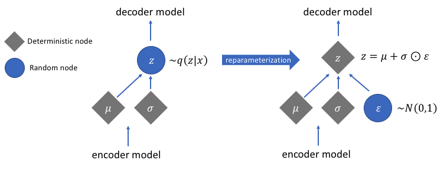{width="70%" fig-alt="Diagram of the VAE reparameterization trick: left, the latent node z (random, blue circle) sampled directly from q(z|x) given encoder outputs mu and sigma (deterministic, gray diamonds); right, after reparameterization, z is instead computed deterministically as z = mu + sigma (dot) epsilon, with epsilon drawn as a separate random node from N(0,1) - moving the randomness outside the network so gradients can flow through mu and sigma."}

- Reparametrization trick
- [https://www.jeremyjordan.me/variational-autoencoders/](https://www.jeremyjordan.me/variational-autoencoders/)

---

## Variational autoencoders

- Second ingredient: imposing a specific geometry on the latent space.
- The variational layer probably degrades the performance (i.e. the reconstruction loss)... so naively, we might expect the training to send ${ \sigma }_{i} \rightarrow 0$.
- Solution: add a penalty to the loss function with K–L divergence
  - Recall t-SNE: KL measures similarity between 2 probability distributions, $p(x)$ vs. $q(x)$
  - $${D}_{\text{KL}}(P \parallel Q)= \int p(x)log(p(x)/q(x))dx$$
  - Use KL penalty to force latent space to be (e.g.) a unit Gaussian in each dimension.

{width="70%" fig-alt="Three scatter plots of a 2D latent space (points colored by MNIST digit 0-9): 'Only reconstruction loss' shows streaky, partially separated clusters with points labeled 1, 2, 7 near a boundary; 'Only KL divergence' shows one large unseparated blob; 'Combination' shows better-separated clusters, again with points labeled 1, 2 near a boundary region."}

- MNIST latent space with (left) reconstruction loss, (middle) KL divergence loss, and (right) combination of both losses
- [https://www.jeremyjordan.me/variational-autoencoders/](https://www.jeremyjordan.me/variational-autoencoders/)

---

## Variational autoencoders

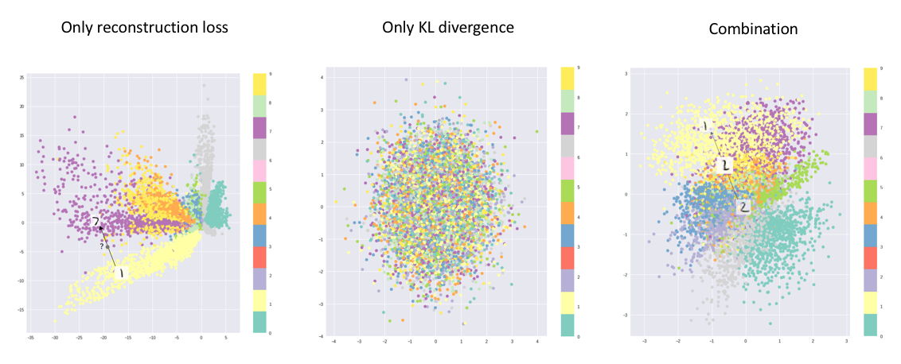{width="70%" fig-alt="Three scatter plots of a 2D latent space (points colored by MNIST digit 0-9): 'Only reconstruction loss' shows streaky, partially separated clusters with points labeled 1, 2, 7 near a boundary; 'Only KL divergence' shows one large unseparated blob; 'Combination' shows better-separated clusters, again with points labeled 1, 2 near a boundary region."}

- MNIST latent space with (left) reconstruction loss, (middle) KL divergence loss, and (right) combination of both losses
- [https://www.jeremyjordan.me/variational-autoencoders/](https://www.jeremyjordan.me/variational-autoencoders/)

---

## Examples

<!-- TODO: complex slide layout (flagged by detect_complex_slide.py - see run log). Content below is complete but UNARRANGED - needs manual layout to match the original slide. -->

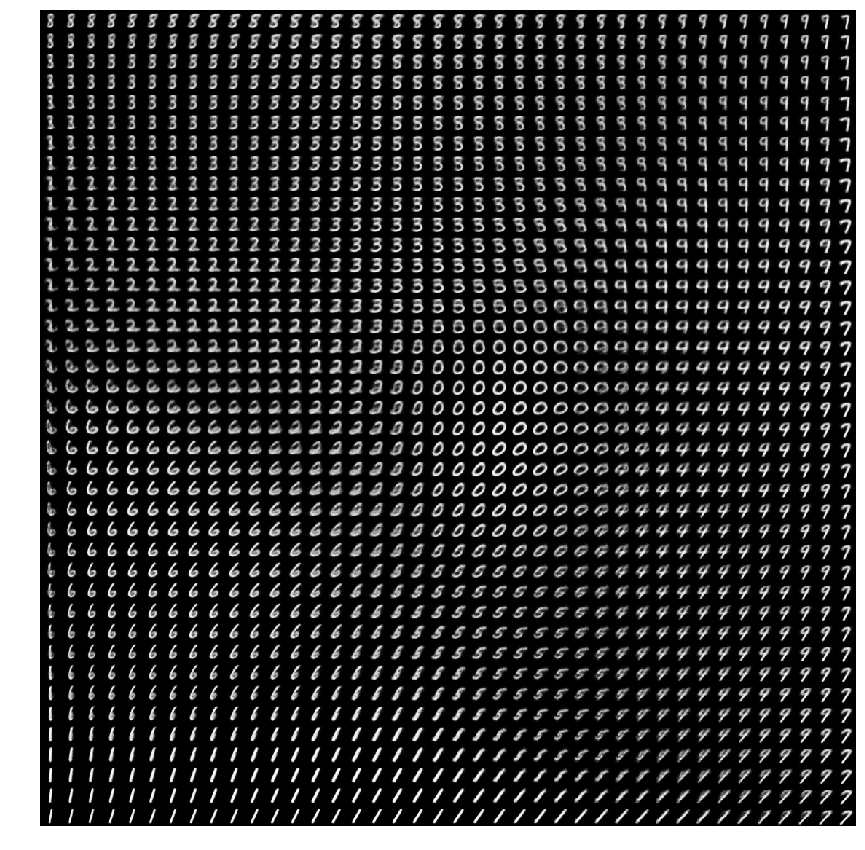{fig-alt="A large grid of generated MNIST-like digit images on a black background, arranged so that digit identity morphs smoothly across rows and columns (e.g. 8s blending into 5s into 9s into 7s along one edge, 3s into 1s into 6s into 0s along another) - illustrating smooth interpolation through a VAE's latent space."}

- MNIST image generation from a variational autoencoder, from [https://www.tensorflow.org/tutorials/generative/cvae](https://www.tensorflow.org/tutorials/generative/cvae)
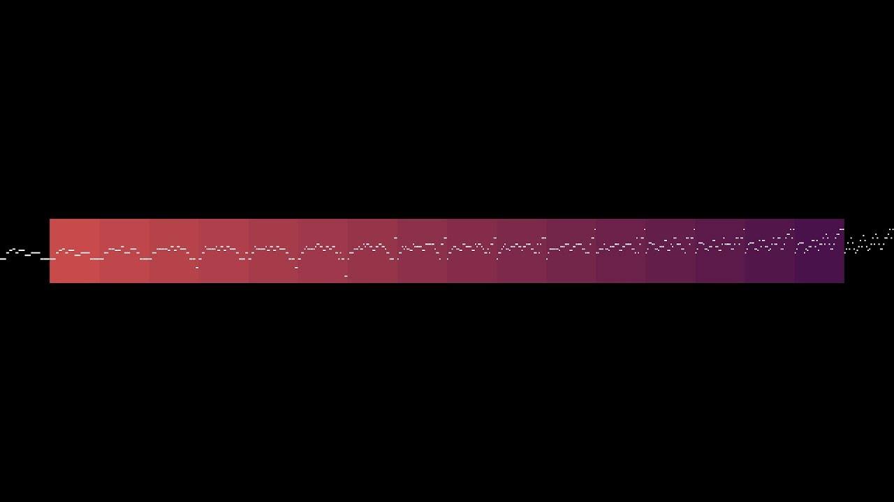{fig-alt="A horizontal strip visualization (black background, red-to-purple gradient bar) of a MusicVAE melody 2-bar loop interpolation, with white dotted note markers tracing a melodic pattern across the bar."}

- Interpolating two melodies with VAE

- Also see [generative adversarial networks](https://en.wikipedia.org/wiki/Generative_adversarial_network) (GANs)

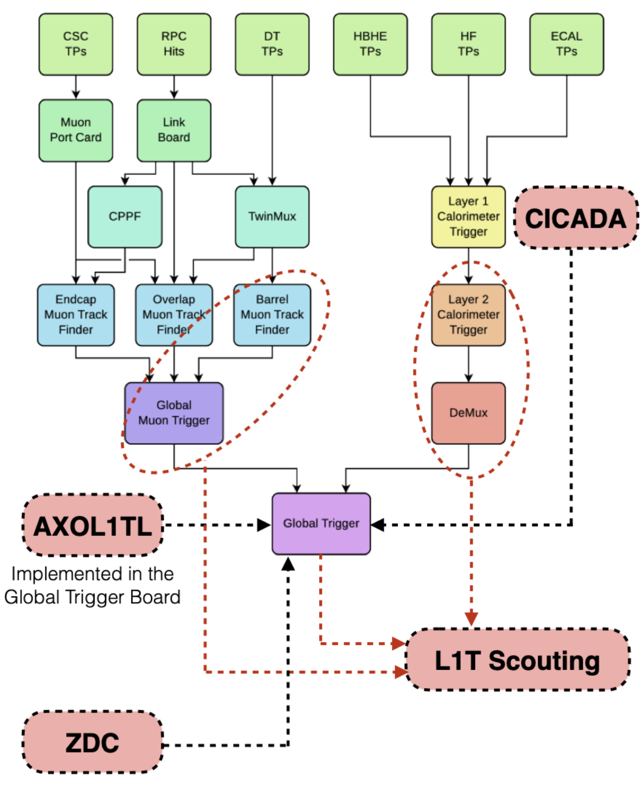{fig-alt="Flowchart of the CMS Level-1 trigger system: muon detector inputs (CSC TPs, RPC Hits, DT TPs) pass through Muon Port Card/Link Board, CPPF/TwinMux, and Endcap/Overlap/Barrel Muon Track Finders into a Global Muon Trigger; calorimeter inputs (HBHE, HF, ECAL TPs) pass through Layer 1 and Layer 2 Calorimeter Trigger stages and DeMux; anomaly-detection algorithms AXOL1TL, CICADA, and ZDC (dashed boxes) feed into the Global Trigger alongside the muon and calorimeter paths, with several paths also feeding an L1T Scouting box."}

- CMS L1 trigger system
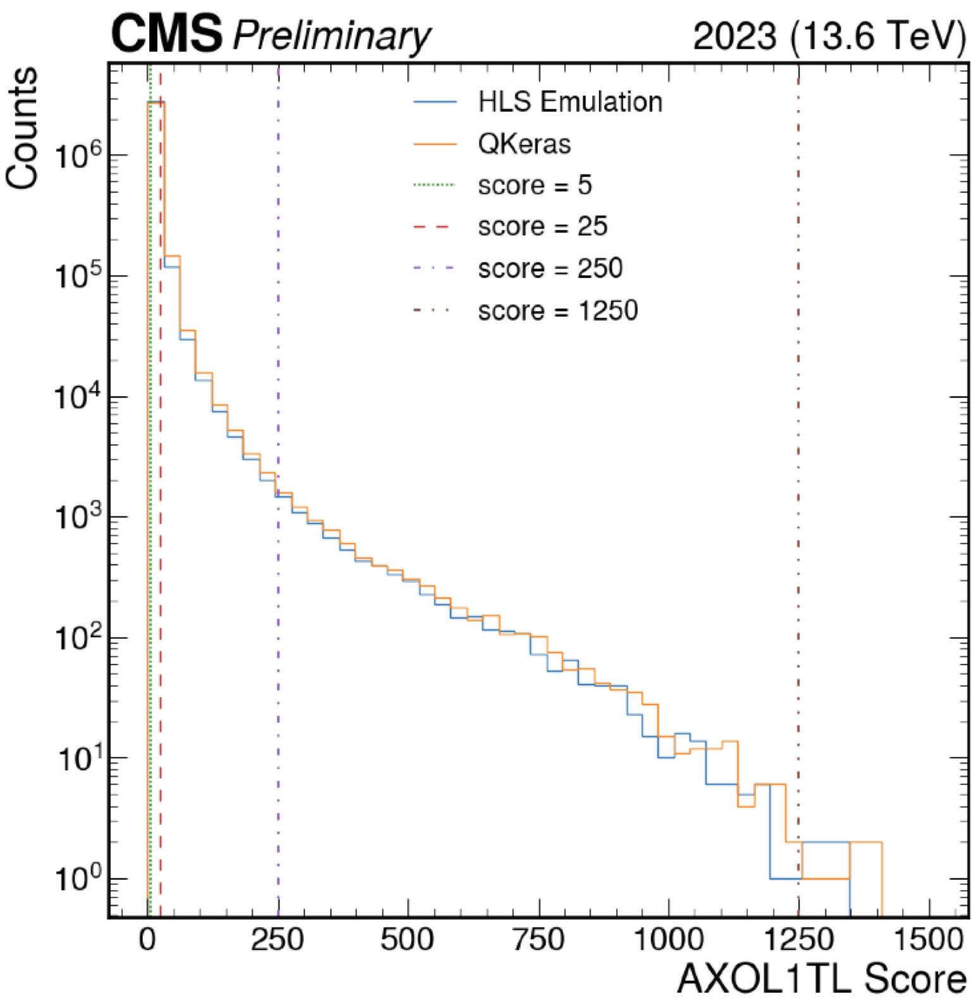{fig-alt="CMS Preliminary plot (2023, 13.6 TeV): Counts (log scale, 1 to 10^6+) versus AXOL1TL anomaly-detection Score (0 to 1500), comparing HLS Emulation (blue) and QKeras (orange) histograms that closely overlap and fall off steeply, with vertical reference lines at score = 5, 25, 250, and 1250."}

- Anomaly detection score, from https://indico.cern.ch/event/1441321/contributions/6525056/attachments/3081600/5454618/2025_06_05_LLP2025.pdf
- SM-like

- New physics-like

- [https://www.jeremyjordan.me/variational-autoencoders/](https://www.jeremyjordan.me/variational-autoencoders/)

---

## Recurrent neural networks

<!-- TODO: complex slide layout (flagged by detect_complex_slide.py - see run log). Content below is complete but UNARRANGED - needs manual layout to match the original slide. -->

- Recurrent neural networks (RNNs) process sequences of inputs.
  - Time series data: regular temperature readings, stock market data, ECG/EEG, audio processings, ...
  - Sequential data: language processing (surpassed by transformers, though).

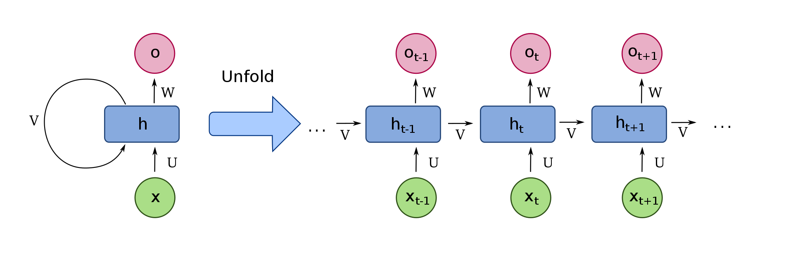{fig-alt="Diagram of a recurrent neural network 'unfolded' through time: left, a compact RNN cell with hidden state h taking input x (via weight U) and producing output o (via weight W), with a self-loop (weight V); right, the same cell unrolled across time steps t-1, t, t+1, showing h_t-1, h_t, h_t+1 each connected to their own input x and output o, with V connecting consecutive hidden states."}

- Recurrent neural network

- Inputs

- Outputs

- Hidden layers

---

## Recurrent neural networks

<!-- TODO: complex slide layout (flagged by detect_complex_slide.py - see run log). Content below is complete but UNARRANGED - needs manual layout to match the original slide. -->

- Inputs
- Outputs
{fig-alt="Diagram of a recurrent neural network 'unfolded' through time: left, a compact RNN cell with hidden state h taking input x (via weight U) and producing output o (via weight W), with a self-loop (weight V); right, the same cell unrolled across time steps t-1, t, t+1, showing h_t-1, h_t, h_t+1 each connected to their own input x and output o, with V connecting consecutive hidden states."}

- Hidden layers
- Recurrent neural network, expanded
- Dynamic directed graph (dynamic=changes over time)

---

## Example: Elman network

<!-- TODO: complex slide layout (flagged by detect_complex_slide.py - see run log). Content below is complete but UNARRANGED - needs manual layout to match the original slide. -->

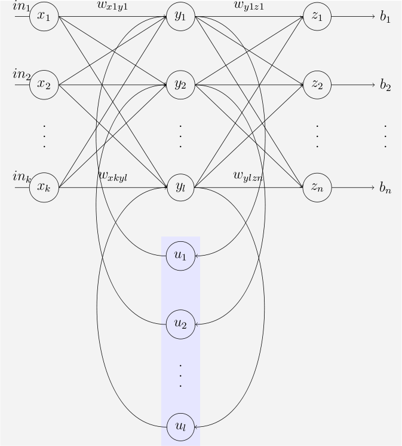{fig-alt="Diagram of an Elman network: input nodes in_1...in_k feed x_1...x_k, which connect (via weights w_x1y1 etc.) to a hidden layer y_1...y_l, which connects (via weights w_y1z1 etc.) to an output layer z_1...z_n producing outputs b_1...b_n; the hidden layer y also feeds a set of context units u_1...u_l (highlighted in a blue box), which loop back into the hidden layer on the next time step."}

- Diagram of Elman network
- Inputs

- Outputs

- Hidden layer

- "Context layer": stores previous hidden layer

---

## Recurrent neural networks

<!-- TODO: complex slide layout (flagged by detect_complex_slide.py - see run log). Content below is complete but UNARRANGED - needs manual layout to match the original slide. -->

- Recurrent: can "remember" (=save state) of inputs
  - CNNs do not!
- Example: predict the next value in a sequence
  - $ \Rightarrow $ clear applications to language processing
- Example: measure similarity of two sequences
- Key issue: vanishing gradients
  - =loss of long-term memory
  - Mitigations: long short-term memory (LSTM), gated recurrent units (GRUs).
- Still used today, but replaced by [transformers](https://poloclub.github.io/transformer-explainer/) in many applications
  - Key feature: instead of sequential processing, process full input (e.g. text query to ChatGPT) with attention mechanism to identify relevant combinations of inputs

{fig-alt="Diagram of a recurrent neural network 'unfolded' through time: left, a compact RNN cell with hidden state h taking input x (via weight U) and producing output o (via weight W), with a self-loop (weight V); right, the same cell unrolled across time steps t-1, t, t+1, showing h_t-1, h_t, h_t+1 each connected to their own input x and output o, with V connecting consecutive hidden states."}

- Recurrent neural network

- Inputs

- Outputs

- Hidden layers

---

## Recap

- Quick 2.5-week overview of machine learning techniques
  - Basic components and architectures
  - Training with backpropagation
  - Example from convolutional neural networks and autoencoders
  - Many more topics that we don't have time to cover!
    - E.g. graph NNs, Boltzmann machines, decision trees, agentic systems, ...
    - If you want to learn about something specific, let me know!
