## Announcements

- original version: Haade;vectorization: Wjh31, Quibik, CC BY-SA 3.0 <https://creativecommons.org/licenses/by-sa/3.0>, via Wikimedia Commons

- Office hours: Fronczak 257
  - Tuesdays 3–4pm
  - Wednesdays 11am–12pm
- New GitHub classroom created
  - Test assignment: [https://classroom.github.com/a/AN6hovUn](https://classroom.github.com/a/AN6hovUn) (you can use this to test clone/push/pull)
- Assignment 7 is posted: [https://classroom.github.com/a/pkol8Ur-](https://classroom.github.com/a/pkol8Ur-)
  - Let me know if you still have access problems
  - WSL users may need to manually add group write permissions on notebooks (e.g. chmod g+w Problem1.ipynb)

---

# Computational fluid dynamics

---

## Computational fluid dynamics

- original version:: : Wjh31, Quibik, CC BY-SA 3.0 <https://creativecommons.org/licenses/by-sa/3.0>, via Wikimedia Commons

- We have now covered all the major algorithms for the class. Onto topics in physics!
- First up: computational fluid dynamics.
  - Many particles together acting under conservation of mass and momentum
  - Simple cases are incompressible fluids without friction
    - “Newtonian fluids”
  - Governed by the Navier–Stokes equations.
- References:
  - CFDPython by Prof. Lorena Barba:
    - Jupyter lessons on [github](https://github.com/barbagroup/CFDPython/tree/master/lessons)
    - Lectures on [youtube](https://www.youtube.com/watch?v=SrIf-A7kc0Y&list=PL30F4C5ABCE62CB61)
  - [https://ocw.mit.edu/courses/8-01sc-classical-mechanics-fall-2016/mit8_01scs22_chapter30.pdf](https://ocw.mit.edu/courses/8-01sc-classical-mechanics-fall-2016/mit8_01scs22_chapter30.pdf)

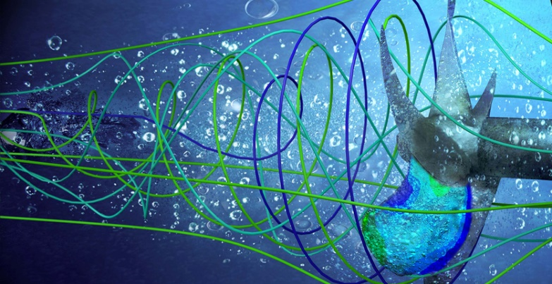{width="70%" fig-alt="TODO: describe image"}

- Water flowing around a rotor

---

## Mass conservation

<!-- TODO: complex slide layout (flagged by detect_complex_slide.py - see run log). Content below is complete but UNARRANGED - needs manual layout to match the original slide. -->

- original version:: : Wjh31, Quibik, CC BY-SA 3.0 <https://creativecommons.org/licenses/by-sa/3.0>, via Wikimedia Commons

- Consider a volume ($V$) inside a fluid.
  - Could be a small box ($dxdydz$), could be anything.
- Fluid velocity: $\vec{u}$
- Mass ($m$) inside $V$: integral of the density ($ \rho $),
  - $$m= \int  \rho dV$$
- Our first equation is just mass conservation: change in mass given by fluid flow at surfaces.
  - In differential form (i.e. use divergence theorem):

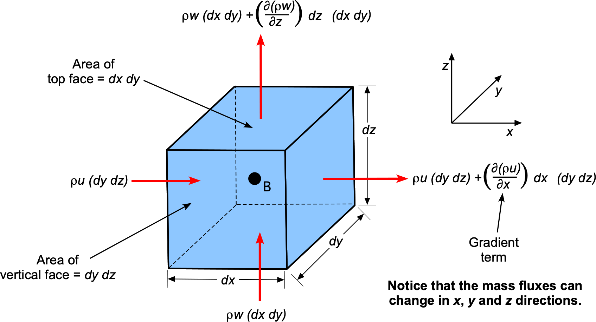{fig-alt="TODO"}

- Differential volume in a fluid
- $$\frac{dm}{dt}=\frac{d}{dt} \int  \rho dV=- \int d\vec{S} \cdot  \rho \vec{u}$$

- $$\frac{ \partial  \rho }{ \partial t}+\vec{ \nabla } \cdot  \rho \vec{u}=0$$

---

## Momentum conservation

<!-- TODO: complex slide layout (flagged by detect_complex_slide.py - see run log). Content below is complete but UNARRANGED - needs manual layout to match the original slide. -->

- original version:: : Wjh31, Quibik, CC BY-SA 3.0 <https://creativecommons.org/licenses/by-sa/3.0>, via Wikimedia Commons

- The other equations come from Newton's 2nd law (conservation of momentum):
  - Consider the motion of our small cube. Newton's 2nd law gives:
    - $$ \rho \frac{d\vec{u}}{dt}=\vec{F}$$
  - But the cube is moving (it's position depends on time), so we need to apply the chain rule. The full time derivative is:

- $$\frac{d\vec{u}}{dt}=\frac{ \partial \vec{u}}{ \partial t}+(\vec{u} \cdot \vec{ \nabla })\vec{u}=\vec{F}$$

- Change in fluid velocity
- at a fixed point in space

- Change in fluid velocity due to motion of fluid from neighboring points (advection)

---

## Momentum conservation

- original version:: : Wjh31, Quibik, CC BY-SA 3.0 <https://creativecommons.org/licenses/by-sa/3.0>, via Wikimedia Commons

- Different types of forces to consider:
  - "Body forces" acting on the whole system, e.g. gravity ($\vec{F}=\vec{g}$)
  - "Surface forces" (divide into normal and tangential/shear stresses)
    - Dynamic viscosity coefficient ($ \mu $)
    - Bulk viscosity coefficient ($ \xi $)
    - Pressure ($p$)
- The total force is:
  - This contains forces due to pressure and friction.
  - (For derivation, see [Barba's lectures](https://youtu.be/7UpOXp_i4cc?si=TpZImGYCLZ4d6CTp))

- $$\vec{F}= \mu { \nabla }^{2}\vec{u}+( \mu + \xi )\vec{ \nabla }(\vec{ \nabla } \cdot \vec{u})+\vec{g}$$

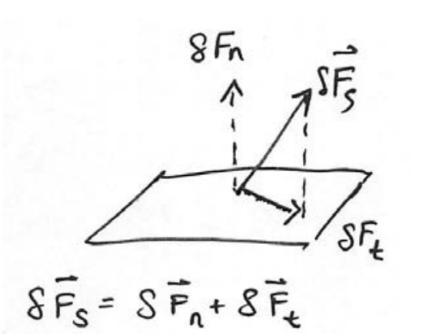{width="70%" fig-alt="TODO: describe image"}

- Forces acting on a differential fluid surface

---

## Momentum conservation

- original version:: : Wjh31, Quibik, CC BY-SA 3.0 <https://creativecommons.org/licenses/by-sa/3.0>, via Wikimedia Commons

- For an incompressible, Newtonian fluid:
  - $$\vec{ \nabla } \cdot \vec{u}=0$$
  - Stresses proportional to velocity gradient
- ...we get the Navier–Stokes equations
  - (with $ \nu  \equiv  \mu / \rho $):

- $$\frac{ \partial \vec{u}}{ \partial t}+(\vec{u} \cdot \vec{ \nabla })\vec{u}=\vec{g}-\frac{1}{ \rho }\vec{ \nabla }p+ \nu { \nabla }^{2}\vec{u}$$

---

## 1D Navier–Stokes

- original version:: : Wjh31, Quibik, CC BY-SA 3.0 <https://creativecommons.org/licenses/by-sa/3.0>, via Wikimedia Commons

- In 1D, we have:

- $$\frac{ \partial u}{ \partial t}+u\frac{ \partial u}{ \partial x}=g-\frac{1}{ \rho }\frac{ \partial p}{ \partial t}+ \nu \frac{{ \partial }^{2}u}{ \partial {x}^{2}}$$

- If $g=0$ and $\frac{dp}{dt}=0$, we get Burger's equation from last semester:

- $$\frac{ \partial u}{ \partial t}+u\frac{ \partial u}{ \partial x}= \nu \frac{{ \partial }^{2}u}{ \partial {x}^{2}}$$

- So, Navier–Stokes describes shock propagation.

---

## ND Navier–Stokes

- original version:: : Wjh31, Quibik, CC BY-SA 3.0 <https://creativecommons.org/licenses/by-sa/3.0>, via Wikimedia Commons

- What about solutions in N dimensions?
  - This is a million dollar question! [https://www.claymath.org/millennium/navier-stokes-equation/](https://www.claymath.org/millennium/navier-stokes-equation/)
  - [https://en.wikipedia.org/wiki/Navier%E2%80%93Stokes_existence_and_smoothness](https://en.wikipedia.org/wiki/Navier%E2%80%93Stokes_existence_and_smoothness)
- So, numerical solutions are often the only way to go.

---

## ND Navier–Stokes

- original version:: : Wjh31, Quibik, CC BY-SA 3.0 <https://creativecommons.org/licenses/by-sa/3.0>, via Wikimedia Commons

- OK, well, what about simple-ish solutions?
  - Even then, still pretty hard
- Commercial software in abundance:

  - Open source examples:
    - [https://people.sc.fsu.edu/~jburkardt/py_src/navier_stokes_2d_exact/navier_stokes_2d_exact.html](https://people.sc.fsu.edu/~jburkardt/py_src/navier_stokes_2d_exact/navier_stokes_2d_exact.html)
    - [http://lorenabarba.com/blog/cfd-python-12-steps-to-navier-stokes/](http://lorenabarba.com/blog/cfd-python-12-steps-to-navier-stokes/)

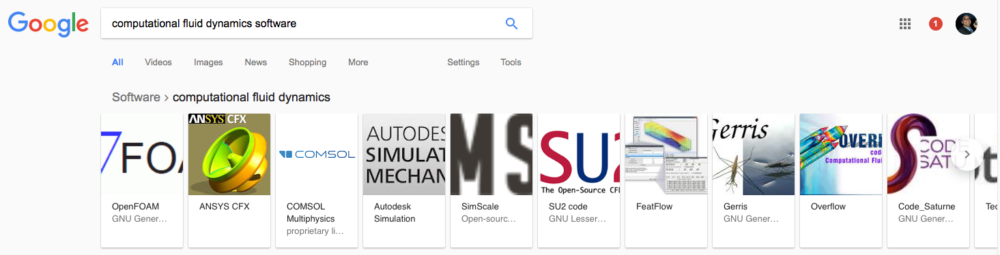{width="70%" fig-alt="TODO: describe image"}

- Computational fluid dynamics software

---

## Pressure-driven channel flow

<!-- TODO: complex slide layout (flagged by detect_complex_slide.py - see run log). Content below is complete but UNARRANGED - needs manual layout to match the original slide. -->

- original version:: : Wjh31, Quibik, CC BY-SA 3.0 <https://creativecommons.org/licenses/by-sa/3.0>, via Wikimedia Commons

- Let’s look at one special case: flow through a long tube with constant pressure, like the flow in a river.

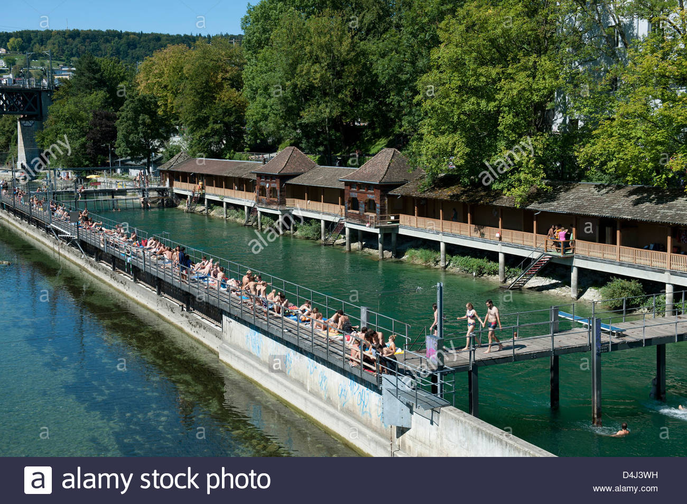{fig-alt="TODO"}

- Limmat river in Zurich, CH
- Jump in

- Swim (fast)

- Grate

- To hydro power station (aka death)

---

## Hands-on

- original version:: : Wjh31, Quibik, CC BY-SA 3.0 <https://creativecommons.org/licenses/by-sa/3.0>, via Wikimedia Commons

- Hands-on notebook: AdvDiffEq/16_step_12.ipynb
  - 16 = notebook index (actually 15 in latest version with 0-indexing ;) )
  - 12 = step 12 in the 12 step lesson plan
- We copied just the last notebook, but if you are interested in fluid dynamics, I highly recommend going through the whole class!
  - You can clone git@github.com:barbagroup/CFDPython.git inside CompPhys (git-inside-git is not generally recommended, but it's not a big deal here)
    - (Or clone outside, and modify runDocker.sh to mount the folder).
- I'll talk through a bit, then the rest of today is hands-on.

---

## Results

- original version:: : Wjh31, Quibik, CC BY-SA 3.0 <https://creativecommons.org/licenses/by-sa/3.0>, via Wikimedia Commons

- The flow in the center is highest, and the flow at the edges is lowest:

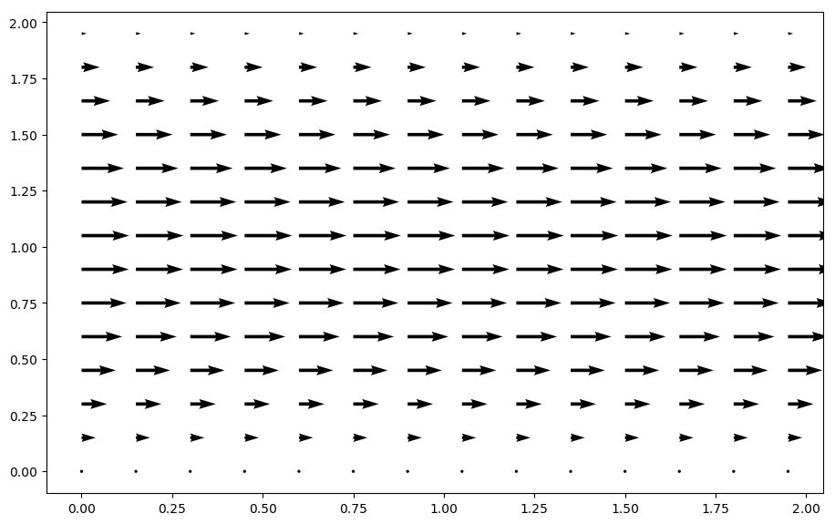{width="70%" fig-alt="TODO: describe image"}

- Plot of fluid velocity in a pipe

---

## Next steps

- original version:: : Wjh31, Quibik, CC BY-SA 3.0 <https://creativecommons.org/licenses/by-sa/3.0>, via Wikimedia Commons

- For homework Problem 3, you will put an obstruction in the pipe (implemented through boundary conditions).
  - For another example of boundary conditions, see the step_11 CFD notebook.
- You will probably have to adjust the grid for the specific geometry of the obstruction.
  - However, if you tried increasing the grid points in 16_step_12.ipynb, you probably ran into trouble very quickly!
  - Take a look at the CFL condition notebook in the CFD repository: $\frac{c{ \delta }_{t}}{{ \delta }_{x}} \leq 1$
    - Also see Numerical Recipes, Chapter 20.1 (let's take a look now)

---

# General relativity

---

## General relativity

- original version:: : Wjh31, Quibik, CC BY-SA 3.0 <https://creativecommons.org/licenses/by-sa/3.0>, via Wikimedia Commons

- A similar problem (computationally speaking): general relativity.
  - It's also an extremely difficult problem: analytical solutions are hard to come by, so numerical methods are essential.
- GR relates gravity to the curvature of spacetime:

- Objects with mass or energy distort space-time, and this induces a gravitational field.

- arXiv:astro-ph/9901124

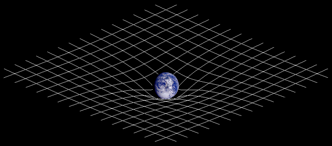{width="70%" fig-alt="TODO: describe image"}

- Cartoon of spacetime distortion

---

## General relativity

<!-- TODO: complex slide layout (flagged by detect_complex_slide.py - see run log). Content below is complete but UNARRANGED - needs manual layout to match the original slide. -->

- original version:: : Wjh31, Quibik, CC BY-SA 3.0 <https://creativecommons.org/licenses/by-sa/3.0>, via Wikimedia Commons

- arXiv:astro-ph/9901124

- Space-time is a tensor.
- So gravity is a tensor.
- Einstein’s equations :

- $${G}_{ \mu  \nu }={R}_{ \mu  \nu }-\frac{1}{2}{g}_{ \mu  \nu }R=\frac{8 \pi {G}_{N}}{{c}^{4}}{T}_{ \mu  \nu }-{g}_{ \mu  \nu } \Lambda $$

- Ricci tensor
- (gravitational force)

- Metric tensor

- Curvature scalar

- Newton's constant

- Speed of light

- Stress-energy tensor
- (energy and momentum density of matter + radiation)

- Cosmological constant

- Huge set of nonlinear partial differential equations.
- Arbitrarily complicated (${T}_{ \mu  \nu }$ can be anything!)

- Einstein tensor

- Repeat from lectures on fitting

---

## Cosmological solutions to Einstein's equations

<!-- TODO: complex slide layout (flagged by detect_complex_slide.py - see run log). Content below is complete but UNARRANGED - needs manual layout to match the original slide. -->

- A few simple cases can be derived.
- If spacetime is homogeneous and isotropic, this is the Robertson–Walker metric:

- $$d{s}^{2}=\mathop{\mathop{ \sum }\limits_{ \mu =0}}\limits^{3}\mathop{\mathop{ \sum }\limits_{ \nu =0}}\limits^{3}{g}_{ \mu  \nu }d{x}^{ \mu }d{x}^{ \nu }={c}^{2}d{t}^{2}-{R}^{2}(t)\left[ \frac{d{r}^{2}}{1-k{r}^{2}}+{r}^{2}(d{ \theta }^{2}+si{n}^{2} \theta d{ \phi }^{2})right] \right]$$

- R(t) = "cosmological scale factor"

- Friedmann–Lamaitre equations: assume that matter and radiation behave like a uniform, perfect fluid with density $ \rho $ and pressure $p$.

- $$\begin{matrix}
{H}^{2} & ={\left( \frac{\mathop{R}\limits^{ \cdot }}{R} \right)}^{2}=\frac{8 \pi {G}_{N} \rho }{3}-\frac{k{c}^{2}}{{R}^{2}}+\frac{ \Lambda {c}^{2}}{3} \\
\frac{\mathop{R}\limits^{ \cdot  \cdot }}{R} & =-\frac{4 \pi {G}_{N}}{3}( \rho +3p)+\frac{ \Lambda {c}^{2}}{3}
\end{matrix}$$

- Repeat from lectures on fitting

- Hubble parameter : H(t0) = 72 km/s/Mpc  at present time

---

## Hubble data

<!-- TODO: complex slide layout (flagged by detect_complex_slide.py - see run log). Content below is complete but UNARRANGED - needs manual layout to match the original slide. -->

- Hubble used this equation to determine a linear relationship:

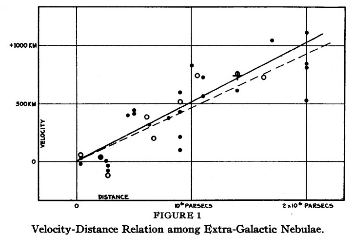{fig-alt="TODO"}

- Figure 1: Velocity-Distance Relation among Extra-Galactic Nebulae
- $$rK+Xcos \alpha cos \delta +Ysin \alpha cos \delta +Zsin \delta =v$$

- Distance

- Constants

- Longitude

- Latitude

- Velocity

- Repeat from lectures on fitting

---

## Numerical GR

- original version:: : Wjh31, Quibik, CC BY-SA 3.0 <https://creativecommons.org/licenses/by-sa/3.0>, via Wikimedia Commons

- With our PDE toolbox, we can now calculate some GR results numerically, instead of just analyzing the data with a linear fit.
- Some approaches approximate matter as a perfect fluid, whose evolution is given by the Einstein field equations
  - Computationally similar to Navier–Stokes, so similar methods apply.
- We will study inflation
- References:
  - "An introduction to cosmological inflation" ([arXiv:astro-ph/9901124](https://arxiv.org/abs/astro-ph/9901124))
  - [https://people.ast.cam.ac.uk/~pettini/Intro%20Cosmology/](https://people.ast.cam.ac.uk/~pettini/Intro%20Cosmology/)

---

## Inflation

- original version:: : Wjh31, Quibik, CC BY-SA 3.0 <https://creativecommons.org/licenses/by-sa/3.0>, via Wikimedia Commons

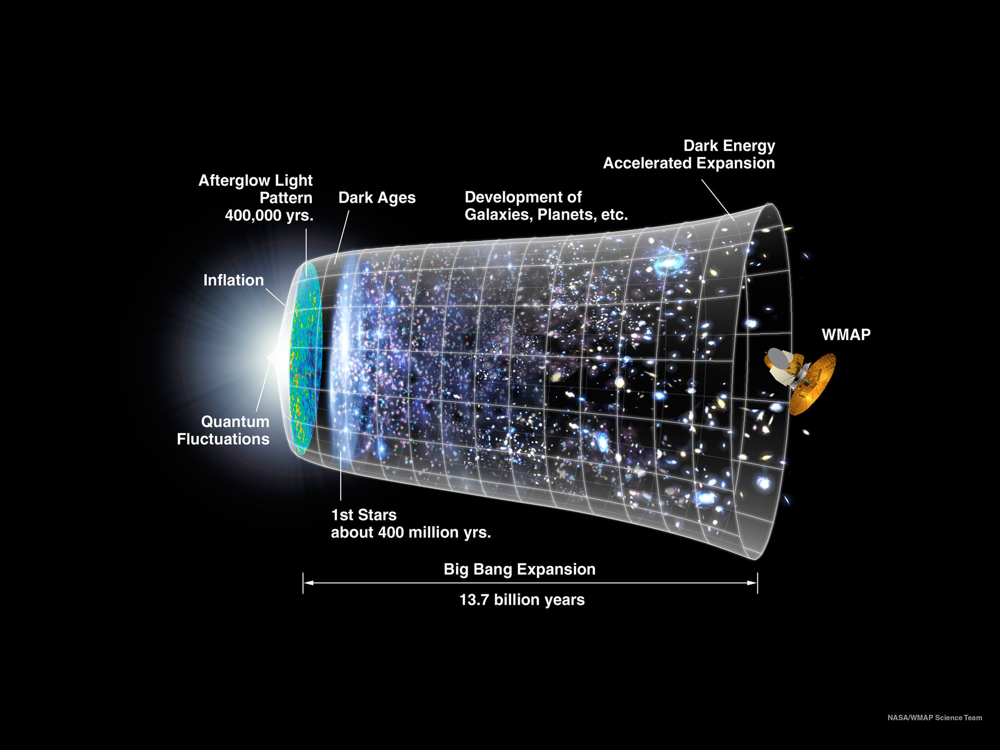{width="70%" fig-alt="TODO: describe image"}

- Evolution of the universe

---

## Friedmann–Lemaître equations

<!-- TODO: complex slide layout (flagged by detect_complex_slide.py - see run log). Content below is complete but UNARRANGED - needs manual layout to match the original slide. -->

- original version:: : Wjh31, Quibik, CC BY-SA 3.0 <https://creativecommons.org/licenses/by-sa/3.0>, via Wikimedia Commons

- A closer look at our PDE problem:

- $$\begin{matrix}
{H}^{2} & ={\left( \frac{\mathop{R}\limits^{ \cdot }}{R} \right)}^{2}=\frac{8 \pi {G}_{N} \rho }{3}-\frac{k{c}^{2}}{{R}^{2}}+\frac{ \Lambda {c}^{2}}{3} \\
\frac{\mathop{R}\limits^{ \cdot  \cdot }}{R} & =-\frac{4 \pi {G}_{N}}{3}( \rho +3p)+\frac{ \Lambda {c}^{2}}{3}
\end{matrix}$$

- Hubble parameter $H(t)$
- At present, $H({t}_{0})=72$ km/s/MPc

- $ \rho (t)=$density

- Constants

- $R(t)=$cosmological scale factor

- $p=$pressure

- Value of $k$:
  - $k=1$: closed 3-sphere
  - $k=0$: flat
  - $k=-1$: open 3-hyperboloid

---

## Friedmann–Lemaître equations

- original version:: : Wjh31, Quibik, CC BY-SA 3.0 <https://creativecommons.org/licenses/by-sa/3.0>, via Wikimedia Commons

- Eliminating $ \Lambda $, and using conservation of mass and energy, we can derive:

- $$\mathop{ \rho }\limits^{ \cdot }=-3H( \rho +3p)$$

- Further, we can simplify the equations by scaling the mass density and pressure to include all of the constants:

- $$\begin{matrix}
{H}^{2} & ={\left( \frac{\mathop{R}\limits^{ \cdot }}{R} \right)}^{2}=\frac{8 \pi G}{3} \rho -\frac{k{c}^{2}}{{R}^{2}} \\
\mathop{H}\limits^{ \cdot }+{H}^{2} & ={\left( \frac{\mathop{R}\limits^{ \cdot  \cdot }}{R} \right)}^{2}=-\frac{4 \pi G}{3}\left(  \rho +\frac{3p}{{c}^{2}} \right)
\end{matrix}$$

---

## Friedmann–Lemaître equations

- original version:: : Wjh31, Quibik, CC BY-SA 3.0 <https://creativecommons.org/licenses/by-sa/3.0>, via Wikimedia Commons

- Even more simplifications:
  - If we consider a perfect fluid, the pressure is proportional to the density: $p=w \rho $ for some constant $w$.
  - Space is flat ($k=0$)
  - Choose natural units ($c=1$)

- $$\begin{matrix}
{H}^{2} & ={\left( \frac{\mathop{R}\limits^{ \cdot }}{R} \right)}^{2}=\frac{8 \pi G}{3} \rho  \\
\mathop{H}\limits^{ \cdot }+{H}^{2} & ={\left( \frac{\mathop{R}\limits^{ \cdot  \cdot }}{R} \right)}^{2}=-\frac{4 \pi G}{3}\left( 1+3w \right) \rho 
\end{matrix}$$

- This is homework problem 4!
  - Solve it both analytically and numerically.

---

# $N$-body simulations

---

## $N$-body simulations

<!-- TODO: complex slide layout (flagged by detect_complex_slide.py - see run log). Content below is complete but UNARRANGED - needs manual layout to match the original slide. -->

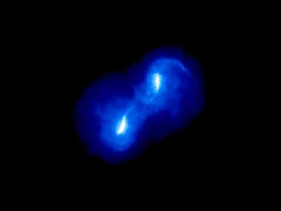{fig-alt="TODO"}

- Galaxy collision

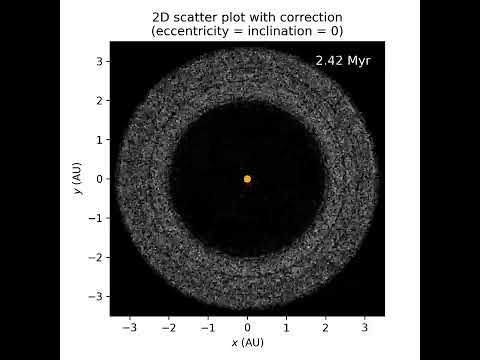{fig-alt="TODO"}

- Asteroids
- original version:: : Wjh31, Quibik, CC BY-SA 3.0 <https://creativecommons.org/licenses/by-sa/3.0>, via Wikimedia Commons

- We spent a few lectures last semester on the 3-body problem. Let's move up to the general $N$-body problem.
- Specifically, consider $N$ interacting particles with a long-range force between each pair (such as gravity, $F \sim 1/{r}^{2}$).
  - Corresponds to real life problems like structure formation of galaxies, stars, superclusters, etc.
- References:
  - [Hut and Makino, "A Starter Code for N-body Simulations" (2003)](https://www.ias.edu/exids/starter-code-n-body-simulations)
  - [Ng, "5 steps to N body simulation" (2025)](https://alvinng4.github.io/grav_sim/5_steps_to_n_body_simulation/)
  - [Trenti and Hut, "N-body simulations (gravitational)" (2008)](http://www.scholarpedia.org/article/N-body_simulations_(gravitational))

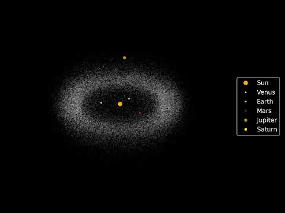{fig-alt="TODO"}

- Solar system

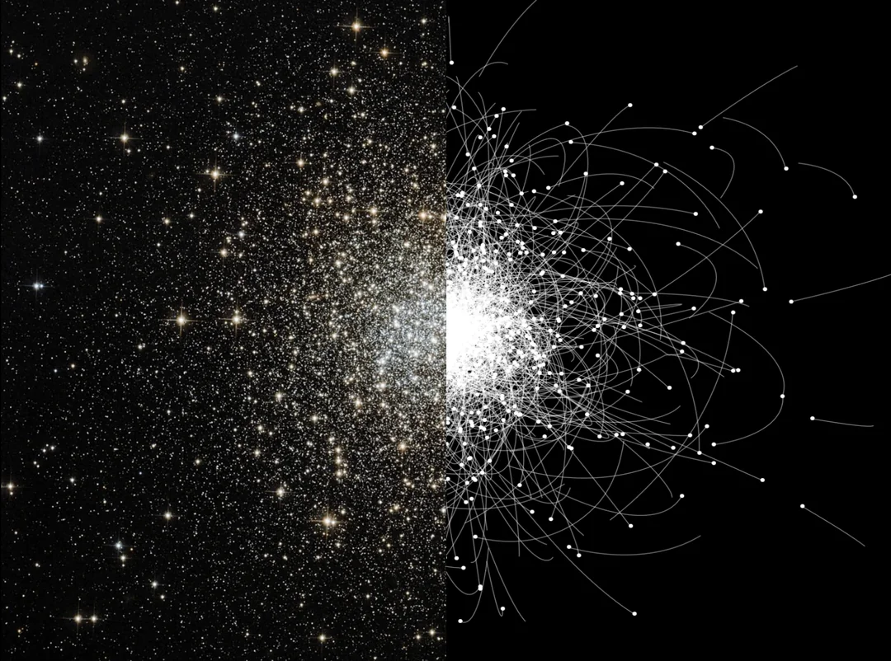{fig-alt="TODO"}

- Globular cluster

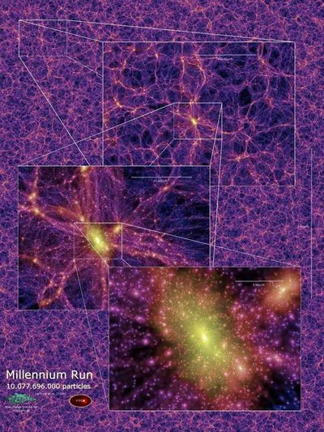{fig-alt="TODO"}

- Large-scale structure

---

## Celestial dynamics

- One more classical application of ODE techniques: celestial dynamics, aka $N$-body problem.

- original version: Haade;vectorization: Wjh31, Quibik, CC BY-SA 3.0 <https://creativecommons.org/licenses/by-sa/3.0>, via Wikimedia Commons

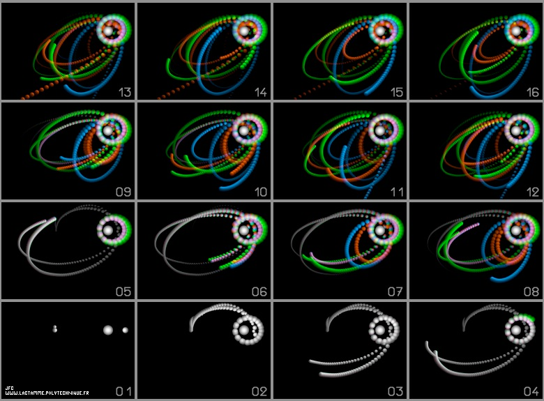{width="70%" fig-alt="TODO: describe image"}

- N-body simulations from [https://www.lactamme.polytechnique.fr/mosaic/descripteurs/Galerie_CelestialMechanics.FV.html](https://www.lactamme.polytechnique.fr/mosaic/descripteurs/Galerie_CelestialMechanics.FV.html)
- Repeat from lectures on ODEs

---

## Celestial dynamics

<!-- TODO: complex slide layout (flagged by detect_complex_slide.py - see run log). Content below is complete but UNARRANGED - needs manual layout to match the original slide. -->

- original version: Haade;vectorization: Wjh31, Quibik, CC BY-SA 3.0 <https://creativecommons.org/licenses/by-sa/3.0>, via Wikimedia Commons

- A sort of bifurcation diagram:
  - 2-body dynamics is trivial; solved in the 17th century; it's what we make 1st year undergrads calculate.
  - 3-body dynamics : intractably difficult, chaotic dynamical system, people spend their entire lives on this problem

{fig-alt="TODO"}

- Isaac Newton
- Divine nudges from time to time to maintain stability

- (paraphrased)

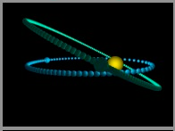{fig-alt="TODO"}

- 3 body motion
{fig-alt="TODO"}

- The Creation of Adam by Michelangelo
- Repeat from lectures on ODEs

---

## Celestial dynamics

<!-- TODO: complex slide layout (flagged by detect_complex_slide.py - see run log). Content below is complete but UNARRANGED - needs manual layout to match the original slide. -->

- original version: Haade;vectorization: Wjh31, Quibik, CC BY-SA 3.0 <https://creativecommons.org/licenses/by-sa/3.0>, via Wikimedia Commons

- A sort of bifurcation diagram:
  - 2-body dynamics is trivial; solved in the 17th century; it's what we make 1st year undergrads calculate.
  - 3-body dynamics : intractably difficult, chaotic dynamical system, people spend their entire lives on this problem

{fig-alt="TODO"}

- Isaac Newton
{fig-alt="TODO"}

- 3 body motion
{fig-alt="TODO"}

- The Creation of Adam by Michelangelo
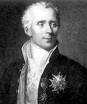{fig-alt="TODO"}

- Laplace
- These phenomena and some others similarly explained, lead us to believe that everything depends on these laws by relations more or less hidden, but of which it is wiser to admit ignorance, rather than to substitute imaginary causes solely in order to quiet our uneasiness about the origin of the things that interest us.

- [http://arxiv.org/abs/1503.06861v1](http://arxiv.org/abs/1503.06861v1)

- Repeat from lectures on ODEs

---

## Celestial dynamics

<!-- TODO: complex slide layout (flagged by detect_complex_slide.py - see run log). Content below is complete but UNARRANGED - needs manual layout to match the original slide. -->

- original version: Haade;vectorization: Wjh31, Quibik, CC BY-SA 3.0 <https://creativecommons.org/licenses/by-sa/3.0>, via Wikimedia Commons

- A sort of bifurcation diagram:
  - 2-body dynamics is trivial; solved in the 17th century; it's what we make 1st year undergrads calculate.
  - 3-body dynamics : intractably difficult, chaotic dynamical system, people spend their entire lives on this problem

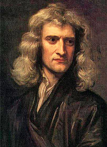{fig-alt="TODO"}

- Isaac Newton
{fig-alt="TODO"}

- 3 body motion
{fig-alt="TODO"}

- The Creation of Adam by Michelangelo
{fig-alt="TODO"}

- Laplace
- [http://arxiv.org/abs/1503.06861v1](http://arxiv.org/abs/1503.06861v1)

- Translation : It’s okay to just say “I don’t know yet”!

- Repeat from lectures on ODEs

---

## Celestial dynamics

- original version: Haade;vectorization: Wjh31, Quibik, CC BY-SA 3.0 <https://creativecommons.org/licenses/by-sa/3.0>, via Wikimedia Commons

- 3-body ODE:

- $$\begin{aligned}
{\mathop{\mathbf{r}}\limits^{ \cdot  \cdot }}_{1}=-G{m}_{2}\frac{{\mathbf{r}}_{1}-{\mathbf{r}}_{2}}{|{\mathbf{r}}_{1}-{\mathbf{r}}_{2}{|}^{3}}-G{m}_{3}\frac{{\mathbf{r}}_{1}-{\mathbf{r}}_{3}}{|{\mathbf{r}}_{1}-{\mathbf{r}}_{3}{|}^{3}} \\
{\mathop{\mathbf{r}}\limits^{ \cdot  \cdot }}_{2}=-G{m}_{1}\frac{{\mathbf{r}}_{2}-{\mathbf{r}}_{1}}{|{\mathbf{r}}_{2}-{\mathbf{r}}_{1}{|}^{3}}-G{m}_{3}\frac{{\mathbf{r}}_{2}-{\mathbf{r}}_{3}}{|{\mathbf{r}}_{2}-{\mathbf{r}}_{3}{|}^{3}} \\
{\mathop{\mathbf{r}}\limits^{ \cdot  \cdot }}_{3}=-G{m}_{1}\frac{{\mathbf{r}}_{3}-{\mathbf{r}}_{1}}{|{\mathbf{r}}_{3}-{\mathbf{r}}_{1}{|}^{3}}-G{m}_{2}\frac{{\mathbf{r}}_{3}-{\mathbf{r}}_{2}}{|{\mathbf{r}}_{3}-{\mathbf{r}}_{2}{|}^{3}}
\end{aligned}$$

- 9 degrees of freedom (3 bodies * 3 dimension).
- 7 independent conserved quantities (energy, linear momentum, angular momentum).
- Underconstrained problem: cannot solve exactly, except in special cases.
  - ... so we solve it numerically.

- Repeat from lectures on ODEs

---

## 2D 3-body problem

- original version: Haade;vectorization: Wjh31, Quibik, CC BY-SA 3.0 <https://creativecommons.org/licenses/by-sa/3.0>, via Wikimedia Commons

- Approximately solvable problem: 3-body motion, with:
  - Movement constrained to be co-planar (i.e. confined to x-y plane). Note, in general this is not stable (planets will deviate in z direction).
  - $${m}_{3}=0$$

- $$\begin{aligned}
{\mathop{\mathbf{r}}\limits^{ \cdot  \cdot }}_{1}=-G{m}_{2}\frac{{\mathbf{r}}_{1}-{\mathbf{r}}_{2}}{|{\mathbf{r}}_{1}-{\mathbf{r}}_{2}{|}^{3}}-G{m}_{3}\frac{{\mathbf{r}}_{1}-{\mathbf{r}}_{3}}{|{\mathbf{r}}_{1}-{\mathbf{r}}_{3}{|}^{3}} \\
{\mathop{\mathbf{r}}\limits^{ \cdot  \cdot }}_{2}=-G{m}_{1}\frac{{\mathbf{r}}_{2}-{\mathbf{r}}_{1}}{|{\mathbf{r}}_{2}-{\mathbf{r}}_{1}{|}^{3}}-G{m}_{3}\frac{{\mathbf{r}}_{2}-{\mathbf{r}}_{3}}{|{\mathbf{r}}_{2}-{\mathbf{r}}_{3}{|}^{3}} \\
{\mathop{\mathbf{r}}\limits^{ \cdot  \cdot }}_{3}=-G{m}_{1}\frac{{\mathbf{r}}_{3}-{\mathbf{r}}_{1}}{|{\mathbf{r}}_{3}-{\mathbf{r}}_{1}{|}^{3}}-G{m}_{2}\frac{{\mathbf{r}}_{3}-{\mathbf{r}}_{2}}{|{\mathbf{r}}_{3}-{\mathbf{r}}_{2}{|}^{3}}
\end{aligned}$$

- $${\mathbf{r}}_{i}=({x}_{i},{y}_{i})$$

- Repeat from lectures on ODEs

---

## 2D 3-body problem: effective potential

- original version: Haade;vectorization: Wjh31, Quibik, CC BY-SA 3.0 <https://creativecommons.org/licenses/by-sa/3.0>, via Wikimedia Commons

- Ignoring the Coriolis force for now, we can define an effective potential for this force.
  - Recall: orbiting in the Lennard–Jones potential, from the calculus lectures.

- $$V({x}^{′},{y}^{′})=-\frac{1- \alpha }{\sqrt{({x}^{′}- \alpha {)}^{2}+{y}^{′2}}}-\frac{ \alpha }{\sqrt{({x}^{′}+1- \alpha {)}^{2}+{y}^{′2}}}-\frac{{x}^{′2}+{y}^{′2}}{2}$$

- This potential has 5 extrema:
  - 2 maxima (L4, L5)
  - 3 saddle points (L1, L2, L3)
- These are the famous Lagrange points.
  - [Wikipedia article](https://en.wikipedia.org/wiki/Lagrange_point) is definitely worth a read :)

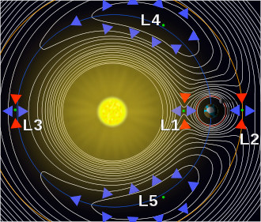{width="70%" fig-alt="TODO: describe image"}

- Lagrange points
- Repeat from lectures on ODEs

---

## N-body problem

- original version: Haade;vectorization: Wjh31, Quibik, CC BY-SA 3.0 <https://creativecommons.org/licenses/by-sa/3.0>, via Wikimedia Commons

- $N$-body problems are common in astrophysics:
  - Solar system ($N \sim 10$)
  - Solar system with asteroid belt ($N \sim {10}^{5}$)
  - Star clusters ($N \sim {10}^{6}$)
  - Galaxies, dark matter halos
  - Galaxy clusters, large scale structure
- Other examples:
  - Some problems in electrostatics, e.g. proteins and cellular assembly
  - Statistics/machine learning
  - Vortex methods in computation fluid dynamics

---

## Example: solar system w/asteroids

- original version:: : Wjh31, Quibik, CC BY-SA 3.0 <https://creativecommons.org/licenses/by-sa/3.0>, via Wikimedia Commons

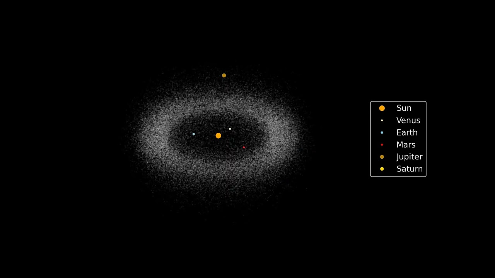{width="70%" fig-alt="TODO: describe image"}

- Solar system w/asteroids [https://www.youtube.com/watch?v=C45ceYja0jE](https://www.youtube.com/watch?v=C45ceYja0jE) (Alvin Ng)

---

## Example: galaxy collision

- original version:: : Wjh31, Quibik, CC BY-SA 3.0 <https://creativecommons.org/licenses/by-sa/3.0>, via Wikimedia Commons

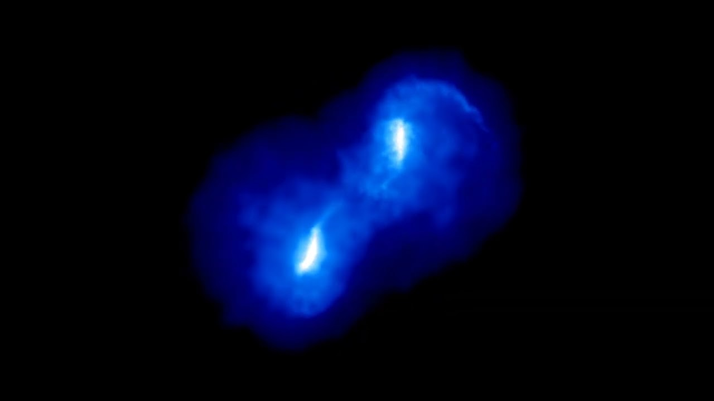{width="70%" fig-alt="TODO: describe image"}

- Galaxy collsion [https://www.youtube.com/watch?v=nXTUdjLXwtI](https://www.youtube.com/watch?v=nXTUdjLXwtI) (Alvin Ng)

---

## Example: large scale structure

<!-- TODO: complex slide layout (flagged by detect_complex_slide.py - see run log). Content below is complete but UNARRANGED - needs manual layout to match the original slide. -->

- original version:: : Wjh31, Quibik, CC BY-SA 3.0 <https://creativecommons.org/licenses/by-sa/3.0>, via Wikimedia Commons

{fig-alt="TODO"}

- Full resolution at [https://upload.wikimedia.org/wikipedia/commons/b/ba/Location_of_Earth_%289x1-English_Annot-small%29.png](https://upload.wikimedia.org/wikipedia/commons/b/ba/Location_of_Earth_%289x1-English_Annot-small%29.png)
- Observational cosmology has established that matter is distributed"hierarchical structure" in the universe at different distance scales
  - Galaxies < groups < (super)clusters < filaments/voids
  - Quantified via [matter power spectrum](https://en.wikipedia.org/wiki/Matter_power_spectrum)

{fig-alt="TODO"}

- Panoramic view of the entire near-infrared sky reveals the distribution of galaxies beyond the Milky Way. The galaxies are color-coded by redshift, i.e., distance. [https://en.wikipedia.org/wiki/Large-scale_structure_of_the_universe#/media/File:2MASS_LSS_chart-NEW_Nasa.jpg](https://en.wikipedia.org/wiki/Large-scale_structure_of_the_universe#/media/File:2MASS_LSS_chart-NEW_Nasa.jpg)
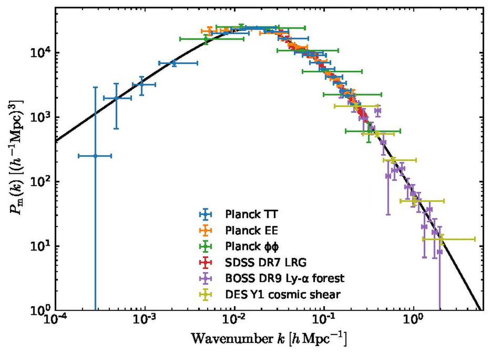{fig-alt="TODO"}

- [https://en.wikipedia.org/wiki/File:Planck_2018_Linear_Matter_Power_Spectrum.pdf](https://en.wikipedia.org/wiki/File:Planck_2018_Linear_Matter_Power_Spectrum.pdf)

---

## Example: large scale structure

<!-- TODO: complex slide layout (flagged by detect_complex_slide.py - see run log). Content below is complete but UNARRANGED - needs manual layout to match the original slide. -->

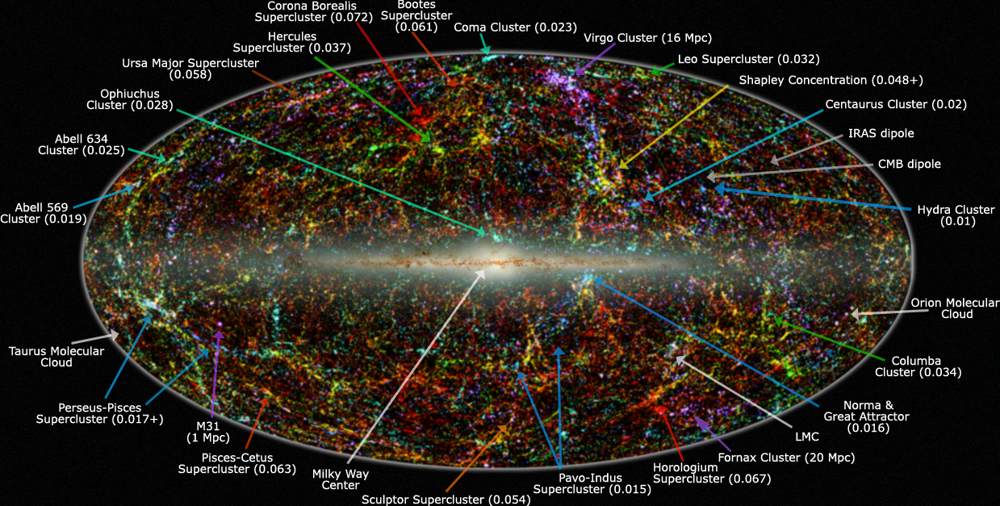{fig-alt="TODO"}

- [https://en.wikipedia.org/wiki/Large-scale_structure_of_the_universe#/media/File:2MASS_LSS_chart-NEW_Nasa.jpg](https://en.wikipedia.org/wiki/Large-scale_structure_of_the_universe#/media/File:2MASS_LSS_chart-NEW_Nasa.jpg)
- original version:: : Wjh31, Quibik, CC BY-SA 3.0 <https://creativecommons.org/licenses/by-sa/3.0>, via Wikimedia Commons

{fig-alt="TODO"}

- Full resolution at [https://upload.wikimedia.org/wikipedia/commons/b/ba/Location_of_Earth_%289x1-English_Annot-small%29.png](https://upload.wikimedia.org/wikipedia/commons/b/ba/Location_of_Earth_%289x1-English_Annot-small%29.png)
- Observational cosmology has established that matter is distributed"hierarchical structure" in the universe at different distance scales
  - Galaxies < groups < (super)clusters < filaments/voids
  - Quantified via matter power spectrum
- We can model this with state-of-the-art $N$-body simulation!
  - Crucial link between theory (e.g. $ \Lambda $CDM model) and observation

{fig-alt="TODO"}

- EUCLID simulation of large-scale structure ([https://www.euclid-ec.org/public/data/simulations/](https://www.euclid-ec.org/public/data/simulations/)); you can download it!

---

## Example: Millenium simulation

- original version:: : Wjh31, Quibik, CC BY-SA 3.0 <https://creativecommons.org/licenses/by-sa/3.0>, via Wikimedia Commons

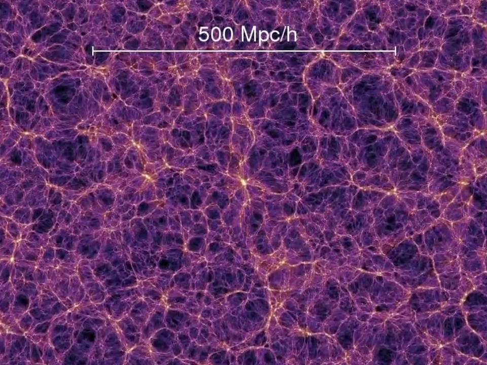{width="70%" fig-alt="TODO: describe image"}

- "Millenium Simulation" [https://www.youtube.com/watch?v=yyfpFfWq7Bc](https://www.youtube.com/watch?v=yyfpFfWq7Bc)

---

## Example: Euclid simulation

- original version:: : Wjh31, Quibik, CC BY-SA 3.0 <https://creativecommons.org/licenses/by-sa/3.0>, via Wikimedia Commons

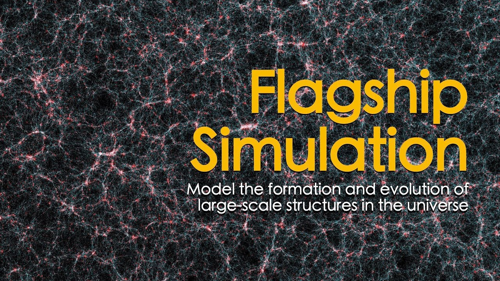{width="70%" fig-alt="TODO: describe image"}

- Euclid simulation [https://www.youtube.com/watch?v=Ug_1IJCS0v8](https://www.youtube.com/watch?v=Ug_1IJCS0v8)

---

## $N$-body simulations

- original version:: : Wjh31, Quibik, CC BY-SA 3.0 <https://creativecommons.org/licenses/by-sa/3.0>, via Wikimedia Commons

- Onto computational aspects!
- Key problem: the long-range interaction.
- Let's say we have a uniform density of particles.
- Consider the effect on one particle from other particles in the shell $(r,r+ \delta r)$:
  - Force is $F \sim 1/{r}^{2}$
  - Number of particles $dN \sim 4 \pi {r}^{2} \delta r$
  - $$FdN \sim 4 \pi  \delta r$$
- Thus, the "total effect" is independent of $r$!
  - Cannot truncate the computation :(

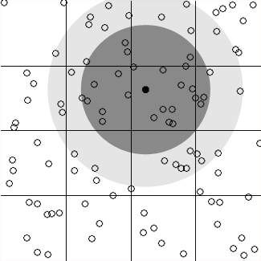{width="70%" fig-alt="TODO: describe image"}

- Distribution of particles in N body problem

---

## $N$-body simulations

<!-- TODO: complex slide layout (flagged by detect_complex_slide.py - see run log). Content below is complete but UNARRANGED - needs manual layout to match the original slide. -->

- original version:: : Wjh31, Quibik, CC BY-SA 3.0 <https://creativecommons.org/licenses/by-sa/3.0>, via Wikimedia Commons

- In other words, to calculate forces between $N$ particles, we always need to compute all $N(N-1)/2$ interactions between each pair.
- Simple to say... but computationally intractable!

{fig-alt="TODO"}

- Forces between N bodies

---

## $N$-body simulations

- original version:: : Wjh31, Quibik, CC BY-SA 3.0 <https://creativecommons.org/licenses/by-sa/3.0>, via Wikimedia Commons

- One improvement: try the next level of sophistication in our ODE solvers
  - So far, we have evolved position and velocity (according to velocity and acceleration, respectively)
    - I.e. solve a system of 2 variables, $\mathbf{r}$ and $\mathop{\mathbf{r}}\limits^{ \cdot }$.
  - How about evolving acceleration!?
  - Use the JERK!

---

## $N$-body simulations

<!-- TODO: complex slide layout (flagged by detect_complex_slide.py - see run log). Content below is complete but UNARRANGED - needs manual layout to match the original slide. -->

- One improvement: try the next level of sophistication in our ODE solvers
  - So far, we have evolved position and velocity (according to velocity and acceleration, respectively)
    - I.e. solve a system of 2 variables, $\mathbf{r}$ and $\mathop{\mathbf{r}}\limits^{ \cdot }$.
  - How about evolving acceleration!?
  - Use the JERK!

- original version:: : Wjh31, Quibik, CC BY-SA 3.0 <https://creativecommons.org/licenses/by-sa/3.0>, via Wikimedia Commons

{fig-alt="TODO"}

- Steve Martin in "The Jerk"
- Not this jerk

- This jerk

{fig-alt="TODO"}

---

## $N$-body simulations

- original version:: : Wjh31, Quibik, CC BY-SA 3.0 <https://creativecommons.org/licenses/by-sa/3.0>, via Wikimedia Commons

- First let’s look at simple systems where we actually solve the ODEs for all particles
  - We'll use third-party software: [https://www.ias.edu/exids/starter-code-n-body-simulations](https://www.ias.edu/exids/starter-code-n-body-simulations)
  - Instructions: [https://github.com/ubsuny/CompPhys/tree/main/AdvDiffEq](https://github.com/ubsuny/CompPhys/tree/main/AdvDiffEq)
  - Textbook: [http://www.artcompsci.org/msa/web/vol_1/v1_web/v1_web.html](http://www.artcompsci.org/msa/web/vol_1/v1_web/v1_web.html)
- It works.. but you can quickly find the limit
  - We can’t animate and solve the ODEs in real time for $N \gtrsim 30$!

---

## $N$-body simulations

- original version:: : Wjh31, Quibik, CC BY-SA 3.0 <https://creativecommons.org/licenses/by-sa/3.0>, via Wikimedia Commons

- Code uses a “predictor-corrector” algorithm:
  - Step 1: predict position and velocity at next time step
    - (i.e. evolve system as a trial step, to be revised in a bit)
  - Step 2: computes acceleration and jerk at those predicted points using Taylor series

- $$\begin{matrix}
{\vec{r}}_{p} & =\vec{r}+\vec{v} \delta t+\frac{1}{2}\vec{a} \delta {t}^{2}+\frac{1}{6}\vec{J} \delta {t}^{3} \\
{\vec{v}}_{p} & =\vec{v}+\vec{a} \delta t+\frac{1}{2}\vec{J} \delta {t}^{2}
\end{matrix}$$

- $$\begin{matrix}
\vec{k} &  \equiv \frac{1}{2}{\vec{a}}^{′′} \delta {t}^{2}=2(\vec{a}-{\vec{a}}_{p})+ \delta t(\vec{J}-{\vec{J}}_{p}) \\
\vec{l} &  \equiv \frac{1}{2}{\vec{a}}^{′′′} \delta {t}^{3}=-3(\vec{a}-{\vec{a}}_{p})- \delta t(2\vec{J}-{\vec{J}}_{p})
\end{matrix}$$

---

## $N$-body simulations

- original version:: : Wjh31, Quibik, CC BY-SA 3.0 <https://creativecommons.org/licenses/by-sa/3.0>, via Wikimedia Commons

- Code uses a “predictor-corrector” algorithm:
  - Step 3: use $\vec{k}$ and $\vec{l}$ to correct the trial ${\vec{r}}_{p}$ and ${\vec{v}}_{p}$:
- Additionally, the code is adaptive: time step is adjusted based on "least collision time," the smallest time between interactions of two objects
  - Intuition: if two particles happen to be close, it's more important, so reduce the time step.
  - Similar to adaptive RK4(5) algorithm.

- $$\begin{matrix}
{\vec{r}}_{c} & ={\vec{r}}_{p}+\left( \frac{1}{12}\vec{k}+\frac{1}{20}\vec{l} \right) \delta {t}^{2} \\
{\vec{v}}_{c} & ={\vec{v}}_{p}+\left( \frac{1}{3}\vec{k}+\frac{1}{4}\vec{l} \right) \delta t
\end{matrix}$$

---

## $N$-body simulations

<!-- TODO: complex slide layout (flagged by detect_complex_slide.py - see run log). Content below is complete but UNARRANGED - needs manual layout to match the original slide. -->

- original version:: : Wjh31, Quibik, CC BY-SA 3.0 <https://creativecommons.org/licenses/by-sa/3.0>, via Wikimedia Commons

- The full $N$-body problem is $O({N}^{2})$ :( How do we improve?
- Particle mesh:
  - Create a 3D lattice; approximate forces from lattice cells, rather than each particle.
  - Good for uniform configurations.
  - $O(Mlog(M))$, where $M=$#(grid points)
- Trees:
  - Partition space into hierarchy of cubes of different sizes: "octree" algorithm.
  - Compute particle-particle interactions for close interactions
  - Compute cell-cell (or particle-cell) interactions for far interactions
  - $O(Nlog(N))$, $N=$#(particles)

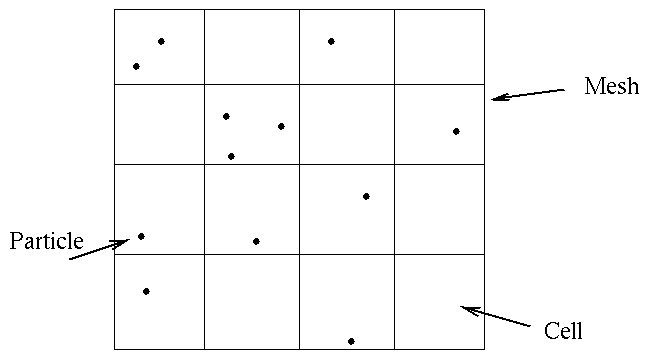{fig-alt="TODO"}

- Particle mesh
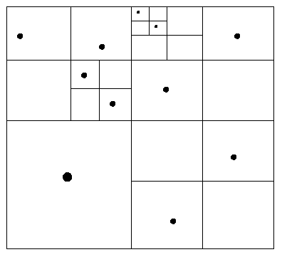{fig-alt="TODO"}

- 2D spatial partition with "quadtree" algorithm
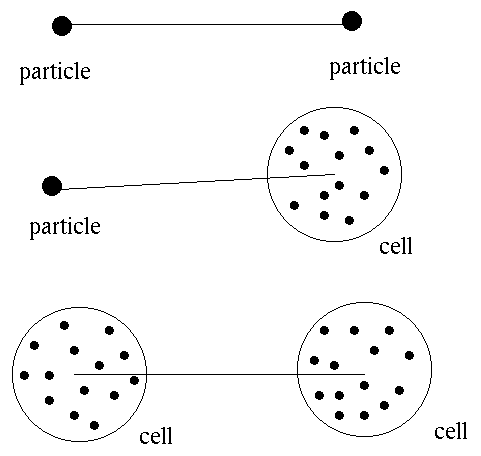{fig-alt="TODO"}

- Interactions of particles and cells
- [http://www.new-npac.org/projects/cdroms/cewes-1999-06-vol2/cps615course/nbody-materials/nbody-simulations.html](http://www.new-npac.org/projects/cdroms/cewes-1999-06-vol2/cps615course/nbody-materials/nbody-simulations.html)

---

## $N$-body simulations

- original version:: : Wjh31, Quibik, CC BY-SA 3.0 <https://creativecommons.org/licenses/by-sa/3.0>, via Wikimedia Commons

- How do we improve the computational complexity?
- Fast multipole methods
  - Expands Green's function in a multipole
  - $O(N)$, $N=$#(particles)
- Fluid dynamics approximations
  - Approximate by PDEs, not individual particles
  - Obviously, only applicable for specific (fluid) problems.

---

## $N$-body simulations

- original version:: : Wjh31, Quibik, CC BY-SA 3.0 <https://creativecommons.org/licenses/by-sa/3.0>, via Wikimedia Commons

- There's a lot of code available!
  - AREPO: [http://wwwmpa.mpa-garching.mpg.de/~volker/arepo/](http://wwwmpa.mpa-garching.mpg.de/~volker/arepo/)
  - GADGET: [http://wwwmpa.mpa-garching.mpg.de/gadget/](http://wwwmpa.mpa-garching.mpg.de/gadget/)
- Example of a GADGET simulation from a former CompPhys student (Leigh Korbel) for MS project

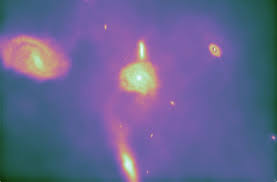{width="70%" fig-alt="TODO: describe image"}

- AREPO simulation
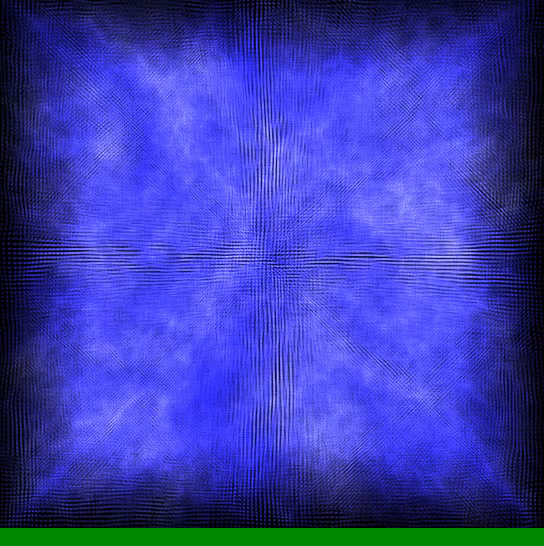{width="70%" fig-alt="TODO: describe image"}

- GADGET simulation

---

## Hands-on

- original version:: : Wjh31, Quibik, CC BY-SA 3.0 <https://creativecommons.org/licenses/by-sa/3.0>, via Wikimedia Commons

- Try it out: CompPhys/AdvDiffEq/nbody_animate.ipynb
  - This downloads some C++ code.
  - It takes a few minutes to run, so I recommend starting the computation, and reading through the C++ to understand the methods while it's running.
- You can also take a look at alvinng4's examples
  - My fork [https://github.com/DryRun/grav_sim](https://github.com/DryRun/grav_sim) (puts everything in jupyter notebooks)
  - Computation is a bit simpler than nbody_animate, but maybe easier to understand.

---

## Asteroid belt simulation

- original version:: : Wjh31, Quibik, CC BY-SA 3.0 <https://creativecommons.org/licenses/by-sa/3.0>, via Wikimedia Commons

- One last exercise for $N$-body problem: simulating the asteroid belt.
  - Notebooks based on [https://github.com/alvinng4/](https://github.com/alvinng4/)
- Some of you have probably wondered: how do I add software to the Docker environment?
  - To some extent... you don't!
  - Recall that most folders in the container are transient, and are deleted when you stop the container.
  - So, if you apt install emacs, it will be installed under e.g. /usr/bin, and deleted when you close the container!
  - Same goes for pip.
- Workaround: you can do local installations in persistent folders (e.g. mounted CompPhys folder, or a Docker volume).

---

## Instructions

- original version:: : Wjh31, Quibik, CC BY-SA 3.0 <https://creativecommons.org/licenses/by-sa/3.0>, via Wikimedia Commons

- Docker container users:
  - We can do a local pip install for the grav_sim code:
    - Outside the container, clone the repo inside CompPhys
    - Inside container, create folder for local python installs
    - Do a local pip install
- Native system users (e.g. virtualenv) can just pip install as normal
- ...after installation, grav_sim should be available as a python import
- Run through the notebooks:
  - grav_sim/examples/asteroid_belt_animation/python/asteroid_belt.ipynb
  - (grav_sim/examples/kirkwood_gaps/python/kirkwood.ipynb if ambitious)

- cd CompPhys/
- git clone git@github.com:DryRun/grav_sim.git

- mkdir -p CompPhys/.local/lib/python3.12/site-packages

- python -m pip install --target CompPhys/.local/lib/python3.12/site-packages CompPhys/grav_sim

- >> import grav_sim

- export PYTHONPATH=$HOME/CompPhys/.local/lib/python3.12/site-packages/

- Inside container:

- Outside container:

---

## A warning about Docker

- original version: Haade;vectorization: Wjh31, Quibik, CC BY-SA 3.0 <https://creativecommons.org/licenses/by-sa/3.0>, via Wikimedia Commons

- In principle, you can pip install grav_sim inside our Docker container
  - Remember, aside from mounted folders, everything in the container is transient, and will vanish when you stop the container!
  - If nothing else, this is a good demonstration of what Docker is not good at. For installing a python package, using conda or virtualenv is a better idea.
- If you want to get it working via Docker, you can tell pip to install in a specific location (the mounted CompPhys folder):

- # Start outside container
- cd CompPhys
- git clone git@github.com:DryRun/grav_sim.git
- mkdir .local/lib/python3.12/site-packages
- chmod -R a+w grav_sim
- chmod -R a+w .local
- ./runDocker.sh ubsuny/compphys:latest # or runDocker_wfix.sh
- # Inside container now
- export CMAKE_ARGS="-DUSE_HDF5=ON" # Compile w/HDF5 libraries
- export PYTHONPATH=/home/compphys/CompPhys/.local/lib/python3.12/site-packages
- python -m pip install --target CompPhys/.local/lib/python3.12/site-packages CompPhys/grav_sim

---

## Virtual environments

- original version: Haade;vectorization: Wjh31, Quibik, CC BY-SA 3.0 <https://creativecommons.org/licenses/by-sa/3.0>, via Wikimedia Commons

- A simpler way: python virtual environments or conda.
  - The venv module supports creating lightweight “virtual environments”, each with their own independent set of Python packages installed in their [site](https://docs.python.org/3/library/site.html#module-site) directories. A virtual environment is created on top of an existing Python installation, known as the virtual environment’s “base” Python, and by default is isolated from the packages in the base environment, so that only those explicitly installed in the virtual environment are available.
  - Conda package manager works similarly (more extensive, some licensing concerns)
  - Note: venv and conda are not compatible! Choose one.
- Virtual environments are a simple way to isolate a project's code, which is ~always a good idea.
  - Uses environment variables like PYTHONPATH to control where python looks for modules
- Check out [https://docs.python.org/3/library/venv.html](https://docs.python.org/3/library/venv.html)
- Demo grav_sim installation and [packaging](https://packaging.python.org/en/latest/)

- You might want to use this for your project!

---

## Kirkwood gaps

- original version:: : Wjh31, Quibik, CC BY-SA 3.0 <https://creativecommons.org/licenses/by-sa/3.0>, via Wikimedia Commons

- [Kirkwood gaps](https://en.wikipedia.org/wiki/Kirkwood_gap) are gaps in the distribution of asteroids in particular orbits (i.e., specific semi-major axes or orbital periods)
- Originate from orbital resonances with planets, particularly Jupiter
  - E.g. gap near semi-major axis = 2.50 AU, period = 3.95 years
  - This correspond to a 3:1 resonance with Jupiter
  - Resonance induces chaotic motion, disrupting orbits

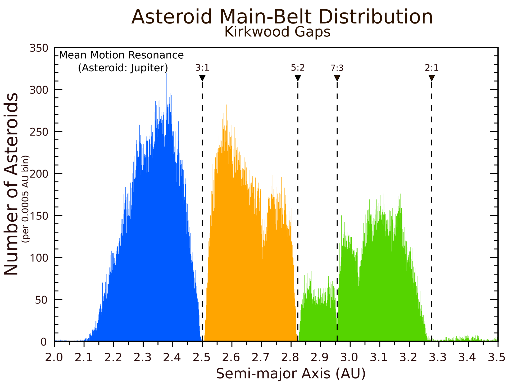{width="70%" fig-alt="TODO: describe image"}

- Histogram showing the four most prominent Kirkwood gaps
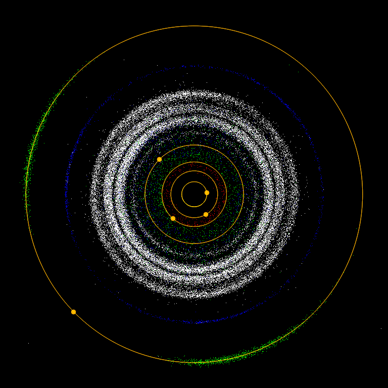{width="70%" fig-alt="TODO: describe image"}

- A plot of inner solar system asteroids and planets as of 2006 May 9, in a manner that exposes the Kirkwood gaps

---

## Kirkwood gaps

- original version:: : Wjh31, Quibik, CC BY-SA 3.0 <https://creativecommons.org/licenses/by-sa/3.0>, via Wikimedia Commons

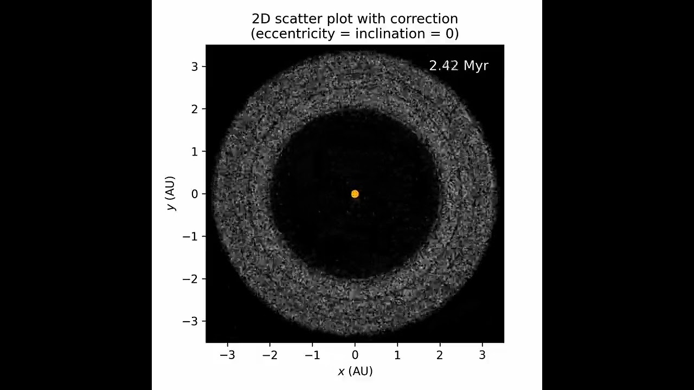{width="70%" fig-alt="TODO: describe image"}

- Animation of Kirkwood gaps in the asteroid belt

---

## Kirkwood gaps

- original version:: : Wjh31, Quibik, CC BY-SA 3.0 <https://creativecommons.org/licenses/by-sa/3.0>, via Wikimedia Commons

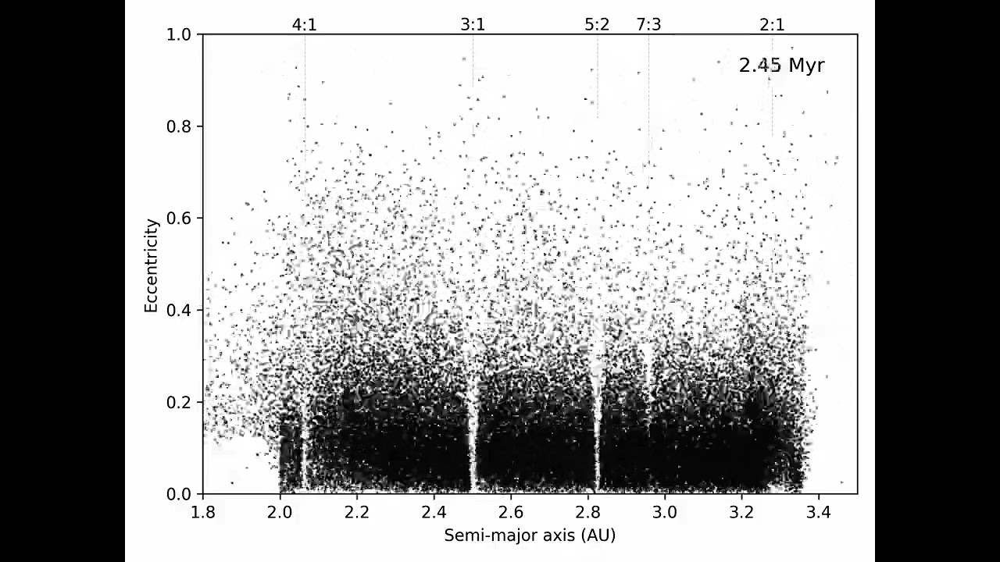{width="70%" fig-alt="TODO: describe image"}

- Animation of Kirkwood gaps in the asteroid belt
