## Recap of QM lectures

- original version: Haade;vectorization: Wjh31, Quibik, CC BY-SA 3.0 <https://creativecommons.org/licenses/by-sa/3.0>, via Wikimedia Commons

- We have covered a few topics in computational quantum mechanics:
  - Variational methods: use parametrized "trial" wave functions (${ \psi }_{T, \alpha }$) to find approximate solutions for potentially complex systems by minimizing $⟨E⟩$ versus $\vec{ \alpha }$
    - E.g. approximate molecules as sums of individual atom wave functions
  - Monte Carlo methods: use MC to handle large-dimensional integrals
    - E.g. use Metropolis–Hastings to sample wave function and compute integrals numerically
  - Diffusion methods: exploit mathematical similarities between Schroedinger and diffusion equations ($t \rightarrow i \tau $); arrange Hamiltonian such that system evolves to ground state in $ \tau  \rightarrow  \infty $ limit
  - (Path integral methods)

---

## Aside: analytic continuation

<!-- TODO: complex slide layout (flagged by detect_complex_slide.py - see run log). Content below is complete but UNARRANGED - needs manual layout to match the original slide. -->

- original version: Haade;vectorization: Wjh31, Quibik, CC BY-SA 3.0 <https://creativecommons.org/licenses/by-sa/3.0>, via Wikimedia Commons

- Analytic continuation is a technique for extending the domain of an analytic function ([wikipedia](https://en.wikipedia.org/wiki/Analytic_continuation)), often from real to complex
  - Interesting branch of mathematics, e.g. Riemann zeta function, gamma function
  - Useful uniqueness properties
- Last time, we used it to extend $ \psi (\vec{x},t)$ to complex values of $t$
  - Familiar quantum mechanics lies in the sub-domain $(\vec{x},\text{Re}[t])$
  - With a clever manipulation of the Hamiltonian ($V \rightarrow V-{E}_{T}$), we arrange for the wave function to converge to the ground state as $t \rightarrow i \infty $

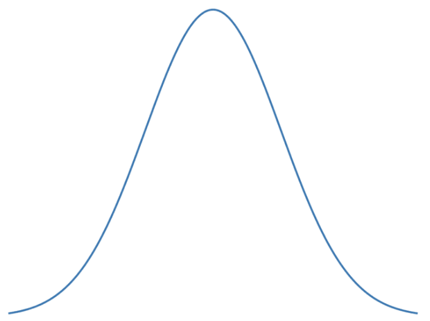{fig-alt="TODO"}

- x
- Re[t]
- Im[t]
- Cartoon of analytic continuation

---

## From QM to QFT

- original version: Haade;vectorization: Wjh31, Quibik, CC BY-SA 3.0 <https://creativecommons.org/licenses/by-sa/3.0>, via Wikimedia Commons

- Quantum mechanics describes the motion of "small things":
  - Hydrogen atoms
  - Quantum harmonic oscillator
- From classical to quantum: use "Schrodinger's trick",
- $$\begin{matrix}
{H}_{\text{cl.}} & =\frac{{p}^{2}}{2m}+V(x) \\
\vec{p} &  \rightarrow i \hbar \vec{ \nabla },E \rightarrow i \hbar \frac{ \partial }{ \partial t} \\
 \Rightarrow H & =-\frac{{ \hbar }^{2}}{2m}{ \nabla }^{2}+V(x)
\end{matrix}$$
- This yields Schroedinger's equation:
- $$H \psi =E \psi  \Rightarrow i \hbar \frac{ \partial }{ \partial t} \psi =-\frac{{ \hbar }^{2}}{2m}{ \nabla }^{2} \psi +V \psi $$

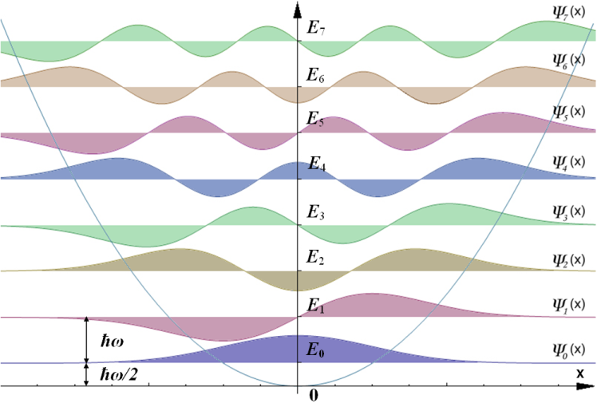{width="70%" fig-alt="TODO: describe image"}

- Quantum harmonic oscillator solutions

---

## From QM to QFT

- original version: Haade;vectorization: Wjh31, Quibik, CC BY-SA 3.0 <https://creativecommons.org/licenses/by-sa/3.0>, via Wikimedia Commons

- In QM, the wave function defines a probability density,
  - $$ \rho ={ \psi }^{*} \psi =| \psi {|}^{2}$$
- Consider a single particle ($ \psi (\vec{x},t)$), or a certain number of particles (e.g. $|{ \psi }_{{e}_{1}}{ \psi }_{{e}_{2}}⟩$ for He atom)
  - Fixed #(particles) is baked into formalism (Hilbert space = complex functions on fixed domain); not immediately obvious how to handle things like variable particle number, e.g. matter-antimatter annihilations, quantizing $\vec{E}$, ...
- Aside: we can also define a probability current vector,
  - $$J=-\frac{i \hbar }{2m}({ \psi }^{*} \nabla  \psi - \psi  \nabla { \psi }^{*})$$
- that satisfies a conservation equation,
  - $$\vec{ \nabla } \cdot \vec{J}+\frac{ \partial  \rho }{ \partial t}=0$$

---

## From QM to QFT

- original version: Haade;vectorization: Wjh31, Quibik, CC BY-SA 3.0 <https://creativecommons.org/licenses/by-sa/3.0>, via Wikimedia Commons

- On the other hand, relativity describes the motion of "fast things":
  - $$\begin{aligned}
{E}^{2}={p}^{2}{c}^{2}+{m}^{2}{c}^{4}[c=1] \\
E= \pm m{\left( 1+{p}^{2}/{m}^{2} \right)}^{\frac{1}{2}}
\end{aligned}$$
  - If $p \ll m$, then $E \approx m(1+{p}^{2}/(2{m}^{2}))$, thus K.E.$={p}^{2}/(2m)$.
- Governs behavior of relativistic particles: photons, electrons/protons, etc.
- The Schroedinger equation is manifestly not compatible with special relativity!
  - Distinct treatment of space and time

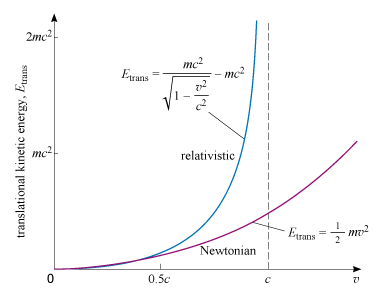{width="70%" fig-alt="TODO: describe image"}

- Relativistic vs. Newtonian kinetic energy

---

## Relativistic QM

- original version: Haade;vectorization: Wjh31, Quibik, CC BY-SA 3.0 <https://creativecommons.org/licenses/by-sa/3.0>, via Wikimedia Commons

- Towards a theory of relativistic QM, we can try Schroedinger's trick with ${E}^{2}={p}^{2}{c}^{2}+{m}^{2}{c}^{4}$:
- $$\vec{p} \rightarrow -i \hbar \vec{ \nabla },E \rightarrow i \hbar \frac{ \partial }{ \partial t}$$
- For spin-0 fields, the result is the Klein–Gordon equation:
- $$\left( -\frac{1}{{c}^{2}}\frac{{ \partial }^{2}}{ \partial {t}^{2}}+{ \nabla }^{2} \right) \phi =\frac{{m}^{2}{c}^{2}}{{ \hbar }^{2}} \phi $$
- However, a problem arises: solutions cannot be interpreted as probability densities anymore!
  - Schroedinger equation is parabolic; this is hyperbolic
  - Can arbitrarily specify $ \phi $ and $ \partial  \phi / \partial t$

---

## Relativistic QM

- original version: Haade;vectorization: Wjh31, Quibik, CC BY-SA 3.0 <https://creativecommons.org/licenses/by-sa/3.0>, via Wikimedia Commons

- Recall that, for the S.E., we could derive a "probability current:
- $J=-\frac{i \hbar }{2m}({ \psi }^{*} \nabla  \psi - \psi  \nabla { \psi }^{*})$,
- with a corresponding conserved quantity $ \rho ={ \psi }^{*} \psi $, interpreted as probability density.
- For Klein–Gordon, the conserved current is:
- $${J}^{ \mu }=\frac{i \hbar }{2m}\left( { \psi }^{*}{ \partial }^{ \mu } \psi - \psi { \partial }^{ \mu }{ \psi }^{*} \right)$$
- The conserved quantity is:
- $$ \rho ={J}^{0}=\frac{i \hbar }{2m{c}^{2}}\left( { \psi }^{*}{ \partial }_{t} \psi - \psi { \partial }_{t}{ \psi }^{*} \right)$$
- This is not positive-definite!
  - Cannot interpret directly as a probability distribution
  - Thus, we cannot simply generalize the S.E. for scalar fields.
  - But...

---

## Dirac equation

:::: {.columns}
::: {.column width="55%"}
- original version: Haade;vectorization: Wjh31, Quibik, CC BY-SA 3.0 <https://creativecommons.org/licenses/by-sa/3.0>, via Wikimedia Commons
- Consider possible solutions of:
- $${ \nabla }^{2}-\frac{1}{{c}^{2}}\frac{{ \partial }^{2}}{ \partial {t}^{2}}={\left( A{ \partial }_{x}+B{ \partial }_{y}+C{ \partial }_{z}+\frac{i}{c}D{ \partial }_{t} \right)}^{2}$$
- We need ${A}^{2}={B}^{2}={C}^{2}={D}^{2}=1$, plus cross terms like ${ \partial }_{x}{ \partial }_{y}$ to cancel
- Dirac came up with a solution: let $A,B,C,D$ be matrices!
  - Cross terms cancel if $[A,B]=0$
  - $ \psi $ becomes a vector
- Result is the Dirac equation:
- $$i \hbar { \gamma }^{ \mu }{ \partial }_{ \mu } \psi -mc \psi =0$$
- where ${ \gamma }^{ \mu }$ are special matrices, given by:
- $${ \gamma }^{0}=\left( \begin{matrix}
{I}_{2} & 0 \\
0 & -{I}_{2}
\end{matrix} \right),{ \gamma }^{1}=\left( \begin{matrix}
0 & { \sigma }_{x} \\
-{ \sigma }_{x} & 0
\end{matrix} \right),{ \gamma }^{2}=\left( \begin{matrix}
0 & { \sigma }_{y} \\
-{ \sigma }_{y} & 0
\end{matrix} \right),{ \gamma }^{3}=\left( \begin{matrix}
0 & { \sigma }_{z} \\
-{ \sigma }_{z} & 0
\end{matrix} \right)$$
- Pauli matrices
:::
::: {.column width="45%"}
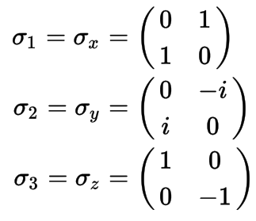{width="100%" fig-alt="TODO: describe image"}
:::
::::

---

## Dirac equation

- original version: Haade;vectorization: Wjh31, Quibik, CC BY-SA 3.0 <https://creativecommons.org/licenses/by-sa/3.0>, via Wikimedia Commons

- What does this mean, though?
  - $ \psi $ is a 4-component vector: describes a relativistic, spin-$\frac{1}{2}$ field ("spinor")
  - Intrinsically includes matter and antimatter.
- The current density equation for the Dirac equation is:
- $${ \partial }_{ \mu }(\overline{ \psi }{ \gamma }^{ \mu } \psi )=0$$
- where $\overline{ \psi }$ is the adjoint spinor:
- $$\overline{ \psi }={ \psi }^{ \dagger }{ \gamma }^{0}$$
- The corresponding conserved quantity is:
- $${J}^{0}=\overline{ \psi }{ \gamma }^{0} \psi ={ \psi }^{ \dagger } \psi $$
- Interpretation: conservation of fermion number (or charge)

- $${ \gamma }^{0}=\left( \begin{matrix}
{I}_{2} & 0 \\
0 & -{I}_{2}
\end{matrix} \right)$$

---

## Currents and fields

- original version: Haade;vectorization: Wjh31, Quibik, CC BY-SA 3.0 <https://creativecommons.org/licenses/by-sa/3.0>, via Wikimedia Commons

- Think about E&M: concerns relationships between current and fields.
  - The Dirac equation gives us the currents
  - What about the fields?
- Recall Maxwell's equations in 4-vector form:
  - Write the potential as a 4-vector:
  - ${A}^{ \mu }=( \phi ,\vec{A})$, where $ \phi $=electric potential and $\vec{A}$=magnetic potential
  - The field strength tensor is defined as:
  - $${F}^{ \mu  \nu }={ \partial }^{ \mu }{A}^{ \nu }-{ \partial }^{ \nu }{A}^{ \mu }$$
  - Maxwell's equations are:
  - $${ \partial }_{ \mu }{F}^{ \mu  \nu }=4 \pi {J}^{ \nu }$$

---

## Currents and fields

- original version: Haade;vectorization: Wjh31, Quibik, CC BY-SA 3.0 <https://creativecommons.org/licenses/by-sa/3.0>, via Wikimedia Commons

- Remember that the potentials are not physical quantities!
  - The physics must be the same if we change the potential but the fields remain unchanged.
- Specifically, the equations must be invariant under gauge transformations
  - You can easily check that ${A}^{ \mu } \rightarrow {A}^{ \mu }+{ \partial }^{ \mu } \lambda $ leaves the fields unchanged

---

# VEGAS algorithm

---

## VEGAS algorithm

- original version: Haade;vectorization: Wjh31, Quibik, CC BY-SA 3.0 <https://creativecommons.org/licenses/by-sa/3.0>, via Wikimedia Commons

- QFT calculations (e.g. scattering amplitudes) often involve difficulty, multi-dimensional integrals, which are only numerically solvable with MC techniques.
- A simple but performant algorithm: vegas
  - G.P. LePage, "A New Algorithm for Adaptive Multidimensional Integration," [J. Comput. Phys. 17, 192 (1978)](https://doi.org/10.1016/0021-9991(78)90004-9)
  - [https://arxiv.org/pdf/2009.05112](https://arxiv.org/pdf/2009.05112)
  - Originally in FORTRAN
  - Python package: [https://github.com/gplepage/vegas](https://github.com/gplepage/vegas), [https://vegas.readthedocs.io/en/latest/](https://vegas.readthedocs.io/en/latest/)
  - C++ Implementations around, for instance in Numerical Recipes
- Note: I'm not sure the paper is on the internet! I requested a scanned copy from the library (see UBLearns).

---

## VEGAS algorithm

<!-- TODO: complex slide layout (flagged by detect_complex_slide.py - see run log). Content below is complete but UNARRANGED - needs manual layout to match the original slide. -->

- original version: Haade;vectorization: Wjh31, Quibik, CC BY-SA 3.0 <https://creativecommons.org/licenses/by-sa/3.0>, via Wikimedia Commons

- Today, we'll spend most of class installing VEGAS and running through the tutorial.
- Next time, we'll apply it to some QFT scattering calculations.
- Remember the differential cross sections from last semester:
- Examples:
  - Compton scattering
  - Z boson production, e.g., ${e}^{+}{e}^{-} \rightarrow {Z}^{0} \rightarrow { \mu }^{+}{ \mu }^{-}$

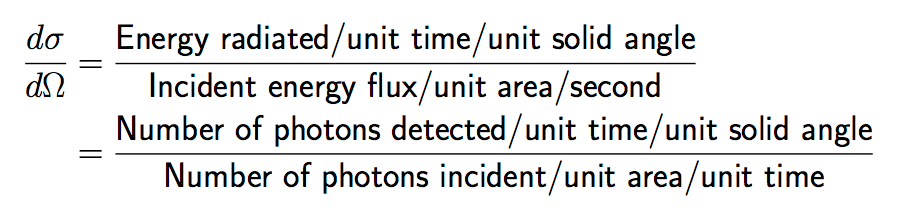{fig-alt="TODO"}

{fig-alt="TODO"}

- Compton scattering
{fig-alt="TODO"}

- Compton scattering differential cross section formula

---

## VEGAS algorithm

- original version: Haade;vectorization: Wjh31, Quibik, CC BY-SA 3.0 <https://creativecommons.org/licenses/by-sa/3.0>, via Wikimedia Commons

- Remember the basics of MC integration:
  - Throw points randomly around the phase space ("pseudoexperiments")
  - Count the total, approximate integral as the weighted average at the points:
  - $$I={ \int }_{a}^{b}dxf(x) \approx (b-a)\left[ \frac{1}{N}\mathop{\mathop{ \sum }\limits_{n=0}}\limits^{N-1}f({x}_{i}) \pm \frac{{ \sigma }_{f}}{\sqrt{N}} \right]$$
- The uncertainty term is given by:
- $${ \sigma }_{f}^{2}=\left( \frac{1}{b-a}{ \int }_{a}^{b}{f}^{2}(x)dx \right)-{\left( \frac{1}{b-a}{ \int }_{a}^{b}f(x)dx \right)}^{2} \approx \left( \frac{1}{N}\mathop{\mathop{ \sum }\limits_{i=0}}\limits^{N-1}{f}^{2}({x}_{i}) \right)-{\left( \frac{1}{N}\mathop{\mathop{ \sum }\limits_{i=0}}\limits^{N-1}f({x}_{i}) \right)}^{2}$$

---

## VEGAS algorithm

- original version: Haade;vectorization: Wjh31, Quibik, CC BY-SA 3.0 <https://creativecommons.org/licenses/by-sa/3.0>, via Wikimedia Commons

- We can also bias the random sampling (say by $p(x)$), so long as we account for the bias function as a weight in the average:
- $$I \approx (b-a)\left[ \frac{1}{N}\mathop{\mathop{ \sum }\limits_{i=0}}\limits^{N-1}\frac{f({x}_{i})}{p({x}_{i})} \right]$$
- In this case, the variance of $I$ becomes:
- $${ \sigma }_{I}=\frac{1}{N}\mathop{\mathop{ \sum }\limits_{i=0}}\limits^{N-1}\left[ {\left( \frac{f({x}_{i})}{p({x}_{i})} \right)}^{2}-⟨I{⟩}^{2} \right]$$
- The optimal variance is obtained when:
- $$p(x)=\frac{|f(x)|}{ \int dx|f(x)|}$$

---

## VEGAS algorithm

- original version: Haade;vectorization: Wjh31, Quibik, CC BY-SA 3.0 <https://creativecommons.org/licenses/by-sa/3.0>, via Wikimedia Commons

- Idea of VEGAS algorithm:
  - Simple 1D case ($0<x<1$): imagine approximate $p(x)$ with step functions
    - I.e., divide the domain into discrete chunks, like a histogram
    - Specifically, given some binning ${{x}_{i}}$ and bin widths $ \Delta {x}_{i}$,  $p(x)=\frac{1}{N \Delta {x}_{i}}\text{for}x \in ({x}_{i}- \Delta {x}_{i},{x}_{i})$
  - Start with $N$ equal bins of width $ \Delta {x}_{i}=\frac{1}{N}$
  - Iteration:
    - Subdivide each bin${}_{i}$ into ${m}_{i}$ sub-bins, based on contribution to integral:
    - $${m}_{i}=K\frac{{\overline{f}}_{i} \Delta {x}_{i}}{{ \sum }_{j=0}^{N}{\overline{f}}_{j} \Delta {x}_{j}},{\overline{f}}_{j}=\mathop{ \sum }\limits_{x \in  \Delta {x}_{i}}|f(x)| \sim  \propto \frac{1}{ \Delta {x}_{i}}{ \int }_{ \Delta {x}_{i}}dx|f(x)|$$
    - Re-group sub-bins
      - Each new bin should now have more equal contribution to $⟨I⟩$
    - Repeat
- In M dimensions, VEGAS factorizes the PDF: $p(\vec{x})={ \Pi }_{d=0}^{M-1}{p}_{d}({x}_{d})$
  - Keep the algorithm tractable, but relies on $f(\vec{x})$

---

## VEGAS algorithm

- original version: Haade;vectorization: Wjh31, Quibik, CC BY-SA 3.0 <https://creativecommons.org/licenses/by-sa/3.0>, via Wikimedia Commons

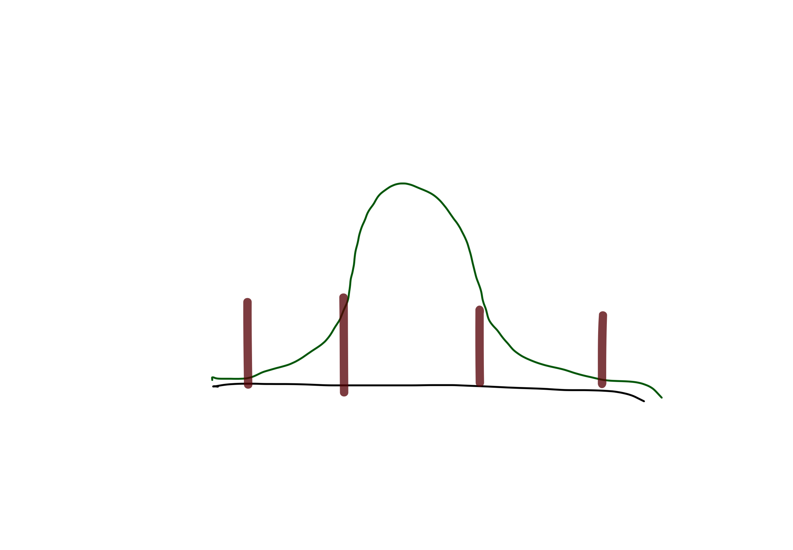{width="70%" fig-alt="TODO: describe image"}

- VEGAS algorithm
- Start with $p(x)$ corresponding to 3 uniform bins

---

## VEGAS algorithm

- original version: Haade;vectorization: Wjh31, Quibik, CC BY-SA 3.0 <https://creativecommons.org/licenses/by-sa/3.0>, via Wikimedia Commons

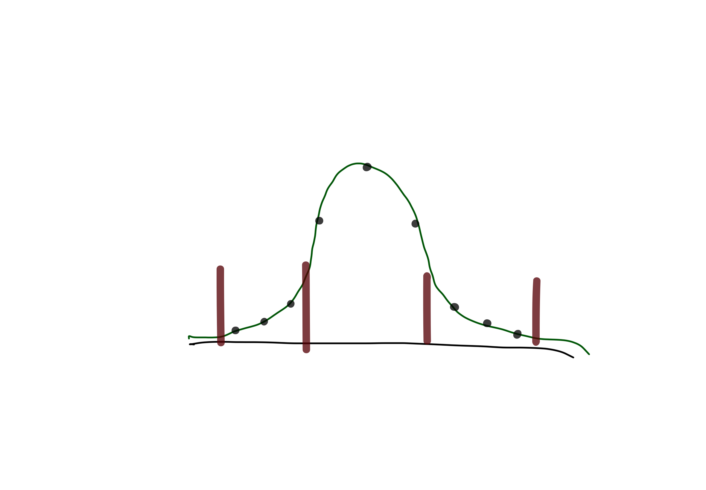{width="70%" fig-alt="TODO: describe image"}

- VEGAS algorithm
- Sampling is $ \approx $ uniform over the whole interval

---

## VEGAS algorithm

<!-- TODO: complex slide layout (flagged by detect_complex_slide.py - see run log). Content below is complete but UNARRANGED - needs manual layout to match the original slide. -->

- original version: Haade;vectorization: Wjh31, Quibik, CC BY-SA 3.0 <https://creativecommons.org/licenses/by-sa/3.0>, via Wikimedia Commons

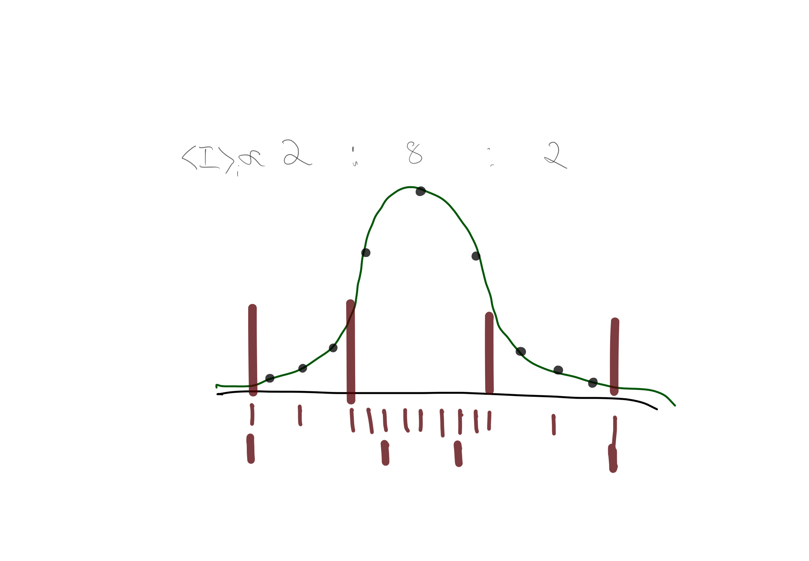{fig-alt="TODO"}

- VEGAS algorithm
- Calculate relative contribution of each bin to the total integral

- Subdivide bins according to relative contribution

- Regroup into 3 bins

---

## VEGAS algorithm

- original version: Haade;vectorization: Wjh31, Quibik, CC BY-SA 3.0 <https://creativecommons.org/licenses/by-sa/3.0>, via Wikimedia Commons

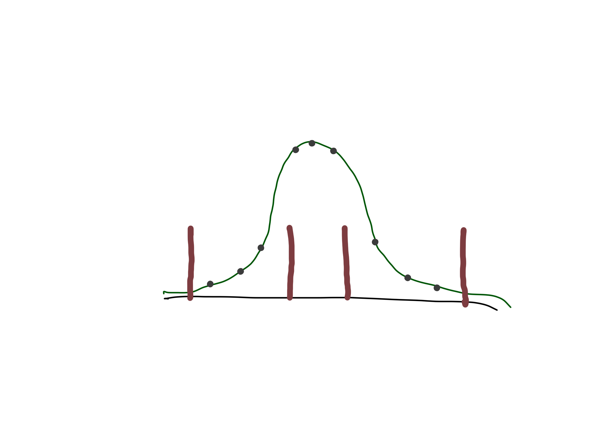{width="70%" fig-alt="TODO: describe image"}

- VEGAS algorithm
- Smaller bins where $f(x)$ is large, i.e., $p(x)$ concentrated in more important areas

---

## VEGAS algorithm

- original version: Haade;vectorization: Wjh31, Quibik, CC BY-SA 3.0 <https://creativecommons.org/licenses/by-sa/3.0>, via Wikimedia Commons

- One more wrinkle: smoothing
  - "This algorithm, like most adaptive algorithms, tends to overreact in the early stages of optimizing its grid, since it has rather poor information concerning the integrand at this stage. It is important, therefore, to dampen the refinement process so as to avoid rapid, destabilizing changes in the grid."
- Before using ${m}_{i}$ to define new submits, apply a smoothing kernel to the ${m}_{i}$
    - E.g. ${m}_{i} \rightarrow \frac{1}{8}{m}_{i-1}+\frac{6}{8}{m}_{i}+\frac{1}{8}{m}_{i+1}$
  - "Smoothing is particularly important if the integrand has large discontinuities (e.g., step functions). For example, an abrupt increase in the integrand near the upper edge of interval $ \Delta {x}_{i}$ might be missed completely by the samples. Without smoothing, VEGAS would see a sudden rise in the function beginning only in$ \Delta {x}_{i+1}$, and refine the grid accordingly, thereby missing the small but possibly significant part of the step in interval $ \Delta {x}_{i}$. Smoothing makes this less likely by causing VEGAS to focus some effort on interval $ \Delta {x}_{i}$ as well as $ \Delta {x}_{i+1}$." ([https://arxiv.org/pdf/2009.05112](https://arxiv.org/pdf/2009.05112))

---

## Notebooks

- original version: Haade;vectorization: Wjh31, Quibik, CC BY-SA 3.0 <https://creativecommons.org/licenses/by-sa/3.0>, via Wikimedia Commons

- Try out VEGAS in CompPhys/QFT/vegas.ipynb
  - Do a git pull
  - To download software, notebook calls !pip install vegas
    - Only have to do this once per Docker session (installs to /opt/venv/..., which gets deleted when you close the container)
  - I copied some starter code from the vegas tutorial, and added a few interesting examples.
    - Explore behavior in many dimensions.
    - Try integrating a tricky function that does not factorize along the axes.
    - Also try running some of the examples in the tutorial (copy-and-paste the code yourself)

---

# Compton scattering

---

## Quantum Field Theory

- Similar currents exist for matter (electrons, etc)
- Interactions are then specified in terms of interactions of the currents and the fields
- See Peskin + Schroeder, for instance

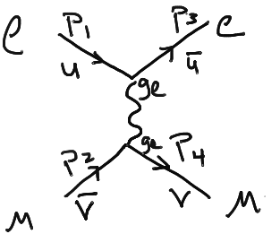{width="70%" fig-alt="TODO: describe image"}

- Feynman diagram of electron-muon scattering

---

## Compton Scattering

<!-- TODO: complex slide layout (flagged by detect_complex_slide.py - see run log). Content below is complete but UNARRANGED - needs manual layout to match the original slide. -->

- Scattering of light off of electrons at rest
  - Must be near nucleus to conserve momentum
- Specify polarization of incoming light beams:

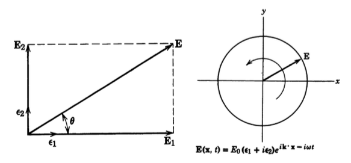{fig-alt="TODO"}

- Linear and circular polarization
- Linear polarization

- Circular polarization

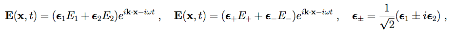{fig-alt="TODO"}

- EM fields of a photon using polarization vectors. E+ and E- are + and - helicity states
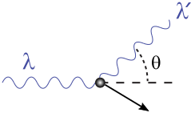{fig-alt="TODO"}

- Compton scattering

---

## Compton Scattering

<!-- TODO: complex slide layout (flagged by detect_complex_slide.py - see run log). Content below is complete but UNARRANGED - needs manual layout to match the original slide. -->

- Calculation of matrix element:
- Initial conditions:
- Kinematics and conservation of 4-momentum gives:

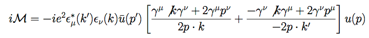{fig-alt="TODO"}

- Compton scattering formulae
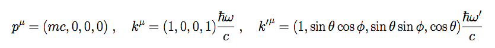{fig-alt="TODO"}

- Compton scattering formulae
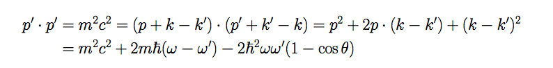{fig-alt="TODO"}

- Compton scattering formulae
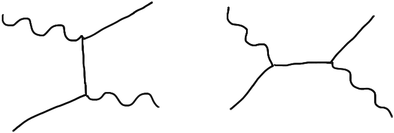{fig-alt="TODO"}

- Compton scattering Feynman diagrams
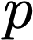{fig-alt="TODO"}

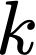{fig-alt="TODO"}

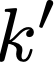{fig-alt="TODO"}

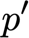{fig-alt="TODO"}

{fig-alt="TODO"}

{fig-alt="TODO"}

{fig-alt="TODO"}

{fig-alt="TODO"}

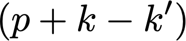{fig-alt="TODO"}

---

## Compton Scattering

<!-- TODO: complex slide layout (flagged by detect_complex_slide.py - see run log). Content below is complete but UNARRANGED - needs manual layout to match the original slide. -->

- Differential cross section:

{fig-alt="TODO"}

- Differential cross section formula
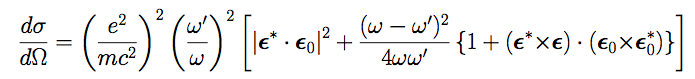{fig-alt="TODO"}

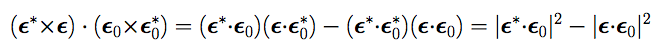{fig-alt="TODO"}

- Compton scattering differential cross section, including polarization

---

## Compton Scattering

- With some convenient units, can work in dimensionless units:

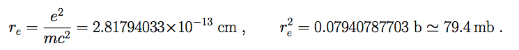{width="70%" fig-alt="TODO: describe image"}

- Natural units for Compton scattering
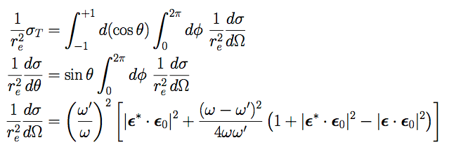{width="70%" fig-alt="TODO: describe image"}

- Note: Averaged over initial electron
spin states, summed over final electron
spin states

---

## Quantum Field Theory

- Last time: computed Compton scattering cross section
- Now: Compute Z production cross section
  - e+e- —> Z —> e+e-
  - pp —> Z —> e+e-

{width="70%" fig-alt="TODO: describe image"}

- Standard Model particles

---

## Quantum Field Theory

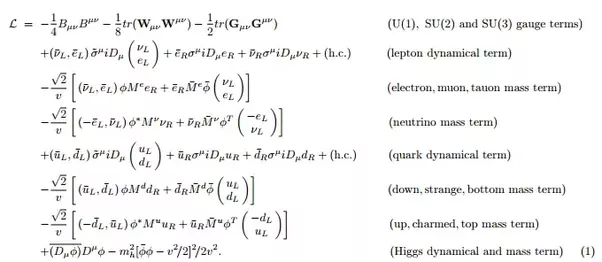{width="70%" fig-alt="TODO: describe image"}

- Standard Model Lagrangian

---

## Quantum Field Theory

<!-- TODO: complex slide layout (flagged by detect_complex_slide.py - see run log). Content below is complete but UNARRANGED - needs manual layout to match the original slide. -->

- Electroweak interaction: follows SU(2) x U(1) symmetry

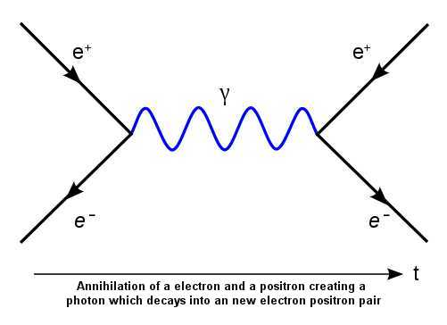{fig-alt="TODO"}

{fig-alt="TODO"}

- Z
- Drell–Yan scattering Feynman diagrams
- 3 bosons

- 1 boson

---

## Recall : Gauge Theories

- Group theory representations:

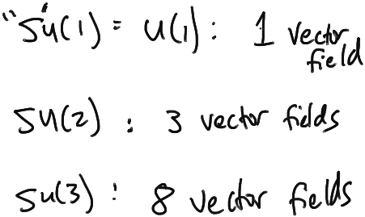{width="70%" fig-alt="TODO: describe image"}

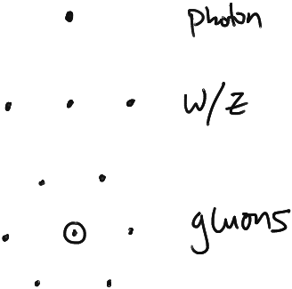{width="70%" fig-alt="TODO: describe image"}

- Gauge bosons of the Standard Model
- Quantum Field Theory

---

## Quantum Field Theory

<!-- TODO: complex slide layout (flagged by detect_complex_slide.py - see run log). Content below is complete but UNARRANGED - needs manual layout to match the original slide. -->

- Simplest explanation for EWSB is the “Higgs mechanism”
- Nambu-Goldstone boson for the spontaneously broken symmetry of SU(2)XU(1)
- Similar to superconductor or ferromagnet!
- Simplest field to do this is a “Sombrero” potential

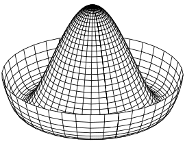{fig-alt="TODO"}

- "Mexican hat" potential
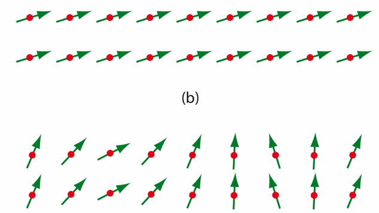{fig-alt="TODO"}

- Broken symmetry
- Nambu-Goldstone boson
- “generated” by the broken
- symmetry
- Cartoon of spontaneous symmetry breaking
- Ground state breaks the EW symmetry!

---

## Quantum Field Theory

<!-- TODO: complex slide layout (flagged by detect_complex_slide.py - see run log). Content below is complete but UNARRANGED - needs manual layout to match the original slide. -->

- Bit of a wrinkle: The eigenbasis of SU(2) x U(1) is not the “mass” eigenbasis of the actual particles
- There is a mixing angle:
- “Weinberg angle”:

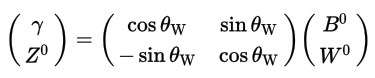{fig-alt="TODO"}

- Mixing of EM and weak fields
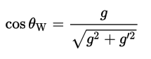{fig-alt="TODO"}

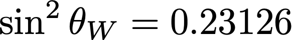{fig-alt="TODO"}

- Equations for electroweak mixing angle

---

## Quantum Field Theory

- You’ve been told proton looks like this:
- Really looks like this:

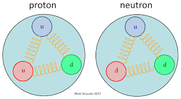{width="70%" fig-alt="TODO: describe image"}

- Naive view of proton
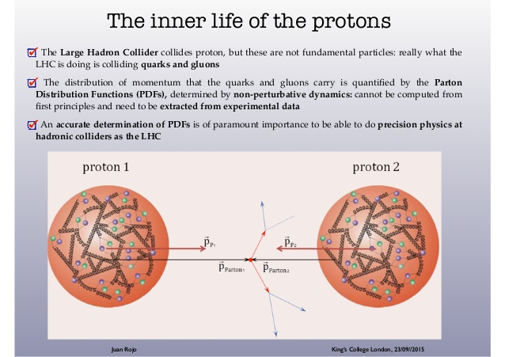{width="70%" fig-alt="TODO: describe image"}

- Better view of proton
- Distributions of stuff
INSIDE the proton!

---

## Quantum Field Theory

- Parton distribution functions (PDFs):

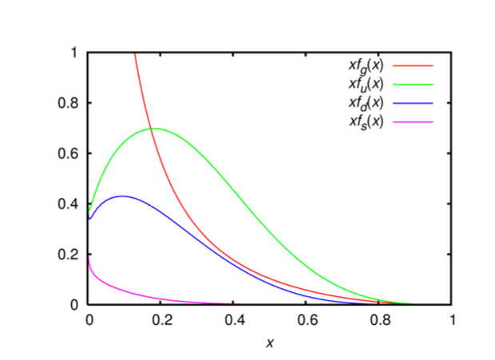{width="70%" fig-alt="TODO: describe image"}

- Proton parton distribution functions
- x = fraction of particle’s momentum to proton’s momentum

---

## Quantum Field Theory

- Can FACTORIZE the computation into a hard process and the parton distribution function integration:
- So for production of leptons:

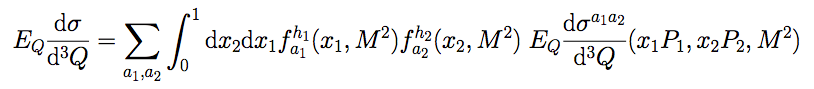{width="70%" fig-alt="TODO: describe image"}

- Factorization theorem
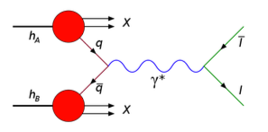{width="70%" fig-alt="TODO: describe image"}

- Cartoon of factorization into PDFs and hard-scattering matrix element

---

## Quantum Field Theory

- Drell-Yan cross section from CMS:
- J. High Energy Phys. 10, 007 (2011)

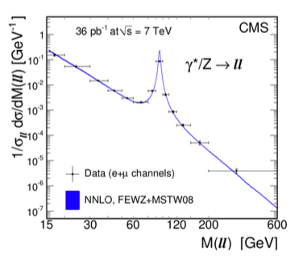{width="70%" fig-alt="TODO: describe image"}

- Measurement of Drell–Yan scattering cross section

---

## Quantum Field Theory

- Look at the Drell-Yan matrix element:

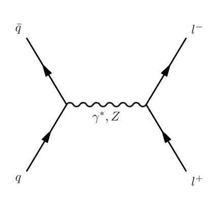{width="70%" fig-alt="TODO: describe image"}

- Feynman diagram of Drell–Yan process

---

## Slide 42

<!-- TODO: complex slide layout (flagged by detect_complex_slide.py - see run log). Content below is complete but UNARRANGED - needs manual layout to match the original slide. -->

- Differential Cross Section is:

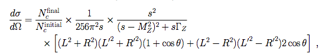{fig-alt="TODO"}

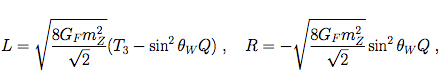{fig-alt="TODO"}

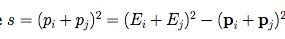{fig-alt="TODO"}

- Drell–Yan scattering cross section

---

## Quantum Field Theory

- So look back at the master formula:
- Your homework problem will be to perform a MC simulation of the pp —-> Z ——> e+e- cross section!

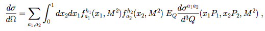{width="70%" fig-alt="TODO: describe image"}

- Drell–Yan differential cross section

---

## Slide 44

- u(total) = u(valence) + u(sea)
- ubar (total) = u(sea)
- d(total) = d(valence) + d(sea)
- dbar (total) = d(sea)
- s(total) = s(sea)
- sbar(total) = s(sea)

---

## Newton's method

<!-- TODO: complex slide layout (flagged by detect_complex_slide.py - see run log). Content below is complete but UNARRANGED - needs manual layout to match the original slide. -->

- Can solve for Fourier coefficients

- Algorithm:
  - Compute gradient.
  - Take a step in the direction of the gradient.
- However, this naive algorithm is computationally intensive.
- We can do a lot better with the quasi-Newton method.
  - Main feature: iteratively construct an approximation to the inverse Hessian matrix.
- Recall that the Hessian matrix is the N-D generalization of the second derivative:

{fig-alt="TODO"}

- Cartoon of Newton's method
- $$\mathbf{A}=\left( \begin{matrix}
\frac{{ \partial }^{2}f}{ \partial {x}_{1}^{2}} & \frac{{ \partial }^{2}f}{ \partial {x}_{1} \partial {x}_{2}} & ... & \frac{{ \partial }^{2}f}{ \partial {x}_{1} \partial {x}_{n}} \\
\frac{{ \partial }^{2}f}{ \partial {x}_{2} \partial {x}_{1}} & \frac{{ \partial }^{2}f}{ \partial {x}_{2}^{2}} & ... & \frac{{ \partial }^{2}f}{ \partial {x}_{2} \partial {x}_{n}} \\
 \vdots  &  \vdots  &  \ddots  &  \vdots  \\
\frac{{ \partial }^{2}f}{ \partial {x}_{n} \partial {x}_{1}} & \frac{{ \partial }^{2}f}{ \partial {x}_{n} \partial {x}_{2}} & ... & \frac{{ \partial }^{2}f}{ \partial {x}_{n}^{2}}
\end{matrix} \right)$$

---

## Quasi-Newton method

<!-- TODO: complex slide layout (flagged by detect_complex_slide.py - see run log). Content below is complete but UNARRANGED - needs manual layout to match the original slide. -->

- Can solve for Fourier coefficients

- In the vicinity of ${\vec{x}}_{i}$, the Taylor expansions for $f(\vec{x})$ and $ \nabla f(\vec{x})$ are:

{fig-alt="TODO"}

- Cartoon of Newton's method
- $$\begin{matrix}
f(\vec{x}) & =f({\vec{x}}_{i})+(\vec{x}-{\vec{x}}_{i}) \nabla f({\vec{x}}_{i})+\frac{1}{2}(\vec{x}-{\vec{x}}_{i}{)}^{T}\mathbf{A}(\vec{x}-{\vec{x}}_{i}) \\
 \nabla f(\vec{x}) & = \nabla f({\vec{x}}_{i})+\mathbf{A}(\vec{x}-{\vec{x}}_{i})
\end{matrix}$$

- Again, we are looking for the extrema, which corresponds to $ \nabla f(\vec{x})=0$. This gives us:

- $$\begin{matrix}
0 & = \nabla f({\vec{x}}_{i})+\mathbf{A}(\vec{x}-{\vec{x}}_{i}) \\
\vec{x}-{\vec{x}}_{i} & =-{\mathbf{A}}^{-1} \cdot  \nabla f({\vec{x}}_{i})
\end{matrix}$$

- This gives us the next step in the algorithm... except where do we get ${\mathbf{A}}^{-1}$???
- Key step of quasi-Newton method: build an iterative approximation: a sequence of matrices, ${{\mathbf{H}}_{i}}$, with$\mathop{lim}\limits_{i \rightarrow  \infty }{\mathbf{H}}_{i}={\mathbf{A}}^{-1}$.

---

## Approximating the inverse Hessian

- Can solve for Fourier coefficients

- Following Numerical Recipes 10.9, we are going to skip the detailed derivation, and just give an overview.
  - Consider two points in the algorithm, ${\vec{x}}_{i}$ and ${\vec{x}}_{i+1}$:
  - Define ${\mathbf{H}}_{i+1}$ to satisfy this equation:
  - Using "kitchen sink" reasoning, the available variable to build ${\mathbf{H}}_{i+1}$ are: ${\mathbf{H}}_{i}$, ${\vec{x}}_{i+1}-{\vec{x}}_{i}$, and $ \nabla {f}_{i+1}- \nabla {f}_{i}$.
- Skipping straight to the answer, we have a couple solutions:

- $$\begin{matrix}
{\vec{x}}_{i+1}-{\vec{x}}_{i} & ={\mathbf{A}}^{-1} \cdot ( \nabla {f}_{i+1}- \nabla {f}_{i})
\end{matrix}$$

- $$\begin{matrix}
{\vec{x}}_{i+1}-{\vec{x}}_{i} & ={\mathbf{H}}_{i+1}^{-1} \cdot ( \nabla {f}_{i+1}- \nabla {f}_{i})
\end{matrix}$$

- $${\mathbf{H}}_{i+1}={\mathbf{H}}_{i}+\frac{({\vec{x}}_{i+1}-{\vec{x}}_{i}) \otimes ({\vec{x}}_{i+1}-{\vec{x}}_{i})}{({\vec{x}}_{i+1}-{\vec{x}}_{i}) \cdot ( \nabla {f}_{i+1}- \nabla {f}_{i})}-\frac{[{\mathbf{H}}_{i}( \nabla {f}_{i+1}- \nabla {f}_{i})] \otimes [{\mathbf{H}}_{i}( \nabla {f}_{i+1}- \nabla {f}_{i})]}{( \nabla {f}_{i+1}- \nabla {f}_{i}) \cdot {\mathbf{H}}_{i} \cdot ( \nabla {f}_{i+1}- \nabla {f}_{i})}$$

- DFP updating formula:

- $ \otimes $ is the outer product, i.e., the matrix defined by: $(\vec{u} \otimes \vec{v}{)}_{ij}={u}_{i}{v}_{j}$

---

## Approximating the inverse Hessian

- Can solve for Fourier coefficients

- Following Numerical Recipes 10.9, we are going to skip the detailed derivation, and just give an overview.
  - Consider two points in the algorithm, ${\vec{x}}_{i}$ and ${\vec{x}}_{i+1}$:
  - Define ${\mathbf{H}}_{i+1}$ to satisfy this equation:
  - Using "kitchen sink" reasoning, the available variable to build ${\mathbf{H}}_{i+1}$ are: ${\mathbf{H}}_{i}$, ${\vec{x}}_{i+1}-{\vec{x}}_{i}$, and $ \nabla {f}_{i+1}- \nabla {f}_{i}$.
- Skipping straight to the answer, we have a couple solutions:

- $$\begin{matrix}
{\vec{x}}_{i+1}-{\vec{x}}_{i} & ={\mathbf{A}}^{-1} \cdot ( \nabla {f}_{i+1}- \nabla {f}_{i})
\end{matrix}$$

- $$\begin{matrix}
{\vec{x}}_{i+1}-{\vec{x}}_{i} & ={\mathbf{H}}_{i+1}^{-1} \cdot ( \nabla {f}_{i+1}- \nabla {f}_{i})
\end{matrix}$$

- $${\mathbf{H}}_{i+1}={\mathbf{H}}_{i}+\frac{({\vec{x}}_{i+1}-{\vec{x}}_{i}) \otimes ({\vec{x}}_{i+1}-{\vec{x}}_{i})}{({\vec{x}}_{i+1}-{\vec{x}}_{i}) \cdot ( \nabla {f}_{i+1}- \nabla {f}_{i})}-\frac{[{\mathbf{H}}_{i}( \nabla {f}_{i+1}- \nabla {f}_{i})] \otimes [{\mathbf{H}}_{i}( \nabla {f}_{i+1}- \nabla {f}_{i})]}{( \nabla {f}_{i+1}- \nabla {f}_{i}) \cdot {\mathbf{H}}_{i} \cdot ( \nabla {f}_{i+1}- \nabla {f}_{i})}+[( \nabla {f}_{i+1}- \nabla {f}_{i}) \cdot {\mathbf{H}}_{i} \cdot ( \nabla {f}_{i+1}- \nabla {f}_{i})]\vec{u} \otimes \vec{u}$$

- BFGS updating formula:

- $$\vec{u}=\frac{({\vec{x}}_{i+1}-{\vec{x}}_{i})}{({\vec{x}}_{i+1}-{\vec{x}}_{i}) \cdot ( \nabla {f}_{i+1}- \nabla {f}_{i})}-\frac{{\mathbf{H}}_{i} \cdot ( \nabla {f}_{i+1}- \nabla {f}_{i})}{( \nabla {f}_{i+1}- \nabla {f}_{i}) \cdot {\mathbf{H}}_{i} \cdot ( \nabla {f}_{i+1}- \nabla {f}_{i})}$$
