# Quantum computing

---

## Introduction

<!-- TODO: complex slide layout (flagged by detect_complex_slide.py - see run log). Content below is complete but UNARRANGED - needs manual layout to match the original slide. -->

- We are now using python/jupyter and qiskit to demonstrate the most controversial (important, profound) quantum experiment: Bell’s inequality
- The “quantum weirdness” that people become enamored with will be explained.
- We’ll walk through a tiny bit of quantum mechanics for those who have not seen it before

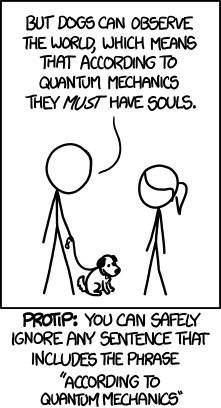{fig-alt="TODO"}

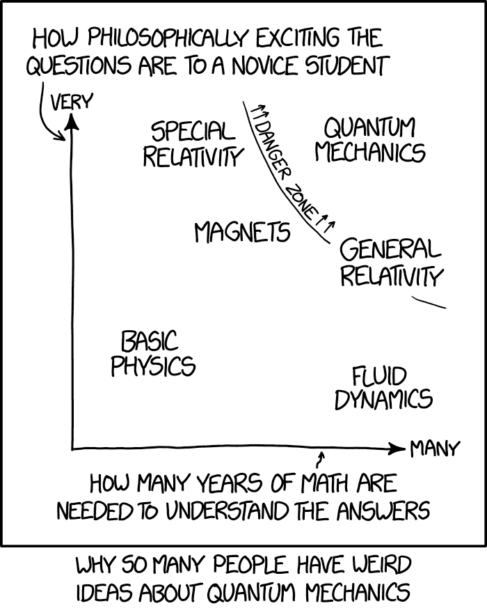{fig-alt="TODO"}

- [https://xkcd.com/1861](https://xkcd.com/1861)

- [https://xkcd.com/1240/](https://xkcd.com/1240/)

---

## Nobel Prize Announcement!

<!-- TODO: complex slide layout (flagged by detect_complex_slide.py - see run log). Content below is complete but UNARRANGED - needs manual layout to match the original slide. -->

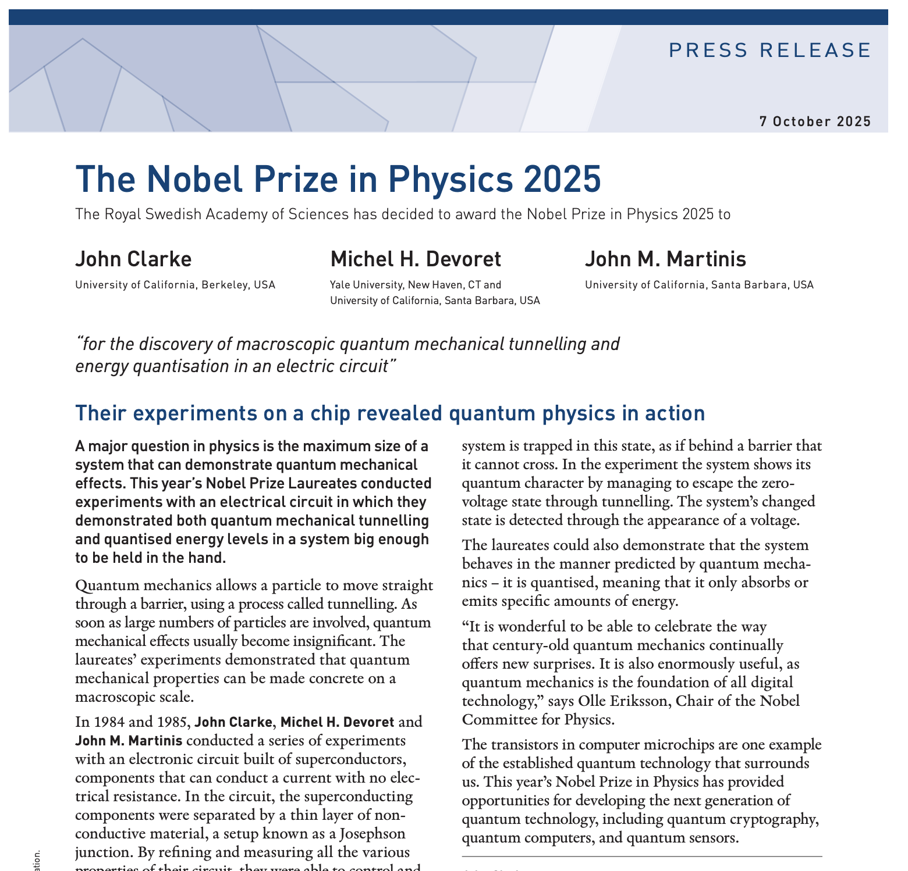{fig-alt="TODO"}

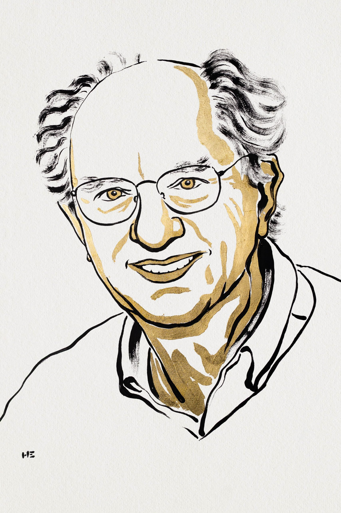{fig-alt="TODO"}

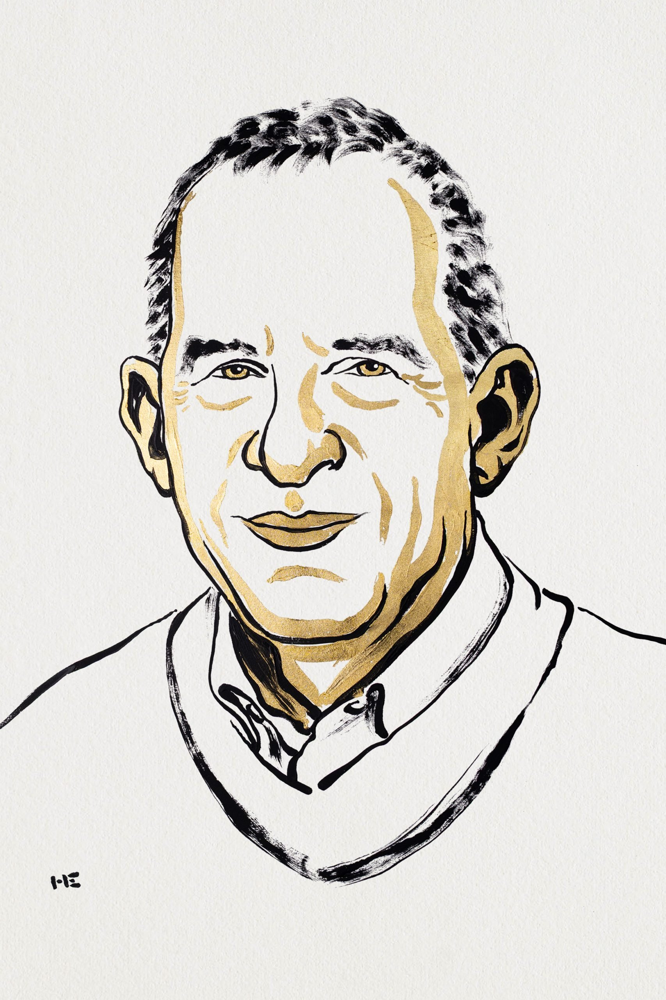{fig-alt="TODO"}

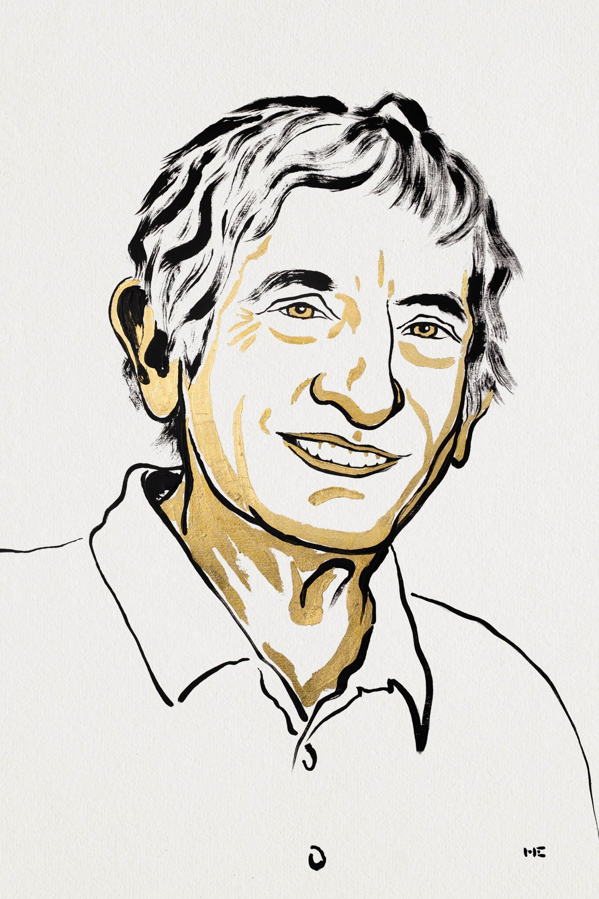{fig-alt="TODO"}

- [https://www.nobelprize.org/prizes/physics/2025/press-release/](https://www.nobelprize.org/prizes/physics/2025/press-release/)

- [Scientific summary](https://www.nobelprize.org/uploads/2025/10/advanced-physicsprize2025.pdf)

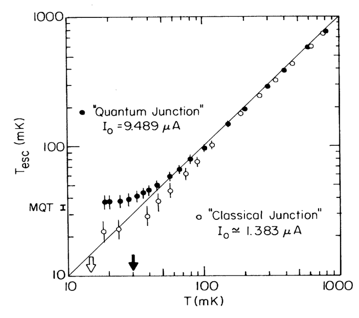{fig-alt="TODO"}

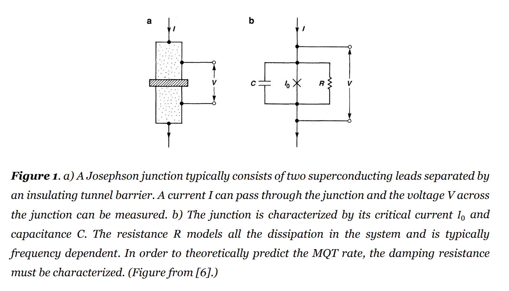{fig-alt="TODO"}

---

## What is a quantum computer?

:::: {.columns}
::: {.column width="55%"}
- A quantum computer is a computer that uses quantum mechanical principles to operate
- In practice that means it exhibits non-classical properties:
  - Superposition, $\frac{1}{\sqrt{2}}|0⟩+\frac{1}{\sqrt{2}}|1⟩$
  - Entanglement, $\frac{1}{\sqrt{2}}| \uparrow ⟩| \downarrow ⟩+\frac{1}{\sqrt{2}}| \downarrow ⟩| \uparrow ⟩$
  - Interference
  - Decoherence 👎
- FMNLab, CC BY 4.0 <https://creativecommons.org/licenses/by/4.0>, via Wikimedia Commons
:::
::: {.column width="45%"}
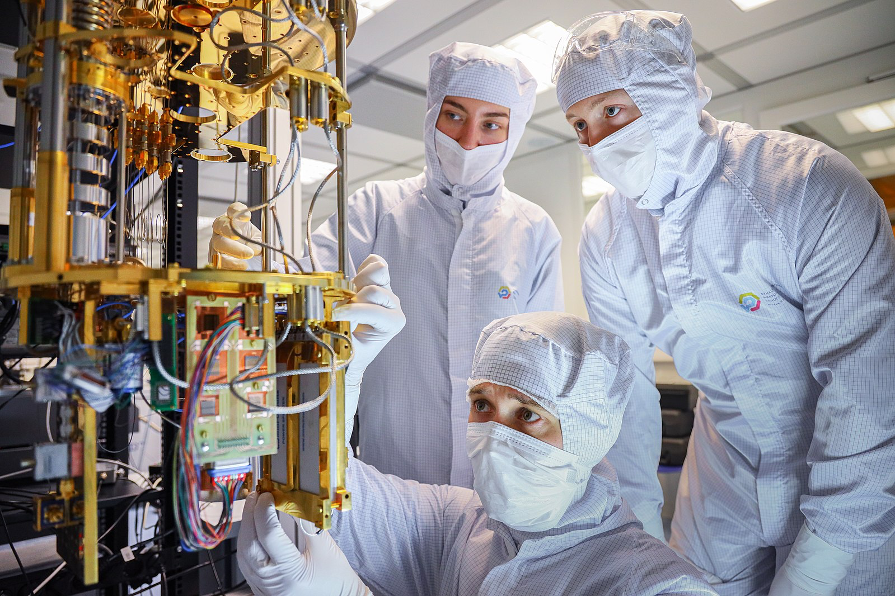{width="100%" fig-alt="TODO: describe image"}
:::
::::

---

## How do quantum computers work?

:::: {.columns}
::: {.column width="55%"}
- Quantum computing research has many active areas:
  - Array of Quantum Gates
  - Adiabatic / Quantum Annealing
  - One way Quantum Computing
  - Topological Quantum Computers
  - Boson Samplers
- We do NOT answer this question in this class!
- Algorithms, not hardware: we will go over how to program them, not make them.
- FMNLab, CC BY 4.0 <https://creativecommons.org/licenses/by/4.0>, via Wikimedia Commons
:::
::: {.column width="45%"}
{width="100%" fig-alt="TODO: describe image"}
:::
::::

---

## Why? Part 1

- Known for decades that quantum computer can solve certain problems that classical computers cannot:
  - Cryptography: factorizing large numbers ([Shor 1994](https://arxiv.org/abs/quant-ph/9508027)) .
  - Pharmaceuticals, chemistry: molecular simulations.
  - Machine learning
  - Quantum mechanics :) (Particle physics?)

---

## Why? Part 2

{width="70%" fig-alt="TODO: describe image"}

---

## Why? Part 2

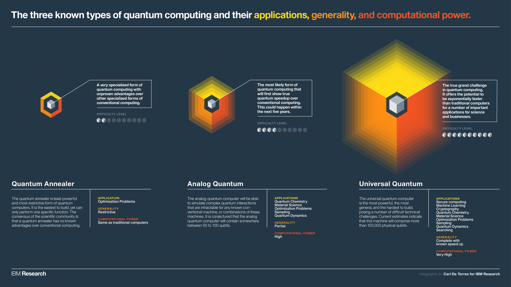{width="70%" fig-alt="TODO: describe image"}

---

## Quantum utility and advantage

- Quantum utility: any quantum computation that solves problems that are beyond the reach of brute-force classical QC simulators.
- Quantum advantage: where QC is better, faster, or cheaper than all known classical methods;
  - Cannot solve in time t
  - Cannot solve
- Google announced QA in 2019 (https://www.youtube.com/watch?v=-ZNEzzDcllU)
  - 3min QC - 10,000 years CC
  - IBM: Our super computer can do it in 2.5 days …
- University of Science and Technology of China (USTC) announced 2020 QA for 10 billion larger Hilbert space as Google QC
  - 200s QC - 2.5 billion years CC
- IBM claimed QU in 2023, QA ~2026...

---

## Quantum computing frameworks

- You can already try out programming a quantum computer!
  - Well, probably a QC simulator, but real QC time is becoming available!
- Qiskit (IBM) (we will try this out)
- Tensorflow Quantum / CIRQ (Google)
- Strawberry fields (Photonic quantum computing)
- Q# (Q sharp) (Microsoft)
- QuTiP (Quantum Toolbox in Python)

- So that’s a lot of programming languages? No, ALL of them can be used with python! 🎉
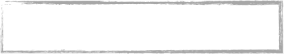{width="70%" fig-alt="TODO: describe image"}

---

## Example: 1+1

- Let's do a basic computation: 1+1.
- Actually, let's start with a classical system (with quantum mechanical notation!).
- A bit is an example of a 2-state system: 0 or 1.
  - A 6-sided die would be a 6-state system
- We can represent this with Dirac's bra-ket notation:
  - $$|0⟩=\left( \begin{aligned}
1 \\
0
\end{aligned} \right)$$
  - $$|1⟩=\left( \begin{aligned}
0 \\
1
\end{aligned} \right)$$

---

## Logic gates

:::: {.columns}
::: {.column width="55%"}
- CPUs perform operations on bits using logic gates.
- For 1 bit, two possibilities:
  - Do nothing (buffer)
  - Invert bit: NOT
:::
::: {.column width="45%"}
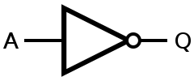{width="100%" fig-alt="TODO: describe image"}
:::
::::

---

## 2-bit gates

<!-- TODO: complex slide layout (flagged by detect_complex_slide.py - see run log). Content below is complete but UNARRANGED - needs manual layout to match the original slide. -->

- AND

- OR

- XOR

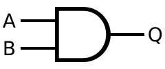{fig-alt="TODO"}

{fig-alt="TODO"}

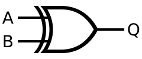{fig-alt="TODO"}

- Note: these are "irreversible"

---

## Reversible XOR: CNOT

:::: {.columns}
::: {.column width="55%"}
- Looking ahead to quantum computing, reversibility will come into play: can we "invert" the operation?
  - I.e., can we recover the inputs from the outputs?
  - Clear, a 2-to-1 operation cannot be inverted. Must be N-to-N!
- Reversible XOR: besides XOR result, keep one of the input bits.
- "Controlled NOT":
  - If b0=0, keep b1
  - If b0=1, invert b1.
:::
::: {.column width="45%"}
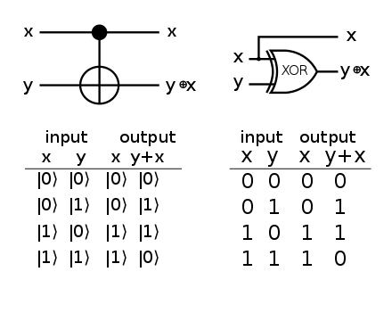{width="100%" fig-alt="TODO: describe image"}
:::
::::

---

## Toffoli gate

- A bit more complicated: Toffoli gate, or CCNOT
  - Controlled-controlled-NOT
- Keep b0 and b1 as outputs.
- If b0=b1=1, flip b3
- Otherwise, keep b3.

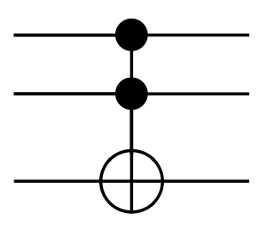{width="70%" fig-alt="TODO: describe image"}

---

## Addition

- We now have the ingredients to add 2 bits.
- First, think about the possible results:
  - 0+0=0
  - 0+1=1+0=1
  - 1+1=2 (=0b10 in binary)
- So, we will need at least 2 output bits.
  - b2="sum"
  - b3="carry out"

---

## Addition

- We now have the ingredients to add 2 bits.
- First, think about the possible results:
  - 0+0=0
  - 0+1=1+0=1
  - 1+1=2 (=0b10 in binary)
- So, we will need at least 2 output bits.
  - b2="sum"
  - b3="carry out"

---

## Addition

<!-- TODO: complex slide layout (flagged by detect_complex_slide.py - see run log). Content below is complete but UNARRANGED - needs manual layout to match the original slide. -->

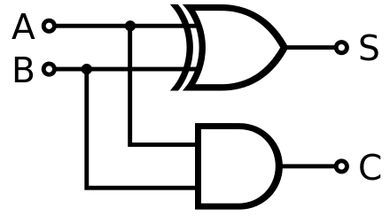{fig-alt="TODO"}

- Half adder

- We now have the ingredients to add 2 bits.
- First, think about the possible results:
  - 0+0=0
  - 0+1=1+0=1
  - 1+1=2 (=0b10 in binary)
- So, we will need at least 2 output bits.
  - b2="sum"
  - b3="carry out"

- XOR

- AND

---

## Addition

- We now have the ingredients to add 2 bits.
- First, think about the possible results:
  - 0+0=0
  - 0+1=1+0=1
  - 1+1=2 (=0b10 in binary)
- So, we will need at least 2 output bits.
  - b2="sum"
  - b3="carry out"

{width="70%" fig-alt="TODO: describe image"}

- Half adder

---

## Full adder

- The full adder also accounts for "carry-in": account for the next-to-least significant addition.

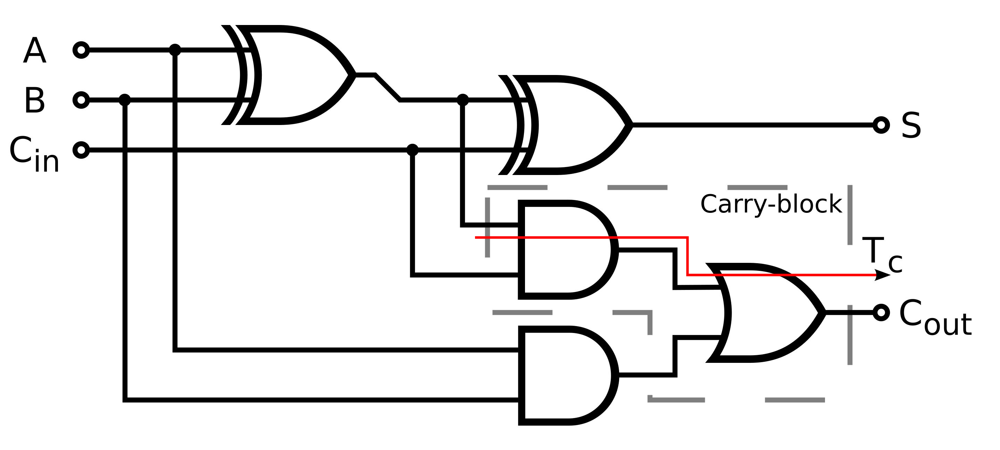{width="70%" fig-alt="TODO: describe image"}

---

## Reversible adder

<!-- TODO: complex slide layout (flagged by detect_complex_slide.py - see run log). Content below is complete but UNARRANGED - needs manual layout to match the original slide. -->

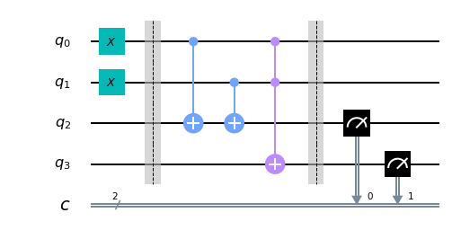{fig-alt="TODO"}

- CNOT
- CNOT
- CCNOT
- Finally, a reversible adder using two CNOTS and one CCNOT:

- This is actually an addition circuit for a quantum computer!

---

## Reversible adder

<!-- TODO: complex slide layout (flagged by detect_complex_slide.py - see run log). Content below is complete but UNARRANGED - needs manual layout to match the original slide. -->

{fig-alt="TODO"}

- CNOT
- CNOT
- CCNOT
- Finally, a reversible adder using two CNOTS and one CCNOT:

- This is actually an addition circuit for a quantum computer!

- Prepare inputs: qubits!

- 0

- 0

- Operations: unitary operators

- Perform measurement

---

## Checkpoint

:::: {.columns}
::: {.column width="55%"}
- We've actually learned a how to program a quantum computer! Yeah!
  - Although for a classical example …
- Programming a QC is different, but perhaps not fundamentally more complicated than a classical computer.
- A QC probably shouldn’t be used for classical computation
  - Quantum was not better/faster than classical here!
  - 2*CNOT + 1*CCNOT.
  - We needed 4 qubits for a quantum half-adder.
:::
::: {.column width="45%"}
{width="100%" fig-alt="TODO: describe image"}
{width="100%" fig-alt="TODO: describe image"}
:::
::::

---

# Qubits

---

## Qubits

- Qubit = "quantum bit".
- Represented by a column vector:
  - $${ \alpha }_{i} \in \mathbb{C}$$
  - $$\mathop{ \sum }\limits_{i}|{ \alpha }_{i}{|}^{2}=1$$
  - Typically $n=2$ (two-state system). Think $ \uparrow , \downarrow $ spins.
- The qiskit tutorial also presents the idea of a "classical" probabilistic state. We will skip this, since you already know quantum mechanics.
- In Dirac notation:

- $$\left( \begin{aligned}
{ \alpha }_{1} \\
{ \alpha }_{2} \\
 \vdots  \\
{ \alpha }_{n}
\end{aligned} \right)$$

- $$|0⟩=\left( \begin{aligned}
1 \\
0
\end{aligned} \right)$$

- $$|1⟩=\left( \begin{aligned}
0 \\
1
\end{aligned} \right)$$

- $$\left( \begin{aligned}
\frac{1+2i}{3} \\
-\frac{2}{3}
\end{aligned} \right)=\frac{1+2i}{3}|0⟩-\frac{2}{3}|1⟩$$

- A [Hilbert space](https://en.wikipedia.org/wiki/Hilbert_space) is a vector space with an inner product ($⟨a|b⟩$) norm ($ \parallel |a⟩ \parallel =\sqrt{⟨a|a⟩}$) (complete metric space w.r.t. metric defined by the inner product).

---

## Measuring qubits

- Recall what happens if you measure a superposition of states:
  - State is a linear combination of eigenstates of the observable.
  - Outcome is random (0 or 1), with $p=|{ \alpha }_{i}{|}^{2}$ (both $\frac{1}{2}$ in this case).
  - State becomes the corresponding eigenvector ($|0⟩$ or $|1⟩)$ after the measurement.

- $$|+⟩=\frac{1}{\sqrt{2}}|0⟩+\frac{1}{\sqrt{2}}|1⟩$$

- $$\begin{matrix}
P(0) & =|⟨0|+⟩{|}^{2} \\
P(1) & =|⟨1|+⟩{|}^{2}
\end{matrix}$$

- In Dirac notation, we can represent the probabilities with the "bra" notation: $⟨ \alpha |=(| \alpha ⟩{)}^{ \dagger }$ (row vector, complex conjugate entries).

---

## Operators

- Recall that operators in quantum mechanics are unitary: $({U}^{ \dagger }U)=\mathbb{I}$.
  - Norm-preserving: $ \parallel U| \alpha ⟩ \parallel = \parallel | \alpha ⟩ \parallel $
  - Reversible (inverse = ${U}^{ \dagger }$)
- Here are some examples of operators for a single 2-state qubit:

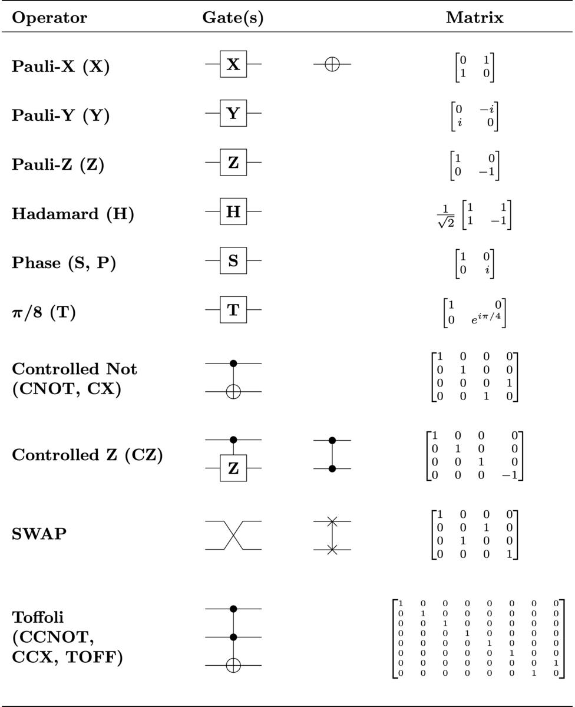{width="70%" fig-alt="TODO: describe image"}

{width="70%" fig-alt="TODO: describe image"}

- aka NOT

---

## Example: Mach-Zehnder Interferometer

:::: {.columns}
::: {.column width="55%"}
- Optics example: MZ Interferometer, consisting of 2 equal beam splitters (BSes).
- In the 1. BS the light is split equally
- In the 2. BS the light is combined again
- The two outputs are determined by on the optical path length difference.
  - If the path difference is just half the wavelength we get constructive interference at one output and destructive at the other.
  - (Ignoring any phase shifts at interfaces for now.)
:::
::: {.column width="45%"}
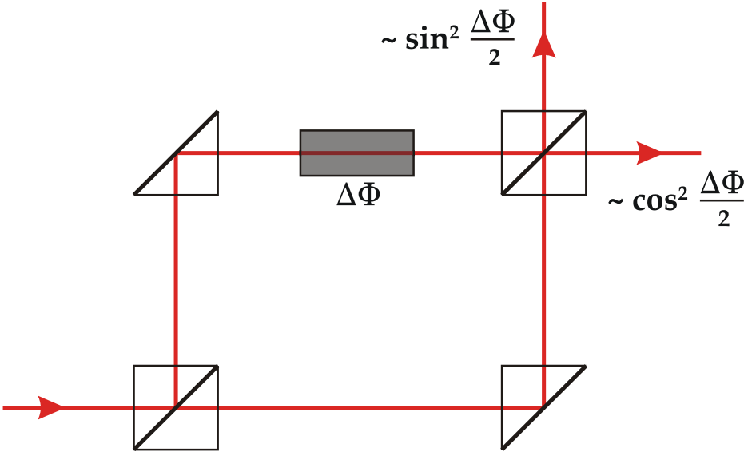{width="100%" fig-alt="TODO: describe image"}
:::
::::

---

## Example: Mach-Zehnder Interferometer

<!-- TODO: complex slide layout (flagged by detect_complex_slide.py - see run log). Content below is complete but UNARRANGED - needs manual layout to match the original slide. -->

- Optics example: MZ Interferometer, consisting of 2 equal beam splitters (BSes).
  - In BS1, the light is split equally
  - In BS2, the light is combined+split again
- The two outputs are determined by on the optical path length difference.
  - If the path difference is just half the wavelength we get constructive interference at one output and destructive at the other.
  - (Ignoring any phase shifts at interfaces for now.)

{fig-alt="TODO"}

- BS1
- BS2
- M
- M
- P
- Laser

---

## Example: Mach-Zehnder Interferometer

<!-- TODO: complex slide layout (flagged by detect_complex_slide.py - see run log). Content below is complete but UNARRANGED - needs manual layout to match the original slide. -->

{fig-alt="TODO"}

- To visualize the states, let's rotate our heads by 45 degrees:

- BS1

- BS2

- M

- M

- P

- Laser

- Detector 0

- Detector 1

---

## Example: Mach-Zehnder Interferometer

<!-- TODO: complex slide layout (flagged by detect_complex_slide.py - see run log). Content below is complete but UNARRANGED - needs manual layout to match the original slide. -->

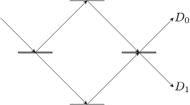{fig-alt="TODO"}

- To visualize the states, let's rotate our heads by 45 degrees:

- BS1

- BS2

- M

- M

- P

- Laser

- Detector 0

- Detector 1

- "Upper" photon: $| \uparrow ⟩=\left( \begin{aligned}
1 \\
0
\end{aligned} \right)$

- "Lower" photon: $| \downarrow ⟩=\left( \begin{aligned}
0 \\
1
\end{aligned} \right)$

- Generic photon: $ \alpha | \uparrow ⟩+ \beta | \downarrow ⟩$

- Depending on the exact nature of BS1/BS/P, we observe interference at D0 and D1.

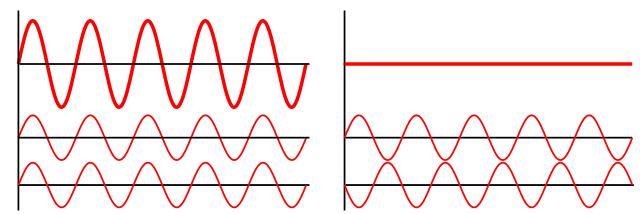{fig-alt="TODO"}

- original version: Haade;vectorization: Wjh31, Quibik, CC BY-SA 3.0 <https://creativecommons.org/licenses/by-sa/3.0>, via Wikimedia Commons

- original version: Haade;vectorization: Wjh31, Quibik, CC BY-SA 3.0 <https://creativecommons.org/licenses/by-sa/3.0>, via Wikimedia Commons

---

## Example: Mach-Zehnder Interferometer

<!-- TODO: complex slide layout (flagged by detect_complex_slide.py - see run log). Content below is complete but UNARRANGED - needs manual layout to match the original slide. -->

- Let's write down a beam splitting operator for BS1
  - Desired behavior:
    - $$| \uparrow ⟩ \longrightarrow \frac{1}{\sqrt{2}}| \uparrow ⟩+\frac{1}{\sqrt{2}}| \downarrow ⟩$$
    - $$| \downarrow ⟩ \longrightarrow \frac{1}{\sqrt{2}}| \uparrow ⟩+\frac{1}{\sqrt{2}}| \downarrow ⟩$$
    - This is only one possibility: the beam splitter can also introduce phases.
- Written as a matrix, with some nontrivial phases:

- original version: Haade;vectorization: Wjh31, Quibik, CC BY-SA 3.0 <https://creativecommons.org/licenses/by-sa/3.0>, via Wikimedia Commons

{fig-alt="TODO"}

- BS1

- BS2

- M

- M

- P

- Laser

- D0

- D1

- $${\text{BS}}_{1}=\frac{1}{\sqrt{2}}\left( \begin{matrix}
1 & 1 \\
1 & -1
\end{matrix} \right)$$

  - (You can check that this is indeed unitary.)

---

## Example: Mach-Zehnder Interferometer

<!-- TODO: complex slide layout (flagged by detect_complex_slide.py - see run log). Content below is complete but UNARRANGED - needs manual layout to match the original slide. -->

- Let's write down a beam splitting operator for BS1
  - Desired behavior:
    - $$| \uparrow ⟩ \longrightarrow \frac{1}{\sqrt{2}}| \uparrow ⟩+\frac{1}{\sqrt{2}}| \downarrow ⟩$$
    - $$| \downarrow ⟩ \longrightarrow \frac{1}{\sqrt{2}}| \uparrow ⟩+\frac{1}{\sqrt{2}}| \downarrow ⟩$$
    - This is only one possibility: the beam splitter can also introduce phases.
- Written as a matrix, with some nontrivial phases:

- original version: Haade;vectorization: Wjh31, Quibik, CC BY-SA 3.0 <https://creativecommons.org/licenses/by-sa/3.0>, via Wikimedia Commons

{fig-alt="TODO"}

- BS1

- BS2

- M

- M

- P

- Laser

- D0

- D1

- $${\text{BS}}_{1}=\frac{1}{\sqrt{2}}\left( \begin{matrix}
1 & 1 \\
1 & -1
\end{matrix} \right)$$

  - (You can check that this is indeed unitary.)

- This particular form of BS1 is called a Hadamard gate, H.
- It maps the input classical states to "plus/minus" states:
  - $$\begin{matrix}
|+⟩ & =\frac{1}{\sqrt{2}}(| \uparrow ⟩+| \downarrow ⟩) \\
|-⟩ & =\frac{1}{\sqrt{2}}(| \uparrow ⟩-| \downarrow ⟩)
\end{matrix}$$

---

## Example: Mach-Zehnder Interferometer

<!-- TODO: complex slide layout (flagged by detect_complex_slide.py - see run log). Content below is complete but UNARRANGED - needs manual layout to match the original slide. -->

- Let's write down a beam splitting operator for BS1
  - Desired behavior:
    - $$| \uparrow ⟩ \longrightarrow \frac{1}{\sqrt{2}}| \uparrow ⟩+\frac{1}{\sqrt{2}}| \downarrow ⟩$$
    - $$| \downarrow ⟩ \longrightarrow \frac{1}{\sqrt{2}}| \uparrow ⟩+\frac{1}{\sqrt{2}}| \downarrow ⟩$$
    - This is only one possibility: the beam splitter can also introduce phases, say $i$ on reflection.
- Written as a matrix:

- original version: Haade;vectorization: Wjh31, Quibik, CC BY-SA 3.0 <https://creativecommons.org/licenses/by-sa/3.0>, via Wikimedia Commons

{fig-alt="TODO"}

- BS1

- BS2

- M

- M

- P

- Laser

- D0

- D1

- $$B=\left( \begin{matrix}
1/\sqrt{2} & i/\sqrt{2} \\
i/\sqrt{2} & 1/\sqrt{2}
\end{matrix} \right)$$

  - (You can check that this is indeed unitary.)

---

## Example: Mach-Zehnder Interferometer

<!-- TODO: complex slide layout (flagged by detect_complex_slide.py - see run log). Content below is complete but UNARRANGED - needs manual layout to match the original slide. -->

- Next ,the phase shifter, P
  - Desired behavior:
    - $$| \uparrow ⟩ \longrightarrow {e}^{i \Delta  \Phi }| \uparrow ⟩$$
    - $$| \downarrow ⟩ \longrightarrow | \downarrow ⟩$$
- Written as a matrix:

- original version: Haade;vectorization: Wjh31, Quibik, CC BY-SA 3.0 <https://creativecommons.org/licenses/by-sa/3.0>, via Wikimedia Commons

{fig-alt="TODO"}

- BS1

- BS2

- M

- M

- P

- Laser

- D0

- D1

- $$P=\left( \begin{matrix}
{e}^{i \Delta  \Phi } & 0 \\
0 & 1
\end{matrix} \right)$$

---

## Example: Mach-Zehnder Interferometer

<!-- TODO: complex slide layout (flagged by detect_complex_slide.py - see run log). Content below is complete but UNARRANGED - needs manual layout to match the original slide. -->

- Putting it all together, let's start with an "upper" photon, ${ \psi }_{u}=\left( \begin{aligned}
1 \\
0
\end{aligned} \right)$, and follow it through the operators:

- original version: Haade;vectorization: Wjh31, Quibik, CC BY-SA 3.0 <https://creativecommons.org/licenses/by-sa/3.0>, via Wikimedia Commons

{fig-alt="TODO"}

- BS1

- BS2

- M

- M

- P

- Laser

- D0

- D1

- $$B{ \psi }_{u}=\frac{1}{\sqrt{2}}\left( \begin{matrix}
1 & 1 \\
1 & -1
\end{matrix} \right)\left( \begin{aligned}
1 \\
0
\end{aligned} \right)=\frac{1}{\sqrt{2}}\left( \begin{aligned}
1 \\
1
\end{aligned} \right)$$

- $$PB{ \psi }_{u}=\left( \begin{matrix}
{e}^{i \Delta  \Phi } & 0 \\
0 & 1
\end{matrix} \right)\frac{1}{\sqrt{2}}\left( \begin{aligned}
1 \\
1
\end{aligned} \right)=\frac{1}{\sqrt{2}}\left( \begin{aligned}
{e}^{i \Delta  \Phi } \\
1
\end{aligned} \right)$$

- $$BPB{ \psi }_{u}=\frac{1}{\sqrt{2}}\left( \begin{matrix}
1 & 1 \\
1 & -1
\end{matrix} \right)\frac{1}{\sqrt{2}}\left( \begin{aligned}
{e}^{i \Delta  \Phi } \\
1
\end{aligned} \right)=\frac{1}{2}\left( \begin{aligned}
{e}^{i \Delta  \Phi }+1 \\
{e}^{i \Delta  \Phi }-1
\end{aligned} \right)$$

- $$={e}^{i \Delta  \Phi /2}\left( \begin{aligned}
cos( \Delta  \Phi /2) \\
isin( \Delta  \Phi /2)
\end{aligned} \right)$$

---

## Example: Boson sampling

- original version: Haade;vectorization: Wjh31, Quibik, CC BY-SA 3.0 <https://creativecommons.org/licenses/by-sa/3.0>, via Wikimedia Commons

- Harder example: array of Beamsplitters (Mach–Zehnder^N)
  - This is an early example of a non-computable problem on a classical computer, but accessible to a QC!
- Indistinguishable photons at input
- Single photon counters at output
- Computes the determinant of a matrix (CC “hard P”)

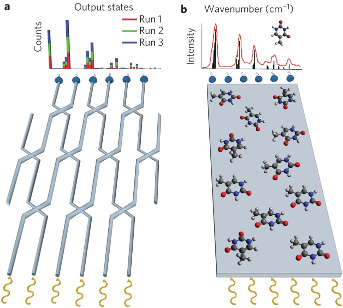{width="70%" fig-alt="TODO: describe image"}

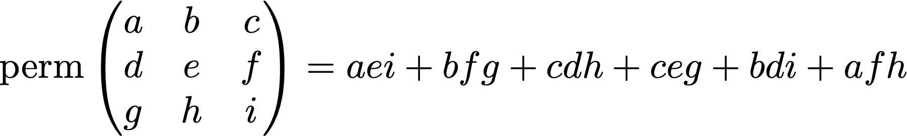{width="70%" fig-alt="TODO: describe image"}

---

## Hands-on

<!-- TODO: complex slide layout (flagged by detect_complex_slide.py - see run log). Content below is complete but UNARRANGED - needs manual layout to match the original slide. -->

- We will try out IBM qiskit to simulate a quantum computer.
  - (And maybe even use a real quantum computer through their API!)
- First, pull the latest Docker container to get qiskit:
- docker pull ubsuny/compphys:latest
- git pull ubsuny/compphys
- [CompPhys/qiskit/MachZehnder.ipynb](https://github.com/ubsuny/CompPhys/blob/main/qiskit/MachZehnder.ipynb)
- [CompPhys/qiskit/QiskitGates.ipynb](https://github.com/ubsuny/CompPhys/blob/main/qiskit/QiskitGates.ipynb)

- original version: Haade;vectorization: Wjh31, Quibik, CC BY-SA 3.0 <https://creativecommons.org/licenses/by-sa/3.0>, via Wikimedia Commons

{fig-alt="TODO"}

- BS1

- BS2

- M

- M

- P

- Laser

- D0

- D1

---

## Hands-on

<!-- TODO: complex slide layout (flagged by detect_complex_slide.py - see run log). Content below is complete but UNARRANGED - needs manual layout to match the original slide. -->

- We will try out IBM qiskit to simulate a quantum computer.
  - (And maybe even use a real quantum computer through their API!)
- First, pull the latest Docker container to get qiskit:
- docker pull ubsuny/compphys:latest
- [CompPhys/qiskit/MachZehnder.ipynb](https://github.com/ubsuny/CompPhys/blob/main/qiskit/MachZehnder.ipynb)
- [CompPhys/qiskit/QiskitGates.ipynb](https://github.com/ubsuny/CompPhys/blob/main/qiskit/QiskitGates.ipynb)
  - Learn about multi-qubit gates

- original version: Haade;vectorization: Wjh31, Quibik, CC BY-SA 3.0 <https://creativecommons.org/licenses/by-sa/3.0>, via Wikimedia Commons

{fig-alt="TODO"}

- BS1

- BS2

- M

- M

- P

- Laser

- D0

- D1

---

# Some quantum mechanics

---

## Back to quantum mechanics

- To understand the behavior of qubits, let's go back to some basic quantum mechanics.
- Schrödinger’s equation is conservation of energy:
    - $$E=\frac{{p}^{2}}{2m}+V(x)$$
- with some substitutions:
  - $$\begin{matrix}
\vec{p} &  \rightarrow i\overline{h}\vec{ \nabla } \\
E &  \rightarrow i\overline{h}\frac{ \partial }{ \partial t}
\end{matrix}$$
- Yielding the 1D Schrödinger equation:
  - $$i\overline{h}\frac{ \partial  \psi (x,t)}{ \partial t}=-\frac{{ \hbar }^{2}}{2m}\frac{ \partial {}^{2}}{ \partial {x}^{2}} \psi (x,t)+V(x) \psi (x,t)$$

- original version: Haade;vectorization: Wjh31, Quibik, CC BY-SA 3.0 <https://creativecommons.org/licenses/by-sa/3.0>, via Wikimedia Commons

{width="70%" fig-alt="TODO: describe image"}

---

## Back to quantum mechanics

<!-- TODO: complex slide layout (flagged by detect_complex_slide.py - see run log). Content below is complete but UNARRANGED - needs manual layout to match the original slide. -->

- Solutions to the S.E. can be expressed as a sum of infinitely many sine and cosine waves (or complex exponentials). In time-independent cases:

- original version: Haade;vectorization: Wjh31, Quibik, CC BY-SA 3.0 <https://creativecommons.org/licenses/by-sa/3.0>, via Wikimedia Commons

{fig-alt="TODO"}

- $$ \psi (x)=\mathop{\mathop{ \sum }\limits_{i=0}}\limits^{ \infty }{A}_{i}{e}^{i{p}_{i}x}$$

- $$ \psi (x)=\frac{1}{\sqrt{2 \pi  \hbar }}{ \int }_{- \infty }^{ \infty }F(p){i}^{ipx/ \hbar }dp$$

- Continuum limit

- Discrete

- These are basically Fourier transformations!

---

## Fourier transformations

<!-- TODO: complex slide layout (flagged by detect_complex_slide.py - see run log). Content below is complete but UNARRANGED - needs manual layout to match the original slide. -->

- Every function can be expressed as an infinite sum of sine waves (or complex exponentials).
- Fourier series are the amplitudes of those sine waves at each frequency.
- We will cover these in detail next week!

- original version: Haade;vectorization: Wjh31, Quibik, CC BY-SA 3.0 <https://creativecommons.org/licenses/by-sa/3.0>, via Wikimedia Commons

{fig-alt="TODO"}

- Can solve for Fourier coefficients

{fig-alt="TODO"}

---

## Fourier transformations

<!-- TODO: complex slide layout (flagged by detect_complex_slide.py - see run log). Content below is complete but UNARRANGED - needs manual layout to match the original slide. -->

- Example 1: Single frequency
  - Fourier transformation is a delta function.

- original version: Haade;vectorization: Wjh31, Quibik, CC BY-SA 3.0 <https://creativecommons.org/licenses/by-sa/3.0>, via Wikimedia Commons

{fig-alt="TODO"}

- Can solve for Fourier coefficients

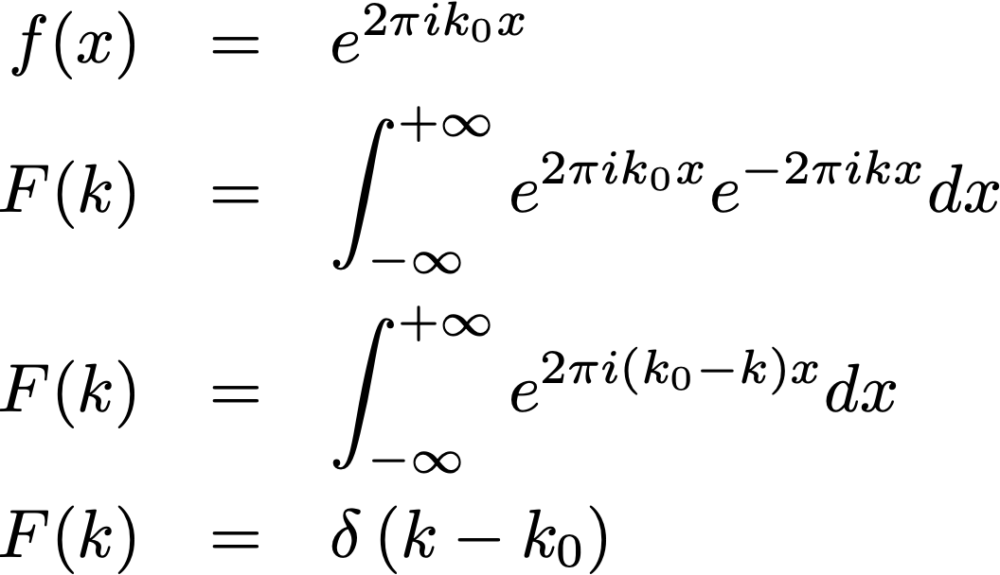{fig-alt="TODO"}

---

## Fourier transformations

<!-- TODO: complex slide layout (flagged by detect_complex_slide.py - see run log). Content below is complete but UNARRANGED - needs manual layout to match the original slide. -->

- Example 1: Gaussian
  - Fourier transformation is another Gaussian
  - Width = 1/sigma of input function.

- original version: Haade;vectorization: Wjh31, Quibik, CC BY-SA 3.0 <https://creativecommons.org/licenses/by-sa/3.0>, via Wikimedia Commons

{fig-alt="TODO"}

- Can solve for Fourier coefficients

{fig-alt="TODO"}

---

## Uncertainty principle

<!-- TODO: complex slide layout (flagged by detect_complex_slide.py - see run log). Content below is complete but UNARRANGED - needs manual layout to match the original slide. -->

- In terms of wavefunctions, considering a wave packet that is Gaussian in x with width $ \Delta x$, the momentum distribution will have a width $ \Delta p$ that is inversely proportional, with a minimum of:
  - $$ \Delta x \Delta p \geq \frac{ \hbar }{2}$$
  - A consequence of wave-particle duality.
- This is intrinsically related to decoherence (more on this next lecture).

- original version: Haade;vectorization: Wjh31, Quibik, CC BY-SA 3.0 <https://creativecommons.org/licenses/by-sa/3.0>, via Wikimedia Commons

{fig-alt="TODO"}

- Can solve for Fourier coefficients

---

## Recap

- This week, we are doing a quick introduction to the basics of quantum computing.
  - No formal assignments, you will have the midterm on your plate!
- Reviewed classical logic gates.
- Introduced qubits: quantum state vectors for a simple 2-dimensional system.
- Quantum measurements and operators
- Example: Mach–Zehnder interferometer.
- Implemented in python using qiskit.
- Up next:
  - Bell's inequalities and CHSH
  - Decoherence

---

## Hands-on

<!-- TODO: complex slide layout (flagged by detect_complex_slide.py - see run log). Content below is complete but UNARRANGED - needs manual layout to match the original slide. -->

- Today will be mostly hands-on with qiskit.
- If you haven't already, pull the latest Docker container to get qiskit:
- docker pull ubsuny/compphys:latest
- git pull ubsuny/compphys
  - [CompPhys/qiskit/MachZehnder.ipynb](https://github.com/ubsuny/CompPhys/blob/main/qiskit/MachZehnder.ipynb)
  - [CompPhys/qiskit/QiskitGates.ipynb](https://github.com/ubsuny/CompPhys/blob/main/qiskit/QiskitGates.ipynb)
  - [CompPhys/qiskit/QiskitTeleportation.ipynb](https://github.com/ubsuny/CompPhys/blob/main/qiskit/QiskitTeleportation.ipynb)
  - [CompPhys/qiskit/QiskitSuperdense.ipynb](https://github.com/ubsuny/CompPhys/blob/main/qiskit/QiskitSuperdense.ipynb)
  - [CompPhys/qiskit/QiskitCHSH.ipynb](https://github.com/ubsuny/CompPhys/blob/main/qiskit/QiskitCHSH.ipynb)

- original version: Haade;vectorization: Wjh31, Quibik, CC BY-SA 3.0 <https://creativecommons.org/licenses/by-sa/3.0>, via Wikimedia Commons

{fig-alt="TODO"}

- BS1

- BS2

- M

- M

- P

- Laser

- D0

- D1

---

# Some quantum mechanics

---

## Back to quantum mechanics

- To understand the behavior of qubits, let's go back to some basic quantum mechanics.
- Schrödinger’s equation is conservation of energy:
    - $$E=\frac{{p}^{2}}{2m}+V(x)$$
- with some substitutions:
  - $$\begin{matrix}
\vec{p} &  \rightarrow i\overline{h}\vec{ \nabla } \\
E &  \rightarrow i\overline{h}\frac{ \partial }{ \partial t}
\end{matrix}$$
- Yielding the 1D Schrödinger equation:
  - $$i\overline{h}\frac{ \partial  \psi (x,t)}{ \partial t}=-\frac{{ \hbar }^{2}}{2m}\frac{ \partial {}^{2}}{ \partial {x}^{2}} \psi (x,t)+V(x) \psi (x,t)$$

- original version: Haade;vectorization: Wjh31, Quibik, CC BY-SA 3.0 <https://creativecommons.org/licenses/by-sa/3.0>, via Wikimedia Commons

{width="70%" fig-alt="TODO: describe image"}

---

## Back to quantum mechanics

<!-- TODO: complex slide layout (flagged by detect_complex_slide.py - see run log). Content below is complete but UNARRANGED - needs manual layout to match the original slide. -->

- In terms of algorithms, we don't care so much about general solutions to the Schrodinger equation.
  - We just want a system with a few states, where we can generate stable, coherent states that we can measure.
- Globally, the nature of the solutions is still important.
  - Recall: solutions to the S.E. can be expressed as a sum of infinitely many sine and cosine waves (or complex exponentials).
  - In time-independent cases:

- original version: Haade;vectorization: Wjh31, Quibik, CC BY-SA 3.0 <https://creativecommons.org/licenses/by-sa/3.0>, via Wikimedia Commons

{fig-alt="TODO"}

- $$ \psi (x)=\mathop{\mathop{ \sum }\limits_{i=0}}\limits^{ \infty }{A}_{i}{e}^{i{p}_{i}x}$$

- $$ \psi (x)=\frac{1}{\sqrt{2 \pi  \hbar }}{ \int }_{- \infty }^{ \infty }F(p){i}^{ipx/ \hbar }dp$$

- Continuum limit

- Discrete

- These are basically Fourier transformations.

---

## Fourier transformations

<!-- TODO: complex slide layout (flagged by detect_complex_slide.py - see run log). Content below is complete but UNARRANGED - needs manual layout to match the original slide. -->

- Every function can be expressed as an infinite sum of sine waves (or complex exponentials).
- Fourier series are the amplitudes of those sine waves at each frequency.
- We will cover these in detail next week!

- original version: Haade;vectorization: Wjh31, Quibik, CC BY-SA 3.0 <https://creativecommons.org/licenses/by-sa/3.0>, via Wikimedia Commons

{fig-alt="TODO"}

- Can solve for Fourier coefficients

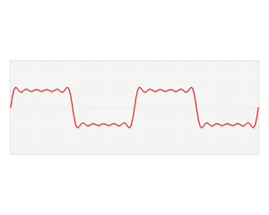{fig-alt="TODO"}

---

## Fourier transformations

<!-- TODO: complex slide layout (flagged by detect_complex_slide.py - see run log). Content below is complete but UNARRANGED - needs manual layout to match the original slide. -->

- Example 1: Single frequency
  - Fourier transformation is a delta function.

- original version: Haade;vectorization: Wjh31, Quibik, CC BY-SA 3.0 <https://creativecommons.org/licenses/by-sa/3.0>, via Wikimedia Commons

{fig-alt="TODO"}

- Can solve for Fourier coefficients

{fig-alt="TODO"}

---

## Fourier transformations

<!-- TODO: complex slide layout (flagged by detect_complex_slide.py - see run log). Content below is complete but UNARRANGED - needs manual layout to match the original slide. -->

- Example 1: Gaussian
  - Fourier transformation is another Gaussian
  - Width = 1/sigma of input function.

- original version: Haade;vectorization: Wjh31, Quibik, CC BY-SA 3.0 <https://creativecommons.org/licenses/by-sa/3.0>, via Wikimedia Commons

{fig-alt="TODO"}

- Can solve for Fourier coefficients

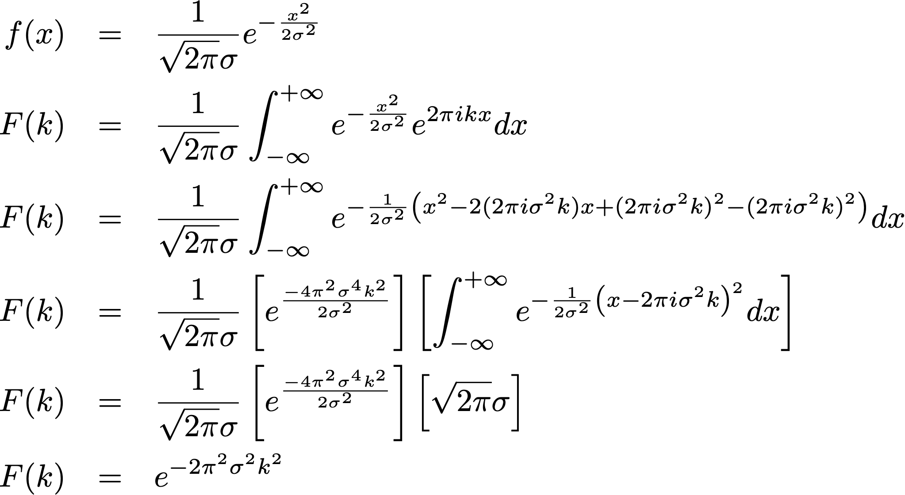{fig-alt="TODO"}

---

## Uncertainty principle

<!-- TODO: complex slide layout (flagged by detect_complex_slide.py - see run log). Content below is complete but UNARRANGED - needs manual layout to match the original slide. -->

- In terms of wavefunctions, considering a wave packet that is Gaussian in x with width $ \Delta x$, the momentum distribution will have a width $ \Delta p$ that is inversely proportional, with a minimum of:
  - $$ \Delta x \Delta p \geq \frac{ \hbar }{2}$$
  - A consequence of wave-particle duality.
- This is intrinsically related to decoherence (more on this next lecture).

- original version: Haade;vectorization: Wjh31, Quibik, CC BY-SA 3.0 <https://creativecommons.org/licenses/by-sa/3.0>, via Wikimedia Commons

{fig-alt="TODO"}

- Can solve for Fourier coefficients

---

## Uncertainty principle

<!-- TODO: complex slide layout (flagged by detect_complex_slide.py - see run log). Content below is complete but UNARRANGED - needs manual layout to match the original slide. -->

- Position and momentum are only one example of the Heisenberg uncertainty principle. Any operators that do not commute will have the same behavior:
  - Components of spin/angular momentum ($({J}_{x},{J}_{y},{J}_{z})$ or $(J,{J}_{z})$)

- original version: Haade;vectorization: Wjh31, Quibik, CC BY-SA 3.0 <https://creativecommons.org/licenses/by-sa/3.0>, via Wikimedia Commons

{fig-alt="TODO"}

- Can solve for Fourier coefficients

- $${\hat{S}}_{x}=\frac{ \hbar }{2}\left( \begin{matrix}
0 & 1 \\
1 & 0
\end{matrix} \right)$$

- $${\hat{S}}_{y}=\frac{ \hbar }{2}\left( \begin{matrix}
0 & -i \\
i & 0
\end{matrix} \right)$$

- $${\hat{S}}_{z}=\left( \begin{matrix}
1 & 0 \\
0 & -1
\end{matrix} \right)$$

- $$[{\hat{S}}_{i},{\hat{S}}_{j}]=i \hbar { \epsilon }_{ijk}{\hat{S}}_{k}$$

---

## Neutrino oscillations

<!-- TODO: complex slide layout (flagged by detect_complex_slide.py - see run log). Content below is complete but UNARRANGED - needs manual layout to match the original slide. -->

- An example from particle physics: neutrino oscillations
- What we call ${ \nu }_{e}$, ${ \nu }_{ \mu }$, and ${ \nu }_{ \tau }$ are flavor eigenstates: eigenstates of the weak interaction.
- Fascinatingly, these are not mass eigenstates! This gives rise to neutrino oscillations:
  - A neutrino from a weak decay (e.g. ${}_{6}^{14}\text{C}{ \rightarrow }_{7}^{14}\text{N}+{e}^{-}+{\overline{ \nu }}_{e}$) is produced in a flavor eigenstate.
  - This is a coherent superposition of mass eigenstates.
  - Because the components have different masses, the QM phases advances at different rates.
  - Ergo, the composition of the neutrino evolves versus time!

- original version: Haade;vectorization: Wjh31, Quibik, CC BY-SA 3.0 <https://creativecommons.org/licenses/by-sa/3.0>, via Wikimedia Commons

{fig-alt="TODO"}

- Can solve for Fourier coefficients

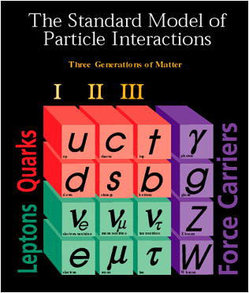{fig-alt="TODO"}

---

## Neutrino oscillations

<!-- TODO: complex slide layout (flagged by detect_complex_slide.py - see run log). Content below is complete but UNARRANGED - needs manual layout to match the original slide. -->

- original version: Haade;vectorization: Wjh31, Quibik, CC BY-SA 3.0 <https://creativecommons.org/licenses/by-sa/3.0>, via Wikimedia Commons

{fig-alt="TODO"}

- Can solve for Fourier coefficients

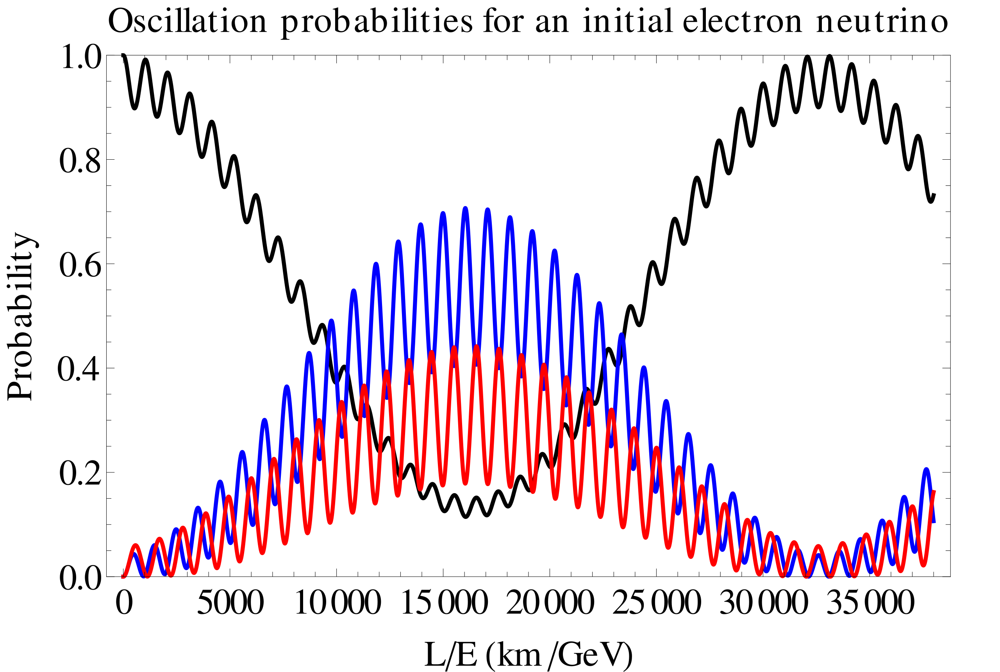{fig-alt="TODO"}

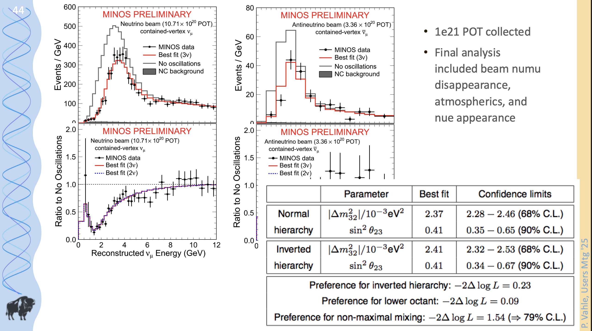{fig-alt="TODO"}

---

# EPR and bell's inequalities

---

## The EPR Paradox

<!-- TODO: complex slide layout (flagged by detect_complex_slide.py - see run log). Content below is complete but UNARRANGED - needs manual layout to match the original slide. -->

- original version: Haade;vectorization: Wjh31, Quibik, CC BY-SA 3.0 <https://creativecommons.org/licenses/by-sa/3.0>, via Wikimedia Commons

{fig-alt="TODO"}

- Can solve for Fourier coefficients

- Named after Einstein, Podolsky, Rosen
- “Spukhafte Fernwirkung”, spooky interaction at a distance

- How can we figure out if Quantum Mechanics is right, or we just don’t know everything?

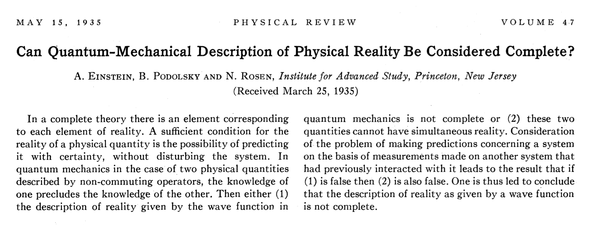{fig-alt="TODO"}

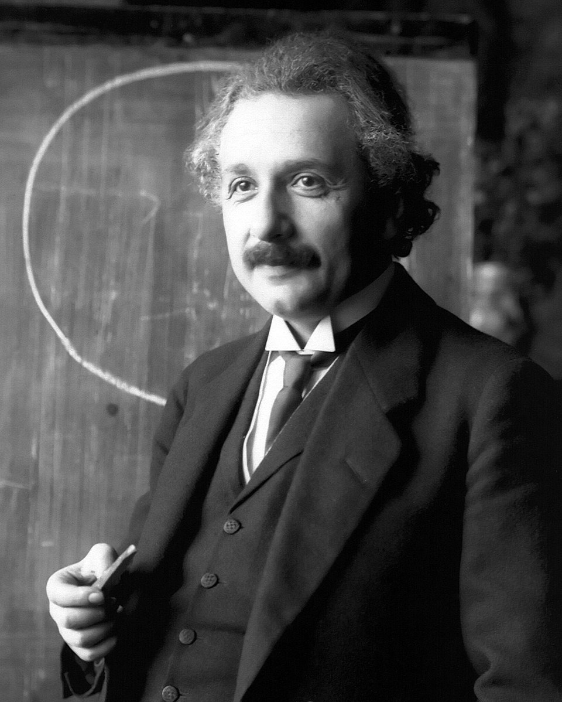{fig-alt="TODO"}

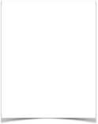{fig-alt="TODO"}

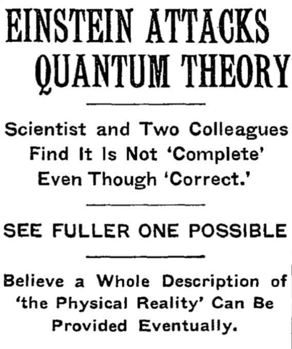{fig-alt="TODO"}

- (1930's clickbait)

---

## Gedankenexperiment

<!-- TODO: complex slide layout (flagged by detect_complex_slide.py - see run log). Content below is complete but UNARRANGED - needs manual layout to match the original slide. -->

- original version: Haade;vectorization: Wjh31, Quibik, CC BY-SA 3.0 <https://creativecommons.org/licenses/by-sa/3.0>, via Wikimedia Commons

{fig-alt="TODO"}

- Can solve for Fourier coefficients

- We have 2 particles
- They are in a common state (eg a spin singlet, Bohm version): $| \uparrow ⟩| \downarrow ⟩-| \downarrow ⟩| \uparrow ⟩$
- This is a superposition of 2 states (entanglement).
- Let's say Alice and Bob each take one spin and travel far apart from each other.
- If we measure particle 1 we know the property of particle 2 and vice versa!
  - If now Alice measures particle 1 the outcome will be either property 1 (spin up) or property 2 (spin down)
  - If Bob measures particle 2 the outcome will be either property 1 (spin down) or property 2 (spin up)
- This is "Spukhafte Fernwirkung"

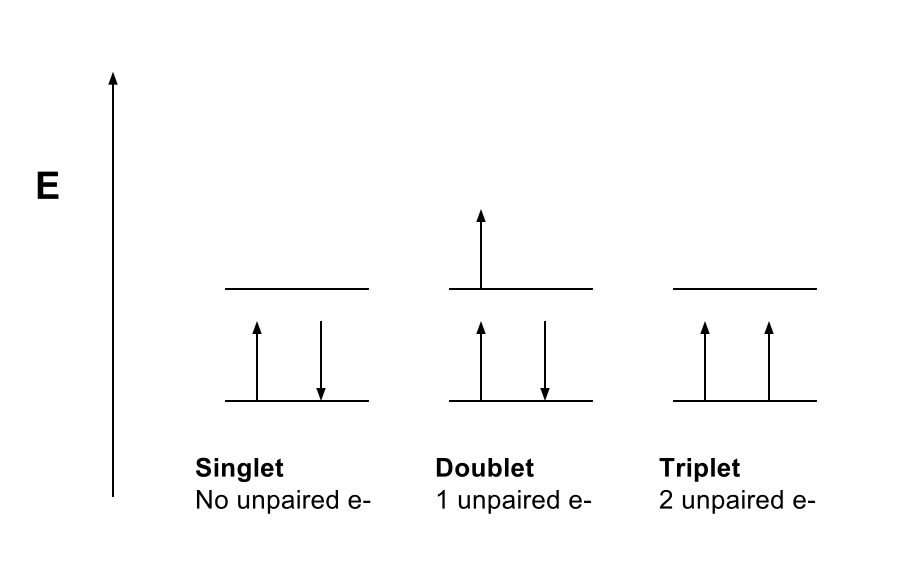{fig-alt="TODO"}

---

## Gedankenexperiment

<!-- TODO: complex slide layout (flagged by detect_complex_slide.py - see run log). Content below is complete but UNARRANGED - needs manual layout to match the original slide. -->

- original version: Haade;vectorization: Wjh31, Quibik, CC BY-SA 3.0 <https://creativecommons.org/licenses/by-sa/3.0>, via Wikimedia Commons

{fig-alt="TODO"}

- Can solve for Fourier coefficients

- Is there a difference between:
  - States were determined the whole time (via a hidden variable, “element of reality”)
  - Or if the states are only determined at the time of measurement.
- Gedankenexperiment:
  - Alice and Bob can measure the state in any basis they want.
  - E.g.: Alice measures in the $(|0⟩,|1⟩)$ basis (=spin along z)
  - Alice measures $|0⟩$ implies Bob's particle is now $|1⟩$
  - Or, if Alice measures in the $(|+⟩,|-⟩)$ basis (=spin along x) and obtains $|+⟩$, then Bob's particle is now $|-⟩$.
- However: the Heisenberg uncertainty principle tells us that z-spin and x-spin are incompatible!
  - They cannot both be measured at the same time.
  - A quantum state cannot have a $|0⟩$ and a $|+⟩$ state at the same time.

{fig-alt="TODO"}

---

## Gedankenexperiment

<!-- TODO: complex slide layout (flagged by detect_complex_slide.py - see run log). Content below is complete but UNARRANGED - needs manual layout to match the original slide. -->

{fig-alt="TODO"}

- Can solve for Fourier coefficients

- Therefore: there is a difference if Alice measures in z basis and Bob measures in x basis
- If quantum mechanics/entanglement is real, Bob's state is not determined by Alice's measurement; contrast with a "hidden variables" theory.
- Bob’s (Alice’s) state will not be determined in Quantum Mechanics, however it would be if there is a hidden variable, in particular if the decision in which basis the measurement will happened is done after the two particles are separated.
- Great! How about a real experiment?

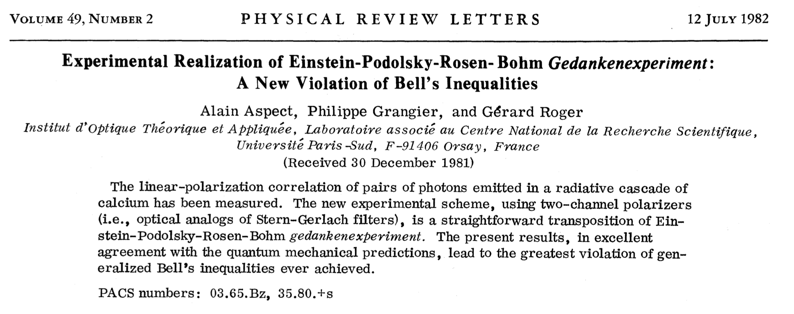{fig-alt="TODO"}

---

## Bell's Inequalities

<!-- TODO: complex slide layout (flagged by detect_complex_slide.py - see run log). Content below is complete but UNARRANGED - needs manual layout to match the original slide. -->

{fig-alt="TODO"}

- Can solve for Fourier coefficients

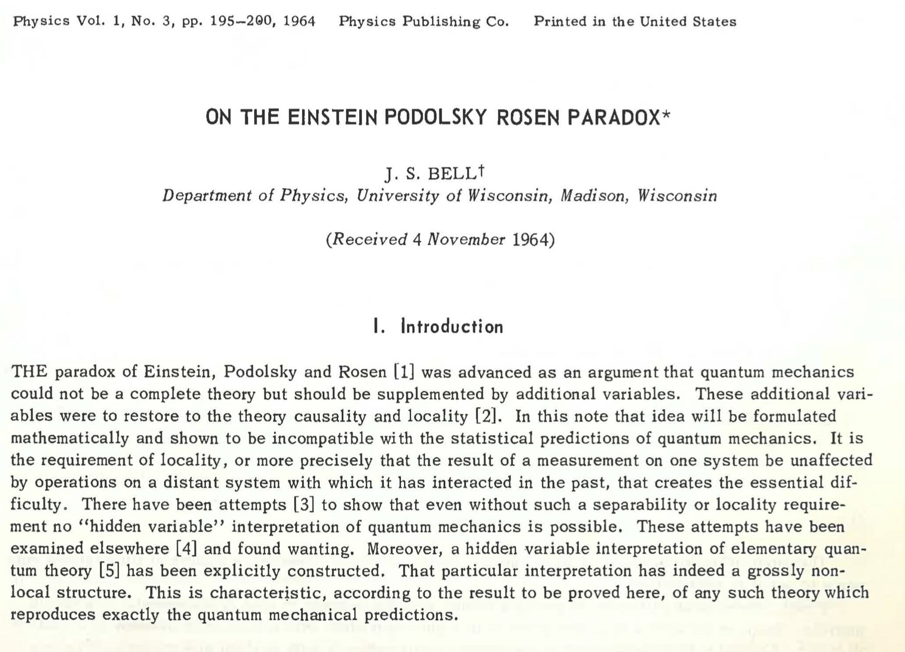{fig-alt="TODO"}

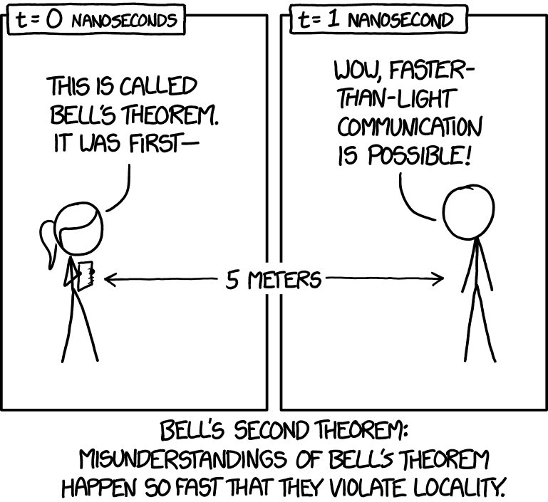{fig-alt="TODO"}

---

## Bell's Inequalities (CHSH version)

<!-- TODO: complex slide layout (flagged by detect_complex_slide.py - see run log). Content below is complete but UNARRANGED - needs manual layout to match the original slide. -->

{fig-alt="TODO"}

- Can solve for Fourier coefficients

- Bell suggested to not use orthogonal but any kind of basis to do the measurements. For example:
  - Alice measures in z basis, Bob in z basis
  - Alice measures in z basis, Bob in z + pi/6 basis
  - Alice Alice measures in z basis, Bob in z + 2(pi/6) basis
- Let's say Alice and Bob both perform two measurements in two different bases:  (A, a) for Alice and (B, b) for Bob.
- Classically, the "CHSH" variable obeys:

- $$⟨\text{CHSH}⟩=⟨A(B-b)+a(B+b)⟩=⟨AB⟩-⟨Ab⟩+⟨aB⟩+⟨ab⟩ \leq 2$$

  - Simple to see why: A, a, B, b can only yield ±1, so (B-b) and (B+b) can only be 0 or ±2 and thus A(B-b) and a(B+b) can only be ±2 and thus above inequality must be true for any case.
    - The inequality continues to hold in hidden variable scenarios.
  - However, the inequality is violated in quantum mechanical scenarios!

---

## Hands-on

<!-- TODO: complex slide layout (flagged by detect_complex_slide.py - see run log). Content below is complete but UNARRANGED - needs manual layout to match the original slide. -->

{fig-alt="TODO"}

- Can solve for Fourier coefficients

- OK, now let's get to the notebooks!
- Recommended order:
  - MZ interferometer (easier example, to get familiar with qiskit).
  - Then QiskitCHSH.
  - QiskitTeleportation and QiskitSuperdense for more examples.
- We'll recap the notebooks towards the end of class.

---

## Aside: loopholes

<!-- TODO: complex slide layout (flagged by detect_complex_slide.py - see run log). Content below is complete but UNARRANGED - needs manual layout to match the original slide. -->

{fig-alt="TODO"}

- Can solve for Fourier coefficients

- Many loopholes in Bell's inequalities were proposed.
  - Detection loophole (QC disproves that)
  - Locality loophole (QC still has that)
  - Freedom of Choice Loophole (https://arxiv.org/pdf/1805.04431.pdf)
  - ...
- All are closed in the meantime
  - [https://physics.aps.org/articles/v8/123](https://physics.aps.org/articles/v8/123)
  - [https://www.nature.com/articles/s41586-023-05885-0](https://www.nature.com/articles/s41586-023-05885-0)

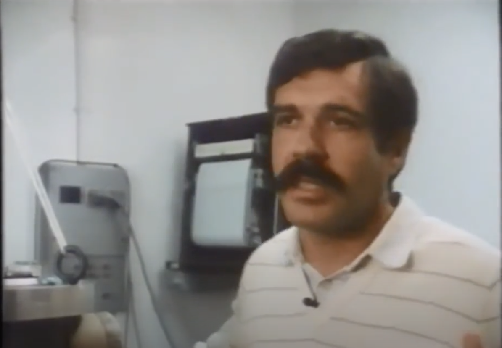{fig-alt="TODO"}

- “Quantum Entanglement Documentary Atomic Physics and Reality”, John Archibald Wheeler, John Stewart Bell, Alain Aspect, David Bohm, et.al. (1985)
- [https://www.youtube.com/watch?v=SEjte11wPeI](https://www.youtube.com/watch?v=SEjte11wPeI)

---

## Recap

<!-- TODO: complex slide layout (flagged by detect_complex_slide.py - see run log). Content below is complete but UNARRANGED - needs manual layout to match the original slide. -->

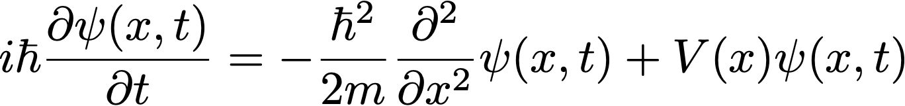{fig-alt="TODO"}

- Can solve for Fourier coefficients

- Reviewed some quantum mechanics basics relevant for quantum computing
  - Uncertainty principle, incompatible observables.
- EPR paradox
  - Is QM uncertainty "real," or can it be explained by "hidden variables"?
- Bell's inequalities (violation thereof) proves QM uncertainty is "real."
- Next time:
  - Decoherence
  - (Midterm should be ready by Friday)

---

## Quantum circuits

- [https://quantum.cloud.ibm.com/learning/en/courses/basics-of-quantum-information/entanglement-in-action/introduction](https://quantum.cloud.ibm.com/learning/en/courses/basics-of-quantum-information/entanglement-in-action/introduction)

---

## Teleportation

- original version: Haade;vectorization: Wjh31, Quibik, CC BY-SA 3.0 <https://creativecommons.org/licenses/by-sa/3.0>, via Wikimedia Commons

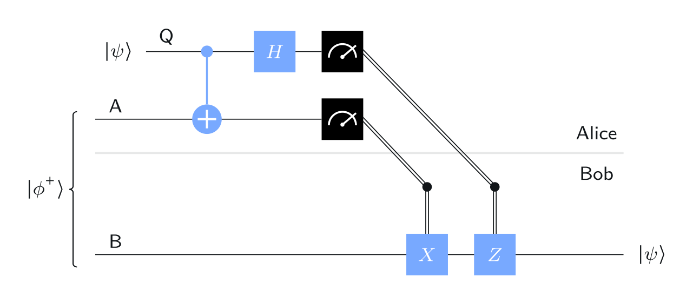{width="70%" fig-alt="TODO: describe image"}

- Alice has a qubit, $Q= \alpha |0⟩+ \beta |1⟩$, to send to Bob.
- $|{ \phi }^{+}⟩=\frac{1}{\sqrt{2}}(|00⟩+|11⟩$ is an entangled Bell state.
  - Alice has one half (A), and Bob has the other half (B).
- Let's step through the operations one-by-one.

- [https://quantum.cloud.ibm.com/learning/en/courses/basics-of-quantum-information/entanglement-in-action/introduction](https://quantum.cloud.ibm.com/learning/en/courses/basics-of-quantum-information/entanglement-in-action/introduction)

---

## Teleportation

<!-- TODO: complex slide layout (flagged by detect_complex_slide.py - see run log). Content below is complete but UNARRANGED - needs manual layout to match the original slide. -->

- original version: Haade;vectorization: Wjh31, Quibik, CC BY-SA 3.0 <https://creativecommons.org/licenses/by-sa/3.0>, via Wikimedia Commons

- Initial state:

- $$\begin{matrix}
|{ \pi }_{0}⟩ & =( \alpha |0{⟩}_{Q}+ \beta |1{⟩}_{Q}) \otimes \frac{1}{\sqrt{2}}(|00{⟩}_{BA}+|11{⟩}_{BA}) \\
 & =\frac{1}{\sqrt{2}}\left(  \alpha |00{⟩}_{BA}|0{⟩}_{Q}+ \beta |00{⟩}_{BA}|1{⟩}_{Q}+ \alpha |11{⟩}_{BA}|0{⟩}_{Q}+ \beta |11{⟩}_{BA}|1{⟩}_{Q} \right) \\
 & =\frac{1}{\sqrt{2}}\left(  \alpha |000⟩+ \beta |001⟩+ \alpha |110⟩+ \beta |111⟩ \right)
\end{matrix}$$

{fig-alt="TODO"}

- Q

- B

- A

- [https://quantum.cloud.ibm.com/learning/en/courses/basics-of-quantum-information/entanglement-in-action/introduction](https://quantum.cloud.ibm.com/learning/en/courses/basics-of-quantum-information/entanglement-in-action/introduction)

---

## Teleportation

<!-- TODO: complex slide layout (flagged by detect_complex_slide.py - see run log). Content below is complete but UNARRANGED - needs manual layout to match the original slide. -->

- original version: Haade;vectorization: Wjh31, Quibik, CC BY-SA 3.0 <https://creativecommons.org/licenses/by-sa/3.0>, via Wikimedia Commons

- After CNOT (controlled not) between qubits Q and B:

- $$\begin{matrix}
|{ \pi }_{1}⟩ & ={\text{CNOT}}_{QA}\left[ \frac{1}{\sqrt{2}}\left(  \alpha |000⟩+ \beta |001⟩+ \alpha |110⟩+ \beta |111⟩ \right) \right] \\
 & =\frac{1}{\sqrt{2}}\left(  \alpha |000⟩+ \beta |101⟩+ \alpha |110⟩+ \beta |011⟩ \right)
\end{matrix}$$

{fig-alt="TODO"}

- Q

- B

- A

- [https://quantum.cloud.ibm.com/learning/en/courses/basics-of-quantum-information/entanglement-in-action/introduction](https://quantum.cloud.ibm.com/learning/en/courses/basics-of-quantum-information/entanglement-in-action/introduction)

---

## Teleportation

<!-- TODO: complex slide layout (flagged by detect_complex_slide.py - see run log). Content below is complete but UNARRANGED - needs manual layout to match the original slide. -->

- original version: Haade;vectorization: Wjh31, Quibik, CC BY-SA 3.0 <https://creativecommons.org/licenses/by-sa/3.0>, via Wikimedia Commons

- After Hadamard gate applied to qubit 3:

- $$\begin{matrix}
|{ \pi }_{2}⟩ & ={\text{H}}_{3}\left[ \frac{1}{\sqrt{2}}\left(  \alpha |000⟩+ \beta |101⟩+ \alpha |110⟩+ \beta |011⟩ \right) \right] \\
 & =\frac{1}{2}\left(  \alpha |00{⟩}_{12}|+{⟩}_{3}+ \beta |10{⟩}_{12}|-{⟩}_{3}+ \alpha |11{⟩}_{12}|+{⟩}_{3}+ \beta |01{⟩}_{12}|-{⟩}_{3} \right) \\
 & =\frac{1}{2}\left(  \alpha (|000⟩+|001⟩+|110⟩+|111⟩)+ \beta (|010⟩-|011⟩+|100⟩-|101⟩) \right)
\end{matrix}$$

{fig-alt="TODO"}

- $$\begin{matrix}
H & =\frac{1}{\sqrt{2}}\left( \begin{matrix}
1 & 1 \\
1 & -1
\end{matrix} \right) \\
H|0⟩ & =|+⟩=\frac{1}{\sqrt{2}}(|0⟩+|1⟩) \\
H|1⟩ & =|-⟩=\frac{1}{\sqrt{2}}(|0⟩-|1⟩)
\end{matrix}$$

- Q

- B

- A

- [https://quantum.cloud.ibm.com/learning/en/courses/basics-of-quantum-information/entanglement-in-action/introduction](https://quantum.cloud.ibm.com/learning/en/courses/basics-of-quantum-information/entanglement-in-action/introduction)

---

## Teleportation

<!-- TODO: complex slide layout (flagged by detect_complex_slide.py - see run log). Content below is complete but UNARRANGED - needs manual layout to match the original slide. -->

- original version: Haade;vectorization: Wjh31, Quibik, CC BY-SA 3.0 <https://creativecommons.org/licenses/by-sa/3.0>, via Wikimedia Commons

- Rearrange by Alice's 4 possible outcomes:

- $$\begin{matrix}
|{ \pi }_{2}⟩ & =\frac{1}{2}\left(  \alpha (|000⟩+|001⟩+|110⟩+|111⟩)+ \beta (|010⟩-|011⟩+|100⟩-|101⟩) \right) \\
 & =\frac{1}{2}( \alpha |0{⟩}_{B}+ \beta |1{⟩}_{B})|00{⟩}_{AQ} \\
 & \phantom{=}+\frac{1}{2}( \alpha |0{⟩}_{B}- \beta |1{⟩}_{B})|01{⟩}_{AQ} \\
 & \phantom{=}+\frac{1}{2}( \alpha |1{⟩}_{B}+ \beta |0{⟩}_{B})|10{⟩}_{AQ} \\
 & \phantom{=}+\frac{1}{2}( \alpha |1{⟩}_{B}- \beta |0{⟩}_{B})|11{⟩}_{AQ}
\end{matrix}$$

{fig-alt="TODO"}

- $$\begin{matrix}
H & =\frac{1}{\sqrt{2}}\left( \begin{matrix}
1 & 1 \\
1 & -1
\end{matrix} \right) \\
H|0⟩ & =|+⟩=\frac{1}{\sqrt{2}}(|0⟩+|1⟩) \\
H|1⟩ & =|-⟩=\frac{1}{\sqrt{2}}(|0⟩-|1⟩)
\end{matrix}$$

- Q

- B

- A

- [https://quantum.cloud.ibm.com/learning/en/courses/basics-of-quantum-information/entanglement-in-action/introduction](https://quantum.cloud.ibm.com/learning/en/courses/basics-of-quantum-information/entanglement-in-action/introduction)

---

## Teleportation

<!-- TODO: complex slide layout (flagged by detect_complex_slide.py - see run log). Content below is complete but UNARRANGED - needs manual layout to match the original slide. -->

- original version: Haade;vectorization: Wjh31, Quibik, CC BY-SA 3.0 <https://creativecommons.org/licenses/by-sa/3.0>, via Wikimedia Commons

- Now Alice measures Q and A. There are 4 possible outcomes, each with p=1/4.
- Alice sends the classical bits to Bob, who uses them as control bits for X and Z.
- Let's enumerate them all!

- $$\begin{matrix}
|{ \pi }_{2}⟩ & =\frac{1}{2}( \alpha |0{⟩}_{B}+ \beta |1{⟩}_{B})|00{⟩}_{AQ}+\frac{1}{2}( \alpha |0{⟩}_{B}- \beta |1{⟩}_{B})|01{⟩}_{AQ}+\frac{1}{2}( \alpha |1{⟩}_{B}+ \beta |0{⟩}_{B})|10{⟩}_{AQ}+\frac{1}{2}( \alpha |1{⟩}_{B}- \beta |0{⟩}_{B})|11{⟩}_{AQ}
\end{matrix}$$

{fig-alt="TODO"}

- Q

- B

- A

- $\text{AQ}=|00⟩$:
- Bob does nothing
- $$\text{B}=\frac{1}{\sqrt{2}}( \alpha |0{⟩}_{B}+ \beta |1{⟩}_{B})$$

- [https://quantum.cloud.ibm.com/learning/en/courses/basics-of-quantum-information/entanglement-in-action/introduction](https://quantum.cloud.ibm.com/learning/en/courses/basics-of-quantum-information/entanglement-in-action/introduction)

---

## Teleportation

<!-- TODO: complex slide layout (flagged by detect_complex_slide.py - see run log). Content below is complete but UNARRANGED - needs manual layout to match the original slide. -->

- original version: Haade;vectorization: Wjh31, Quibik, CC BY-SA 3.0 <https://creativecommons.org/licenses/by-sa/3.0>, via Wikimedia Commons

- Now Alice measures Q and A. There are 4 possible outcomes, each with p=1/4.
- Alice sends the classical bits to Bob, who uses them as control bits for X and Z.
- Let's enumerate them all!

- $$\begin{matrix}
|{ \pi }_{2}⟩ & =\frac{1}{2}( \alpha |0{⟩}_{B}+ \beta |1{⟩}_{B})|00{⟩}_{AQ}+\frac{1}{2}( \alpha |0{⟩}_{B}- \beta |1{⟩}_{B})|01{⟩}_{AQ}+\frac{1}{2}( \alpha |1{⟩}_{B}+ \beta |0{⟩}_{B})|10{⟩}_{AQ}+\frac{1}{2}( \alpha |1{⟩}_{B}- \beta |0{⟩}_{B})|11{⟩}_{AQ}
\end{matrix}$$

{fig-alt="TODO"}

- Q

- B

- A

- $\text{AQ}=|01⟩$:
- Bob applies Z gate, $\text{Z}=\left( \begin{matrix}
1 & 0 \\
0 & -1
\end{matrix} \right)$
- $$\text{B}=Z\left[ \frac{1}{\sqrt{2}}( \alpha |0{⟩}_{B}- \beta |1{⟩}_{B}) \right]=\frac{1}{\sqrt{2}}( \alpha |0{⟩}_{B}+ \alpha |1{⟩}_{B})$$

- [https://quantum.cloud.ibm.com/learning/en/courses/basics-of-quantum-information/entanglement-in-action/introduction](https://quantum.cloud.ibm.com/learning/en/courses/basics-of-quantum-information/entanglement-in-action/introduction)

---

## Teleportation

<!-- TODO: complex slide layout (flagged by detect_complex_slide.py - see run log). Content below is complete but UNARRANGED - needs manual layout to match the original slide. -->

- original version: Haade;vectorization: Wjh31, Quibik, CC BY-SA 3.0 <https://creativecommons.org/licenses/by-sa/3.0>, via Wikimedia Commons

- Now Alice measures Q and A. There are 4 possible outcomes, each with p=1/4.
- Alice sends the classical bits to Bob, who uses them as control bits for X and Z.
- Let's enumerate them all!

- $$\begin{matrix}
|{ \pi }_{2}⟩ & =\frac{1}{2}( \alpha |0{⟩}_{B}+ \beta |1{⟩}_{B})|00{⟩}_{AQ}+\frac{1}{2}( \alpha |0{⟩}_{B}- \beta |1{⟩}_{B})|01{⟩}_{AQ}+\frac{1}{2}( \alpha |1{⟩}_{B}+ \beta |0{⟩}_{B})|10{⟩}_{AQ}+\frac{1}{2}( \alpha |1{⟩}_{B}- \beta |0{⟩}_{B})|11{⟩}_{AQ}
\end{matrix}$$

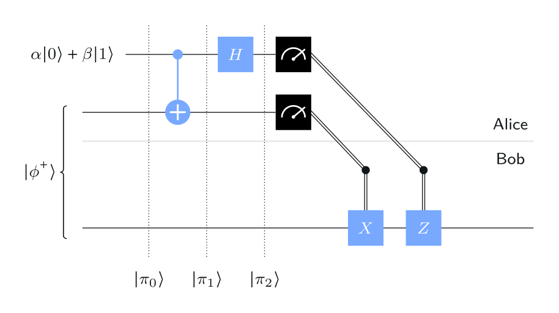{fig-alt="TODO"}

- Q

- B

- A

- $\text{AQ}=|10⟩$:
- Bob applies X gate, $\text{X}=\left( \begin{matrix}
0 & 1 \\
1 & 0
\end{matrix} \right)$ (~NOT)
- $$\text{B}=X\left[ \frac{1}{\sqrt{2}}( \alpha |1{⟩}_{B}+ \beta |0{⟩}_{B}) \right]=\frac{1}{\sqrt{2}}( \alpha |0{⟩}_{B}+ \alpha |1{⟩}_{B})$$

- [https://quantum.cloud.ibm.com/learning/en/courses/basics-of-quantum-information/entanglement-in-action/introduction](https://quantum.cloud.ibm.com/learning/en/courses/basics-of-quantum-information/entanglement-in-action/introduction)

- [https://quantum.cloud.ibm.com/learning/en/courses/basics-of-quantum-information/entanglement-in-action/introduction](https://quantum.cloud.ibm.com/learning/en/courses/basics-of-quantum-information/entanglement-in-action/introduction)

---

## Teleportation

<!-- TODO: complex slide layout (flagged by detect_complex_slide.py - see run log). Content below is complete but UNARRANGED - needs manual layout to match the original slide. -->

- original version: Haade;vectorization: Wjh31, Quibik, CC BY-SA 3.0 <https://creativecommons.org/licenses/by-sa/3.0>, via Wikimedia Commons

- Now Alice measures Q and A. There are 4 possible outcomes, each with p=1/4.
- Alice sends the classical bits to Bob, who uses them as control bits for X and Z.
- Let's enumerate them all!

- $$\begin{matrix}
|{ \pi }_{2}⟩ & =\frac{1}{2}( \alpha |0{⟩}_{B}+ \beta |1{⟩}_{B})|00{⟩}_{AQ}+\frac{1}{2}( \alpha |0{⟩}_{B}- \beta |1{⟩}_{B})|01{⟩}_{AQ}+\frac{1}{2}( \alpha |1{⟩}_{B}+ \beta |0{⟩}_{B})|10{⟩}_{AQ}+\frac{1}{2}( \alpha |1{⟩}_{B}- \beta |0{⟩}_{B})|11{⟩}_{AQ}
\end{matrix}$$

{fig-alt="TODO"}

- Q

- B

- A

- $\text{AQ}=|11⟩$:
- Bob applies X and Z gates, $\text{ZX}=\left( \begin{matrix}
1 & 0 \\
0 & -1
\end{matrix} \right) \times \left( \begin{matrix}
0 & 1 \\
1 & 0
\end{matrix} \right)=\left( \begin{matrix}
0 & 1 \\
-1 & 0
\end{matrix} \right)$
- $$\text{B}=ZX\left[ \frac{1}{\sqrt{2}}( \alpha |1{⟩}_{B}- \beta |0{⟩}_{B}) \right]=\frac{1}{\sqrt{2}}( \alpha |0{⟩}_{B}+ \beta |1{⟩}_{B})$$

- [https://quantum.cloud.ibm.com/learning/en/courses/basics-of-quantum-information/entanglement-in-action/introduction](https://quantum.cloud.ibm.com/learning/en/courses/basics-of-quantum-information/entanglement-in-action/introduction)

---

## Teleportation

<!-- TODO: complex slide layout (flagged by detect_complex_slide.py - see run log). Content below is complete but UNARRANGED - needs manual layout to match the original slide. -->

- original version: Haade;vectorization: Wjh31, Quibik, CC BY-SA 3.0 <https://creativecommons.org/licenses/by-sa/3.0>, via Wikimedia Commons

- Summary: we demonstrated that Alice has "teleported" her bit to Bob.
  - "Quantum communication"
- The operation required the entangled bits in $|{ \phi }^{+}⟩$ , plus two classical bits.
- This has been realized in experiments! E.g.:
  - [https://arxiv.org/pdf/2404.10738](https://arxiv.org/pdf/2404.10738)
  - [https://arxiv.org/pdf/2411.15437](https://arxiv.org/pdf/2411.15437)

{fig-alt="TODO"}

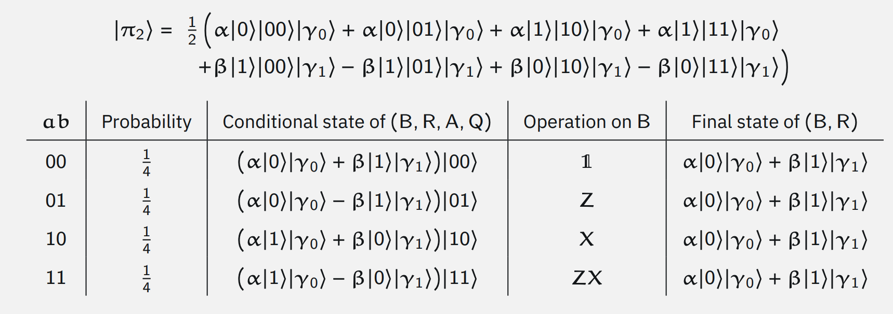{fig-alt="TODO"}

- [https://quantum.cloud.ibm.com/learning/en/courses/basics-of-quantum-information/entanglement-in-action/introduction](https://quantum.cloud.ibm.com/learning/en/courses/basics-of-quantum-information/entanglement-in-action/introduction)

- [https://quantum.cloud.ibm.com/learning/en/courses/basics-of-quantum-information/entanglement-in-action/introduction](https://quantum.cloud.ibm.com/learning/en/courses/basics-of-quantum-information/entanglement-in-action/introduction)

---

## Superdense coding

:::: {.columns}
::: {.column width="55%"}
- original version: Haade;vectorization: Wjh31, Quibik, CC BY-SA 3.0 <https://creativecommons.org/licenses/by-sa/3.0>, via Wikimedia Commons
- "Superdense coding" is sort of the opposite of teleportation: we use one qubit to transmit two classical bits.
  - Practically speaking, this is not super useful.
  - Entanglement is "used up" in the operation.
  - Setup is related to Holevo's theorem. Here, without using a shared, entangled qubit, it is impossible to send more than one classical bit using a qubit.
- [https://quantum.cloud.ibm.com/learning/en/courses/basics-of-quantum-information/entanglement-in-action/introduction](https://quantum.cloud.ibm.com/learning/en/courses/basics-of-quantum-information/entanglement-in-action/introduction)
:::
::: {.column width="45%"}
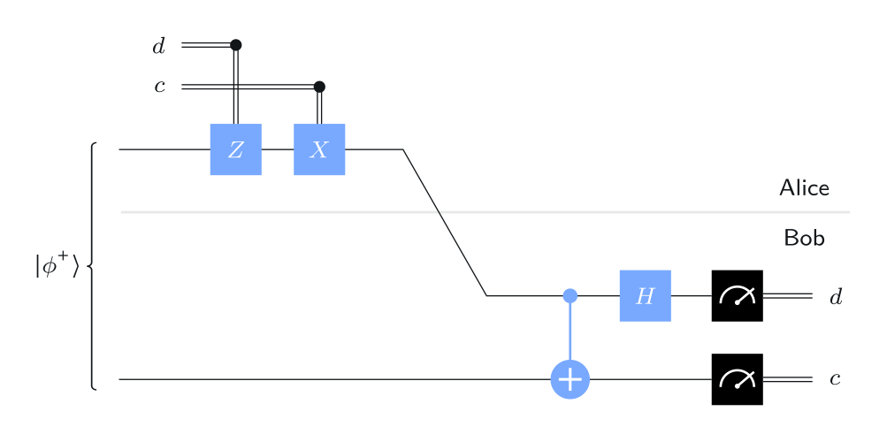{width="100%" fig-alt="TODO: describe image"}
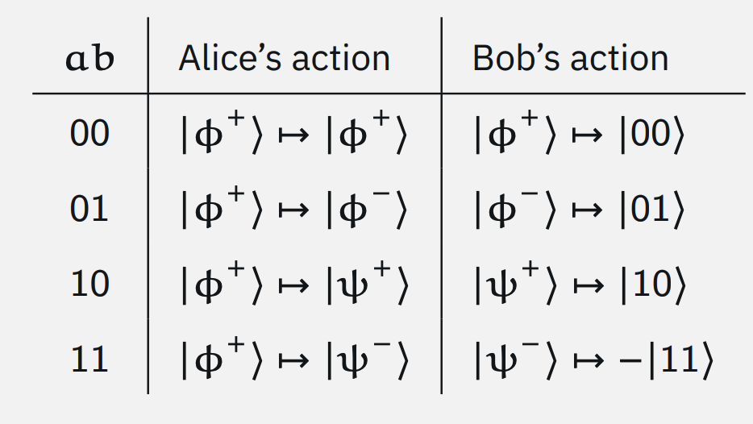{width="100%" fig-alt="TODO: describe image"}
:::
::::

---

# Decoherence

---

## Decoherence

- original version: Haade;vectorization: Wjh31, Quibik, CC BY-SA 3.0 <https://creativecommons.org/licenses/by-sa/3.0>, via Wikimedia Commons

{width="70%" fig-alt="TODO: describe image"}

- We "know" that interactions between the qubits and the surrounding environment will eventually (quickly!) destroy the "quantum" nature of the qubits.
- This is called decoherence: "the effectively irreversible disappearance of quantum coherence, the source of quantum phenomena such as interference effects, from the system."

- "...quantum coherence, a measure for the “quantumness” of the system, is delocalized into the entangled system–environment state, which effectively removes it from our observation. This process is usually irreversible in practice and constitutes a key component in explaining how the classical world of our experience emerges from the underlying quantum substrate.

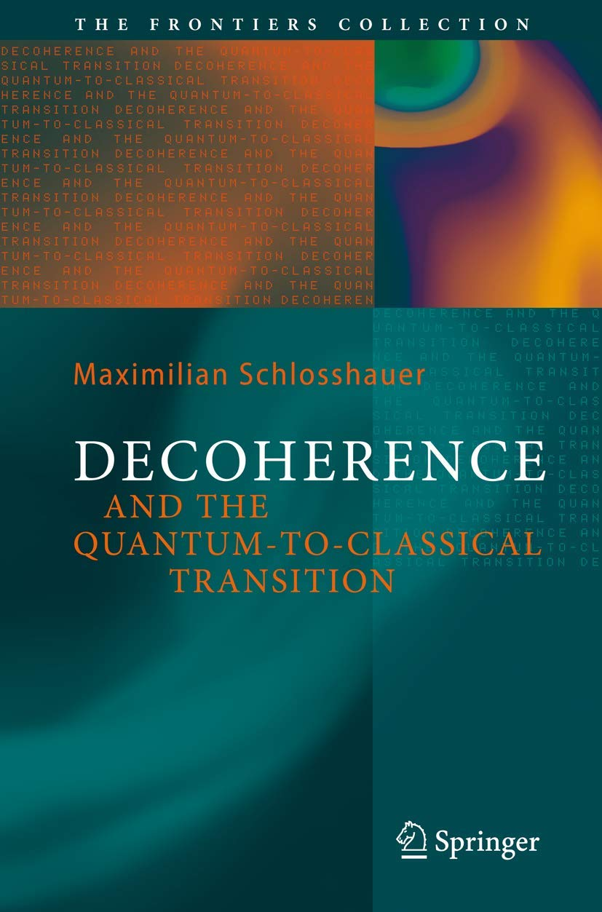{width="70%" fig-alt="TODO: describe image"}

---

## Qubit technologies

- original version: Haade;vectorization: Wjh31, Quibik, CC BY-SA 3.0 <https://creativecommons.org/licenses/by-sa/3.0>, via Wikimedia Commons

{width="70%" fig-alt="TODO: describe image"}

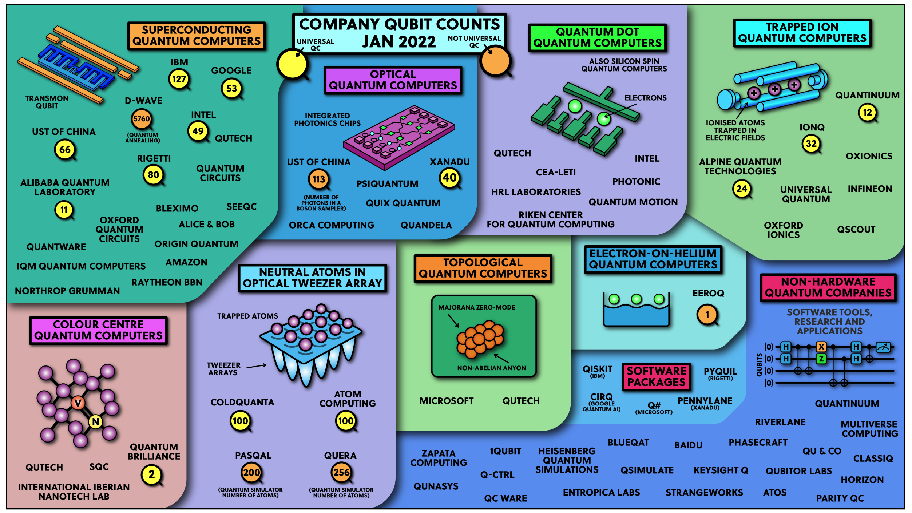{width="70%" fig-alt="TODO: describe image"}

- Domain of Science (Dominic Walliman), taken from [Coffrin 2024](https://arpa-e.energy.gov/sites/default/files/migrated/11_coffrin-updated-qc-hardware-overview-talk-2024-0503.pdf)

---

## Qubit technologies

<!-- TODO: complex slide layout (flagged by detect_complex_slide.py - see run log). Content below is complete but UNARRANGED - needs manual layout to match the original slide. -->

- original version: Haade;vectorization: Wjh31, Quibik, CC BY-SA 3.0 <https://creativecommons.org/licenses/by-sa/3.0>, via Wikimedia Commons

{fig-alt="TODO"}

{fig-alt="TODO"}

- Domain of Science (Dominic Walliman), taken from [Coffrin 2024](https://arpa-e.energy.gov/sites/default/files/migrated/11_coffrin-updated-qc-hardware-overview-talk-2024-0503.pdf)

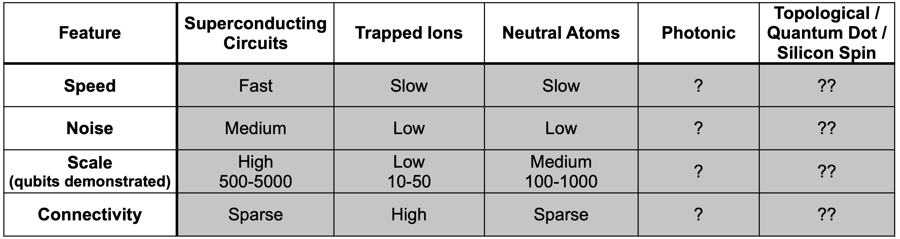{fig-alt="TODO"}

- O(100 $ \mu $s)

- O(10 s)

- O(10 s)

---

## Density matrices

- original version: Haade;vectorization: Wjh31, Quibik, CC BY-SA 3.0 <https://creativecommons.org/licenses/by-sa/3.0>, via Wikimedia Commons

{width="70%" fig-alt="TODO: describe image"}

- To describe decoherence, we need a few ingredients.
- First, we include the observer in the quantum state! E.g. instead of a spin $\mathcal{S}$, our system is now a spin $\mathcal{S}$ and the environment $\mathcal{E}$.
- Second, we need to modify our description of quantum information: density matrices.
- Starting from a single state, $| \psi ⟩$, the density matrix is defined as:

- $$ \rho =| \psi ⟩⟨ \psi |$$

---

## Density matrices

<!-- TODO: complex slide layout (flagged by detect_complex_slide.py - see run log). Content below is complete but UNARRANGED - needs manual layout to match the original slide. -->

- original version: Haade;vectorization: Wjh31, Quibik, CC BY-SA 3.0 <https://creativecommons.org/licenses/by-sa/3.0>, via Wikimedia Commons

{fig-alt="TODO"}

- Starting from a single state, $| \psi ⟩$, the density matrix is defined as:

- $$ \rho =| \psi ⟩⟨ \psi |$$

---

## Density matrices

<!-- TODO: complex slide layout (flagged by detect_complex_slide.py - see run log). Content below is complete but UNARRANGED - needs manual layout to match the original slide. -->

- original version: Haade;vectorization: Wjh31, Quibik, CC BY-SA 3.0 <https://creativecommons.org/licenses/by-sa/3.0>, via Wikimedia Commons

{fig-alt="TODO"}

- Examples:

- $$| \psi ⟩=\left( \begin{aligned}
1 \\
0
\end{aligned} \right)$$

- $$ \rho =\left( \begin{aligned}
1 \\
0
\end{aligned} \right)\left( \begin{matrix}
1 & 0
\end{matrix} \right)=\left( \begin{matrix}
1 & 0 \\
0 & 0
\end{matrix} \right)$$

- $$| \psi ⟩=\left( \begin{aligned}
0 \\
1
\end{aligned} \right)$$

- $$ \rho =\left( \begin{aligned}
0 \\
1
\end{aligned} \right)\left( \begin{matrix}
0 & 1
\end{matrix} \right)=\left( \begin{matrix}
0 & 0 \\
0 & 1
\end{matrix} \right)$$

- Starting from a single state, $| \psi ⟩$, the density matrix is defined as:

- $$ \rho =| \psi ⟩⟨ \psi |$$

---

## Density matrices

<!-- TODO: complex slide layout (flagged by detect_complex_slide.py - see run log). Content below is complete but UNARRANGED - needs manual layout to match the original slide. -->

- original version: Haade;vectorization: Wjh31, Quibik, CC BY-SA 3.0 <https://creativecommons.org/licenses/by-sa/3.0>, via Wikimedia Commons

{fig-alt="TODO"}

- Examples:

- $$| \psi ⟩=\left( \begin{aligned}
1 \\
0
\end{aligned} \right)$$

- $$ \rho =\left( \begin{aligned}
1 \\
0
\end{aligned} \right)\left( \begin{matrix}
1 & 0
\end{matrix} \right)=\left( \begin{matrix}
1 & 0 \\
0 & 0
\end{matrix} \right)$$

- $$| \psi ⟩=\left( \begin{aligned}
0 \\
1
\end{aligned} \right)$$

- $$ \rho =\left( \begin{aligned}
0 \\
1
\end{aligned} \right)\left( \begin{matrix}
0 & 1
\end{matrix} \right)=\left( \begin{matrix}
0 & 0 \\
0 & 1
\end{matrix} \right)$$

- Example with a superposition:

- $$| \psi ⟩=\frac{1}{\sqrt{2}}\left( \begin{aligned}
1 \\
i
\end{aligned} \right)$$

- $$ \rho =\frac{1}{2}\left( \begin{aligned}
1 \\
i
\end{aligned} \right)\left( \begin{matrix}
1 & -i
\end{matrix} \right)=\frac{1}{2}\left( \begin{matrix}
1 & -i \\
i & 1
\end{matrix} \right)$$

- Starting from a single state, $| \psi ⟩$, the density matrix is defined as:

- $$ \rho =| \psi ⟩⟨ \psi |$$

---

## Density matrices

<!-- TODO: complex slide layout (flagged by detect_complex_slide.py - see run log). Content below is complete but UNARRANGED - needs manual layout to match the original slide. -->

- original version: Haade;vectorization: Wjh31, Quibik, CC BY-SA 3.0 <https://creativecommons.org/licenses/by-sa/3.0>, via Wikimedia Commons

{fig-alt="TODO"}

- Examples:

- $$| \psi ⟩=\left( \begin{aligned}
1 \\
0
\end{aligned} \right)$$

- $$ \rho =\left( \begin{aligned}
1 \\
0
\end{aligned} \right)\left( \begin{matrix}
1 & 0
\end{matrix} \right)=\left( \begin{matrix}
1 & 0 \\
0 & 0
\end{matrix} \right)$$

- $$| \psi ⟩=\left( \begin{aligned}
0 \\
1
\end{aligned} \right)$$

- $$ \rho =\left( \begin{aligned}
0 \\
1
\end{aligned} \right)\left( \begin{matrix}
0 & 1
\end{matrix} \right)=\left( \begin{matrix}
0 & 0 \\
0 & 1
\end{matrix} \right)$$

- Example with a superposition:

- $$| \psi ⟩=\frac{1}{\sqrt{2}}\left( \begin{aligned}
1 \\
i
\end{aligned} \right)$$

- $$ \rho =\frac{1}{2}\left( \begin{aligned}
1 \\
i
\end{aligned} \right)\left( \begin{matrix}
1 & -i
\end{matrix} \right)=\frac{1}{2}\left( \begin{matrix}
1 & -i \\
i & 1
\end{matrix} \right)$$

- Intuition:
  - Diagonal elements = "how much classical state"
  - Off-diagonal = "how much superposition"

- Starting from a single state, $| \psi ⟩$, the density matrix is defined as:

- $$ \rho =| \psi ⟩⟨ \psi |$$

---

## Properties of density matrices

- original version: Haade;vectorization: Wjh31, Quibik, CC BY-SA 3.0 <https://creativecommons.org/licenses/by-sa/3.0>, via Wikimedia Commons

{width="70%" fig-alt="TODO: describe image"}

- Unit trace: $\text{Tr}( \rho )=1$
  - (We will see that the trace is a super important operation)
- Positive semidefinite: "$ \rho  \geq 0$"
  - $ \exists M$ such that $ \rho ={M}^{ \dagger }M$ ($ \rho $ is the "square" of another matrix)
  - Or: $ \rho $ is Hermitian ($ \rho ={ \rho }^{ \dagger }$), and eigenvalues are all real and $ \geq 0$.
- Note: there is some degeneracy!
  - Consider ${e}^{i \theta }| \psi ⟩$
  - However, density matrices are unique in the sense of outcomes.

---

## Trace operation

<!-- TODO: complex slide layout (flagged by detect_complex_slide.py - see run log). Content below is complete but UNARRANGED - needs manual layout to match the original slide. -->

- original version: Haade;vectorization: Wjh31, Quibik, CC BY-SA 3.0 <https://creativecommons.org/licenses/by-sa/3.0>, via Wikimedia Commons

{fig-alt="TODO"}

- Let's define the trace in terms of some orthonormal basis, $|{ \phi }_{i}⟩$ (choice of basis doesn't matter):

- $$\text{Tr}(\hat{A})=\mathop{ \sum }\limits_{i}⟨{ \phi }_{i}|\hat{A}|{ \phi }_{i}⟩$$

- For some Hermitian operator $\hat{O}$, consider the trace of the product $\hat{ \rho }\hat{O}$.
  - Choice of basis: $|{o}_{i}⟩$, the eigenstates of $\hat{O}$ with eigenvalues ${o}_{i}$

- $$\begin{matrix}
\text{Tr}(\hat{ \rho }\hat{O}) & =\mathop{ \sum }\limits_{i}⟨{o}_{i}|(| \psi ⟩⟨ \psi |)\hat{O}|{o}_{i}⟩ \\
 & =\mathop{ \sum }\limits_{i}{o}_{i}|⟨{o}_{i}| \psi ⟩{|}^{2}
\end{matrix}$$

- Since $|⟨{o}_{i}| \psi ⟩{|}^{2}$ is just the (Born) probability of obtaining outcome ${o}_{i}$ from a measurement of $\hat{O}$ on $| \psi ⟩$, this is just the expectation value of the measurement:

- $$\begin{matrix}
\text{Tr}(\hat{ \rho }\hat{O}) & =⟨\hat{O}⟩
\end{matrix}$$
{fig-alt="TODO"}

---

## Mixed states

- original version: Haade;vectorization: Wjh31, Quibik, CC BY-SA 3.0 <https://creativecommons.org/licenses/by-sa/3.0>, via Wikimedia Commons

{width="70%" fig-alt="TODO: describe image"}

- Let's define one more object: a mixed state contains quantum states, $|{ \psi }_{i}⟩$, according to a classical probability distribution, ${{p}_{i}}$.
  - This might seem kind of strange, but (a) we need it to describe decoherence, and (b) these actually arise rather commonly. Consider an oven spitting out atoms in random spin states, or Bob's qubit after Alice performs a measurement.
- How do we describe these? $\mathop{ \sum }\limits_{i}{p}_{i}|{ \psi }_{i}⟩$ doesn't make much sense
  - (It's not normalized!)
- The density matrix provides a consistent formalism!

- $$ \rho =\mathop{ \sum }\limits_{i}{p}_{i}{ \rho }_{i}=\mathop{ \sum }\limits_{i}{p}_{i}|{ \psi }_{i}⟩⟨{ \psi }_{i}|$$

---

## Mixed states and expectation values

- original version: Haade;vectorization: Wjh31, Quibik, CC BY-SA 3.0 <https://creativecommons.org/licenses/by-sa/3.0>, via Wikimedia Commons

{width="70%" fig-alt="TODO: describe image"}

- To see why mixed states and density matrices work well together, let's compute the expectation value of an operator again.

- $$\begin{matrix}
⟨\hat{O}⟩ & =\mathop{ \sum }\limits_{i}{p}_{i}⟨\hat{O}{⟩}_{i} \\
 & =\mathop{ \sum }\limits_{i}{p}_{i}\text{Tr}({\hat{ \rho }}_{i}\hat{O}) \\
 & =\text{Tr}((\mathop{ \sum }\limits_{i}{p}_{i}{\hat{ \rho }}_{i})\hat{O}) \\
 & =\text{Tr}(\hat{ \rho }\hat{O})
\end{matrix}$$

- $$ \rho =\mathop{ \sum }\limits_{i}{p}_{i}{ \rho }_{i}=\mathop{ \sum }\limits_{i}{p}_{i}|{ \psi }_{i}⟩⟨{ \psi }_{i}|$$

---

## Mixed states and density matrices

<!-- TODO: complex slide layout (flagged by detect_complex_slide.py - see run log). Content below is complete but UNARRANGED - needs manual layout to match the original slide. -->

- original version: Haade;vectorization: Wjh31, Quibik, CC BY-SA 3.0 <https://creativecommons.org/licenses/by-sa/3.0>, via Wikimedia Commons

{fig-alt="TODO"}

- A few examples.
- First, recall a pure state (no mixing):

- $$| \psi ⟩=\left( \begin{aligned}
1 \\
0
\end{aligned} \right)$$

- $$ \rho =\left( \begin{aligned}
1 \\
0
\end{aligned} \right)\left( \begin{matrix}
1 & 0
\end{matrix} \right)=\left( \begin{matrix}
1 & 0 \\
0 & 0
\end{matrix} \right)$$

- A maximally mixed state: $|0⟩$ or $|1⟩$, each with 50% probability

- $$ \rho =0.5\left( \begin{matrix}
1 & 0 \\
0 & 0
\end{matrix} \right)+0.5\left( \begin{matrix}
0 & 0 \\
0 & 1
\end{matrix} \right)=0.5\mathbb{I}$$

- Quantification of "mixedness":
  - $ \zeta =\text{Tr}({ \rho }^{2})$: 1 for a pure state, $\frac{1}{N}$ for maximally mixed.
  - Or, Von Neumann entropy, $S(\hat{ \rho })=-\text{Tr}(\hat{ \rho }ln\hat{ \rho })=-\mathop{ \sum }\limits_{i}{ \lambda }_{i}ln{ \lambda }_{i}$, where ${ \lambda }_{i}$ are the eigenvalues of $\hat{ \rho }$.

---

## Two systems

- The last ingredient to write down decoherence is how to describe a pair of systems, $\mathcal{A}$ and $\mathcal{B}$. (For example, a spin and the environment.)
  - This is nothing new: we've been using a system comprised of two spins. Formally, this is represented by the tensor product, $| \uparrow ⟩ \otimes | \downarrow ⟩$.
  - The Hilbert space contains "product states": $| \psi {⟩}_{A} \otimes | \phi {⟩}_{B}$...
  - But also entangled states!  ${a}_{1}(|{ \psi }_{1}{⟩}_{A} \otimes |{ \phi }_{1}{⟩}_{B})+{a}_{2}(|{ \psi }_{2}{⟩}_{A} \otimes |{ \phi }_{2}{⟩}_{B})+...$
- Given bases for the two systems, $| \psi {⟩}_{k}$ and $| \phi {⟩}_{l}$, we can write down a basis for $A \otimes B$ as just all pairs, ${\left\{ | \psi {⟩}_{k} \otimes | \phi {⟩}_{l} \right\}}_{kl}$

- original version: Haade;vectorization: Wjh31, Quibik, CC BY-SA 3.0 <https://creativecommons.org/licenses/by-sa/3.0>, via Wikimedia Commons

{width="70%" fig-alt="TODO: describe image"}

---

## Two systems: operators

- Operators are a little more complicated. Let's look at two examples using a system of two spins.
  - Basis elements: $|00⟩,|01⟩,|10⟩,|11⟩$

- original version: Haade;vectorization: Wjh31, Quibik, CC BY-SA 3.0 <https://creativecommons.org/licenses/by-sa/3.0>, via Wikimedia Commons

{width="70%" fig-alt="TODO: describe image"}

- $${H}_{A} \otimes {\mathbb{I}}_{B}=\frac{1}{\sqrt{2}}\left( \begin{matrix}
1 & 1 \\
1 & -1
\end{matrix} \right) \otimes \left( \begin{matrix}
1 & 0 \\
0 & 1
\end{matrix} \right)=\frac{1}{\sqrt{2}}\left( \begin{matrix}
1 & 0 & 1 & 0 \\
0 & 1 & 0 & 1 \\
1 & 0 & -1 & 0 \\
0 & 1 & 0 & -1
\end{matrix} \right)$$

---

## Two systems: operators

<!-- TODO: complex slide layout (flagged by detect_complex_slide.py - see run log). Content below is complete but UNARRANGED - needs manual layout to match the original slide. -->

- Operators are a little more complicated. Let's look at two examples using a system of two spins.
  - Basis elements: $|00⟩,|01⟩,|10⟩,|11⟩$

- original version: Haade;vectorization: Wjh31, Quibik, CC BY-SA 3.0 <https://creativecommons.org/licenses/by-sa/3.0>, via Wikimedia Commons

{fig-alt="TODO"}

- $${H}_{A} \otimes {\mathbb{I}}_{B}=\frac{1}{\sqrt{2}}\left( \begin{matrix}
1 & 1 \\
1 & -1
\end{matrix} \right) \otimes \left( \begin{matrix}
1 & 0 \\
0 & 1
\end{matrix} \right)=\frac{1}{\sqrt{2}}\left( \begin{matrix}
1 & 0 & 1 & 0 \\
0 & 1 & 0 & 1 \\
1 & 0 & -1 & 0 \\
0 & 1 & 0 & -1
\end{matrix} \right)$$

---

## Two systems: operators

<!-- TODO: complex slide layout (flagged by detect_complex_slide.py - see run log). Content below is complete but UNARRANGED - needs manual layout to match the original slide. -->

- Operators are a little more complicated.
- Matrix notation: let's look at two examples using a system of two spins.
  - Basis elements: $|00⟩,|01⟩,|10⟩,|11⟩$

- original version: Haade;vectorization: Wjh31, Quibik, CC BY-SA 3.0 <https://creativecommons.org/licenses/by-sa/3.0>, via Wikimedia Commons

{fig-alt="TODO"}

- $${H}_{A} \otimes {\mathbb{I}}_{B}=\frac{1}{\sqrt{2}}\left( \begin{matrix}
1 & 1 \\
1 & -1
\end{matrix} \right) \otimes \left( \begin{matrix}
1 & 0 \\
0 & 1
\end{matrix} \right)=\frac{1}{\sqrt{2}}\left( \begin{matrix}
1 & 0 & 1 & 0 \\
0 & 1 & 0 & 1 \\
1 & 0 & -1 & 0 \\
0 & 1 & 0 & -1
\end{matrix} \right)$$

- $${\mathbb{I}}_{B} \otimes {H}_{B}=\left( \begin{matrix}
1 & 0 \\
0 & 1
\end{matrix} \right) \otimes \frac{1}{\sqrt{2}}\left( \begin{matrix}
1 & 1 \\
1 & -1
\end{matrix} \right)=\frac{1}{\sqrt{2}}\left( \begin{matrix}
1 & 1 & 0 & 0 \\
1 & -1 & 0 & 0 \\
0 & 0 & 1 & 1 \\
0 & 0 & 1 & -1
\end{matrix} \right)$$

---

## Two systems: density matrices

<!-- TODO: complex slide layout (flagged by detect_complex_slide.py - see run log). Content below is complete but UNARRANGED - needs manual layout to match the original slide. -->

- Finally, here is a density matrix an entangled state:

- original version: Haade;vectorization: Wjh31, Quibik, CC BY-SA 3.0 <https://creativecommons.org/licenses/by-sa/3.0>, via Wikimedia Commons

{fig-alt="TODO"}

- $$| \Psi ⟩=\frac{1}{\sqrt{2}}(|{a}_{1}⟩|{b}_{1}⟩+|{a}_{2}⟩|{b}_{2}⟩)$$

- $$\hat{ \rho }=| \Psi ⟩⟨ \Psi |=\frac{1}{2}\mathop{\mathop{ \sum }\limits_{ij=1}}\limits^{2}|{a}_{i}⟩⟨{a}_{j}| \otimes |{b}_{i}⟩⟨{b}_{j}|$$

---

## Reduced density operators

- Reduced density operators: let's say we have two systems (A, B), but we don't care about B.
  - E.g., Bob is light years away, and Alice just cares about her own qubit.
- The reduced density matrix encodes everything Alice needs to know:
- Example: let's say Alice has some operator, ${\hat{O}}_{A}$. For the (A, B) system but ignoring Bob, this operator is just ${\hat{O}}_{A} \otimes {\mathbb{I}}_{B}$. The expectation value is:

- original version: Haade;vectorization: Wjh31, Quibik, CC BY-SA 3.0 <https://creativecommons.org/licenses/by-sa/3.0>, via Wikimedia Commons

{width="70%" fig-alt="TODO: describe image"}

- $${\hat{ \rho }}_{A}={\text{Tr}}_{B}\hat{ \rho }$$

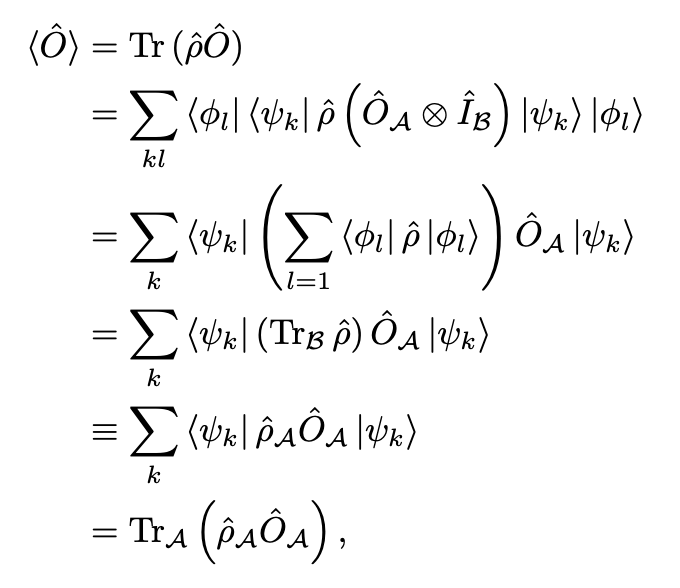{width="70%" fig-alt="TODO: describe image"}

---

## Reduced density operators

<!-- TODO: complex slide layout (flagged by detect_complex_slide.py - see run log). Content below is complete but UNARRANGED - needs manual layout to match the original slide. -->

- Example for our two spin system:

- original version: Haade;vectorization: Wjh31, Quibik, CC BY-SA 3.0 <https://creativecommons.org/licenses/by-sa/3.0>, via Wikimedia Commons

{fig-alt="TODO"}

- $$\hat{ \rho }=| \Psi ⟩⟨ \Psi |=\frac{1}{2}\mathop{\mathop{ \sum }\limits_{ij=1}}\limits^{2}|{a}_{i}⟩⟨{a}_{j}| \otimes |{b}_{i}⟩⟨{b}_{j}|$$

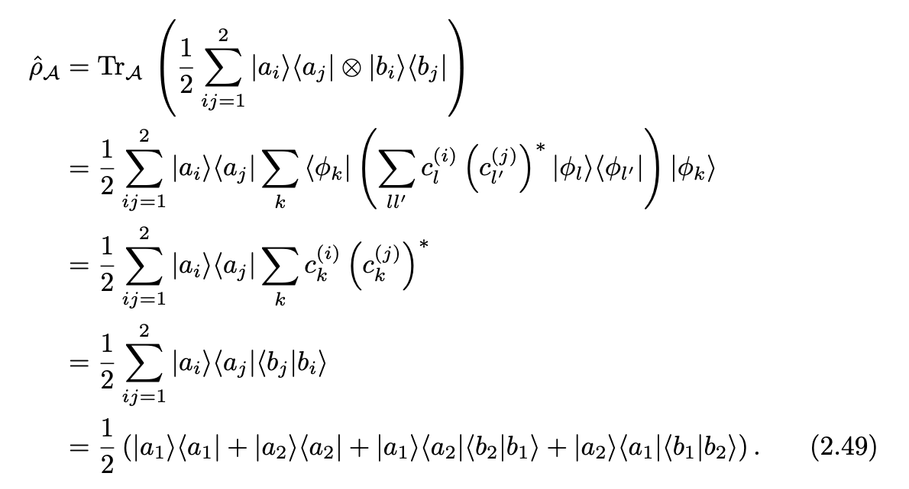{fig-alt="TODO"}

- B

- Intuition: amount of "superposition" in A is proportional to <b2 | b1>.

- $$| \Psi ⟩=\frac{1}{\sqrt{2}}(|{a}_{1}⟩|{b}_{1}⟩+|{a}_{2}⟩|{b}_{2}⟩)$$

---

## Checkpoint

- We define the density matrix, $ \rho =| \psi ⟩⟨ \psi |$, to represent quantum information.
  - The trace is very important, e.g. $⟨\hat{O}⟩=Tr(\hat{ \rho }\hat{O})$
- The density matrix generalizes to mixed states, a set of quantum states $|{ \psi }_{i}⟩$ with classical probabilities ${p}_{i}$: $ \rho =\mathop{ \sum }\limits_{i}{p}_{i}{ \rho }_{i}$.
- Considering two systems, A and B, with possible entanglement, the state of A while ignoring B corresponds to the reduced density matrix, ${ \rho }_{A}={Tr}_{B}( \rho )$

- original version: Haade;vectorization: Wjh31, Quibik, CC BY-SA 3.0 <https://creativecommons.org/licenses/by-sa/3.0>, via Wikimedia Commons

{width="70%" fig-alt="TODO: describe image"}

---

## Example: two slit experiment

<!-- TODO: complex slide layout (flagged by detect_complex_slide.py - see run log). Content below is complete but UNARRANGED - needs manual layout to match the original slide. -->

- Central idea of decoherence: the observer is part of the quantum system!
- We represent the environment with some wave function $|E⟩$
  - Even if we can't write it down, practically speaking.
- Let $|{ \psi }_{1}⟩$ and $|{ \psi }_{2}⟩$ represent the two wave functions from the two slit experiment. The interaction with the environment takes the form:

- original version: Haade;vectorization: Wjh31, Quibik, CC BY-SA 3.0 <https://creativecommons.org/licenses/by-sa/3.0>, via Wikimedia Commons

{fig-alt="TODO"}

- $$|{ \psi }_{1}⟩|{E}_{0}⟩ \rightarrow |{ \psi }_{1}⟩|{E}_{1}⟩$$

- $$|{ \psi }_{2}⟩|{E}_{0}⟩ \rightarrow |{ \psi }_{2}⟩|{E}_{2}⟩$$

- $$\frac{1}{\sqrt{2}}(|{ \psi }_{1}⟩+|{ \psi }_{2}⟩)|{E}_{0}⟩ \rightarrow \frac{1}{\sqrt{2}}(|{ \psi }_{1}⟩|{E}_{1}⟩+|{ \psi }_{2}⟩|{E}_{2}⟩)$$

- Here, $|{E}_{1}⟩$ and $|{E}_{2}⟩$ represent environment states which have learned something about which path the photon traversed (complete knowledge or partial knowledge).

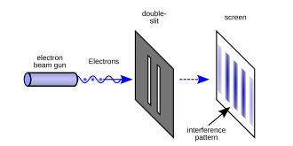{fig-alt="TODO"}

---

## Example: two slit experiment

<!-- TODO: complex slide layout (flagged by detect_complex_slide.py - see run log). Content below is complete but UNARRANGED - needs manual layout to match the original slide. -->

- Now consider the reduced density matrix of just the electron:

- original version: Haade;vectorization: Wjh31, Quibik, CC BY-SA 3.0 <https://creativecommons.org/licenses/by-sa/3.0>, via Wikimedia Commons

{fig-alt="TODO"}

- $${\hat{ \rho }}_{e}=\frac{1}{2}\left( |{ \psi }_{1}⟩⟨{ \psi }_{1}|+|{ \psi }_{2}⟩⟨{ \psi }_{2}|+|{ \psi }_{1}⟩⟨{ \psi }_{2}|⟨{E}_{2}|{E}_{1}⟩+|{ \psi }_{2}⟩⟨{ \psi }_{1}|⟨{E}_{1}|{E}_{2}⟩ \right)$$

{fig-alt="TODO"}

- The interference terms are multiplied by $⟨{E}_{2}|{E}_{1}⟩$.
- If E1 and E2 are definitive measurements, then they are ~orthogonal, and$⟨{E}_{2}|{E}_{1}⟩ \approx 0$. So the interference is washed away.
- If E1 and E2 are only partial measurements (say, one photon interacts with the electron), then the interference is reduced.
- Typically, $⟨{E}_{x}(t)|{E}_{{x}^{′}}(t)⟩ \propto {e}^{- \Lambda |x-{x}^{′}|t}$
  - Interference terms are suppressed exponentially by the environment!

---

## Example: entangled spins

<!-- TODO: complex slide layout (flagged by detect_complex_slide.py - see run log). Content below is complete but UNARRANGED - needs manual layout to match the original slide. -->

- A more complete example: one spin interacting with N spins.

- original version: Haade;vectorization: Wjh31, Quibik, CC BY-SA 3.0 <https://creativecommons.org/licenses/by-sa/3.0>, via Wikimedia Commons

{fig-alt="TODO"}

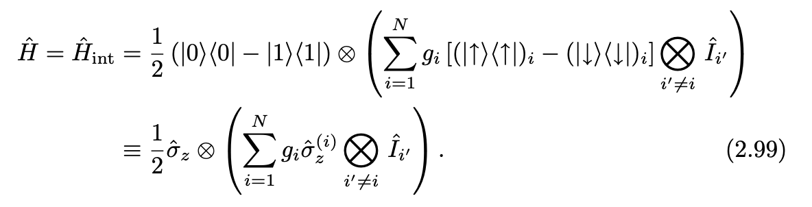{fig-alt="TODO"}

- Off-diagonal reduced density matrix elements are suppressed by a "decoherence factor":

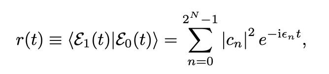{fig-alt="TODO"}

- This is a random walk equation, resulting in $|r(t)| \propto {2}^{-N}$.
- See Chapter 2.10 of Schlosshauer for the complete treatment!

---

## Decoherence and quantum computing

- We can implement decoherence in our quantum computing framework using "channels", the equivalent of gates on density matrices.
- For example, the "completely dephasing channel" sets off-diagonal entries to zero.
  - Can also partially dephase.
- The "completely depolarizing channel" puts the density matrix into the maximally mixed state.
- See [https://quantum.cloud.ibm.com/learning/en/courses/general-formulation-of-quantum-information](https://quantum.cloud.ibm.com/learning/en/courses/general-formulation-of-quantum-information) for more!

- original version: Haade;vectorization: Wjh31, Quibik, CC BY-SA 3.0 <https://creativecommons.org/licenses/by-sa/3.0>, via Wikimedia Commons

{width="70%" fig-alt="TODO: describe image"}

---

## Recap

<!-- TODO: complex slide layout (flagged by detect_complex_slide.py - see run log). Content below is complete but UNARRANGED - needs manual layout to match the original slide. -->

{fig-alt="TODO"}

- Can solve for Fourier coefficients

- This week, we covered the basics of quantum computing:
  - How to represent qubits and quantum operations (gates).
  - A few interesting quantum circuits (teleportation, superdense coding, CHSH and Bell's Inequalities).
  - Decoherence and the density matrix representation.
- This was a lightning fast overview, considering pursuing further on your own!
  - [Qiskit tutorials](https://quantum.cloud.ibm.com/learning/en)
  - "Decoherence and the Quantum-to-Classical Transition" by Schlosshauer ([https://www.amazon.com/Decoherence-Classical-Transition-Frontiers-Collection/dp/3540357734](https://www.amazon.com/Decoherence-Classical-Transition-Frontiers-Collection/dp/3540357734))
- Up next:
  - Midterm will be distributed next Wednesday, after Fall Break.
  - Fast Fourier Transforms.
