## Topics in biophysics

- original version: Haade;vectorization: Wjh31, Quibik, CC BY-SA 3.0 <https://creativecommons.org/licenses/by-sa/3.0>, via Wikimedia Commons

- Last time, we covered a few nature-inspired algorithms:
  - Reptation
  - Genetic algorithm
  - Simulated annealing
- Of course, the most important biology-inspired algorithm is the artificial neural network.
  - One lecture on the biophysics side, then a few weeks on machine learning.

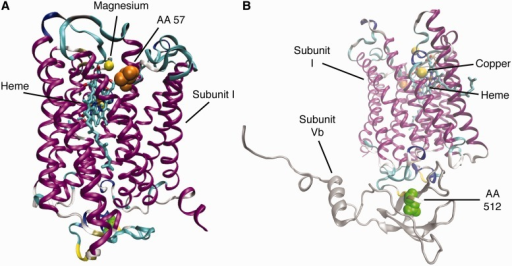{width="70%" fig-alt="TODO: describe image"}

- Structure of the bovine cytochrome c oxidase complex, [https://doi.org/10.1093/gbe/evu025](https://doi.org/10.1093/gbe/evu025)
{width="70%" fig-alt="TODO: describe image"}

- Schematic diagram of neurons

---

# Protein folding

---

## Protein folding

- original version: Haade;vectorization: Wjh31, Quibik, CC BY-SA 3.0 <https://creativecommons.org/licenses/by-sa/3.0>, via Wikimedia Commons

- [Wikipedia](https://en.wikipedia.org/wiki/Protein_folding):
  - "Protein folding is the physical process by which a protein, after synthesis by a ribosome as a linear chain of amino acids, changes from an unstable random coil into a more ordered three-dimensional structure. This structure permits the protein to become biologically functional or active."

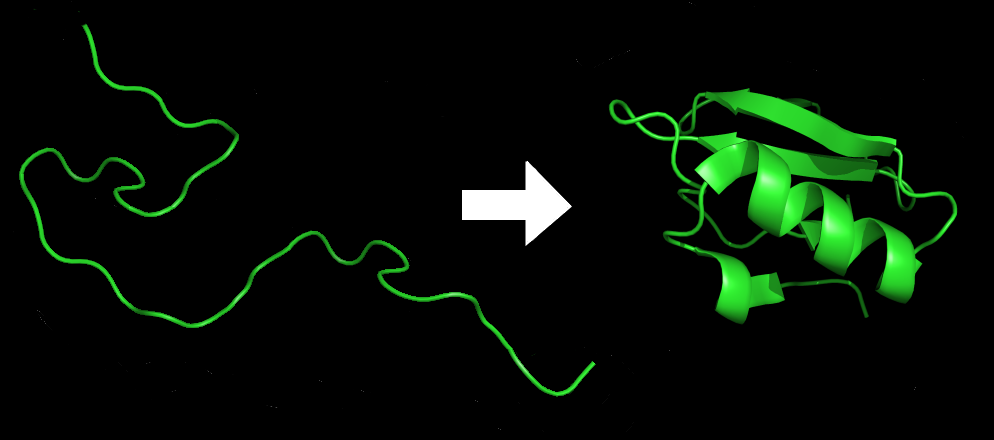{width="70%" fig-alt="TODO: describe image"}

- Protein before and after folding.
- By DrKjaergaard - Own work, Public Domain, [https://commons.wikimedia.org/w/index.php?curid=1967109](https://commons.wikimedia.org/w/index.php?curid=1967109)

---

## Protein folding

- original version: Haade;vectorization: Wjh31, Quibik, CC BY-SA 3.0 <https://creativecommons.org/licenses/by-sa/3.0>, via Wikimedia Commons

- Proteins are chains of amino acids
  - Range from [~10 amino acids](https://www.science.org/content/blog-post/tiny-proteins-getting-sorted-out) up to 30,000 (titin)
- 6 degrees of freedom for each amino acid (position and rotation), so this becomes quickly intractable computationally
- You've probably heard of [AlphaFold](https://en.wikipedia.org/wiki/AlphaFold)
- We'll study some simple-ish MC methods
- Also see [Biophys. J. 100, 1058-1065 (2011) (UB's Markelz, Zheng)](https://doi.org/10.1016/j.bpj.2010.12.3731)

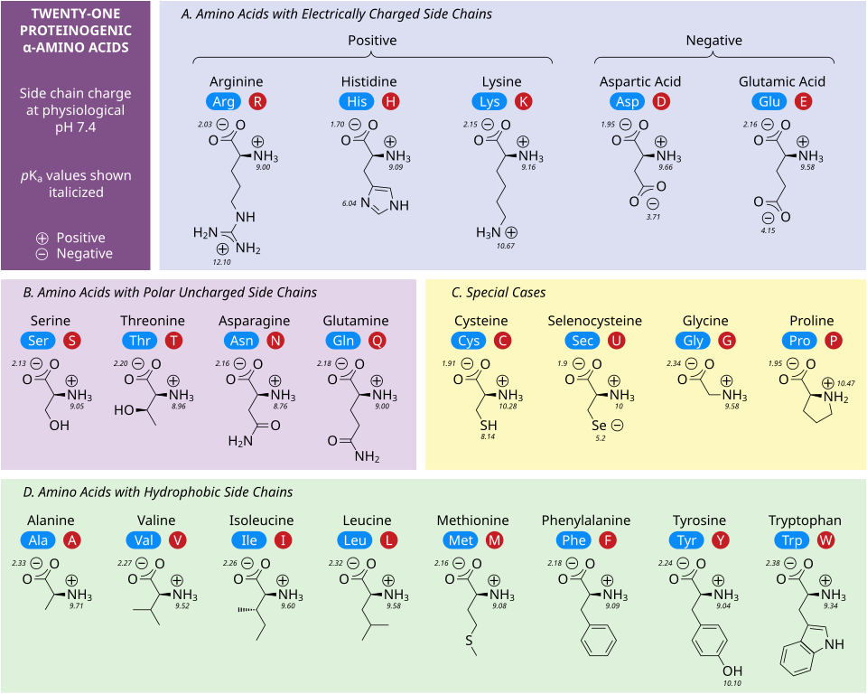{width="70%" fig-alt="TODO: describe image"}

- Table of amino acids
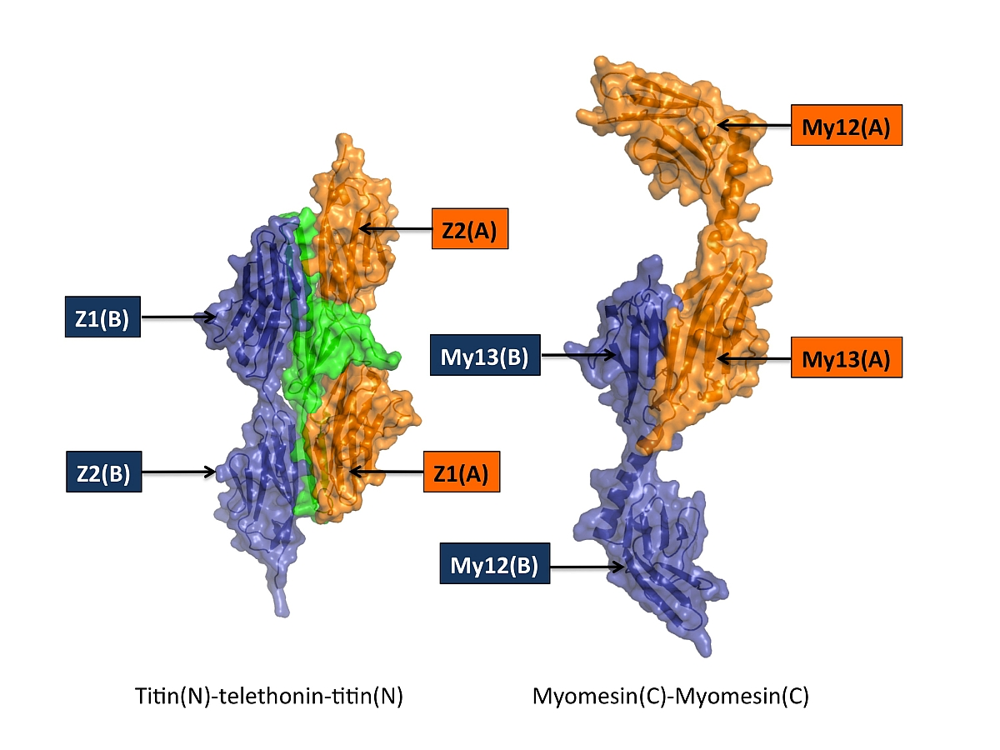{width="70%" fig-alt="TODO: describe image"}

- Large proteins

---

## Protein folding

- original version: Haade;vectorization: Wjh31, Quibik, CC BY-SA 3.0 <https://creativecommons.org/licenses/by-sa/3.0>, via Wikimedia Commons

- The shape of a protein is critical for understanding its behavior.
  - Measure using, e.g. crystallography
  - But crystallography is rather work intensive, and the space of proteins is vast. Can we simulate it instead?
- We'll look at protein folding in a simpler way: model as n+1 monomers joined by n strong covalent bonds
- But! The monomers cannot occupy the same place in space: the chain is self-avoiding
- So this means it is not a Markov chain!

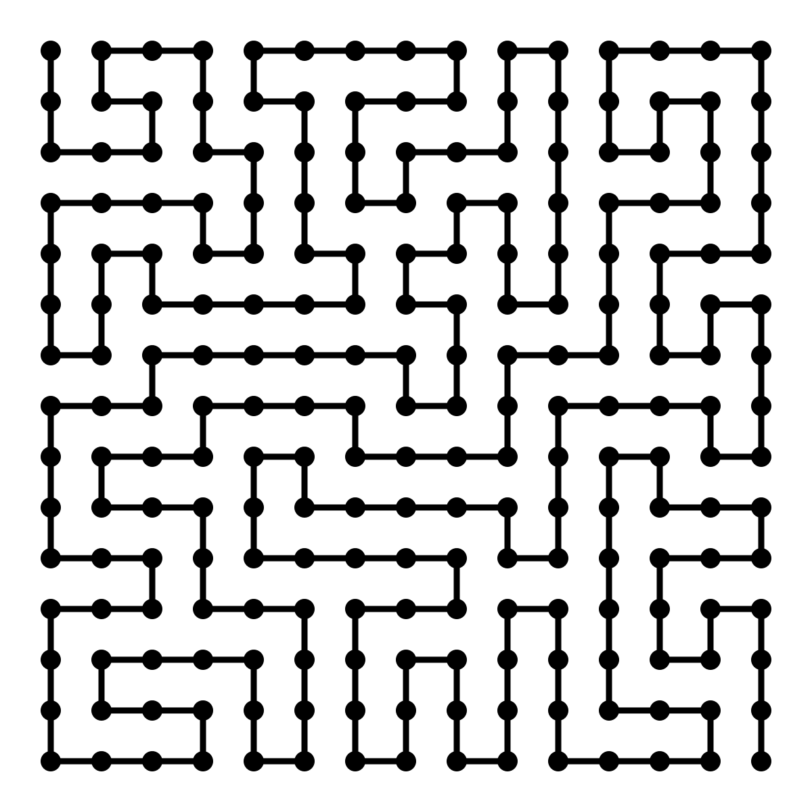{width="70%" fig-alt="TODO: describe image"}

- A self-avoiding chain

---

## Self-avoiding walks

- original version: Haade;vectorization: Wjh31, Quibik, CC BY-SA 3.0 <https://creativecommons.org/licenses/by-sa/3.0>, via Wikimedia Commons

- Consider a random walk, now requiring that no locations are repeated.
- 1D: trivial, the walker has to move entirely left, or entirely right.
- Compare is average motion with a regular random walk:
  - Self-avoiding: $|x|=n \sim t$
  - Regular: $\sqrt{⟨{x}_{n}^{2}⟩}=\sqrt{n} \sim \sqrt{t}$
- 2D: expect something in between.
  - $$\sqrt{⟨{r}^{2}⟩} \sim A{t}^{ \nu }$$
  - $0.5< \nu <1$ is the Flory exponent
- Large number of dimension: expect self-avoidance to become less and less of a problem
  - Remember the quote: "A drunk man will find his way home, but a drunk bird may get lost forever" (Kakutani)
  - In 3D, $p$(return) ~ 34%

---

## Self-avoiding walks

- original version: Haade;vectorization: Wjh31, Quibik, CC BY-SA 3.0 <https://creativecommons.org/licenses/by-sa/3.0>, via Wikimedia Commons

- How can we generate self-avoiding walks (SAWs)?
- Naive/trivial method:
  - Have $N$ walkers do their random walks
  - Throw away any with self-collisions.
- This is implemented in CompPhys/BioPhys/sawalk.ipynb, give it a try

---

## Self-avoiding walks

- original version: Haade;vectorization: Wjh31, Quibik, CC BY-SA 3.0 <https://creativecommons.org/licenses/by-sa/3.0>, via Wikimedia Commons

- It might not surprise you that sawalk.ipynb is extremely inefficient!
  - ${N}_{\text{step}}=10$, ${N}_{\text{walk}}=10$ is computationally doable
  - ${N}_{\text{step}}=100$, ${N}_{\text{walk}}=100$ takes a very long time
- The fraction of discard walks increases exponentially with $N$!
  - $\frac{\text{Walks Generated}}{N(attempts)} \sim {e}^{- \lambda N}$, $ \lambda =$attrition constant

---

## Self-avoiding walks

- original version: Haade;vectorization: Wjh31, Quibik, CC BY-SA 3.0 <https://creativecommons.org/licenses/by-sa/3.0>, via Wikimedia Commons

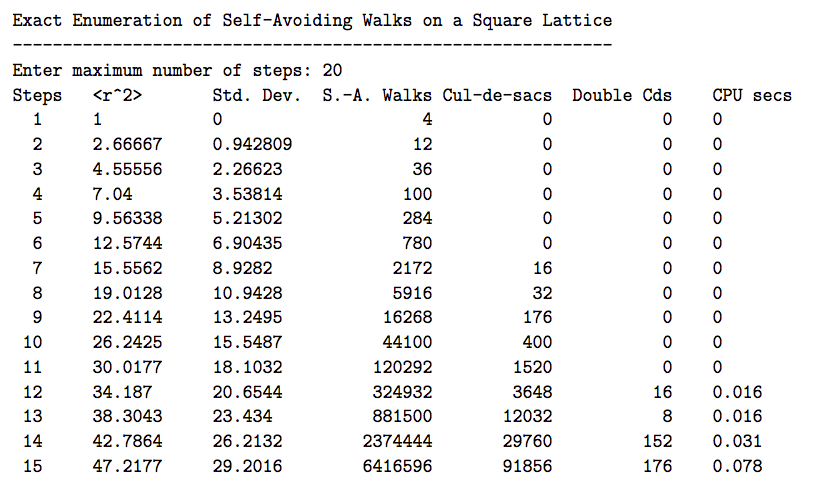{width="70%" fig-alt="TODO: describe image"}

- Exact enumeration of self-avoiding walks

---

## Reptation

<!-- TODO: complex slide layout (flagged by detect_complex_slide.py - see run log). Content below is complete but UNARRANGED - needs manual layout to match the original slide. -->

- original version: Haade;vectorization: Wjh31, Quibik, CC BY-SA 3.0 <https://creativecommons.org/licenses/by-sa/3.0>, via Wikimedia Commons

- A better method: "reptation".
  - Developed by Pierre-Gilles de Gennes (Nobel Prize in 1991)
  - Assumes polymers are confined to a tube
  - Tube “snakes” through the tunnel
  - Thermal fluctuations cause polymer to “reptate” (like a snake)
- We'll looks at a simpler version: Wall and Mandel, J. Chem. Phys. 63, 4592 (1975)
  - “Slithering snake” model instead
  - Uses MC techniques

{fig-alt="TODO"}

- Snek
- Enemies of the heir, beware
- bad computational efficiency!

---

## Reptation

<!-- TODO: complex slide layout (flagged by detect_complex_slide.py - see run log). Content below is complete but UNARRANGED - needs manual layout to match the original slide. -->

- original version: Haade;vectorization: Wjh31, Quibik, CC BY-SA 3.0 <https://creativecommons.org/licenses/by-sa/3.0>, via Wikimedia Commons

- Start with chain of n links
- Iterate:
  - Choose an end of the chain at random
  - Choose 3 reptation directions (forward, left, right)
  - If site in randomly chosen direction is not one of interior sites of chain:
    - Remove the site at the other end of the chain
    - Add this site to the chain
    - Count new config as next in ensemble
  - Else:
    - Retain config as next in ensemble

{fig-alt="TODO"}

{fig-alt="TODO"}

{fig-alt="TODO"}

{fig-alt="TODO"}

{fig-alt="TODO"}

{fig-alt="TODO"}

{fig-alt="TODO"}

{fig-alt="TODO"}

{fig-alt="TODO"}

{fig-alt="TODO"}

{fig-alt="TODO"}

- Reptation algorithm

---

## Reptation

<!-- TODO: complex slide layout (flagged by detect_complex_slide.py - see run log). Content below is complete but UNARRANGED - needs manual layout to match the original slide. -->

- original version: Haade;vectorization: Wjh31, Quibik, CC BY-SA 3.0 <https://creativecommons.org/licenses/by-sa/3.0>, via Wikimedia Commons

- Start with chain of n links
- Iterate:
  - Choose an end of the chain at random
  - Choose 3 reptation directions (forward, left, right)
  - If site in randomly chosen direction is not one of interior sites of chain:
    - Remove the site at the other end of the chain
    - Add this site to the chain
    - Count new config as next in ensemble
  - Else:
    - Retain config as next in ensemble

{fig-alt="TODO"}

{fig-alt="TODO"}

{fig-alt="TODO"}

{fig-alt="TODO"}

{fig-alt="TODO"}

{fig-alt="TODO"}

{fig-alt="TODO"}

{fig-alt="TODO"}

{fig-alt="TODO"}

{fig-alt="TODO"}

{fig-alt="TODO"}

- Reptation

---

## Reptation

<!-- TODO: complex slide layout (flagged by detect_complex_slide.py - see run log). Content below is complete but UNARRANGED - needs manual layout to match the original slide. -->

- original version: Haade;vectorization: Wjh31, Quibik, CC BY-SA 3.0 <https://creativecommons.org/licenses/by-sa/3.0>, via Wikimedia Commons

- Start with chain of n links
- Iterate:
  - Choose an end of the chain at random
  - Choose 3 reptation directions (forward, left, right)
  - If site in randomly chosen direction is not one of interior sites of chain:
    - Remove the site at the other end of the chain
    - Add this site to the chain
    - Count new config as next in ensemble
  - Else:
    - Retain config as next in ensemble

{fig-alt="TODO"}

{fig-alt="TODO"}

{fig-alt="TODO"}

{fig-alt="TODO"}

{fig-alt="TODO"}

{fig-alt="TODO"}

{fig-alt="TODO"}

{fig-alt="TODO"}

{fig-alt="TODO"}

{fig-alt="TODO"}

{fig-alt="TODO"}

- Reptation algorithm
{fig-alt="TODO"}

---

## Hands-on

<!-- TODO: complex slide layout (flagged by detect_complex_slide.py - see run log). Content below is complete but UNARRANGED - needs manual layout to match the original slide. -->

- original version: Haade;vectorization: Wjh31, Quibik, CC BY-SA 3.0 <https://creativecommons.org/licenses/by-sa/3.0>, via Wikimedia Commons

- Run through CompPhys/BioPhys/reptation.ipynb
  - Animation is a bit finnicky... try restarting kernel, changing backend (%matplotlib ipympl, other options on Google), ...

{fig-alt="TODO"}

{fig-alt="TODO"}

{fig-alt="TODO"}

{fig-alt="TODO"}

{fig-alt="TODO"}

{fig-alt="TODO"}

{fig-alt="TODO"}

{fig-alt="TODO"}

{fig-alt="TODO"}

{fig-alt="TODO"}

{fig-alt="TODO"}

- Reptation algorithm

---

# Genetic algorithms

---

## Genetic algorithms

- original version: Haade;vectorization: Wjh31, Quibik, CC BY-SA 3.0 <https://creativecommons.org/licenses/by-sa/3.0>, via Wikimedia Commons

- You may or may not use reptation algorithms in real life.
- Odds are you'll use something like a genetic algorithm!
- [Wikipedia](https://en.wikipedia.org/wiki/Genetic_algorithm):
  - In computer science and operations research, a genetic algorithm (GA) is a metaheuristic inspired by the process of natural selection that belongs to the larger class of evolutionary algorithms (EA).[1] Genetic algorithms are commonly used to generate high-quality solutions to optimization and search problems via biologically inspired operators such as selection, crossover, and mutation.[2] Some examples of GA applications include optimizing decision trees for better performance, solving sudoku puzzles,[3] hyperparameter optimization, and causal inference.[4]

---

## Genetic algorithms

- original version: Haade;vectorization: Wjh31, Quibik, CC BY-SA 3.0 <https://creativecommons.org/licenses/by-sa/3.0>, via Wikimedia Commons

- GAs are inspired by biological evolution and natural selection.
- "Species" "compete" for "resources", and the "fittest genes" propagate through generations.
- Think about how evolution works (physicists' view):
  - Have a genome
  - Mutations occur
  - Some are more beneficial than others
  - Organisms with more beneficial genes reproduce more

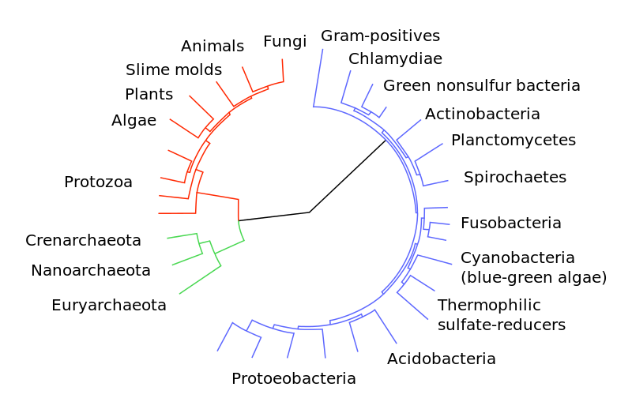{width="70%" fig-alt="TODO: describe image"}

- Evolutionary history of life
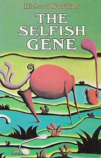{width="70%" fig-alt="TODO: describe image"}

- "The Selfish Gene" by Richard Dawkins

---

## Genetic algorithms

- original version: Haade;vectorization: Wjh31, Quibik, CC BY-SA 3.0 <https://creativecommons.org/licenses/by-sa/3.0>, via Wikimedia Commons

- We can map these biological ideas onto concrete computational ideas:

---

## Genetic algorithms

- original version: Haade;vectorization: Wjh31, Quibik, CC BY-SA 3.0 <https://creativecommons.org/licenses/by-sa/3.0>, via Wikimedia Commons

- Consider the idea of DNA/chromosomes. What's the computational equivalent?
- Abstractly, we are usually trying to optimize some complicated state. In binary, this is just some string of 0s and 1s, 1000111011...
  - DNA is conceptually similar, just with 4 values instead of 2! (Quaternary)
  - In fact, some people are exploring DNA as an actual generic storage medium: [https://en.wikipedia.org/wiki/DNA_digital_data_storage](https://en.wikipedia.org/wiki/DNA_digital_data_storage)
- We can "evolve" the bitstreams, and select the ones that maximize some fitness function.
- Depending on the problem, choose some termination criteria (threshold on fitness function, run out of computing \$\$\$, your brother needs the computer, ...)

---

## Genetic algorithms: warning

- original version: Haade;vectorization: Wjh31, Quibik, CC BY-SA 3.0 <https://creativecommons.org/licenses/by-sa/3.0>, via Wikimedia Commons

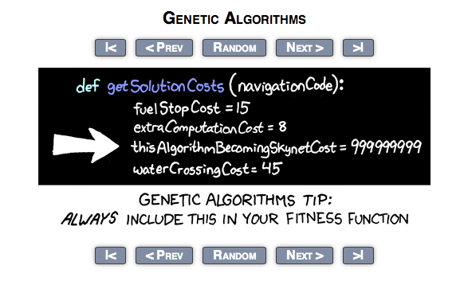{width="70%" fig-alt="TODO: describe image"}

- XKCD of genetic algorithm

---

## Genetic algorithms: practicalities

- original version: Haade;vectorization: Wjh31, Quibik, CC BY-SA 3.0 <https://creativecommons.org/licenses/by-sa/3.0>, via Wikimedia Commons

- How to evolve?
  - Mutate
  - "Crossover" (combine different individuals)
- All of the intricacies of biological evolution apply here:
  - Natural selection (what we want)
  - Genetic drift (which can occur in GA’s and bio. evo.)
- Can’t necessarily always find a solution!
- Also can’t let it drift forever
  - So, we also have to be practical and put cutoff conditions
  - Too many iterations or organisms

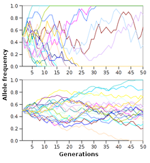{width="70%" fig-alt="TODO: describe image"}

- Evolution in genetic algorithm

---

## Genetic algorithms: practicalities

- original version: Haade;vectorization: Wjh31, Quibik, CC BY-SA 3.0 <https://creativecommons.org/licenses/by-sa/3.0>, via Wikimedia Commons

- Also just like real evolution, you are only able to deal with “reachable” mutations
  - A bacterium growing an arm will never happen in either bio. evo. or GA’s.
- “Good” solutions are only relatively so given the previous history
  - There may be better ways to get to the end, but you are only given the immediate organisms to work with
- (This should all sound familiar: local minima!)

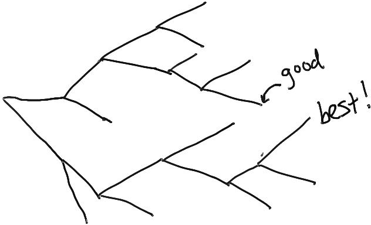{width="70%" fig-alt="TODO: describe image"}

- Branching evolutionary paths

---

## Genetic algorithms: practicalities

- original version: Haade;vectorization: Wjh31, Quibik, CC BY-SA 3.0 <https://creativecommons.org/licenses/by-sa/3.0>, via Wikimedia Commons

- Also just like real evolution, you are only able to deal with “reachable” mutations
  - A bacterium growing an arm will never happen in either bio. evo. or GA’s.
- “Good” solutions are only relatively so given the previous history
  - There may be better ways to get to the end, but you are only given the immediate organisms to work with
- (This should all sound familiar: local minima!)

{width="70%" fig-alt="TODO: describe image"}

- Branching evolutionary paths
- [🦀](https://en.wikipedia.org/wiki/Carcinisation)

---

## Hands-on

- original version: Haade;vectorization: Wjh31, Quibik, CC BY-SA 3.0 <https://creativecommons.org/licenses/by-sa/3.0>, via Wikimedia Commons

- CompPhys/BioPhys/genetic.ipynb is based on [https://gist.github.com/bellbind/741853](https://gist.github.com/bellbind/741853)
- Basic algorithm:
  - Start: generate random population of n chromosomes
  - Fitnes : evaluate fitness of each
  - Get a new population: Mutate or otherwise generate a new population
  - Replace the population
  - Test against desired accuracy/etc
- Loop

---

## Hands-on: protein folding

- original version: Haade;vectorization: Wjh31, Quibik, CC BY-SA 3.0 <https://creativecommons.org/licenses/by-sa/3.0>, via Wikimedia Commons

- Second notebook, CompPhys/BioPhys/genetic_protein.ipynb, is based on Unger and Moult, “Genetic algorithms for protein folding simulations”, J. Mol. Biol. 231, 75-81 (1993) ([https://pubmed.ncbi.nlm.nih.gov/8496967/](https://pubmed.ncbi.nlm.nih.gov/8496967/))
- Looking for configurations of 2-d proteins hydrophobic (black) and hydrophilic (white) amino acids

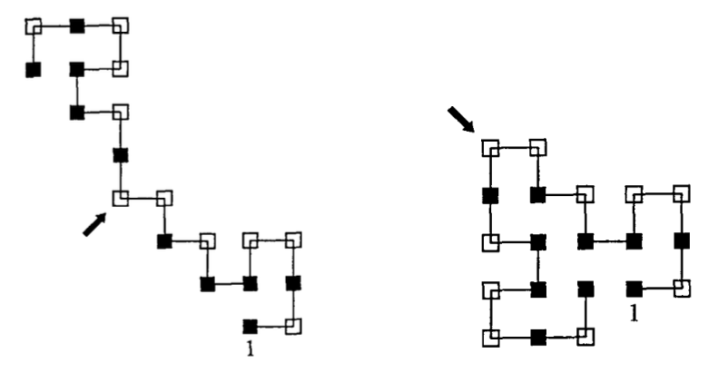{width="70%" fig-alt="TODO: describe image"}

- Protein folding configurations

---

## Hands-on: protein folding

<!-- TODO: complex slide layout (flagged by detect_complex_slide.py - see run log). Content below is complete but UNARRANGED - needs manual layout to match the original slide. -->

- original version: Haade;vectorization: Wjh31, Quibik, CC BY-SA 3.0 <https://creativecommons.org/licenses/by-sa/3.0>, via Wikimedia Commons

- Define an energy function:
  - $$V=-\mathop{ \sum }\limits_{⟨{B}_{i}{B}_{j}⟩} \Delta ({\mathbf{r}}_{i}-{\mathbf{r}}_{j}), \Delta (\mathbf{r})=\left\{\begin{matrix}
1 &  & \text{if}|\mathbf{r}|=1\text{and bond is not covalent} \\
0 &  & \text{otherwise}
\end{matrix}\right.$$

{fig-alt="TODO"}

- Protein folding configurations
- E = -4

- E = -9

---

## Simulated annealing

- original version: Haade;vectorization: Wjh31, Quibik, CC BY-SA 3.0 <https://creativecommons.org/licenses/by-sa/3.0>, via Wikimedia Commons

- Another algorithm inspired by real-life phenomena: simulated annealing
  - From metallurgy, rather than biology.
- Wikipedia:
  - The name of the algorithm comes from annealing in metallurgy, a technique involving heating and controlled cooling of a material to alter its physical properties. This notion of slow cooling implemented in the simulated annealing algorithm is interpreted as a slow decrease in the probability of accepting worse solutions as the solution space is explored. Accepting worse solutions allows for a more extensive search for the global optimal solution. Simulated annealing algorithms work by progressively decreasing the temperature from an initial positive value to zero. At each time step, the algorithm randomly selects a solution close to the current one, measures its quality, and moves to it according to the temperature-dependent probabilities of selecting better or worse solutions.

{width="70%" fig-alt="TODO: describe image"}

- By Kingpin13 - Own work, CC0, https://commons.wikimedia.org/w/index.php?curid=25010763

---

## Simulated annealing

- original version: Haade;vectorization: Wjh31, Quibik, CC BY-SA 3.0 <https://creativecommons.org/licenses/by-sa/3.0>, via Wikimedia Commons

- Pseudocode for simulated annealing:
  - Start from straight line
  - Trial: Select monomer at random, rotate 90 degrees
  - If new config is self-avoiding, compute $ \Delta E$
    - if $ \Delta E<0$: accept
    - else: apply Metropolis-like criteria; throw random deviate $u$, and accept if $w=exp[- \Delta E/{c}_{k}]>u,{c}_{k} \equiv {k}_{B}T$
  - If stopping criterion is not met, repeat trial after reducing T
  - In original paper, start at T=2K, reduce by 1% every 200,000 steps to a minimum of 0.15K.

---

## Genetic algorithm

- original version: Haade;vectorization: Wjh31, Quibik, CC BY-SA 3.0 <https://creativecommons.org/licenses/by-sa/3.0>, via Wikimedia Commons

- Pseudocode for genetic algorithm:
  - Start from straight line
  - Make $N$ copies (mutants)
  - Trial:
    - For each mutant, select random monomer, rotate 90 degrees.
    - Accept if new configuration is (a) self-avoiding and (b) satisfies Metropolis–Boltzmann condition (throw random $u$, accept if $w=exp[-(E-⟨E⟩)/{c}_{k}]>u,{c}_{k} \equiv {k}_{B}T$)
  - Compute best 2 mutants best on lowest energy
  - Randomly select point, splice the two mutants together
    - If self-avoiding, replace $N$ copies with new mutant
  - Repeat

---

# Neurons

---

## Neurons

- original version: Haade;vectorization: Wjh31, Quibik, CC BY-SA 3.0 <https://creativecommons.org/licenses/by-sa/3.0>, via Wikimedia Commons

- They are what make you, you!
- Neurons form the central nervous system and brain
- ATP drives ion pumps to maintain ~ -70 mV voltage bias (inside cell lower than outside)
- Excitations cause action potential across the axon
- Biologist view:

{width="70%" fig-alt="TODO: describe image"}

- Diagram of a neuron

---

## Neurons

<!-- TODO: complex slide layout (flagged by detect_complex_slide.py - see run log). Content below is complete but UNARRANGED - needs manual layout to match the original slide. -->

- original version: Haade;vectorization: Wjh31, Quibik, CC BY-SA 3.0 <https://creativecommons.org/licenses/by-sa/3.0>, via Wikimedia Commons

- They are what make you, you!
- Neurons form the central nervous system and brain
- ATP drives ion pumps to maintain ~ -70 mV voltage bias (inside cell lower than outside)
- Excitations cause action potential across the axon
- Biologist view:

{fig-alt="TODO"}

- Diagram of a neuron
- Signal in (from other neurons)

- Signal transmission

- Signal out (to other neurons)

---

## Neurons

- original version: Haade;vectorization: Wjh31, Quibik, CC BY-SA 3.0 <https://creativecommons.org/licenses/by-sa/3.0>, via Wikimedia Commons

- They are what make you, you!
- Neurons form the central nervous system and brain
- ATP drives ion pumps to maintain ~ -70 mV voltage bias (inside cell lower than outside)
- Excitations cause action potential across the axon
- Physicist view:

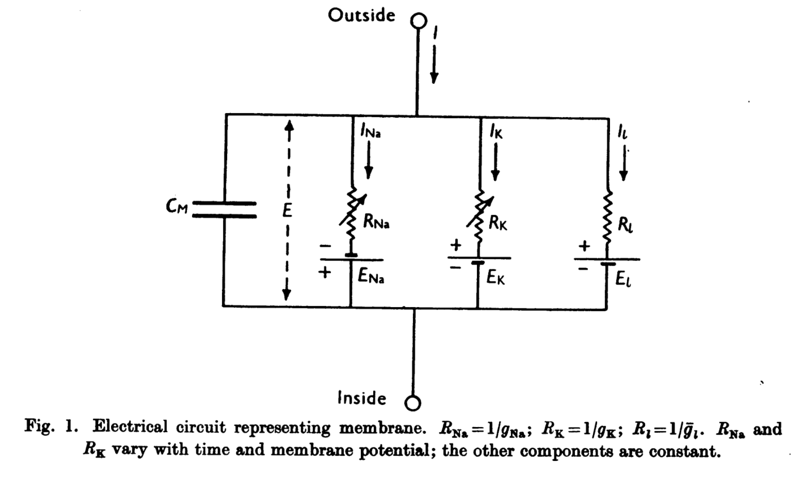{width="70%" fig-alt="TODO: describe image"}

- Circuit diagram approximating a neuron
- Spherical cow approach

---

## Action potential

- original version: Haade;vectorization: Wjh31, Quibik, CC BY-SA 3.0 <https://creativecommons.org/licenses/by-sa/3.0>, via Wikimedia Commons

{width="70%" fig-alt="TODO: describe image"}

- Animation of an action potential ([https://en.wikipedia.org/wiki/Action_potential](https://en.wikipedia.org/wiki/Action_potential))

---

## Action potential

- original version: Haade;vectorization: Wjh31, Quibik, CC BY-SA 3.0 <https://creativecommons.org/licenses/by-sa/3.0>, via Wikimedia Commons

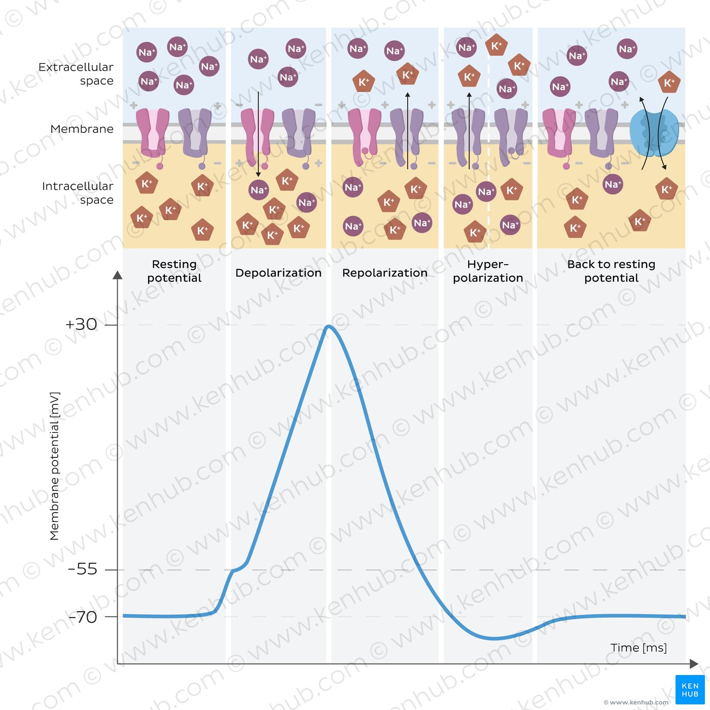{width="70%" fig-alt="TODO: describe image"}

- Mechanisms underlying the action potential ([https://www.kenhub.com/en/library/physiology/action-potential](https://www.kenhub.com/en/library/physiology/action-potential))

---

## Hodgkin–Huxley equations

- original version: Haade;vectorization: Wjh31, Quibik, CC BY-SA 3.0 <https://creativecommons.org/licenses/by-sa/3.0>, via Wikimedia Commons

- Hodgkin and Huxley performed some pioneering biophysics experiments using squid axons:
  - Constant uniform membrane potential
  - Propagated action potential
- 1963 Nobel Prize in Physiology or Medicine
- References:
  - [https://pmc.ncbi.nlm.nih.gov/articles/instance/1392413/pdf/jphysiol01442-0106.pdf](https://pmc.ncbi.nlm.nih.gov/articles/instance/1392413/pdf/jphysiol01442-0106.pdf)
  - Review article: [https://pmc.ncbi.nlm.nih.gov/articles/PMC3424716/](https://pmc.ncbi.nlm.nih.gov/articles/PMC3424716/)
  - [https://en.wikipedia.org/wiki/Hodgkin%E2%80%93Huxley_model](https://en.wikipedia.org/wiki/Hodgkin%E2%80%93Huxley_model)
  - [https://neuronaldynamics.epfl.ch/online/Ch2.S2.html#Ch2.F2](https://neuronaldynamics.epfl.ch/online/Ch2.S2.html#Ch2.F2)

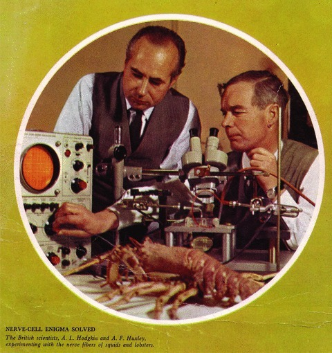{width="70%" fig-alt="TODO: describe image"}

- Picture of Hodgkin and Huxley and lobster

---

## Hodgkin–Huxley equations

- original version: Haade;vectorization: Wjh31, Quibik, CC BY-SA 3.0 <https://creativecommons.org/licenses/by-sa/3.0>, via Wikimedia Commons

- Hodgkin and Huxley performed some pioneering biophysics experiments using squid axons:
  - Constant uniform membrane potential
  - Propagated action potential
- 1963 Nobel Prize in Physiology or Medicine
- References:
  - [https://pmc.ncbi.nlm.nih.gov/articles/instance/1392413/pdf/jphysiol01442-0106.pdf](https://pmc.ncbi.nlm.nih.gov/articles/instance/1392413/pdf/jphysiol01442-0106.pdf)
  - Review article: [https://pmc.ncbi.nlm.nih.gov/articles/PMC3424716/](https://pmc.ncbi.nlm.nih.gov/articles/PMC3424716/)
  - [https://en.wikipedia.org/wiki/Hodgkin%E2%80%93Huxley_model](https://en.wikipedia.org/wiki/Hodgkin%E2%80%93Huxley_model)
  - [https://neuronaldynamics.epfl.ch/online/Ch2.S2.html#Ch2.F2](https://neuronaldynamics.epfl.ch/online/Ch2.S2.html#Ch2.F2)

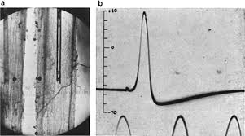{width="70%" fig-alt="TODO: describe image"}

- Left: squid axon with electrode.
- Right: measurement of action potential (bottom shows generated sine wave at 500 Hz)

---

## Hodgkin–Huxley equations

<!-- TODO: complex slide layout (flagged by detect_complex_slide.py - see run log). Content below is complete but UNARRANGED - needs manual layout to match the original slide. -->

- original version: Haade;vectorization: Wjh31, Quibik, CC BY-SA 3.0 <https://creativecommons.org/licenses/by-sa/3.0>, via Wikimedia Commons

- [https://neuronaldynamics.epfl.ch/online/Ch2.S2.html](https://neuronaldynamics.epfl.ch/online/Ch2.S2.html)

- I: current injected into cell (i.e. neuron starts to fire)
- u: membrane potential
- C: cell membrane is a capacitor between inside and outside cell
- R: ion channels are resistors (variable for Na+ and K+; constant for leakage)
- E: ion transport results in concentration gradient, modeled as "Nernst potential" (battery) acting on individual ion species
- (Leakage not specified exactly; includes Cl- ions)

- $$\mathop{ \sum }\limits_{k}{I}_{k}={\overline{g}}_{\text{Na}}{m}^{3}h(u-{E}_{\text{Na}})+{\overline{g}}_{\text{K}}{n}^{4}(u-{E}_{\text{K}})+{\overline{g}}_{\text{L}}(u-{E}_{\text{L}})$$

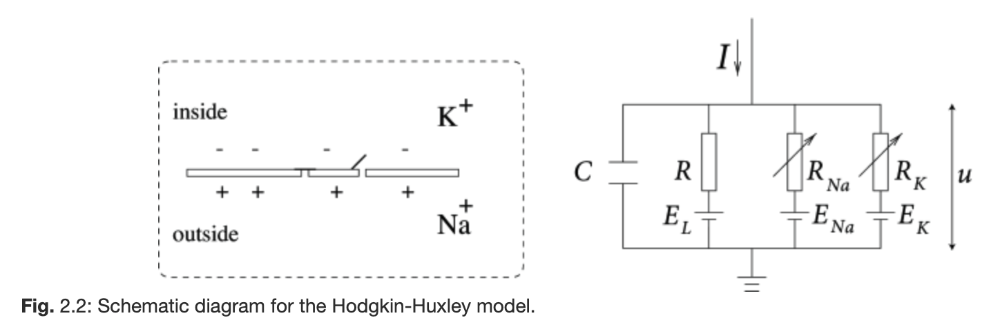{fig-alt="TODO"}

- Fig. 2.2: Schematic diagram for the Hodgkin–Huxley model

---

## Hodgkin–Huxley equations

<!-- TODO: complex slide layout (flagged by detect_complex_slide.py - see run log). Content below is complete but UNARRANGED - needs manual layout to match the original slide. -->

- original version: Haade;vectorization: Wjh31, Quibik, CC BY-SA 3.0 <https://creativecommons.org/licenses/by-sa/3.0>, via Wikimedia Commons

- Constant uniform membrane potential: inserted a wire through length of axon, held at constant V
  - No current along cylinder axis, so $I=0$ except during stimulus (short shock ~ delta function at t=0)
  - Useful for investigating the behavior of ion channels, e.g., their response to the membrane potential
  - Parameters of the model:
    - $I=0$, $V={V}_{0}$
    - $n$ (open probability of charged particles for ${\text{K}}^{+}$ channels),
    - $m$ (same for ${\text{Na}}^{+}$ channels), and
    - $h$ (inactivation for ${\text{Na}}^{+}$ channels).
  - With constant potential, these at their steady state resting values.

- $$m$$

- $$h$$

- $$n$$

{fig-alt="TODO"}

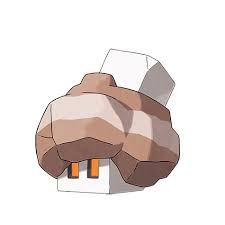{fig-alt="TODO"}

{fig-alt="TODO"}

{fig-alt="TODO"}

- Neuron ion channels

---

## Hodgkin–Huxley equations

- original version: Haade;vectorization: Wjh31, Quibik, CC BY-SA 3.0 <https://creativecommons.org/licenses/by-sa/3.0>, via Wikimedia Commons

- Propagated action potential:
  - Axons in living organism excited at junction with cell body
  - Impulse from excitation propagates down length
  - H–H modeled a signal propagating down the axon with H–H circuit elements connected in series by longitudinal resistors:

- In the continuum limit,
- $$\frac{a}{2{R}_{2}}\frac{{ \partial }^{2}V}{ \partial {x}^{2}}={C}_{M}\frac{ \partial V}{ \partial t}+{\overline{g}}_{K}{n}^{4}(V-{V}_{K})+{\overline{g}}_{Na}{m}^{3}h(V-{V}_{Na})+{\overline{g}}_{l}(V-{V}_{l})$$
- (Effective conductance of e.g. sodium channels: ${R}_{Na}^{-1}={\overline{g}}_{Na}{m}^{3}h$)
- $n/m/h$ follow $\frac{dx}{dt}={ \alpha }_{x}(1-x)-{ \beta }_{x}x$

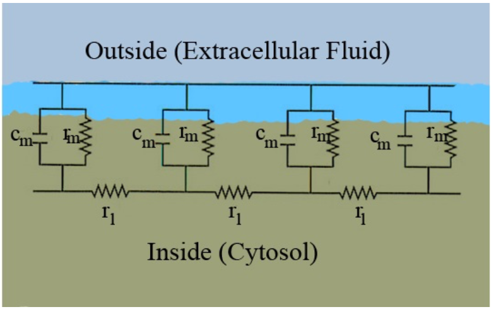{width="70%" fig-alt="TODO: describe image"}

- Equivalent circuit diagram for neuron ion channels

---

## Hodgkin–Huxley equations

- original version: Haade;vectorization: Wjh31, Quibik, CC BY-SA 3.0 <https://creativecommons.org/licenses/by-sa/3.0>, via Wikimedia Commons

- There is a soliton solution to this differential equation,
  - $$\frac{{ \partial }^{2}V}{ \partial {x}^{2}}=\frac{1}{{ \theta }^{2}}\frac{{ \partial }^{2}V}{ \partial {t}^{2}}$$
- Assuming the shape is independent of $x$ (i.e., we have wave propagation), this is an ODE:
- $$\frac{a}{2{R}_{2}{ \theta }^{2}}\frac{{ \partial }^{2}V}{ \partial {t}^{2}}={C}_{M}\frac{ \partial V}{ \partial t}+{\overline{g}}_{K}{n}^{4}(V-{V}_{K})+{\overline{g}}_{Na}{m}^{3}h(V-{V}_{Na})+{\overline{g}}_{l}(V-{V}_{l})$$
- H–H found that they could measure $ \theta $ by requiring $V \rightarrow 0$ as $t \rightarrow  \infty $ (bad solutions go to $ \pm  \infty $ instead).
  - They used a root finder to solve this (on ancient computers!)
  - (Closer to a cha-ching cash register than even a pocket calculator)

---

## Hodgkin–Huxley equations

- original version: Haade;vectorization: Wjh31, Quibik, CC BY-SA 3.0 <https://creativecommons.org/licenses/by-sa/3.0>, via Wikimedia Commons

- Hands-on: reproducing Fig. 12 in the [H–H paper](https://pmc.ncbi.nlm.nih.gov/articles/instance/1392413/pdf/jphysiol01442-0106.pdf) (first case with $l=0$).

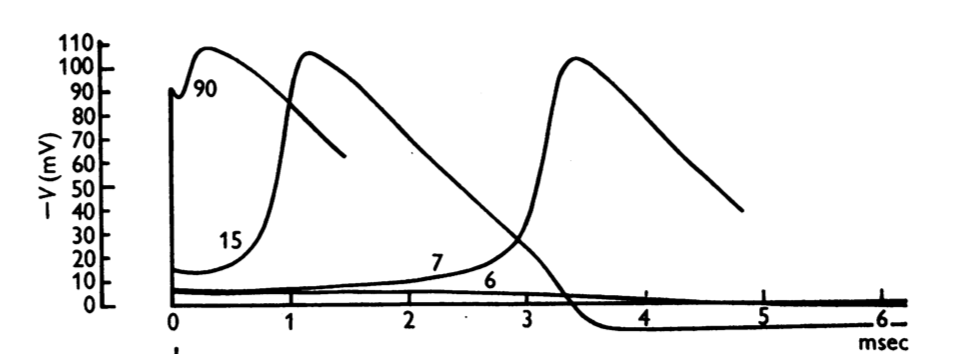{width="70%" fig-alt="TODO: describe image"}

- Figure 12 from [https://pmc.ncbi.nlm.nih.gov/articles/instance/1392413/pdf/jphysiol01442-0106.pdf](https://pmc.ncbi.nlm.nih.gov/articles/instance/1392413/pdf/jphysiol01442-0106.pdf), showing the numerically computed time evolution of an action potential for various input pulse amplitudes
- Suggestion: read through (1) [review article](https://pmc.ncbi.nlm.nih.gov/articles/PMC3424716/) and (2) [modern textbook description](https://neuronaldynamics.epfl.ch/online/Ch2.S2.html#Ch2.F2), then (3) run notebook, referring to [paper pp. 518–525](https://pmc.ncbi.nlm.nih.gov/articles/instance/1392413/pdf/jphysiol01442-0106.pdf) for explanation of equations

---

## Hodgkin–Huxley equations

- original version: Haade;vectorization: Wjh31, Quibik, CC BY-SA 3.0 <https://creativecommons.org/licenses/by-sa/3.0>, via Wikimedia Commons

- "Details of the mechanism will probably not be settled for some time, but it seems difficult to escape the conclusion that the changes in ionic permeability depend on the movement of some component of the membrane which behaves as though it had a large charge or dipole moment."

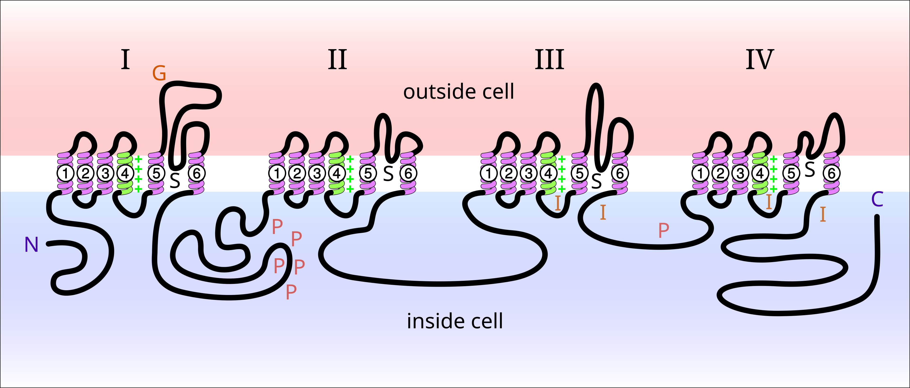{width="70%" fig-alt="TODO: describe image"}

- Diagram of an actual voltage-gated sodium ion channel ([wikipedia](https://en.wikipedia.org/wiki/Voltage-gated_sodium_channel))
{width="70%" fig-alt="TODO: describe image"}

- Hodgkin and Huxley's circuit diagram
- Also see: [10.1016/j.jemermed.2012.11.109](https://doi.org/10.1016/j.jemermed.2012.11.109)
