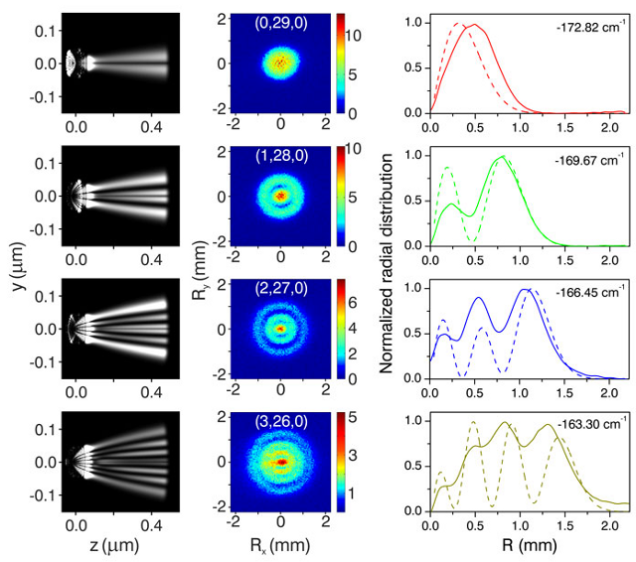
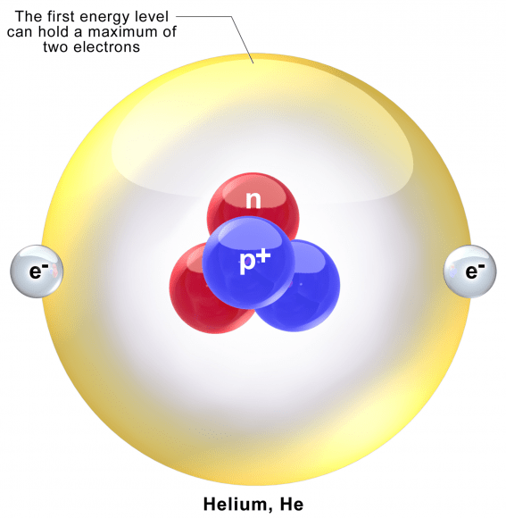
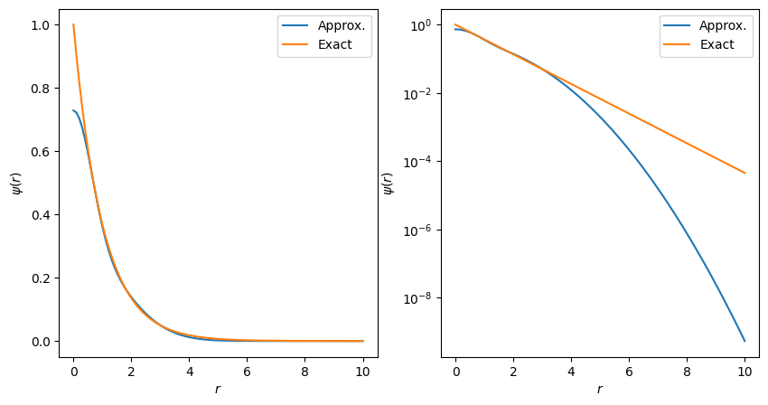
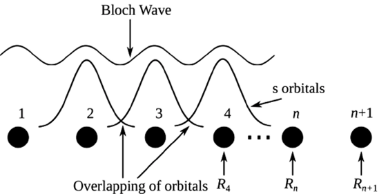
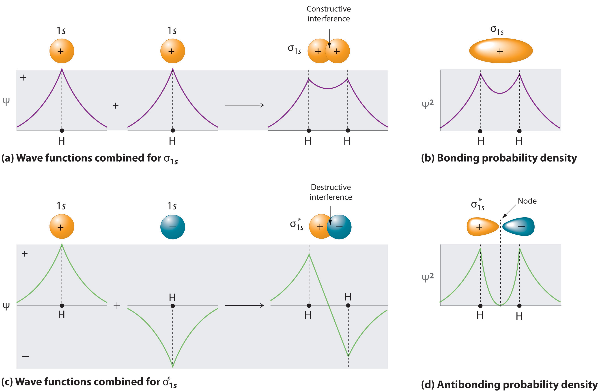
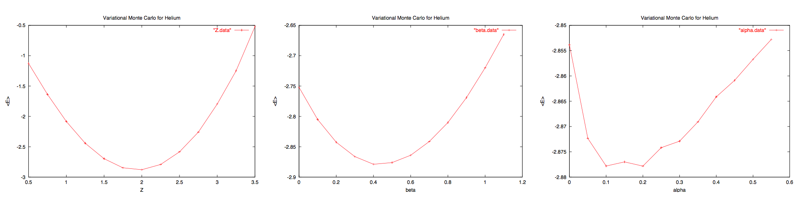

# Computational quantum mechanics

---

## Computational quantum mechanics

- original version:: : Wjh31, Quibik, CC BY-SA 3.0 <https://creativecommons.org/licenses/by-sa/3.0>, via Wikimedia Commons

- Next up: non-relativistic quantum mechanics from a computational perspective
- We will investigate solutions to the Schroedinger equation for several system:
  - Hydrogen atom
  - Helium atom
  - Harmonic oscillator
- Will look at a couple different computational techniques:
  - Variational methods
  - MC methods

---

## Hydrogen atom

- original version:: : Wjh31, Quibik, CC BY-SA 3.0 <https://creativecommons.org/licenses/by-sa/3.0>, via Wikimedia Commons

- H atom: 2-body quantum system
  - Exactly solvable
  - Great test case for numerical methods

{width="70%" fig-alt="TODO: describe image"}

- Experimental observation of the transverse nodal structure of four atomic hydrogen Stark states.
- [https://physicsworld.com/a/quantum-microscope-peers-into-the-hydrogen-atom/](https://physicsworld.com/a/quantum-microscope-peers-into-the-hydrogen-atom/)

---

## Helium atom

- original version:: : Wjh31, Quibik, CC BY-SA 3.0 <https://creativecommons.org/licenses/by-sa/3.0>, via Wikimedia Commons

- He atom: 3-body quantum system
  - Not exactly solvable (even classically!)
  - Approximation methods abound
  - Great for computation!

{width="70%" fig-alt="TODO: describe image"}

- Cartoon of a Helium atom

---

## Variational methods

- original version:: : Wjh31, Quibik, CC BY-SA 3.0 <https://creativecommons.org/licenses/by-sa/3.0>, via Wikimedia Commons

- Recall from your quantum mechanics class:
  - Given a Hamiltonian, $H$, the quantum system is described by a vector, $| \psi ⟩$, in an infinite-dimensional Hilbert space.
  - The energy, $E$, of $| \psi ⟩$ is the expectation value of the Hamiltonian:
    - $$E[ \psi ]=\frac{⟨ \psi |H| \psi ⟩}{⟨ \psi | \psi ⟩}$$
  - The variational theorem states that the extrema of $E$ are eigenstates of $H$:
    - If $ \delta E \equiv E[ \psi + \delta  \psi ]-E[ \psi ]=0$, then $H \psi =E \psi $.
- We can use this to find approximate solutions for the ground state of quantum systems, even if exact solutions are out of reach.
- References:
  - [https://en.wikipedia.org/wiki/Variational_method_(quantum_mechanics)](https://en.wikipedia.org/wiki/Variational_method_(quantum_mechanics))
  - Simons, Advanced Theoretical Chemistry, [4.2](https://chem.libretexts.org/Bookshelves/Physical_and_Theoretical_Chemistry_Textbook_Maps/Advanced_Theoretical_Chemistry_(Simons)/04:__Some_Important_Tools_of_Theory/4.02:_The_Variational_Method), [4.3](https://chem.libretexts.org/Bookshelves/Physical_and_Theoretical_Chemistry_Textbook_Maps/Advanced_Theoretical_Chemistry_(Simons)/04:__Some_Important_Tools_of_Theory/4.03:_Linear_Variational_Method)
  - [Falasco, Variational Method](https://chem.libretexts.org/Bookshelves/Physical_and_Theoretical_Chemistry_Textbook_Maps/Supplemental_Modules_(Physical_and_Theoretical_Chemistry)/Quantum_Mechanics/17:_Quantum_Calculations/Variational_Method)

---

## Variational methods

- original version:: : Wjh31, Quibik, CC BY-SA 3.0 <https://creativecommons.org/licenses/by-sa/3.0>, via Wikimedia Commons

- The Hilbert space is infinite-dimension, so it's too expensive to search the entire space for extrema. Instead, we restrict to a finite-dimensional subspace ($N$-dimensional)
- Starting point: suppose we have a set of orthonormal basis vectors, $|{ \chi }_{p}⟩$:
  - $$⟨{ \chi }_{p}|{ \chi }_{q}⟩={ \delta }_{pq}$$
- Then $H$ is approximated by an $N \times N$ matrix:
  - ${H}_{pq}=⟨{ \chi }_{p}|H|{ \chi }_{q}⟩$.
- Then, our problem is to find stationary states,
  - $$ \psi =\mathop{\mathop{ \sum }\limits_{p=0}}\limits^{N-1}{C}_{p}|{ \chi }_{p}⟩$$
  - (I.e., expectation value $⟨ \psi |H| \psi ⟩$ is stationary with respect to variations in the constants ${C}_{p}$)

---

## Variational methods

- original version:: : Wjh31, Quibik, CC BY-SA 3.0 <https://creativecommons.org/licenses/by-sa/3.0>, via Wikimedia Commons

- This is just a matrix eigenvalue problem!
  - $$\begin{matrix}
H| \psi ⟩ & =E| \psi ⟩ \\
\mathop{ \sum }\limits_{j}{C}_{j}H|{ \chi }_{j}⟩ & =\mathop{ \sum }\limits_{j}E{C}_{j}|{ \chi }_{j}⟩ \\
\mathop{ \sum }\limits_{j}{C}_{j}⟨{ \chi }_{i}|H|{ \chi }_{j}⟩ & =E\mathop{ \sum }\limits_{j}⟨{ \chi }_{i}|{ \chi }_{j}⟩{C}_{j}
\end{matrix}$$
- Let:
  - $\mathbf{H}$=Hamiltonian matrix defined by ${H}_{ij}=⟨{ \chi }_{i}|H|{ \chi }_{j}⟩$
  - $\mathbf{S}$=overlap matrix defined by ${S}_{ij}=⟨{ \chi }_{i}|{ \chi }_{j}⟩$
  - $\mathbf{C}$=vector of coefficients, ${C}_{j}$
- Then, in matrix notation:
- $$\mathbf{H}\mathbf{C}=E\mathbf{S}\mathbf{C}$$
- This is a generalized eigenvalue problem (recall from last semester!)
  - See lecture notes, Numerical Recipes 11.0.5, and [scipy.linalg.eig](https://docs.scipy.org/doc/scipy/reference/generated/scipy.linalg.eig.html).

---

## Variational methods

- original version:: : Wjh31, Quibik, CC BY-SA 3.0 <https://creativecommons.org/licenses/by-sa/3.0>, via Wikimedia Commons

- $$\begin{matrix}
\mathbf{H}\mathbf{C} & =E\mathbf{S}\mathbf{C} \\
\mathop{\mathop{ \sum }\limits_{j=0}}\limits^{N-1}{H}_{ij}{C}_{J} & =E\mathop{\mathop{ \sum }\limits_{j=0}}\limits^{N-1}{S}_{ij}{C}_{j}
\end{matrix}$$
- $\mathbf{H}$ is often real and symmetric (true for H and He atoms)
  - So exactly $N$ real eigenvalues, and the$|{ \chi }_{p}⟩$ span the subspace.
  - The $|{ \chi }_{i}⟩$ are linearly independent, but not necessarily orthonormal. (They can be made orthonormal, but not necessary in practice.)
- $\mathbf{S}$ is Hermitian, with real and positive-definite eigenvalues.
- So: we have simplified the problem to a linear algebra problem with linear equations in a finite dimensional space.
  - We just need to compute the matrices, and solve the minimization problem for $E$

---

## H atom

- original version:: : Wjh31, Quibik, CC BY-SA 3.0 <https://creativecommons.org/licenses/by-sa/3.0>, via Wikimedia Commons

- Now, let's consider a specific problem: H atom (one proton, one electron).
- Hamiltonian:
  - $$H=-\frac{{ \hbar }^{2}}{2m}{ \nabla }^{2}-\frac{{e}^{2}}{4 \pi { \epsilon }_{0}r}$$
- Variables:
  - Coordinate system relative to the proton:
  - $$\vec{r}={\vec{r}}_{e}-{\vec{r}}_{p}$$
  - Also use the reduced mass:
  - $${m}^{*}=\frac{{m}_{e}{m}_{p}}{{m}_{e}+{m}_{p}}$$

---

## H atom

- original version:: : Wjh31, Quibik, CC BY-SA 3.0 <https://creativecommons.org/licenses/by-sa/3.0>, via Wikimedia Commons

- To gain some intuition, let's start by remembering the ground state
  - We know it's spherically symmetric, so we can switch to spherical coordinates, and ignore $ \theta $ and $ \phi $:
- $$H=-\frac{{ \hbar }^{2}}{2m}\left[ \frac{{d}^{2}}{d{r}^{2}}+\frac{2}{r}\frac{d}{dr} \right]-\frac{{e}^{2}}{4 \pi { \epsilon }_{0}r}$$
- You probably solved this in quantum mechanics. We know the exact ground state energy and wave function:
- $${E}_{0}=-\frac{{e}^{2}}{2{a}_{0}},{ \psi }_{0}(r) \sim {e}^{-r/{a}_{0}},{a}_{0}=\frac{4 \pi { \epsilon }_{0}{ \hbar }^{2}}{{m}^{*}{e}^{2}}\text{(Bohr radius)}$$
- For simplicity (and computational performance!), choose units such that $ \hbar ={m}^{*}=\frac{{e}^{2}}{4 \pi { \epsilon }_{0}}=1$:
- $$H=-\frac{1}{2}\left[ \frac{{d}^{2}}{d{r}^{2}}+\frac{2}{r}\frac{d}{dr} \right]-\frac{1}{r}{E}_{0}=-\frac{1}{2}{ \psi }_{0}(r) \sim {e}^{-r}$$

---

## H atom

- original version:: : Wjh31, Quibik, CC BY-SA 3.0 <https://creativecommons.org/licenses/by-sa/3.0>, via Wikimedia Commons

- So, for spherically symmetric solutions, we could consider a family of trial functions (i.e. the $|{ \chi }_{i}⟩$) given by:
- ${ \psi }_{T, \alpha }(r)={e}^{- \alpha r}$ for a set of values ${ \alpha }$
- The Hamiltonian will look something like:
- $$H{ \psi }_{T, \alpha }(r)=E(r){ \psi }_{T, \alpha }(r)$$
  - where $E(r)$ is called the "local energy" of the trial wavefunction
  - Not a single value $E$, because in general the ${ \psi }_{T, \alpha }(r)$ are not eigenvectors of $H$
- If $ \alpha ={ \alpha }_{0}$, then this is just proportional to the exact ground state wave function.

---

## H atom

- original version:: : Wjh31, Quibik, CC BY-SA 3.0 <https://creativecommons.org/licenses/by-sa/3.0>, via Wikimedia Commons

- Now let's consider some more complete set of functions.
- Define two families of orbital functions:
  - Slater orbitals:       $ \chi (\vec{r})={Y}_{lm}( \theta , \phi ){e}^{- \alpha r}$
  - Gaussian orbitals:  $ \chi (\vec{r})={Y}_{lm}( \theta , \phi ){e}^{- \alpha {r}^{2}}$
- For the H atom, the Slater orbitals are the exact solutions, so the variational method would be trivial. Let's try the Gaussian orbitals.
- Restricting to $l=0$ $s$-wave states:
- $$ \psi (r)=\mathop{\mathop{ \sum }\limits_{i=0}}\limits^{N-1}{c}_{i}{g}_{s}(\vec{r}; \alpha ),{g}_{s}(\vec{r}; \alpha ) \equiv {\left( \frac{2 \alpha }{ \pi } \right)}^{\frac{3}{4}}{e}^{- \alpha {r}^{2}}$$

---

## H atom

- original version:: : Wjh31, Quibik, CC BY-SA 3.0 <https://creativecommons.org/licenses/by-sa/3.0>, via Wikimedia Commons

- $$ \psi (r)=\mathop{\mathop{ \sum }\limits_{i=0}}\limits^{N-1}{c}_{i}{g}_{s}(\vec{r}; \alpha ),{g}_{s}(\vec{r}; \alpha ) \equiv {\left( \frac{2 \alpha }{ \pi } \right)}^{\frac{3}{4}}{e}^{- \alpha {r}^{2}}$$
- We have enough information to compute all the matrix elements now:
- $$\begin{matrix}
{S}_{ij} & = \int {d}^{3}r{g}_{s}(\vec{r};{ \alpha }_{i}{)}^{*}{g}_{s}(\vec{r};{ \alpha }_{i})= \int {d}^{3}r{e}^{-{ \alpha }_{i}{r}^{2}}{e}^{-{ \alpha }_{j}{r}^{2}}={\left( \frac{ \pi }{{ \alpha }_{i}+{ \alpha }_{j}} \right)}^{\frac{3}{2}} \\
{H}_{ij} & ={T}_{ij}+{V}_{ij}\text{i.e. split H into kinetic and potential terms} \\
{T}_{ij} & =-\frac{{ \hbar }^{2}}{2m} \int {d}^{3}r{e}^{-{ \alpha }_{i}{r}^{2}}{ \nabla }^{2}{e}^{-{ \alpha }_{j}{r}^{2}}=\frac{3{ \hbar }^{2}}{m}\frac{{ \alpha }_{i}{ \alpha }_{j}{ \pi }^{\frac{3}{2}}}{({ \alpha }_{i}+{ \alpha }_{j}{)}^{\frac{5}{2}}} \\
{V}_{ij} & =-{e}^{2} \int {d}^{3}r{e}^{-{ \alpha }_{i}{r}^{2}}\frac{1}{r}{e}^{-{ \alpha }_{j}{r}^{2}}=-\frac{2 \pi {e}^{2}}{{ \alpha }_{i}+{ \alpha }_{j}}
\end{matrix}$$

---

## H atom

- original version:: : Wjh31, Quibik, CC BY-SA 3.0 <https://creativecommons.org/licenses/by-sa/3.0>, via Wikimedia Commons

- Finally, we can solve the $N$-dimensional minimization problem:
  - Compute $⟨E⟩=\frac{⟨ \psi |H| \psi ⟩}{⟨ \psi | \psi ⟩}$ as a function of $\vec{ \alpha }$ (fixed number of Gaussian orbitals) and $\vec{d}$ (coefficients of each basis vector, $ \psi = \sum {d}_{i}{g}_{s}(\vec{r};{ \alpha }_{i})$)
  - Minimize $E$ vs. $\vec{d}$  and $\vec{ \alpha }$ using, e.g., [BFGS minimization](https://en.wikipedia.org/wiki/Broyden%E2%80%93Fletcher%E2%80%93Goldfarb%E2%80%93Shanno_algorithm)
- Hand-on notebook: CompPhys/QM/hydrogen.ipynb

---

## H atom: results

- original version:: : Wjh31, Quibik, CC BY-SA 3.0 <https://creativecommons.org/licenses/by-sa/3.0>, via Wikimedia Commons

- The H atom is a simple example (so we can compare analytical and numerical solutions)
- CompPhys/QM/hydrogen.ipynb:
  - Approximate with Gaussian orbitals (just 2)
  - Implements matrix elements computed by hand, calculates $⟨E⟩$
  - Minimizes $⟨E⟩$ using np.optimize.minimize (specifically, uses BFGS algorithm)

{width="70%" fig-alt="TODO: describe image"}

- Results of hydrogen.ipynb
- Variational method for Hydrogen using Gaussian LCAO
- Minimize <psi|H|psi>/<psi|psi> using BFGS algorithm
- E=-0.48581
- i  alpha   d
- 0  1.33250 0.01072
- 1  0.20153 0.03208
- Vs. E0=-0.5 (true solution)

---

## He atom

<!-- TODO: complex slide layout (flagged by detect_complex_slide.py - see run log). Content below is complete but UNARRANGED - needs manual layout to match the original slide. -->

- original version:: : Wjh31, Quibik, CC BY-SA 3.0 <https://creativecommons.org/licenses/by-sa/3.0>, via Wikimedia Commons

- You will compute the Helium atom for your homework assignment
- Using our same units with the nucleus at the origin, the Hamiltonian is:
- $$H=-\frac{1}{2}{ \nabla }_{1}^{2}-\frac{1}{2}{ \nabla }_{2}^{2}-\frac{2}{{r}_{1}}-\frac{2}{{r}_{2}}+\frac{1}{{r}_{12}},{r}_{12} \equiv |{\vec{r}}_{1}-{\vec{r}}_{2}|$$

- Electrons attracted to nucleus (charge $Z=+2$)

- Electrons repel each other

---

## He atom and beyond

- original version:: : Wjh31, Quibik, CC BY-SA 3.0 <https://creativecommons.org/licenses/by-sa/3.0>, via Wikimedia Commons

- Hamiltonian for Helium atom:
- $$H=-\frac{1}{2}{ \nabla }_{1}^{2}-\frac{1}{2}{ \nabla }_{2}^{2}-\frac{2}{{r}_{1}}-\frac{2}{{r}_{2}}+\frac{1}{{r}_{12}},{r}_{12} \equiv |{\vec{r}}_{1}-{\vec{r}}_{2}|$$
- Molecular orbitals method
- "Tight binding" lattices

{width="70%" fig-alt="TODO: describe image"}

- The schematic formation of Bloch waves in the linear chain of hydrogen atoms according to the LCAO method
{width="70%" fig-alt="TODO: describe image"}

- Constructive and destructive interference of 1s orbitals that combine to form diatomic hydrogen
- [https://chem.libretexts.org/Courses/University_of_Arkansas_Little_Rock/Chem_1402%3A_General_Chemistry_1_%28Belford%29/Text/10%3A_Orbital_Hybridization_and_Molecular_Orbitals/10.03%3A_Molecular_Orbital_Theory](https://chem.libretexts.org/Courses/University_of_Arkansas_Little_Rock/Chem_1402%3A_General_Chemistry_1_%28Belford%29/Text/10%3A_Orbital_Hybridization_and_Molecular_Orbitals/10.03%3A_Molecular_Orbital_Theory)

---

## He atom

- original version:: : Wjh31, Quibik, CC BY-SA 3.0 <https://creativecommons.org/licenses/by-sa/3.0>, via Wikimedia Commons

- Ignoring the repulsive term, this would be a Hamiltonian of two hydrogen(-like) atoms with nuclear charge $Z=2$:
- $${E}_{0}=-\frac{{Z}^{2}}{2},{ \psi }_{0} \sim {e}^{-Zr}$$
- The combined wave function would be just:
- $$ \psi ({\vec{r}}_{1},{\vec{r}}_{2}) \sim {e}^{-2{r}_{1}}{e}^{-2{r}_{2}}$$
- Let's use this as a starting point for the variational method, i.e., use trial wave functions of the form:
- $${ \psi }_{T, \alpha }={e}^{- \alpha {r}_{1}}{e}^{- \alpha {r}_{2}}$$

---

## He atom

- original version:: : Wjh31, Quibik, CC BY-SA 3.0 <https://creativecommons.org/licenses/by-sa/3.0>, via Wikimedia Commons

- Ignoring electron-electron interactions, the expectation value for $E$ is:
- $$⟨E⟩=⟨-\frac{1}{2}{ \nabla }_{1}^{2}-\frac{1}{2}{ \nabla }_{2}^{2}-\frac{2}{{r}_{1}}-\frac{2}{{r}_{2}}⟩=2 \times \left( { \alpha }^{2}/2-2 \alpha  \right)$$
  - This is minimized at $ \alpha =2$, $⟨E⟩=-4$
  - Compare to experimentally measured value, ${E}_{0}=-2.904$
- Assignment 2 will ask you to add the electron-electron interaction term
  - Result: $⟨E⟩={ \alpha }^{2}-\frac{27}{8} \alpha $ , so $ \alpha =\frac{27}{16}$ and ${E}_{0}=-2.8477$.

---

# MC-based methods

---

## MC-based methods

- original version:: : Wjh31, Quibik, CC BY-SA 3.0 <https://creativecommons.org/licenses/by-sa/3.0>, via Wikimedia Commons

- As with classical physics, for quantum many-body problems, we can apply Monte Carlo techniques.
- We will use the quantum harmonic oscillator as an example system:
- $$H \psi (x)=\left[ -\frac{{ \hbar }^{2}}{2m}\frac{{d}^{2}}{d{x}^{2}}+\frac{1}{2}m{ \omega }^{2}{x}^{2} \right] \psi (x)=E \psi (x),(\mathop{lim}\limits_{x \rightarrow  \pm  \infty }=0)$$
- Recall the exact solutions:
- $$\begin{matrix}
{E}_{n} & =\left( n+\frac{1}{2} \right) \hbar  \omega ,n=0,1,2,... \\
{ \psi }_{n}(x) & ={\left( \frac{m \omega }{ \pi  \hbar } \right)}^{\frac{1}{4}}\frac{1}{\sqrt{{2}^{n}n!}}{H}_{n}\left( x\sqrt{\frac{m \omega }{ \hbar }} \right){e}^{-m \omega {x}^{2}/(2 \hbar )}
\end{matrix}$$
- where ${H}_{n}(x)$ are Hermite polynomials ($1$, $2y$, $4{y}^{2}-2$, ...)

---

## MC-based methods

- original version:: : Wjh31, Quibik, CC BY-SA 3.0 <https://creativecommons.org/licenses/by-sa/3.0>, via Wikimedia Commons

- For the H/He atoms, we were able to calculate the matrix elements by hand (e.g. simple Gaussian integrals).
- What if our system has a large number of particles, $N$? We have to solve an integral over a very large number of dimensions ($3N$):
- $$⟨E⟩=\frac{ \int d\vec{R}{ \psi }^{*}H \psi }{ \int d\vec{R}{ \psi }^{*} \psi },\vec{R}={{\vec{r}}_{1},{\vec{r}}_{2},...,{\vec{r}}_{N}}$$
- We can use MC techniques to perform the integration!
  - Probability distribution just needs to be positive definite for Metropolis
- References:
  - H. Sandsdalen, Variational Monte Carlo Studies of Atoms (2010), [https://files01.core.ac.uk/download/pdf/30812856.pdf](https://files01.core.ac.uk/download/pdf/30812856.pdf)
  - Thijssen, Computational Physics, [chapter 12](https://compphys.quantumtinkerer.tudelft.nl/downloads/Thijssen_Chapter12_Quantum_Monte_Carlo.pdf)
  - [https://en.wikipedia.org/wiki/Variational_Monte_Carlo](https://en.wikipedia.org/wiki/Variational_Monte_Carlo)

---

## MC-based methods

- original version:: : Wjh31, Quibik, CC BY-SA 3.0 <https://creativecommons.org/licenses/by-sa/3.0>, via Wikimedia Commons

- Recall the basic idea of the Metropolis algorithm:
  - We want to sample from some distribution, $ \rho (\vec{X})$, whose total normalization might be incalculable.
  - Have a random walker take steps around space
    - Given current step ${\vec{X}}_{n}$, take a trial step ${\vec{X}}^{*}$: uniformly sample some ball of radius $ \delta $ around ${\vec{X}}_{n}$ (or Gaussian distribution, etc.)
  - Accept or reject the step using the Metropolis condition:
    - Throw random $ \alpha  \in [0,1]$
    - Accept step if $P({\vec{X}}^{*})/P({\vec{X}}_{n})> \alpha $

{width="70%" fig-alt="TODO: describe image"}

- [https://relguzman.blogspot.com/2018/04/sampling-metropolis-hastings.html](https://relguzman.blogspot.com/2018/04/sampling-metropolis-hastings.html)

---

## MC-based methods

<!-- TODO: complex slide layout (flagged by detect_complex_slide.py - see run log). Content below is complete but UNARRANGED - needs manual layout to match the original slide. -->

- original version:: : Wjh31, Quibik, CC BY-SA 3.0 <https://creativecommons.org/licenses/by-sa/3.0>, via Wikimedia Commons

- How do we apply this to quantum mechanics?
  - The amplitude-squared of the wave function is a probability distribution!
  - Specifically, define the weight function for the M–H algorithm as:
  - $$ \rho (\vec{R})=\frac{|{ \psi }_{T, \alpha }(\vec{R}){|}^{2}}{ \int d\vec{R}|{ \psi }_{T, \alpha }(\vec{R}){|}^{2}}$$
- The energy is given by:
- $$⟨E⟩=\frac{⟨ \psi |H| \psi ⟩}{⟨ \psi | \psi ⟩}=\frac{ \int d\vec{R}|{ \psi }_{T, \alpha }(\vec{R}){|}^{2}\left( \frac{H{ \psi }_{T, \alpha }}{{ \psi }_{T, \alpha }} \right)}{ \int d\vec{R}|{ \psi }_{T, \alpha }{|}^{2}}= \int d\vec{R} \rho (\vec{R}){E}_{L}(\vec{R})$$
  - where we have defined the local energy function,
  - $${E}_{L}(\vec{R})=\frac{H{ \psi }_{T, \alpha }(\vec{R}}{{ \psi }_{T, \alpha }(\vec{R})}$$

- Same trial functions from last time

---

## MC-based methods

- original version:: : Wjh31, Quibik, CC BY-SA 3.0 <https://creativecommons.org/licenses/by-sa/3.0>, via Wikimedia Commons

- The goal is to generate a set of $M$ position vectors that spans the relevant space reasonably well according to the weight function, $ \rho (\vec{R})$:
  - ${\vec{R}}_{i}={{R}_{1},{R}_{2},...,{R}_{M}}$ (remember, each ${\vec{R}}_{i}$ contains the positions of $N$ particles)
- Then, the energy is approximated (i.e. the MC integration) by:
- $$⟨E⟩=\frac{1}{M}\mathop{\mathop{ \sum }\limits_{i=1}}\limits^{M}{E}_{L}({\vec{R}}_{i})$$
- The best values of the parameters ($\vec{ \alpha }$) minimizes $⟨E⟩$.

---

## QHO with quantum MC

- original version:: : Wjh31, Quibik, CC BY-SA 3.0 <https://creativecommons.org/licenses/by-sa/3.0>, via Wikimedia Commons

- Let's apply these methods to the QHO:
  - Consider Gaussian trial wave functions,
  - $${ \psi }_{T, \alpha }(x)={e}^{- \alpha {x}^{2}}$$
  - Use simplified units ($ \hbar =m={ \omega }^{2}=1$)
  - Hamiltonian is:
  - $$H=-\frac{{d}^{2}}{d{x}^{2}}+\frac{1}{2}{x}^{2}$$
  - Local energy function is:
  - $${E}_{L}(x)= \alpha +{x}^{2}\left( \frac{1}{2}-2{ \alpha }^{2} \right)$$
  - (Note: the trial wave function is the exact ground state solution for $ \alpha =1/2$)

---

## QHO with quantum MC

- original version:: : Wjh31, Quibik, CC BY-SA 3.0 <https://creativecommons.org/licenses/by-sa/3.0>, via Wikimedia Commons

- The corresponding weight function for the Metropolis algorithm is:
- $$ \rho (x) \propto |{ \psi }_{T, \alpha }(x){|}^{2}={e}^{-2 \alpha {x}^{2}}$$
  - (Note: obviously we know how to sample this directly and don't need Metropolis–Hastings, this is just for educational purposes)
- Pseudocode:
  - For given $ \alpha $:
    - Evolve $N$ random walkers (note: this is the the $M$ from last few slides) using M–H (large $N$ to reduce autocorrelation/walkers getting stuck)
    - At each trial step, compare $w= \rho ({x}_{trial})/ \rho (x)$ versus a uniform deviate $r \in [0,1]$ and accept if $w>r$
    - Compute $⟨E{⟩}_{ \alpha }$
  - Minimize $⟨E{⟩}_{ \alpha }$ over $ \alpha $
    - For QHO, we won't go crazy, just plot a few values around known minimum at $ \alpha =1/2$; see Thijssen for further discussion

---

## Notebook

- original version:: : Wjh31, Quibik, CC BY-SA 3.0 <https://creativecommons.org/licenses/by-sa/3.0>, via Wikimedia Commons

- Hands-on notebook: CompPhys/QM/vmc.ipynb
  - Relevant code is C++: vmc.h, vmc.cpp
  - Run through the code, understand the C++ code.
  - For Assignment 2, we will ask you to adapt the C++ code to the H or He atom case.

---

## Cusp conditions

<!-- TODO: complex slide layout (flagged by detect_complex_slide.py - see run log). Content below is complete but UNARRANGED - needs manual layout to match the original slide. -->

- original version:: : Wjh31, Quibik, CC BY-SA 3.0 <https://creativecommons.org/licenses/by-sa/3.0>, via Wikimedia Commons

- One wrinkle for the H/He atom case: the Metropolis algorithm doesn't like singularities in the weight function!
  - If M–H stumbles across a singularity in $ \rho (\vec{R})$, it will get stuck there
  - We can avoid this situation with some cleverness
- One method: choose trial functions that avoid singularities
  - For He atoms, we can use trial functions of the form:
  - $$ \psi ({\vec{r}}_{1},{\vec{r}}_{2};Z, \alpha , \beta )={e}^{-Z{r}_{1}}{e}^{-Z{r}_{2}}{e}^{ \beta {r}_{12}/(1+ \alpha {r}_{12})}$$
  - The local energy is:
  - $${E}_{L}({\vec{r}}_{1},{\vec{r}}_{2})=-{Z}^{2}+\frac{Z-2}{{r}_{1}}+\frac{Z-2}{{r}_{2}}+\frac{1}{{r}_{12}}\left[ 1-\frac{2 \beta }{(1+ \alpha {r}_{12}{)}^{2}} \right]+\frac{2 \alpha  \beta }{(1+ \alpha {r}_{12}{)}^{3}}-\frac{{ \beta }^{2}}{(1+ \alpha {r}_{12}{)}^{4}}+\frac{Z \beta {\hat{r}}_{12} \cdot ({\hat{r}}_{1}-{\hat{r}}_{2})}{(1+ \alpha {r}_{12}{)}^{2}}$$

{fig-alt="TODO"}

{fig-alt="TODO"}

{fig-alt="TODO"}

---

## Cusp conditions

- original version:: : Wjh31, Quibik, CC BY-SA 3.0 <https://creativecommons.org/licenses/by-sa/3.0>, via Wikimedia Commons

- The singularities are removed for $Z=2$ and $ \beta =\frac{1}{2}$:
- $${E}_{L}({\vec{r}}_{1},{\vec{r}}_{2})=-4+\frac{ \alpha }{(1+ \alpha {r}_{12})}+\frac{ \alpha }{(1+ \alpha {r}_{12}{)}^{2}}+\frac{ \alpha }{(1+ \alpha {r}_{12}{)}^{3}}-\frac{1}{4(1+ \alpha {r}_{12}{)}^{4}}+\frac{{\hat{r}}_{12} \cdot ({\hat{r}}_{1}-{\hat{r}}_{2})}{(1+ \alpha {r}_{12}{)}^{2}}$$
- If not removed, they can negatively affect the computation:

{width="70%" fig-alt="TODO: describe image"}

- Demonstration of numerical instabilities from singular terms

---

# Diffusion methods

---

## Diffusion methods

- original version:: : Wjh31, Quibik, CC BY-SA 3.0 <https://creativecommons.org/licenses/by-sa/3.0>, via Wikimedia Commons

- Last semester, we noted an interesting fact: the Schroedinger equation looks a lot like the diffusion equation, except with imaginary time, $it$.
  - Let's explore this a bit more!
- First, review some ordinary diffusion:
  - In Assignment 1, we modeled the diffusion of random walkers
  - Expanding on this, the density of walkers at time $t$, $ \rho (y,t)$, can be computed from the initial conditions, $ \rho (y,0)$, by evolution of a Green's function:
  - $$ \rho (y,t)= \int dxG(x,y;t) \rho (x,0),G(x,y;t)=\frac{1}{\sqrt{4 \pi  \gamma t}{e}^{-(x-y{)}^{2}/(4 \gamma t}}$$

---

## Diffusion methods

- original version:: : Wjh31, Quibik, CC BY-SA 3.0 <https://creativecommons.org/licenses/by-sa/3.0>, via Wikimedia Commons

- Green's function: impulse response of a dynamic system.
- Formally:
- $$G(x,y;0)= \delta (x-y) \int dxG(x,y;t)=1$$
- This gives the probability that a walker initially at position $x$ will evolve to position $y$ at time $t$.
- So, we could compute the random walk by:
  - Choosing a time step, $ \Delta t$
  - Move the walker according to $x(t) \rightarrow x(t+ \Delta t)=x(t)+ \eta \sqrt{ \Delta t}$
    - where $ \eta $ is a Gaussian deviate with variance ${ \sigma }^{2}=2 \gamma $
    - ($ \gamma $ is what you are asked to determine in Assignment 1)

---

## Diffusion methods

- original version:: : Wjh31, Quibik, CC BY-SA 3.0 <https://creativecommons.org/licenses/by-sa/3.0>, via Wikimedia Commons

- Diffusion is really just Brownian motion, so we can consider Einstein's equation,
- $$ \gamma =\frac{{k}_{B}T}{ \beta }$$
  - where $ \beta $ is the drag coefficient. For Brownian motion of spheres of radius $R$ and fluid viscosity $ \nu $, $ \beta =6 \pi R \nu $
- In the continuum limit, the density satisfies the diffusion equation:
- $$\frac{ \partial  \rho }{ \partial t}= \gamma \frac{{ \partial }^{2} \rho }{ \partial {x}^{2}}$$
  - This can be derived directly from the random walk update step. Let $a=$random step, taken left or right with probability $ \alpha $, once per time step $h$:
- $$\begin{matrix}
h\frac{ \partial  \rho (x,t)}{ \partial t} \approx  \rho (x,t+h)- \rho (x,t) & = \alpha [ \rho (x+a,t)+ \rho (x-a,t)-2 \rho (x,t)] \approx  \alpha {a}^{2}\frac{{ \partial }^{2} \rho (x,t)}{ \partial {x}^{2}} \\
\frac{ \partial  \rho (x,t)}{ \partial t} & = \gamma \frac{{ \partial }^{2} \rho (x,t)}{ \partial {x}^{2}}\text{for} \gamma ={a}^{2} \alpha /h
\end{matrix}$$

---

## Diffusion methods

- original version:: : Wjh31, Quibik, CC BY-SA 3.0 <https://creativecommons.org/licenses/by-sa/3.0>, via Wikimedia Commons

- Compare this with the time-dependent Schroedinger's equation:
- $$\frac{ \partial  \psi (x,t)}{ \partial t}=\frac{i \hbar }{2m}\frac{{ \partial }^{2} \psi (x,t)}{ \partial {x}^{2}} \equiv { \gamma }_{im}\frac{{ \partial }^{2} \psi (x,t)}{ \partial {x}^{2}}$$
  - These are almost the same equation, just with ${ \gamma }_{im}=\frac{i \hbar }{2m}$ imaginary.
- Alternatively, this can be viewed as diffusion with imaginary time.
  - Define $ \tau =-it$: $\frac{ \partial  \psi (x, \tau )}{ \partial  \tau }=\frac{ \hbar }{2m}\frac{{ \partial }^{2} \psi (x, \tau )}{ \partial {x}^{2}}$
  - This is exactly the diffusion, just in imaginary time.

- (Without potential term, $V$)

---

## Diffusion methods

- original version:: : Wjh31, Quibik, CC BY-SA 3.0 <https://creativecommons.org/licenses/by-sa/3.0>, via Wikimedia Commons

- We can use this feature to approximate ground states by taking the $ \tau  \rightarrow  \infty $ limit of the initial state, evolved according to the diffusion equation in imaginary time.
- Set the initial wave function to:
- $$ \Psi (x,0)=\mathop{\mathop{ \sum }\limits_{n=0}}\limits^{ \infty }{c}_{n}{ \psi }_{n}(x)$$
- Evolve via the Schroedinger equation:
  - $$ \Psi (x,t)=\mathop{\mathop{ \sum }\limits_{n=0}}\limits^{ \infty }{c}_{n}{e}^{-i{E}_{n}t/ \hbar }{ \psi }_{n}(x)$$
- [Analytically continue](https://en.wikipedia.org/wiki/Analytic_continuation) to imaginary time:
- $$ \Psi (x, \tau )=\mathop{\mathop{ \sum }\limits_{n=0}}\limits^{ \infty }{c}_{n}{e}^{-{E}_{n} \tau / \hbar }{ \psi }_{n}(x)$$
- And take $ \tau  \rightarrow  \infty $:
- $$\mathop{lim}\limits_{ \tau  \rightarrow  \infty }{e}^{{E}_{0} \tau / \hbar } \Psi (x, \tau )=\mathop{lim}\limits_{ \tau  \rightarrow  \infty }\mathop{ \sum }\limits_{n}{c}_{n}{e}^{-({E}_{n}-{E}_{0}) \tau / \hbar }{ \psi }_{n}(x)={c}_{0}{ \psi }_{0}(x)$$

---

## Adding potential term

- original version:: : Wjh31, Quibik, CC BY-SA 3.0 <https://creativecommons.org/licenses/by-sa/3.0>, via Wikimedia Commons

- Adding a potential term reveals a problem:
- $$\frac{ \partial  \psi (x, \tau )}{ \partial  \tau }=\frac{1}{2}\frac{{ \partial }^{2} \psi (x, \tau )}{ \partial {x}^{2}}-V(x) \psi (x, \tau )$$
- If we naively try to evolve using the same Green's function, we immediately run into probability non-conservation!
  - Consider a particle at rest,
  - $$\frac{ \partial  \psi (x, \tau )}{ \partial  \tau }=-V(x) \psi (x, \tau ), \psi (x, \tau )={e}^{-V(x) \tau } \psi (x,0)$$
  - Taking $ \tau  \rightarrow  \infty $:
  - $$\mathop{lim}\limits_{ \tau  \rightarrow  \infty } \psi (x, \tau )=\left\{\begin{matrix}
0 & \text{where}V(x)>0 \\
 \psi (x,0) & \text{where}V(x)=0 \\
 \infty  & \text{where}V(x)<0
\end{matrix}\right.$$

---

## Adding potential term

- original version:: : Wjh31, Quibik, CC BY-SA 3.0 <https://creativecommons.org/licenses/by-sa/3.0>, via Wikimedia Commons

- Workaround: we can add a numerical hack to the equation,
- $$\frac{ \partial  \psi (x, \tau )}{ \partial  \tau }=\frac{1}{2}\frac{{ \partial }^{2} \psi (x, \tau )}{ \partial {x}^{2}}-(V(x)-{E}_{T}) \psi (x, \tau )$$
- In the limit $ \tau  \rightarrow  \infty $, this should be independent of $ \tau $, so:
- $$-\frac{1}{2}\frac{{d}^{2} \psi (x}{d{x}^{2}}+V(x) \psi (x)={E}_{T} \psi (x)$$
- This tends to an eigenfunction of the QM problem, with ${E}_{T}$ as the corresponding eigenvalue.
- Therefore, we evolve the function in imaginary time, and the solution tends towards the actual solution.

---

## Pseudocode

- original version:: : Wjh31, Quibik, CC BY-SA 3.0 <https://creativecommons.org/licenses/by-sa/3.0>, via Wikimedia Commons

- Initialize:
  - Choose time step $ \Delta t$, target number of walkers (${N}_{T}$), and ${E}_{T}$.
- Loops over time steps:
  - Diffusion: K.E. term shifts walkers to new position (choose randomly from Gaussian distribution with variance $ \Delta t$)
  - Branching: P.E. term (including ${E}_{T}$) grows or decays number of walkers
    - Compute $q={e}^{- \Delta  \tau [V(x)-{E}_{T}]}$
    - Take integer part of $q$: floor(q)
    - q-floor(q) is randomly distributed in [0, 1)
    - If floor(q)==0, destroy walker; otherwise produce floor(q)-1 copies
  - Adjust ${E}_{T} \rightarrow {E}_{T}+ \alpha log({N}_{T}/N)$
    - Ensures number of walkers doesn't grow too large or too small

---

## Aside: analytic continuation

<!-- TODO: complex slide layout (flagged by detect_complex_slide.py - see run log). Content below is complete but UNARRANGED - needs manual layout to match the original slide. -->

- original version: Haade;vectorization: Wjh31, Quibik, CC BY-SA 3.0 <https://creativecommons.org/licenses/by-sa/3.0>, via Wikimedia Commons

- Analytic continuation is a technique for extending the domain of an analytic function ([wikipedia](https://en.wikipedia.org/wiki/Analytic_continuation)), often from real to complex
  - Interesting branch of mathematics, e.g. Riemann zeta function, gamma function
  - Useful uniqueness properties
- Here, we used it to extend $ \psi (\vec{x},t)$ to complex values of $t$
  - Familiar quantum mechanics lies in the sub-domain $(\vec{x},\text{Re}[t])$
  - With a clever manipulation of the Hamiltonian ($V \rightarrow V-{E}_{T}$), we arrange for the wave function to converge to the ground state as $t \rightarrow i \infty $

{fig-alt="TODO"}

- x
- Re[t]
- Im[t]
- Cartoon of analytic continuation

---

# From quantum mechanics to quantum field theory

---

## From QM to QFT

- original version: Haade;vectorization: Wjh31, Quibik, CC BY-SA 3.0 <https://creativecommons.org/licenses/by-sa/3.0>, via Wikimedia Commons

- Quantum mechanics describes the motion of "small things":
  - Hydrogen atoms
  - Quantum harmonic oscillator
- From classical to quantum: use "Schrodinger's trick",
- $$\begin{matrix}
{H}_{\text{cl.}} & =\frac{{p}^{2}}{2m}+V(x) \\
\vec{p} &  \rightarrow i \hbar \vec{ \nabla },E \rightarrow i \hbar \frac{ \partial }{ \partial t} \\
 \Rightarrow H & =-\frac{{ \hbar }^{2}}{2m}{ \nabla }^{2}+V(x)
\end{matrix}$$
- This yields Schroedinger's equation:
- $$H \psi =E \psi  \Rightarrow i \hbar \frac{ \partial }{ \partial t} \psi =-\frac{{ \hbar }^{2}}{2m}{ \nabla }^{2} \psi +V \psi $$

{width="70%" fig-alt="TODO: describe image"}

- Quantum harmonic oscillator solutions

---

## From QM to QFT

- original version: Haade;vectorization: Wjh31, Quibik, CC BY-SA 3.0 <https://creativecommons.org/licenses/by-sa/3.0>, via Wikimedia Commons

- In QM, the wave function defines a probability density,
  - $$ \rho ={ \psi }^{*} \psi =| \psi {|}^{2}$$
- Consider a single particle ($ \psi (\vec{x},t)$), or a certain number of particles (e.g. $|{ \psi }_{{e}_{1}}{ \psi }_{{e}_{2}}⟩$ for He atom)
  - Fixed #(particles) is baked into formalism (Hilbert space = complex functions on fixed domain); not immediately obvious how to handle things like variable particle number, e.g. matter-antimatter annihilations, quantizing $\vec{E}$, ...
- Aside: we can also define a probability current vector,
  - $$J=-\frac{i \hbar }{2m}({ \psi }^{*} \nabla  \psi - \psi  \nabla { \psi }^{*})$$
- that satisfies a conservation equation,
  - $$\vec{ \nabla } \cdot \vec{J}+\frac{ \partial  \rho }{ \partial t}=0$$

---

## From QM to QFT

- original version: Haade;vectorization: Wjh31, Quibik, CC BY-SA 3.0 <https://creativecommons.org/licenses/by-sa/3.0>, via Wikimedia Commons

- On the other hand, relativity describes the motion of "fast things":
  - $$\begin{aligned}
{E}^{2}={p}^{2}{c}^{2}+{m}^{2}{c}^{4}[c=1] \\
E= \pm m{\left( 1+{p}^{2}/{m}^{2} \right)}^{\frac{1}{2}}
\end{aligned}$$
  - If $p \ll m$, then $E \approx m(1+{p}^{2}/(2{m}^{2}))$, thus K.E.$={p}^{2}/(2m)$.
- Governs behavior of relativistic particles: photons, electrons/protons, etc.
- The Schroedinger equation is manifestly not compatible with special relativity!
  - Distinct treatment of space and time

{width="70%" fig-alt="TODO: describe image"}

- Relativistic vs. Newtonian kinetic energy

---

## Relativistic QM

- original version: Haade;vectorization: Wjh31, Quibik, CC BY-SA 3.0 <https://creativecommons.org/licenses/by-sa/3.0>, via Wikimedia Commons

- Towards a theory of relativistic QM, we can try Schroedinger's trick with ${E}^{2}={p}^{2}{c}^{2}+{m}^{2}{c}^{4}$:
- $$\vec{p} \rightarrow -i \hbar \vec{ \nabla },E \rightarrow i \hbar \frac{ \partial }{ \partial t}$$
- For spin-0 fields, the result is the Klein–Gordon equation:
- $$\left( -\frac{1}{{c}^{2}}\frac{{ \partial }^{2}}{ \partial {t}^{2}}+{ \nabla }^{2} \right) \phi =\frac{{m}^{2}{c}^{2}}{{ \hbar }^{2}} \phi $$
- However, a problem arises: solutions cannot be interpreted as probability densities anymore!
  - Schroedinger equation is parabolic; this is hyperbolic
  - Can arbitrarily specify $ \phi $ and $ \partial  \phi / \partial t$

---

## Relativistic QM

- original version: Haade;vectorization: Wjh31, Quibik, CC BY-SA 3.0 <https://creativecommons.org/licenses/by-sa/3.0>, via Wikimedia Commons

- Recall that, for the S.E., we could derive a "probability current:
- $J=-\frac{i \hbar }{2m}({ \psi }^{*} \nabla  \psi - \psi  \nabla { \psi }^{*})$,
- with a corresponding conserved quantity $ \rho ={ \psi }^{*} \psi $, interpreted as probability density.
- For Klein–Gordon, the conserved current is:
- $${J}^{ \mu }=\frac{i \hbar }{2m}\left( { \psi }^{*}{ \partial }^{ \mu } \psi - \psi { \partial }^{ \mu }{ \psi }^{*} \right)$$
- The conserved quantity is:
- $$ \rho ={J}^{0}=\frac{i \hbar }{2m{c}^{2}}\left( { \psi }^{*}{ \partial }_{t} \psi - \psi { \partial }_{t}{ \psi }^{*} \right)$$
- This is not positive-definite!
  - Cannot interpret directly as a probability distribution
  - Thus, we cannot simply generalize the S.E. for scalar fields.
  - But...

---

## Dirac equation

:::: {.columns}
::: {.column width="55%"}
- original version: Haade;vectorization: Wjh31, Quibik, CC BY-SA 3.0 <https://creativecommons.org/licenses/by-sa/3.0>, via Wikimedia Commons
- Consider possible solutions of:
- $${ \nabla }^{2}-\frac{1}{{c}^{2}}\frac{{ \partial }^{2}}{ \partial {t}^{2}}={\left( A{ \partial }_{x}+B{ \partial }_{y}+C{ \partial }_{z}+\frac{i}{c}D{ \partial }_{t} \right)}^{2}$$
- We need ${A}^{2}={B}^{2}={C}^{2}={D}^{2}=1$, plus cross terms like ${ \partial }_{x}{ \partial }_{y}$ to cancel
- Dirac came up with a solution: let $A,B,C,D$ be matrices!
  - Cross terms cancel if ${A,B}=0$
  - $ \psi $ becomes a vector
- Result is the Dirac equation:
- $$i \hbar { \gamma }^{ \mu }{ \partial }_{ \mu } \psi -mc \psi =0$$
- where ${ \gamma }^{ \mu }$ are special matrices, given by:
- $${ \gamma }^{0}=\left( \begin{matrix}
{I}_{2} & 0 \\
0 & -{I}_{2}
\end{matrix} \right),{ \gamma }^{1}=\left( \begin{matrix}
0 & { \sigma }_{x} \\
-{ \sigma }_{x} & 0
\end{matrix} \right),{ \gamma }^{2}=\left( \begin{matrix}
0 & { \sigma }_{y} \\
-{ \sigma }_{y} & 0
\end{matrix} \right),{ \gamma }^{3}=\left( \begin{matrix}
0 & { \sigma }_{z} \\
-{ \sigma }_{z} & 0
\end{matrix} \right)$$
- Pauli matrices
:::
::: {.column width="45%"}
{width="100%" fig-alt="TODO: describe image"}
:::
::::

---

## Dirac equation

- original version: Haade;vectorization: Wjh31, Quibik, CC BY-SA 3.0 <https://creativecommons.org/licenses/by-sa/3.0>, via Wikimedia Commons

- What does this mean, though?
  - $ \psi $ is a 4-component vector: describes a relativistic, spin-$\frac{1}{2}$ field ("spinor")
  - Intrinsically includes matter and antimatter.
- The current density equation for the Dirac equation is:
- $${ \partial }_{ \mu }(\overline{ \psi }{ \gamma }^{ \mu } \psi )=0$$
- where $\overline{ \psi }$ is the adjoint spinor:
- $$\overline{ \psi }={ \psi }^{ \dagger }{ \gamma }^{0}$$
- The corresponding conserved quantity is:
- $${J}^{0}=\overline{ \psi }{ \gamma }^{0} \psi ={ \psi }^{ \dagger } \psi $$
- Interpretation: conservation of fermion number (or charge)

- $${ \gamma }^{0}=\left( \begin{matrix}
{I}_{2} & 0 \\
0 & -{I}_{2}
\end{matrix} \right)$$

---

## Currents and fields

- original version: Haade;vectorization: Wjh31, Quibik, CC BY-SA 3.0 <https://creativecommons.org/licenses/by-sa/3.0>, via Wikimedia Commons

- Think about E&M: concerns relationships between current and fields.
  - The Dirac equation gives us the currents
  - What about the fields?
- Recall Maxwell's equations in 4-vector form:
  - Write the potential as a 4-vector:
  - ${A}^{ \mu }=( \phi ,\vec{A})$, where $ \phi $=electric potential and $\vec{A}$=magnetic potential
  - The field strength tensor is defined as:
  - $${F}^{ \mu  \nu }={ \partial }^{ \mu }{A}^{ \nu }-{ \partial }^{ \nu }{A}^{ \mu }$$
  - Maxwell's equations are:
  - $${ \partial }_{ \mu }{F}^{ \mu  \nu }=4 \pi {J}^{ \nu }$$

---

## Currents and fields

- original version: Haade;vectorization: Wjh31, Quibik, CC BY-SA 3.0 <https://creativecommons.org/licenses/by-sa/3.0>, via Wikimedia Commons

- Remember that the potentials are not physical quantities!
  - The physics must be the same if we change the potential but the fields remain unchanged.
- Specifically, the equations must be invariant under gauge transformations
  - You can easily check that ${A}^{ \mu } \rightarrow {A}^{ \mu }+{ \partial }^{ \mu } \lambda $ leaves the fields unchanged

---

# VEGAS algorithm

---

## VEGAS algorithm

- original version: Haade;vectorization: Wjh31, Quibik, CC BY-SA 3.0 <https://creativecommons.org/licenses/by-sa/3.0>, via Wikimedia Commons

- QFT calculations (e.g. scattering amplitudes) often involve difficulty, multi-dimensional integrals, which are only numerically solvable with MC techniques.
- A simple but performant algorithm: vegas
  - G.P. LePage, "A New Algorithm for Adaptive Multidimensional Integration," [J. Comput. Phys. 17, 192 (1978)](https://doi.org/10.1016/0021-9991(78)90004-9)
  - Originally in FORTRAN
  - Python package: [https://github.com/gplepage/vegas](https://github.com/gplepage/vegas), [https://vegas.readthedocs.io/en/latest/](https://vegas.readthedocs.io/en/latest/)
  - C++ Implementations around, for instance in Numerical Recipes

---

## VEGAS algorithm

- original version: Haade;vectorization: Wjh31, Quibik, CC BY-SA 3.0 <https://creativecommons.org/licenses/by-sa/3.0>, via Wikimedia Commons

- Remember the basics of MC integration:
  - Throw points randomly around the phase space ("pseudoexperiments")
  - Count the total, approximate integral as the weighted average at the points:
  - $$I={ \int }_{a}^{b}dxf(x) \approx (b-a)\left[ \frac{1}{N}\mathop{\mathop{ \sum }\limits_{n=0}}\limits^{N-1}f({x}_{i}) \pm \frac{{ \sigma }_{f}}{\sqrt{N}} \right]$$
- The uncertainty term is given by:
- $${ \sigma }_{f}^{2}=\left( \frac{1}{b-a}{ \int }_{a}^{b}{f}^{2}(x)dx \right)-{\left( \frac{1}{b-a}{ \int }_{a}^{b}f(x)dx \right)}^{2} \approx \left( \frac{1}{N}\mathop{\mathop{ \sum }\limits_{i=0}}\limits^{N-1}{f}^{2}({x}_{i}) \right)-{\left( \frac{1}{N}\mathop{\mathop{ \sum }\limits_{i=0}}\limits^{N-1}f({x}_{i}) \right)}^{2}$$

---

## VEGAS algorithm

- original version: Haade;vectorization: Wjh31, Quibik, CC BY-SA 3.0 <https://creativecommons.org/licenses/by-sa/3.0>, via Wikimedia Commons

- We can also bias the random sampling (say by $p(x)$), so long as we account for the bias function as a weight in the average:
- $$I \approx (b-a)\left[ \frac{1}{N}\mathop{\mathop{ \sum }\limits_{i=0}}\limits^{N-1}\frac{f({x}_{i})}{p({x}_{i})} \right]$$
- In this case, the variance of $I$ becomes:
- $${ \sigma }_{I}=\frac{1}{N}\mathop{\mathop{ \sum }\limits_{i=0}}\limits^{N-1}\left[ {\left( \frac{f({x}_{i})}{p({x}_{i})} \right)}^{2}-⟨I{⟩}^{2} \right]$$
- The optimal variance is obtained when:
- $$p(x)=\frac{|f(x)|}{ \int dx|f(x)|}$$

---

## VEGAS algorithm

- original version: Haade;vectorization: Wjh31, Quibik, CC BY-SA 3.0 <https://creativecommons.org/licenses/by-sa/3.0>, via Wikimedia Commons

- Idea of VEGAS algorithm:
  - Simple 1D case ($0<x<1$): imagine approximate $p(x)$ with step functions
    - I.e., divide the domain into discrete chunks, like a histogram
  - Start with $N$ equal bins of width $ \Delta {x}_{i}=\frac{1}{N}$
  - Iteration:
    - Subdivide each bin${}_{i}$ into ${m}_{i}$ sub-bins, based on contribution to integral:
    - $${m}_{i}=K\frac{⟨{I}_{i}⟩ \Delta {x}_{i}}{{ \sum }_{i=0}^{N}⟨{I}_{i}⟩ \Delta {x}_{i}}$$
    - (Re-group sub-bins)
      - Each new bin should now have more equal contribution to $⟨I⟩$
    - Repeat
- In M dimensions, VEGAS factorizes the PDF: $p(\vec{x})={ \Pi }_{d=0}^{M-1}{p}_{d}({x}_{d})$
  - Keep the algorithm tractable, but relies on $f(\vec{x})$

---

## Notebooks

- original version: Haade;vectorization: Wjh31, Quibik, CC BY-SA 3.0 <https://creativecommons.org/licenses/by-sa/3.0>, via Wikimedia Commons

- Try out VEGAS in CompPhys/QFT/vegas.ipynb
  - To download software, notebook calls !pip install vegas
    - Only have to do this once per Docker session (installs to /opt/venv/..., which gets deleted when you close the container)
  - I copied some starter code from the vegas tutorial; go through
